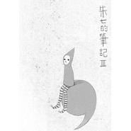

逗号，朱七的笔记III
============================

|  |  |
| :--: | :-- |
| [ 逗号，朱七的笔记III](https://emumo.xiami.com/album/32713) | **艺人**: [朱七](../index.md) **语种**: 国语 **唱片公司**: 柒音乐工作室 **发行时间**: 2007年07月07日 **专辑类别**: 录音室专辑 **专辑风格**: 城市民谣 Urban Folk **播放数**: 3325170 **收藏数**: 810 **评论数**: 61  |

## 简介

 
 

 
 

<strong>记忆往左模糊&nbsp;&nbsp;&nbsp; ，欲望向右描涂   
</strong>
 
  

 
 

  
<strong>序：逗号</strong>  
  
我在标点符号的世界里面，不亦乐乎了。  
  
那一年，将生命总结在“！”和“？”里面沾沾自喜，以为生命的意义，终究被我看见了，却在放弃音乐和坚持音乐的自我斗争中，发现了这个全新的命题，原来生命的永恒，竟然可能，是我们始终徘徊前后却无法摆脱的“，”。  
  
也许，真的是越来越诚实了，当我自以为是的那两张原本是结束意义的专辑，变成了我滞留音乐世界的起点之后，我看见自己在自欺欺人的过程中一层一层剥落，寻找到所有情绪、创意、梦境的理由，原来，记忆真的是一切的蛛丝马迹，原来一切都在大脑中有答案。于是我茫然，如果一切不能结束，我要如何去面对时间！  
  
这就是这张专辑的由来，从2003到2007，我不再急着结束，不再急着开始，我只是站在这里，看着自己跃过一个又一个逗号。看着人们，在努力写下感叹号、问号、句号以后，当岁月经过，时间打磨，又缓缓变回逗号的过程，看着生命一圈一圈的在那个看不到顶的楼梯口旋转，我们向前看，向后看，都不再看见真实的自己，只有残留的影像，折射出这一刻的真实。看着自己眼看要到的30岁真实年龄和苍老幼稚的真实心灵纠缠在一起的那个角色，在努力的面对这个世界。  
  
然后我决定，在我虚拟的世界中，忘记时间。  
  
我希望，这十三首歌，交出去的时候，能让小部分人，有松一口气的感觉，毕竟，我们只是在逗号边缘徘徊呀。我更希望，生活之外的那些问题与答案，我们可以一起来寻找，或者定义。  
  
这次的专辑，在创作的时候，也算在时空交错中跟华语流行音乐有更多的交汇，因为，有许多歌都与已经有的流行歌曲同名，一开始并没有意识到，后来才发现重复的概率太高，光良有《童话》、陈绮贞与周华健都有《1234567》、那英有《船》、范范有《永恒》、汪峰沈庆的《青春》、伊能静和彭靖惠都有《圣诞快乐》、许巍的《树》、SHE的《远方》，9首歌都是别人曾经写过的故事，我能不能写出自己的新意来，自己说了不算，还是请听者下结论吧，只要不当作这是一张翻唱专辑就好。  
  
那么，既然是逗号，就让这场戏，永无止境吧。  
  
  
<strong>歌曲介绍</strong> 
 
  

<strong>01--童话</strong>&nbsp;&nbsp;&nbsp;&nbsp;&nbsp;&nbsp;&nbsp;&nbsp;&nbsp;&nbsp;&nbsp;&nbsp;  
也许有一天，我们会回到原点，用幼儿园老师教我们的简单法则，勇敢的面对这个纷扰的世界，即使，那只是一些，小虚幻色彩的荒谬信念。&nbsp;
 
  

 
 
  

<strong>  
02--永恒（guitar版）</strong>&nbsp;&nbsp;&nbsp;&nbsp;&nbsp;&nbsp;&nbsp;&nbsp;&nbsp;  
我常常有个幻想的镜头，当深夜寂静，每个窗口，都上映着一个画面，上面有每个人的梦境，那将是多美的场景！我们真的，是有很多剧本的。&nbsp;
 
  

 
 
  

<strong>  
03--树</strong>&nbsp;&nbsp;&nbsp;&nbsp;&nbsp;&nbsp;&nbsp;&nbsp;&nbsp;&nbsp;&nbsp;&nbsp;&nbsp;&nbsp;  
杀死自己，变成一颗树然后死去？还是坚持做种子，老化再死去？这是一个问题。问题的核心是，我如何保证，那个长大了的我，还能明白现在的我的那些无法舍弃的乐趣，和情绪呢？&nbsp;
 
  

 
 
  

<strong>  
04--1234567</strong>&nbsp;&nbsp;&nbsp;&nbsp;&nbsp;&nbsp;&nbsp;&nbsp;&nbsp;&nbsp;&nbsp;&nbsp;&nbsp;&nbsp;&nbsp;&nbsp;&nbsp;&nbsp;&nbsp;&nbsp;&nbsp;&nbsp;  
事实是，我们每天丢失，每天拾拣，就这么周而复始的活着。突然在想，记忆丢失是完全无可察觉的，这真是值得害怕，呵呵。&nbsp;
 
  

 
 
  

<strong>  
05--不老</strong>&nbsp;&nbsp;&nbsp;&nbsp;&nbsp;&nbsp;&nbsp;&nbsp;&nbsp;&nbsp;&nbsp;&nbsp;&nbsp;&nbsp;&nbsp;&nbsp;&nbsp;&nbsp;  
我们还有没有勇气要求长生不老？拒绝未来，永远青春，这是良性的态度，还是恶性的，我并不确定。这是一个偏激的故事，讲述自欺欺人的悲伤。&nbsp;
 
  

 
 
  

<strong>  
06--远方</strong>&nbsp;&nbsp;&nbsp;&nbsp;&nbsp;&nbsp;&nbsp;&nbsp;&nbsp;&nbsp;&nbsp;&nbsp;&nbsp;&nbsp;&nbsp;  
他们又要出发了，从这里，到那里。旅行的意义，在于寻找自己，还是逃离自己？在秋天将至的一天，收拾、离开、再回来，而远方，一直都还在远方。&nbsp;
 
  

 
 
  

<strong>  
07--钢丝线</strong>&nbsp;&nbsp;&nbsp;&nbsp;&nbsp;&nbsp;&nbsp;&nbsp;&nbsp;&nbsp;&nbsp;&nbsp;&nbsp;&nbsp;&nbsp;&nbsp;&nbsp;&nbsp;&nbsp;&nbsp;  
我们都被骗了，人生是没有结局的，我们拥有的全部是逗号，在生命跨过一半以后，突然发现，接下来，只能看看重播画面，那，那，那该怎么办？&nbsp;
 
  

<strong>  
08--船</strong>&nbsp;&nbsp;&nbsp;&nbsp;&nbsp;&nbsp;&nbsp;&nbsp;&nbsp;&nbsp;&nbsp;&nbsp;&nbsp;&nbsp;&nbsp;&nbsp;  
希望父亲不要甘愿就这样老去，我相信，每一个人生阶段，都必然有我们所回忆的过去，所展望的将来，和所探索的未知。&nbsp;
 
  

 
 
  

<strong>  
09--Didadi</strong>&nbsp;&nbsp;&nbsp;&nbsp;&nbsp;&nbsp;&nbsp;&nbsp;&nbsp;&nbsp;&nbsp;&nbsp;&nbsp;  
你摆脱不了，无论你是否听得到，&nbsp;
 
  

 
 
  

<strong>  
10--时钟</strong>&nbsp;&nbsp;&nbsp;&nbsp;&nbsp;&nbsp;&nbsp;&nbsp;&nbsp;&nbsp;&nbsp;&nbsp;&nbsp;  
时间根本是个谎言，我们的等待、怯懦、希望，全部来自于此，谁说 20 岁一定要成长、 30 岁一定要结婚、 40 岁一定要成功、 60 岁一定要退休？证明给我看！&nbsp;
 
  

 
 
  

<strong>  
11--创世纪</strong>&nbsp;&nbsp;&nbsp;&nbsp;&nbsp;&nbsp;&nbsp;&nbsp;&nbsp;&nbsp;&nbsp;&nbsp;&nbsp;&nbsp;&nbsp;&nbsp;&nbsp;&nbsp;  
我以为，世界只是某一个孩子的一次意外的成果，谁知道呢？这是一个故事，一个信口开河的故事，在这个故事中，世界是树上结出的一颗果实。&nbsp;
 
  

 
 
  

<strong>  
12-- Merry X'mas&nbsp;&nbsp;&nbsp;&nbsp;&nbsp;&nbsp;&nbsp;&nbsp;  
</strong>我们在雪花纷飞的季节，笑脸相迎，闭上眼睛，许一个简单愿望，然后，安心的，迎接着下一个阶段的来临，无论富贵，或者贫穷。&nbsp;
 
  

 
 
  

<strong>  
13--永恒（piano版）</strong>&nbsp;&nbsp;&nbsp;&nbsp;&nbsp;&nbsp;  
我们，当然也只是一个故事，与白雪公主一样，无论我们的故事，画下什么样的结局，当故事里的时钟，不再往前嘀哒，我们和我们那些喜怒哀乐，就永远停留在那些青春岁岁月里，再不会老去
 

 
 

 
 

<strong>14--青春</strong>
 

看《与青春有关的日子》，最后一集，突然情绪上涌，就触及了这个以为永不会触及的命题，那些亲爱的朋友们，我们相互保存了彼此的青春，等有一天，回头，静静翻看
 

 
 

 
 

 
 

 
 

 
 

词曲/编曲/演唱：朱七
 

MIDI编写/吉他/口琴：朱七
 

音色统筹/鼓节奏：董磊
 

录音/混缩/母带：董磊
 

和声编写/和声：朱七
 

和声：Lillian（青春）
 

口白：施蕾小朋友（童话）
 

录音用琴：Taylor 714ce / Johnson JD16 / Gibson Lespaul Standard Premium Plus
 

原创插画/平面设计：曹七七 
 

 
 

 
 

 
 

 
 

 
 

 
 

<strong>忘不掉过去&nbsp;&nbsp;&nbsp;&nbsp;&nbsp;&nbsp;，猜不出未来</strong>  
  

## 曲目

## 评论

|  |  |  |
| :-- | :-- | :-- |
|  [虾米用户](https://emumo.xiami.com/u/319123612)  2017-10-02 10:40 赞(0) 踩(0) | 
666
 |
|  [虾米用户](https://emumo.xiami.com/u/9767916)  2016-10-26 22:26 赞(0) 踩(0) | 
MM:
 |
|  [虾米用户](https://emumo.xiami.com/u/1886211)  2015-06-05 21:24 赞(0) 踩(0) | 
青春听哭了！！！
 |
|  [虾米用户](https://emumo.xiami.com/u/2829710)  2015-03-14 17:27 赞(0) 踩(0) | 
好听
 |
|  [虾米用户](https://emumo.xiami.com/u/39235894) 响者，为乐。 2015-02-05 12:51 赞(0) 踩(0) | 
词很赞，精彩的一张集子，喜欢。
 |
|  [虾米用户](https://emumo.xiami.com/u/8244559)  2015-01-27 13:49 赞(0) 踩(0) | 
******
 |
|  [虾米用户](https://emumo.xiami.com/u/355865) Let it go, l... 2015-01-14 15:12 赞(1) 踩(0) | 
<a href="http://emumo.xiami.com/u/4275776" target="_blank" rel="nofollow" name_card="4275776">@320K专门店</a> 增加无损标签～
 |
|  [虾米用户](https://emumo.xiami.com/u/4240850) 我还没想好要写什么... 2014-12-24 20:28 赞(0) 踩(0) | 
双子座
 |
|  [虾米用户](https://emumo.xiami.com/u/1813584)  2014-11-30 22:39 赞(0) 踩(0) | 
晚上闭着灯 看着外面的灯光 听船 感觉很好
 |
|  [虾米用户](https://emumo.xiami.com/u/11259253) 听靓歌 2014-10-10 12:18 赞(0) 踩(0) | 
不错。
 |
|  [虾米用户](https://emumo.xiami.com/u/37767819) 梦游四方的人 2014-08-30 15:44 赞(0) 踩(0) | 
声音好棒
 |
|  [虾米用户](https://emumo.xiami.com/u/11045163)  2014-08-06 12:47 赞(0) 踩(0) | 
半梦半醒间听见 永恒 吉他版，狠狠惊艳一把，想听一个有故事的男人娓娓道来。很棒
 |
|  [虾米用户](https://emumo.xiami.com/u/5899808)  2014-03-31 22:25 赞(0) 踩(0) | 
為甚麼覺得永恆這麼耳熟！！！啊啊啊是有在什麼話劇或者劇裡出現過嗎！！！
 |
| ⇒ |  [虾米用户](https://emumo.xiami.com/u/7) 单恋木吉他 2014-04-02 10:00 赞(0) 踩(0) | 
没有呢～～～这个这个～～也没有抄袭啊，，哈哈哈～～～
 |
| ⇒ |  [虾米用户](https://emumo.xiami.com/u/5899808)  2014-04-02 20:47 赞(0) 踩(0) | 
<q><b>朱七说：</b></q>
 |
| ⇒ |  [虾米用户](https://emumo.xiami.com/u/542693)  2014-09-18 22:05 赞(0) 踩(0) | 
你去听听罗大佑的，你就知道了
 |
| ⇒ |  [虾米用户](https://emumo.xiami.com/u/542693)  2014-09-18 22:11 赞(0) 踩(0) | 
<q><b>朱七说：</b></q>
 |
| ⇒ |  [虾米用户](https://emumo.xiami.com/u/7) 单恋木吉他 2014-09-19 09:41 赞(0) 踩(0) | 
<q><b>Neves说：</b></q>
 |
|  [虾米用户](https://emumo.xiami.com/u/17090308) :) 2014-03-30 16:58 赞(0) 踩(0) | 
惊艳的感觉
 |
|  [虾米用户](https://emumo.xiami.com/u/15812950)  2014-03-13 23:09 赞(0) 踩(0) | 
喜欢
 |
|  [虾米用户](https://emumo.xiami.com/u/1609946) 一即一切 2014-03-10 09:21 赞(0) 踩(0) | 
心 境不二
 |
|  [虾米用户](https://emumo.xiami.com/u/23703381)  2014-01-14 00:17 赞(1) 踩(0) | 
心怀南方的细软，风筝、檐雨、夏天的尾巴……在他的歌词里一幕幕流转浮现，像霓虹灯初亮的雨后街头，常常教人有怅然的情绪。
 |
|  [虾米用户](https://emumo.xiami.com/u/3711647)   丢到马桶让水流 2013-11-30 14:06 赞(0) 踩(0) | 
‘记忆往左模糊，欲望向右描涂”好喜欢
 |
|  [虾米用户](https://emumo.xiami.com/u/4051682) 一往无前 2013-11-23 16:15 赞(0) 踩(0) | 
呜呜 声音像大叔
 |
|  [虾米用户](https://emumo.xiami.com/u/1008544) 暂无签名~ 2013-10-19 17:57 赞(0) 踩(0) | 
被小小的感动了下，心灵有了片刻的安宁
 |
|  [虾米用户](https://emumo.xiami.com/u/1020293) 十一月的莲花杀手 2013-10-03 00:29 赞(0) 踩(0) | 
第一次听到永恒就停不下来了
 |
|  [虾米用户](https://emumo.xiami.com/u/21710107)  2013-09-11 18:38 赞(0) 踩(0) | 
听他的歌  可以暂熄我灵魂里罪恶的灯
 |
| ⇒ |  [虾米用户](https://emumo.xiami.com/u/7) 单恋木吉他 2013-09-23 09:48 赞(0) 踩(0) | 
罪恶的灯，，，是什么呢？？？
 |
| ⇒ |  [虾米用户](https://emumo.xiami.com/u/21710107)  2013-10-30 13:49 赞(0) 踩(0) | 
<q><b>朱七说：</b></q>
 |
|  [虾米用户](https://emumo.xiami.com/u/222721) 一个在当地较为英俊的男子 2013-07-14 01:20 赞(0) 踩(0) | 
很真实，很纯粹的音乐。
 |
|  [虾米用户](https://emumo.xiami.com/u/14470757) 过路神仙 2013-05-24 04:39 赞(0) 踩(0) | 
正是我爱的，干净，一点点的惆怅，又不至于放不下
 |
|  [虾米用户](https://emumo.xiami.com/u/4275776) 虾米音质检测督查账号 2013-05-16 22:58 赞(0) 踩(0) | 
<a href="http://emumo.xiami.com/u/30705" target="_blank" rel="nofollow" name_card="30705">@beson</a> 这张是不是合格320K了？求回答
 |
| ⇒ |  [虾米用户](https://emumo.xiami.com/u/30705) 我还没想好要写什么... 2013-05-19 10:54 赞(0) 踩(0) | 
是啊，CD压的
 |
|  [虾米用户](https://emumo.xiami.com/u/1355259)  2013-03-18 19:04 赞(0) 踩(0) | 
非常棒的音乐，是一次偶然的机会听到了朱七的歌--青春，被震住了！非常感谢你带来的音乐！
 |
|  [虾米用户](https://emumo.xiami.com/u/11285320) Let it be 2012-11-29 22:07 赞(0) 踩(0) | 
想要收藏的CD
 |
|  [虾米用户](https://emumo.xiami.com/u/8335458)  2012-11-26 17:13 赞(0) 踩(0) | 
原创，安静的讲故事
 |
|  [虾米用户](https://emumo.xiami.com/u/4353365) fancy on 汐麥 2012-07-23 07:18 赞(0) 踩(0) | 
小清新
 |
|  [虾米用户](https://emumo.xiami.com/u/7903598)  2012-07-17 23:52 赞(0) 踩(0) | 
真实 简单   拨人心弦
 |
|  [虾米用户](https://emumo.xiami.com/u/3120102)  2012-07-14 01:06 赞(0) 踩(0) | 
童话故事，也可以唱出来。清新的味道。
 |
|  [虾米用户](https://emumo.xiami.com/u/5488177)  2012-06-27 12:46 赞(0) 踩(0) | 
赞！！！！！！！
 |
|  [虾米用户](https://emumo.xiami.com/u/8256913)  2012-06-01 19:10 赞(0) 踩(0) | 
喜欢
 |
|  [虾米用户](https://emumo.xiami.com/u/547627) 一台漫游银河系的机器人 2012-05-31 23:36 赞(0) 踩(0) | 
喜欢封面，简单，干净，带一点点的顽皮与不羁。听了一个晚上，所以是我喜欢的风格。这样的音乐，还有喜欢这种风格的听众，总是太少。
 |
|  [虾米用户](https://emumo.xiami.com/u/3738077)  2012-02-01 19:19 赞(0) 踩(0) | 
喜欢沙哑、深情的嗓音。
 |
|  [虾米用户](https://emumo.xiami.com/u/6781709)  2011-11-26 16:57 赞(0) 踩(0) | 
第一次听他的歌。他的声音能让你安静
 |
|  [虾米用户](https://emumo.xiami.com/u/2752) 岁月流淌 音乐相随 2011-09-09 14:11 赞(0) 踩(0) | 
一直最喜欢朱七的这张专辑，沙哑中带着生活的气息，里头最喜欢的曲子就是《远方》。
 |
|  [虾米用户](https://emumo.xiami.com/u/3255139)  2011-07-15 23:39 赞(0) 踩(0) | 
感觉
 |
|  [虾米用户](https://emumo.xiami.com/u/1890266)  2011-06-08 12:02 赞(0) 踩(0) | 
听完虾米里你的全部专辑，大多都挺喜欢的，喜欢的是这样唱这样写这样做音乐的感觉，在这几张碟里最喜欢的还是这张，喜欢这样的童趣。。。。。。
 |
| ⇒ |  [虾米用户](https://emumo.xiami.com/u/7) 单恋木吉他 2011-06-09 17:23 赞(0) 踩(0) | 
我也最喜欢这张。。。。
 |
|  [虾米用户](https://emumo.xiami.com/u/961289) 给无聊的生活来点背景音乐 2011-02-25 13:28 赞(0) 踩(0) | 
好音乐，好声音！舒服！
 |
|  [虾米用户](https://emumo.xiami.com/u/745907)  2010-11-26 09:50 赞(1) 踩(0) | 
那一年，将生命总结在“！”和“？”里面沾沾自喜，以为生命的意义，终究被我看见了，却在放弃音乐和坚持音乐的自我斗争中，发现了这个全新的命题，原来生命的永恒，竟然可能，是我们始终徘徊前后却无法摆脱的“，”。~ 就是这段话吸引了我~
 |
|  [虾米用户](https://emumo.xiami.com/u/961881)  2010-11-25 14:19 赞(0) 踩(0) | 
-- 我很喜欢。
 |
|  [虾米用户](https://emumo.xiami.com/u/687576) 分享疲惫灵魂中高贵的梦想 2010-09-02 22:01 赞(0) 踩(0) | 
树
 |
|  [虾米用户](https://emumo.xiami.com/u/14167) 加油吧 2010-07-01 09:54 赞(0) 踩(0) | 
这些托儿写的太明显了吧
 |
| ⇒ |  [虾米用户](https://emumo.xiami.com/u/7) 单恋木吉他 2010-07-13 14:36 赞(0) 踩(0) | 
熟人也可以写乐评的吧~~~~~~又不是去打榜~~哈哈~~~
 |
| ⇒ |  [虾米用户](https://emumo.xiami.com/u/1508851)  2010-10-09 13:45 赞(0) 踩(0) | 
<q><b>朱七说：</b></q>
 |
| ⇒ |  [虾米用户](https://emumo.xiami.com/u/288964)  2010-12-26 23:41 赞(0) 踩(0) | 
如果我能成为托儿的话 那也是挺幸运的 可以天天听原唱`！
 |
|  [虾米用户](https://emumo.xiami.com/u/337099)  2010-03-24 21:19 赞(0) 踩(0) | 
七子的，顶一下！
 |
|  [虾米用户](https://emumo.xiami.com/u/424676) 新版太虾米太难用太恶心！... 2009-12-17 23:23 赞(0) 踩(0) | 
好听
 |
|  [虾米用户](https://emumo.xiami.com/u/424676) 新版太虾米太难用太恶心！... 2009-12-17 23:23 赞(0) 踩(0) | 
好听
 |
|  [虾米用户](https://emumo.xiami.com/u/355865) Let it go, l... 2009-12-08 00:15 赞(0) 踩(0) | 
过来支持一下！~~~
 |
|  [虾米用户](https://emumo.xiami.com/u/239006) 经常听旧歌听到哭 2009-07-14 23:52 赞(0) 踩(0) | 
很感人的专缉
 |
