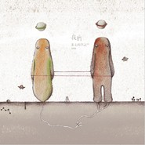

我们 I朱七的笔记IV
============================

|  |  |
| :--: | :-- |
| [ 我们 I朱七的笔记IV](https://emumo.xiami.com/album/415553) | **艺人**: [朱七](../index.md) **语种**: 国语 **唱片公司**: 散问音乐 **发行时间**: 2010年12月24日 **专辑类别**: 录音室专辑 **专辑风格**: 城市民谣 Urban Folk **播放数**: 5243193 **收藏数**: 1502 **评论数**: 281  |

## 简介

## 曲目

## 评论

|  |  |  |  |
| :-- | :-- | :-- | :-- |
|  [虾米用户](https://emumo.xiami.com/u/289526484) 由此即彼，所向无限。 2021-02-04 08:11 赞(0) 踩(0) | 
不管我们是小虾米还是大明星，我们都要好好的
 |
|  [虾米用户](https://emumo.xiami.com/u/85844462)  2019-04-14 09:44 赞(0) 踩(0) | 
我们很好听，喜欢小众民谣会起鸡皮疙瘩。
 |
|  [虾米用户](https://emumo.xiami.com/u/278465147)  2018-05-29 15:58 赞(0) 踩(0) | 
我们的年纪我们的过去。
 |
|  [虾米用户](https://emumo.xiami.com/u/15863951) 浮浮沉沉，何处而归 2016-11-25 10:10 赞(1) 踩(0) | 
我们，昨天分享到朋友圈，有好几个朋友就跟着分享了，由音乐串起来的我们的共同记忆
 |
|  [虾米用户](https://emumo.xiami.com/u/41952169) 啦啦啦啦 2016-11-17 16:01 赞(0) 踩(0) | 
还是，不一样的。这一首歌词中写到了很多人的特点，也有很多熟悉的歌词。但是，放太多进去我感觉有点杂。我听到的歌里的感情有点浅，会让我产生共鸣，但不会深刻到为他的感情欢喜或悲伤。
 |
|  [虾米用户](https://emumo.xiami.com/u/322686)  2016-08-05 16:14 赞(0) 踩(0) | 
毫无意义的口水歌
 |
|  [虾米用户](https://emumo.xiami.com/u/3067058)  2016-06-29 20:04 赞(0) 踩(0) | 
想求个  我们呢 的伴奏
 |
|  [虾米用户](https://emumo.xiami.com/u/159145870)  2016-05-02 17:18 赞(0) 踩(0) | 
第一次听，第一次喜欢
 |
|  [虾米用户](https://emumo.xiami.com/u/159145870)  2016-05-02 17:17 赞(0) 踩(0) | 
第一次知道朱七，喜欢你沧桑的声音，听着特有触感
 |
| ⇒ |  [虾米用户](https://emumo.xiami.com/u/347539510) 背叛 2019-04-12 13:00 赞(0) 踩(0) | 
你知道他是虾米创始人吗
 |
|  [虾米用户](https://emumo.xiami.com/u/478527) 好想跟衣服在洗衣机里滚 2015-07-13 19:40 赞(0) 踩(0) | 
每只蝴蝶的前世都是一片凋谢的花，这辈子竭尽飞翔只是来寻找那丝熟悉的香气，这，就是我们。
 |
|  [虾米用户](https://emumo.xiami.com/u/478527) 好想跟衣服在洗衣机里滚 2015-07-13 19:40 赞(0) 踩(0) | 
每只蝴蝶的前世都是一片凋谢的花，这辈子竭尽飞翔只是来寻找那丝熟悉的香气，这，就是我们。
 |
|  [虾米用户](https://emumo.xiami.com/u/8096817)  2015-05-16 11:30 赞(0) 踩(0) | 
上乘之作。
 |
|  [虾米用户](https://emumo.xiami.com/u/8096817)  2015-05-16 11:29 赞(0) 踩(0) | 
我要买CD，想用音响来听。
 |
| ⇒ |  [虾米用户](https://emumo.xiami.com/u/7) 单恋木吉他 2015-05-16 11:50 赞(0) 踩(0) | 
应该淘宝还买得到的
 |
|  [虾米用户](https://emumo.xiami.com/u/31184261) 没有音乐我们都会死吧。 2015-03-19 00:57 赞(0) 踩(0) | 
《我们》听着真是感动
 |
|  [虾米用户](https://emumo.xiami.com/u/42759896)  2015-01-11 15:17 赞(0) 踩(0) | 
钢琴声好好听~~
 |
|  [虾米用户](https://emumo.xiami.com/u/8244559)  2015-01-08 12:41 赞(0) 踩(0) | 
******
 |
|  [虾米用户](https://emumo.xiami.com/u/6635247)   2014-12-21 08:25 赞(0) 踩(0) | 
1111111111111111
 |
|  [虾米用户](https://emumo.xiami.com/u/6879371) 下次     会说的 2014-12-15 18:48 赞(0) 踩(0) | 
他自己写的 歌  自然写的 是自己唱的是自己   唱的是 一种感动
 |
|  [虾米用户](https://emumo.xiami.com/u/10435106) 听靓歌 2014-11-30 13:38 赞(0) 踩(0) | 
不错。
 |
|  [虾米用户](https://emumo.xiami.com/u/8070377) 爱雾瑞性维欧腐漏 2014-11-30 02:17 赞(0) 踩(0) | 
大叔嗓 很好听 蛮folk
 |
|  [虾米用户](https://emumo.xiami.com/u/13635727) Say, 2014-11-28 13:52 赞(0) 踩(0) | 
很赞
 |
|  [虾米用户](https://emumo.xiami.com/u/34369391)  2014-11-03 12:45 赞(0) 踩(0) | 
什么时候能听到你的现场呢？
 |
| ⇒ |  [虾米用户](https://emumo.xiami.com/u/7) 单恋木吉他 2014-11-19 22:45 赞(0) 踩(0) | 
我想，有机会的吧~~~
 |
| ⇒ |  [虾米用户](https://emumo.xiami.com/u/34369391)  2014-11-19 22:46 赞(0) 踩(0) | 
<q><b>朱七说：</b></q>
 |
|  [虾米用户](https://emumo.xiami.com/u/2694542)  2014-10-22 15:33 赞(0) 踩(0) | 
歌词写进心窝。感谢音乐陪伴我们成长！
 |
|  [虾米用户](https://emumo.xiami.com/u/34560345)  2014-08-16 10:19 赞(0) 踩(0) | 
听我们动容 想这一路走来歌声陪伴 相遇是福
 |
|  [虾米用户](https://emumo.xiami.com/u/88222) 暂无签名~ 2014-07-27 21:51 赞(0) 踩(0) | 
还以为是台湾的 结果不是 棒
 |
|  [虾米用户](https://emumo.xiami.com/u/29480609) 且听风吟 2014-05-21 05:59 赞(0) 踩(0) | 
夏天已过去这首歌 虾米给我推荐了得有十次了...咱能不推荐重样的么
 |
|  [虾米用户](https://emumo.xiami.com/u/34996656)  2014-04-07 15:58 赞(0) 踩(0) | 
诗人般的歌手 赞
 |
|  [虾米用户](https://emumo.xiami.com/u/34380475) 暂无签名~ 2014-03-24 16:32 赞(0) 踩(0) | 
只是喜欢。
 |
|  [虾米用户](https://emumo.xiami.com/u/1609946) 一即一切 2014-03-10 09:21 赞(0) 踩(0) | 
心 境不二
 |
|  [虾米用户](https://emumo.xiami.com/u/2634943)  2014-02-28 11:47 赞(0) 踩(0) | 
当代的黄舒骏
 |
|  [虾米用户](https://emumo.xiami.com/u/3448452)  2014-02-25 10:51 赞(0) 踩(0) | 
好听
 |
|  [虾米用户](https://emumo.xiami.com/u/6540129) 明日隔山岳，世事两茫茫 2014-02-19 23:02 赞(0) 踩(0) | 
封面总让我想到夏天。是因为有点像猕猴桃？
 |
| ⇒ |  [虾米用户](https://emumo.xiami.com/u/7) 单恋木吉他 2014-02-21 09:41 赞(0) 踩(0) | 
不是因为第一首歌是夏天已过去？？
 |
| ⇒ |  [虾米用户](https://emumo.xiami.com/u/6540129) 明日隔山岳，世事两茫茫 2014-03-04 21:18 赞(0) 踩(0) | 
<q><b>朱七说：</b></q>
 |
|  [虾米用户](https://emumo.xiami.com/u/11259253) 听靓歌 2014-01-24 17:14 赞(0) 踩(0) | 
不错，喜欢。
 |
|  [虾米用户](https://emumo.xiami.com/u/6874471)  2013-11-21 21:02 赞(0) 踩(0) | 
听到《夏天已过去》时，就被那沙哑的略带伤感的曲调吸引了
 |
|  [虾米用户](https://emumo.xiami.com/u/176710)  2013-11-20 18:56 赞(0) 踩(0) | 
夏天已过去。让人安宁的嗓音。
 |
|  [虾米用户](https://emumo.xiami.com/u/1020922) 让我看下签名是显示在哪儿 2013-10-13 20:59 赞(0) 踩(0) | 
封面好有趣！
 |
|  [虾米用户](https://emumo.xiami.com/u/11915620) 你可记得我们当时多勇敢。 2013-09-29 14:14 赞(0) 踩(0) | 
夏天竟然也这样忧伤、似曾相识。还是期待你会出现在街角 我想还是会不知所措的站在原地  伸不出的手和说不出的想念。我想我再也累积不出这么多的眷恋.....
 |
|  [虾米用户](https://emumo.xiami.com/u/22493473) 你尚在場的春夏秋冬，全美... 2013-09-20 16:32 赞(0) 踩(0) | 
温暖的男声，有故事的男声。
 |
|  [虾米用户](https://emumo.xiami.com/u/16926853) 与时光邂逅 2013-08-09 16:56 赞(0) 踩(0) | 
音乐像清风吹进心田，想流泪，想微笑，这一刻觉得世界好美好
 |
|  [虾米用户](https://emumo.xiami.com/u/16926853) 与时光邂逅 2013-08-09 16:56 赞(0) 踩(0) | 
音乐像清风吹进心田，想流泪，想微笑，这一刻觉得世界好美好
 |
|  [虾米用户](https://emumo.xiami.com/u/812620)  2013-07-28 15:25 赞(0) 踩(0) | 
没有原因
 |
|  [虾米用户](https://emumo.xiami.com/u/8556678) 蓝天永远在白云之上 2013-07-01 18:55 赞(0) 踩(0) | 
这几天一直在听，也习惯了回去翻歌词重新听几遍。刚才突然冒出几句熟悉的名字，串了升哥的歌名。时间的长链慢慢滑行，感动。谢谢！这些阴晴不定的天气里有你的声音真好！
 |
| ⇒ |  [虾米用户](https://emumo.xiami.com/u/7) 单恋木吉他 2013-07-05 13:52 赞(0) 踩(0) | 
是啊，时光若是能被记录，，，靠的就是这些个胡思乱想吧～～我猜～～～
 |
| ⇒ |  [虾米用户](https://emumo.xiami.com/u/8556678) 蓝天永远在白云之上 2013-07-05 23:31 赞(0) 踩(0) | 
<q><b>朱七说：</b></q>
 |
| ⇒ |  [虾米用户](https://emumo.xiami.com/u/7) 单恋木吉他 2013-07-06 23:30 赞(0) 踩(0) | 
<q><b>linger说：</b></q>
 |
|  [虾米用户](https://emumo.xiami.com/u/479322)   2013-05-09 14:50 赞(0) 踩(0) | 
说不上来的喜欢
 |
|  [虾米用户](https://emumo.xiami.com/u/6468961)  2013-03-19 22:39 赞(0) 踩(0) | 
歌词很有含金量，嗓子破了点，哈哈..挺有味道！
 |
|  [虾米用户](https://emumo.xiami.com/u/522205) 一切很美，音為有你﹏ 2013-03-14 16:20 赞(1) 踩(0) | 
有袁惟仁的味道和风格，现在才听到，内地还有如此沉淀值得细细聆听的好男声。我们，虽然作词手法以前已有先例，但仍不愧为一首“史诗性”的流行缅怀安魂大作，看着词听着听着，眼睛不禁湿润了，你呢？！
 |
| ⇒ |  [虾米用户](https://emumo.xiami.com/u/7) 单恋木吉他 2013-06-28 18:53 赞(0) 踩(0) | 
我写的也蛮感动的～～～技巧确实都是老的，幸好情感是真的～
 |
|  [虾米用户](https://emumo.xiami.com/u/410975)  2013-03-13 16:00 赞(0) 踩(0) | 
民谣
 |
|  [虾米用户](https://emumo.xiami.com/u/2078005) 我拥有的都是侥幸，我失去... 2013-02-19 18:34 赞(0) 踩(0) | 
听着他的歌总有种莫名感伤。
 |
|  [虾米用户](https://emumo.xiami.com/u/12170542)  2012-12-30 09:04 赞(0) 踩(0) | 
舒服
 |
|  [虾米用户](https://emumo.xiami.com/u/5623033) 我还没想好要写什么... 2012-12-13 12:42 赞(0) 踩(0) | 
沧桑的嗓音
 |
|  [虾米用户](https://emumo.xiami.com/u/4016779)  2012-12-10 17:55 赞(0) 踩(0) | 
怎么留不住如梭光阴哪些歌经过你的生命
 |
|  [虾米用户](https://emumo.xiami.com/u/3979337) 暂无签名~ 2012-12-03 21:35 赞(0) 踩(0) | 
很动人的一把嗓音
 |
|  [虾米用户](https://emumo.xiami.com/u/11285320) Let it be 2012-11-28 13:32 赞(0) 踩(0) | 
怎么留不住如梭光阴哪些歌经过你的生命
 |
|  [虾米用户](https://emumo.xiami.com/u/11285320) Let it be 2012-11-28 13:25 赞(8) 踩(0) | 
怎么留不住如梭光阴，哪些歌经过你的生命。对于这样的声音和旋律总是毫无招架之力，听着听着眼角就湿润了。谢谢朱七。
 |
|  [虾米用户](https://emumo.xiami.com/u/8337431) 以乐会友 2012-11-20 02:04 赞(0) 踩(0) | 
吉他动人
 |
|  [虾米用户](https://emumo.xiami.com/u/9517912)  2012-11-18 17:36 赞(4) 踩(0) | 
一个诗般的歌者  略显沧桑  当你一个人踽踽独行时  他的声音就是一种柔柔的想念  岁月翩跹  不变的是心境
 |
|  [虾米用户](https://emumo.xiami.com/u/6247421)  2012-11-11 00:57 赞(0) 踩(0) | 
喜欢这样沙哑低沉的男性声线。
 |
|  [虾米用户](https://emumo.xiami.com/u/824308)  2012-11-09 09:42 赞(0) 踩(0) | 
耳朵的享受，心灵的抚慰
 |
|  [虾米用户](https://emumo.xiami.com/u/1499749)  2012-10-22 18:08 赞(0) 踩(0) | 
民谣 朱七
 |
|  [虾米用户](https://emumo.xiami.com/u/3288490) 更行更远还生 2012-09-01 00:24 赞(0) 踩(0) | 
因为我们2才找到的，真的很好听，另外力轩，唱片也不错！
 |
|  [虾米用户](https://emumo.xiami.com/u/1091661) 我还没想好要写什么... 2012-08-21 12:43 赞(0) 踩(0) | 
我们
 |
|  [虾米用户](https://emumo.xiami.com/u/9955317)  2012-07-25 16:20 赞(0) 踩(0) | 
在后来的日子里，不断提醒着我，我们的相遇，是值得感恩的。
 |
|  [虾米用户](https://emumo.xiami.com/u/2521723)  2012-07-17 11:31 赞(3) 踩(0) | 
唱到我的心里去了，只有有过同样时间沉淀的过程的，才会有如此共鸣。
 |
|  [虾米用户](https://emumo.xiami.com/u/8112218)   2012-07-14 13:22 赞(0) 踩(0) | 
听了 觉得我果然错过了很多
 |
|  [虾米用户](https://emumo.xiami.com/u/8096817)  2012-07-05 14:23 赞(0) 踩(0) | 
我们听过相同的歌曲，如今你却在不经意的一瞬间，触动我最柔软的心弦，谢谢你，朱七，你出唱片实体版，我要买哦
 |
|  [虾米用户](https://emumo.xiami.com/u/9543691)  2012-07-05 12:15 赞(0) 踩(0) | 
简简单单就好
 |
|  [虾米用户](https://emumo.xiami.com/u/395158)  2012-07-03 15:03 赞(0) 踩(0) | 
时光的记录。
 |
|  [虾米用户](https://emumo.xiami.com/u/558374)   2012-07-02 09:26 赞(0) 踩(0) | 
本来喜欢嘶哑亢奋的民谣，朋友推荐了听了听，我们很好听。继续努力啊~加油↖(^ω^)↗
 |
|  [虾米用户](https://emumo.xiami.com/u/220719) 自知不自見，自愛不自貴 2012-07-02 07:43 赞(0) 踩(0) | 
重錄的一也發佈了，很快嘛。趕緊聽~~~
 |
|  [虾米用户](https://emumo.xiami.com/u/8622662) 暂无签名~ 2012-07-01 17:35 赞(0) 踩(0) | 
最喜欢我们  夏天已过去 ...
 |
|  [虾米用户](https://emumo.xiami.com/u/1912680)  2012-07-01 16:39 赞(0) 踩(0) | 
朱七的歌自己作词作曲很棒，我初步发现你的歌词和歌曲写得很认真，很用心，并不拘泥与章法，随意的歌词，小曲调，很柔动人的心！虽然有些地方转的比较生硬！
 |
|  [虾米用户](https://emumo.xiami.com/u/4851067)  2012-07-01 15:45 赞(0) 踩(0) | 
“夏天已过去”就像台剧“我努力不去爱你”
 |
|  [虾米用户](https://emumo.xiami.com/u/654083)  2012-07-01 15:11 赞(0) 踩(0) | 
cool!
 |
|  [虾米用户](https://emumo.xiami.com/u/4941959) 夢裡不知身是客 2012-07-01 14:50 赞(0) 踩(0) | 
这里先收藏着，回头去买碟。
 |
|  [虾米用户](https://emumo.xiami.com/u/979211)  2012-07-01 13:16 赞(0) 踩(0) | 
强烈支持七哥
 |
|  [虾米用户](https://emumo.xiami.com/u/318132) 抠啦 2012-07-01 10:17 赞(0) 踩(0) | 
七哥自己发布自己的专辑，噗
 |
|  [虾米用户](https://emumo.xiami.com/u/437466) 文不能测字武不能防身 2012-07-01 09:54 赞(0) 踩(0) | 
虽然不记得原来长什么样了，感觉我们一开始键盘就有好听到\\(╯-╰)/
 |
| ⇒ |  [虾米用户](https://emumo.xiami.com/u/7) 单恋木吉他 2012-07-01 10:06 赞(0) 踩(0) | 
对吧？？好听很多了呢～～～
 |
| ⇒ |  [虾米用户](https://emumo.xiami.com/u/437466) 文不能测字武不能防身 2012-07-01 10:07 赞(0) 踩(0) | 
<q><b>朱七说：</b></q>
 |
| ⇒ |  [虾米用户](https://emumo.xiami.com/u/7) 单恋木吉他 2012-07-01 10:10 赞(0) 踩(0) | 
<q><b>陆人甲说：</b></q>
 |
| ⇒ |  [虾米用户](https://emumo.xiami.com/u/437466) 文不能测字武不能防身 2012-07-01 10:11 赞(0) 踩(0) | 
<q><b>朱七说：</b></q>
 |
| ⇒ |  [虾米用户](https://emumo.xiami.com/u/7) 单恋木吉他 2012-07-01 10:14 赞(0) 踩(0) | 
<q><b>陆人甲说：</b></q>
 |
| ⇒ |  [虾米用户](https://emumo.xiami.com/u/654083)  2012-07-01 15:14 赞(0) 踩(0) | 
<q><b>朱七说：</b></q>
 |
|  [虾米用户](https://emumo.xiami.com/u/2604752) 理论乃灰色，生命之树长青 2012-07-01 09:23 赞(0) 踩(0) | 
重新录制的，扩散
 |
|  [虾米用户](https://emumo.xiami.com/u/4275776) 虾米音质检测督查账号 2012-07-01 09:00 赞(0) 踩(0) | 
重新录制啦？以前的版本不好是么？
 |
| ⇒ |  [虾米用户](https://emumo.xiami.com/u/7) 单恋木吉他 2012-07-01 09:09 赞(0) 踩(0) | 
几轨钢琴重录了～～～
 |
| ⇒ |  [虾米用户](https://emumo.xiami.com/u/4275776) 虾米音质检测督查账号 2012-07-01 09:21 赞(0) 踩(0) | 
<q><b>朱七说：</b></q>
 |
| ⇒ |  [虾米用户](https://emumo.xiami.com/u/7) 单恋木吉他 2012-07-01 09:24 赞(0) 踩(0) | 
<q><b>320K专门店说：</b></q>
 |
| ⇒ |  [虾米用户](https://emumo.xiami.com/u/4275776) 虾米音质检测督查账号 2012-07-01 09:25 赞(0) 踩(0) | 
<q><b>朱七说：</b></q>
 |
| ⇒ |  [虾米用户](https://emumo.xiami.com/u/7) 单恋木吉他 2012-07-01 09:26 赞(0) 踩(0) | 
<q><b>320K专门店说：</b></q>
 |
|  [虾米用户](https://emumo.xiami.com/u/9103824)  2012-06-21 20:22 赞(0) 踩(0) | 
支持
 |
|  [虾米用户](https://emumo.xiami.com/u/9528235) 东临碣石 以观沧海 2012-06-20 19:31 赞(0) 踩(0) | 
温柔细语
 |
|  [虾米用户](https://emumo.xiami.com/u/3497746) 不在乎这10分，我是来听... 2012-06-20 15:41 赞(0) 踩(0) | 
+1党 力荐 拿1分 哦也~
 |
|  [虾米用户](https://emumo.xiami.com/u/1246149)  2012-05-31 12:20 赞(0) 踩(0) | 
不知不觉中，我也奔四了，那些曾经的过往一点一滴浮上心头！
 |
|  [虾米用户](https://emumo.xiami.com/u/6651684)  2012-05-30 16:34 赞(0) 踩(0) | 
男人的温柔亦可动天,朱七 民谣
 |
|  [虾米用户](https://emumo.xiami.com/u/1402450)  2012-05-17 16:10 赞(0) 踩(0) | 
干净，清澈
 |
|  [虾米用户](https://emumo.xiami.com/u/1439725) 追寻灵魂的颤抖 2012-05-02 01:15 赞(0) 踩(0) | 
喜欢。。
 |
|  [虾米用户](https://emumo.xiami.com/u/2453869)  2012-04-19 13:10 赞(0) 踩(0) | 
时间渐渐流逝，很多很多的人都改变了，我们再也回不去的以前！珍惜现在，回望以前！这张专辑歌词很入味
 |
|  [虾米用户](https://emumo.xiami.com/u/979211)  2012-04-07 22:27 赞(0) 踩(0) | 
哭了
 |
|  [虾米用户](https://emumo.xiami.com/u/3812939)  2012-04-06 00:40 赞(0) 踩(0) | 
原来你是6月1号的生日？怪不得有一张娃娃脸，呵呵～谢谢你的歌，好听，喜欢：）
 |
|  [虾米用户](https://emumo.xiami.com/u/3812939)  2012-04-06 00:33 赞(0) 踩(0) | 
喜欢
 |
|  [虾米用户](https://emumo.xiami.com/u/3812939)  2012-04-06 00:32 赞(0) 踩(0) | 
字喜欢，曲喜欢，声音喜欢。
 |
|  [虾米用户](https://emumo.xiami.com/u/8084507) 可爱又迷人的反派角色 2012-03-14 11:29 赞(0) 踩(0) | 
我们那个年代的人和歌。
 |
|  [虾米用户](https://emumo.xiami.com/u/1268101)  2012-02-28 16:51 赞(0) 踩(0) | 
没有想到，一个男人唱的如此温柔。
 |
|  [虾米用户](https://emumo.xiami.com/u/3816964)  2012-01-01 20:16 赞(0) 踩(0) | 
不错，
 |
|  [虾米用户](https://emumo.xiami.com/u/5455583)  2011-11-06 21:49 赞(0) 踩(0) | 
《我们（都是小虾米）》，哈哈。
 |
|  [虾米用户](https://emumo.xiami.com/u/3247346)  2011-09-27 18:08 赞(0) 踩(0) | 
淡淡的思念
 |
|  [虾米用户](https://emumo.xiami.com/u/5917450)  2011-09-22 11:36 赞(0) 踩(0) | 
求夏天已过去的吉他谱额，呵呵。求啊。。。嘻嘻
 |
|  [虾米用户](https://emumo.xiami.com/u/1006504)  2011-09-01 21:54 赞(0) 踩(0) | 
应时应景，这城市大到不会同时下雨。朱小七加油！
 |
|  [虾米用户](https://emumo.xiami.com/u/5064088)  2011-08-04 21:37 赞(0) 踩(0) | 
找回记忆   的时光...
 |
|  [虾米用户](https://emumo.xiami.com/u/3255139)  2011-07-15 23:47 赞(0) 踩(0) | 
感觉
 |
|  [虾米用户](https://emumo.xiami.com/u/4457061)  2011-06-27 08:32 赞(0) 踩(0) | 
听着听着想起很多，有点想哭
 |
|  [虾米用户](https://emumo.xiami.com/u/3160169) 反方向的鐘 2011-06-23 10:30 赞(0) 踩(0) | 
不错喔小朱，歌声很有感觉
 |
|  [虾米用户](https://emumo.xiami.com/u/3160169) 反方向的鐘 2011-06-23 10:21 赞(0) 踩(0) | 
We R。
 |
|  [虾米用户](https://emumo.xiami.com/u/1890266)  2011-06-01 14:40 赞(1) 踩(0) | 
真妒忌你有这样念想和能写出这样的歌，真是喜欢陈升到了一个境界，我也巨喜欢但无才象他或象你这么去写去唱，那将是我一生的追寻和学习的。。。
 |
| ⇒ |  [虾米用户](https://emumo.xiami.com/u/7) 单恋木吉他 2011-06-07 11:19 赞(0) 踩(0) | 
加油喽。。。
 |
|  [虾米用户](https://emumo.xiami.com/u/1890266)  2011-06-01 14:35 赞(0) 踩(0) | 
喜欢陈升的音乐和做音乐的功力、态度。。。。。。学习的方向
 |
|  [虾米用户](https://emumo.xiami.com/u/329908)  2011-05-05 15:30 赞(0) 踩(0) | 
声音沙哑的性感~~
 |
|  [虾米用户](https://emumo.xiami.com/u/3276993)  2011-04-11 01:54 赞(0) 踩(0) | 
自由, 清新
 |
|  [虾米用户](https://emumo.xiami.com/u/102094) 我也假装自己是一个机器 2011-04-07 17:30 赞(0) 踩(0) | 
十年，二十年，三十年……我们呢？隔了好久，今天有空再仔细听这张专辑。原来不知不觉，已经是奔四的人了。
 |
| ⇒ |  [虾米用户](https://emumo.xiami.com/u/7) 单恋木吉他 2011-04-08 10:42 赞(0) 踩(0) | 
可不是，，，，眨眼三十多年。。。。
 |
| ⇒ |  [虾米用户](https://emumo.xiami.com/u/102094) 我也假装自己是一个机器 2011-04-08 12:20 赞(0) 踩(0) | 
<q><b>朱七说：</b></q>
 |
| ⇒ |  [虾米用户](https://emumo.xiami.com/u/287769) 听到耳朵怀孕。 2011-05-18 12:35 赞(0) 踩(0) | 
<q><b>朱七说：</b></q>
 |
| ⇒ |  [虾米用户](https://emumo.xiami.com/u/7) 单恋木吉他 2011-05-19 10:13 赞(0) 踩(0) | 
<q><b>莫善说：</b></q>
 |
| ⇒ |  [虾米用户](https://emumo.xiami.com/u/287769) 听到耳朵怀孕。 2011-05-19 21:09 赞(0) 踩(0) | 
<q><b>朱七说：</b></q>
 |
| ⇒ |  [虾米用户](https://emumo.xiami.com/u/7) 单恋木吉他 2011-05-20 10:14 赞(0) 踩(0) | 
<q><b>莫善说：</b></q>
 |
| ⇒ |  [虾米用户](https://emumo.xiami.com/u/287769) 听到耳朵怀孕。 2011-05-22 15:47 赞(0) 踩(0) | 
<q><b>朱七说：</b></q>
 |
|  [虾米用户](https://emumo.xiami.com/u/3296344)  2011-03-24 22:32 赞(0) 踩(0) | 
纯净
 |
|  [虾米用户](https://emumo.xiami.com/u/2097750)  2011-03-14 19:02 赞(0) 踩(0) | 
这样的声音，让人安心
 |
|  [虾米用户](https://emumo.xiami.com/u/1006504)  2011-03-13 21:38 赞(0) 踩(0) | 
歌词写得真好，一如既往支持你，少抽点烟吧。
 |
|  [虾米用户](https://emumo.xiami.com/u/1006504)  2011-03-13 21:35 赞(0) 踩(0) | 
十三月的卢总说了，朱七，杭州最好的民谣艺术家，不过烟抽多了，嗓子越发沙哑了，强烈推荐《我们》。
 |
|  [虾米用户](https://emumo.xiami.com/u/528) 日光之下并无新事 2011-03-10 13:33 赞(0) 踩(0) | 
文案寫得很文藝，編曲很懷舊，歌兒很憂傷。喜歡這張專輯，繼續歌唱吧，愛音樂的人！
 |
|  [虾米用户](https://emumo.xiami.com/u/2485494)  2011-03-10 07:30 赞(0) 踩(0) | 
非常有感觉， 实力还是比较重要的
 |
|  [虾米用户](https://emumo.xiami.com/u/2897654)  2011-02-21 13:41 赞(0) 踩(0) | 
好好聽
 |
|  [虾米用户](https://emumo.xiami.com/u/1331285)  2011-02-17 17:53 赞(1) 踩(0) | 
今天 元宵  礼物应该是朱七和他的音乐吧  就这么不动声色地唱过了我有意思以来所有美好与不美好的记忆生活和音乐不同  生活要难多了  还好朱七音乐 来温暖荆棘路上的一切艰辛@@
 |
|  [虾米用户](https://emumo.xiami.com/u/1662364) Corner 2011-02-12 12:22 赞(0) 踩(0) | 
。。。。。
 |
|  [虾米用户](https://emumo.xiami.com/u/1662364) Corner 2011-02-12 12:21 赞(0) 踩(0) | 
我们、沙哑的过去。
 |
|  [虾米用户](https://emumo.xiami.com/u/285096)  2011-02-07 16:53 赞(0) 踩(0) | 
听着听着，眼泪就下来了
 |
|  [虾米用户](https://emumo.xiami.com/u/2721275)  2011-02-07 13:01 赞(0) 踩(0) | 
：）  很喜欢你的歌。偶想买07的那张《笔记》，可否留个联系方式呢？
 |
| ⇒ |  [虾米用户](https://emumo.xiami.com/u/7) 单恋木吉他 2011-02-09 11:17 赞(0) 踩(0) | 
这个，，应该已经没有cd了，，多谢了～～～～
 |
|  [虾米用户](https://emumo.xiami.com/u/2751554)  2011-02-06 18:56 赞(0) 踩(0) | 
一首《我们》，拉近了你我的距离，让两个个体融合为一组羁绊
 |
|  [虾米用户](https://emumo.xiami.com/u/4915)  2011-02-01 16:00 赞(0) 踩(0) | 
我们 听了一个下午
 |
| ⇒ |  [虾米用户](https://emumo.xiami.com/u/7) 单恋木吉他 2011-02-12 00:35 赞(0) 踩(0) | 
:)
 |
|  [虾米用户](https://emumo.xiami.com/u/306093) 我还没想好要写什么... 2011-01-27 14:20 赞(1) 踩(0) | 
“我们” 这首歌真是好听。你是小虾米还是大明星呢 朱七不管我们彼此是什么，我们都有了远去的青葱记忆。这个冬天，依旧是暖暖的。很合适听这首歌。年关将至了，也终于快放假了，一年复一年，看岁月如何继续。
 |
| ⇒ |  [虾米用户](https://emumo.xiami.com/u/7) 单恋木吉他 2011-01-27 22:21 赞(0) 踩(0) | 
我是小虾米呀。
 |
| ⇒ |  [虾米用户](https://emumo.xiami.com/u/306093) 我还没想好要写什么... 2011-02-01 23:44 赞(0) 踩(0) | 
<q><b>朱七说：</b></q>
 |
| ⇒ |  [虾米用户](https://emumo.xiami.com/u/306093) 我还没想好要写什么... 2011-02-01 23:49 赞(0) 踩(0) | 
<q><b>朱七说：</b></q>
 |
|  [虾米用户](https://emumo.xiami.com/u/2394082) 容易上火 2011-01-27 02:00 赞(0) 踩(0) | 
不错噢
 |
|  [虾米用户](https://emumo.xiami.com/u/2525921)  2011-01-26 22:53 赞(0) 踩(0) | 
现在还能找到自己喜欢的歌喜欢的风格喜欢的词， 真不容易。鹏哥，谢了。
 |
| ⇒ |  [虾米用户](https://emumo.xiami.com/u/7) 单恋木吉他 2011-01-26 23:22 赞(0) 踩(0) | 
是认识我的人？？？
 |
| ⇒ |  [虾米用户](https://emumo.xiami.com/u/2525921)  2011-01-27 17:49 赞(0) 踩(0) | 
<q><b>朱七说：</b></q>
 |
| ⇒ |  [虾米用户](https://emumo.xiami.com/u/7) 单恋木吉他 2011-01-27 22:20 赞(0) 踩(0) | 
<q><b>歇斯底里说：</b></q>
 |
| ⇒ |  [虾米用户](https://emumo.xiami.com/u/2525921)  2011-01-29 21:14 赞(0) 踩(0) | 
<q><b>朱七说：</b></q>
 |
| ⇒ |  [虾米用户](https://emumo.xiami.com/u/7) 单恋木吉他 2011-01-29 21:18 赞(0) 踩(0) | 
<q><b>歇斯底里说：</b></q>
 |
| ⇒ |  [虾米用户](https://emumo.xiami.com/u/2525921)  2011-01-31 23:17 赞(0) 踩(0) | 
<q><b>朱七说：</b></q>
 |
|  [虾米用户](https://emumo.xiami.com/u/32138)  2011-01-26 17:51 赞(0) 踩(0) | 
很好听，歌词也很有意思
 |
|  [虾米用户](https://emumo.xiami.com/u/704599) 你是模特儿·我是香奈儿 2011-01-25 19:53 赞(0) 踩(0) | 
浓浓的怀旧风
 |
|  [虾米用户](https://emumo.xiami.com/u/2600121)  2011-01-24 15:07 赞(0) 踩(0) | 
声音很好听
 |
|  [虾米用户](https://emumo.xiami.com/u/2090975)  2011-01-23 00:47 赞(0) 踩(0) | 
原来，那年的夏天真的过去了……
 |
|  [虾米用户](https://emumo.xiami.com/u/32144) 我还没想好要写什么... 2011-01-21 02:07 赞(0) 踩(0) | 
舒服的曲调，太多感触的歌词，勾起了我的惆怅
 |
|  [虾米用户](https://emumo.xiami.com/u/1092184)  2011-01-08 23:39 赞(0) 踩(0) | 
怀旧的民谣风~
 |
|  [虾米用户](https://emumo.xiami.com/u/2416545)  2011-01-07 12:40 赞(0) 踩(0) | 
朱七，你让一切过往都清晰了。
 |
| ⇒ |  [虾米用户](https://emumo.xiami.com/u/7) 单恋木吉他 2011-01-27 22:21 赞(0) 踩(0) | 
看来有类似的记忆。。。。。
 |
|  [虾米用户](https://emumo.xiami.com/u/2390454)  2011-01-06 13:37 赞(0) 踩(0) | 
gagaga
 |
|  [虾米用户](https://emumo.xiami.com/u/2375203)  2011-01-02 22:49 赞(0) 踩(0) | 
10年過去了....我真的不敢相信在台北遇到你跟晨風...是的!!我們都在台北!!Nice to meet you!!!
 |
| ⇒ |  [虾米用户](https://emumo.xiami.com/u/7) 单恋木吉他 2011-01-03 18:01 赞(0) 踩(0) | 
2001-2011年，，看teyo还有什么表示不～～嘿嘿～～
 |
|  [虾米用户](https://emumo.xiami.com/u/183)  2011-01-01 13:47 赞(0) 踩(0) | 
《夏天已过去》是Pippin写的。真的，你们都在哪里呢
 |
| ⇒ |  [虾米用户](https://emumo.xiami.com/u/7) 单恋木吉他 2011-01-02 20:15 赞(0) 踩(0) | 
一个在杭州一个在北京，，你都知道的呀～～
 |
|  [虾米用户](https://emumo.xiami.com/u/183)  2011-01-01 13:46 赞(0) 踩(0) | 
新年听这么感伤的歌哦，突然觉得心里静了
 |
|  [虾米用户](https://emumo.xiami.com/u/1778484)  2010-12-31 21:12 赞(0) 踩(0) | 
他的歌都好像在说故事，我喜欢有故事的人唱有记忆，有故事的歌。这样才会影响每一个用心听歌的人
 |
|  [虾米用户](https://emumo.xiami.com/u/21898)  2010-12-29 18:16 赞(0) 踩(0) | 
最爱 夏天已过去
 |
|  [虾米用户](https://emumo.xiami.com/u/1619546)  2010-12-29 10:48 赞(0) 踩(0) | 
喜欢
 |
|  [虾米用户](https://emumo.xiami.com/u/2261477)  2010-12-29 01:06 赞(0) 踩(0) | 
前面 谁说的 朱七 快四十 了。。。。四十岁很老吗？ 还很年轻的，你到五十岁时 想想 自己 现在四十岁 不是还是非常年轻。。。声音很性感。。。
 |
| ⇒ |  [虾米用户](https://emumo.xiami.com/u/7) 单恋木吉他 2011-01-02 20:15 赞(0) 踩(0) | 
三十出头啦～～哈哈～～还好～～
 |
| ⇒ |  [虾米用户](https://emumo.xiami.com/u/2261477)  2011-01-15 13:14 赞(0) 踩(0) | 
<q><b>朱七说：</b></q>
 |
|  [虾米用户](https://emumo.xiami.com/u/2261477)  2010-12-29 00:53 赞(0) 踩(0) | 
a very nice guy's voice , NICE .
 |
|  [虾米用户](https://emumo.xiami.com/u/1577263)  2010-12-28 20:49 赞(0) 踩(0) | 
很喜欢《我们》，好像把自己逝去的年少时光奇妙得串起来，静静地怀念了一把。
 |
|  [虾米用户](https://emumo.xiami.com/u/339263)  2010-12-28 18:30 赞(0) 踩(0) | 
他离我们那么近，却有那么远。。。。。四十不惑的年纪，愿一切都好········
 |
|  [虾米用户](https://emumo.xiami.com/u/4007) 送你一句fuck off... 2010-12-28 16:14 赞(0) 踩(0) | 
听得我又要开始矫情了。唉，这是表扬呢还是表扬呢？
 |
|  [虾米用户](https://emumo.xiami.com/u/824)  2010-12-28 15:53 赞(0) 踩(0) | 
美丽新乐园哦，还是忘不了那个叫陈升的。
 |
| ⇒ |  [虾米用户](https://emumo.xiami.com/u/7) 单恋木吉他 2011-01-02 20:16 赞(0) 踩(0) | 
那就别忘呗。。。
 |
|  [虾米用户](https://emumo.xiami.com/u/1736210)  2010-12-27 23:37 赞(0) 踩(0) | 
听猪7的歌 让我得以一个人安静。
 |
|  [虾米用户](https://emumo.xiami.com/u/306093) 我还没想好要写什么... 2010-12-27 23:00 赞(0) 踩(0) | 
真是  好听的声音   不止喜欢朱七的歌  更喜欢的是朱七的声音
 |
|  [虾米用户](https://emumo.xiami.com/u/1867937)  2010-12-27 11:29 赞(0) 踩(0) | 
适合一个人怀旧。
 |
|  [虾米用户](https://emumo.xiami.com/u/2306345)  2010-12-27 11:08 赞(0) 踩(0) | 
sfsdddd
 |
|  [虾米用户](https://emumo.xiami.com/u/2290233) 衣不如新 人不如故 2010-12-27 10:15 赞(0) 踩(0) | 
老男银的声音 不错
 |
|  [虾米用户](https://emumo.xiami.com/u/40667)  2010-12-26 22:09 赞(0) 踩(0) | 
碰巧听到，有些小感慨：《我们》很适合做虾米网站的主题曲，可以改名叫《我们（都是小虾米）》，哈哈。其实朱七，每次的专辑都还是有进步的，《我们》的歌词很流畅，《2010》有了新的编曲，很妙很成熟。2003～2006我非常迷升歌，2006年去上海听了升哥的演出后就不再迷了，怀念那几年在全国升友群里的日子，teyo的新乐园网站现在好像也关了。。还有在武汉升友群里聊天的日子，以前大家还经常聚一起唱升歌的，现在大多结婚了，群里没人讲话了。。哎。。。武汉油价又涨了啊。。
 |
| ⇒ |  [虾米用户](https://emumo.xiami.com/u/7) 单恋木吉他 2010-12-27 13:45 赞(0) 踩(0) | 
teyo的网站搞不好在明年还会开哦～～～～
 |
| ⇒ |  [虾米用户](https://emumo.xiami.com/u/391752)  2011-01-06 18:39 赞(0) 踩(0) | 
”2006年去上海听了升哥的演出后就不再迷了“为啥呢？
 |
|  [虾米用户](https://emumo.xiami.com/u/2297931)  2010-12-26 17:51 赞(0) 踩(0) | 
第一次知道是朱七  是在魏勤私房乐关于滚石三十年的节目中  专辑很好听   特别是《我们》
 |
|  [虾米用户](https://emumo.xiami.com/u/1448790) 等者谢幕 2010-12-26 14:21 赞(0) 踩(0) | 
七七的歌声总让人想起许多~
 |
|  [虾米用户](https://emumo.xiami.com/u/611346)  2010-12-26 01:12 赞(0) 踩(0) | 
我难过了 ...
 |
|  [虾米用户](https://emumo.xiami.com/u/2291792)  2010-12-25 22:18 赞(0) 踩(0) | 
我觉得歌曲很特别 真诚 有点黄舒骏的味道
 |
|  [虾米用户](https://emumo.xiami.com/u/591422)  2010-12-25 21:07 赞(0) 踩(0) | 
很好听！
 |
|  [虾米用户](https://emumo.xiami.com/u/10265)  2010-12-25 19:22 赞(0) 踩(0) | 
喜欢~~  因为见过你 所以听着声音感觉特别身临其境 也特别亲切哈~~ 一如既往的支持~
 |
|  [虾米用户](https://emumo.xiami.com/u/220719) 自知不自見，自愛不自貴 2010-12-25 18:35 赞(0) 踩(0) | 
美丽新乐园2010 這歌詞串的真棒。
 |
|  [虾米用户](https://emumo.xiami.com/u/1674112)  2010-12-25 14:36 赞(0) 踩(0) | 
- -听的蛋疼
 |
| ⇒ |  [虾米用户](https://emumo.xiami.com/u/1052461) @blinK4sy- 2010-12-26 19:04 赞(0) 踩(0) | 
有点.
 |
|  [虾米用户](https://emumo.xiami.com/u/492630)  2010-12-25 13:37 赞(0) 踩(0) | 
非常不错。依然支持。。。
 |
|  [虾米用户](https://emumo.xiami.com/u/914895)  2010-12-25 13:27 赞(0) 踩(0) | 
美丽新乐园2010太牛逼了，听得想哭啊！！
 |
|  [虾米用户](https://emumo.xiami.com/u/582596)  2010-12-25 10:40 赞(0) 踩(0) | 
很怀旧的感觉，喜欢~~~
 |
|  [虾米用户](https://emumo.xiami.com/u/167591)  2010-12-25 01:44 赞(0) 踩(0) | 
你太狠了你，你这不等于年关找我收账嘛你……歌词传我一份。
 |
| ⇒ |  [虾米用户](https://emumo.xiami.com/u/7) 单恋木吉他 2010-12-26 13:01 赞(0) 踩(0) | 
播放器和单曲页面都有的啊，，，，而且，，年前要债，很正常吧～～～
 |
|  [虾米用户](https://emumo.xiami.com/u/15) 吃嘛嘛香 2010-12-25 01:10 赞(0) 踩(0) | 
带着美丽新乐园去找陈升~~
 |
|  [虾米用户](https://emumo.xiami.com/u/61601)  2010-12-24 23:40 赞(0) 踩(0) | 
恭喜朱七，出新碟。我现在仍然常常想起江林兵。
 |
| ⇒ |  [虾米用户](https://emumo.xiami.com/u/7) 单恋木吉他 2010-12-25 00:33 赞(0) 踩(0) | 
我也常常想起他～
 |
|  [虾米用户](https://emumo.xiami.com/u/2154978)  2010-12-24 23:24 赞(0) 踩(0) | 
岁月如歌般匆匆，歌如岁月般悠悠。
 |
|  [虾米用户](https://emumo.xiami.com/u/531172)  2010-12-24 18:22 赞(0) 踩(0) | 
为嘛里面歌词很多陈升的句子？
 |
| ⇒ |  [虾米用户](https://emumo.xiami.com/u/7) 单恋木吉他 2010-12-25 00:00 赞(0) 踩(0) | 
美丽新乐园就是给陈升歌迷们，，全部是陈升的歌名，，以及间奏是拷贝陈升的几个段子。。。。。
 |
| ⇒ |  [虾米用户](https://emumo.xiami.com/u/531172)  2010-12-25 13:45 赞(0) 踩(0) | 
<q><b>朱七说：</b></q>
 |
|  [虾米用户](https://emumo.xiami.com/u/611715)  2010-12-24 17:21 赞(0) 踩(0) | 
那啥，朱七耶，支持下，听听看
 |
|  [虾米用户](https://emumo.xiami.com/u/904461)  2010-12-24 17:18 赞(0) 踩(0) | 
YAY!SURPRISE!
 |
|  [虾米用户](https://emumo.xiami.com/u/676512) ¤電波星¤ 2010-12-24 16:34 赞(0) 踩(0) | 
支持大陆的民谣音乐！
 |
|  [虾米用户](https://emumo.xiami.com/u/368873)  2010-12-24 15:41 赞(0) 踩(0) | 
声音更成熟有味了.已经好久没有听你的歌,4年变化了好多这两年，这个时候，总是能听到七的歌，加油~
 |
|  [虾米用户](https://emumo.xiami.com/u/114815)  2010-12-24 15:29 赞(0) 踩(0) | 
看岁月如何继续
 |
|  [虾米用户](https://emumo.xiami.com/u/1563) 每周都在买补签道具卡图啥 2010-12-24 15:19 赞(0) 踩(0) | 
呀，朱七发片
 |
| ⇒ |  [虾米用户](https://emumo.xiami.com/u/7) 单恋木吉他 2010-12-24 15:23 赞(0) 踩(0) | 
哈哈～～去听美丽新乐园2010～
 |
| ⇒ |  [虾米用户](https://emumo.xiami.com/u/1563) 每周都在买补签道具卡图啥 2010-12-24 16:36 赞(0) 踩(0) | 
<q><b>朱七说：</b></q>
 |
|  [虾米用户](https://emumo.xiami.com/u/225073)  2010-12-24 14:27 赞(0) 踩(0) | 
很舒服的专辑啊。。。。今天下雪...正好听....~~
 |
|  [虾米用户](https://emumo.xiami.com/u/556073)  2010-12-24 14:10 赞(0) 踩(0) | 
最朴实的音乐  打动我的心~~
 |
|  [虾米用户](https://emumo.xiami.com/u/1947581)  2010-12-24 13:57 赞(0) 踩(0) | 
起床后听的第一张专辑很好听啊
 |
|  [虾米用户](https://emumo.xiami.com/u/1673053)  2010-12-24 13:44 赞(0) 踩(0) | 
不错 啊..
 |
|  [虾米用户](https://emumo.xiami.com/u/1902708) 我一直假装自己不是机器人 2010-12-24 12:58 赞(0) 踩(0) | 
很大的一份圣诞礼物！《我们》让我想起了当年的《改变1995》，唱腔很舒服，旋律很朴实。
 |
| ⇒ |  [虾米用户](https://emumo.xiami.com/u/7) 单恋木吉他 2010-12-24 14:16 赞(0) 踩(0) | 
是，，，跟改变一九九五的思维是很接近的，，，，，
 |
| ⇒ |  [虾米用户](https://emumo.xiami.com/u/1902708) 我一直假装自己不是机器人 2010-12-25 23:26 赞(0) 踩(0) | 
<q><b>朱七说：</b></q>
 |
| ⇒ |  [虾米用户](https://emumo.xiami.com/u/7) 单恋木吉他 2010-12-26 13:06 赞(0) 踩(0) | 
<q><b>YidaiYidai说：</b></q>
 |
|  [虾米用户](https://emumo.xiami.com/u/441881)  2010-12-24 12:22 赞(0) 踩(0) | 
朱七的圣诞礼物我收到了，越来越沙哑的声音，越来越自如的吟唱，这个声音不遥远，共鸣感就如同我们每个人都有个会唱歌的“闺蜜”他叫朱七！
 |
| ⇒ |  [虾米用户](https://emumo.xiami.com/u/7) 单恋木吉他 2010-12-24 14:16 赞(0) 踩(0) | 
闺蜜，，，，，哈哈～～～～压力大啊～～～～
 |
|  [虾米用户](https://emumo.xiami.com/u/355865) Let it go, l... 2010-12-24 12:05 赞(0) 踩(0) | 
SUPPORT!!!!
 |
|  [虾米用户](https://emumo.xiami.com/u/1662559) 哈哈哈哈哈哈哈 2010-12-24 11:53 赞(0) 踩(0) | 
很不错，老泪纵横。。。
 |
| ⇒ |  [虾米用户](https://emumo.xiami.com/u/29) 耍中偶得 2010-12-24 17:02 赞(0) 踩(0) | 
哈。
 |
|  [虾米用户](https://emumo.xiami.com/u/20) 自由爱恨，只因荣幸 2010-12-24 11:51 赞(0) 踩(0) | 
期待好多天啊！！！总算来了~这张非常非常好听
 |
|  [虾米用户](https://emumo.xiami.com/u/1756879)  2010-12-24 11:46 赞(0) 踩(0) | 
沧桑的声音
 |
|  [虾米用户](https://emumo.xiami.com/u/67285)  2010-12-24 11:44 赞(0) 踩(0) | 
美丽新乐园2010 ，带去台北吧带去台北吧。。。。
 |
|  [虾米用户](https://emumo.xiami.com/u/15) 吃嘛嘛香 2010-12-24 11:44 赞(0) 踩(0) | 
期待了这么久，终于来了！
 |
|  [虾米用户](https://emumo.xiami.com/u/437466) 文不能测字武不能防身 2010-12-24 11:41 赞(0) 踩(0) | 
出来了呐~
 |
|  [虾米用户](https://emumo.xiami.com/u/1798)  2010-12-24 11:40 赞(0) 踩(0) | 
好吧  继续沾沾自喜～嘻嘻嘻嘻
 |
| ⇒ |  [虾米用户](https://emumo.xiami.com/u/7) 单恋木吉他 2010-12-24 11:52 赞(0) 踩(0) | 
哈哈，，当事人来啦！！！！
 |
|  [虾米用户](https://emumo.xiami.com/u/789774)  2010-12-24 11:28 赞(0) 踩(0) | 
顶啊，封面美！
 |
|  [虾米用户](https://emumo.xiami.com/u/10516)  2010-12-24 11:07 赞(0) 踩(0) | 
牛呀
 |
|  [虾米用户](https://emumo.xiami.com/u/34958)   2010-12-22 10:11 赞(0) 踩(0) | 
封面很有想象空间。
 |
|  [虾米用户](https://emumo.xiami.com/u/226)  2010-12-21 17:41 赞(0) 踩(0) | 
朱七同学，今天我要写一篇文章关于“我们”，请尽快把EP做好后发给我一张，我在整个保险行业推荐！
 |
| ⇒ |  [虾米用户](https://emumo.xiami.com/u/64)  2010-12-22 04:19 赞(0) 踩(0) | 
保险行业?
 |
| ⇒ |  [虾米用户](https://emumo.xiami.com/u/7) 单恋木吉他 2010-12-22 04:22 赞(0) 踩(0) | 
可是雁兄，这次搞不好，，，只有网络版，，没有实体cd版，怎么办呢？？你的文章写好借我瞅瞅哇。。
 |
|  [虾米用户](https://emumo.xiami.com/u/29) 耍中偶得 2010-12-21 13:53 赞(0) 踩(0) | 
原来叫乌鸦少女，收录的一辑漫画恰好有类似主题，顿时起了画面感。
 |
| ⇒ |  [虾米用户](https://emumo.xiami.com/u/7) 单恋木吉他 2010-12-21 16:49 赞(0) 踩(0) | 
下一张叫乌鸦少女～～～～～属于纠结了N年的，，，还没正式动手做。。很慢很慢。。。
 |
| ⇒ |  [虾米用户](https://emumo.xiami.com/u/29) 耍中偶得 2010-12-21 16:57 赞(0) 踩(0) | 
<q><b>朱七说：</b></q>
 |
| ⇒ |  [虾米用户](https://emumo.xiami.com/u/7) 单恋木吉他 2010-12-22 04:25 赞(0) 踩(0) | 
<q><b>唐喜乐说：</b></q>
 |
|  [虾米用户](https://emumo.xiami.com/u/2241490)  2010-12-20 17:14 赞(0) 踩(0) | 
朱七老师，我要实体碟！RICE叉鸡
 |
| ⇒ |  [虾米用户](https://emumo.xiami.com/u/7) 单恋木吉他 2010-12-20 18:38 赞(0) 踩(0) | 
我知道你是叉鸡，，嘿嘿，，，实体碟目前没计划。。。我想，歌出来以后再说。。。。
 |
|  [虾米用户](https://emumo.xiami.com/u/10265)  2010-12-18 18:32 赞(0) 踩(0) | 
朱七大哥 加油哇~！
 |
| ⇒ |  [虾米用户](https://emumo.xiami.com/u/7) 单恋木吉他 2010-12-20 11:55 赞(0) 踩(0) | 
收到，哈哈～～
 |
|  [虾米用户](https://emumo.xiami.com/u/68546)  2010-12-17 23:09 赞(0) 踩(0) | 
好期待确实需要偶尔停一停，让感性压倒理性
 |
| ⇒ |  [虾米用户](https://emumo.xiami.com/u/7) 单恋木吉他 2010-12-20 11:55 赞(0) 踩(0) | 
恩，，是的，，需要感性下～～～～
 |
|  [虾米用户](https://emumo.xiami.com/u/6048)  2010-12-17 13:37 赞(0) 踩(0) | 
豆瓣里收到你的信了加油哇~新年好
 |
| ⇒ |  [虾米用户](https://emumo.xiami.com/u/7) 单恋木吉他 2010-12-20 11:55 赞(0) 踩(0) | 
就新年好了，，我们从12月一直可以新年好到2月份，，中国人幸福的～～～
 |
|  [虾米用户](https://emumo.xiami.com/u/67285)  2010-12-16 14:00 赞(0) 踩(0) | 
专辑封面谁设计滴！期待正式专辑有真人上封面~
 |
| ⇒ |  [虾米用户](https://emumo.xiami.com/u/7) 单恋木吉他 2010-12-16 15:40 赞(0) 踩(0) | 
不会有真人上封面的事情的，，哈哈·～～估计以后都不会有了，，这个就是正式的封面，，，我觉得很好啊，，，设计师叫做曹绮爻
 |
| ⇒ |  [虾米用户](https://emumo.xiami.com/u/67285)  2010-12-16 16:03 赞(0) 踩(0) | 
<q><b>朱七说：</b></q>
 |
|  [虾米用户](https://emumo.xiami.com/u/155947) 一期一会 2010-12-15 22:24 赞(0) 踩(0) | 
万众期待，老七快来，有预感此专辑要火……
 |
| ⇒ |  [虾米用户](https://emumo.xiami.com/u/7) 单恋木吉他 2010-12-16 15:41 赞(0) 踩(0) | 
是么………………
 |
| ⇒ |  [虾米用户](https://emumo.xiami.com/u/155947) 一期一会 2010-12-16 21:53 赞(0) 踩(0) | 
<q><b>朱七说：</b></q>
 |
|  [虾米用户](https://emumo.xiami.com/u/437466) 文不能测字武不能防身 2010-12-13 23:47 赞(0) 踩(0) | 
封面不是标点了哈~
 |
| ⇒ |  [虾米用户](https://emumo.xiami.com/u/7) 单恋木吉他 2010-12-14 00:02 赞(0) 踩(0) | 
标点，，以后还会出现的，哈哈～～～
 |
|  [虾米用户](https://emumo.xiami.com/u/648245)  2010-12-13 15:03 赞(0) 踩(0) | 
值得期待“我们”
 |
|  [虾米用户](https://emumo.xiami.com/u/264)  2010-12-13 14:31 赞(0) 踩(0) | 
我们的关系很紧绷，，我们思维像不同的星球，，转身就走，，，却发现原来就走不远。担心其彼此生厌，不如把侧面留给你，一起面对来听故事的他们。
 |
| ⇒ |  [虾米用户](https://emumo.xiami.com/u/7) 单恋木吉他 2010-12-14 16:15 赞(0) 踩(0) | 
这是弟弟对封面的注释喽。。。。
 |
|  [虾米用户](https://emumo.xiami.com/u/15) 吃嘛嘛香 2010-12-13 14:12 赞(0) 踩(0) | 
当忧伤的文字和旋律喷涌出来，那个阳光的胖子又回来了。“后来，我们终于遇见彼此，发现记忆重叠的美。”在温暖的烟雾里，我们相视而笑。
 |
| ⇒ |  [虾米用户](https://emumo.xiami.com/u/7) 单恋木吉他 2010-12-13 15:04 赞(0) 踩(0) | 
当忧伤的文字和旋律喷涌出来，那个阳光的胖子又回来了。————怎么看都是矛盾的哇
 |
| ⇒ |  [虾米用户](https://emumo.xiami.com/u/15) 吃嘛嘛香 2010-12-13 15:09 赞(0) 踩(0) | 
<q><b>朱七说：</b></q>
 |
| ⇒ |  [虾米用户](https://emumo.xiami.com/u/7) 单恋木吉他 2010-12-13 15:29 赞(0) 踩(0) | 
<q><b>Av说：</b></q>
 |
|  [虾米用户](https://emumo.xiami.com/u/20) 自由爱恨，只因荣幸 2010-12-13 13:57 赞(0) 踩(0) | 
想听！光从封面和歌名来看就很喜欢了~
 |
