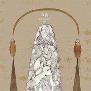

我们 II朱七的笔记IV
============================

|  |  |
| :--: | :-- |
| [ 我们 II朱七的笔记IV](https://emumo.xiami.com/album/523389) | **艺人**: [朱七](../index.md) **语种**: 国语 **唱片公司**: 散问音乐 **发行时间**: 2012年07月07日 **专辑类别**: 录音室专辑 **专辑风格**: 当代民谣 Contemporary Folk, 国语流行 Mandarin Pop **播放数**: 2005260 **收藏数**: 1652 **评论数**: 304  |

## 简介

auto;text-align:left;mso-pagination:widow-orphan">2012年7月提示：实体专辑为双碟装，其中<a href="http://www.xiami.com/album/415553">《我们I》</a>专辑钢琴部分已请键盘手重新录制。&nbsp;  
<strong>  
我们——</strong>  
究竟是什么样的联结，才能让我和你，变成“我们”？  
  
我们，是一个常用单词，用来区别“你们”或“他们”。当孤孤单单的一个你，和孤孤单单的一个我，在特定时空下形成了“我们”，然后，很多事情开始发生，经历又远去，变成回忆。偶尔回头，你有没有去细细数过，过去，你曾经拥有过多少个“我们”？  
  
人以群分，人们总是喜欢用一些规律对万事万物进行区分，比如灵长类，比如三年级四班，比如90后，比如浙商，比如坏人们，这些利用地域、时间、阶级等参数硬生生划下的，是那些不由自主成为“我们”的人们。我跟许多朋友无情的说过：“我们，都是被迫才认识的吧”。若不是我被命运安排读了这个专业，找了这份工作，或访问了这个网站，我们怕是一辈子，都成为不了“我们”的。  
  
“我”确实是孤独的，而“我们”总是能基于群体效应，冲淡了些许的孤独感，衍生出了些许情感。一路走来，我看见，我和我心里的自己，构成了我们；我和那个爱着的女生，构成了我们；我和那些一样都是狂热歌迷的朋友们，构成了我们；我和这个城市里正打拼着的奔四族群，构成了我们；我和这个时代所有迷茫的青年人，构成了我们；我和整个人类，构成了我们。区别于“他们”的，便成了我们。  
  
于是，那些散落在时光两侧的零碎的词，或者曲，继续慢慢的汇拢，一张EP变成了两张EP，变成了更加复杂的“我们”，也终于拥有了厚厚的内页和实体光碟，转眼两年。那些歌们，排列成行，就像每一首歌，也都找到了组织，变成了他们所拥有的“我们”，集结成册。  
  
这里的7+1首歌，并不算是如何如何精心规划且拥有什么样的野心的歌曲，实际上，我非常清楚的看见自己，在重复着过去的一些欲念和想法，是逗号专辑时期的想法。虽然时隔5年，我却并未走出之前拥有的矫情与表达方式，依然絮絮叨叨的喃喃自语着，或许，只是多了一些，与现实有关的牢骚吧。  
  
我们的联结，在于我们真的，共同身处在这个时代，逃避不开，或许良性或许恶性的情绪，你我都有。我猜，我们都很认真的在面对这个社会，认真的希望我们的生活变得好一点，更好一点，反正，路总有高低曲折，面对了，也就是了。  
  
所以结绳记事，又一次，朱七的笔记……  
  
<strong>这些歌——</strong>
 

auto;text-align:left;mso-pagination:widow-orphan">  
乌鸦少女  
作词作曲：朱七  
  
2011年12月4日，周日，我在电脑中发现一个2007年9月9日就已录好的demo文件，似乎只有2个和弦在一直反复，一直反复，然后我决定，把这首歌填上词，命名为《乌鸦少女》。  
  
乌鸦少女是一张我自己等了很久，念头始于2003年，歌曲大多完成在2006年，却至今未发表的一张专辑。那张专辑，我要跟两位多年后已为人妇的她们进行合作，她们是我心中的“乌鸦少女”。于是，抱着一种不好意思的心境，我写歌留念。  
  
笑颜如花的少女，内心也有黑色的一面吧？我猜，任何一位细腻敏感的女生，都曾有厌世绝望的一瞬间吧？她的心中，有一个曾经华丽却老旧破败的花园，有旋转木马，有木质秋千，有繁花似锦。远处的街道，喧嚣热闹，人群汹涌，观点四散。从泛黄的窗户看出去，世界像加了滤镜，无趣到了极点，虚伪包装着热情，各种冷漠表情，不过是一些黑了又白，白了又黑的无聊重复。  
  
于是，略开的心又关了起来，枯坐在5平方米的空间里面，慢慢撕掉所有的书本、日记和信。魔鬼一直在窗外敲打，好像有什么话要说，一转身又朝着涂满油彩的人群飞去了，像一只乌鸦。“要是一切都毁灭了，反而更干净些吧”，她想着，把天使从鸟笼中抓出来，用毛笔沾上墨汁，慢慢的，全部涂成黑色。  
  
这便是，我心中，乌鸦少女的阴暗，送给，小尘，和曹七七。  
  
烟  
作词作曲：朱七  
  
2011年11月5日，我和那些个曾经并肩作战的好朋友们，照例聚在他家里，满满一桌菜，各种酒，毫无意外的喝醉了。烟味混杂着酒味和眼泪，还有基于友情的争论和不经意的相互伤害。我们都任性的活了三十几年，我们都自以为成熟，却幼稚的像个小孩。第二天，宿醉的我呆呆的坐在西湖边，和另一位相互见证了成长的朋友，一壶普洱茶，一包烟，一个下午的话，说着我们的过去和现在……  
  
第三天星期一，我坐在办公室里，抑制不住写歌的念头。歌里的那些事，就是我们现在正在面对着的事，真真切切，如假包换。青黄不接这四个字，在我脑中，却已经隐隐约约了好多年；新陈代谢这四个字，从我大舅舅葬礼那天，就一直印在我的心上。生命究竟是个什么样的过程？越来越大以后，却越来越没有时间去思考这些东西。三十几岁的男人，早就应该学会，把家庭的重任扛在肩膀上了吧。我们似乎，只剩下了，忙碌的资格。  
  
慢慢的，一直带着我们成长的人们，要一个个的离开了，舍得不舍得，在生离死别面前，是显得多么的无力！而在这个时代出生的怪小孩，将要长久的占据我们的时间和精力了，你必须要挺住，才能让大家幸福，哪怕明知棱角逐渐圆润，个性逐渐平庸，兴趣逐渐遗忘。妥协了吗？这个命题甚至都已经不再被提起，不是吗？在这个生活起来绝不轻松的时代，我们背着重重的包袱，用尽全力，想要昂首挺胸的面对将来。  
  
所以，谁也没能，真的戒了烟。  
  
所以，总有许多时候，我们需要点上一根烟，吐出一口气，或许伴随着，毫无痕迹的一声叹息。  
  
这首歌，给所有，三十而立，尚未知天命的男人们。  
  
大时代  
作词作曲：朱七  
  
要对这个时代做一个什么样的鬼脸呢？  
  
我又一次在电脑里面找到一段不错的情绪，记录于2008年4月26日，一段带有痞子气味的微薄怒气，不知道，那个时候，我在抱怨着什么。关于每一个时代，每个时代下正在亲身经历的人，总是有这样那样的苦与乐。于是，那句话被一而再再而三的引用着：最好的时代？最坏的时代？呵呵，跟我们自己有关的东西，不管是什么，哪怕是坏，我们也喜欢在前面加上一个最字，似乎，这样便证明了，我们与历史长河的前辈后辈们相比，多获得了一些什么？ 
 
  

这个世界一直在变，也一直在挑战着我们的极限，1989年的崔健眼里的高楼林立与交通堵塞，若是已经到了不明白的地步，那20几年以后的我们，情何以堪？现在，甚至连“拜金主义”都变成了一个过气的单词，所以这天翻地覆的三十几年，你活得有安全感吗？
 
  

这是一个多么繁华的时代！每个城市里面都有那么多人，那么多钱，那么多机会，那么多爱好，那么多个性，那么多奇迹，那么多生活方式，那么多无可奈何，那么多荒诞不经，那么多天灾人祸……
 
  

你眼前是不是看起来有一万个机会出人头地？你是不是在真实生活的实验中，发现那些机会与海市蜃楼有着雷同的效果？你是不是觉得百万富翁这个单词，真心弱爆了？你是不是觉得有些东西非常非常讨厌可是你似乎又没能力去打破？你是不是在偶尔的某一个瞬间觉得自己要的太多了可是又欲罢不能？你是不是甚至都蛮讨厌自己的？然后，眼泪，突然，掉了下来……
 
  

如果可以，请打好领带，静心等待。这个时代并不比任何一个时代出色，也不比任何一个时代逊色。
 
  
唯一不同的，是我们，身在其中，而已。   
  

auto;text-align:left;mso-pagination:widow-orphan"> 
 

聋
 

作词作曲：朱七
 

 
 

auto;text-align:left;mso-pagination:widow-orphan"> 
 

我是一个戴着耳机过活的人。
 

 
 

1998年，大三，我写了一首叫做《聋》的歌，以前的我，会用纸笔将词曲记录下来，在一个特别普通的便利店就能买到的本子上，那个本子的封面是一个浅绿色的朦胧少女，依稀记得，是大学同班女同学送的。这首歌，始终没有被录成音频，因为我觉得不够好听。
 

 
 

可是，这么多年，我从未忘记这一句歌词：“这一路走过，一直期待有人对我说，他告诉我用我自己的耳朵，倾听白云飞过”，白云飞过有声音吗？可以有声音吗？为什么不可以有声音呢？对于某些，在青春期略带自闭症倾向的我们来说，这个世界，并不是那么容易亲近的。所以，我总是戴着耳机，让我的世界充满着背景音乐，而那些真实发生着的声音，被我统统拒绝。我们以一种怯懦的姿态，些微的距离感，取了这个世界一部分视觉元素，然后，加上自己，漫无边际的想象，拼接出了一个，后来被人们称为“小宇宙”的东西。
 

 
 

我想，我是无法真实确定，聋了的人的生活，是更单调，还是更丰富的。可是，当意念流转，这个宇宙不是有一半的创作权在我们手里吗？所以，在这个我自己偷偷把玩的小戏法中，我的世界，多了很多声音，太阳升起的声音，星星闪烁的声音，花朵绽开的声音，彩虹横跨的声音，蒲公英飞过的声音，细雨漫天的声音……这样，能让我们的世界，更辽阔一点吗？一点点也好！
 

 
 

2011年5月24日，我抱这样的心，用我最擅长的韵脚，重新写了一首叫做《聋》的歌，其中有一句，词和曲，我保留着1998年的版本，丝毫未动。
 

 
 

我还是会继续戴着耳机生活下去，还是会努力，与这个真实的世界，保持些微的距离感。
 

 
 

你要不要也试试看？
 

 
 

 
 
  

auto;text-align:left;mso-pagination:widow-orphan"> 
 

只有我们
 

作词作曲：朱七
 

 
 

 
 

auto;text-align:left;mso-pagination:widow-orphan"> 
 

我是一个害怕宠物的人。
 

 
 

从很小的时候开始，我似乎就不太愿意面对各种小动物，因为，我不敢直视他们的眼睛。
 

 
 

我们的体验，和我们学到的知识，往往大相径庭。据说，只有人类是有意识能表达的动物，这个说法我始终难以从真实的生活中体会到。灵长类里面的某一个群体，统治了地球，开始不记得自己是动物，并建立了许多这个群体特殊的生活方式且沾沾自喜着。就像，某个成功发财的老板，开始不记得自己小学毕业，脱离了从小长大的朋友圈，开了间会所，只接待贵族富豪，拒绝所有小学同学。请问，这两件事情之间，有本质的区别吗？
 

 
 

或者，我将他们当作与我们一样的生命来尊重；或者，我将我们当做与他们一样的生命来看待。只有这两种选项，我想。
 

 
 

人类是一个多么奇怪的群体啊，我们有那么那么多的事情，是只有我们才能做，他们绝不能做的。因为，我们是人，他们是动物，一条界线划下，清晰可见，这条线的这边只有一种东西，那边却有成千上万种东西。我们写字，我们盖楼，我们道貌岸然，我们还裹着各种布料，我们躲进由橡胶和铁皮做成的东西里面快速移动，我们竟然在“人”里面又进行了层层叠叠的划分，我们妄想杀戮后还能进入天堂，我们甚至一直在吃他们。他们那？他们似乎一直只在做一件事情，叫做生存。
 

 
 

抬头看天，听说，远古的世界，人神魔并存，人类也曾像动物般，被随意荼毒，呼来喝去。这是一种苦尽甘来的自然演变吗？或者，神话由人创造，神话中，神就是人，人则是动物，是么？
 

 
 

只有我们，只有我们，只有我们，才能学会，不去相信人，去讨好宠物。
 

 
 

 
 

真是讽刺。
 

 
 

 
 
  
  

 
 

绿茶
 

作词作曲：朱七
 
  

2009年，为吉他手卢山多年前创作的一首表白歌曲填词，试着肉麻了一把，名为《绿茶》。后来他纠结再三决定不用。为免铺张浪费，我自己写了个曲子，成为了现在的模样。
 
  

写词的时候，脑子里面一直出现“相亲”场景，混杂着传说中的大学男生死皮赖脸追求女生的某一种耍宝心态。我不清楚现在的大学校园里面，男生都是怎么死皮赖脸追到女生的，却从各种信息渠道明白，相亲依然是现代男女走入婚姻殿堂的一种重要手段。人们排排站，像在大型商场购物一样，种类、型号、价格，交错选择，各种与相亲有关的段子，在各种渠道流传着，蛮荒诞的。
 
  

哪怕是一次相亲，我们可不可以就这样面对面坐着，泡一杯茶，忘掉那些社会参数，好好的聊上一次天呢？
 
  

死皮赖脸的，面对着一个女生，试着去聊一次天，用浑身解数，博姑娘一笑，动用星座、电影、音乐、地理、经济、笑话、哲学、宗教、天气、服装……当男生女生相互表白时，肉身内基于欲望驱动而爆发出来的创意能量，是千万不能小觑的。但是千万不要气馁，你知道，她们总是喜欢，在最后一刻，才笑出来的！
 
  

就好像，我只是模拟了一次肉麻的过程，就各种胡言乱语了，哈哈。 
 
  
  
  

我们的世界
 

作词：朱七 小皮 力轩 小彭&nbsp;作曲：小彭 
 
  

 
 

2012年4月20日，口琴小彭巡演到杭州，蜜桃咖啡。结束后，他说，那首刚刚全场合唱过的歌，还没有发表，问我，有没有兴趣，翻唱一下。我想，既然这张专辑叫做《我们》，而这首歌叫做《我们的世界》，那么，就加一首，应当问题不大，于是这张EP，就变成了7+1的曲目。
 
  

我决定把小皮和力轩拖下水，果然一拍即合。这是三个，处在不同阶段的男人，分别是未婚，已婚无子和已婚有子，我想，大框架之下的男人，也就这三种状态吧。仅仅两个周六，我们完就成了创意和录音，很有趣，应当没有过，类似于这样的歌吧。在聊出创意的那个晚上，三个人分别被关在三个房间里面，大约半小时，各自写出，心目中的那个他，是什么样子。深蓝光圈的阿福，也希望我们三个，既然都在做专辑，是不是可以有一些联系，有一些系列化或者抱团的形式出现，刚好，这首歌，能串起这三个人。
 
  

因为整个过程很自然，所以，我想，这首成果，应该也很自然吧。歌里面，是我们三个人眼中的彼此，未必是真相，却相当的真实。因为，我们的生活里面，并没有背负太多的愤青视角，所以这么大的题目，也没出现更多的社会批判、哲学研判或政治评论，真的，就是三个，喜欢音乐的人，各自的阶段，哪怕，力轩在描述我的时候，用了3次“胖子”这个单词，嘿嘿。
 
  

我们的世界，或许不是你的世界，但是，你也有，自己的真实世界，对吧？ 
 
  
  
  

 
 

半截人生
 

作词作曲：朱七
 
  
  

 
 

2012年3月22日中午，和老唐一起吃嵊州炒年糕，偶然聊起，这几年的变化。我说，以前的我们就像在演戏一样，很较真。她说，现在的自己，和以前的自己，像是两个人，竟然那么不同，以前会留恋痛感，现在竟然也懂得更平和了，然后她说，不然，你写首歌吧。
 
  

然后我真的写了一首歌，用来纪念，前半生和后半生的截然不同。至于是不是真的那么截然不同，也说不好，或者就又是一种矫情的表达吧。
 
  

当年轻时候没来由的自信、勇气和大无畏的悲观主义随着岁月渐渐淡泊，随着胡子越来越长，我们也终于更认真的面对生活本身，面对自己本身。如果说，那些年更像在演一场戏，自己模拟了某些老旧剧情跌宕起伏的剧本，自己征集了观众，然后投入的忘情。现在则更像一出平淡如水的剧，吃喝拉撒，朝朝暮暮，找不到什么值得大书特书的桥段，简简单单，平平淡淡。生活的细节之美，也就随着这样的变化，逐渐浮现了出来。
 
  

所谓的成长，就是将自己从主角中抽离的过程吧。
 
  

越入世，就越出世，越有非成功不可的理由时，也就越有了，放下一切的能力。我依然怀念过去那些热情和偏执，手腕上的烟疤，还清清楚楚的在那儿。只是，酒喝的少了，开始三思而后行了，也不再追求违背逻辑的那些奇迹了，时光滴答流逝，我们的倒数计时已经开始，便细细去咀嚼，用心去珍惜。
 
  

剩下一个自己，和时光，静静交谈。
 
  
  
  

后言：
 
  

这是一个玩物明志的小时代。
 
  

于是，我一次又一次的规划起自己的某一种“消费行为”，像女生攒很久的钱去买一个名牌包，像驴友们筹备很久的一次长途旅行。我终于还是没忍住，要把2010年就发表的5首歌，加上这里的8首歌，弄成一整张实体专辑了，美其名曰，朱七的笔记，第四集。
 
  

然后，我低估了，这整个过程所需要的努力。所以，我理所当然的错过了2011年7月17日，现在还在，死命的朝着2012年7月7日奔跑着。原本，我只是想，把未发表的那些歌曲，加上几首零散的新体会，凑一凑就可以的，后来发现，那些并未发表的歌曲，果然都有着未必要发表的理由，思量再三，就全部都是新歌了，然后，这段时间写词的状态，有时甚至，是一个字，一个字，写出来的。
 
  

这一次，我试着，更大程度的放开自己，让更多意见融入，也第一次，更换了录音的合作对象，与深蓝光圈的同学们，有了更多的交流。然后，我若隐若现的感觉到了一些发酵与碰撞，我想，这些都在歌里保存着了。
 
  

从忙碌的工作一头扎到音乐制作，恰逢夏日，暑假情结上涌之时，心境在这短短的一个来月中，逐渐变化。我看见自己的敏感触角，慢慢的复活，坐在公交车上的时候看窗外那些路人，一步步鲜活起来，伴随着似有若无的剧情，就像很多年前的自己非常享受的那种状态一样，是活着，又同时旁观着的感觉。就像，从数字录音，回到了模拟录音。
 
  

我想，完成了这些散落在时光中的歌曲创作与制作，2010年写《我们》时候的那种重新锻炼自己的目的，应该已经达成了。所以，我应该有更大的信心与能量，去面对下一张专辑，与下下张专辑，若是这个世界并没有在2012年粗暴的结束，《乌鸦少年》和下一张标点符号，不需要再等3年，或5年了。
 
  

有趣的是，哪怕2012我们依然有着些许风险，在12月到来之前，身边依然会有三张专辑分别出现，因为，这次和两位朋友有了约定，一是这张专辑里面的《我们的世界》这首歌，会出现在三张专辑中。二是，我们在一顿晚饭中相约，在7月7日，8月18日，9月29日，让各自的专辑面市。是的，他们是时间音乐的小皮和深蓝光圈的力轩。
 
  

既然是一次消费行为，我想，当那些女生们不曾停止购买一个包的欲望的时候，我应当不会停止，去做下一张专辑的念头。心愿，一次次许下，一次次逐步完成，这中间的过程，是各个时光参数下的自己，只要够诚实，就有资格，留给未来的自己。
 
  

谢谢你的聆听。
 
  
  
  
  

朱七
 

2012年6月23日雨夜
 

 
 

 
 

 
 

 

制作人：朱七
 

企划/文案：朱七
 

插画：七七
 

平面设计：言西早
 

录音室： 聚阵音乐（我们I）&nbsp;&nbsp;深蓝光圈（我们II）
 

录音：董磊（我们I）&nbsp;&nbsp;&nbsp;阿福、朱嘉骏（我们II）
 

混音/母带：董磊（我们I）阿福、朱嘉骏（我们II）
 

录音木吉他：santa cruz tony rice D
 

 
 

感谢：庐山的吉他和录音设备、小皮的酒和支持、阿国的键盘、王丹的贝斯、晓光的编曲提示，七七坚持的画作，小宝雪夜的和声，一衣的持续关注，兄弟only的为版号奔波，酒球会王涤的倾力支持和场地提供，当然还有聚阵音乐永远出现在我唱片内页名单里的董磊，和深蓝光圈的阿福、力轩、瓦仔（张华）、小朱（朱嘉骏）、应涛分别没日没夜的陪伴，录音棚提供和无私的意见，还有老婆的理解包容和亲自下手的平面设计印刷支持，以及那个blue话筒和我的TRD……朱小七跪谢大家！
 

 

## 曲目

## 评论

|  |  |  |
| :-- | :-- | :-- |
|  [虾米用户](https://emumo.xiami.com/u/3546942) luv u. 2017-10-27 23:15 赞(1) 踩(0) | 
很喜欢朱七的歌词。 就像我们的人生，很普通，很平凡，却又那么动人。 单曲循环《烟》ing..........................T T
 |
|  [虾米用户](https://emumo.xiami.com/u/24174162)  2017-04-23 14:32 赞(0) 踩(0) | 
很喜欢 烟 推荐了给身边的朋友 男生听了都很有感触
 |
|  [虾米用户](https://emumo.xiami.com/u/19203079) 吴斌 2015-07-16 14:24 赞(0) 踩(0) | 
“烟”这首歌的词写得不错。 比其他的要好些，点击率也明显高很多，因为除了忧伤，还有责任。
 |
|  [虾米用户](https://emumo.xiami.com/u/2933707) Live my pace 2015-06-10 11:34 赞(0) 踩(0) | 
感觉II比I好听～不过最爱的还是I里的我们那首
 |
|  [虾米用户](https://emumo.xiami.com/u/2279444) 爱在左，同情在右。 2015-05-27 23:44 赞(0) 踩(0) | 
不得不说，《烟》这首比小皮那个好听
 |
| ⇒ |  [虾米用户](https://emumo.xiami.com/u/7) 单恋木吉他 2015-05-28 12:18 赞(0) 踩(0) | 
多谢多谢，，不要让他看到，哈哈～～～
 |
|  [虾米用户](https://emumo.xiami.com/u/39235894) 响者，为乐。 2015-02-03 14:04 赞(0) 踩(0) | 
就喜欢小众的配乐和声音，那么的从容不迫，尤其在这个急的空间里倾听。
 |
|  [虾米用户](https://emumo.xiami.com/u/8244559)  2015-01-08 12:41 赞(0) 踩(0) | 
******
 |
| ⇒ |  [虾米用户](https://emumo.xiami.com/u/7) 单恋木吉他 2015-01-28 17:52 赞(0) 踩(0) | 
是的，其实就是流行歌，，没错的～～～～不是那种扎根民间的民谣，，一直都不是。
 |
|  [虾米用户](https://emumo.xiami.com/u/3675297)  2014-12-26 22:29 赞(0) 踩(0) | 
乌鸦，明亮的忧伤
 |
|  [虾米用户](https://emumo.xiami.com/u/13615088)  2014-12-06 00:56 赞(0) 踩(0) | 
一边听朱七，一边哭，一边听，一边哭，他是诗人一样的歌手
 |
| ⇒ |  [虾米用户](https://emumo.xiami.com/u/7) 单恋木吉他 2014-12-06 12:08 赞(0) 踩(0) | 
不要哭不要哭~~
 |
| ⇒ |  [虾米用户](https://emumo.xiami.com/u/13615088)  2014-12-08 13:47 赞(0) 踩(0) | 
<q><b>朱七说：</b></q>
 |
| ⇒ |  [虾米用户](https://emumo.xiami.com/u/7) 单恋木吉他 2014-12-09 00:24 赞(0) 踩(0) | 
<q><b>Anja 说：</b></q>
 |
| ⇒ |  [虾米用户](https://emumo.xiami.com/u/13615088)  2014-12-09 21:50 赞(0) 踩(0) | 
<q><b>朱七说：</b></q>
 |
| ⇒ |  [虾米用户](https://emumo.xiami.com/u/7) 单恋木吉他 2014-12-10 02:23 赞(0) 踩(0) | 
<q><b>Anja 说：</b></q>
 |
| ⇒ |  [虾米用户](https://emumo.xiami.com/u/13615088)  2014-12-10 12:50 赞(0) 踩(0) | 
<q><b>朱七说：</b></q>
 |
| ⇒ |  [虾米用户](https://emumo.xiami.com/u/7) 单恋木吉他 2014-12-10 22:20 赞(0) 踩(0) | 
<q><b>Anja 说：</b></q>
 |
|  [虾米用户](https://emumo.xiami.com/u/39404914) If we just l... 2014-11-17 21:20 赞(0) 踩(0) | 
真实男性内心= =
 |
|  [虾米用户](https://emumo.xiami.com/u/11259253) 听靓歌 2014-10-10 12:20 赞(0) 踩(0) | 
不错。
 |
|  [虾米用户](https://emumo.xiami.com/u/522205) 一切很美，音為有你﹏ 2014-09-14 19:17 赞(0) 踩(0) | 
笔记式的唱作集，一如自我的笔记一样，感觉听得很孤独，但却深入灵魂，令人感慨动容。。。
 |
|  [虾米用户](https://emumo.xiami.com/u/12808379) 暂无签名~ 2014-06-30 20:07 赞(0) 踩(0) | 
老七如果来重庆唱歌，请一定告知啊！
 |
| ⇒ |  [虾米用户](https://emumo.xiami.com/u/7) 单恋木吉他 2014-09-04 13:53 赞(0) 踩(0) | 
好～～
 |
|  [虾米用户](https://emumo.xiami.com/u/8055307)  2014-06-03 10:07 赞(0) 踩(0) | 
想起那《白衣飘飘的时代》，但已倦了这种强说愁的调调，听摇滚去吧！
 |
|  [虾米用户](https://emumo.xiami.com/u/24790060)  2014-05-13 14:15 赞(0) 踩(0) | 
从音乐里听到了人生
 |
|  [虾米用户](https://emumo.xiami.com/u/1255596)  2014-04-26 10:06 赞(0) 踩(0) | 
太喜欢，循环了一个上午。
 |
|  [虾米用户](https://emumo.xiami.com/u/423261)  2014-03-13 14:24 赞(0) 踩(0) | 
很喜欢，没想到你还在坚持！加油
 |
| ⇒ |  [虾米用户](https://emumo.xiami.com/u/7) 单恋木吉他 2014-03-13 22:50 赞(0) 踩(0) | 
我没有在坚持啊～～哈哈～～
 |
| ⇒ |  [虾米用户](https://emumo.xiami.com/u/21587880) 暂无签名~ 2014-05-25 23:23 赞(0) 踩(0) | 
<q><b>朱七说：</b></q>
 |
|  [虾米用户](https://emumo.xiami.com/u/1609946) 一即一切 2014-03-10 09:21 赞(0) 踩(0) | 
心 境不二
 |
|  [虾米用户](https://emumo.xiami.com/u/31481) 桃花潭水深千尺 2014-02-03 22:03 赞(0) 踩(0) | 
珍惜所有，勇往直前。
 |
|  [虾米用户](https://emumo.xiami.com/u/7878790) 音乐无国界！ 2013-11-19 21:12 赞(0) 踩(0) | 
值得收藏的精品之作！
 |
|  [虾米用户](https://emumo.xiami.com/u/7878790) 音乐无国界！ 2013-11-19 21:10 赞(0) 踩(0) | 
一听就深深地喜欢上了这个歌手！有个性，好样的！
 |
|  [虾米用户](https://emumo.xiami.com/u/3426826)  2013-10-22 18:31 赞(0) 踩(0) | 
一张能够在认识毛果芸香碱新斯的明阿托品多巴胺酚妥拉明艾司**的时候让心沉下来的专辑。
 |
|  [虾米用户](https://emumo.xiami.com/u/515513)  2013-10-19 16:46 赞(1) 踩(0) | 
第一次听朱七的歌还是六年前，那时还在读大学，六年后重新回味，依然隽永无比。当然，我现在还在读大学。-0-
 |
| ⇒ |  [虾米用户](https://emumo.xiami.com/u/7) 单恋木吉他 2014-02-21 09:55 赞(0) 踩(0) | 
为什么你大学要读这么久啊？？？医科？
 |
| ⇒ |  [虾米用户](https://emumo.xiami.com/u/6859183) 一只乌鸦... 2014-03-06 22:44 赞(0) 踩(0) | 
<q><b>朱七说：</b></q>
 |
|  [虾米用户](https://emumo.xiami.com/u/16036350)  2013-10-18 23:02 赞(0) 踩(0) | 
悲伤时听
 |
|  [虾米用户](https://emumo.xiami.com/u/10910584) 梦如尘 2013-10-03 00:32 赞(1) 踩(0) | 
感受到同为城市边缘人那种无言的感叹
 |
|  [虾米用户](https://emumo.xiami.com/u/10910584) 梦如尘 2013-10-03 00:23 赞(0) 踩(0) | 
烟！听这首的时候不知不觉点上了一根烟。。。。
 |
|  [虾米用户](https://emumo.xiami.com/u/5792960)  2013-09-12 21:42 赞(0) 踩(0) | 
烟！大赞！
 |
|  [虾米用户](https://emumo.xiami.com/u/4334438) 贫穷而倔强 2013-09-07 20:26 赞(0) 踩(0) | 
很棒
 |
|  [虾米用户](https://emumo.xiami.com/u/1929241) 老人 2013-08-28 14:30 赞(0) 踩(0) | 
喜欢
 |
|  [虾米用户](https://emumo.xiami.com/u/7674936) 我还没想好要写什么... 2013-08-08 18:48 赞(0) 踩(0) | 
喜欢
 |
|  [虾米用户](https://emumo.xiami.com/u/141362) 唯有音乐能拯救世界 2013-07-16 17:32 赞(0) 踩(0) | 
最近好喜欢这张专辑=v=
 |
|  [虾米用户](https://emumo.xiami.com/u/1764973)  2013-07-12 13:29 赞(1) 踩(0) | 
一首一首循环停不下来的节奏。
 |
| ⇒ |  [虾米用户](https://emumo.xiami.com/u/7) 单恋木吉他 2013-07-15 13:34 赞(0) 踩(0) | 
小厚也来啦～～～～
 |
|  [虾米用户](https://emumo.xiami.com/u/11973068)  2013-07-10 11:52 赞(0) 踩(0) | 
好听
 |
|  [虾米用户](https://emumo.xiami.com/u/9028796) ✨ 2013-07-09 19:58 赞(0) 踩(0) | 
点赞w
 |
|  [虾米用户](https://emumo.xiami.com/u/11698393) 人生如歌，你这样唱着。 2013-07-02 01:00 赞(0) 踩(0) | 
能听懂他的歌的人，都是有故事的人，
 |
|  [虾米用户](https://emumo.xiami.com/u/1249774) 既宅又腐前途未卜 2013-06-05 22:55 赞(0) 踩(0) | 
烟，把我给听哭了
 |
|  [虾米用户](https://emumo.xiami.com/u/7958171)  2013-04-07 16:09 赞(0) 踩(0) | 
真的很好听，细细品味，别有一番滋味
 |
|  [虾米用户](https://emumo.xiami.com/u/12282200) 试图记下 消失开始 2013-03-12 14:44 赞(0) 踩(0) | 
好听
 |
|  [虾米用户](https://emumo.xiami.com/u/3324081) 音乐让世界更美好！ 2013-02-28 17:17 赞(1) 踩(0) | 
已经许久没有听到好的中文专辑，朱七的歌和词陪我度过了整整三个月，细细品来，回味良久！谢谢！
 |
| ⇒ |  [虾米用户](https://emumo.xiami.com/u/7) 单恋木吉他 2013-03-05 19:18 赞(0) 踩(0) | 
三个月～～～谢谢你！！
 |
| ⇒ |  [虾米用户](https://emumo.xiami.com/u/3324081) 音乐让世界更美好！ 2013-05-23 17:53 赞(0) 踩(0) | 
<q><b>朱七说：</b></q>
 |
|  [虾米用户](https://emumo.xiami.com/u/9004770)  2013-01-10 19:20 赞(0) 踩(0) | 
haoting
 |
|  [虾米用户](https://emumo.xiami.com/u/12319546)  2013-01-08 21:41 赞(0) 踩(0) | 
喜欢
 |
|  [虾米用户](https://emumo.xiami.com/u/6651684)  2013-01-02 16:21 赞(0) 踩(0) | 
他的声音温柔，清新，听着很舒服
 |
|  [虾米用户](https://emumo.xiami.com/u/11964529) 乔巴的海贼旗 2012-12-19 10:21 赞(0) 踩(0) | 
特别的声音，先收藏、、、
 |
|  [虾米用户](https://emumo.xiami.com/u/5623033) 我还没想好要写什么... 2012-12-13 12:44 赞(0) 踩(0) | 
沧桑
 |
|  [虾米用户](https://emumo.xiami.com/u/2888496)  2012-12-09 17:03 赞(0) 踩(0) | 
把歌唱成生活的散文
 |
|  [虾米用户](https://emumo.xiami.com/u/754415)   2012-12-05 10:02 赞(0) 踩(0) | 
朱七这个调调，适合北京的冬天~
 |
|  [虾米用户](https://emumo.xiami.com/u/9198672)  2012-12-01 16:22 赞(0) 踩(0) | 
一直叫人安静的声音，终于找到
 |
|  [虾米用户](https://emumo.xiami.com/u/11389649) 鱼戏莲叶间 2012-12-01 11:32 赞(0) 踩(0) | 
嘛~确实是一张小清新到几点的专辑 偶尔听听吧，听听别人记录下的青春听听心声
 |
|  [虾米用户](https://emumo.xiami.com/u/2154954)  2012-11-30 09:08 赞(0) 踩(0) | 
真喜欢呀，我是个听着音乐怀旧的人...
 |
|  [虾米用户](https://emumo.xiami.com/u/10378130) 你6毛我6毛，大家一块2 2012-11-29 22:15 赞(0) 踩(0) | 
声音
 |
|  [虾米用户](https://emumo.xiami.com/u/11579117) flower 2012-11-29 20:55 赞(0) 踩(0) | 
喜欢这个沧桑的声音，他应该历经沧桑，然后有多故事，现在唱出来。
 |
|  [虾米用户](https://emumo.xiami.com/u/11285320) Let it be 2012-11-28 13:41 赞(0) 踩(0) | 
老男人来听听…
 |
|  [虾米用户](https://emumo.xiami.com/u/3182024)   2012-11-27 21:16 赞(0) 踩(0) | 
不知道为什么，心情不好的时候听这些特别能引起共鸣。。
 |
|  [虾米用户](https://emumo.xiami.com/u/2452594) 生活给我什么，我就接着 2012-11-27 17:53 赞(0) 踩(0) | 
说不上来，喜欢
 |
|  [虾米用户](https://emumo.xiami.com/u/893413) 让我暖一些 2012-11-26 15:13 赞(1) 踩(0) | 
我喜欢冷，我钟爱冬天，哪怕是这个又冷又湿的下午。冷让人头脑清醒，冷让人懂得温度，更让人体味这种暖暖的声音……
 |
|  [虾米用户](https://emumo.xiami.com/u/7318746)  2012-11-25 22:54 赞(0) 踩(0) | 
好听
 |
|  [虾米用户](https://emumo.xiami.com/u/8856256)  2012-11-24 20:26 赞(0) 踩(0) | 
不错的声音
 |
|  [虾米用户](https://emumo.xiami.com/u/10485072) 繁花。银碗。皎月。 2012-11-24 13:51 赞(0) 踩(0) | 
动听。。。
 |
|  [虾米用户](https://emumo.xiami.com/u/1924661) 北落師門 2012-11-24 04:01 赞(0) 踩(0) | 
《烟》最高！ 虽然咱不抽烟= =
 |
|  [虾米用户](https://emumo.xiami.com/u/6939248)  2012-11-23 18:20 赞(0) 踩(0) | 
吉他声， 清新民谣
 |
|  [虾米用户](https://emumo.xiami.com/u/260853) 少听音乐多上火 2012-11-23 16:35 赞(0) 踩(0) | 
用一把吉他弹唱港台流行情歌
 |
|  [虾米用户](https://emumo.xiami.com/u/11618575) 美 仅是一种感觉 2012-11-23 13:52 赞(0) 踩(0) | 
想听听
 |
|  [虾米用户](https://emumo.xiami.com/u/11618575) 美 仅是一种感觉 2012-11-23 13:50 赞(0) 踩(0) | 
想听听
 |
|  [虾米用户](https://emumo.xiami.com/u/859767)  2012-11-22 23:59 赞(0) 踩(0) | 
声音很有识别度，歌词也很喜欢。
 |
|  [虾米用户](https://emumo.xiami.com/u/859767)  2012-11-22 23:51 赞(0) 踩(0) | 
期望能通过iTunes购买，比较方便也可以省去部分实物成本
 |
| ⇒ |  [虾米用户](https://emumo.xiami.com/u/7) 单恋木吉他 2012-11-23 23:09 赞(0) 踩(0) | 
在虾米下载也可以吧，最起码比itunes便宜多了~~~~~
 |
|  [虾米用户](https://emumo.xiami.com/u/9215019)  2012-11-22 14:30 赞(0) 踩(0) | 
安安静静的，挺好，冬天里的温暖
 |
|  [虾米用户](https://emumo.xiami.com/u/9215019)  2012-11-22 14:28 赞(0) 踩(0) | 
清新,民谣,
 |
|  [虾米用户](https://emumo.xiami.com/u/10750427) 一直都在，一直。 2012-11-22 00:24 赞(0) 踩(0) | 
树就很好。声音苍劲，像是看遍一切之后的感慨。
 |
|  [虾米用户](https://emumo.xiami.com/u/8337431) 以乐会友 2012-11-20 02:39 赞(0) 踩(0) | 
乌鸦少女
 |
|  [虾米用户](https://emumo.xiami.com/u/57294) 女子。 2012-11-11 12:52 赞(0) 踩(0) | 
听朱七轻轻缓缓的唱出他的故事。心里静静的，暖暖的。谢谢你，在这样寒冷的冬夜里，为我们带来这么多的温暖。
 |
|  [虾米用户](https://emumo.xiami.com/u/2202095)  2012-11-10 16:39 赞(0) 踩(0) | 
声音真棒！刚听以为是陈奕迅
 |
|  [虾米用户](https://emumo.xiami.com/u/824308)  2012-11-09 09:42 赞(0) 踩(0) | 
大爱
 |
|  [虾米用户](https://emumo.xiami.com/u/824308)  2012-11-09 09:40 赞(0) 踩(0) | 
纯粹的好音乐，真诚而又有思索。
 |
|  [虾米用户](https://emumo.xiami.com/u/2904496) 我还没想好要写什么... 2012-10-03 17:57 赞(0) 踩(0) | 
千年等一回啊 你终于出新歌啦 实在没什么可以在夸的啦 我想喜欢的人会永远喜欢的 我是其中之一 谢谢你的歌 有你的声音陪着 真好
 |
| ⇒ |  [虾米用户](https://emumo.xiami.com/u/7) 单恋木吉他 2012-10-08 15:14 赞(0) 踩(0) | 
谢谢你～～～～～
 |
|  [虾米用户](https://emumo.xiami.com/u/1201906)  2012-09-23 18:05 赞(0) 踩(0) | 
大時代呀!大時代！！
 |
| ⇒ |  [虾米用户](https://emumo.xiami.com/u/7) 单恋木吉他 2012-10-17 15:04 赞(0) 踩(0) | 
小人物呀！小人物！
 |
|  [虾米用户](https://emumo.xiami.com/u/2689387)  2012-08-25 09:50 赞(0) 踩(0) | 
小清新
 |
|  [虾米用户](https://emumo.xiami.com/u/9321993)  2012-08-15 22:14 赞(0) 踩(0) | 
烟
 |
|  [虾米用户](https://emumo.xiami.com/u/812392) q音网易搜央央小月，酷g... 2012-08-14 00:02 赞(0) 踩(0) | 
虾米的朱七，听着就亲切呀！晚安推荐！
 |
|  [虾米用户](https://emumo.xiami.com/u/5593787) 浊而静之徐清，安以动之徐 2012-08-07 23:14 赞(0) 踩(0) | 
疯狂的增加音乐中。
 |
|  [虾米用户](https://emumo.xiami.com/u/5818813)  2012-08-07 00:20 赞(0) 踩(0) | 
初听朱七~~~
 |
|  [虾米用户](https://emumo.xiami.com/u/9930490)  2012-08-03 18:10 赞(0) 踩(0) | 
淡淡的。
 |
|  [虾米用户](https://emumo.xiami.com/u/4146721)  2012-07-30 23:14 赞(0) 踩(0) | 
现实的声音，好听
 |
|  [虾米用户](https://emumo.xiami.com/u/12)  2012-07-29 20:40 赞(0) 踩(0) | 
民谣来个范儿~
 |
|  [虾米用户](https://emumo.xiami.com/u/6017642) fuckyou 2012-07-24 20:30 赞(0) 踩(0) | 
有点叙事型的声音，有点抒情。
 |
|  [虾米用户](https://emumo.xiami.com/u/6017642) fuckyou 2012-07-24 20:29 赞(0) 踩(0) | 
嗯，有点特别，抒情的感觉挺好。
 |
|  [虾米用户](https://emumo.xiami.com/u/5193169)  2012-07-23 18:17 赞(0) 踩(0) | 
回来无意中找到的一张弹唱专集。朱七上一张弹唱自选就非常喜欢，这张更舒服，调子很古典，很平淡然而很可贵！
 |
|  [虾米用户](https://emumo.xiami.com/u/849993)  2012-07-20 10:21 赞(0) 踩(0) | 
清新感~
 |
|  [虾米用户](https://emumo.xiami.com/u/6700815)  2012-07-18 11:18 赞(0) 踩(0) | 
在青黄不接的年纪，你该何去何从。
 |
|  [虾米用户](https://emumo.xiami.com/u/8113554)  2012-07-18 11:10 赞(0) 踩(0) | 
喜欢哦~
 |
|  [虾米用户](https://emumo.xiami.com/u/4466356)  2012-07-18 10:37 赞(0) 踩(0) | 
听着很舒服
 |
|  [虾米用户](https://emumo.xiami.com/u/9829437)  2012-07-18 09:27 赞(0) 踩(0) | 
清新
 |
|  [虾米用户](https://emumo.xiami.com/u/4876323) 文章 2012-07-18 01:21 赞(0) 踩(0) | 
ok
 |
|  [虾米用户](https://emumo.xiami.com/u/4876323) 文章 2012-07-18 01:21 赞(0) 踩(0) | 
ok
 |
|  [虾米用户](https://emumo.xiami.com/u/9807319) -曾经眷恋太阳 2012-07-17 22:57 赞(0) 踩(0) | 
挺好的 那个夏天已过去大爱
 |
|  [虾米用户](https://emumo.xiami.com/u/6837758)  2012-07-17 21:27 赞(0) 踩(0) | 
这个声音有点意思
 |
|  [虾米用户](https://emumo.xiami.com/u/3683902)  2012-07-17 15:50 赞(0) 踩(0) | 
标题不错，我们②...听下来歌还不错，算比较好的民谣了
 |
|  [虾米用户](https://emumo.xiami.com/u/3683902)  2012-07-17 15:50 赞(0) 踩(0) | 
标题不错，我们②...听下来歌还不错，算比较好的民谣了
 |
|  [虾米用户](https://emumo.xiami.com/u/9696414)  2012-07-17 15:33 赞(0) 踩(0) | 
很高质量的专辑，触动人心
 |
|  [虾米用户](https://emumo.xiami.com/u/9843559)  2012-07-17 15:30 赞(0) 踩(0) | 
7月7日我有去酒球会现场朱七老师的演出，很棒，好多人~朱老师注重歌词，每首歌的词都写得优美，音乐又那么恬淡，很适合心境凌乱的人听，会慢慢安静下来的。
 |
|  [虾米用户](https://emumo.xiami.com/u/2521723)  2012-07-17 10:24 赞(0) 踩(0) | 
唱念做打都是一把好手，听着很舒服。
 |
|  [虾米用户](https://emumo.xiami.com/u/8138713)  2012-07-17 04:15 赞(0) 踩(0) | 
安静。
 |
|  [虾米用户](https://emumo.xiami.com/u/9414587)  2012-07-16 15:09 赞(0) 踩(0) | 
dfsdfsdfsd
 |
|  [虾米用户](https://emumo.xiami.com/u/8678889)  2012-07-16 13:48 赞(0) 踩(0) | 
缓缓的远去了，不管是什么样的情绪，随着音乐，像随着某段岁月，某种印记，运去了，不是感伤，是放逐感伤，让他远去……
 |
|  [虾米用户](https://emumo.xiami.com/u/8350735)  2012-07-16 00:10 赞(0) 踩(0) | 
风格
 |
|  [虾米用户](https://emumo.xiami.com/u/3566294) let me know 2012-07-15 21:34 赞(0) 踩(0) | 
很自然的感觉
 |
|  [虾米用户](https://emumo.xiami.com/u/5799481)  2012-07-15 20:36 赞(0) 踩(0) | 
朱七这个名字还真满有武侠味道的~~听起来不错，尤其在炎热的夏日，能带点徐徐小凉风
 |
|  [虾米用户](https://emumo.xiami.com/u/7005345)  2012-07-14 20:25 赞(0) 踩(0) | 
做熊么得啊
 |
|  [虾米用户](https://emumo.xiami.com/u/1148765)  2012-07-14 15:11 赞(0) 踩(0) | 
很好听。
 |
|  [虾米用户](https://emumo.xiami.com/u/5059227)  2012-07-14 00:14 赞(0) 踩(0) | 
g
 |
|  [虾米用户](https://emumo.xiami.com/u/5059227)  2012-07-14 00:14 赞(0) 踩(0) | 
g
 |
|  [虾米用户](https://emumo.xiami.com/u/5059227)  2012-07-14 00:14 赞(0) 踩(0) | 
g
 |
|  [虾米用户](https://emumo.xiami.com/u/5059227)  2012-07-14 00:14 赞(0) 踩(0) | 
g
 |
|  [虾米用户](https://emumo.xiami.com/u/8956822)  2012-07-13 20:49 赞(0) 踩(0) | 
听他的声。
 |
|  [虾米用户](https://emumo.xiami.com/u/1959633) Peace...... 2012-07-13 16:59 赞(0) 踩(0) | 
刚一听,以为是袁唯仁, 仔细听比袁的声音好听
 |
|  [虾米用户](https://emumo.xiami.com/u/9793888)  2012-07-13 15:32 赞(0) 踩(0) | 
不错啊~
 |
|  [虾米用户](https://emumo.xiami.com/u/5488177)  2012-07-13 13:57 赞(0) 踩(0) | 
好3
 |
|  [虾米用户](https://emumo.xiami.com/u/1469249) 青丝擢素手，残香销魂。 2012-07-13 13:44 赞(0) 踩(0) | 
不多说：有点意思，一听便知~~~
 |
|  [虾米用户](https://emumo.xiami.com/u/4901803)  2012-07-13 12:41 赞(0) 踩(0) | 
安静
 |
|  [虾米用户](https://emumo.xiami.com/u/9787424) 我就要死了 请不要烧我 2012-07-12 23:22 赞(0) 踩(0) | 
相信吗，他的声音里藏着一个秘密。 一个关于少年与鹿的故事。 走失的少年遇到了失明的鹿。 这也是一个关于青春与冒险的故事。 走失的少年以及失明的鹿。 而你，知道吗。 现在，相信吗。
 |
|  [虾米用户](https://emumo.xiami.com/u/7901)  2012-07-12 22:31 赞(0) 踩(0) | 
就说哪里都找不到无损呢.......
 |
|  [虾米用户](https://emumo.xiami.com/u/5737029)  2012-07-12 21:23 赞(0) 踩(0) | 
抚过心灵
 |
|  [虾米用户](https://emumo.xiami.com/u/2396932) 我还没想好要写什么... 2012-07-12 21:07 赞(0) 踩(0) | 
第一首歌没听完就收藏了~
 |
|  [虾米用户](https://emumo.xiami.com/u/1528265) 毅丝不挂... 2012-07-12 14:35 赞(0) 踩(0) | 
歌词很不错...
 |
|  [虾米用户](https://emumo.xiami.com/u/446413)  2012-07-12 12:51 赞(0) 踩(0) | 
什么啊
 |
|  [虾米用户](https://emumo.xiami.com/u/1573014)   2012-07-12 12:22 赞(0) 踩(0) | 
不错
 |
|  [虾米用户](https://emumo.xiami.com/u/9778212)  2012-07-12 10:24 赞(0) 踩(0) | 
有种心情被抚平的感觉，喜欢
 |
|  [虾米用户](https://emumo.xiami.com/u/2970964)  2012-07-11 23:07 赞(0) 踩(0) | 
多么喜欢口琴啊
 |
|  [虾米用户](https://emumo.xiami.com/u/5638054) 每当觉得渺小，就笑世间只... 2012-07-11 21:49 赞(0) 踩(0) | 
喜欢民谣类，很沧桑的声音带人进入一种音乐营造出来的世界。
 |
|  [虾米用户](https://emumo.xiami.com/u/7974733)  2012-07-11 19:57 赞(0) 踩(0) | 
好聽，人文氣息濃厚!
 |
|  [虾米用户](https://emumo.xiami.com/u/3112034)  2012-07-11 18:09 赞(0) 踩(0) | 
和我喜欢雪总的理由有点相似，略带沙哑的唱出现实的真实，是你我小市民最贴心的声音
 |
|  [虾米用户](https://emumo.xiami.com/u/1196077)   2012-07-11 16:00 赞(0) 踩(0) | 
文艺青年，听。
 |
|  [虾米用户](https://emumo.xiami.com/u/1332130) 本艺人为测试，勿下买听评 2012-07-11 14:34 赞(0) 踩(0) | 
大大
 |
|  [虾米用户](https://emumo.xiami.com/u/9251203)  2012-07-11 00:24 赞(0) 踩(0) | 
不知道诶。。。。
 |
|  [虾米用户](https://emumo.xiami.com/u/693944)  2012-07-10 23:11 赞(0) 踩(0) | 
真实\'自然的情感抒发
 |
|  [虾米用户](https://emumo.xiami.com/u/1690443)  2012-07-10 21:19 赞(0) 踩(0) | 
声音很舒服
 |
|  [虾米用户](https://emumo.xiami.com/u/1246149)  2012-07-10 16:14 赞(0) 踩(0) | 
花开不败，败的是岁月！
 |
|  [虾米用户](https://emumo.xiami.com/u/4189124)  2012-07-10 12:49 赞(0) 踩(0) | 
偶然点开，却听的很认真。喜欢他的自然真诚不浮夸。
 |
|  [虾米用户](https://emumo.xiami.com/u/2580250)  2012-07-10 11:27 赞(0) 踩(0) | 
听了几遍，觉得《烟》《聋》挺好听 总觉得他的歌都好长。 说不上来专业的，但我个人觉得唱功一般
 |
|  [虾米用户](https://emumo.xiami.com/u/6043813) 走马观花买梦想 2012-07-10 00:07 赞(0) 踩(0) | 
温柔又有力量的声音。
 |
|  [虾米用户](https://emumo.xiami.com/u/9749751)  2012-07-09 19:19 赞(0) 踩(0) | 
喜欢摇滚？流行？R&amp;amp;B？纯音乐？哥特？影视原声？电音舞曲？都加进来吧！！！ 113600134 你是不是也想要遇到一个从他身上仿佛都能看到自己身影的人，有着相同的爱好和共同的话语，我一直都在等待。来吧，这儿欢迎你。
 |
|  [虾米用户](https://emumo.xiami.com/u/2923376) 与喜欢的人在一起 2012-07-09 18:10 赞(0) 踩(0) | 
很爱他的声音~温柔而有力量~~
 |
|  [虾米用户](https://emumo.xiami.com/u/9744451)  2012-07-09 12:16 赞(0) 踩(0) | 
想起父亲
 |
|  [虾米用户](https://emumo.xiami.com/u/2276136) 浮沉人世。或。相忘殊途 2012-07-09 12:16 赞(0) 踩(0) | 
向七爷致敬！
 |
| ⇒ |  [虾米用户](https://emumo.xiami.com/u/7) 单恋木吉他 2012-07-09 13:04 赞(0) 踩(0) | 
庆爷·～～～～不敢啊～～～～
 |
|  [虾米用户](https://emumo.xiami.com/u/9741612)  2012-07-09 00:18 赞(0) 踩(0) | 
独自回忆思考人生时绝配的音乐
 |
|  [虾米用户](https://emumo.xiami.com/u/8424569) 远离繁嚣 回归生活本初 2012-07-08 22:55 赞(0) 踩(0) | 
七月重磅，民谣歌手 @朱七 新专辑《我们II》将携手@半生瓷 推出音乐与茶道的完美融合哦，在炎热的夏季，享受身心的各种释放^_^
 |
|  [虾米用户](https://emumo.xiami.com/u/9735867)  2012-07-08 22:14 赞(0) 踩(0) | 
那晚入境
 |
|  [虾米用户](https://emumo.xiami.com/u/1927685)  2012-07-08 22:04 赞(0) 踩(0) | 
TEST
 |
|  [虾米用户](https://emumo.xiami.com/u/9738592)  2012-07-08 20:19 赞(0) 踩(0) | 
好听
 |
|  [虾米用户](https://emumo.xiami.com/u/7841608)  2012-07-08 19:34 赞(0) 踩(0) | 
少亮点 词还不错  声音吸引力不够
 |
|  [虾米用户](https://emumo.xiami.com/u/7841608)  2012-07-08 19:34 赞(0) 踩(0) | 
少亮点 词还不错  声音吸引力不够
 |
|  [虾米用户](https://emumo.xiami.com/u/8107822) - 2012-07-08 15:41 赞(0) 踩(0) | 
好听~喜欢烟~大时代，只有我们，聋
 |
|  [虾米用户](https://emumo.xiami.com/u/9455081) 爱自然，简单就是美 2012-07-08 15:08 赞(0) 踩(0) | 
自然简单的小调调~~
 |
|  [虾米用户](https://emumo.xiami.com/u/1662368) 爱音乐 爱生活 2012-07-08 14:43 赞(0) 踩(0) | 
这么好的歌手怎么能不火。。费解
 |
|  [虾米用户](https://emumo.xiami.com/u/8807385)  2012-07-08 12:39 赞(0) 踩(0) | 
很好
 |
|  [虾米用户](https://emumo.xiami.com/u/1636630) 我还没想好要写什么... 2012-07-08 12:02 赞(0) 踩(0) | 
整张碟的曲风以民谣为主 歌词颇有深度 总之 这是一张区别于商业的制作
 |
|  [虾米用户](https://emumo.xiami.com/u/9601879) 微笑向暖，安之若素。 2012-07-08 11:51 赞(0) 踩(0) | 
听下吧
 |
|  [虾米用户](https://emumo.xiami.com/u/3985507) 我还没想好要写什么... 2012-07-08 11:09 赞(0) 踩(0) | 
喜欢
 |
|  [虾米用户](https://emumo.xiami.com/u/1222350)  2012-07-08 09:35 赞(0) 踩(0) | 
唉，这个还不错噢。
 |
|  [虾米用户](https://emumo.xiami.com/u/4240147) …… 2012-07-08 09:27 赞(0) 踩(0) | 
这种淡淡的单纯的感觉，一直没有变~ 会陪伴到老吗？
 |
|  [虾米用户](https://emumo.xiami.com/u/2820241) 整个华语乐坛都笼罩在罗大... 2012-07-07 23:51 赞(1) 踩(0) | 
这不是虾米的老板么
 |
|  [虾米用户](https://emumo.xiami.com/u/6570730)  2012-07-07 18:32 赞(0) 踩(0) | 
听上去很温柔~
 |
|  [虾米用户](https://emumo.xiami.com/u/5080602)  2012-07-07 16:23 赞(0) 踩(0) | 
伤感的调调~~
 |
|  [虾米用户](https://emumo.xiami.com/u/9723470)  2012-07-07 15:39 赞(0) 踩(0) | 
干净。。。。。
 |
|  [虾米用户](https://emumo.xiami.com/u/78279)  2012-07-07 11:16 赞(0) 踩(0) | 
支持~
 |
|  [虾米用户](https://emumo.xiami.com/u/91841)  2012-07-06 23:35 赞(0) 踩(0) | 
我们2，2到可以为你去死。
 |
|  [虾米用户](https://emumo.xiami.com/u/3680257)  2012-07-06 23:00 赞(0) 踩(0) | 
八是明天才发行咩？虾米怎么那么早就放上来啦？
 |
|  [虾米用户](https://emumo.xiami.com/u/9716014)  2012-07-06 21:47 赞(0) 踩(0) | 
听听
 |
|  [虾米用户](https://emumo.xiami.com/u/1844) 农夫 山泉 有点田 2012-07-06 20:03 赞(0) 踩(0) | 
听完好想歌词党附身把整张歌词都从头抄过一遍啊。。。
 |
| ⇒ |  [虾米用户](https://emumo.xiami.com/u/7) 单恋木吉他 2012-07-06 22:51 赞(0) 踩(0) | 
抄吧，别客气，哈哈哈～～～
 |
|  [虾米用户](https://emumo.xiami.com/u/1844) 农夫 山泉 有点田 2012-07-06 20:03 赞(0) 踩(0) | 
听完好想歌词党附身把整张歌词都从头抄过一遍啊。。。
 |
|  [虾米用户](https://emumo.xiami.com/u/121)  2012-07-06 14:31 赞(0) 踩(0) | 
编曲比以前更成熟了
 |
|  [虾米用户](https://emumo.xiami.com/u/236312) 朴散为器 2012-07-06 13:44 赞(0) 踩(0) | 
朱七的新专辑，比之前又多了少许沧桑，依然是老友絮语，亲朋问候，这种感觉不错
 |
|  [虾米用户](https://emumo.xiami.com/u/2074548)  2012-07-06 13:14 赞(0) 踩(0) | 
敖草！ 国语专辑很不错了！
 |
|  [虾米用户](https://emumo.xiami.com/u/7080969) 我最是明眸皓齿我最是青春... 2012-07-06 11:32 赞(0) 踩(0) | 
我发现我与这个世界格格不入的地方在于，我所看到的，它理直气壮，我看不到的，它遮遮掩掩。
 |
|  [虾米用户](https://emumo.xiami.com/u/1875004) 再見蝦米。 2012-07-06 10:48 赞(0) 踩(0) | 
轻松
 |
|  [虾米用户](https://emumo.xiami.com/u/3740314)  2012-07-05 23:33 赞(0) 踩(0) | 
很舒服的感覺。
 |
|  [虾米用户](https://emumo.xiami.com/u/3740314)  2012-07-05 23:11 赞(0) 踩(0) | 
很奇怪，聽了為甚麼會有林宥嘉在唱歌的錯覺。
 |
|  [虾米用户](https://emumo.xiami.com/u/11466)  2012-07-05 21:37 赞(0) 踩(0) | 
舒服的
 |
|  [虾米用户](https://emumo.xiami.com/u/1065005)  2012-07-05 21:05 赞(1) 踩(0) | 
小清新这玩意是对好音乐的极大污蔑
 |
|  [虾米用户](https://emumo.xiami.com/u/4304785)  2012-07-05 20:04 赞(0) 踩(0) | 
声音干净，很清爽，小清新的感觉
 |
|  [虾米用户](https://emumo.xiami.com/u/9128937)  2012-07-05 18:21 赞(0) 踩(0) | 
让人觉得舒服的音乐
 |
|  [虾米用户](https://emumo.xiami.com/u/507766) 云山苍苍 江水泱泱 2012-07-05 13:00 赞(0) 踩(0) | 
焦虑像鲜花盛开，无所不在
 |
|  [虾米用户](https://emumo.xiami.com/u/429161)   2012-07-05 11:17 赞(0) 踩(0) | 
我们的世界
 |
|  [虾米用户](https://emumo.xiami.com/u/1038537) 玉子二号自从从天上掉下来... 2012-07-05 09:51 赞(0) 踩(0) | 
朱七七。。
 |
|  [虾米用户](https://emumo.xiami.com/u/5741468)  2012-07-05 09:24 赞(0) 踩(0) | 
朱七七
 |
|  [虾米用户](https://emumo.xiami.com/u/4788608) 世界太小，無處可滾。 2012-07-05 00:10 赞(0) 踩(0) | 
終於是不用流汗了。
 |
|  [虾米用户](https://emumo.xiami.com/u/1159601)  2012-07-04 22:33 赞(0) 踩(0) | 
喜欢
 |
|  [虾米用户](https://emumo.xiami.com/u/2350006)  2012-07-04 22:13 赞(0) 踩(0) | 
最喜欢【聋】
 |
|  [虾米用户](https://emumo.xiami.com/u/1356136)  2012-07-04 19:59 赞(0) 踩(0) | 
舒舒缓缓，慢慢道来，喜欢
 |
|  [虾米用户](https://emumo.xiami.com/u/190659)  2012-07-04 19:02 赞(0) 踩(0) | 
喜欢就是喜欢，没什么理由！呵
 |
|  [虾米用户](https://emumo.xiami.com/u/1936919)  2012-07-04 18:58 赞(0) 踩(0) | 
还记得一首叫铁风筝的歌，坐着坐着便睡了。
 |
|  [虾米用户](https://emumo.xiami.com/u/9689627) 一个人的生活里有你是幸福 2012-07-04 16:31 赞(0) 踩(0) | 
没理由
 |
|  [虾米用户](https://emumo.xiami.com/u/9689066) 梦想人生 2012-07-04 16:01 赞(0) 踩(0) | 
是我喜欢的类型
 |
|  [虾米用户](https://emumo.xiami.com/u/8212354) HI~ 2012-07-04 14:35 赞(0) 踩(0) | 
有那么一恍惚，你的声音好像医生的，差点错乱了。
 |
|  [虾米用户](https://emumo.xiami.com/u/8303555) 我还没想好要写什么... 2012-07-04 14:29 赞(0) 踩(0) | 
相见恨晚的感觉，第一耳朵就爱上了
 |
|  [虾米用户](https://emumo.xiami.com/u/8303555) 我还没想好要写什么... 2012-07-04 14:29 赞(0) 踩(0) | 
相见恨晚的感觉，第一耳朵就爱上了
 |
|  [虾米用户](https://emumo.xiami.com/u/9543691)  2012-07-04 13:58 赞(0) 踩(0) | 
真活
 |
|  [虾米用户](https://emumo.xiami.com/u/3570010)   2012-07-04 13:34 赞(0) 踩(0) | 
喜欢 @朱七
 |
|  [虾米用户](https://emumo.xiami.com/u/6130592)  2012-07-04 11:45 赞(0) 踩(0) | 
安心的嗓音
 |
|  [虾米用户](https://emumo.xiami.com/u/2158747)  2012-07-04 10:49 赞(0) 踩(0) | 
苏菲微博见到的，来听听，民谣风啊
 |
|  [虾米用户](https://emumo.xiami.com/u/8861491)  2012-07-04 07:39 赞(0) 踩(0) | 
还挺
 |
|  [虾米用户](https://emumo.xiami.com/u/6754797) 蔡一鸣 2012-07-04 02:05 赞(0) 踩(0) | 
不错听哦！不错!
 |
|  [虾米用户](https://emumo.xiami.com/u/5385955)  2012-07-04 01:15 赞(0) 踩(0) | 
听听看。
 |
|  [虾米用户](https://emumo.xiami.com/u/9549379)  2012-07-03 19:38 赞(0) 踩(0) | 
xihuan
 |
|  [虾米用户](https://emumo.xiami.com/u/9376422)  2012-07-03 19:35 赞(0) 踩(0) | 
浮躁的社会，浮躁的季节，在朱小七的声音中，能找到另一个世界。那个世界，只有自己，还有过去的自己，或许还有未来的自己。
 |
|  [虾米用户](https://emumo.xiami.com/u/1744275)  2012-07-03 18:49 赞(0) 踩(0) | 
很有趣的喃喃自语
 |
|  [虾米用户](https://emumo.xiami.com/u/8305049) 沒有音樂，就會死去。。。 2012-07-03 17:17 赞(0) 踩(0) | 
好听
 |
|  [虾米用户](https://emumo.xiami.com/u/134000)  2012-07-03 16:18 赞(0) 踩(0) | 
正在整理堆积如山的办公桌 脑袋里什么也没想，也没有细看细听歌词，但听来却有心痛的感觉，这是为什么呢？
 |
|  [虾米用户](https://emumo.xiami.com/u/240209)  2012-07-03 16:16 赞(0) 踩(0) | 
@自在微笑的鱼  姐姐，声音很像阿杜不过比阿杜性感，歌词挺好
 |
|  [虾米用户](https://emumo.xiami.com/u/198097)  2012-07-03 12:58 赞(0) 踩(0) | 
朱七
 |
|  [虾米用户](https://emumo.xiami.com/u/5440164) 四年时间转瞬即逝。 2012-07-03 12:22 赞(0) 踩(0) | 
意外地发现，优质良曲。
 |
|  [虾米用户](https://emumo.xiami.com/u/119) 在我眼中已留下了深刻的残... 2012-07-03 11:25 赞(0) 踩(0) | 
乌鸦少女换个阴暗少女来唱跟更适合仿佛听，绿茶有齐哥自然卷时代的感觉，整体重点还是词啦
 |
|  [虾米用户](https://emumo.xiami.com/u/29354)  2012-07-03 10:23 赞(0) 踩(0) | 
第一句就哭了（并没有）。如果你也见过俺第一个blog。。。至于其他梗，嘛╮(╯_╰)╭
 |
|  [虾米用户](https://emumo.xiami.com/u/3793123)  2012-07-03 10:21 赞(0) 踩(0) | 
第一句就哭了（并没有）。如果你也见过俺第一个blog。。。至于其它梗，嘛╮(╯_╰)╭
 |
|  [虾米用户](https://emumo.xiami.com/u/8160343)  2012-07-03 10:04 赞(0) 踩(0) | 
算是民谣小清新，不够5分
 |
|  [虾米用户](https://emumo.xiami.com/u/8160343)  2012-07-03 10:04 赞(0) 踩(0) | 
算是民谣小清新，不够5分
 |
|  [虾米用户](https://emumo.xiami.com/u/8160343)  2012-07-03 10:04 赞(0) 踩(0) | 
算是民谣小清新，不够5分
 |
|  [虾米用户](https://emumo.xiami.com/u/8160343)  2012-07-03 10:04 赞(0) 踩(0) | 
算是民谣小清新，不够5分
 |
|  [虾米用户](https://emumo.xiami.com/u/9564240) 我是个很低俗的人·· 2012-07-03 09:19 赞(0) 踩(0) | 
简单
 |
|  [虾米用户](https://emumo.xiami.com/u/9666256)  2012-07-03 08:30 赞(0) 踩(0) | 
好听 不错哦
 |
|  [虾米用户](https://emumo.xiami.com/u/1652935)  2012-07-03 03:07 赞(0) 踩(0) | 
挺好的吧。
 |
|  [虾米用户](https://emumo.xiami.com/u/3411624) 你的猜想正中下怀 2012-07-03 00:54 赞(0) 踩(0) | 
封面和歌名首先感兴趣，明天听看
 |
|  [虾米用户](https://emumo.xiami.com/u/3030132)  2012-07-03 00:43 赞(0) 踩(0) | 
GD
 |
|  [虾米用户](https://emumo.xiami.com/u/17)  2012-07-02 23:09 赞(0) 踩(0) | 
我有冲动。
 |
|  [虾米用户](https://emumo.xiami.com/u/672126) 四个字和四个字 2012-07-02 23:04 赞(0) 踩(0) | 
mark
 |
|  [虾米用户](https://emumo.xiami.com/u/1901306)  2012-07-02 21:43 赞(1) 踩(0) | 
这样的东西竟然可以叫做歌。。竟然可以拿出来卖。。。
 |
|  [虾米用户](https://emumo.xiami.com/u/1744392) 我还没想好要写什么... 2012-07-02 20:57 赞(0) 踩(0) | 
有些感同身受。。。
 |
|  [虾米用户](https://emumo.xiami.com/u/1887778)  2012-07-02 20:19 赞(0) 踩(0) | 
呃 是男的啊
 |
|  [虾米用户](https://emumo.xiami.com/u/9451674)  2012-07-02 18:45 赞(0) 踩(0) | 
好听没理由
 |
|  [虾米用户](https://emumo.xiami.com/u/9667121)   2012-07-02 18:02 赞(0) 踩(0) | 
其实我是唐太太！哈哈哈
 |
| ⇒ |  [虾米用户](https://emumo.xiami.com/u/7) 单恋木吉他 2012-07-03 10:56 赞(0) 踩(0) | 
好吧，唐太太，，，哈哈哈～～
 |
|  [虾米用户](https://emumo.xiami.com/u/9667121)   2012-07-02 17:40 赞(0) 踩(0) | 
朱小七，哈哈哈
 |
|  [虾米用户](https://emumo.xiami.com/u/755096)  2012-07-02 17:15 赞(0) 踩(0) | 
很喜欢
 |
|  [虾米用户](https://emumo.xiami.com/u/4294931) 胯下一匹駿馬，心中一只蝸... 2012-07-02 16:51 赞(0) 踩(0) | 
哈哈，我和七兄的打算徹底報廢，原來《烏鴉少女》接受度很高啊。。。。
 |
| ⇒ |  [虾米用户](https://emumo.xiami.com/u/7) 单恋木吉他 2012-07-02 17:06 赞(0) 踩(0) | 
完全判断失误，有木有？？？
 |
| ⇒ |  [虾米用户](https://emumo.xiami.com/u/5) 三男一狗 2012-07-02 17:49 赞(0) 踩(0) | 
<q><b>朱七说：</b></q>
 |
| ⇒ |  [虾米用户](https://emumo.xiami.com/u/7) 单恋木吉他 2012-07-02 18:28 赞(0) 踩(0) | 
<q><b>frezing说：</b></q>
 |
|  [虾米用户](https://emumo.xiami.com/u/8931140)  2012-07-02 14:52 赞(12) 踩(0) | 
听第一首《乌鸦少女》觉得歌者声音特别、蛮有辨识度 《绿茶》则果断卖了个萌 《我们的世界》其实是讲了三个爱音乐的男纸的故事 整张碟的曲风以民谣为主 歌词颇有深度 总之 这是一张区别于商业制作 很有思想的专辑~
 |
|  [虾米用户](https://emumo.xiami.com/u/6083429)  2012-07-02 14:04 赞(0) 踩(0) | 
安静的味道
 |
|  [虾米用户](https://emumo.xiami.com/u/9664094)  2012-07-02 14:02 赞(0) 踩(0) | 
就是喜欢这味道
 |
|  [虾米用户](https://emumo.xiami.com/u/27216)  2012-07-02 13:56 赞(0) 踩(0) | 
great    ～～，浅浅吟唱～～～～～
 |
|  [虾米用户](https://emumo.xiami.com/u/7001555)  2012-07-02 13:16 赞(0) 踩(0) | 
民谣
 |
|  [虾米用户](https://emumo.xiami.com/u/1746405)  2012-07-02 12:22 赞(0) 踩(0) | 
嘛玩意儿
 |
|  [虾米用户](https://emumo.xiami.com/u/11353)  2012-07-02 12:13 赞(0) 踩(0) | 
声音有变化呢
 |
|  [虾米用户](https://emumo.xiami.com/u/8256328)  2012-07-02 11:02 赞(0) 踩(0) | 
我们在城市两边，
 |
|  [虾米用户](https://emumo.xiami.com/u/6157515) VIP( 8th Mar... 2012-07-02 10:27 赞(0) 踩(0) | 
舒适，自然
 |
|  [虾米用户](https://emumo.xiami.com/u/159) Never give u... 2012-07-02 09:43 赞(0) 踩(0) | 
有时间我再给你画个头像 因为 很多感觉 已经改变 它又成长了～非常好 继续一起 努力
 |
| ⇒ |  [虾米用户](https://emumo.xiami.com/u/7) 单恋木吉他 2012-07-02 10:21 赞(0) 踩(0) | 
好的哇～～～～不过我很喜欢这个头像呢，换不换无所谓啦，哈哈～
 |
|  [虾米用户](https://emumo.xiami.com/u/249224)  2012-07-02 08:05 赞(0) 踩(0) | 
非常不错
 |
|  [虾米用户](https://emumo.xiami.com/u/220719) 自知不自見，自愛不自貴 2012-07-02 07:42 赞(0) 踩(0) | 
朱小胖哥的專輯一定要頂。 很喜歡這種淺淺吟唱。
 |
|  [虾米用户](https://emumo.xiami.com/u/3288490) 更行更远还生 2012-07-02 03:13 赞(0) 踩(0) | 
北京民谣的感觉
 |
|  [虾米用户](https://emumo.xiami.com/u/1945900)  2012-07-02 02:30 赞(0) 踩(0) | 
好听！
 |
|  [虾米用户](https://emumo.xiami.com/u/318315) 暂无签名~ 2012-07-02 00:01 赞(0) 踩(0) | 
有一篇在大学时写了一半的感受。。。一定找时间把他写完。。。
 |
|  [虾米用户](https://emumo.xiami.com/u/3412508) 我还没想好要写什么... 2012-07-01 21:48 赞(0) 踩(0) | 
只听第一句，就是我喜欢的那种调调！
 |
|  [虾米用户](https://emumo.xiami.com/u/9658703)  2012-07-01 21:43 赞(0) 踩(0) | 
kl
 |
|  [虾米用户](https://emumo.xiami.com/u/8795362) 你好丫~！ 2012-07-01 20:52 赞(0) 踩(0) | 
蛮好听的嘛~！
 |
|  [虾米用户](https://emumo.xiami.com/u/1241257)  2012-07-01 20:44 赞(0) 踩(0) | 
这把嗓音，永远听不腻。这些歌词，永远回味。一个已奔三的非正统歌迷爱这个奔四的老歌迷。
 |
|  [虾米用户](https://emumo.xiami.com/u/4093529)  2012-07-01 18:56 赞(0) 踩(0) | 
好听。声音清澈又带着少许沧桑，有种特别的味道。在所谓流行音乐充斥的烦躁城市，犹如一股清流，流进心里，清凉又宁静。加油！
 |
|  [虾米用户](https://emumo.xiami.com/u/1027949)  2012-07-01 18:35 赞(0) 踩(0) | 
好听
 |
|  [虾米用户](https://emumo.xiami.com/u/3427467) 喜欢一个倔强的女孩儿 2012-07-01 17:50 赞(0) 踩(0) | 
不错不错
 |
|  [虾米用户](https://emumo.xiami.com/u/3914937)  2012-07-01 17:34 赞(0) 踩(0) | 
朱七诶~~
 |
|  [虾米用户](https://emumo.xiami.com/u/9655447) 你懂的137135.in 2012-07-01 17:09 赞(0) 踩(0) | 
非常好听的歌曲
 |
|  [虾米用户](https://emumo.xiami.com/u/3160169) 反方向的鐘 2012-07-01 16:16 赞(0) 踩(0) | 
@朱七 新砖不错!
 |
|  [虾米用户](https://emumo.xiami.com/u/155947) 一期一会 2012-07-01 15:54 赞(0) 踩(0) | 
来，我们一起二吧
 |
|  [虾米用户](https://emumo.xiami.com/u/857240) ~~重口味的小清新 2012-07-01 15:27 赞(0) 踩(0) | 
~~~原来会发生些什么的事就是新的专辑问世！！！：）
 |
|  [虾米用户](https://emumo.xiami.com/u/9652749)  2012-07-01 13:11 赞(0) 踩(0) | 
挺好听的。
 |
|  [虾米用户](https://emumo.xiami.com/u/819805) 网易云ID：荡漾Di摇滚... 2012-07-01 12:36 赞(0) 踩(0) | 
半截人生
 |
|  [虾米用户](https://emumo.xiami.com/u/5072673) 我还没想好要写什么... 2012-07-01 11:13 赞(0) 踩(0) | 
朱七，朱七。平实的吟唱里，让人落泪的朱七。
 |
|  [虾米用户](https://emumo.xiami.com/u/12429)  2012-07-01 11:08 赞(0) 踩(0) | 
开听~
 |
|  [虾米用户](https://emumo.xiami.com/u/4294931) 胯下一匹駿馬，心中一只蝸... 2012-07-01 11:04 赞(0) 踩(0) | 
＠火星佬爷爷 兄弟，推荐给你。
 |
|  [虾米用户](https://emumo.xiami.com/u/4821459)  2012-07-01 10:16 赞(0) 踩(0) | 
用心做的音乐啊
 |
|  [虾米用户](https://emumo.xiami.com/u/4821459)  2012-07-01 10:15 赞(0) 踩(0) | 
赞一个，一如既往的好听
 |
|  [虾米用户](https://emumo.xiami.com/u/480343)  2012-07-01 09:39 赞(0) 踩(0) | 
7月，应该会有一个全新的开始，一早打开虾米，就看见77胖子的新歌，打开静听，依旧是那熟悉的木吉他、口琴、男音，不急不缓。三年时间，慢慢打造出来的两张碟，真的有很大的变化。心静了，有了很多的沉淀。
 |
| ⇒ |  [虾米用户](https://emumo.xiami.com/u/7) 单恋木吉他 2012-07-01 10:06 赞(0) 踩(0) | 
：）
 |
|  [虾米用户](https://emumo.xiami.com/u/4275776) 虾米音质检测督查账号 2012-07-01 09:26 赞(0) 踩(0) | 
马克～！
 |
|  [虾米用户](https://emumo.xiami.com/u/2604752) 理论乃灰色，生命之树长青 2012-07-01 09:17 赞(1) 踩(0) | 
很用心的民谣歌手！虾米上的专辑是其本人上传的，赞！！！
 |
|  [虾米用户](https://emumo.xiami.com/u/1478132)  2012-07-01 08:13 赞(0) 踩(0) | 
非常期待，听听听听，
 |
|  [虾米用户](https://emumo.xiami.com/u/593915) 酱油克星 2012-07-01 04:18 赞(0) 踩(0) | 
哇，第一个试听吗
 |
| ⇒ |  [虾米用户](https://emumo.xiami.com/u/7) 单恋木吉他 2012-07-01 09:55 赞(0) 踩(0) | 
恐怕是的～～哈哈哈哈～～
 |
|  [虾米用户](https://emumo.xiami.com/u/155947) 一期一会 2012-06-26 23:14 赞(0) 踩(0) | 
7月7日7点77分 朱七 新砖首发 这个点挑的 = =
 |
| ⇒ |  [虾米用户](https://emumo.xiami.com/u/1170903) 我妖气重我自豪 2012-07-01 01:57 赞(0) 踩(0) | 
77分何解..- -
 |
| ⇒ |  [虾米用户](https://emumo.xiami.com/u/4275776) 虾米音质检测督查账号 2012-07-01 08:55 赞(0) 踩(0) | 
7月1日就发了哦～？  话说朱七是多喜欢7这个数字呃……
 |
|  [虾米用户](https://emumo.xiami.com/u/17401) 喂 你好 ~ 2012-06-26 19:45 赞(0) 踩(0) | 
2012年的7月7日，应该发生一点什么吧！
 |
|  [虾米用户](https://emumo.xiami.com/u/4131749) 一棵桃树逃出来 2012-06-26 07:47 赞(0) 踩(0) | 
哈哈！我们的世界！等不及了等不及了！
 |
