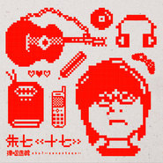
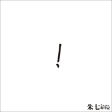

朱七
============================

|  |  |
| :--: | :-- |
| [ 朱七](https://i.xiami.com/zhu7) | **地区**: China 中国大陆 **风格**: 城市民谣 Urban Folk, 民谣 Folk, 独立流行 Indie Pop, 国语流行 Mandarin Pop **播放数**: 15492746 **粉丝数**: 18768 **评论数**: 1961  |

## 档案

这里的歌，不是那种所谓的民谣，，，谢谢！！！！！！ 
微博： 
朱七，男，双子座，音乐人。 
出生于浙江省温岭市石塘镇，海边渔村，常居杭州。 
收藏木吉他与CD，流行音乐爱好者。 
1995年 有了第一把吉他，同年开始写歌。 
1998年 加入黑水乐队（2000年解散，浙江工业大学学生乐队，该乐队有两个未来的虾米音乐创始人） 
1999年 词曲作品《诱惑》、《雪风筝》分别收录本地原创音乐杂志《音乐小虫》 
2003年 录制《朱七的笔记》专辑，发行个人demo专辑《！》《？》 
2007年 7月7日发行朱七的笔记III《，》，当日举办个人首个发片专场演出 
2007年 12月，单曲《merry X'mas》被收录在《露水十一圣诞demo特辑》 
2008年 5月，参加杭州西湖民谣节，与老狼、叶蓓、万晓利等同台演出 
2008年 《，》中的歌曲《船》，作为养生堂龟鳖丸的广告歌，在全国电视、电台广告中播出 
2009年 4月作为暖场嘉宾，参加tamas wells 全国巡演杭州、上海两站 
2009年 5月17日发行精选《十七 弹唱选辑》，当日举办个人发片专场演出 
2009年 5月，父亲节，发布阿里巴巴电子专辑《与父亲有关的日子》，发表《舞鞋》、《babababa》 
2010年12月24日，发表临时起意的EP《我们》 
2012年7月7日，双EP，朱七的笔记IV《我们》正式发行，收录2010年的《我们I》和2012年的《我们II》，举办专场音乐会 
2012年10月，参加西湖国际音乐节之花朵音乐季演出。 
2013年夏天，发起杭州，上海，北京，三场巡回演出。 
2014年9月1日，live专辑《给我们》发布，仅虾米网网络版，不出实体CD。 
2016年5月7日，《乌鸦少女》专辑发布，5.14日杭州，“乌鸦少女”画展与音乐会。 
2016年7月，单曲《一片大雾》跟随众乐纪《拾众而歌》合辑，正式发表，并拍摄个人纪录片。 
2017年5月，ep《两首歌》发表，收录《隐》和《退》两首歌。

## 专辑

| 名称 | 语种 | 唱片公司 | 发行时间 | 专辑类别 | 专辑风格 |
| :--: | :-- | :-- | :-- | :-- | :-- |
| [ 书名号朱七的笔记V](./albums/2104349116.md) | 国语 | 散问音乐 | 2018年12月08日 | 录音室专辑 | 独立流行 Indie Pop |
| [ 两首歌2017春季单曲](./albums/2102748467.md) | 国语 | 散问音乐 | 2017年05月17日 | EP, 单曲 | 国语流行 Mandarin Pop, 民谣流行 Folk Pop |
| [ 乌鸦少女朱七和他的朋友们](./albums/2100325964.md) | 国语 | 散问音乐 | 2016年05月07日 | 录音室专辑 | 独立流行 Indie Pop |
| [ 给我们 2013音乐会](./albums/1009495246.md) | 国语 | 散问音乐 | 2014年09月01日 | 现场专辑 | 独立民谣 Indie Folk, 国语流行 Mandarin Pop |
| [ 我们 II朱七的笔记IV](./albums/523389.md) | 国语 | 散问音乐 | 2012年07月07日 | 录音室专辑 | 当代民谣 Contemporary Folk, 国语流行 Mandarin Pop |
| [ 我们 I朱七的笔记IV](./albums/415553.md) | 国语 | 散问音乐 | 2010年12月24日 | 录音室专辑 | 城市民谣 Urban Folk |
| [ 十七 弹唱选辑](./albums/328965.md) | 国语 | 柒音乐工作室 | 2009年05月17日 | 精选集 | 城市民谣 Urban Folk |
| [ 逗号，朱七的笔记III](./albums/32713.md) | 国语 | 柒音乐工作室 | 2007年07月07日 | 录音室专辑 | 城市民谣 Urban Folk |
| [ 问号？朱七的笔记II](./albums/32712.md) | 国语 | 柒音乐工作室 | 2003年11月02日 | 录音室专辑 | 城市民谣 Urban Folk |
| [ 感叹号！朱七的笔记I](./albums/32711.md) | 国语 | 柒音乐工作室 | 2003年11月01日 | 录音室专辑 | 城市民谣 Urban Folk |

## 评论

|  |  |  |
| :-- | :-- | :-- |
|  [虾米用户](https://emumo.xiami.com/u/7184182)   2021-01-16 12:57 赞(0) 踩(0) | 
我们好多人，都好爱好爱虾米，别走好吗？我们大家能为虾米做点什么吗？可以帮帮它吗，让它留下。
 |
| ⇒ |  [虾米用户](https://emumo.xiami.com/u/6104413) 好久不见虾米 ，只怕再不... 2021-01-25 11:38 赞(0) 踩(0) | 
资本时代 ，没法子 -_-#
 |
|  [虾米用户](https://emumo.xiami.com/u/1357167) 我还没想好要写什么... 2021-01-05 22:26 赞(1) 踩(0) | 
再见虾米再见西瓜
 |
|  [虾米用户](https://emumo.xiami.com/u/10577925) 好手！ 2020-07-02 22:16 赞(0) 踩(0) | 
石塘山人来了
 |
|  [虾米用户](https://emumo.xiami.com/u/96222850) 孤独且豪迈是什么样呢？ 2020-04-16 22:16 赞(0) 踩(0) | 
朱七？你还在虾米音乐嘛？你的私信屏蔽了陌生人，上一个信息是一年前你群发的，你的新专辑停在了18年，还有新歌嘛
 |
| ⇒ |  [虾米用户](https://emumo.xiami.com/u/7) 单恋木吉他 2020-08-04 23:05 赞(0) 踩(0) | 
新歌有的，还不少呢，，，就是我写写很慢又要改很多遍，制作也会很慢，，所以短期内没有可以发表的新歌，，哈哈，让我再磨一磨~~~
 |
|  [虾米用户](https://emumo.xiami.com/u/306924686)  2020-03-10 16:26 赞(0) 踩(0) | 
听朱老师这么久，才发现你也是五月天的歌迷呀哈哈哈。很喜欢你的歌，希望你在音乐的道路上越走越远，第一次在这里给你评论留言哈哈哈。
 |
| ⇒ |  [虾米用户](https://emumo.xiami.com/u/7) 单恋木吉他 2020-08-04 23:06 赞(0) 踩(0) | 
是呀，我喜欢陈信宏的词曲，，，虽然不大喜欢他的唱腔~~~~哈哈哈~~~~
 |
| ⇒ |  [虾米用户](https://emumo.xiami.com/u/306924686)  2020-12-10 10:40 赞(0) 踩(0) | 
<q><b>朱七说：</b></q>
 |
|  [虾米用户](https://emumo.xiami.com/u/172070198) 且行且珍惜 2019-11-22 18:43 赞(0) 踩(0) | 
最初的印象来自于《青春》，这几天发现了魏勤私房乐里飞碟30周年和滚石30周年专辑里作嘉宾的朱七，很喜欢，希望音乐的路上一直有你！
 |
|  [虾米用户](https://emumo.xiami.com/u/9538237)  2019-08-28 01:22 赞(0) 踩(0) | 
我们在哪还能买到实体盘啊？ 夏天已过去，我已经听了三个秋天了，希望能永远留着它
 |
| ⇒ |  [虾米用户](https://emumo.xiami.com/u/7) 单恋木吉他 2019-08-29 19:32 赞(0) 踩(0) | 
可能已经没有了吧……绝版了……不知道淘宝会不会突然冒出来几张
 |
|  [虾米用户](https://emumo.xiami.com/u/428404788)  2019-08-21 09:41 赞(0) 踩(0) | 
朱七，你的能量不多啦，我去蹭下一家了，再见。
 |
| ⇒ |  [虾米用户](https://emumo.xiami.com/u/7) 单恋木吉他 2019-08-22 13:08 赞(0) 踩(0) | 
呀……书名号这么繁复都不够你吃吗……
 |
|  [虾米用户](https://emumo.xiami.com/u/428404788)  2019-08-20 08:51 赞(0) 踩(0) | 
朱七，你要把你的“怪物”图片改成真人图片了。
 |
|  [虾米用户](https://emumo.xiami.com/u/3125343) 我爱大风和烈酒，还有孤独... 2019-08-06 21:40 赞(0) 踩(0) | 
好久没来虾米了 踩踩
 |
|  [虾米用户](https://emumo.xiami.com/u/301163450)  2019-05-25 04:14 赞(0) 踩(0) | 
一开始在听匹配兴趣的歌单，觉得还合胃口就继续看看此人创建的歌单。 判断基本上处于同一年龄段，继续发现原来是浙工大的“黑水乐队”，记忆似乎被打开了些，“黑水”可能取名自分割工大为南教学区，北生活区的漆黑如墨的上塘河？ 同一时期活跃在杭州的还有“甜蜜的孩子”，应该是中国美院的……
 |
| ⇒ |  [虾米用户](https://emumo.xiami.com/u/7) 单恋木吉他 2019-06-07 16:05 赞(0) 踩(0) | 
嗯，完全正确~~~~~
 |
| ⇒ |  [虾米用户](https://emumo.xiami.com/u/428404788)  2019-08-20 08:55 赞(0) 踩(0) | 
<q><b>朱七说：</b></q>
 |
|  [虾米用户](https://emumo.xiami.com/u/20331428)  2019-04-24 03:03 赞(0) 踩(0) | 
突然在很多年后，听到了这首夏天已过去。才想起很多年前的一个夏天，最美好的青春，初恋，都随着那个人的背叛消失了。如今我三十多，依然单身，依然还喜欢音乐。唯一变化的是我再也找不到当初那股傻傻的爱人的勇气了吧。
 |
|  [虾米用户](https://emumo.xiami.com/u/420517639)  2019-04-01 12:20 赞(0) 踩(0) | 
98~02在浙大读书，买过«音乐小虫»杂志，还有个流浪鼓手在我们寝室住过几个月，怀念那时的大学校园。
 |
| ⇒ |  [虾米用户](https://emumo.xiami.com/u/7) 单恋木吉他 2019-04-02 15:27 赞(0) 踩(0) | 
那个时候，杭州地下音乐，精彩着呢……
 |
| ⇒ |  [虾米用户](https://emumo.xiami.com/u/420517639)  2019-04-03 11:53 赞(0) 踩(0) | 
<q><b>朱七说：</b></q>
 |
|  [虾米用户](https://emumo.xiami.com/u/6351337) 音乐救过你的命 2019-03-23 23:47 赞(0) 踩(0) | 
很少关注国内的音乐人，在这里留住是因为曲子呢还是人的精神呢？
 |
|  [虾米用户](https://emumo.xiami.com/u/324325221) 我还没想好要写什么... 2019-03-01 15:22 赞(1) 踩(0) | 
朱七的声音象是男声中的阿桑，有一点点瑕疵的哑，平静的声音里藏着澎湃的感情。循环听耳朵也不会累
 |
|  [虾米用户](https://emumo.xiami.com/u/51804662) 认真听歌 2019-01-17 15:10 赞(0) 踩(0) | 
朱七老师的词是音乐人里非常优秀的了呀～ 嗓音也是，多听之后，渐渐听出沙沙散散背后的小世界。
 |
| ⇒ |  [虾米用户](https://emumo.xiami.com/u/7) 单恋木吉他 2019-02-15 15:36 赞(0) 踩(0) | 
谢谢呀~~~~沙沙散散的小世界，，这个说法挺好~~
 |
|  [虾米用户](https://emumo.xiami.com/u/1032029) 我还没想好要写什么... 2019-01-08 17:29 赞(0) 踩(0) | 
内容已删除
 |
| ⇒ |  [虾米用户](https://emumo.xiami.com/u/7) 单恋木吉他 2019-01-08 22:18 赞(0) 踩(0) | 
好听啊……小柯永远是好听的……
 |
|  [虾米用户](https://emumo.xiami.com/u/412006076)  2019-01-07 16:43 赞(0) 踩(0) | 
你好，朱先生！恭喜你在音乐的道路上越走越远。
 |
| ⇒ |  [虾米用户](https://emumo.xiami.com/u/7) 单恋木吉他 2019-01-07 23:18 赞(0) 踩(0) | 
我的第一反应是：喝大了吗？   这是为什么？
 |
| ⇒ |  [虾米用户](https://emumo.xiami.com/u/412006076)  2019-01-11 21:27 赞(0) 踩(0) | 
<q><b>朱七说：</b></q>
 |
| ⇒ |  [虾米用户](https://emumo.xiami.com/u/412006076)  2019-01-11 21:34 赞(0) 踩(0) | 
<q><b>朱七说：</b></q>
 |
| ⇒ |  [虾米用户](https://emumo.xiami.com/u/7) 单恋木吉他 2019-01-12 03:43 赞(0) 踩(0) | 
<q><b>414寝室长说：</b></q>
 |
| ⇒ |  [虾米用户](https://emumo.xiami.com/u/412006076)  2019-01-15 15:15 赞(0) 踩(0) | 
<q><b>朱七说：</b></q>
 |
| ⇒ |  [虾米用户](https://emumo.xiami.com/u/412006076)  2019-01-15 15:17 赞(0) 踩(0) | 
<q><b>朱七说：</b></q>
 |
|  [虾米用户](https://emumo.xiami.com/u/7151428) 暖暖的～～ 2018-12-11 17:26 赞(0) 踩(0) | 
 
 |
|  [虾米用户](https://emumo.xiami.com/u/208766309)  2018-12-09 17:45 赞(0) 踩(0) | 
朱七先生，我被你圈粉了。你要负责。
 |
|  [虾米用户](https://emumo.xiami.com/u/201391232) 最快的方法是先抱抱 2018-12-08 12:45 赞(0) 踩(0) | 
彡
 |
|  [虾米用户](https://emumo.xiami.com/u/42349914)  2018-11-26 15:56 赞(0) 踩(0) | 
你得到第一把吉他的时候，我才一岁。。
 |
|  [虾米用户](https://emumo.xiami.com/u/44080439)  2018-11-24 10:03 赞(0) 踩(0) | 
猪，是我。来晚了 
 |
|  [虾米用户](https://emumo.xiami.com/u/6321648)   2018-11-15 18:29 赞(0) 踩(0) | 
看成七十年创作了………
 |
|  [虾米用户](https://emumo.xiami.com/u/328657369) 风格随心而变、 2018-11-07 12:32 赞(0) 踩(0) | 
静心，很不错、
 |
|  [虾米用户](https://emumo.xiami.com/u/11353)  2018-11-05 13:42 赞(0) 踩(0) | 
就不能先预售 等着好辛苦
 |
| ⇒ |  [虾米用户](https://emumo.xiami.com/u/7) 单恋木吉他 2018-11-05 14:12 赞(0) 踩(0) | 
这……好难操作啊……放心啦，卖不光的……哈哈哈
 |
|  [虾米用户](https://emumo.xiami.com/u/344442698) 开心就好 2018-09-04 16:47 赞(0) 踩(0) | 
看来只有我觉得这声音不好听
 |
|  [虾米用户](https://emumo.xiami.com/u/18555398)   2018-08-19 13:15 赞(0) 踩(0) | 
老乡好
 |
|  [虾米用户](https://emumo.xiami.com/u/39212206) 音乐相伴 快乐永远 2018-05-16 10:06 赞(0) 踩(0) | 
听朱七的音乐很有感觉 很喜欢你的音乐.伤感中的解脱～ 忧郁中的期盼～彷徨中的等待～
 |
| ⇒ |  [虾米用户](https://emumo.xiami.com/u/7) 单恋木吉他 2018-05-16 10:21 赞(0) 踩(0) | 
都是双份的吗？很棒。。
 |
| ⇒ |  [虾米用户](https://emumo.xiami.com/u/39212206) 音乐相伴 快乐永远 2018-05-16 22:20 赞(0) 踩(0) | 
听着您的音乐好有回忆 伤感.无奈.. 我其实很想问您找几首吉他谱.我几没事想弹弹唱唱玩.我纯业余的玩 我是摄影师拍平面的，在网上咋找不到您的吉他谱呢 我想找.青春.我们呢.乌鸦少女.其实还想学你的很多歌.慢慢来吧.您的歌触动我的心里！
 |
| ⇒ |  [虾米用户](https://emumo.xiami.com/u/39212206) 音乐相伴 快乐永远 2018-05-16 22:24 赞(0) 踩(0) | 
<q><b>朱七说：</b></q>
 |
| ⇒ |  [虾米用户](https://emumo.xiami.com/u/7) 单恋木吉他 2018-05-17 15:59 赞(0) 踩(0) | 
<q><b>青松白鹿说：</b></q>
 |
| ⇒ |  [虾米用户](https://emumo.xiami.com/u/39212206) 音乐相伴 快乐永远 2018-05-17 21:37 赞(0) 踩(0) | 
嗯嗯谢谢朱七老师 我先学学青春再学学乌鸦～     祝愿.您早日红遍大江南北.我很讨厌国内那些靠着关系.脸蛋.包装.的傻逼歌手.其实我也从来不听！这些年只听外国的乱七八糟音乐.这几年多是听老外的蓝调布鲁斯. 近几个月巧合听了马条的封锁线您的青春一下子喜欢了！喜欢你的歌很多首！.马条的歌除了封锁线也没太喜欢的了！有机会给您拍点照片去  
 |
|  [虾米用户](https://emumo.xiami.com/u/323987299)  2018-04-18 16:16 赞(0) 踩(0) | 
干什么的
 |
|  [虾米用户](https://emumo.xiami.com/u/334162706)  2018-02-20 13:40 赞(1) 踩(0) | 
朱七哥哥，喜欢你的歌哦
 |
|  [虾米用户](https://emumo.xiami.com/u/1507572) 沉默吧··· 2018-01-17 11:18 赞(1) 踩(0) | 
期待朱七2018专辑！！
 |
|  [虾米用户](https://emumo.xiami.com/u/18584465)   2018-01-15 17:18 赞(0) 踩(0) | 
更新了动态
 |
| ⇒ |  [虾米用户](https://emumo.xiami.com/u/7) 单恋木吉他 2018-01-15 17:19 赞(0) 踩(0) | 
我就是刚好在电脑上，手痒改了一下档案，，，没发生什么新的事~~哈哈哈~~~~
 |
| ⇒ |  [虾米用户](https://emumo.xiami.com/u/18584465)   2018-01-15 17:20 赞(0) 踩(0) | 
<q><b>朱七说：</b></q>
 |
|  [虾米用户](https://emumo.xiami.com/u/6190155) RoM 2018-01-15 17:18 赞(0) 踩(0) | 
一如既往 等待新专！
 |
| ⇒ |  [虾米用户](https://emumo.xiami.com/u/7) 单恋木吉他 2018-01-15 17:19 赞(0) 踩(0) | 
多谢啦~~~~我会加油的~~~
 |
| ⇒ |  [虾米用户](https://emumo.xiami.com/u/6190155) RoM 2018-01-15 17:20 赞(0) 踩(0) | 
<q><b>朱七说：</b></q>
 |
| ⇒ |  [虾米用户](https://emumo.xiami.com/u/7) 单恋木吉他 2018-01-15 17:23 赞(0) 踩(0) | 
<q><b>HebronShalom说：</b></q>
 |
| ⇒ |  [虾米用户](https://emumo.xiami.com/u/6190155) RoM 2018-01-19 07:24 赞(0) 踩(0) | 
<q><b>朱七说：</b></q>
 |
|  [虾米用户](https://emumo.xiami.com/u/92033664) 我还没想好要写什么... 2017-10-30 23:15 赞(1) 踩(0) | 
他的歌能让人看到小虾米，小蚂蚁也能有值得无限追忆的故事，除了爱情，还有那么多记忆中的美好都藏在生活中
 |
|  [虾米用户](https://emumo.xiami.com/u/7653418)  2017-10-28 00:30 赞(1) 踩(0) | 
虾米提醒你喜欢的音乐人朱七加入了 我立即屁颠屁颠地点进来
 |
|  [虾米用户](https://emumo.xiami.com/u/355865) Let it go, l... 2017-10-28 00:29 赞(0) 踩(0) | 
朱小七童鞋~~~~哈哈~去这里看一下：谢啦~<a href="http://www.xiami.com/group/thread-detail/tid/102376" target="_blank" rel="nofollow noreferrer noopener">http://www.xiami.com/group/thread-detail/tid/102376</a>
 |
| ⇒ |  [虾米用户](https://emumo.xiami.com/u/7) 单恋木吉他 2017-10-29 12:13 赞(0) 踩(0) | 
这个，，是不是时间出错了？？？
 |
| ⇒ |  [虾米用户](https://emumo.xiami.com/u/355865) Let it go, l... 2017-10-29 13:23 赞(0) 踩(0) | 
<q><b>朱七说：</b></q>
 |
| ⇒ |  [虾米用户](https://emumo.xiami.com/u/355865) Let it go, l... 2017-10-29 13:23 赞(0) 踩(0) | 
<q><b>朱七说：</b></q>
 |
| ⇒ |  [虾米用户](https://emumo.xiami.com/u/7) 单恋木吉他 2017-10-29 13:29 赞(0) 踩(0) | 
<q><b>Desperado说：</b></q>
 |
| ⇒ |  [虾米用户](https://emumo.xiami.com/u/1018) 口哨魔法師 2017-12-09 15:02 赞(0) 踩(0) | 
<q><b>朱七说：</b></q>
 |
|  [虾米用户](https://emumo.xiami.com/u/2279444) 爱在左，同情在右。 2017-10-28 00:25 赞(0) 踩(0) | 
前两天看一席南瓜，才知道原来你也是虾米创始人啊，突然想到那么多张唱片的监制谢谢你的名字，后太可怕啊
 |
|  [虾米用户](https://emumo.xiami.com/u/1333372)  2017-10-28 00:06 赞(1) 踩(0) | 
hey，你好。我是度假客的品牌总监，蔡蔡。度假客专做台湾民宿预订。我们现在尝试做民歌四十的票务和民宿的组合产品。在豆瓣上知道你对这个也有关注，不知道是不是有可能跟虾米做一次联合推广。不知道是不是有机会聊聊。
 |
|  [虾米用户](https://emumo.xiami.com/u/10102097) 但盼风雨来，能留你在此。 2017-10-27 23:21 赞(0) 踩(0) | 
看了评论才知道离我们那么近，好特别的声线
 |
|  [虾米用户](https://emumo.xiami.com/u/248251694)   2017-09-22 01:48 赞(0) 踩(0) | 
声音好听 加油
 |
|  [虾米用户](https://emumo.xiami.com/u/322474771)  2017-09-16 22:56 赞(0) 踩(0) | 
不懂也不专业，就是觉得好听 
 |
|  [虾米用户](https://emumo.xiami.com/u/32695350)  2017-08-11 09:05 赞(0) 踩(0) | 
升哥，怎么说呢，谢谢你
 |
|  [虾米用户](https://emumo.xiami.com/u/50687663) I'll never b... 2017-08-10 22:32 赞(0) 踩(0) | 
无意听到《我们》，就来转转，然后又循环了几遍。1995年你得到第一把吉他，1996年我才来到这个世界，哈哈哈
 |
| ⇒ |  [虾米用户](https://emumo.xiami.com/u/7) 单恋木吉他 2017-08-10 23:20 赞(0) 踩(0) | 
听起来你就像是我写的一首歌&amp;hellip;&amp;hellip;哈哈
 |
|  [虾米用户](https://emumo.xiami.com/u/124691520) 啦啦啦，神经质的自律者 2017-07-20 17:09 赞(0) 踩(0) | 
惊喜的推送，很高兴听到你的歌 
 |
|  [虾米用户](https://emumo.xiami.com/u/119150104)  2017-07-15 17:01 赞(0) 踩(0) | 
感动到了
 |
|  [虾米用户](https://emumo.xiami.com/u/98040166) 爱情是奢侈品，可有可无，... 2017-07-09 12:17 赞(0) 踩(0) | 
昨天才第一次听到你的歌，最喜欢树，简直就是刚过十八的我，时而想长大，时而不想长大的心情，然后才知道你居然是虾米音乐创始人，好厉害，我喜欢的五月天和陈粒都只有在这里可以听哦，你说你要是如此不火，会有多少人错过你呢，还好我遇到了，好吧好吧，别人错过就错过吧。说了这么多你要不要回复我一下 
 |
| ⇒ |  [虾米用户](https://emumo.xiami.com/u/7) 单恋木吉他 2017-07-09 13:07 赞(0) 踩(0) | 
好的呀，回复你。。。如果歌对人有用，能遇见更多人当然好，然而创作和做艺人是两件事，火不起来我也要继续创作呀，哪怕只有少数人能与歌有互动，我就很开心啦&amp;hellip;&amp;hellip;
 |
| ⇒ |  [虾米用户](https://emumo.xiami.com/u/98040166) 爱情是奢侈品，可有可无，... 2017-07-09 15:01 赞(0) 踩(0) | 
<q><b>朱七说：</b></q>
 |
|  [虾米用户](https://emumo.xiami.com/u/28026747)   2017-06-25 15:09 赞(0) 踩(0) | 
朱七 大哥的评价是 这歌有意思
 |
|  [虾米用户](https://emumo.xiami.com/u/299867958) like 2017-06-17 06:39 赞(0) 踩(0) | 
竖起大拇指   
 |
|  [虾米用户](https://emumo.xiami.com/u/248485255)  2017-06-16 10:54 赞(0) 踩(0) | 
今天才听见你这么棒的声音，相见恨晚
 |
|  [虾米用户](https://emumo.xiami.com/u/245265978)  2017-06-01 08:29 赞(0) 踩(0) | 
果然是喜欢皇马7号才叫&amp;ldquo;朱七&amp;rdquo;的吗？挺你！！！
 |
| ⇒ |  [虾米用户](https://emumo.xiami.com/u/7) 单恋木吉他 2017-06-07 03:34 赞(0) 踩(0) | 
哈哈，这个这个，我其实离足球世界还蛮远的&amp;hellip;&amp;hellip;
 |
|  [虾米用户](https://emumo.xiami.com/u/193972109)  2017-05-28 13:33 赞(1) 踩(0) | 
特别喜欢这种民谣，让诗融入生活，平易近人，一酒一书一首歌。
 |
|  [虾米用户](https://emumo.xiami.com/u/284677821) 不死在这里. 2017-05-27 12:53 赞(1) 踩(0) | 
寂静的中午2点，明明有阳光但是心中好冷
 |
|  [虾米用户](https://emumo.xiami.com/u/240254494) 最美的时间遇见最美的你 2017-05-27 00:26 赞(1) 踩(0) | 
被他的音乐风格吸引，真的很舒心，好听呢  
 |
| ⇒ |  [虾米用户](https://emumo.xiami.com/u/7) 单恋木吉他 2017-05-27 00:41 赞(0) 踩(0) | 
他看见了  
 |
|  [虾米用户](https://emumo.xiami.com/u/289861817)  2017-05-25 07:57 赞(1) 踩(0) | 
你会火的，我嘴开过光。在你火的不够爆的时候挺你到爆，想想就刺激！
 |
| ⇒ |  [虾米用户](https://emumo.xiami.com/u/7) 单恋木吉他 2017-05-25 19:28 赞(0) 踩(0) | 
是挺刺激的，一直一直一直，哈哈哈
 |
|  [虾米用户](https://emumo.xiami.com/u/13987937) 石床聽松 2017-05-20 01:02 赞(1) 踩(0) | 
我们的年代，在歌曲里一一再现，感谢深情演绎。
 |
|  [虾米用户](https://emumo.xiami.com/u/247967017)  2017-05-19 20:07 赞(0) 踩(0) | 
喜欢[文字cool]
 |
|  [虾米用户](https://emumo.xiami.com/u/72666568)  2017-05-19 15:06 赞(0) 踩(0) | 
暖
 |
|  [虾米用户](https://emumo.xiami.com/u/50709533)  2017-05-18 13:23 赞(0) 踩(0) | 
虾米音乐新版本，风格改的有点大
 |
|  [虾米用户](https://emumo.xiami.com/u/877352) 我还没想好要写什么... 2017-05-18 10:16 赞(0) 踩(0) | 
还是那种所谓的民谣&amp;middot;&amp;middot;&amp;middot;
 |
|  [虾米用户](https://emumo.xiami.com/u/47493892) 创作好听的音乐与您共分享 2017-04-27 14:44 赞(0) 踩(0) | 
有感觉
 |
|  [虾米用户](https://emumo.xiami.com/u/1032029) 我还没想好要写什么... 2017-04-25 00:46 赞(0) 踩(0) | 
就问下《》今年还会上吗？
 |
| ⇒ |  [虾米用户](https://emumo.xiami.com/u/7) 单恋木吉他 2017-04-26 02:06 赞(0) 踩(0) | 
有可能~~~~~~~（盯的真紧啊你~~）
 |
|  [虾米用户](https://emumo.xiami.com/u/204351522)  2017-03-19 10:44 赞(0) 踩(0) | 
一片大雾，好听 好听
 |
|  [虾米用户](https://emumo.xiami.com/u/3124890) 各自精彩，互不相欠。 2017-03-08 11:20 赞(0) 踩(0) | 
虾米音乐 创始人吗？
 |
|  [虾米用户](https://emumo.xiami.com/u/250240532)  2017-02-14 18:24 赞(0) 踩(0) | 
喜欢，歌很好听
 |
|  [虾米用户](https://emumo.xiami.com/u/262054710)  2017-02-08 10:32 赞(0) 踩(0) | 
喜欢。来了就不走 
 |
|  [虾米用户](https://emumo.xiami.com/u/213613995) no man is an... 2017-01-26 17:11 赞(0) 踩(0) | 
这声音 
 |
|  [虾米用户](https://emumo.xiami.com/u/135789222)  2017-01-18 21:19 赞(0) 踩(0) | 
第一次听，声音好棒，喜欢 
 |
|  [虾米用户](https://emumo.xiami.com/u/254229600) 爱音乐的男孩！ 2017-01-12 15:08 赞(0) 踩(0) | 
不错。
 |
|  [虾米用户](https://emumo.xiami.com/u/252611835)  2017-01-09 02:37 赞(0) 踩(0) | 
大晚上睡不着,为何这么好听???
 |
|  [虾米用户](https://emumo.xiami.com/u/4732297)  2016-12-15 21:28 赞(1) 踩(0) | 
敬仰。文案写的很好，原来是创始人。果然才华横溢。我们，我很喜欢，也很喜欢我们的文案。这样的感受，没有深刻的经历是写不出来的。
 |
| ⇒ |  [虾米用户](https://emumo.xiami.com/u/7) 单恋木吉他 2017-02-21 11:28 赞(0) 踩(0) | 
简称：大叔。
 |
| ⇒ |  [虾米用户](https://emumo.xiami.com/u/221267864) 故人依在否？ 2017-04-06 22:52 赞(0) 踩(0) | 
<q><b>朱七说：</b></q>
 |
|  [虾米用户](https://emumo.xiami.com/u/19928334) 正视不完美，是对过去的一... 2016-12-15 16:13 赞(0) 踩(0) | 
支持朋友！敬请同样关注！
 |
|  [虾米用户](https://emumo.xiami.com/u/7878790) 音乐无国界！ 2016-12-10 10:51 赞(0) 踩(0) | 
很好听的歌，真的很喜欢！
 |
|  [虾米用户](https://emumo.xiami.com/u/41020743) 有没有一首歌会让我想起你 2016-12-06 00:12 赞(0) 踩(0) | 
有故事的人
 |
|  [虾米用户](https://emumo.xiami.com/u/124232776)   2016-11-17 15:49 赞(1) 踩(0) | 
想要你艺人信息背景墙的原图 
 |
| ⇒ |  [虾米用户](https://emumo.xiami.com/u/1032029) 我还没想好要写什么... 2016-11-18 10:02 赞(0) 踩(0) | 
<a href="http://img.xiami.net/images/artistlogo/19/13669885761119.jpg" target="_blank" rel="nofollow noreferrer noopener">http://img.xiami.net/images/artistlogo/19/13669885761119.jpg</a>
 |
| ⇒ |  [虾米用户](https://emumo.xiami.com/u/124232776)   2016-11-18 10:06 赞(0) 踩(0) | 
<q><b>曲阿朴说：</b></q>
 |
| ⇒ |  [虾米用户](https://emumo.xiami.com/u/7) 单恋木吉他 2016-11-21 13:57 赞(0) 踩(0) | 
<q><b>shota说：</b></q>
 |
|  [虾米用户](https://emumo.xiami.com/u/86141784) 在音乐的世界里寻找快乐和... 2016-11-04 19:05 赞(1) 踩(0) | 
喜欢你的声音
 |
|  [虾米用户](https://emumo.xiami.com/u/519455)  2016-10-17 20:39 赞(3) 踩(0) | 
朱七，原来是虾米音乐创始人？
 |
| ⇒ |  [虾米用户](https://emumo.xiami.com/u/7) 单恋木吉他 2016-11-21 13:58 赞(0) 踩(0) | 
这个不是太重要，对不对？
 |
| ⇒ |  [虾米用户](https://emumo.xiami.com/u/519455)  2016-11-22 07:52 赞(0) 踩(0) | 
<q><b>朱七说：</b></q>
 |
| ⇒ |  [虾米用户](https://emumo.xiami.com/u/7) 单恋木吉他 2016-11-22 10:43 赞(0) 踩(0) | 
<q><b>无风说：</b></q>
 |
|  [虾米用户](https://emumo.xiami.com/u/222244941)   2016-09-17 10:25 赞(0) 踩(0) | 
忽然爱上干净温暖温柔的男声~
 |
|  [虾米用户](https://emumo.xiami.com/u/52367550)  2016-09-12 14:39 赞(0) 踩(0) | 
争不过朝夕，又念着往昔。
 |
| ⇒ |  [虾米用户](https://emumo.xiami.com/u/7) 单恋木吉他 2016-10-14 12:34 赞(0) 踩(0) | 
偷走了青丝却留住一个你
 |
|  [虾米用户](https://emumo.xiami.com/u/49222819)  2016-09-07 20:34 赞(0) 踩(0) | 
有时候真的觉得朱七的歌太过柔
 |
| ⇒ |  [虾米用户](https://emumo.xiami.com/u/7) 单恋木吉他 2016-10-10 00:11 赞(0) 踩(0) | 
嗯，，我下次躁一点，，哇哈哈～～
 |
|  [虾米用户](https://emumo.xiami.com/u/51648095)  2016-08-14 00:23 赞(1) 踩(0) | 
"这城市大到不会同时下雨 于是特别相信我们的相遇" 晚安朱老师～
 |
|  [虾米用户](https://emumo.xiami.com/u/207129415) 一个喜欢华晨宇的洗花花 2016-08-06 14:44 赞(0) 踩(0) | 
正在一首一首的慢慢听 
 |
|  [虾米用户](https://emumo.xiami.com/u/50709533)  2016-07-29 09:26 赞(0) 踩(0) | 
爱生活，爱民谣，爱朱七
 |
|  [虾米用户](https://emumo.xiami.com/u/50345864) 嘻嘻 2016-07-20 01:34 赞(0) 踩(0) | 
谁告诉我 这里面哪首歌最好听
 |
|  [虾米用户](https://emumo.xiami.com/u/52833272) 主角喵 2016-07-19 14:00 赞(0) 踩(0) | 
慢
 |
|  [虾米用户](https://emumo.xiami.com/u/82476886)   2016-07-09 19:20 赞(0) 踩(0) | 
为什么只能下载虾米评论呢，网易那边的难民怎么办？七大爷⋯⋯妳的新專真帶勁⋯⋯買了十張，準備送老師去⋯⋯
 |
| ⇒ |  [虾米用户](https://emumo.xiami.com/u/7) 单恋木吉他 2016-07-15 13:48 赞(0) 踩(0) | 
啊～～～多谢多谢～～～送老师是为何？？ 网易没上我的歌，，自然就没有了。。。。。
 |
|  [虾米用户](https://emumo.xiami.com/u/3708232) live half at... 2016-06-28 22:38 赞(4) 踩(0) | 
今天有看众乐纪里你的那一集，看了五遍，然后来虾米给你留言。再次听到你实际上是两年后了，整整两年没有你的音乐，但是再次听到你的歌曲，好像又回到了当时慵懒的下午，我坐在书桌前抄你的歌词，晚自习回家一个人走，被风吹起的疲惫里你的声音给我片刻安慰。沉默嘶吼的默片，不知道为什么这句词一直记了这么多年，第一次觉得，遇见你真好，你没有走真好，继续有梦想真好。
 |
| ⇒ |  [虾米用户](https://emumo.xiami.com/u/7) 单恋木吉他 2016-07-15 13:49 赞(0) 踩(0) | 
恩，谢谢你～～我会陆陆续续继续做音乐的，，，放心啦～～～～那个词来自《聋》，，世界是，默片安静的嘶吼。。。
 |
| ⇒ |  [虾米用户](https://emumo.xiami.com/u/3708232) live half at... 2016-07-16 10:38 赞(0) 踩(0) | 
<q><b>朱七说：</b></q>
 |
|  [虾米用户](https://emumo.xiami.com/u/93562880)  2016-05-17 11:40 赞(0) 踩(0) | 
悠悠晃晃
 |
|  [虾米用户](https://emumo.xiami.com/u/276998)  2016-05-12 11:20 赞(0) 踩(0) | 
再次回归社会 回归虾米 还是从朱七开始，旋律一出 心就沉下来了
 |
| ⇒ |  [虾米用户](https://emumo.xiami.com/u/7) 单恋木吉他 2016-05-12 11:59 赞(0) 踩(0) | 
是隐居了好几年吗～～～～
 |
|  [虾米用户](https://emumo.xiami.com/u/10384607) 空山無人，水流花開。 2016-05-10 10:43 赞(0) 踩(0) | 
可以叫乌鸦少女mimiliang来客串的
 |
| ⇒ |  [虾米用户](https://emumo.xiami.com/u/7) 单恋木吉他 2016-05-11 14:07 赞(0) 踩(0) | 
其实是可以的，哈哈～～
 |
|  [虾米用户](https://emumo.xiami.com/u/7133174) 我还没想好要写什么... 2016-05-03 13:54 赞(6) 踩(0) | 
一直以为你是虾米的工作人员 
 |
| ⇒ |  [虾米用户](https://emumo.xiami.com/u/11353)  2018-11-05 13:43 赞(0) 踩(0) | 
创始人之一
 |
|  [虾米用户](https://emumo.xiami.com/u/111336) 十万个凭什么 2016-04-30 01:10 赞(23) 踩(0) | 
你说，有这么一个独立音乐人，不到3年的时间里，带着自己的团队，帮别人做了15张唱片，合作首发了上百张专辑，把一个平台从0做到了国内最好的音乐人平台，然后自己的专辑只能在虾米独家，却不能首发推荐。这是一种什么精神？这简直就是神经。
 |
| ⇒ |  [虾米用户](https://emumo.xiami.com/u/6351337) 音乐救过你的命 2019-03-23 23:37 赞(0) 踩(0) | 
我怎么会喜欢这样的神经呢？
 |
|  [虾米用户](https://emumo.xiami.com/u/62540356)  2016-04-27 22:36 赞(1) 踩(0) | 
唱得真难听，但是这声音和这曲和歌曲的意境混在一起感觉还挺独特的
 |
| ⇒ |  [虾米用户](https://emumo.xiami.com/u/350762) 我们都是岁月的孩子 2016-04-30 10:24 赞(0) 踩(0) | 
  
 |
|  [虾米用户](https://emumo.xiami.com/u/152209172) 爱自己  爱家人 2016-04-27 01:51 赞(0) 踩(0) | 
苦与乐交织，爱与恨结合，悲催的自我，漫长的黑夜。
 |
|  [虾米用户](https://emumo.xiami.com/u/101130780) 行走的力量 2016-04-24 16:39 赞(0) 踩(0) | 
好听的音乐，听了让人有所感触
 |
|  [虾米用户](https://emumo.xiami.com/u/49086299) 语虚，何以言知 2016-04-23 13:43 赞(0) 踩(0) | 
什么？5月7日，见。。
 |
|  [虾米用户](https://emumo.xiami.com/u/33405891) 我还没想好要写什么... 2016-04-23 11:39 赞(0) 踩(0) | 
最喜欢在透支的时候听朱七七的歌～ 5.7 大概是快透支max的时候 刚好刚好～ 等
 |
|  [虾米用户](https://emumo.xiami.com/u/51726118)   2016-04-20 23:10 赞(0) 踩(0) | 
第一次听 好像有点晚 应该也不晚 好听！
 |
|  [虾米用户](https://emumo.xiami.com/u/4451938) 人生人生总有不期而遇的温... 2016-04-19 22:39 赞(1) 踩(0) | 
朱七啊，青春吧。我喜欢他的嗓音。他是个写生活的人，写的还比较合拍吧。也许我们有类似的经历。人不为别人而写作的时候，就是真的写作。写作者必然真实。我真的不愿，添加进别的东西，就是那么义无反顾地，成为了一个怎么样的人。
 |
|  [虾米用户](https://emumo.xiami.com/u/14034872)  2016-04-17 02:07 赞(0) 踩(0) | 
好听的才是音乐
 |
|  [虾米用户](https://emumo.xiami.com/u/31017363)   2016-04-02 00:11 赞(0) 踩(0) | 
新歌很适合睡前听，晚安朱老师～
 |
|  [虾米用户](https://emumo.xiami.com/u/33405891) 我还没想好要写什么... 2016-03-31 22:06 赞(0) 踩(0) | 
在杭州的时候觉得杭州好无聊杭州话好难听! 现在在异地读书，啊觉得自己已经离不开关于杭州的一切了! 想听你用杭州话唱一首啊～
 |
| ⇒ |  [虾米用户](https://emumo.xiami.com/u/7) 单恋木吉他 2016-04-01 11:46 赞(0) 踩(0) | 
我不会说杭州话呢～～～～
 |
| ⇒ |  [虾米用户](https://emumo.xiami.com/u/33405891) 我还没想好要写什么... 2016-04-01 14:55 赞(0) 踩(0) | 
<q><b>朱七说：</b></q>
 |
| ⇒ |  [虾米用户](https://emumo.xiami.com/u/7) 单恋木吉他 2016-04-01 15:13 赞(0) 踩(0) | 
<q><b>后腰没有腰说：</b></q>
 |
|  [虾米用户](https://emumo.xiami.com/u/48155336) 与谁同坐，明月清风我 2016-03-20 10:56 赞(0) 踩(0) | 
喜欢的民谣歌声又多了你
 |
|  [虾米用户](https://emumo.xiami.com/u/10393877) 我一直都是我~ 2016-03-13 15:20 赞(0) 踩(0) | 
以前有个朋友很喜欢你的歌推荐给我听的，可惜现在他不在了。。
 |
| ⇒ |  [虾米用户](https://emumo.xiami.com/u/7) 单恋木吉他 2016-03-13 21:28 赞(0) 踩(0) | 
去世了吗？？
 |
|  [虾米用户](https://emumo.xiami.com/u/1032029) 我还没想好要写什么... 2016-03-10 15:16 赞(0) 踩(0) | 
刚听到首歌<a href="http://www.xiami.com/song/3588268" target="_blank" rel="nofollow noreferrer noopener">http://www.xiami.com/song/3588268</a>，还以为是朱七唱的，一点开还是个黑人唱的……好国际化的vocal
 |
| ⇒ |  [虾米用户](https://emumo.xiami.com/u/7) 单恋木吉他 2016-03-17 15:35 赞(0) 踩(0) | 
像吗？？他唱的比较好吧～～～
 |
| ⇒ |  [虾米用户](https://emumo.xiami.com/u/1032029) 我还没想好要写什么... 2016-03-22 13:48 赞(0) 踩(0) | 
<q><b>朱七说：</b></q>
 |
|  [虾米用户](https://emumo.xiami.com/u/102876964) 孤独的灵魂多么寂寞啊 2016-02-22 17:19 赞(0) 踩(0) | 
好喜欢他的风格
 |
|  [虾米用户](https://emumo.xiami.com/u/20365993) 上帝无言 2016-02-21 00:16 赞(0) 踩(0) | 
买了一批虾米导光计划音乐人的专辑，全部专辑的监制都是朱七诶
 |
| ⇒ |  [虾米用户](https://emumo.xiami.com/u/7) 单恋木吉他 2016-03-01 15:46 赞(0) 踩(0) | 
寻光计划……哪里是什么导光计划～哈哈～～～
 |
| ⇒ |  [虾米用户](https://emumo.xiami.com/u/20365993) 上帝无言 2016-03-04 21:41 赞(0) 踩(0) | 
<q><b>朱七说：</b></q>
 |
| ⇒ |  [虾米用户](https://emumo.xiami.com/u/7) 单恋木吉他 2016-03-05 14:13 赞(0) 踩(0) | 
<q><b>Tori说：</b></q>
 |
|  [虾米用户](https://emumo.xiami.com/u/20365993) 上帝无言 2016-02-19 18:30 赞(0) 踩(0) | 
哪里可以买到你的专辑？
 |
| ⇒ |  [虾米用户](https://emumo.xiami.com/u/7) 单恋木吉他 2016-02-20 11:03 赞(0) 踩(0) | 
淘宝有，不太好搜可能，，你搜完整些，，，比如  朱七的笔记 我们，，，就这张还有~
 |
| ⇒ |  [虾米用户](https://emumo.xiami.com/u/20365993) 上帝无言 2016-02-21 00:16 赞(0) 踩(0) | 
<q><b>朱七说：</b></q>
 |
| ⇒ |  [虾米用户](https://emumo.xiami.com/u/7) 单恋木吉他 2016-02-22 00:06 赞(0) 踩(0) | 
<q><b>Tori说：</b></q>
 |
|  [虾米用户](https://emumo.xiami.com/u/34356147) 极度脆弱 2016-02-08 16:53 赞(1) 踩(0) | 
噫。长得好萌啊。♡
 |
|  [虾米用户](https://emumo.xiami.com/u/77686178)   2016-01-22 16:17 赞(0) 踩(0) | 
七哥，《我们》中的那句歌词“雨生离开在一九九七，我们捧着如燕盘旋的遗体”，如果改成“雨生离开在一九九七，我们哼着如燕盘旋的旋律”如何？
 |
| ⇒ |  [虾米用户](https://emumo.xiami.com/u/7) 单恋木吉他 2016-01-22 16:48 赞(0) 踩(0) | 
5年多以前的歌了，，，不会再改歌词了～～～
 |
|  [虾米用户](https://emumo.xiami.com/u/91541694)   2016-01-18 18:49 赞(0) 踩(0) | 
好听
 |
|  [虾米用户](https://emumo.xiami.com/u/20) 自由爱恨，只因荣幸 2016-01-07 21:48 赞(0) 踩(0) | 
光看封面就已经很喜欢了
 |
|  [虾米用户](https://emumo.xiami.com/u/52252907) 现居成都，与吉他有缘，热... 2016-01-06 13:23 赞(0) 踩(0) | 
七哥吉祥！
 |
| ⇒ |  [虾米用户](https://emumo.xiami.com/u/7) 单恋木吉他 2016-01-06 18:11 赞(0) 踩(0) | 
哈哈哈，，伊格格吗？？还是伊嬷嬷？？
 |
| ⇒ |  [虾米用户](https://emumo.xiami.com/u/52252907) 现居成都，与吉他有缘，热... 2016-01-06 21:59 赞(0) 踩(0) | 
<q><b>朱七说：</b></q>
 |
|  [虾米用户](https://emumo.xiami.com/u/107479) 别闹。 2016-01-06 10:57 赞(0) 踩(0) | 
欸，新砖呢
 |
| ⇒ |  [虾米用户](https://emumo.xiami.com/u/7) 单恋木吉他 2016-01-06 12:22 赞(0) 踩(0) | 
这不是刚改了公告嘛，，录好了在混音呢～～～～
 |
|  [虾米用户](https://emumo.xiami.com/u/819805) 我们点起火把，烧死爱情。 2015-12-30 18:51 赞(0) 踩(0) | 
距离新砖发布还有0天...
 |
| ⇒ |  [虾米用户](https://emumo.xiami.com/u/7) 单恋木吉他 2016-01-06 18:12 赞(0) 踩(0) | 
·······················听说，，有，，跳票，，这件，，事情，，，，的～～～～掩面而去～～
 |
| ⇒ |  [虾米用户](https://emumo.xiami.com/u/819805) 我们点起火把，烧死爱情。 2016-01-11 10:54 赞(0) 踩(0) | 
<q><b>朱七说：</b></q>
 |
|  [虾米用户](https://emumo.xiami.com/u/1745291) 何以解忧，唯有后摇。 2015-12-29 18:38 赞(0) 踩(0) | 
七哥，好久不来了。你还好吧，灵魂跟不上脚步。
 |
|  [虾米用户](https://emumo.xiami.com/u/1032029) 我还没想好要写什么... 2015-12-23 12:18 赞(0) 踩(0) | 
马上快31日了，《乌鸦少年》还会如期上线么
 |
| ⇒ |  [虾米用户](https://emumo.xiami.com/u/7) 单恋木吉他 2015-12-23 15:19 赞(0) 踩(0) | 
哈哈哈，，这个这个，，，会有部分～～～～
 |
|  [虾米用户](https://emumo.xiami.com/u/3983650)  2015-12-19 20:56 赞(0) 踩(0) | 
豆瓣小站里的歌我都很爱 这里怎么没有。好久没听 miss u
 |
| ⇒ |  [虾米用户](https://emumo.xiami.com/u/7) 单恋木吉他 2015-12-21 10:50 赞(0) 踩(0) | 
翻唱的？？？这里都是原创的歌～～～
 |
|  [虾米用户](https://emumo.xiami.com/u/3180097) 我想要的新鲜感 2015-12-13 20:43 赞(0) 踩(0) | 
浙江有个朱七真是我们浙江人的幸运。
 |
|  [虾米用户](https://emumo.xiami.com/u/7576326)  2015-12-10 11:19 赞(0) 踩(0) | 
独爱《烟》 话说大叔你是有多懒，专辑名都懒得想吗？
 |
| ⇒ |  [虾米用户](https://emumo.xiami.com/u/7) 单恋木吉他 2015-12-10 16:49 赞(0) 踩(0) | 
哪里？？我专辑名都很认真想的呀～～～～
 |
|  [虾米用户](https://emumo.xiami.com/u/48674082) 没有心 就不会受伤 2015-11-28 18:11 赞(0) 踩(0) | 
好听！
 |
|  [虾米用户](https://emumo.xiami.com/u/57906324)  2015-11-24 22:32 赞(0) 踩(0) | 
.
 |
|  [虾米用户](https://emumo.xiami.com/u/40813167) 寻找吧 2015-11-21 19:37 赞(0) 踩(0) | 
最开始是偶然听到的《我们》，然后把所有的歌都挨着听了一遍，忘了有张live里说大概是帮一个朋友唱的夏天已过去最后比你自己的歌试听量还高，午休让我把宿舍的人都笑醒了~
 |
| ⇒ |  [虾米用户](https://emumo.xiami.com/u/7) 单恋木吉他 2015-11-23 10:17 赞(0) 踩(0) | 
啊？哈哈，，这么有效果啊～～～～
 |
|  [虾米用户](https://emumo.xiami.com/u/84234294) yo yo yo  2015-11-18 16:13 赞(0) 踩(0) | 
我们，好多回忆
 |
|  [虾米用户](https://emumo.xiami.com/u/774850)  2015-11-18 14:13 赞(0) 踩(0) | 
怀旧
 |
|  [虾米用户](https://emumo.xiami.com/u/6323308) 念念不忘，必有回响。 2015-11-02 18:05 赞(0) 踩(0) | 
什么叫“不是那种所谓的民谣”？
 |
| ⇒ |  [虾米用户](https://emumo.xiami.com/u/7) 单恋木吉他 2015-11-03 09:56 赞(0) 踩(0) | 
呃，，一下子说不清，，反正不是那种根源民谣，，，这儿其实都是流行歌～
 |
| ⇒ |  [虾米用户](https://emumo.xiami.com/u/6323308) 念念不忘，必有回响。 2015-11-03 10:21 赞(0) 踩(0) | 
<q><b>朱七说：</b></q>
 |
| ⇒ |  [虾米用户](https://emumo.xiami.com/u/404264)  2015-12-03 10:53 赞(0) 踩(0) | 
<q><b>纠结君说：</b></q>
 |
|  [虾米用户](https://emumo.xiami.com/u/54483427)  2015-10-22 18:23 赞(0) 踩(0) | 
很好听
 |
|  [虾米用户](https://emumo.xiami.com/u/709888) 音乐是时间的坐标 2015-10-13 13:54 赞(0) 踩(0) | 
为毛我觉得哥的心里肯定住着一个十六岁的花季呢，这一定是错觉
 |
| ⇒ |  [虾米用户](https://emumo.xiami.com/u/7) 单恋木吉他 2015-10-14 10:06 赞(0) 踩(0) | 
你说的是那个暴露年龄的电视剧吗？？？应该没有那些东西～哈哈～
 |
| ⇒ |  [虾米用户](https://emumo.xiami.com/u/709888) 音乐是时间的坐标 2015-10-14 11:55 赞(0) 踩(0) | 
<q><b>朱七说：</b></q>
 |
| ⇒ |  [虾米用户](https://emumo.xiami.com/u/7) 单恋木吉他 2015-10-14 13:24 赞(0) 踩(0) | 
<q><b>东区一枝花说：</b></q>
 |
|  [虾米用户](https://emumo.xiami.com/u/29874829) 嬉皮笑脸 2015-09-28 14:21 赞(0) 踩(0) | 
每次听到《烟》都特别有感触，一随机到这首就会找出来循环几遍先，电台听到也是。但是我才22岁啊！！！
 |
| ⇒ |  [虾米用户](https://emumo.xiami.com/u/7) 单恋木吉他 2015-09-29 10:19 赞(0) 踩(0) | 
22岁也不小了呢～～～～～～～
 |
| ⇒ |  [虾米用户](https://emumo.xiami.com/u/29874829) 嬉皮笑脸 2015-09-29 10:48 赞(0) 踩(0) | 
<q><b>朱七说：</b></q>
 |
| ⇒ |  [虾米用户](https://emumo.xiami.com/u/7) 单恋木吉他 2015-09-29 13:26 赞(0) 踩(0) | 
<q><b>时过1874说：</b></q>
 |
| ⇒ |  [虾米用户](https://emumo.xiami.com/u/29874829) 嬉皮笑脸 2015-09-29 15:19 赞(0) 踩(0) | 
<q><b>朱七说：</b></q>
 |
| ⇒ |  [虾米用户](https://emumo.xiami.com/u/404264)  2015-12-03 10:58 赞(0) 踩(0) | 
刚好和我的经历很像，2013年的某一天妈妈确诊肺癌了，戒了半年烟的我又开始抽烟，妈妈临死前把所有的积蓄给我买了一套房子，每每听见这歌，就感觉医院那些事情又演了一遍。
 |
|  [虾米用户](https://emumo.xiami.com/u/1468541)  2015-09-17 12:44 赞(0) 踩(0) | 
虾米电台偶然听到你的声音，本该午休的我都没了睡意，一口气听了很多，简直相见恨晚，不多说了请收下我的膝盖与热爱。真的，心情特别好，遇见打心眼儿里喜欢的事物是件值得庆祝的事，我今晚回家一定多吃一碗饭。2015.9.17 12.43
 |
| ⇒ |  [虾米用户](https://emumo.xiami.com/u/7) 单恋木吉他 2015-09-17 23:12 赞(0) 踩(0) | 
多吃一碗饭的点是在？？？庆祝吗？？为什么听起来很不舍得的感觉？哈哈哈~~~
 |
|  [虾米用户](https://emumo.xiami.com/u/61651316)  2015-09-08 01:19 赞(0) 踩(0) | 
朱七叔叔好~
 |
| ⇒ |  [虾米用户](https://emumo.xiami.com/u/7) 单恋木吉他 2015-09-09 12:21 赞(0) 踩(0) | 
哇，，奶酪骑士来了～～～～
 |
|  [虾米用户](https://emumo.xiami.com/u/52254253) 我们生来就是孤独 2015-09-04 09:14 赞(0) 踩(0) | 
前些日子无意中听到了烟，现在每次抽烟的时候都会想起这首歌，然后听了七哥 所有的歌，就像相识多年的老朋友，现在只想说一句，好久不见，原谅我错过了那些年的青春！已然成为七哥 的脑残粉！
 |
| ⇒ |  [虾米用户](https://emumo.xiami.com/u/7) 单恋木吉他 2015-09-09 12:21 赞(0) 踩(0) | 
：）来点一根～～～～
 |
|  [虾米用户](https://emumo.xiami.com/u/1730251)  2015-09-03 17:52 赞(0) 踩(0) | 
封面控收藏
 |
|  [虾米用户](https://emumo.xiami.com/u/59478112)  2015-08-31 19:34 赞(0) 踩(0) | 
好听！
 |
|  [虾米用户](https://emumo.xiami.com/u/13607554) 爱莫能助 2015-08-30 15:04 赞(0) 踩(0) | 
！！！！突然看到 本人在回复里
 |
| ⇒ |  [虾米用户](https://emumo.xiami.com/u/7) 单恋木吉他 2015-08-31 09:45 赞(0) 踩(0) | 
恩，看到了～～哈哈～～
 |
| ⇒ |  [虾米用户](https://emumo.xiami.com/u/59082206)  2015-09-20 14:22 赞(0) 踩(0) | 
<q><b>朱七说：</b></q>
 |
|  [虾米用户](https://emumo.xiami.com/u/13607554) 爱莫能助 2015-08-30 15:03 赞(0) 踩(0) | 
爱着的最深刻的民谣男歌手
 |
|  [虾米用户](https://emumo.xiami.com/u/9127105)   2015-08-29 11:23 赞(0) 踩(0) | 
今天才知道的，原来夏天已过去原唱另有其人？？
 |
| ⇒ |  [虾米用户](https://emumo.xiami.com/u/7) 单恋木吉他 2015-08-31 09:45 赞(0) 踩(0) | 
原唱是我，，只是词曲人不是我，，，这首歌不是我写的，，但是词曲作者也没发表这首歌，，，哈哈～～～
 |
| ⇒ |  [虾米用户](https://emumo.xiami.com/u/9127105)   2015-08-31 10:41 赞(0) 踩(0) | 
<q><b>朱七说：</b></q>
 |
|  [虾米用户](https://emumo.xiami.com/u/1662786)  2015-08-25 14:53 赞(0) 踩(0) | 
几年前听过你第一首歌是树，下载好放在MP3里很久。现在不用那么古老的东西，有了手机，有了虾米，听的歌也多了杂了。无意中，又听到你的歌，回忆满满。当喜爱的东西变得容易获取，似乎就不再那么珍惜。
 |
| ⇒ |  [虾米用户](https://emumo.xiami.com/u/1662786)  2015-09-07 09:43 赞(0) 踩(0) | 
<q><b>朱七说：</b></q>
 |
| ⇒ |  [虾米用户](https://emumo.xiami.com/u/7) 单恋木吉他 2017-10-30 09:56 赞(0) 踩(0) | 
时代在变，，，该来的来，该走的走，，平常事啦～～～都没关系的～
 |
|  [虾米用户](https://emumo.xiami.com/u/55750365)  2015-08-25 11:44 赞(0) 踩(0) | 
浅浅地唱深深的生活
 |
|  [虾米用户](https://emumo.xiami.com/u/41213692)  2015-08-21 22:26 赞(0) 踩(0) | 
....艺人主页那张图片背景是白色的，找播放电台和评论找了好久…_(:з)∠)_
 |
|  [虾米用户](https://emumo.xiami.com/u/2279444) 爱在左，同情在右。 2015-08-21 16:35 赞(0) 踩(0) | 
不好意思打错了，是写着你的名字
 |
| ⇒ |  [虾米用户](https://emumo.xiami.com/u/7) 单恋木吉他 2015-08-21 17:20 赞(0) 踩(0) | 
也，，没什么可怕嘛～～哈哈～～
 |
|  [虾米用户](https://emumo.xiami.com/u/1216927)  2015-07-31 23:57 赞(0) 踩(0) | 
最早听《我们》的时候就坚信写这首歌的不会是太年轻的歌手，一遍又一遍的听朱七娓娓道来，歌词同样是歌手和歌名，没有刻意拼凑和哗众取宠，更像是在深夜翻着泛黄的日记，略带苦涩的微笑纪念着曾经的逝去，淡淡的说着不用去伤感的缅怀，如今的我们能有怀念的东西已经足够。谢谢朱七在这个浮华的年代带给我们安静又纯净的声音，谢谢你
 |
| ⇒ |  [虾米用户](https://emumo.xiami.com/u/7) 单恋木吉他 2015-08-03 21:07 赞(0) 踩(0) | 
不客气～～～～
 |
|  [虾米用户](https://emumo.xiami.com/u/1668848) 暂无签名~ 2015-07-31 13:56 赞(0) 踩(0) | 
无意中听到朱七的《穿插》，很干净的声音，一下子就喜欢上了。
 |
|  [虾米用户](https://emumo.xiami.com/u/44069964) 我还没想好要写什么... 2015-07-24 10:18 赞(1) 踩(0) | 
夏天已过去说的好像就是我的故事，三年追随，不过一场昏睡
 |
|  [虾米用户](https://emumo.xiami.com/u/52677888)  2015-07-19 11:34 赞(0) 踩(0) | 
昨天偶然间听到了你的声音，我发现自己沦陷了。
 |
|  [虾米用户](https://emumo.xiami.com/u/36896187) 美食与好音乐不可辜负 2015-07-15 22:28 赞(0) 踩(0) | 
听了我们好感动啊
 |
|  [虾米用户](https://emumo.xiami.com/u/2199751) 聪明如你，却习惯欺骗自己 2015-07-07 16:13 赞(0) 踩(0) | 
霸个位置听一下先~~~
 |
|  [虾米用户](https://emumo.xiami.com/u/39628182)  2015-07-06 13:26 赞(0) 踩(0) | 
好听
 |
|  [虾米用户](https://emumo.xiami.com/u/7206504) 一天两包中南海 2015-07-03 21:22 赞(1) 踩(0) | 
1000多条了啊    互动性还这么强！其他音乐人有你十分之一就好了 哈哈~~
 |
|  [虾米用户](https://emumo.xiami.com/u/41395824)  2015-07-01 15:53 赞(1) 踩(0) | 
好妹妹推荐来的啊  之前就觉得好好听了 可是网易云为什么搜不到你的歌 啊啊啊 朱七哥哥会不会回复我呢~~~你的声音和创作超级棒棒棒喜欢哦 支持！
 |
| ⇒ |  [虾米用户](https://emumo.xiami.com/u/7) 单恋木吉他 2015-07-01 16:57 赞(0) 踩(0) | 
恩，网易不敢盗版我的歌，哈哈哈～～虽然他们盗版了好多好多其他人的～～～
 |
|  [虾米用户](https://emumo.xiami.com/u/50891878) 纵情豁达 2015-06-25 19:55 赞(0) 踩(0) | 
好好听准备安利给朋友们
 |
|  [虾米用户](https://emumo.xiami.com/u/8252954)   2015-06-23 22:28 赞(0) 踩(0) | 
七大哥哥你果然到处认真回复大家。。。。我继续狂刷歌。。
 |
| ⇒ |  [虾米用户](https://emumo.xiami.com/u/7) 单恋木吉他 2015-06-24 10:38 赞(0) 踩(0) | 
是啊是啊，，反正评论数量也不多，哈哈哈～～
 |
| ⇒ |  [虾米用户](https://emumo.xiami.com/u/8252954)   2015-06-24 19:30 赞(0) 踩(0) | 
<q><b>朱七说：</b></q>
 |
|  [虾米用户](https://emumo.xiami.com/u/11493835)  2015-06-19 23:23 赞(0) 踩(0) | 
细细说，娓娓道
 |
|  [虾米用户](https://emumo.xiami.com/u/9609444)   2015-06-17 12:00 赞(0) 踩(0) | 
好好听哦 就是好听到让我想放下所有事情只听你的歌。
 |
|  [虾米用户](https://emumo.xiami.com/u/40970233)   2015-06-16 15:10 赞(1) 踩(0) | 
毕业的声音了啦
 |
|  [虾米用户](https://emumo.xiami.com/u/522205) 一切很美，音為有你﹏ 2015-06-14 00:58 赞(0) 踩(0) | 
朱七 + 小皮，会生出什么样的作品？观其言，听其歌，继续坐等。。。。
 |
| ⇒ |  [虾米用户](https://emumo.xiami.com/u/7) 单恋木吉他 2015-06-15 10:10 赞(0) 踩(0) | 
在小皮那已经有了，，，是《随》和《退》，，在朱七这儿，还要等等，，，非正常的小皮就对了，哈哈～～～
 |
|  [虾米用户](https://emumo.xiami.com/u/18282119) 我就是我，独一无二 2015-06-12 19:56 赞(0) 踩(0) | 
朱七的个人资料哦，<a href="http://baike.baidu.com/link?url=Du-L4GaMxtBiBDqWFUiCEpzxN4y6BsxYK2E3ms5uWwN0GF0mkdTSBMG8GLFLib6-2vmH049JxTlT5sYvZ1zmKa" target="_blank" rel="nofollow noreferrer noopener">http://baike.baidu.com/link?url=Du-L4GaMxtBiBDqWFUiCEpzxN4y6BsxYK2E3ms5uWwN0GF0mkdTSBMG8GLFLib6-2vmH049JxTlT5sYvZ1zmKa</a>。
 |
|  [虾米用户](https://emumo.xiami.com/u/2933707) Live my pace 2015-06-10 11:21 赞(0) 踩(0) | 
居然以前没有关注朱七大人 现在补上
 |
|  [虾米用户](https://emumo.xiami.com/u/16775657)  2015-06-06 13:01 赞(0) 踩(0) | 
深情
 |
|  [虾米用户](https://emumo.xiami.com/u/9359849) 后来我爱的人，都像你。 2015-06-05 14:12 赞(0) 踩(0) | 
很遗憾，我离你太远，人在厦门，迟到地祝你生日快乐，另外还送你一件礼物！本人的ep《庆六一》<a href="http://www.xiami.com/album/932689626" target="_blank" rel="nofollow noreferrer noopener">http://www.xiami.com/album/932689626</a>
 |
| ⇒ |  [虾米用户](https://emumo.xiami.com/u/7) 单恋木吉他 2015-06-05 15:00 赞(0) 踩(0) | 
你怎么不申请音乐人啊？？
 |
| ⇒ |  [虾米用户](https://emumo.xiami.com/u/9359849) 后来我爱的人，都像你。 2015-06-05 19:35 赞(0) 踩(0) | 
<q><b>朱七说：</b></q>
 |
| ⇒ |  [虾米用户](https://emumo.xiami.com/u/7) 单恋木吉他 2015-06-06 10:32 赞(0) 踩(0) | 
<q><b>陈洲宏说：</b></q>
 |
| ⇒ |  [虾米用户](https://emumo.xiami.com/u/9359849) 后来我爱的人，都像你。 2015-06-07 10:02 赞(0) 踩(0) | 
<q><b>朱七说：</b></q>
 |
|  [虾米用户](https://emumo.xiami.com/u/681476) 衣不如新，人不如故 2015-06-04 21:56 赞(0) 踩(0) | 
生日快乐！我也是双子座的，可惜离杭州太远~~ 朱七果然可爱！
 |
| ⇒ |  [虾米用户](https://emumo.xiami.com/u/7) 单恋木吉他 2015-06-05 11:23 赞(0) 踩(0) | 
果然吗？哈哈～～
 |
| ⇒ |  [虾米用户](https://emumo.xiami.com/u/681476) 衣不如新，人不如故 2015-06-05 17:29 赞(0) 踩(0) | 
<q><b>朱七说：</b></q>
 |
|  [虾米用户](https://emumo.xiami.com/u/38531275)  2015-06-02 01:03 赞(0) 踩(0) | 
好诚实的歌词。
 |
|  [虾米用户](https://emumo.xiami.com/u/50500176)  2015-06-01 22:54 赞(0) 踩(0) | 
感觉不是老年人。
 |
| ⇒ |  [虾米用户](https://emumo.xiami.com/u/7) 单恋木吉他 2015-06-02 09:44 赞(0) 踩(0) | 
当然，，，不是……………………（无力辩解的感觉）
 |
| ⇒ |  [虾米用户](https://emumo.xiami.com/u/16071194) 岁月浓淡总相宜   人生... 2015-06-02 09:52 赞(0) 踩(0) | 
<q><b>朱七说：</b></q>
 |
| ⇒ |  [虾米用户](https://emumo.xiami.com/u/7) 单恋木吉他 2015-06-02 10:48 赞(0) 踩(0) | 
<q><b>蔡市场说：</b></q>
 |
| ⇒ |  [虾米用户](https://emumo.xiami.com/u/16071194) 岁月浓淡总相宜   人生... 2015-06-02 11:00 赞(0) 踩(0) | 
<q><b>朱七说：</b></q>
 |
| ⇒ |  [虾米用户](https://emumo.xiami.com/u/7) 单恋木吉他 2015-06-02 11:21 赞(0) 踩(0) | 
<q><b>蔡市场说：</b></q>
 |
|  [虾米用户](https://emumo.xiami.com/u/1085447)  2015-06-01 15:42 赞(0) 踩(0) | 
同龄人祝生日快乐！我只比你小一个月哦！
 |
| ⇒ |  [虾米用户](https://emumo.xiami.com/u/7) 单恋木吉他 2015-06-02 09:44 赞(0) 踩(0) | 
哈哈，，那也不小了呢～
 |
|  [虾米用户](https://emumo.xiami.com/u/32031632)  2015-06-01 12:30 赞(0) 踩(0) | 
好歌，支持！
 |
|  [虾米用户](https://emumo.xiami.com/u/279826) 有音乐，一个人，整个世界 2015-06-01 12:00 赞(0) 踩(0) | 
哈哈，多了一个去杭州的理由 六一快乐  ｡◕‿◕｡
 |
|  [虾米用户](https://emumo.xiami.com/u/7142610)  2015-05-31 14:39 赞(2) 踩(0) | 
《永恒》的歌词写得太好，俨然一首小诗。
 |
|  [虾米用户](https://emumo.xiami.com/u/3531256) 倾听一切 2015-05-29 12:59 赞(0) 踩(0) | 
离开杭州有段时间了，开始想念这个地方。  微博上看到朱七与宁夏的相遇感到很开心。  希望明年能够回杭州，来听你们弹琴唱歌。
 |
| ⇒ |  [虾米用户](https://emumo.xiami.com/u/7) 单恋木吉他 2015-05-31 21:10 赞(0) 踩(0) | 
:)
 |
|  [虾米用户](https://emumo.xiami.com/u/49893050)  2015-05-28 13:56 赞(0) 踩(0) | 
听就好
 |
|  [虾米用户](https://emumo.xiami.com/u/34354227)  2015-05-27 09:00 赞(0) 踩(0) | 
朱七
 |
|  [虾米用户](https://emumo.xiami.com/u/9359849) 后来我爱的人，都像你。 2015-05-25 08:26 赞(0) 踩(0) | 
你好，这里是陈洲宏，喜欢你写的《我们》，很有感慨！提前祝您生日快乐，六一快乐！
 |
| ⇒ |  [虾米用户](https://emumo.xiami.com/u/7) 单恋木吉他 2015-05-27 14:13 赞(0) 踩(0) | 
多谢！
 |
| ⇒ |  [虾米用户](https://emumo.xiami.com/u/9359849) 后来我爱的人，都像你。 2015-05-27 15:29 赞(0) 踩(0) | 
<q><b>朱七说：</b></q>
 |
|  [虾米用户](https://emumo.xiami.com/u/25525723) 小清新 2015-05-22 16:50 赞(1) 踩(0) | 
去年秋天听《夏天已过去》开始喜欢的你。我一朋友在去年说，你的声音，很少了，所以你，可以有钱，但千万不要红啊。今天偶然又想起你。过来再看看。
 |
| ⇒ |  [虾米用户](https://emumo.xiami.com/u/7) 单恋木吉他 2015-05-27 14:14 赞(0) 踩(0) | 
好吧～～～反正也红不起来～～
 |
| ⇒ |  [虾米用户](https://emumo.xiami.com/u/25525723) 小清新 2015-05-27 14:22 赞(0) 踩(0) | 
<q><b>朱七说：</b></q>
 |
| ⇒ |  [虾米用户](https://emumo.xiami.com/u/7) 单恋木吉他 2015-05-27 14:50 赞(0) 踩(0) | 
<q><b>安文文说：</b></q>
 |
|  [虾米用户](https://emumo.xiami.com/u/13511892)  2015-05-14 01:25 赞(0) 踩(0) | 
无意中听到朱七的歌(美丽的新乐园）（船），对于85后的我，真的好多感触，想买你的CD但京东没卖的.....
 |
| ⇒ |  [虾米用户](https://emumo.xiami.com/u/7) 单恋木吉他 2015-05-14 11:08 赞(0) 踩(0) | 
恩，京东没有的，，淘宝上可能还有最后一张～～～～
 |
|  [虾米用户](https://emumo.xiami.com/u/39556280) o 2015-05-05 23:11 赞(0) 踩(0) | 
来转转
 |
|  [虾米用户](https://emumo.xiami.com/u/4377841)  2015-05-02 20:33 赞(1) 踩(0) | 
买了两张虾米音乐人的专辑，上面都有朱七的名字
 |
|  [虾米用户](https://emumo.xiami.com/u/6835178) 不宁唯是 2015-05-01 01:06 赞(0) 踩(0) | 
第一次听朱七是2009年，我家有那三张CD和一本笔记。时隔多年，剧院和江林兵还是会击中我的心。希望什么时候能去听一次现场。
 |
| ⇒ |  [虾米用户](https://emumo.xiami.com/u/7) 单恋木吉他 2015-05-01 22:38 赞(0) 踩(0) | 
恩，应该有机会的～～～～暂时不会退休，哈哈
 |
| ⇒ |  [虾米用户](https://emumo.xiami.com/u/6835178) 不宁唯是 2015-05-02 10:47 赞(0) 踩(0) | 
<q><b>朱七说：</b></q>
 |
|  [虾米用户](https://emumo.xiami.com/u/9280774) 与音乐保持暧昧 2015-04-28 21:28 赞(1) 踩(0) | 
乍一听还以为《永恒》是《乡愁四韵》
 |
| ⇒ |  [虾米用户](https://emumo.xiami.com/u/7) 单恋木吉他 2015-04-29 10:03 赞(0) 踩(0) | 
前奏～～～～
 |
|  [虾米用户](https://emumo.xiami.com/u/1155751) fly 2015-04-23 22:27 赞(0) 踩(0) | 
躺在黑暗里，听朱七。这种真实感，好感人。你在哪里？北京吗？
 |
| ⇒ |  [虾米用户](https://emumo.xiami.com/u/7) 单恋木吉他 2015-04-24 09:42 赞(0) 踩(0) | 
我不在北京，，，，，
 |
|  [虾米用户](https://emumo.xiami.com/u/44527341) 暂无签名~ 2015-04-22 18:36 赞(0) 踩(0) | 
有啥活动会来南京咩？很高兴遇见你~
 |
| ⇒ |  [虾米用户](https://emumo.xiami.com/u/7) 单恋木吉他 2015-04-23 09:11 赞(0) 踩(0) | 
这两年机会不大吧，，，确实工作很忙～
 |
|  [虾米用户](https://emumo.xiami.com/u/44527341) 暂无签名~ 2015-04-22 18:35 赞(0) 踩(0) | 
声音好好听
 |
|  [虾米用户](https://emumo.xiami.com/u/14509786) 时间改变了很多又什么都没... 2015-04-19 23:04 赞(0) 踩(0) | 
太太太棒
 |
|  [虾米用户](https://emumo.xiami.com/u/3338260) 网易云ID 荼靡姐 欢迎... 2015-04-14 15:33 赞(1) 踩(0) | 
听你第一首歌是永恒，被你的声音迷倒了。
 |
|  [虾米用户](https://emumo.xiami.com/u/48521568)  2015-04-11 13:09 赞(0) 踩(0) | 
舒服的感觉。同居杭州~哈哈
 |
|  [虾米用户](https://emumo.xiami.com/u/48650143)  2015-04-02 11:31 赞(0) 踩(0) | 
建议向@浙江卫视中国蓝 @中国好声音 推荐一下
 |
|  [虾米用户](https://emumo.xiami.com/u/48650143)  2015-04-02 11:31 赞(0) 踩(0) | 
建议向@浙江卫视中国蓝 @中国好声音 推荐一下
 |
|  [虾米用户](https://emumo.xiami.com/u/3530413)  2015-03-17 04:57 赞(0) 踩(0) | 

 |
|  [虾米用户](https://emumo.xiami.com/u/46063358) 生命不能苟且 我们还有音... 2015-03-15 15:33 赞(0) 踩(0) | 
请问有 我们 的伴奏谱吗 吉他的 钢琴的都行
 |
| ⇒ |  [虾米用户](https://emumo.xiami.com/u/7) 单恋木吉他 2015-03-15 17:52 赞(0) 踩(0) | 
没有呢，，我不写谱的~~~~
 |
|  [虾米用户](https://emumo.xiami.com/u/32036213) 用喝热牛奶的心情享受人生 2015-03-15 12:38 赞(0) 踩(0) | 
很有意境
 |
|  [虾米用户](https://emumo.xiami.com/u/48081768)  2015-03-13 03:22 赞(0) 踩(0) | 
无意中听了 我们 觉得很特别 你的其他歌也很好听吗？
 |
|  [虾米用户](https://emumo.xiami.com/u/43109962)   2015-03-11 11:02 赞(1) 踩(0) | 
今天开始听你的歌，你竟然还回复评论？
 |
| ⇒ |  [虾米用户](https://emumo.xiami.com/u/7) 单恋木吉他 2015-03-12 09:45 赞(0) 踩(0) | 
是啊，，这也很正常吧？
 |
|  [虾米用户](https://emumo.xiami.com/u/43830360)  2015-03-08 17:06 赞(0) 踩(0) | 
我抬头问，那些神
 |
|  [虾米用户](https://emumo.xiami.com/u/45759342) 唯音乐与爱情不可辜负！ 2015-03-05 18:18 赞(0) 踩(0) | 
朱七,
 |
|  [虾米用户](https://emumo.xiami.com/u/2753469)  2015-02-20 11:12 赞(0) 踩(0) | 
《我们》很好听哦~~满满的全是回忆
 |
|  [虾米用户](https://emumo.xiami.com/u/38892619) 暂无签名~ 2015-02-16 14:11 赞(0) 踩(0) | 
用音乐讲述故事 这感觉真好 简简单单。
 |
|  [虾米用户](https://emumo.xiami.com/u/37594622) 创新精选集的时候要抹着B... 2015-02-14 13:23 赞(0) 踩(0) | 
从夏天已过去这首歌里听出了旧旧的感觉 好舒服
 |
|  [虾米用户](https://emumo.xiami.com/u/1384536) 感谢拥有耳朵去听song 2015-02-06 17:05 赞(1) 踩(0) | 
看了一席 朱七原来是虾米的合伙人
 |
|  [虾米用户](https://emumo.xiami.com/u/36889449)  2015-02-04 23:33 赞(0) 踩(0) | 
听《我们》的感觉，是个比我大3-4岁的朋友带着我回顾了他的青春，特有代入感和画面感，而且一发力就变身比黄舒骏还要絮叨
 |
| ⇒ |  [虾米用户](https://emumo.xiami.com/u/7) 单恋木吉他 2015-02-05 10:57 赞(0) 踩(0) | 
是哦，确实很絮叨～～～
 |
|  [虾米用户](https://emumo.xiami.com/u/2829623) 野蛮生长，不忘初心 2015-02-02 22:04 赞(0) 踩(0) | 
朱七的新专辑都说了多少年了，鸽子王。
 |
| ⇒ |  [虾米用户](https://emumo.xiami.com/u/7) 单恋木吉他 2015-02-03 10:14 赞(0) 踩(0) | 
可不是，，狠狠的批判他～～～哎～～～～～～～～
 |
|  [虾米用户](https://emumo.xiami.com/u/46288162)  2015-01-22 23:00 赞(0) 踩(0) | 
喜欢就是喜欢，没有为什么。有为什么就是随波逐流啦~
 |
|  [虾米用户](https://emumo.xiami.com/u/40393241)   2015-01-20 14:08 赞(0) 踩(0) | 
我要找一个和我一样爱你的歌的女朋友
 |
| ⇒ |  [虾米用户](https://emumo.xiami.com/u/7) 单恋木吉他 2015-01-20 15:00 赞(0) 踩(0) | 
哇哈哈，我支持你也～～～～
 |
|  [虾米用户](https://emumo.xiami.com/u/463761)  2015-01-13 22:01 赞(0) 踩(0) | 
好荣幸！我叫  朱祺   杰。
 |
|  [虾米用户](https://emumo.xiami.com/u/10956633)  2015-01-12 23:13 赞(0) 踩(0) | 
竟然在这回复啊？！求教：《我们》的和弦是哪几个啊，初学者扒谱捉急......
 |
| ⇒ |  [虾米用户](https://emumo.xiami.com/u/7) 单恋木吉他 2015-01-13 10:56 赞(0) 踩(0) | 
呃，，我使用变调夹，，然后G调的按法的，，，不过就是1、7、4、5、3、6、4小。。。。
 |
|  [虾米用户](https://emumo.xiami.com/u/1923) 我无为，却想无所不为 2015-01-08 14:14 赞(0) 踩(0) | 
不知道为什么，《我们》的旋律好黄舒骏的感觉，然后唱的感觉，又很李骥，不是嗓音，是感觉。然后长得又好袁惟仁
 |
| ⇒ |  [虾米用户](https://emumo.xiami.com/u/7) 单恋木吉他 2015-01-08 21:44 赞(0) 踩(0) | 
咦，，不是歌词很黄舒骏，，唱的很袁惟仁吗？？
 |
| ⇒ |  [虾米用户](https://emumo.xiami.com/u/1923) 我无为，却想无所不为 2015-01-28 15:05 赞(0) 踩(0) | 
<q><b>朱七说：</b></q>
 |
| ⇒ |  [虾米用户](https://emumo.xiami.com/u/7) 单恋木吉他 2015-01-28 17:40 赞(0) 踩(0) | 
<q><b>罗大佐佑说：</b></q>
 |
|  [虾米用户](https://emumo.xiami.com/u/45617524)  2015-01-04 23:15 赞(0) 踩(0) | 
能在杭州见到你么？
 |
| ⇒ |  [虾米用户](https://emumo.xiami.com/u/7) 单恋木吉他 2015-01-05 10:08 赞(0) 踩(0) | 
万一，偶尔有什么活动的时候，，就可以吧～～～
 |
|  [虾米用户](https://emumo.xiami.com/u/35331899) 我永远不穿西装永不会走进... 2015-01-02 13:30 赞(0) 踩(0) | 
好久没听 决定再从新听一下(≧ω≦) 不错！！！
 |
|  [虾米用户](https://emumo.xiami.com/u/39556280) o 2014-12-25 00:49 赞(0) 踩(0) | 
猪叔叔圣诞节快乐~（这么喊您您不会生气吧(⊙_⊙)）
 |
| ⇒ |  [虾米用户](https://emumo.xiami.com/u/7) 单恋木吉他 2014-12-25 16:50 赞(0) 踩(0) | 
不会不会，，，圣诞快乐
 |
|  [虾米用户](https://emumo.xiami.com/u/11101381) 爱音乐，爱生活，更爱你 2014-12-24 11:44 赞(0) 踩(0) | 
舒服的声音
 |
|  [虾米用户](https://emumo.xiami.com/u/41462633) 我还没想好要写什么... 2014-12-22 21:13 赞(0) 踩(0) | 
好评。五星往上⬆️走 加油！
 |
|  [虾米用户](https://emumo.xiami.com/u/18434035)  2014-12-21 23:18 赞(0) 踩(0) | 
干净的吉他、很舒服的声线
 |
|  [虾米用户](https://emumo.xiami.com/u/114758) 这家伙超级懒什么也没留下... 2014-12-18 21:32 赞(0) 踩(0) | 
踩踩更健康
 |
|  [虾米用户](https://emumo.xiami.com/u/9292679) 最感谢的就是日本音乐 2014-12-18 17:44 赞(0) 踩(0) | 
声音很好听，加油。
 |
|  [虾米用户](https://emumo.xiami.com/u/6892560)  2014-12-09 21:02 赞(0) 踩(0) | 
1234567 李吉他音乐小讲堂
 |
| ⇒ |  [虾米用户](https://emumo.xiami.com/u/7) 单恋木吉他 2014-12-10 22:19 赞(0) 踩(0) | 
恩，好像是有这么回事～
 |
| ⇒ |  [虾米用户](https://emumo.xiami.com/u/6892560)  2014-12-12 21:18 赞(0) 踩(0) | 
<q><b>朱七说：</b></q>
 |
|  [虾米用户](https://emumo.xiami.com/u/44176559)   2014-12-09 10:49 赞(0) 踩(0) | 
好喜欢永恒和阿赖耶
 |
|  [虾米用户](https://emumo.xiami.com/u/44176559)   2014-12-08 16:16 赞(0) 踩(0) | 
许多个界面看到你, JUST SAY HI
 |
| ⇒ |  [虾米用户](https://emumo.xiami.com/u/7) 单恋木吉他 2014-12-09 00:24 赞(0) 踩(0) | 
hi
 |
|  [虾米用户](https://emumo.xiami.com/u/39556280) o 2014-12-06 18:55 赞(0) 踩(0) | 
大叔收徒弟咩。。
 |
| ⇒ |  [虾米用户](https://emumo.xiami.com/u/7) 单恋木吉他 2014-12-06 21:43 赞(0) 踩(0) | 
哈哈，我倒是想，这么远不方便也~~~加油哦~~
 |
|  [虾米用户](https://emumo.xiami.com/u/39556280) o 2014-12-06 18:54 赞(0) 踩(0) | 
大叔的封面都好棒咩
 |
|  [虾米用户](https://emumo.xiami.com/u/30110216)  2014-12-04 18:34 赞(0) 踩(0) | 
很有感觉。有故事？
 |
| ⇒ |  [虾米用户](https://emumo.xiami.com/u/7) 单恋木吉他 2014-12-04 21:07 赞(0) 踩(0) | 
大叔都有很多故事的，哈哈～～
 |
|  [虾米用户](https://emumo.xiami.com/u/1558321) 不是我们太匆匆 2014-12-03 17:09 赞(0) 踩(0) | 
七七七七七 每次安静的的时候都会听你的歌 七哥 表达的事更深的故事
 |
| ⇒ |  [虾米用户](https://emumo.xiami.com/u/7) 单恋木吉他 2014-12-04 21:08 赞(0) 踩(0) | 
：）要说晚安吗？？？
 |
| ⇒ |  [虾米用户](https://emumo.xiami.com/u/1558321) 不是我们太匆匆 2014-12-09 11:49 赞(0) 踩(0) | 
<q><b>朱七说：</b></q>
 |
|  [虾米用户](https://emumo.xiami.com/u/9847918) 能不自觉想起的就是好音乐 2014-12-02 13:06 赞(0) 踩(0) | 
加油！
 |
|  [虾米用户](https://emumo.xiami.com/u/43675964) 你涉世未深，所以你与众不... 2014-11-30 21:39 赞(0) 踩(0) | 
感觉你的每一首歌背后都有故事么
 |
|  [虾米用户](https://emumo.xiami.com/u/43932046) 爱雷鬼，爱民谣，爱电音。 2014-11-30 11:21 赞(0) 踩(0) | 
不烫不冷。
 |
|  [虾米用户](https://emumo.xiami.com/u/8070377) 爱雾瑞性维欧腐漏 2014-11-30 02:19 赞(0) 踩(0) | 
留了慢慢听吧 太有故事
 |
|  [虾米用户](https://emumo.xiami.com/u/9526980) 从来不著水 清净本因心 2014-11-30 01:40 赞(0) 踩(0) | 
天啊 你竟然会回复！！
 |
| ⇒ |  [虾米用户](https://emumo.xiami.com/u/7) 单恋木吉他 2014-11-30 21:57 赞(0) 踩(0) | 
是啊是啊。。。。
 |
|  [虾米用户](https://emumo.xiami.com/u/40527) 诸多借口,你根本就不想 2014-11-30 01:12 赞(0) 踩(0) | 
七爷又更新公告栏了？
 |
| ⇒ |  [虾米用户](https://emumo.xiami.com/u/7) 单恋木吉他 2014-11-30 16:09 赞(0) 踩(0) | 
哦，我就改了两个数字～哈哈～～
 |
|  [虾米用户](https://emumo.xiami.com/u/281812) 心有猛虎 2014-11-29 22:51 赞(0) 踩(0) | 
希望你越来越好。
 |
|  [虾米用户](https://emumo.xiami.com/u/281812) 心有猛虎 2014-11-29 22:51 赞(0) 踩(0) | 
前几天看你回复我留言了。。。。好激动好吗。。。。第一次有一个歌手回复我！！！！快看我！！！！！
 |
| ⇒ |  [虾米用户](https://emumo.xiami.com/u/7) 单恋木吉他 2014-11-29 23:25 赞(0) 踩(0) | 
什么情况？属于呼唤吗？？哈哈
 |
| ⇒ |  [虾米用户](https://emumo.xiami.com/u/281812) 心有猛虎 2014-11-30 20:39 赞(0) 踩(0) | 
<q><b>朱七说：</b></q>
 |
| ⇒ |  [虾米用户](https://emumo.xiami.com/u/7) 单恋木吉他 2014-11-30 21:40 赞(0) 踩(0) | 
<q><b>dreamer说：</b></q>
 |
|  [虾米用户](https://emumo.xiami.com/u/6054547)   2014-11-28 20:46 赞(0) 踩(0) | 
朱七你看得到我吗！我是石塘的！
 |
| ⇒ |  [虾米用户](https://emumo.xiami.com/u/7) 单恋木吉他 2014-11-28 20:56 赞(0) 踩(0) | 
哇~~真的啊！！！！！！
 |
| ⇒ |  [虾米用户](https://emumo.xiami.com/u/6054547)   2014-12-03 13:10 赞(0) 踩(0) | 
<q><b>朱七说：</b></q>
 |
|  [虾米用户](https://emumo.xiami.com/u/2562218)  2014-11-28 15:26 赞(0) 踩(0) | 
上午听到我们，下午听永恒，泪腺被戳中好几回，现在不想上班，只想回到一个人的家。
 |
| ⇒ |  [虾米用户](https://emumo.xiami.com/u/7) 单恋木吉他 2014-11-28 18:22 赞(0) 踩(0) | 
孤独是必需品嘛，哈哈~~
 |
|  [虾米用户](https://emumo.xiami.com/u/1946649)  2014-11-27 21:35 赞(0) 踩(0) | 
七哥竟然在认真的看评论
 |
| ⇒ |  [虾米用户](https://emumo.xiami.com/u/7) 单恋木吉他 2014-11-28 18:22 赞(0) 踩(0) | 
不意外吧？？每天一点点留言，很容易看完的~~~~
 |
| ⇒ |  [虾米用户](https://emumo.xiami.com/u/5544229)   2014-11-29 18:49 赞(0) 踩(0) | 
<q><b>朱七说：</b></q>
 |
|  [虾米用户](https://emumo.xiami.com/u/1745291) 何以解忧，唯有后摇。 2014-11-25 19:31 赞(1) 踩(0) | 
七哥，歌聽的多了，歌词看得多了，才发现：音乐，不管什么民谣，摇滚......是不分什么流派的，感动自己的，就是好音乐。同一个故事也许大家都会感动，但是也许，某首歌，只能感动作者和你，那对你而言，就是好音乐，好故事，好作品。
 |
| ⇒ |  [虾米用户](https://emumo.xiami.com/u/7) 单恋木吉他 2014-11-25 22:07 赞(0) 踩(0) | 
是啊，是这样的，没错～
 |
| ⇒ |  [虾米用户](https://emumo.xiami.com/u/5544229)   2014-11-29 18:49 赞(0) 踩(0) | 
<q><b>朱七说：</b></q>
 |
|  [虾米用户](https://emumo.xiami.com/u/1745291) 何以解忧，唯有后摇。 2014-11-25 19:26 赞(0) 踩(0) | 
什么都是双数，我却是单数的。。。
 |
|  [虾米用户](https://emumo.xiami.com/u/35251333) 世事何曾是绝对 2014-11-24 19:26 赞(0) 踩(0) | 
7
 |
|  [虾米用户](https://emumo.xiami.com/u/6215042) 欢迎关注同名音乐公众号 2014-11-24 13:21 赞(0) 踩(0) | 
这孙子谁啊
 |
|  [虾米用户](https://emumo.xiami.com/u/11078488)  2014-11-23 23:00 赞(0) 踩(0) | 
读万卷书，行万里路
 |
|  [虾米用户](https://emumo.xiami.com/u/10519066) 我是喜剧之王 2014-11-22 21:26 赞(0) 踩(0) | 
你这嗓音唱民谣真是绝配。竟然像守财奴似的护着你希望你不要大火。呸呸呸。祝好！
 |
| ⇒ |  [虾米用户](https://emumo.xiami.com/u/7) 单恋木吉他 2014-11-23 16:30 赞(0) 踩(0) | 
哈哈，我看也不会火的。。。。。
 |
| ⇒ |  [虾米用户](https://emumo.xiami.com/u/10519066) 我是喜剧之王 2014-11-24 15:35 赞(0) 踩(0) | 
<q><b>朱七说：</b></q>
 |
|  [虾米用户](https://emumo.xiami.com/u/9127105)   2014-11-22 17:07 赞(1) 踩(0) | 
曾经的《老男孩》总带给人诸多感慨，诸多诸多。。。后来，当我第一次在大街上听到《小苹果》时我怎么也不会想到唱这首歌的人就是以前唱《老男孩》的那两个老男人，我甚至有些没法接受这个事实。然后就在刚才听了一首好妹妹的新歌《蛇精病》，一首歌毁掉了他们全部的形象。好吧，原来他们都一个样好不到哪里去。筷子兄弟丢掉《老男孩》《父亲》给他们建立的形象傍着《小苹果》挣大钱去了，好妹妹这是要丢掉民谣靠着烂歌投奔人民币么？阿七，作为音乐人你怎么看？同为杭州音乐圈的，好妹妹他们是要闹哪样？
 |
| ⇒ |  [虾米用户](https://emumo.xiami.com/u/7) 单恋木吉他 2014-11-22 18:47 赞(0) 踩(0) | 
你是说好妹妹是杭州音乐圈的吗？？应该不算吧~~~~~就一首歌，说明不了什么问题，，，说时依旧是民谣啊~~~~哈哈~~不要大惊小怪吧~~
 |
| ⇒ |  [虾米用户](https://emumo.xiami.com/u/9127105)   2014-12-07 18:24 赞(0) 踩(0) | 
<q><b>朱七说：</b></q>
 |
|  [虾米用户](https://emumo.xiami.com/u/18489434)  2014-11-21 14:44 赞(0) 踩(0) | 
哈哈 刚刚听了我的滑板鞋 就屁颠屁颠的跑过来了
 |
| ⇒ |  [虾米用户](https://emumo.xiami.com/u/7) 单恋木吉他 2014-11-22 15:47 赞(0) 踩(0) | 
这是为何？？
 |
| ⇒ |  [虾米用户](https://emumo.xiami.com/u/18489434)  2014-11-23 08:37 赞(0) 踩(0) | 
<q><b>朱七说：</b></q>
 |
|  [虾米用户](https://emumo.xiami.com/u/6859183) 一只乌鸦... 2014-11-21 00:00 赞(0) 踩(0) | 
七爷！好久不见！ 祝事事顺利！
 |
|  [虾米用户](https://emumo.xiami.com/u/8432255) 老马一生粉，法号大表哥 2014-11-20 14:22 赞(0) 踩(0) | 
刚才播间来了个虾友叫小树 于是立马就推了一首你的《树》XD
 |
|  [虾米用户](https://emumo.xiami.com/u/42222237)  2014-11-20 00:10 赞(0) 踩(0) | 
我又在听你的歌，然后眼泪又开闸了^_^根本停不下来 哦都可
 |
|  [虾米用户](https://emumo.xiami.com/u/42222237)  2014-11-19 13:02 赞(0) 踩(0) | 
每次听你的歌 心都会很安静 会有很多伤感
 |
| ⇒ |  [虾米用户](https://emumo.xiami.com/u/7) 单恋木吉他 2014-11-19 13:45 赞(0) 踩(0) | 
恩，既然是生活，难免伤感忧郁，，内心强大就好！！
 |
| ⇒ |  [虾米用户](https://emumo.xiami.com/u/42222237)  2014-11-19 23:51 赞(0) 踩(0) | 
<q><b>朱七说：</b></q>
 |
|  [虾米用户](https://emumo.xiami.com/u/43867327)  2014-11-19 12:21 赞(0) 踩(0) | 
这城市大到不会同时下雨，于是特别相信我们的相遇。
 |
|  [虾米用户](https://emumo.xiami.com/u/7012981) 声音中的故事 2014-11-18 22:46 赞(0) 踩(0) | 
清晨，我踏着坚强，寻觅青春。黄昏，夕阳伴着思念，照出我的皱纹。夜深，你蓦然的出现，深深温暖我的心。
 |
|  [虾米用户](https://emumo.xiami.com/u/1745291) 何以解忧，唯有后摇。 2014-11-18 15:03 赞(0) 踩(0) | 
七哥你的歌要是有伴奏就好了，那样也可以试着唱下感受一下你的心情。
 |
| ⇒ |  [虾米用户](https://emumo.xiami.com/u/7) 单恋木吉他 2014-11-18 16:55 赞(0) 踩(0) | 
哈哈，要么我什么时候弄一张伴奏专辑出来？？？
 |
| ⇒ |  [虾米用户](https://emumo.xiami.com/u/1745291) 何以解忧，唯有后摇。 2014-11-18 17:02 赞(0) 踩(0) | 
<q><b>朱七说：</b></q>
 |
| ⇒ |  [虾米用户](https://emumo.xiami.com/u/7) 单恋木吉他 2014-11-18 17:13 赞(0) 踩(0) | 
<q><b>Zoyoo说：</b></q>
 |
|  [虾米用户](https://emumo.xiami.com/u/1745291) 何以解忧，唯有后摇。 2014-11-18 14:53 赞(0) 踩(0) | 
七哥，一年又要过去了。
 |
| ⇒ |  [虾米用户](https://emumo.xiami.com/u/7) 单恋木吉他 2014-11-19 10:11 赞(0) 踩(0) | 
是啊～～
 |
|  [虾米用户](https://emumo.xiami.com/u/42916605)  2014-11-18 08:48 赞(0) 踩(0) | 
我总喜欢琢磨这个声音背后的脸……
 |
|  [虾米用户](https://emumo.xiami.com/u/6139895) 一定要幸福~ 2014-11-12 15:00 赞(0) 踩(0) | 
看到好有爱的评论【不打扰到就好～～～尤其是论文～哈哈～】。原来我们都一样，在一起
 |
|  [虾米用户](https://emumo.xiami.com/u/13992891)  2014-11-11 22:26 赞(0) 踩(0) | 
听你的歌有种很安静的感觉。听着我可以练字，写论文。
 |
| ⇒ |  [虾米用户](https://emumo.xiami.com/u/7) 单恋木吉他 2014-11-12 11:24 赞(0) 踩(0) | 
不打扰到就好～～～尤其是论文～哈哈～
 |
| ⇒ |  [虾米用户](https://emumo.xiami.com/u/13992891)  2014-11-12 11:55 赞(0) 踩(0) | 
<q><b>朱七说：</b></q>
 |
| ⇒ |  [虾米用户](https://emumo.xiami.com/u/7) 单恋木吉他 2014-11-12 12:16 赞(0) 踩(0) | 
<q><b>sherring说：</b></q>
 |
|  [虾米用户](https://emumo.xiami.com/u/13992891)  2014-11-11 15:49 赞(0) 踩(0) | 
朱七也好可爱好萌。看评论来的。看到西楼那里有你的足迹，所以来看看了。西楼那么喜欢回复评论是学的你吗？：P
 |
| ⇒ |  [虾米用户](https://emumo.xiami.com/u/7) 单恋木吉他 2014-11-11 17:43 赞(0) 踩(0) | 
哈哈，他怎么会学我啊。。。。
 |
|  [虾米用户](https://emumo.xiami.com/u/6139895) 一定要幸福~ 2014-11-10 16:28 赞(0) 踩(0) | 
听着歌儿，写着烦人的PPT~~~
 |
|  [虾米用户](https://emumo.xiami.com/u/42222237)  2014-11-08 23:47 赞(0) 踩(0) | 
为什么听第一句，就想落泪
 |
| ⇒ |  [虾米用户](https://emumo.xiami.com/u/7) 单恋木吉他 2014-11-09 11:53 赞(0) 踩(0) | 
永恒？
 |
| ⇒ |  [虾米用户](https://emumo.xiami.com/u/42222237)  2014-11-10 05:43 赞(0) 踩(0) | 
<q><b>朱七说：</b></q>
 |
|  [虾米用户](https://emumo.xiami.com/u/42222237)  2014-11-08 23:42 赞(0) 踩(0) | 
很喜欢你的声音
 |
|  [虾米用户](https://emumo.xiami.com/u/6139895) 一定要幸福~ 2014-11-07 17:59 赞(0) 踩(0) | 
听到“我不顾一切的爱你”突然很难过……这就是唱到心里吗？
 |
|  [虾米用户](https://emumo.xiami.com/u/39556280) o 2014-10-29 12:39 赞(0) 踩(0) | 
艾玛，原来是大神=_=跪了
 |
| ⇒ |  [虾米用户](https://emumo.xiami.com/u/7) 单恋木吉他 2014-10-29 13:28 赞(0) 踩(0) | 
不是不是～～～大家都一样～～
 |
|  [虾米用户](https://emumo.xiami.com/u/7680788) 我的夜晚是你的白天，当我... 2014-10-29 07:27 赞(0) 踩(0) | 
温岭人。。。。温岭人的骄傲！！！！！！！！！！
 |
|  [虾米用户](https://emumo.xiami.com/u/281812) 心有猛虎 2014-10-28 21:52 赞(0) 踩(0) | 
很矫情的说。。大半夜听我们 听哭了。。。。。
 |
| ⇒ |  [虾米用户](https://emumo.xiami.com/u/7) 单恋木吉他 2014-10-28 22:47 赞(0) 踩(0) | 
哈哈，感怀岁月吗？？
 |
|  [虾米用户](https://emumo.xiami.com/u/13987857) 已许国 2014-10-26 03:56 赞(0) 踩(0) | 
你唱李志的梵高会怎么样呢，突然想起
 |
|  [虾米用户](https://emumo.xiami.com/u/13987857) 已许国 2014-10-26 03:55 赞(0) 踩(0) | 
深夜突然跑来看看中国的民谣歌手，然后就找到了你。望着评论版，你那么认真回复，才发现原来交流与沟通是这么近。
 |
| ⇒ |  [虾米用户](https://emumo.xiami.com/u/7) 单恋木吉他 2017-10-27 23:24 赞(0) 踩(0) | 
：）本来就很近，，，，哈哈～
 |
|  [虾米用户](https://emumo.xiami.com/u/1786102)  2014-10-24 08:48 赞(0) 踩(0) | 
本来只听小皮啊，突然听到给我们音乐会，一听讲话声音就是老乡啊，好亲切。毕业刚回杭州，哪里能听你现场呀？喜欢你的声音，哈哈。
 |
| ⇒ |  [虾米用户](https://emumo.xiami.com/u/7) 单恋木吉他 2014-10-24 23:35 赞(0) 踩(0) | 
只听小皮？？？？？哼哼！！
 |
| ⇒ |  [虾米用户](https://emumo.xiami.com/u/1786102)  2014-10-25 23:04 赞(0) 踩(0) | 
<q><b>朱七说：</b></q>
 |
|  [虾米用户](https://emumo.xiami.com/u/756991) 越过山丘  才发现无人等... 2014-10-23 17:30 赞(0) 踩(0) | 
声音真的很不错，就是cd不好买
 |
| ⇒ |  [虾米用户](https://emumo.xiami.com/u/7) 单恋木吉他 2014-11-03 18:32 赞(0) 踩(0) | 
淘宝有的，，，12年的我们～～还有的卖，，更早的是都没有了～
 |
|  [虾米用户](https://emumo.xiami.com/u/13192479)  2014-10-23 16:00 赞(0) 踩(0) | 
期待你再来北京 不知道你是希望大家都认识你还是希望小部分忠心死党喜欢你
 |
| ⇒ |  [虾米用户](https://emumo.xiami.com/u/7) 单恋木吉他 2014-10-24 23:34 赞(0) 踩(0) | 
我觉得有一部分人喜欢就好吧～～～～
 |
| ⇒ |  [虾米用户](https://emumo.xiami.com/u/13192479)  2014-11-06 19:28 赞(0) 踩(0) | 
<q><b>朱七说：</b></q>
 |
|  [虾米用户](https://emumo.xiami.com/u/13192479)  2014-10-23 15:59 赞(0) 踩(0) | 
七七加油↖(^ω^)↗
 |
|  [虾米用户](https://emumo.xiami.com/u/42769567) 暂无签名~ 2014-10-21 12:32 赞(0) 踩(0) | 
好声音！！
 |
|  [虾米用户](https://emumo.xiami.com/u/7314441)  2014-10-20 18:26 赞(0) 踩(0) | 
捡到一个好声音！
 |
|  [虾米用户](https://emumo.xiami.com/u/12690979)  2014-10-19 12:13 赞(0) 踩(0) | 
看你给大家这么认真的回复我就放心了
 |
| ⇒ |  [虾米用户](https://emumo.xiami.com/u/7) 单恋木吉他 2014-10-20 17:06 赞(0) 踩(0) | 
那，本来不放心的点是？？？
 |
| ⇒ |  [虾米用户](https://emumo.xiami.com/u/12690979)  2014-10-20 18:36 赞(0) 踩(0) | 
<q><b>朱七说：</b></q>
 |
|  [虾米用户](https://emumo.xiami.com/u/34203820) 暂无签名~ 2014-10-16 17:16 赞(1) 踩(0) | 
第一次听 听了 永恒  歌词像诗 歌声像针 扎的深 疼的紧 不见血
 |
|  [虾米用户](https://emumo.xiami.com/u/5604492) ‪‪♬✧訂閱號：Morn... 2014-10-11 17:29 赞(0) 踩(0) | 
声音好听！
 |
|  [虾米用户](https://emumo.xiami.com/u/16496294) YISTER! 2014-10-11 16:29 赞(0) 踩(0) | 
啊！！！！！！好好听的声音！！！！！！！！！！！！！！！！！！！！！！！！！！！！！！ ！！！！！！！！！！！！！！！！！！！！！！！！！！！！！！ ！！！！！！！！！！！！！！！！！！！！！！！！！！！！！！ ！！！！
 |
| ⇒ |  [虾米用户](https://emumo.xiami.com/u/7) 单恋木吉他 2014-10-11 22:11 赞(0) 踩(0) | 
这，好激动～哈哈～
 |
|  [虾米用户](https://emumo.xiami.com/u/364269) 我的身体内爬满了许多的虫... 2014-10-09 18:55 赞(0) 踩(0) | 
为什么不找袁惟仁切磋呢，嘻嘻。。。。
 |
| ⇒ |  [虾米用户](https://emumo.xiami.com/u/7) 单恋木吉他 2014-10-09 22:10 赞(0) 踩(0) | 
切磋不配啦～～～
 |
|  [虾米用户](https://emumo.xiami.com/u/42095529)  2014-10-06 00:00 赞(0) 踩(0) | 
请问有夏天已过去的简谱吗，配上吉他谱就更好了，太喜欢这首歌了，可是网上找不到谱子好遗憾
 |
| ⇒ |  [虾米用户](https://emumo.xiami.com/u/7) 单恋木吉他 2014-10-06 00:09 赞(0) 踩(0) | 
没有啊，我不写谱的，基本上就是G调的1645~~你可以试试看~~~~
 |
| ⇒ |  [虾米用户](https://emumo.xiami.com/u/42095529)  2014-10-06 12:46 赞(0) 踩(0) | 
<q><b>朱七说：</b></q>
 |
| ⇒ |  [虾米用户](https://emumo.xiami.com/u/7) 单恋木吉他 2014-10-06 23:03 赞(0) 踩(0) | 
<q><b>tb_6684873说：</b></q>
 |
| ⇒ |  [虾米用户](https://emumo.xiami.com/u/42095529)  2014-10-08 02:01 赞(0) 踩(0) | 
<q><b>朱七说：</b></q>
 |
| ⇒ |  [虾米用户](https://emumo.xiami.com/u/42095529)  2014-10-08 02:21 赞(0) 踩(0) | 
<q><b>朱七说：</b></q>
 |
| ⇒ |  [虾米用户](https://emumo.xiami.com/u/7) 单恋木吉他 2014-10-08 09:51 赞(0) 踩(0) | 
<q><b>tb_6684873说：</b></q>
 |
|  [虾米用户](https://emumo.xiami.com/u/23406921) 你不是我，怎知我的苦亦乐 2014-10-02 23:31 赞(0) 踩(0) | 
0 0.自从爱上民谣我就开始喜欢评论了，加油支持。
 |
|  [虾米用户](https://emumo.xiami.com/u/8831202) @C 2014-09-28 11:34 赞(0) 踩(0) | 
是在东北的吗？可惜我在广州呢好想听现场
 |
| ⇒ |  [虾米用户](https://emumo.xiami.com/u/7) 单恋木吉他 2014-09-28 17:34 赞(0) 踩(0) | 
恩？为什么是在东北？？？我在杭州～～～
 |
| ⇒ |  [虾米用户](https://emumo.xiami.com/u/25602431)  2014-09-28 20:29 赞(0) 踩(0) | 
<q><b>朱七说：</b></q>
 |
|  [虾米用户](https://emumo.xiami.com/u/2236510)   2014-09-21 15:21 赞(0) 踩(0) | 
好听
 |
|  [虾米用户](https://emumo.xiami.com/u/16094298) Adieu 2014-09-21 14:50 赞(0) 踩(0) | 
喜欢~
 |
|  [虾米用户](https://emumo.xiami.com/u/10745912) 我还没想好要写什么... 2014-09-18 08:49 赞(0) 踩(0) | 
哈哈，总感觉他是感冒的时候唱的歌，听着大雾感觉时不时歌手会有鼻涕流出来，不过一直听下去是唱得很用心，很温暖。关注了，加油！*^_^*
 |
| ⇒ |  [虾米用户](https://emumo.xiami.com/u/7) 单恋木吉他 2014-09-18 09:51 赞(0) 踩(0) | 
大雾的时候确实有点感冒也～～～～
 |
| ⇒ |  [虾米用户](https://emumo.xiami.com/u/10745912) 我还没想好要写什么... 2014-09-21 13:52 赞(0) 踩(0) | 
<q><b>朱七说：</b></q>
 |
|  [虾米用户](https://emumo.xiami.com/u/39450894)  2014-09-14 14:19 赞(0) 踩(0) | 
其实大家每人说朱七唱功是不公平的，我觉得他唱的越来越好了····话说现场是真的更有意思一些···比录音室出来有活力
 |
| ⇒ |  [虾米用户](https://emumo.xiami.com/u/7) 单恋木吉他 2014-09-16 09:38 赞(0) 踩(0) | 
没人说唱功，就说明，本来唱的就一般嘛～～～
 |
|  [虾米用户](https://emumo.xiami.com/u/10165541)  2014-09-12 14:38 赞(0) 踩(0) | 
简单的旋律，干净的声音，喜欢
 |
|  [虾米用户](https://emumo.xiami.com/u/808984) 啦啦啦 2014-09-08 20:33 赞(0) 踩(0) | 
明年是我最后一年在杭州上学了！你会在杭州有live演出吗？可以通过什么途径留意呢~~谢谢啦
 |
| ⇒ |  [虾米用户](https://emumo.xiami.com/u/7) 单恋木吉他 2014-09-12 11:34 赞(0) 踩(0) | 
明年吗？？可能会有吧，，但是现在确实不清楚啊，，，，我觉得看虾米这里的主页是比较靠谱的~~重要信息这里肯定有~~~~
 |
| ⇒ |  [虾米用户](https://emumo.xiami.com/u/808984) 啦啦啦 2014-09-12 19:37 赞(0) 踩(0) | 
<q><b>朱七说：</b></q>
 |
|  [虾米用户](https://emumo.xiami.com/u/311335)  2014-08-28 15:41 赞(0) 踩(0) | 
干净的吉他声，略带沙哑的男声，带着点小沧桑，却又舒心。喜欢……
 |
|  [虾米用户](https://emumo.xiami.com/u/5443127) COMING SOON 2014-08-22 16:00 赞(0) 踩(0) | 
啊～好可爱的声音
 |
|  [虾米用户](https://emumo.xiami.com/u/9635440)  2014-08-18 13:44 赞(0) 踩(0) | 
声音好听
 |
|  [虾米用户](https://emumo.xiami.com/u/1797393) 我还没想好要写什么... 2014-08-17 15:41 赞(0) 踩(0) | 
你是真诗人~
 |
|  [虾米用户](https://emumo.xiami.com/u/10519066) 我是喜剧之王 2014-08-09 11:18 赞(0) 踩(0) | 
轻烟嗓 很耐听
 |
|  [虾米用户](https://emumo.xiami.com/u/11115670) 很有个性，无需签名 2014-08-08 17:05 赞(0) 踩(0) | 
好喜欢啊！快回复我一下吧～～啊～
 |
| ⇒ |  [虾米用户](https://emumo.xiami.com/u/7) 单恋木吉他 2014-08-12 10:24 赞(0) 踩(0) | 
@——@
 |
|  [虾米用户](https://emumo.xiami.com/u/2974099) Que sera ser... 2014-08-08 14:34 赞(0) 踩(0) | 
有生活的点滴
 |
|  [虾米用户](https://emumo.xiami.com/u/2066122) 穷逼VIP 2014-08-06 13:04 赞(0) 踩(0) | 
唱起来要人命！褒义，听得魂儿都要碎了
 |
|  [虾米用户](https://emumo.xiami.com/u/8216986)  2014-08-05 21:05 赞(0) 踩(0) | 
依稀记得以前我偶然听到一首绿茶，歌手是朱七，清新得不行，今天想起来，特地找来又听了其他几首，发现……不错耶！！XD
 |
|  [虾米用户](https://emumo.xiami.com/u/1999112) 岁月是你们之间 2014-08-05 18:39 赞(0) 踩(0) | 
您是在音乐之外还有自己的工作吗？可以问是做什么的吗？那些专辑封面是您的手绘吗？ 呃这都不重要，歌很好听：）
 |
| ⇒ |  [虾米用户](https://emumo.xiami.com/u/7) 单恋木吉他 2014-08-05 18:58 赞(0) 踩(0) | 
对啊，我是业余的音乐人，有自己的工作，，那些封面不是我手绘的，是请一个好朋友画的，，，谢谢～～～
 |
|  [虾米用户](https://emumo.xiami.com/u/394575) 我还没想好要写什么... 2014-08-01 16:36 赞(0) 踩(0) | 
听《永恒》，很想哭。
 |
|  [虾米用户](https://emumo.xiami.com/u/30213671)  2014-07-27 12:49 赞(0) 踩(0) | 
第一次听到《夏天已过去》是在你妹电台，好妹妹乐队翻唱的，然后马上去找了原唱，听了一遍之后又迅速发给小伙伴。写得真好，听着心里酸酸的，好多往事涌上心头，特别容易听哭。
 |
|  [虾米用户](https://emumo.xiami.com/u/9301514) 独立唱作人 2014-07-26 23:50 赞(0) 踩(0) | 
很多好音乐，我们一首都没有落下过，全都塞进了耳朵里，我们有很多回忆...但当我们抛开那些东西不去管它，单纯将音乐像花生轻轻剥去它的外壳，我想，音乐的生命力就在这。好晚才认识您，朱七兄，有些恨晚，但是，我是阿兴。
 |
| ⇒ |  [虾米用户](https://emumo.xiami.com/u/7) 单恋木吉他 2014-07-28 15:57 赞(0) 踩(0) | 
你好阿兴～～～
 |
|  [虾米用户](https://emumo.xiami.com/u/448942)  2014-07-24 19:37 赞(0) 踩(0) | 
阿杜
 |
|  [虾米用户](https://emumo.xiami.com/u/8121634) 我还没想好要写什么... 2014-07-24 14:20 赞(0) 踩(0) | 
朱七！！我能来虾米膜拜你吗！或者。。你平时都去哪个食堂！！西厂四号楼的粉丝一枚♪( ´▽｀)
 |
| ⇒ |  [虾米用户](https://emumo.xiami.com/u/7) 单恋木吉他 2014-07-24 15:13 赞(0) 踩(0) | 
啊～我一般去二号楼食堂～～～哈哈～～发现同事一枚，有一种奇怪的尴尬……
 |
| ⇒ |  [虾米用户](https://emumo.xiami.com/u/13377686)  2014-08-05 07:27 赞(0) 踩(0) | 
<q><b>朱七说：</b></q>
 |
|  [虾米用户](https://emumo.xiami.com/u/1963119) 全然的倾听。 2014-07-22 10:06 赞(0) 踩(0) | 
哈哈   充着群内信来的~   关注中， 参与中。
 |
| ⇒ |  [虾米用户](https://emumo.xiami.com/u/7) 单恋木吉他 2014-07-22 10:31 赞(0) 踩(0) | 
:)
 |
|  [虾米用户](https://emumo.xiami.com/u/7360065) 点击左侧昵称访问他的主页 2014-07-22 05:05 赞(0) 踩(0) | 
爱死你的头像了～快点回复我，我会更支持你！
 |
| ⇒ |  [虾米用户](https://emumo.xiami.com/u/7) 单恋木吉他 2014-07-23 22:57 赞(0) 踩(0) | 
哈哈，真的哇～～～～
 |
| ⇒ |  [虾米用户](https://emumo.xiami.com/u/7360065) 点击左侧昵称访问他的主页 2014-07-25 06:58 赞(0) 踩(0) | 
<q><b>朱七说：</b></q>
 |
|  [虾米用户](https://emumo.xiami.com/u/3666620)  2014-07-21 15:02 赞(1) 踩(0) | 
从来就不喜欢听流行，头次听到朱七，不过一点都不反感，难得的不反感，真心棒，不光是歌，封面也喜欢，很良心，这么好的艺人为何还不大红大紫，天理难容。
 |
| ⇒ |  [虾米用户](https://emumo.xiami.com/u/7) 单恋木吉他 2014-07-21 15:12 赞(0) 踩(0) | 
就，默默的也蛮好啊，哈哈～～
 |
|  [虾米用户](https://emumo.xiami.com/u/1963119) 全然的倾听。 2014-07-20 15:45 赞(1) 踩(0) | 
真好！ 虾米活着的虾米音乐人~  这让我觉得不是对着一套冷冰冰的系统在听歌。  《我们》是去年MP3里存了好久的歌。 民谣像纪录片，最喜欢的，就是如此靠近和真实。
 |
| ⇒ |  [虾米用户](https://emumo.xiami.com/u/7) 单恋木吉他 2014-07-20 22:02 赞(0) 踩(0) | 
多谢啊～～～
 |
|  [虾米用户](https://emumo.xiami.com/u/38890261) 爱生活，爱音乐 2014-07-11 17:25 赞(0) 踩(0) | 
喜欢木吉他的声音
 |
|  [虾米用户](https://emumo.xiami.com/u/1037565) 我在这里等你，你在哪儿? 2014-07-08 20:39 赞(0) 踩(0) | 
震到我了。超喜欢呢。加油
 |
|  [虾米用户](https://emumo.xiami.com/u/6069861) 乖乖隆地隆 2014-07-03 09:05 赞(0) 踩(0) | 
扩散，虾米好声音，虾米音乐人
 |
|  [虾米用户](https://emumo.xiami.com/u/36785112) 你叫着我的名字是雨在倾泻 2014-07-02 11:59 赞(0) 踩(0) | 
我可以追你...吗哈哈哈哈
 |
| ⇒ |  [虾米用户](https://emumo.xiami.com/u/7) 单恋木吉他 2014-07-03 09:42 赞(0) 踩(0) | 
不可以也～～～～
 |
| ⇒ |  [虾米用户](https://emumo.xiami.com/u/36785112) 你叫着我的名字是雨在倾泻 2014-07-03 17:31 赞(0) 踩(0) | 
<q><b>朱七说：</b></q>
 |
|  [虾米用户](https://emumo.xiami.com/u/37897466) 民谣~ 2014-06-30 01:14 赞(0) 踩(0) | 
实在是喜欢到不行！太赞
 |
|  [虾米用户](https://emumo.xiami.com/u/159484)  2014-06-26 20:05 赞(0) 踩(0) | 
永恒，是向罗大佑乡愁四韵致敬吗
 |
| ⇒ |  [虾米用户](https://emumo.xiami.com/u/7) 单恋木吉他 2014-06-27 00:23 赞(0) 踩(0) | 
前奏吧～～～是有这样的意思～～～～因为是写深夜的事～～～
 |
|  [虾米用户](https://emumo.xiami.com/u/17100509)  2014-06-26 17:34 赞(0) 踩(0) | 
因为朱七和宋冬野，非文艺青年才发现民谣这么沧桑干净，洗清浮躁又直击人心。
 |
|  [虾米用户](https://emumo.xiami.com/u/6919121)  2014-06-24 15:02 赞(0) 踩(0) | 
你加油啊！等了太久了。
 |
| ⇒ |  [虾米用户](https://emumo.xiami.com/u/7) 单恋木吉他 2014-06-27 00:23 赞(0) 踩(0) | 
：）道歉有用吗？？哈哈哈～～～
 |
|  [虾米用户](https://emumo.xiami.com/u/22432103) 还请不负今朝 2014-06-18 00:29 赞(0) 踩(0) | 
朱七有微信吗求加好友m294878513
 |
| ⇒ |  [虾米用户](https://emumo.xiami.com/u/7) 单恋木吉他 2014-06-23 10:48 赞(0) 踩(0) | 
这个这个～～～
 |
| ⇒ |  [虾米用户](https://emumo.xiami.com/u/22432103) 还请不负今朝 2015-03-10 18:19 赞(0) 踩(0) | 
<q><b>朱七说：</b></q>
 |
| ⇒ |  [虾米用户](https://emumo.xiami.com/u/7) 单恋木吉他 2015-03-10 22:11 赞(0) 踩(0) | 
<q><b>calm down说：</b></q>
 |
| ⇒ |  [虾米用户](https://emumo.xiami.com/u/22432103) 还请不负今朝 2015-03-10 22:12 赞(0) 踩(0) | 
<q><b>朱七说：</b></q>
 |
|  [虾米用户](https://emumo.xiami.com/u/18355644)  2014-06-09 19:40 赞(1) 踩(0) | 
..........
 |
|  [虾米用户](https://emumo.xiami.com/u/35331899) 我永远不穿西装永不会走进... 2014-06-01 15:18 赞(0) 踩(0) | 
朱七啊 挺不错的，风格怎么说呢 不是纯民谣 也不能算流行， 总而言之挺喜欢的，声音还有点儿沧桑呢哈哈
 |
|  [虾米用户](https://emumo.xiami.com/u/23569563)  2014-05-29 01:11 赞(0) 踩(0) | 
朱七
 |
|  [虾米用户](https://emumo.xiami.com/u/15849786) In Music~ 2014-05-28 12:41 赞(0) 踩(0) | 
Hopefully will remix one of the tracks of his :)
 |
|  [虾米用户](https://emumo.xiami.com/u/7) 单恋木吉他 2014-05-27 21:48 赞(2) 踩(0) | 
偷偷加点音乐风格~流行什么的~~~~~其实朱七应该是城市民谣，民谣流行，或者干脆就是流行乐，，因为之前用不少木吉他，歌词又长，，所以似乎自然而然的，，被称之为了民谣。。。在那些精彩的时代中，民谣或许在乡间，在校园，在西北，，，也许不在渔村，不在城市，那么，就流行乐吧。
 |
| ⇒ |  [虾米用户](https://emumo.xiami.com/u/16296383)   2014-05-30 13:47 赞(0) 踩(0) | 
我是小七老湿的脑残粉
 |
|  [虾米用户](https://emumo.xiami.com/u/5530016)  2014-05-27 06:56 赞(0) 踩(0) | 
喜欢那首夏天已过去，唱出了我心中的感觉。
 |
|  [虾米用户](https://emumo.xiami.com/u/15849786) In Music~ 2014-05-26 23:35 赞(0) 踩(0) | 
Can I remix one of your songs?
 |
| ⇒ |  [虾米用户](https://emumo.xiami.com/u/7) 单恋木吉他 2014-05-27 21:10 赞(0) 踩(0) | 
可以啊~~~~
 |
| ⇒ |  [虾米用户](https://emumo.xiami.com/u/15849786) In Music~ 2014-05-28 12:42 赞(0) 踩(0) | 
<q><b>朱七说：</b></q>
 |
|  [虾米用户](https://emumo.xiami.com/u/24251291)  2014-05-26 19:32 赞(0) 踩(0) | 
朋友无意间提到了，进来听听好喜欢安静有魔力的声音，安慰我这颗容易浮躁的心。而且关键是浙江老乡，总觉得浙江会唱歌的人忒少了！原来是我没找到。
 |
|  [虾米用户](https://emumo.xiami.com/u/911212) 拥有我所期待之物。 2014-05-26 11:23 赞(0) 踩(0) | 
酷爱出新专吧 一定会买的 啦啦啦~~
 |
|  [虾米用户](https://emumo.xiami.com/u/35062303) 一个喜欢唱歌的小女孩 2014-05-22 18:21 赞(0) 踩(0) | 
好喜欢您的歌呀！
 |
|  [虾米用户](https://emumo.xiami.com/u/36386097)   2014-05-17 11:02 赞(0) 踩(0) | 
好棒 声音能唱进心里
 |
|  [虾米用户](https://emumo.xiami.com/u/8322799) 人无了了者，心有戚戚焉 2014-05-14 11:44 赞(0) 踩(0) | 
这个声音是我梦寐以求的声音！！！！！
 |
|  [虾米用户](https://emumo.xiami.com/u/6919121)  2014-05-13 15:17 赞(0) 踩(0) | 
赶紧出专辑，等了很久！
 |
| ⇒ |  [虾米用户](https://emumo.xiami.com/u/7) 单恋木吉他 2014-05-14 09:31 赞(0) 踩(0) | 
呃，，道歉有用吗？？哈哈哈～～～～确实太忙，在努力在努力
 |
|  [虾米用户](https://emumo.xiami.com/u/4107205) RR EDM FOLK 2014-05-04 09:48 赞(0) 踩(0) | 
很喜欢永恒
 |
|  [虾米用户](https://emumo.xiami.com/u/2176620)  2014-05-02 20:12 赞(0) 踩(0) | 
声音NICE
 |
|  [虾米用户](https://emumo.xiami.com/u/17090308) :) 2014-04-28 12:54 赞(0) 踩(0) | 
很有魅力的歌者：朱七
 |
|  [虾米用户](https://emumo.xiami.com/u/33026234)  2014-04-25 21:55 赞(0) 踩(0) | 
感觉不错
 |
|  [虾米用户](https://emumo.xiami.com/u/24821254) 这是谁啊 2014-04-25 21:18 赞(0) 踩(0) | 
胖子 真不想说你太棒 可是你真的太棒欸！
 |
| ⇒ |  [虾米用户](https://emumo.xiami.com/u/7) 单恋木吉他 2014-04-27 17:21 赞(0) 踩(0) | 
是哦~~~~~~~~~~
 |
| ⇒ |  [虾米用户](https://emumo.xiami.com/u/3166275) 暂无签名~ 2014-04-27 17:53 赞(0) 踩(0) | 
<q><b>朱七说：</b></q>
 |
|  [虾米用户](https://emumo.xiami.com/u/3166275) 暂无签名~ 2014-04-24 16:01 赞(0) 踩(0) | 
修修补补的就不是纯live了 - -
 |
| ⇒ |  [虾米用户](https://emumo.xiami.com/u/7) 单恋木吉他 2014-04-27 17:21 赞(0) 踩(0) | 
是啊，，不是了，，一进棚就各种假了，已经不是原来的，原来的只在现场~~~
 |
| ⇒ |  [虾米用户](https://emumo.xiami.com/u/3166275) 暂无签名~ 2014-04-27 18:25 赞(0) 踩(0) | 
<q><b>朱七说：</b></q>
 |
| ⇒ |  [虾米用户](https://emumo.xiami.com/u/7) 单恋木吉他 2014-04-27 21:09 赞(0) 踩(0) | 
<q><b>° 。说：</b></q>
 |
|  [虾米用户](https://emumo.xiami.com/u/3749751) 白天是夜晚的仆从 2014-04-19 20:40 赞(0) 踩(0) | 
闻声而来~··果然像传送中的那样优质无敌！
 |
|  [虾米用户](https://emumo.xiami.com/u/1935913)  2014-04-16 12:19 赞(0) 踩(0) | 
很文艺！
 |
|  [虾米用户](https://emumo.xiami.com/u/10080571) 没心没肺是一种生活态度 2014-04-14 22:11 赞(0) 踩(0) | 
第一次听，爱上了，喜欢这种纯净的感觉
 |
|  [虾米用户](https://emumo.xiami.com/u/26467390)  2014-04-11 21:44 赞(0) 踩(0) | 
很舒服的声音~
 |
|  [虾米用户](https://emumo.xiami.com/u/35011162)  2014-04-09 18:00 赞(0) 踩(0) | 
我们
 |
|  [虾米用户](https://emumo.xiami.com/u/100316)  2014-03-30 12:08 赞(0) 踩(0) | 
纯净自然地接受青春的逝去
 |
|  [虾米用户](https://emumo.xiami.com/u/279412) 我还没想好要写什么... 2014-03-26 10:49 赞(0) 踩(0) | 
看公告有種好可愛的趕腳~lol
 |
|  [虾米用户](https://emumo.xiami.com/u/1103615)  2014-03-25 17:28 赞(1) 踩(0) | 
穿着黑色风衣的周润发邂逅绿衣裳的林青霞～ 有爱死了～～
 |
|  [虾米用户](https://emumo.xiami.com/u/8604076)  2014-03-25 14:51 赞(0) 踩(0) | 
旋律可以让人掉眼泪
 |
|  [虾米用户](https://emumo.xiami.com/u/10517853) I'm a social... 2014-03-24 19:51 赞(0) 踩(0) | 
你是虾米代言人 随处可见你的身影
 |
| ⇒ |  [虾米用户](https://emumo.xiami.com/u/7) 单恋木吉他 2014-03-25 09:40 赞(0) 踩(0) | 
哈哈，我不是的～～～～虾米找代言人会找红一点的吧？哈哈～～
 |
| ⇒ |  [虾米用户](https://emumo.xiami.com/u/6190155) RoM 2014-03-25 11:34 赞(0) 踩(0) | 
<q><b>朱七说：</b></q>
 |
| ⇒ |  [虾米用户](https://emumo.xiami.com/u/1072946)  2014-04-17 20:28 赞(0) 踩(0) | 
<q><b>朱七说：</b></q>
 |
| ⇒ |  [虾米用户](https://emumo.xiami.com/u/7) 单恋木吉他 2017-10-27 23:25 赞(0) 踩(0) | 
<q><b>不可乐斯基说：</b></q>
 |
|  [虾米用户](https://emumo.xiami.com/u/8455216)  2014-03-23 20:01 赞(0) 踩(0) | 
算是听过挺多歌的吧，从来标榜自己只听歌不看唱的人，直到遇见了你(妈呀好矫情
 |
| ⇒ |  [虾米用户](https://emumo.xiami.com/u/7) 单恋木吉他 2014-03-24 09:30 赞(0) 踩(0) | 
哈哈哈，，春天来了，矫情一把也是正常的～～～
 |
|  [虾米用户](https://emumo.xiami.com/u/26257217) 暂无签名~ 2014-03-20 15:27 赞(0) 踩(0) | 
就是喜欢！！！
 |
|  [虾米用户](https://emumo.xiami.com/u/5954583)  2014-03-20 14:21 赞(0) 踩(0) | 
朱七，我要去杭州哪里找你？这个失散多年的大胡子哥哥~~~~
 |
| ⇒ |  [虾米用户](https://emumo.xiami.com/u/7) 单恋木吉他 2014-03-20 14:30 赞(0) 踩(0) | 
恩？你干嘛来找我？？我很忙很忙～～～～不见陌生人也～～～
 |
| ⇒ |  [虾米用户](https://emumo.xiami.com/u/5954583)  2014-03-20 14:32 赞(0) 踩(0) | 
<q><b>朱七说：</b></q>
 |
| ⇒ |  [虾米用户](https://emumo.xiami.com/u/5954583)  2014-03-20 14:34 赞(0) 踩(0) | 
<q><b>朱七说：</b></q>
 |
| ⇒ |  [虾米用户](https://emumo.xiami.com/u/7) 单恋木吉他 2014-03-20 14:37 赞(0) 踩(0) | 
<q><b>小狼说：</b></q>
 |
| ⇒ |  [虾米用户](https://emumo.xiami.com/u/5954583)  2014-03-20 14:42 赞(0) 踩(0) | 
<q><b>朱七说：</b></q>
 |
| ⇒ |  [虾米用户](https://emumo.xiami.com/u/7) 单恋木吉他 2014-03-20 15:00 赞(0) 踩(0) | 
<q><b>小狼说：</b></q>
 |
| ⇒ |  [虾米用户](https://emumo.xiami.com/u/5954583)  2014-03-20 17:17 赞(0) 踩(0) | 
<q><b>朱七说：</b></q>
 |
|  [虾米用户](https://emumo.xiami.com/u/3981307) 我想去看airwave 2014-03-20 10:20 赞(0) 踩(0) | 
声音有些哑的质地  好像晒不到太阳的树叶的那一面 很暖 又微暗
 |
|  [虾米用户](https://emumo.xiami.com/u/15445366)  2014-03-16 18:48 赞(0) 踩(0) | 
在听乃文的歌，无意从旁点过来，声音我很喜欢~~
 |
|  [虾米用户](https://emumo.xiami.com/u/8982138) 这家伙不懒，什么都没写 2014-03-14 10:33 赞(0) 踩(0) | 
啊啊啊啊好喜欢你的声音啊！
 |
|  [虾米用户](https://emumo.xiami.com/u/5225307)  2014-03-12 20:30 赞(1) 踩(0) | 
你是小虾米，还是大明星
 |
|  [虾米用户](https://emumo.xiami.com/u/4545258) 如果你四点要来，我在三点... 2014-03-11 15:12 赞(36) 踩(0) | 
上次去了杭州氧气音乐节之后就深深爱上了‘那天只记得你也唱了烟，超级好听的旋律~~你会回复我吗？你会回复我嘛？你会……回复我……嘛……
 |
| ⇒ |  [虾米用户](https://emumo.xiami.com/u/7) 单恋木吉他 2014-03-11 20:27 赞(0) 踩(0) | 
会啊，为什么不会回复你呢？？哈哈哈～～～
 |
| ⇒ |  [虾米用户](https://emumo.xiami.com/u/4545258) 如果你四点要来，我在三点... 2014-03-12 12:02 赞(0) 踩(0) | 
<q><b>朱七说：</b></q>
 |
|  [虾米用户](https://emumo.xiami.com/u/3697513)  2014-03-10 13:35 赞(2) 踩(0) | 
想问问朱七一般会在杭州的酒吧演出吗 ？好想去听你的现场
 |
| ⇒ |  [虾米用户](https://emumo.xiami.com/u/7) 单恋木吉他 2014-03-10 14:12 赞(0) 踩(0) | 
啊，抱歉，不会呢，，我演出比较少，，，，
 |
| ⇒ |  [虾米用户](https://emumo.xiami.com/u/7) 单恋木吉他 2017-10-30 10:00 赞(0) 踩(0) | 
最近有被邀请，，月底如果没有意外，，，，在酒球会应该会有和其他乐队一起拼着演一次～～～
 |
|  [虾米用户](https://emumo.xiami.com/u/8709082) 换个昵称 2014-03-08 16:16 赞(0) 踩(0) | 
哇，好神奇好神奇，回复了
 |
|  [虾米用户](https://emumo.xiami.com/u/9127105)   2014-03-06 17:56 赞(0) 踩(0) | 
来虾米之后才慢慢知道了“独立音乐人”这个概念。你是我第一个关注的独立音乐人。其实我发现我们还是有很多优秀的独立音乐人的，一些不为名利去做音乐的音乐人，他们的音乐也蛮优秀。虽然形式多为民谣，不过幸好的最喜欢的音乐就是民谣。。。
 |
| ⇒ |  [虾米用户](https://emumo.xiami.com/u/7) 单恋木吉他 2014-03-07 17:13 赞(0) 踩(0) | 
恩，，其实是有不少人，，都在大家轻易接触到的渠道之外的，，因为大世界里面是媒体做主，，，我个人倒是没什么关系，只要这些歌曲有一些人私底下收藏在那里，，我就很高兴了～～～～
 |
| ⇒ |  [虾米用户](https://emumo.xiami.com/u/7) 单恋木吉他 2014-03-10 14:12 赞(0) 踩(0) | 
<q><b>Am和弦说：</b></q>
 |
| ⇒ |  [虾米用户](https://emumo.xiami.com/u/9127105)   2014-03-10 18:17 赞(0) 踩(0) | 
<q><b>朱七说：</b></q>
 |
| ⇒ |  [虾米用户](https://emumo.xiami.com/u/9127105)   2017-10-28 00:16 赞(0) 踩(0) | 
<q><b>朱七说：</b></q>
 |
|  [虾米用户](https://emumo.xiami.com/u/13251165)  2014-03-06 10:22 赞(0) 踩(0) | 
带点沙哑的声音，让人觉得有生活的味道
 |
|  [虾米用户](https://emumo.xiami.com/u/4874434)  2014-02-27 11:34 赞(0) 踩(0) | 
朱七
 |
|  [虾米用户](https://emumo.xiami.com/u/608499)  2014-02-26 10:49 赞(0) 踩(0) | 
温岭，吼吼~~~好惊喜
 |
|  [虾米用户](https://emumo.xiami.com/u/811784) wish you wer... 2014-02-23 11:23 赞(0) 踩(0) | 
乡愁四韵
 |
|  [虾米用户](https://emumo.xiami.com/u/1609946) 一即一切 2014-02-15 16:18 赞(0) 踩(0) | 
心 境不二
 |
|  [虾米用户](https://emumo.xiami.com/u/16273154) 咿咿呀呀 2014-02-07 15:46 赞(0) 踩(0) | 
吉他有点像罗大佑的四韵。
 |
| ⇒ |  [虾米用户](https://emumo.xiami.com/u/7) 单恋木吉他 2014-02-10 10:14 赞(0) 踩(0) | 
恩，永恒的前奏～～乡愁四韵的前奏的变形～～～～
 |
|  [虾米用户](https://emumo.xiami.com/u/32464837) 林深见猫影。 2014-02-07 15:37 赞(0) 踩(0) | 
无
 |
|  [虾米用户](https://emumo.xiami.com/u/10118109)  2014-01-31 18:43 赞(0) 踩(0) | 
6
 |
|  [虾米用户](https://emumo.xiami.com/u/811739) 清醒的时候从来不是一个感... 2014-01-23 11:18 赞(0) 踩(0) | 
无味妥协
 |
|  [虾米用户](https://emumo.xiami.com/u/31820377)  2014-01-19 14:40 赞(0) 踩(0) | 
听出了一份真诚和真心。
 |
|  [虾米用户](https://emumo.xiami.com/u/11205297)  2014-01-18 01:15 赞(0) 踩(0) | 
杭州人，老乡先收一下。
 |
|  [虾米用户](https://emumo.xiami.com/u/8657273)  2014-01-14 22:35 赞(0) 踩(0) | 
一首《永恒》可以单曲循环无数次都不腻。
 |
|  [虾米用户](https://emumo.xiami.com/u/12522950) 彪说六道 2014-01-11 22:49 赞(0) 踩(0) | 
你需要这个声音
 |
|  [虾米用户](https://emumo.xiami.com/u/2010656) 笑定千秋 2014-01-11 11:04 赞(0) 踩(0) | 
喜欢你的精选集
 |
|  [虾米用户](https://emumo.xiami.com/u/3775920)  2014-01-09 06:20 赞(0) 踩(0) | 
声音很好
 |
|  [虾米用户](https://emumo.xiami.com/u/7884128)  2014-01-06 18:03 赞(0) 踩(0) | 
!!!!!!!!!!!!!!!!!
 |
|  [虾米用户](https://emumo.xiami.com/u/4163880)  2014-01-06 03:43 赞(0) 踩(0) | 
杭州人！ 滚来滚去……~(～o￣▽￣)～o 。。。滚来滚去……o～(＿△＿o～) ~。。。
 |
|  [虾米用户](https://emumo.xiami.com/u/2851753)  2014-01-05 13:13 赞(0) 踩(0) | 
the night is deep
 |
|  [虾米用户](https://emumo.xiami.com/u/1745291) 何以解忧，唯有后摇。 2014-01-05 12:43 赞(0) 踩(0) | 
永恒，乌鸦少女，我们呢，这三首歌让我在图书馆整整呆了一天。
 |
|  [虾米用户](https://emumo.xiami.com/u/9946063) 空谈误国。实干兴邦 2014-01-05 04:18 赞(0) 踩(0) | 
.
 |
|  [虾米用户](https://emumo.xiami.com/u/7132899) 暂无签名~ 2013-12-30 23:37 赞(0) 踩(0) | 
终于发现了你，我想药找的，简单感动，动听的音乐!我会慢慢仔细的聆听，欣赏。
 |
| ⇒ |  [虾米用户](https://emumo.xiami.com/u/7) 单恋木吉他 2013-12-30 23:55 赞(0) 踩(0) | 
哈哈哈～～～是哦～～～
 |
|  [虾米用户](https://emumo.xiami.com/u/4159435)  2013-12-28 12:08 赞(0) 踩(0) | 
真的很喜欢乌鸦少女。
 |
|  [虾米用户](https://emumo.xiami.com/u/853310) 我的愤怒源自我对他已不会 2013-12-27 15:51 赞(0) 踩(0) | 
喜欢《乌鸦少女》《我们》~~  新专快出吧
 |
| ⇒ |  [虾米用户](https://emumo.xiami.com/u/7) 单恋木吉他 2013-12-27 17:42 赞(0) 踩(0) | 
我内心也一直是这句话啊，，，可是我还没开动，，哎～～～～
 |
|  [虾米用户](https://emumo.xiami.com/u/12349046)  2013-12-25 14:00 赞(0) 踩(0) | 
舒服的声音,
 |
|  [虾米用户](https://emumo.xiami.com/u/1763769) 死不认输，假装特别容易认... 2013-12-23 12:00 赞(0) 踩(0) | 
听了好久，歌和词儿其实都不错，但哥们儿能把嗓子里那口痰咳出来再唱歌吗？我听着都嗓子痒。。。
 |
| ⇒ |  [虾米用户](https://emumo.xiami.com/u/7) 单恋木吉他 2013-12-23 12:13 赞(0) 踩(0) | 
这，，天赋就到这，，怎么办啊～～哈哈～～
 |
|  [虾米用户](https://emumo.xiami.com/u/30267336)  2013-12-22 11:24 赞(0) 踩(0) | 
谁有他的船的吉他谱
 |
|  [虾米用户](https://emumo.xiami.com/u/782508) 公众号：失控的王国 2013-12-21 12:34 赞(0) 踩(0) | 
逛逛
 |
|  [虾米用户](https://emumo.xiami.com/u/103922)  2013-12-20 15:01 赞(0) 踩(0) | 
感觉
 |
|  [虾米用户](https://emumo.xiami.com/u/2904496) 我还没想好要写什么... 2013-12-18 10:10 赞(0) 踩(0) | 
新歌都不错哦 加油啊 兄弟
 |
|  [虾米用户](https://emumo.xiami.com/u/6210356) 人们生来就是孤独 2013-12-18 01:03 赞(0) 踩(0) | 
每天深夜，总是loop着《永恒》。设想的建筑在深夜，随着总是抠着一点点的细节渐渐画出一个完整的蓝图。只是每次赶图到天亮的时候，就会思考，我这样的青春会不会太荒废了，没有玩，没有疯，尽是为了不造的东西熬夜来着。后来想想，我人虽受困于这500*500的座椅上，但思绪一直是在玩着疯着控制着，这就够了，不由想到两句话“心有界，画地为牢。逃不脱，似笼居鸟。”如果别人只是睡着的时候在做梦，那我一直醒着的话，就是一直睡着，一直在做梦了，我真的想问“梦的灵魂，能不能，成就了时间的旅程”，又回答自己，时间本身就是永恒，消逝的只是我们。谢谢朱七，让我能在心里穿凿一阵。
 |
| ⇒ |  [虾米用户](https://emumo.xiami.com/u/7) 单恋木吉他 2013-12-18 12:36 赞(0) 踩(0) | 
也谢谢你，，最近陆续收到一些反馈，，那些歌，在其他人的生活里面所扮演的那么一点点，，每次都很感动，，谢谢你认真在听～～～～
 |
| ⇒ |  [虾米用户](https://emumo.xiami.com/u/6210356) 人们生来就是孤独 2013-12-18 14:05 赞(0) 踩(0) | 
<q><b>朱七说：</b></q>
 |
|  [虾米用户](https://emumo.xiami.com/u/8968775)  2013-12-16 21:25 赞(0) 踩(0) | 
好想下载双数啊……
 |
| ⇒ |  [虾米用户](https://emumo.xiami.com/u/7) 单恋木吉他 2013-12-17 10:32 赞(0) 踩(0) | 
呃，不要急啊，，目前只是demo而已，，会录出来的，，哈哈～～
 |
|  [虾米用户](https://emumo.xiami.com/u/26246185)  2013-11-30 09:58 赞(0) 踩(0) | 
让我起鸡皮疙瘩的声音
 |
|  [虾米用户](https://emumo.xiami.com/u/15616296) 世界是一个动物乐园 2013-11-30 09:09 赞(0) 踩(0) | 
有点空灵，听第一首歌的时候，鸡皮疙瘩就起来了·
 |
|  [虾米用户](https://emumo.xiami.com/u/28634395) 饥饿的虫 2013-11-29 09:43 赞(0) 踩(0) | 
非常好
 |
|  [虾米用户](https://emumo.xiami.com/u/11702287)  2013-11-27 16:12 赞(0) 踩(0) | 
偶然遇见的好声音  一发不可收拾 超级棒的嗓音 支持！
 |
| ⇒ |  [虾米用户](https://emumo.xiami.com/u/7) 单恋木吉他 2013-11-27 16:49 赞(0) 踩(0) | 
：）
 |
|  [虾米用户](https://emumo.xiami.com/u/7878790) 音乐无国界！ 2013-11-19 21:07 赞(0) 踩(0) | 
喜欢朱七的歌，仿佛和老朋友轻声细语的交谈，感觉好极了！
 |
| ⇒ |  [虾米用户](https://emumo.xiami.com/u/7) 单恋木吉他 2013-11-22 21:05 赞(0) 踩(0) | 
：）
 |
|  [虾米用户](https://emumo.xiami.com/u/3600320)  2013-11-05 16:27 赞(0) 踩(0) | 
每次听朱七的声音都觉得好安静，真心适合入眠之前静静地听。
 |
| ⇒ |  [虾米用户](https://emumo.xiami.com/u/31481) 桃花潭水深千尺 2013-11-07 22:15 赞(0) 踩(0) | 
朱七同学魅力无限哦...  蔷薇姐姐领教过滴。  喜爱朱七同学的小伙伴们，千万不要被他凶神恶煞的表情吓到。  祝福朱七同学粉丝多多，  尤其是：  女歌迷多多！！！
 |
| ⇒ |  [虾米用户](https://emumo.xiami.com/u/7) 单恋木吉他 2013-11-08 13:43 赞(0) 踩(0) | 
<q><b>rosebud说：</b></q>
 |
| ⇒ |  [虾米用户](https://emumo.xiami.com/u/31481) 桃花潭水深千尺 2013-11-12 17:01 赞(0) 踩(0) | 
<q><b>朱七说：</b></q>
 |
|  [虾米用户](https://emumo.xiami.com/u/25478252) 樂兒 2013-10-27 12:34 赞(0) 踩(0) | 
只是朱七
 |
|  [虾米用户](https://emumo.xiami.com/u/3475541)  2013-10-22 12:52 赞(0) 踩(0) | 
好妹妹乐队那边评论找到这边··好听·······
 |
|  [虾米用户](https://emumo.xiami.com/u/2159126) 啊哈 2013-10-20 17:06 赞(0) 踩(0) | 
呃~请问演出会来西安么？
 |
| ⇒ |  [虾米用户](https://emumo.xiami.com/u/7) 单恋木吉他 2013-10-21 10:12 赞(0) 踩(0) | 
暂时应该不会，就演了三场，已经结束了～～
 |
| ⇒ |  [虾米用户](https://emumo.xiami.com/u/2159126) 啊哈 2013-10-21 22:15 赞(0) 踩(0) | 
<q><b>朱七说：</b></q>
 |
|  [虾米用户](https://emumo.xiami.com/u/7635828)  2013-10-18 09:54 赞(0) 踩(0) | 
听着很舒服
 |
|  [虾米用户](https://emumo.xiami.com/u/2829623) 野蛮生长，不忘初心 2013-10-15 00:00 赞(0) 踩(0) | 
这是发生什么了，我最爱的《烟》竟然被挤到第三了！
 |
| ⇒ |  [虾米用户](https://emumo.xiami.com/u/7) 单恋木吉他 2013-10-15 00:18 赞(0) 踩(0) | 
一方面是夏天刚刚过去吧，，，第一首是因为有一个热门的电台里面有这首歌，可能被许多人无意中重复试听了～～～～
 |
| ⇒ |  [虾米用户](https://emumo.xiami.com/u/2829623) 野蛮生长，不忘初心 2013-10-15 00:26 赞(0) 踩(0) | 
<q><b>朱七说：</b></q>
 |
|  [虾米用户](https://emumo.xiami.com/u/4758778) 浅握双手，回望灯如旧。 2013-10-08 23:55 赞(0) 踩(0) | 
舒服的声音
 |
|  [虾米用户](https://emumo.xiami.com/u/6556983)  2013-10-06 21:06 赞(0) 踩(0) | 
朴实
 |
|  [虾米用户](https://emumo.xiami.com/u/12206646) 初衷 2013-10-06 11:25 赞(0) 踩(0) | 
大爱朱七民谣~
 |
|  [虾米用户](https://emumo.xiami.com/u/4244439) 坚信 富有 精神 物质 2013-09-29 23:03 赞(0) 踩(0) | 
晚上听到这个好棒~
 |
|  [虾米用户](https://emumo.xiami.com/u/31481) 桃花潭水深千尺 2013-09-29 12:58 赞(0) 踩(0) | 
朱七，  十月底到上海来玩吧。  好久不见了呢。
 |
| ⇒ |  [虾米用户](https://emumo.xiami.com/u/7) 单恋木吉他 2013-09-29 13:54 赞(0) 踩(0) | 
为何十月底？？？你们有聚会吗？？我忙得跟狗一样…………哈哈~~
 |
| ⇒ |  [虾米用户](https://emumo.xiami.com/u/31481) 桃花潭水深千尺 2013-09-29 15:13 赞(0) 踩(0) | 
<q><b>朱七说：</b></q>
 |
|  [虾米用户](https://emumo.xiami.com/u/11915620) 你可记得我们当时多勇敢。 2013-09-27 23:45 赞(0) 踩(0) | 
爱上他的民谣。后知后觉
 |
|  [虾米用户](https://emumo.xiami.com/u/866803)  2013-09-24 01:45 赞(0) 踩(0) | 
喜欢安静的歌
 |
|  [虾米用户](https://emumo.xiami.com/u/11534331) 像将军一样喝酒，像春天一... 2013-09-23 11:31 赞(0) 踩(0) | 
声音非常干净，很悠然
 |
|  [虾米用户](https://emumo.xiami.com/u/16907318)  2013-09-23 03:21 赞(0) 踩(0) | 
梦幻小清新
 |
|  [虾米用户](https://emumo.xiami.com/u/20719518)  2013-09-14 12:59 赞(0) 踩(0) | 
ss
 |
|  [虾米用户](https://emumo.xiami.com/u/3578738)  2013-09-12 10:47 赞(0) 踩(0) | 
很棒！特别是歌词，有点林夕的意思。旋律有点陈奕迅的感觉，都好喜欢。
 |
|  [虾米用户](https://emumo.xiami.com/u/18766302)  2013-09-11 14:31 赞(0) 踩(0) | 
很清淡
 |
|  [虾米用户](https://emumo.xiami.com/u/10157110)  2013-09-10 15:41 赞(0) 踩(0) | 
好歌词！
 |
|  [虾米用户](https://emumo.xiami.com/u/9749636) 不妥协直到变老！ 2013-09-10 15:19 赞(0) 踩(0) | 
哎呀，谣呀谣，碎心，着迷。
 |
|  [虾米用户](https://emumo.xiami.com/u/8760288)  2013-09-08 12:33 赞(0) 踩(0) | 
听有故事的老男人唱歌就是好听啊！喜欢《烟》和《我们》。。是不是偏主流的两首啦哈哈哈
 |
| ⇒ |  [虾米用户](https://emumo.xiami.com/u/7) 单恋木吉他 2013-09-18 15:21 赞(0) 踩(0) | 
不算吧～～哈哈～～整个朱七都不算主流啊～～～
 |
| ⇒ |  [虾米用户](https://emumo.xiami.com/u/8760288)  2013-09-24 14:09 赞(0) 踩(0) | 
<q><b>朱七说：</b></q>
 |
|  [虾米用户](https://emumo.xiami.com/u/21329408)  2013-09-07 11:25 赞(0) 踩(0) | 
因为你的永恒，爱上你的全部。
 |
|  [虾米用户](https://emumo.xiami.com/u/10511420)  2013-09-06 09:45 赞(0) 踩(0) | 
虾米随机到永恒~声音很好听啊~不错。
 |
|  [虾米用户](https://emumo.xiami.com/u/7399498) I remain in ... 2013-09-03 14:30 赞(0) 踩(0) | 
静静的吉他声 虽然不是我最喜爱的旋律 但是声音真美 词写得很诗意
 |
|  [虾米用户](https://emumo.xiami.com/u/6411576) 暂无签名~ 2013-08-27 20:54 赞(0) 踩(0) | 
吉他
 |
|  [虾米用户](https://emumo.xiami.com/u/1746372) 我懷疑你懷疑我不懷好意 2013-08-27 14:41 赞(0) 踩(0) | 
小袁惟仁
 |
|  [虾米用户](https://emumo.xiami.com/u/6176524) 随遇而安 2013-08-27 10:20 赞(0) 踩(0) | 
朴实、安静以及写实
 |
|  [虾米用户](https://emumo.xiami.com/u/3193317)   2013-08-26 17:34 赞(0) 踩(0) | 
默默听过这么多人的音乐，从未想过说两句。在上飞往非洲的飞机前，朋友推荐了你。在这个落后贫穷的地方，真感觉是在“走大雾迷漫的路”，感谢陌生人，感谢你，感谢你质朴干净但充满力量的音乐，在艰难的时候给我安慰，在面对那些需要帮助的人们面前充满力量
 |
| ⇒ |  [虾米用户](https://emumo.xiami.com/u/7) 单恋木吉他 2013-08-27 10:22 赞(0) 踩(0) | 
恩，想来你正在做的事情是有意义的，，，，加油～～去面对了就好，，其实每一个时空参数，都是大雾弥漫的路。。。。。。。
 |
|  [虾米用户](https://emumo.xiami.com/u/10455485) I’m here 2013-08-24 15:26 赞(0) 踩(0) | 
这样的好嗓子啊，要是也唱摇滚多好嘛。
 |
| ⇒ |  [虾米用户](https://emumo.xiami.com/u/7) 单恋木吉他 2013-08-24 22:45 赞(0) 踩(0) | 
也偶尔有几首的，，半摇不摇的样子~~~
 |
| ⇒ |  [虾米用户](https://emumo.xiami.com/u/10455485) I’m here 2013-08-25 10:00 赞(0) 踩(0) | 
<q><b>朱七说：</b></q>
 |
| ⇒ |  [虾米用户](https://emumo.xiami.com/u/10455485) I’m here 2013-08-25 10:01 赞(0) 踩(0) | 
<q><b>朱七说：</b></q>
 |
| ⇒ |  [虾米用户](https://emumo.xiami.com/u/7) 单恋木吉他 2013-08-25 16:02 赞(0) 踩(0) | 
<q><b>少吕说：</b></q>
 |
| ⇒ |  [虾米用户](https://emumo.xiami.com/u/10455485) I’m here 2013-08-25 17:21 赞(0) 踩(0) | 
<q><b>朱七说：</b></q>
 |
|  [虾米用户](https://emumo.xiami.com/u/1582817) 若收藏精选集已删除，请用... 2013-08-22 18:25 赞(0) 踩(0) | 
唱民谣的．．．
 |
|  [虾米用户](https://emumo.xiami.com/u/6167550)  2013-08-19 19:24 赞(0) 踩(0) | 
永恒～略震撼。。
 |
|  [虾米用户](https://emumo.xiami.com/u/2499836)  2013-08-17 00:09 赞(0) 踩(0) | 
轻缓，动情
 |
|  [虾米用户](https://emumo.xiami.com/u/5690312) 这个家伙很聪明，什么也没... 2013-08-13 13:54 赞(0) 踩(0) | 
77
 |
|  [虾米用户](https://emumo.xiami.com/u/5429478) 唯有音乐和亲情不可遗落！ 2013-08-13 11:08 赞(0) 踩(0) | 
我错过了好时间。
 |
|  [虾米用户](https://emumo.xiami.com/u/11970559) 音乐有生命。 2013-08-13 08:31 赞(0) 踩(0) | 
今天是农历七月初七。。。  自然要对那么喜欢“七”的七哥说声节日快乐了：）  珍惜幸福，珍惜当下：）  也祝所有喜欢七哥的同学们都顺利，如意^_^
 |
|  [虾米用户](https://emumo.xiami.com/u/14994708) 仙乐岛 2013-08-13 01:49 赞(0) 踩(0) | 
问好！
 |
|  [虾米用户](https://emumo.xiami.com/u/1143092)  2013-08-10 21:51 赞(0) 踩(0) | 
好想听你的北京场  但是我9月7号才到北京！ 就差几天 郁闷死咯 T_T
 |
| ⇒ |  [虾米用户](https://emumo.xiami.com/u/7) 单恋木吉他 2013-08-11 17:27 赞(0) 踩(0) | 
没关系，，我想应该有机会的吧～～～～
 |
|  [虾米用户](https://emumo.xiami.com/u/8) GELI.org 2013-08-10 02:03 赞(0) 踩(0) | 
妈呀，大半夜听这个歌词里喜欢用『少女』『孩子』的老男人的歌。。。
 |
| ⇒ |  [虾米用户](https://emumo.xiami.com/u/7) 单恋木吉他 2013-08-10 02:10 赞(0) 踩(0) | 
哎妈呀，那你听着听着起鸡皮疙瘩否？？？？
 |
| ⇒ |  [虾米用户](https://emumo.xiami.com/u/5835507)  2013-09-26 21:43 赞(0) 踩(0) | 
<q><b>朱七说：</b></q>
 |
|  [虾米用户](https://emumo.xiami.com/u/15323275) 暂无签名~ 2013-08-08 22:53 赞(0) 踩(0) | 
夜深 那些人 什么剧本 演的认真
 |
|  [虾米用户](https://emumo.xiami.com/u/7674936) 我还没想好要写什么... 2013-08-08 11:38 赞(0) 踩(0) | 
不错，不错哦。
 |
| ⇒ |  [虾米用户](https://emumo.xiami.com/u/2412) 一二三四五s七八九十一二 2013-08-08 11:39 赞(0) 踩(0) | 
哈哈
 |
|  [虾米用户](https://emumo.xiami.com/u/4788041)  2013-08-08 11:06 赞(0) 踩(0) | 
很好
 |
|  [虾米用户](https://emumo.xiami.com/u/11970559) 音乐有生命。 2013-08-04 13:32 赞(0) 踩(0) | 
8月4日：）：）：）  忽然因为有这场音乐会而变得格外生动可爱起来。。。  七哥，加油：）
 |
|  [虾米用户](https://emumo.xiami.com/u/31481) 桃花潭水深千尺 2013-08-02 20:26 赞(0) 踩(0) | 
蔷薇祝福七七同学演唱会成功哦！
 |
|  [虾米用户](https://emumo.xiami.com/u/18411166) 懒懒懒 2013-08-02 20:17 赞(0) 踩(0) | 
、、、
 |
|  [虾米用户](https://emumo.xiami.com/u/18048508)  2013-08-02 19:12 赞(0) 踩(0) | 
安静
 |
|  [虾米用户](https://emumo.xiami.com/u/9369391)  2013-08-02 13:47 赞(0) 踩(0) | 
的
 |
|  [虾米用户](https://emumo.xiami.com/u/812620)  2013-07-28 15:26 赞(0) 踩(0) | 
好听，没有原因
 |
|  [虾米用户](https://emumo.xiami.com/u/1086911) 这世间所有的盐 2013-07-25 13:06 赞(0) 踩(0) | 
国内民谣，歌词不错。
 |
|  [虾米用户](https://emumo.xiami.com/u/17834285)  2013-07-25 10:44 赞(0) 踩(0) | 
操蛋的民谣，  I like ！
 |
|  [虾米用户](https://emumo.xiami.com/u/8791232)  2013-07-21 21:59 赞(0) 踩(0) | 
喜欢不需要理由
 |
|  [虾米用户](https://emumo.xiami.com/u/5744034)   2013-07-21 13:13 赞(0) 踩(0) | 
民谣小调 舒服的声音
 |
|  [虾米用户](https://emumo.xiami.com/u/10212530) 沉默是表示轻蔑的最完美形... 2013-07-21 10:09 赞(0) 踩(0) | 
民谣在我的概念里就如同行吟诗人般“写诗谱曲唱生活”.....真的好棒，seven，期待来郑州演唱~~
 |
|  [虾米用户](https://emumo.xiami.com/u/199757)  2013-07-18 11:09 赞(0) 踩(0) | 
哈哈，朱七是我在虾米最早认识的音乐人，都要开演出了，恭喜。 ps：感觉是虾米成就了朱七
 |
| ⇒ |  [虾米用户](https://emumo.xiami.com/u/7) 单恋木吉他 2013-07-18 15:30 赞(0) 踩(0) | 
是啊，在虾米有最多的试听～～～～
 |
|  [虾米用户](https://emumo.xiami.com/u/17431251)  2013-07-17 07:03 赞(0) 踩(0) | 
期待
 |
|  [虾米用户](https://emumo.xiami.com/u/17292979)  2013-07-14 20:21 赞(0) 踩(0) | 
好听的声音。。
 |
|  [虾米用户](https://emumo.xiami.com/u/8768508) 从来都是真情流露 2013-07-13 21:43 赞(0) 踩(0) | 
纯净的男声
 |
|  [虾米用户](https://emumo.xiami.com/u/9570359) 没什么好说的 2013-07-11 17:08 赞(0) 踩(0) | 
刚才听了你的《精疲力尽的那一天》，我的感触非常深。最近的流行音乐缺少了像里面那些歌曲的温暖和意义，仿佛歌手只是为了他人唱而唱，但是真正的歌手不但能唱，而且还是为了自己和生命在唱。为了感谢你，带给大家这么多温情，我为你的专辑——《精疲力尽的那一天》做了一个小小的“专辑封面”，希望你会喜欢！ <a href="http://e.hiphotos.bdimg.com/album/s%3D680%3Bq%3D90/sign=b0434d895ab5c9ea66f300ebe502c73d/8694a4c27d1ed21b8a2c5567ac6eddc450da3f4e.jpg" target="_blank" rel="nofollow noreferrer noopener">http://e.hiphotos.bdimg.com/album/s%3D680%3Bq%3D90/sign=b0434d895ab5c9ea66f300ebe502c73d/8694a4c27d1ed21b8a2c5567ac6eddc450da3f4e.jpg</a>  就是喜欢轻轻松松听音乐
 |
| ⇒ |  [虾米用户](https://emumo.xiami.com/u/7) 单恋木吉他 2013-07-15 13:34 赞(0) 踩(0) | 
看不到啊～仅限百度用户内部交流～～～
 |
| ⇒ |  [虾米用户](https://emumo.xiami.com/u/9570359) 没什么好说的 2013-07-19 21:21 赞(0) 踩(0) | 
<q><b>朱七说：</b></q>
 |
|  [虾米用户](https://emumo.xiami.com/u/11505910)   2013-07-10 12:02 赞(0) 踩(0) | 
amazing
 |
|  [虾米用户](https://emumo.xiami.com/u/2407025)  2013-07-09 09:59 赞(0) 踩(0) | 
听过就会爱上~~~
 |
|  [虾米用户](https://emumo.xiami.com/u/1745689) 我终于回来了~~ 2013-07-08 14:50 赞(0) 踩(0) | 
有空来合肥开自己的演唱会吧，合肥也有很多音乐同好，有很多能提供场地的不错的演艺场地。音乐不错，歌曲好听，至少我喜欢。
 |
| ⇒ |  [虾米用户](https://emumo.xiami.com/u/7) 单恋木吉他 2013-07-08 21:23 赞(0) 踩(0) | 
让我一步一步来吧～～～～
 |
| ⇒ |  [虾米用户](https://emumo.xiami.com/u/1745689) 我终于回来了~~ 2013-07-08 22:53 赞(0) 踩(0) | 
<q><b>朱七说：</b></q>
 |
|  [虾米用户](https://emumo.xiami.com/u/12012949) 方心未艾，至死方休 2013-07-07 23:52 赞(0) 踩(0) | 
在逃避中前行
 |
|  [虾米用户](https://emumo.xiami.com/u/11970559) 音乐有生命。 2013-07-07 10:45 赞(0) 踩(0) | 
能这样一直的唱下去，创作下去，听下去，走下去。。。  多幸福呀！！！
 |
| ⇒ |  [虾米用户](https://emumo.xiami.com/u/7) 单恋木吉他 2013-07-08 11:49 赞(0) 踩(0) | 
是啊，还是很幸福的～～～～
 |
| ⇒ |  [虾米用户](https://emumo.xiami.com/u/11970559) 音乐有生命。 2013-07-08 11:50 赞(0) 踩(0) | 
<q><b>朱七说：</b></q>
 |
| ⇒ |  [虾米用户](https://emumo.xiami.com/u/7) 单恋木吉他 2013-07-08 12:00 赞(0) 踩(0) | 
<q><b>海（see sea）说：</b></q>
 |
| ⇒ |  [虾米用户](https://emumo.xiami.com/u/7) 单恋木吉他 2013-07-08 13:48 赞(0) 踩(0) | 
<q><b>海（see sea）说：</b></q>
 |
| ⇒ |  [虾米用户](https://emumo.xiami.com/u/11970559) 音乐有生命。 2013-07-11 23:40 赞(0) 踩(0) | 
<q><b>朱七说：</b></q>
 |
| ⇒ |  [虾米用户](https://emumo.xiami.com/u/7) 单恋木吉他 2013-07-15 12:26 赞(0) 踩(0) | 
<q><b>海（see sea）说：</b></q>
 |
| ⇒ |  [虾米用户](https://emumo.xiami.com/u/11970559) 音乐有生命。 2013-07-15 15:20 赞(0) 踩(0) | 
<q><b>朱七说：</b></q>
 |
| ⇒ |  [虾米用户](https://emumo.xiami.com/u/7) 单恋木吉他 2013-07-15 15:22 赞(0) 踩(0) | 
<q><b>海（see sea）说：</b></q>
 |
| ⇒ |  [虾米用户](https://emumo.xiami.com/u/11970559) 音乐有生命。 2013-07-15 15:29 赞(0) 踩(0) | 
<q><b>朱七说：</b></q>
 |
| ⇒ |  [虾米用户](https://emumo.xiami.com/u/11970559) 音乐有生命。 2017-10-27 23:17 赞(0) 踩(0) | 
<q><b>朱七说：</b></q>
 |
|  [虾米用户](https://emumo.xiami.com/u/6892560)  2013-07-06 22:12 赞(0) 踩(0) | 
北京欢迎你
 |
|  [虾米用户](https://emumo.xiami.com/u/9728058) R丶 2013-07-06 18:26 赞(1) 踩(0) | 
觉得很遗憾…… 没有办法去到你的城市看你的演唱会…… 那一定会是一场很棒的时光… 因为能够感觉出你的用心。  这是个开始，离它的结束还早着对吧。 或许根本就不该想到结束这一词。啊哈。 另，站内信完全没有打扰到我，可那几句显露出一丝的小心翼翼和歉意让作为Little Fan的我有点难过~  我们都是喜欢你的。所以加油朱七。
 |
| ⇒ |  [虾米用户](https://emumo.xiami.com/u/7) 单恋木吉他 2013-07-06 23:29 赞(0) 踩(0) | 
是，离结束还早，，这个世界，大部分事情，通常都是愈演愈烈的，估计我很难例外~~~哈哈~~~
 |
|  [虾米用户](https://emumo.xiami.com/u/4053377) 暂无签名~ 2013-07-05 17:07 赞(0) 踩(0) | 
慢慢听
 |
|  [虾米用户](https://emumo.xiami.com/u/220719) 自知不自見，自愛不自貴 2013-07-05 16:31 赞(0) 踩(0) | 
朱七 要演出了，可惜我沒法去到那兩城市觀看。
 |
|  [虾米用户](https://emumo.xiami.com/u/410809)  2013-07-05 08:47 赞(1) 踩(0) | 
忙忙碌碌 上班 下班 来回回家的路，基本的生活。也不知道是安定的日子太久了。居然都忘了有个词叫“热情”或叫“梦想”。每天登虾米。也只是签个到就下去了。忘了最初来这的心情咯。忘了曾需要戴着耳机而睡眠……忘了好多喔！  今天看到一封邮件。有个地方即将开始一场盛宴。虽然关注很久，却没有很了解这个人。只隐隐中明白这个梦形成的美好，有些过程，一辈子可遇不可求。于是，某刻，心呢就那么突然平静了，像回去了过去一趟。感觉很好。只是在现实生活熏陶了太久，彼岸停留不了太久。……  听着《烟》，我，还坐在办公室里呢！
 |
| ⇒ |  [虾米用户](https://emumo.xiami.com/u/7) 单恋木吉他 2013-07-05 10:24 赞(0) 踩(0) | 
能这样就好，，这封信也算有功德了，，哈哈哈～～～
 |
|  [虾米用户](https://emumo.xiami.com/u/1381909)  2013-07-04 21:57 赞(0) 踩(0) | 
各地来吧。广州深圳等起。
 |
| ⇒ |  [虾米用户](https://emumo.xiami.com/u/7) 单恋木吉他 2013-07-05 10:23 赞(0) 踩(0) | 
这事儿难道真的会变成一发不可收拾的巡演吗？？？哈哈，，我想想。。。
 |
| ⇒ |  [虾米用户](https://emumo.xiami.com/u/1381909)  2013-07-05 12:25 赞(0) 踩(0) | 
<q><b>朱七说：</b></q>
 |
|  [虾米用户](https://emumo.xiami.com/u/10417095) 听客 2013-07-04 20:34 赞(0) 踩(0) | 
头像好可爱~
 |
|  [虾米用户](https://emumo.xiami.com/u/508481) 不要认为自己没有用 2013-07-04 15:40 赞(1) 踩(0) | 
在公告栏看到了华丽丽的分割线——“2013年7月27日晚7点77分 上海 on stage|||||||||||||||2013年8月04日晚7点77分 杭州 酒球会 ”时间是亮点
 |
|  [虾米用户](https://emumo.xiami.com/u/8601290) 远在远方的风，比远方更远 2013-07-04 14:36 赞(0) 踩(0) | 
看到您的留言了，挺喜欢你的音乐，预祝你的演出圆满成功！如若有一天，你能来厦门，娃会如期而至的。
 |
| ⇒ |  [虾米用户](https://emumo.xiami.com/u/7) 单恋木吉他 2013-07-05 10:23 赞(0) 踩(0) | 
好！
 |
| ⇒ |  [虾米用户](https://emumo.xiami.com/u/8601290) 远在远方的风，比远方更远 2013-07-09 12:03 赞(0) 踩(0) | 
<q><b>朱七说：</b></q>
 |
|  [虾米用户](https://emumo.xiami.com/u/489870)  2013-07-04 14:09 赞(0) 踩(0) | 
我可以来暖场么~哈哈~
 |
| ⇒ |  [虾米用户](https://emumo.xiami.com/u/7) 单恋木吉他 2013-07-04 14:27 赞(0) 踩(0) | 
你确定么？？嘿嘿嘿嘿～～～～
 |
| ⇒ |  [虾米用户](https://emumo.xiami.com/u/489870)  2013-07-04 17:37 赞(0) 踩(0) | 
<q><b>朱七说：</b></q>
 |
| ⇒ |  [虾米用户](https://emumo.xiami.com/u/489870)  2013-07-04 17:38 赞(0) 踩(0) | 
<q><b>朱七说：</b></q>
 |
| ⇒ |  [虾米用户](https://emumo.xiami.com/u/8) GELI.org 2013-07-05 09:56 赞(0) 踩(0) | 
<q><b>阿笛先生说：</b></q>
 |
| ⇒ |  [虾米用户](https://emumo.xiami.com/u/7) 单恋木吉他 2013-07-05 10:22 赞(0) 踩(0) | 
<q><b>阿笛先生说：</b></q>
 |
| ⇒ |  [虾米用户](https://emumo.xiami.com/u/489870)  2013-07-05 13:43 赞(0) 踩(0) | 
<q><b>个篱说：</b></q>
 |
|  [虾米用户](https://emumo.xiami.com/u/681476) 衣不如新，人不如故 2013-07-04 13:46 赞(0) 踩(0) | 
演出加油！！！
 |
| ⇒ |  [虾米用户](https://emumo.xiami.com/u/7) 单恋木吉他 2013-07-04 14:27 赞(0) 踩(0) | 
我会的，多谢，，
 |
| ⇒ |  [虾米用户](https://emumo.xiami.com/u/681476) 衣不如新，人不如故 2013-07-05 23:14 赞(0) 踩(0) | 
<q><b>朱七说：</b></q>
 |
|  [虾米用户](https://emumo.xiami.com/u/16765825) 听风的回忆 2013-07-03 21:32 赞(0) 踩(0) | 
质朴  淳厚
 |
|  [虾米用户](https://emumo.xiami.com/u/16075080)  2013-07-02 11:03 赞(0) 踩(0) | 
安静
 |
|  [虾米用户](https://emumo.xiami.com/u/11698393) 人生如歌，你这样唱着。 2013-07-02 00:49 赞(0) 踩(0) | 
看过他的现场，很用心的歌者，唱起歌来仿佛渐入无人之境。看live时，站在旁边的小哥笑称他弥漫着一股淡淡的自杀气质，喃喃的歌声好似内心独白，讲述每首歌背后的故事，讲给自己听，讲给我们听。或隐忍，或辛酸，或无奈，娓娓道来，却不禁让人泪眼朦胧。
 |
| ⇒ |  [虾米用户](https://emumo.xiami.com/u/7) 单恋木吉他 2013-07-02 11:20 赞(0) 踩(0) | 
基本上都是自言自语的歌，，，我一般都是先讲给自己听的～～～～
 |
|  [虾米用户](https://emumo.xiami.com/u/10590130) 期待各种好声音，直至灵魂 2013-07-01 23:07 赞(0) 踩(0) | 
喜欢这种感觉。
 |
|  [虾米用户](https://emumo.xiami.com/u/5007413) 了犹未了，不了了之。 2013-07-01 17:22 赞(0) 踩(0) | 
朱七
 |
|  [虾米用户](https://emumo.xiami.com/u/6892560)  2013-06-28 01:58 赞(1) 踩(0) | 
七七。。我爱你
 |
| ⇒ |  [虾米用户](https://emumo.xiami.com/u/7) 单恋木吉他 2013-06-28 18:48 赞(0) 踩(0) | 
这。。。。。。。
 |
|  [虾米用户](https://emumo.xiami.com/u/14195382)  2013-06-22 16:54 赞(0) 踩(0) | 
tt
 |
|  [虾米用户](https://emumo.xiami.com/u/6892560)  2013-06-21 17:12 赞(0) 踩(0) | 
听了 私房菜  来看看
 |
|  [虾米用户](https://emumo.xiami.com/u/5878321)  2013-06-21 09:57 赞(0) 踩(0) | 
经过你生命的歌...
 |
|  [虾米用户](https://emumo.xiami.com/u/14367248) 怎样深的夜？来一桶威尔士... 2013-06-20 22:10 赞(0) 踩(0) | 
杭州的一把民谣吉他
 |
|  [虾米用户](https://emumo.xiami.com/u/15514084)  2013-06-20 07:54 赞(0) 踩(0) | 
深沉
 |
|  [虾米用户](https://emumo.xiami.com/u/16021961)  2013-06-14 13:39 赞(0) 踩(0) | 
歌词很好很特别，声音一很好听~
 |
|  [虾米用户](https://emumo.xiami.com/u/14808985) 用音乐放松心情～ 2013-06-13 21:04 赞(0) 踩(0) | 
偶然听到他的歌，特别的旋律。在同一座城市寻找共同的慰藉！
 |
|  [虾米用户](https://emumo.xiami.com/u/15487965) 音乐有声，我们有心~ 2013-06-13 10:36 赞(0) 踩(0) | 
朱七，加油
 |
|  [虾米用户](https://emumo.xiami.com/u/618086)  2013-06-10 20:19 赞(0) 踩(0) | 
我觉得我又得买专辑了
 |
|  [虾米用户](https://emumo.xiami.com/u/353) 强迫症确诊 2013-06-01 20:55 赞(0) 踩(0) | 
哈哈，七爷是个大儿童，生快生快
 |
|  [虾米用户](https://emumo.xiami.com/u/1085447)  2013-06-01 19:32 赞(0) 踩(0) | 
同年人祝生日快乐！！！
 |
|  [虾米用户](https://emumo.xiami.com/u/1577874) 我还没想好要写什么... 2013-06-01 16:41 赞(0) 踩(0) | 
生日快乐~
 |
|  [虾米用户](https://emumo.xiami.com/u/6959158)  2013-06-01 15:25 赞(0) 踩(0) | 
朋友，喜欢你的歌，祝生日快乐！
 |
|  [虾米用户](https://emumo.xiami.com/u/437466) 文不能测字武不能防身 2013-06-01 13:38 赞(0) 踩(0) | 
大儿童生日快乐
 |
|  [虾米用户](https://emumo.xiami.com/u/302) 马孔多在下雨 2013-06-01 09:18 赞(0) 踩(0) | 
生日快了
 |
|  [虾米用户](https://emumo.xiami.com/u/6342430)   2013-06-01 08:53 赞(0) 踩(0) | 
居然是儿童节生的！生日快乐~
 |
|  [虾米用户](https://emumo.xiami.com/u/4851067)  2013-06-01 08:35 赞(0) 踩(0) | 
开心快乐
 |
|  [虾米用户](https://emumo.xiami.com/u/205735) 芒果的体型能变成黄瓜的么 2013-06-01 07:40 赞(0) 踩(0) | 
嘻嘻嘻，你儿童节这天生日哦~~，快乐哟~~！！
 |
|  [虾米用户](https://emumo.xiami.com/u/7387192) 青春年少，我有梦想。 2013-06-01 02:15 赞(0) 踩(0) | 
生日快乐~~
 |
|  [虾米用户](https://emumo.xiami.com/u/3101388)  2013-05-31 23:05 赞(0) 踩(0) | 
非常棒
 |
|  [虾米用户](https://emumo.xiami.com/u/355865) Let it go, l... 2013-05-31 22:44 赞(0) 踩(0) | 
生日快乐～！
 |
| ⇒ |  [虾米用户](https://emumo.xiami.com/u/7) 单恋木吉他 2013-06-03 11:00 赞(0) 踩(0) | 
哈哈哈，，多谢多谢～～～～
 |
|  [虾米用户](https://emumo.xiami.com/u/205735) 芒果的体型能变成黄瓜的么 2013-05-31 10:43 赞(0) 踩(0) | 
大爱朱七，不用虾币，鼓掌~~。
 |
|  [虾米用户](https://emumo.xiami.com/u/9532568)  2013-05-25 09:30 赞(0) 踩(0) | 
让人回味的好音乐
 |
|  [虾米用户](https://emumo.xiami.com/u/14470757) 过路神仙 2013-05-24 04:37 赞(0) 踩(0) | 
朱七，朱七的笔记，剧院，青春
 |
| ⇒ |  [虾米用户](https://emumo.xiami.com/u/7) 单恋木吉他 2013-05-29 11:33 赞(0) 踩(0) | 
剧院比较少人听～～～
 |
| ⇒ |  [虾米用户](https://emumo.xiami.com/u/46647) 我还没想好要写什么... 2013-06-01 04:21 赞(0) 踩(0) | 
<q><b>朱七说：</b></q>
 |
|  [虾米用户](https://emumo.xiami.com/u/5587018)  2013-05-23 20:16 赞(0) 踩(0) | 
有一种虾米和豆瓣合体的感觉
 |
|  [虾米用户](https://emumo.xiami.com/u/2667261)  2013-05-11 20:40 赞(0) 踩(0) | 
都是虾米的创业团队的么？
 |
|  [虾米用户](https://emumo.xiami.com/u/318132) 抠啦 2013-05-10 17:07 赞(0) 踩(0) | 
七哥都已经有主页了头像还不换回本尊的么，还在骑单车= =
 |
| ⇒ |  [虾米用户](https://emumo.xiami.com/u/7) 单恋木吉他 2013-05-13 13:12 赞(0) 踩(0) | 
咦，我特别把真人头像换成骑单车的，，哈哈～～～
 |
|  [虾米用户](https://emumo.xiami.com/u/2829623) 野蛮生长，不忘初心 2013-05-07 13:54 赞(0) 踩(0) | 
喵？
 |
|  [虾米用户](https://emumo.xiami.com/u/6215042) 欢迎关注同名音乐公众号 2013-05-07 00:05 赞(0) 踩(0) | 
。
 |
| ⇒ |  [虾米用户](https://emumo.xiami.com/u/205735) 芒果的体型能变成黄瓜的么 2013-05-21 20:26 赞(0) 踩(0) | 
.
 |
|  [虾米用户](https://emumo.xiami.com/u/1879710)   2013-05-04 19:17 赞(0) 踩(0) | 
我应该没有收藏吧···怎么变成收藏了呢···只是赶脚之前有个叫关注了个叫朱七的
 |
| ⇒ |  [虾米用户](https://emumo.xiami.com/u/7) 单恋木吉他 2013-05-07 10:34 赞(0) 踩(0) | 
恩，说明用户帐号和艺人帐号合并了，若是影响了口味，可以取消收藏的～～～
 |
| ⇒ |  [虾米用户](https://emumo.xiami.com/u/1879710)   2013-05-08 11:06 赞(0) 踩(0) | 
<q><b>朱七说：</b></q>
 |
|  [虾米用户](https://emumo.xiami.com/u/5501894)  2013-05-04 11:13 赞(0) 踩(0) | 
没想到朱七也喜欢GALA啊 :-D
 |
|  [虾米用户](https://emumo.xiami.com/u/223722) ♫ ♬ ♪♩♭♪ ♫ 2013-04-28 08:54 赞(0) 踩(0) | 
此时无声胜有声啊。兄弟自重啊。
 |
| ⇒ |  [虾米用户](https://emumo.xiami.com/u/7) 单恋木吉他 2013-05-03 21:37 赞(0) 踩(0) | 
???
 |
|  [虾米用户](https://emumo.xiami.com/u/1529298) 为啥只能十二个字符啊好少 2013-04-27 21:35 赞(0) 踩(0) | 
朱七你好！我是朱八！
 |
| ⇒ |  [虾米用户](https://emumo.xiami.com/u/3324081) 音乐让世界更美好！ 2013-05-23 21:15 赞(0) 踩(0) | 
猪八戒？!
 |
|  [虾米用户](https://emumo.xiami.com/u/908450)  2013-04-27 13:15 赞(0) 踩(0) | 
艾玛！  老激动了～～～～虾米音乐人 V5 !
 |
|  [虾米用户](https://emumo.xiami.com/u/205735) 芒果的体型能变成黄瓜的么 2013-04-27 07:17 赞(0) 踩(0) | 
我的天，真的是活的朱七~~，偶买噶。。。
 |
| ⇒ |  [虾米用户](https://emumo.xiami.com/u/7) 单恋木吉他 2013-04-27 11:06 赞(0) 踩(0) | 
哈哈哈，，活得活得～～～
 |
| ⇒ |  [虾米用户](https://emumo.xiami.com/u/2362700) 夢裡的糖絲做衣裳。 2013-04-27 18:13 赞(0) 踩(0) | 
<q><b>朱七说：</b></q>
 |
| ⇒ |  [虾米用户](https://emumo.xiami.com/u/4275776) 虾米音质检测督查账号 2013-04-28 13:28 赞(0) 踩(0) | 
<q><b>说：</b></q>
 |
| ⇒ |  [虾米用户](https://emumo.xiami.com/u/205735) 芒果的体型能变成黄瓜的么 2013-05-03 09:23 赞(0) 踩(0) | 
<q><b>320K专门店说：</b></q>
 |
|  [虾米用户](https://emumo.xiami.com/u/5035126) 必须起来奋斗！ 2013-04-27 01:26 赞(0) 踩(0) | 
哇哦，期待更多入驻艺人呀！！大好！
 |
|  [虾米用户](https://emumo.xiami.com/u/3235848)  2013-04-27 00:25 赞(0) 踩(0) | 
虾米音乐人
 |
|  [虾米用户](https://emumo.xiami.com/u/3449737) ww 2013-04-26 20:16 赞(0) 踩(0) | 
哇哇哇请问目前还有其他音乐人入驻吗QVQ~！~！
 |
| ⇒ |  [虾米用户](https://emumo.xiami.com/u/2604752) 理论乃灰色，生命之树长青 2013-04-26 20:32 赞(0) 踩(0) | 
有啊，还有小皮、Mr.Graceless
 |
| ⇒ |  [虾米用户](https://emumo.xiami.com/u/4275776) 虾米音质检测督查账号 2013-04-27 09:33 赞(0) 踩(0) | 
目前本人已知12人： <a href="http://www.xiami.com/space/lib-artist/u/355865/tag/1067854" target="_blank" rel="nofollow noreferrer noopener">http://www.xiami.com/space/lib-artist/u/355865/tag/1067854</a>  陆续添加中~~
 |
| ⇒ |  [虾米用户](https://emumo.xiami.com/u/205735) 芒果的体型能变成黄瓜的么 2013-04-27 18:19 赞(0) 踩(0) | 
<q><b>320K专门店说：</b></q>
 |
| ⇒ |  [虾米用户](https://emumo.xiami.com/u/3449737) ww 2013-04-27 19:58 赞(0) 踩(0) | 
<q><b>320K专门店说：</b></q>
 |
| ⇒ |  [虾米用户](https://emumo.xiami.com/u/7133174) 我还没想好要写什么... 2013-05-10 00:44 赞(0) 踩(0) | 
<q><b>320K专门店说：</b></q>
 |
| ⇒ |  [虾米用户](https://emumo.xiami.com/u/4275776) 虾米音质检测督查账号 2013-05-10 11:53 赞(0) 踩(0) | 
<q><b>Blue Runner说：</b></q>
 |
| ⇒ |  [虾米用户](https://emumo.xiami.com/u/7133174) 我还没想好要写什么... 2013-05-10 12:16 赞(0) 踩(0) | 
<q><b>320K专门店说：</b></q>
 |
|  [虾米用户](https://emumo.xiami.com/u/1154943) 嬲 2013-04-26 18:24 赞(0) 踩(0) | 
我要占个座卖瓜子儿啥的么？
 |
| ⇒ |  [虾米用户](https://emumo.xiami.com/u/8682666) 长夜将尽天快亮。 2013-05-15 15:12 赞(0) 踩(0) | 
老顾客，打个折呗
 |
|  [虾米用户](https://emumo.xiami.com/u/3125343) 我爱大风和烈酒，还有孤独... 2013-04-26 16:41 赞(0) 踩(0) | 
竟然没收藏他。。。
 |
|  [虾米用户](https://emumo.xiami.com/u/323280) _ 2013-04-26 16:18 赞(0) 踩(0) | 
哇哦 虾米音乐人小标识
 |
| ⇒ |  [虾米用户](https://emumo.xiami.com/u/392999) 我还没想好要写什么... 2013-04-26 19:12 赞(0) 踩(0) | 
入驻虾米是啥子意思？
 |
| ⇒ |  [虾米用户](https://emumo.xiami.com/u/323280) _ 2013-04-27 12:45 赞(0) 踩(0) | 
<q><b>鱼肉小笼包说：</b></q>
 |
|  [虾米用户](https://emumo.xiami.com/u/7133174) 我还没想好要写什么... 2013-04-26 16:07 赞(1) 踩(0) | 
哇噢，第一次看到虾米的这个页面！还有其他的吗？怎么从首页进到音乐人页面啊？好兴奋，有种被触到g点的感觉~
 |
| ⇒ |  [虾米用户](https://emumo.xiami.com/u/7) 单恋木吉他 2013-04-26 23:55 赞(0) 踩(0) | 
内测期间，，公测了肯定有入口的~~哈哈~~
 |
| ⇒ |  [虾米用户](https://emumo.xiami.com/u/7133174) 我还没想好要写什么... 2013-04-26 23:59 赞(0) 踩(0) | 
<q><b>朱七说：</b></q>
 |
|  [虾米用户](https://emumo.xiami.com/u/220719) 自知不自見，自愛不自貴 2013-04-26 15:55 赞(0) 踩(0) | 
朱七(七) 入駐蝦米！~~~~~~~
 |
|  [虾米用户](https://emumo.xiami.com/u/1618810) 毙 2013-04-26 15:50 赞(0) 踩(0) | 
留名。
 |
|  [虾米用户](https://emumo.xiami.com/u/355865) Let it go, l... 2013-04-26 15:21 赞(42) 踩(0) | 
虾米！音乐！人！
 |
| ⇒ |  [虾米用户](https://emumo.xiami.com/u/5) 三男一狗 2013-04-26 15:27 赞(0) 踩(0) | 
每个评论你都赞了一下是要哪样-。-
 |
| ⇒ |  [虾米用户](https://emumo.xiami.com/u/355865) Let it go, l... 2013-04-26 15:28 赞(0) 踩(0) | 
<q><b>frezing说：</b></q>
 |
| ⇒ |  [虾米用户](https://emumo.xiami.com/u/7133174) 我还没想好要写什么... 2013-04-26 16:07 赞(0) 踩(0) | 
好兴奋！
 |
| ⇒ |  [虾米用户](https://emumo.xiami.com/u/392999) 我还没想好要写什么... 2013-04-26 19:12 赞(0) 踩(0) | 
<q><b>frezing说：</b></q>
 |
| ⇒ |  [虾米用户](https://emumo.xiami.com/u/5) 三男一狗 2013-04-27 10:26 赞(0) 踩(0) | 
<q><b>鱼肉小笼包说：</b></q>
 |
| ⇒ |  [虾米用户](https://emumo.xiami.com/u/392999) 我还没想好要写什么... 2013-04-27 12:28 赞(0) 踩(0) | 
<q><b>frezing说：</b></q>
 |
| ⇒ |  [虾米用户](https://emumo.xiami.com/u/5) 三男一狗 2013-04-27 13:38 赞(0) 踩(0) | 
<q><b>鱼肉小笼包说：</b></q>
 |
|  [虾米用户](https://emumo.xiami.com/u/73) 等风景都看透 谁陪我看细... 2013-04-26 15:04 赞(1) 踩(0) | 
好吧，我是粉丝，从十年前开始~~~
 |
| ⇒ |  [虾米用户](https://emumo.xiami.com/u/141825) drowned. 2013-04-26 15:13 赞(0) 踩(0) | 
这么早以前?? 就听到了朱七的音乐??? Σ( ° △ °|||)
 |
| ⇒ |  [虾米用户](https://emumo.xiami.com/u/220719) 自知不自見，自愛不自貴 2013-04-26 15:58 赞(0) 踩(0) | 
<q><b>ophelia✿说：</b></q>
 |
| ⇒ |  [虾米用户](https://emumo.xiami.com/u/73) 等风景都看透 谁陪我看细... 2013-04-26 15:58 赞(0) 踩(0) | 
<q><b>ophelia✿说：</b></q>
 |
| ⇒ |  [虾米用户](https://emumo.xiami.com/u/141825) drowned. 2013-04-26 16:02 赞(0) 踩(0) | 
<q><b>望月優说：</b></q>
 |
| ⇒ |  [虾米用户](https://emumo.xiami.com/u/73) 等风景都看透 谁陪我看细... 2013-04-26 16:13 赞(0) 踩(0) | 
<q><b>ophelia✿说：</b></q>
 |
| ⇒ |  [虾米用户](https://emumo.xiami.com/u/141825) drowned. 2013-04-26 16:15 赞(0) 踩(0) | 
<q><b>一衣说：</b></q>
 |
| ⇒ |  [虾米用户](https://emumo.xiami.com/u/100052) 公号vophoenix 2013-04-26 23:02 赞(0) 踩(0) | 
资深粉，你好！
 |
| ⇒ |  [虾米用户](https://emumo.xiami.com/u/73) 等风景都看透 谁陪我看细... 2013-07-29 16:31 赞(0) 踩(0) | 
<q><b>望月優说：</b></q>
 |
|  [虾米用户](https://emumo.xiami.com/u/2604752) 理论乃灰色，生命之树长青 2013-04-26 15:01 赞(1) 踩(0) | 
你喜欢的歌手朱七入驻虾米啦，可能有新音乐、新鲜事发布哦，快去看看吧！----------------------------------------------------------------啊哈，这不早入驻了么，七哥快坦白，给了虾米多少好处费
 |
| ⇒ |  [虾米用户](https://emumo.xiami.com/u/3449737) ww 2013-04-26 20:18 赞(0) 踩(0) | 
咦…朱七应该是虾米的创始人吧TvT ……如果我没记错的话。
 |
| ⇒ |  [虾米用户](https://emumo.xiami.com/u/2604752) 理论乃灰色，生命之树长青 2013-04-26 20:31 赞(0) 踩(0) | 
<q><b>犀牛说：</b></q>
 |
|  [虾米用户](https://emumo.xiami.com/u/66) 六楼后座 2013-04-26 14:57 赞(1) 踩(0) | 
沙发已经过去好多了~~~
 |
|  [虾米用户](https://emumo.xiami.com/u/318132) 抠啦 2013-04-26 14:55 赞(1) 踩(0) | 
板凳也没了啊
 |
|  [虾米用户](https://emumo.xiami.com/u/5) 三男一狗 2013-04-26 14:52 赞(1) 踩(0) | 
沙发没了啊
 |
| ⇒ |  [虾米用户](https://emumo.xiami.com/u/437466) 文不能测字武不能防身 2013-04-26 14:55 赞(0) 踩(0) | 
（¬＿¬)
 |
| ⇒ |  [虾米用户](https://emumo.xiami.com/u/5) 三男一狗 2013-04-26 14:55 赞(0) 踩(0) | 
<q><b>陆人甲说：</b></q>
 |
|  [虾米用户](https://emumo.xiami.com/u/437466) 文不能测字武不能防身 2013-04-26 14:51 赞(1) 踩(0) | 
好高级
 |
|  [虾米用户](https://emumo.xiami.com/u/11381532) 在乎沿途的风景及看风景的 2013-04-11 19:59 赞(0) 踩(0) | 
这感觉就是民谣特有的  享受
 |
|  [虾米用户](https://emumo.xiami.com/u/13088734) 你好，我是爱歹徒的怪小静 2013-04-09 22:15 赞(0) 踩(0) | 
好听~梦想~诗
 |
|  [虾米用户](https://emumo.xiami.com/u/476286) 浅斟低唱 2013-04-09 20:13 赞(0) 踩(0) | 
很随意的吉他弹唱~
 |
|  [虾米用户](https://emumo.xiami.com/u/8150574)  2013-04-09 15:25 赞(0) 踩(0) | 
最近 有没有出 新歌的打算啊？？
 |
| ⇒ |  [虾米用户](https://emumo.xiami.com/u/7) 单恋木吉他 2013-04-09 15:38 赞(0) 踩(0) | 
没啊，，好忙好忙。。。。
 |
| ⇒ |  [虾米用户](https://emumo.xiami.com/u/8150574)  2013-04-09 15:56 赞(0) 踩(0) | 
<q><b>朱七说：</b></q>
 |
|  [虾米用户](https://emumo.xiami.com/u/8150574)  2013-04-09 15:15 赞(0) 踩(0) | 
最近 有出新歌的打算没有 啊？
 |
| ⇒ |  [虾米用户](https://emumo.xiami.com/u/64)  2013-04-14 12:15 赞(0) 踩(0) | 
没，，估计要下半年甚至年底了~~
 |
| ⇒ |  [虾米用户](https://emumo.xiami.com/u/8150574)  2013-04-15 23:12 赞(0) 踩(0) | 
<q><b>xiaoge说：</b></q>
 |
| ⇒ |  [虾米用户](https://emumo.xiami.com/u/7) 单恋木吉他 2013-04-17 13:13 赞(0) 踩(0) | 
<q><b>两朵灵魂说：</b></q>
 |
|  [虾米用户](https://emumo.xiami.com/u/1381909)  2013-04-08 16:53 赞(0) 踩(0) | 
好吧 是从夏 中跳转过来的看到你的。喜欢你的音乐。继续努力哦
 |
| ⇒ |  [虾米用户](https://emumo.xiami.com/u/7) 单恋木吉他 2013-04-09 10:05 赞(0) 踩(0) | 
好的，，多谢，，我会的～～哈哈～只要工作没那么忙～～
 |
|  [虾米用户](https://emumo.xiami.com/u/12050876) 睡着睡着就睡着了。。。 2013-04-06 23:16 赞(0) 踩(0) | 
原创
 |
|  [虾米用户](https://emumo.xiami.com/u/12050876) 睡着睡着就睡着了。。。 2013-04-06 23:11 赞(0) 踩(0) | 
原创
 |
|  [虾米用户](https://emumo.xiami.com/u/2648920) 喜欢静静地听略带忧伤的歌 2013-03-30 22:17 赞(0) 踩(0) | 
安静
 |
|  [虾米用户](https://emumo.xiami.com/u/13650081)  2013-03-23 22:02 赞(0) 踩(0) | 
很朴实的声音！
 |
|  [虾米用户](https://emumo.xiami.com/u/3997808) beethoven is... 2013-03-23 13:05 赞(0) 踩(0) | 
幼稚的形象，深刻的灵魂。耐人寻味的音乐，引人回忆的音乐
 |
|  [虾米用户](https://emumo.xiami.com/u/3997808) beethoven is... 2013-03-23 13:03 赞(0) 踩(0) | 
叫朱八会更火
 |
|  [虾米用户](https://emumo.xiami.com/u/6656578)  2013-03-21 19:12 赞(0) 踩(0) | 
喜欢你的乌鸦少女 希望多多做类似如此的好音乐！支持你！加油哦！
 |
| ⇒ |  [虾米用户](https://emumo.xiami.com/u/7) 单恋木吉他 2013-03-22 12:58 赞(0) 踩(0) | 
多谢多谢～～～一定会！
 |
|  [虾米用户](https://emumo.xiami.com/u/2551200) 我还没想好要写什么... 2013-03-20 00:42 赞(0) 踩(0) | 
老七
 |
| ⇒ |  [虾米用户](https://emumo.xiami.com/u/7) 单恋木吉他 2013-03-20 09:48 赞(0) 踩(0) | 
哪位？
 |
|  [虾米用户](https://emumo.xiami.com/u/8399097)  2013-03-19 19:18 赞(0) 踩(0) | 
不为什么，真实的才是感动的
 |
|  [虾米用户](https://emumo.xiami.com/u/6637057)  2013-03-16 13:20 赞(0) 踩(0) | 
加油加油~喜欢你的干净的音乐
 |
|  [虾米用户](https://emumo.xiami.com/u/2485821)  2013-03-14 17:11 赞(0) 踩(0) | 
你的声音很特别，在音乐上很有才华哦！
 |
| ⇒ |  [虾米用户](https://emumo.xiami.com/u/7) 单恋木吉他 2013-03-15 10:24 赞(0) 踩(0) | 
多谢！！！
 |
|  [虾米用户](https://emumo.xiami.com/u/355865) Let it go, l... 2013-03-11 19:46 赞(0) 踩(0) | 
路过～ 问候～ 听听这首来～<a href="http://www.xiami.com/song/1769951931" target="_blank" rel="nofollow noreferrer noopener">http://www.xiami.com/song/1769951931</a>
 |
| ⇒ |  [虾米用户](https://emumo.xiami.com/u/7) 单恋木吉他 2013-03-11 19:59 赞(0) 踩(0) | 
听过很多遍了呀～～～
 |
| ⇒ |  [虾米用户](https://emumo.xiami.com/u/355865) Let it go, l... 2013-03-11 20:00 赞(0) 踩(0) | 
<q><b>朱七说：</b></q>
 |
|  [虾米用户](https://emumo.xiami.com/u/13389945)  2013-03-05 17:14 赞(0) 踩(0) | 
声音
 |
|  [虾米用户](https://emumo.xiami.com/u/6652575) mbz2006 2013-03-01 15:15 赞(0) 踩(0) | 
ok
 |
|  [虾米用户](https://emumo.xiami.com/u/3721584) 杂食动物~ 2013-02-28 10:48 赞(0) 踩(0) | 
喜欢
 |
|  [虾米用户](https://emumo.xiami.com/u/11839227) 暂无签名~ 2013-02-27 11:48 赞(0) 踩(0) | 
朱七的歌挺好的。 跟着自己的感觉去唱，去创造。不去考虑世俗的影响！很真实，很贴近内心。这样的歌唱才叫做唱歌！
 |
|  [虾米用户](https://emumo.xiami.com/u/1513634)  2013-02-22 15:30 赞(0) 踩(0) | 
歌词很棒，音乐温暖
 |
|  [虾米用户](https://emumo.xiami.com/u/847574)  2013-02-19 10:58 赞(0) 踩(0) | 
能否回到十七，又有什么关系！
 |
|  [虾米用户](https://emumo.xiami.com/u/13042962)  2013-02-14 14:34 赞(0) 踩(0) | 
好听
 |
|  [虾米用户](https://emumo.xiami.com/u/1359688) Time kill pi... 2013-02-06 15:55 赞(0) 踩(0) | 
用自己设计制作的多套音响系统听这些歌，虽然码率不高比不上我的APE和FLAC，尽管这样了经典老歌还是好听啊啊啊，啊。
 |
|  [虾米用户](https://emumo.xiami.com/u/8152141)  2013-02-01 13:14 赞(0) 踩(0) | 
《青春》这首歌真棒！赞一个！
 |
|  [虾米用户](https://emumo.xiami.com/u/1466795)  2013-01-29 22:56 赞(0) 踩(0) | 
就是好听 就是好听 就这么简单
 |
|  [虾米用户](https://emumo.xiami.com/u/299922)  2013-01-22 22:17 赞(0) 踩(0) | 
怎么感觉《我们》有点像马条
 |
|  [虾米用户](https://emumo.xiami.com/u/5511618)  2013-01-19 11:56 赞(0) 踩(0) | 
民谣
 |
|  [虾米用户](https://emumo.xiami.com/u/35579)  2013-01-19 10:16 赞(0) 踩(0) | 
单曲重复, 听了一晚上的我们
 |
|  [虾米用户](https://emumo.xiami.com/u/12473845)  2013-01-17 14:36 赞(0) 踩(0) | 
喜欢这种的感觉。
 |
|  [虾米用户](https://emumo.xiami.com/u/9456981)  2013-01-10 21:37 赞(0) 踩(0) | 
梦想的笔记
 |
|  [虾米用户](https://emumo.xiami.com/u/8652895) 弃我去者昨日之日不可留 2013-01-09 21:26 赞(0) 踩(0) | 
很不错的样子哦
 |
|  [虾米用户](https://emumo.xiami.com/u/12217828) 神马的.... 2013-01-02 12:29 赞(0) 踩(0) | 
桑感
 |
|  [虾米用户](https://emumo.xiami.com/u/2124616) 一生太短，抓紧绚烂。 2012-12-30 11:01 赞(0) 踩(0) | 
听朱七的歌总是这么忧伤
 |
|  [虾米用户](https://emumo.xiami.com/u/10737006) 赤裸裸的男人 2012-12-29 15:28 赞(0) 踩(0) | 
木吉他很特别
 |
|  [虾米用户](https://emumo.xiami.com/u/1289014)  2012-12-29 09:10 赞(0) 踩(0) | 
奔四。。。
 |
|  [虾米用户](https://emumo.xiami.com/u/3956885) Wait for it 2012-12-22 09:03 赞(0) 踩(0) | 
七君，我以前用的大号丢了，那个号已经用了四年了，粉丝都上千了，有天吃饱了撑的换了个随机密码，然后发现那个邮箱注销了，所以取不回来密码，有没有方法可以通过内部技术人员帮帮我呢？
 |
| ⇒ |  [虾米用户](https://emumo.xiami.com/u/7) 单恋木吉他 2012-12-25 10:14 赞(0) 踩(0) | 
帐号是？邮箱是？？信息给完整一点，私信我，我帮你问问吧～～～
 |
|  [虾米用户](https://emumo.xiami.com/u/1609946) 一即一切 2012-12-21 10:43 赞(0) 踩(0) | 
于2012年12月21日造访——明达陶瓷致
 |
|  [虾米用户](https://emumo.xiami.com/u/1464665)  2012-12-15 23:46 赞(0) 踩(0) | 
o_o! 有一搭没一搭地逛虾米，没想到在这里又看到了你~ 不愿意去算几年前了...杭州读书的时候，在吉他中国，toRock还有各种地方场合听你的歌，关注你的音乐笔记。时光荏苒，眼睛在想，脚步在走，放下许多，却不知道何时找回平静的心。但愿我是时间的信徒，西湖的风、保俶的霞还有你的音乐能融进每一个微笑。认识你很好，再见你很好。
 |
| ⇒ |  [虾米用户](https://emumo.xiami.com/u/7) 单恋木吉他 2012-12-17 11:01 赞(0) 踩(0) | 
哇，那真是老朋友了，，torock是有一个大胖子叫做benny的，不过我确定不是你～～平静的心这件事情，，只能是自己去找了，，其实也很容易的～心念一动罢了～
 |
| ⇒ |  [虾米用户](https://emumo.xiami.com/u/1464665)  2012-12-22 03:25 赞(0) 踩(0) | 
<q><b>朱七说：</b></q>
 |
|  [虾米用户](https://emumo.xiami.com/u/454653) hello shadow 2012-12-11 20:46 赞(0) 踩(0) | 
在露水十一听到的声音，好喜欢。
 |
|  [虾米用户](https://emumo.xiami.com/u/2888496)  2012-12-09 17:07 赞(0) 踩(0) | 
生活！
 |
|  [虾米用户](https://emumo.xiami.com/u/1404488)  2012-12-09 00:47 赞(0) 踩(0) | 
朱七
 |
|  [虾米用户](https://emumo.xiami.com/u/517666)  2012-12-06 23:21 赞(0) 踩(0) | 
每次听他的歌都想落泪
 |
|  [虾米用户](https://emumo.xiami.com/u/1587492) 暂无签名~ 2012-12-05 19:52 赞(0) 踩(0) | 
必须喜欢朱7~怎么认识你的呢？先是关注了钟立风，才发现更加有才的朱7~
 |
| ⇒ |  [虾米用户](https://emumo.xiami.com/u/1730967)  2012-12-06 00:19 赞(0) 踩(0) | 
我可以说是因为五月天认识他的么。。。呵呵呵呵~~~~ <a href="http://www.xiami.com/song/1769984297" target="_blank" rel="nofollow noreferrer noopener">http://www.xiami.com/song/1769984297</a>
 |
| ⇒ |  [虾米用户](https://emumo.xiami.com/u/7) 单恋木吉他 2012-12-11 14:01 赞(0) 踩(0) | 
小钟很厉害啊～～～嘿嘿，在相似艺人里面发现的？
 |
| ⇒ |  [虾米用户](https://emumo.xiami.com/u/1587492) 暂无签名~ 2012-12-12 17:09 赞(0) 踩(0) | 
<q><b>朱七说：</b></q>
 |
| ⇒ |  [虾米用户](https://emumo.xiami.com/u/7) 单恋木吉他 2012-12-13 10:30 赞(0) 踩(0) | 
<q><b>shiran620说：</b></q>
 |
|  [虾米用户](https://emumo.xiami.com/u/2051086)  2012-12-05 16:34 赞(0) 踩(0) | 
让人能静下来的声音.
 |
|  [虾米用户](https://emumo.xiami.com/u/1222064) 行走在人群边缘··· 2012-12-03 15:13 赞(0) 踩(0) | 
虾米总是给了我一些惊喜
 |
|  [虾米用户](https://emumo.xiami.com/u/6699816)  2012-11-30 11:20 赞(0) 踩(0) | 
沙哑，象陈奕迅，张宇
 |
|  [虾米用户](https://emumo.xiami.com/u/1818151)  2012-11-29 12:37 赞(0) 踩(0) | 
城市智者！
 |
|  [虾米用户](https://emumo.xiami.com/u/1818151)  2012-11-29 11:42 赞(0) 踩(0) | 
好好听一下。
 |
|  [虾米用户](https://emumo.xiami.com/u/1818151)  2012-11-29 11:41 赞(0) 踩(0) | 
好听
 |
|  [虾米用户](https://emumo.xiami.com/u/9710770)  2012-11-28 13:34 赞(0) 踩(0) | 
温暖 直达人心
 |
|  [虾米用户](https://emumo.xiami.com/u/4223215)  2012-11-25 20:09 赞(0) 踩(0) | 
静静的听，就够了
 |
|  [虾米用户](https://emumo.xiami.com/u/2201002) 可乐 2012-11-25 12:57 赞(0) 踩(0) | 
那首树真的很不错！
 |
|  [虾米用户](https://emumo.xiami.com/u/4840755) 我还没想好要写什么... 2012-11-23 16:17 赞(0) 踩(0) | 
怎么办 每首都喜欢
 |
| ⇒ |  [虾米用户](https://emumo.xiami.com/u/7) 单恋木吉他 2012-11-23 23:56 赞(0) 踩(0) | 
哇~~~~~~~~~~~~~~~~~~~~~~~~~~~~~~
 |
|  [虾米用户](https://emumo.xiami.com/u/11046) 莫道俗世 2012-11-22 21:23 赞(0) 踩(0) | 
舒心的雨夜，舒心的歌曲。
 |
|  [虾米用户](https://emumo.xiami.com/u/6005918) 网易云账号同名：pans... 2012-11-22 14:58 赞(0) 踩(0) | 
很温暖的声音
 |
|  [虾米用户](https://emumo.xiami.com/u/4750460)  2012-11-21 18:38 赞(0) 踩(0) | 
温暖，诗意的声音...
 |
|  [虾米用户](https://emumo.xiami.com/u/9138792)  2012-11-20 14:51 赞(0) 踩(0) | 
朱七，这两天中了你的毒，天天上班都戴耳机听你的歌，说句你喜欢听的话，你是目前国内最好的民谣创作歌手。
 |
| ⇒ |  [虾米用户](https://emumo.xiami.com/u/7) 单恋木吉他 2012-11-20 15:01 赞(0) 踩(0) | 
啊，多谢多谢～～国内最好的民谣创作歌手，在我心中是万晓利！！！！哈哈
 |
| ⇒ |  [虾米用户](https://emumo.xiami.com/u/9138792)  2012-11-20 15:06 赞(0) 踩(0) | 
<q><b>朱七说：</b></q>
 |
| ⇒ |  [虾米用户](https://emumo.xiami.com/u/7) 单恋木吉他 2012-11-20 15:08 赞(0) 踩(0) | 
<q><b>老鬼说：</b></q>
 |
| ⇒ |  [虾米用户](https://emumo.xiami.com/u/9138792)  2012-11-20 15:14 赞(0) 踩(0) | 
<q><b>朱七说：</b></q>
 |
| ⇒ |  [虾米用户](https://emumo.xiami.com/u/7) 单恋木吉他 2012-11-20 15:48 赞(0) 踩(0) | 
<q><b>老鬼说：</b></q>
 |
|  [虾米用户](https://emumo.xiami.com/u/8337431) 以乐会友 2012-11-20 01:54 赞(0) 踩(0) | 
耐听！想起了姜育恒。
 |
|  [虾米用户](https://emumo.xiami.com/u/479840)  2012-11-19 13:43 赞(0) 踩(0) | 
朱七只要唱歌，一直唱下去就好。
 |
| ⇒ |  [虾米用户](https://emumo.xiami.com/u/7) 单恋木吉他 2012-11-20 12:04 赞(0) 踩(0) | 
好的～我应该会的～～
 |
|  [虾米用户](https://emumo.xiami.com/u/8150574)  2012-11-18 21:07 赞(0) 踩(0) | 
你真是朱七？？？？？？？？？？？？
 |
| ⇒ |  [虾米用户](https://emumo.xiami.com/u/7) 单恋木吉他 2012-11-19 11:01 赞(0) 踩(0) | 
是的～～～不是假货，哈哈哈～
 |
| ⇒ |  [虾米用户](https://emumo.xiami.com/u/8150574)  2012-11-19 18:16 赞(0) 踩(0) | 
<q><b>朱七说：</b></q>
 |
| ⇒ |  [虾米用户](https://emumo.xiami.com/u/7) 单恋木吉他 2012-11-19 18:18 赞(0) 踩(0) | 
<q><b>两朵灵魂说：</b></q>
 |
|  [虾米用户](https://emumo.xiami.com/u/9517912)  2012-11-18 17:04 赞(0) 踩(0) | 
咏诗般的歌者，很有意境。
 |
|  [虾米用户](https://emumo.xiami.com/u/10627631)  2012-11-18 15:01 赞(0) 踩(0) | 
真实的
 |
|  [虾米用户](https://emumo.xiami.com/u/2691052) 且看那青山綠水別來無恙。 2012-11-15 16:10 赞(0) 踩(0) | 
江林兵 直戳心底的歌 和 故事.
 |
| ⇒ |  [虾米用户](https://emumo.xiami.com/u/7) 单恋木吉他 2012-11-15 16:10 赞(0) 踩(0) | 
恩，生活在丢失…………
 |
| ⇒ |  [虾米用户](https://emumo.xiami.com/u/2691052) 且看那青山綠水別來無恙。 2012-11-15 16:11 赞(0) 踩(0) | 
<q><b>朱七说：</b></q>
 |
| ⇒ |  [虾米用户](https://emumo.xiami.com/u/7) 单恋木吉他 2012-11-15 16:13 赞(0) 踩(0) | 
<q><b>老佛爷吉祥说：</b></q>
 |
| ⇒ |  [虾米用户](https://emumo.xiami.com/u/2691052) 且看那青山綠水別來無恙。 2012-11-15 16:15 赞(0) 踩(0) | 
<q><b>朱七说：</b></q>
 |
|  [虾米用户](https://emumo.xiami.com/u/6091550)  2012-11-13 21:16 赞(0) 踩(0) | 
《烟》越听越有味道，第一次认真去听歌词。虽然俺还是个小男生……
 |
| ⇒ |  [虾米用户](https://emumo.xiami.com/u/7) 单恋木吉他 2012-11-14 11:17 赞(0) 踩(0) | 
哈哈，这样算不算是提前心理建设？
 |
|  [虾米用户](https://emumo.xiami.com/u/1688279) 我们在等待 2012-11-13 18:37 赞(0) 踩(0) | 
才发现，民谣好歌手
 |
|  [虾米用户](https://emumo.xiami.com/u/57294) 女子。 2012-11-13 10:11 赞(0) 踩(0) | 
喜欢你的嗓音。很特别，很清澈，很有穿透力。
 |
| ⇒ |  [虾米用户](https://emumo.xiami.com/u/7) 单恋木吉他 2012-11-13 10:42 赞(0) 踩(0) | 
谢谢，，你真的在海外吗？？？
 |
| ⇒ |  [虾米用户](https://emumo.xiami.com/u/57294) 女子。 2012-11-13 12:00 赞(0) 踩(0) | 
<q><b>朱七说：</b></q>
 |
| ⇒ |  [虾米用户](https://emumo.xiami.com/u/7) 单恋木吉他 2012-11-13 12:28 赞(0) 踩(0) | 
<q><b>瑶瑶说：</b></q>
 |
| ⇒ |  [虾米用户](https://emumo.xiami.com/u/57294) 女子。 2012-11-14 09:26 赞(0) 踩(0) | 
<q><b>朱七说：</b></q>
 |
|  [虾米用户](https://emumo.xiami.com/u/4012881)  2012-11-11 16:03 赞(0) 踩(0) | 
很舒服
 |
|  [虾米用户](https://emumo.xiami.com/u/2202095)  2012-11-10 16:39 赞(0) 踩(0) | 
有点像陈奕迅的男声
 |
|  [虾米用户](https://emumo.xiami.com/u/11233059)  2012-11-10 12:27 赞(0) 踩(0) | 
烟 听哭了，唉有点年纪了，真心受不了这个。。。。
 |
| ⇒ |  [虾米用户](https://emumo.xiami.com/u/7) 单恋木吉他 2012-11-12 15:55 赞(0) 踩(0) | 
这个年纪，，难免的吧，，点根烟！！
 |
|  [虾米用户](https://emumo.xiami.com/u/9064616) 嘘~~ 2012-11-09 15:00 赞(0) 踩(0) | 
唔。真的是朱七吗.....¬_¬
 |
| ⇒ |  [虾米用户](https://emumo.xiami.com/u/7) 单恋木吉他 2012-11-09 15:11 赞(0) 踩(0) | 
是啊，如假包换～～～～～～
 |
| ⇒ |  [虾米用户](https://emumo.xiami.com/u/9064616) 嘘~~ 2012-11-09 15:12 赞(0) 踩(0) | 
<q><b>朱七说：</b></q>
 |
|  [虾米用户](https://emumo.xiami.com/u/2892210) Just Feel,像一... 2012-11-06 14:21 赞(0) 踩(0) | 
从宝哥的论坛上知道朱七，现在才来听他的歌。羡慕他那摆满CD的书架，欣赏他安静的心，还有那稍哑的嗓音。
 |
| ⇒ |  [虾米用户](https://emumo.xiami.com/u/7) 单恋木吉他 2012-11-12 15:38 赞(0) 踩(0) | 
以他为偶像的。。。。。。虽然不可能追赶的上了。。
 |
|  [虾米用户](https://emumo.xiami.com/u/4702016)  2012-11-04 21:44 赞(0) 踩(0) | 
我迷上朱七了=。=
 |
|  [虾米用户](https://emumo.xiami.com/u/183880) 勇敢。坚持。相信。爱。 2012-10-28 17:52 赞(0) 踩(0) | 
《我们》把我唱哭了
 |
| ⇒ |  [虾米用户](https://emumo.xiami.com/u/7) 单恋木吉他 2012-10-29 14:13 赞(0) 踩(0) | 
：）
 |
|  [虾米用户](https://emumo.xiami.com/u/10080489) MNS 2012-10-27 20:21 赞(0) 踩(0) | 
MUSIC NEVER SLEEPS
 |
|  [虾米用户](https://emumo.xiami.com/u/374108) 我爱我爱你 2012-10-27 01:03 赞(0) 踩(0) | 
22岁 听见你的歌 感到很幸运 GOOD LUCK~
 |
| ⇒ |  [虾米用户](https://emumo.xiami.com/u/7) 单恋木吉他 2012-11-13 12:28 赞(0) 踩(0) | 
咦，感到很幸运的意思是？？？遇见了共鸣？
 |
|  [虾米用户](https://emumo.xiami.com/u/8963974)  2012-10-26 10:13 赞(0) 踩(0) | 
刚刚凑巧听了魏勤私房乐的滚石30特辑，发现和你的口味很和。来听听你的歌。
 |
|  [虾米用户](https://emumo.xiami.com/u/1232887)  2012-10-25 14:59 赞(0) 踩(0) | 
好喜欢听你唱的&amp;lt;我们》
 |
|  [虾米用户](https://emumo.xiami.com/u/2805522)  2012-10-20 20:32 赞(0) 踩(0) | 
没有什么说的额 但愿喜欢
 |
|  [虾米用户](https://emumo.xiami.com/u/6761381)  2012-10-20 16:41 赞(0) 踩(0) | 
唱的好真TT 终于找到温暖的歌了
 |
|  [虾米用户](https://emumo.xiami.com/u/2582308)  2012-10-17 23:48 赞(0) 踩(0) | 
很久没有听到这么质朴的声音了
 |
|  [虾米用户](https://emumo.xiami.com/u/318132) 抠啦 2012-10-10 13:17 赞(0) 踩(0) | 
<a href="http://www.xiami.com/song/showcollect/id/13569527" target="_blank" rel="nofollow noreferrer noopener">http://www.xiami.com/song/showcollect/id/13569527</a> 七哥帮忙选一首你认为旋律很好听的歌曲，这首歌将代表你的音乐风格品位出现在这张精选集里，谢谢O(∩_∩)O
 |
| ⇒ |  [虾米用户](https://emumo.xiami.com/u/7) 单恋木吉他 2012-10-11 16:26 赞(0) 踩(0) | 
我自己的还是，随便？
 |
| ⇒ |  [虾米用户](https://emumo.xiami.com/u/318132) 抠啦 2012-10-11 16:28 赞(0) 踩(0) | 
<q><b>朱七说：</b></q>
 |
|  [虾米用户](https://emumo.xiami.com/u/3930012)  2012-10-09 01:37 赞(0) 踩(0) | 
阿七， 又被你感动了一把。 新专辑很棒！ 恭喜
 |
| ⇒ |  [虾米用户](https://emumo.xiami.com/u/7) 单恋木吉他 2012-10-16 12:16 赞(0) 踩(0) | 
谢谢茉莉～～
 |
|  [虾米用户](https://emumo.xiami.com/u/1054638)  2012-10-08 23:10 赞(0) 踩(0) | 
芭乐。。！
 |
|  [虾米用户](https://emumo.xiami.com/u/10973312)  2012-10-08 16:36 赞(0) 踩(0) | 
痛彻心扉
 |
|  [虾米用户](https://emumo.xiami.com/u/3769011)  2012-09-26 22:54 赞(0) 踩(0) | 
国内现在民谣很流行啊
 |
|  [虾米用户](https://emumo.xiami.com/u/3769011)  2012-09-26 22:53 赞(0) 踩(0) | 
不错的民谣，支持一下
 |
|  [虾米用户](https://emumo.xiami.com/u/9753966) 等着汤圆儿 2012-09-26 15:42 赞(0) 踩(0) | 
淡淡的故事，淡淡的回忆
 |
|  [虾米用户](https://emumo.xiami.com/u/6499255)  2012-09-22 10:06 赞(0) 踩(0) | 
淡然的歌唱生活 平静的讲述岁月 这就是中国民谣
 |
|  [虾米用户](https://emumo.xiami.com/u/7576326)  2012-09-19 22:58 赞(0) 踩(0) | 
我不知道朱七是谁，我只知道今天晚上‘烟’一直在循环播放
 |
|  [虾米用户](https://emumo.xiami.com/u/4285944)  2012-09-15 02:52 赞(0) 踩(0) | 
日，太他妈好听了！
 |
|  [虾米用户](https://emumo.xiami.com/u/355865) Let it go, l... 2012-09-11 01:05 赞(0) 踩(0) | 
提问！ <a href="http://www.xiami.com/group/thread-detail/tid/431675/new/1" target="_blank" rel="nofollow noreferrer noopener">http://www.xiami.com/group/thread-detail/tid/431675/new/1</a>
 |
| ⇒ |  [虾米用户](https://emumo.xiami.com/u/7) 单恋木吉他 2012-09-11 13:35 赞(0) 踩(0) | 
这事儿我不清楚呢～～～
 |
|  [虾米用户](https://emumo.xiami.com/u/8243207)  2012-09-10 14:37 赞(0) 踩(0) | 
温暖的歌声，叙述一个关于情感的故事
 |
|  [虾米用户](https://emumo.xiami.com/u/10448495)  2012-09-03 00:53 赞(0) 踩(0) | 
歌词哼日常，贴心
 |
|  [虾米用户](https://emumo.xiami.com/u/10352781)  2012-08-24 20:56 赞(0) 踩(0) | 
轻易地就陷入回忆里
 |
|  [虾米用户](https://emumo.xiami.com/u/1908642) TH呆死机▔▽▔ 2012-08-23 01:58 赞(0) 踩(0) | 
七哥我来看你来了_(:3」∠)_
 |
|  [虾米用户](https://emumo.xiami.com/u/4146721)  2012-08-20 22:50 赞(0) 踩(0) | 
简单动人
 |
|  [虾米用户](https://emumo.xiami.com/u/3389673) 音乐爱好的人 2012-08-20 09:53 赞(0) 踩(0) | 
ok
 |
|  [虾米用户](https://emumo.xiami.com/u/857240) ~~重口味的小清新 2012-08-16 20:46 赞(0) 踩(0) | 
~~虾米网新首页??要改版了吗~
 |
|  [虾米用户](https://emumo.xiami.com/u/10235573)  2012-08-16 11:22 赞(0) 踩(0) | 
听的舒服
 |
|  [虾米用户](https://emumo.xiami.com/u/3652998)  2012-08-15 23:31 赞(0) 踩(0) | 
11
 |
|  [虾米用户](https://emumo.xiami.com/u/3998058)  2012-08-14 15:58 赞(0) 踩(0) | 
唱出了一个个故事,一个年代的故事
 |
|  [虾米用户](https://emumo.xiami.com/u/8602486) Zit 2012-08-07 09:29 赞(0) 踩(0) | 
打动人心
 |
|  [虾米用户](https://emumo.xiami.com/u/8602486) Zit 2012-08-07 09:28 赞(0) 踩(0) | 
好听
 |
|  [虾米用户](https://emumo.xiami.com/u/10078573)  2012-08-03 20:55 赞(0) 踩(0) | 
听得好心动，好难过
 |
|  [虾米用户](https://emumo.xiami.com/u/4350559) 我还没想好要写什么... 2012-07-27 00:00 赞(0) 踩(0) | 
喜欢头像，小情绪
 |
|  [虾米用户](https://emumo.xiami.com/u/6229107)  2012-07-19 00:48 赞(0) 踩(0) | 
Folk, Urban Folk
 |
|  [虾米用户](https://emumo.xiami.com/u/4829879) 花样作死大赛冠军 2012-07-17 23:17 赞(0) 踩(0) | 
淡淡的，可以想到很多……
 |
|  [虾米用户](https://emumo.xiami.com/u/267460)  2012-07-17 00:46 赞(0) 踩(0) | 
喜欢不需要理由
 |
|  [虾米用户](https://emumo.xiami.com/u/267460)  2012-07-17 00:20 赞(0) 踩(0) | 
喜欢
 |
|  [虾米用户](https://emumo.xiami.com/u/213463)  2012-07-16 22:28 赞(0) 踩(0) | 
out
 |
|  [虾米用户](https://emumo.xiami.com/u/9046536)  2012-07-14 17:50 赞(0) 踩(0) | 
用心唱的歌！
 |
|  [虾米用户](https://emumo.xiami.com/u/9046536)  2012-07-14 16:40 赞(0) 踩(0) | 
喜欢
 |
|  [虾米用户](https://emumo.xiami.com/u/1282241) BØ¥ ÐłVł$łØ₦ 2012-07-14 10:19 赞(0) 踩(0) | 
杭州啊杭州~
 |
|  [虾米用户](https://emumo.xiami.com/u/8141050)  2012-07-13 20:07 赞(0) 踩(0) | 
第一次听到朱7 好像是在GC上听到的\&amp;quot;稻草人之恋\&amp;quot;  支持! 水准非常高!!!
 |
|  [虾米用户](https://emumo.xiami.com/u/4374535)  2012-07-13 16:27 赞(1) 踩(0) | 
突然间听见这样的声音。。。原来我错过了很多。。。。
 |
|  [虾米用户](https://emumo.xiami.com/u/9789385) fanpan 2012-07-13 10:40 赞(0) 踩(0) | 
就是喜欢
 |
|  [虾米用户](https://emumo.xiami.com/u/2912543)  2012-07-12 21:29 赞(0) 踩(0) | 
新专辑不错哦，喜欢你的歌词~~
 |
| ⇒ |  [虾米用户](https://emumo.xiami.com/u/7) 单恋木吉他 2012-07-13 10:29 赞(0) 踩(0) | 
多谢～～～
 |
|  [虾米用户](https://emumo.xiami.com/u/3708232) live half at... 2012-07-12 15:50 赞(0) 踩(0) | 
也许我该尊称您为朱七大人了，最喜欢聋了，单曲循环听了很多遍的说。
 |
|  [虾米用户](https://emumo.xiami.com/u/9330138)  2012-07-12 08:29 赞(0) 踩(0) | 
喜欢的声音和音乐
 |
|  [虾米用户](https://emumo.xiami.com/u/3708232) live half at... 2012-07-11 10:46 赞(0) 踩(0) | 
上瘾了！！！
 |
| ⇒ |  [虾米用户](https://emumo.xiami.com/u/7) 单恋木吉他 2012-07-11 21:59 赞(0) 踩(0) | 
：）
 |
|  [虾米用户](https://emumo.xiami.com/u/7070556)  2012-07-10 18:50 赞(0) 踩(0) | 
听着这样的歌才感觉生活那么美，虽然它也那么俗，我喜欢这歌里的人间烟火。
 |
|  [虾米用户](https://emumo.xiami.com/u/9755477)  2012-07-10 16:20 赞(0) 踩(0) | 
生态
 |
|  [虾米用户](https://emumo.xiami.com/u/2790614)  2012-07-10 14:36 赞(0) 踩(0) | 
音乐诗人，民谣！
 |
|  [虾米用户](https://emumo.xiami.com/u/5799541)   2012-07-09 19:21 赞(0) 踩(0) | 
很久没有听国内的民谣了，听起来很舒服。
 |
|  [虾米用户](https://emumo.xiami.com/u/2431)  2012-07-09 14:19 赞(0) 踩(0) | 
一看试听list就知道当时临时抱佛脚背过《祝你幸福》的歌词了（而且最后显然放弃了。。。）O(∩_∩)O
 |
| ⇒ |  [虾米用户](https://emumo.xiami.com/u/7) 单恋木吉他 2012-07-09 15:34 赞(0) 踩(0) | 
我看到你在唱啦～～～～～
 |
| ⇒ |  [虾米用户](https://emumo.xiami.com/u/2431)  2012-07-14 10:11 赞(0) 踩(0) | 
<q><b>朱七说：</b></q>
 |
|  [虾米用户](https://emumo.xiami.com/u/711352)   2012-07-09 10:50 赞(0) 踩(0) | 
安安静静的，很好
 |
|  [虾米用户](https://emumo.xiami.com/u/5818813)  2012-07-07 22:43 赞(0) 踩(0) | 
朱七的民谣——凄美的爱情在进行
 |
|  [虾米用户](https://emumo.xiami.com/u/1772303) 爱随天涯 2012-07-07 12:55 赞(0) 踩(0) | 
听了新专，喜欢我们的世界，原来虾米还有这个功能，握手创作者，神奇呀
 |
|  [虾米用户](https://emumo.xiami.com/u/4423897)  2012-07-06 21:33 赞(69) 踩(0) | 
喜欢纯净的民谣，不需要太多理由。能这么静静地听着这些专心唱好歌的人的心声，像享受生命中每一缕安详的阳光。太多的喧闹在成长里让干净而单纯的记忆渐渐尘封起来，这些纯粹的民谣在帮自己时不时打扫下阴霾，有点像小时候睡前妈妈的摇篮曲一般，让烦恼在静谧中点点消散。
 |
| ⇒ |  [虾米用户](https://emumo.xiami.com/u/228549670) 麻烦不要杠我 浪费时间 ... 2017-08-15 13:26 赞(0) 踩(0) | 
⬇️走开烦人
 |
| ⇒ |  [虾米用户](https://emumo.xiami.com/u/927291)   2018-12-14 06:57 赞(0) 踩(0) | 
几百块
 |
|  [虾米用户](https://emumo.xiami.com/u/8333755)   2012-07-05 16:42 赞(0) 踩(0) | 
很喜欢这种感觉  和北方的民谣有种微妙的区别 发音词曲和旋律听着更顺耳  声音老结棍了
 |
|  [虾米用户](https://emumo.xiami.com/u/30077) 沐浴在母星的光辉下 2012-07-05 16:40 赞(0) 踩(0) | 
艾玛``以为77是女生呢~新砖很好听来围观啦~~
 |
|  [虾米用户](https://emumo.xiami.com/u/4344289) 低游在杭州的一尾小虾米 2012-07-05 13:48 赞(0) 踩(0) | 
烟
 |
|  [虾米用户](https://emumo.xiami.com/u/3914624)  2012-07-05 08:29 赞(0) 踩(0) | 
仿佛是老朋友在身边谈心聊天，品茶，打闹，又见老友，旧时光，就感动了
 |
|  [虾米用户](https://emumo.xiami.com/u/1364086) 暂无签名~ 2012-07-05 04:30 赞(0) 踩(0) | 
词不错
 |
|  [虾米用户](https://emumo.xiami.com/u/155947) 一期一会 2012-07-04 14:50 赞(0) 踩(0) | 
新专辑发布现场七爷要唱七月七日晴么= =
 |
| ⇒ |  [虾米用户](https://emumo.xiami.com/u/7) 单恋木吉他 2012-07-05 11:02 赞(0) 踩(0) | 
不唱～～～
 |
|  [虾米用户](https://emumo.xiami.com/u/1320142) 每个人都期待下次遇到真爱 2012-07-04 10:34 赞(1) 踩(0) | 
只是想听点懂的音乐，只是想听点可以有共鸣的音乐。
 |
|  [虾米用户](https://emumo.xiami.com/u/2429264) 朝闻游子唱离歌,昨夜微霜... 2012-07-04 05:33 赞(0) 踩(0) | 
青春。。。。。。。。
 |
|  [虾米用户](https://emumo.xiami.com/u/2171604) 我还没想好要写什么... 2012-07-04 00:30 赞(0) 踩(0) | 
喃喃自语的叙述……安安静静的感觉很好……
 |
|  [虾米用户](https://emumo.xiami.com/u/1051849)  2012-07-03 18:34 赞(0) 踩(0) | 
这么久，没有出精选集了~~新专很不错~~大赞一个！！！
 |
| ⇒ |  [虾米用户](https://emumo.xiami.com/u/7) 单恋木吉他 2012-07-03 22:00 赞(0) 踩(0) | 
哈哈～～多谢多谢～～
 |
|  [虾米用户](https://emumo.xiami.com/u/5548939)  2012-07-03 16:14 赞(0) 踩(0) | 
社会、人生、变化
 |
|  [虾米用户](https://emumo.xiami.com/u/318132) 抠啦 2012-07-03 15:29 赞(0) 踩(0) | 
七哥好久不见，小守带着西瓜看你来啦O(∩_∩)O
 |
| ⇒ |  [虾米用户](https://emumo.xiami.com/u/7) 单恋木吉他 2012-07-03 16:05 赞(0) 踩(0) | 
西瓜在哪？
 |
|  [虾米用户](https://emumo.xiami.com/u/1170903) 我妖气重我自豪 2012-07-03 02:39 赞(0) 踩(0) | 
最近很爱听你的歌...前来支持~~ 之前确认是本人觉得蛮不可思议的哈哈~
 |
| ⇒ |  [虾米用户](https://emumo.xiami.com/u/7) 单恋木吉他 2012-07-03 10:20 赞(0) 踩(0) | 
哈哈，，是本人也很正常啦。。
 |
| ⇒ |  [虾米用户](https://emumo.xiami.com/u/1170903) 我妖气重我自豪 2012-07-03 10:36 赞(0) 踩(0) | 
<q><b>朱七说：</b></q>
 |
|  [虾米用户](https://emumo.xiami.com/u/2570582)  2012-07-02 22:53 赞(0) 踩(0) | 
喜欢喜欢，一直喜欢！！
 |
|  [虾米用户](https://emumo.xiami.com/u/7128194)  2012-07-02 16:08 赞(0) 踩(0) | 
哈哈，喜欢乌鸦少女的歌词。
 |
|  [虾米用户](https://emumo.xiami.com/u/2899575)  2012-07-02 16:01 赞(0) 踩(0) | 
初次听让我躁动的心平静下来，细细的品味歌词，我想这就足够了。
 |
|  [虾米用户](https://emumo.xiami.com/u/220719) 自知不自見，自愛不自貴 2012-07-02 07:44 赞(0) 踩(0) | 
所有的專輯全部再來聽一遍！~~~
 |
| ⇒ |  [虾米用户](https://emumo.xiami.com/u/7) 单恋木吉他 2012-07-03 10:39 赞(0) 踩(0) | 
：）太赏脸了～～～
 |
|  [虾米用户](https://emumo.xiami.com/u/2450964) 这是一个淫荡是世界 2012-07-01 22:46 赞(0) 踩(0) | 
原来你的声音是沙哑的啊。。
 |
| ⇒ |  [虾米用户](https://emumo.xiami.com/u/7) 单恋木吉他 2012-07-01 22:53 赞(0) 踩(0) | 
是啊，沙哑很多年了～
 |
|  [虾米用户](https://emumo.xiami.com/u/1989162)  2012-07-01 21:19 赞(0) 踩(0) | 
这人以前 是不是有在杭州 那叫声音的论坛出现过的 。。。 好久前了 想不起了
 |
| ⇒ |  [虾米用户](https://emumo.xiami.com/u/7) 单恋木吉他 2012-07-01 22:39 赞(0) 踩(0) | 
是的，叫做西瓜～
 |
|  [虾米用户](https://emumo.xiami.com/u/1534268)  2012-07-01 19:05 赞(0) 踩(0) | 
最喜欢他的《夏天已过去》，是去年初秋在音乐之声听到的
 |
|  [虾米用户](https://emumo.xiami.com/u/872863) 网易云音乐ID:BLUE... 2012-07-01 19:01 赞(0) 踩(0) | 
大方
 |
|  [虾米用户](https://emumo.xiami.com/u/3160169) 反方向的鐘 2012-07-01 16:15 赞(0) 踩(0) | 
@朱七 新砖不错!
 |
|  [虾米用户](https://emumo.xiami.com/u/857240) ~~重口味的小清新 2012-07-01 15:36 赞(0) 踩(0) | 
~~~~竟然也有虾米？！还亲自发布专辑，太不可思议了！
 |
| ⇒ |  [虾米用户](https://emumo.xiami.com/u/7) 单恋木吉他 2012-07-01 22:31 赞(0) 踩(0) | 
哈哈哈，，正常的。。
 |
| ⇒ |  [虾米用户](https://emumo.xiami.com/u/857240) ~~重口味的小清新 2012-07-03 19:10 赞(0) 踩(0) | 
<q><b>朱七说：</b></q>
 |
| ⇒ |  [虾米用户](https://emumo.xiami.com/u/7) 单恋木吉他 2012-07-03 22:00 赞(0) 踩(0) | 
<q><b>小乐tian说：</b></q>
 |
| ⇒ |  [虾米用户](https://emumo.xiami.com/u/857240) ~~重口味的小清新 2012-07-03 22:22 赞(0) 踩(0) | 
<q><b>朱七说：</b></q>
 |
|  [虾米用户](https://emumo.xiami.com/u/1260174) keep healthy 2012-07-01 12:52 赞(0) 踩(0) | 
夏天到了 阳光一下~~~
 |
|  [虾米用户](https://emumo.xiami.com/u/1170903) 我妖气重我自豪 2012-07-01 01:57 赞(0) 踩(0) | 
是本人?
 |
| ⇒ |  [虾米用户](https://emumo.xiami.com/u/7) 单恋木吉他 2012-07-01 02:00 赞(0) 踩(0) | 
是
 |
| ⇒ |  [虾米用户](https://emumo.xiami.com/u/1170903) 我妖气重我自豪 2012-07-01 11:46 赞(0) 踩(0) | 
<q><b>朱七说：</b></q>
 |
|  [虾米用户](https://emumo.xiami.com/u/270386)  2012-06-28 12:12 赞(0) 踩(0) | 
精选集好听~~喜欢。。
 |
|  [虾米用户](https://emumo.xiami.com/u/6930372)  2012-06-24 16:38 赞(0) 踩(0) | 
生日快乐！
 |
|  [虾米用户](https://emumo.xiami.com/u/9528235) 东临碣石 以观沧海 2012-06-22 23:39 赞(0) 踩(0) | 
粗哑的嗓音 温柔的细语
 |
|  [虾米用户](https://emumo.xiami.com/u/2604752) 理论乃灰色，生命之树长青 2012-06-16 13:19 赞(0) 踩(0) | 
喜欢这样的民谣
 |
|  [虾米用户](https://emumo.xiami.com/u/3251606) 仰望星空，脚踏实地 2012-06-14 22:25 赞(0) 踩(0) | 
留个爪爪
 |
| ⇒ |  [虾米用户](https://emumo.xiami.com/u/7) 单恋木吉他 2012-06-15 13:28 赞(0) 踩(0) | 
好吧～～～存着～～～
 |
|  [虾米用户](https://emumo.xiami.com/u/5584426) 我从火星来 2012-06-03 22:57 赞(0) 踩(0) | 
《与青春有关的日子》
 |
|  [虾米用户](https://emumo.xiami.com/u/6342430)   2012-06-01 23:53 赞(0) 踩(0) | 
居然是儿童节生的！！
 |
|  [虾米用户](https://emumo.xiami.com/u/6342430)   2012-06-01 23:52 赞(0) 踩(0) | 
生日快乐！
 |
|  [虾米用户](https://emumo.xiami.com/u/1333032) 岁月是首歌~~ 2012-06-01 22:44 赞(0) 踩(0) | 
生日快乐~~~~~~~~~~~~~·
 |
|  [虾米用户](https://emumo.xiami.com/u/3913515)  2012-06-01 21:45 赞(0) 踩(0) | 
生日快乐。。
 |
|  [虾米用户](https://emumo.xiami.com/u/1963119) 全然的倾听。 2012-06-01 21:26 赞(0) 踩(0) | 
sheng!
 |
|  [虾米用户](https://emumo.xiami.com/u/1844) 农夫 山泉 有点田 2012-06-01 19:32 赞(0) 踩(0) | 
生快！
 |
|  [虾米用户](https://emumo.xiami.com/u/42581)  2012-06-01 18:35 赞(0) 踩(0) | 
哈哈，生快
 |
|  [虾米用户](https://emumo.xiami.com/u/3694425) 哈哈哈3 2012-06-01 18:17 赞(0) 踩(0) | 
生快生快
 |
|  [虾米用户](https://emumo.xiami.com/u/5090)  2012-06-01 15:14 赞(0) 踩(0) | 
朱小七 生日快乐！！！！！！！！！！！！！
 |
|  [虾米用户](https://emumo.xiami.com/u/1734384)  2012-06-01 15:05 赞(0) 踩(0) | 
生日快乐。^ ^
 |
|  [虾米用户](https://emumo.xiami.com/u/856666)  2012-06-01 13:14 赞(0) 踩(0) | 
生日快乐~~~
 |
|  [虾米用户](https://emumo.xiami.com/u/528119)  2012-06-01 12:57 赞(0) 踩(0) | 
生日快乐！永葆童心！
 |
|  [虾米用户](https://emumo.xiami.com/u/220719) 自知不自見，自愛不自貴 2012-06-01 12:34 赞(0) 踩(0) | 
Happy Birthday！~
 |
| ⇒ |  [虾米用户](https://emumo.xiami.com/u/7) 单恋木吉他 2012-06-01 13:49 赞(0) 踩(0) | 
多谢～
 |
|  [虾米用户](https://emumo.xiami.com/u/6663810)  2012-06-01 11:52 赞(0) 踩(0) | 
生日快乐~
 |
|  [虾米用户](https://emumo.xiami.com/u/3531256) 倾听一切 2012-06-01 10:19 赞(0) 踩(0) | 
朱七，天天快乐！
 |
|  [虾米用户](https://emumo.xiami.com/u/20) 自由爱恨，只因荣幸 2012-06-01 10:15 赞(0) 踩(0) | 
朱小七 生日快乐！！！！！！！！！！！！！
 |
|  [虾米用户](https://emumo.xiami.com/u/15) 吃嘛嘛香 2012-06-01 09:58 赞(0) 踩(0) | 
儿童节生日快乐！
 |
|  [虾米用户](https://emumo.xiami.com/u/259302)  2012-06-01 09:48 赞(0) 踩(0) | 
生快哟
 |
|  [虾米用户](https://emumo.xiami.com/u/353) 强迫症确诊 2012-06-01 09:44 赞(0) 踩(0) | 
七爷，儿童节快乐
 |
|  [虾米用户](https://emumo.xiami.com/u/437466) 文不能测字武不能防身 2012-06-01 09:39 赞(0) 踩(0) | 
生日快乐~~
 |
|  [虾米用户](https://emumo.xiami.com/u/782779) 内柔外刚屎壳螂 2012-06-01 09:20 赞(0) 踩(0) | 
这生日。。。真羡慕
 |
|  [虾米用户](https://emumo.xiami.com/u/547627) 一台漫游银河系的机器人 2012-06-01 09:03 赞(0) 踩(0) | 
生日快乐。六一，是个美好的日子。
 |
|  [虾米用户](https://emumo.xiami.com/u/904461)  2012-06-01 08:23 赞(0) 踩(0) | 
生日快乐啊大儿童~
 |
|  [虾米用户](https://emumo.xiami.com/u/103455)  2012-06-01 08:23 赞(0) 踩(0) | 
生日快乐~~~
 |
|  [虾米用户](https://emumo.xiami.com/u/5) 三男一狗 2012-06-01 07:07 赞(0) 踩(0) | 
生日快乐~~晚上好好演出哈哈
 |
| ⇒ |  [虾米用户](https://emumo.xiami.com/u/7) 单恋木吉他 2012-06-01 13:49 赞(0) 踩(0) | 
哈哈哈，，你俗套了。。。
 |
|  [虾米用户](https://emumo.xiami.com/u/900726) 我还没想好要写什么... 2012-06-01 04:45 赞(0) 踩(0) | 
生日快乐
 |
|  [虾米用户](https://emumo.xiami.com/u/812392) 【封面控】毛驴牌❤小众好... 2012-06-01 01:36 赞(0) 踩(0) | 
生日快乐
 |
|  [虾米用户](https://emumo.xiami.com/u/6215042) 欢迎关注同名音乐公众号 2012-06-01 01:28 赞(0) 踩(0) | 
hbd
 |
|  [虾米用户](https://emumo.xiami.com/u/6061176)  2012-05-31 21:59 赞(0) 踩(0) | 
老男人的旅行没有终点
 |
|  [虾米用户](https://emumo.xiami.com/u/318132) 抠啦 2012-05-31 18:05 赞(0) 踩(0) | 
七哥是要过生日了吗，提前祝你生日快乐
 |
| ⇒ |  [虾米用户](https://emumo.xiami.com/u/812392) 【封面控】毛驴牌❤小众好... 2012-06-01 01:36 赞(0) 踩(0) | 
小守的新头像么  帅哥
 |
|  [虾米用户](https://emumo.xiami.com/u/3224495) .3 2012-05-30 11:34 赞(0) 踩(0) | 
路过.出于礼貌吼一句：7爷生日快乐乐乐乐乐乐～
 |
| ⇒ |  [虾米用户](https://emumo.xiami.com/u/7) 单恋木吉他 2012-05-30 13:04 赞(0) 踩(0) | 
：）
 |
| ⇒ |  [虾米用户](https://emumo.xiami.com/u/3224495) .3 2012-06-02 10:11 赞(0) 踩(0) | 
<q><b>朱七说：</b></q>
 |
|  [虾米用户](https://emumo.xiami.com/u/4275776) 虾米音质检测督查账号 2012-05-30 10:42 赞(0) 踩(0) | 
啊。。。。。。。。。。
 |
| ⇒ |  [虾米用户](https://emumo.xiami.com/u/7) 单恋木吉他 2012-05-30 11:02 赞(0) 踩(0) | 
干嘛？
 |
| ⇒ |  [虾米用户](https://emumo.xiami.com/u/4275776) 虾米音质检测督查账号 2012-05-30 11:39 赞(0) 踩(0) | 
<q><b>朱七说：</b></q>
 |
| ⇒ |  [虾米用户](https://emumo.xiami.com/u/7) 单恋木吉他 2012-05-30 13:03 赞(0) 踩(0) | 
<q><b>320K专门店说：</b></q>
 |
| ⇒ |  [虾米用户](https://emumo.xiami.com/u/355865) Let it go, l... 2012-05-30 15:10 赞(0) 踩(0) | 
<q><b>朱七说：</b></q>
 |
|  [虾米用户](https://emumo.xiami.com/u/2445633) 桑尼要开米店！ 2012-05-30 08:26 赞(0) 踩(0) | 
七哥提前祝生日快乐啊！！
 |
| ⇒ |  [虾米用户](https://emumo.xiami.com/u/7) 单恋木吉他 2012-05-30 09:29 赞(0) 踩(0) | 
啊呀，，多谢多谢。。。。
 |
|  [虾米用户](https://emumo.xiami.com/u/8380079) 像阳光陪着大海 2012-05-22 00:09 赞(0) 踩(0) | 
很好听的民谣声音
 |
|  [虾米用户](https://emumo.xiami.com/u/528119)  2012-05-21 00:29 赞(0) 踩(0) | 
好声音
 |
|  [虾米用户](https://emumo.xiami.com/u/8956192)  2012-05-15 17:24 赞(0) 踩(0) | 
万有青年烩听过现场版，过耳难忘的好声音。
 |
|  [虾米用户](https://emumo.xiami.com/u/7571011)  2012-05-06 23:50 赞(0) 踩(0) | 
喜欢你头像.
 |
| ⇒ |  [虾米用户](https://emumo.xiami.com/u/7) 单恋木吉他 2012-05-07 09:31 赞(0) 踩(0) | 
多谢！
 |
|  [虾米用户](https://emumo.xiami.com/u/6078870)  2012-05-06 15:09 赞(0) 踩(0) | 
我想听过他的声音的人都不会忘记这样一把声音。
 |
|  [虾米用户](https://emumo.xiami.com/u/6663810)  2012-05-02 23:44 赞(0) 踩(0) | 
民谣大爱~
 |
|  [虾米用户](https://emumo.xiami.com/u/1447058) 已迁移至网易云，祝好——... 2012-04-27 11:13 赞(0) 踩(0) | 
飘过~
 |
|  [虾米用户](https://emumo.xiami.com/u/1148233)  2012-04-26 22:24 赞(0) 踩(0) | 
安静的述说
 |
|  [虾米用户](https://emumo.xiami.com/u/5634329)   2012-04-20 14:11 赞(0) 踩(0) | 
一直认为我耳朵蛮挑剔的...这里有首《语言》让它停住了嘞...
 |
|  [虾米用户](https://emumo.xiami.com/u/2453869)  2012-04-19 13:08 赞(0) 踩(0) | 
很不错的弹唱歌手，有自己的风格！
 |
|  [虾米用户](https://emumo.xiami.com/u/3177621)  2012-04-11 08:53 赞(0) 踩(0) | 
朱七大大的《远方》的吉他谱谁有哇？
 |
| ⇒ |  [虾米用户](https://emumo.xiami.com/u/7) 单恋木吉他 2012-04-11 14:44 赞(0) 踩(0) | 
这个有点复杂的呢～～～我自己也不写谱～～汗～～
 |
|  [虾米用户](https://emumo.xiami.com/u/1502637)  2012-04-07 10:19 赞(0) 踩(0) | 
声音很好听的大叔
 |
|  [虾米用户](https://emumo.xiami.com/u/199757)  2012-04-05 16:29 赞(0) 踩(0) | 
我勒个去，你id好牛逼啊，007，朱七 ps：<a href="http://www.xiami.com/u/007" target="_blank" rel="nofollow noreferrer noopener">http://www.xiami.com/u/007</a>
 |
| ⇒ |  [虾米用户](https://emumo.xiami.com/u/7) 单恋木吉他 2012-04-06 10:32 赞(0) 踩(0) | 
:)
 |
| ⇒ |  [虾米用户](https://emumo.xiami.com/u/19) -_-哈哈哈哈哈哈哈. 2012-05-07 16:36 赞(0) 踩(0) | 
其实是0000007
 |
|  [虾米用户](https://emumo.xiami.com/u/1967829)  2012-04-01 08:34 赞(0) 踩(0) | 
有回到大学的感觉
 |
|  [虾米用户](https://emumo.xiami.com/u/6997608)  2012-03-24 23:01 赞(0) 踩(0) | 
哈喽~~ 能问这头像是有什么意义的么？或者，出处哪里呢？
 |
| ⇒ |  [虾米用户](https://emumo.xiami.com/u/7) 单恋木吉他 2012-03-26 10:24 赞(0) 踩(0) | 
这，，是某一张专辑的形象。。。
 |
| ⇒ |  [虾米用户](https://emumo.xiami.com/u/6997608)  2012-03-26 11:30 赞(0) 踩(0) | 
<q><b>朱七说：</b></q>
 |
| ⇒ |  [虾米用户](https://emumo.xiami.com/u/7) 单恋木吉他 2012-03-26 12:51 赞(0) 踩(0) | 
<q><b>口口说：</b></q>
 |
|  [虾米用户](https://emumo.xiami.com/u/3643839)  2012-03-22 21:30 赞(0) 踩(0) | 
没能去果壳的活动现场一睹真容，果断来关注之！
 |
| ⇒ |  [虾米用户](https://emumo.xiami.com/u/7) 单恋木吉他 2012-03-23 13:55 赞(0) 踩(0) | 
就是个胖子，，哈哈，无所谓真容不真容啊～
 |
| ⇒ |  [虾米用户](https://emumo.xiami.com/u/3643839)  2012-03-28 23:24 赞(0) 踩(0) | 
<q><b>朱七说：</b></q>
 |
|  [虾米用户](https://emumo.xiami.com/u/575443)  2012-03-15 15:16 赞(0) 踩(0) | 
有袁惟仁的感觉
 |
|  [虾米用户](https://emumo.xiami.com/u/1918354)  2012-03-12 20:40 赞(0) 踩(0) | 
HI, 70双子男人. 爱情上的无所事事写得真好, 总觉得自己是孤独的, 是无助的. 原来一直有人和我一类的, 谢谢你. 不再孤独  80白羊
 |
| ⇒ |  [虾米用户](https://emumo.xiami.com/u/7) 单恋木吉他 2012-03-13 10:41 赞(0) 踩(0) | 
也谢谢你～～呵呵～～～张楚说孤独的人是可耻的，，陈升说孤独本是生命的常态～～嘿嘿～～
 |
| ⇒ |  [虾米用户](https://emumo.xiami.com/u/1918354)  2012-03-14 20:44 赞(0) 踩(0) | 
<q><b>朱七说：</b></q>
 |
| ⇒ |  [虾米用户](https://emumo.xiami.com/u/7) 单恋木吉他 2012-03-15 11:45 赞(0) 踩(0) | 
<q><b>行思说：</b></q>
 |
| ⇒ |  [虾米用户](https://emumo.xiami.com/u/1918354)  2012-03-15 21:38 赞(0) 踩(0) | 
<q><b>朱七说：</b></q>
 |
|  [虾米用户](https://emumo.xiami.com/u/3418570) 喜欢你没道理 2012-03-12 14:34 赞(0) 踩(0) | 
第一次听，我们…
 |
|  [虾米用户](https://emumo.xiami.com/u/410809)  2012-02-29 20:23 赞(0) 踩(0) | 
你好七O的双子 我是八O的双子  嘿
 |
|  [虾米用户](https://emumo.xiami.com/u/8179565)  2012-02-25 19:08 赞(0) 踩(0) | 
因为爱
 |
|  [虾米用户](https://emumo.xiami.com/u/7109640)  2012-02-20 02:21 赞(0) 踩(0) | 
谢谢你的音乐和好声音，同样谢谢你也喜欢布鲁斯口琴。喜欢《夏天已过去》，但更愿意谢谢你创作了《后来》与《船》，人生很多输得起，谢谢你唱出我最输不起的。希望能听到更多感动我的歌曲。
 |
| ⇒ |  [虾米用户](https://emumo.xiami.com/u/7) 单恋木吉他 2012-02-20 12:37 赞(0) 踩(0) | 
恩，还在写，会有新的作品的，也谢谢你～
 |
|  [虾米用户](https://emumo.xiami.com/u/7053105) 没有音乐就去死！！！！！ 2012-01-30 13:49 赞(0) 踩(0) | 
声音好有磁性。歌非常不错！
 |
|  [虾米用户](https://emumo.xiami.com/u/2291475) 爱拼才会赢 2012-01-18 14:50 赞(0) 踩(0) | 
支持原创
 |
|  [虾米用户](https://emumo.xiami.com/u/3732913)  2012-01-15 13:19 赞(0) 踩(0) | 
好听
 |
|  [虾米用户](https://emumo.xiami.com/u/5391759) 梦想家 · 美乐家 2012-01-11 13:56 赞(0) 踩(0) | 
你好～很高兴认识你：）
 |
| ⇒ |  [虾米用户](https://emumo.xiami.com/u/7) 单恋木吉他 2012-01-11 14:04 赞(0) 踩(0) | 
恩？你好～
 |
|  [虾米用户](https://emumo.xiami.com/u/5000044) 版权不是你想买想买就能买 2011-12-30 15:34 赞(0) 踩(0) | 
哦呵呵～猜猜偶是谁～
 |
| ⇒ |  [虾米用户](https://emumo.xiami.com/u/7) 单恋木吉他 2011-12-30 19:07 赞(0) 踩(0) | 
圈C？？？又是笨鸟君啊～～你马甲太多了啦～～～
 |
| ⇒ |  [虾米用户](https://emumo.xiami.com/u/5000044) 版权不是你想买想买就能买 2011-12-31 08:01 赞(0) 踩(0) | 
<q><b>朱七说：</b></q>
 |
|  [虾米用户](https://emumo.xiami.com/u/4089936)  2011-12-30 08:30 赞(0) 踩(0) | 
淡淡的小清新
 |
|  [虾米用户](https://emumo.xiami.com/u/4772119)  2011-12-19 20:16 赞(0) 踩(0) | 
以前喜欢个女孩也叫朱七 不过我说真心话你们俩的爱好很像啊 哥们 难道······
 |
| ⇒ |  [虾米用户](https://emumo.xiami.com/u/7) 单恋木吉他 2011-12-20 11:28 赞(0) 踩(0) | 
呃，，我是老男人啦，，，不是你爱的女生～～～
 |
| ⇒ |  [虾米用户](https://emumo.xiami.com/u/4772119)  2011-12-21 01:56 赞(0) 踩(0) | 
<q><b>朱七说：</b></q>
 |
|  [虾米用户](https://emumo.xiami.com/u/6795263)  2011-12-13 12:39 赞(0) 踩(0) | 
喜欢那种颓颓的、失落的感觉。
 |
|  [虾米用户](https://emumo.xiami.com/u/6465227)  2011-12-07 19:20 赞(0) 踩(0) | 
好酷 有型 暢快!
 |
|  [虾米用户](https://emumo.xiami.com/u/6158453)  2011-12-07 17:42 赞(0) 踩(0) | 
淡淡的勾起你的青春记忆
 |
|  [虾米用户](https://emumo.xiami.com/u/3442087) Dust To Dust 2011-11-27 22:27 赞(0) 踩(0) | 
似曾听过的声音
 |
|  [虾米用户](https://emumo.xiami.com/u/6078530)  2011-11-24 16:35 赞(0) 踩(0) | 
一个好听的声音，一个用心的歌者。
 |
|  [虾米用户](https://emumo.xiami.com/u/2068096) 消失的光年 2011-11-20 13:55 赞(0) 踩(0) | 
民谣。
 |
|  [虾米用户](https://emumo.xiami.com/u/1872623)  2011-11-19 22:25 赞(0) 踩(0) | 
意外发现
 |
|  [虾米用户](https://emumo.xiami.com/u/3766922) 爱音乐 爱篮球 爱生活 2011-11-18 11:03 赞(1) 踩(0) | 
用心在唱歌 感觉到了真心
 |
|  [虾米用户](https://emumo.xiami.com/u/4996952)  2011-11-17 17:20 赞(0) 踩(0) | 
树：）
 |
| ⇒ |  [虾米用户](https://emumo.xiami.com/u/7) 单恋木吉他 2011-11-17 17:57 赞(0) 踩(0) | 
：）
 |
|  [虾米用户](https://emumo.xiami.com/u/6715453)  2011-11-17 17:18 赞(0) 踩(0) | 
朱七
 |
|  [虾米用户](https://emumo.xiami.com/u/6811413)  2011-11-16 21:55 赞(0) 踩(0) | 
深有同感
 |
|  [虾米用户](https://emumo.xiami.com/u/5424866)  2011-11-15 17:52 赞(0) 踩(0) | 
呵呵 是日记，记得很随意、。 感觉像一边抽烟，一边唱锅。 不错、
 |
|  [虾米用户](https://emumo.xiami.com/u/2583716)  2011-11-12 10:58 赞(0) 踩(0) | 
温暖的声音
 |
|  [虾米用户](https://emumo.xiami.com/u/1091641)  2011-11-10 21:35 赞(0) 踩(0) | 
沧桑 有特点
 |
|  [虾米用户](https://emumo.xiami.com/u/5779890)  2011-11-09 22:44 赞(0) 踩(0) | 
悠扬...
 |
|  [虾米用户](https://emumo.xiami.com/u/6698821)  2011-11-09 12:55 赞(0) 踩(0) | 
喜欢就是喜欢
 |
|  [虾米用户](https://emumo.xiami.com/u/90501) 我还没想好要写什么... 2011-11-08 14:21 赞(0) 踩(0) | 
我来看看你，朱七。
 |
|  [虾米用户](https://emumo.xiami.com/u/1018) 口哨魔法師 2011-11-07 23:20 赞(0) 踩(0) | 
lalala~~最近超爱哼舞鞋~~~
 |
| ⇒ |  [虾米用户](https://emumo.xiami.com/u/7) 单恋木吉他 2011-11-08 13:13 赞(0) 踩(0) | 
嘿嘿嘿嘿
 |
|  [虾米用户](https://emumo.xiami.com/u/3881956)  2011-11-05 17:16 赞(1) 踩(0) | 
这个浮躁的社会总是有那么几个人用歌声温暖我们。
 |
|  [虾米用户](https://emumo.xiami.com/u/6336201)  2011-11-03 22:14 赞(0) 踩(0) | 
huanxin!!
 |
|  [虾米用户](https://emumo.xiami.com/u/6259771)  2011-10-30 22:05 赞(0) 踩(0) | 
好像是一个能吹会弹的艺人。
 |
|  [虾米用户](https://emumo.xiami.com/u/2154978)  2011-10-30 14:49 赞(0) 踩(0) | 
很对味的歌
 |
|  [虾米用户](https://emumo.xiami.com/u/4185596)  2011-10-28 13:51 赞(0) 踩(0) | 
朱七播放器里的歌是你唱的吗？
 |
| ⇒ |  [虾米用户](https://emumo.xiami.com/u/7) 单恋木吉他 2011-10-28 14:28 赞(0) 踩(0) | 
:)
 |
| ⇒ |  [虾米用户](https://emumo.xiami.com/u/4185596)  2011-10-28 14:31 赞(0) 踩(0) | 
<q><b>朱七说：</b></q>
 |
| ⇒ |  [虾米用户](https://emumo.xiami.com/u/5035126) 必须起来奋斗！ 2011-11-25 21:20 赞(0) 踩(0) | 
<q><b>朱七说：</b></q>
 |
|  [虾米用户](https://emumo.xiami.com/u/957973) 生活不止如此 2011-10-26 14:34 赞(0) 踩(0) | 
打在心里温暖而湿润，歌很简单，却也不失美好
 |
|  [虾米用户](https://emumo.xiami.com/u/5856095)  2011-10-25 11:25 赞(0) 踩(0) | 
音乐中的国足,
 |
|  [虾米用户](https://emumo.xiami.com/u/318132) 抠啦 2011-10-24 10:11 赞(0) 踩(0) | 
强烈要求七哥多去运动运动= =
 |
| ⇒ |  [虾米用户](https://emumo.xiami.com/u/7) 单恋木吉他 2011-10-28 13:23 赞(0) 踩(0) | 
哈哈，，是啊，唱的不好，，唉～～～
 |
| ⇒ |  [虾米用户](https://emumo.xiami.com/u/318132) 抠啦 2011-10-28 13:41 赞(0) 踩(0) | 
<q><b>朱七说：</b></q>
 |
|  [虾米用户](https://emumo.xiami.com/u/2904496) 我还没想好要写什么... 2011-10-22 11:08 赞(1) 踩(0) | 
前天在虾米上发现的朱七 非常郁闷这么出色的歌手以前竟然不知道 一把吉他一段深情就打动了我 我想我们可能是同龄人 对生活有同样的感受吧 强烈推荐 朱七 推荐这个有着一点点沧桑声音的男人 推荐他满含深情娓娓道来的歌声
 |
|  [虾米用户](https://emumo.xiami.com/u/1157611) 跳动的世界里找你的频率 2011-10-21 23:20 赞(0) 踩(0) | 
晚安了。
 |
|  [虾米用户](https://emumo.xiami.com/u/620844)   2011-10-21 18:46 赞(0) 踩(0) | 
觉得你名字好熟悉哟。不如听下我唯一一张精选集，我觉得你应该喜欢的。
 |
|  [虾米用户](https://emumo.xiami.com/u/812392) 【封面控】毛驴牌❤小众好... 2011-10-19 16:28 赞(0) 踩(0) | 
我不知道我该说我喜欢哪首，或许每首歌都能代表不同的时候的心情。  鼻子酸，心念远方
 |
|  [虾米用户](https://emumo.xiami.com/u/3730719) 暂无签名~ 2011-10-09 20:44 赞(0) 踩(0) | 
听着《远方》，想要出逃。
 |
|  [虾米用户](https://emumo.xiami.com/u/4465355)  2011-09-28 21:17 赞(0) 踩(0) | 
有时感觉你的歌也有些阿牛的风格，阿牛啊，代表俺灵魂的一个音乐人！
 |
|  [虾米用户](https://emumo.xiami.com/u/3238931)  2011-09-26 20:45 赞(0) 踩(0) | 
哈哈，既然我们音乐爱好差不多，不如交个朋友哈哈~
 |
|  [虾米用户](https://emumo.xiami.com/u/515560)  2011-09-21 09:40 赞(0) 踩(0) | 
双数那首歌是你唱的吗?为什么在你的虾米里没找到呢
 |
| ⇒ |  [虾米用户](https://emumo.xiami.com/u/7) 单恋木吉他 2011-09-21 11:02 赞(0) 踩(0) | 
呃～～～这你都知道？？！！！！！！惊讶。。。。是我唱的，，之前只是录过一个非常非常非常非常粗糙的demo，，还藏着呢，，等于还没发～～～
 |
| ⇒ |  [虾米用户](https://emumo.xiami.com/u/7) 单恋木吉他 2011-09-21 16:53 赞(0) 踩(0) | 
<q><b>Max说：</b></q>
 |
| ⇒ |  [虾米用户](https://emumo.xiami.com/u/515560)  2011-09-21 19:53 赞(0) 踩(0) | 
<q><b>朱七说：</b></q>
 |
| ⇒ |  [虾米用户](https://emumo.xiami.com/u/7) 单恋木吉他 2011-09-22 10:01 赞(0) 踩(0) | 
<q><b>Max说：</b></q>
 |
| ⇒ |  [虾米用户](https://emumo.xiami.com/u/355865) Let it go, l... 2011-10-03 00:25 赞(0) 踩(0) | 
<q><b>朱七说：</b></q>
 |
| ⇒ |  [虾米用户](https://emumo.xiami.com/u/1018) 口哨魔法師 2011-11-07 23:21 赞(0) 踩(0) | 
<q><b>朱七说：</b></q>
 |
| ⇒ |  [虾米用户](https://emumo.xiami.com/u/515560)  2017-10-27 23:30 赞(0) 踩(0) | 
<q><b>朱七说：</b></q>
 |
|  [虾米用户](https://emumo.xiami.com/u/812392) 【封面控】毛驴牌❤小众好... 2011-09-18 22:56 赞(0) 踩(0) | 
看到你那个《十年前，我们离开了彼此》，鼻子有点酸，或许有很多时候我们在回想往事和那些人的时候，还制作专辑出来的时候不是特意为了让那些人看到，然后也同样着想着我们，只是想把最真实的想法通过这样的方式表达出来而已，就是一种对自己的心情的交待。。。说完，默默飘走。。。
 |
| ⇒ |  [虾米用户](https://emumo.xiami.com/u/7) 单恋木吉他 2011-09-19 13:00 赞(0) 踩(0) | 
是的，大多数时候，是给自己交代，，，帮忙记录一些回忆，趁着还有回忆的时候，，呵呵～～～
 |
|  [虾米用户](https://emumo.xiami.com/u/5867089)  2011-09-18 08:44 赞(0) 踩(0) | 
喜欢
 |
|  [虾米用户](https://emumo.xiami.com/u/604558)  2011-09-17 22:22 赞(0) 踩(0) | 
如果原创不能成为主流，那和越南人翻拍“**”有什么区别。很感谢你，你的歌让我认真的听。
 |
| ⇒ |  [虾米用户](https://emumo.xiami.com/u/7) 单恋木吉他 2011-09-21 13:55 赞(0) 踩(0) | 
也感谢你，因为你认真在听～～
 |
|  [虾米用户](https://emumo.xiami.com/u/604558)  2011-09-17 21:57 赞(0) 踩(0) | 
敢问，你一天抽多少烟？其实我喜欢你的声音
 |
| ⇒ |  [虾米用户](https://emumo.xiami.com/u/7) 单恋木吉他 2011-09-19 12:59 赞(0) 踩(0) | 
呃，，确实不算少，，唉。。。。。
 |
| ⇒ |  [虾米用户](https://emumo.xiami.com/u/355865) Let it go, l... 2011-10-03 00:25 赞(0) 踩(0) | 
<q><b>朱七说：</b></q>
 |
|  [虾米用户](https://emumo.xiami.com/u/441881)  2011-09-16 22:08 赞(0) 踩(0) | 
今晚又来听朱七，这个碎碎念的男人，没别的毛病就是歌不错
 |
| ⇒ |  [虾米用户](https://emumo.xiami.com/u/7) 单恋木吉他 2011-09-21 13:55 赞(0) 踩(0) | 
哈哈，，你真是有心啊～～～赶紧录几首新歌，，，
 |
|  [虾米用户](https://emumo.xiami.com/u/2973204)  2011-09-15 12:35 赞(0) 踩(0) | 
偶然
 |
|  [虾米用户](https://emumo.xiami.com/u/3892537)  2011-09-09 19:04 赞(0) 踩(0) | 
十分搞笑的事情，才来虾米，今天看的每个歌手都能看见你在第一个，不由留言=） 于是把你收藏通通听起。
 |
| ⇒ |  [虾米用户](https://emumo.xiami.com/u/7) 单恋木吉他 2011-09-19 12:59 赞(0) 踩(0) | 
口味这么接近啊！！！
 |
|  [虾米用户](https://emumo.xiami.com/u/2752) 岁月流淌 音乐相随 2011-09-09 14:28 赞(0) 踩(0) | 
今天跟往常一样，打开我的虾米电台，不经意间又再次听到你的《远方》，思念之门再次打开，想起了远方西北的小城，那个我的童年故乡。。。。
 |
| ⇒ |  [虾米用户](https://emumo.xiami.com/u/7) 单恋木吉他 2011-09-19 12:59 赞(0) 踩(0) | 
那就抽时间回去看看喽～～～
 |
| ⇒ |  [虾米用户](https://emumo.xiami.com/u/2752) 岁月流淌 音乐相随 2011-09-19 23:39 赞(0) 踩(0) | 
<q><b>朱七说：</b></q>
 |
| ⇒ |  [虾米用户](https://emumo.xiami.com/u/7) 单恋木吉他 2017-10-28 00:11 赞(0) 踩(0) | 
<q><b>岁月如歌说：</b></q>
 |
|  [虾米用户](https://emumo.xiami.com/u/1157037)  2011-09-02 23:58 赞(0) 踩(0) | 
第一次在别处留言、喜欢民谣、喜欢吉他，喜欢你这里的音乐。。。 想家、我完全木有抵抗力了。。。
 |
| ⇒ |  [虾米用户](https://emumo.xiami.com/u/7) 单恋木吉他 2011-09-05 11:27 赞(0) 踩(0) | 
: )
 |
| ⇒ |  [虾米用户](https://emumo.xiami.com/u/1157037)  2011-09-06 22:25 赞(0) 踩(0) | 
<q><b>朱七说：</b></q>
 |
| ⇒ |  [虾米用户](https://emumo.xiami.com/u/7) 单恋木吉他 2011-09-07 11:24 赞(0) 踩(0) | 
<q><b>安小暖。说：</b></q>
 |
| ⇒ |  [虾米用户](https://emumo.xiami.com/u/1157037)  2011-09-10 10:15 赞(0) 踩(0) | 
<q><b>朱七说：</b></q>
 |
|  [虾米用户](https://emumo.xiami.com/u/4465355)  2011-09-01 23:43 赞(0) 踩(0) | 
不得不承认朱七的歌很合我的胃口，找到了一些多年失去的感觉！加油吧，七哥！
 |
| ⇒ |  [虾米用户](https://emumo.xiami.com/u/7) 单恋木吉他 2011-09-07 16:31 赞(0) 踩(0) | 
好的～～我加油～～嘿嘿～～
 |
|  [虾米用户](https://emumo.xiami.com/u/4951089) 半夜喝了葡萄酒的我 2011-08-30 16:22 赞(0) 踩(0) | 
喜欢民谣。
 |
| ⇒ |  [虾米用户](https://emumo.xiami.com/u/7) 单恋木吉他 2011-08-31 15:25 赞(0) 踩(0) | 
我也是，哈哈～
 |
|  [虾米用户](https://emumo.xiami.com/u/4531275) 你没说过的事不代表没发生 2011-08-29 17:54 赞(0) 踩(0) | 
路过……   顶一下啊
 |
|  [虾米用户](https://emumo.xiami.com/u/4941959) 夢裡不知身是客 2011-08-26 06:34 赞(0) 踩(0) | 
這裡的夏天還沒有過去，還來得及聽。
 |
|  [虾米用户](https://emumo.xiami.com/u/4941959) 夢裡不知身是客 2011-08-26 06:30 赞(0) 踩(0) | 
惊艳，(*^__^*) 嘻嘻……
 |
|  [虾米用户](https://emumo.xiami.com/u/90501) 我还没想好要写什么... 2011-08-23 22:26 赞(0) 踩(0) | 
所以选择听你的。
 |
|  [虾米用户](https://emumo.xiami.com/u/90501) 我还没想好要写什么... 2011-08-23 22:23 赞(0) 踩(0) | 
我觉得我晚上会失眠。
 |
|  [虾米用户](https://emumo.xiami.com/u/1329127) 你要一輪太陽和幻想 2011-08-21 22:38 赞(0) 踩(0) | 
rang wo xiangqi le yige  ren
 |
|  [虾米用户](https://emumo.xiami.com/u/3342015) 诚于人诚于己 2011-08-20 20:20 赞(0) 踩(0) | 
朱七，我好喜欢你的那首&amp;lt;我们呢&amp;gt;,呢o(∩_∩)o
 |
| ⇒ |  [虾米用户](https://emumo.xiami.com/u/7) 单恋木吉他 2011-08-22 11:56 赞(0) 踩(0) | 
:)
 |
|  [虾米用户](https://emumo.xiami.com/u/4733623) 我还没想好要写什么... 2011-08-17 19:46 赞(0) 踩(0) | 
金鸡，看了第十放映厅，我才知道的诶。。
 |
|  [虾米用户](https://emumo.xiami.com/u/2429933)   2011-08-07 13:11 赞(0) 踩(0) | 
这个朱七是那个朱七吗？
 |
| ⇒ |  [虾米用户](https://emumo.xiami.com/u/7) 单恋木吉他 2011-08-18 10:55 赞(0) 踩(0) | 
这，，这个很难回答，，那个朱七是？？？
 |
| ⇒ |  [虾米用户](https://emumo.xiami.com/u/2429933)   2011-08-18 20:57 赞(0) 踩(0) | 
<q><b>朱七说：</b></q>
 |
| ⇒ |  [虾米用户](https://emumo.xiami.com/u/7) 单恋木吉他 2011-08-19 11:06 赞(0) 踩(0) | 
<q><b>虾小婉说：</b></q>
 |
|  [虾米用户](https://emumo.xiami.com/u/2429933)   2011-08-07 13:09 赞(0) 踩(0) | 
fa到sol,
 |
|  [虾米用户](https://emumo.xiami.com/u/914046)  2011-08-07 12:20 赞(0) 踩(0) | 
你的头像      帽子尖尖的，呵
 |
|  [虾米用户](https://emumo.xiami.com/u/4072167)  2011-08-06 22:48 赞(0) 踩(0) | 
很好听的声音，总能让心情恢复到最平静的那一刻，勾勒出很多很多过往的画面。好想和朋友分享。
 |
|  [虾米用户](https://emumo.xiami.com/u/5122612)  2011-08-03 20:51 赞(0) 踩(0) | 
真的 希望 你能 看见
 |
|  [虾米用户](https://emumo.xiami.com/u/5122612)  2011-08-03 20:49 赞(0) 踩(0) | 
朱七兄，能帮帮我吗~好多东西都不会~可以教教我吗~我qq568902373~谢谢啊
 |
| ⇒ |  [虾米用户](https://emumo.xiami.com/u/7) 单恋木吉他 2011-08-04 10:20 赞(0) 踩(0) | 
我看见了，，可是，，，“好多东西都不会”，这，，恐怕帮不了你什么了，，抱歉。
 |
| ⇒ |  [虾米用户](https://emumo.xiami.com/u/5122612)  2011-08-04 17:31 赞(0) 踩(0) | 
<q><b>朱七说：</b></q>
 |
| ⇒ |  [虾米用户](https://emumo.xiami.com/u/7) 单恋木吉他 2011-08-04 21:45 赞(0) 踩(0) | 
<q><b>箕子龙龙说：</b></q>
 |
|  [虾米用户](https://emumo.xiami.com/u/4911184)  2011-08-01 20:31 赞(0) 踩(0) | 
夏天已过去，已过去的夏天。。。。。。
 |
|  [虾米用户](https://emumo.xiami.com/u/355865) Let it go, l... 2011-07-30 13:50 赞(0) 踩(0) | 
@朱七兄：<a href="http://www.xiami.com/group/thread-detail/tid/218298" target="_blank" rel="nofollow noreferrer noopener">http://www.xiami.com/group/thread-detail/tid/218298</a>
 |
|  [虾米用户](https://emumo.xiami.com/u/355865) Let it go, l... 2011-07-29 12:12 赞(0) 踩(0) | 
朱七兄，我多么希望你能当小组管理员啊，，哈。怎么上限了呢……TT
 |
| ⇒ |  [虾米用户](https://emumo.xiami.com/u/7) 单恋木吉他 2011-07-29 14:39 赞(0) 踩(0) | 
恩，，哪里的小组管理员？？哈哈～～上限了我也没辙呀～～～～
 |
| ⇒ |  [虾米用户](https://emumo.xiami.com/u/355865) Let it go, l... 2011-07-29 14:41 赞(0) 踩(0) | 
<q><b>朱七说：</b></q>
 |
| ⇒ |  [虾米用户](https://emumo.xiami.com/u/7) 单恋木吉他 2011-07-29 14:44 赞(0) 踩(0) | 
<q><b>Desperado说：</b></q>
 |
| ⇒ |  [虾米用户](https://emumo.xiami.com/u/355865) Let it go, l... 2011-07-29 14:46 赞(0) 踩(0) | 
<q><b>朱七说：</b></q>
 |
|  [虾米用户](https://emumo.xiami.com/u/869057)  2011-07-20 10:35 赞(0) 踩(0) | 
七爷，我发现你的歌很适合我听
 |
|  [虾米用户](https://emumo.xiami.com/u/515560)  2011-07-19 16:01 赞(0) 踩(0) | 
意外发现，惊喜
 |
|  [虾米用户](https://emumo.xiami.com/u/1337994)  2011-06-29 12:58 赞(0) 踩(0) | 
无限循环 就是听不厌 能给发点吉他谱就好了 膜拜！！
 |
|  [虾米用户](https://emumo.xiami.com/u/3290438) 当语言苍白的时候，试着一... 2011-06-27 02:26 赞(0) 踩(0) | 
七爷弹唱的时候永远是最可耐滴~~
 |
|  [虾米用户](https://emumo.xiami.com/u/4294931) 胯下一匹駿馬，心中一只蝸... 2011-06-27 01:34 赞(0) 踩(0) | 
这些年的行动足以说明，这个男人，可以di
 |
| ⇒ |  [虾米用户](https://emumo.xiami.com/u/7) 单恋木吉他 2011-06-29 13:13 赞(0) 踩(0) | 
哈哈，，我才看到啊～～～
 |
|  [虾米用户](https://emumo.xiami.com/u/900726) 我还没想好要写什么... 2011-06-26 13:20 赞(0) 踩(0) | 
潮水 缓缓退去  夕阳 安安静静
 |
|  [虾米用户](https://emumo.xiami.com/u/3502548)  2011-06-25 23:33 赞(0) 踩(0) | 
一直追随自己的感受
 |
|  [虾米用户](https://emumo.xiami.com/u/441881)  2011-06-20 23:11 赞(1) 踩(0) | 
这个声音无数次听，总结不出为什么如此喜欢，今天再次听着童话，感觉到了，旋律，词曲，皆由心而发，真诚的如同自己内心的回音壁，对于很多人来说迷恋音乐最终是迷恋那份感动。
 |
| ⇒ |  [虾米用户](https://emumo.xiami.com/u/7) 单恋木吉他 2011-06-22 19:03 赞(0) 踩(0) | 
是啊，，不然还能迷恋些什么呢～～～～～～所以，开始呼唤心中那个叫做朱七的影子的时候，决定写歌的时候，必须十分诚实。
 |
|  [虾米用户](https://emumo.xiami.com/u/4336333)  2011-06-18 20:21 赞(0) 踩(0) | 
温柔的声音。。。
 |
|  [虾米用户](https://emumo.xiami.com/u/4226443) 安静、温顺 2011-06-14 13:54 赞(0) 踩(0) | 
喜欢民谣，支持一下。呵呵。
 |
|  [虾米用户](https://emumo.xiami.com/u/1342249) 是多久没见 2011-06-05 15:47 赞(0) 踩(0) | 
我也很喜欢朱七~握握
 |
| ⇒ |  [虾米用户](https://emumo.xiami.com/u/2445633) 桑尼要开米店！ 2011-06-07 14:47 赞(0) 踩(0) | 
楼上的，这是他本人呦~~~
 |
| ⇒ |  [虾米用户](https://emumo.xiami.com/u/1342249) 是多久没见 2011-06-07 14:59 赞(0) 踩(0) | 
<q><b>Sonny说：</b></q>
 |
| ⇒ |  [虾米用户](https://emumo.xiami.com/u/2445633) 桑尼要开米店！ 2011-06-07 15:01 赞(0) 踩(0) | 
<q><b>夏之萌说：</b></q>
 |
| ⇒ |  [虾米用户](https://emumo.xiami.com/u/7) 单恋木吉他 2011-06-14 15:35 赞(0) 踩(0) | 
哈哈，，是哦～～虾星星，，这是朱小七本人～～～～
 |
|  [虾米用户](https://emumo.xiami.com/u/205979) 我只想听听歌，再想想你 2011-06-03 05:04 赞(0) 踩(0) | 
第一次听到他的歌，毫不犹豫收藏下来，旋律和声音都很动人。
 |
|  [虾米用户](https://emumo.xiami.com/u/437466) 文不能测字武不能防身 2011-06-01 12:12 赞(0) 踩(0) | 
生楽
 |
| ⇒ |  [虾米用户](https://emumo.xiami.com/u/7) 单恋木吉他 2011-06-01 13:13 赞(0) 踩(0) | 
谢！
 |
|  [虾米用户](https://emumo.xiami.com/u/2170759) 啥也没有，听啥呀？BYE... 2011-05-31 22:53 赞(0) 踩(0) | 
七哥好，我是小八呀。
 |
| ⇒ |  [虾米用户](https://emumo.xiami.com/u/7) 单恋木吉他 2011-06-01 10:35 赞(0) 踩(0) | 
小八是谁？？？呃。。。。。
 |
| ⇒ |  [虾米用户](https://emumo.xiami.com/u/2170759) 啥也没有，听啥呀？BYE... 2011-06-01 23:07 赞(0) 踩(0) | 
<q><b>朱七说：</b></q>
 |
|  [虾米用户](https://emumo.xiami.com/u/3331060)  2011-05-31 11:18 赞(0) 踩(0) | 
显示一直空闲。而且安装后现在不能自动关机和重新启动。到底是怎么回事呀
 |
|  [虾米用户](https://emumo.xiami.com/u/807561)  2011-05-21 22:58 赞(0) 踩(0) | 
朱七，这名字，这些精选集，还有星座，十五秒内就产生的好感。
 |
|  [虾米用户](https://emumo.xiami.com/u/3555024)  2011-05-20 01:36 赞(0) 踩(0) | 
干净的双子
 |
|  [虾米用户](https://emumo.xiami.com/u/3555024)  2011-05-20 01:36 赞(0) 踩(0) | 
很喜欢,很有创意~ 文字和调调看了听了心有很纯净的感觉,加油哦~
 |
|  [虾米用户](https://emumo.xiami.com/u/1342249) 是多久没见 2011-05-18 11:45 赞(0) 踩(0) | 
‘我们’那个时候的我们，感受和你歌词一模一样的城市一摸一样的生活~！轻轻地唱出回忆的歌~
 |
|  [虾米用户](https://emumo.xiami.com/u/74267)  2011-05-18 08:50 赞(0) 踩(0) | 
七七组长，单恋小组快接近1000人啦。。。有拨片琴弦送不？
 |
| ⇒ |  [虾米用户](https://emumo.xiami.com/u/7) 单恋木吉他 2011-05-19 10:16 赞(0) 踩(0) | 
啊！！真的啊，，汗，，我都好久没去看啦～～～～拨片琴弦，，我想想看，，应该没啥问题吧·～哈哈哈·～～
 |
|  [虾米用户](https://emumo.xiami.com/u/1018) 口哨魔法師 2011-05-06 14:41 赞(0) 踩(0) | 
又借书记的求助精选看到了合照~~~嗷嗷嗷~新娘好漂亮啊~~七嫂好有气质啊~~~
 |
| ⇒ |  [虾米用户](https://emumo.xiami.com/u/7) 单恋木吉他 2011-05-10 14:27 赞(0) 踩(0) | 
：）
 |
|  [虾米用户](https://emumo.xiami.com/u/1018) 口哨魔法師 2011-05-06 14:38 赞(0) 踩(0) | 
瞄了下楼下留言 ~\\(≧▽≦)/~啦啦啦 新婚快乐哦`！ 来嘛 晒幸福照更幸福哈！
 |
|  [虾米用户](https://emumo.xiami.com/u/1018) 口哨魔法師 2011-05-06 14:36 赞(0) 踩(0) | 
喵~在不？想问你有什么比较欢快大气的背景音乐？
 |
|  [虾米用户](https://emumo.xiami.com/u/41714)   2011-05-05 02:29 赞(0) 踩(0) | 
哈哈，听陶喆的《I\'m ok》时看见你的评论，就点进来了，没想到我们的“音乐品位相似度”是高哎~叫你一声七哥啦~行不？
 |
|  [虾米用户](https://emumo.xiami.com/u/117238)  2011-05-02 15:42 赞(0) 踩(0) | 
在上海演出时见过一面。
 |
|  [虾米用户](https://emumo.xiami.com/u/12429)  2011-05-01 13:23 赞(0) 踩(0) | 
围观送祝福同求七嫂玉照~
 |
| ⇒ |  [虾米用户](https://emumo.xiami.com/u/7) 单恋木吉他 2011-05-10 14:27 赞(0) 踩(0) | 
你不是有了么，，精选集封面哇～～～
 |
| ⇒ |  [虾米用户](https://emumo.xiami.com/u/12429)  2011-05-10 15:51 赞(0) 踩(0) | 
<q><b>朱七说：</b></q>
 |
| ⇒ |  [虾米用户](https://emumo.xiami.com/u/7) 单恋木吉他 2011-05-10 16:03 赞(0) 踩(0) | 
<q><b>hans说：</b></q>
 |
|  [虾米用户](https://emumo.xiami.com/u/2445633) 桑尼要开米店！ 2011-04-30 22:39 赞(0) 踩(0) | 
喜糖拿来~~~~~~~~~~~~~~
 |
| ⇒ |  [虾米用户](https://emumo.xiami.com/u/7) 单恋木吉他 2011-05-10 14:27 赞(0) 踩(0) | 
这～～哈哈哈·～
 |
|  [虾米用户](https://emumo.xiami.com/u/355865) Let it go, l... 2011-04-30 21:57 赞(0) 踩(0) | 
竟然没有人来！！！！！！！有没有！！！！！  来，我来新婚祝福一下~顺便带来大家的祝福~~！！还有最重要的！！求七嫂真相呀~只有封面一张，不过瘾！ <a href="http://www.xiami.com/song/showcollect/id/4614229" target="_blank" rel="nofollow noreferrer noopener">http://www.xiami.com/song/showcollect/id/4614229</a>
 |
| ⇒ |  [虾米用户](https://emumo.xiami.com/u/2445633) 桑尼要开米店！ 2011-04-30 22:33 赞(0) 踩(0) | 
sonny来围观，是啊，求七嫂真相，有木有！！！~~~~~~~
 |
| ⇒ |  [虾米用户](https://emumo.xiami.com/u/355865) Let it go, l... 2011-04-30 22:36 赞(0) 踩(0) | 
<q><b>Sonny说：</b></q>
 |
| ⇒ |  [虾米用户](https://emumo.xiami.com/u/7) 单恋木吉他 2011-05-10 14:28 赞(0) 踩(0) | 
莫贪心哦，，这种照片不都PS的美美的么～～～
 |
|  [虾米用户](https://emumo.xiami.com/u/3685597)  2011-04-30 14:37 赞(0) 踩(0) | 
好。
 |
|  [虾米用户](https://emumo.xiami.com/u/3222493)  2011-04-23 17:18 赞(0) 踩(0) | 
挖到宝了~
 |
|  [虾米用户](https://emumo.xiami.com/u/2789035)  2011-04-23 11:54 赞(0) 踩(0) | 
感觉对的歌
 |
|  [虾米用户](https://emumo.xiami.com/u/3667059)  2011-04-22 10:57 赞(0) 踩(0) | 
别样
 |
|  [虾米用户](https://emumo.xiami.com/u/794015)  2011-04-21 15:26 赞(0) 踩(0) | 
朱七老师好！！   我特喜欢你那首青春 不过我水平有限     扒谱没扒准    您有谱没？能不能给我传份呀？？
 |
| ⇒ |  [虾米用户](https://emumo.xiami.com/u/7) 单恋木吉他 2011-04-21 17:14 赞(0) 踩(0) | 
恩，，多谢啦，，我百度了一下，，发现有～～～好像是以前写给别人的，，，  D      A         BM     #FM 看这一刻的镜头  我不知道你还能坚强多久 EM    A       D      A 我们相互搀扶   要去走大雾迷漫的路 D      A     BM     #FM 那一天我止步   看孩子们走散在岁月前后 EM    A     D 请感谢生活，将幸福与痛苦交融 #FM    BM     #FM    BM 让青春遗落    让生命结果 G   EM       A     D 看蝴蝶断翅舞   释放华丽的无助 #FM   BM    #FM    BM 让勇气残酷    让年少永驻 G     EM      A    D 既然有一世青春  请挥霍，别回头。
 |
|  [虾米用户](https://emumo.xiami.com/u/547831)  2011-04-19 19:05 赞(0) 踩(0) | 
虾米现在最主要的收入是广告吗？
 |
|  [虾米用户](https://emumo.xiami.com/u/355865) Let it go, l... 2011-04-19 17:35 赞(0) 踩(0) | 
<a href="http://www.xiami.com/album/436863" target="_blank" rel="nofollow noreferrer noopener">http://www.xiami.com/album/436863</a> 咳咳~
 |
| ⇒ |  [虾米用户](https://emumo.xiami.com/u/7) 单恋木吉他 2011-04-20 09:57 赞(0) 踩(0) | 
害羞了吧？！
 |
| ⇒ |  [虾米用户](https://emumo.xiami.com/u/355865) Let it go, l... 2011-04-20 15:44 赞(0) 踩(0) | 
<q><b>朱七说：</b></q>
 |
|  [虾米用户](https://emumo.xiami.com/u/2560652) 原虾小词@虾米歌词组 2011-04-12 18:24 赞(0) 踩(0) | 
777777777， 作词作曲能显示拉，但是有点粗糙，再加个粗字体加大一点什么的，现在跟歌词正文有点分不开，好像是我们手动加的一样~~ <a href="http://www.xiami.com/song/1770016339" target="_blank" rel="nofollow noreferrer noopener">http://www.xiami.com/song/1770016339</a>  对吧？
 |
| ⇒ |  [虾米用户](https://emumo.xiami.com/u/7) 单恋木吉他 2011-04-12 20:09 赞(0) 踩(0) | 
好，我问问他们
 |
| ⇒ |  [虾米用户](https://emumo.xiami.com/u/355865) Let it go, l... 2011-04-13 02:06 赞(0) 踩(0) | 
<q><b>朱七说：</b></q>
 |
| ⇒ |  [虾米用户](https://emumo.xiami.com/u/2560652) 原虾小词@虾米歌词组 2011-04-13 15:32 赞(0) 踩(0) | 
<q><b>朱七说：</b></q>
 |
| ⇒ |  [虾米用户](https://emumo.xiami.com/u/7) 单恋木吉他 2011-04-13 17:33 赞(0) 踩(0) | 
<q><b>小词LyricsInfo说：</b></q>
 |
| ⇒ |  [虾米用户](https://emumo.xiami.com/u/7) 单恋木吉他 2017-10-27 23:56 赞(0) 踩(0) | 
我跟AV说过了，，，不过，我顺手点了几张专辑，，，笨鸟君，请允许我对你致以崇高的敬意，，多谢啊，，，，，我们在委托软件部门，看能不能有降低大家成本的制作lrc歌词的小软件，，，，辛苦了！！！
 |
|  [虾米用户](https://emumo.xiami.com/u/355865) Let it go, l... 2011-04-12 11:43 赞(0) 踩(0) | 
七兄，<a href="http://www.xiami.com/album/325130" target="_blank" rel="nofollow noreferrer noopener">http://www.xiami.com/album/325130</a>这张专辑有人说顺序不对么？
 |
| ⇒ |  [虾米用户](https://emumo.xiami.com/u/7) 单恋木吉他 2011-04-12 13:31 赞(0) 踩(0) | 
目前没收到，，，如果有错，你直接联系虾小编处理掉吧，，我信你，，哈哈～～～虽然当时是cd压缩的。。。
 |
|  [虾米用户](https://emumo.xiami.com/u/1689694)  2011-04-08 12:50 赞(0) 踩(0) | 
音色好听，不烦躁，适合思考。
 |
|  [虾米用户](https://emumo.xiami.com/u/1311609) 愛ぃでいぅ 2011-04-02 22:08 赞(0) 踩(0) | 
很喜欢你的精选集，特别是吉他！
 |
|  [虾米用户](https://emumo.xiami.com/u/665217) 老马 2011-04-02 14:51 赞(0) 踩(0) | 
奔四的年纪，抹不去的记忆
 |
|  [虾米用户](https://emumo.xiami.com/u/2426522)  2011-03-25 18:35 赞(0) 踩(0) | 
不错的声音
 |
|  [虾米用户](https://emumo.xiami.com/u/2426522)  2011-03-25 18:29 赞(0) 踩(0) | 
不错的，听了就喜欢！
 |
|  [虾米用户](https://emumo.xiami.com/u/3296344)  2011-03-24 22:33 赞(0) 踩(0) | 
清淡的人
 |
|  [虾米用户](https://emumo.xiami.com/u/580689) ^_^ sky阿飞^_^ 2011-03-24 12:23 赞(0) 踩(0) | 
干净、淡淡的感动
 |
|  [虾米用户](https://emumo.xiami.com/u/2540880)  2011-03-23 21:21 赞(0) 踩(0) | 
吉他口琴民谣
 |
|  [虾米用户](https://emumo.xiami.com/u/2560652) 原虾小词@虾米歌词组 2011-03-23 17:10 赞(0) 踩(0) | 
虾小词飘过~~ 表示很想早日看到作词作曲编曲啊 ：p
 |
| ⇒ |  [虾米用户](https://emumo.xiami.com/u/7) 单恋木吉他 2011-03-23 18:39 赞(0) 踩(0) | 
莫着急，一步一步来～～～～
 |
| ⇒ |  [虾米用户](https://emumo.xiami.com/u/355865) Let it go, l... 2011-03-25 15:13 赞(0) 踩(0) | 
<q><b>朱七说：</b></q>
 |
| ⇒ |  [虾米用户](https://emumo.xiami.com/u/7) 单恋木吉他 2011-03-25 15:21 赞(0) 踩(0) | 
<q><b>Desperado说：</b></q>
 |
| ⇒ |  [虾米用户](https://emumo.xiami.com/u/355865) Let it go, l... 2011-03-25 15:22 赞(0) 踩(0) | 
<q><b>朱七说：</b></q>
 |
|  [虾米用户](https://emumo.xiami.com/u/1908642) TH呆死机▔▽▔ 2011-03-21 01:13 赞(0) 踩(0) | 
发现原来歌手是这里的用户……0.0 我们 很给力啊 七哥加油……~
 |
| ⇒ |  [虾米用户](https://emumo.xiami.com/u/7) 单恋木吉他 2011-03-21 10:10 赞(0) 踩(0) | 
估计好多歌手是这里的用户吧，，哈哈～～谢了～～
 |
| ⇒ |  [虾米用户](https://emumo.xiami.com/u/1908642) TH呆死机▔▽▔ 2011-03-21 16:05 赞(0) 踩(0) | 
<q><b>朱七说：</b></q>
 |
|  [虾米用户](https://emumo.xiami.com/u/3274214)  2011-03-19 23:09 赞(0) 踩(0) | 
树
 |
|  [虾米用户](https://emumo.xiami.com/u/3177459)  2011-03-19 00:32 赞(0) 踩(0) | 
纯正~
 |
|  [虾米用户](https://emumo.xiami.com/u/2445633) 桑尼要开米店！ 2011-03-18 19:42 赞(0) 踩(0) | 
七哥！跪求虾米上能上传自己的歌么？有没有这个功能呀~ 七哥帮个忙呗~
 |
| ⇒ |  [虾米用户](https://emumo.xiami.com/u/7) 单恋木吉他 2011-03-18 19:54 赞(0) 踩(0) | 
有的，，但是得先添加你自己的歌手和专辑资料，，然后才能发布～～～～～～～搜索结果页面右侧有入口，，试试看？？？
 |
| ⇒ |  [虾米用户](https://emumo.xiami.com/u/2445633) 桑尼要开米店！ 2011-03-18 19:55 赞(0) 踩(0) | 
<q><b>朱七说：</b></q>
 |
| ⇒ |  [虾米用户](https://emumo.xiami.com/u/7) 单恋木吉他 2011-03-18 20:25 赞(0) 踩(0) | 
<q><b>Sonny说：</b></q>
 |
| ⇒ |  [虾米用户](https://emumo.xiami.com/u/2445633) 桑尼要开米店！ 2011-03-18 20:51 赞(0) 踩(0) | 
<q><b>朱七说：</b></q>
 |
| ⇒ |  [虾米用户](https://emumo.xiami.com/u/7) 单恋木吉他 2011-03-18 22:19 赞(0) 踩(0) | 
<q><b>Sonny说：</b></q>
 |
| ⇒ |  [虾米用户](https://emumo.xiami.com/u/2445633) 桑尼要开米店！ 2011-03-18 22:49 赞(0) 踩(0) | 
<q><b>朱七说：</b></q>
 |
| ⇒ |  [虾米用户](https://emumo.xiami.com/u/7) 单恋木吉他 2011-03-19 22:29 赞(0) 踩(0) | 
<q><b>Sonny说：</b></q>
 |
| ⇒ |  [虾米用户](https://emumo.xiami.com/u/2445633) 桑尼要开米店！ 2011-03-19 22:59 赞(0) 踩(0) | 
<q><b>朱七说：</b></q>
 |
|  [虾米用户](https://emumo.xiami.com/u/900726) 我还没想好要写什么... 2011-03-18 13:22 赞(0) 踩(0) | 
最喜欢你的  《船》
 |
|  [虾米用户](https://emumo.xiami.com/u/406853)  2011-03-18 00:16 赞(0) 踩(0) | 
听过你的歌···
 |
|  [虾米用户](https://emumo.xiami.com/u/2508721) 如你看到的这般平凡。 2011-03-17 13:05 赞(0) 踩(0) | 
与众不同的味道。
 |
|  [虾米用户](https://emumo.xiami.com/u/1491053) 我还没想好要写什么... 2011-03-13 00:11 赞(0) 踩(0) | 
听你情歌，想念一个人，到这个点钟。嘿嘿，这感觉说不出。 歌很好哦。
 |
| ⇒ |  [虾米用户](https://emumo.xiami.com/u/7) 单恋木吉他 2011-03-17 13:52 赞(0) 踩(0) | 
多谢了，，情歌写的少，寥寥几首。。
 |
|  [虾米用户](https://emumo.xiami.com/u/318132) 抠啦 2011-03-11 23:41 赞(0) 踩(0) | 
小守已经在天津了，那天去虾米你没在，哎
 |
| ⇒ |  [虾米用户](https://emumo.xiami.com/u/7) 单恋木吉他 2011-03-17 13:52 赞(0) 踩(0) | 
恩，，，我出差了吧。。。。
 |
|  [虾米用户](https://emumo.xiami.com/u/2497587) “你心中一定有浓雾的湖泊... 2011-03-09 10:10 赞(0) 踩(0) | 
听了下 歌不错 很温柔~~ 加油~~ 你的那首青春~~~
 |
| ⇒ |  [虾米用户](https://emumo.xiami.com/u/7) 单恋木吉他 2011-03-09 11:08 赞(0) 踩(0) | 
恩，，有点矫情。。。其它都蛮好的～～～～
 |
| ⇒ |  [虾米用户](https://emumo.xiami.com/u/2497587) “你心中一定有浓雾的湖泊... 2011-03-10 15:21 赞(0) 踩(0) | 
<q><b>朱七说：</b></q>
 |
|  [虾米用户](https://emumo.xiami.com/u/1121935)   2011-03-07 11:21 赞(0) 踩(0) | 
好棒的音乐，朱七加油！ 最美好的东西往往有它最朴素的表达方式，我会一直加油
 |
| ⇒ |  [虾米用户](https://emumo.xiami.com/u/7) 单恋木吉他 2011-03-09 11:08 赞(0) 踩(0) | 
恩，加油～
 |
|  [虾米用户](https://emumo.xiami.com/u/654083)  2011-03-05 13:57 赞(0) 踩(0) | 
感谢有你的歌声在旅途中相伴 ^ ^ 原来真是朱七哦~ 支持
 |
| ⇒ |  [虾米用户](https://emumo.xiami.com/u/7) 单恋木吉他 2011-03-05 14:01 赞(0) 踩(0) | 
哈哈，，多谢多谢～～～
 |
| ⇒ |  [虾米用户](https://emumo.xiami.com/u/654083)  2011-03-06 00:56 赞(0) 踩(0) | 
<q><b>朱七说：</b></q>
 |
|  [虾米用户](https://emumo.xiami.com/u/676512) ¤電波星¤ 2011-02-25 14:19 赞(0) 踩(0) | 
喜欢虫师的人们的小组，欢迎加入~~~一定要加入！（路人：喵的，你是在威胁别人啊喂！ <a href="http://www.xiami.com/space/group/u/676512" target="_blank" rel="nofollow noreferrer noopener">http://www.xiami.com/space/group/u/676512</a>
 |
|  [虾米用户](https://emumo.xiami.com/u/1232887)  2011-02-24 00:23 赞(0) 踩(0) | 
那天听着你的歌，眼泪就掉下来了 适逢心情不好的时候， 你的歌声很赞，有种安静的力量 真的很喜欢啊，O(∩_∩)O~
 |
| ⇒ |  [虾米用户](https://emumo.xiami.com/u/7) 单恋木吉他 2011-02-24 11:48 赞(0) 踩(0) | 
:)
 |
|  [虾米用户](https://emumo.xiami.com/u/54019)  2011-02-23 13:14 赞(0) 踩(0) | 
我好喜欢你的歌，画画的时候就是你的歌一直循环
 |
| ⇒ |  [虾米用户](https://emumo.xiami.com/u/7) 单恋木吉他 2011-02-23 13:27 赞(0) 踩(0) | 
啊，多谢了，，对画画有帮助么？？？
 |
|  [虾米用户](https://emumo.xiami.com/u/2497587) “你心中一定有浓雾的湖泊... 2011-02-21 17:11 赞(0) 踩(0) | 
头像太有爱呢 哇哇 原来是同一个朱七么 啊啊
 |
| ⇒ |  [虾米用户](https://emumo.xiami.com/u/7) 单恋木吉他 2011-02-21 18:24 赞(0) 踩(0) | 
对啊，，同一个朱七～～～～
 |
| ⇒ |  [虾米用户](https://emumo.xiami.com/u/2497587) “你心中一定有浓雾的湖泊... 2011-02-22 10:43 赞(0) 踩(0) | 
<q><b>朱七说：</b></q>
 |
|  [虾米用户](https://emumo.xiami.com/u/1331285)  2011-02-20 17:11 赞(0) 踩(0) | 
哪里能买到你的专辑啊？是我自己收藏排行榜上的第一名哦！！！什么时候能不能写首关于考试的励志的歌啊，感觉你的歌好生活，特别能产生共鸣。现在的励志歌都太宏观，又抽象，没有听得特别热血澎湃。要是你写的话，再坚持不下去的时候我也一定会哼着你的歌看书看到山无棱天地合的哈！！！！还有还有，听了你的歌超想学吉他，决心一定要学会《我们》然后自弹自唱，肯定自我感觉特别好@@
 |
| ⇒ |  [虾米用户](https://emumo.xiami.com/u/7) 单恋木吉他 2011-02-21 10:46 赞(0) 踩(0) | 
如果是说《我们》这张的话，，cd还没出，，可能年中会做几张留念，，到时候淘宝上应该能直接买到。。。。。。。“考试励志歌曲”，，汗，，我没那种体验啊，，，，，不过支持你学吉他哇！！！赶紧的～～～～～
 |
|  [虾米用户](https://emumo.xiami.com/u/2591431)  2011-02-17 21:07 赞(0) 踩(0) | 
很喜欢你的声音 你的歌.真的很喜欢.
 |
| ⇒ |  [虾米用户](https://emumo.xiami.com/u/7) 单恋木吉他 2011-02-18 00:24 赞(0) 踩(0) | 
多谢了！
 |
|  [虾米用户](https://emumo.xiami.com/u/1331285)  2011-02-17 19:39 赞(0) 踩(0) | 
啊啊啊 是在《夏天已过去》的时候用朴实动人的《语言》唱着《我们》的《美丽新乐园》的朱七吗？？？我过来算你的“罪状”啦 1.你在元宵节把我给唱哭了！！！感觉我从出生有意识起就沿着你歌里的轨迹生活，连不美好都便美好了。 2.我迫不及待地要下载要下载 郁闷的是账户又空了，不行不行，我一定要随身携带随时听啊！！有什么办法能让没钱的我如愿吗？ 3.歌手就是歌手，还曲写得那么好，让不让作曲家活了~~~这也就算了，词还写这么好，让不让作词的写诗的活了~~~这也就算了，还要编曲和各种后期，让不让幕后工作人员活了啊~~~~~~~ 哈哈，玩笑玩笑，元宵快乐@@
 |
| ⇒ |  [虾米用户](https://emumo.xiami.com/u/7) 单恋木吉他 2011-02-18 00:24 赞(0) 踩(0) | 
哈哈～～元宵快乐啦，，节日最好不要心酸，，通常这种时候哭都是想到自己的过往什么的，，呵呵～～～  我没那么厉害啦，，作词作曲幕后工作人员都活得很好哇～～～至于虾米怎么下载，这个，，好像有N多种方式都能拿到红包的，，，最近的活动是所有注册用户都有红包拿吧，，你没去领啊～～～
 |
|  [虾米用户](https://emumo.xiami.com/u/993112)  2011-02-12 14:07 赞(0) 踩(0) | 
一个偶然，得到了一首叫做\&amp;quot;船”的歌。 歌手的署名里，写着“朱七”。  于是，这首歌成了每每闲暇时的必听曲， 也是这样的一首歌，陪伴着我上班，下班， 一起看熟悉的风景， 路过陌生的人。  只是没想到，今天又在这里偶然看到你。 在这个北方还有点冷的冬末， ＳＡＹ　ＨＥＬＬＯ！
 |
| ⇒ |  [虾米用户](https://emumo.xiami.com/u/7) 单恋木吉他 2011-02-12 14:50 赞(0) 踩(0) | 
那就，，回个hello～～～嘿嘿～～～～
 |
|  [虾米用户](https://emumo.xiami.com/u/1058739)  2011-02-12 09:38 赞(0) 踩(0) | 
最近一直听你的歌呀，真的很喜欢，改日要个签名。。。。
 |
| ⇒ |  [虾米用户](https://emumo.xiami.com/u/7) 单恋木吉他 2011-02-12 10:29 赞(0) 踩(0) | 
哈哈，，签名有啥用。。。。。
 |
| ⇒ |  [虾米用户](https://emumo.xiami.com/u/1058739)  2011-02-14 09:32 赞(0) 踩(0) | 
<q><b>朱七说：</b></q>
 |
|  [虾米用户](https://emumo.xiami.com/u/2362214)  2011-02-01 17:15 赞(0) 踩(0) | 
喜欢
 |
|  [虾米用户](https://emumo.xiami.com/u/875288) 我还没想好要写什么... 2011-01-30 16:45 赞(0) 踩(0) | 
冷淡。伤感
 |
|  [虾米用户](https://emumo.xiami.com/u/2538868) 得到的都是侥幸 2011-01-30 15:31 赞(0) 踩(0) | 
有才男青年
 |
|  [虾米用户](https://emumo.xiami.com/u/155947) 一期一会 2011-01-28 17:15 赞(0) 踩(0) | 
口琴+吉他达人，孩子心的大叔
 |
|  [虾米用户](https://emumo.xiami.com/u/2608006)  2011-01-28 12:13 赞(0) 踩(0) | 
听一听
 |
|  [虾米用户](https://emumo.xiami.com/u/2394082) 容易上火 2011-01-27 01:54 赞(0) 踩(0) | 
歌很不错
 |
|  [虾米用户](https://emumo.xiami.com/u/32138)  2011-01-26 23:26 赞(0) 踩(0) | 
怀旧的歌词和旋律，朱七伤感的声音，回忆啊，就这么被唤醒
 |
|  [虾米用户](https://emumo.xiami.com/u/996747)   2011-01-26 01:52 赞(0) 踩(0) | 
不错的声音 不错的音乐
 |
|  [虾米用户](https://emumo.xiami.com/u/2497587) “你心中一定有浓雾的湖泊... 2011-01-22 17:58 赞(0) 踩(0) | 
哈哈
 |
|  [虾米用户](https://emumo.xiami.com/u/307013)  2011-01-22 05:08 赞(0) 踩(0) | 
因为真实而美丽的歌
 |
|  [虾米用户](https://emumo.xiami.com/u/2445633) 桑尼要开米店！ 2011-01-21 02:36 赞(0) 踩(0) | 
我来虾米比较迟呀，看到真人了。。。
 |
|  [虾米用户](https://emumo.xiami.com/u/2560652) 原虾小词@虾米歌词组 2011-01-21 00:52 赞(0) 踩(0) | 
小词来报道！ 小词表示要在虾米歌词升级之前参与内测一番~~~~
 |
| ⇒ |  [虾米用户](https://emumo.xiami.com/u/7) 单恋木吉他 2011-01-21 10:27 赞(0) 踩(0) | 
支持哇～～～
 |
|  [虾米用户](https://emumo.xiami.com/u/355865) Let it go, l... 2011-01-18 11:09 赞(0) 踩(0) | 
突然发现了一个问题： 朱七你的声音特别像姜育恒！……  嗯，立刻汇报一下，否则我怕以后忘了说~~
 |
| ⇒ |  [虾米用户](https://emumo.xiami.com/u/7) 单恋木吉他 2011-01-18 11:49 赞(0) 踩(0) | 
好吧，像姜育恒，像张宇，像袁惟仁。。。嘿嘿嘿嘿～～～～
 |
| ⇒ |  [虾米用户](https://emumo.xiami.com/u/355865) Let it go, l... 2011-01-18 11:55 赞(0) 踩(0) | 
<q><b>朱七说：</b></q>
 |
| ⇒ |  [虾米用户](https://emumo.xiami.com/u/7) 单恋木吉他 2011-02-18 00:22 赞(0) 踩(0) | 
<q><b>Desperado说：</b></q>
 |
| ⇒ |  [虾米用户](https://emumo.xiami.com/u/355865) Let it go, l... 2011-02-18 00:27 赞(0) 踩(0) | 
<q><b>朱七说：</b></q>
 |
| ⇒ |  [虾米用户](https://emumo.xiami.com/u/7) 单恋木吉他 2011-02-18 10:04 赞(0) 踩(0) | 
<q><b>Desperado说：</b></q>
 |
|  [虾米用户](https://emumo.xiami.com/u/583641)  2011-01-17 22:10 赞(0) 踩(0) | 
莫名想听听朱先生你唱《鼓声若响》呢，哈哈
 |
| ⇒ |  [虾米用户](https://emumo.xiami.com/u/7) 单恋木吉他 2011-01-18 13:15 赞(0) 踩(0) | 
我只会在台下跟着大叫“若听到鼓声，阮的心情就快活”，，哈哈，，其它都不会
 |
|  [虾米用户](https://emumo.xiami.com/u/719995) 事出有音 2011-01-13 23:57 赞(0) 踩(0) | 
哈哈，昇迷介绍，过来关注了，真的很牛！ 听说你和一衣姐去跨年了，羡慕！ 能有机会去升哥一场或者一峰一场演唱会就此生无憾了
 |
| ⇒ |  [虾米用户](https://emumo.xiami.com/u/7) 单恋木吉他 2011-01-14 13:30 赞(0) 踩(0) | 
恩，，我们去跨年了，，在某些方面，，我无憾了，，哈哈～～～～
 |
| ⇒ |  [虾米用户](https://emumo.xiami.com/u/719995) 事出有音 2011-01-14 20:57 赞(0) 踩(0) | 
<q><b>朱七说：</b></q>
 |
| ⇒ |  [虾米用户](https://emumo.xiami.com/u/7) 单恋木吉他 2011-01-17 13:43 赞(0) 踩(0) | 
<q><b>1806说：</b></q>
 |
|  [虾米用户](https://emumo.xiami.com/u/82245)  2011-01-13 09:19 赞(0) 踩(0) | 
&amp;quot;我们&amp;quot;那张专辑带个&amp;quot;等号&amp;quot;赫~ 幸福未来不能等~来给朱七祝好哦~
 |
| ⇒ |  [虾米用户](https://emumo.xiami.com/u/7) 单恋木吉他 2011-01-13 10:48 赞(0) 踩(0) | 
对哦，这我倒没想到过～～～～
 |
|  [虾米用户](https://emumo.xiami.com/u/355865) Let it go, l... 2011-01-11 11:25 赞(0) 踩(0) | 
2007-05-30 加入
 |
| ⇒ |  [虾米用户](https://emumo.xiami.com/u/7) 单恋木吉他 2011-01-11 11:43 赞(0) 踩(0) | 
，，很早吧～～～～～～
 |
| ⇒ |  [虾米用户](https://emumo.xiami.com/u/355865) Let it go, l... 2011-01-11 17:13 赞(0) 踩(0) | 
<q><b>朱七说：</b></q>
 |
|  [虾米用户](https://emumo.xiami.com/u/1464731) 这家伙很聪明什么也没留下... 2011-01-09 16:52 赞(0) 踩(0) | 
原来真人就在这里呀。 嗯 。 我很喜欢《夏天已过去》《我们》的歌词，
 |
| ⇒ |  [虾米用户](https://emumo.xiami.com/u/7) 单恋木吉他 2011-01-13 02:02 赞(0) 踩(0) | 
:)
 |
|  [虾米用户](https://emumo.xiami.com/u/2390454)  2011-01-06 13:38 赞(0) 踩(0) | 
wawa
 |
|  [虾米用户](https://emumo.xiami.com/u/10516)  2011-01-04 16:58 赞(0) 踩(0) | 
你不是我要找的朱七
 |
|  [虾米用户](https://emumo.xiami.com/u/234316)   2011-01-02 23:02 赞(0) 踩(0) | 
学长这么好的音乐  来母校歌唱歌唱么
 |
| ⇒ |  [虾米用户](https://emumo.xiami.com/u/7) 单恋木吉他 2011-01-04 13:15 赞(0) 踩(0) | 
我天天经过母校后门啊，，唱歌，，就，，算了，，，吧，，，哈哈～～
 |
|  [虾米用户](https://emumo.xiami.com/u/2158151)  2010-12-29 12:09 赞(0) 踩(0) | 
谢谢朱七：）同学还是大叔。。。哈哈
 |
|  [虾米用户](https://emumo.xiami.com/u/663590)  2010-12-28 22:01 赞(0) 踩(0) | 
哈哈哈，你是不是要去台湾听跨年的朱七。。。
 |
|  [虾米用户](https://emumo.xiami.com/u/306093) 我还没想好要写什么... 2010-12-27 22:59 赞(0) 踩(0) | 
你是不是我要找的朱七。。。
 |
| ⇒ |  [虾米用户](https://emumo.xiami.com/u/7) 单恋木吉他 2010-12-27 23:32 赞(0) 踩(0) | 
那你要找什么样的朱七？？？
 |
|  [虾米用户](https://emumo.xiami.com/u/1566380) 세계,메아리를 쳐주세요 2010-12-27 15:19 赞(0) 踩(0) | 
你不是我要找的朱七
 |
| ⇒ |  [虾米用户](https://emumo.xiami.com/u/7) 单恋木吉他 2010-12-27 15:26 赞(0) 踩(0) | 
哈哈哈，，那抱歉了
 |
|  [虾米用户](https://emumo.xiami.com/u/1052461) @blinK4sy- 2010-12-26 19:11 赞(0) 踩(0) | 
确实蛮真诚, 但我感觉太过淡了点.. 都是一个调调, 有一点点点点点无病呻吟了..（不要打我）
 |
| ⇒ |  [虾米用户](https://emumo.xiami.com/u/273060)  2010-12-27 22:46 赞(0) 踩(0) | 
这不是无病呻吟，这是有感而发，这是有的放矢，这是有故事的人才能听得懂的音乐
 |
| ⇒ |  [虾米用户](https://emumo.xiami.com/u/1052461) @blinK4sy- 2010-12-27 22:54 赞(0) 踩(0) | 
<q><b>。说：</b></q>
 |
| ⇒ |  [虾米用户](https://emumo.xiami.com/u/7) 单恋木吉他 2011-01-04 13:17 赞(0) 踩(0) | 
<q><b>blinK4sy-说：</b></q>
 |
| ⇒ |  [虾米用户](https://emumo.xiami.com/u/1052461) @blinK4sy- 2011-01-04 16:51 赞(0) 踩(0) | 
<q><b>朱七说：</b></q>
 |
| ⇒ |  [虾米用户](https://emumo.xiami.com/u/7) 单恋木吉他 2011-01-04 17:48 赞(0) 踩(0) | 
<q><b>blinK4sy-说：</b></q>
 |
| ⇒ |  [虾米用户](https://emumo.xiami.com/u/1052461) @blinK4sy- 2011-01-04 17:49 赞(0) 踩(0) | 
<q><b>朱七说：</b></q>
 |
|  [虾米用户](https://emumo.xiami.com/u/220719) 自知不自見，自愛不自貴 2010-12-26 12:56 赞(0) 踩(0) | 
哎呀哎呀，，原來不是 朱七七 。。。。。哈
 |
|  [虾米用户](https://emumo.xiami.com/u/1885321) ~\(≧▽≦)/~ 2010-12-26 07:38 赞(0) 踩(0) | 
双‘蛋’快　乐　！ ～（＊＾＿＾＊）～
 |
|  [虾米用户](https://emumo.xiami.com/u/2260370)  2010-12-25 23:04 赞(0) 踩(0) | 
很温暖的歌曲。。。
 |
|  [虾米用户](https://emumo.xiami.com/u/220719) 自知不自見，自愛不自貴 2010-12-25 18:21 赞(0) 踩(0) | 
你這傢伙，我還以為你跟 朱七七 一類型呢，誰知道，少了一個 七 字就大不一樣啊，哈哈哈。。。。
 |
| ⇒ |  [虾米用户](https://emumo.xiami.com/u/7) 单恋木吉他 2010-12-26 13:02 赞(0) 踩(0) | 
朱七七是个爱闯祸的傻姑娘啊～～～不能跟她一样的～～
 |
| ⇒ |  [虾米用户](https://emumo.xiami.com/u/220719) 自知不自見，自愛不自貴 2010-12-26 13:07 赞(0) 踩(0) | 
<q><b>朱七说：</b></q>
 |
| ⇒ |  [虾米用户](https://emumo.xiami.com/u/7) 单恋木吉他 2010-12-26 13:13 赞(0) 踩(0) | 
<q><b>望月優说：</b></q>
 |
|  [虾米用户](https://emumo.xiami.com/u/273060)  2010-12-25 13:08 赞(0) 踩(0) | 
朱七的歌一直唱到心底去了，听久了我有种想死去的感觉。。。。但又舍不得不听。 越听越想念安逸的日子
 |
| ⇒ |  [虾米用户](https://emumo.xiami.com/u/7) 单恋木吉他 2010-12-26 13:14 赞(0) 踩(0) | 
年底了，，安逸点吧～～
 |
|  [虾米用户](https://emumo.xiami.com/u/339263)  2010-12-24 19:29 赞(0) 踩(0) | 
青春。。。早已挥霍的所剩无几了。。。  平安，快乐，七兄·············
 |
| ⇒ |  [虾米用户](https://emumo.xiami.com/u/7) 单恋木吉他 2010-12-25 00:09 赞(0) 踩(0) | 
那就，，挥霍光吧～～～然后指不定还能从哪里冒点出来～～～～～同乐～～～～
 |
| ⇒ |  [虾米用户](https://emumo.xiami.com/u/339263)  2010-12-25 08:22 赞(0) 踩(0) | 
<q><b>朱七说：</b></q>
 |
|  [虾米用户](https://emumo.xiami.com/u/1052461) @blinK4sy- 2010-12-24 16:09 赞(0) 踩(0) | 
轻口味 :)
 |
|  [虾米用户](https://emumo.xiami.com/u/273060)  2010-12-24 14:11 赞(0) 踩(0) | 
才发现有这么好听的音乐。在听《童话》的时候，一瞬间我有点时空错位的感觉，一时意识不到自己在哪里，弄不清这是哪一年。。。。
 |
| ⇒ |  [虾米用户](https://emumo.xiami.com/u/7) 单恋木吉他 2010-12-24 14:17 赞(0) 踩(0) | 
多谢啦～～～～～童话录完是在2007年～～～
 |
|  [虾米用户](https://emumo.xiami.com/u/114815)  2010-12-21 16:29 赞(0) 踩(0) | 
<a href="http://www.xiami.com/group/thread-detail/tid/167956" target="_blank" rel="nofollow noreferrer noopener">http://www.xiami.com/group/thread-detail/tid/167956</a> 来来来参加嘛~
 |
|  [虾米用户](https://emumo.xiami.com/u/155947) 一期一会 2010-12-20 15:55 赞(0) 踩(0) | 
无聊从编号1开始试虾米的注册用户，前面有不少测试账号，试到7居然有惊喜，老七果然对7独爱那~
 |
| ⇒ |  [虾米用户](https://emumo.xiami.com/u/7) 单恋木吉他 2010-12-20 16:46 赞(0) 踩(0) | 
嘿嘿嘿嘿～～
 |
|  [虾米用户](https://emumo.xiami.com/u/1246475)  2010-12-15 12:36 赞(0) 踩(0) | 
很像李治廷的风格，把他们两个的歌曲放一起听，会发现曲风竟然是如此的连贯，哈哈
 |
| ⇒ |  [虾米用户](https://emumo.xiami.com/u/7) 单恋木吉他 2010-12-17 11:06 赞(0) 踩(0) | 
真的啊，，我去听听看，，李治廷。。。虾米有么？
 |
| ⇒ |  [虾米用户](https://emumo.xiami.com/u/7) 单恋木吉他 2010-12-17 11:07 赞(0) 踩(0) | 
原来是岁月神偷里面的帅哥啊。。。。。。。。
 |
| ⇒ |  [虾米用户](https://emumo.xiami.com/u/1246475)  2010-12-17 14:11 赞(0) 踩(0) | 
<q><b>朱七说：</b></q>
 |
|  [虾米用户](https://emumo.xiami.com/u/476259) 我还没想好要写什么... 2010-12-12 13:17 赞(0) 踩(0) | 
碎瓜不错
 |
|  [虾米用户](https://emumo.xiami.com/u/2172340) 我还没想好要写什么... 2010-12-12 12:15 赞(0) 踩(0) | 
飘过~~
 |
|  [虾米用户](https://emumo.xiami.com/u/722766) 大婶奔四，不清新。 2010-12-10 22:31 赞(0) 踩(0) | 
“我破土而出 会变成大叔”哈哈哈今天才发现
 |
| ⇒ |  [虾米用户](https://emumo.xiami.com/u/7) 单恋木吉他 2010-12-12 03:18 赞(0) 踩(0) | 
好吧，，我是大叔。。。。。。你是大姨～～～
 |
|  [虾米用户](https://emumo.xiami.com/u/1217) Be you. 2010-12-10 19:14 赞(0) 踩(0) | 
我到此一游，哈哈
 |
| ⇒ |  [虾米用户](https://emumo.xiami.com/u/7) 单恋木吉他 2010-12-12 03:17 赞(0) 踩(0) | 
呀～～～哈哈哈～～干嘛不用中文名啊～～～
 |
|  [虾米用户](https://emumo.xiami.com/u/328091)  2010-12-02 16:02 赞(0) 踩(0) | 
喜欢
 |
|  [虾米用户](https://emumo.xiami.com/u/2062931)  2010-12-02 11:31 赞(0) 踩(0) | 
感觉像首优美的诗 感谢朱七用这样的音乐与歌声，进入心里。
 |
|  [虾米用户](https://emumo.xiami.com/u/1967611)  2010-11-26 09:36 赞(0) 踩(0) | 
感谢上帝，感谢佛祖，让大家找到这么好听的声音。 呵呵，加油吧！
 |
|  [虾米用户](https://emumo.xiami.com/u/1967611)  2010-11-26 09:24 赞(0) 踩(0) | 
很特别的演唱方式啊，勾起无限回忆，无限温暖，无限清爽，……动听
 |
|  [虾米用户](https://emumo.xiami.com/u/752597)  2010-11-24 23:58 赞(0) 踩(0) | 
你与朱七的音乐品味相似度: 低  共同喜好包括: 陈升  李志  Tom Waits  等
 |
| ⇒ |  [虾米用户](https://emumo.xiami.com/u/7) 单恋木吉他 2010-11-25 10:14 赞(0) 踩(0) | 
haha
 |
|  [虾米用户](https://emumo.xiami.com/u/752597)  2010-11-24 23:58 赞(0) 踩(0) | 
一直以为你是虾米的员工
 |
|  [虾米用户](https://emumo.xiami.com/u/1900728)  2010-11-17 01:04 赞(0) 踩(0) | 
你的精选都好棒好棒的说~ 虽说很多歌都听过了，却因为你的整合，给了他们新的生命。 听到过去忽略的东西，真的很不一样。 很喜欢哦~
 |
| ⇒ |  [虾米用户](https://emumo.xiami.com/u/7) 单恋木吉他 2010-11-17 11:16 赞(0) 踩(0) | 
恩，多谢多谢～～～～流行歌是这样的～～
 |
|  [虾米用户](https://emumo.xiami.com/u/687576) 分享疲惫灵魂中高贵的梦想 2010-11-10 16:59 赞(0) 踩(0) | 
树
 |
| ⇒ |  [虾米用户](https://emumo.xiami.com/u/7) 单恋木吉他 2010-11-10 22:26 赞(0) 踩(0) | 
果然
 |
|  [虾米用户](https://emumo.xiami.com/u/647765)  2010-11-05 19:07 赞(0) 踩(0) | 
我觉得《青春》挺容易上口的咩。。。。。。。。。
 |
|  [虾米用户](https://emumo.xiami.com/u/6031) ICEY DEEP WE... 2010-10-18 20:32 赞(0) 踩(0) | 
你那张问号真好
 |
| ⇒ |  [虾米用户](https://emumo.xiami.com/u/7) 单恋木吉他 2010-10-19 10:16 赞(0) 踩(0) | 
，，很少有人关注到前面两张。。。。呵呵，，我有点意外，，多谢了～～
 |
| ⇒ |  [虾米用户](https://emumo.xiami.com/u/6031) ICEY DEEP WE... 2010-10-19 13:07 赞(0) 踩(0) | 
<q><b>朱七说：</b></q>
 |
| ⇒ |  [虾米用户](https://emumo.xiami.com/u/7) 单恋木吉他 2010-10-20 11:27 赞(0) 踩(0) | 
<q><b>深井氷说：</b></q>
 |
|  [虾米用户](https://emumo.xiami.com/u/1661897)  2010-10-15 07:57 赞(0) 踩(0) | 
朱七 看来你就是传说中的大虾了 问我怎么找到你的？你在这里就是牛粪里的鲜花 虾立鸡群，贡献了那么多 谢谢了、 小虾刚来的
 |
| ⇒ |  [虾米用户](https://emumo.xiami.com/u/7) 单恋木吉他 2010-10-15 10:44 赞(0) 踩(0) | 
是听到精选集了么？？？欢迎来虾米啊～～～～呵呵～～～～
 |
|  [虾米用户](https://emumo.xiami.com/u/355865) Let it go, l... 2010-10-08 19:39 赞(0) 踩(0) | 
朱七兄，你看看这里：<a href="http://www.xiami.com/artist/album/id/77443" target="_blank" rel="nofollow noreferrer noopener">http://www.xiami.com/artist/album/id/77443</a> 这个是韩国原声带，几乎都加了O.S.T的后缀字样，给人感觉就特别工整。  再来对比下欧美原声带：<a href="http://www.xiami.com/artist/album/id/23256/d//p//page/2" target="_blank" rel="nofollow noreferrer noopener">http://www.xiami.com/artist/album/id/23256/d//p//page/2</a>，就是给人感觉不舒服…… 当然，如果你执意不加的话，我也没太大意见，只是决定不加了以后的欧美原声带就一定不要加了，参差不齐可不好啊~
 |
| ⇒ |  [虾米用户](https://emumo.xiami.com/u/7) 单恋木吉他 2017-10-30 10:16 赞(0) 踩(0) | 
哈哈，，笨鸟君果然认真，，这个问题我再想想，，，在信任小组的帖子里面回你吧～～～～～相比之下，，因为欧美数量实在过于庞大，，有些时候是不如日韩严谨的，，，，我认真再想想～～
 |
|  [虾米用户](https://emumo.xiami.com/u/1557473)  2010-10-08 10:37 赞(0) 踩(0) | 
2009年 4月作为暖场嘉宾，参加tamas wells 全国巡演杭州、上海两站 ——————————————————————  很喜欢TW调调。。 朱七。。你也要加油。这次算是真正认识了吧。把那次的罪过补上了。。
 |
| ⇒ |  [虾米用户](https://emumo.xiami.com/u/7) 单恋木吉他 2010-10-08 16:50 赞(0) 踩(0) | 
台湾调调，，，，说对了啊～～～
 |
| ⇒ |  [虾米用户](https://emumo.xiami.com/u/1557473)  2010-10-09 20:12 赞(0) 踩(0) | 
<q><b>朱七说：</b></q>
 |
| ⇒ |  [虾米用户](https://emumo.xiami.com/u/722766) 大婶奔四，不清新。 2010-12-10 22:32 赞(0) 踩(0) | 
<q><b>朱七说：</b></q>
 |
|  [虾米用户](https://emumo.xiami.com/u/66020)  2010-10-06 10:48 赞(0) 踩(0) | 
最喜欢的还是那首童话，朋友们都说那个小MM的声音太文艺腔了……
 |
| ⇒ |  [虾米用户](https://emumo.xiami.com/u/7) 单恋木吉他 2010-10-08 16:50 赞(0) 踩(0) | 
就是江浙口音喽～～～
 |
| ⇒ |  [虾米用户](https://emumo.xiami.com/u/181389)  2010-12-13 18:32 赞(0) 踩(0) | 
我要绑架那个小mm
 |
|  [虾米用户](https://emumo.xiami.com/u/1508851)  2010-10-04 21:22 赞(0) 踩(0) | 
朱七朱七我问你，为什么你唱歌这么安宁这么好听？唉唉我继续听。
 |
|  [虾米用户](https://emumo.xiami.com/u/1508851)  2010-10-04 21:21 赞(1) 踩(0) | 
太喜欢这把声音，好像会永远在那里，看到就可以睡去。可是又这样真情吟唱，怎么舍得不继续听。
 |
| ⇒ |  [虾米用户](https://emumo.xiami.com/u/7) 单恋木吉他 2010-10-08 16:50 赞(0) 踩(0) | 
催眠功效，，恩，，这个不错～～～
 |
| ⇒ |  [虾米用户](https://emumo.xiami.com/u/1508851)  2010-10-09 11:39 赞(0) 踩(0) | 
<q><b>朱七说：</b></q>
 |
| ⇒ |  [虾米用户](https://emumo.xiami.com/u/7) 单恋木吉他 2010-10-09 13:28 赞(0) 踩(0) | 
<q><b>reneeswing说：</b></q>
 |
|  [虾米用户](https://emumo.xiami.com/u/6031) ICEY DEEP WE... 2010-09-28 18:54 赞(0) 踩(0) | 
好久没来虾米，想起两年前你邀请我加入的时候，这还嘛都没有。。。
 |
| ⇒ |  [虾米用户](https://emumo.xiami.com/u/7) 单恋木吉他 2010-09-29 11:36 赞(0) 踩(0) | 
呵呵，，，总有变化的嘛～
 |
| ⇒ |  [虾米用户](https://emumo.xiami.com/u/6031) ICEY DEEP WE... 2010-09-29 12:43 赞(0) 踩(0) | 
<q><b>朱七说：</b></q>
 |
| ⇒ |  [虾米用户](https://emumo.xiami.com/u/7) 单恋木吉他 2010-11-12 13:28 赞(0) 踩(0) | 
<q><b>深井氷说：</b></q>
 |
| ⇒ |  [虾米用户](https://emumo.xiami.com/u/6031) ICEY DEEP WE... 2010-11-12 17:29 赞(0) 踩(0) | 
<q><b>朱七说：</b></q>
 |
| ⇒ |  [虾米用户](https://emumo.xiami.com/u/7) 单恋木吉他 2010-11-12 19:09 赞(0) 踩(0) | 
<q><b>深井氷说：</b></q>
 |
|  [虾米用户](https://emumo.xiami.com/u/525155) 只聽歌不社交的本站老人。 2010-09-22 15:05 赞(0) 踩(0) | 
七七，月饼拿来吧~我要芥末。
 |
|  [虾米用户](https://emumo.xiami.com/u/478527) 好想跟衣服在洗衣机里滚 2010-09-21 10:53 赞(0) 踩(0) | 
被《船》载过来了
 |
|  [虾米用户](https://emumo.xiami.com/u/512302)   2010-09-20 15:04 赞(0) 踩(0) | 
小丑兄 你的气球呢
 |
| ⇒ |  [虾米用户](https://emumo.xiami.com/u/7) 单恋木吉他 2010-09-20 15:16 赞(0) 踩(0) | 
在帖子里面顶着呢？？
 |
|  [虾米用户](https://emumo.xiami.com/u/352120)   2010-09-17 14:52 赞(0) 踩(0) | 
诶？70后的？
 |
| ⇒ |  [虾米用户](https://emumo.xiami.com/u/7) 单恋木吉他 2010-09-20 15:16 赞(0) 踩(0) | 
70后，，怎么啦？
 |
|  [虾米用户](https://emumo.xiami.com/u/194456)  2010-09-12 12:32 赞(0) 踩(0) | 
我在下沙对牛弹琴的教学书上看到过你的原创哎，琴行的老板貌似挺崇拜你的，挺牛逼呵呵~~你的歌我听过几首，很有感觉~~
 |
| ⇒ |  [虾米用户](https://emumo.xiami.com/u/7) 单恋木吉他 2010-09-12 16:00 赞(0) 踩(0) | 
你说小光，，他不崇拜我的，，他是认识我，，呵呵～～～
 |
| ⇒ |  [虾米用户](https://emumo.xiami.com/u/194456)  2010-09-12 19:21 赞(0) 踩(0) | 
<q><b>朱七说：</b></q>
 |
|  [虾米用户](https://emumo.xiami.com/u/1365749) 我想我可以走出我自己的世... 2010-08-31 20:57 赞(0) 踩(0) | 
听你的剧院既然哭了，很感动
 |
| ⇒ |  [虾米用户](https://emumo.xiami.com/u/7) 单恋木吉他 2010-08-31 21:07 赞(0) 踩(0) | 
恋爱了吧～～～
 |
| ⇒ |  [虾米用户](https://emumo.xiami.com/u/1365749) 我想我可以走出我自己的世... 2010-08-31 21:16 赞(0) 踩(0) | 
<q><b>朱七说：</b></q>
 |
|  [虾米用户](https://emumo.xiami.com/u/358667)  2010-08-30 00:46 赞(0) 踩(0) | 
很高兴 在中国发现这样的好音乐
 |
| ⇒ |  [虾米用户](https://emumo.xiami.com/u/7) 单恋木吉他 2010-09-01 18:08 赞(0) 踩(0) | 
多谢，过奖～
 |
|  [虾米用户](https://emumo.xiami.com/u/1224725) 最近很忙啷里个啷，奖励自... 2010-08-24 19:28 赞(0) 踩(0) | 
喜欢喜欢喜欢。。。。。。。。 最喜欢远方
 |
|  [虾米用户](https://emumo.xiami.com/u/889984)  2010-08-24 15:57 赞(0) 踩(0) | 
被船感动了
 |
|  [虾米用户](https://emumo.xiami.com/u/121903)  2010-08-23 17:04 赞(0) 踩(0) | 
七哥... 你要进民谣季啊.柯本保佑你.
 |
| ⇒ |  [虾米用户](https://emumo.xiami.com/u/7) 单恋木吉他 2010-08-23 17:59 赞(0) 踩(0) | 
哦，，是的，，911有个演出，，，，，，
 |
| ⇒ |  [虾米用户](https://emumo.xiami.com/u/121903)  2010-08-23 19:03 赞(0) 踩(0) | 
<q><b>朱七说：</b></q>
 |
| ⇒ |  [虾米用户](https://emumo.xiami.com/u/7) 单恋木吉他 2010-08-28 22:56 赞(0) 踩(0) | 
<q><b>bun说：</b></q>
 |
|  [虾米用户](https://emumo.xiami.com/u/198653)  2010-08-22 15:28 赞(0) 踩(0) | 
朱七？？真是朱七？？我震精了……你的专辑我可是都听了啊~虽然还是更喜欢弹唱=。=掩面
 |
| ⇒ |  [虾米用户](https://emumo.xiami.com/u/7) 单恋木吉他 2010-08-23 09:46 赞(0) 踩(0) | 
是朱七，，，，，没错啊～～～
 |
| ⇒ |  [虾米用户](https://emumo.xiami.com/u/198653)  2010-08-23 19:58 赞(0) 踩(0) | 
<q><b>朱七说：</b></q>
 |
|  [虾米用户](https://emumo.xiami.com/u/777675) 事物发生研究员 2010-08-21 18:35 赞(0) 踩(0) | 
七叔叔。来踩！
 |
|  [虾米用户](https://emumo.xiami.com/u/1188242) 热爱世界 2010-08-20 12:44 赞(0) 踩(0) | 
突然发现你喜欢的135个艺人和我喜欢的13个艺人没一个重复，这是多么小的概率啊~~~
 |
| ⇒ |  [虾米用户](https://emumo.xiami.com/u/7) 单恋木吉他 2010-08-20 13:06 赞(0) 踩(0) | 
哈哈，，，在很多两个世界的人们之间，，也能发生这样的事情啊～
 |
|  [虾米用户](https://emumo.xiami.com/u/52973)  2010-08-11 22:58 赞(0) 踩(0) | 
听朱老师的哥有那么种平凡的感动！很多故事好像我们也发生过或者以后将来会发生！只需要静静的听！而且很适合看着本书听！
 |
| ⇒ |  [虾米用户](https://emumo.xiami.com/u/7) 单恋木吉他 2010-08-18 14:52 赞(0) 踩(0) | 
适合一个人躲起来听，，，，，
 |
| ⇒ |  [虾米用户](https://emumo.xiami.com/u/52973)  2010-08-18 17:28 赞(0) 踩(0) | 
<q><b>朱七说：</b></q>
 |
|  [虾米用户](https://emumo.xiami.com/u/480343)  2010-08-11 15:01 赞(0) 踩(0) | 
死胖子，八卦的死胖子，你的声音，让我想到了很多很多，那些消失的时光。
 |
| ⇒ |  [虾米用户](https://emumo.xiami.com/u/7) 单恋木吉他 2010-08-18 14:52 赞(0) 踩(0) | 
所以，言下之意是被触动到了喽？？恭喜你呀～～哈哈～～～
 |
| ⇒ |  [虾米用户](https://emumo.xiami.com/u/480343)  2010-08-18 16:16 赞(0) 踩(0) | 
<q><b>朱七说：</b></q>
 |
| ⇒ |  [虾米用户](https://emumo.xiami.com/u/7) 单恋木吉他 2010-08-18 16:21 赞(0) 踩(0) | 
<q><b>忆江南说：</b></q>
 |
| ⇒ |  [虾米用户](https://emumo.xiami.com/u/480343)  2010-08-18 16:22 赞(0) 踩(0) | 
<q><b>朱七说：</b></q>
 |
| ⇒ |  [虾米用户](https://emumo.xiami.com/u/7) 单恋木吉他 2010-08-18 16:24 赞(0) 踩(0) | 
<q><b>忆江南说：</b></q>
 |
| ⇒ |  [虾米用户](https://emumo.xiami.com/u/480343)  2010-08-18 16:28 赞(0) 踩(0) | 
<q><b>朱七说：</b></q>
 |
|  [虾米用户](https://emumo.xiami.com/u/46647) 我还没想好要写什么... 2010-08-03 10:58 赞(0) 踩(0) | 
朱……………七  <a href="http://blog.xiami.com/?p=456" target="_blank">此消息来自于手机虾米</a>
 |
| ⇒ |  [虾米用户](https://emumo.xiami.com/u/7) 单恋木吉他 2010-08-03 11:04 赞(0) 踩(0) | 
这是，拍照时候说的话么？
 |
| ⇒ |  [虾米用户](https://emumo.xiami.com/u/46647) 我还没想好要写什么... 2010-08-03 13:01 赞(0) 踩(0) | 
<q><b>朱七说：</b></q>
 |
| ⇒ |  [虾米用户](https://emumo.xiami.com/u/7) 单恋木吉他 2010-08-03 13:37 赞(0) 踩(0) | 
<q><b>ki说：</b></q>
 |
|  [虾米用户](https://emumo.xiami.com/u/1178964)  2010-07-23 22:00 赞(0) 踩(0) | 
百度了一下，上面那个留言，见笑了
 |
|  [虾米用户](https://emumo.xiami.com/u/1178964)  2010-07-23 21:57 赞(0) 踩(0) | 
朱七？偶然见到好的精选前言，看留言似乎还不是平常百姓哦？
 |
| ⇒ |  [虾米用户](https://emumo.xiami.com/u/7) 单恋木吉他 2010-07-24 11:34 赞(0) 踩(0) | 
哈哈～～基本上就是平常百姓～～～
 |
|  [虾米用户](https://emumo.xiami.com/u/493176) 暂无签名~ 2010-07-22 19:31 赞(1) 踩(0) | 
偶然听到  青春  在办公室里  忽然泪流满面
 |
| ⇒ |  [虾米用户](https://emumo.xiami.com/u/7) 单恋木吉他 2010-08-05 15:55 赞(0) 踩(0) | 
那个瞬间，想起的人是？
 |
|  [虾米用户](https://emumo.xiami.com/u/1189366)  2010-07-17 23:24 赞(0) 踩(0) | 
七哥，求江林兵的歌词。好感动的。
 |
| ⇒ |  [虾米用户](https://emumo.xiami.com/u/7) 单恋木吉他 2010-07-17 23:59 赞(0) 踩(0) | 
咦，，单曲页面就有歌词啊～～～～～～～
 |
|  [虾米用户](https://emumo.xiami.com/u/355865) Let it go, l... 2010-07-17 02:52 赞(0) 踩(0) | 
哇！您竟然没睡？
 |
|  [虾米用户](https://emumo.xiami.com/u/355865) Let it go, l... 2010-07-17 02:42 赞(0) 踩(0) | 
朱七兄~有空去看这个帖子<a href="http://www.xiami.com/group/thread-detail/tid/71796" target="_blank" rel="nofollow noreferrer noopener">http://www.xiami.com/group/thread-detail/tid/71796</a>，我直觉认为你会支持的，呵呵，希望如此~
 |
| ⇒ |  [虾米用户](https://emumo.xiami.com/u/7) 单恋木吉他 2010-07-19 09:12 赞(0) 踩(0) | 
笨鸟君，我会和小编说你的想法的，，吼吼，，，，，歌词的事情应该跟着网站下一轮改进而改进，，嘿嘿，，会考虑你的意见！
 |
| ⇒ |  [虾米用户](https://emumo.xiami.com/u/355865) Let it go, l... 2010-07-19 16:29 赞(0) 踩(0) | 
<q><b>朱七说：</b></q>
 |
|  [虾米用户](https://emumo.xiami.com/u/337099)  2010-07-05 14:13 赞(0) 踩(0) | 
阳光的大男孩，歌曲与人都那么熟悉！
 |
|  [虾米用户](https://emumo.xiami.com/u/856666)  2010-06-30 00:17 赞(0) 踩(0) | 
真不错呢！！！
 |
|  [虾米用户](https://emumo.xiami.com/u/174809)  2010-06-25 17:36 赞(0) 踩(0) | 
你是。。。朱七？那个民谣在路上的朱七？
 |
| ⇒ |  [虾米用户](https://emumo.xiami.com/u/7) 单恋木吉他 2010-07-05 10:53 赞(0) 踩(0) | 
是啊~~~~
 |
| ⇒ |  [虾米用户](https://emumo.xiami.com/u/174809)  2010-07-05 17:15 赞(0) 踩(0) | 
<q><b>朱七说：</b></q>
 |
| ⇒ |  [虾米用户](https://emumo.xiami.com/u/7) 单恋木吉他 2010-07-06 12:10 赞(0) 踩(0) | 
<q><b>羊说：</b></q>
 |
| ⇒ |  [虾米用户](https://emumo.xiami.com/u/174809)  2010-07-06 12:38 赞(0) 踩(0) | 
<q><b>朱七说：</b></q>
 |
|  [虾米用户](https://emumo.xiami.com/u/754298)   2010-06-25 01:38 赞(0) 踩(0) | 
GC上的朱七？
 |
| ⇒ |  [虾米用户](https://emumo.xiami.com/u/7) 单恋木吉他 2010-06-25 10:20 赞(0) 踩(0) | 
是的~
 |
|  [虾米用户](https://emumo.xiami.com/u/338562)  2010-06-23 11:08 赞(0) 踩(0) | 
朱七大好人啊。。。我也要吉他谱， 不过我还没想好哪首歌。。。。先在这里谢过。
 |
| ⇒ |  [虾米用户](https://emumo.xiami.com/u/7) 单恋木吉他 2010-06-23 13:30 赞(0) 踩(0) | 
呃，，，你也来凑热闹啊~~
 |
|  [虾米用户](https://emumo.xiami.com/u/454867)  2010-06-12 07:21 赞(0) 踩(0) | 
<a href="http://music.douban.com/review/3326033/" target="_blank" rel="nofollow noreferrer noopener">http://music.douban.com/review/3326033/</a> 歌词来了~  <a href="http://blog.xiami.com/?p=456" target="_blank">此消息来自于手机虾米</a>
 |
| ⇒ |  [虾米用户](https://emumo.xiami.com/u/7) 单恋木吉他 2010-06-12 09:35 赞(0) 踩(0) | 
你们太牛了~~~
 |
|  [虾米用户](https://emumo.xiami.com/u/525155) 只聽歌不社交的本站老人。 2010-06-11 18:34 赞(1) 踩(0) | 
很少遇到这么感人的声音了，因为别的声音都感觉很假。一定会支持你的，朱七。
 |
|  [虾米用户](https://emumo.xiami.com/u/525155) 只聽歌不社交的本站老人。 2010-06-11 18:31 赞(0) 踩(0) | 
表示我和我姐都信基督…… 我是夏诺她妹---夏若。 超喜欢你的歌哦！！！
 |
| ⇒ |  [虾米用户](https://emumo.xiami.com/u/7) 单恋木吉他 2010-06-22 13:35 赞(0) 踩(0) | 
多谢。。。。。。。你们是真名么，，夏小姐么？
 |
| ⇒ |  [虾米用户](https://emumo.xiami.com/u/525155) 只聽歌不社交的本站老人。 2010-06-22 18:13 赞(0) 踩(0) | 
<q><b>朱七说：</b></q>
 |
| ⇒ |  [虾米用户](https://emumo.xiami.com/u/338562)  2010-06-23 11:06 赞(0) 踩(0) | 
哇。。朱七台北的FANS.
 |
| ⇒ |  [虾米用户](https://emumo.xiami.com/u/525155) 只聽歌不社交的本站老人。 2010-06-23 12:43 赞(0) 踩(0) | 
<q><b>不完整的旋律说：</b></q>
 |
|  [虾米用户](https://emumo.xiami.com/u/449321)  2010-06-09 20:54 赞(0) 踩(0) | 
溫暖的哼鳴。吉他音。口琴音。讓整個心靈安放。。原來朱七一直這么熟悉。
 |
|  [虾米用户](https://emumo.xiami.com/u/941563)  2010-06-07 15:33 赞(0) 踩(0) | 
多大了
 |
|  [虾米用户](https://emumo.xiami.com/u/971072)  2010-06-05 15:38 赞(0) 踩(0) | 
你能把你那首《基督的梦》的吉他曲谱发给我吗？这歌很好听！谢谢哦！
 |
| ⇒ |  [虾米用户](https://emumo.xiami.com/u/7) 单恋木吉他 2010-06-11 10:30 赞(0) 踩(0) | 
我是弹的D调，变调夹在2品，所以你按照C调的弹就好了，，  和弦是 CCAmAm 漫天…… DmDmGG 默默…… CCAmAm 请看…… DmGCC 谁的……  EmAm(FG)C 羊群…… EmAmGG 没有……  CCAmAm 这一…… DmDmGG 开始…… CCAmAm 感谢…… DmGCC 往天堂……  这样可以么？你试试看？？？也是信基督的吧，，而且还是老乡，，，，呵呵，，
 |
|  [虾米用户](https://emumo.xiami.com/u/317945)  2010-06-04 10:33 赞(0) 踩(0) | 
有生的日子天天快乐！
 |
|  [虾米用户](https://emumo.xiami.com/u/964377)  2010-06-04 02:57 赞(0) 踩(0) | 
朱七，你好！生日快乐！ 很喜欢你的歌，我想学青春，可是网上找不到吉他谱！ 可否一赐呢？知道不太可能，呵呵，可真的很想学，所以装着胆子试试！ 我的邮箱<a href="mailto:wang_xinxin1982@163.com">wang_xinxin1982@163.com</a> 先谢了！！！
 |
| ⇒ |  [虾米用户](https://emumo.xiami.com/u/7) 单恋木吉他 2010-06-04 10:53 赞(0) 踩(0) | 
我可以写给你，和弦，，，，，可是，你要哪首呢？
 |
| ⇒ |  [虾米用户](https://emumo.xiami.com/u/964377)  2010-06-05 15:03 赞(0) 踩(0) | 
<q><b>朱七说：</b></q>
 |
| ⇒ |  [虾米用户](https://emumo.xiami.com/u/7) 单恋木吉他 2010-06-11 10:32 赞(0) 踩(0) | 
《青春》   D A BM #FM 看这一刻的镜头，我不知道你还能坚强多久， EM A D A 我们相互搀扶，要去走大雾迷漫的路， D A BM #FM 那一天我止步，看孩子们走散在岁月前后， EM A D 请感谢生活，将幸福与痛苦交融， #FM BM #FM BM 让青春遗落，让生命结果， G EM A D 看蝴蝶断翅舞，释放华丽的无助， #FM BM #FM BM 让勇气残酷，让年少永驻， G EM A D 既然有一世青春，请挥霍，别回头，  你看这样可以么？？？？？我基本不写谱的，，GTP我也不太会用。。。
 |
| ⇒ |  [虾米用户](https://emumo.xiami.com/u/964377)  2010-06-16 02:58 赞(0) 踩(0) | 
<q><b>朱七说：</b></q>
 |
|  [虾米用户](https://emumo.xiami.com/u/234316)   2010-06-02 14:40 赞(0) 踩(0) | 
生日 快乐  哈哈  学长！
 |
|  [虾米用户](https://emumo.xiami.com/u/114815)  2010-06-02 14:35 赞(0) 踩(0) | 
生日快乐~虽然有点晚了~哈哈
 |
|  [虾米用户](https://emumo.xiami.com/u/26217)  2010-06-02 09:10 赞(0) 踩(0) | 
生日快乐，节日快乐！
 |
|  [虾米用户](https://emumo.xiami.com/u/3568)  2010-06-01 23:41 赞(0) 踩(0) | 
生日快乐.
 |
|  [虾米用户](https://emumo.xiami.com/u/1844) 农夫 山泉 有点田 2010-06-01 20:40 赞(0) 踩(0) | 
生日快乐：）
 |
|  [虾米用户](https://emumo.xiami.com/u/525155) 只聽歌不社交的本站老人。 2010-06-01 17:46 赞(0) 踩(0) | 
朱七好~ 呵呵，關於好友上限的問題，可以參考正小守是怎麼做的！
 |
| ⇒ |  [虾米用户](https://emumo.xiami.com/u/7) 单恋木吉他 2010-06-01 17:56 赞(0) 踩(0) | 
我参照肉肉的做法，，先存着，，等虾米有什么VIP服务了，，再一口气加！哈哈~~
 |
| ⇒ |  [虾米用户](https://emumo.xiami.com/u/525155) 只聽歌不社交的本站老人。 2010-06-01 19:05 赞(0) 踩(0) | 
<q><b>朱七说：</b></q>
 |
|  [虾米用户](https://emumo.xiami.com/u/11177)  2010-06-01 17:43 赞(0) 踩(0) | 
今天是“六宜”日，宜开心，宜快乐，宜休闲，宜出游，宜发财，宜晋升。 生日快乐。
 |
|  [虾米用户](https://emumo.xiami.com/u/73234)  2010-06-01 16:07 赞(0) 踩(0) | 
生日快乐~
 |
|  [虾米用户](https://emumo.xiami.com/u/167580) 静若流光，空如此生 2010-06-01 14:11 赞(0) 踩(0) | 
生日快乐
 |
|  [虾米用户](https://emumo.xiami.com/u/160243)   2010-06-01 14:02 赞(0) 踩(0) | 
生日快乐哦~O(∩_∩)O~
 |
|  [虾米用户](https://emumo.xiami.com/u/115869) 其实，我也是一个演员 2010-06-01 12:28 赞(0) 踩(0) | 
生日都那么有喜感、、每天好心情
 |
|  [虾米用户](https://emumo.xiami.com/u/316573) to provide 2010-06-01 11:14 赞(0) 踩(0) | 
生儿童节日快乐~~~
 |
|  [虾米用户](https://emumo.xiami.com/u/12429)  2010-06-01 09:46 赞(0) 踩(0) | 
朱七七童鞋节日生日一起快乐~
 |
|  [虾米用户](https://emumo.xiami.com/u/74267)  2010-06-01 09:17 赞(0) 踩(0) | 
G7哥生日快乐
 |
|  [虾米用户](https://emumo.xiami.com/u/333876) 愿你在这个硝烟弥漫的世界... 2010-06-01 07:37 赞(0) 踩(0) | 
七哥生日快乐~O(∩_∩)O~
 |
|  [虾米用户](https://emumo.xiami.com/u/15) 吃嘛嘛香 2010-06-01 00:02 赞(0) 踩(0) | 
朱小七生日快乐！！！
 |
|  [虾米用户](https://emumo.xiami.com/u/5) 三男一狗 2010-05-31 22:20 赞(0) 踩(0) | 
今晚早睡觉。提前报个到  朱小七生日快乐~=v=
 |
|  [虾米用户](https://emumo.xiami.com/u/61601)  2010-05-31 22:14 赞(0) 踩(0) | 
安安静静，生日快乐
 |
|  [虾米用户](https://emumo.xiami.com/u/437466) 文不能测字武不能防身 2010-05-31 21:27 赞(0) 踩(0) | 
朱七小朋友生日快乐~ 跟奶茶同一天哈
 |
|  [虾米用户](https://emumo.xiami.com/u/491157)  2010-05-31 21:21 赞(0) 踩(0) | 
七哥，生日快乐~
 |
|  [虾米用户](https://emumo.xiami.com/u/226)  2010-05-31 18:58 赞(0) 踩(0) | 
生日快乐，天天年轻，永远有人给你织毛衣！
 |
|  [虾米用户](https://emumo.xiami.com/u/121952)  2010-05-31 18:44 赞(0) 踩(0) | 
生日快乐！
 |
|  [虾米用户](https://emumo.xiami.com/u/14218)  2010-05-31 13:19 赞(0) 踩(0) | 
预祝七哥生日快乐
 |
|  [虾米用户](https://emumo.xiami.com/u/480469) 暂无签名~ 2010-05-31 12:48 赞(0) 踩(0) | 
哈哈，你的生日炫啊，真是会选日子呢。那么生日并节日快乐啦！
 |
|  [虾米用户](https://emumo.xiami.com/u/326552)  2010-05-31 11:34 赞(0) 踩(0) | 
朱七生日快乐~~~~~同祝六一快乐哈~~~~
 |
|  [虾米用户](https://emumo.xiami.com/u/323280) _ 2010-05-31 10:11 赞(0) 踩(0) | 
明天生日快乐哦 带来祝福歌：<a href="http://www.xiami.com/song/390105" target="_blank" rel="nofollow noreferrer noopener">http://www.xiami.com/song/390105</a> 祝福20年后依旧能看懂小王子 O(∩_∩)O
 |
|  [虾米用户](https://emumo.xiami.com/u/99991) God‘s girl 2010-05-31 09:59 赞(0) 踩(0) | 
呵呵~生日快乐&amp;amp;儿童节无忧无虑哈~
 |
|  [虾米用户](https://emumo.xiami.com/u/377859)  2010-05-30 13:13 赞(0) 踩(0) | 
小七，生日快乐~提前了点。。。
 |
|  [虾米用户](https://emumo.xiami.com/u/318132) 抠啦 2010-05-29 18:49 赞(0) 踩(0) | 
原来织毛衣是朱七哥哥发布的啊.......真囧
 |
|  [虾米用户](https://emumo.xiami.com/u/318132) 抠啦 2010-05-25 13:19 赞(0) 踩(0) | 
朱七哥
 |
| ⇒ |  [虾米用户](https://emumo.xiami.com/u/7) 单恋木吉他 2010-05-25 14:39 赞(0) 踩(0) | 
呀，，，，bobby被换下了？？！！
 |
| ⇒ |  [虾米用户](https://emumo.xiami.com/u/318132) 抠啦 2010-05-25 14:41 赞(0) 踩(0) | 
<q><b>朱七说：</b></q>
 |
|  [虾米用户](https://emumo.xiami.com/u/114815)  2010-05-20 19:51 赞(0) 踩(0) | 
串门串门~~`
 |
|  [虾米用户](https://emumo.xiami.com/u/722766) 大婶奔四，不清新。 2010-05-15 18:01 赞(0) 踩(0) | 
法克，你满了一刚
 |
| ⇒ |  [虾米用户](https://emumo.xiami.com/u/7) 单恋木吉他 2010-05-17 10:22 赞(0) 踩(0) | 
上海话都来了啊~~哈哈哈~~~欢迎嘟比~~~
 |
|  [虾米用户](https://emumo.xiami.com/u/69388)  2010-05-15 16:12 赞(0) 踩(0) | 
发布完专辑你老删除干嘛
 |
| ⇒ |  [虾米用户](https://emumo.xiami.com/u/7) 单恋木吉他 2010-05-17 10:22 赞(0) 踩(0) | 
恩？？哪个删除了？？？？
 |
| ⇒ |  [虾米用户](https://emumo.xiami.com/u/69388)  2010-05-17 18:57 赞(0) 踩(0) | 
<q><b>朱七说：</b></q>
 |
| ⇒ |  [虾米用户](https://emumo.xiami.com/u/7) 单恋木吉他 2010-05-17 19:04 赞(0) 踩(0) | 
<q><b>sleepingsong说：</b></q>
 |
| ⇒ |  [虾米用户](https://emumo.xiami.com/u/69388)  2010-05-19 01:23 赞(0) 踩(0) | 
<q><b>朱七说：</b></q>
 |
|  [虾米用户](https://emumo.xiami.com/u/635483) 白 瘦 漂亮 53257... 2010-04-29 16:34 赞(0) 踩(0) | 
头像控一下。
 |
|  [虾米用户](https://emumo.xiami.com/u/114815)  2010-04-27 12:09 赞(0) 踩(0) | 
喜欢你的吉他声~吼吼~继续唱吧唱吧！
 |
| ⇒ |  [虾米用户](https://emumo.xiami.com/u/7) 单恋木吉他 2010-04-27 14:57 赞(0) 踩(0) | 
会的会的~~
 |
|  [虾米用户](https://emumo.xiami.com/u/806572)  2010-04-20 18:13 赞(0) 踩(0) | 
感觉你很有才，喜欢你的头像哈！
 |
| ⇒ |  [虾米用户](https://emumo.xiami.com/u/7) 单恋木吉他 2010-04-27 14:57 赞(0) 踩(0) | 
多谢多谢，，一般有才啦~~~~
 |
|  [虾米用户](https://emumo.xiami.com/u/794528)  2010-04-12 13:09 赞(0) 踩(0) | 
mark
 |
|  [虾米用户](https://emumo.xiami.com/u/369701)  2010-04-11 14:59 赞(0) 踩(0) | 
很不错啊，刚刚发现，支持吧
 |
|  [虾米用户](https://emumo.xiami.com/u/718619)  2010-04-06 23:34 赞(0) 踩(0) | 
朱七，我喜欢这个名字……
 |
| ⇒ |  [虾米用户](https://emumo.xiami.com/u/7) 单恋木吉他 2010-04-07 11:21 赞(0) 踩(0) | 
好吧~~~我也喜欢这个名字~~
 |
|  [虾米用户](https://emumo.xiami.com/u/527680)  2010-04-05 14:00 赞(0) 踩(0) | 
好吧，朱七。 你要继续唱。
 |
| ⇒ |  [虾米用户](https://emumo.xiami.com/u/7) 单恋木吉他 2010-04-06 11:19 赞(0) 踩(0) | 
为啥？
 |
| ⇒ |  [虾米用户](https://emumo.xiami.com/u/527680)  2010-04-08 20:03 赞(0) 踩(0) | 
<q><b>朱七说：</b></q>
 |
| ⇒ |  [虾米用户](https://emumo.xiami.com/u/7) 单恋木吉他 2010-04-08 21:17 赞(0) 踩(0) | 
<q><b>默小囧。说：</b></q>
 |
| ⇒ |  [虾米用户](https://emumo.xiami.com/u/527680)  2010-04-10 21:33 赞(0) 踩(0) | 
<q><b>朱七说：</b></q>
 |
|  [虾米用户](https://emumo.xiami.com/u/52224)  2010-03-30 01:49 赞(0) 踩(0) | 
为啥你能设置背景呢，我设置那里木有呀木有
 |
| ⇒ |  [虾米用户](https://emumo.xiami.com/u/7) 单恋木吉他 2010-03-30 12:57 赞(0) 踩(0) | 
有的呀。。。进你的主页--自定义主页--背景设置~~
 |
|  [虾米用户](https://emumo.xiami.com/u/339263)  2010-03-26 23:29 赞(0) 踩(0) | 
七哥怎么看小丑这个词？
 |
| ⇒ |  [虾米用户](https://emumo.xiami.com/u/7) 单恋木吉他 2010-03-27 11:20 赞(0) 踩(0) | 
我理解的小丑来自乔斯坦·贾德的书，呵呵，，《纸牌的秘密》里面那种，，小丑还是很神奇的东西~~~~
 |
| ⇒ |  [虾米用户](https://emumo.xiami.com/u/339263)  2010-03-27 11:51 赞(0) 踩(0) | 
<q><b>朱七说：</b></q>
 |
| ⇒ |  [虾米用户](https://emumo.xiami.com/u/7) 单恋木吉他 2010-03-28 13:30 赞(0) 踩(0) | 
<q><b>夜神月说：</b></q>
 |
| ⇒ |  [虾米用户](https://emumo.xiami.com/u/527680)  2010-04-05 14:00 赞(0) 踩(0) | 
<q><b>夜神月说：</b></q>
 |
|  [虾米用户](https://emumo.xiami.com/u/82245)  2010-03-12 12:52 赞(0) 踩(0) | 
你是神奇~过来植棵树~
 |
| ⇒ |  [虾米用户](https://emumo.xiami.com/u/7) 单恋木吉他 2010-03-12 13:41 赞(0) 踩(0) | 
好，秋天结神奇果
 |
|  [虾米用户](https://emumo.xiami.com/u/46647) 我还没想好要写什么... 2010-03-09 12:55 赞(0) 踩(0) | 
O O&amp;quot;..朱七也是双子？？  <a href="http://blog.xiami.com/?p=456" target="_blank">此消息来自于手机虾米</a>
 |
| ⇒ |  [虾米用户](https://emumo.xiami.com/u/7) 单恋木吉他 2010-03-09 13:09 赞(0) 踩(0) | 
是的~~~~~~双子~~~~哈哈
 |
| ⇒ |  [虾米用户](https://emumo.xiami.com/u/46647) 我还没想好要写什么... 2010-03-09 13:17 赞(0) 踩(0) | 
<q><b>朱七说：</b></q>
 |
|  [虾米用户](https://emumo.xiami.com/u/701723) Sinuous as a... 2010-03-04 16:32 赞(0) 踩(0) | 
你与朱七的音乐品味相似度: 高  共同喜好包括: 陈奕迅  陈绮贞  梁静茹  孙燕姿  五月天  The Weepies  等
 |
|  [虾米用户](https://emumo.xiami.com/u/447565) 兴奋郁闷互转模式中 2010-02-27 17:13 赞(0) 踩(0) | 
原来七七是真七七~~~~~~~ 挖嘞嘞~ 挖嘞嘞~我要签名~~~~~~~~
 |
| ⇒ |  [虾米用户](https://emumo.xiami.com/u/7) 单恋木吉他 2010-03-02 15:35 赞(0) 踩(0) | 
呃………………
 |
| ⇒ |  [虾米用户](https://emumo.xiami.com/u/447565) 兴奋郁闷互转模式中 2010-03-02 18:22 赞(0) 踩(0) | 
<q><b>朱七说：</b></q>
 |
|  [虾米用户](https://emumo.xiami.com/u/46647) 我还没想好要写什么... 2010-02-25 17:43 赞(0) 踩(0) | 
咿，元宵记得吃&amp;quot;圆&amp;quot;  <a href="http://blog.xiami.com/?p=456" target="_blank">此消息来自于手机虾米</a>
 |
| ⇒ |  [虾米用户](https://emumo.xiami.com/u/7) 单恋木吉他 2010-02-25 17:47 赞(0) 踩(0) | 
恩！记得吃汤圆！
 |
|  [虾米用户](https://emumo.xiami.com/u/527680)  2010-02-17 13:39 赞(0) 踩(0) | 
是同一个人么。。。 ( ⊙ o ⊙ )啊！ 好奇迹
 |
| ⇒ |  [虾米用户](https://emumo.xiami.com/u/7) 单恋木吉他 2010-03-02 15:36 赞(0) 踩(0) | 
不奇迹，，，很正常啊
 |
| ⇒ |  [虾米用户](https://emumo.xiami.com/u/527680)  2010-03-05 19:59 赞(0) 踩(0) | 
<q><b>朱七说：</b></q>
 |
|  [虾米用户](https://emumo.xiami.com/u/213021) 愿无岁月可回头。 2010-02-13 12:42 赞(0) 踩(0) | 
嗯哼，值此新年之际，虎年到来之时，  小鱼儿特此发来贺电：  那个啥，~\(≧▽≦)/~啦啦啦..过年啦，红包多多，快乐多   多，吃得多多，幸福多多~~恩。。
 |
|  [虾米用户](https://emumo.xiami.com/u/333876) 愿你在这个硝烟弥漫的世界... 2010-02-13 11:24 赞(0) 踩(0) | 
七哥~O(∩_∩)O~虎年大吉
 |
|  [虾米用户](https://emumo.xiami.com/u/668321) 我还没想好要写什么... 2010-02-12 02:32 赞(0) 踩(0) | 
猥琐好啊 ～
 |
|  [虾米用户](https://emumo.xiami.com/u/46647) 我还没想好要写什么... 2010-02-09 13:40 赞(0) 踩(0) | 
朱七今年有红包拿噢？  <a href="http://blog.xiami.com/?p=456" target="_blank">此消息来自于手机虾米</a>
 |
| ⇒ |  [虾米用户](https://emumo.xiami.com/u/7) 单恋木吉他 2010-02-09 16:49 赞(0) 踩(0) | 
呀！？这话是什么意思呢？我不明白啊～～～～  你是说我回家跟我妈妈拿红包？？
 |
| ⇒ |  [虾米用户](https://emumo.xiami.com/u/46647) 我还没想好要写什么... 2010-02-09 19:16 赞(0) 踩(0) | 
<q><b>朱七说：</b></q>
 |
|  [虾米用户](https://emumo.xiami.com/u/2055)  2010-02-07 23:02 赞(0) 踩(0) | 
好像当初我差点去虾米了...  你在虾米负责哪块的？
 |
| ⇒ |  [虾米用户](https://emumo.xiami.com/u/7) 单恋木吉他 2010-02-24 10:25 赞(0) 踩(0) | 
呃。。。这个应该在用户页面问吧，，在这里我收不到通知的，，，这个页面来的少~~~~
 |
|  [虾米用户](https://emumo.xiami.com/u/478527) 好想跟衣服在洗衣机里滚 2010-02-06 17:35 赞(0) 踩(0) | 
502
 |
|  [虾米用户](https://emumo.xiami.com/u/165257)  2010-02-05 17:11 赞(0) 踩(0) | 
我是第501个！
 |
| ⇒ |  [虾米用户](https://emumo.xiami.com/u/7) 单恋木吉他 2010-02-05 17:39 赞(0) 踩(0) | 
啊！可以501的吗？？好像是失败了～～～
 |
| ⇒ |  [虾米用户](https://emumo.xiami.com/u/165257)  2010-02-05 17:40 赞(0) 踩(0) | 
<q><b>朱七说：</b></q>
 |
| ⇒ |  [虾米用户](https://emumo.xiami.com/u/478527) 好想跟衣服在洗衣机里滚 2010-02-06 17:35 赞(0) 踩(0) | 
你变成胶水了……
 |
|  [虾米用户](https://emumo.xiami.com/u/165257)  2010-02-05 16:59 赞(0) 踩(0) | 
你好，路过看看
 |
|  [虾米用户](https://emumo.xiami.com/u/377859)  2010-02-02 18:33 赞(0) 踩(0) | 
小七~~
 |
| ⇒ |  [虾米用户](https://emumo.xiami.com/u/7) 单恋木吉他 2010-02-02 18:51 赞(0) 踩(0) | 
恩？
 |
| ⇒ |  [虾米用户](https://emumo.xiami.com/u/377859)  2010-02-02 21:06 赞(0) 踩(0) | 
<q><b>朱七说：</b></q>
 |
|  [虾米用户](https://emumo.xiami.com/u/213021) 愿无岁月可回头。 2010-01-30 22:28 赞(0) 踩(0) | 
哇..第500位...是最后一个名额麽...
 |
| ⇒ |  [虾米用户](https://emumo.xiami.com/u/7) 单恋木吉他 2010-01-30 22:47 赞(0) 踩(0) | 
啊！！有这等事情？！
 |
| ⇒ |  [虾米用户](https://emumo.xiami.com/u/213021) 愿无岁月可回头。 2010-01-31 13:19 赞(0) 踩(0) | 
<q><b>朱七说：</b></q>
 |
| ⇒ |  [虾米用户](https://emumo.xiami.com/u/7) 单恋木吉他 2010-02-01 12:49 赞(0) 踩(0) | 
<q><b>[鲶].说：</b></q>
 |
| ⇒ |  [虾米用户](https://emumo.xiami.com/u/213021) 愿无岁月可回头。 2010-02-01 13:23 赞(0) 踩(0) | 
<q><b>朱七说：</b></q>
 |
| ⇒ |  [虾米用户](https://emumo.xiami.com/u/7) 单恋木吉他 2010-02-01 13:28 赞(0) 踩(0) | 
<q><b>[鲶].说：</b></q>
 |
| ⇒ |  [虾米用户](https://emumo.xiami.com/u/213021) 愿无岁月可回头。 2010-02-01 13:31 赞(0) 踩(0) | 
<q><b>朱七说：</b></q>
 |
| ⇒ |  [虾米用户](https://emumo.xiami.com/u/157815) 日光之下 并无新事。 2010-02-02 00:37 赞(0) 踩(0) | 
<q><b>[鲶].说：</b></q>
 |
| ⇒ |  [虾米用户](https://emumo.xiami.com/u/213021) 愿无岁月可回头。 2010-02-02 01:05 赞(0) 踩(0) | 
<q><b>crypt说：</b></q>
 |
| ⇒ |  [虾米用户](https://emumo.xiami.com/u/213021) 愿无岁月可回头。 2010-02-02 01:05 赞(0) 踩(0) | 
<q><b>crypt说：</b></q>
 |
|  [虾米用户](https://emumo.xiami.com/u/539332)  2010-01-21 23:50 赞(0) 踩(0) | 
我很感谢生命中能够遇见这样感人的声音。朱七,加油.
 |
| ⇒ |  [虾米用户](https://emumo.xiami.com/u/7) 单恋木吉他 2010-02-02 12:04 赞(0) 踩(0) | 
多谢～
 |
|  [虾米用户](https://emumo.xiami.com/u/369175) you were a c... 2010-01-16 14:19 赞(0) 踩(0) | 
常常有种错觉，此朱七就是那位弹唱着青春、爱、忧伤。。。的朱七~~~~囧囧 或者，此朱七就是彼朱七？
 |
| ⇒ |  [虾米用户](https://emumo.xiami.com/u/7) 单恋木吉他 2010-01-18 11:23 赞(0) 踩(0) | 
弹唱《青春》是没错，，这个不是错觉～～～～～～就是我。。。
 |
|  [虾米用户](https://emumo.xiami.com/u/162) 发现音乐，发现自我~~~... 2010-01-15 19:46 赞(0) 踩(0) | 
路过～～～～～～～～
 |
| ⇒ |  [虾米用户](https://emumo.xiami.com/u/7) 单恋木吉他 2010-01-18 11:22 赞(0) 踩(0) | 
哈哈～～路过是要干嘛？？
 |
|  [虾米用户](https://emumo.xiami.com/u/5) 三男一狗 2010-01-11 12:16 赞(0) 踩(0) | 
你好你是朱八的哥哥吗
 |
| ⇒ |  [虾米用户](https://emumo.xiami.com/u/7) 单恋木吉他 2010-01-11 12:31 赞(0) 踩(0) | 
呃～～～～～～变形～～～
 |
|  [虾米用户](https://emumo.xiami.com/u/19) -_-哈哈哈哈哈哈哈. 2010-01-11 12:01 赞(0) 踩(0) | 
参观朱七新号
 |
| ⇒ |  [虾米用户](https://emumo.xiami.com/u/7) 单恋木吉他 2010-01-11 12:31 赞(0) 踩(0) | 
吼吼！！！！！！！！！！圆满了圆满了！！！
 |
|  [虾米用户](https://emumo.xiami.com/u/380611)  2010-01-01 18:15 赞(0) 踩(0) | 
不过他是90后，嘿嘿
 |
|  [虾米用户](https://emumo.xiami.com/u/380611)  2010-01-01 18:15 赞(0) 踩(0) | 
你和我高中同学外号一样，恰好我也是杭州的，真的很巧
 |
|  [虾米用户](https://emumo.xiami.com/u/160243)   2010-01-01 01:41 赞(0) 踩(0) | 
2010年了~祝愿新年快乐哦~
 |
|  [虾米用户](https://emumo.xiami.com/u/595812) cx29520 2009-12-26 21:28 赞(0) 踩(0) | 
老朱你人气真好
 |
| ⇒ |  [虾米用户](https://emumo.xiami.com/u/7) 单恋木吉他 2010-02-02 12:04 赞(0) 踩(0) | 
是哦～哈哈～～主场么，，有点优势吧～～
 |
|  [虾米用户](https://emumo.xiami.com/u/309330)  2009-12-24 22:40 赞(0) 踩(0) | 
圣诞快乐~~
 |
|  [虾米用户](https://emumo.xiami.com/u/12429)  2009-12-24 21:25 赞(0) 踩(0) | 
Xmas!
 |
|  [虾米用户](https://emumo.xiami.com/u/212318) 我还活着，真好。 2009-12-24 19:23 赞(0) 踩(0) | 
圣诞快乐~~ :）
 |
|  [虾米用户](https://emumo.xiami.com/u/333876) 愿你在这个硝烟弥漫的世界... 2009-12-24 08:24 赞(0) 踩(0) | 
七哥~ 圣诞快乐哦~~\(≧▽≦)/~
 |
| ⇒ |  [虾米用户](https://emumo.xiami.com/u/7) 单恋木吉他 2009-12-24 11:18 赞(0) 踩(0) | 
同乐同乐～～～～
 |
|  [虾米用户](https://emumo.xiami.com/u/46647) 我还没想好要写什么... 2009-12-11 20:39 赞(0) 踩(0) | 
请问朱七你是不是79的，哈哈
 |
| ⇒ |  [虾米用户](https://emumo.xiami.com/u/7) 单恋木吉他 2009-12-12 17:00 赞(0) 踩(0) | 
是的
 |
| ⇒ |  [虾米用户](https://emumo.xiami.com/u/46647) 我还没想好要写什么... 2009-12-12 17:13 赞(0) 踩(0) | 
<q><b>朱七说：</b></q>
 |
|  [虾米用户](https://emumo.xiami.com/u/355865) Let it go, l... 2009-12-08 00:19 赞(0) 踩(0) | 
原来！此朱七实为彼朱七.... 笨鸟千算万算~也没算到这一点，哈哈哈~（欢迎BS笨鸟的zhuangbility..）
 |
| ⇒ |  [虾米用户](https://emumo.xiami.com/u/7) 单恋木吉他 2009-12-15 17:53 赞(0) 踩(0) | 
呵呵～～～是啊，此朱七实为彼朱七，，，此朱七还有若干单曲，，被彼朱七拒之门外了～～哈哈～～～
 |
| ⇒ |  [虾米用户](https://emumo.xiami.com/u/205735) 芒果的体型能变成黄瓜的么 2013-04-27 18:32 赞(0) 踩(0) | 
偶买噶，这是一个朱七？~！！！ 我要去把我刚才说的话改一下，我犯了一个灰常严重的错误。。。
 |
|  [虾米用户](https://emumo.xiami.com/u/416963) 暂无签名~ 2009-12-01 12:26 赞(0) 踩(0) | 
请问下 右面播放器里的歌出自？
 |
| ⇒ |  [虾米用户](https://emumo.xiami.com/u/7) 单恋木吉他 2009-12-01 13:08 赞(0) 踩(0) | 
<a href="http://www.xiami.com/album/328965/shiqi+danchangxuanji" target="_blank" rel="nofollow noreferrer noopener">http://www.xiami.com/album/328965/shiqi+danchangxuanji</a> 在这里～～呵呵～～～～
 |
| ⇒ |  [虾米用户](https://emumo.xiami.com/u/416963) 暂无签名~ 2009-12-01 13:14 赞(0) 踩(0) | 
<q><b>朱七说：</b></q>
 |
|  [虾米用户](https://emumo.xiami.com/u/14888)  2009-11-28 22:20 赞(0) 踩(0) | 
你說溫嶺土話的還是說閩南話的？也就是說是石塘那塊兒的還是箬山這塊兒的？看到你也在杭州 咱們交個朋友吧 ^_^ 很難得 家鄉來的民謠歌手
 |
| ⇒ |  [虾米用户](https://emumo.xiami.com/u/7) 单恋木吉他 2009-11-30 10:35 赞(0) 踩(0) | 
石塘那边的，，不说闽南话
 |
| ⇒ |  [虾米用户](https://emumo.xiami.com/u/14888)  2009-12-01 09:44 赞(0) 踩(0) | 
<q><b>朱七说：</b></q>
 |
| ⇒ |  [虾米用户](https://emumo.xiami.com/u/7) 单恋木吉他 2009-12-01 13:38 赞(0) 踩(0) | 
<q><b>noir说：</b></q>
 |
| ⇒ |  [虾米用户](https://emumo.xiami.com/u/14888)  2009-12-01 16:17 赞(0) 踩(0) | 
<q><b>朱七说：</b></q>
 |
| ⇒ |  [虾米用户](https://emumo.xiami.com/u/7) 单恋木吉他 2009-12-01 17:34 赞(0) 踩(0) | 
<q><b>noir说：</b></q>
 |
| ⇒ |  [虾米用户](https://emumo.xiami.com/u/14888)  2009-12-02 11:53 赞(0) 踩(0) | 
<q><b>朱七说：</b></q>
 |
|  [虾米用户](https://emumo.xiami.com/u/14888)  2009-11-28 12:51 赞(0) 踩(0) | 
請問 你是石塘人？
 |
| ⇒ |  [虾米用户](https://emumo.xiami.com/u/7) 单恋木吉他 2009-11-28 18:17 赞(0) 踩(0) | 
是啊
 |
| ⇒ |  [虾米用户](https://emumo.xiami.com/u/14888)  2009-11-28 20:21 赞(0) 踩(0) | 
<q><b>朱七说：</b></q>
 |
| ⇒ |  [虾米用户](https://emumo.xiami.com/u/7) 单恋木吉他 2009-11-28 22:07 赞(0) 踩(0) | 
<q><b>noir说：</b></q>
 |
|  [虾米用户](https://emumo.xiami.com/u/338562)  2009-11-27 22:52 赞(0) 踩(0) | 
好听的，就在这里~
 |
|  [虾米用户](https://emumo.xiami.com/u/121952)  2009-11-27 13:25 赞(0) 踩(0) | 
信收到，多谢了，也不浪费你时间了，我拿吉他去试试看
 |
|  [虾米用户](https://emumo.xiami.com/u/121952)  2009-11-27 13:00 赞(0) 踩(0) | 
可不可以在哪把你的吉他谱都发表出来吗？
 |
| ⇒ |  [虾米用户](https://emumo.xiami.com/u/7) 单恋木吉他 2009-11-27 13:03 赞(0) 踩(0) | 
其实是没有吉他谱的，，偶尔都是零零散散的标注几个和弦给一些朋友，，，，六线谱基本上也没法写，，自己都记不住
 |
| ⇒ |  [虾米用户](https://emumo.xiami.com/u/121952)  2009-11-27 13:06 赞(0) 踩(0) | 
<q><b>朱七说：</b></q>
 |
| ⇒ |  [虾米用户](https://emumo.xiami.com/u/7) 单恋木吉他 2009-11-27 13:25 赞(0) 踩(0) | 
<q><b>无月依然来说：</b></q>
 |
|  [虾米用户](https://emumo.xiami.com/u/121952)  2009-11-27 12:59 赞(0) 踩(0) | 
童话唱的是《白雪公主》，我还以为是《小王子》呢
 |
| ⇒ |  [虾米用户](https://emumo.xiami.com/u/7) 单恋木吉他 2009-11-27 13:01 赞(0) 踩(0) | 
有啊，，有很多，，，白雪公主和小王子都有～～～
 |
| ⇒ |  [虾米用户](https://emumo.xiami.com/u/121952)  2009-11-27 13:03 赞(0) 踩(0) | 
<q><b>朱七说：</b></q>
 |
| ⇒ |  [虾米用户](https://emumo.xiami.com/u/7) 单恋木吉他 2009-11-27 13:06 赞(0) 踩(0) | 
<q><b>无月依然来说：</b></q>
 |
| ⇒ |  [虾米用户](https://emumo.xiami.com/u/121952)  2009-11-27 13:19 赞(0) 踩(0) | 
<q><b>朱七说：</b></q>
 |
| ⇒ |  [虾米用户](https://emumo.xiami.com/u/121952)  2009-11-27 13:21 赞(0) 踩(0) | 
<q><b>朱七说：</b></q>
 |
| ⇒ |  [虾米用户](https://emumo.xiami.com/u/7) 单恋木吉他 2009-11-27 13:25 赞(0) 踩(0) | 
<q><b>无月依然来说：</b></q>
 |
|  [虾米用户](https://emumo.xiami.com/u/121952)  2009-11-27 12:40 赞(0) 踩(0) | 
谁有童话的吉他谱？
 |
|  [虾米用户](https://emumo.xiami.com/u/1018) 口哨魔法師 2009-11-21 20:08 赞(0) 踩(0) | 
啊啊啊啊 居然是满的 头上那相似度横条 嘎嘎
 |
| ⇒ |  [虾米用户](https://emumo.xiami.com/u/7) 单恋木吉他 2009-11-23 17:47 赞(0) 踩(0) | 
哇～～～～～～～～～～～～··
 |
|  [虾米用户](https://emumo.xiami.com/u/234316)   2009-11-16 17:36 赞(0) 踩(0) | 
居然是校友…… 浙工大……
 |
| ⇒ |  [虾米用户](https://emumo.xiami.com/u/7) 单恋木吉他 2009-11-16 17:49 赞(0) 踩(0) | 
对的，，呵呵，工大经贸的
 |
|  [虾米用户](https://emumo.xiami.com/u/225504) 耳朵，你在哪？ 2009-11-16 14:49 赞(1) 踩(0) | 
原来...原来！此朱七实为彼朱七。。。原来只是被头像感动，现在连着声音也被感动，闻着麦片的香味，听着诉述着的童话，嗯，朱七，这小孩儿真不错：）
 |
| ⇒ |  [虾米用户](https://emumo.xiami.com/u/7) 单恋木吉他 2009-12-15 17:52 赞(0) 踩(0) | 
呃，，，其实，，，已经，，不是，，，小孩，，，了。。。。
 |
|  [虾米用户](https://emumo.xiami.com/u/430236) 我不懂摇滚乐 2009-11-10 00:00 赞(1) 踩(0) | 
我遇见了一个会很努力唱歌的大男孩  很真诚  大半夜的我听着听着竟然哭了  然后我就觉得我得认真生活屁颠屁颠的过日子  呃  这是什么逻辑
 |
| ⇒ |  [虾米用户](https://emumo.xiami.com/u/7) 单恋木吉他 2009-11-13 14:01 赞(0) 踩(0) | 
为什么哭呢？因为胡思乱想太多么？
 |
| ⇒ |  [虾米用户](https://emumo.xiami.com/u/430236) 我不懂摇滚乐 2009-11-14 22:17 赞(0) 踩(0) | 
<q><b>朱七说：</b></q>
 |
|  [虾米用户](https://emumo.xiami.com/u/157734)  2009-11-02 08:57 赞(0) 踩(0) | 
朱七大大~~昨天谢谢你们喽！！吼吼~~~
 |
| ⇒ |  [虾米用户](https://emumo.xiami.com/u/7) 单恋木吉他 2009-11-02 13:56 赞(0) 踩(0) | 
吼吼～～～不客气不客气～～
 |
|  [虾米用户](https://emumo.xiami.com/u/1436) You are my s... 2009-11-02 07:39 赞(0) 踩(0) | 
say hello to you~ and waiting for your new album~~ are you going to create a new one?
 |
| ⇒ |  [虾米用户](https://emumo.xiami.com/u/7) 单恋木吉他 2009-11-02 13:56 赞(0) 踩(0) | 
呃，有是有的，，计划都有呢，，，就是没时间制作，，其实有一张歌早就写好的，，会一直做下去的，放心！
 |
| ⇒ |  [虾米用户](https://emumo.xiami.com/u/1436) You are my s... 2009-11-03 06:39 赞(0) 踩(0) | 
<q><b>朱七说：</b></q>
 |
|  [虾米用户](https://emumo.xiami.com/u/157734)  2009-10-30 08:57 赞(0) 踩(0) | 
明天虾米大本营接头哈！！！
 |
| ⇒ |  [虾米用户](https://emumo.xiami.com/u/260017)  2009-10-30 12:42 赞(0) 踩(0) | 
虾米大本营 呵呵 那个城市
 |
| ⇒ |  [虾米用户](https://emumo.xiami.com/u/7) 单恋木吉他 2009-10-30 13:16 赞(0) 踩(0) | 
好嘞～～～
 |
| ⇒ |  [虾米用户](https://emumo.xiami.com/u/157734)  2009-10-30 21:36 赞(0) 踩(0) | 
<q><b>朱七说：</b></q>
 |
| ⇒ |  [虾米用户](https://emumo.xiami.com/u/157734)  2009-10-30 21:39 赞(0) 踩(0) | 
<q><b>nsdy说：</b></q>
 |
|  [虾米用户](https://emumo.xiami.com/u/1018) 口哨魔法師 2009-10-03 23:27 赞(0) 踩(0) | 
喵 在驴子上发现了你那张笔记  不太妙呃   虾米的独占资源哎哎哎
 |
| ⇒ |  [虾米用户](https://emumo.xiami.com/u/7) 单恋木吉他 2009-10-09 21:34 赞(0) 踩(0) | 
呃～其实也不是虾米的独占资源啦～～尴尬的～～～～多少还是有免费下载的资源，，这个控制不了啊～～～
 |
|  [虾米用户](https://emumo.xiami.com/u/418209)  2009-10-03 19:39 赞(0) 踩(0) | 
中秋快乐
 |
|  [虾米用户](https://emumo.xiami.com/u/109659) 非诚勿扰 2009-10-03 09:53 赞(0) 踩(0) | 
镜子睡着了【<a href="http://xiami.com/group/12515" target="_blank" rel="nofollow noreferrer noopener">http://xiami.com/group/12515</a>】今晚略备薄酒，与各位共庆中秋~欢迎前来☀☀☀
 |
| ⇒ |  [虾米用户](https://emumo.xiami.com/u/7) 单恋木吉他 2009-10-09 21:34 赞(0) 踩(0) | 
结果我加入了，又被踢了，，，唉～～～
 |
|  [虾米用户](https://emumo.xiami.com/u/121078)  2009-09-27 18:32 赞(0) 踩(0) | 
欢迎加入感觉组 我在用心的经营这个小组 需要每一个朋友的支持！
 |
| ⇒ |  [虾米用户](https://emumo.xiami.com/u/7) 单恋木吉他 2009-09-28 12:27 赞(0) 踩(0) | 
你应该加个链接～～～～～
 |
| ⇒ |  [虾米用户](https://emumo.xiami.com/u/121078)  2009-09-28 12:27 赞(0) 踩(0) | 
<q><b>朱七说：</b></q>
 |
|  [虾米用户](https://emumo.xiami.com/u/306093) 我还没想好要写什么... 2009-09-23 11:49 赞(0) 踩(0) | 
掌柜 我饿了
 |
| ⇒ |  [虾米用户](https://emumo.xiami.com/u/7) 单恋木吉他 2009-09-23 12:15 赞(0) 踩(0) | 
去吃中饭～～
 |
| ⇒ |  [虾米用户](https://emumo.xiami.com/u/306093) 我还没想好要写什么... 2009-09-23 14:34 赞(0) 踩(0) | 
<q><b>朱七说：</b></q>
 |
|  [虾米用户](https://emumo.xiami.com/u/23188)  2009-09-02 20:23 赞(0) 踩(0) | 
其实慕名好久，不好意思过来。
 |
| ⇒ |  [虾米用户](https://emumo.xiami.com/u/7) 单恋木吉他 2009-09-03 12:27 赞(0) 踩(0) | 
呃～～有啥不好意思的～
 |
| ⇒ |  [虾米用户](https://emumo.xiami.com/u/23188)  2009-09-03 14:02 赞(0) 踩(0) | 
<q><b>朱七说：</b></q>
 |
|  [虾米用户](https://emumo.xiami.com/u/319454)  2009-08-31 14:02 赞(0) 踩(0) | 
Vow，原来朱七有自己的歌啊！
 |
|  [虾米用户](https://emumo.xiami.com/u/319454)  2009-08-31 13:59 赞(0) 踩(0) | 
朱七，能不能给推荐一两首吉他和弦分解比较容易练的曲子？最好是C调的，夹个夹子变D的也行^_* hehe~
 |
| ⇒ |  [虾米用户](https://emumo.xiami.com/u/7) 单恋木吉他 2009-08-31 14:46 赞(0) 踩(0) | 
汗～我第一直觉竟然是曾哥～～哈哈～～～  好像很多教材里面都有的吧，我一下子大脑里面没储备呢～
 |
| ⇒ |  [虾米用户](https://emumo.xiami.com/u/319454)  2009-09-01 08:53 赞(0) 踩(0) | 
<q><b>朱七说：</b></q>
 |
| ⇒ |  [虾米用户](https://emumo.xiami.com/u/7) 单恋木吉他 2009-09-01 10:43 赞(0) 踩(0) | 
<q><b>Zoey说：</b></q>
 |
| ⇒ |  [虾米用户](https://emumo.xiami.com/u/319454)  2009-09-04 10:14 赞(0) 踩(0) | 
<q><b>朱七说：</b></q>
 |
|  [虾米用户](https://emumo.xiami.com/u/349408)  2009-08-27 15:45 赞(0) 踩(0) | 
很不错的音乐，很有童年的感觉。仿佛看到小时候的你啦，哈哈
 |
|  [虾米用户](https://emumo.xiami.com/u/331318)  2009-08-22 14:40 赞(0) 踩(0) | 
朱七，好熟悉的名字
 |
| ⇒ |  [虾米用户](https://emumo.xiami.com/u/7) 单恋木吉他 2009-08-24 09:36 赞(0) 踩(0) | 
恩，大众名字
 |
|  [虾米用户](https://emumo.xiami.com/u/14378)  2009-08-21 17:23 赞(0) 踩(0) | 
从1数到10过来的。嘿嘿。
 |
| ⇒ |  [虾米用户](https://emumo.xiami.com/u/7) 单恋木吉他 2009-08-21 18:08 赞(0) 踩(0) | 
你厉害！
 |
|  [虾米用户](https://emumo.xiami.com/u/14378)  2009-08-21 17:22 赞(0) 踩(0) | 
我数数过来的。
 |
|  [虾米用户](https://emumo.xiami.com/u/287769) 听到耳朵怀孕。 2009-08-21 09:24 赞(0) 踩(0) | 
朱七是小说《胭脂》中的水匪嗳
 |
| ⇒ |  [虾米用户](https://emumo.xiami.com/u/7) 单恋木吉他 2009-08-21 09:41 赞(0) 踩(0) | 
啊！是吗？这是新时代的小说还是古代的啊？
 |
| ⇒ |  [虾米用户](https://emumo.xiami.com/u/287769) 听到耳朵怀孕。 2009-08-21 09:46 赞(0) 踩(0) | 
<q><b>朱七说：</b></q>
 |
|  [虾米用户](https://emumo.xiami.com/u/320720)  2009-08-11 00:32 赞(0) 踩(0) | 
在这里再见到你,挺开心.记得那天我们同听升歌,你一激动把我的眼镜盒给废了,呵呵.
 |
| ⇒ |  [虾米用户](https://emumo.xiami.com/u/7) 单恋木吉他 2009-08-13 12:59 赞(0) 踩(0) | 
哈哈～～是记得有这么一回事～～真是尴尬～～～
 |
|  [虾米用户](https://emumo.xiami.com/u/1018) 口哨魔法師 2009-08-05 13:32 赞(0) 踩(0) | 
6666 6667
 |
|  [虾米用户](https://emumo.xiami.com/u/213021) 愿无岁月可回头。 2009-07-29 22:38 赞(0) 踩(0) | 
啪啪。留下爪印。
 |
|  [虾米用户](https://emumo.xiami.com/u/195906) 我还没想好要写什么... 2009-07-20 14:27 赞(0) 踩(0) | 
罗大佑《异域.孤军》马上发布！希望你喜欢！
 |
| ⇒ |  [虾米用户](https://emumo.xiami.com/u/7) 单恋木吉他 2009-07-20 14:28 赞(0) 踩(0) | 
哇！！！！！！！！！！！！！！
 |
|  [虾米用户](https://emumo.xiami.com/u/237904)  2009-07-08 15:12 赞(0) 踩(0) | 
安静的听歌 默默的支持你 坚持。。
 |
|  [虾米用户](https://emumo.xiami.com/u/78084)  2009-07-07 10:55 赞(0) 踩(0) | 
热诚地邀请你在小组“音乐在香港”发表新话题！！让大家一同谈论！！
 |
|  [虾米用户](https://emumo.xiami.com/u/182636)  2009-07-06 17:11 赞(0) 踩(0) | 
难得的好音乐~~
 |
|  [虾米用户](https://emumo.xiami.com/u/182805)  2009-07-05 21:25 赞(0) 踩(0) | 
老七 哪溜达去了 怎多日未见
 |
| ⇒ |  [虾米用户](https://emumo.xiami.com/u/7) 单恋木吉他 2009-07-06 10:04 赞(0) 踩(0) | 
呃，，确实出去溜达了几天～～～～
 |
|  [虾米用户](https://emumo.xiami.com/u/217419) Deep and dre... 2009-07-03 21:29 赞(0) 踩(0) | 
在百脑汇的侯老板那里见过你的碟，试听过感觉不错，当时身上因为买碟没钱了于是就没买你那两张碟。反正觉得你那两张碟挺像我的笔记本的~
 |
| ⇒ |  [虾米用户](https://emumo.xiami.com/u/7) 单恋木吉他 2009-07-06 10:04 赞(0) 踩(0) | 
哈哈～～多谢～～～本身那些cd也就是一种笔记啦
 |
|  [虾米用户](https://emumo.xiami.com/u/234373)   2009-06-27 12:18 赞(0) 踩(0) | 
我喜欢《舞鞋》。。。。
 |
|  [虾米用户](https://emumo.xiami.com/u/151970) 我还没想好要写什么... 2009-06-25 02:39 赞(0) 踩(0) | 
请问我购买了歌  怎么下载啊 下不来
 |
| ⇒ |  [虾米用户](https://emumo.xiami.com/u/7) 单恋木吉他 2009-06-25 10:54 赞(0) 踩(0) | 
有安装“虾歌”吗？？是什么样的具体情况呢？
 |
|  [虾米用户](https://emumo.xiami.com/u/191451)  2009-06-14 09:18 赞(0) 踩(0) | 
你好，久仰你的大名，小弟是个民谣爱好者，心血来潮想学琴，能否推荐一款吉他来耍耍。预算不多五六百。可以适当增加
 |
| ⇒ |  [虾米用户](https://emumo.xiami.com/u/7) 单恋木吉他 2009-06-15 01:14 赞(0) 踩(0) | 
去小组里面问问大家？？呵呵~~~<a href="http://www.xiami.com/group/thread/id/10719" target="_blank" rel="nofollow noreferrer noopener">http://www.xiami.com/group/thread/id/10719</a>  五六百不是很好推荐，，大多是国产的合板琴吧~~~1000上下可能稍微有的选~~~
 |
| ⇒ |  [虾米用户](https://emumo.xiami.com/u/191451)  2009-06-15 09:58 赞(0) 踩(0) | 
<q><b>朱七说：</b></q>
 |
| ⇒ |  [虾米用户](https://emumo.xiami.com/u/191451)  2009-06-15 14:08 赞(0) 踩(0) | 
<q><b>朱七说：</b></q>
 |
| ⇒ |  [虾米用户](https://emumo.xiami.com/u/191451)  2009-06-15 14:13 赞(0) 踩(0) | 
<q><b>朱七说：</b></q>
 |
| ⇒ |  [虾米用户](https://emumo.xiami.com/u/7) 单恋木吉他 2009-06-15 14:17 赞(0) 踩(0) | 
<q><b>mmqmmm说：</b></q>
 |
| ⇒ |  [虾米用户](https://emumo.xiami.com/u/191451)  2009-06-15 14:31 赞(0) 踩(0) | 
<q><b>朱七说：</b></q>
 |
| ⇒ |  [虾米用户](https://emumo.xiami.com/u/7) 单恋木吉他 2017-10-30 10:14 赞(0) 踩(0) | 
<q><b>mmqmmm说：</b></q>
 |
|  [虾米用户](https://emumo.xiami.com/u/74267)  2009-06-09 09:49 赞(0) 踩(0) | 
早上一登入就忽然成了管理员了,小朱啊,昨晚你没喝酒吧.哈
 |
| ⇒ |  [虾米用户](https://emumo.xiami.com/u/7) 单恋木吉他 2009-06-09 10:54 赞(0) 踩(0) | 
没喝酒啊，，我想，，多个人管管比较好吧～～～嘿嘿～～～
 |
| ⇒ |  [虾米用户](https://emumo.xiami.com/u/74267)  2009-06-09 11:36 赞(0) 踩(0) | 
<q><b>朱七说：</b></q>
 |
| ⇒ |  [虾米用户](https://emumo.xiami.com/u/7) 单恋木吉他 2009-06-09 11:53 赞(0) 踩(0) | 
<q><b>希治阁说：</b></q>
 |
|  [虾米用户](https://emumo.xiami.com/u/5090)  2009-06-02 10:54 赞(0) 踩(0) | 
生日快乐 哈 祝朱七节日生日都快乐
 |
|  [虾米用户](https://emumo.xiami.com/u/10789) 音乐是血液，停不下来的梦 2009-06-02 10:40 赞(0) 踩(0) | 
生日快乐噢,师父哈哈哈
 |
|  [虾米用户](https://emumo.xiami.com/u/1018) 口哨魔法師 2009-06-01 19:41 赞(0) 踩(0) | 
生日快乐了
 |
|  [虾米用户](https://emumo.xiami.com/u/7623)  2009-06-01 14:53 赞(0) 踩(0) | 
哈，生日快乐！
 |
|  [虾米用户](https://emumo.xiami.com/u/3616)  2009-06-01 13:07 赞(0) 踩(0) | 
这么好的日子生日，美！
 |
|  [虾米用户](https://emumo.xiami.com/u/19) -_-哈哈哈哈哈哈哈. 2009-06-01 12:43 赞(0) 踩(0) | 
节日哦
 |
|  [虾米用户](https://emumo.xiami.com/u/248) 你说风景好，我说没烦恼。 2009-06-01 11:39 赞(0) 踩(0) | 
嗨皮波斯得~
 |
|  [虾米用户](https://emumo.xiami.com/u/5) 三男一狗 2009-06-01 09:59 赞(0) 踩(0) | 
iiiiiiiiii :H:a:p:p:y:| |:B:i:r:t:h:d:a:y:|
 |
|  [虾米用户](https://emumo.xiami.com/u/11177)  2009-06-01 09:22 赞(0) 踩(0) | 
原来有这么多人都祝贺过了，果然不同啊。  生日+儿童节快乐
 |
|  [虾米用户](https://emumo.xiami.com/u/136172)  2009-06-01 08:36 赞(0) 踩(0) | 
生日快乐哦~^_^~
 |
|  [虾米用户](https://emumo.xiami.com/u/1844) 农夫 山泉 有点田 2009-06-01 08:34 赞(0) 踩(0) | 
节日+生日快乐:)
 |
|  [虾米用户](https://emumo.xiami.com/u/135120)  2009-06-01 01:57 赞(0) 踩(0) | 
呼呼。生日快乐哈
 |
|  [虾米用户](https://emumo.xiami.com/u/4385) (ง •̀_•́)ง 2009-05-31 17:03 赞(0) 踩(0) | 
朱朱朱七生日快乐乐乐乐乐乐乐乐乐乐乐乐乐乐乐乐乐乐乐乐乐乐乐乐乐乐乐乐乐乐乐乐乐乐乐乐乐乐
 |
|  [虾米用户](https://emumo.xiami.com/u/2) 凸 -- 凸 2009-05-31 13:09 赞(0) 踩(0) | 
朱，你生日快乐
 |
|  [虾米用户](https://emumo.xiami.com/u/77577)  2009-05-31 12:40 赞(0) 踩(0) | 
明天是你生日。。祝你生日快乐!! 我很喜欢你的歌，希望以后你还写这么好的歌，这样抚慰人心的歌。。
 |
|  [虾米用户](https://emumo.xiami.com/u/15866) 一来虾米就快乐(✪▽✪) 2009-05-31 10:34 赞(0) 踩(0) | 
黑皮剥丝袋艾。。。。
 |
| ⇒ |  [虾米用户](https://emumo.xiami.com/u/7) 单恋木吉他 2009-05-31 11:20 赞(0) 踩(0) | 
??
 |
|  [虾米用户](https://emumo.xiami.com/u/2657)  2009-05-30 21:13 赞(0) 踩(0) | 
生日快乐
 |
| ⇒ |  [虾米用户](https://emumo.xiami.com/u/7) 单恋木吉他 2009-05-31 11:20 赞(0) 踩(0) | 
哈哈，，多谢，，，好多人提前预祝啊，，，感激中
 |
|  [虾米用户](https://emumo.xiami.com/u/2752) 岁月流淌 音乐相随 2009-05-30 16:53 赞(0) 踩(0) | 
预祝儿童节快快乐！：）
 |
|  [虾米用户](https://emumo.xiami.com/u/114758) 这家伙超级懒什么也没留下... 2009-05-28 19:37 赞(0) 踩(0) | 
happy birthday!
 |
| ⇒ |  [虾米用户](https://emumo.xiami.com/u/7) 单恋木吉他 2009-05-29 01:02 赞(0) 踩(0) | 
多谢～～哈哈～～
 |
|  [虾米用户](https://emumo.xiami.com/u/678)  2009-05-28 16:19 赞(0) 踩(0) | 
这个童声小女孩太可爱了
 |
|  [虾米用户](https://emumo.xiami.com/u/64210)  2009-05-27 03:14 赞(0) 踩(0) | 
预祝生日快乐：-）
 |
| ⇒ |  [虾米用户](https://emumo.xiami.com/u/7) 单恋木吉他 2009-05-29 01:02 赞(0) 踩(0) | 
多谢，，好早啊～～哈哈哈～～
 |
|  [虾米用户](https://emumo.xiami.com/u/1586) 暂无签名~ 2009-05-21 17:01 赞(0) 踩(0) | 
“总而言之，我坐上了一辆公交车，从起点到终点，”这种事我以前常干
 |
| ⇒ |  [虾米用户](https://emumo.xiami.com/u/7) 单恋木吉他 2009-05-21 17:03 赞(0) 踩(0) | 
我也常干啊，，你不觉得，，我这个事情做的无比顺手么，，哈哈哈～～～
 |
| ⇒ |  [虾米用户](https://emumo.xiami.com/u/114758) 这家伙超级懒什么也没留下... 2009-05-29 13:46 赞(0) 踩(0) | 
<q><b>朱七说：</b></q>
 |
|  [虾米用户](https://emumo.xiami.com/u/17)  2009-05-21 15:21 赞(0) 踩(0) | 
看看相关MTV，果然名副其实朱七七。
 |
| ⇒ |  [虾米用户](https://emumo.xiami.com/u/7) 单恋木吉他 2009-05-22 11:11 赞(0) 踩(0) | 
无言哇～～～～“朱七七”包含了“朱七”，，这是宿命不？？哈哈～～～
 |
| ⇒ |  [虾米用户](https://emumo.xiami.com/u/7) 单恋木吉他 2009-05-22 15:30 赞(0) 踩(0) | 
<q><b>未知生物说：</b></q>
 |
| ⇒ |  [虾米用户](https://emumo.xiami.com/u/17)  2009-05-22 15:44 赞(0) 踩(0) | 
<q><b>朱七说：</b></q>
 |
| ⇒ |  [虾米用户](https://emumo.xiami.com/u/17)  2017-12-18 09:31 赞(0) 踩(0) | 
<q><b>朱七说：</b></q>
 |
|  [虾米用户](https://emumo.xiami.com/u/59387)   2009-05-20 21:47 赞(0) 踩(0) | 
七啊.已经四张专辑了?厉害厉害!
 |
|  [虾米用户](https://emumo.xiami.com/u/145176) 才华跟**一样 2009-05-17 19:07 赞(0) 踩(0) | 
七哥的声音好像袁惟仁的声音！声音干净利落！
 |
|  [虾米用户](https://emumo.xiami.com/u/147876)  2009-05-08 21:15 赞(0) 踩(0) | 
儿童节
 |
|  [虾米用户](https://emumo.xiami.com/u/135120)  2009-05-08 15:50 赞(0) 踩(0) | 
哈，小虾米来也
 |
|  [虾米用户](https://emumo.xiami.com/u/152111)  2009-05-07 22:13 赞(0) 踩(0) | 
看到[爱情上的无所事事……],呵呵.被吸引来了
 |
|  [虾米用户](https://emumo.xiami.com/u/351)  2009-05-04 20:44 赞(0) 踩(0) | 
我刚刚发的电台短信。  给虾米做足了广告哇。呵呵。
 |
| ⇒ |  [虾米用户](https://emumo.xiami.com/u/7) 单恋木吉他 2009-05-05 15:26 赞(0) 踩(0) | 
哈哈，，昨晚发短信的是你啊～～多谢多谢～～～～应该有人联系你给票吧～～
 |
| ⇒ |  [虾米用户](https://emumo.xiami.com/u/351)  2009-05-05 21:03 赞(0) 踩(0) | 
<q><b>朱七说：</b></q>
 |
|  [虾米用户](https://emumo.xiami.com/u/90501) 我还没想好要写什么... 2009-05-04 18:10 赞(0) 踩(0) | 
第一次听是童话。偶尔在一本电子杂志上听到。  然后爱上。开始去听所有的。反复的听。喜欢温暖的让人安心的调子，喜欢这种熟悉的感觉。  执着的干净的音乐人。支持你。
 |
|  [虾米用户](https://emumo.xiami.com/u/16471)  2009-05-03 09:15 赞(0) 踩(0) | 
那个还是叫你七老师吧···那个你的原创我在哪里可以听到呢？？ 就是《青春》···
 |
| ⇒ |  [虾米用户](https://emumo.xiami.com/u/7) 单恋木吉他 2009-05-03 12:57 赞(0) 踩(0) | 
虾米网所有页面右上角都有搜索，，试试看？？
 |
| ⇒ |  [虾米用户](https://emumo.xiami.com/u/16471)  2009-05-09 22:09 赞(0) 踩(0) | 
<q><b>朱七说：</b></q>
 |
| ⇒ |  [虾米用户](https://emumo.xiami.com/u/69524) 我还没想好要写什么... 2009-05-14 14:24 赞(0) 踩(0) | 
- -豆瓣有！ 瞎逛竟然碰到朱七这。。。
 |
|  [虾米用户](https://emumo.xiami.com/u/16471)  2009-05-03 09:15 赞(0) 踩(0) | 
那个还是叫你七老师吧···那个你的原创我在哪里可以听到呢？？ 就是《青春》···
 |
|  [虾米用户](https://emumo.xiami.com/u/22123)  2009-04-23 00:04 赞(0) 踩(0) | 
原来你是热门歌手....  不知道还能不能打扰你  想换琴...
 |
| ⇒ |  [虾米用户](https://emumo.xiami.com/u/7) 单恋木吉他 2009-04-25 01:10 赞(0) 踩(0) | 
呵呵，，完全不是热门歌手～～～～～换琴，，怎么换，，，去小组里面说？？<a href="http://www.xiami.com/group/10719?trace_group_manage" target="_blank" rel="nofollow noreferrer noopener">http://www.xiami.com/group/10719?trace_group_manage</a>
 |
|  [虾米用户](https://emumo.xiami.com/u/56347)  2009-04-10 17:40 赞(0) 踩(0) | 
敢问这个朱七是唱《青春》的朱七吗？就是看《与青春有关的日子》有感而发写的那首歌
 |
| ⇒ |  [虾米用户](https://emumo.xiami.com/u/7) 单恋木吉他 2009-04-10 17:51 赞(0) 踩(0) | 
是的，就是这个朱七，，呵呵～～～～
 |
|  [虾米用户](https://emumo.xiami.com/u/14352)  2009-04-05 21:38 赞(0) 踩(0) | 
呵呵， 2009 4月4 上海 美琪剧院 Tamas wells 嘉宾
 |
|  [虾米用户](https://emumo.xiami.com/u/76756)  2009-04-05 19:51 赞(0) 踩(0) | 
现场版的新专辑主打歌真好听，但是没听清叫什么名字。。。
 |
| ⇒ |  [虾米用户](https://emumo.xiami.com/u/7) 单恋木吉他 2009-04-07 11:26 赞(0) 踩(0) | 
主打歌叫《十七》，，，发了以后虾米网会有的，，哈哈
 |
|  [虾米用户](https://emumo.xiami.com/u/10407)  2009-04-04 00:25 赞(0) 踩(0) | 
今天听到你现场唱，真感人，特别是龟鳖丸哪首。不过不知道叫什么  =。=
 |
| ⇒ |  [虾米用户](https://emumo.xiami.com/u/7) 单恋木吉他 2009-04-07 11:26 赞(0) 踩(0) | 
龟鳖丸那首叫做《船》，，，，，，
 |
| ⇒ |  [虾米用户](https://emumo.xiami.com/u/10407)  2009-04-07 15:29 赞(0) 踩(0) | 
<q><b>朱七说：</b></q>
 |
| ⇒ |  [虾米用户](https://emumo.xiami.com/u/7) 单恋木吉他 2009-04-07 15:52 赞(0) 踩(0) | 
<q><b>lemoncan说：</b></q>
 |
|  [虾米用户](https://emumo.xiami.com/u/73767) 略尴尬 2009-03-24 06:29 赞(0) 踩(0) | 
哇哈哈，没想到在这里又遇到你。我听过你的童话，嘿嘿
 |
| ⇒ |  [虾米用户](https://emumo.xiami.com/u/7) 单恋木吉他 2009-04-02 17:18 赞(0) 踩(0) | 
之前是在哪里遇到呢？
 |
|  [虾米用户](https://emumo.xiami.com/u/76274)  2009-03-22 21:56 赞(0) 踩(0) | 
请问tamas wells的票还有吗？
 |
| ⇒ |  [虾米用户](https://emumo.xiami.com/u/7) 单恋木吉他 2009-03-23 12:08 赞(0) 踩(0) | 
小组里面有贴出来杭州三家卖票点，，还有淘宝卖票点，，直接问他们吧～～我其实不是很清楚的～
 |
|  [虾米用户](https://emumo.xiami.com/u/6829)  2009-03-10 16:08 赞(0) 踩(0) | 
您也喜欢canon ?
 |
| ⇒ |  [虾米用户](https://emumo.xiami.com/u/7) 单恋木吉他 2009-03-11 12:48 赞(0) 踩(0) | 
哈哈～～是的～
 |
|  [虾米用户](https://emumo.xiami.com/u/3376) 一口一只羊 2009-02-27 12:08 赞(0) 踩(0) | 
虾米音乐网观光团火星代表口羊酱前来围观
 |
| ⇒ |  [虾米用户](https://emumo.xiami.com/u/7) 单恋木吉他 2009-02-27 12:15 赞(0) 踩(0) | 
围观虾米？？
 |
|  [虾米用户](https://emumo.xiami.com/u/1018) 口哨魔法師 2009-02-19 20:29 赞(0) 踩(0) | 
qi  de  xiaozu  jiu  jiaogei ni  le~wo  zou le  :)
 |
| ⇒ |  [虾米用户](https://emumo.xiami.com/u/7) 单恋木吉他 2009-02-20 09:15 赞(0) 踩(0) | 
啊！走去哪里？？？？
 |
|  [虾米用户](https://emumo.xiami.com/u/1018) 口哨魔法師 2009-02-12 03:47 赞(0) 踩(0) | 
七七不在?
 |
| ⇒ |  [虾米用户](https://emumo.xiami.com/u/7) 单恋木吉他 2009-04-26 03:32 赞(0) 踩(0) | 
一个画画的女生，，呵呵，，逗号专辑所有画面和平面设计都是她弄的～～
 |
| ⇒ |  [虾米用户](https://emumo.xiami.com/u/1018) 口哨魔法師 2009-05-11 11:09 赞(0) 踩(0) | 
<q><b>朱七说：</b></q>
 |
| ⇒ |  [虾米用户](https://emumo.xiami.com/u/7) 单恋木吉他 2009-05-11 11:41 赞(0) 踩(0) | 
<q><b>cloverps说：</b></q>
 |
|  [虾米用户](https://emumo.xiami.com/u/1018) 口哨魔法師 2009-02-05 18:14 赞(0) 踩(0) | 
:)
 |
| ⇒ |  [虾米用户](https://emumo.xiami.com/u/7) 单恋木吉他 2009-02-05 18:20 赞(0) 踩(0) | 
：））
 |
| ⇒ |  [虾米用户](https://emumo.xiami.com/u/1018) 口哨魔法師 2009-02-05 18:56 赞(0) 踩(0) | 
<q><b>朱七说：</b></q>
 |
| ⇒ |  [虾米用户](https://emumo.xiami.com/u/7) 单恋木吉他 2009-02-06 09:25 赞(0) 踩(0) | 
<q><b>cloverps说：</b></q>
 |
| ⇒ |  [虾米用户](https://emumo.xiami.com/u/1018) 口哨魔法師 2009-02-06 10:40 赞(0) 踩(0) | 
<q><b>朱七说：</b></q>
 |
|  [虾米用户](https://emumo.xiami.com/u/1018) 口哨魔法師 2009-02-04 13:05 赞(0) 踩(0) | 
1234568
 |
| ⇒ |  [虾米用户](https://emumo.xiami.com/u/7) 单恋木吉他 2009-02-05 18:19 赞(0) 踩(0) | 
嘿嘿～～～
 |
|  [虾米用户](https://emumo.xiami.com/u/10789) 音乐是血液，停不下来的梦 2009-01-21 11:56 赞(0) 踩(0) | 
新年快乐哦～～～～～～～
 |
| ⇒ |  [虾米用户](https://emumo.xiami.com/u/7) 单恋木吉他 2009-01-21 13:00 赞(0) 踩(0) | 
新年快乐～～～～～
 |
|  [虾米用户](https://emumo.xiami.com/u/36004) Scorpio. 2009-01-19 13:42 赞(0) 踩(0) | 
竟然是杭州的老乡～歌不错，相当不错
 |
|  [虾米用户](https://emumo.xiami.com/u/3539) 有得无得，心常安泰。 2009-01-06 22:15 赞(0) 踩(0) | 
养生堂的那个广告歌果然是你唱的，我一听就听出来了，得意~~~
 |
| ⇒ |  [虾米用户](https://emumo.xiami.com/u/7) 单恋木吉他 2009-04-26 03:32 赞(0) 踩(0) | 
呃，，哈哈，，，
 |
|  [虾米用户](https://emumo.xiami.com/u/11214) 不浪费 2009-01-02 20:34 赞(0) 踩(0) | 
你好 再见
 |
|  [虾米用户](https://emumo.xiami.com/u/10789) 音乐是血液，停不下来的梦 2008-12-31 13:54 赞(0) 踩(0) | 
朱七师父～～元旦快乐
 |
| ⇒ |  [虾米用户](https://emumo.xiami.com/u/7) 单恋木吉他 2008-12-31 14:11 赞(0) 踩(0) | 
快乐快乐～～～～
 |
| ⇒ |  [虾米用户](https://emumo.xiami.com/u/10789) 音乐是血液，停不下来的梦 2008-12-31 14:12 赞(0) 踩(0) | 
<q><b>朱七说：</b></q>
 |
|  [虾米用户](https://emumo.xiami.com/u/4915)  2008-12-26 14:43 赞(0) 踩(0) | 
来来来 我来也 哈哈哈
 |
| ⇒ |  [虾米用户](https://emumo.xiami.com/u/7) 单恋木吉他 2009-02-05 18:33 赞(0) 踩(0) | 
来吧～～嘿嘿～～这是什么时候留的言啊～
 |
|  [虾米用户](https://emumo.xiami.com/u/3376) 一口一只羊 2008-12-25 09:42 赞(0) 踩(0) | 
七朱七朱，圣诞嗨皮！
 |
|  [虾米用户](https://emumo.xiami.com/u/5) 三男一狗 2008-12-24 22:17 赞(0) 踩(0) | 
朱七朱七，，圣诞嗨皮！
 |
|  [虾米用户](https://emumo.xiami.com/u/29) 耍中偶得 2008-12-19 11:38 赞(0) 踩(0) | 
男人和孩子。
 |
| ⇒ |  [虾米用户](https://emumo.xiami.com/u/7) 单恋木吉他 2008-12-22 10:56 赞(0) 踩(0) | 
这是推荐用语？？哈哈～～
 |
|  [虾米用户](https://emumo.xiami.com/u/1844) 农夫 山泉 有点田 2008-12-18 20:03 赞(0) 踩(0) | 
推荐
 |
|  [虾米用户](https://emumo.xiami.com/u/73) 等风景都看透 谁陪我看细... 2008-12-18 15:17 赞(0) 踩(0) | 
我家藝人怎能不推薦 哈
 |
|  [虾米用户](https://emumo.xiami.com/u/15031)  2008-12-16 14:55 赞(1) 踩(0) | 
朱七在我印象里好像挺有名，因为好像在好多网站不约而同的看到过，曾经也还不经意地看到过朱七的BLOG。然而不知道为什么，同时又感觉是一个女生。。。（爆布汗。。。。。），直到开始听朱七的歌（平时上班不太听歌，比较容易分神，比如现在。） 打开这张专辑，原以为是一张翻唱专辑，却没有看到是熟悉的名字陌生的旋律，有点突然间愣住的感觉，但几秒钟后，又特熟悉。这种熟悉不是来源于歌名，而是来源于这种声音散发出的特质。 朱七的歌似乎不太适合在上班时间边工作边听，但又很适合这样一个暖洋洋的下午，幻想慵懒地在天台上晒太阳，眯着眼睛看逆光下的城市，听着这样简单真诚的歌。 （差不多快听完的时候，发现。。。原来以前听过。。。。再次爆布汗。这里留言似乎字数有限制。。。）
 |
| ⇒ |  [虾米用户](https://emumo.xiami.com/u/7) 单恋木吉他 2009-02-05 18:32 赞(0) 踩(0) | 
没显示，，发重复了，，大汗
 |
| ⇒ |  [虾米用户](https://emumo.xiami.com/u/7) 单恋木吉他 2009-02-05 18:34 赞(0) 踩(0) | 
你跑去专辑页面，，点击那个“我也来写乐评”，，那个橙色的按钮，，，就没有字数限制了，，而且是最少300字，，呵呵～～～～
 |
|  [虾米用户](https://emumo.xiami.com/u/11) You may only... 2008-12-16 10:19 赞(0) 踩(0) | 
哈哈~~~找到~~~
 |
|  [虾米用户](https://emumo.xiami.com/u/6612) 谁与我换一颗红豆 2008-12-15 21:29 赞(0) 踩(0) | 
我找到了你
 |
|  [虾米用户](https://emumo.xiami.com/u/11405)  2008-12-15 20:38 赞(0) 踩(0) | 
扣牢
 |
|  [虾米用户](https://emumo.xiami.com/u/1844) 农夫 山泉 有点田 2008-12-15 19:15 赞(0) 踩(0) | 
找到你了。。
 |
|  [虾米用户](https://emumo.xiami.com/u/12893)  2008-12-05 14:41 赞(0) 踩(0) | 
最近听了很多遍的《树》，很喜欢。
 |
| ⇒ |  [虾米用户](https://emumo.xiami.com/u/7) 单恋木吉他 2008-12-05 14:46 赞(0) 踩(0) | 
啊～～多谢～～～～
 |
|  [虾米用户](https://emumo.xiami.com/u/11177)  2008-11-26 20:00 赞(0) 踩(0) | 
你是唱《記憶往左模糊，欲望向右描塗〉的那个朱七咯？淘宝上已经没卖的了，我去年听网络版的，赫赫。
 |
| ⇒ |  [虾米用户](https://emumo.xiami.com/u/7) 单恋木吉他 2008-11-26 20:10 赞(0) 踩(0) | 
淘宝上还有的吧～～～北京一个卖家～～  不过虾米上也有的，，呵呵～～～
 |
| ⇒ |  [虾米用户](https://emumo.xiami.com/u/11177)  2008-11-26 20:22 赞(0) 踩(0) | 
额，我昨天才注册的虾米，从豆瓣上看到的，还不大会用，以前是在唯美听的，淘宝的賣家是杭州的呢。赫赫。
 |
| ⇒ |  [虾米用户](https://emumo.xiami.com/u/7) 单恋木吉他 2017-12-18 11:12 赞(0) 踩(0) | 
现在是北京的卖家，，，全套都有的，，，  听mp3的话，，虾米上搜索一下就可以了，，哈哈～
 |
|  [虾米用户](https://emumo.xiami.com/u/70) 那些我想要的，我爱的，终... 2008-11-25 11:56 赞(0) 踩(0) | 
还想来抢沙发
 |
|  [虾米用户](https://emumo.xiami.com/u/10826)  2008-11-24 13:27 赞(0) 踩(0) | 
朱7 ，嘿嘿
 |
|  [虾米用户](https://emumo.xiami.com/u/10731)  2008-11-23 22:21 赞(0) 踩(0) | 
哈哈哈哈哈，踩一踩!
 |
|  [虾米用户](https://emumo.xiami.com/u/5242) http://ashes... 2008-11-18 13:58 赞(0) 踩(0) | 
欢迎加入影养院，问候朱七大虾：）
 |
|  [虾米用户](https://emumo.xiami.com/u/25) 如有光，就去寻找光。 2008-10-31 15:49 赞(0) 踩(0) | 
小丑换张真人的来～
 |
| ⇒ |  [虾米用户](https://emumo.xiami.com/u/7) 单恋木吉他 2008-10-31 15:51 赞(0) 踩(0) | 
嘿嘿～～～no真人，，小丑就是小丑～～
 |
