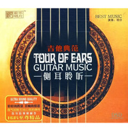

吉他典范 侧耳聆听
============================

|  |  |
| :--: | :-- |
| [ 吉他典范 侧耳聆听](https://emumo.xiami.com/album/373118) | **艺人**: [陈焕明](../index.md) **语种**: 国语 **唱片公司**: 广州音像 **发行时间**: 2009年01月01日 **专辑类别**: 合集, 杂锦 **专辑风格**: 国语流行 Mandarin Pop **播放数**: 5026560 **收藏数**: 2947 **评论数**: 163  |

## 简介

《吉他典范侧耳聆听》吉它，缘于人类手指赋予的灵气，被称之为最富人性的乐器。其低婉时如细雨缠绵，激烈时如万马奔腾，魅力之表现让人惊叹。专辑音色清脆动人且温馨旖丽，不禁展示了精彩绝伦的空间感，而且带出吉他音箱共鸣声的无限通透。就如在您身边演奏一般，自由、惬意、浪漫……各类名曲瞬间再现，令人心驰神往，无尽回味！来自天堂的声音，大师级精湛制作，完美打造出顶级质感的吉他经典。轻轻的拨弦，美婉的情思，荡气回肠，打动心弦的演绎，百分百顶级制作。 

## 曲目

## 评论

|  |  |  |
| :-- | :-- | :-- |
|  [虾米用户](https://emumo.xiami.com/u/49987160)  2021-01-01 13:36 赞(0) 踩(0) | 
好听好听
 |
|  [虾米用户](https://emumo.xiami.com/u/412524994) 经典永传唱 2020-11-19 21:01 赞(0) 踩(0) | 
我明说吧，我是明仔的粉
 |
|  [虾米用户](https://emumo.xiami.com/u/412524994) 经典永传唱 2020-11-19 21:00 赞(0) 踩(0) | 
吉它大师明仔，我下载大师好几曲
 |
|  [虾米用户](https://emumo.xiami.com/u/434770048)  2020-10-03 13:55 赞(0) 踩(0) | 
神仙专辑
 |
|  [虾米用户](https://emumo.xiami.com/u/248257249)  2020-07-09 08:24 赞(0) 踩(0) | 
都是熟悉的曲目，神奇的是每一个弹拨都打在我的心尖，洗净我一路的风尘，让我宁心静气(^o^)
 |
|  [虾米用户](https://emumo.xiami.com/u/252028021) 灵魂之旅 2020-04-25 22:35 赞(0) 踩(0) | 
好
 |
|  [虾米用户](https://emumo.xiami.com/u/431200640) 我还没想好要写什么... 2019-11-24 18:52 赞(0) 踩(0) | 
寂静之声的幽远，让心空灵！
 |
|  [虾米用户](https://emumo.xiami.com/u/133617466) 缘点 2019-11-02 13:33 赞(0) 踩(0) | 
好棒的音乐 
 |
|  [虾米用户](https://emumo.xiami.com/u/401239407)  2019-09-09 00:02 赞(1) 踩(0) | 
 
 |
|  [虾米用户](https://emumo.xiami.com/u/255817209)  2019-08-09 20:32 赞(0) 踩(0) | 
非常喜欢
 |
|  [虾米用户](https://emumo.xiami.com/u/335796906)  2019-07-28 23:30 赞(0) 踩(0) | 
动人心弦，伴唱也很美
 |
|  [虾米用户](https://emumo.xiami.com/u/13053187)  2019-06-30 04:50 赞(6) 踩(0) | 
很好的一个专辑
 |
|  [虾米用户](https://emumo.xiami.com/u/5555764) 阿Ken 2019-05-26 14:10 赞(1) 踩(0) | 
精品
 |
|  [虾米用户](https://emumo.xiami.com/u/32231879) Eine kosmisc... 2019-05-11 10:59 赞(0) 踩(0) | 
.
 |
|  [虾米用户](https://emumo.xiami.com/u/336844542)  2019-03-20 10:07 赞(0) 踩(0) | 
简单的旋律，好听！
 |
|  [虾米用户](https://emumo.xiami.com/u/260803728)  2019-01-21 12:59 赞(0) 踩(0) | 
  1
 |
|  [虾米用户](https://emumo.xiami.com/u/302830785)  2018-03-04 15:15 赞(3) 踩(0) | 
******
 |
|  [虾米用户](https://emumo.xiami.com/u/12677642)   2018-02-12 11:52 赞(1) 踩(0) | 
明仔呢张我真系一首首听佐好多次啊 
 |
|  [虾米用户](https://emumo.xiami.com/u/55372958) 没有什么是一闭眼不能解决... 2017-12-28 04:26 赞(1) 踩(0) | 
搞不懂这和吉他心语哪个才算正牌 曲目都完全一样！一开始以为小虾米又淘气了，，去论坛扒了无损曲目也完全一样，，去年下了心语的无损和m4a对比看频谱是一模一样的，希望这张不会这样坑吧，，，，，不对劲吧？两张一模一样的专辑？？
 |
|  [虾米用户](https://emumo.xiami.com/u/8039463)  2017-10-12 13:20 赞(0) 踩(0) | 
不错，有木村好夫的神韵！
 |
|  [虾米用户](https://emumo.xiami.com/u/10707847)  2017-05-16 18:51 赞(1) 踩(0) | 
好！
 |
|  [虾米用户](https://emumo.xiami.com/u/2957981)  2017-03-25 18:28 赞(1) 踩(0) | 
Good!
 |
|  [虾米用户](https://emumo.xiami.com/u/34342328) Linedance 2016-12-17 11:52 赞(1) 踩(0) | 
Good!
 |
|  [虾米用户](https://emumo.xiami.com/u/34342328) Linedance 2016-12-17 11:52 赞(1) 踩(0) | 
Good!
 |
|  [虾米用户](https://emumo.xiami.com/u/1643164) 阳光淌过手心天空笑了笑！ 2016-12-05 10:37 赞(1) 踩(0) | 
喜欢~_~
 |
|  [虾米用户](https://emumo.xiami.com/u/10001073) surprise me 2016-07-24 18:10 赞(1) 踩(0) | 
很巧，这张专辑的歌曲我也很喜欢
 |
|  [虾米用户](https://emumo.xiami.com/u/100015852) Armi 2016-06-13 09:01 赞(1) 踩(0) | 
编曲很好，弦乐配吉它效果超赞，录音品质称的上试音天碟级别。
 |
|  [虾米用户](https://emumo.xiami.com/u/41378699)  2016-03-01 10:30 赞(1) 踩(0) | 
喜欢
 |
|  [虾米用户](https://emumo.xiami.com/u/11384569) 我还没想好要写什么... 2016-02-18 03:57 赞(2) 踩(0) | 
古典吉他,明仔,
 |
|  [虾米用户](https://emumo.xiami.com/u/43679632) YH 2016-02-08 11:28 赞(1) 踩(0) | 
好听，平复烦躁心情。
 |
|  [虾米用户](https://emumo.xiami.com/u/13016463) 吉祥如意，如意吉祥~ 2016-02-03 15:02 赞(1) 踩(0) | 
明仔
 |
|  [虾米用户](https://emumo.xiami.com/u/6463750) 清风拂山岗 2015-12-21 15:43 赞(0) 踩(0) | 
很好听！
 |
|  [虾米用户](https://emumo.xiami.com/u/43524825)  2015-12-07 18:50 赞(0) 踩(0) | 
一直喜欢吉它弹奏的音乐！
 |
|  [虾米用户](https://emumo.xiami.com/u/79504346)  2015-11-26 10:48 赞(0) 踩(0) | 
静静的淡淡的
 |
|  [虾米用户](https://emumo.xiami.com/u/36304301)  2015-11-07 22:13 赞(0) 踩(0) | 
只因你带来的旋律，让夜色也变得温柔～
 |
|  [虾米用户](https://emumo.xiami.com/u/77602074)  2015-10-29 10:05 赞(0) 踩(0) | 
吉他
 |
|  [虾米用户](https://emumo.xiami.com/u/49151447) 无划痕 2015-10-23 10:21 赞(0) 踩(0) | 
你在远方
 |
|  [虾米用户](https://emumo.xiami.com/u/5532351) 大千世界音乐给你带来享受 2015-10-11 09:24 赞(0) 踩(0) | 
谢谢发布者！不错的吉他纯音乐,
 |
|  [虾米用户](https://emumo.xiami.com/u/14412299)  2015-10-08 20:08 赞(0) 踩(0) | 
古董级古典
 |
|  [虾米用户](https://emumo.xiami.com/u/48441063)  2015-09-24 17:43 赞(0) 踩(0) | 
用心听～
 |
|  [虾米用户](https://emumo.xiami.com/u/803402)  2015-07-22 11:15 赞(0) 踩(0) | 
听之令人心灵陈静。
 |
|  [虾米用户](https://emumo.xiami.com/u/8526267)  2015-07-11 11:13 赞(0) 踩(0) | 
《吉他典范侧耳聆听》其低婉时如细雨缠绵，激烈时如万马奔腾，魅力之表现让人惊叹……百分百顶级制
 |
|  [虾米用户](https://emumo.xiami.com/u/12453640) let be 2015-05-13 12:09 赞(0) 踩(0) | 
有谁还有累死的专辑推荐
 |
|  [虾米用户](https://emumo.xiami.com/u/43038327)  2015-05-07 02:02 赞(0) 踩(0) | 
听开头真以为标题党呢，后来好了
 |
|  [虾米用户](https://emumo.xiami.com/u/43038327)  2015-05-07 02:01 赞(0) 踩(0) | 
失望！好杂乱
 |
|  [虾米用户](https://emumo.xiami.com/u/5605834)  2015-04-14 08:43 赞(0) 踩(0) | 
轻悠的吉他
 |
|  [虾米用户](https://emumo.xiami.com/u/30849419)  2015-04-03 18:03 赞(0) 踩(0) | 
喜欢５０多年了
 |
|  [虾米用户](https://emumo.xiami.com/u/2436742) 音乐，是可以依靠的朋友！ 2015-03-06 22:40 赞(0) 踩(0) | 
好听！
 |
|  [虾米用户](https://emumo.xiami.com/u/517656) 你也喜欢我的歌吗？ 2015-02-28 15:41 赞(3) 踩(0) | 
《吉他典范侧耳聆听》吉它，缘于人类手指赋予的灵气，被称之为最富人性的乐器。其低婉时如细雨缠绵，激烈时如万马奔腾，魅力之表现让人惊叹。专辑音色清脆动人且温馨旖丽，不禁展示了精彩绝伦的空间感，而且带出吉他音箱共鸣声的无限通透。就如在您身边演奏一般，自由、惬意、浪漫……各类名曲瞬间再现
 |
|  [虾米用户](https://emumo.xiami.com/u/47293971) 你说什么?_? 2015-02-14 23:39 赞(0) 踩(0) | 
好好听阿
 |
|  [虾米用户](https://emumo.xiami.com/u/46948997)  2015-02-05 03:15 赞(1) 踩(0) | 
很高的品质，纯的吉他》
 |
|  [虾米用户](https://emumo.xiami.com/u/3884709)  2015-02-03 12:37 赞(0) 踩(0) | 
编曲不错，弹的更不错
 |
|  [虾米用户](https://emumo.xiami.com/u/46493656)  2015-01-26 12:01 赞(0) 踩(0) | 
澄澈如一股清泉，轻轻流入心田....
 |
|  [虾米用户](https://emumo.xiami.com/u/23130671) 热爱生活 热爱音乐 2015-01-19 15:18 赞(1) 踩(0) | 
很耐听，功力和曲目都很不错
 |
|  [虾米用户](https://emumo.xiami.com/u/355865) Let it go, l... 2014-12-20 09:43 赞(0) 踩(0) | 
mark
 |
|  [虾米用户](https://emumo.xiami.com/u/41977692)  2014-10-04 14:25 赞(0) 踩(0) | 
喜欢
 |
|  [虾米用户](https://emumo.xiami.com/u/8675316)  2014-09-24 18:11 赞(0) 踩(0) | 
ok
 |
|  [虾米用户](https://emumo.xiami.com/u/26405049) 暂无签名~ 2014-09-13 11:51 赞(0) 踩(0) | 
很棒的
 |
|  [虾米用户](https://emumo.xiami.com/u/6988484)  2014-08-05 13:27 赞(0) 踩(0) | 
很喜欢这种节奏！轻盈好听
 |
|  [虾米用户](https://emumo.xiami.com/u/3169953)  2014-07-10 21:37 赞(0) 踩(0) | 
觉得挺好听
 |
|  [虾米用户](https://emumo.xiami.com/u/37430080) 爱音乐、爱虾米 2014-06-13 15:27 赞(0) 踩(0) | 
指尖舞蹈
 |
|  [虾米用户](https://emumo.xiami.com/u/13418445) 音乐是世界语言 2014-06-04 17:29 赞(0) 踩(0) | 
晚上听很有感觉
 |
|  [虾米用户](https://emumo.xiami.com/u/4733784)  2014-05-27 23:31 赞(0) 踩(0) | 
轻轻合上双眼，轻启一段生命中的永恒之约。
 |
|  [虾米用户](https://emumo.xiami.com/u/7972748) love~ 2014-05-14 15:40 赞(0) 踩(0) | 
love guitar ~no reason
 |
|  [虾米用户](https://emumo.xiami.com/u/9933215)  2014-04-18 17:50 赞(0) 踩(0) | 
指尖精灵...
 |
|  [虾米用户](https://emumo.xiami.com/u/16640704) 心若向阳 想要多美好  ... 2014-04-05 08:39 赞(0) 踩(0) | 
非常舒服的音乐 能让你无尽的瞎想
 |
|  [虾米用户](https://emumo.xiami.com/u/16640704) 心若向阳 想要多美好  ... 2014-04-05 08:38 赞(0) 踩(0) | 
让心情放个假的音乐
 |
|  [虾米用户](https://emumo.xiami.com/u/13392119)  2014-03-15 16:25 赞(0) 踩(0) | 
静心音乐
 |
|  [虾米用户](https://emumo.xiami.com/u/31248560)  2014-03-12 17:54 赞(0) 踩(0) | 
侧耳倾听
 |
|  [虾米用户](https://emumo.xiami.com/u/20464532) ||:C | G | A... 2014-02-11 16:20 赞(0) 踩(0) | 
寂静之声是不是和小平&amp;lt;彻夜未眠&amp;gt;相似呢?
 |
|  [虾米用户](https://emumo.xiami.com/u/20464132) musicboy 2014-02-09 01:09 赞(0) 踩(0) | 
有喜欢的粤语老歌,晚上听很有感觉!要是有吉他谱就好了!自己弹弹.
 |
|  [虾米用户](https://emumo.xiami.com/u/3412050)  2014-01-28 12:16 赞(0) 踩(0) | 
喜欢的吉他
 |
|  [虾米用户](https://emumo.xiami.com/u/31789366) √氺淉味 2014-01-17 18:02 赞(0) 踩(0) | 
很好听，很喜欢
 |
|  [虾米用户](https://emumo.xiami.com/u/15293778) 李亚璇 2013-12-04 20:05 赞(0) 踩(0) | 
听着这么美的琴声，感觉着弹吉他的手指很美。
 |
|  [虾米用户](https://emumo.xiami.com/u/13618199)  2013-11-01 08:44 赞(0) 踩(0) | 
好听
 |
|  [虾米用户](https://emumo.xiami.com/u/676912)  2013-10-23 17:08 赞(0) 踩(0) | 
@dodeer
 |
|  [虾米用户](https://emumo.xiami.com/u/24722317)  2013-10-17 19:45 赞(0) 踩(0) | 
吉他一直是我的最爱。
 |
|  [虾米用户](https://emumo.xiami.com/u/5926158) 暂无签名~ 2013-10-08 15:36 赞(0) 踩(0) | 
不错的吉他
 |
|  [虾米用户](https://emumo.xiami.com/u/1577426)  2013-09-24 16:58 赞(0) 踩(0) | 
ok
 |
|  [虾米用户](https://emumo.xiami.com/u/13947983)  2013-09-12 05:30 赞(0) 踩(0) | 
说的都是
 |
|  [虾米用户](https://emumo.xiami.com/u/986466)  2013-09-03 23:02 赞(0) 踩(0) | 
通透的世界
 |
|  [虾米用户](https://emumo.xiami.com/u/20893651)  2013-09-01 21:54 赞(0) 踩(0) | 
我很喜欢，明快 休闲 宁静
 |
|  [虾米用户](https://emumo.xiami.com/u/20164032)  2013-08-24 20:05 赞(0) 踩(0) | 
吉他纯音
 |
|  [虾米用户](https://emumo.xiami.com/u/8402469)  2013-08-19 11:57 赞(0) 踩(0) | 
吉他弹出感情，弹出故事和回忆
 |
|  [虾米用户](https://emumo.xiami.com/u/19437149)  2013-08-16 12:30 赞(0) 踩(0) | 
\(^o^)/~
 |
|  [虾米用户](https://emumo.xiami.com/u/717455)  2013-07-12 13:20 赞(0) 踩(0) | 
纯净
 |
|  [虾米用户](https://emumo.xiami.com/u/2379117)  2013-07-06 00:12 赞(0) 踩(0) | 
舒服，thanks for sharing!
 |
|  [虾米用户](https://emumo.xiami.com/u/13898201) 爱音乐爱生活 2013-06-28 12:07 赞(1) 踩(0) | 
谢谢分享。
 |
|  [虾米用户](https://emumo.xiami.com/u/6666449)  2013-06-18 20:03 赞(0) 踩(0) | 
喜欢就这么简单
 |
|  [虾米用户](https://emumo.xiami.com/u/1117282)  2013-06-11 23:49 赞(0) 踩(0) | 
12345678
 |
|  [虾米用户](https://emumo.xiami.com/u/9620510) 挂怀不如忘了 2013-06-08 17:24 赞(0) 踩(0) | 
好听至极
 |
|  [虾米用户](https://emumo.xiami.com/u/15827298)  2013-06-06 21:12 赞(0) 踩(0) | 
很好听。适合做餐厅广播背景。
 |
|  [虾米用户](https://emumo.xiami.com/u/14861201)  2013-05-12 22:19 赞(0) 踩(0) | 
赞，非常恬静的音乐。
 |
|  [虾米用户](https://emumo.xiami.com/u/2401450)  2013-05-04 11:35 赞(1) 踩(0) | 
好听至极的吉他音乐
 |
|  [虾米用户](https://emumo.xiami.com/u/13804057) 不再交集 2013-04-28 21:40 赞(0) 踩(0) | 
想起来那些年弹吉他的时光.....
 |
|  [虾米用户](https://emumo.xiami.com/u/2152041) 人生如此 浮生如斯 2013-04-25 14:58 赞(0) 踩(0) | 
赞
 |
|  [虾米用户](https://emumo.xiami.com/u/9538717) 看天~发呆~抽烟~~~ 2013-04-24 22:59 赞(0) 踩(0) | 
纯音乐,吉他典范
 |
|  [虾米用户](https://emumo.xiami.com/u/1093180) 听一听 2013-04-23 12:30 赞(0) 踩(0) | 
喜欢
 |
|  [虾米用户](https://emumo.xiami.com/u/4450336)  2013-04-22 10:52 赞(0) 踩(0) | 
吉他。我的爱。
 |
|  [虾米用户](https://emumo.xiami.com/u/11142205)  2013-04-21 17:15 赞(0) 踩(0) | 
很美的调调
 |
|  [虾米用户](https://emumo.xiami.com/u/13618485)  2013-04-19 23:27 赞(0) 踩(0) | 
听着非常有feel。谢谢制作者
 |
|  [虾米用户](https://emumo.xiami.com/u/7510715)  2013-04-17 15:10 赞(0) 踩(0) | 
舒缓的纯音乐，静心
 |
|  [虾米用户](https://emumo.xiami.com/u/13972644)  2013-04-16 17:02 赞(0) 踩(0) | 
很美的吉他轻音乐...力荐大家听听.
 |
|  [虾米用户](https://emumo.xiami.com/u/6555515)  2013-04-04 15:53 赞(0) 踩(0) | 
斯卡布罗集市 。。。。。好经典！
 |
|  [虾米用户](https://emumo.xiami.com/u/3387528)  2013-03-24 17:53 赞(0) 踩(0) | 
時而盪氣迴腸時而清心寧靜時而引人入勝
 |
|  [虾米用户](https://emumo.xiami.com/u/12955407)  2013-03-04 17:14 赞(0) 踩(0) | 
好听
 |
|  [虾米用户](https://emumo.xiami.com/u/3864051)  2013-03-04 14:33 赞(0) 踩(0) | 
安逸
 |
|  [虾米用户](https://emumo.xiami.com/u/13290422)  2013-03-01 14:32 赞(0) 踩(0) | 
吉他典范 侧耳聆听
 |
|  [虾米用户](https://emumo.xiami.com/u/13290422)  2013-03-01 14:29 赞(0) 踩(0) | 
吉他典范 侧耳聆听
 |
|  [虾米用户](https://emumo.xiami.com/u/2221552) Wings... 2013-02-23 14:42 赞(0) 踩(0) | 
吉他典范 侧耳聆听
 |
|  [虾米用户](https://emumo.xiami.com/u/8266601) kwok 2013-02-12 02:27 赞(0) 踩(0) | 
very nice
 |
|  [虾米用户](https://emumo.xiami.com/u/12570084)  2013-01-24 12:19 赞(0) 踩(0) | 
可以
 |
|  [虾米用户](https://emumo.xiami.com/u/10599391)  2013-01-22 21:20 赞(0) 踩(0) | 
喜欢听 的吉他轻音乐
 |
|  [虾米用户](https://emumo.xiami.com/u/11155606)  2013-01-21 18:18 赞(0) 踩(0) | 
好听！
 |
|  [虾米用户](https://emumo.xiami.com/u/9134017)  2013-01-03 13:44 赞(0) 踩(0) | 
好听
 |
|  [虾米用户](https://emumo.xiami.com/u/2713326) 合合合合合 2012-12-21 22:09 赞(0) 踩(0) | 
长笛窜的挺有味道 嗯
 |
|  [虾米用户](https://emumo.xiami.com/u/11138239) 在音乐中释放 2012-10-29 22:08 赞(0) 踩(0) | 
很美、很休闲的音乐
 |
|  [虾米用户](https://emumo.xiami.com/u/932093)  2012-10-28 12:40 赞(0) 踩(0) | 
干净，安静
 |
|  [虾米用户](https://emumo.xiami.com/u/10406021)  2012-09-19 12:48 赞(0) 踩(0) | 
很好听的吉它曲！~
 |
|  [虾米用户](https://emumo.xiami.com/u/10406021)  2012-09-19 12:42 赞(0) 踩(0) | 
好听，经典啊！~
 |
|  [虾米用户](https://emumo.xiami.com/u/6831041)  2012-09-10 11:01 赞(0) 踩(0) | 
好正
 |
|  [虾米用户](https://emumo.xiami.com/u/7131024)  2012-09-08 16:21 赞(0) 踩(0) | 
优美
 |
|  [虾米用户](https://emumo.xiami.com/u/38761)  2012-09-05 23:52 赞(0) 踩(0) | 
古典吉他 演奏通俗曲目 很好 经典
 |
|  [虾米用户](https://emumo.xiami.com/u/8792948)  2012-06-21 19:02 赞(0) 踩(0) | 
全是经典哇！
 |
|  [虾米用户](https://emumo.xiami.com/u/9428617)  2012-06-11 23:38 赞(0) 踩(0) | 
适合夜晚听的集子。
 |
|  [虾米用户](https://emumo.xiami.com/u/8542367) 这样  就好 2012-05-14 20:26 赞(0) 踩(0) | 
《天空之城》喜欢，非常的喜欢，能进到心底的音乐……这个版本还不是最好，喜欢它演奏得更纯粹些，没有这么多配乐……
 |
|  [虾米用户](https://emumo.xiami.com/u/4960476)  2012-05-05 13:31 赞(0) 踩(0) | 
好听！！！
 |
|  [虾米用户](https://emumo.xiami.com/u/1822245)  2012-04-27 23:49 赞(0) 踩(0) | 
深情！有点要让人落泪的感觉！
 |
|  [虾米用户](https://emumo.xiami.com/u/6161324)  2012-04-17 13:34 赞(0) 踩(0) | 
那是非常非常的喜欢！
 |
|  [虾米用户](https://emumo.xiami.com/u/8188682)  2012-02-26 14:34 赞(0) 踩(0) | 
拨弦如在弹拨心情
 |
|  [虾米用户](https://emumo.xiami.com/u/5070444) 音乐是最好的“避风塘” 2012-02-23 10:44 赞(1) 踩(0) | 
自由、惬意、浪漫~~指与弦的享受~陶醉~~
 |
|  [虾米用户](https://emumo.xiami.com/u/7747217)  2012-01-29 11:36 赞(0) 踩(0) | 
清新
 |
|  [虾米用户](https://emumo.xiami.com/u/4911720)  2012-01-18 08:59 赞(0) 踩(0) | 
喜欢
 |
|  [虾米用户](https://emumo.xiami.com/u/4911720)  2012-01-18 08:59 赞(0) 踩(0) | 
喜欢
 |
|  [虾米用户](https://emumo.xiami.com/u/4911720)  2012-01-18 08:59 赞(0) 踩(0) | 
喜欢
 |
|  [虾米用户](https://emumo.xiami.com/u/2589562)   2012-01-13 13:16 赞(0) 踩(0) | 
侧耳聆听
 |
|  [虾米用户](https://emumo.xiami.com/u/4705050)  2011-12-02 14:15 赞(0) 踩(0) | 
吉他声清脆动人且温馨旖丽，如在您身边演奏一般，自由、惬意、浪漫
 |
|  [虾米用户](https://emumo.xiami.com/u/2724706)  2011-11-22 13:18 赞(0) 踩(0) | 
好
 |
|  [虾米用户](https://emumo.xiami.com/u/6539739)  2011-11-20 22:58 赞(0) 踩(0) | 
小清新
 |
|  [虾米用户](https://emumo.xiami.com/u/4988171)  2011-11-20 18:31 赞(0) 踩(0) | 
好
 |
|  [虾米用户](https://emumo.xiami.com/u/4988171)  2011-11-20 18:30 赞(0) 踩(0) | 
好
 |
|  [虾米用户](https://emumo.xiami.com/u/6332735) 我还没想好要写什么... 2011-10-25 01:47 赞(0) 踩(0) | 
好听啊。。。
 |
|  [虾米用户](https://emumo.xiami.com/u/610834) 我还没想好要写什么... 2011-10-08 13:47 赞(0) 踩(0) | 
很可惜年轻的时候没下功夫练
 |
|  [虾米用户](https://emumo.xiami.com/u/1864133) 2112 2011-09-03 19:15 赞(0) 踩(0) | 
好听
 |
|  [虾米用户](https://emumo.xiami.com/u/1864133) 2112 2011-09-03 19:14 赞(0) 踩(0) | 
好听
 |
|  [虾米用户](https://emumo.xiami.com/u/4350856) 虾米，已被宋冬野屠版。。 2011-09-03 13:09 赞(0) 踩(0) | 
我喜欢的吉他曲
 |
|  [虾米用户](https://emumo.xiami.com/u/5138173) 爱生活  爱自己 2011-08-23 11:10 赞(0) 踩(0) | 
低婉时如细雨缠绵......魅力之表现让人惊叹   音色清脆动人且温馨旖丽，展示了精彩绝伦的空间感  带出吉他音箱共鸣声的无限通透   如在您身边演奏一般，自由、惬意、浪漫……各类名曲瞬间再现，令人心驰神往，无尽回味！ 轻轻的拨弦，美婉的情思，荡气回肠，打动心弦的演绎...
 |
|  [虾米用户](https://emumo.xiami.com/u/4829063) 在香甜的生活中拉扯拔丝 2011-07-13 11:29 赞(1) 踩(0) | 
柔软的利刃
 |
|  [虾米用户](https://emumo.xiami.com/u/4829063) 在香甜的生活中拉扯拔丝 2011-07-13 11:29 赞(0) 踩(0) | 
柔软的利刃
 |
|  [虾米用户](https://emumo.xiami.com/u/3502636)  2011-06-01 17:00 赞(0) 踩(0) | 
吉他清脆声听起来可以令人忘掉一切烦恼...
 |
|  [虾米用户](https://emumo.xiami.com/u/1052461) @blinK4sy- 2011-05-23 13:04 赞(0) 踩(0) | 
完全没有抵抗力…
 |
|  [虾米用户](https://emumo.xiami.com/u/3444267)  2011-04-10 18:10 赞(0) 踩(0) | 
喜欢
 |
|  [虾米用户](https://emumo.xiami.com/u/2066881) 海的那边~~ 2011-04-06 17:22 赞(0) 踩(0) | 
自由、惬意、浪漫……各类名曲瞬间再现，令人心驰神往，无尽回味！来自天堂的声音，大师级精湛制作，完美打造出顶级质感的吉他经典。轻轻的拨弦，美婉的情思，荡气回肠，打动心弦的演绎，百分百顶级制作。
 |
|  [虾米用户](https://emumo.xiami.com/u/275741)  2011-04-04 13:42 赞(0) 踩(0) | 
就是给前奏搞坏了
 |
|  [虾米用户](https://emumo.xiami.com/u/3348387)  2011-03-25 15:50 赞(0) 踩(0) | 
很好听  太好听了
 |
|  [虾米用户](https://emumo.xiami.com/u/2074755)  2011-03-24 10:10 赞(0) 踩(0) | 
很喜欢这种感觉
 |
|  [虾米用户](https://emumo.xiami.com/u/108436)  2011-03-18 00:17 赞(0) 踩(0) | 
听了一个晚上
 |
|  [虾米用户](https://emumo.xiami.com/u/1603149)  2011-03-17 21:52 赞(0) 踩(0) | 
so nice
 |
|  [虾米用户](https://emumo.xiami.com/u/2462291) 我很愁，可是我有音乐和啤... 2011-02-24 23:11 赞(0) 踩(0) | 
吉他典范侧耳聆听
 |
|  [虾米用户](https://emumo.xiami.com/u/1543392)  2010-09-24 09:32 赞(0) 踩(0) | 
通俗而清新，值得推荐。
 |
|  [虾米用户](https://emumo.xiami.com/u/1186406)  2010-08-28 16:58 赞(0) 踩(0) | 
享受着这音符的渲染
 |
|  [虾米用户](https://emumo.xiami.com/u/1383851)  2010-08-28 11:42 赞(0) 踩(0) | 
每一句说话...
 |
|  [虾米用户](https://emumo.xiami.com/u/1319882)  2010-08-18 20:51 赞(0) 踩(0) | 
指与弦... 的享受
 |
