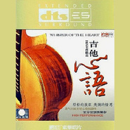

吉他心语
============================

|  |  |
| :--: | :-- |
| [ 吉他心语](https://emumo.xiami.com/album/400679) | **艺人**: [陈焕明](../index.md) **语种**: 其他 **唱片公司**: 索乐唱片 **发行时间**: 2010年03月10日 **专辑类别**: 录音室专辑 **专辑风格**:  **播放数**: 1459133 **收藏数**: 1333 **评论数**: 147  |

## 简介

轻轻的拔弦，美婉的情思，荡气回肠打动心弦的演绎，百分百顶级制作。  
多声道扩展制作技术震撼登场，采用美国最新核心专利技术独立七声道扩展环绕声系统制作。来自天堂的声音，大师级精湛制作，完美打造出顶质感的吉他经典。

## 曲目

## 评论

|  |  |  |  |
| :-- | :-- | :-- | :-- |
|  [虾米用户](https://emumo.xiami.com/u/275732496) 静默如初     聆听美... 2019-07-11 20:32 赞(0) 踩(0) | 

 |
|  [虾米用户](https://emumo.xiami.com/u/407447308)  2019-06-14 16:15 赞(0) 踩(0) | 
好听，我喜欢！大提琴声低沉悠扬，穿扦一些打出乐恰入其份的突出吉他弹音，静静听很美很享受。
 |
|  [虾米用户](https://emumo.xiami.com/u/302422941)  2019-04-07 06:12 赞(0) 踩(0) | 
儿子推荐给我陈焕明吉他曲，真的每首都是我的最爱，太好听了。
 |
|  [虾米用户](https://emumo.xiami.com/u/32231879) Eine kosmisc... 2019-03-19 00:11 赞(0) 踩(0) | 
.
 |
|  [虾米用户](https://emumo.xiami.com/u/5555764) 阿Ken 2019-03-16 19:36 赞(1) 踩(0) | 
这专太棒了
 |
|  [虾米用户](https://emumo.xiami.com/u/244515697) 我还没想好要写什么... 2018-06-30 11:24 赞(1) 踩(0) | 
经典没有之一    
 |
|  [虾米用户](https://emumo.xiami.com/u/308479850) 喜欢上听这演奏 2018-04-24 18:54 赞(0) 踩(0) | 
好听我的最爱。
 |
|  [虾米用户](https://emumo.xiami.com/u/55372958) 没有什么是一闭眼不能解决... 2017-12-28 03:41 赞(1) 踩(0) | 
天空之城主要加了竹笛声，单纯木吉他太过空灵
 |
|  [虾米用户](https://emumo.xiami.com/u/260906993)  2017-11-07 16:20 赞(0) 踩(0) | 
喜欢，好听
 |
|  [虾米用户](https://emumo.xiami.com/u/11547063)  2017-06-08 10:37 赞(0) 踩(0) | 
小哥真会玩 
 |
|  [虾米用户](https://emumo.xiami.com/u/1643164) 阳光淌过手心天空笑了笑！ 2016-12-05 10:59 赞(0) 踩(0) | 
喜欢~_~
 |
|  [虾米用户](https://emumo.xiami.com/u/41378699)  2016-03-01 10:30 赞(0) 踩(0) | 
喜欢
 |
|  [虾米用户](https://emumo.xiami.com/u/39242828)  2016-02-03 22:12 赞(1) 踩(0) | 
偶然听到，从此不再放下，好美的木吉他，超凡脱俗。天空之城，无数遍的听，无数遍的热泪盈眶。陈焕明，终于遇见你......
 |
|  [虾米用户](https://emumo.xiami.com/u/7131757) 我也曾有一只月亮做的指环... 2015-11-26 22:02 赞(0) 踩(0) | 
古典吉他的声音真好听。
 |
|  [虾米用户](https://emumo.xiami.com/u/18691900)  2015-06-10 04:26 赞(0) 踩(0) | 
但愿人长久不是王菲唱那首歌的谱，创作的吗？很好听！
 |
| ⇒ |  [虾米用户](https://emumo.xiami.com/u/40776502) 继续宠爱/不整理别人翻唱... 2015-10-02 00:06 赞(0) 踩(0) | 
不是，是张国荣唱的那首
 |
|  [虾米用户](https://emumo.xiami.com/u/8675316)  2015-04-22 11:39 赞(0) 踩(0) | 
ok
 |
|  [虾米用户](https://emumo.xiami.com/u/11703802)  2015-01-20 15:08 赞(0) 踩(0) | 
很喜欢
 |
|  [虾米用户](https://emumo.xiami.com/u/1676291)  2015-01-07 12:56 赞(0) 踩(0) | 
背景音乐使用，个性心情使用甚佳
 |
|  [虾米用户](https://emumo.xiami.com/u/11648464) ~ 2014-11-01 14:26 赞(0) 踩(0) | 
~
 |
|  [虾米用户](https://emumo.xiami.com/u/12163981)  2014-10-27 21:28 赞(0) 踩(0) | 
放松休闲听着舒服
 |
|  [虾米用户](https://emumo.xiami.com/u/6819224)  2014-09-30 08:47 赞(0) 踩(0) | 
good music
 |
|  [虾米用户](https://emumo.xiami.com/u/8675316)  2014-09-24 18:12 赞(0) 踩(0) | 
ok
 |
|  [虾米用户](https://emumo.xiami.com/u/40236186)  2014-08-21 21:02 赞(0) 踩(0) | 
终于找到了
 |
|  [虾米用户](https://emumo.xiami.com/u/22740874) 此生遇见你已很美 2014-07-11 11:10 赞(0) 踩(0) | 
好听~
 |
|  [虾米用户](https://emumo.xiami.com/u/19381749) 人生没有彩排 2014-06-26 12:55 赞(0) 踩(0) | 
净化心灵的港湾
 |
|  [虾米用户](https://emumo.xiami.com/u/11643877) 姑且听之 2014-06-25 11:41 赞(0) 踩(0) | 
很不错～
 |
|  [虾米用户](https://emumo.xiami.com/u/4733784)  2014-06-17 17:53 赞(0) 踩(0) | 
喜欢
 |
|  [虾米用户](https://emumo.xiami.com/u/10125325)  2014-06-05 15:44 赞(0) 踩(0) | 
喜欢吉他的声音
 |
|  [虾米用户](https://emumo.xiami.com/u/4011548) 不热爱音乐的人是不完整的 2014-06-04 08:42 赞(0) 踩(0) | 
吉他好听
 |
|  [虾米用户](https://emumo.xiami.com/u/2456588)  2014-05-25 12:00 赞(0) 踩(0) | 
闲来静静的欣赏！
 |
|  [虾米用户](https://emumo.xiami.com/u/11339526) 暂无签名~ 2014-05-13 18:47 赞(0) 踩(0) | 
吉他
 |
|  [虾米用户](https://emumo.xiami.com/u/34275349)  2014-04-27 19:38 赞(0) 踩(0) | 
喜欢天空之城
 |
|  [虾米用户](https://emumo.xiami.com/u/1609946) 一即一切 2014-03-18 16:46 赞(0) 踩(0) | 
心 境不二
 |
|  [虾米用户](https://emumo.xiami.com/u/526266) 我不能强迫自己天天签到，... 2014-03-11 15:49 赞(0) 踩(0) | 
贼 好听了
 |
|  [虾米用户](https://emumo.xiami.com/u/10976744) 爱音乐 爱生活 2014-01-02 15:54 赞(0) 踩(0) | 
都是熟悉的经典名曲，好听
 |
|  [虾米用户](https://emumo.xiami.com/u/12281141)  2013-12-05 09:20 赞(0) 踩(0) | 
好
 |
|  [虾米用户](https://emumo.xiami.com/u/17837804)  2013-11-16 23:57 赞(0) 踩(0) | 
舒服
 |
|  [虾米用户](https://emumo.xiami.com/u/18198102)  2013-10-30 14:44 赞(0) 踩(0) | 
请分享 吉他心语专辑的《寂静之声》， 静静地聆听仿佛来自天堂的声音。。
 |
|  [虾米用户](https://emumo.xiami.com/u/20196363)  2013-10-22 14:19 赞(0) 踩(0) | 
每听每感，一种曾经的熟悉；]
 |
|  [虾米用户](https://emumo.xiami.com/u/717455)  2013-10-16 13:00 赞(0) 踩(0) | 
古典吉他,曾经的最爱
 |
|  [虾米用户](https://emumo.xiami.com/u/10157707)  2013-09-22 01:04 赞(0) 踩(0) | 
吉他经典!!!
 |
|  [虾米用户](https://emumo.xiami.com/u/13778629)  2013-08-01 17:44 赞(0) 踩(0) | 
喜欢吉他心语的旋律
 |
|  [虾米用户](https://emumo.xiami.com/u/3823373)  2013-05-15 19:37 赞(0) 踩(0) | 
最喜欢天空之城。前段时间有在学吉他，可惜自己不能坚持到最后，半途而废了
 |
|  [虾米用户](https://emumo.xiami.com/u/3823373)  2013-05-15 19:35 赞(0) 踩(0) | 
最喜欢天空之城，前段时间有在学吉他，可惜自己不能坚持到最后，半途而废了
 |
|  [虾米用户](https://emumo.xiami.com/u/7982477) 属于你我的极品音乐 2013-04-18 09:29 赞(0) 踩(0) | 
雨中的恋人，轻轻的拔弦，美婉的情思，让人沉迷
 |
|  [虾米用户](https://emumo.xiami.com/u/10406021)  2013-03-15 10:24 赞(0) 踩(0) | 
轻轻的拔弦，美婉的情思，荡气回肠打动心弦
 |
|  [虾米用户](https://emumo.xiami.com/u/12777466) easy it 2013-03-13 15:39 赞(0) 踩(0) | 
太喜欢了~~~~
 |
|  [虾米用户](https://emumo.xiami.com/u/13341006)  2013-03-04 14:22 赞(0) 踩(0) | 
..
 |
|  [虾米用户](https://emumo.xiami.com/u/13338729)  2013-03-02 23:33 赞(0) 踩(0) | 
听听其他的是否纯净，先给3分
 |
|  [虾米用户](https://emumo.xiami.com/u/13338729)  2013-03-02 23:29 赞(0) 踩(0) | 
这是我所遇到的吉他演奏最美真的一碟
 |
|  [虾米用户](https://emumo.xiami.com/u/13338729)  2013-03-02 23:28 赞(0) 踩(0) | 
天空之城是我的天空
 |
|  [虾米用户](https://emumo.xiami.com/u/2710662)  2013-02-27 16:08 赞(0) 踩(0) | 
雨中的恋人
 |
|  [虾米用户](https://emumo.xiami.com/u/7880457)  2013-01-20 12:02 赞(1) 踩(0) | 
轻轻的拔弦，美婉的情思，荡气回肠打动心弦的演绎，百分百顶级制作。多声道扩展制作技术震撼登场，采用美国最新核心专利技术独立七声道扩展环绕声系统制作。来自天堂的声音，大师级精湛制作，完美打造出顶质感的吉他经典。
 |
|  [虾米用户](https://emumo.xiami.com/u/1123172)  2013-01-16 11:42 赞(0) 踩(0) | 
干净
 |
|  [虾米用户](https://emumo.xiami.com/u/12310446) Little_denn 2013-01-08 11:50 赞(0) 踩(0) | 
第一次做评价，喜欢就先给三分，因为自己听的音乐太少，没有太多的比较
 |
|  [虾米用户](https://emumo.xiami.com/u/12310446) Little_denn 2013-01-08 11:49 赞(0) 踩(0) | 
可以一个人安静的时候听的音乐
 |
|  [虾米用户](https://emumo.xiami.com/u/12249021)  2013-01-04 00:24 赞(0) 踩(0) | 
安静，柔美
 |
|  [虾米用户](https://emumo.xiami.com/u/9134017)  2013-01-03 13:43 赞(0) 踩(0) | 
喜欢
 |
|  [虾米用户](https://emumo.xiami.com/u/11835655) 程鸿宇 2012-12-14 07:42 赞(1) 踩(0) | 
旋律优美
 |
|  [虾米用户](https://emumo.xiami.com/u/1559530)  2012-12-03 09:49 赞(0) 踩(0) | 
好听
 |
|  [虾米用户](https://emumo.xiami.com/u/1492676) take easy 2012-11-26 15:47 赞(0) 踩(0) | 
好听
 |
|  [虾米用户](https://emumo.xiami.com/u/2015213)   2012-11-20 00:15 赞(0) 踩(0) | 
吉他
 |
|  [虾米用户](https://emumo.xiami.com/u/7514742)  2012-11-18 19:39 赞(0) 踩(0) | 
AAA
 |
|  [虾米用户](https://emumo.xiami.com/u/5506881) Where words ... 2012-11-15 21:32 赞(0) 踩(0) | 
弹出了心声
 |
|  [虾米用户](https://emumo.xiami.com/u/7074555)  2012-11-15 09:17 赞(0) 踩(0) | 
很喜欢吉他曲~
 |
|  [虾米用户](https://emumo.xiami.com/u/2114725)  2012-11-14 22:39 赞(0) 踩(0) | 
画面感很强
 |
|  [虾米用户](https://emumo.xiami.com/u/11037668)  2012-10-13 11:55 赞(0) 踩(0) | 
真的很好听
 |
|  [虾米用户](https://emumo.xiami.com/u/10936934) 天思高远 云逸悠然 2012-10-05 16:33 赞(0) 踩(0) | 
喜欢吉他的音色
 |
|  [虾米用户](https://emumo.xiami.com/u/9002377)  2012-09-24 21:50 赞(0) 踩(0) | 
好听极了。
 |
|  [虾米用户](https://emumo.xiami.com/u/9419697)  2012-08-25 14:42 赞(0) 踩(0) | 
经典名曲的吉他演奏，声效很好
 |
|  [虾米用户](https://emumo.xiami.com/u/3997952) 室不可无音乐 2012-08-10 12:37 赞(1) 踩(0) | 
顶质感的吉他经典
 |
|  [虾米用户](https://emumo.xiami.com/u/7625763)  2012-07-16 10:03 赞(0) 踩(0) | 
心语沉入弦
 |
|  [虾米用户](https://emumo.xiami.com/u/2400333) 签个毛名 2012-06-30 17:39 赞(0) 踩(0) | 
心语
 |
|  [虾米用户](https://emumo.xiami.com/u/4339858)  2012-06-18 21:18 赞(0) 踩(0) | 
很美的曲子
 |
|  [虾米用户](https://emumo.xiami.com/u/8952731)  2012-06-17 20:04 赞(0) 踩(0) | 
令人陶醉的音乐
 |
|  [虾米用户](https://emumo.xiami.com/u/8952731)  2012-06-17 18:01 赞(0) 踩(0) | 
优雅，好听
 |
|  [虾米用户](https://emumo.xiami.com/u/8856467) ，，，，。。。 2012-06-16 11:39 赞(0) 踩(0) | 
舒缓心情
 |
|  [虾米用户](https://emumo.xiami.com/u/5941529) 爱乐五线谱 2012-06-07 19:23 赞(0) 踩(0) | 
唯美动听就是喜欢，特别那首雨中的恋人
 |
|  [虾米用户](https://emumo.xiami.com/u/5941529) 爱乐五线谱 2012-06-07 19:18 赞(0) 踩(0) | 
唯美动听，尤其喜欢雨中的恋人。
 |
|  [虾米用户](https://emumo.xiami.com/u/817663)  2012-06-06 23:39 赞(0) 踩(0) | 
十年后，转眼成云烟
 |
|  [虾米用户](https://emumo.xiami.com/u/9336132)  2012-06-01 12:06 赞(0) 踩(0) | 
拨动心弦触碰心底触摸心底那细碎而浓软的思绪和回忆
 |
|  [虾米用户](https://emumo.xiami.com/u/9179565)  2012-05-15 15:24 赞(0) 踩(0) | 
就是很喜欢
 |
|  [虾米用户](https://emumo.xiami.com/u/5392632)  2012-05-01 21:55 赞(0) 踩(0) | 
轻轻的拔弦，美婉的情思，荡气回肠打动心弦的演绎，百分百顶级制作。
 |
|  [虾米用户](https://emumo.xiami.com/u/5392632)  2012-05-01 21:54 赞(0) 踩(0) | 
喜欢这个专辑！
 |
|  [虾米用户](https://emumo.xiami.com/u/5392632)  2012-05-01 21:54 赞(0) 踩(0) | 
非常喜欢这个专辑！
 |
|  [虾米用户](https://emumo.xiami.com/u/8510308)  2012-04-25 06:48 赞(0) 踩(0) | 
小时候的小爱好，但是没有学成。
 |
|  [虾米用户](https://emumo.xiami.com/u/7438768)  2012-04-10 11:00 赞(0) 踩(0) | 
舒缓
 |
|  [虾米用户](https://emumo.xiami.com/u/3100274)  2012-04-06 08:51 赞(0) 踩(0) | 
心情愉悦，放松，音乐优美。
 |
|  [虾米用户](https://emumo.xiami.com/u/8549844)  2012-03-31 00:43 赞(0) 踩(0) | 
很不错的吉他曲，最喜欢天空之城
 |
|  [虾米用户](https://emumo.xiami.com/u/6197335)  2012-03-12 23:24 赞(0) 踩(0) | 
浅浅的木吉他诠释经典一种更靠近内心的拨动
 |
|  [虾米用户](https://emumo.xiami.com/u/5761912)  2012-03-07 17:26 赞(0) 踩(0) | 
喜欢
 |
|  [虾米用户](https://emumo.xiami.com/u/5070444) 音乐是最好的“避风塘” 2012-02-23 09:42 赞(0) 踩(0) | 
喜爱~
 |
|  [虾米用户](https://emumo.xiami.com/u/5007823)  2012-02-21 15:00 赞(0) 踩(0) | 
吉他
 |
|  [虾米用户](https://emumo.xiami.com/u/1822948)  2012-02-20 18:30 赞(0) 踩(0) | 
好听的吉他曲~~
 |
|  [虾米用户](https://emumo.xiami.com/u/7655506) 高尚 2012-01-15 10:24 赞(0) 踩(0) | 
天逸9000A搭接 惠威-杜希2.3 简直没法言表了！！耳朵受不了
 |
|  [虾米用户](https://emumo.xiami.com/u/386233)  2011-12-25 15:10 赞(0) 踩(0) | 
对吉他声音没有抵抗力
 |
|  [虾米用户](https://emumo.xiami.com/u/3610983)  2011-12-17 09:28 赞(0) 踩(0) | 
实在太好听了，很轻很纯。也很欢快，穿透力很强
 |
|  [虾米用户](https://emumo.xiami.com/u/3924005)  2011-12-16 12:24 赞(0) 踩(0) | 
有个心境要表达
 |
|  [虾米用户](https://emumo.xiami.com/u/6600305)  2011-12-06 06:26 赞(0) 踩(0) | 
明仔
 |
|  [虾米用户](https://emumo.xiami.com/u/4960476)  2011-12-02 19:44 赞(0) 踩(0) | 
好听！！！精彩！！！
 |
|  [虾米用户](https://emumo.xiami.com/u/6670956)  2011-11-27 08:49 赞(0) 踩(0) | 
百听不厌！
 |
|  [虾米用户](https://emumo.xiami.com/u/5591862)  2011-11-15 22:52 赞(0) 踩(0) | 
吉他轻音乐
 |
|  [虾米用户](https://emumo.xiami.com/u/298615) 暂无签名~ 2011-11-13 12:12 赞(0) 踩(0) | 
杨坤的“那一天”和“哪里的天空不下雨” ，曲调很象！
 |
|  [虾米用户](https://emumo.xiami.com/u/5032056) 律师也离不开音乐 2011-11-09 00:18 赞(0) 踩(0) | 
很悦耳的纯音，经典名曲的吉他纯音版
 |
|  [虾米用户](https://emumo.xiami.com/u/5032056) 律师也离不开音乐 2011-11-09 00:02 赞(0) 踩(0) | 
Good
 |
|  [虾米用户](https://emumo.xiami.com/u/6565498)  2011-11-02 15:40 赞(0) 踩(0) | 
很喜欢，没说的
 |
|  [虾米用户](https://emumo.xiami.com/u/1949403)  2011-10-23 15:43 赞(0) 踩(0) | 
明亮的吉他声音
 |
|  [虾米用户](https://emumo.xiami.com/u/5135402)  2011-10-20 08:10 赞(0) 踩(0) | 
一份回忆，好多熟悉的歌，谢谢分享！
 |
|  [虾米用户](https://emumo.xiami.com/u/5077522)  2011-09-14 15:16 赞(0) 踩(0) | 
( ⊙o⊙ )哇！！！这个吉他心语这里也有，我曾经下载过两遍，还曾经将那首雨中的恋人作为空间主页音乐，好音乐继续收藏吧~~
 |
|  [虾米用户](https://emumo.xiami.com/u/5180862)  2011-09-03 21:15 赞(0) 踩(0) | 
我喜欢的音乐，要讲里面所有的歌，都弹会！
 |
|  [虾米用户](https://emumo.xiami.com/u/5573846)  2011-08-25 22:13 赞(0) 踩(0) | 
纯洁的爱，曾经的爱。
 |
|  [虾米用户](https://emumo.xiami.com/u/3837197)  2011-08-25 16:36 赞(0) 踩(0) | 
纯纯的吉他声，那么的纯净。
 |
|  [虾米用户](https://emumo.xiami.com/u/5536061)  2011-08-24 12:41 赞(0) 踩(0) | 
淡淡的、弦动的声音，喜欢！
 |
|  [虾米用户](https://emumo.xiami.com/u/2436742) 音乐，是可以依靠的朋友！ 2011-08-23 16:03 赞(0) 踩(0) | 
听着心静。
 |
|  [虾米用户](https://emumo.xiami.com/u/1163412) 冥想 2011-08-20 16:23 赞(0) 踩(0) | 
很安静，平和，适合一个人静静的享受。。。
 |
|  [虾米用户](https://emumo.xiami.com/u/1831887)  2011-08-12 23:42 赞(0) 踩(0) | 
这么好的音乐没人评价！我来评！相当不错！
 |
|  [虾米用户](https://emumo.xiami.com/u/1438991)  2011-07-30 16:25 赞(0) 踩(0) | 
好享受啊！
 |
|  [虾米用户](https://emumo.xiami.com/u/2766336)   2011-06-05 22:11 赞(0) 踩(0) | 
淡淡的心曲，淡淡的人生
 |
|  [虾米用户](https://emumo.xiami.com/u/1246149)  2011-06-04 12:37 赞(0) 踩(0) | 
像今天雨后晴朗的都江堰，
 |
|  [虾米用户](https://emumo.xiami.com/u/3842404)  2011-05-23 14:04 赞(0) 踩(0) | 
心水
 |
|  [虾米用户](https://emumo.xiami.com/u/1052461) @blinK4sy- 2011-05-23 13:02 赞(0) 踩(0) | 
吉他心语.
 |
|  [虾米用户](https://emumo.xiami.com/u/3271836)  2011-05-18 11:09 赞(0) 踩(0) | 
经典的吉他声
 |
|  [虾米用户](https://emumo.xiami.com/u/3036159)  2011-05-15 10:32 赞(0) 踩(0) | 
明仔
 |
|  [虾米用户](https://emumo.xiami.com/u/1460293)  2011-05-14 18:13 赞(0) 踩(0) | 
很好！
 |
|  [虾米用户](https://emumo.xiami.com/u/3894282)  2011-05-10 12:39 赞(0) 踩(0) | 
喜欢得说不出话了
 |
|  [虾米用户](https://emumo.xiami.com/u/3872142)  2011-05-10 11:59 赞(0) 踩(0) | 
淡定
 |
|  [虾米用户](https://emumo.xiami.com/u/3841601)  2011-05-05 18:57 赞(0) 踩(0) | 
干净，舒服。
 |
|  [虾米用户](https://emumo.xiami.com/u/3834726)  2011-05-05 00:12 赞(0) 踩(0) | 
喜欢。。
 |
|  [虾米用户](https://emumo.xiami.com/u/3286199)  2011-04-16 23:45 赞(0) 踩(0) | 
卡萨布兰卡 天空之城！！！！！！！！！！！
 |
|  [虾米用户](https://emumo.xiami.com/u/2295513)  2011-04-12 10:50 赞(0) 踩(0) | 
放鬆的心情，與自己親密同在，不論相遇的對象是誰，內心的柔軟連接著愛和美。幸福洋溢在她自在的臉上
 |
|  [虾米用户](https://emumo.xiami.com/u/2066881) 海的那边~~ 2011-04-06 17:10 赞(0) 踩(0) | 
很好，很放松！
 |
|  [虾米用户](https://emumo.xiami.com/u/31659)  2011-04-05 11:59 赞(0) 踩(0) | 
总让人回忆其198x那个温馨的年代
 |
|  [虾米用户](https://emumo.xiami.com/u/3325183)  2011-03-27 23:55 赞(0) 踩(0) | 
木吉他曲子，还不错
 |
|  [虾米用户](https://emumo.xiami.com/u/3334045)  2011-03-27 10:50 赞(0) 踩(0) | 
就是喜欢
 |
|  [虾米用户](https://emumo.xiami.com/u/2750079)  2011-03-25 20:03 赞(0) 踩(0) | 
放松、静心
 |
|  [虾米用户](https://emumo.xiami.com/u/3330383)   2011-03-24 00:40 赞(0) 踩(0) | 
好听
 |
|  [虾米用户](https://emumo.xiami.com/u/104114)  2011-03-23 19:20 赞(0) 踩(0) | 
明仔
 |
|  [虾米用户](https://emumo.xiami.com/u/3253189)  2011-03-19 14:33 赞(0) 踩(0) | 
完美的吉他旋律
 |
|  [虾米用户](https://emumo.xiami.com/u/2880208)  2011-03-06 22:17 赞(0) 踩(0) | 
清音满屋，浮想连篇。
 |
|  [虾米用户](https://emumo.xiami.com/u/1458308) 我还没想好要写什么... 2011-02-18 13:03 赞(0) 踩(0) | 
无名的演绎，特别的诠释
 |
|  [虾米用户](https://emumo.xiami.com/u/2844532) 心随乐动 2011-02-17 11:42 赞(0) 踩(0) | 
声声拨动你心弦
 |
|  [虾米用户](https://emumo.xiami.com/u/2067865)  2011-01-23 20:54 赞(0) 踩(0) | 
非常干净的吉他曲 谢谢分享！
 |
|  [虾米用户](https://emumo.xiami.com/u/2576800)  2011-01-22 16:07 赞(0) 踩(0) | 
美妙的天籁声
 |
|  [虾米用户](https://emumo.xiami.com/u/1857058)  2010-11-07 02:09 赞(0) 踩(0) | 
真的找了好久,,,,,,,,终于找到自己喜欢的音乐了,,,,
 |
|  [虾米用户](https://emumo.xiami.com/u/522205) 一切很美，音為有你﹏ 2010-09-13 14:24 赞(0) 踩(0) | 
演奏得不错 发烧级享受~
 |
|  [虾米用户](https://emumo.xiami.com/u/895167)  2010-09-08 14:26 赞(0) 踩(0) | 
好
 |
