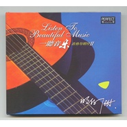
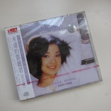
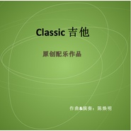

陈焕明
============================

|  |  |
| :--: | :-- |
| [ 陈焕明](https://i.xiami.com/mingzaimusic) | **播放数**: 6822703 **粉丝数**: 1890 **评论数**: 87 **地区**: China 中国大陆 **风格**: 流行 Pop, 管弦乐 Orchestral  |

## 档案

陈焕明（明仔） 简介： 
职业音乐制作人，作曲、编曲、职业录音吉他手。 
师从国内泰斗苦修传统与现代作曲技术，擅长流行音乐制作和大型管弦乐、大型合唱编写。

## 专辑

| 名称 | 语种 | 唱片公司 | 发行时间 | 专辑类别 | 专辑风格 |
| :--: | :-- | :-- | :-- | :-- | :-- |
| [ 一听音乐 吉他与明仔II](./albums/2100207350.md) | 国语 | 柏菲音乐 | 2015年08月21日 | 录音室专辑 |  |
| [ 一听音乐3 吉他与明仔](./albums/492112453.md) | 国语 | 柏菲音乐 | 2013年12月19日 | 录音室专辑 |  |
| [ 吉他心语](./albums/400679.md) | 其他 | 索乐唱片 | 2010年03月10日 | 录音室专辑 |  |
| [ 吉他典范 侧耳聆听](./albums/373118.md) | 国语 | 广州音像 | 2009年01月01日 | 合集, 杂锦 | 国语流行 Mandarin Pop |
| [ 永远的邓丽君 吉它篇](./albums/429949.md) | 其他 | 九洲音像 | 2001年11月01日 | 录音室专辑 |  |
| [ classic](./albums/2104968415.md) | 国语 |  | 不详 | 录音室专辑 | 古典音乐 Classical |
| [ 一路高歌](./albums/2104962986.md) | 国语 |  | 不详 | EP, 单曲 | 流行摇滚 Pop Rock |

## 评论

|  |  |  |  |
| :-- | :-- | :-- | :-- |
|  [虾米用户](https://emumo.xiami.com/u/434152246) 聪明少一些大智慧多一些，... 2020-02-16 15:08 赞(0) 踩(0) | 

 |
|  [虾米用户](https://emumo.xiami.com/u/358104299) 悲观的唯心存在现实解构虚... 2020-02-15 14:57 赞(0) 踩(0) | 
14726
 |
|  [虾米用户](https://emumo.xiami.com/u/257542066)  2020-01-26 19:42 赞(2) 踩(0) | 
在这浮躁的社会，欣赏您的音乐是一种享受。
 |
|  [虾米用户](https://emumo.xiami.com/u/430351276)  2020-01-06 01:16 赞(0) 踩(0) | 
好听
 |
|  [虾米用户](https://emumo.xiami.com/u/334316278) 我还没想好要写什么... 2019-05-26 01:49 赞(1) 踩(0) | 
慢慢欣赏
 |
|  [虾米用户](https://emumo.xiami.com/u/32231879) Eine kosmisc... 2019-03-19 00:10 赞(2) 踩(0) | 
.
 |
|  [虾米用户](https://emumo.xiami.com/u/357394088)  2019-01-11 10:58 赞(2) 踩(0) | 
好多版权没有了呢
 |
|  [虾米用户](https://emumo.xiami.com/u/326075021)  2018-12-15 22:33 赞(1) 踩(0) | 
一直喜欢和支持你！
 |
|  [虾米用户](https://emumo.xiami.com/u/320221760)  2018-11-19 21:44 赞(1) 踩(0) | 
88
 |
|  [虾米用户](https://emumo.xiami.com/u/320221760)  2018-11-19 21:44 赞(1) 踩(0) | 
图        你好
 |
|  [虾米用户](https://emumo.xiami.com/u/296814799) 有没有卖半岛铁盒？ 2018-02-23 17:32 赞(3) 踩(0) | 
陈老师弹得一手好吉他！
 |
|  [虾米用户](https://emumo.xiami.com/u/163555006)   2018-01-09 23:38 赞(2) 踩(0) | 
好想知道陈焕明老师的那些专辑在哪里能听
 |
|  [虾米用户](https://emumo.xiami.com/u/4268650) 我还没想好要写什么... 2017-10-19 00:54 赞(2) 踩(0) | 
请帮阿兰·达瓦卓玛写一首好歌吧！
 |
|  [虾米用户](https://emumo.xiami.com/u/281406423)  2017-10-16 17:17 赞(3) 踩(0) | 
最喜欢的吉他手，没有之一了
 |
|  [虾米用户](https://emumo.xiami.com/u/285342803) 从今天开始爱上音乐 2017-10-14 07:49 赞(2) 踩(0) | 
今天有空来听听陈焕明老师的其他作品
 |
|  [虾米用户](https://emumo.xiami.com/u/287603498) 兴趣 ~ 喜欢车，音乐，... 2017-09-29 10:40 赞(8) 踩(0) | 
听他弹吉他~真的是一种享受，很好听。   
 |
|  [虾米用户](https://emumo.xiami.com/u/285342803) 从今天开始爱上音乐 2017-09-24 05:41 赞(3) 踩(0) | 
《昨天》是我听到的最美的一首吉他弹奏
 |
|  [虾米用户](https://emumo.xiami.com/u/285342803) 从今天开始爱上音乐 2017-09-22 02:01 赞(2) 踩(0) | 
昨天就很经典
 |
|  [虾米用户](https://emumo.xiami.com/u/188175140) 品 味 2017-07-28 22:46 赞(1) 踩(0) | 
熄了灯，钻被窝里，静静地听
 |
|  [虾米用户](https://emumo.xiami.com/u/687527) im who i am 2017-06-24 15:34 赞(3) 踩(0) | 
超棒的吉他！不知道比多少当红流行歌手棒
 |
|  [虾米用户](https://emumo.xiami.com/u/78166078)  2017-05-29 23:16 赞(2) 踩(0) | 
我喜欢的歌曲很多都被弹出来了，太棒了
 |
|  [虾米用户](https://emumo.xiami.com/u/10707847)  2017-05-16 22:24 赞(1) 踩(0) | 
好！
 |
|  [虾米用户](https://emumo.xiami.com/u/3271294)  2017-04-23 06:49 赞(2) 踩(0) | 
就他了，真是太棒了！
 |
|  [虾米用户](https://emumo.xiami.com/u/250821757)  2016-12-12 13:06 赞(2) 踩(0) | 
喧闹的城市就需要这份宁静。
 |
|  [虾米用户](https://emumo.xiami.com/u/1643164) 阳光淌过手心天空笑了笑！ 2016-12-05 10:40 赞(0) 踩(0) | 
喜欢~_~
 |
|  [虾米用户](https://emumo.xiami.com/u/10001073) surprise me 2016-07-24 18:11 赞(0) 踩(0) | 
喜欢，这淡淡的吉他弦
 |
|  [虾米用户](https://emumo.xiami.com/u/41484595)  2016-03-29 19:36 赞(1) 踩(0) | 
沁人心脾
 |
|  [虾米用户](https://emumo.xiami.com/u/9943562) 多数盗版碟在02年发行 2015-12-29 11:55 赞(1) 踩(0) | 
主标题：陈焕明副标题：明仔图片：<a href="http://zjphoto.yinsha.com/file/201207/2012071116344261/4.jpg" target="_blank" rel="nofollow noreferrer noopener">http://zjphoto.yinsha.com/file/201207/2012071116344261/4.jpg</a> 但有LOGO。参考：<a href="http://www.behinders.com/profile/102335" target="_blank" rel="nofollow noreferrer noopener">http://www.behinders.com/profile/102335</a><a href="http://www.perfectmusic.cn/artist/1978200270.html" target="_blank" rel="nofollow noreferrer noopener">http://www.perfectmusic.cn/artist/1978200270.html</a>
 |
| ⇒ |  [虾米用户](https://emumo.xiami.com/u/6630660) 猜赢涂口红… 2015-12-29 12:06 赞(0) 踩(0) | 
<a href="http://szb.gdzjdaily.com.cn/zjwb/res/1/20120713/65581342167462484.jpg" target="_blank" rel="nofollow noreferrer noopener">http://szb.gdzjdaily.com.cn/zjwb/res/1/20120713/65581342167462484.jpg</a>陈焕明，广东著名吉他手、音乐制作人、湛江籍流行音乐人。陈焕明从初中开始便深深爱上了音乐，先后在湛江市歌舞团和广州湾夜总会工作过。1991年，为实现自己的音乐梦想，他离开了湛江，到江门、惠州、深圳、云南和福建等地方做乐手，2000年，陈焕明去到了广州，认识很多音乐圈的朋友，慢慢走上了音乐制作之路。至今为止，陈焕明参与了不少电影的吉他录音，其中有任达华主演的电影《守望者》中的吉他录音，《爱在屋檐下》、《柠檬树》等的音乐制作。
 |
|  [虾米用户](https://emumo.xiami.com/u/534922) 愚蠢的人类 2015-12-15 15:17 赞(0) 踩(0) | 
发现野生老大一只
 |
|  [虾米用户](https://emumo.xiami.com/u/49710149)   2015-08-08 19:30 赞(1) 踩(0) | 
想知道明仔是谁。。喜欢。。 
 |
| ⇒ |  [虾米用户](https://emumo.xiami.com/u/9943562) 多数盗版碟在02年发行 2015-12-29 11:54 赞(0) 踩(0) | 
陈焕明
 |
|  [虾米用户](https://emumo.xiami.com/u/11648464) ~ 2014-11-01 14:26 赞(0) 踩(0) | 
~
 |
|  [虾米用户](https://emumo.xiami.com/u/13552)  2014-10-28 09:34 赞(1) 踩(0) | 
天空之城
 |
|  [虾米用户](https://emumo.xiami.com/u/10251045)  2014-10-02 16:51 赞(0) 踩(0) | 
赞...
 |
|  [虾米用户](https://emumo.xiami.com/u/11659190) I am unique 2014-09-04 13:24 赞(0) 踩(0) | 
超级超级好听
 |
|  [虾米用户](https://emumo.xiami.com/u/2195529)  2014-04-16 23:27 赞(0) 踩(0) | 
赞
 |
|  [虾米用户](https://emumo.xiami.com/u/22849786) 我还没想好要写什么... 2014-04-15 11:25 赞(0) 踩(0) | 
我也叫明仔
 |
|  [虾米用户](https://emumo.xiami.com/u/35347706)  2014-04-14 11:22 赞(1) 踩(0) | 
稀罕这种节奏吉他.
 |
|  [虾米用户](https://emumo.xiami.com/u/10130735) 不能失去感动 2014-03-25 13:45 赞(0) 踩(0) | 
是回忆学生时代的声音
 |
|  [虾米用户](https://emumo.xiami.com/u/11389164)  2014-01-10 13:44 赞(2) 踩(0) | 
******
 |
|  [虾米用户](https://emumo.xiami.com/u/10435106) 听靓歌 2014-01-08 03:25 赞(0) 踩(0) | 
喜欢.
 |
|  [虾米用户](https://emumo.xiami.com/u/10989202) 如戈滴行板 2013-08-10 09:15 赞(0) 踩(0) | 
支持国产
 |
|  [虾米用户](https://emumo.xiami.com/u/10989202) 如戈滴行板 2013-08-10 09:15 赞(0) 踩(0) | 
支持国产
 |
|  [虾米用户](https://emumo.xiami.com/u/11906345) 埋没在音乐中 2013-06-21 00:50 赞(0) 踩(0) | 
很棒的吉他
 |
|  [虾米用户](https://emumo.xiami.com/u/12962610)  2013-06-05 05:32 赞(0) 踩(0) | 
推荐给@刘元旦
 |
|  [虾米用户](https://emumo.xiami.com/u/13962081)  2013-05-29 12:57 赞(0) 踩(0) | 
悠远
 |
|  [虾米用户](https://emumo.xiami.com/u/14562430)  2013-05-22 10:10 赞(0) 踩(0) | 
恬静的乐感
 |
|  [虾米用户](https://emumo.xiami.com/u/12168632)  2013-04-20 18:47 赞(0) 踩(0) | 
叮叮当当
 |
|  [虾米用户](https://emumo.xiami.com/u/1012636)  2013-04-16 10:02 赞(0) 踩(0) | 
吉他控
 |
|  [虾米用户](https://emumo.xiami.com/u/4755566) 音樂力量 2013-03-22 16:50 赞(0) 踩(0) | 
Guitar Music
 |
|  [虾米用户](https://emumo.xiami.com/u/2643880)  2013-02-04 15:26 赞(0) 踩(0) | 
吉他玄音
 |
|  [虾米用户](https://emumo.xiami.com/u/12677127) 用音乐净化我们的灵魂 2013-02-02 04:44 赞(0) 踩(0) | 
空明
 |
|  [虾米用户](https://emumo.xiami.com/u/12109665)  2012-12-28 15:01 赞(0) 踩(0) | 
非常好听
 |
|  [虾米用户](https://emumo.xiami.com/u/5007823)  2012-12-08 11:51 赞(1) 踩(0) | 
轻静、遥远、深邃、幽静,
 |
|  [虾米用户](https://emumo.xiami.com/u/11772050)  2012-12-03 16:41 赞(0) 踩(0) | 
谢谢分享
 |
|  [虾米用户](https://emumo.xiami.com/u/9071631)  2012-11-26 17:50 赞(0) 踩(0) | 
非常喜歡
 |
|  [虾米用户](https://emumo.xiami.com/u/8281389)  2012-11-11 21:50 赞(0) 踩(0) | 
纯美纯音
 |
|  [虾米用户](https://emumo.xiami.com/u/2803515)  2012-10-18 23:06 赞(1) 踩(0) | 
很棒的琴音，喜欢
 |
|  [虾米用户](https://emumo.xiami.com/u/1017624)  2012-09-18 22:41 赞(0) 踩(0) | 
第一首就震撼了。继续。。。
 |
|  [虾米用户](https://emumo.xiami.com/u/10569741)  2012-09-17 09:50 赞(0) 踩(0) | 
寂静
 |
|  [虾米用户](https://emumo.xiami.com/u/10406021)  2012-09-13 12:31 赞(0) 踩(0) | 
很喜欢吉它音
 |
|  [虾米用户](https://emumo.xiami.com/u/5091339)  2012-09-11 11:03 赞(0) 踩(0) | 
好听的吉他
 |
|  [虾米用户](https://emumo.xiami.com/u/1674939) 开始素食 2012-09-04 14:39 赞(1) 踩(0) | 
CG- -#
 |
|  [虾米用户](https://emumo.xiami.com/u/9209719)  2012-09-04 01:47 赞(0) 踩(0) | 
安静
 |
|  [虾米用户](https://emumo.xiami.com/u/6895907) 一只快乐的烤咩咩。。 2012-07-04 16:41 赞(0) 踩(0) | 
喜欢明仔。。只有虾米能找到你啊。。
 |
|  [虾米用户](https://emumo.xiami.com/u/9636990)  2012-06-30 01:53 赞(0) 踩(0) | 
就是喜欢
 |
|  [虾米用户](https://emumo.xiami.com/u/2819260)  2012-06-27 22:47 赞(0) 踩(0) | 
明仔到底是谁？？
 |
|  [虾米用户](https://emumo.xiami.com/u/3711871)  2012-05-21 21:34 赞(0) 踩(0) | 
纯音乐
 |
|  [虾米用户](https://emumo.xiami.com/u/1694491)  2012-04-17 03:40 赞(0) 踩(0) | 
我也喜欢吉他，无他
 |
|  [虾米用户](https://emumo.xiami.com/u/3235848)  2012-04-13 19:43 赞(0) 踩(0) | 
肿么没资料介绍 。。明仔是谁
 |
|  [虾米用户](https://emumo.xiami.com/u/7067515)  2012-04-01 11:22 赞(0) 踩(0) | 
寂静之声
 |
|  [虾米用户](https://emumo.xiami.com/u/5070444) 音乐是最好的“避风塘” 2012-02-23 11:11 赞(1) 踩(0) | 
他是谁？
 |
|  [虾米用户](https://emumo.xiami.com/u/958470)  2012-01-12 20:53 赞(0) 踩(0) | 
轻音乐，喜欢
 |
|  [虾米用户](https://emumo.xiami.com/u/5488267)  2011-12-19 11:56 赞(0) 踩(0) | 
好听
 |
|  [虾米用户](https://emumo.xiami.com/u/6836386)  2011-11-18 14:19 赞(0) 踩(0) | 
轻音乐
 |
|  [虾米用户](https://emumo.xiami.com/u/6144842)  2011-11-07 08:17 赞(0) 踩(0) | 
明仔
 |
|  [虾米用户](https://emumo.xiami.com/u/6218868) 纳米虾 2011-10-12 15:59 赞(0) 踩(0) | 
能使人安静
 |
|  [虾米用户](https://emumo.xiami.com/u/6218868) 纳米虾 2011-10-12 15:56 赞(0) 踩(0) | 
非常喜欢
 |
|  [虾米用户](https://emumo.xiami.com/u/4087879)  2011-08-26 20:33 赞(0) 踩(0) | 
我喜欢斯卡保罗集市！！经典~~~
 |
|  [虾米用户](https://emumo.xiami.com/u/2796452)  2011-08-17 19:32 赞(0) 踩(0) | 
多声道扩展制作技术震撼登场，采用美国最新核心专利技术独立七声道扩展环绕声系统制作。来自天堂的声音，大师级精湛制作，完美打造出顶质感的吉他经典
 |
|  [虾米用户](https://emumo.xiami.com/u/3244743)  2011-07-06 20:22 赞(0) 踩(0) | 
明仔是谁？
 |
|  [虾米用户](https://emumo.xiami.com/u/1052461) @blinK4sy- 2011-05-23 13:01 赞(0) 踩(0) | 
师从何处?
 |
|  [虾米用户](https://emumo.xiami.com/u/3902323)  2011-05-11 03:09 赞(0) 踩(0) | 
吉他
 |
|  [虾米用户](https://emumo.xiami.com/u/1073274)  2011-03-24 11:10 赞(0) 踩(0) | 
安静的调调
 |
|  [虾米用户](https://emumo.xiami.com/u/1436732)  2011-03-23 08:35 赞(0) 踩(0) | 
偶然听到
 |
|  [虾米用户](https://emumo.xiami.com/u/480505)  2010-09-27 16:22 赞(0) 踩(0) | 
占楼
 |
