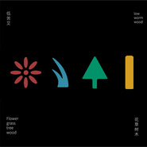
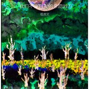
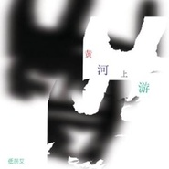
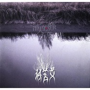

低苦艾
============================

|  |  |
| :--: | :-- |
| [ 低苦艾](https://i.xiami.com/dikuai) | **播放数**: 23197303 **粉丝数**: 38379 **评论数**: 694 **地区**: China 中国大陆 **风格**: 摇滚 Rock & Roll, 世界节拍 Worldbeat, 城市民谣 Urban Folk, 民谣 Folk  |

## 档案

低苦艾乐队，2012年华语传媒最佳乐队、阿比鹿最佳专辑、阿比鹿年度单曲、中国摇滚20年最佳唱片得主。低苦艾乐队以西北人特有的豪情与胸襟检视自己打量世界，将一缕黄河上吹来的风，一捧祁连山上的雪，一块黄土高原的泥土，揉和成一道不矫揉造作但痛快淋漓，不苟合但绝不疏离内心的风情，以独立自持的态度做着自己的音乐。他们的音乐风格独立、迷幻，质朴的民谣根基，多元的配器及丰富的采样，使他们的音乐又有很浓的实验及民族色彩。真挚自然的表达他们对世界的立场，他们对生活的体悟。中国西北最具代表性的乐队之一。 
他们的音乐像一壶刚烈的西北老酒，甘醇清冽，后劲十足，捕捉着对生命脆弱的美态，打量这个世界目光明敏，细致入微，有一种深邃掩藏在诗化的语言和音乐后面，互相密而不宣却又和谐无痕。如果能从他们的音乐中打捞到清洁与美，你就发现了那个从现实的虚幻转向内心真实的拐角处。 
乐队成员： 
Vocal/Guitar:Liu Kun 
木吉它/主唱：刘堃 
Guitar:San Er 
吉它：周旭东 
Bass:Xi Bin 
贝司：席斌 
Drums:Dou Tao 
鼓与打击：窦涛 
乐队大事记： 
2003年乐队成立。 
2004年—2005年乐队开始专场演出及小型巡演。 
2005年11月《通俗歌曲》专访。 
2006年1月《我爱摇滚乐》发表单曲《张开冰冷的双臂跳跃》。 
2006年1月《我爱摇滚乐》专访。 
2006年2月单曲《渡》收录于《华族》合辑中。 
2006年3月发行乐队首张EP－－《苦艾酒》。 
2006年3月上海《SH》英文杂志专访。 
2006年4月乐队开始名为“无声处”的全国十五城市巡演。 
2006年4月接受英国BBC电台专访。 
2006年5月参加第七届迷笛音乐节。 
2006年8月《通俗歌曲》发表乐队单曲《苦艾酒》。 
2006年9月参加成都西部音乐节。 
2006年10月《滚石》中文版对乐队进行专访。 
2006年10月《口袋音乐》专访。 
2006年10月《口袋音乐》发表乐队单曲《玄》。 
2006年12月《通俗歌曲》中国摇滚20年特刊专访。 
2006年12月乐队单曲《另一个方向》收录于《口袋音乐精选1》。 
2007年1月乐队签约口袋音乐。 
2007年5月乐队新专辑《低苦艾》发行。 
2007年5月参加第八届迷笛音乐节。 
2007年6月《我爱摇滚乐》专访。 
2007年6月《挽歌》收录于《爱摇》第6期。 
2007年6月《通俗歌曲》专访。 
2007年7月乐队进行全国12城市第二轮巡演。 
2007年10月参加“摩登天空音乐节”演出。 
2007年10月参加“丽江雪山音乐节”演出。 
2008年3月《中国摇滚20年》专访。 
2008年5月发行乐队第三张唱片EP《黄河上游》。 
2008年10月签约兵马司唱片。 
2008年10月参加“摩登天空音乐节”。 
2008年10月参加第九届“迷笛音乐节”。 
2009年1月发行新唱片《我们不由自主的亲吻对方》。 
2009年10月全国22城市巡演。 
2009年10月参加“海峡音乐节”。 
2010年3月至5月参加“在行动”系列募捐义演， 
2010年5月参加“高墩营艺术节”。 
2010年6月开始第五张唱片的录制。 
2010年9月青岛“金沙滩音乐节”。 
2011年4月获华语金曲榜2011年春季最佳专辑。 
2011年9月发行新唱片《兰州 兰州》 
2011年10月参加摩登天空音乐节 
2011年10月中国22城巡演 
2012年1月获2011豆瓣阿比鹿音乐奖的 民谣类年度专辑、民谣类年度单曲 两个奖项。 
2012年1月参加雪山音乐节。 
2012年 3月乐队主唱个人欧洲巡演。 
2012年4月“影响”城市音乐节。 
2012年5月 参加迷笛音乐节。 
2012年6月 获“华语音乐传媒--最佳乐队”大奖。 
2012年7月西南5城联演. 
2012 年8月参加海上丝路音乐节. 
2012年9月参加东海音乐节. 
2012年10月参加梦象音乐节. 
2012年11月参加广州“彼岸花开”音乐节 
2013年1月参加天津“城市群英”音乐节 
2013年2月 兰州新年音乐会。 
2013年5月参加北、上、广 三地迷笛音乐节。 
2013年5月参加梦象音乐节。 
2013年6月参加西安森林公园音乐节。 
2013年6月参加扬州瓜洲音乐节。 
2013年8月发行第6张全长唱片《守望者》。

## 专辑

| 名称 | 语种 | 唱片公司 | 发行时间 | 专辑类别 | 专辑风格 |
| :--: | :-- | :-- | :-- | :-- | :-- |
| [ 一天](./albums/2102871935.md) | 国语 | 摩登天空 | 2017年12月20日 | 录音室专辑 |  |
| [ 午夜歌手](./albums/2100210674.md) | 国语 | 摩登天空 | 2015年10月22日 | 录音室专辑 | 民谣摇滚 Folk Rock |
| [ 花草树木](./albums/1413855261.md) | 国语 | 摩登天空 | 2014年10月21日 | EP, 单曲 |  |
| [ 守望者The Watcher](./albums/180257497.md) | 国语 | 兵马司, BMG | 2013年10月20日 | 录音室专辑 | 民谣摇滚 Folk Rock |
| [ 兰州 兰州Lanzhou Lanzhou](./albums/469724.md) | 国语 | 兵马司, BMG | 2011年09月30日 | 录音室专辑 | 城市民谣 Urban Folk |
| [ 我们不由自主的亲吻对方](./albums/316046.md) | 国语 | 兵马司, BMG | 2008年12月24日 | 录音室专辑 | 城市民谣 Urban Folk |
| [ 五指](./albums/308573.md) | 国语 | 不插店 | 2008年11月11日 | EP, 单曲 | 城市民谣 Urban Folk |
| [ 黄河上游](./albums/199254.md) | 国语 | 者来寨唱片 | 2008年05月15日 | EP, 单曲 | 城市民谣 Urban Folk |
| [ 低苦艾](./albums/32847.md) | 国语 | 口袋唱片 | 2007年05月06日 | 录音室专辑 | 城市民谣 Urban Folk |
| [ 苦艾酒](./albums/32849.md) | 国语 | 者来寨唱片 | 2006年03月07日 | EP, 单曲 | 城市民谣 Urban Folk |

## 评论

|  |  |  |  |
| :-- | :-- | :-- | :-- |
|  [虾米用户](https://emumo.xiami.com/u/7882047) ↗这家伙试听了很多曲子！ 2021-01-16 06:01 赞(0) 踩(0) | 
主唱谢天笑吗 
 |
|  [虾米用户](https://emumo.xiami.com/u/1800831) Hi！ 2021-01-03 21:54 赞(1) 踩(0) | 

 |
|  [虾米用户](https://emumo.xiami.com/u/357700640)  2020-10-27 15:59 赞(1) 踩(0) | 
在中山桥边听这歌，才知道什么是兰州的城市气质
 |
|  [虾米用户](https://emumo.xiami.com/u/40651018) 唯爱音乐 2020-04-29 18:12 赞(1) 踩(0) | 
这歌最近没评论呢吗
 |
|  [虾米用户](https://emumo.xiami.com/u/3357649) 我还没想好要写什么... 2020-01-07 18:54 赞(1) 踩(0) | 
兰州这首歌呢
 |
|  [虾米用户](https://emumo.xiami.com/u/68824810) 别把我的消息带回家乡，时... 2019-08-16 17:53 赞(2) 踩(0) | 
别再沉淀了，是时候出山了，快去参加乐队的夏天吧，我在那里等你们 
 |
|  [虾米用户](https://emumo.xiami.com/u/39383116) 生活没有音乐，就是一个错... 2019-04-01 08:37 赞(3) 踩(0) | 
刘堃是不是写过一本书
 |
|  [虾米用户](https://emumo.xiami.com/u/346165752)  2019-03-08 18:44 赞(1) 踩(0) | 

 |
|  [虾米用户](https://emumo.xiami.com/u/4026326)  2019-01-18 22:37 赞(1) 踩(0) | 
红与黑去哪里了，为什么被删
 |
|  [虾米用户](https://emumo.xiami.com/u/52395373) 我还没想好要写什么... 2018-10-11 08:37 赞(1) 踩(0) | 
。
 |
|  [虾米用户](https://emumo.xiami.com/u/49189821) 只有我 2018-04-29 02:50 赞(1) 踩(0) | 
粉一下 很喜欢
 |
|  [虾米用户](https://emumo.xiami.com/u/20177386) 感谢一切美好的遇见❤️ 2018-04-27 01:38 赞(1) 踩(0) | 

 |
|  [虾米用户](https://emumo.xiami.com/u/354486396)  2018-03-26 19:43 赞(0) 踩(0) | 
赞赞赞。兰州兰州~
 |
|  [虾米用户](https://emumo.xiami.com/u/17066279)   2018-03-09 02:47 赞(0) 踩(0) | 
初二那年在暖岛网上买了两张低苦艾乐队签名专辑 爱上一发不可收拾 不知不觉 时间那么快啊 都大一了
 |
|  [虾米用户](https://emumo.xiami.com/u/54142860)  2018-02-16 19:29 赞(1) 踩(0) | 
想不起来当初怎么知道他们，反正现在我跟很喜欢听他们的歌
 |
|  [虾米用户](https://emumo.xiami.com/u/9666828) 打入地狱 再踏上一万脚 2018-02-10 13:46 赞(10) 踩(0) | 
主流导向的低俗引导着消费那些垃圾音乐 真正触及灵魂深处的音乐没有市场 人们宁愿花大把钱去媚俗的看一个被驯化的呕像歌手在台上像杂技团的猴子一样蹦跳 也不愿施舍一分钱蹲在大街上看一个要饭的但是音乐作品出自自己灵魂深处的歌手低吟浅唱
 |
| ⇒ |  [虾米用户](https://emumo.xiami.com/u/1612799) 狂药 2018-02-11 08:54 赞(0) 踩(0) | 
完全赞同你的说法，垃圾音乐，猴子漫天飞
 |
|  [虾米用户](https://emumo.xiami.com/u/125089920) 找到北方啦 2017-12-22 17:53 赞(0) 踩(0) | 
低苦艾
 |
|  [虾米用户](https://emumo.xiami.com/u/75860202)  2017-12-04 09:22 赞(2) 踩(0) | 
20171203厦门站打卡！
 |
|  [虾米用户](https://emumo.xiami.com/u/301770391)   2017-12-03 15:08 赞(2) 踩(0) | 
2017年12月2日晚，深圳B10现场听了低苦艾乐队最后演唱了这首歌。。。真的很赞，虽然已经是老歌了
 |
|  [虾米用户](https://emumo.xiami.com/u/54302732) 就像一个多鸟的夏天 2017-12-01 23:06 赞(2) 踩(0) | 
广州场很满足啦！
 |
| ⇒ |  [虾米用户](https://emumo.xiami.com/u/50729548) 聆听 @小石头up 2018-02-25 12:00 赞(0) 踩(0) | 
tu凸那场
 |
|  [虾米用户](https://emumo.xiami.com/u/315808396)  2017-11-29 17:54 赞(1) 踩(0) | 
宁波巡演
 |
|  [虾米用户](https://emumo.xiami.com/u/49748006) Fly me to th... 2017-11-11 02:07 赞(0) 踩(0) | 
满足了！开心！
 |
|  [虾米用户](https://emumo.xiami.com/u/681448) 你应该是一棵树，或者一条... 2017-11-05 23:12 赞(0) 踩(0) | 

 |
|  [虾米用户](https://emumo.xiami.com/u/342703) 生れて，すみません。 2017-10-30 10:15 赞(2) 踩(0) | 
前段时间疯狂的迷恋上了苦艾酒，浓郁的茴香味儿和苦艾脑的涩味，89.9度的烈酒喝着烧心但是特别让人迷醉。我觉得“低苦艾”这个名字特别贴切，不见得好听，但是让人很共鸣。就像苦艾酒一样，粗糙并细腻着。
 |
|  [虾米用户](https://emumo.xiami.com/u/194424675) 我还没想好要写什么... 2017-10-28 11:57 赞(0) 踩(0) | 
昨晚西宁打卡报道，表示新专辑很棒
 |
|  [虾米用户](https://emumo.xiami.com/u/57294) 女子。 2017-10-27 23:00 赞(3) 踩(0) | 
超级喜欢你们的歌曲。尤其是那首兰州兰州。虽然人不在兰州，但是每每听到这首歌，都仿佛都回到了兰州，挤107路公交车，喝啤酒，吃手抓牛肉面，白塔山，兰州车站，西关，西站。。。还有一大群狐朋狗友。。。想你们了。
 |
|  [虾米用户](https://emumo.xiami.com/u/47004271) 松散生命 2017-10-17 11:37 赞(0) 踩(0) | 
；
 |
|  [虾米用户](https://emumo.xiami.com/u/11763865)  2017-10-16 21:05 赞(0) 踩(0) | 

 |
|  [虾米用户](https://emumo.xiami.com/u/47004271) 松散生命 2017-10-12 15:54 赞(0) 踩(0) | 
低苦艾也算是我青春的一部分了 听到现在已经六年了
 |
|  [虾米用户](https://emumo.xiami.com/u/47004271) 松散生命 2017-10-12 15:52 赞(3) 踩(0) | 
♛11.11烟台见
 |
|  [虾米用户](https://emumo.xiami.com/u/366311)  2017-10-02 20:38 赞(1) 踩(0) | 
★★★★★强力推荐。喜欢这类型的童鞋可以听下我的歌曲♥精选集。
 |
|  [虾米用户](https://emumo.xiami.com/u/44350732) 暂无签名~ 2017-09-23 18:16 赞(1) 踩(0) | 
17年，杭州草莓音乐节，堃哥现场帅爆了！
 |
|  [虾米用户](https://emumo.xiami.com/u/596793) endless 2017-09-10 18:26 赞(2) 踩(0) | 
在外漂泊多年，听了低苦艾的旋律，总是想家
 |
|  [虾米用户](https://emumo.xiami.com/u/320801876) 爱是痛 2017-08-22 11:14 赞(1) 踩(0) | 
你唱的真好
 |
|  [虾米用户](https://emumo.xiami.com/u/46853761) 额，好吧 2017-05-15 00:13 赞(1) 踩(0) | 
呵呵
 |
|  [虾米用户](https://emumo.xiami.com/u/6254198)  2017-05-02 13:20 赞(3) 踩(0) | 
这就是李志定西里面的刘堃吗？
 |
| ⇒ |  [虾米用户](https://emumo.xiami.com/u/172921474) 我还没想好要写什么... 2017-05-16 16:25 赞(0) 踩(0) | 
是的
 |
| ⇒ |  [虾米用户](https://emumo.xiami.com/u/320801876) 爱是痛 2017-08-22 11:15 赞(0) 踩(0) | 
<q><b>命若琴弦说：</b></q>
 |
| ⇒ |  [虾米用户](https://emumo.xiami.com/u/59517762)   2017-11-25 23:41 赞(0) 踩(0) | 
对
 |
|  [虾米用户](https://emumo.xiami.com/u/224956484) 目前没什么可以辩解的。 2017-03-19 21:00 赞(0) 踩(0) | 
树为鼓起了掌 刷刷的摇动我的树枝 叶子噗噗的落
 |
|  [虾米用户](https://emumo.xiami.com/u/83893196) 我还没想好要写什么... 2017-03-04 21:19 赞(0) 踩(0) | 
667
 |
|  [虾米用户](https://emumo.xiami.com/u/253433664)  2017-02-26 10:43 赞(0) 踩(0) | 
下架了。。
 |
|  [虾米用户](https://emumo.xiami.com/u/270566679) 只为了李宗盛和林忆莲下的... 2017-02-20 23:46 赞(2) 踩(0) | 
心疼网易没版权…
 |
|  [虾米用户](https://emumo.xiami.com/u/27879049) 溜儿圆 2017-01-29 22:45 赞(0) 踩(0) | 
大中国
 |
|  [虾米用户](https://emumo.xiami.com/u/27857090) 有朝一日 2017-01-13 10:49 赞(0) 踩(0) | 
稳
 |
|  [虾米用户](https://emumo.xiami.com/u/5074150) 一直前行 2017-01-08 18:35 赞(0) 踩(0) | 
代表了一段刻骨铭心的回忆
 |
|  [虾米用户](https://emumo.xiami.com/u/186466150) 我还没想好要写什么... 2016-12-26 02:33 赞(1) 踩(0) | 
今晚听了现场，感动
 |
|  [虾米用户](https://emumo.xiami.com/u/18985669) 悲观过界 2016-10-30 09:09 赞(2) 踩(0) | 
昨晚厦门草莓音乐节，真心的打动我了
 |
|  [虾米用户](https://emumo.xiami.com/u/53611496) 我还没想好要写什么... 2016-10-16 16:20 赞(4) 踩(0) | 
昨天去的草莓，听的兰州，看的苦艾。
 |
|  [虾米用户](https://emumo.xiami.com/u/17452254)  2016-09-05 15:44 赞(0) 踩(0) | 
西北
 |
|  [虾米用户](https://emumo.xiami.com/u/588121) 我还没想好要写什么... 2016-08-19 19:43 赞(4) 踩(0) | 
红与黑好过其他很多吧，都是聋子的啊
 |
|  [虾米用户](https://emumo.xiami.com/u/51995800) 用梦想诠释成长 2016-08-18 16:24 赞(0) 踩(0) | 
马拉足球
 |
|  [虾米用户](https://emumo.xiami.com/u/212975959)  2016-08-16 10:53 赞(0) 踩(0) | 
帅～
 |
|  [虾米用户](https://emumo.xiami.com/u/46235338)  2016-08-12 20:31 赞(0) 踩(0) | 
像这样有风格的音乐似乎为数不多
 |
|  [虾米用户](https://emumo.xiami.com/u/207820935) 爱生活爱音乐 2016-08-07 16:28 赞(10) 踩(0) | 
作为一个兰州人为低苦艾感到自豪
 |
|  [虾米用户](https://emumo.xiami.com/u/50656271)  2016-08-04 15:45 赞(2) 踩(0) | 
成都草莓，我接待的低苦艾    很好的回忆
 |
|  [虾米用户](https://emumo.xiami.com/u/172326826)  2016-07-29 11:35 赞(1) 踩(0) | 
兰州兰州
 |
|  [虾米用户](https://emumo.xiami.com/u/201137829) 爱 被伤 爱 被伤 累了... 2016-07-15 11:41 赞(0) 踩(0) | 
已去成都草莓音乐节，棒棒哒 低苦艾
 |
|  [虾米用户](https://emumo.xiami.com/u/48041476) 疯子 2016-06-19 10:02 赞(1) 踩(0) | 
最幸福巴萨小花花
 |
|  [虾米用户](https://emumo.xiami.com/u/122688364) 生在愤坑，长在赤圈；挣脱 2016-06-18 23:47 赞(0) 踩(0) | 
1306
 |
|  [虾米用户](https://emumo.xiami.com/u/56853242)  2016-06-02 13:04 赞(0) 踩(0) | 
长沙草莓我要听你们的现场 
 |
|  [虾米用户](https://emumo.xiami.com/u/56853242)  2016-06-02 13:03 赞(0) 踩(0) | 
干散
 |
|  [虾米用户](https://emumo.xiami.com/u/50412520)  2016-05-30 01:45 赞(0) 踩(0) | 
我喜欢你们的风格
 |
|  [虾米用户](https://emumo.xiami.com/u/111078998)  2016-05-25 19:39 赞(0) 踩(0) | 
听多了都是泪
 |
|  [虾米用户](https://emumo.xiami.com/u/172831934)  2016-05-18 18:49 赞(1) 踩(0) | 
攒劲
 |
|  [虾米用户](https://emumo.xiami.com/u/34781912) 喝醉了 他的梦 晚安 2016-05-09 14:03 赞(2) 踩(0) | 
一首歌爱上一个城市系列 兰州兰州
 |
|  [虾米用户](https://emumo.xiami.com/u/43173766) 算了我放下了   再会吧... 2016-05-06 09:15 赞(0) 踩(0) | 
真心不喜欢
 |
| ⇒ |  [虾米用户](https://emumo.xiami.com/u/32540522) 多米奔溃了：I 2016-05-08 08:55 赞(0) 踩(0) | 
试试过几年再听？
 |
| ⇒ |  [虾米用户](https://emumo.xiami.com/u/37592735) 青春像花永远开在心里 2016-05-15 08:28 赞(0) 踩(0) | 
出门右拐tf boy
 |
|  [虾米用户](https://emumo.xiami.com/u/593193)  2016-04-22 09:01 赞(0) 踩(0) | 
这次上海草莓音乐节有低苦艾   终于可以看看长得那么像我亮哥的堃哥了，我要把那小花花插在你头上～最喜欢的乐队！
 |
|  [虾米用户](https://emumo.xiami.com/u/39821398) 乘凉 2016-04-03 11:09 赞(0) 踩(0) | 
错过三次演出 唉 我 
 |
|  [虾米用户](https://emumo.xiami.com/u/11502880) 我一个人吃饭旅行到处走。 2016-03-26 11:05 赞(1) 踩(0) | 
真忘了第一次听到兰州兰州什么感觉了，跟着鼓点，动次大次，西北的味道！
 |
|  [虾米用户](https://emumo.xiami.com/u/8108665) - 2016-03-18 17:20 赞(1) 踩(0) | 
啊真好 更多的我可以听见你了
 |
|  [虾米用户](https://emumo.xiami.com/u/8108665) - 2016-03-18 17:20 赞(0) 踩(0) | 
你们要去台湾
 |
|  [虾米用户](https://emumo.xiami.com/u/52785311)  2016-03-04 11:25 赞(0) 踩(0) | 
两个字，带感
 |
|  [虾米用户](https://emumo.xiami.com/u/97682766)   2016-02-28 10:53 赞(2) 踩(0) | 
第一次听到这首歌是在出租车上，刚好是黄昏，华灯初上，路过七里河大桥，河风清凉舒爽，那一刻觉得这歌不好听，但是透露出的意境好美。
 |
| ⇒ |  [虾米用户](https://emumo.xiami.com/u/44819686) 暂无签名~ 2016-04-28 12:53 赞(0) 踩(0) | 
兰州人才能听懂。
 |
|  [虾米用户](https://emumo.xiami.com/u/114325144)   2016-02-27 23:32 赞(0) 踩(0) | 
小花花小草草小树树。这么随性的名字
 |
|  [虾米用户](https://emumo.xiami.com/u/78252784) 美剧微博控/痛仰低苦艾逃... 2016-02-27 23:24 赞(0) 踩(0) | 
说点什么呢？
 |
|  [虾米用户](https://emumo.xiami.com/u/112231318)  2016-02-09 19:42 赞(0) 踩(0) | 
清河是说我自己
 |
|  [虾米用户](https://emumo.xiami.com/u/46102174)  2016-01-15 09:34 赞(3) 踩(0) | 
低苦艾是我最喜欢的中国音乐队。他的音乐又热情又感情！
 |
|  [虾米用户](https://emumo.xiami.com/u/79169012) 相花万里路，连朝语不息 2016-01-04 23:36 赞(1) 踩(0) | 
看过刘堃，看过所有人，喜欢这种情怀，更敬佩他们的坚持，这条路，最难的是坚持，很多人中途下车了
 |
|  [虾米用户](https://emumo.xiami.com/u/39603556)  2015-12-26 16:05 赞(0) 踩(0) | 
我在兰州
 |
| ⇒ |  [虾米用户](https://emumo.xiami.com/u/79169012) 相花万里路，连朝语不息 2016-01-04 23:37 赞(0) 踩(0) | 
我也在兰州
 |
| ⇒ |  [虾米用户](https://emumo.xiami.com/u/39603556)  2016-01-05 21:03 赞(0) 踩(0) | 
<q><b>Jude花未央说：</b></q>
 |
|  [虾米用户](https://emumo.xiami.com/u/87537904)   2015-12-23 23:57 赞(1) 踩(0) | 
虽然不是多喜欢兰州，但是每次深夜听兰州兰州总会哭的一塌糊涂。这大概是故乡情吧。我在西安，
 |
|  [虾米用户](https://emumo.xiami.com/u/92970090)  2015-12-21 17:15 赞(0) 踩(0) | 
如果把低苦艾的歌改编成摇滚音乐剧该多好
 |
|  [虾米用户](https://emumo.xiami.com/u/50834438)  2015-12-19 00:02 赞(0) 踩(0) | 
******
 |
|  [虾米用户](https://emumo.xiami.com/u/12969124) mansun 2015-12-17 17:19 赞(0) 踩(0) | 
在异乡 听低苦艾唱兰州兰州
 |
|  [虾米用户](https://emumo.xiami.com/u/46768290) 此生一梦，此梦一生！ 2015-12-17 16:48 赞(0) 踩(0) | 
来听听！第一次听这个歌手的歌 
 |
|  [虾米用户](https://emumo.xiami.com/u/47661651) 啊哈哈哈 2015-12-12 11:56 赞(2) 踩(0) | 
照片里我看到了闻欣堂 
 |
| ⇒ |  [虾米用户](https://emumo.xiami.com/u/1535656) 你过来我让你三招 2016-01-27 21:39 赞(0) 踩(0) | 
！兰州大学
 |
| ⇒ |  [虾米用户](https://emumo.xiami.com/u/47661651) 啊哈哈哈 2016-01-29 11:11 赞(0) 踩(0) | 
<q><b>红烧胖大海说：</b></q>
 |
|  [虾米用户](https://emumo.xiami.com/u/53626987) 我也可以是触手可及的温暖... 2015-12-10 23:51 赞(0) 踩(0) | 
我想，我喜欢低苦艾，有一个很重要原因:他们的音乐太真诚了。希望更多年后的你们。无论怎样，带给我的依旧还是那份真诚的感动。
 |
|  [虾米用户](https://emumo.xiami.com/u/39859306)  2015-12-08 20:07 赞(1) 踩(0) | 
请告诉我刘堃的电话号码
 |
|  [虾米用户](https://emumo.xiami.com/u/40097706) 。 2015-11-28 07:42 赞(0) 踩(0) | 
银川站牛逼，很难忘，谢谢低苦艾
 |
|  [虾米用户](https://emumo.xiami.com/u/38746839) 与其苟延残喘 不如从容燃... 2015-11-26 04:47 赞(0) 踩(0) | 
新乡subaek 昨晚nb
 |
| ⇒ |  [虾米用户](https://emumo.xiami.com/u/658953) 世界核平 2015-12-14 21:04 赞(0) 踩(0) | 
新乡？
 |
|  [虾米用户](https://emumo.xiami.com/u/46411730) 我还没想好要写什么... 2015-11-22 14:00 赞(1) 踩(0) | 
席斌現場太可愛了
 |
|  [虾米用户](https://emumo.xiami.com/u/48219996) 暂无签名~ 2015-11-22 10:13 赞(2) 踩(0) | 
哇哈哈，刘堃微博关注我了！
 |
|  [虾米用户](https://emumo.xiami.com/u/1364501)   2015-11-12 17:50 赞(49) 踩(0) | 
2004年秋，在兰州安宁区FM98，我曾作为兰州某地下乐队的一员，和刘堃一起演出，那天我们是主角，过去11年了，我早已去了国外，结婚生子，他们还在继续，感慨啊。
 |
| ⇒ |  [虾米用户](https://emumo.xiami.com/u/79169012) 相花万里路，连朝语不息 2016-01-04 23:33 赞(0) 踩(0) | 
他们前几天还在安宁师大做校园 
 |
| ⇒ |  [虾米用户](https://emumo.xiami.com/u/44819686) 暂无签名~ 2016-04-28 12:54 赞(0) 踩(0) | 
感慨啊！
 |
|  [虾米用户](https://emumo.xiami.com/u/1811524) 听---- 2015-11-05 19:09 赞(0) 踩(0) | 
兰州兰州听了无数遍了....
 |
| ⇒ |  [虾米用户](https://emumo.xiami.com/u/81850196)  2015-11-10 20:27 赞(0) 踩(0) | 
醉了
 |
| ⇒ |  [虾米用户](https://emumo.xiami.com/u/1811524) 听---- 2015-11-20 19:34 赞(0) 踩(0) | 
<q><b>家义淘淘说：</b></q>
 |
|  [虾米用户](https://emumo.xiami.com/u/13075871) 僕の孤独が魚だったら 2015-11-01 17:17 赞(2) 踩(0) | 
他们要来武汉了！！！
 |
| ⇒ |  [虾米用户](https://emumo.xiami.com/u/81850196)  2015-11-10 20:27 赞(0) 踩(0) | 
他们过两天来长沙，等了很久了
 |
| ⇒ |  [虾米用户](https://emumo.xiami.com/u/86424198)  2017-10-27 23:45 赞(0) 踩(0) | 
<q><b>家义淘淘说：</b></q>
 |
|  [虾米用户](https://emumo.xiami.com/u/11322994) Good things 2015-10-24 20:58 赞(0) 踩(0) | 
唉
 |
|  [虾米用户](https://emumo.xiami.com/u/11322994) Good things 2015-10-24 20:58 赞(0) 踩(0) | 
唉
 |
|  [虾米用户](https://emumo.xiami.com/u/75556048)   2015-10-22 14:41 赞(0) 踩(0) | 
明天去不成
 |
|  [虾米用户](https://emumo.xiami.com/u/75556048)   2015-10-22 14:38 赞(0) 踩(0) | 
前奏都很好听，会让人想一直听下去
 |
|  [虾米用户](https://emumo.xiami.com/u/3697513)  2015-10-22 10:42 赞(0) 踩(0) | 
吉他手是王朔的亲弟弟 长得太像了
 |
| ⇒ |  [虾米用户](https://emumo.xiami.com/u/48219996) 暂无签名~ 2015-11-22 10:18 赞(0) 踩(0) | 
周旭东?
 |
| ⇒ |  [虾米用户](https://emumo.xiami.com/u/274478645) 不狂不放不申花 2018-12-21 20:17 赞(0) 踩(0) | 
真的假的 
 |
|  [虾米用户](https://emumo.xiami.com/u/46185492) 音乐和自然 2015-10-22 10:22 赞(0) 踩(0) | 
封面都好艺术
 |
|  [虾米用户](https://emumo.xiami.com/u/1820049)   2015-10-20 11:57 赞(1) 踩(0) | 
虽然没去过甘肃，更没到过兰州，但听到这种真切的家乡情怀还是很动容。
 |
| ⇒ |  [虾米用户](https://emumo.xiami.com/u/79169012) 相花万里路，连朝语不息 2016-01-04 23:33 赞(0) 踩(0) | 
来兰州看看
 |
|  [虾米用户](https://emumo.xiami.com/u/7677572) 在天山找我 2015-10-11 21:07 赞(2) 踩(0) | 
12.5 乌鲁木齐！！！
 |
|  [虾米用户](https://emumo.xiami.com/u/3698560)  2015-10-03 19:14 赞(2) 踩(0) | 
竟然一直没收藏！
 |
|  [虾米用户](https://emumo.xiami.com/u/50444101) 音乐穷三代， 摇滚毁一生... 2015-09-26 05:39 赞(0) 踩(0) | 

 |
|  [虾米用户](https://emumo.xiami.com/u/336621) 辣上排安~ 2015-09-15 23:17 赞(0) 踩(0) | 
最喜欢的中国摇滚乐队居然没有收藏233333
 |
|  [虾米用户](https://emumo.xiami.com/u/51978187)   2015-09-14 01:43 赞(0) 踩(0) | 

 |
|  [虾米用户](https://emumo.xiami.com/u/54420264) 民谣狗已无力再造 2015-09-07 23:05 赞(1) 踩(0) | 
为什么逼哥有刘堃的电话号码？
 |
| ⇒ |  [虾米用户](https://emumo.xiami.com/u/67397) 我还没想好要写什么... 2015-09-09 21:28 赞(0) 踩(0) | 
去甘肃聚过
 |
|  [虾米用户](https://emumo.xiami.com/u/54420264) 民谣狗已无力再造 2015-09-07 23:05 赞(0) 踩(0) | 
为什么逼哥有刘堃的电话号码？
 |
|  [虾米用户](https://emumo.xiami.com/u/9526546) 没有自救会的世界 2015-09-02 14:03 赞(1) 踩(0) | 
看到你们11月要来昆明演出我又开心了 哈哈哈
 |
|  [虾米用户](https://emumo.xiami.com/u/9084249) 去远方。 2015-08-10 02:52 赞(0) 踩(0) | 
虾米没下架
 |
|  [虾米用户](https://emumo.xiami.com/u/9770440) 我还没想好要写什么... 2015-07-31 14:26 赞(0) 踩(0) | 
垃圾
 |
| ⇒ |  [虾米用户](https://emumo.xiami.com/u/43221786) 在天堂里仰望地狱 2015-09-05 14:55 赞(0) 踩(0) | 
请大楼吃屎
 |
|  [虾米用户](https://emumo.xiami.com/u/19683038)  2015-07-29 07:53 赞(0) 踩(0) | 
我想知道堃哥和逼哥是什么关系……
 |
| ⇒ |  [虾米用户](https://emumo.xiami.com/u/207820935) 爱生活爱音乐 2016-08-07 16:30 赞(0) 踩(0) | 
好基友
 |
|  [虾米用户](https://emumo.xiami.com/u/19683038)  2015-07-29 07:53 赞(1) 踩(0) | 
我想知道堃哥和逼哥是什么关系……
 |
|  [虾米用户](https://emumo.xiami.com/u/19683038)  2015-07-21 23:00 赞(0) 踩(0) | 
吃牛肉面的西北汉子
 |
|  [虾米用户](https://emumo.xiami.com/u/50591200)  2015-07-05 19:37 赞(0) 踩(0) | 
听到这首歌又想家了
 |
|  [虾米用户](https://emumo.xiami.com/u/51918530)  2015-06-30 22:29 赞(3) 踩(0) | 
去兰州的路上 一直听着兰州
 |
|  [虾米用户](https://emumo.xiami.com/u/346448)   2015-06-24 11:52 赞(0) 踩(0) | 
感觉马上就要唱 “继续下去～～～椅耶耶 椅耶哦～～”
 |
|  [虾米用户](https://emumo.xiami.com/u/3358400) 曾经沧海难为水····· 2015-06-22 23:05 赞(0) 踩(0) | 
15年五一节，在江苏镇江音乐节见了他们，哈哈，带着兰州的二…就是时间太少了，半个小时
 |
|  [虾米用户](https://emumo.xiami.com/u/15983112) Britain偏执狂 2015-06-06 16:58 赞(14) 踩(0) | 
兄弟有幸08年听过他们的现场 南关一个酒吧 唱的候鸟 觉得家乡能有这样的乐队真是振奋。出兰州兰州这张唱片时我高三 买了之后没想到兰州兰州能这么火 唱遍民谣界了..很开心。从出生到现在辗转四个地方读书，对兰州的思念每换一个地方就愈加一层。回家听到出租车司机师傅一口家乡话，晚上黄河边洒脱的姑娘说着京兰腔，我的心好像都能跳出来
 |
|  [虾米用户](https://emumo.xiami.com/u/15983112) Britain偏执狂 2015-06-06 16:44 赞(0) 踩(0) | 
家乡乐队
 |
|  [虾米用户](https://emumo.xiami.com/u/2521723)  2015-06-03 17:42 赞(12) 踩(0) | 
我常想，我的前世是不是个西北汉子。全国我几乎走遍了。就是对西北对兰州情有独钟，我怎么会喝着长江水惦记着黄河水，无法理解不能自拔，低苦艾的音乐就像一碗兰州街头最普通的牛肉面，虽朴质但是至味。
 |
|  [虾米用户](https://emumo.xiami.com/u/10450228) 刚刚 2015-05-24 00:45 赞(0) 踩(0) | 
Song of Death
 |
|  [虾米用户](https://emumo.xiami.com/u/46076685)  2015-05-21 21:19 赞(0) 踩(0) | 
在西安草莓听到他们的歌，一发不可收拾，这几天都是他的歌循环，真的不错的一个乐队！
 |
|  [虾米用户](https://emumo.xiami.com/u/8094301) Bye bye wx n... 2015-05-14 18:07 赞(0) 踩(0) | 
说的好矫情…
 |
|  [虾米用户](https://emumo.xiami.com/u/49846705) FUCK 2015-05-05 23:05 赞(2) 踩(0) | 
盤古鐵粉!!台灣人
 |
|  [虾米用户](https://emumo.xiami.com/u/6742729) 地球人 2015-05-05 10:32 赞(0) 踩(0) | 
哥几个的音乐真不错
 |
|  [虾米用户](https://emumo.xiami.com/u/4581311) 一直往南方开，一直... 2015-05-04 10:16 赞(1) 踩(0) | 
我们不由自主的亲吻对方
 |
|  [虾米用户](https://emumo.xiami.com/u/5751609)  2015-05-03 20:28 赞(2) 踩(0) | 
听现场，多爱上两首歌。
 |
|  [虾米用户](https://emumo.xiami.com/u/1335590) 如梦方醒。 2015-05-03 12:48 赞(0) 踩(0) | 
失去的青春已无处找寻。
 |
|  [虾米用户](https://emumo.xiami.com/u/2165687) 我喜欢浪，我也喜欢海 2015-05-02 23:27 赞(1) 踩(0) | 
我特别喜欢的几首歌今天都唱了~
 |
| ⇒ |  [虾米用户](https://emumo.xiami.com/u/5751609)  2015-05-03 20:27 赞(0) 踩(0) | 
你也在上海？
 |
| ⇒ |  [虾米用户](https://emumo.xiami.com/u/2165687) 我喜欢浪，我也喜欢海 2015-05-04 12:17 赞(0) 踩(0) | 
<q><b>坏姑娘小简对抗全世界说：</b></q>
 |
|  [虾米用户](https://emumo.xiami.com/u/318660)  2015-05-01 22:36 赞(31) 踩(0) | 
内容已删除
 |
| ⇒ |  [虾米用户](https://emumo.xiami.com/u/51989815) 心满意足地去生活。 2017-01-02 11:38 赞(0) 踩(0) | 
我也不喜欢假大空的民谣。
 |
| ⇒ |  [虾米用户](https://emumo.xiami.com/u/120548078) 这家伙很聪明什么也没留下... 2017-02-10 22:13 赞(0) 踩(0) | 
<q><b>黄稻谷说：</b></q>
 |
| ⇒ |  [虾米用户](https://emumo.xiami.com/u/51989815) 心满意足地去生活。 2017-02-13 22:04 赞(0) 踩(0) | 
<q><b>蹦蹦说：</b></q>
 |
| ⇒ |  [虾米用户](https://emumo.xiami.com/u/258856330) 神秘人 2017-07-11 12:43 赞(0) 踩(0) | 
<q><b>蹦蹦说：</b></q>
 |
|  [虾米用户](https://emumo.xiami.com/u/9281390)  2015-04-28 20:31 赞(0) 踩(0) | 
大撒旦撒打算大大缩短
 |
|  [虾米用户](https://emumo.xiami.com/u/11327967) 容我醉时眠 2015-04-27 21:34 赞(4) 踩(0) | 
西北的民谣有一种生命力，就像是人面对原始粗犷的的大自然发自内心的呼喊，泥土融进了他们的歌词和曲调。打算工作三五年后就去西北生活两年。
 |
| ⇒ |  [虾米用户](https://emumo.xiami.com/u/13740256) after you 2015-05-20 11:24 赞(0) 踩(0) | 
对
 |
|  [虾米用户](https://emumo.xiami.com/u/18056127) 我当然相信你就是其中最正... 2015-04-23 19:44 赞(1) 踩(0) | 
爱你们
 |
|  [虾米用户](https://emumo.xiami.com/u/47239273) 爱枪花，爱摇滚，兰州姑娘 2015-04-20 21:27 赞(3) 踩(0) | 
支持老乡，每每在异乡听兰州兰州，就会感动的流下泪，西北的苍凉的美震慑人心
 |
|  [虾米用户](https://emumo.xiami.com/u/46892270)   2015-04-14 10:29 赞(0) 踩(0) | 
我的家
 |
|  [虾米用户](https://emumo.xiami.com/u/16055363) 一直摇滚... 2015-04-07 11:10 赞(0) 踩(0) | 
独特的嗓音！就像由点无助迷幻的！在歌唱诗歌般地！
 |
|  [虾米用户](https://emumo.xiami.com/u/48906499)  2015-04-05 13:20 赞(0) 踩(0) | 
苦艾，现场太牛逼了！
 |
|  [虾米用户](https://emumo.xiami.com/u/47134414) 年轻的朋友们我们总是这样... 2015-03-28 23:09 赞(1) 踩(0) | 
兰州兰州
 |
|  [虾米用户](https://emumo.xiami.com/u/48507470)  2015-03-26 10:09 赞(2) 踩(0) | 
兰州兰州好听
 |
| ⇒ |  [虾米用户](https://emumo.xiami.com/u/6742729) 地球人 2015-03-28 20:52 赞(0) 踩(0) | 
听着让人想哭
 |
|  [虾米用户](https://emumo.xiami.com/u/28133505)  2015-03-25 17:04 赞(3) 踩(0) | 
我想要刘堃的电话号码
 |
| ⇒ |  [虾米用户](https://emumo.xiami.com/u/46103825)  2015-04-08 19:43 赞(0) 踩(0) | 

 |
| ⇒ |  [虾米用户](https://emumo.xiami.com/u/15983112) Britain偏执狂 2015-06-06 16:59 赞(0) 踩(0) | 
我知道他父母家在哪里..
 |
|  [虾米用户](https://emumo.xiami.com/u/900247) :) 2015-03-20 13:59 赞(0) 踩(0) | 
怎么还有王朔。
 |
| ⇒ |  [虾米用户](https://emumo.xiami.com/u/7014946)   2015-03-26 16:16 赞(0) 踩(0) | 
哈哈哈好好笑
 |
|  [虾米用户](https://emumo.xiami.com/u/43883448)  2015-03-19 09:04 赞(1) 踩(0) | 
下次有机会一定要去现场，待在兰州却从没去过。
 |
|  [虾米用户](https://emumo.xiami.com/u/2865615) 小小白痴。 2015-03-15 10:00 赞(0) 踩(0) | 
对音乐我不懂 随他去吧 喜欢就是喜欢~！
 |
|  [虾米用户](https://emumo.xiami.com/u/12611183)  2015-03-10 12:06 赞(0) 踩(0) | 
两个和弦的歌也可以这么动人
 |
|  [虾米用户](https://emumo.xiami.com/u/13816404) 可爱的人难道不是我吗 2015-03-10 00:43 赞(0) 踩(0) | 
兔子是在低苦艾来厦门reallive认识的。今晚她们宿舍吃起了兰州牛肉。我说 我要听兰州。
 |
|  [虾米用户](https://emumo.xiami.com/u/8808318)  2015-02-27 21:38 赞(19) 踩(0) | 
万青的《杀死那个石家庄人》，低苦艾的《兰州兰州》，声音碎片的《优美的低于生活》。好的音乐源于真实的生活和情感。好的歌走心，听完歌好似灵魂经历了一场洗礼，又好像人生多了一层感悟和体验。 中国的好音乐一点都不比国外差，就是作品太少
 |
| ⇒ |  [虾米用户](https://emumo.xiami.com/u/18459879) 上帝拣选的小屁孩儿 2015-08-01 22:39 赞(0) 踩(0) | 
还有推广度！和听者的浮躁
 |
|  [虾米用户](https://emumo.xiami.com/u/42410186) ―― 2015-02-04 21:34 赞(1) 踩(0) | 
4月去的兰州！的确美
 |
|  [虾米用户](https://emumo.xiami.com/u/706942)   2015-01-23 08:37 赞(0) 踩(0) | 
美猴王
 |
|  [虾米用户](https://emumo.xiami.com/u/44648843)  2015-01-10 12:45 赞(0) 踩(0) | 
西北民谣有特色。
 |
|  [虾米用户](https://emumo.xiami.com/u/45805829) 请病人不要随便死在走廊上 2015-01-09 14:11 赞(3) 踩(0) | 
没有去过兰州，但是一定要去一次！
 |
| ⇒ |  [虾米用户](https://emumo.xiami.com/u/9360539) 愿无岁月可回头 2015-01-26 14:56 赞(0) 踩(0) | 
小心小偷 看好钱包
 |
|  [虾米用户](https://emumo.xiami.com/u/7807175) 我还没想好要写什么... 2015-01-07 22:59 赞(0) 踩(0) | 
再不见俯仰的少年格子衬衫比较洋气……空耳……
 |
|  [虾米用户](https://emumo.xiami.com/u/45743527)  2015-01-07 19:11 赞(3) 踩(0) | 
离开兰州五年了，还有五年的求学时光，忘不了和兄弟们每个假期在甘南路宿醉的日子！兰州，还有一个月又要回来了！
 |
|  [虾米用户](https://emumo.xiami.com/u/11313323) 我还没想好要写什么... 2015-01-07 18:50 赞(16) 踩(0) | 
内容已删除
 |
| ⇒ |  [虾米用户](https://emumo.xiami.com/u/45743527)  2015-01-07 19:11 赞(0) 踩(0) | 
说的好
 |
| ⇒ |  [虾米用户](https://emumo.xiami.com/u/8223905)  2015-01-07 19:38 赞(0) 踩(0) | 
gotta the soul~
 |
| ⇒ |  [虾米用户](https://emumo.xiami.com/u/46140519) 一曲子呼你脸上信吗 2015-01-17 15:38 赞(0) 踩(0) | 
7块。。
 |
| ⇒ |  [虾米用户](https://emumo.xiami.com/u/15983112) Britain偏执狂 2015-06-06 17:00 赞(0) 踩(0) | 
<q><b>热心的柿子说：</b></q>
 |
| ⇒ |  [虾米用户](https://emumo.xiami.com/u/3358400) 曾经沧海难为水····· 2015-06-29 01:44 赞(0) 踩(0) | 
六块了…
 |
| ⇒ |  [虾米用户](https://emumo.xiami.com/u/24711605) 于是转身向大海走去！ 2017-09-15 14:24 赞(0) 踩(0) | 
白马浪，到了
 |
| ⇒ |  [虾米用户](https://emumo.xiami.com/u/336621) 辣上排安~ 2017-12-27 12:16 赞(0) 踩(0) | 
一个外地人每次听到兰州到了就起鸡皮疙瘩是什么道理
 |
|  [虾米用户](https://emumo.xiami.com/u/7514635)  2015-01-06 16:52 赞(0) 踩(0) | 
西北
 |
|  [虾米用户](https://emumo.xiami.com/u/44605856) Melond seeds 2015-01-06 14:44 赞(0) 踩(0) | 
兰州烧饼
 |
| ⇒ |  [虾米用户](https://emumo.xiami.com/u/11313323) 我还没想好要写什么... 2015-01-07 18:16 赞(0) 踩(0) | 
小兄弟，兰州其实真的没有烧饼！
 |
|  [虾米用户](https://emumo.xiami.com/u/13900889)  2015-01-05 18:08 赞(3) 踩(0) | 
1月17号北京麻雀瓦舍低苦艾专场！！<a href="http://www.douban.com/event/22831937/" target="_blank" rel="nofollow noreferrer noopener">http://www.douban.com/event/22831937/</a>
 |
| ⇒ |  [虾米用户](https://emumo.xiami.com/u/4923144)  2015-01-06 10:38 赞(0) 踩(0) | 
走起
 |
|  [虾米用户](https://emumo.xiami.com/u/26220807) 暂无签名~ 2015-01-01 23:52 赞(0) 踩(0) | 
我听到了苍凉，荒芜，漫天风沙
 |
|  [虾米用户](https://emumo.xiami.com/u/37980879)  2014-12-26 22:36 赞(0) 踩(0) | 
1
 |
|  [虾米用户](https://emumo.xiami.com/u/8833102) 伟❤️375882267 2014-12-25 01:17 赞(0) 踩(0) | 
这里的歌真好听圣诞快乐  ！！！
 |
|  [虾米用户](https://emumo.xiami.com/u/14226693) 因缘所生法，自性本是空。 2014-12-13 22:07 赞(1) 踩(0) | 
西北老酒，甘醇清冽.
 |
|  [虾米用户](https://emumo.xiami.com/u/43627597)  2014-12-06 11:42 赞(0) 踩(0) | 
好听～支持～
 |
|  [虾米用户](https://emumo.xiami.com/u/6376202) 音乐和文学，都是我的粮食 2014-12-05 22:10 赞(0) 踩(0) | 
西北民谣。
 |
|  [虾米用户](https://emumo.xiami.com/u/31749205)  2014-12-04 20:49 赞(0) 踩(0) | 
******
 |
|  [虾米用户](https://emumo.xiami.com/u/33319953)  2014-12-02 13:23 赞(0) 踩(0) | 
我要把那小花花插在你头上，让你美滋滋儿的过一个圣诞节
 |
|  [虾米用户](https://emumo.xiami.com/u/43854772) 唯有音乐能抚慰人心 2014-11-29 20:01 赞(1) 踩(0) | 
因为这只乐队，深深爱着兰州。
 |
|  [虾米用户](https://emumo.xiami.com/u/36537043) 喔 2014-11-29 18:16 赞(1) 踩(0) | 
听起了鸡皮疙瘩，赞
 |
|  [虾米用户](https://emumo.xiami.com/u/5702062) Industrail 2014-11-28 18:37 赞(0) 踩(0) | 
过一会儿乌鲁木齐
 |
|  [虾米用户](https://emumo.xiami.com/u/33866438) 我才不要仅仅是一个个片断 2014-11-23 22:15 赞(0) 踩(0) | 
每次想家的时候，就听低苦艾。。听完之后，就更想家了。。转眼离开家都快四年了
 |
| ⇒ |  [虾米用户](https://emumo.xiami.com/u/37161645)  2014-11-29 21:37 赞(0) 踩(0) | 
三年的飘过
 |
|  [虾米用户](https://emumo.xiami.com/u/4788803) 虾米，我爱你。 2014-11-22 14:48 赞(1) 踩(0) | 
不是兰州人，却也幻想自己也生在兰州...
 |
|  [虾米用户](https://emumo.xiami.com/u/42974868)  2014-11-17 08:45 赞(0) 踩(0) | 
昨晚西安的演出太赞了
 |
|  [虾米用户](https://emumo.xiami.com/u/21853761)  2014-11-16 00:49 赞(0) 踩(0) | 
低苦艾 加油！
 |
|  [虾米用户](https://emumo.xiami.com/u/32320260) kiss me 2014-11-15 16:50 赞(2) 踩(0) | 
当时路过兰州火车站 特地下去买了碗酸奶
 |
| ⇒ |  [虾米用户](https://emumo.xiami.com/u/11313323) 我还没想好要写什么... 2015-01-04 11:44 赞(0) 踩(0) | 
下次来兰州，带你去吃牛肉面！呵呵!
 |
|  [虾米用户](https://emumo.xiami.com/u/39231132)  2014-11-12 23:39 赞(0) 踩(0) | 
今晚上真是太high了
 |
|  [虾米用户](https://emumo.xiami.com/u/27793105)  2014-11-11 14:46 赞(0) 踩(0) | 
《兰州兰州》还带点迷幻硬摇滚的风啊，一阵西北的劲风。太棒了
 |
|  [虾米用户](https://emumo.xiami.com/u/27793105)  2014-11-11 14:33 赞(0) 踩(0) | 
低苦艾加油，就这样。
 |
|  [虾米用户](https://emumo.xiami.com/u/6193392)  2014-11-08 18:29 赞(2) 踩(0) | 
从苦艾酒开始，知道他们已经八年了，昨天才第一次看到现场，今年草莓最后爽约，昨天在minilive补上了，最后一首兰州，兰州，听得我热泪盈眶，有一种回兰州吃牛肉面的冲动
 |
| ⇒ |  [虾米用户](https://emumo.xiami.com/u/15477403) 暂无签名~ 2014-11-08 19:17 赞(0) 踩(0) | 
同在，握手
 |
| ⇒ |  [虾米用户](https://emumo.xiami.com/u/6193392)  2014-11-12 20:10 赞(0) 踩(0) | 
<q><b>Goodbye_May说：</b></q>
 |
|  [虾米用户](https://emumo.xiami.com/u/7279476)   2014-11-08 10:54 赞(0) 踩(0) | 
12号vox见。
 |
|  [虾米用户](https://emumo.xiami.com/u/7186218) 再也不是我 2014-11-07 08:34 赞(0) 踩(0) | 
今天要去小酒馆听低苦艾的现场，想来喜欢这个乐队也有4年了，从一开始大家都不知道他们，到现在我的圈子里基本上都听过，他们这几年也是蛮拼的
 |
| ⇒ |  [虾米用户](https://emumo.xiami.com/u/13816972) 每天都要有正能量！！ 2014-11-08 00:04 赞(0) 踩(0) | 
我也去了
 |
| ⇒ |  [虾米用户](https://emumo.xiami.com/u/7186218) 再也不是我 2014-11-08 08:05 赞(0) 踩(0) | 
<q><b>空空说：</b></q>
 |
| ⇒ |  [虾米用户](https://emumo.xiami.com/u/3504433) we fuck alon... 2014-11-08 12:42 赞(0) 踩(0) | 

 |
| ⇒ |  [虾米用户](https://emumo.xiami.com/u/3504433) we fuck alon... 2015-03-16 14:50 赞(0) 踩(0) | 
<q><b>说：</b></q>
 |
| ⇒ |  [虾米用户](https://emumo.xiami.com/u/7186218) 再也不是我 2015-03-23 23:31 赞(0) 踩(0) | 
<q><b>烏说：</b></q>
 |
|  [虾米用户](https://emumo.xiami.com/u/43272234) 春雨不湿知心鬼 2014-11-05 01:47 赞(2) 踩(0) | 
因为万青记住了石家庄，因为低苦艾记住了兰州。
 |
|  [虾米用户](https://emumo.xiami.com/u/35003025)  2014-11-04 22:55 赞(0) 踩(0) | 
正在听
 |
|  [虾米用户](https://emumo.xiami.com/u/23336916)  纯真 2014-11-03 19:48 赞(0) 踩(0) | 
恩 现实为虚幻 内心才最真实 千万不能忘了自我 不能迷失 觉得一定要去兰州这座城市看看
 |
|  [虾米用户](https://emumo.xiami.com/u/80317) 我听歌少，你可别骗我～～... 2014-11-02 13:19 赞(0) 踩(0) | 
谁能告诉我，为什么乐队的四个人都不是一个画风
 |
| ⇒ |  [虾米用户](https://emumo.xiami.com/u/1334554)  2014-11-04 20:27 赞(0) 踩(0) | 
你一说好像还真是。哈哈哈~~
 |
| ⇒ |  [虾米用户](https://emumo.xiami.com/u/80317) 我听歌少，你可别骗我～～... 2014-11-07 15:07 赞(0) 踩(0) | 
<q><b>阿葡露派说：</b></q>
 |
| ⇒ |  [虾米用户](https://emumo.xiami.com/u/1334554)  2014-11-07 22:40 赞(0) 踩(0) | 
<q><b>tiiiiin听歌说：</b></q>
 |
| ⇒ |  [虾米用户](https://emumo.xiami.com/u/27793105)  2014-11-11 14:32 赞(0) 踩(0) | 
一说也是啊！
 |
| ⇒ |  [虾米用户](https://emumo.xiami.com/u/80317) 我听歌少，你可别骗我～～... 2014-11-12 01:32 赞(0) 踩(0) | 
<q><b>阿葡露派说：</b></q>
 |
| ⇒ |  [虾米用户](https://emumo.xiami.com/u/36341199)   2016-01-08 00:46 赞(0) 踩(0) | 
哈哈哈
 |
|  [虾米用户](https://emumo.xiami.com/u/42091966)  2014-10-31 20:44 赞(0) 踩(0) | 
越听兰州兰州，就害怕一年之后离开兰州
 |
|  [虾米用户](https://emumo.xiami.com/u/37242294) 听什么是什么 2014-10-27 09:18 赞(0) 踩(0) | 
111
 |
|  [虾米用户](https://emumo.xiami.com/u/34746628)  2014-10-24 23:21 赞(1) 踩(0) | 
内容已删除
 |
| ⇒ |  [虾米用户](https://emumo.xiami.com/u/43162857) 暂无签名~ 2014-11-02 21:55 赞(0) 踩(0) | 
一样……
 |
| ⇒ |  [虾米用户](https://emumo.xiami.com/u/17205094) 真的很奇怪，没错了 2014-11-07 13:05 赞(0) 踩(0) | 

 |
|  [虾米用户](https://emumo.xiami.com/u/8128176) 好好活着 2014-10-24 07:53 赞(0) 踩(0) | 
话说网易的专辑下架了，哈哈。喜欢你们
 |
|  [虾米用户](https://emumo.xiami.com/u/2681548) hellohellohe... 2014-10-23 11:07 赞(0) 踩(0) | 
明晚见
 |
|  [虾米用户](https://emumo.xiami.com/u/15477403) 暂无签名~ 2014-10-22 23:09 赞(0) 踩(0) | 
听《小花花》的现场流过泪，这么一个温柔的汉子
 |
|  [虾米用户](https://emumo.xiami.com/u/42902391)  2014-10-22 22:09 赞(0) 踩(0) | 
花草树木。很喜欢。
 |
| ⇒ |  [虾米用户](https://emumo.xiami.com/u/12222225) ErnieOrigina... 2014-10-26 11:44 赞(0) 踩(0) | 
Musk
 |
|  [虾米用户](https://emumo.xiami.com/u/2251590) 気分転換チョウ苦手 2014-10-22 10:02 赞(0) 踩(0) | 
太有味道。有机会听live的话我感觉我会哭。尤其推荐兰州兰州和我们不由自主的亲吻对方两张专辑。
 |
|  [虾米用户](https://emumo.xiami.com/u/3461076)  2014-10-21 21:52 赞(0) 踩(0) | 
初夏的午后，我站在女同学家卧室的窗前，屋内弥漫着香皂的干净气味....
 |
|  [虾米用户](https://emumo.xiami.com/u/7140198) 我要在这腐烂的世界活下去 2014-10-21 13:53 赞(0) 踩(0) | 
听到他们紧实的吉他声就好像在喝一杯苦艾酒一样，虽然我不知道苦艾酒什么滋味，但是这不急不躁的声音的确有种魔力，高中第一次听到的是候鸟。时过多年，新专辑还是能带来感动
 |
|  [虾米用户](https://emumo.xiami.com/u/33124377)  2014-10-18 11:36 赞(0) 踩(0) | 
昨晚燥了一晚…最后还有方方土哥合照了，很喜欢周旭东老师啊…
 |
|  [虾米用户](https://emumo.xiami.com/u/42591579)   2014-10-16 08:45 赞(1) 踩(0) | 
听着兰州兰州长大的孩子。
 |
|  [虾米用户](https://emumo.xiami.com/u/37234228)  2014-10-13 15:39 赞(0) 踩(0) | 
jiao
 |
|  [虾米用户](https://emumo.xiami.com/u/6954341)  2014-10-09 19:09 赞(0) 踩(0) | 
后天麻雀瓦舍走起啊！
 |
|  [虾米用户](https://emumo.xiami.com/u/21392365)  2014-10-07 09:09 赞(0) 踩(0) | 
棒！
 |
|  [虾米用户](https://emumo.xiami.com/u/16415125) 我们将死于自己热爱的事物 2014-10-07 01:04 赞(1) 踩(0) | 
#11.2低苦艾乐队2014《花草树木》巡演广州站@TU凸空间#2014年巡演低苦艾乐队将带着最新录制的EP《花草树木》上路，这张由四首歌组成的专辑是爱情四部曲的特别集结，由一把木吉他伴奏的歌声在他们其他厚重的作品中如一缕清泉流淌入心，情感真实而灵动。详情：<a href="http://t.cn/Rhev5WX" target="_blank" rel="nofollow noreferrer noopener">http://t.cn/Rhev5WX</a>，预售请戳：<a href="http://t.cn/7VTbl" target="_blank" rel="nofollow noreferrer noopener">http://t.cn/7VTbl</a>。
 |
|  [虾米用户](https://emumo.xiami.com/u/41995506) 对生活过敏 2014-10-03 22:18 赞(0) 踩(0) | 
天天生活在兰州，没什么感觉，听了低苦艾，好不一样~
 |
| ⇒ |  [虾米用户](https://emumo.xiami.com/u/42175544) 暂无签名~ 2014-10-08 01:24 赞(0) 踩(0) | 
你也兰州的？
 |
| ⇒ |  [虾米用户](https://emumo.xiami.com/u/41995506) 对生活过敏 2014-10-09 23:52 赞(0) 踩(0) | 
<q><b>绿小美Lujah说：</b></q>
 |
| ⇒ |  [虾米用户](https://emumo.xiami.com/u/41995506) 对生活过敏 2014-10-11 22:03 赞(0) 踩(0) | 
<q><b>绿小美Lujah说：</b></q>
 |
|  [虾米用户](https://emumo.xiami.com/u/41813965) J♡U 2014-09-29 00:23 赞(0) 踩(0) | 
低苦艾
 |
|  [虾米用户](https://emumo.xiami.com/u/2149182)   2014-09-24 17:17 赞(0) 踩(0) | 
bn
 |
|  [虾米用户](https://emumo.xiami.com/u/9696232) who are U？别跟... 2014-09-20 23:11 赞(0) 踩(0) | 
兰州对于我来说是一座充满回忆的城 一首小花花 足以让我的心泪流成河
 |
|  [虾米用户](https://emumo.xiami.com/u/3333818) 生命不止音乐不断 2014-09-20 10:53 赞(1) 踩(0) | 
喜欢海需要理由吗？
 |
|  [虾米用户](https://emumo.xiami.com/u/40438863) 我看见 2014-09-19 13:27 赞(0) 踩(0) | 
神奇
 |
|  [虾米用户](https://emumo.xiami.com/u/36140817) 我还没想好要写什么... 2014-09-18 21:39 赞(0) 踩(0) | 
最爱
 |
|  [虾米用户](https://emumo.xiami.com/u/32937866)  2014-09-16 19:44 赞(1) 踩(0) | 
兰州兰州
 |
|  [虾米用户](https://emumo.xiami.com/u/939447) 流水今日明月前身 2014-09-09 16:52 赞(1) 踩(0) | 
不知道咋回事，每次一听到“二月的素描与光”，就想起和师大妹子一起吃的安泊尔牛肉面。
 |
| ⇒ |  [虾米用户](https://emumo.xiami.com/u/41995506) 对生活过敏 2014-10-03 22:15 赞(0) 踩(0) | 
师大妹子，看到了
 |
|  [虾米用户](https://emumo.xiami.com/u/9600504) 暂无签名~ 2014-09-08 02:25 赞(0) 踩(0) | 
牛逼
 |
|  [虾米用户](https://emumo.xiami.com/u/650616)   2014-09-02 15:18 赞(0) 踩(0) | 
怎么能这么爱你！
 |
|  [虾米用户](https://emumo.xiami.com/u/11221174)  2014-08-20 15:51 赞(0) 踩(0) | 
总是在清晨出走，夜晚温柔地醉酒。
 |
|  [虾米用户](https://emumo.xiami.com/u/39253044) 爱民谣… 2014-08-15 10:51 赞(4) 踩(0) | 
兰州，兰州。。。不知是内心中的哪一根弦被触动了，我没去过兰州，曾经也没有对兰州充满过向往，甚至连一晚兰州牛肉拉面都没有吃过，但是现在满脑子都是兰州，总是在清晨里出走，这就是音乐的魅力，低苦艾的感染力。。。
 |
| ⇒ |  [虾米用户](https://emumo.xiami.com/u/11350844)   2014-08-17 02:19 赞(0) 踩(0) | 
我比你优越的唯一一点就是经过过兰州，吃了一碗羊肉泡沫，哈哈，单曲循环一星期了。
 |
| ⇒ |  [虾米用户](https://emumo.xiami.com/u/39253044) 爱民谣… 2014-08-17 09:09 赞(0) 踩(0) | 
<q><b>紅 斗、说：</b></q>
 |
| ⇒ |  [虾米用户](https://emumo.xiami.com/u/41995506) 对生活过敏 2014-10-03 22:16 赞(0) 踩(0) | 
一个独特魅力的城市
 |
| ⇒ |  [虾米用户](https://emumo.xiami.com/u/42175544) 暂无签名~ 2014-10-08 01:25 赞(0) 踩(0) | 
来来来，兰州欢迎你。离开兰州，我才发现，那里是有多美好
 |
|  [虾米用户](https://emumo.xiami.com/u/16144001) better me. 2014-08-15 01:09 赞(1) 踩(0) | 
堃哥的发型实在是太帅，过去是，现在更是
 |
|  [虾米用户](https://emumo.xiami.com/u/607980) 我还没想好要写什么... 2014-08-10 17:20 赞(1) 踩(0) | 
那时候听了好些歌
 |
|  [虾米用户](https://emumo.xiami.com/u/3108584) をすにばば 2014-08-10 14:17 赞(1) 踩(0) | 
花 草 树 木 鸟 兽 虫 鱼
 |
|  [虾米用户](https://emumo.xiami.com/u/759691) 摇 2014-08-07 23:36 赞(0) 踩(0) | 
西北迷幻民谣
 |
|  [虾米用户](https://emumo.xiami.com/u/8184157) 仙女和秽语 2014-08-05 17:50 赞(0) 踩(0) | 
推荐来的 =。=
 |
|  [虾米用户](https://emumo.xiami.com/u/2360903)  2014-08-03 22:58 赞(3) 踩(0) | 
总觉得西北音乐人的音乐都有相似之处，又有不同的情感。例如苏阳，张玮玮，低苦艾等。有属于西北特有的味道，有着西北特有的厚重，宽广，平静。听完他们的歌特别想去那里生活，感受他们音乐中的土地，山坡，河流，风。在那可能会放肆的自由。
 |
| ⇒ |  [虾米用户](https://emumo.xiami.com/u/22530881) 暂无签名~ 2014-09-24 07:54 赞(0) 踩(0) | 
这里有风沙石头大炮飞机
 |
| ⇒ |  [虾米用户](https://emumo.xiami.com/u/2360903)  2014-11-15 15:51 赞(0) 踩(0) | 
<q><b>每个人都会yo-说：</b></q>
 |
|  [虾米用户](https://emumo.xiami.com/u/3765954) 装下那片湖 2014-08-01 21:43 赞(0) 踩(0) | 
喜欢。
 |
|  [虾米用户](https://emumo.xiami.com/u/5665898)  2014-07-30 10:23 赞(1) 踩(0) | 
曾经有朋友推荐过，自大的我觉得不削一顾，后头听听真的很棒的音乐。不是那种陈词滥调，都很值得回味与思考。音乐的力量是无穷的能够改变现状。从歌曲中我也看到了这个乐队社会责任。我们都生活在这个圈里，谁也逃脱不掉。
 |
|  [虾米用户](https://emumo.xiami.com/u/18738542)  2014-07-27 23:22 赞(0) 踩(0) | 
兰州兰州
 |
|  [虾米用户](https://emumo.xiami.com/u/33106821) 口口相传的爱情，真是荒谬... 2014-07-25 00:06 赞(0) 踩(0) | 
好听的歌
 |
|  [虾米用户](https://emumo.xiami.com/u/33276931)  2014-07-20 00:01 赞(0) 踩(0) | 
懒猪诶
 |
|  [虾米用户](https://emumo.xiami.com/u/2274672)  2014-07-19 13:05 赞(1) 踩(0) | 
内涵迷幻忧伤的摇滚
 |
|  [虾米用户](https://emumo.xiami.com/u/15824238)  2014-07-19 00:50 赞(0) 踩(0) | 
支持
 |
|  [虾米用户](https://emumo.xiami.com/u/36761080)  2014-07-16 18:49 赞(0) 踩(0) | 
--
 |
|  [虾米用户](https://emumo.xiami.com/u/4863565) 挤出一丝力气 2014-07-13 23:47 赞(1) 踩(0) | 
家乡的自家不支持非还支持呢
 |
|  [虾米用户](https://emumo.xiami.com/u/7971186)  2014-07-11 12:17 赞(0) 踩(0) | 
叼炸天
 |
|  [虾米用户](https://emumo.xiami.com/u/1313206) 尘梦何如鹤梦长。 2014-07-08 14:55 赞(0) 踩(0) | 
我正去往兰 州
 |
|  [虾米用户](https://emumo.xiami.com/u/1162207)  2014-07-06 10:22 赞(0) 踩(0) | 
你走的时候没有带走美猴王的画像，也没有带走我。
 |
|  [虾米用户](https://emumo.xiami.com/u/11317503) 我穿越时间的海洋来找你。 2014-07-04 15:51 赞(0) 踩(0) | 
终于要来拉萨了……
 |
|  [虾米用户](https://emumo.xiami.com/u/21581491) 我还没想好要写什么... 2014-07-01 21:30 赞(0) 踩(0) | 
彻夜未眠  这个让我改写青春的地方 承载了我无尽的孤注一掷 为了梦想拼搏 日日夜夜
 |
|  [虾米用户](https://emumo.xiami.com/u/8583712) 上传反动、色情等照片将导... 2014-06-25 07:39 赞(0) 踩(0) | 
decoy?
 |
|  [虾米用户](https://emumo.xiami.com/u/2639229)  2014-06-24 12:26 赞(0) 踩(0) | 
兰州兰州
 |
|  [虾米用户](https://emumo.xiami.com/u/37575536)  2014-06-23 00:09 赞(0) 踩(0) | 
兰州人
 |
|  [虾米用户](https://emumo.xiami.com/u/32206452)   2014-06-17 01:35 赞(0) 踩(0) | 
听兰州 饿了 不由自主拉面了
 |
|  [虾米用户](https://emumo.xiami.com/u/10086960) adieu 2014-06-13 20:03 赞(1) 踩(0) | 
今天咋个听小树树小花花小草草要听哭了。暑假要是我去西宁我就顺便去兰州。去年秋冬留下的回忆太多，一幕幕都伴随着你们的歌出现。我喝完最后一口咖啡，坐309转快速公交来看你们演出。
 |
|  [虾米用户](https://emumo.xiami.com/u/8229163)   2014-06-04 12:58 赞(0) 踩(0) | 
十块 十块  上车就走 上车就走
 |
| ⇒ |  [虾米用户](https://emumo.xiami.com/u/528175) 在通往牛逼的大道上一路狂... 2014-06-19 12:55 赞(0) 踩(0) | 
不是十块，是西站，兰州360所在地
 |
| ⇒ |  [虾米用户](https://emumo.xiami.com/u/7206504) 一天两包中南海 2014-09-29 04:16 赞(0) 踩(0) | 
这个是最尿的。
 |
|  [虾米用户](https://emumo.xiami.com/u/11081558)  2014-05-29 10:18 赞(1) 踩(0) | 
123
 |
|  [虾米用户](https://emumo.xiami.com/u/6228701) 我还没想好要写什么... 2014-05-26 10:24 赞(1) 踩(0) | 
摇滚 Rock &amp;amp; Roll , 世界节拍 Worldbeat , 城市民谣 Urban Folk , 民谣 Folk
 |
|  [虾米用户](https://emumo.xiami.com/u/10676552)   2014-05-23 00:25 赞(2) 踩(0) | 
拉面 低苦艾 还有一个姑娘 爱上了兰州
 |
|  [虾米用户](https://emumo.xiami.com/u/7131757) 我也曾有一只月亮做的指环... 2014-05-22 14:40 赞(2) 踩(0) | 
大学这四年，最喜欢的无非还是早上吃碗牛肉面，最喜欢的还是2细，蒜苗多些，辣子多些
 |
|  [虾米用户](https://emumo.xiami.com/u/3624867) 狗向西奔走,奔向自由… 2014-05-21 13:50 赞(1) 踩(0) | 
So Dope ...
 |
|  [虾米用户](https://emumo.xiami.com/u/36838581)  2014-05-20 21:04 赞(1) 踩(0) | 
浓郁的西北风情，听之心潮澎湃
 |
|  [虾米用户](https://emumo.xiami.com/u/5618806)  2014-05-16 13:49 赞(1) 踩(0) | 
最爱的还是低苦艾，听着听着，仿佛世界就此碎了，不知道自己身在何处，而心里却只有你。
 |
|  [虾米用户](https://emumo.xiami.com/u/36420198)  2014-05-14 00:37 赞(1) 踩(0) | 
六月的成都，很遗憾我不能来草莓音乐节了。很喜欢低苦艾。
 |
|  [虾米用户](https://emumo.xiami.com/u/36527485) 死鸟呻鸣在天际 2014-05-13 21:30 赞(1) 踩(0) | 
每次听低苦艾，都放佛进入了另一个境地。
 |
|  [虾米用户](https://emumo.xiami.com/u/15275321) 也没什么好听的。 2014-05-11 00:28 赞(2) 踩(0) | 
今年北京草莓上，唱兰州兰州的时候，点燃烟火那哥们太牛逼了！
 |
|  [虾米用户](https://emumo.xiami.com/u/15963682)   2014-05-07 00:19 赞(1) 踩(0) | 
能聽出是用心做的音樂
 |
|  [虾米用户](https://emumo.xiami.com/u/31139319)  2014-05-04 17:30 赞(0) 踩(0) | 
喜欢老男人的声音
 |
|  [虾米用户](https://emumo.xiami.com/u/1260174) keep healthy 2014-05-03 12:11 赞(1) 踩(0) | 
去看alcest顺道看了低苦艾，大屏幕动画太赞了，最后一首红与黑太太赞了！歌词真动人，但总觉得贝斯手像没吃饱晚饭一样。。。
 |
| ⇒ |  [虾米用户](https://emumo.xiami.com/u/1410141)  2014-05-08 01:14 赞(0) 踩(0) | 
哈哈哈我也是去看alcest顺道跟着看了低苦艾，兰州合唱挺带感
 |
|  [虾米用户](https://emumo.xiami.com/u/15914657) 梦里有个梦 2014-05-02 14:02 赞(0) 踩(0) | 
给你32个赞
 |
|  [虾米用户](https://emumo.xiami.com/u/478527) 好想跟衣服在洗衣机里滚 2014-05-02 00:35 赞(0) 踩(0) | 
低苦艾：西北汉子的断曲柔肠
 |
|  [虾米用户](https://emumo.xiami.com/u/478527) 好想跟衣服在洗衣机里滚 2014-05-02 00:30 赞(0) 踩(0) | 
听来听去，还是兰州
 |
|  [虾米用户](https://emumo.xiami.com/u/118489)  2014-04-30 14:24 赞(0) 踩(0) | 
５.１看你们的了！
 |
|  [虾米用户](https://emumo.xiami.com/u/380152)  2014-04-30 11:16 赞(0) 踩(0) | 
冷静而富有穿透力的男声
 |
|  [虾米用户](https://emumo.xiami.com/u/380152)  2014-04-30 11:15 赞(0) 踩(0) | 
我喜欢这种冷静而又有穿透力的男声，man啊
 |
|  [虾米用户](https://emumo.xiami.com/u/1383972) 世事如歌，而我偏爱这一首 2014-04-29 22:28 赞(0) 踩(0) | 
）））
 |
|  [虾米用户](https://emumo.xiami.com/u/34044437) /在摩天大楼渴求自由/ 2014-04-26 21:30 赞(0) 踩(0) | 
不知道为什么，喜欢上他们的声音了！歌词也很好！！我是不是很奇怪！！
 |
|  [虾米用户](https://emumo.xiami.com/u/8384826) 再见，虾米，谢谢！ 2014-04-22 22:17 赞(0) 踩(0) | 
偶然进了这个页面听了兰州 兰州这首歌，很棒
 |
|  [虾米用户](https://emumo.xiami.com/u/4237498) 弹性，力度，流动，神秘感 2014-04-21 22:01 赞(3) 踩(0) | 
歌真心好，可是我想问：为什么这些牛逼的国内乐队专辑封面都这么丑~~~~
 |
|  [虾米用户](https://emumo.xiami.com/u/15847217) 喜欢听歌的孩子都不会太坏 2014-04-20 00:17 赞(1) 踩(0) | 
坐火车每次听兰州，唱出了一种漂泊感却带有浓烈的眷恋，口琴配西北汉子沧桑的声线。好听～
 |
|  [虾米用户](https://emumo.xiami.com/u/5618806)  2014-04-16 12:57 赞(0) 踩(0) | 
超喜欢
 |
|  [虾米用户](https://emumo.xiami.com/u/7904857)  2014-04-15 09:51 赞(1) 踩(0) | 
糙 燥
 |
|  [虾米用户](https://emumo.xiami.com/u/2233393)  2014-04-13 11:40 赞(1) 踩(0) | 
兰州的骄傲
 |
|  [虾米用户](https://emumo.xiami.com/u/34486697)  2014-04-13 01:07 赞(1) 踩(0) | 
兰州 一种远远近近的空旷与忧伤
 |
|  [虾米用户](https://emumo.xiami.com/u/108370)  2014-04-10 18:23 赞(0) 踩(0) | 
给我一支兰州~然后你管我魂归何所~我走我的~
 |
|  [虾米用户](https://emumo.xiami.com/u/34942770)  2014-04-05 18:03 赞(2) 踩(0) | 
喜欢兰州兰州和红与黑那种绮丽玄幻的感觉，但是细细品味却又是如此真实而充满质感
 |
|  [虾米用户](https://emumo.xiami.com/u/7235462)  2014-04-04 19:26 赞(0) 踩(0) | 
嘿嘿嘿，青年，你要去哪儿
 |
| ⇒ |  [虾米用户](https://emumo.xiami.com/u/2189541) 春风十里不如你 2014-08-31 19:15 赞(0) 踩(0) | 
哞~嗯
 |
|  [虾米用户](https://emumo.xiami.com/u/34891688) 生活在别处 2014-04-04 15:27 赞(0) 踩(0) | 
兰州兰州  一碗拉面的情谊，，，
 |
|  [虾米用户](https://emumo.xiami.com/u/312179) 潜入深蓝，放肆幻听 2014-03-23 19:42 赞(0) 踩(0) | 
听得我想去兰州
 |
|  [虾米用户](https://emumo.xiami.com/u/3108584) をすにばば 2014-03-23 19:12 赞(0) 踩(0) | 
二细  这个外号挺好听的
 |
|  [虾米用户](https://emumo.xiami.com/u/10609465)  2014-03-22 22:32 赞(0) 踩(0) | 
民谣魂
 |
|  [虾米用户](https://emumo.xiami.com/u/34268324) 好的音乐一听就醉 2014-03-19 22:23 赞(0) 踩(0) | 
每次听到兰州  兰州 都感触颇多  店里基本是每天必唱的曲目
 |
|  [虾米用户](https://emumo.xiami.com/u/5199352)  2014-03-15 15:49 赞(0) 踩(0) | 
最爱牛大碗！
 |
|  [虾米用户](https://emumo.xiami.com/u/3533094)  2014-03-05 03:45 赞(218) 踩(0) | 
很棒的中国本土原创音乐。中国不缺好音乐，只是主流导向的低俗。
 |
| ⇒ |  [虾米用户](https://emumo.xiami.com/u/9587263) BlanPsyche 2015-11-16 18:07 赞(0) 踩(0) | 
太真理了
 |
|  [虾米用户](https://emumo.xiami.com/u/33373432) YON 2014-03-01 17:50 赞(0) 踩(0) | 
uu
 |
|  [虾米用户](https://emumo.xiami.com/u/826543) 我还没想好要写什么... 2014-02-14 10:16 赞(0) 踩(0) | 
生日happy情人节happy元宵节happy~
 |
|  [虾米用户](https://emumo.xiami.com/u/5066977) 吊儿郎当 2014-02-14 09:21 赞(0) 踩(0) | 
生日快乐，元宵节快乐，情人节快乐！
 |
|  [虾米用户](https://emumo.xiami.com/u/1618810) 毙 2014-02-14 08:24 赞(0) 踩(0) | 
堃哥生日快乐，元宵情人节快乐。
 |
|  [虾米用户](https://emumo.xiami.com/u/3728515)  2014-02-13 13:22 赞(0) 踩(0) | 
因为曹羽，我这一辈子的注定
 |
|  [虾米用户](https://emumo.xiami.com/u/741881) 交給時間。 2014-02-11 06:36 赞(0) 踩(0) | 
直擊我心
 |
|  [虾米用户](https://emumo.xiami.com/u/9102421) 为后摇而来。 2014-02-10 11:54 赞(0) 踩(0) | 
0.0
 |
|  [虾米用户](https://emumo.xiami.com/u/572626) 不能让好的被埋没，也不能... 2014-02-08 14:33 赞(0) 踩(0) | 
小清新
 |
|  [虾米用户](https://emumo.xiami.com/u/24980769)   2014-02-08 09:39 赞(0) 踩(0) | 
我不在撒哈拉 就在塔克拉玛干
 |
|  [虾米用户](https://emumo.xiami.com/u/13855179) 终于解脱了 2014-02-01 23:10 赞(0) 踩(0) | 
，
 |
|  [虾米用户](https://emumo.xiami.com/u/3391289)  2014-01-21 23:23 赞(0) 踩(0) | 
我不在撒哈拉，就在塔克拉玛干……
 |
|  [虾米用户](https://emumo.xiami.com/u/31631420)  2014-01-14 17:04 赞(0) 踩(0) | 
碰巧
 |
|  [虾米用户](https://emumo.xiami.com/u/31342189) 飞去南方。 2014-01-09 17:57 赞(0) 踩(0) | 
独立，迷幻，俘虏你的精神。
 |
|  [虾米用户](https://emumo.xiami.com/u/16273154) 咿咿呀呀 2014-01-05 21:34 赞(0) 踩(0) | 
兰州第一野孩子,第二就数你门了
 |
|  [虾米用户](https://emumo.xiami.com/u/6109433)  2014-01-03 16:49 赞(0) 踩(0) | 
hao
 |
|  [虾米用户](https://emumo.xiami.com/u/15369060)  2013-12-30 21:27 赞(2) 踩(0) | 
不敢想像没有牛肉面的人生。
 |
|  [虾米用户](https://emumo.xiami.com/u/6735016) toomuch 2013-12-26 21:36 赞(0) 踩(0) | 
那天，正开着今日推荐打麻将，跟着red house painter 之后迎来了 低苦艾，衔接的多流畅的音乐啊，根本意识不到已经上一首已经完结了，，，，直到人声部分。。。。唉，若不是我大杀四方外加软件猪头，真恨不得立刻退出点一下快进，但是不能。。。。于是，活生生地听完了。。。总之，今日有收获。
 |
|  [虾米用户](https://emumo.xiami.com/u/3916536) あ～もう疲れた…… 2013-12-25 22:34 赞(0) 踩(0) | 
那只船   也很好听
 |
|  [虾米用户](https://emumo.xiami.com/u/10637123) 坚持 2013-12-22 14:35 赞(0) 踩(0) | 
迷幻
 |
|  [虾米用户](https://emumo.xiami.com/u/5571849)  2013-12-20 17:23 赞(0) 踩(0) | 
喜欢
 |
|  [虾米用户](https://emumo.xiami.com/u/11835204)  2013-12-13 18:20 赞(0) 踩(0) | 
喜欢喜欢喜欢喜欢写
 |
|  [虾米用户](https://emumo.xiami.com/u/28943610)  2013-12-13 13:45 赞(1) 踩(0) | 
西北的汉子用摇滚在唱诗
 |
|  [虾米用户](https://emumo.xiami.com/u/2243419)  2013-12-11 00:31 赞(0) 踩(0) | 
因为我是兰州人！
 |
|  [虾米用户](https://emumo.xiami.com/u/29088716)   2013-12-06 23:53 赞(1) 踩(0) | 
真情，低调，温暖
 |
|  [虾米用户](https://emumo.xiami.com/u/29152477) 你是李缇 我是余虹 2013-12-06 19:39 赞(0) 踩(0) | 
兰州本土，温暖。
 |
|  [虾米用户](https://emumo.xiami.com/u/2358970) W(-.-)/V 2013-12-05 22:35 赞(0) 踩(0) | 
莫名的舒服
 |
|  [虾米用户](https://emumo.xiami.com/u/10611776) 关灯听歌。 2013-12-05 14:55 赞(0) 踩(0) | 
敢情这是一撮诗人哪！！！叫我怎么不爱你们，匿了~~~~~
 |
|  [虾米用户](https://emumo.xiami.com/u/3747991)  2013-12-05 11:57 赞(0) 踩(0) | 
守望者
 |
|  [虾米用户](https://emumo.xiami.com/u/1549264)  2013-12-04 11:25 赞(0) 踩(0) | 
我就是喜欢这种的！
 |
|  [虾米用户](https://emumo.xiami.com/u/1050893) 我还没想好要写什么... 2013-12-03 18:10 赞(0) 踩(0) | 
雨滴落在湖中央就像是你的笑
 |
|  [虾米用户](https://emumo.xiami.com/u/24826982)  2013-11-30 14:41 赞(0) 踩(0) | 
Original
 |
|  [虾米用户](https://emumo.xiami.com/u/9443226)  2013-11-25 13:54 赞(0) 踩(0) | 
兰州兰州
 |
|  [虾米用户](https://emumo.xiami.com/u/10244710)  2013-11-22 23:25 赞(0) 踩(0) | 
来自西北的这几支乐队都是极好的。
 |
|  [虾米用户](https://emumo.xiami.com/u/28079424) 你这小厮 2013-11-22 14:09 赞(0) 踩(0) | 
没什么好说就是喜欢
 |
|  [虾米用户](https://emumo.xiami.com/u/5157651) 健康与平安 2013-11-22 10:00 赞(0) 踩(0) | 
兰州哎，兰州噢这是我喜欢的调调
 |
|  [虾米用户](https://emumo.xiami.com/u/1160126)  2013-11-21 11:43 赞(0) 踩(0) | 
民谣,
 |
|  [虾米用户](https://emumo.xiami.com/u/10786093)  2013-11-19 09:59 赞(2) 踩(0) | 
与气质偏外向张扬 乐风刚柔并济的宁夏[布衣]相比 来自甘肃的[低苦艾]要内敛含蓄些 风格也偏阴柔低缓 坐下听完歌后 我觉得二者有相似点——那就是乐队身上最初的西北特质 随着光阴循环 在都市里慢慢被过滤掉了（或者说侵蚀） 如果说在[低苦艾] 同名专辑里 还能体会到几分老练深沉 那乐队进[兵马司]之后的作品 却带着股大学生味儿（蛮适合躺在寝室里听） 不晓得是公司的包装打造呢 还是作者自身创作视角在转变。。。呵呵 啊哦
 |
|  [虾米用户](https://emumo.xiami.com/u/1226865) 爱音乐的人原本就该活简单 2013-11-19 04:51 赞(0) 踩(0) | 
精英好音乐
 |
|  [虾米用户](https://emumo.xiami.com/u/2178414)  2013-11-18 16:18 赞(1) 踩(0) | 
东岗的撸过~~~
 |
|  [虾米用户](https://emumo.xiami.com/u/3842844)  2013-11-14 23:05 赞(0) 踩(0) | 
就是喜欢，百听不腻
 |
|  [虾米用户](https://emumo.xiami.com/u/8043004) 再见虾米我永远的爱 2013-11-14 13:39 赞(0) 踩(0) | 
守着家，也能听出乡愁，出门在外的人怎么听
 |
|  [虾米用户](https://emumo.xiami.com/u/224393) 没有音乐我会死 2013-11-10 00:25 赞(0) 踩(0) | 
美妙的夜晚 @B10
 |
|  [虾米用户](https://emumo.xiami.com/u/26353574)  2013-11-08 22:12 赞(0) 踩(0) | 
coooooool
 |
|  [虾米用户](https://emumo.xiami.com/u/10908024) close ear 2013-11-04 14:15 赞(1) 踩(0) | 
档案可真够官方咧
 |
|  [虾米用户](https://emumo.xiami.com/u/8568737)  2013-10-30 18:42 赞(0) 踩(0) | 
低苦艾乐队，2012年华语传媒最佳乐队、阿比鹿最佳专辑、阿比鹿年度单曲、中国摇滚20年最佳唱片得主。
 |
|  [虾米用户](https://emumo.xiami.com/u/2047178)  2013-10-30 15:15 赞(0) 踩(0) | 
下个月要去看他们现场
 |
|  [虾米用户](https://emumo.xiami.com/u/9946063) 空谈误国。实干兴邦 2013-10-28 21:08 赞(0) 踩(0) | 
，
 |
| ⇒ |  [虾米用户](https://emumo.xiami.com/u/5950)  2013-10-30 16:28 赞(0) 踩(0) | 
ID不错
 |
| ⇒ |  [虾米用户](https://emumo.xiami.com/u/8960515) 不听音乐就屎星人 2013-10-31 21:47 赞(0) 踩(0) | 
<q><b>爱地人说：</b></q>
 |
|  [虾米用户](https://emumo.xiami.com/u/24667562) 自如 2013-10-28 11:12 赞(0) 踩(0) | 
真棒
 |
|  [虾米用户](https://emumo.xiami.com/u/3756211) 救命稻草的尴尬在于它只是 2013-10-26 02:00 赞(0) 踩(0) | 
听说是个不错的乐队！
 |
|  [虾米用户](https://emumo.xiami.com/u/9535910) 两只狗 2013-10-25 15:03 赞(0) 踩(0) | 
~~~~~~~~~~~~~期待11.07见面！！！！！！！！！！！！！！！
 |
|  [虾米用户](https://emumo.xiami.com/u/9296386)   2013-10-25 09:13 赞(0) 踩(0) | 
喜欢主唱唱歌的声音，尤其是说的时候。
 |
|  [虾米用户](https://emumo.xiami.com/u/933522)  2013-10-21 10:51 赞(14) 踩(0) | 
披着乡土外衣的时髦乐队，只能赞一句牛逼。
 |
|  [虾米用户](https://emumo.xiami.com/u/877089) 그냥 즐겨라. 2013-10-20 19:28 赞(1) 踩(0) | 
我还是喜欢吃毛细。辣子多些。
 |
| ⇒ |  [虾米用户](https://emumo.xiami.com/u/7235462)  2013-10-22 09:17 赞(0) 踩(0) | 
还是肉蛋双飞满服，蒜苗子多些
 |
| ⇒ |  [虾米用户](https://emumo.xiami.com/u/877089) 그냥 즐겨라. 2013-10-23 17:36 赞(0) 踩(0) | 
<q><b>乐陶说：</b></q>
 |
|  [虾米用户](https://emumo.xiami.com/u/200119)  2013-10-19 18:30 赞(0) 踩(0) | 
为啥我会觉得有点像李志？
 |
|  [虾米用户](https://emumo.xiami.com/u/3351198)  2013-10-18 09:43 赞(0) 踩(0) | 
太喜欢他们了。鼓手很棒
 |
|  [虾米用户](https://emumo.xiami.com/u/4095076)  2013-10-15 21:33 赞(0) 踩(0) | 
冷怂~\(≧▽≦)/~
 |
|  [虾米用户](https://emumo.xiami.com/u/6179259) 丧失理智 2013-10-15 12:55 赞(1) 踩(0) | 
兰州在歌里那么美好
 |
|  [虾米用户](https://emumo.xiami.com/u/300550)   2013-10-15 12:01 赞(0) 踩(0) | 
兰州兰州，北京北京，长安长安，然后然后、、
 |
| ⇒ |  [虾米用户](https://emumo.xiami.com/u/7235462)  2013-10-21 18:05 赞(0) 踩(0) | 
安阳安阳
 |
| ⇒ |  [虾米用户](https://emumo.xiami.com/u/16085913) 打在岁月上的一枪 2013-10-28 10:01 赞(0) 踩(0) | 
西安西安
 |
| ⇒ |  [虾米用户](https://emumo.xiami.com/u/25451896)  2013-10-28 15:15 赞(0) 踩(0) | 
西宁 西宁
 |
|  [虾米用户](https://emumo.xiami.com/u/24478332)  2013-10-14 17:42 赞(0) 踩(0) | 
支撑兰州老乡
 |
|  [虾米用户](https://emumo.xiami.com/u/12221607) 心灵 2013-10-14 17:29 赞(0) 踩(0) | 
folk
 |
|  [虾米用户](https://emumo.xiami.com/u/7235462)  2013-10-12 21:33 赞(0) 踩(0) | 
我看见醉汉从梦中醒来     有人骑着骏马追上信仰我看见青春的光扑面而来    有人高举手臂指向未来我看见**上白鸽振翅飞翔   灵敏的风改变夜的方向我看见浓雾散去蓝天如碧    孩子给无助的风筝送去飞翔火车快开  火车快快开
 |
|  [虾米用户](https://emumo.xiami.com/u/489870)  2013-10-11 10:20 赞(0) 踩(0) | 
特别，真实~
 |
|  [虾米用户](https://emumo.xiami.com/u/57294) 女子。 2013-10-09 11:26 赞(0) 踩(0) | 
想兰州了。
 |
|  [虾米用户](https://emumo.xiami.com/u/7235462)  2013-10-08 20:09 赞(0) 踩(0) | 
太干三老，小树树，真美，继小草草，小花花后唯美系
 |
|  [虾米用户](https://emumo.xiami.com/u/7235462)  2013-10-08 20:00 赞(0) 踩(0) | 
<a href="http://site.douban.com/lowwormwood/" target="_blank" rel="nofollow noreferrer noopener">http://site.douban.com/lowwormwood/</a>，《守望者》，真的太干三老！！！沃野！
 |
|  [虾米用户](https://emumo.xiami.com/u/7235462)  2013-10-08 19:59 赞(0) 踩(0) | 
守望者，很好听，下月22号长沙我们不见不散
 |
|  [虾米用户](https://emumo.xiami.com/u/17847251) 只有音乐才是我的解药 2013-10-05 11:03 赞(0) 踩(0) | 
牛逼   一直喜欢着
 |
|  [虾米用户](https://emumo.xiami.com/u/8123007) 新金  鼓手 2013-10-03 22:29 赞(0) 踩(0) | 
低苦艾
 |
|  [虾米用户](https://emumo.xiami.com/u/20208580)  2013-10-03 07:44 赞(0) 踩(0) | 
不说
 |
|  [虾米用户](https://emumo.xiami.com/u/6342961) 菊次郎。 2013-10-03 00:21 赞(0) 踩(0) | 
一百遍的兰州，兰州。
 |
|  [虾米用户](https://emumo.xiami.com/u/9946063) 空谈误国。实干兴邦 2013-09-29 00:25 赞(0) 踩(0) | 
。
 |
|  [虾米用户](https://emumo.xiami.com/u/1461388) 我害怕你们的到来 2013-09-28 03:14 赞(0) 踩(0) | 
恭喜入驻
 |
|  [虾米用户](https://emumo.xiami.com/u/46647) 我还没想好要写什么... 2013-09-26 22:52 赞(0) 踩(0) | 
刘芳芳兔
 |
|  [虾米用户](https://emumo.xiami.com/u/6321298) 上善若洪水 2013-09-25 23:18 赞(0) 踩(0) | 
希望明年迷笛能见到你们!
 |
|  [虾米用户](https://emumo.xiami.com/u/886551)  2013-09-25 08:40 赞(0) 踩(0) | 
欢迎入驻。
 |
|  [虾米用户](https://emumo.xiami.com/u/12737750)  2013-09-25 03:17 赞(0) 踩(0) | 
火速前来赞一个
 |
|  [虾米用户](https://emumo.xiami.com/u/1080627) 我还没想好要写什么... 2013-09-25 02:07 赞(0) 踩(0) | 
❤
 |
|  [虾米用户](https://emumo.xiami.com/u/1345140)  2013-09-25 00:40 赞(0) 踩(0) | 
终于来入驻了~二月的素描与光
 |
|  [虾米用户](https://emumo.xiami.com/u/2543482)  2013-09-24 23:25 赞(0) 踩(0) | 
- -
 |
|  [虾米用户](https://emumo.xiami.com/u/154641) 然后青天在上，星日朗朗 2013-09-24 21:26 赞(1) 踩(0) | 
呦等到你了，我的西北汉子（捂脸）
 |
|  [虾米用户](https://emumo.xiami.com/u/4044621) :) 2013-09-24 20:24 赞(1) 踩(0) | 
西北汉子秒杀一堆娘娘腔
 |
|  [虾米用户](https://emumo.xiami.com/u/347238) 一只真诚爱民谣的大叔！ 2013-09-24 18:39 赞(0) 踩(0) | 
咦~欢迎光临~
 |
|  [虾米用户](https://emumo.xiami.com/u/1618810) 毙 2013-09-24 18:34 赞(0) 踩(0) | 
低苦艾，必须欢迎！
 |
|  [虾米用户](https://emumo.xiami.com/u/5848254) 网易云音乐（之后可能会开... 2013-09-24 17:10 赞(0) 踩(0) | 
11-3，温州见。
 |
|  [虾米用户](https://emumo.xiami.com/u/1220045) 眉中有只要说脏话的眼！ 2013-09-24 16:20 赞(0) 踩(0) | 
呀，低苦艾来了！！！
 |
|  [虾米用户](https://emumo.xiami.com/u/812392) 【封面控】毛驴牌❤小众好... 2013-09-24 16:10 赞(0) 踩(0) | 
艾艾 终于来了
 |
|  [虾米用户](https://emumo.xiami.com/u/1170903) 我妖气重我自豪 2013-09-24 15:52 赞(0) 踩(0) | 
堃哥一统江湖!
 |
|  [虾米用户](https://emumo.xiami.com/u/73) 等风景都看透 谁陪我看细... 2013-09-24 15:41 赞(0) 踩(0) | 
欢迎！！！
 |
|  [虾米用户](https://emumo.xiami.com/u/7235462)  2013-09-24 09:23 赞(0) 踩(0) | 
干早上起来了吃个二洒的河沿面片走
 |
|  [虾米用户](https://emumo.xiami.com/u/7014033)  2013-09-17 18:14 赞(1) 踩(0) | 
应该是我孤陋寡闻， 竟不知有一个流派叫西北民谣。 但是真不觉得西北，相反觉得很“国际” 很有水准的一砖。但的确也是让我想家了。
 |
|  [虾米用户](https://emumo.xiami.com/u/8171434)  2013-09-15 00:35 赞(0) 踩(0) | 
寻找我那已失去的爱！
 |
|  [虾米用户](https://emumo.xiami.com/u/7893493)  2013-09-05 23:01 赞(0) 踩(0) | 
我要去听演唱会！！！
 |
|  [虾米用户](https://emumo.xiami.com/u/231804) forever  lov... 2013-09-05 21:28 赞(0) 踩(0) | 
标签看到了兰州
 |
|  [虾米用户](https://emumo.xiami.com/u/10386273) 摇啊摇 2013-09-03 00:42 赞(0) 踩(0) | 
很有赶脚
 |
|  [虾米用户](https://emumo.xiami.com/u/7257903) 这家伙很懒，什么也没留下 2013-09-02 17:28 赞(23) 踩(0) | 
可以很牛逼的对左立之流竖起中指：你们还在期待来一根兰州装逼的时候，老子低苦艾的《兰州 兰州》都听了一百遍了
 |
| ⇒ |  [虾米用户](https://emumo.xiami.com/u/1538850)  2013-11-03 20:05 赞(0) 踩(0) | 
好作品 弹唱百遍者亦不在少数
 |
| ⇒ |  [虾米用户](https://emumo.xiami.com/u/4822846)  2014-01-13 03:19 赞(0) 踩(0) | 
不知道有什么理由对人家竖中指。唱一首自己喜欢的歌而已。听了一百遍又怎样，你不是宋冬野也不是低苦艾。
 |
| ⇒ |  [虾米用户](https://emumo.xiami.com/u/4715251) 愿屁屁在喵星开开心心还有... 2014-01-20 23:36 赞(0) 踩(0) | 
<q><b>√白白白ˇ白说：</b></q>
 |
| ⇒ |  [虾米用户](https://emumo.xiami.com/u/7257903) 这家伙很懒，什么也没留下 2014-01-27 13:55 赞(0) 踩(0) | 
<q><b>√白白白ˇ白说：</b></q>
 |
|  [虾米用户](https://emumo.xiami.com/u/9631160)  2013-08-31 12:43 赞(0) 踩(0) | 
右下角一瞬间看成窦唯
 |
|  [虾米用户](https://emumo.xiami.com/u/2753446)   2013-08-23 23:20 赞(0) 踩(0) | 
这乐队太tm棒了！
 |
|  [虾米用户](https://emumo.xiami.com/u/6688475)   2013-08-15 20:43 赞(0) 踩(0) | 
我要新专辑
 |
|  [虾米用户](https://emumo.xiami.com/u/1816602)  2013-08-11 11:34 赞(1) 踩(0) | 
只要是认真做摇滚的乐队我都喜欢
 |
|  [虾米用户](https://emumo.xiami.com/u/1816602)  2013-08-11 11:34 赞(0) 踩(0) | 
只要是认真做摇滚的乐队我都喜欢
 |
|  [虾米用户](https://emumo.xiami.com/u/18683216)  2013-08-09 17:39 赞(0) 踩(0) | 
有几首太过瘾了。
 |
|  [虾米用户](https://emumo.xiami.com/u/18683216)  2013-08-09 17:39 赞(0) 踩(0) | 
有几首太过瘾了。
 |
|  [虾米用户](https://emumo.xiami.com/u/17601536) ！ 2013-08-05 19:17 赞(0) 踩(0) | 
~
 |
|  [虾米用户](https://emumo.xiami.com/u/1171176) 正在找工作 。。。。 2013-07-30 14:09 赞(0) 踩(0) | 
西北自然意境与心境
 |
|  [虾米用户](https://emumo.xiami.com/u/9777922) 金属米 2013-07-29 10:40 赞(0) 踩(0) | 
兰州  兰州
 |
|  [虾米用户](https://emumo.xiami.com/u/15858557) 暂无签名~ 2013-07-27 00:50 赞(0) 踩(0) | 
小花花 清晨日暮 兰州兰州
 |
|  [虾米用户](https://emumo.xiami.com/u/15858557) 暂无签名~ 2013-07-27 00:46 赞(0) 踩(0) | 
喜欢
 |
|  [虾米用户](https://emumo.xiami.com/u/13928533)  2013-07-26 10:28 赞(0) 踩(0) | 
安静的听
 |
|  [虾米用户](https://emumo.xiami.com/u/7235462)  2013-07-25 20:16 赞(0) 踩(0) | 
兰州，我来老
 |
|  [虾米用户](https://emumo.xiami.com/u/17784982)  2013-07-21 14:07 赞(0) 踩(0) | 
热爱中国摇滚
 |
|  [虾米用户](https://emumo.xiami.com/u/1381909)  2013-07-21 13:09 赞(0) 踩(0) | 
新砖快来新砖快来
 |
|  [虾米用户](https://emumo.xiami.com/u/17781517)  2013-07-21 12:50 赞(0) 踩(0) | 
这就是低苦艾 就是信仰
 |
|  [虾米用户](https://emumo.xiami.com/u/15787404) bruce 2013-07-14 22:58 赞(0) 踩(0) | 
自由散漫的声音，没有呼唤也不在压抑，低沉声音中述说故事；“我们不由自己的亲吻对方” 在 “清晨日暮”，我们看到了 “候鸟”，让我们“张开冰冷的双臂跳跃”，看着“长衫、幼僧、经文、竹篱笆上的手印” ；凝视着 二月的素描与光；朋友们听听吧...
 |
|  [虾米用户](https://emumo.xiami.com/u/15787404) bruce 2013-07-14 22:45 赞(0) 踩(0) | 
我们不由自己的亲吻对方
 |
|  [虾米用户](https://emumo.xiami.com/u/7095647) 我还没想好要写什么... 2013-07-05 18:37 赞(0) 踩(0) | 
民谣.迷幻...
 |
|  [虾米用户](https://emumo.xiami.com/u/16075080)  2013-07-02 10:47 赞(0) 踩(0) | 
民谣
 |
|  [虾米用户](https://emumo.xiami.com/u/2376508)   2013-06-30 00:37 赞(0) 踩(0) | 
我怎么会妹收藏低苦艾……
 |
|  [虾米用户](https://emumo.xiami.com/u/11638147)  2013-06-28 13:05 赞(0) 踩(0) | 
很喜欢配乐的风格
 |
|  [虾米用户](https://emumo.xiami.com/u/7235462)  2013-06-19 15:46 赞(0) 踩(0) | 
黄河上游
 |
|  [虾米用户](https://emumo.xiami.com/u/6187444) progressus a... 2013-06-15 13:38 赞(0) 踩(0) | 
不只是【兰州】
 |
|  [虾米用户](https://emumo.xiami.com/u/2114985)  2013-06-14 16:11 赞(0) 踩(0) | 
老家乐队啊，这要支持下呵呵。
 |
|  [虾米用户](https://emumo.xiami.com/u/10183109) 我一直假装自己是个学霸… 2013-06-03 15:18 赞(1) 踩(0) | 
西北民谣
 |
|  [虾米用户](https://emumo.xiami.com/u/324955) ☮ 2013-06-03 12:16 赞(1) 踩(0) | 
我不在撒哈拉 就在塔克拉玛干 寻找我那已失去的歌谣
 |
|  [虾米用户](https://emumo.xiami.com/u/554280)  2013-05-31 21:28 赞(1) 踩(0) | 
喜欢
 |
|  [虾米用户](https://emumo.xiami.com/u/6156153)  2013-05-30 02:13 赞(1) 踩(0) | 
喜欢
 |
|  [虾米用户](https://emumo.xiami.com/u/13998727) 每到变幻时，便知时光去。 2013-05-29 12:58 赞(1) 踩(0) | 
算是半个乡愁
 |
|  [虾米用户](https://emumo.xiami.com/u/5920141) 暂无签名~ 2013-05-28 23:37 赞(1) 踩(0) | 
透彻心灵
 |
|  [虾米用户](https://emumo.xiami.com/u/6356166)  2013-05-22 10:47 赞(1) 踩(0) | 
爽哎，第一次听到，cool
 |
|  [虾米用户](https://emumo.xiami.com/u/15031622) 异想天开的摇滚爱好者。 2013-05-12 02:55 赞(1) 踩(0) | 
再多的评论全是多余！西北民谣 NO.1
 |
|  [虾米用户](https://emumo.xiami.com/u/6893503)  2013-05-06 22:00 赞(1) 踩(0) | 
老乡
 |
|  [虾米用户](https://emumo.xiami.com/u/9102266) 爱生活 爱民谣 2013-05-01 11:57 赞(0) 踩(0) | 
源自西北民谣
 |
|  [虾米用户](https://emumo.xiami.com/u/219457)  2013-04-29 17:23 赞(0) 踩(0) | 
家乡的自然支持
 |
|  [虾米用户](https://emumo.xiami.com/u/4421922)  2013-04-28 20:07 赞(0) 踩(0) | 
感动
 |
|  [虾米用户](https://emumo.xiami.com/u/4131947)  2013-04-28 11:50 赞(0) 踩(0) | 
民谣,低苦艾
 |
|  [虾米用户](https://emumo.xiami.com/u/9866428)  2013-04-27 02:10 赞(1) 踩(0) | 
想家了 听着兰州兰州 就很温暖
 |
| ⇒ |  [虾米用户](https://emumo.xiami.com/u/2194389)  2013-09-29 17:22 赞(0) 踩(0) | 
是啊  去年回家时，一路上就是听着兰州兰州回来的！
 |
|  [虾米用户](https://emumo.xiami.com/u/14031801)  2013-04-22 08:54 赞(0) 踩(0) | 
兰州兰州，出走！
 |
|  [虾米用户](https://emumo.xiami.com/u/2545085) 啵～？ 2013-04-18 23:53 赞(0) 踩(0) | 
我只在家乡怀念家乡，所以在外地不听兰州。。
 |
|  [虾米用户](https://emumo.xiami.com/u/632522) 时光荏苒，愿得一人心 2013-04-17 14:54 赞(0) 踩(0) | 
相当不错的组合！
 |
|  [虾米用户](https://emumo.xiami.com/u/13863783)  2013-04-08 15:02 赞(0) 踩(0) | 
很有识别度的音乐
 |
|  [虾米用户](https://emumo.xiami.com/u/4412959) fresh steame... 2013-04-07 18:37 赞(1) 踩(0) | 
內地的樂隊給我的感覺都是這樣... 捲舌的發音 低低的男聲...
 |
| ⇒ |  [虾米用户](https://emumo.xiami.com/u/7835746) www.yuwang.r... 2013-04-14 09:11 赞(0) 踩(0) | 
西北的可能卷舌低沉一些，方言本土特色没办法……但不全是你说的这样……推荐子曰乐队。内地乐队不仅仅是这些浮出水面的。低的男声神马，一般都是民谣风吧。
 |
| ⇒ |  [虾米用户](https://emumo.xiami.com/u/6813578)  2013-05-04 07:29 赞(0) 踩(0) | 
有同感
 |
|  [虾米用户](https://emumo.xiami.com/u/5811487)  2013-04-01 18:31 赞(0) 踩(0) | 
西北民谣摇滚 赞
 |
|  [虾米用户](https://emumo.xiami.com/u/9491431) 我不在撒哈拉 就在塔克拉... 2013-03-28 13:35 赞(0) 踩(0) | 
我爱上这个乐队了
 |
|  [虾米用户](https://emumo.xiami.com/u/9491431) 我不在撒哈拉 就在塔克拉... 2013-03-28 13:33 赞(0) 踩(0) | 
很不错
 |
|  [虾米用户](https://emumo.xiami.com/u/2264412) 此时正是修行时 2013-03-25 22:40 赞(0) 踩(0) | 
喜欢
 |
|  [虾米用户](https://emumo.xiami.com/u/5917170) 在自己的轨道上行走。 2013-03-23 18:35 赞(0) 踩(0) | 
风格 节奏 他们不为金钱 歌唱自己的生活让我佩服
 |
|  [虾米用户](https://emumo.xiami.com/u/11625312)  2013-03-18 14:22 赞(0) 踩(0) | 
低苦艾...乐队名就很有感觉
 |
|  [虾米用户](https://emumo.xiami.com/u/12229940) 暂无签名~ 2013-03-14 14:33 赞(0) 踩(0) | 
。。。。
 |
|  [虾米用户](https://emumo.xiami.com/u/7691406)  2013-03-13 21:38 赞(1) 踩(0) | 
西北的伍佰
 |
| ⇒ |  [虾米用户](https://emumo.xiami.com/u/2569394)  2013-03-16 20:41 赞(0) 踩(0) | 
哈哈哈
 |
|  [虾米用户](https://emumo.xiami.com/u/13433189)  2013-03-09 02:08 赞(0) 踩(0) | 
西北
 |
|  [虾米用户](https://emumo.xiami.com/u/4737595)  2013-03-08 16:18 赞(0) 踩(0) | 
兰州兰州
 |
|  [虾米用户](https://emumo.xiami.com/u/746417)  2013-03-04 17:21 赞(0) 踩(0) | 
有味道, 闻到了 冷血动物 mixed with 痛苦的信仰
 |
|  [虾米用户](https://emumo.xiami.com/u/9546011)  2013-03-02 15:45 赞(0) 踩(0) | 
兰州兰州，黄河穿过，河水清澈。
 |
|  [虾米用户](https://emumo.xiami.com/u/6652575) mbz2006 2013-03-01 15:20 赞(0) 踩(0) | 
ok
 |
|  [虾米用户](https://emumo.xiami.com/u/8802004) eeeeeeeee 2013-02-26 15:01 赞(0) 踩(0) | 
我们不由自主的亲吻对方
 |
|  [虾米用户](https://emumo.xiami.com/u/6423640)   2013-02-17 19:17 赞(0) 踩(0) | 
等待我那已失去的温柔
 |
|  [虾米用户](https://emumo.xiami.com/u/4134947)  2013-02-15 21:40 赞(0) 踩(0) | 
那撩动的心弦不用多说什么~
 |
|  [虾米用户](https://emumo.xiami.com/u/11420900) erase me 2013-02-14 00:30 赞(0) 踩(0) | 
兰州风邪的很哈哈
 |
|  [虾米用户](https://emumo.xiami.com/u/4158865) 兰州喂。 2013-02-10 20:40 赞(0) 踩(0) | 
身在兰州
 |
|  [虾米用户](https://emumo.xiami.com/u/12938525)  2013-02-07 21:18 赞(0) 踩(0) | 
good
 |
|  [虾米用户](https://emumo.xiami.com/u/12920049) 傻酷傻酷的我 2013-02-06 21:54 赞(0) 踩(0) | 
红与黑，我爱民谣
 |
|  [虾米用户](https://emumo.xiami.com/u/2207913) 陈铖 2013-01-28 17:27 赞(0) 踩(0) | 
兰州在我心中永远是一个人情是故的大熔炉。夹杂的感情太多。
 |
|  [虾米用户](https://emumo.xiami.com/u/8055524)  2013-01-27 13:09 赞(0) 踩(0) | 
低苦艾的《兰州 兰州》唱到我心里去了，就像当年野孩子的《黄河谣》一样。
 |
|  [虾米用户](https://emumo.xiami.com/u/8055524)  2013-01-27 13:03 赞(1) 踩(0) | 
低苦艾乐队的《兰州 兰州》唱到我心里去了，就像当年野孩子的《黄河谣》一样。
 |
|  [虾米用户](https://emumo.xiami.com/u/4412959) fresh steame... 2013-01-26 16:35 赞(1) 踩(0) | 
沒去過蘭州，只吃過蘭州拉麵。給的牛肉太少了。
 |
| ⇒ |  [虾米用户](https://emumo.xiami.com/u/11420900) erase me 2013-02-14 00:29 赞(0) 踩(0) | 
您吃的不正宗，正宗的都不叫兰州拉面，只是叫牛肉面，便宜量大味儿足
 |
| ⇒ |  [虾米用户](https://emumo.xiami.com/u/4412959) fresh steame... 2013-02-14 01:03 赞(0) 踩(0) | 
<q><b>skeletonnn说：</b></q>
 |
| ⇒ |  [虾米用户](https://emumo.xiami.com/u/11420900) erase me 2013-02-14 01:43 赞(0) 踩(0) | 
<q><b>新鮮饅頭说：</b></q>
 |
| ⇒ |  [虾米用户](https://emumo.xiami.com/u/8802004) eeeeeeeee 2013-02-26 15:00 赞(0) 踩(0) | 
<q><b>skeletonnn说：</b></q>
 |
| ⇒ |  [虾米用户](https://emumo.xiami.com/u/11420900) erase me 2013-02-26 16:14 赞(0) 踩(0) | 
<q><b>iceleeeeee说：</b></q>
 |
| ⇒ |  [虾米用户](https://emumo.xiami.com/u/8802004) eeeeeeeee 2013-02-26 16:30 赞(0) 踩(0) | 
<q><b>skeletonnn说：</b></q>
 |
| ⇒ |  [虾米用户](https://emumo.xiami.com/u/11420900) erase me 2013-02-26 17:48 赞(0) 踩(0) | 
<q><b>iceleeeeee说：</b></q>
 |
|  [虾米用户](https://emumo.xiami.com/u/2553192)  2013-01-22 16:53 赞(0) 踩(0) | 
越听越悲伤，各种悲伤……
 |
|  [虾米用户](https://emumo.xiami.com/u/12467187)  2013-01-16 20:59 赞(0) 踩(0) | 
温柔，吉他很好啊
 |
|  [虾米用户](https://emumo.xiami.com/u/11420900) erase me 2013-01-06 17:05 赞(0) 踩(0) | 
小花花很好听
 |
|  [虾米用户](https://emumo.xiami.com/u/12168080) 再也不停滞，起风就走！ 2012-12-30 00:53 赞(0) 踩(0) | 
优秀 优秀 优秀
 |
|  [虾米用户](https://emumo.xiami.com/u/10741604) 啊哈哈 2012-12-20 17:01 赞(0) 踩(0) | 
西北
 |
|  [虾米用户](https://emumo.xiami.com/u/11884203)  2012-12-17 13:40 赞(0) 踩(0) | 
够膻
 |
|  [虾米用户](https://emumo.xiami.com/u/2468347) 撞！ 2012-12-17 13:15 赞(0) 踩(0) | 
我最爱了
 |
|  [虾米用户](https://emumo.xiami.com/u/8318418)  2012-12-13 19:59 赞(1) 踩(0) | 
介绍能不能别这样让我一个字也读不进去？故意的么？
 |
|  [虾米用户](https://emumo.xiami.com/u/2497091)  2012-11-29 14:06 赞(0) 踩(0) | 
没什么旋律。
 |
|  [虾米用户](https://emumo.xiami.com/u/7817482)  2012-11-19 23:55 赞(0) 踩(0) | 
主唱李守银吧
 |
|  [虾米用户](https://emumo.xiami.com/u/11410809)  2012-11-09 01:59 赞(0) 踩(0) | 
兰州
 |
|  [虾米用户](https://emumo.xiami.com/u/3028716)  2012-11-06 17:24 赞(0) 踩(0) | 
好
 |
|  [虾米用户](https://emumo.xiami.com/u/7006046) 把青春献给昨天 2012-11-03 13:34 赞(0) 踩(0) | 
让你感叹良久
 |
|  [虾米用户](https://emumo.xiami.com/u/11305931) 没有什么能够阻挡 2012-11-01 21:17 赞(0) 踩(0) | 
西北 西北
 |
|  [虾米用户](https://emumo.xiami.com/u/11271108) 自怨自艾的人格分裂者，倔... 2012-10-30 13:16 赞(0) 踩(0) | 
低苦艾
 |
|  [虾米用户](https://emumo.xiami.com/u/11271108) 自怨自艾的人格分裂者，倔... 2012-10-30 13:15 赞(0) 踩(0) | 
低苦艾
 |
|  [虾米用户](https://emumo.xiami.com/u/10080489) MNS 2012-10-27 20:47 赞(0) 踩(0) | 
MUSIC NEVER SLEEPS
 |
|  [虾米用户](https://emumo.xiami.com/u/11179460)  2012-10-24 12:18 赞(0) 踩(0) | 
兰州
 |
|  [虾米用户](https://emumo.xiami.com/u/3323108) 高山大河湖泊音乐和我 2012-10-11 13:31 赞(0) 踩(0) | 
怎么想起像马飞
 |
|  [虾米用户](https://emumo.xiami.com/u/6231170) 相爱吧，终有一散的人们 2012-10-10 20:33 赞(0) 踩(0) | 
很难说，但好听。。
 |
|  [虾米用户](https://emumo.xiami.com/u/428038)  2012-10-09 18:16 赞(0) 踩(0) | 
那股子沧茫劲
 |
|  [虾米用户](https://emumo.xiami.com/u/7235462)  2012-09-30 09:11 赞(0) 踩(0) | 
我要把那小花花儿，插在你头上，好温柔的男人
 |
|  [虾米用户](https://emumo.xiami.com/u/7235462)  2012-09-30 09:03 赞(0) 踩(0) | 
让人舒服
 |
|  [虾米用户](https://emumo.xiami.com/u/2696160) 暂无签名~ 2012-09-30 00:03 赞(0) 踩(0) | 
很好听。
 |
|  [虾米用户](https://emumo.xiami.com/u/2902835) 我还没想好要写什么... 2012-09-24 22:24 赞(0) 踩(0) | 
低苦艾，苦艾酒，黄河之上，有你的兰州,兰州......
 |
|  [虾米用户](https://emumo.xiami.com/u/8890104) 做自己。 2012-09-22 21:24 赞(0) 踩(0) | 
我喜欢风格，带点迷幻的感觉，舒缓人心。
 |
|  [虾米用户](https://emumo.xiami.com/u/10677649)  2012-09-21 12:23 赞(0) 踩(0) | 
我爱 他们的 风格
 |
|  [虾米用户](https://emumo.xiami.com/u/3909743) 微笑着挣脱，又痛苦的降落 2012-09-13 13:32 赞(0) 踩(0) | 
西北民谣带点迷幻~很棒，上次没去看演出可惜了
 |
|  [虾米用户](https://emumo.xiami.com/u/4142120)   2012-09-13 10:22 赞(0) 踩(0) | 
家乡的乐队。。支持。。真心不错
 |
|  [虾米用户](https://emumo.xiami.com/u/1507585) 我还没想好要写什么... 2012-09-13 09:09 赞(0) 踩(0) | 
第一次听兰州就震到了。。
 |
| ⇒ |  [虾米用户](https://emumo.xiami.com/u/7235462)  2012-10-04 13:35 赞(0) 踩(0) | 
离开家去远方流浪的时候，听到兰州兰州，总是在清晨出走时，眼泪已经盈眶了
 |
|  [虾米用户](https://emumo.xiami.com/u/9456986)  2012-09-13 05:57 赞(0) 踩(0) | 
找到了从前唐朝、黑豹的感觉
 |
|  [虾米用户](https://emumo.xiami.com/u/9456986)  2012-09-13 01:00 赞(0) 踩(0) | 
大圣！
 |
|  [虾米用户](https://emumo.xiami.com/u/739092)  2012-09-08 11:34 赞(0) 踩(0) | 
好。
 |
|  [虾米用户](https://emumo.xiami.com/u/2526606)  2012-09-07 23:16 赞(0) 踩(0) | 
家乡乐队 支持！加油
 |
|  [虾米用户](https://emumo.xiami.com/u/380922) 我还没想好要写什么... 2012-09-07 19:57 赞(0) 踩(0) | 
我真喜欢你
 |
|  [虾米用户](https://emumo.xiami.com/u/782027) 成长中的后摇新势力 2012-09-03 00:32 赞(0) 踩(0) | 
西北的大气
 |
|  [虾米用户](https://emumo.xiami.com/u/7485291)  2012-08-17 22:27 赞(0) 踩(0) | 
天空溺爱的白色巨兽疯狂嬉戏
 |
|  [虾米用户](https://emumo.xiami.com/u/9587889)  2012-08-13 15:47 赞(0) 踩(0) | 
喜欢
 |
|  [虾米用户](https://emumo.xiami.com/u/8268438)  2012-08-10 09:00 赞(0) 踩(0) | 
兰州的旋律很像陶子的《单身旅记》，词也写的很单线条的轮廓，一切都很有一种熟悉感亲切感，好像很久前就听过这样的歌，过这样的日子，琢磨着去往兰州的遥远的路。
 |
| ⇒ |  [虾米用户](https://emumo.xiami.com/u/5019107)  2013-01-19 12:13 赞(0) 踩(0) | 
******
 |
|  [虾米用户](https://emumo.xiami.com/u/10131626)  2012-08-08 01:16 赞(0) 踩(0) | 
朴实，诗歌感
 |
|  [虾米用户](https://emumo.xiami.com/u/4299299)  2012-08-06 22:06 赞(0) 踩(0) | 
最近才听到低苦艾，喜欢。
 |
|  [虾米用户](https://emumo.xiami.com/u/3860837) \m/ 2012-08-04 16:48 赞(0) 踩(0) | 
冷静温暖的歌
 |
|  [虾米用户](https://emumo.xiami.com/u/2443233)  2012-07-29 21:10 赞(1) 踩(0) | 
喜欢旋律 不喜欢声音
 |
|  [虾米用户](https://emumo.xiami.com/u/871263)  2012-07-26 16:06 赞(0) 踩(0) | 
兰州
 |
|  [虾米用户](https://emumo.xiami.com/u/1884929)  2012-07-26 13:00 赞(0) 踩(0) | 
最近一直循环听
 |
|  [虾米用户](https://emumo.xiami.com/u/4307142) 逃至此处 2012-07-24 20:53 赞(0) 踩(0) | 
苦味，总是有股苦味，却韧劲得很。
 |
|  [虾米用户](https://emumo.xiami.com/u/7520133)  2012-07-17 03:58 赞(0) 踩(0) | 
第一次听见那首《谁》就深深喜欢上这个乐队了。、他带给我们太多的惊喜。《小花花》《红与黑》《玄》……
 |
|  [虾米用户](https://emumo.xiami.com/u/6069100)  2012-07-16 03:40 赞(0) 踩(0) | 
感觉旋律是有点怪的，但是歌曲都很有思想 ...
 |
|  [虾米用户](https://emumo.xiami.com/u/9715185) 爱唯侦查 2012-07-08 21:34 赞(0) 踩(0) | 
太屌
 |
|  [虾米用户](https://emumo.xiami.com/u/1170903) 我妖气重我自豪 2012-07-06 23:57 赞(0) 踩(0) | 
刚从小酒馆回来....堃哥V5!!!话说今晚的毛巾亮了~~
 |
|  [虾米用户](https://emumo.xiami.com/u/7334516) 音乐是夕阳的影子 2012-07-01 01:49 赞(0) 踩(0) | 
兰州的味道。
 |
|  [虾米用户](https://emumo.xiami.com/u/3115415)   2012-06-28 17:59 赞(0) 踩(0) | 
又找回一个初中时爱的乐队
 |
|  [虾米用户](https://emumo.xiami.com/u/982033)  2012-06-28 15:00 赞(0) 踩(0) | 
昨天居然梦到了这个乐队的名字，很巧合。低迷，苦楚，自怨自艾
 |
|  [虾米用户](https://emumo.xiami.com/u/7725623)  2012-06-15 04:16 赞(0) 踩(0) | 
送給老友與陳嘉、三瘋
 |
|  [虾米用户](https://emumo.xiami.com/u/4325572) 懒 2012-06-09 20:57 赞(0) 踩(0) | 
来了这儿，就像听听这儿的歌
 |
|  [虾米用户](https://emumo.xiami.com/u/6849516)  2012-06-08 17:05 赞(0) 踩(0) | 
家乡。
 |
|  [虾米用户](https://emumo.xiami.com/u/9384534)  2012-06-05 10:30 赞(0) 踩(0) | 
民谣低迷玄幻和沉闷的打击乐
 |
|  [虾米用户](https://emumo.xiami.com/u/9354176)  2012-06-02 00:19 赞(0) 踩(0) | 
民谣
 |
|  [虾米用户](https://emumo.xiami.com/u/8259586) 你看我装得像不像一个诗人 2012-06-01 00:27 赞(0) 踩(0) | 
我们不由自主的亲吻对方
 |
|  [虾米用户](https://emumo.xiami.com/u/1477158) http://weibo... 2012-05-30 22:08 赞(0) 踩(0) | 
兰州 兰州
 |
|  [虾米用户](https://emumo.xiami.com/u/1477158) http://weibo... 2012-05-29 16:26 赞(0) 踩(0) | 
路的尽头是海的入口
 |
|  [虾米用户](https://emumo.xiami.com/u/9301304)  2012-05-27 20:13 赞(0) 踩(0) | 
朴实
 |
|  [虾米用户](https://emumo.xiami.com/u/9230045) 一次不忠百次不用 2012-05-27 07:29 赞(0) 踩(0) | 
也许你从来都不知道我的名字
 |
|  [虾米用户](https://emumo.xiami.com/u/7889103)   2012-05-26 22:17 赞(0) 踩(0) | 
兰州  兰州
 |
|  [虾米用户](https://emumo.xiami.com/u/1262033) Music is a u... 2012-05-06 09:43 赞(0) 踩(0) | 
我的课讲主题.....
 |
|  [虾米用户](https://emumo.xiami.com/u/3249010)  2012-05-05 11:01 赞(0) 踩(0) | 
兰州兰州打动了我
 |
|  [虾米用户](https://emumo.xiami.com/u/680775) 14k 2012-05-01 23:21 赞(0) 踩(0) | 
思想性
 |
|  [虾米用户](https://emumo.xiami.com/u/6342428) 筚路蓝缕，以启山林 2012-04-24 10:12 赞(0) 踩(0) | 
兰州不止有兰州料理！！
 |
|  [虾米用户](https://emumo.xiami.com/u/6125851)  2012-04-15 17:55 赞(0) 踩(0) | 
哇塞·~~·
 |
| ⇒ |  [虾米用户](https://emumo.xiami.com/u/3344207)   2012-05-30 18:01 赞(0) 踩(0) | 
你哇撒啥呢？！
 |
|  [虾米用户](https://emumo.xiami.com/u/782027) 成长中的后摇新势力 2012-04-08 20:32 赞(0) 踩(0) | 
很动人！能感觉到那座城市涌动的东西
 |
|  [虾米用户](https://emumo.xiami.com/u/595867) 我还没想好要写什么... 2012-03-30 16:40 赞(0) 踩(0) | 
将去看他们的现场
 |
|  [虾米用户](https://emumo.xiami.com/u/2339134) 总觉得快乐的笑着就是最好... 2012-03-29 15:41 赞(0) 踩(0) | 
喜欢~！不解释。♪
 |
|  [虾米用户](https://emumo.xiami.com/u/3150458)  2012-03-16 11:15 赞(0) 踩(0) | 
马上出发去兰州
 |
|  [虾米用户](https://emumo.xiami.com/u/6060489) 犹如珠穆朗玛峰顶的信号塔... 2012-03-08 12:54 赞(0) 踩(0) | 
o(∩_∩)o
 |
|  [虾米用户](https://emumo.xiami.com/u/2804005) 　　　NO GODS O... 2012-03-01 18:49 赞(0) 踩(0) | 
每每听到反讽民谣就想起一句话   我爸是李刚 !!
 |
|  [虾米用户](https://emumo.xiami.com/u/766747)  2012-02-26 17:15 赞(0) 踩(0) | 
同时西北男人 区别怎么这么大 呵呵
 |
|  [虾米用户](https://emumo.xiami.com/u/6359925)  2012-02-23 15:35 赞(0) 踩(0) | 
不错的
 |
|  [虾米用户](https://emumo.xiami.com/u/7591660)  2012-02-23 13:35 赞(0) 踩(0) | 
二月的素描和光
 |
|  [虾米用户](https://emumo.xiami.com/u/6384109)  2012-02-15 18:42 赞(0) 踩(0) | 
在武汉 看过他的演出 不错 支持
 |
|  [虾米用户](https://emumo.xiami.com/u/1366201)  2012-02-04 01:22 赞(0) 踩(0) | 
兰州，兰州。
 |
|  [虾米用户](https://emumo.xiami.com/u/4313652) 一念起，萬水千山 2012-02-03 20:31 赞(0) 踩(0) | 
哲学&amp;amp;流浪诗人的气质
 |
|  [虾米用户](https://emumo.xiami.com/u/6838560)  2012-02-02 11:38 赞(0) 踩(0) | 
本人也曾经在兰州生活很长时间
 |
|  [虾米用户](https://emumo.xiami.com/u/6482492)  2012-01-29 21:52 赞(0) 踩(0) | 
because of Lz
 |
|  [虾米用户](https://emumo.xiami.com/u/7796034)  2012-01-25 23:04 赞(0) 踩(0) | 
兰州，兰州，我的家~
 |
|  [虾米用户](https://emumo.xiami.com/u/7764888)  2012-01-23 14:27 赞(0) 踩(0) | 
兰州到咯！
 |
|  [虾米用户](https://emumo.xiami.com/u/5158054) 大不同 2012-01-16 15:07 赞(0) 踩(0) | 
朋友推荐的 果然不错
 |
|  [虾米用户](https://emumo.xiami.com/u/6715453)  2012-01-13 16:58 赞(0) 踩(0) | 
独特的音乐
 |
|  [虾米用户](https://emumo.xiami.com/u/1851745)  2012-01-12 18:53 赞(0) 踩(0) | 
苦的很！但是有味道！
 |
|  [虾米用户](https://emumo.xiami.com/u/7235462)  2012-01-12 16:52 赞(0) 踩(0) | 
就是喜欢你
 |
|  [虾米用户](https://emumo.xiami.com/u/933522)  2012-01-04 13:45 赞(0) 踩(0) | 
怎么办啊，听哭了，怎么办可好
 |
|  [虾米用户](https://emumo.xiami.com/u/3106931)  2011-12-31 03:33 赞(0) 踩(0) | 
兰州兰州
 |
|  [虾米用户](https://emumo.xiami.com/u/6276945)  2011-12-28 14:37 赞(0) 踩(0) | 
喜欢
 |
|  [虾米用户](https://emumo.xiami.com/u/7111610)  2011-12-20 22:02 赞(0) 踩(0) | 
迷幻、民谣
 |
|  [虾米用户](https://emumo.xiami.com/u/6726126)  2011-12-15 12:56 赞(0) 踩(0) | 
出庭的时候声音觉得有点怵 然后整个歌曲的感觉有点粗糙 但是慢慢听下去有点迷幻的色彩 有种很清新的乡土气息
 |
|  [虾米用户](https://emumo.xiami.com/u/7232256) 乐 2011-12-14 09:57 赞(0) 踩(0) | 
攒劲滴狠呐···！！！
 |
|  [虾米用户](https://emumo.xiami.com/u/469851) 这世间，唯有梦想和好姑娘... 2011-12-13 14:23 赞(0) 踩(0) | 
...
 |
|  [虾米用户](https://emumo.xiami.com/u/270887) 拜啰嗦 2011-12-10 11:41 赞(0) 踩(0) | 
歌词正 充满想象力
 |
|  [虾米用户](https://emumo.xiami.com/u/5919913)  2011-12-09 23:52 赞(0) 踩(0) | 
兰州，兰州，温暖而真实
 |
|  [虾米用户](https://emumo.xiami.com/u/7071707)  2011-12-03 00:21 赞(0) 踩(0) | 
不错的乐队，很有真实感。不装B
 |
|  [虾米用户](https://emumo.xiami.com/u/6986505)  2011-11-27 15:20 赞(0) 踩(0) | 
兰州本土
 |
|  [虾米用户](https://emumo.xiami.com/u/6952574)  2011-11-25 15:11 赞(0) 踩(0) | 
兰州兰州
 |
|  [虾米用户](https://emumo.xiami.com/u/1636895)  2011-11-25 11:23 赞(0) 踩(0) | 
本地粉丝！
 |
|  [虾米用户](https://emumo.xiami.com/u/4240907)  2011-11-23 15:21 赞(0) 踩(0) | 
喜欢
 |
|  [虾米用户](https://emumo.xiami.com/u/6698505)  2011-11-20 14:50 赞(0) 踩(0) | 
完美了
 |
|  [虾米用户](https://emumo.xiami.com/u/1149710)  2011-11-20 14:40 赞(0) 踩(0) | 
nice music
 |
|  [虾米用户](https://emumo.xiami.com/u/1149710)  2011-11-20 14:39 赞(0) 踩(0) | 
nice music
 |
|  [虾米用户](https://emumo.xiami.com/u/654083)  2011-11-15 00:11 赞(0) 踩(0) | 
民谣。
 |
|  [虾米用户](https://emumo.xiami.com/u/469851) 这世间，唯有梦想和好姑娘... 2011-11-13 17:51 赞(0) 踩(0) | 
...
 |
|  [虾米用户](https://emumo.xiami.com/u/3616943)   2011-11-11 17:00 赞(0) 踩(0) | 
我们
 |
|  [虾米用户](https://emumo.xiami.com/u/1973961)  2011-11-08 22:59 赞(0) 踩(0) | 
中国民谣
 |
|  [虾米用户](https://emumo.xiami.com/u/456151)  2011-11-08 11:59 赞(2) 踩(0) | 
他们捕捉着对生命脆弱的美态，打量世界目光明敏，细致入微，对所有孤寂或喧哗的都流连顾盼，既停留表层又窥探深处，有一种深邃掩藏在诗化的语言和音乐后面，互相秘而不宣又和谐无痕。以细腻而又锐利的个体感受表达荆棘丛般对生命充满伤害的现实生活中生命内核存在的状态与外界的深刻矛盾。
 |
|  [虾米用户](https://emumo.xiami.com/u/6637456)  2011-11-06 00:09 赞(0) 踩(0) | 
不一样
 |
|  [虾米用户](https://emumo.xiami.com/u/6595571)  2011-11-03 22:08 赞(0) 踩(0) | 
···
 |
|  [虾米用户](https://emumo.xiami.com/u/5856095)  2011-11-02 15:26 赞(0) 踩(0) | 
音乐中的国足,
 |
|  [虾米用户](https://emumo.xiami.com/u/4023805)  2011-10-28 19:16 赞(0) 踩(0) | 
听见了家乡话 ..
 |
|  [虾米用户](https://emumo.xiami.com/u/4369270)  2011-10-26 00:14 赞(0) 踩(0) | 
不错的都市民谣，摇滚。个人觉得和痛仰的风格很像！
 |
|  [虾米用户](https://emumo.xiami.com/u/4177809)  2011-10-22 23:23 赞(0) 踩(0) | 
很喜欢
 |
|  [虾米用户](https://emumo.xiami.com/u/1033624)  2011-10-21 12:21 赞(0) 踩(0) | 
本人比照片帅多了 尤其是笑起来太温暖了
 |
|  [虾米用户](https://emumo.xiami.com/u/2240445)  2011-10-20 23:27 赞(0) 踩(0) | 
刘堃太有味道
 |
|  [虾米用户](https://emumo.xiami.com/u/1985646)  2011-10-20 00:43 赞(0) 踩(0) | 
西北的乐队，肯定要顶
 |
|  [虾米用户](https://emumo.xiami.com/u/1985646)  2011-10-20 00:42 赞(0) 踩(0) | 
国内的，不解释
 |
|  [虾米用户](https://emumo.xiami.com/u/485945)  2011-10-19 19:25 赞(0) 踩(0) | 
that is fantastic
 |
|  [虾米用户](https://emumo.xiami.com/u/2758099) 践破鸿蒙。 2011-10-18 22:26 赞(0) 踩(0) | 
Orz
 |
|  [虾米用户](https://emumo.xiami.com/u/272442)  2011-10-18 13:24 赞(0) 踩(0) | 
向往兰州
 |
|  [虾米用户](https://emumo.xiami.com/u/5606044)  2011-10-17 20:24 赞(0) 踩(0) | 
继续我的生活！
 |
|  [虾米用户](https://emumo.xiami.com/u/394757) 超级监听耳机，天外之音。 2011-10-16 12:29 赞(0) 踩(0) | 
让摇滚继续吧...
 |
|  [虾米用户](https://emumo.xiami.com/u/1284606) 留，流。生活不断的告诉我... 2011-10-16 00:25 赞(0) 踩(0) | 
好着呢撒~~
 |
|  [虾米用户](https://emumo.xiami.com/u/475852) 活着就应问心无愧！ 2011-10-14 22:07 赞(0) 踩(0) | 
兰州兰州
 |
|  [虾米用户](https://emumo.xiami.com/u/6246822)  2011-10-14 15:14 赞(1) 踩(0) | 
喜欢这种非常有自己风格的中国摇滚乐队，纯粹的，我们知道，那是我们自己的味道。
 |
|  [虾米用户](https://emumo.xiami.com/u/5776468)  2011-10-14 03:11 赞(1) 踩(0) | 
低吟 沉淀 不紧不慢 但深入身体 挥之不去 上瘾后的发狂 是习惯中的烙印。
 |
|  [虾米用户](https://emumo.xiami.com/u/376825)  2011-10-13 23:39 赞(0) 踩(0) | 
主唱刘堃的页面<a href="http://www.xiami.com/artist/70057" target="_blank" rel="nofollow noreferrer noopener">http://www.xiami.com/artist/70057</a>
 |
|  [虾米用户](https://emumo.xiami.com/u/1287117)  2011-10-13 19:20 赞(0) 踩(0) | 
带点迷幻民谣
 |
|  [虾米用户](https://emumo.xiami.com/u/3621147)  2011-10-11 18:38 赞(0) 踩(0) | 
兰州兰州！！！
 |
|  [虾米用户](https://emumo.xiami.com/u/2805522)  2011-10-10 22:31 赞(0) 踩(0) | 
haoting
 |
|  [虾米用户](https://emumo.xiami.com/u/4172469) 生性懒散生活紧张 2011-10-09 20:54 赞(0) 踩(0) | 
谁在春天里希望，夏天里奔跑，秋天里歌唱
 |
|  [虾米用户](https://emumo.xiami.com/u/1792927)  2011-10-02 17:10 赞(0) 踩(0) | 
新发现的唉，果断收藏！
 |
|  [虾米用户](https://emumo.xiami.com/u/2056890)  2011-09-26 16:24 赞(0) 踩(0) | 
低低的
 |
|  [虾米用户](https://emumo.xiami.com/u/3047390)  2011-09-22 21:15 赞(0) 踩(0) | 
苦艾酒
 |
|  [虾米用户](https://emumo.xiami.com/u/2888100)  2011-09-14 23:15 赞(0) 踩(0) | 
实验民谣，带点迷幻 低调、民族 我知道不是所有人都喜欢小众音乐的，也不至于直接说难听吧？
 |
|  [虾米用户](https://emumo.xiami.com/u/24992)  2011-09-02 10:32 赞(0) 踩(0) | 
等候低苦艾十月来广州
 |
|  [虾米用户](https://emumo.xiami.com/u/4558902) 个体户 2011-07-28 14:36 赞(0) 踩(0) | 
兰州！
 |
|  [虾米用户](https://emumo.xiami.com/u/376825)  2011-07-01 21:46 赞(0) 踩(0) | 
主唱刘堃的页面<a href="http://www.xiami.com/artist/70057" target="_blank" rel="nofollow noreferrer noopener">http://www.xiami.com/artist/70057</a>
 |
|  [虾米用户](https://emumo.xiami.com/u/1507028)  2011-06-17 12:49 赞(0) 踩(0) | 
低苦艾乐队新专辑9月发行。详情：<a href="http://www.xiami.com/xnews/xnews-detail/id/37918" target="_blank" rel="nofollow noreferrer noopener">http://www.xiami.com/xnews/xnews-detail/id/37918</a>
 |
|  [虾米用户](https://emumo.xiami.com/u/850597)  2011-06-07 10:52 赞(0) 踩(0) | 
嘿青年
 |
|  [虾米用户](https://emumo.xiami.com/u/3558999)  2011-05-29 08:11 赞(0) 踩(0) | 
听过  我们不由自主的亲吻对方   很喜欢
 |
|  [虾米用户](https://emumo.xiami.com/u/1168977)  2011-05-26 17:46 赞(0) 踩(0) | 
《兰州》《那只船》都木有啊
 |
|  [虾米用户](https://emumo.xiami.com/u/1036356)   2011-04-08 17:58 赞(0) 踩(0) | 
实验民谣 低调、迷幻、民族
 |
|  [虾米用户](https://emumo.xiami.com/u/981310)  2011-01-22 17:27 赞(0) 踩(0) | 
兰州的乐队
 |
|  [虾米用户](https://emumo.xiami.com/u/2203696)  2011-01-04 12:09 赞(0) 踩(0) | 
最喜欢《谁》，相当不错啊
 |
|  [虾米用户](https://emumo.xiami.com/u/2233084) 耕云钓月，一斤理想…… 2010-12-31 17:48 赞(0) 踩(0) | 
谁的苦艾酒？
 |
|  [虾米用户](https://emumo.xiami.com/u/979699)  2010-12-06 11:49 赞(0) 踩(0) | 
为什么没有《兰州》和《船》呢？
 |
|  [虾米用户](https://emumo.xiami.com/u/1652507)  2010-10-13 22:10 赞(0) 踩(0) | 
苦艾美酒
 |
|  [虾米用户](https://emumo.xiami.com/u/931746)  2010-06-25 13:50 赞(0) 踩(0) | 
好
 |
|  [虾米用户](https://emumo.xiami.com/u/982653)  2010-06-15 13:12 赞(0) 踩(0) | 
好！
 |
