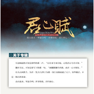
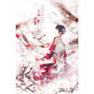

贺鑫
============================

|  |  |
| :--: | :-- |
| [ 贺鑫](https://i.xiami.com/hx924) | **播放数**: 1586905 **粉丝数**: 171 **评论数**: 12 **地区**: China 中国大陆 **风格**: 根源唱作人 Singer-Songwriter, 管弦乐 Orchestral, 国语流行 Mandarin Pop, 中国风 China-Wave  |

## 档案

欢迎来微博找我玩：贺鑫Daniel

## 专辑

| 名称 | 语种 | 唱片公司 | 发行时间 | 专辑类别 | 专辑风格 |
| :--: | :-- | :-- | :-- | :-- | :-- |
| [ 春江花月夜](./albums/5022362988.md) | 国语 |  | 2019年08月05日 | EP, 单曲 |  |
| [ 朝暮逢岁晚](./albums/2100243192.md) | 国语 |  | 2015年12月01日 | 录音室专辑 | 中国风 China-Wave |
| [ 君心赋全男声原创古风合辑](./albums/2100196032.md) | 国语 | 君心赋 | 2015年09月10日 | 录音室专辑 | 中国风 China-Wave |
| [ 无烬“纯男声”同人音乐合辑](./albums/1929841786.md) | 国语 | 邪灵工作室 | 2014年02月13日 | 录音室专辑 | 中国风 China-Wave |

## 评论

|  |  |  |  |
| :-- | :-- | :-- | :-- |
|  [虾米用户](https://emumo.xiami.com/u/427014969)  2019-07-08 14:14 赞(1) 踩(0) | 
是翻唱还是直接上传？
 |
| ⇒ |  [虾米用户](https://emumo.xiami.com/u/16341867)  2020-12-29 15:44 赞(0) 踩(0) | 
是我写的歌
 |
|  [虾米用户](https://emumo.xiami.com/u/376818417)  2019-05-20 20:22 赞(1) 踩(0) | 
大神能不能上传你的山河勿念
 |
|  [虾米用户](https://emumo.xiami.com/u/226833808) 梦里见 2019-03-28 21:01 赞(0) 踩(0) | 
奈斯呀
 |
|  [虾米用户](https://emumo.xiami.com/u/328657369) 风格随心而变、 2018-12-22 11:36 赞(0) 踩(0) | 

 |
|  [虾米用户](https://emumo.xiami.com/u/314033652)   2017-07-31 18:13 赞(0) 踩(0) | 
评论好少哦
 |
|  [虾米用户](https://emumo.xiami.com/u/96721262)   2017-01-16 14:38 赞(3) 踩(0) | 
殿书好听 
 |
|  [虾米用户](https://emumo.xiami.com/u/43477710) 没有色彩 2015-12-19 22:35 赞(0) 踩(0) | 

 |
|  [虾米用户](https://emumo.xiami.com/u/53286809) 纵我不往，子宁不嗣音。 2015-08-19 16:53 赞(1) 踩(0) | 
才三首。。老大，您辛苦一下多传几个吧
 |
|  [虾米用户](https://emumo.xiami.com/u/8719224)  2015-08-02 18:45 赞(0) 踩(0) | 
麒麟归位，追
 |
