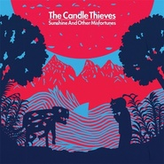

Sunshine And Other Misfortunes
============================

|  |  |
| :--: | :-- |
| [ Sunshine And Other Misfortunes](https://emumo.xiami.com/album/373407) | **艺人**: [The Candle Thieves](../index.md) **语种**: 英语 **唱片公司**: Mercer St, Carnival Town **发行时间**: 2010年04月05日 **专辑类别**: 录音室专辑 **专辑风格**: 独立流行 Indie Pop **播放数**: 6598290 **收藏数**: 1225 **评论数**: 69  |

## 简介

The Candle Thieves的首张专辑.

## 曲目

## 评论

|  |  |  |  |
| :-- | :-- | :-- | :-- |
|  [虾米用户](https://emumo.xiami.com/u/49959840) 无 聊 人 2018-05-17 23:37 赞(0) 踩(0) | 
☁️
 |
|  [虾米用户](https://emumo.xiami.com/u/1851285) Cirnellë 2018-04-07 12:17 赞(0) 踩(0) | 
曲子那么欢快，歌词却多么暗黑啊，就是暗黑着但又要抱有美好希望吧。
 |
|  [虾米用户](https://emumo.xiami.com/u/422053)  2017-10-27 23:01 赞(0) 踩(0) | 
亲爱的The Candle Thieves你的名字居然缘于“在别人的婚礼派对上偷蜡烛”，Sunshine And Other Misfortunes，让确确实实听到那份充满意趣的真诚。歌声质朴带着幽幽惆怅，配乐可爱的如屡屡阳光洒在甘草的清新。我们虽然有特多的不平整小琐事却少不了这样点点光亮歌声做抚平心绪的原料，真的。
 |
|  [虾米用户](https://emumo.xiami.com/u/292484097)   2017-10-11 21:24 赞(0) 踩(0) | 
最佳
 |
|  [虾米用户](https://emumo.xiami.com/u/253707663)  痛苦的人 2017-05-02 18:32 赞(1) 踩(0) | 
原来你传达给我的是悲伤
 |
|  [虾米用户](https://emumo.xiami.com/u/36792730) xxx 2016-11-20 11:36 赞(1) 踩(0) | 
这专太可爱了吧！
 |
|  [虾米用户](https://emumo.xiami.com/u/228824921)  2016-10-20 11:48 赞(0) 踩(0) | 
阔以
 |
|  [虾米用户](https://emumo.xiami.com/u/37922432) 音乐最治愈~ 2016-08-30 22:56 赞(0) 踩(0) | 
my love will ~~
 |
|  [虾米用户](https://emumo.xiami.com/u/114731604) 双鱼座的女神 2016-03-13 07:18 赞(0) 踩(0) | 
非常好听
 |
|  [虾米用户](https://emumo.xiami.com/u/1803513) 一切坚固的都烟消云散了 2015-09-06 22:30 赞(0) 踩(0) | 
这首一跑出来就觉得不管怎样今天都可以愉快的结束了 忍不住跟着笑了起来XDDDDDD
 |
|  [虾米用户](https://emumo.xiami.com/u/52664654)  2015-07-25 18:56 赞(0) 踩(0) | 
舒服
 |
|  [虾米用户](https://emumo.xiami.com/u/7322777) ∮ 2015-06-14 15:13 赞(0) 踩(0) | 
....A....
 |
|  [虾米用户](https://emumo.xiami.com/u/1600528)  2014-09-25 12:27 赞(0) 踩(0) | 
男生
 |
|  [虾米用户](https://emumo.xiami.com/u/16415125) 我们将死于自己热爱的事物 2014-09-24 20:44 赞(1) 踩(0) | 
#10.25英国Indie Pop乐队The Candle Thieves 2014年中国巡演广州站#10.25广州站@TU凸空间！广州市越秀区广州大道中361-365号东方花苑大厦首层。活动详情：<a href="http://t.cn/RPgrGSg" target="_blank" rel="nofollow noreferrer noopener">http://t.cn/RPgrGSg</a>。
 |
|  [虾米用户](https://emumo.xiami.com/u/17114760) 嘻嘻嘻嘻 2014-09-07 13:16 赞(0) 踩(0) | 
❤️
 |
|  [虾米用户](https://emumo.xiami.com/u/2233329) 下一个假期前要发奋！ 2014-07-23 10:19 赞(0) 踩(0) | 
欢脱清新小调调
 |
|  [虾米用户](https://emumo.xiami.com/u/2199751) 聪明如你，却习惯欺骗自己 2014-06-03 23:04 赞(0) 踩(0) | 
我就是分享个专辑。。封面的。 - - - - - - - - --
 |
|  [虾米用户](https://emumo.xiami.com/u/1609946) 一即一切 2014-05-18 16:02 赞(0) 踩(0) | 
心 境不二
 |
|  [虾米用户](https://emumo.xiami.com/u/8381675)  2014-02-26 00:08 赞(0) 踩(0) | 
轻松 tempo
 |
|  [虾米用户](https://emumo.xiami.com/u/17950481)  2013-12-16 20:50 赞(0) 踩(0) | 
很不错
 |
|  [虾米用户](https://emumo.xiami.com/u/13705057)  2013-12-11 16:28 赞(0) 踩(0) | 
sunshine and other misfortunes
 |
|  [虾米用户](https://emumo.xiami.com/u/148636) 我一直在等 已经筋疲力尽... 2013-10-05 11:05 赞(0) 踩(0) | 
喜欢轻快的节奏 男主唱的声线也很干净
 |
|  [虾米用户](https://emumo.xiami.com/u/7501285) Minor Cause 2013-10-02 21:51 赞(0) 踩(0) | 
my love will clap its hands for you 好有爱
 |
|  [虾米用户](https://emumo.xiami.com/u/8015969) 听好歌 2013-09-03 14:44 赞(0) 踩(0) | 
真好听
 |
|  [虾米用户](https://emumo.xiami.com/u/3041971) 往心里填点煤球 让它烧得... 2013-06-17 23:06 赞(0) 踩(0) | 
温暖又安定的左手香
 |
|  [虾米用户](https://emumo.xiami.com/u/2120603)   2013-05-06 22:02 赞(0) 踩(0) | 
英國獨立樂隊。
 |
|  [虾米用户](https://emumo.xiami.com/u/12336856)  2013-02-23 11:33 赞(0) 踩(0) | 
排名第二的那首歌 很不错
 |
|  [虾米用户](https://emumo.xiami.com/u/10013405) 只听歌谢谢 2013-02-15 21:38 赞(0) 踩(0) | 
天热卤 好软软软
 |
|  [虾米用户](https://emumo.xiami.com/u/10547530) 生于白昼，隐与黑夜。 2013-01-31 21:14 赞(1) 踩(0) | 
通常喜欢一个小众乐队排名第二的曲子。=v=
 |
|  [虾米用户](https://emumo.xiami.com/u/2562662)   2013-01-17 00:37 赞(2) 踩(0) | 
喜欢封面的色调
 |
|  [虾米用户](https://emumo.xiami.com/u/12182488)  2012-12-30 21:11 赞(0) 踩(0) | 
欢乐！
 |
|  [虾米用户](https://emumo.xiami.com/u/647248)   2012-12-19 21:39 赞(0) 踩(0) | 
这就是我喜欢的音乐范，英伦+慢摇+清新
 |
|  [虾米用户](https://emumo.xiami.com/u/1314139) 我还没想好要写什么... 2012-11-11 15:36 赞(0) 踩(0) | 
适合午后阳光
 |
|  [虾米用户](https://emumo.xiami.com/u/7590994) 一颗很怂的柠檬 2012-09-28 11:33 赞(0) 踩(0) | 
除了XX，最喜欢的一张。
 |
|  [虾米用户](https://emumo.xiami.com/u/5842045)   2012-07-25 15:17 赞(0) 踩(0) | 
披着小清新外皮的重口味。
 |
|  [虾米用户](https://emumo.xiami.com/u/705149) music life 2012-07-11 20:14 赞(0) 踩(0) | 
哈哈哈！
 |
|  [虾米用户](https://emumo.xiami.com/u/2324356)  2012-07-06 16:37 赞(0) 踩(0) | 
很不错的一张..收下了.
 |
|  [虾米用户](https://emumo.xiami.com/u/309136) I sing it fo... 2012-05-13 12:48 赞(0) 踩(0) | 
可以听着singapore入睡了....╮(╯▽╰)╭
 |
|  [虾米用户](https://emumo.xiami.com/u/6434412)  2012-04-02 14:47 赞(0) 踩(0) | 
小清新又不失调皮的感觉～
 |
|  [虾米用户](https://emumo.xiami.com/u/4737973)   2012-02-14 19:58 赞(0) 踩(0) | 
很轻快~好心情~
 |
|  [虾米用户](https://emumo.xiami.com/u/1160911)  2012-01-09 08:49 赞(0) 踩(0) | 
世界不温柔
 |
|  [虾米用户](https://emumo.xiami.com/u/6099988)  2011-12-23 09:27 赞(0) 踩(0) | 
这他妈的英伦清新慢摇给力
 |
|  [虾米用户](https://emumo.xiami.com/u/2767479)  2011-12-13 15:19 赞(0) 踩(0) | 
给人眼前一亮的感觉，瞬间清新了
 |
|  [虾米用户](https://emumo.xiami.com/u/6005918) 网易云账号同名：pans... 2011-12-04 00:14 赞(0) 踩(0) | 
清新的曲风扑面而来
 |
|  [虾米用户](https://emumo.xiami.com/u/1637817)  2011-11-26 09:13 赞(0) 踩(0) | 
为什么少两首，最好的两个版本singapore没有。
 |
|  [虾米用户](https://emumo.xiami.com/u/342137)  2011-11-14 21:35 赞(0) 踩(0) | 
so nice
 |
|  [虾米用户](https://emumo.xiami.com/u/2737011)  2011-11-02 04:33 赞(0) 踩(0) | 
超爱这两货！哈哈
 |
|  [虾米用户](https://emumo.xiami.com/u/1478498) 我还没想好要写什么... 2011-09-25 07:41 赞(0) 踩(0) | 
我爱专辑名，乐队名，和整张专辑。透着暖暖的亲昵感。
 |
|  [虾米用户](https://emumo.xiami.com/u/2269378) 让我的生命觉知，走向光明... 2011-07-26 11:15 赞(0) 踩(0) | 
心情好
 |
|  [虾米用户](https://emumo.xiami.com/u/1061455)  2011-06-26 20:20 赞(0) 踩(0) | 
sunshine
 |
|  [虾米用户](https://emumo.xiami.com/u/1669834)   2011-05-08 19:46 赞(0) 踩(0) | 
英伦啥的最喜欢~
 |
|  [虾米用户](https://emumo.xiami.com/u/1052461) @blinK4sy- 2011-03-06 18:37 赞(0) 踩(0) | 
调节心情的Sunshine~
 |
|  [虾米用户](https://emumo.xiami.com/u/2525832)  2011-02-15 16:23 赞(0) 踩(0) | 
犹如校园草坪上的阳光
 |
|  [虾米用户](https://emumo.xiami.com/u/958218) 暂无签名~ 2011-01-26 15:26 赞(0) 踩(0) | 
清新小电子
 |
|  [虾米用户](https://emumo.xiami.com/u/669413)  2011-01-25 15:55 赞(0) 踩(0) | 
听着它，仿佛来到奇异的幻想世界，那样的轻快，那样的异想天开!
 |
|  [虾米用户](https://emumo.xiami.com/u/669413)  2011-01-25 15:52 赞(0) 踩(0) | 
听着它，仿佛来到奇异的幻想世界，那样的轻快，那样的异想天开!
 |
|  [虾米用户](https://emumo.xiami.com/u/2421523)  2011-01-09 00:59 赞(0) 踩(0) | 
一听就很喜欢
 |
|  [虾米用户](https://emumo.xiami.com/u/238239)  2010-11-29 08:14 赞(0) 踩(0) | 
很清新，又不腻歪。像是宅男却爱去晒太阳。电琴的元素很多，有80年代怀旧的感觉。简单而舒服，Belle &amp;amp; Sebastian，Kings of Convience那一路走过来的。
 |
|  [虾米用户](https://emumo.xiami.com/u/1087506) 我还没想好要写什么... 2010-09-11 12:55 赞(0) 踩(0) | 
喜欢dreaming of lucy，很清新很舒服，简简单单让人轻松
 |
|  [虾米用户](https://emumo.xiami.com/u/531035)  2010-07-12 02:31 赞(0) 踩(0) | 
好好玩 好喜欢~
 |
|  [虾米用户](https://emumo.xiami.com/u/1138163)  2010-07-07 11:09 赞(0) 踩(0) | 
喜欢最后一首 感觉一个人在坐地铁时听会很有感觉
 |
|  [虾米用户](https://emumo.xiami.com/u/1101794)  2010-07-06 23:52 赞(0) 踩(0) | 
好听的音乐！幸福！甜蜜！
 |
|  [虾米用户](https://emumo.xiami.com/u/1070998)  2010-07-06 16:43 赞(0) 踩(0) | 
喜欢
 |
|  [虾米用户](https://emumo.xiami.com/u/872310)  2010-05-16 01:55 赞(0) 踩(0) | 
最佳心情调节剂，心中的乌云一扫而光~
 |
|  [虾米用户](https://emumo.xiami.com/u/501424) same rules a... 2010-05-15 20:15 赞(0) 踩(0) | 
赞一个~
 |
|  [虾米用户](https://emumo.xiami.com/u/866083)  2010-05-08 16:29 赞(0) 踩(0) | 
真好听
 |
|  [虾米用户](https://emumo.xiami.com/u/447565) 兴奋郁闷互转模式中 2010-05-08 14:23 赞(0) 踩(0) | 
超喜欢~
 |
|  [虾米用户](https://emumo.xiami.com/u/398493) 我还没想好要写什么... 2010-04-04 13:38 赞(0) 踩(0) | 
感觉听了好幸福，像吃了糖果～～
 |
|  [虾米用户](https://emumo.xiami.com/u/489363) 冷场小王子无限连击 2010-03-26 01:22 赞(0) 踩(0) | 
像甜橙一样清新！
 |
