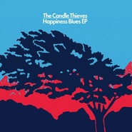

Happiness Blues
============================

|  |  |
| :--: | :-- |
| [ Happiness Blues](https://emumo.xiami.com/album/410909) | **艺人**: [The Candle Thieves](../index.md) **语种**: 英语 **唱片公司**: Mercer St, Carnival Town **发行时间**: 2010年09月13日 **专辑类别**: EP, 单曲 **专辑风格**: 独立流行 Indie Pop **播放数**: 4423641 **收藏数**: 719 **评论数**: 37  |

## 简介

一鸣惊人的首专给人留下了深刻印象，这支来自伦敦的2人独立流行组合之后快速推出了全新EP  ，整张EP由3首新曲+1首旧曲组成，继承了第一张专辑动听的编曲风格、削弱了电音的表现。推介曲目: Track 2、4 : )  
 

## 曲目

## 评论

|  |  |  |  |
| :-- | :-- | :-- | :-- |
|  [虾米用户](https://emumo.xiami.com/u/379162683) 我想要记住你们，我想要你... 2020-12-29 09:24 赞(0) 踩(0) | 

 |
|  [虾米用户](https://emumo.xiami.com/u/49959840) 无 聊 人 2018-05-17 23:38 赞(0) 踩(0) | 
啊
 |
|  [虾米用户](https://emumo.xiami.com/u/2302715) 当我们和世界初相见，当我... 2017-08-17 20:35 赞(2) 踩(0) | 
ANNABELLE是个倔强又可怜的小姑娘呀，看了歌词真的心疼诶。是不是我戏太多。。。
 |
|  [虾米用户](https://emumo.xiami.com/u/3660782) Life is noth... 2017-04-06 11:11 赞(0) 踩(0) | 
愉快地工作
 |
|  [虾米用户](https://emumo.xiami.com/u/42083103) Ein 2016-11-27 21:37 赞(0) 踩(0) | 

 |
|  [虾米用户](https://emumo.xiami.com/u/45621221) 卸载状态。 2016-01-21 09:38 赞(1) 踩(0) | 
=
 |
|  [虾米用户](https://emumo.xiami.com/u/12805732) 心之所向，素履所往。 2015-05-09 17:17 赞(0) 踩(0) | 
小清新
 |
|  [虾米用户](https://emumo.xiami.com/u/2596779) 404 2014-12-08 05:11 赞(0) 踩(0) | 
cover~
 |
|  [虾米用户](https://emumo.xiami.com/u/16415125) 我们将死于自己热爱的事物 2014-09-24 20:43 赞(0) 踩(0) | 
#10.25英国Indie Pop乐队The Candle Thieves 2014年中国巡演广州站#10.25广州站@TU凸空间！广州市越秀区广州大道中361-365号东方花苑大厦首层。活动详情：<a href="http://t.cn/RPgrGSg" target="_blank" rel="nofollow noreferrer noopener">http://t.cn/RPgrGSg</a>。
 |
|  [虾米用户](https://emumo.xiami.com/u/2249515) 暂无签名~ 2014-09-01 14:41 赞(0) 踩(0) | 
赞啊
 |
|  [虾米用户](https://emumo.xiami.com/u/11209744)  2014-08-07 10:47 赞(0) 踩(0) | 
清新男声
 |
|  [虾米用户](https://emumo.xiami.com/u/2199751) 聪明如你，却习惯欺骗自己 2014-06-03 23:04 赞(0) 踩(0) | 
我喜欢这个乐队的专辑封面
 |
|  [虾米用户](https://emumo.xiami.com/u/2000722)  2013-11-16 13:03 赞(0) 踩(0) | 
such a sweet album
 |
|  [虾米用户](https://emumo.xiami.com/u/1548279)  2013-10-24 18:20 赞(0) 踩(0) | 
英伦风
 |
|  [虾米用户](https://emumo.xiami.com/u/5019533) 我还没想好要写什么... 2013-09-18 23:56 赞(0) 踩(0) | 
和秋天一起清醒地睡~
 |
|  [虾米用户](https://emumo.xiami.com/u/7402157) 你先让我躺一会 2013-09-14 16:51 赞(0) 踩(0) | 
封面5星
 |
|  [虾米用户](https://emumo.xiami.com/u/8015969) 听好歌 2013-09-03 13:08 赞(0) 踩(0) | 
candle
 |
|  [虾米用户](https://emumo.xiami.com/u/10133818)  2013-03-09 11:30 赞(0) 踩(0) | 
英伦小清新
 |
|  [虾米用户](https://emumo.xiami.com/u/960660) 你好，这里是牙买加 2013-01-14 01:45 赞(0) 踩(0) | 
英伦慢摇小清新
 |
|  [虾米用户](https://emumo.xiami.com/u/960660) 你好，这里是牙买加 2013-01-14 01:43 赞(0) 踩(0) | 
英伦慢摇小清新
 |
|  [虾米用户](https://emumo.xiami.com/u/4801026)  2012-10-02 16:31 赞(0) 踩(0) | 
我喜欢 喜欢
 |
|  [虾米用户](https://emumo.xiami.com/u/1746968) 最美的不是下雨天，是我们... 2012-09-17 22:17 赞(0) 踩(0) | 
...
 |
|  [虾米用户](https://emumo.xiami.com/u/2839705)  2012-09-17 16:13 赞(0) 踩(0) | 
英伦
 |
|  [虾米用户](https://emumo.xiami.com/u/413203) 嘘！听歌 2012-09-10 01:31 赞(0) 踩(0) | 
声音真的很温暖     很喜欢这种感觉 赞
 |
|  [虾米用户](https://emumo.xiami.com/u/9759380)  2012-07-20 16:36 赞(0) 踩(0) | 
小清新~是一种可以净化心灵的声音
 |
|  [虾米用户](https://emumo.xiami.com/u/2976824)  2012-06-10 23:52 赞(0) 踩(0) | 
Annabelle says~~~~
 |
|  [虾米用户](https://emumo.xiami.com/u/176546)  2012-02-15 11:56 赞(0) 踩(0) | 
喜欢这样看他们一路走来。。。
 |
|  [虾米用户](https://emumo.xiami.com/u/6099988)  2011-12-22 15:46 赞(0) 踩(0) | 
英伦慢摇小清新
 |
|  [虾米用户](https://emumo.xiami.com/u/5956620)  2011-09-28 02:13 赞(0) 踩(0) | 
。
 |
|  [虾米用户](https://emumo.xiami.com/u/4343983)  2011-06-19 13:30 赞(0) 踩(0) | 
英伦
 |
|  [虾米用户](https://emumo.xiami.com/u/2429264) 朝闻游子唱离歌,昨夜微霜... 2011-05-13 05:53 赞(0) 踩(0) | 
qing     ................
 |
|  [虾米用户](https://emumo.xiami.com/u/837527) 虾米是真的废了，什么都要... 2011-01-08 11:07 赞(0) 踩(0) | 
舒舒服服很想要歌词
 |
|  [虾米用户](https://emumo.xiami.com/u/12089) 四四·音乐心情 2010-12-23 14:55 赞(0) 踩(0) | 
有很明显的电子味，但却不如Owl City那般浓烈；有很温柔、干净的清新味道，却不像Passenger有那么一种忧伤感。很喜欢。不错。
 |
|  [虾米用户](https://emumo.xiami.com/u/1247234) Silhouette。 2010-11-28 21:20 赞(0) 踩(0) | 
很舒服的感觉    wonderful~
 |
|  [虾米用户](https://emumo.xiami.com/u/652547)  2010-11-22 01:21 赞(0) 踩(0) | 
Paper Aeroplanes
 |
|  [虾米用户](https://emumo.xiami.com/u/1644632)  2010-11-16 20:54 赞(0) 踩(0) | 
期待这张EP很久了，依旧清新的风格，唤醒美好的记忆
 |
| ⇒ |  [虾米用户](https://emumo.xiami.com/u/1752780) 莫要非也 2010-11-19 05:42 赞(0) 踩(0) | 
me too
 |
