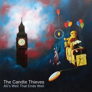

All's Well That Ends Well
============================

|  |  |
| :--: | :-- |
| [ All's Well That Ends Well](https://emumo.xiami.com/album/79352077) | **艺人**: [The Candle Thieves](../index.md) **语种**: 英语 **唱片公司**: Carnival Town **发行时间**: 2013年09月16日 **专辑类别**: 录音室专辑 **专辑风格**: 独立流行 Indie Pop **播放数**: 1331124 **收藏数**: 455 **评论数**: 54  |

## 简介

All's Well That Ends Well is the 3rd album from The Candle Thieves It features the singles 'Ocean Of Storms' and 'Try Again.' The release of the third album has been twinned with the announcement that the band will be taking a hiatus from recording and playing in the UK in the near future.

## 曲目

## 评论

|  |  |  |  |
| :-- | :-- | :-- | :-- |
|  [虾米用户](https://emumo.xiami.com/u/10205776) 转Spotify 2019-11-27 01:01 赞(0) 踩(0) | 

 |
|  [虾米用户](https://emumo.xiami.com/u/49959840) 无 聊 人 2018-05-17 23:37 赞(0) 踩(0) | 
❤️
 |
|  [虾米用户](https://emumo.xiami.com/u/2063132)   2015-12-12 16:02 赞(0) 踩(0) | 
还需要理由吗 5蕉扔
 |
|  [虾米用户](https://emumo.xiami.com/u/4184671)  2015-10-02 13:22 赞(2) 踩(0) | 
The Candle Thieves 是典型越听越暖的音乐，属于花草派治愈系。童趣的，怪诞的，温馨的，羞涩的，暗的，亮的，蓝色的，直勾起你心底那些怪诞的梦想，纯真如偷蜡烛般的岁月。
 |
|  [虾米用户](https://emumo.xiami.com/u/2022341) 懶似精靈。。。。 2014-12-10 08:07 赞(0) 踩(0) | 
早安
 |
|  [虾米用户](https://emumo.xiami.com/u/16415125) 我们将死于自己热爱的事物 2014-09-24 20:39 赞(0) 踩(0) | 
#10.25英国Indie Pop乐队The Candle Thieves 2014年中国巡演广州站#10.25广州站@TU凸空间！广州市越秀区广州大道中361-365号东方花苑大厦首层。活动详情：<a href="http://t.cn/RPgrGSg" target="_blank" rel="nofollow noreferrer noopener">http://t.cn/RPgrGSg</a>。
 |
|  [虾米用户](https://emumo.xiami.com/u/1842010) Just listeni... 2013-12-01 18:05 赞(0) 踩(0) | 
不知是不是圣诞快到了..听啥都听出了一股圣诞的感觉.. 哈哈哈~巡演我也想去...TAT~
 |
|  [虾米用户](https://emumo.xiami.com/u/1268101)  2013-11-28 21:20 赞(0) 踩(0) | 
为啥今晚听的特别伤心==
 |
|  [虾米用户](https://emumo.xiami.com/u/13614212)  2013-11-17 17:39 赞(0) 踩(0) | 
nice music :D
 |
|  [虾米用户](https://emumo.xiami.com/u/16396825) do you ? 2013-11-13 19:25 赞(0) 踩(0) | 
0.0
 |
|  [虾米用户](https://emumo.xiami.com/u/3506625) 偏爱类型：Rock N'... 2013-10-20 13:51 赞(0) 踩(0) | 
啊啊啊 这是要为现场热身的节奏啊<a href="http://www.douban.com/event/19481120/" target="_blank" rel="nofollow noreferrer noopener">http://www.douban.com/event/19481120/</a>
 |
|  [虾米用户](https://emumo.xiami.com/u/13316383)   2013-10-15 23:06 赞(0) 踩(0) | 
把我要早睡删了，惩罚实在太过分了，不过明明是为我好又太难过了..
 |
|  [虾米用户](https://emumo.xiami.com/u/11342102) 随遇而安 2013-10-14 17:51 赞(0) 踩(0) | 
来自英国伦敦独立乐队The Candle Thieves 新专辑，清新治愈！最爱《Try Again》！
 |
|  [虾米用户](https://emumo.xiami.com/u/9299072)  2013-10-04 17:29 赞(1) 踩(0) | 
推荐 07 I&amp;#039;m Gone
 |
|  [虾米用户](https://emumo.xiami.com/u/2688180) 喜新不厌旧 2013-10-01 12:37 赞(0) 踩(0) | 
清新男团The Candle Thieves的最后一张专辑
 |
| ⇒ |  [虾米用户](https://emumo.xiami.com/u/3506625) 偏爱类型：Rock N'... 2013-10-20 13:52 赞(0) 踩(0) | 
这。。。这。。。不是真的吧。。。
 |
| ⇒ |  [虾米用户](https://emumo.xiami.com/u/1724708) I en värld a... 2014-04-27 22:33 赞(0) 踩(0) | 
<q><b>Vis viva说：</b></q>
 |
|  [虾米用户](https://emumo.xiami.com/u/3017711) 再见啦，小虾米！ 2013-09-28 12:16 赞(0) 踩(0) | 
我发现我还是比较喜欢小清新的呢
 |
|  [虾米用户](https://emumo.xiami.com/u/3367148) be there 2013-09-26 18:52 赞(0) 踩(0) | 
dance
 |
|  [虾米用户](https://emumo.xiami.com/u/12379515)  2013-09-26 17:21 赞(0) 踩(0) | 
整張專輯很舒服的節奏調子，心情都被治癒了
 |
|  [虾米用户](https://emumo.xiami.com/u/13631235)   2013-09-25 19:40 赞(0) 踩(0) | 
。
 |
|  [虾米用户](https://emumo.xiami.com/u/1478498) 我还没想好要写什么... 2013-09-25 17:43 赞(0) 踩(0) | 
十二月要来演出 也是最后一次了吧 希望到时候能去成
 |
|  [虾米用户](https://emumo.xiami.com/u/3110220)  2013-09-25 17:35 赞(0) 踩(0) | 
小清新
 |
|  [虾米用户](https://emumo.xiami.com/u/2732627)  2013-09-24 17:49 赞(0) 踩(0) | 
Keys to My World
 |
|  [虾米用户](https://emumo.xiami.com/u/4243452) mua mua mua 2013-09-23 09:52 赞(0) 踩(0) | 
很喜欢啊很喜欢啊
 |
|  [虾米用户](https://emumo.xiami.com/u/4160302)   2013-09-22 09:53 赞(0) 踩(0) | 
终于出了新作品，令人又喜又悲，不希望是最后的作品，不要解散呀T^T
 |
|  [虾米用户](https://emumo.xiami.com/u/7867105)  2013-09-21 20:57 赞(0) 踩(0) | 
不希望是最后一张专辑呢，一直喜爱的小清新男团
 |
|  [虾米用户](https://emumo.xiami.com/u/2006286)  2013-09-19 15:43 赞(0) 踩(0) | 
最近出新砖的好多。。听不过来呀。。。。亲。。。。
 |
|  [虾米用户](https://emumo.xiami.com/u/1782530)  2013-09-19 13:10 赞(0) 踩(0) | 
好可惜、、真的QAQ
 |
|  [虾米用户](https://emumo.xiami.com/u/284541)  2013-09-18 23:31 赞(0) 踩(0) | 
如此的小清新
 |
|  [虾米用户](https://emumo.xiami.com/u/4401130) 暂无签名~ 2013-09-18 21:09 赞(0) 踩(0) | 
好聽得很&amp;gt;_&amp;lt;暖萌嗲♪ p.s標籤里的[自由lalala]是什麽玩意
 |
|  [虾米用户](https://emumo.xiami.com/u/4401130) 暂无签名~ 2013-09-18 21:05 赞(0) 踩(0) | 
好聽好聽極了&amp;gt;_&amp;lt;暖萌嗲♪ p.s標籤裡的[自由lalala]是什麽玩意
 |
|  [虾米用户](https://emumo.xiami.com/u/497422)   2013-09-18 14:31 赞(0) 踩(0) | 
12月的巡演好想去......
 |
| ⇒ |  [虾米用户](https://emumo.xiami.com/u/9821088)  2013-09-18 22:39 赞(0) 踩(0) | 
能去尽量去吧，估计以后没啥机会了，而且票价很便宜
 |
| ⇒ |  [虾米用户](https://emumo.xiami.com/u/497422)   2013-09-20 20:24 赞(0) 踩(0) | 
<q><b>molineters说：</b></q>
 |
|  [虾米用户](https://emumo.xiami.com/u/497422)   2013-09-18 14:27 赞(0) 踩(0) | 
不能是最后一张啊!!!!从第一张就追随到现在了...........
 |
|  [虾米用户](https://emumo.xiami.com/u/6005918) 网易云账号同名：pans... 2013-09-18 09:24 赞(0) 踩(0) | 
taking a hiatus是委婉的说法吗，真的要解散了？
 |
| ⇒ |  [虾米用户](https://emumo.xiami.com/u/9821088)  2013-09-18 22:37 赞(0) 踩(0) | 
官网写的是Blow Out。。。。
 |
| ⇒ |  [虾米用户](https://emumo.xiami.com/u/6005918) 网易云账号同名：pans... 2013-09-18 22:39 赞(0) 踩(0) | 
<q><b>molineters说：</b></q>
 |
|  [虾米用户](https://emumo.xiami.com/u/1171396) 以前办不到的事情，未来也... 2013-09-17 23:49 赞(1) 踩(0) | 
讨厌这种舍不得的感觉····
 |
|  [虾米用户](https://emumo.xiami.com/u/3924468)  2013-09-17 20:43 赞(0) 踩(0) | 
已经是最后一张了 可惜没能走远。很友爱的男声
 |
|  [虾米用户](https://emumo.xiami.com/u/2910024)  2013-09-17 18:07 赞(0) 踩(0) | 
我的天啊！没看错吧！新专辑！（眼角都湿润了
 |
|  [虾米用户](https://emumo.xiami.com/u/819805) 网易云ID：荡漾Di摇滚... 2013-09-17 17:57 赞(0) 踩(0) | 
＠(￣-￣)＠
 |
|  [虾米用户](https://emumo.xiami.com/u/652547)  2013-09-17 17:26 赞(0) 踩(0) | 
Keys to My World
 |
|  [虾米用户](https://emumo.xiami.com/u/7273573) 无以依附 2013-09-17 17:13 赞(0) 踩(0) | 
听他们的歌会很满足
 |
|  [虾米用户](https://emumo.xiami.com/u/6018609)  2013-09-17 17:11 赞(0) 踩(0) | 
槽！！！
 |
|  [虾米用户](https://emumo.xiami.com/u/1670013)  2013-09-17 16:57 赞(0) 踩(0) | 
前排~
 |
|  [虾米用户](https://emumo.xiami.com/u/547627) 一台漫游银河系的机器人 2013-09-17 16:19 赞(0) 踩(0) | 
按赞！
 |
|  [虾米用户](https://emumo.xiami.com/u/597569) 何必故作姿态 2013-09-17 16:16 赞(1) 踩(0) | 
来北京的话果断去现场!
 |
| ⇒ |  [虾米用户](https://emumo.xiami.com/u/601978)  2013-09-17 21:37 赞(0) 踩(0) | 
11月29日北京站演出，在麻雀瓦舍。
 |
|  [虾米用户](https://emumo.xiami.com/u/511902) 小烦 2013-09-17 12:14 赞(1) 踩(0) | 
Enjoy
 |
|  [虾米用户](https://emumo.xiami.com/u/9821088)  2013-09-17 09:26 赞(0) 踩(0) | 
SF，他们的最后一张专辑了，确实不舍得，期待年底的中国巡演
 |
| ⇒ |  [虾米用户](https://emumo.xiami.com/u/7949648)   2013-09-17 16:24 赞(0) 踩(0) | 
真假？要解散？
 |
| ⇒ |  [虾米用户](https://emumo.xiami.com/u/9821088)  2013-09-18 22:18 赞(0) 踩(0) | 
<q><b>Miraggio说：</b></q>
 |
