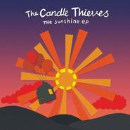

The Candle Thieves
============================

|  |  |
| :--: | :-- |
| [ The Candle Thieves](https://i.xiami.com/tct) | **地区**: United Kingdom 英国 **风格**: 独立流行 Indie Pop **播放数**: 13262129 **粉丝数**: 74572 **评论数**: 451  |

## 档案

The Candle Thieves，被译为蜡烛小偷—— 一个非常美妙的，逗趣的，异想天开的乐队。由成员Scott McEwan以及The Glock组成。所有的乐器都由Scott McEwan和The Glock他们俩人包办。融合 Eels、Sufjan Stevens 以及 The Lucksmiths 音乐精华的创作风格、乐观光明的主题。 
这对英国二人组在十几岁时就认识，后来有一段时间失去了联系。由于一次偶然相遇，又决定在一起创作音乐，不知不觉已有十年。 
关于乐队名字来源，Scott是这么解释的，“Glock之前专门在婚礼上演奏。当我们开始组乐队的时候，一直没想好名字。我去他家，发现有好多好多蜡烛。我就问他这些都是哪来的啊？Glock就说是从婚礼上“偷”回来的。只燃了一点，反正也不会再用了。”

## 专辑

| 名称 | 语种 | 唱片公司 | 发行时间 | 专辑类别 | 专辑风格 |
| :--: | :-- | :-- | :-- | :-- | :-- |
| [ A Visitor's Guide To Normal](./albums/5022121771.md) | 英语 | Indie | 2020年01月13日 | 录音室专辑 |  |
| [ All's Well That Ends Well](./albums/79352077.md) | 英语 | Carnival Town | 2013年09月16日 | 录音室专辑 | 独立流行 Indie Pop |
| [ Balloons](./albums/501045.md) | 英语 |  | 2012年03月05日 | 录音室专辑 | 独立流行 Indie Pop |
| [ Glock's Corner](./albums/423797.md) | 英语 | Carnival Town Records | 2010年12月06日 | EP, 单曲 | 独立流行 Indie Pop |
| [ Happiness Blues](./albums/410909.md) | 英语 | Mercer St, Carnival Town | 2010年09月13日 | EP, 单曲 | 独立流行 Indie Pop |
| [ Sunshine And Other Misfortunes](./albums/373407.md) | 英语 | Mercer St, Carnival Town | 2010年04月05日 | 录音室专辑 | 独立流行 Indie Pop |
| [ We're All Gonna Die (Have Fun)](./albums/2105812632.md) | 英语 | Carnival Town Records | 2010年03月29日 |  |  |
| [ The Sunshine](./albums/501043.md) | 英语 | Self-Released | 2009年10月19日 | EP, 单曲 | 独立流行 Indie Pop |
| [ The Sunshine EP](./albums/2105813220.md) | 英语 | Merlin Records | 2009年10月19日 |  |  |

## 评论

|  |  |  |
| :-- | :-- | :-- |
|  [虾米用户](https://emumo.xiami.com/u/379162683) 我想要记住你们，我想要你... 2020-12-29 09:24 赞(0) 踩(0) | 

 |
|  [虾米用户](https://emumo.xiami.com/u/6024992) 夏天 2020-12-25 15:16 赞(0) 踩(0) | 
་༄
 |
|  [虾米用户](https://emumo.xiami.com/u/12221090) 逍遥于天地而心意自得 2020-05-27 23:35 赞(0) 踩(0) | 
赞
 |
|  [虾米用户](https://emumo.xiami.com/u/287324849)  2020-01-26 11:10 赞(0) 踩(0) | 
战哥起
 |
|  [虾米用户](https://emumo.xiami.com/u/633412) 天长地久有时尽。 2019-11-01 02:55 赞(0) 踩(0) | 
现场很开心，弹唱很出色很专业的音乐人，惊喜了一天！
 |
|  [虾米用户](https://emumo.xiami.com/u/17732312) 暂无签名~ 2019-10-26 00:20 赞(1) 踩(0) | 
他俩太逗了唱歌还带小剧场～看他们的演出真的超级开心！！！
 |
|  [虾米用户](https://emumo.xiami.com/u/1260342) Rockme 2019-10-25 23:44 赞(0) 踩(0) | 
刚从乐队南京的现场听完回家，洗澡，上床继续听，nice live!nice band!
 |
|  [虾米用户](https://emumo.xiami.com/u/9523997) 天地为炉 2019-10-25 22:11 赞(0) 踩(0) | 
今晚很好玩！调皮可爱的大男孩们！ 
 |
|  [虾米用户](https://emumo.xiami.com/u/52056952) 人生即是到來、相遇、陪伴... 2019-08-20 18:35 赞(0) 踩(0) | 

 |
|  [虾米用户](https://emumo.xiami.com/u/39920576) music is a t... 2019-07-08 19:46 赞(0) 踩(0) | 
今年不来厦门哇
 |
|  [虾米用户](https://emumo.xiami.com/u/289332865) 我还没想好要写什么... 2019-06-24 09:00 赞(1) 踩(0) | 
2019年什么时候能到武汉唱
 |
|  [虾米用户](https://emumo.xiami.com/u/17691156) あなたに出会えて よかっ... 2019-06-10 23:01 赞(0) 踩(0) | 
今年不来广州咩巡演
 |
|  [虾米用户](https://emumo.xiami.com/u/50171518) 此号报销 2019-05-08 18:31 赞(0) 踩(0) | 
~
 |
|  [虾米用户](https://emumo.xiami.com/u/324879742)   2019-04-17 08:22 赞(1) 踩(0) | 
.
 |
|  [虾米用户](https://emumo.xiami.com/u/84571136) 唯有音乐不离不弃 2019-02-28 01:07 赞(1) 踩(0) | 
The Candle Thieves – Before the War
 |
|  [虾米用户](https://emumo.xiami.com/u/6542921) 温柔点吧 2018-11-04 23:39 赞(0) 踩(0) | 
中了British accent 的毒，各种口音都喜欢，就是喜欢那种说话和舌头较劲的感觉
 |
|  [虾米用户](https://emumo.xiami.com/u/33866184) 音乐爱好者十级 2018-10-24 19:33 赞(1) 踩(0) | 
蜡烛小偷不光偷蜡烛，还偷走了我的心
 |
|  [虾米用户](https://emumo.xiami.com/u/12417955)  2018-10-09 10:44 赞(0) 踩(0) | 
2017年生日那天一个人去听了live，感觉有一些东西被照亮了。每日推荐今天又随机推到这个乐队，真么快就一年了。
 |
|  [虾米用户](https://emumo.xiami.com/u/6596148) Take me to c... 2018-09-25 22:03 赞(1) 踩(0) | 
15年买了杭州站的票结果取消了，17年10月终于在深圳等到，入场前听工作人员说起这次巡演前的小插曲，开场前在一渡堂旁边的餐厅洗手间门口还差点撞到准备进去的Scott......什么时候再来中国呢，即使年纪大了有各自的家庭了也不要停止创作你们的音乐呀，变大叔了也依旧是那两个异想天开的少年~
 |
|  [虾米用户](https://emumo.xiami.com/u/88341606) 我还没想好要写什么... 2018-09-09 10:59 赞(0) 踩(0) | 
油腻大叔  原本也是个清新的文艺青年
 |
|  [虾米用户](https://emumo.xiami.com/u/23491748) 我还没想好要写什么... 2018-08-29 17:27 赞(0) 踩(0) | 
details的专辑什么时候上架啊
 |
|  [虾米用户](https://emumo.xiami.com/u/4026266)  2018-06-23 13:44 赞(0) 踩(0) | 
英国小清新乐队里最喜欢的大概就是你们啦
 |
|  [虾米用户](https://emumo.xiami.com/u/302532876) 假装单纯的话，应该会比较... 2018-06-10 16:47 赞(3) 踩(0) | 
我不希望我喜欢的乐队红。他们隐匿在人海中，直到我拥有支付得起live的能力，让我看到依旧如初的他们。
 |
|  [虾米用户](https://emumo.xiami.com/u/49959840) 无聊人 2018-05-17 23:39 赞(0) 踩(0) | 
hi
 |
|  [虾米用户](https://emumo.xiami.com/u/205750192) to help, sha... 2018-03-03 22:58 赞(0) 踩(0) | 
什么时候来广东啊！！！ 
 |
|  [虾米用户](https://emumo.xiami.com/u/188196406) 喜歡獨單 2018-02-21 15:51 赞(0) 踩(0) | 
多久又来？
 |
|  [虾米用户](https://emumo.xiami.com/u/3963574) ☆✧♥✧☆♥✩✭♥ 2017-12-06 09:14 赞(0) 踩(0) | 
(&amp;macr;`&amp;hearts;&amp;acute;&amp;macr;) `*.&amp;cedil;.*&amp;acute; &amp;cedil;.&amp;bull;&amp;acute;&amp;cedil;.&amp;bull;*&amp;uml;) &amp;cedil;.&amp;bull;*&amp;uml;) (&amp;cedil;.&amp;bull;&amp;acute; (&amp;cedil;.&amp;bull;&amp;acute; .&amp;bull;&amp;acute; &amp;cedil;&amp;cedil;.&amp;bull;&amp;uml;&amp;macr;`&amp;bull; &amp;hearts;
 |
|  [虾米用户](https://emumo.xiami.com/u/42405531) 再见虾米 2017-11-25 17:41 赞(0) 踩(0) | 
哇 全是去过现场的大佬
 |
|  [虾米用户](https://emumo.xiami.com/u/601978)  2017-10-30 10:15 赞(0) 踩(0) | 
英国清新组合“The Candle Thieves”首次中国巡演 11月29日：北京  麻雀瓦舍！
 |
|  [虾米用户](https://emumo.xiami.com/u/572503) 游走京城各大liveho... 2017-10-28 00:32 赞(1) 踩(0) | 
多了一张29号北京场的票，免费送真心要去的，有想去的站内信联系，麻雀瓦舍门口见。。
 |
|  [虾米用户](https://emumo.xiami.com/u/1047000) 今天不蹦迪 明天变垃圾 2017-10-28 00:16 赞(1) 踩(0) | 
偷蜡烛的小坏蛋 哼着光明的小调
 |
|  [虾米用户](https://emumo.xiami.com/u/1484197) 暂无签名~ 2017-10-27 23:55 赞(1) 踩(0) | 
的确独立，搞怪，在别人的婚礼派对上偷蜡烛。但是很像GAY。哈哈~~听着哥就是舒心。
 |
|  [虾米用户](https://emumo.xiami.com/u/29197411) 我还没想好要写什么... 2017-10-27 23:54 赞(1) 踩(0) | 
偷蜡烛哈哈哈
 |
|  [虾米用户](https://emumo.xiami.com/u/3872170) 我们似荫蔽午夜明月的浮云 2017-10-27 23:15 赞(2) 踩(0) | 
The Candle Thieves缘于The Glock的一个癖好-在别人的婚礼派对上偷蜡烛.
 |
|  [虾米用户](https://emumo.xiami.com/u/11901452)  2017-10-27 23:08 赞(1) 踩(0) | 
吖，原来是稀饭偷蜡烛的帅锅~~~~换了头像没认出~~~~嘻
 |
|  [虾米用户](https://emumo.xiami.com/u/13235282) 往事已成空，还如一梦中 2017-10-27 23:06 赞(1) 踩(0) | 
旋律制作的十分的简约而不简单
 |
|  [虾米用户](https://emumo.xiami.com/u/246912077)  2017-10-27 22:03 赞(0) 踩(0) | 
好开心啊
 |
|  [虾米用户](https://emumo.xiami.com/u/246912077)  2017-10-27 22:03 赞(0) 踩(0) | 
欢迎啊欢迎！
 |
|  [虾米用户](https://emumo.xiami.com/u/39920576) music is a t... 2017-10-23 11:20 赞(0) 踩(0) | 
sexy man. welcome back
 |
|  [虾米用户](https://emumo.xiami.com/u/13704947) 豆瓣见：无悲渊。 2017-10-22 23:21 赞(3) 踩(0) | 
现场有多甜呢？比我散场后买的甘蔗汁还甜上百倍，全场大喊sexy man plz come back!然后S就跳出来，说不，他（G）才是sexy man，底下又有姑娘小声喊，kissssssss！哈哈哈哈哈哈哈哈哈真好玩。
 |
| ⇒ |  [虾米用户](https://emumo.xiami.com/u/51626308) 狗屎之中打捞星辰。 2017-10-23 14:00 赞(0) 踩(0) | 
我就知道会在这里抓到你！
 |
|  [虾米用户](https://emumo.xiami.com/u/39988409) 一方面怨自己孤独，一方面... 2017-10-21 18:00 赞(0) 踩(0) | 
亏5块转 转今晚深圳演出票原网售票80，现75转，有事不能去  
 |
|  [虾米用户](https://emumo.xiami.com/u/39988409) 一方面怨自己孤独，一方面... 2017-10-21 17:36 赞(0) 踩(0) | 
转今晚深圳演出票原网售票80，现75转，有事不能去  
 |
|  [虾米用户](https://emumo.xiami.com/u/39988409) 一方面怨自己孤独，一方面... 2017-10-21 17:35 赞(0) 踩(0) | 
转今晚深圳演出票原网售票80，现75转，有事不能去，要的迅速找我
 |
|  [虾米用户](https://emumo.xiami.com/u/9096013) 謝謝遺憾 2017-10-19 02:07 赞(3) 踩(0) | 
從小酒館回來，太他媽好聽了。
 |
|  [虾米用户](https://emumo.xiami.com/u/3327485) Heal 2017-10-18 02:50 赞(0) 踩(0) | 
不要错过！
 |
|  [虾米用户](https://emumo.xiami.com/u/40997459) 豆瓣ID：9155346... 2017-10-17 23:54 赞(0) 踩(0) | 
明天见宝宝们
 |
|  [虾米用户](https://emumo.xiami.com/u/3708232) live half at... 2017-10-15 22:39 赞(9) 踩(0) | 
刚刚看完他们演出，太可爱了天
 |
| ⇒ |  [虾米用户](https://emumo.xiami.com/u/6232148) 在虾米坚持到最后一秒 2017-10-16 00:07 赞(0) 踩(0) | 
握爪
 |
|  [虾米用户](https://emumo.xiami.com/u/3496847) 夢醒了，所以心碎了。 2017-10-14 23:54 赞(28) 踩(0) | 
可爱的不要不要不要的 第一次看见演出带镜子的 第一次看见演出带地摊货拨浪鼓的 第一次看见演出骗人说要去厕所结果两个人欢快的就走到人群中间来了 然后呢 The glock 真的很皮哎 签售会给人画各种东西的 给我画的 还和我说Boom    下次你们来上海的话 还要去和你们玩
 |
| ⇒ |  [虾米用户](https://emumo.xiami.com/u/340504169) 再见啦 2019-08-21 13:55 赞(0) 踩(0) | 
羡慕 
 |
|  [虾米用户](https://emumo.xiami.com/u/39163170) 暂无签名~ 2017-10-12 23:14 赞(1) 踩(0) | 
刚听完现场真幸福
 |
|  [虾米用户](https://emumo.xiami.com/u/292484097)   2017-10-11 21:23 赞(2) 踩(0) | 
一个人去看现场一定会甜死
 |
| ⇒ |  [虾米用户](https://emumo.xiami.com/u/1601859) 想啊想啊，想起你了。 2017-10-12 20:10 赞(0) 踩(0) | 
马上就要一个人去甜死了(⌒▽⌒)
 |
| ⇒ |  [虾米用户](https://emumo.xiami.com/u/772235) indie本命 2017-10-12 22:43 赞(0) 踩(0) | 
<q><b>吟游诗人松鼠君说：</b></q>
 |
| ⇒ |  [虾米用户](https://emumo.xiami.com/u/1601859) 想啊想啊，想起你了。 2017-10-12 23:25 赞(0) 踩(0) | 
<q><b>小包仔说：</b></q>
 |
| ⇒ |  [虾米用户](https://emumo.xiami.com/u/347473) 闭站前好友打捞计划正式启... 2017-10-13 10:14 赞(0) 踩(0) | 
<q><b>吟游诗人松鼠君说：</b></q>
 |
| ⇒ |  [虾米用户](https://emumo.xiami.com/u/1601859) 想啊想啊，想起你了。 2017-10-13 12:31 赞(0) 踩(0) | 
<q><b>在想什么呢的c酱说：</b></q>
 |
| ⇒ |  [虾米用户](https://emumo.xiami.com/u/347473) 闭站前好友打捞计划正式启... 2017-10-13 23:59 赞(0) 踩(0) | 
<q><b>吟游诗人松鼠君说：</b></q>
 |
| ⇒ |  [虾米用户](https://emumo.xiami.com/u/347473) 闭站前好友打捞计划正式启... 2017-10-13 23:59 赞(0) 踩(0) | 
<q><b>吟游诗人松鼠君说：</b></q>
 |
| ⇒ |  [虾米用户](https://emumo.xiami.com/u/1601859) 想啊想啊，想起你了。 2017-10-14 01:36 赞(0) 踩(0) | 
<q><b>在想什么呢的c酱说：</b></q>
 |
| ⇒ |  [虾米用户](https://emumo.xiami.com/u/347473) 闭站前好友打捞计划正式启... 2017-10-14 17:36 赞(0) 踩(0) | 
<q><b>吟游诗人松鼠君说：</b></q>
 |
| ⇒ |  [虾米用户](https://emumo.xiami.com/u/1601859) 想啊想啊，想起你了。 2017-10-14 17:56 赞(0) 踩(0) | 
<q><b>在想什么呢的c酱说：</b></q>
 |
| ⇒ |  [虾米用户](https://emumo.xiami.com/u/347473) 闭站前好友打捞计划正式启... 2017-10-14 21:45 赞(0) 踩(0) | 
<q><b>吟游诗人松鼠君说：</b></q>
 |
| ⇒ |  [虾米用户](https://emumo.xiami.com/u/1601859) 想啊想啊，想起你了。 2017-10-14 23:14 赞(0) 踩(0) | 
<q><b>在想什么呢的c酱说：</b></q>
 |
| ⇒ |  [虾米用户](https://emumo.xiami.com/u/3496847) 夢醒了，所以心碎了。 2017-10-15 16:47 赞(0) 踩(0) | 
<q><b>在想什么呢的c酱说：</b></q>
 |
| ⇒ |  [虾米用户](https://emumo.xiami.com/u/347473) 闭站前好友打捞计划正式启... 2017-10-15 18:13 赞(0) 踩(0) | 
<q><b>吟游诗人松鼠君说：</b></q>
 |
| ⇒ |  [虾米用户](https://emumo.xiami.com/u/347473) 闭站前好友打捞计划正式启... 2017-10-15 18:14 赞(0) 踩(0) | 
<q><b>木頭吉娜说：</b></q>
 |
| ⇒ |  [虾米用户](https://emumo.xiami.com/u/3496847) 夢醒了，所以心碎了。 2017-10-15 18:46 赞(0) 踩(0) | 
<q><b>在想什么呢的c酱说：</b></q>
 |
|  [虾米用户](https://emumo.xiami.com/u/9597157) ， 2017-09-30 23:46 赞(2) 踩(0) | 
果断下载所有
 |
|  [虾米用户](https://emumo.xiami.com/u/48904070) I love CHINA 2017-09-30 14:35 赞(64) 踩(0) | 
我刚入驻了虾米音乐人，欢迎大家来我的个人主页，收听我的最新音乐
 |
| ⇒ |  [虾米用户](https://emumo.xiami.com/u/211129856)  2019-04-20 12:54 赞(0) 踩(0) | 
为什么好多地方都没版权了，我最喜欢的一首歌Annabelle'song请问哪里能听到
 |
|  [虾米用户](https://emumo.xiami.com/u/325179525) Rock n' Roll... 2017-09-22 22:24 赞(1) 踩(0) | 
转一张上海的票!现在人不在上海，打算去南京，80出!
 |
|  [虾米用户](https://emumo.xiami.com/u/12155810)   2017-09-21 09:59 赞(1) 踩(0) | 
10月13日 杭州见
 |
|  [虾米用户](https://emumo.xiami.com/u/267701455) 我是条咸鱼 2017-09-09 23:44 赞(1) 踩(0) | 
行程很赶啊，上海见 
 |
|  [虾米用户](https://emumo.xiami.com/u/1317745) limitless 2017-08-31 17:55 赞(0) 踩(0) | 
怎么广州还是在凸
 |
|  [虾米用户](https://emumo.xiami.com/u/70292024)   2017-06-12 16:55 赞(18) 踩(0) | 
【MAO Live呈现】2017英国Indie Pop乐队The Candle Thieves新专辑《Details》中国巡演  10月12日  北京  愚公移山 10月13日  杭州  MAO Livehouse 10月14日  上海  MAO Livehouse 10月15日  南京  欧拉艺术空间 10月17日  武汉  VOX Livehouse 10月18日  成都  小酒馆空间 10月19日  重庆  MAO Livehouse 10月20日  广州  TU凸空间 10月21日  深圳  一渡堂 10月22日  厦门  Real Live
 |
| ⇒ |  [虾米用户](https://emumo.xiami.com/u/87183100) 小巷又弯又长没有门没有窗... 2017-09-04 19:41 赞(0) 踩(0) | 
哪里有票买呢
 |
| ⇒ |  [虾米用户](https://emumo.xiami.com/u/70292024)   2017-09-04 20:02 赞(0) 踩(0) | 
<q><b>怪人旅游说：</b></q>
 |
| ⇒ |  [虾米用户](https://emumo.xiami.com/u/5968552) 虾小米，我爱你所以讲不出... 2017-09-30 23:08 赞(0) 踩(0) | 
行程会不会太紧凑 
 |
| ⇒ |  [虾米用户](https://emumo.xiami.com/u/633975)   2017-10-12 12:33 赞(0) 踩(0) | 
10.17号见哇
 |
| ⇒ |  [虾米用户](https://emumo.xiami.com/u/39988409) 一方面怨自己孤独，一方面... 2017-10-21 18:00 赞(0) 踩(0) | 
转今晚深圳演出票原网售票80，现75转，有事不能去  
 |
| ⇒ |  [虾米用户](https://emumo.xiami.com/u/277843823) Daydreams...... 2018-08-30 21:07 赞(0) 踩(0) | 
<q><b>Leah说：</b></q>
 |
|  [虾米用户](https://emumo.xiami.com/u/4160302)   2017-06-04 19:46 赞(1) 踩(0) | 
他们更新了今年10月中国巡回的日程，无限期待！
 |
|  [虾米用户](https://emumo.xiami.com/u/242439056)  2017-05-21 14:00 赞(1) 踩(0) | 
*罒▽罒*
 |
|  [虾米用户](https://emumo.xiami.com/u/156056836) 我还没想好要写什么... 2017-03-12 19:05 赞(1) 踩(0) | 

 |
|  [虾米用户](https://emumo.xiami.com/u/39920576) music is a t... 2017-02-07 11:13 赞(1) 踩(0) | 
[Reply@晓萱_墩er] 
 |
|  [虾米用户](https://emumo.xiami.com/u/39920576) music is a t... 2017-02-06 14:47 赞(1) 踩(0) | 
多数的评论停在一年以前
 |
| ⇒ |  [虾米用户](https://emumo.xiami.com/u/204643306) 永远年轻，永远热泪盈眶。 2017-02-07 01:26 赞(0) 踩(0) | 

 |
|  [虾米用户](https://emumo.xiami.com/u/72666568)  2016-11-08 21:53 赞(0) 踩(0) | 
不如跳舞
 |
|  [虾米用户](https://emumo.xiami.com/u/85541518) 西出阳关无故人。 2016-06-29 09:34 赞(1) 踩(0) | 
嗯，看歌手简介的时候还练一把阅读！六级什么的考这些多好，很有热情！
 |
|  [虾米用户](https://emumo.xiami.com/u/597569) 何必故作姿态 2016-05-17 16:08 赞(0) 踩(0) | 
可惜解散了
 |
| ⇒ |  [虾米用户](https://emumo.xiami.com/u/2980203)  2017-06-28 14:32 赞(0) 踩(0) | 
解散了？不是今年还来巡演吗？
 |
|  [虾米用户](https://emumo.xiami.com/u/10016928)   2016-02-17 00:30 赞(0) 踩(0) | 
只能看着照片回想Scott的样子
 |
|  [虾米用户](https://emumo.xiami.com/u/9028760) 豆瓣见 spotify ... 2016-02-09 00:57 赞(0) 踩(0) | 
适合天晴☄
 |
|  [虾米用户](https://emumo.xiami.com/u/45485152) Wubba lubba ... 2016-01-26 12:04 赞(0) 踩(0) | 
内容已删除
 |
| ⇒ |  [虾米用户](https://emumo.xiami.com/u/73857918) 在黎明之前 2016-02-24 00:13 赞(0) 踩(0) | 
又看到你了 
 |
| ⇒ |  [虾米用户](https://emumo.xiami.com/u/45485152) Wubba lubba ... 2016-02-24 00:14 赞(0) 踩(0) | 
<q><b>MarchTempt说：</b></q>
 |
| ⇒ |  [虾米用户](https://emumo.xiami.com/u/73857918) 在黎明之前 2016-02-26 23:18 赞(0) 踩(0) | 
<q><b>隔壁老王说：</b></q>
 |
|  [虾米用户](https://emumo.xiami.com/u/4108993)  2016-01-22 23:47 赞(0) 踩(0) | 
好声音
 |
|  [虾米用户](https://emumo.xiami.com/u/5975785) 静静的尘埃里，我透过阳光... 2015-12-20 11:42 赞(2) 踩(0) | 
没有距离感的声音.就像熟悉的朋友在身边唱歌
 |
|  [虾米用户](https://emumo.xiami.com/u/41163024) I’m done. 2015-12-02 22:40 赞(0) 踩(0) | 
~
 |
|  [虾米用户](https://emumo.xiami.com/u/22444238) 邱比官方虾米 2015-11-24 20:14 赞(0) 踩(0) | 
GET .
 |
|  [虾米用户](https://emumo.xiami.com/u/35440832)  2015-11-23 21:45 赞(0) 踩(0) | 
******
 |
|  [虾米用户](https://emumo.xiami.com/u/49996243) 一个小蘑菇~~~疯癫不需... 2015-11-12 12:52 赞(1) 踩(0) | 
喜欢
 |
|  [虾米用户](https://emumo.xiami.com/u/43742261)  2015-10-19 08:18 赞(0) 踩(0) | 
我推荐的歌曲
 |
|  [虾米用户](https://emumo.xiami.com/u/28390121)   2015-10-05 12:47 赞(1) 踩(0) | 
晚上见
 |
|  [虾米用户](https://emumo.xiami.com/u/4752581) Stay 2015-10-05 12:07 赞(0) 踩(0) | 
今晚！
 |
|  [虾米用户](https://emumo.xiami.com/u/548149) 随便儿 瞎听！ 2015-10-02 13:39 赞(0) 踩(0) | 
晚上见！ 
 |
|  [虾米用户](https://emumo.xiami.com/u/11016221) 爱英伦 爱摇滚 2015-10-01 20:49 赞(0) 踩(0) | 
明天北京
 |
|  [虾米用户](https://emumo.xiami.com/u/5500768) 漂洋过海来看你。 2015-09-27 10:49 赞(1) 踩(0) | 
所有的乐器都由Scott McEwan和The Glock他们俩人包办。奇妙的，怪异的，绅士的，愉悦的，温馨的，羞涩男孩的等等。同龄的感觉，勾起了你那一股怪异的梦想，当英雄的童趣再次萌生。旋律制作的也十分的简约而不简单。
 |
|  [虾米用户](https://emumo.xiami.com/u/50237606) Go Away 2015-09-21 00:01 赞(0) 踩(0) | 
很任性的樂隊
 |
|  [虾米用户](https://emumo.xiami.com/u/2539704)  2015-08-06 15:21 赞(26) 踩(0) | 
Sounds Great呈现]英国Indie Pop乐队 The Candle Thieves 2015 中国巡演 活动详情：<a href="http://www.douban.com/event/24851929/" target="_blank" rel="nofollow noreferrer noopener">http://www.douban.com/event/24851929/</a> 10.02北京站 10.03天津站 10.05上海站 10.06南京站 10.07杭州站 10.09宁波站 10.10苏州站
 |
| ⇒ |  [虾米用户](https://emumo.xiami.com/u/50149907)  2015-08-06 15:42 赞(0) 踩(0) | 
帅！
 |
| ⇒ |  [虾米用户](https://emumo.xiami.com/u/58296020)  2015-10-08 13:48 赞(0) 踩(0) | 
谢谢！已买苏州场的票
 |
|  [虾米用户](https://emumo.xiami.com/u/14758795)  2015-07-27 21:32 赞(1) 踩(0) | 
哦噢，被声音治愈了。。好听
 |
|  [虾米用户](https://emumo.xiami.com/u/21874) 我是少年酒坛子。 2015-07-25 00:52 赞(0) 踩(0) | 
不错，去看演出
 |
|  [虾米用户](https://emumo.xiami.com/u/7056029) 再 见 2015-07-21 23:07 赞(0) 踩(0) | 
鸡冻
 |
|  [虾米用户](https://emumo.xiami.com/u/44129243)   2015-07-04 13:26 赞(1) 踩(0) | 
音乐人!?╭(°A°`)╮
 |
|  [虾米用户](https://emumo.xiami.com/u/3489311)  2015-05-23 22:24 赞(0) 踩(0) | 
nice
 |
|  [虾米用户](https://emumo.xiami.com/u/3392853)   2015-05-08 17:08 赞(1) 踩(0) | 
阳光正好
 |
|  [虾米用户](https://emumo.xiami.com/u/10862603) 天气佳晴，好作伴。 2015-04-21 18:25 赞(0) 踩(0) | 
哦什么时候再来?
 |
|  [虾米用户](https://emumo.xiami.com/u/15725146) 最棒： 2015-04-12 00:51 赞(3) 踩(0) | 
我喜欢你们喜欢到要鼓掌。clap my hands for u
 |
|  [虾米用户](https://emumo.xiami.com/u/5596496)  2015-01-13 13:08 赞(0) 踩(0) | 
本还想看现场的，怎么就取消了呢。。。
 |
|  [虾米用户](https://emumo.xiami.com/u/39872287)  2015-01-09 20:38 赞(2) 踩(0) | 
头像左边那家伙好像列侬阿....
 |
|  [虾米用户](https://emumo.xiami.com/u/1604346) 再見 2015-01-09 12:47 赞(0) 踩(0) | 
取消了是吗！！！！！！！！！！！！
 |
|  [虾米用户](https://emumo.xiami.com/u/508481) 不要认为自己没有用 2015-01-09 00:29 赞(0) 踩(0) | 
所以是真的取消了吗？请已经买了票的人说一下
 |
| ⇒ |  [虾米用户](https://emumo.xiami.com/u/4160302)   2015-01-09 15:45 赞(0) 踩(0) | 
今年年初的取消了，之前买票的钱都已经退回账户了。
 |
|  [虾米用户](https://emumo.xiami.com/u/12895578) 以马内利 2015-01-08 17:04 赞(0) 踩(0) | 
活动取消了是真的吗？我打算看今晚天津的那场呢。。。
 |
|  [虾米用户](https://emumo.xiami.com/u/1604346) 再見 2015-01-08 13:29 赞(0) 踩(0) | 
Δ
 |
|  [虾米用户](https://emumo.xiami.com/u/7547846)  2015-01-05 09:46 赞(0) 踩(0) | 
有人1月9号这周五要去看北京那场的吗
 |
|  [虾米用户](https://emumo.xiami.com/u/6036213)  2015-01-01 18:30 赞(0) 踩(0) | 
其实我好奇的是.....粉丝是不是多了点
 |
|  [虾米用户](https://emumo.xiami.com/u/8008915) This is Shar... 2014-12-29 21:17 赞(0) 踩(0) | 
<a href="http://emumo.xiami.com/u/5851783" target="_blank" rel="nofollow" name_card="5851783">@神烦Doge小安子</a>
 |
| ⇒ |  [虾米用户](https://emumo.xiami.com/u/5851783) wow 2014-12-30 08:20 赞(0) 踩(0) | 
我来！！！！！！！！！
 |
|  [虾米用户](https://emumo.xiami.com/u/2165528)   2014-12-25 22:10 赞(0) 踩(0) | 
嘻嘻嘻 取消了⋯
 |
| ⇒ |  [虾米用户](https://emumo.xiami.com/u/12895578) 以马内利 2015-01-08 17:05 赞(0) 踩(0) | 
取消了全部行程吗？
 |
|  [虾米用户](https://emumo.xiami.com/u/13333440) you only liv... 2014-12-23 17:12 赞(1) 踩(0) | 
小清新的乐队（喜欢小清新风格的不要错过哦）  明年1月18在广州  我想去
 |
|  [虾米用户](https://emumo.xiami.com/u/9310209) ❤️ Noiz 2014-12-20 10:38 赞(1) 踩(0) | 
卧槽太小清新了，耳朵裂掉了
 |
|  [虾米用户](https://emumo.xiami.com/u/1568071) .JPG 2014-12-17 17:12 赞(1) 踩(0) | 
¥78已有 0 位支持者 / 限额 50 位 我们将回报您： 1.一张The Candle Thievies 2015年中国巡演·广州站预售票； 2.口袋唱片任选引进版唱片一张（价值60元），现场随机发出； 以上均不予寄出，请现场领取。  <a href="http://www.zhongchou.cn/deal-show/id-42493" target="_blank" rel="nofollow noreferrer noopener">http://www.zhongchou.cn/deal-show/id-42493</a>  广州场 众筹有赠品版 不谢
 |
|  [虾米用户](https://emumo.xiami.com/u/3122427)  2014-12-17 11:23 赞(1) 踩(0) | 
1.17号有没有深圳的？一起呀
 |
|  [虾米用户](https://emumo.xiami.com/u/11232764) 好想快乐的玩耍╯_╰ 2014-12-16 21:57 赞(0) 踩(0) | 
来成都嘛0.0
 |
|  [虾米用户](https://emumo.xiami.com/u/6638261) 已下架。。。。20200... 2014-12-16 21:51 赞(0) 踩(0) | 
2015.....1月8日 天津 Blue Map 1月9日 北京 XP俱乐部 1月10日 上海 浅水湾文化艺术中心 1月11日 杭州 酒球会 1月13日 武汉 Vox 1月14日 长沙 红咖俱乐部 1月16日 厦门 Real Live 1月17日 广州 TU凸空间 1月18日 深圳 红糖罐。
 |
| ⇒ |  [虾米用户](https://emumo.xiami.com/u/1006550) 束缚胜无界 2015-01-05 14:17 赞(0) 踩(0) | 
oh no………
 |
| ⇒ |  [虾米用户](https://emumo.xiami.com/u/543518) 这边是杂食动物，上海同城... 2015-03-13 11:38 赞(0) 踩(0) | 
啊_(:з」∠)_发现错过了
 |
|  [虾米用户](https://emumo.xiami.com/u/6638261) 已下架。。。。20200... 2014-12-16 21:49 赞(0) 踩(0) | 
要是北京再晚个几天 绝对去看
 |
|  [虾米用户](https://emumo.xiami.com/u/8015969) 听好歌 2014-12-16 21:32 赞(0) 踩(0) | 
要来杭州了呀！
 |
|  [虾米用户](https://emumo.xiami.com/u/12938373) 为边老师疯狂心动！ 2014-12-16 18:08 赞(0) 踩(0) | 
哇，要来天津啦……好兴奋~~
 |
|  [虾米用户](https://emumo.xiami.com/u/41399817)  2014-12-16 16:59 赞(4) 踩(0) | 
我刚入驻了虾米音乐人，欢迎大家来我的个人主页，收听我的最新音乐。
 |
|  [虾米用户](https://emumo.xiami.com/u/573686)  2014-12-16 16:55 赞(9) 踩(0) | 
2015 The Candle Thieves中国巡演行程安排： 1月8日 天津 Blue Map 1月9日 北京 XP俱乐部 1月10日 上海 浅水湾文化艺术中心 1月11日 杭州 酒球会 1月13日 武汉 Vox 1月14日 长沙 红咖俱乐部 1月16日 厦门 Real Live 1月17日 广州 TU凸空间 1月18日 深圳 红糖罐。详情及购票可参见：<a href="http://www.douban.com/event/22237378/" target="_blank" rel="nofollow noreferrer noopener">http://www.douban.com/event/22237378/</a>
 |
|  [虾米用户](https://emumo.xiami.com/u/12737331) 爱虾米 爱音乐 爱生活 2014-12-07 17:57 赞(0) 踩(0) | 
2014-12-7 贵州 还没吃完饭
 |
|  [虾米用户](https://emumo.xiami.com/u/41187039)  2014-12-04 19:57 赞(1) 踩(0) | 
超爱～
 |
|  [虾米用户](https://emumo.xiami.com/u/43176484) 说时依旧 泪如倾 2014-11-25 22:35 赞(1) 踩(0) | 
晚上听简直想哭
 |
|  [虾米用户](https://emumo.xiami.com/u/12938373) 为边老师疯狂心动！ 2014-11-19 22:01 赞(1) 踩(0) | 
腐国小清新~
 |
|  [虾米用户](https://emumo.xiami.com/u/32405529) 我还没想好要写什么... 2014-11-02 11:56 赞(0) 踩(0) | 
独立音乐群93727609⊙▽⊙
 |
|  [虾米用户](https://emumo.xiami.com/u/9202075)   2014-10-15 20:21 赞(1) 踩(0) | 
头像好像LENNON 啊
 |
|  [虾米用户](https://emumo.xiami.com/u/28828551) 李坏，坏哥说的就是你 2014-10-11 17:51 赞(0) 踩(0) | 
很不错哦~
 |
|  [虾米用户](https://emumo.xiami.com/u/6548494) shhhhhh 2014-10-11 00:17 赞(0) 踩(0) | 
我日为什么偏偏是18号来上海！
 |
|  [虾米用户](https://emumo.xiami.com/u/10623963) 只听不唱 2014-10-03 08:45 赞(1) 踩(0) | 
嘿σ＿＿＿＿＿＿＿＿＿σ
 |
|  [虾米用户](https://emumo.xiami.com/u/11217600)  2014-10-02 16:06 赞(1) 踩(0) | 
^_^
 |
|  [虾米用户](https://emumo.xiami.com/u/25291743)  2014-10-02 14:58 赞(1) 踩(0) | 
一股獨特的氣息
 |
|  [虾米用户](https://emumo.xiami.com/u/25291743)  2014-10-02 14:52 赞(1) 踩(0) | 
歡迎再來中國！！！
 |
|  [虾米用户](https://emumo.xiami.com/u/9891403) 我还没想好要写什么... 2014-09-28 11:26 赞(0) 踩(0) | 
基佬应该会喜欢吧——
 |
|  [虾米用户](https://emumo.xiami.com/u/16415125) 我们将死于自己热爱的事物 2014-09-24 20:36 赞(0) 踩(0) | 
#10.25英国Indie Pop乐队The Candle Thieves 2014年中国巡演广州站#10.25广州站@TU凸空间！广州市越秀区广州大道中361-365号东方花苑大厦首层。活动详情：<a href="http://t.cn/RPgrGSg" target="_blank" rel="nofollow noreferrer noopener">http://t.cn/RPgrGSg</a>。
 |
|  [虾米用户](https://emumo.xiami.com/u/41401616)  2014-09-24 12:49 赞(0) 踩(0) | 
zan
 |
|  [虾米用户](https://emumo.xiami.com/u/36314494)   2014-09-24 11:01 赞(14) 踩(0) | 
英国Indie Pop乐队The Candle Thieves 2014年中国巡演路线： 详情：<a href="http://www.douban.com/event/22237378/" target="_blank" rel="nofollow noreferrer noopener">http://www.douban.com/event/22237378/</a> 10月17日 北京 XP 10月18日 上海 chairclub 10月19日 杭州 酒球会 10月20日 武汉 Vox Livehouse 10月22日 长沙 红咖俱乐部 10月24日 厦门 Real Live 10月25日 广州 Tu凸空间
 |
| ⇒ |  [虾米用户](https://emumo.xiami.com/u/4160302)   2014-09-30 11:47 赞(0) 踩(0) | 
去年的演出记忆犹新，无比期待今年的演出。
 |
|  [虾米用户](https://emumo.xiami.com/u/15343723) 咩 2014-09-22 23:32 赞(0) 踩(0) | 
爱哭！
 |
|  [虾米用户](https://emumo.xiami.com/u/3751451)  2014-09-22 22:29 赞(0) 踩(0) | 
不是要解散了吗？怎么入驻了虾米
 |
| ⇒ |  [虾米用户](https://emumo.xiami.com/u/36314494)   2014-09-24 11:24 赞(0) 踩(0) | 
是因为去年在中国的巡演反响很好，他们觉得有很多支持他们的乐迷，所以决定不解散了。
 |
| ⇒ |  [虾米用户](https://emumo.xiami.com/u/3751451)  2014-09-24 21:54 赞(0) 踩(0) | 
<q><b>fishflora说：</b></q>
 |
| ⇒ |  [虾米用户](https://emumo.xiami.com/u/4160302)   2014-09-30 13:34 赞(0) 踩(0) | 
<q><b>fishflora说：</b></q>
 |
| ⇒ |  [虾米用户](https://emumo.xiami.com/u/2523233) 太热 2014-10-03 19:56 赞(0) 踩(0) | 
<q><b>fishflora说：</b></q>
 |
|  [虾米用户](https://emumo.xiami.com/u/6346320) 虾米星级筛选功能快回来！ 2014-09-22 15:02 赞(0) 踩(0) | 
欢迎：）
 |
|  [虾米用户](https://emumo.xiami.com/u/6362689)  2014-09-22 11:53 赞(0) 踩(0) | 
O(∩_∩)O~
 |
|  [虾米用户](https://emumo.xiami.com/u/4160302)   2014-09-22 11:46 赞(0) 踩(0) | 
欢迎！！！！ 等你们再次来中国演出！
 |
| ⇒ |  [虾米用户](https://emumo.xiami.com/u/5271154) 音乐就是轨迹 2014-09-23 23:48 赞(0) 踩(0) | 
2013年解散了。也是那年在中国的循环演唱会，有幸参与。
 |
| ⇒ |  [虾米用户](https://emumo.xiami.com/u/4160302)   2014-09-24 09:59 赞(0) 踩(0) | 
<q><b>烛火说：</b></q>
 |
|  [虾米用户](https://emumo.xiami.com/u/16263850) 下架鸡柳的肯德基不迷人了... 2014-09-22 10:27 赞(0) 踩(0) | 
来了来了！
 |
|  [虾米用户](https://emumo.xiami.com/u/1334644) 基本无害 2014-09-21 22:59 赞(0) 踩(0) | 
You&amp;#039;ve got to be kidding me!!!!!!!!!!! Welcome to Xiami :)
 |
|  [虾米用户](https://emumo.xiami.com/u/9154037) 到水星散心去了。 2014-09-21 21:06 赞(0) 踩(0) | 
速度关注。
 |
|  [虾米用户](https://emumo.xiami.com/u/7837670) 耳机才是本体的小妖精 2014-09-21 20:59 赞(1) 踩(0) | 
入驻了！好像很酷炫的样子！谁来给我解释一下其中的内涵~
 |
|  [虾米用户](https://emumo.xiami.com/u/7542225)  2014-09-21 20:29 赞(0) 踩(0) | 
welcome~~~!
 |
|  [虾米用户](https://emumo.xiami.com/u/1259601) 猪头不卖猪鞭要不要 2014-09-21 20:18 赞(1) 踩(0) | 
哇欢迎欢迎  你们还要去厦门！！
 |
|  [虾米用户](https://emumo.xiami.com/u/3091841) 收集封面 2014-09-21 20:18 赞(0) 踩(0) | 
cool 入住了
 |
|  [虾米用户](https://emumo.xiami.com/u/6638261) 已下架。。。。20200... 2014-09-21 20:14 赞(0) 踩(0) | 
哇 入驻了呢~
 |
|  [虾米用户](https://emumo.xiami.com/u/29560813)  2014-09-21 18:58 赞(0) 踩(0) | 
入驻勒~~~
 |
|  [虾米用户](https://emumo.xiami.com/u/10913405)  2014-09-21 18:36 赞(0) 踩(0) | 
******
 |
|  [虾米用户](https://emumo.xiami.com/u/21926598) peace ☮ 2014-09-02 21:03 赞(0) 踩(0) | 
常常聽的～收起來囉！
 |
|  [虾米用户](https://emumo.xiami.com/u/2795876) 我还没想好要写什么... 2014-09-01 19:02 赞(0) 踩(0) | 
喜欢
 |
|  [虾米用户](https://emumo.xiami.com/u/39055925)   2014-08-20 15:02 赞(0) 踩(0) | 
2014的杭州小型演唱会一定要去
 |
|  [虾米用户](https://emumo.xiami.com/u/586854)  2014-08-14 15:49 赞(0) 踩(0) | 
Balloons. 一首3分钟不到的纯音乐，听过竟然莫名的感动。也许生命就像气球，慢慢升空，在最高处，在绚丽的阳光下结束。脆弱又坚定，短暂却美丽。
 |
|  [虾米用户](https://emumo.xiami.com/u/573686)  2014-08-12 18:29 赞(13) 踩(0) | 
The Candle Thieves 2014巡演日程： 10月17日 北京 XP 10月18日 上海 Chair Club 10月19日 杭州 酒球会 10月20日 武汉 VOX 10月22日 长沙 红咖俱乐部 10月24日 厦门 Real Live 10月25日 广州 TU凸空间 详情请见：<a href="http://www.douban.com/event/22237378/" target="_blank" rel="nofollow noreferrer noopener">http://www.douban.com/event/22237378/</a>
 |
|  [虾米用户](https://emumo.xiami.com/u/8862069)  2014-08-04 18:50 赞(0) 踩(0) | 
又要来巡演噜
 |
|  [虾米用户](https://emumo.xiami.com/u/7056029) 再 见 2014-08-02 20:30 赞(0) 踩(0) | 
北京巡演，勿忘初心
 |
| ⇒ |  [虾米用户](https://emumo.xiami.com/u/8778779) 做个安静的男子 2014-08-28 21:14 赞(0) 踩(0) | 
卖票了么
 |
| ⇒ |  [虾米用户](https://emumo.xiami.com/u/7056029) 再 见 2014-08-28 22:19 赞(0) 踩(0) | 
<q><b>驭说：</b></q>
 |
| ⇒ |  [虾米用户](https://emumo.xiami.com/u/8778779) 做个安静的男子 2014-08-29 13:18 赞(0) 踩(0) | 
<q><b>会游泳的蜜蜂说：</b></q>
 |
| ⇒ |  [虾米用户](https://emumo.xiami.com/u/7056029) 再 见 2014-09-13 10:15 赞(0) 踩(0) | 
<q><b>驭说：</b></q>
 |
|  [虾米用户](https://emumo.xiami.com/u/13079079)  2014-08-02 11:08 赞(0) 踩(0) | 
听着很开心
 |
|  [虾米用户](https://emumo.xiami.com/u/7937403) 灵魂丢了怎么办 2014-07-31 22:30 赞(4) 踩(0) | 
为啥我周围的朋友圈没一个喜欢这种音乐的呢？别说这种音乐，就连听国外音乐的人都少。在音乐方面，我感觉好孤单。
 |
| ⇒ |  [虾米用户](https://emumo.xiami.com/u/7937403) 灵魂丢了怎么办 2014-08-01 20:51 赞(0) 踩(0) | 
<q><b>梦司说：</b></q>
 |
| ⇒ |  [虾米用户](https://emumo.xiami.com/u/21926598) peace ☮ 2014-09-02 21:05 赞(0) 踩(0) | 
聽了你這說～T_T 真的太同感了 好孤獨啊⋯⋯
 |
| ⇒ |  [虾米用户](https://emumo.xiami.com/u/7937403) 灵魂丢了怎么办 2014-09-02 23:25 赞(0) 踩(0) | 
<q><b>momo说：</b></q>
 |
| ⇒ |  [虾米用户](https://emumo.xiami.com/u/21926598) peace ☮ 2014-09-03 00:18 赞(0) 踩(0) | 
<q><b>1969----1985说：</b></q>
 |
| ⇒ |  [虾米用户](https://emumo.xiami.com/u/7177141)  2014-09-07 07:22 赞(0) 踩(0) | 
我身边也是，根本没人聊这东西，是挺孤单的
 |
| ⇒ |  [虾米用户](https://emumo.xiami.com/u/27482631) 只要做你生命的鼓手就好 2017-10-27 23:04 赞(0) 踩(0) | 
一样 可能是个人的喜好不同吧 每次我推荐给我朋友我喜欢的歌 他听了以后反应平平 这让我很失望 不过这里还有许多和你一样喜欢这些歌的人 就算别人不理解 自己独享这一份清闲也是不错的。
 |
|  [虾米用户](https://emumo.xiami.com/u/38722369) 叫谁可怜英雄 2014-07-06 09:34 赞(1) 踩(0) | 
简直一刻回到少女心！！心都融化√
 |
|  [虾米用户](https://emumo.xiami.com/u/36785112) 你叫着我的名字是雨在倾泻 2014-07-04 16:44 赞(1) 踩(0) | 
对小清新乐团天生的喜爱...
 |
|  [虾米用户](https://emumo.xiami.com/u/37246313)  2014-06-05 12:16 赞(0) 踩(0) | 
感动到人
 |
|  [虾米用户](https://emumo.xiami.com/u/3708232) live half at... 2014-05-18 18:25 赞(1) 踩(0) | 
有种很熟悉的感觉，好像很久之前就听过，以至于在听到他们嗓音的一刹那就沦陷了
 |
|  [虾米用户](https://emumo.xiami.com/u/4240907)  2014-05-11 16:16 赞(0) 踩(0) | 
英国伦敦的独立乐队
 |
|  [虾米用户](https://emumo.xiami.com/u/4240907)  2014-05-11 16:16 赞(0) 踩(0) | 
英国伦敦的独立乐队.
 |
|  [虾米用户](https://emumo.xiami.com/u/8908665)  2014-05-11 12:24 赞(0) 踩(0) | 
好有爱的一对thieves~暖暖的是一种感受，不是说的
 |
|  [虾米用户](https://emumo.xiami.com/u/2639229)  2014-05-10 18:12 赞(0) 踩(0) | 
what a lovely name, what a lovely story : )
 |
|  [虾米用户](https://emumo.xiami.com/u/15886807)  2014-04-30 15:32 赞(2) 踩(0) | 
如果如果如果你們能在我的婚禮演唱祝歌，多辦幾次婚禮讓你們派對上偷蠟燭也沒關系^0^,梦话中。。。
 |
| ⇒ |  [虾米用户](https://emumo.xiami.com/u/11901452)  2014-05-07 18:59 赞(0) 踩(0) | 
哈哈，真逗,,,,,,
 |
|  [虾米用户](https://emumo.xiami.com/u/1259601) 猪头不卖猪鞭要不要 2014-04-07 21:43 赞(0) 踩(0) | 
天啊 好温柔
 |
|  [虾米用户](https://emumo.xiami.com/u/13942000)  2014-04-06 21:45 赞(0) 踩(0) | 
The Candle Thieves
 |
|  [虾米用户](https://emumo.xiami.com/u/10302314) 打扰我睡觉的人绝不原谅 2014-04-04 06:39 赞(0) 踩(0) | 
就是喜欢
 |
|  [虾米用户](https://emumo.xiami.com/u/3505105)  2014-03-27 17:59 赞(1) 踩(0) | 
有爱的基友有爱的歌~
 |
|  [虾米用户](https://emumo.xiami.com/u/4747521) 听音乐就对了。 2014-03-17 22:57 赞(0) 踩(0) | 
独立乐团很值得聆听的音乐。
 |
|  [虾米用户](https://emumo.xiami.com/u/11824157) 始终爱陈绮贞，走不出我的... 2014-03-13 13:26 赞(0) 踩(0) | 
清新情绪
 |
|  [虾米用户](https://emumo.xiami.com/u/437671)   2014-03-07 23:17 赞(0) 踩(0) | 
不经意看到一张专辑封面，觉得很好看。于是听了专辑里的歌，觉得很好听。于是查看演唱者，发现是一支独立乐队。于是去听这支乐队其它专辑的歌，怎么每首都是自己喜欢的调调，心情变得超级美好！
 |
|  [虾米用户](https://emumo.xiami.com/u/497422)   2014-03-05 17:52 赞(0) 踩(0) | 
你们不会真的就这样解散不回来了吧。没赶上现场真的是巨大的遗憾了。
 |
| ⇒ |  [虾米用户](https://emumo.xiami.com/u/9821088)  2014-03-22 22:35 赞(0) 踩(0) | 
据说暂时不会解散，而且今年还会来中国巡演，具体时间不知道
 |
| ⇒ |  [虾米用户](https://emumo.xiami.com/u/497422)   2014-03-24 15:01 赞(0) 踩(0) | 
<q><b>molineters说：</b></q>
 |
| ⇒ |  [虾米用户](https://emumo.xiami.com/u/9821088)  2014-03-24 21:47 赞(0) 踩(0) | 
<q><b>Lizybones说：</b></q>
 |
| ⇒ |  [虾米用户](https://emumo.xiami.com/u/1724708) I en värld a... 2014-04-27 22:32 赞(0) 踩(0) | 
<q><b>Lizybones说：</b></q>
 |
| ⇒ |  [虾米用户](https://emumo.xiami.com/u/9821088)  2014-09-15 23:59 赞(0) 踩(0) | 
<q><b>Lizybones说：</b></q>
 |
| ⇒ |  [虾米用户](https://emumo.xiami.com/u/497422)   2014-09-29 21:17 赞(0) 踩(0) | 
<q><b>molineters说：</b></q>
 |
|  [虾米用户](https://emumo.xiami.com/u/5417009) 灵魂。 2014-03-01 17:16 赞(0) 踩(0) | 
清新的独立音乐。。。治愈系的。。。。
 |
|  [虾米用户](https://emumo.xiami.com/u/7909089)  2014-02-24 18:59 赞(0) 踩(0) | 
听到中毒！！！！不带这么好听的！！
 |
|  [虾米用户](https://emumo.xiami.com/u/9583117)  2014-02-18 22:51 赞(0) 踩(0) | 
错过广州那场live，好遗憾，为什么总在错过！
 |
|  [虾米用户](https://emumo.xiami.com/u/11757233) 暂无签名~ 2014-01-20 11:22 赞(2) 踩(0) | 
想说广州场的有六七十人的样子诶然后他们很高兴的说what a crowd~后面可以留下来跟他们聊天啊然后我就说我是翘课来的the glock的表情真是可爱死了还给我写了study cool哈哈 哦对了我还抱到了他们两个(*￣︶￣)
 |
|  [虾米用户](https://emumo.xiami.com/u/29560813)  2014-01-17 20:09 赞(0) 踩(0) | 
ヾ(*´∇`)ﾉ
 |
|  [虾米用户](https://emumo.xiami.com/u/8673865) 想念一只猫 2014-01-14 09:22 赞(0) 踩(0) | 
更加小众化的艺术情绪
 |
|  [虾米用户](https://emumo.xiami.com/u/1266100)  2014-01-10 22:13 赞(1) 踩(0) | 
就喜欢这种听着他们的歌就开心的歌手~~
 |
|  [虾米用户](https://emumo.xiami.com/u/8329421) 时光不及你眉眼 2014-01-09 18:46 赞(0) 踩(0) | 
1
 |
|  [虾米用户](https://emumo.xiami.com/u/3851305)  2013-12-30 13:39 赞(0) 踩(0) | 
young beautiful
 |
|  [虾米用户](https://emumo.xiami.com/u/4349551)  2013-12-19 23:18 赞(1) 踩(0) | 
卷子做得好差略有挫败感，空气不好天还冷冷的，好几件事情堆在心头明早需要处理，so今晚有点闷闷的。。想要有一个肩膀一个微笑一句”别担心，明早太阳会升起，一切又都会顺利”。实际上，是连个说话的人都没有，只会在这里念叨念叨，嫌我的人一定又觉得我矫情，也没办法了，选择性屏蔽我吧，谁叫人们的时间一个比一个宝贵，在大脑里顺了好几遍，没有搜寻到谁可以让我占用她/他宝贵时间“只是随便说点儿什么”的人，除了我妈，可刚才我已经给妈妈打过电话了。算了，自己开心起来吧，听，这个乐队真是可爱又欢乐，他们都唱甜蜜蜜的歌曲给我听了，我怎么能够不开心起来呢？…晚安。
 |
| ⇒ |  [虾米用户](https://emumo.xiami.com/u/8673865) 想念一只猫 2014-01-14 09:23 赞(0) 踩(0) | 
别担心，明早太阳会升起，一切又都会顺利
 |
|  [虾米用户](https://emumo.xiami.com/u/1285340) 我是窝喵 2013-12-18 10:26 赞(3) 踩(0) | 
陪领导去杭州12月1日看的现场，自己虽然不是很喜欢小清新，但是也不反感，总体听下来现场效果还是不错的，我是旋律党，现场表现比较好。我在这里要吐槽的是，杭州酒球会管理不是很好，最主要的是国内的演出氛围太差了！预购50，现场80，一共不到20人看，实在是无奈，现场买票的有一共才3人，其中1人是预购了没成功，所以买了现场票，另外两个人穿着杀马特，言行举止貌似是社会人，然后一个人过来问，什么演出，回答the candle Thieves,然后一个大哥模样的人说 看呗 喝点儿酒，于是这样才卖了两张现场票。。。。真他妈凄凉 ！！！！！我们可是从南京坐高铁去的还住了一晚上的好么！！！！唉。。。一声叹息。
 |
| ⇒ |  [虾米用户](https://emumo.xiami.com/u/3632370)  2013-12-19 16:29 赞(0) 踩(0) | 
哈哈，他们知道你们这么特意为他们去会非常高兴啦~
 |
| ⇒ |  [虾米用户](https://emumo.xiami.com/u/10051160)  2014-01-02 01:31 赞(0) 踩(0) | 
宣传做得不好 完全不了这个活动
 |
|  [虾米用户](https://emumo.xiami.com/u/29836076)   2013-12-16 11:28 赞(2) 踩(0) | 
看过live回来整个人沦为脑残粉
 |
|  [虾米用户](https://emumo.xiami.com/u/9299329)  2013-12-10 18:22 赞(0) 踩(0) | 
小受的味道
 |
|  [虾米用户](https://emumo.xiami.com/u/641765)  2013-12-09 09:32 赞(0) 踩(0) | 
现场真的很好 互动挺好的 是今年看声演坊这么多场来最开心的一场 他们人很nice吖~~~   hopr to see their again
 |
|  [虾米用户](https://emumo.xiami.com/u/856026) to the moon 2013-12-08 23:39 赞(0) 踩(0) | 
ｈｅｙ　ｊｕｄｅ～
 |
|  [虾米用户](https://emumo.xiami.com/u/7889988)  2013-12-08 21:23 赞(1) 踩(0) | 
现场好赞！！
 |
|  [虾米用户](https://emumo.xiami.com/u/13565470)   2013-12-07 17:27 赞(0) 踩(0) | 
太喜欢了，现场的感觉更好！
 |
|  [虾米用户](https://emumo.xiami.com/u/17966811)  2013-12-02 22:16 赞(0) 踩(0) | 
很舒服，轻盈的跃动
 |
|  [虾米用户](https://emumo.xiami.com/u/13523940)  2013-12-02 18:21 赞(0) 踩(0) | 
清爽的風
 |
|  [虾米用户](https://emumo.xiami.com/u/6962645) Rubber Stone 2013-12-01 15:12 赞(0) 踩(0) | 
有想從珠海去廣州看的嗎 (≧▽≦) !!/???
 |
|  [虾米用户](https://emumo.xiami.com/u/9821088)  2013-11-29 10:18 赞(0) 踩(0) | 
今晚现场见，期待一下
 |
|  [虾米用户](https://emumo.xiami.com/u/2523233) 太热 2013-11-28 10:29 赞(0) 踩(0) | 
12月10号<a href="http://www.douban.com/event/20155494/?icn=index-shopitem" target="_blank" rel="nofollow noreferrer noopener">http://www.douban.com/event/20155494/?icn=index-shopitem</a> 长沙见。
 |
|  [虾米用户](https://emumo.xiami.com/u/3677140) 我还没想好要写什么... 2013-11-27 21:13 赞(0) 踩(0) | 
好欢快
 |
|  [虾米用户](https://emumo.xiami.com/u/2982851)  2013-11-26 22:15 赞(0) 踩(0) | 
萌萌+甜甜+清清
 |
|  [虾米用户](https://emumo.xiami.com/u/11897273)   2013-11-23 22:49 赞(0) 踩(0) | 
好听！
 |
|  [虾米用户](https://emumo.xiami.com/u/2760748)  2013-11-23 17:00 赞(0) 踩(0) | 
好棒！！！
 |
|  [虾米用户](https://emumo.xiami.com/u/2416220) 万物静观皆自得 2013-11-20 18:41 赞(1) 踩(0) | 
STEEL THE WEDDING CANDLES TO SHARE THE GREAT LIGHT
 |
|  [虾米用户](https://emumo.xiami.com/u/2416220) 万物静观皆自得 2013-11-20 18:37 赞(0) 踩(0) | 
STEEL THE WEDDING CANDLES TO SHARE THE GREAT LIGHT
 |
|  [虾米用户](https://emumo.xiami.com/u/7187545) 外向的孤独患者 2013-11-20 12:15 赞(0) 踩(0) | 
为什么北京的预售票地址不对呢。。。。
 |
|  [虾米用户](https://emumo.xiami.com/u/10421439) 我的血肉腐烂 鲜花盛开 2013-11-12 21:29 赞(0) 踩(0) | 
可爱
 |
|  [虾米用户](https://emumo.xiami.com/u/9285502) 挖开挖开 2013-11-11 22:27 赞(0) 踩(0) | 
不行，好听哭了，这个我也要去听~
 |
|  [虾米用户](https://emumo.xiami.com/u/8422716)  2013-11-05 13:44 赞(0) 踩(0) | 
我还在上课啊！沮丧！
 |
|  [虾米用户](https://emumo.xiami.com/u/7889988)  2013-10-24 19:43 赞(0) 踩(0) | 
武汉武汉~~有同去的吗！！
 |
| ⇒ |  [虾米用户](https://emumo.xiami.com/u/1037128) ze～ro 2013-11-23 23:49 赞(0) 踩(0) | 
还在思考
 |
|  [虾米用户](https://emumo.xiami.com/u/11400694)  2013-10-22 13:31 赞(0) 踩(0) | 
青春的悸动
 |
|  [虾米用户](https://emumo.xiami.com/u/4160302)   2013-10-21 09:41 赞(0) 踩(0) | 
1130 上海见！<a href="http://e.mosh.cn/21304?spm=a1z1s.6659509.0.0.4BwQDA" target="_blank" rel="nofollow noreferrer noopener">http://e.mosh.cn/21304?spm=a1z1s.6659509.0.0.4BwQDA</a>
 |
|  [虾米用户](https://emumo.xiami.com/u/9299329)  2013-10-20 22:02 赞(0) 踩(0) | 
♥
 |
|  [虾米用户](https://emumo.xiami.com/u/3506625) 偏爱类型：Rock N'... 2013-10-20 13:48 赞(0) 踩(0) | 
12月6号 武汉VOX 见  <a href="http://www.douban.com/event/19481120/" target="_blank" rel="nofollow noreferrer noopener">http://www.douban.com/event/19481120/</a>
 |
|  [虾米用户](https://emumo.xiami.com/u/3341436) 暂无签名~ 2013-10-17 00:09 赞(0) 踩(0) | 
预售60 现场80是什么意思 现在网上预付60 还是网上订票的就省了20 ？
 |
|  [虾米用户](https://emumo.xiami.com/u/12688869)  2013-10-15 18:21 赞(0) 踩(0) | 
2013The Candle Thieves西安音乐会 时间：11月27日 地点：西安音乐厅 票价: 30(学生票）60 90 120 150 购票电话： 134 8846 6727 地址：高新区科技路20号萨菲尔名邸A座1401 [科技路小区站下车
 |
|  [虾米用户](https://emumo.xiami.com/u/9821088)  2013-10-09 12:43 赞(0) 踩(0) | 
<a href="http://emumo.xiami.com/u/3456059" target="_blank" rel="nofollow" name_card="3456059">@玫瑰骑士</a>
 |
| ⇒ |  [虾米用户](https://emumo.xiami.com/u/3456059)  2013-10-09 13:23 赞(0) 踩(0) | 
来啦~发现有些虾米都推荐过
 |
|  [虾米用户](https://emumo.xiami.com/u/16263850) 下架鸡柳的肯德基不迷人了... 2013-10-02 14:03 赞(0) 踩(0) | 
今天是在推荐里无意点出来的，结果一听就中意了，可能在国内非英语的东西太少吧，所以这几个月一直努力在搜寻小语种的歌，北欧几个小国的东西听得太多，忽然发现一个清新无比的英国组合，别有一番风味XD而且几乎是专辑里首首好听,开心的想跳舞
 |
|  [虾米用户](https://emumo.xiami.com/u/3506625) 偏爱类型：Rock N'... 2013-09-30 22:37 赞(0) 踩(0) | 
好清新英伦二人组
 |
|  [虾米用户](https://emumo.xiami.com/u/3506625) 偏爱类型：Rock N'... 2013-09-30 22:35 赞(0) 踩(0) | 
好清新英伦二人组
 |
|  [虾米用户](https://emumo.xiami.com/u/5869388)   2013-09-21 15:08 赞(1) 踩(0) | 
偷蜡烛的小偷，11月30上海ON STAGE必须要去。
 |
|  [虾米用户](https://emumo.xiami.com/u/4934076)  2013-09-21 12:04 赞(0) 踩(0) | 
0.0
 |
|  [虾米用户](https://emumo.xiami.com/u/1247234) Silhouette。 2013-09-18 22:24 赞(0) 踩(0) | 
m
 |
|  [虾米用户](https://emumo.xiami.com/u/11416610) 我就笑笑不说话~~ 2013-09-14 15:14 赞(0) 踩(0) | 
呵呵~~
 |
|  [虾米用户](https://emumo.xiami.com/u/8015969) 听好歌 2013-09-02 09:02 赞(0) 踩(0) | 
英伦
 |
|  [虾米用户](https://emumo.xiami.com/u/1321268)  2013-08-31 23:48 赞(0) 踩(0) | 
这张专辑是意外发现的惊喜啊~
 |
|  [虾米用户](https://emumo.xiami.com/u/13614212)  2013-08-26 12:09 赞(0) 踩(0) | 
輕鬆愉快的好歌聲
 |
|  [虾米用户](https://emumo.xiami.com/u/1612806)  2013-08-17 08:25 赞(0) 踩(0) | 
老公推荐的
 |
|  [虾米用户](https://emumo.xiami.com/u/7372691) 直言者半死不活 2013-08-11 16:04 赞(0) 踩(0) | 
在别人的婚礼派对上偷蜡烛的乐队萌翻了
 |
|  [虾米用户](https://emumo.xiami.com/u/7372691) 直言者半死不活 2013-08-11 16:04 赞(0) 踩(0) | 
在别人的婚礼派对上偷蜡烛的乐队萌翻了
 |
|  [虾米用户](https://emumo.xiami.com/u/597569) 何必故作姿态 2013-08-10 22:08 赞(0) 踩(0) | 
最后一张专辑要来了..看来真的要解散了..
 |
|  [虾米用户](https://emumo.xiami.com/u/9018887)  2013-08-02 13:41 赞(0) 踩(0) | 
英伦风，简单，清新
 |
|  [虾米用户](https://emumo.xiami.com/u/9821088)  2013-07-21 00:51 赞(0) 踩(0) | 
上个月在他们官网看到他们的新专辑出完就要解散了。。。 The Candle Thieves Blow Out After 5 years and 3 albums (almost) it&amp;#039;s with regret to inform you that after the release of &amp;#039;All&amp;#039;s Well That Ends Well&amp;#039;  The Candle Thieves will be hanging up their glasses.
 |
| ⇒ |  [虾米用户](https://emumo.xiami.com/u/27800386)  2013-11-17 13:59 赞(0) 踩(0) | 
好可惜
 |
|  [虾米用户](https://emumo.xiami.com/u/601978)  2013-07-19 20:47 赞(0) 踩(0) | 
2013年&amp;quot;口袋唱片&amp;quot;十周年纪念演出季之英国清新组合“The Candle Thieves”首次中国巡演 11月29日北京麻雀瓦舍 30日上海ON_STAGE 12月1日杭州酒球会-杭州 3日成都成都小酒馆 4日重庆坚果俱乐部_老鬼 6日武汉VOXLIVEHOUSE 7日深圳F518造音社 8日广州TU凸空间 豆瓣小站<a href="http://t.cn/zjamNkm" target="_blank" rel="nofollow noreferrer noopener">http://t.cn/zjamNkm</a>
 |
|  [虾米用户](https://emumo.xiami.com/u/11388528) 無為而治 2013-07-18 15:59 赞(0) 踩(0) | 
不可自拔、
 |
|  [虾米用户](https://emumo.xiami.com/u/7865026)  2013-07-16 21:10 赞(0) 踩(0) | 
年底演唱会、
 |
|  [虾米用户](https://emumo.xiami.com/u/1904635)  2013-07-15 22:06 赞(0) 踩(0) | 
好清新的感觉又有点俏皮和欢快 某种意义上类似MIKA
 |
|  [虾米用户](https://emumo.xiami.com/u/573686)  2013-07-15 13:04 赞(1) 踩(0) | 
今年年底会来中国巡演！<a href="http://www.douban.com/event/19321771/" target="_blank" rel="nofollow noreferrer noopener">http://www.douban.com/event/19321771/</a>
 |
|  [虾米用户](https://emumo.xiami.com/u/819805) 我们点起火把，烧死爱情。 2013-07-12 09:16 赞(23) 踩(0) | 
广州 时间：2013-12-08 周日 20：30——22：00 地点：TU凸空间 广州市越秀区下塘西路545号雕塑公园内 原雕塑馆
 |
| ⇒ |  [虾米用户](https://emumo.xiami.com/u/2305594) 我想有天再去和鱼吃馍馍 2013-07-24 12:39 赞(0) 踩(0) | 
换了头像差点没认粗来╭(╯^╰)╮
 |
| ⇒ |  [虾米用户](https://emumo.xiami.com/u/819805) 我们点起火把，烧死爱情。 2013-07-24 12:42 赞(0) 踩(0) | 
<q><b>米肥说：</b></q>
 |
| ⇒ |  [虾米用户](https://emumo.xiami.com/u/2305594) 我想有天再去和鱼吃馍馍 2013-07-24 12:44 赞(0) 踩(0) | 
<q><b>douglas™说：</b></q>
 |
| ⇒ |  [虾米用户](https://emumo.xiami.com/u/819805) 我们点起火把，烧死爱情。 2013-07-24 12:47 赞(0) 踩(0) | 
<q><b>米肥说：</b></q>
 |
| ⇒ |  [虾米用户](https://emumo.xiami.com/u/2305594) 我想有天再去和鱼吃馍馍 2013-07-24 13:05 赞(0) 踩(0) | 
<q><b>douglas™说：</b></q>
 |
| ⇒ |  [虾米用户](https://emumo.xiami.com/u/1285340) 我是窝喵 2013-12-02 14:21 赞(0) 踩(0) | 
目测小号十连赞。
 |
| ⇒ |  [虾米用户](https://emumo.xiami.com/u/1971951) anti social 2014-07-31 15:14 赞(0) 踩(0) | 
今年又来了。。。
 |
| ⇒ |  [虾米用户](https://emumo.xiami.com/u/323936714) Alive inside... 2017-10-17 08:40 赞(0) 踩(0) | 
才发现是4年前。。以为是今年
 |
|  [虾米用户](https://emumo.xiami.com/u/9821088)  2013-07-10 21:41 赞(18) 踩(0) | 
10月17号北京见
 |
| ⇒ |  [虾米用户](https://emumo.xiami.com/u/13728210) jessiekwok 2013-11-17 18:24 赞(0) 踩(0) | 
竟然这么便宜……可是没有我的城市……cry……
 |
|  [虾米用户](https://emumo.xiami.com/u/5376255) CJOY，papapa~ 2013-07-01 19:22 赞(0) 踩(0) | 
很阳光很青春的感觉~~~\(≧▽≦)/~
 |
|  [虾米用户](https://emumo.xiami.com/u/3853899) 我还没想好要写什么... 2013-06-15 16:13 赞(0) 踩(0) | 
暖暖的
 |
|  [虾米用户](https://emumo.xiami.com/u/641765)  2013-05-24 18:00 赞(0) 踩(0) | 
have fun~~:)
 |
|  [虾米用户](https://emumo.xiami.com/u/1017022)  2013-05-13 16:41 赞(0) 踩(0) | 
有趣的名字。。
 |
|  [虾米用户](https://emumo.xiami.com/u/1215370)  2013-05-08 14:39 赞(0) 踩(0) | 
sharks and bears,so cute!
 |
|  [虾米用户](https://emumo.xiami.com/u/9588796)   2013-04-17 10:55 赞(0) 踩(0) | 
好奇他们的癖好...
 |
|  [虾米用户](https://emumo.xiami.com/u/523132) Fitness 2013-04-16 19:58 赞(0) 踩(0) | 
轻松
 |
|  [虾米用户](https://emumo.xiami.com/u/1053593)  2013-04-14 17:57 赞(0) 踩(0) | 
好喜欢这个声音诶
 |
|  [虾米用户](https://emumo.xiami.com/u/2000722)  2013-04-03 11:15 赞(0) 踩(0) | 
sweet
 |
|  [虾米用户](https://emumo.xiami.com/u/11664866) 无组织无纪律 2013-03-28 15:16 赞(0) 踩(0) | 
感动
 |
|  [虾米用户](https://emumo.xiami.com/u/2892750) 如果，你也喜欢。 2013-03-24 11:16 赞(0) 踩(0) | 
对钢琴摇滚没有免疫力
 |
|  [虾米用户](https://emumo.xiami.com/u/4471466)  2013-03-23 10:57 赞(1) 踩(0) | 
难得见两男的唱男女小清新风格
 |
|  [虾米用户](https://emumo.xiami.com/u/588121) 我还没想好要写什么... 2013-03-04 10:37 赞(0) 踩(0) | 
The Candle Thieves缘于The Glock的一个癖好-在别人的婚礼派对上偷蜡烛...
 |
|  [虾米用户](https://emumo.xiami.com/u/5140027)  2013-02-22 16:24 赞(0) 踩(0) | 
cute
 |
|  [虾米用户](https://emumo.xiami.com/u/10546644) 元气~ 2013-02-18 20:43 赞(0) 踩(0) | 
惊喜
 |
|  [虾米用户](https://emumo.xiami.com/u/13037821) 披头士比英国女王更代表大... 2013-02-17 02:17 赞(0) 踩(0) | 
qingkuai hexie
 |
|  [虾米用户](https://emumo.xiami.com/u/10896746) 伪文艺，伪清新. 2013-02-13 21:49 赞(0) 踩(0) | 
JJs
 |
|  [虾米用户](https://emumo.xiami.com/u/358485)  2013-02-03 12:23 赞(0) 踩(0) | 
音乐节奏轻快
 |
|  [虾米用户](https://emumo.xiami.com/u/10547530) 生于白昼，隐与黑夜。 2013-01-31 21:17 赞(111) 踩(0) | 
英伦三岛的歌手总比米国的多了份诗情画意。米国的东西更不拘小节，就像伯爵奶茶和油炸薯条的区别。
 |
| ⇒ |  [虾米用户](https://emumo.xiami.com/u/426219)  2013-09-19 13:42 赞(0) 踩(0) | 
内什么。单说一下英国最最传统的一道菜就是炸鱼薯条
 |
| ⇒ |  [虾米用户](https://emumo.xiami.com/u/10547530) 生于白昼，隐与黑夜。 2013-09-19 15:23 赞(0) 踩(0) | 
<q><b>tono说：</b></q>
 |
| ⇒ |  [虾米用户](https://emumo.xiami.com/u/16263850) 下架鸡柳的肯德基不迷人了... 2013-10-02 13:58 赞(0) 踩(0) | 
北欧的也不错哟
 |
| ⇒ |  [虾米用户](https://emumo.xiami.com/u/487705) 我还没想好要写什么... 2013-11-13 10:50 赞(0) 踩(0) | 
伯爵红茶实际是鸦片战争年代福建茶农的意外发明，油炸薯条，French Fries，产地也就不言而喻鸟………………
 |
| ⇒ |  [虾米用户](https://emumo.xiami.com/u/271166) punk 2013-12-04 17:07 赞(0) 踩(0) | 
但是说英伦三岛什么什么好的时候，千万别拿英伦三岛的食物来类比。。
 |
| ⇒ |  [虾米用户](https://emumo.xiami.com/u/10547530) 生于白昼，隐与黑夜。 2013-12-04 19:50 赞(0) 踩(0) | 
<q><b>renirvana说：</b></q>
 |
| ⇒ |  [虾米用户](https://emumo.xiami.com/u/15914142) 我们也许只是被文化书写着 2014-06-26 20:53 赞(0) 踩(0) | 
相比之下也很喜欢德国的那种桀骜的talent
 |
|  [虾米用户](https://emumo.xiami.com/u/11960718) 陈医生的病人 2013-01-12 15:47 赞(0) 踩(0) | 
喜欢
 |
|  [虾米用户](https://emumo.xiami.com/u/12227841) 心若浮尘，浅笑安然！ 2013-01-06 12:34 赞(0) 踩(0) | 
唤醒你的活力
 |
|  [虾米用户](https://emumo.xiami.com/u/12061651)  2013-01-03 18:14 赞(0) 踩(0) | 
听前奏就爱上了
 |
|  [虾米用户](https://emumo.xiami.com/u/11573966) RnB&Rap 2012-12-19 22:40 赞(0) 踩(0) | 
The Candle Thieves
 |
|  [虾米用户](https://emumo.xiami.com/u/9327494) http://www.x... 2012-12-14 22:25 赞(0) 踩(0) | 
love
 |
|  [虾米用户](https://emumo.xiami.com/u/10424352)  2012-12-03 08:11 赞(0) 踩(0) | 
ˊ 外國ㄦ哥系,
 |
|  [虾米用户](https://emumo.xiami.com/u/8272776)   2012-11-26 20:57 赞(0) 踩(0) | 
一点点的清新哟
 |
|  [虾米用户](https://emumo.xiami.com/u/10665143) 爱音乐 2012-10-29 23:30 赞(0) 踩(0) | 
好听，喜欢 。
 |
|  [虾米用户](https://emumo.xiami.com/u/10665143) 爱音乐 2012-10-29 23:30 赞(0) 踩(0) | 
喜欢。
 |
|  [虾米用户](https://emumo.xiami.com/u/9156054)  2012-10-28 13:18 赞(0) 踩(0) | 
sunshine
 |
|  [虾米用户](https://emumo.xiami.com/u/9156054)  2012-10-28 13:17 赞(0) 踩(0) | 
阳光
 |
|  [虾米用户](https://emumo.xiami.com/u/10435106) 听靓歌 2012-10-20 17:44 赞(0) 踩(0) | 
喜欢。
 |
|  [虾米用户](https://emumo.xiami.com/u/11005587) K 生活 2012-10-11 00:05 赞(0) 踩(0) | 
听上一句就爱上了 没说的
 |
|  [虾米用户](https://emumo.xiami.com/u/7590994) 一颗很怂的柠檬 2012-09-28 11:17 赞(0) 踩(0) | 
他们的歌非常赞，哈哈哈
 |
|  [虾米用户](https://emumo.xiami.com/u/1313606)  2012-09-26 21:18 赞(0) 踩(0) | 
my love will clap its hands for you
 |
|  [虾米用户](https://emumo.xiami.com/u/10806193)  2012-09-26 16:38 赞(0) 踩(0) | 
安静
 |
|  [虾米用户](https://emumo.xiami.com/u/1933917) 再见了虾米 感谢曾经的陪... 2012-09-26 03:04 赞(0) 踩(0) | 
浓重的英伦腔
 |
|  [虾米用户](https://emumo.xiami.com/u/10435106) 听靓歌 2012-09-17 21:23 赞(0) 踩(0) | 
喜欢，。。。
 |
|  [虾米用户](https://emumo.xiami.com/u/8819743)  2012-09-05 23:06 赞(0) 踩(0) | 
英伦风味男生小清新
 |
|  [虾米用户](https://emumo.xiami.com/u/5004415) 我还没想好要写什么... 2012-09-05 19:17 赞(0) 踩(0) | 
喜欢这种感觉的音乐
 |
|  [虾米用户](https://emumo.xiami.com/u/5915592)  2012-09-03 20:04 赞(0) 踩(0) | 
my love will clap its hands for you
 |
|  [虾米用户](https://emumo.xiami.com/u/641493)  2012-09-03 11:06 赞(0) 踩(0) | 
原来他们也在虾米里面~
 |
|  [虾米用户](https://emumo.xiami.com/u/791763)  2012-08-25 20:39 赞(0) 踩(0) | 
小清新。
 |
|  [虾米用户](https://emumo.xiami.com/u/7812171) 过不去的都让它过去吧。 2012-08-25 10:15 赞(0) 踩(0) | 
温暖、安静,
 |
|  [虾米用户](https://emumo.xiami.com/u/1993271) Cool夏days 2012-08-19 22:35 赞(0) 踩(0) | 
封面好美
 |
|  [虾米用户](https://emumo.xiami.com/u/2602272) 你值得去爱和被爱 2012-08-03 17:29 赞(0) 踩(0) | 
各种乐器，各种不是乐器的“乐器”的可爱声音~叮咚叮咚~擦擦擦~啵啵啵~各种清新~如果唱得再流畅一点就好了。期待他们的更多好歌啦~
 |
|  [虾米用户](https://emumo.xiami.com/u/2602272) 你值得去爱和被爱 2012-08-03 17:27 赞(0) 踩(0) | 
用乐器很可爱~叮咚叮咚~
 |
|  [虾米用户](https://emumo.xiami.com/u/2602272) 你值得去爱和被爱 2012-08-03 17:27 赞(0) 踩(0) | 
sharks and bears 好可爱啊，他们有颗童心的感觉~
 |
|  [虾米用户](https://emumo.xiami.com/u/2602272) 你值得去爱和被爱 2012-08-03 17:25 赞(0) 踩(0) | 
清新~
 |
|  [虾米用户](https://emumo.xiami.com/u/2602272) 你值得去爱和被爱 2012-08-03 17:24 赞(0) 踩(0) | 
好清新~
 |
|  [虾米用户](https://emumo.xiami.com/u/7064896) 我还没想好要写什么... 2012-07-25 13:41 赞(0) 踩(0) | 
听着心情好好！
 |
|  [虾米用户](https://emumo.xiami.com/u/6232148) 在虾米坚持到最后一秒 2012-07-21 00:34 赞(0) 踩(0) | 
爱Annabelle’s Song
 |
|  [虾米用户](https://emumo.xiami.com/u/2214532)  2012-07-20 20:56 赞(0) 踩(0) | 
超喜欢～～好欢快啊
 |
|  [虾米用户](https://emumo.xiami.com/u/9670675)  2012-07-13 18:27 赞(0) 踩(0) | 
恩恩，不错不错哦~真不错...
 |
|  [虾米用户](https://emumo.xiami.com/u/7171760)  2012-07-09 22:00 赞(0) 踩(0) | 
JUST LIKE IT MELODY
 |
|  [虾米用户](https://emumo.xiami.com/u/8271885)  2012-07-09 18:06 赞(0) 踩(0) | 
风格很owl city。
 |
|  [虾米用户](https://emumo.xiami.com/u/722722) 做无忧无虑的废人，举世无... 2012-06-10 19:09 赞(0) 踩(0) | 
很欢快。
 |
|  [虾米用户](https://emumo.xiami.com/u/9242583)  2012-05-21 19:48 赞(0) 踩(0) | 
你喜欢的所以收起来了
 |
|  [虾米用户](https://emumo.xiami.com/u/7793379)  2012-05-10 14:28 赞(0) 踩(0) | 
就觉得有些乏味时，试试
 |
|  [虾米用户](https://emumo.xiami.com/u/7096774) 我还没想好要写什么... 2012-04-30 02:07 赞(0) 踩(0) | 
挺清新的~
 |
|  [虾米用户](https://emumo.xiami.com/u/8970475)  2012-04-23 21:28 赞(0) 踩(0) | 
rea1th1evesstea1thecand1e
 |
|  [虾米用户](https://emumo.xiami.com/u/8922662) 喜欢的音乐，喜欢的方式听... 2012-04-22 20:03 赞(0) 踩(0) | 
随便听听
 |
|  [虾米用户](https://emumo.xiami.com/u/5725421) 昨天晚上俺已经死了 2012-04-15 00:37 赞(0) 踩(0) | 
被简介毫不留情的吸引过来了
 |
|  [虾米用户](https://emumo.xiami.com/u/851289)  2012-04-06 15:20 赞(0) 踩(0) | 
The Candle Thieves
 |
|  [虾米用户](https://emumo.xiami.com/u/1913403) 歌声远 琴声长~ 2012-04-04 22:50 赞(0) 踩(0) | 
很抓耳朵~~
 |
|  [虾米用户](https://emumo.xiami.com/u/1670013)  2012-04-04 05:01 赞(0) 踩(0) | 
轻快 小节奏~
 |
|  [虾米用户](https://emumo.xiami.com/u/378236) 刺多不吃鱼 2012-03-20 21:35 赞(0) 踩(0) | 
偶尔听这样的歌来静下浮躁的心 也不错。
 |
|  [虾米用户](https://emumo.xiami.com/u/5438192) 铭记感动过自己的自己。 2012-03-18 00:51 赞(0) 踩(0) | 
难得这么温柔的大男孩
 |
|  [虾米用户](https://emumo.xiami.com/u/5434997) 我还没想好要写什么... 2012-03-17 16:07 赞(0) 踩(0) | 
就是喜欢
 |
|  [虾米用户](https://emumo.xiami.com/u/2752571)  2012-03-05 19:57 赞(0) 踩(0) | 
啦啦啦
 |
|  [虾米用户](https://emumo.xiami.com/u/8258230)  2012-03-05 10:36 赞(0) 踩(0) | 
好听的旋律
 |
|  [虾米用户](https://emumo.xiami.com/u/1106122)  2012-02-27 11:11 赞(0) 踩(0) | 
英伦，欢快的小清新
 |
|  [虾米用户](https://emumo.xiami.com/u/8160655) 文盲伪萝莉女流氓 2012-02-26 13:17 赞(0) 踩(0) | 
小清新
 |
|  [虾米用户](https://emumo.xiami.com/u/6545992)  2012-02-25 22:23 赞(0) 踩(0) | 
清新 欢快
 |
|  [虾米用户](https://emumo.xiami.com/u/7279597)  2012-02-21 10:16 赞(0) 踩(0) | 
my type
 |
|  [虾米用户](https://emumo.xiami.com/u/2839920)   2012-02-03 17:09 赞(0) 踩(0) | 
轻松 自在 享受
 |
|  [虾米用户](https://emumo.xiami.com/u/597207)   2012-01-24 15:29 赞(0) 踩(0) | 
意外发现的英伦小清新~
 |
|  [虾米用户](https://emumo.xiami.com/u/2525832)  2012-01-19 22:06 赞(0) 踩(0) | 
很亲切，一听就知道是他们
 |
|  [虾米用户](https://emumo.xiami.com/u/6604332)  2012-01-03 23:09 赞(0) 踩(0) | 
好聽
 |
|  [虾米用户](https://emumo.xiami.com/u/2673328)  2012-01-02 23:58 赞(0) 踩(0) | 
在别人的婚礼派对上偷蜡烛。嗯，以后我也这么干。嘻嘻
 |
|  [虾米用户](https://emumo.xiami.com/u/6468726)   2011-12-21 20:46 赞(0) 踩(0) | 
为什么我会想起KOC
 |
|  [虾米用户](https://emumo.xiami.com/u/6099988)  2011-12-21 18:18 赞(0) 踩(0) | 
唉，不错唷
 |
|  [虾米用户](https://emumo.xiami.com/u/4351078)  2011-12-19 20:44 赞(0) 踩(0) | 
听着很舒服呢！
 |
|  [虾米用户](https://emumo.xiami.com/u/1667433) so never lea... 2011-12-17 22:11 赞(0) 踩(0) | 
大爱！！！
 |
|  [虾米用户](https://emumo.xiami.com/u/6795263)  2011-12-13 11:56 赞(0) 踩(0) | 
歌手的音线很特别，曲也很不错，支持一下！
 |
|  [虾米用户](https://emumo.xiami.com/u/2604931) 我还没想好要写什么... 2011-12-03 19:47 赞(0) 踩(0) | 
喜欢这种清冽的声音，搭配钢琴，简直是绝美
 |
|  [虾米用户](https://emumo.xiami.com/u/2688180) 喜新不厌旧 2011-11-20 15:54 赞(0) 踩(0) | 
来自英国伦敦的独立乐队The Candle Thieves
 |
|  [虾米用户](https://emumo.xiami.com/u/3719214) 亲，你知道安利么？ 2011-11-15 19:59 赞(0) 踩(0) | 
英伦饭啊，英音腔饭啊，听到后果断收藏啊！！！
 |
|  [虾米用户](https://emumo.xiami.com/u/644808)  2011-11-13 18:43 赞(0) 踩(0) | 
轻快点的~~
 |
|  [虾米用户](https://emumo.xiami.com/u/5971058) *Fish Kiss* 2011-11-10 16:17 赞(0) 踩(0) | 
治愈系男声，好听~
 |
|  [虾米用户](https://emumo.xiami.com/u/2737011)  2011-11-02 04:17 赞(0) 踩(0) | 
就是喜欢着样的调调！
 |
|  [虾米用户](https://emumo.xiami.com/u/3963574) ☆✧♥✧☆♥✩✭♥ 2011-10-29 12:55 赞(0) 踩(0) | 
good, happy and easy ~
 |
|  [虾米用户](https://emumo.xiami.com/u/6240172)  2011-10-27 18:23 赞(0) 踩(0) | 
欢快
 |
|  [虾米用户](https://emumo.xiami.com/u/1047000) 今天不蹦迪 明天变垃圾 2011-10-27 00:06 赞(0) 踩(0) | 
还有孩子一样的快乐声音
 |
|  [虾米用户](https://emumo.xiami.com/u/3460729)  2011-10-25 19:38 赞(0) 踩(0) | 
Very like
 |
|  [虾米用户](https://emumo.xiami.com/u/2769057)  2011-10-22 13:59 赞(0) 踩(0) | 
love them
 |
|  [虾米用户](https://emumo.xiami.com/u/1199023)  2011-10-21 17:50 赞(0) 踩(0) | 
伦敦音神马的 最喜欢乐！
 |
|  [虾米用户](https://emumo.xiami.com/u/4392601)   2011-10-16 12:05 赞(0) 踩(0) | 
独立
 |
|  [虾米用户](https://emumo.xiami.com/u/3180903)  2011-10-06 16:49 赞(0) 踩(0) | 
独立 英伦
 |
|  [虾米用户](https://emumo.xiami.com/u/1301955) 我拥有的都是侥幸啊 2011-09-02 19:10 赞(1) 踩(0) | 
偷蜡烛的人，音乐里是光明。
 |
|  [虾米用户](https://emumo.xiami.com/u/2026910)  2011-08-16 20:56 赞(0) 踩(0) | 
好听呗～！
 |
|  [虾米用户](https://emumo.xiami.com/u/1342249) 是多久没见 2011-08-07 10:00 赞(0) 踩(0) | 
有意思的名字 带着小情趣的歌
 |
|  [虾米用户](https://emumo.xiami.com/u/1342249) 是多久没见 2011-08-07 09:59 赞(0) 踩(0) | 
nice~
 |
|  [虾米用户](https://emumo.xiami.com/u/1301799)  云翻涌成夏 2011-08-05 10:24 赞(0) 踩(0) | 
呵
 |
|  [虾米用户](https://emumo.xiami.com/u/1674939) 开始素食 2011-07-04 00:44 赞(0) 踩(0) | 
编织充满欢乐趣味的音乐小毛毯
 |
|  [虾米用户](https://emumo.xiami.com/u/4323487) miss invisib... 2011-06-17 18:29 赞(0) 踩(0) | 
真心特别喜欢他们的歌曲！非常好的乐团！！
 |
|  [虾米用户](https://emumo.xiami.com/u/4323487) miss invisib... 2011-06-17 18:22 赞(0) 踩(0) | 
非常好听的钢琴曲  还有电音！！！赞！！非常清新啊！！！！
 |
|  [虾米用户](https://emumo.xiami.com/u/3879575) 原色胶囊 2011-06-03 20:58 赞(0) 踩(0) | 
小清新  独立音乐
 |
|  [虾米用户](https://emumo.xiami.com/u/710716)  2011-06-01 14:45 赞(0) 踩(0) | 
cute~~俏皮的小乐队~~
 |
|  [虾米用户](https://emumo.xiami.com/u/3764608)  2011-05-23 12:30 赞(0) 踩(0) | 
小清新
 |
|  [虾米用户](https://emumo.xiami.com/u/97031)  2011-05-13 19:22 赞(0) 踩(0) | 
这小嗓子，有点小清新哈
 |
|  [虾米用户](https://emumo.xiami.com/u/701732)  2011-05-12 19:27 赞(0) 踩(0) | 
<a href="http://www.yinyuetai.com/fanclub/16015" target="_blank" rel="nofollow noreferrer noopener">http://www.yinyuetai.com/fanclub/16015</a>
 |
|  [虾米用户](https://emumo.xiami.com/u/886758)  2011-05-12 09:46 赞(0) 踩(0) | 
真的真的好喜欢
 |
|  [虾米用户](https://emumo.xiami.com/u/3803203)  2011-05-02 00:42 赞(0) 踩(0) | 
奇特的音乐，但是很英伦，很舒服。。。最喜欢annabelle‘s song
 |
|  [虾米用户](https://emumo.xiami.com/u/3722538)  2011-04-29 10:26 赞(0) 踩(0) | 
很不错的声音
 |
|  [虾米用户](https://emumo.xiami.com/u/1478132)  2011-04-29 10:13 赞(0) 踩(0) | 
很清爽哦
 |
|  [虾米用户](https://emumo.xiami.com/u/1394995) m back 2011-03-22 13:10 赞(0) 踩(0) | 
Good voice.好像在说i\'m serious...yes, Me,too！ Love Scott McEwan &amp;amp;amp; The Glock！ 顺便打电台<a href="http://www.xiami.com/radio/play/type/4/oid/1394995" target="_blank" rel="nofollow noreferrer noopener">http://www.xiami.com/radio/play/type/4/oid/1394995</a>
 |
|  [虾米用户](https://emumo.xiami.com/u/1301137)  2011-03-09 15:28 赞(0) 踩(0) | 
欢乐
 |
|  [虾米用户](https://emumo.xiami.com/u/1052461) @blinK4sy- 2011-03-06 18:28 赞(0) 踩(0) | 
Candle Thieves`
 |
|  [虾米用户](https://emumo.xiami.com/u/2043136)  2011-02-21 15:16 赞(0) 踩(0) | 
就是好稀饭
 |
|  [虾米用户](https://emumo.xiami.com/u/271687)  2011-02-01 20:07 赞(0) 踩(0) | 
有碟卖吗 太可爱了
 |
|  [虾米用户](https://emumo.xiami.com/u/2371163)  ^-^)ﾉ☆.｡･:*... 2011-01-27 22:41 赞(0) 踩(0) | 
good!
 |
|  [虾米用户](https://emumo.xiami.com/u/883056)  2011-01-18 20:57 赞(0) 踩(0) | 
最爱独立民谣
 |
|  [虾米用户](https://emumo.xiami.com/u/137882) 土象星座土头土脑土人一个 2011-01-09 17:17 赞(0) 踩(0) | 
快出新砖。。。
 |
|  [虾米用户](https://emumo.xiami.com/u/2306387)  2010-12-27 15:56 赞(0) 踩(0) | 
很温暖，很喜欢~~
 |
|  [虾米用户](https://emumo.xiami.com/u/1579454)  2010-12-02 23:49 赞(0) 踩(0) | 
大爱啊！！！以前怎么不知道。。。
 |
|  [虾米用户](https://emumo.xiami.com/u/1275391)  2010-10-23 18:42 赞(0) 踩(0) | 
终于找到了~
 |
|  [虾米用户](https://emumo.xiami.com/u/567768) 受伤护士 2010-10-06 15:20 赞(0) 踩(0) | 
活力范
 |
|  [虾米用户](https://emumo.xiami.com/u/606670) 哈！某人！ 2010-09-30 19:39 赞(0) 踩(0) | 
可爱的小偷儿...
 |
|  [虾米用户](https://emumo.xiami.com/u/626302) （（（（·。·）））） 2010-09-17 22:12 赞(0) 踩(0) | 
擦。这伦敦腔。给力。
 |
|  [虾米用户](https://emumo.xiami.com/u/363836) 唔？ 2010-06-09 12:13 赞(0) 踩(0) | 
My little airport 的小钢琴、。。
 |
| ⇒ |  [虾米用户](https://emumo.xiami.com/u/987294) 暂无签名~ 2010-10-12 05:16 赞(0) 踩(0) | 
爱这感觉。。
 |
|  [虾米用户](https://emumo.xiami.com/u/771501)  2010-05-21 13:08 赞(0) 踩(0) | 
最喜欢dreaming of Lucy
 |
| ⇒ |  [虾米用户](https://emumo.xiami.com/u/928481)  2010-05-27 12:35 赞(0) 踩(0) | 
同感。。。
 |
| ⇒ |  [虾米用户](https://emumo.xiami.com/u/771501)  2010-06-06 12:40 赞(0) 踩(0) | 
<q><b>Mr.Z说：</b></q>
 |
| ⇒ |  [虾米用户](https://emumo.xiami.com/u/1145092) 吹风 淋雨 听海 沉思 2010-07-08 21:42 赞(0) 踩(0) | 
u got taste   haha
 |
| ⇒ |  [虾米用户](https://emumo.xiami.com/u/771501)  2010-07-21 19:29 赞(0) 踩(0) | 
<q><b>toby说：</b></q>
 |
|  [虾米用户](https://emumo.xiami.com/u/196457) 心有猛虎, 细嗅蔷薇 2010-03-25 15:10 赞(0) 踩(0) | 
小清新~ 很快乐.
 |
