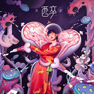
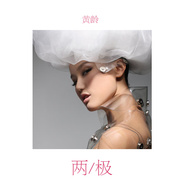

黄龄
============================

|  |  |
| :--: | :-- |
| [<br>黄龄](https://i.xiami.com/isabelle1987312) | **播放数**: 96181952<br>**粉丝数**: 57607<br>**评论数**: 1208<br>**地区**: China 中国大陆<br>**风格**: 国语流行 Mandarin Pop<br> |

## 档案

<div>
黄龄，中国女歌手，1987年2月13日出生于上海。她的嗓音时尚、古典皆备，不仅歌唱实力上大受好评，模特儿般美丽的外型更令人羡慕。她深深的打破美女只是花瓶，少有实力的魔咒，只要看过她现场表演的人，都会被她的演唱实力吸引，更舍不得将视线转移开。为了更好展现出嗓音的特色与时尚、古典皆备的特性，专辑的曲风多元，黄龄有融合小调与粤曲风格的流行歌曲，也有率性狂放的摇滚风格，演唱技巧方面更是炉火纯青。2007年发行专辑《痒》，2010年发行单曲《Shanghai Party Girl》、专辑《特别》，歌曲《痒》、《HIGH歌》在业内广受好评，为华语音乐界不可多得的独立音乐女歌手。<br>
小档案<br>
中文名：黄龄<br>
外文名：Isabelle Huang<br>
别名：豆豆、黄太后、转音歌姬<br>
国籍：中国<br>
出生地：上海<br>
生日：1987年2月13日<br>
职业：歌手、演员<br>
钟爱：Mariah Carey、Michale Jackson、 Beyonce、Jennifer Lopez<br>
擅长：钢琴、吉他演奏及弹唱<br>
代表作：《痒》、《特别》、《High歌》、《原谅》<br>
主要成就：第十五届东方风云榜东方新人奖银奖、第七届中国金唱片奖风行新人奖、第十届全球华语歌曲排行榜上海地区杰出歌手奖、第十八届东方风云榜年度飞跃奖、第十八届东方风云榜年度十大金曲、第十九届东方风云榜年度最佳对唱奖、第一届《完全生活手册》最时尚女艺人奖、第一届《完全生活手册》完全最尚海奖<br>
从艺历程<br>
2005参加在虹口足球场“魅力亚洲——百年唱片巨星演唱会”的演出<br>
2006参加上海新星“红白歌会”；同年被邀请为MariahCarey视听会、Ark甜蜜的孩子乐队和广州“久游网全国超级舞者决赛”的表演嘉宾<br>
2006年演唱上海世博会歌曲《礼仪天下》，出演MV及慈善演出<br>
2007年发行专辑《痒》<br>
2010年，黄龄发行了个人的第二张专辑《特别》，专辑风格则是优雅又前卫、实验却时尚，黄龄则凭借此专辑和同名专辑主打获得了第十届全球华语歌曲排行榜上海地区杰出歌手奖、年度金曲，第十八届东方风云榜年度飞跃奖、年度十大金曲的四项荣誉；同年，黄龄又在年代音乐剧《都市之歌燃情上海》中饰演了女主角陈曼丽；此外，黄龄还与秦海璐、唐群、李彬彬共同出演了文艺剧情片《到阜阳六百里》<br>
2011年，黄龄先是与刘德凯、李子雄、潘时七合作出演了古装商战剧《天下盐商》；随后，黄龄又与薛之谦、黄一琳、杨子共同主演了青春励志电影《音乐江湖》；同年，黄龄还与蓝正龙、乔任梁合作出演了爱情冒险喜剧《巨额交易》；此外，黄龄还出演了都市话剧《女人一定要有钱》<br>
2012年，黄龄与赵丽颖、韩栋、戚迹共同出演了古装励志情感剧《错点鸳鸯》。2013年，黄龄与李治廷、吴昕合作主演了民族风情电影《北回归线》；同年，黄龄又出演了明星版话剧《等爱的女人》，并在剧中饰演了女主角夏秀男；此外，黄龄还客串出演了由宁财神编剧并执导的古装动作喜剧《龙门镖局》<br>
2013年参加江苏卫视明星跳水竞技节目《星跳水立方》<br>
2014年，黄龄在与环球天韵合约期满后选择自立门户，并成立了个人的黄龄工作室；随后，黄龄与阿楠、霍尊合作主演了话剧版《美食大王牌》；同年，黄龄还客串出演了湖南卫视自制的互动栏目剧《女王驾到》；此外，黄龄还担任了校园之星全国歌手选拔赛西南赛区的导师，并和参赛选手分享了个人的演唱心得；同年12月，黄龄在沉淀四年之后推出了东方风情和西方韵味相融合的海派情歌《风月》；与此同时，黄龄还出演了现代舞台剧《这辈子有过你》，并在剧中饰演了知性敢爱的女主角周蕊<br>
2015年，黄龄与作曲家陈钢携手举办了“老上海金曲纪念”演出，并在演出中献唱了海派金曲《花样的年华》和《玫瑰玫瑰我爱你》；同年3月，黄龄与龚琳娜、黄丽玲、丁当共同参加了湖南卫视娱乐脱口秀节目《天天向上》，并在节目中演唱了个人的多首代表作品；同年6月，黄龄又参加了江西卫视的金曲互动沙龙秀节目《超级歌单》，并凭借改编演唱童安格的代表曲目《其实你不懂我的心》顺利入选“超级歌单”大碟；同年7月，黄龄还参加了“动画，你早”国产动画推荐会，并献唱了动画电影《西游记之大圣归来》的主题曲《从前的我》；同年8月，黄龄还参与了动画电影《阿飞向前冲》的配音工作；同年11月5日，黄龄推出了个人EP专辑《龄·EP》，而EP则收录了包括电影《真相禁区》推广曲《禁区》在内的三首歌曲<br>
2016年，黄龄除参加了众多的歌唱综艺节目之外；她还担任了湖南卫视歌唱选秀节目《超级女声》云南唱区的评委；同年9月，黄龄参加了第18届南宁国际民歌艺术节-本色花山 大地飞歌文艺晚会的演出；随后，黄龄在时隔六年之后发布了个人第三张专辑《来日方长》的先导EP《我们都不应该孤单》<br>
2017年5月，黄龄的第三张音乐专辑《来日方长》正式发行，专辑收录了多首龄式情歌，风格则是前卫与复古并行，同时也是黄龄出道十年的一次音乐自白<br>
2019年7月，黄龄发行了第四张个人音乐专辑《醉》，并举办了专辑分享会；随后，其出演的奇幻青春片《回到过去拥抱你》上映；8月7日，她还参加了中央广播电视总台七夕特别节目《天下有情人》，并与男子演唱团体UNINE合唱了歌曲《新的心跳》；10月25日，黄龄还出席了“触点未来·影动中国”首届中国网络电影周闭幕式<br>
2020年2月15日，黄龄开始参加浙江卫视音乐励志节目《天赐的声音》，担任节目的飞行合伙人；6月，参与芒果TV选拔综艺《乘风破浪的姐姐》<br>
荣誉记录<br>
2018-03 东方风云榜最佳流行合作奖 来日方长 (获奖)<br>
2011-03-19 第十八届 东方风云榜年度飞跃奖 (获奖)<br>
2011-03-19 第十八届 东方风云榜年度十大金曲 特别 (获奖)<br>
2010-12-06 第十届 全球华语歌曲排行榜年度金曲 特别 (获奖)<br>
2010-12-06 第十届 全球华语歌曲排行榜上海地区杰出歌手奖 (获奖)<br>
2009 第七届 中国金唱片奖流行新人奖 痒 (获奖)<br>
2008 第十五届 东方风云榜东方新人银奖 (获奖)<br>
媒体评价<br>
“她不比西施沉鱼落雁。<br>
她不比七公主美若天仙。<br>
但她的一颦一笑却比世界上任何饕餮都勾人心魄。<br>
她不是一位偶像派歌者，她始终在用实力证明着自己。<br>
她不是一位普通的歌者，她始终用自己的Style告诉我们音乐的真谛。<br>
她，就是当今最值得聆听的当红歌手——黄龄”
</div>

## 专辑

| 名称 | 语种 | 唱片公司 | 发行时间 | 专辑类别 | 专辑风格 |
| :--: | :-- | :-- | :-- | :-- | :-- |
| [<br>心殇人电影《晴雅集》主题曲](./albums/5022093632.md) | 国语 | 完美青春OST | 2020年12月03日 | EP, 单曲 | 电影原声 Film Score |
| [<br>爱你没道理](./albums/5021882879.md) | 国语 | 智慧大狗 | 2020年11月09日 | EP, 单曲 | 国语流行 Mandarin Pop |
| [<br>不散](./albums/5021776743.md) | 国语 | 宽娱数码 | 2020年10月27日 | EP, 单曲 | 国语流行 Mandarin Pop, 原声 Soundtrack |
| [<br>牵丝戏](./albums/5021714510.md) | 国语 | 信念音乐 | 2020年10月20日 | EP, 单曲 | 国语流行 Mandarin Pop |
| [<br>得意](./albums/5021645408.md) | 国语 | 网易云音乐 | 2020年10月06日 | EP, 单曲 |  |
| [<br>十样花电影《喜宝》原创电影歌曲](./albums/5021557018.md) | 国语 | 百纳娱乐 | 2020年09月30日 | EP, 单曲 | 国语流行 Mandarin Pop |
| [<br>小倩](./albums/5020669331.md) | 国语 | 一起嗨文化 | 2020年05月08日 | EP, 单曲 |  |
| [<br>如影电视剧《无心法师3》插曲](./albums/2108198446.md) | 国语 | 智慧大狗, 天才联盟 | 2020年03月09日 | EP, 单曲 |  |
| [<br>明天会更好 (群星公益版)](./albums/2420329009.md) | 国语 | 咪咕音乐 | 2020年02月27日 | EP, 单曲 | 国语流行 Mandarin Pop |
| [<br>醉Intoxication](./albums/2103318057.md) | 国语 | 种子音乐, Self-Released | 2019年07月03日 | 录音室专辑 | 摇滚 Rock & Roll |
| [<br>半生缘](./albums/2104917495.md) | 国语 | 听见时代 | 2019年06月01日 | EP, 单曲 | 国语流行 Mandarin Pop |
| [<br>大调](./albums/2104808368.md) | 国语 | 种子音乐 | 2019年04月25日 | EP, 单曲 |  |
| [<br>醉](./albums/2104803360.md) | 国语 | 种子音乐 | 2018年12月11日 | EP, 单曲 |  |
| [<br>繁华梦](./albums/2103749368.md) | 国语 | 智慧大狗, 天才联盟 | 2018年06月14日 | EP, 单曲 | 国语流行 Mandarin Pop |
| [<br>万年](./albums/2102852556.md) | 国语 | 欢翼文化 | 2017年09月07日 | EP, 单曲 | 国语流行 Mandarin Pop |
| [<br>你可知道](./albums/2102816701.md) | 国语 | 谭旋音乐工作室 | 2017年08月19日 | EP, 单曲 | 国语流行 Mandarin Pop |
| [<br>来日方长TOMORROW NEVER ENDS](./albums/2102411729.md) | 国语 | 和序文化 | 2017年05月15日 | 录音室专辑 | 国语流行 Mandarin Pop |
| [<br>Wake Up](./albums/2100357820.md) | 国语 | 百慕文化 | 2016年06月23日 | EP, 单曲 | 国语流行 Mandarin Pop |
| [<br>等待](./albums/2100355241.md) | 国语 | 咪咕音乐 | 2016年06月16日 | EP, 单曲 | 国语流行 Mandarin Pop |
| [<br>龄·EP](./albums/917756709.md) | 国语 | 和序文化 | 2015年11月04日 | EP, 单曲 | 国语流行 Mandarin Pop |
| [<br>九月鹰飞](./albums/411616183.md) | 国语 | 英爵文化 | 2014年09月25日 | EP, 单曲 | 国语流行 Mandarin Pop |
| [<br>两极](./albums/795650191.md) | 国语 | 天韵文化 | 2014年03月23日 | EP, 单曲 | 国语流行 Mandarin Pop |
| [<br>恰好](./albums/1809041615.md) | 国语 | 天韵文化 | 2013年01月01日 | EP, 单曲 | 国语流行 Mandarin Pop |
| [<br>忘尘](./albums/1872297078.md) | 国语 | 凯斯尼国际文化 | 2012年10月22日 | 原声带, 影视音乐 | 国语流行 Mandarin Pop |
| [<br>佘山拾翠](./albums/384670331.md) | 国语 | 天韵文化 | 2011年07月25日 | EP, 单曲 | 国语流行 Mandarin Pop |
| [<br>特别](./albums/385559.md) | 国语 | 环球唱片 | 2010年06月18日 | 录音室专辑 | 国语流行 Mandarin Pop, 华语唱作人 Chinese Singer-Songwriter |
| [<br>Shanghai Party Girl](./albums/366047.md) | 国语 | 环球天韵 | 2010年01月04日 | EP, 单曲 | 国语流行 Mandarin Pop |
| [<br>痒](./albums/32868.md) | 国语 | 环球天韵 | 2007年06月12日 | 录音室专辑 | 国语流行 Mandarin Pop |

## 评论

|  |  |  |  |
| :-- | :-- | :-- | :-- |
| <br>[虾米用户](https://emumo.xiami.com/u/379162683)<br>我想要记住你们，我想要你...<br>2020-12-19 16:35<br>赞(0) 踩(0) | <div></div> |
| <br>[虾米用户](https://emumo.xiami.com/u/336143369)<br><br>2020-11-19 19:29<br>赞(0) 踩(0) | <div>少数真的会唱歌的人之一</div> |
| <br>[虾米用户](https://emumo.xiami.com/u/260465019)<br>音乐随心听<br>2020-11-18 14:56<br>赞(0) 踩(0) | <div>喜欢黄龄的歌，喜欢她独特的嗓音唱腔 ，更喜欢她的个性～洒脱不羁、不矫揉造作，直率真我，做自己的女王！是我上海女人的骄傲 </div> |
| <br>[虾米用户](https://emumo.xiami.com/u/35285038)<br>なるようになる<br>2020-10-23 01:27<br>赞(0) 踩(0) | <div>黄龄必定会成为上海人的骄傲(请允许我自私一点)以后从小就给孩子听黄龄的歌百年才出一个的才女 晚认识一天就感觉虚度一天不为市场经济所折腰 只做自己的龄龄子时而妖娆时而邻家 妩媚但不媚俗时而天真时而御姐 可爱却不造作将各种性格融汇在一起的可人儿能知道这样的一位艺人 毕生荣幸</div> |
| <br>[虾米用户](https://emumo.xiami.com/u/405245117)<br>我还没想好要写什么...<br>2020-10-02 08:00<br>赞(1) 踩(0) | <div>༺Y͈̎e͈̎l͈̎l͈̎o͈̎w͈̎ z͈̎e͈̎r͈̎o͈̎༻</div> |
| <br>[虾米用户](https://emumo.xiami.com/u/6513614)<br><br>2020-10-01 02:18<br>赞(0) 踩(0) | <div>你是一个宝❤️</div> |
| <br>[虾米用户](https://emumo.xiami.com/u/13960376)<br>历史是胜利者的历史~<br>2020-08-30 16:32<br>赞(1) 踩(0) | <div>剪刀手YELLOW ZERO的韵味，一般人是学不来的，不是一般人，那就不知道了。不是最美的，可是最妩媚（这里是百分之两百的褒义词）。</div> |
| <br>[虾米用户](https://emumo.xiami.com/u/404492299)<br><br>2020-08-29 07:44<br>赞(0) 踩(0) | <div>芒果TV给00投票《我期待》，五公《情人》，黄龄！让姐姐成团吧！谢谢！</div> |
| <br>[虾米用户](https://emumo.xiami.com/u/3140019)<br>天马行空<br>2020-08-15 11:18<br>赞(1) 踩(0) | <div>又媚又嗲</div> |
| <br>[虾米用户](https://emumo.xiami.com/u/3140019)<br>天马行空<br>2020-08-15 11:17<br>赞(0) 踩(0) | <div>她很好看</div> |
| <br>[虾米用户](https://emumo.xiami.com/u/444308506)<br><br>2020-08-05 13:11<br>赞(0) 踩(0) | <div>姐姐</div> |
| <br>[虾米用户](https://emumo.xiami.com/u/641467)<br>暂无签名~<br>2020-08-04 10:33<br>赞(1) 踩(0) | <div>00我爱你</div> |
| <br>[虾米用户](https://emumo.xiami.com/u/321161910)<br>一生伏首拜阳明<br>2020-07-08 09:57<br>赞(3) 踩(0) | <div>独特的女人，很有自己的调性，声音和个人风格的辨识度都很高。是我非常欣赏的艺人，虽然这么多年也没有大红大紫，却依然心若明月，保持自己独特的光芒。</div> |
| <br>[虾米用户](https://emumo.xiami.com/u/17120073)<br><br>2020-07-03 09:30<br>赞(1) 踩(0) | <div>00子加油！！！！pick你！！！！</div> |
| <br>[虾米用户](https://emumo.xiami.com/u/36428987)<br>我还没想好要写什么...<br>2020-06-27 08:58<br>赞(0) 踩(0) | <div>稀饭这个姐姐ahh。</div> |
| <br>[虾米用户](https://emumo.xiami.com/u/49438226)<br><br>2020-06-21 21:35<br>赞(1) 踩(0) | <div>生来就这么有风情嘛</div> |
| <br>[虾米用户](https://emumo.xiami.com/u/46854854)<br><br>2020-06-20 16:33<br>赞(1) 踩(0) | <div>公虾米，花清秋</div> |
| ⇒ | <br>[虾米用户](https://emumo.xiami.com/u/1593286)<br> <br>2020-06-20 17:12<br>赞(0) 踩(0) | <div>哈哈哈哈哈哈哈假酒警告</div> |
| <br>[虾米用户](https://emumo.xiami.com/u/24518310)<br>各有活法。<br>2020-06-14 22:03<br>赞(2) 踩(0) | <div>姐姐这次给我火！！！pick！！！</div> |
| <br>[虾米用户](https://emumo.xiami.com/u/344018512)<br>我还没想好要写什么...<br>2020-06-13 00:33<br>赞(0) 踩(0) | <div>Dī姐姐！</div> |
| <br>[虾米用户](https://emumo.xiami.com/u/343278989)<br> <br>2020-05-24 22:37<br>赞(0) 踩(0) | <div>超好听</div> |
| <br>[虾米用户](https://emumo.xiami.com/u/21184222)<br><br>2020-04-14 03:58<br>赞(1) 踩(0) | <div>再过三五年   在来看看这里的评论 </div> |
| <br>[虾米用户](https://emumo.xiami.com/u/442087233)<br>家中有个王酷盖<br>2020-04-12 18:36<br>赞(0) 踩(0) | <div>感觉她和他师哥是一对。。</div> |
| <br>[虾米用户](https://emumo.xiami.com/u/235374816)<br>虾米真的很奈斯<br>2020-03-18 15:15<br>赞(2) 踩(0) | <div>我超级喜欢这位歌手的嗓音 那首禁区 我的天呐!!!!!</div> |
| <br>[虾米用户](https://emumo.xiami.com/u/358104299)<br>悲观的唯心存在现实解构虚...<br>2020-03-16 07:07<br>赞(1) 踩(0) | <div>16717</div> |
| <br>[虾米用户](https://emumo.xiami.com/u/52578326)<br>чудесная жиз...<br>2020-03-14 14:00<br>赞(0) 踩(0) | <div>第一个因为看脸关注的歌手！有韵味！</div> |
| <br>[虾米用户](https://emumo.xiami.com/u/49438226)<br><br>2020-03-09 09:15<br>赞(2) 踩(0) | <div>目前还没有大红大紫是因为太高级，不穷不苦不丧不大嗓门，同理tia</div> |
| <br>[虾米用户](https://emumo.xiami.com/u/33341742)<br>听音乐<br>2020-03-04 13:36<br>赞(0) 踩(0) | <div>实力派！加油！</div> |
| <br>[虾米用户](https://emumo.xiami.com/u/66823378)<br><br>2020-02-20 23:41<br>赞(0) 踩(0) | <div></div> |
| <br>[虾米用户](https://emumo.xiami.com/u/362649488)<br><br>2020-02-13 12:55<br>赞(1) 踩(0) | <div>黄龄姐姐生日快乐！</div> |
| <br>[虾米用户](https://emumo.xiami.com/u/327306954)<br>听，见，行，远～<br>2020-02-13 10:59<br>赞(1) 踩(0) | <div>生快，快出新歌，转音天后。</div> |
| <br>[虾米用户](https://emumo.xiami.com/u/426272961)<br>(:3_\)_<br>2020-02-13 10:04<br>赞(0) 踩(0) | <div></div> |
| <br>[虾米用户](https://emumo.xiami.com/u/31322989)<br>Born to be f...<br>2020-02-03 19:11<br>赞(0) 踩(0) | <div>转音天仙~~</div> |
| <br>[虾米用户](https://emumo.xiami.com/u/402541769)<br><br>2019-12-24 11:47<br>赞(0) 踩(0) | <div>HIGH歌 唱的不錯 請繼續給大家帶來更多好的作品</div> |
| <br>[虾米用户](https://emumo.xiami.com/u/3656033)<br> <br>2019-12-10 18:50<br>赞(0) 踩(0) | <div>黄龄加油 ，你一直都很棒，一直在关注你</div> |
| <br>[虾米用户](https://emumo.xiami.com/u/345172397)<br>不经常与家人呆在一起的男...<br>2019-11-28 22:57<br>赞(4) 踩(0) | <div>音色的柔美要比王菲强很多！</div> |
| <br>[虾米用户](https://emumo.xiami.com/u/374397660)<br>神只出现在末世<br>2019-11-16 00:32<br>赞(7) 踩(0) | <div>黄龄的嗓子我个人认为是大陆女歌手排第一了，高音和低音都这么完美，这种嗓子我之前只见过一位，就是泰国的Ann thitima，黄龄是我发现的第二位，女歌手有这种嗓音的真是太难得了，目前我只发现两个。</div> |
| <br>[虾米用户](https://emumo.xiami.com/u/429935569)<br>ボク サトル<br>2019-10-27 16:42<br>赞(0) 踩(0) | <div></div> |
| <br>[虾米用户](https://emumo.xiami.com/u/418572000)<br><br>2019-10-26 22:27<br>赞(0) 踩(0) | <div>还是忘尘最好听，尘世  眷鸟天涯栖</div> |
| <br>[虾米用户](https://emumo.xiami.com/u/57430968)<br>我还没想好要写什么...<br>2019-10-21 09:08<br>赞(1) 踩(0) | <div>音色透骨，大爱</div> |
| <br>[虾米用户](https://emumo.xiami.com/u/15745687)<br><br>2019-09-12 08:05<br>赞(0) 踩(0) | <div>好好的为什么要整容呢</div> |
| <br>[虾米用户](https://emumo.xiami.com/u/420770734)<br><br>2019-09-06 14:31<br>赞(3) 踩(0) | <div>龄姐牛逼，可惜一直没有大火。宝藏女孩，希望龄姐能被更多人听到！</div> |
| <br>[虾米用户](https://emumo.xiami.com/u/50127365)<br> <br>2019-07-23 01:26<br>赞(2) 踩(0) | <div>淡妆特别好看，皮肤好身材棒大长腿。搞不懂为何常常被涂上过分浓的眼妆和像偷吃了猪油的果冻唇…</div> |
| <br>[虾米用户](https://emumo.xiami.com/u/260766418)<br>我也愛妳<br>2019-07-12 11:53<br>赞(0) 踩(0) | <div>好美啊好漂亮啊太漂亮了 </div> |
| <br>[虾米用户](https://emumo.xiami.com/u/7230283)<br><br>2019-06-20 08:52<br>赞(0) 踩(0) | <div>忐忑观光团~</div> |
| <br>[虾米用户](https://emumo.xiami.com/u/283040611)<br>不忘初心，方得始终。<br>2019-06-03 12:29<br>赞(0) 踩(0) | <div>真是撩动心弦的声音啊</div> |
| <br>[虾米用户](https://emumo.xiami.com/u/283040611)<br>不忘初心，方得始终。<br>2019-06-03 12:22<br>赞(1) 踩(0) | <div>你好棒啊 </div> |
| <br>[虾米用户](https://emumo.xiami.com/u/279078993)<br>是否因我而……<br>2019-05-21 18:02<br>赞(0) 踩(0) | <div>有点刘亦菲的味道……</div> |
| <br>[虾米用户](https://emumo.xiami.com/u/116004382)<br>沉迷节奏布鲁斯   R&...<br>2019-04-20 22:58<br>赞(2) 踩(0) | <div>真的很强的一位歌手。而且很有中国东方美特色。前三首歌曲真的曲库必备！百听不厌！</div> |
| <br>[虾米用户](https://emumo.xiami.com/u/336546921)<br>我还没想好要写什么...<br>2019-03-21 17:25<br>赞(0) 踩(0) | <div>声音很好听</div> |
| <br>[虾米用户](https://emumo.xiami.com/u/314603340)<br>时光不老我们不分<br>2019-03-21 08:48<br>赞(0) 踩(0) | <div>小歌真骚</div> |
| <br>[虾米用户](https://emumo.xiami.com/u/28912922)<br><br>2019-03-21 01:18<br>赞(1) 踩(0) | <div>女神٩(๑òωó๑)۶挺你 </div> |
| <br>[虾米用户](https://emumo.xiami.com/u/9290383)<br><br>2019-02-13 18:19<br>赞(0) 踩(0) | <div>生日快乐</div> |
| <br>[虾米用户](https://emumo.xiami.com/u/148037774)<br><br>2019-02-13 13:48<br>赞(0) 踩(0) | <div>现在最喜欢的歌手，祝愿越来越好！</div> |
| <br>[虾米用户](https://emumo.xiami.com/u/33234927)<br>……<br>2019-02-13 10:17<br>赞(1) 踩(0) | <div>黄老板逆水寒(｡･ω･｡)</div> |
| <br>[虾米用户](https://emumo.xiami.com/u/5094619)<br>中国俄语音乐原创第一人<br>2019-02-13 10:03<br>赞(0) 踩(0) | <div>黄龄老师，祝您生日快乐!身体健康！期待您的新作品！喜欢您！ </div> |
| <br>[虾米用户](https://emumo.xiami.com/u/2712532)<br><br>2019-01-26 01:21<br>赞(0) 踩(0) | <div>由TVB《守护神之保险调查》电视剧原曲灵魂伴侣而来</div> |
| <br>[虾米用户](https://emumo.xiami.com/u/90120368)<br><br>2019-01-24 19:44<br>赞(0) 踩(0) | <div>非常喜欢，好听！</div> |
| <br>[虾米用户](https://emumo.xiami.com/u/344455411)<br>我还没想好要写什么...<br>2019-01-23 20:45<br>赞(1) 踩(0) | <div> 龄姐兼具古典和现代之美，是我最喜欢的女歌手之一……  </div> |
| <br>[虾米用户](https://emumo.xiami.com/u/11979517)<br>xj<br>2018-12-30 18:14<br>赞(1) 踩(0) | <div>新专没有版权就不开心了……</div> |
| <br>[虾米用户](https://emumo.xiami.com/u/34648135)<br><br>2018-12-30 13:18<br>赞(0) 踩(0) | <div>怎么没有斯卡布罗集市这首？</div> |
| <br>[虾米用户](https://emumo.xiami.com/u/4334438)<br>贫穷而倔强<br>2018-12-11 08:07<br>赞(0) 踩(0) | <div>新专？</div> |
| <br>[虾米用户](https://emumo.xiami.com/u/125148090)<br><br>2018-11-30 01:31<br>赞(7) 踩(0) | <div>我觉得比张靓颖嗓子好，跟姚贝娜风格不同但水平不相上下。总之这样的嗓子没有大红实属不应该，也许她只需要一首像当年吻别那样红遍大江南北的歌而已。</div> |
| <br>[虾米用户](https://emumo.xiami.com/u/9871534)<br><br>2018-11-20 21:20<br>赞(1) 踩(0) | <div>今天第一次听你的《痒》，现在我全身都痒！ </div> |
| <br>[虾米用户](https://emumo.xiami.com/u/328929764)<br><br>2018-10-11 19:02<br>赞(0) 踩(0) | <div>没事</div> |
| <br>[虾米用户](https://emumo.xiami.com/u/276275251)<br>万毒王！<br>2018-10-09 23:11<br>赞(2) 踩(0) | <div>黄龄的嗓子真牛</div> |
| <br>[虾米用户](https://emumo.xiami.com/u/4334438)<br>贫穷而倔强<br>2018-10-03 07:39<br>赞(3) 踩(0) | <div>好希望黄龄上打歌节目</div> |
| <br>[虾米用户](https://emumo.xiami.com/u/42810132)<br>Aprés l'amou...<br>2018-09-18 12:24<br>赞(2) 踩(0) | <div>黄龄加油</div> |
| <br>[虾米用户](https://emumo.xiami.com/u/376957050)<br><br>2018-08-29 08:55<br>赞(1) 踩(0) | <div>求两极ep的资源啊(≧▽≦)</div> |
| <br>[虾米用户](https://emumo.xiami.com/u/21801236)<br><br>2018-07-15 01:18<br>赞(2) 踩(0) | <div>多好的歌手呀！</div> |
| <br>[虾米用户](https://emumo.xiami.com/u/145597060)<br>享受音乐的魅力！<br>2018-07-12 19:19<br>赞(6) 踩(0) | <div>挺好看的，小酒窝，天生魅像，眼神勾人，笑死了特别迷人。。可惜没有大红大紫起来，加油！！！！！ 。</div> |
| <br>[虾米用户](https://emumo.xiami.com/u/358214569)<br><br>2018-06-29 13:52<br>赞(1) 踩(0) | <div>第一次了解你是在你跟薛之谦演的电影《音乐江湖》。 </div> |
| <br>[虾米用户](https://emumo.xiami.com/u/358214569)<br><br>2018-06-29 13:50<br>赞(1) 踩(0) | <div>第一次看你的视屏是你跟薛之谦演的电影《音乐江湖》。 </div> |
| <br>[虾米用户](https://emumo.xiami.com/u/343515734)<br><br>2018-06-16 06:17<br>赞(0) 踩(0) | <div>上海滩，没有创新，没有个性，将被大浪淘沙，必退出历史舞台，愿你象惜人&amp;ldquo;周旋&amp;rdquo;、今人&amp;ldquo;林青霞&amp;rdquo;，红遍大江南北！                      </div> |
| <br>[虾米用户](https://emumo.xiami.com/u/188274778)<br>音乐，是生活中的……<br>2018-06-09 17:37<br>赞(2) 踩(0) | <div>声音好听</div> |
| <br>[虾米用户](https://emumo.xiami.com/u/49959840)<br>无聊人<br>2018-06-08 23:32<br>赞(0) 踩(0) | <div>嘻</div> |
| <br>[虾米用户](https://emumo.xiami.com/u/374427292)<br>我还没想好要写什么...<br>2018-06-06 18:33<br>赞(0) 踩(0) | <div>怎么关注你</div> |
| <br>[虾米用户](https://emumo.xiami.com/u/4394005)<br><br>2018-06-02 10:16<br>赞(5) 踩(0) | <div>红不红又怎样，好音乐都经过了时间的锤炼。</div> |
| <br>[虾米用户](https://emumo.xiami.com/u/45442774)<br><br>2018-05-28 17:34<br>赞(1) 踩(0) | <div>饕餮并不勾人&amp;rarr;_&amp;rarr;</div> |
| <br>[虾米用户](https://emumo.xiami.com/u/8364606)<br>never stop s...<br>2018-05-24 19:35<br>赞(1) 踩(0) | <div>龄姐就是唱功有点尬，要是能多巩固一下基本功就好了，这么好的声线，光是呆录音室不浪费了嘛。出道这么多年了啊</div> |
| <br>[虾米用户](https://emumo.xiami.com/u/12064029)<br>伸脷尖舔铜锈。<br>2018-04-27 22:09<br>赞(4) 踩(0) | <div>可柔可刚，可妖可媚，是天使也是魔鬼，所以，还有什么理由不爱？</div> |
| <br>[虾米用户](https://emumo.xiami.com/u/323987299)<br><br>2018-04-16 20:48<br>赞(0) 踩(0) | <div></div> |
| <br>[虾米用户](https://emumo.xiami.com/u/187870589)<br>捕鱼达人<br>2018-04-04 19:55<br>赞(6) 踩(0) | <div>简介好浮夸，不过我爱她。</div> |
| <br>[虾米用户](https://emumo.xiami.com/u/167457560)<br><br>2018-03-30 17:44<br>赞(1) 踩(0) | <div>《等待》镇魂街的片尾曲太好听了。</div> |
| <br>[虾米用户](https://emumo.xiami.com/u/332908503)<br>……<br>2018-03-30 14:54<br>赞(0) 踩(0) | <div>《问情》这首怎么还没有入驻虾米呢？</div> |
| <br>[虾米用户](https://emumo.xiami.com/u/349015838)<br>我想好要写什么了，就是这...<br>2018-03-20 13:32<br>赞(0) 踩(0) | <div>大方脸，够丑</div> |
| <br>[虾米用户](https://emumo.xiami.com/u/74351868)<br>敬往事一杯酒<br>2018-03-19 23:05<br>赞(1) 踩(0) | <div>撩人的小姐姐 日常打卡</div> |
| <br>[虾米用户](https://emumo.xiami.com/u/50662742)<br>我在这里本来是晴朗好天气...<br>2018-03-17 22:26<br>赞(2) 踩(0) | <div>怎么没有红眼睛</div> |
| <br>[虾米用户](https://emumo.xiami.com/u/330630850)<br><br>2018-03-16 19:35<br>赞(0) 踩(0) | <div>加油</div> |
| <br>[虾米用户](https://emumo.xiami.com/u/348008372)<br>一位真爱粉。。。<br>2018-03-11 11:10<br>赞(0) 踩(0) | <div>声音真的好好听很柔美!    </div> |
| <br>[虾米用户](https://emumo.xiami.com/u/181775712)<br>拜拜<br>2018-02-26 11:20<br>赞(4) 踩(0) | <div>才发现真的很百变啊，声音不局限于妩媚动人。</div> |
| <br>[虾米用户](https://emumo.xiami.com/u/3140019)<br>天马行空<br>2018-02-21 23:26<br>赞(0) 踩(0) | <div>文案你自己不尴尬吗</div> |
| <br>[虾米用户](https://emumo.xiami.com/u/20458893)<br><br>2018-02-20 02:31<br>赞(0) 踩(0) | <div>hight 到现在</div> |
| <br>[虾米用户](https://emumo.xiami.com/u/78551750)<br><br>2018-01-29 15:17<br>赞(2) 踩(0) | <div>真歌手！不管是块或者慢，中国风或者欧美风~完全被你驾驭起来被你感染透了！</div> |
| <br>[虾米用户](https://emumo.xiami.com/u/47274237)<br>良才难令,然可以致君见尊...<br>2018-01-27 05:40<br>赞(2) 踩(0) | <div>我前几天在上路上好像看到你了 </div> |
| <br>[虾米用户](https://emumo.xiami.com/u/247995430)<br><br>2018-01-26 23:49<br>赞(0) 踩(0) | <div>感觉眼睛变大了啊</div> |
| <br>[虾米用户](https://emumo.xiami.com/u/304079669)<br><br>2018-01-26 13:50<br>赞(1) 踩(0) | <div>简直一奇才</div> |
| <br>[虾米用户](https://emumo.xiami.com/u/345804517)<br>兄弟姐妹   东南西北 ...<br>2018-01-22 12:43<br>赞(0) 踩(0) | <div> </div> |
| <br>[虾米用户](https://emumo.xiami.com/u/49519339)<br><br>2018-01-09 21:52<br>赞(0) 踩(0) | <div>看live才发现你真美</div> |
| <br>[虾米用户](https://emumo.xiami.com/u/301760761)<br>他山之石<br>2018-01-07 14:52<br>赞(1) 踩(0) | <div>是真的很棒的歌手！！！！！支持你</div> |
| <br>[虾米用户](https://emumo.xiami.com/u/308660362)<br>一整个宇宙，换一颗红豆<br>2018-01-06 20:24<br>赞(1) 踩(0) | <div>龄姐的《High歌》，真的很有魔性，每当我心情不好的时候，一听这歌就热血沸腾了，喜欢</div> |
| <br>[虾米用户](https://emumo.xiami.com/u/3916516)<br>成为自己<br>2017-12-17 17:00<br>赞(3) 踩(0) | <div>第一次听黄龄还是四五年前上大学时，韩寒博客里的播放器里有黄龄的红眼睛。顿时就喜欢上这个上海姑娘了。江南出美女，倪妮，汤唯都是。</div> |
| <br>[虾米用户](https://emumo.xiami.com/u/33444626)<br>Hasta la vis...<br>2017-12-15 18:54<br>赞(0) 踩(0) | <div>唱功棒</div> |
| <br>[虾米用户](https://emumo.xiami.com/u/255874590)<br>藍調@九號塘口Tai麗音<br>2017-11-20 23:24<br>赞(0) 踩(0) | <div>喜欢你理解歌曲的意境并把它完美的展现出来，谢谢。</div> |
| <br>[虾米用户](https://emumo.xiami.com/u/285342803)<br>从今天开始爱上音乐<br>2017-11-14 15:05<br>赞(2) 踩(0) | <div>学个来日方长怎么那么难</div> |
| <br>[虾米用户](https://emumo.xiami.com/u/229260037)<br>花落伊流泪，葬花却不知<br>2017-11-13 20:33<br>赞(3) 踩(0) | <div>有魅力的女人，有音色有味道有挥不去的妩媚，来自一个二十三的小年轻男生</div> |
| <br>[虾米用户](https://emumo.xiami.com/u/6820570)<br>这是语言的变调，承接醒来...<br>2017-11-10 00:37<br>赞(2) 踩(0) | <div>龄姐好可爱！！！</div> |
| <br>[虾米用户](https://emumo.xiami.com/u/1801358)<br><br>2017-10-30 10:11<br>赞(4) 踩(0) | <div>第一次听痒是在11年某个冬日的KTV里，当时唱歌那妹子气质跟黄龄蛮像的说~现在才认真的被原唱洗脑</div> |
| <br>[虾米用户](https://emumo.xiami.com/u/3428554)<br>我是好人<br>2017-10-30 10:08<br>赞(4) 踩(0) | <div>就high歌烂大街不喜欢。。。。。。唱的真心好听</div> |
| <br>[虾米用户](https://emumo.xiami.com/u/2967881)<br><br>2017-10-28 00:06<br>赞(3) 踩(0) | <div>特别，没办法，喜欢上了，这才是好音乐。大约快两年前的样子就从韩寒的空间里听她的红眼睛，就觉得好听，但没太注意，可惜。</div> |
| <br>[虾米用户](https://emumo.xiami.com/u/8526623)<br>Tot ziens~<br>2017-10-27 23:14<br>赞(2) 踩(0) | <div>说说我给的关键字（句）吧：小清新，御姐，神样存在，好久没有喜欢大陆音乐了（难道你有喜欢过么）你把我拉回来了，麻豆身材拍大片会碉堡，去台湾＝毁三观</div> |
| <br>[虾米用户](https://emumo.xiami.com/u/2321626)<br><br>2017-10-27 23:02<br>赞(32) 踩(0) | <div>北亚地区在歌曲这块上，现在绝对是中国实力最优(也有人口基数的原因)。  从地下乐团到部分土摇都相当棒。 曾经的港台的高质量自从跟了日韩的潮流一去不复返。   j－pop 还行，就是歌词无聊。 像铃木常吉这种有意思的歌手不是很多。  k－pop...........  卖肉卖颜卖腐。</div> |
| <br>[虾米用户](https://emumo.xiami.com/u/329235472)<br><br>2017-10-13 09:55<br>赞(2) 踩(0) | <div></div> |
| <br>[虾米用户](https://emumo.xiami.com/u/189221675)<br>金刚<br>2017-10-12 05:00<br>赞(2) 踩(0) | <div>声音有毒</div> |
| <br>[虾米用户](https://emumo.xiami.com/u/178176102)<br>找一首歌…<br>2017-10-08 23:45<br>赞(1) 踩(0) | <div>high，来日，痒。。。服！</div> |
| <br>[虾米用户](https://emumo.xiami.com/u/265116543)<br><br>2017-10-08 19:12<br>赞(1) 踩(0) | <div>这个界面的头像有毒  </div> |
| <br>[虾米用户](https://emumo.xiami.com/u/325832664)<br>爱情<br>2017-10-06 19:27<br>赞(1) 踩(0) | <div>超 喜欢听《明珠》</div> |
| <br>[虾米用户](https://emumo.xiami.com/u/100660422)<br>你好呀。(¦3[▓▓]虾...<br>2017-09-23 11:15<br>赞(0) 踩(0) | <div>唱功好的没话说 </div> |
| <br>[虾米用户](https://emumo.xiami.com/u/15860080)<br>ᐉ<br>2017-09-18 07:45<br>赞(0) 踩(0) | <div>爱你</div> |
| <br>[虾米用户](https://emumo.xiami.com/u/4334438)<br>贫穷而倔强<br>2017-09-15 20:21<br>赞(0) 踩(0) | <div>黄龄的眼睛很有特色</div> |
| <br>[虾米用户](https://emumo.xiami.com/u/34052844)<br><br>2017-09-14 12:01<br>赞(1) 踩(0) | <div>个性有唱功</div> |
| <br>[虾米用户](https://emumo.xiami.com/u/15547242)<br><br>2017-09-13 08:24<br>赞(4) 踩(0) | <div>歌红人不红的典范</div> |
| <br>[虾米用户](https://emumo.xiami.com/u/282625272)<br><br>2017-09-10 18:00<br>赞(0) 踩(0) | <div>洗脑~~</div> |
| <br>[虾米用户](https://emumo.xiami.com/u/324165942)<br><br>2017-09-09 17:30<br>赞(1) 踩(0) | <div>你的歌曲非常好听     </div> |
| <br>[虾米用户](https://emumo.xiami.com/u/4233013)<br>我还没想好要写什么...<br>2017-08-31 02:55<br>赞(0) 踩(0) | <div>人美，歌好！童菲美</div> |
| <br>[虾米用户](https://emumo.xiami.com/u/278494624)<br><br>2017-08-30 20:40<br>赞(2) 踩(0) | <div>因为好听才喜欢，因为喜欢才爱听。</div> |
| <br>[虾米用户](https://emumo.xiami.com/u/7375797)<br><br>2017-08-29 09:52<br>赞(0) 踩(0) | <div>好听</div> |
| <br>[虾米用户](https://emumo.xiami.com/u/321947871)<br>众里寻她千百度……<br>2017-08-28 07:26<br>赞(1) 踩(0) | <div>喜欢黄龄的转音，无敌 </div> |
| <br>[虾米用户](https://emumo.xiami.com/u/314777600)<br><br>2017-08-24 19:10<br>赞(4) 踩(0) | <div>K歌想唱黄龄的可不容易。</div> |
| <br>[虾米用户](https://emumo.xiami.com/u/278379605)<br><br>2017-08-22 10:22<br>赞(1) 踩(0) | <div>长得挺有骨感美，特别有韵味的一个女人</div> |
| <br>[虾米用户](https://emumo.xiami.com/u/254201741)<br>平生一散人，归来不念仙。<br>2017-08-19 18:54<br>赞(1) 踩(0) | <div>这个声音满足了我对女性所有的幻想。  </div> |
| <br>[虾米用户](https://emumo.xiami.com/u/124638296)<br>elctrohouse<br>2017-08-15 20:11<br>赞(0) 踩(0) | <div>1987的哎呀</div> |
| <br>[虾米用户](https://emumo.xiami.com/u/74869598)<br>大爱黄龄。<br>2017-08-03 11:39<br>赞(4) 踩(0) | <div>黄龄素颜就很美 声音更是美的不像话</div> |
| <br>[虾米用户](https://emumo.xiami.com/u/292834139)<br>人生漫漫，何苦处处为难自...<br>2017-08-02 18:55<br>赞(0) 踩(0) | <div>尋</div> |
| <br>[虾米用户](https://emumo.xiami.com/u/262573985)<br><br>2017-07-26 18:31<br>赞(2) 踩(0) | <div>喜欢</div> |
| <br>[虾米用户](https://emumo.xiami.com/u/307015301)<br>快乐<br>2017-07-26 16:39<br>赞(1) 踩(0) | <div>好</div> |
| <br>[虾米用户](https://emumo.xiami.com/u/11225224)<br>哔哩哔哩up主 绫人太太...<br>2017-07-19 00:27<br>赞(1) 踩(0) | <div>风月太棒了</div> |
| <br>[虾米用户](https://emumo.xiami.com/u/13836767)<br>你已经死了<br>2017-07-11 17:04<br>赞(2) 踩(0) | <div>然而虾米总是不推，我也木有办法</div> |
| <br>[虾米用户](https://emumo.xiami.com/u/6126110)<br><br>2017-07-06 17:37<br>赞(4) 踩(0) | <div>很喜欢她的声音~真的很魅~</div> |
| <br>[虾米用户](https://emumo.xiami.com/u/286481775)<br> <br>2017-06-27 23:41<br>赞(1) 踩(0) | <div>打赌绝对火 以前不知道 b站镇魂街国漫前来 黄龄的等待作为bgm简直神了</div> |
| <br>[虾米用户](https://emumo.xiami.com/u/301159512)<br>QQ188113289<br>2017-06-27 13:33<br>赞(0) 踩(0) | <div>0.3148%</div> |
| <br>[虾米用户](https://emumo.xiami.com/u/307253067)<br><br>2017-06-25 08:22<br>赞(0) 踩(0) | <div></div> |
| ⇒ | <br>[虾米用户](https://emumo.xiami.com/u/307015301)<br>快乐<br>2017-07-26 16:37<br>赞(0) 踩(0) | <div>:: </div> |
| <br>[虾米用户](https://emumo.xiami.com/u/300315449)<br>道可道非恒道，名可名非恒...<br>2017-06-20 08:31<br>赞(2) 踩(0) | <div>声线难得</div> |
| <br>[虾米用户](https://emumo.xiami.com/u/285029183)<br><br>2017-06-17 22:07<br>赞(0) 踩(0) | <div>我的天，泽莫好的嗓子居然没火，好想和别人分享</div> |
| <br>[虾米用户](https://emumo.xiami.com/u/190762182)<br>販賣可愛！！<br>2017-06-13 15:30<br>赞(0) 踩(0) | <div>woc虾米抽了是不是？我明明不喜欢这种风格的歌，神特么居然自动给老子收藏？Aer you kidding me？居然还取消不了收藏...我靠是要气死。mdzz</div> |
| <br>[虾米用户](https://emumo.xiami.com/u/136649170)<br><br>2017-06-12 01:29<br>赞(0) 踩(0) | <div>专辑封面是谁设计的啊？真是无话可说</div> |
| <br>[虾米用户](https://emumo.xiami.com/u/2021147)<br>我行我素<br>2017-06-03 20:39<br>赞(4) 踩(0) | <div>她的嗓音甜甜的象棉花糖一般柔软，她的风情丝丝入扣让人心旌荡漾，如果说她还有一点古典美又夹杂了现代气息，你是否已经拜倒在她的石榴裙下？</div> |
| <br>[虾米用户](https://emumo.xiami.com/u/114979444)<br>自在如风<br>2017-05-31 23:18<br>赞(4) 踩(0) | <div>早就说过黄龄势不可挡 还要再说一万遍</div> |
| <br>[虾米用户](https://emumo.xiami.com/u/88173552)<br>总有一首会让我感动<br>2017-05-29 23:39<br>赞(3) 踩(0) | <div>何时能火 </div> |
| <br>[虾米用户](https://emumo.xiami.com/u/2918355)<br>我还没想好要写什么...<br>2017-05-27 22:38<br>赞(4) 踩(0) | <div>有骨有皮！我认为内地最有潜力的女歌手就是黄龄   可塑性也非常强！明明应该能比现在更火</div> |
| <br>[虾米用户](https://emumo.xiami.com/u/9514719)<br>我还没想好要写什么...<br>2017-05-26 18:51<br>赞(0) 踩(0) | <div>封存</div> |
| <br>[虾米用户](https://emumo.xiami.com/u/85002028)<br><br>2017-05-26 14:15<br>赞(1) 踩(0) | <div>实力派 声线已膜拜</div> |
| <br>[虾米用户](https://emumo.xiami.com/u/39816876)<br>全世界不缺你一个<br>2017-05-22 21:35<br>赞(2) 踩(0) | <div>虾米的图片是专业坑歌手的吧</div> |
| <br>[虾米用户](https://emumo.xiami.com/u/254300809)<br><br>2017-05-22 19:56<br>赞(2) 踩(0) | <div>我喜欢的女声黄龄，男声陈奕迅，林宥嘉 </div> |
| <br>[虾米用户](https://emumo.xiami.com/u/186758901)<br><br>2017-05-22 14:15<br>赞(0) 踩(0) | <div>很棒！</div> |
| <br>[虾米用户](https://emumo.xiami.com/u/87128188)<br>虾米让我找到真正的归宿、<br>2017-05-21 11:38<br>赞(0) 踩(0) | <div>嘴好难看</div> |
| <br>[虾米用户](https://emumo.xiami.com/u/36314172)<br> <br>2017-05-20 07:48<br>赞(1) 踩(0) | <div>非常漂亮的长相和歌声</div> |
| <br>[虾米用户](https://emumo.xiami.com/u/549784)<br>音乐...带你飞<br>2017-05-19 12:36<br>赞(1) 踩(0) | <div>喜欢你的声线......</div> |
| <br>[虾米用户](https://emumo.xiami.com/u/549784)<br>音乐...带你飞<br>2017-05-19 12:35<br>赞(0) 踩(0) | <div>和你差一天生日，不过我妈妈和你是一天哈哈哈哈</div> |
| <br>[虾米用户](https://emumo.xiami.com/u/4334438)<br>贫穷而倔强<br>2017-05-18 23:29<br>赞(0) 踩(0) | <div>加油啊，很期待你的更多作品 </div> |
| <br>[虾米用户](https://emumo.xiami.com/u/248237153)<br><br>2017-05-10 14:09<br>赞(4) 踩(0) | <div>超模一样的美女</div> |
| <br>[虾米用户](https://emumo.xiami.com/u/45325350)<br>0.7<br>2017-05-08 16:02<br>赞(2) 踩(0) | <div>表白黄龄</div> |
| <br>[虾米用户](https://emumo.xiami.com/u/10363618)<br>歌 书 电影 心情 不易...<br>2017-05-04 00:25<br>赞(3) 踩(0) | <div>超模脸呀</div> |
| <br>[虾米用户](https://emumo.xiami.com/u/252862521)<br>此刻，唯有音乐，心仿如觅...<br>2017-05-03 03:54<br>赞(1) 踩(0) | <div>实力派，有实力没被发掘，公司宣传手段不给力</div> |
| <br>[虾米用户](https://emumo.xiami.com/u/288479639)<br><br>2017-05-01 08:00<br>赞(1) 踩(0) | <div>以前都不知道痒这首歌</div> |
| <br>[虾米用户](https://emumo.xiami.com/u/266250479)<br><br>2017-04-29 16:30<br>赞(3) 踩(0) | <div>黄龄的歌声很好听</div> |
| <br>[虾米用户](https://emumo.xiami.com/u/221267864)<br>故人依在否？<br>2017-04-23 14:12<br>赞(0) 踩(0) | <div>实力派</div> |
| <br>[虾米用户](https://emumo.xiami.com/u/269078957)<br><br>2017-04-21 06:26<br>赞(2) 踩(0) | <div>简直不能再爱了！</div> |
| <br>[虾米用户](https://emumo.xiami.com/u/36641379)<br><br>2017-04-20 08:38<br>赞(3) 踩(0) | <div>封面好难看，真人比照片好看多了</div> |
| <br>[虾米用户](https://emumo.xiami.com/u/269159093)<br>世间安得双全法，不负如来...<br>2017-04-20 01:38<br>赞(2) 踩(0) | <div>不错，别有一番风味！</div> |
| <br>[虾米用户](https://emumo.xiami.com/u/84046430)<br>展翅高飞，星辰大海，日月...<br>2017-04-18 11:33<br>赞(0) 踩(0) | <div>酒窝很漂亮</div> |
| <br>[虾米用户](https://emumo.xiami.com/u/79822646)<br>乍见之欢不如久处不厌。<br>2017-04-14 21:27<br>赞(0) 踩(0) | <div>来呀造作呀</div> |
| <br>[虾米用户](https://emumo.xiami.com/u/244935142)<br><br>2017-04-11 23:48<br>赞(1) 踩(0) | <div>很艺术</div> |
| <br>[虾米用户](https://emumo.xiami.com/u/267766725)<br><br>2017-04-09 10:27<br>赞(0) 踩(0) | <div>让我感动的声音  </div> |
| <br>[虾米用户](https://emumo.xiami.com/u/285122543)<br>我还没想好要写什么...<br>2017-04-04 21:04<br>赞(0) 踩(0) | <div>性感大宝贝</div> |
| <br>[虾米用户](https://emumo.xiami.com/u/281656570)<br>宁静.洛天依之恋<br>2017-04-02 18:02<br>赞(0) 踩(0) | <div>我还是更喜欢《桃花缘记》。</div> |
| <br>[虾米用户](https://emumo.xiami.com/u/257497082)<br><br>2017-04-01 22:38<br>赞(1) 踩(0) | <div>长的很好啊，有特色，性感 </div> |
| <br>[虾米用户](https://emumo.xiami.com/u/43463981)<br>我曾经画过山和大海，也穿...<br>2017-04-01 15:37<br>赞(0) 踩(0) | <div>相见恨晚的痒</div> |
| <br>[虾米用户](https://emumo.xiami.com/u/262530115)<br><br>2017-03-29 07:59<br>赞(0) 踩(0) | <div>[好好照顾自己],点击[ <a href="http://pinyin.cn/e33245" target="_blank" rel="nofollow noreferrer noopener">http://pinyin.cn/e33245</a> ]查看表情</div> |
| <br>[虾米用户](https://emumo.xiami.com/u/133228328)<br><br>2017-03-29 02:55<br>赞(0) 踩(0) | <div>美</div> |
| <br>[虾米用户](https://emumo.xiami.com/u/176746294)<br><br>2017-03-26 22:02<br>赞(0) 踩(0) | <div>不错不错 那首痒好风骚   </div> |
| <br>[虾米用户](https://emumo.xiami.com/u/187568267)<br>吃喜欢的食物，走铺花的路...<br>2017-03-25 21:11<br>赞(3) 踩(0) | <div>眉梢眼角皆是风情呢</div> |
| <br>[虾米用户](https://emumo.xiami.com/u/51631694)<br><br>2017-03-25 18:34<br>赞(0) 踩(0) | <div>1001</div> |
| <br>[虾米用户](https://emumo.xiami.com/u/189594805)<br>如乐之恒<br>2017-03-23 23:05<br>赞(0) 踩(0) | <div>我破了999。。</div> |
| <br>[虾米用户](https://emumo.xiami.com/u/282241698)<br><br>2017-03-23 16:51<br>赞(0) 踩(0) | <div>还是很好听</div> |
| <br>[虾米用户](https://emumo.xiami.com/u/72636760)<br><br>2017-03-23 00:16<br>赞(0) 踩(0) | <div>很好的声音却不温不火，不过我相信会有人多人知道（痒）。</div> |
| <br>[虾米用户](https://emumo.xiami.com/u/6725916)<br><br>2017-03-21 20:48<br>赞(0) 踩(0) | <div>这么棒</div> |
| <br>[虾米用户](https://emumo.xiami.com/u/282131112)<br><br>2017-03-21 11:54<br>赞(1) 踩(0) | <div>多上点综艺节目就火了，这浮躁的年代酒香也怕巷子深。</div> |
| ⇒ | <br>[虾米用户](https://emumo.xiami.com/u/281656570)<br>宁静.洛天依之恋<br>2017-04-02 18:13<br>赞(0) 踩(0) | <div>合适的综艺节目也是不错的选择,比如说:王牌对王牌、欢乐喜剧人、二十四小时。等等</div> |
| <br>[虾米用户](https://emumo.xiami.com/u/279934689)<br><br>2017-03-12 21:41<br>赞(0) 踩(0) | <div>特別的愛給特別的你，感謝耶穌！！！一路平安就好！哈倫褲～淚牛滿面</div> |
| <br>[虾米用户](https://emumo.xiami.com/u/279934689)<br><br>2017-03-12 21:40<br>赞(0) 踩(0) | <div> ヽ(&amp;bull;̀&amp;omega;&amp;bull;́ )ゝ啊哒                </div> |
| <br>[虾米用户](https://emumo.xiami.com/u/211763130)<br><br>2017-03-09 14:13<br>赞(1) 踩(0) | <div></div> |
| <br>[虾米用户](https://emumo.xiami.com/u/79134704)<br> <br>2017-03-09 00:05<br>赞(0) 踩(0) | <div>好听</div> |
| <br>[虾米用户](https://emumo.xiami.com/u/2673316)<br><br>2017-03-01 01:54<br>赞(3) 踩(0) | <div>应该大火的歌手啊</div> |
| <br>[虾米用户](https://emumo.xiami.com/u/273589111)<br><br>2017-02-28 12:52<br>赞(0) 踩(0) | <div>她真的长的好看吗。。。</div> |
| ⇒ | <br>[虾米用户](https://emumo.xiami.com/u/38343289)<br> <br>2017-03-09 08:15<br>赞(0) 踩(0) | <div>真正的歌手大多都不看脸吧，反正也长得不差</div> |
| ⇒ | <br>[虾米用户](https://emumo.xiami.com/u/273589111)<br><br>2017-03-09 18:26<br>赞(0) 踩(0) | <div><q><b>tournes0l说：</b></q></div> |
| ⇒ | <br>[虾米用户](https://emumo.xiami.com/u/282465495)<br> <br>2017-05-18 00:22<br>赞(0) 踩(0) | <div>很好看啊。很超模脸 玲珑有致可能你没见过真人。或许你可以看看她拍的杂志。很多设计师主持人都很夸她的长相</div> |
| ⇒ | <br>[虾米用户](https://emumo.xiami.com/u/269935174)<br><br>2017-05-18 10:30<br>赞(0) 踩(0) | <div><q><b>赖赖说：</b></q></div> |
| ⇒ | <br>[虾米用户](https://emumo.xiami.com/u/74869598)<br>大爱黄龄。<br>2017-08-03 11:41<br>赞(0) 踩(0) | <div>素颜特别好看</div> |
| <br>[虾米用户](https://emumo.xiami.com/u/42154964)<br>虾米难民，漂泊网易云<br>2017-02-24 01:25<br>赞(0) 踩(0) | <div>眼睛和眼神都跟我一个同学很像 </div> |
| <br>[虾米用户](https://emumo.xiami.com/u/275058865)<br><br>2017-02-21 14:44<br>赞(1) 踩(0) | <div>虾米吃了发痒</div> |
| <br>[虾米用户](https://emumo.xiami.com/u/50748455)<br>好走，不送<br>2017-02-16 21:52<br>赞(0) 踩(0) | <div>加油</div> |
| <br>[虾米用户](https://emumo.xiami.com/u/272353852)<br><br>2017-02-12 18:30<br>赞(0) 踩(0) | <div>不用谢</div> |
| <br>[虾米用户](https://emumo.xiami.com/u/271061072)<br><br>2017-02-08 04:08<br>赞(0) 踩(0) | <div>我发现可能爱上你了，希望你长命百岁</div> |
| <br>[虾米用户](https://emumo.xiami.com/u/271061072)<br><br>2017-02-08 04:03<br>赞(4) 踩(0) | <div>我喜欢听您的《痒》《High》和《风月》，你是越唱越好听，你简直是美若天仙，赞</div> |
| <br>[虾米用户](https://emumo.xiami.com/u/231846614)<br><br>2017-02-07 21:29<br>赞(0) 踩(0) | <div>喜欢听《禁区》</div> |
| <br>[虾米用户](https://emumo.xiami.com/u/48474229)<br> <br>2017-02-03 22:20<br>赞(0) 踩(0) | <div>喜欢 痒 风月 high歌  </div> |
| <br>[虾米用户](https://emumo.xiami.com/u/208055087)<br><br>2017-01-28 23:30<br>赞(0) 踩(0) | <div>好听，这种歌是越听越好听</div> |
| <br>[虾米用户](https://emumo.xiami.com/u/12752502)<br><br>2017-01-26 17:22<br>赞(1) 踩(0) | <div>唱功了得为何不火！</div> |
| ⇒ | <br>[虾米用户](https://emumo.xiami.com/u/41427208)<br>音乐不是音乐<br>2017-02-18 18:42<br>赞(0) 踩(0) | <div>主要是大陆唱片不会做营销</div> |
| <br>[虾米用户](https://emumo.xiami.com/u/267934164)<br><br>2017-01-26 15:15<br>赞(0) 踩(0) | <div>  完美！！！！！！！</div> |
| <br>[虾米用户](https://emumo.xiami.com/u/261972667)<br>不想證實有沒有過傾慕<br>2017-01-26 12:29<br>赞(0) 踩(0) | <div>女神 </div> |
| <br>[虾米用户](https://emumo.xiami.com/u/258068679)<br><br>2017-01-22 21:51<br>赞(1) 踩(0) | <div>唱的歌好好听</div> |
| <br>[虾米用户](https://emumo.xiami.com/u/265112752)<br><br>2017-01-20 21:06<br>赞(0) 踩(0) | <div>支持 </div> |
| <br>[虾米用户](https://emumo.xiami.com/u/263035089)<br><br>2017-01-18 14:24<br>赞(1) 踩(0) | <div>越痒越骚</div> |
| <br>[虾米用户](https://emumo.xiami.com/u/12730895)<br>不要离开！<br>2017-01-17 23:05<br>赞(0) 踩(0) | <div>OST女神</div> |
| <br>[虾米用户](https://emumo.xiami.com/u/261896143)<br><br>2017-01-14 19:17<br>赞(0) 踩(0) | <div>我们爱过就好     来日方长   跟薛之谦合唱的这两首歌都很棒，男女高低音很完美   </div> |
| <br>[虾米用户](https://emumo.xiami.com/u/247372250)<br><br>2017-01-06 10:22<br>赞(0) 踩(0) | <div>xh</div> |
| <br>[虾米用户](https://emumo.xiami.com/u/59784364)<br>音乐是个好东西！<br>2017-01-03 21:06<br>赞(0) 踩(0) | <div>喜欢❤️</div> |
| <br>[虾米用户](https://emumo.xiami.com/u/257184966)<br>一个长大了的小女孩<br>2016-12-29 20:52<br>赞(0) 踩(0) | <div>第一次接触，好独特，好纯粹，好干净，好好听 </div> |
| <br>[虾米用户](https://emumo.xiami.com/u/68349418)<br>关我屁事啊<br>2016-12-29 19:30<br>赞(0) 踩(0) | <div>960</div> |
| <br>[虾米用户](https://emumo.xiami.com/u/257211378)<br><br>2016-12-26 21:08<br>赞(0) 踩(0) | <div>我很喜欢她的歌</div> |
| <br>[虾米用户](https://emumo.xiami.com/u/249937070)<br>人生若无悔放下过去归零<br>2016-12-23 20:51<br>赞(0) 踩(0) | <div>你有佳人陪你走，我独拥浊风烈酒。愿漂泊的人都有酒喝，愿孤独的人都会唱歌。敬你一杯酒，从此朝前走，往事不回头，未来不将就，我干杯，你随意。</div> |
| <br>[虾米用户](https://emumo.xiami.com/u/44369765)<br>从心而动，不违自然所好；...<br>2016-12-20 23:35<br>赞(0) 踩(0) | <div>赞</div> |
| <br>[虾米用户](https://emumo.xiami.com/u/19928334)<br>正视不完美，是对过去的一...<br>2016-12-14 15:06<br>赞(1) 踩(0) | <div>支持！敬请关注！</div> |
| <br>[虾米用户](https://emumo.xiami.com/u/232097692)<br><br>2016-12-14 14:24<br>赞(0) 踩(0) | <div>加油~</div> |
| <br>[虾米用户](https://emumo.xiami.com/u/8152963)<br>暂无签名~<br>2016-12-08 21:37<br>赞(0) 踩(0) | <div>好喜欢黄龄的嗓音。好好听 </div> |
| <br>[虾米用户](https://emumo.xiami.com/u/126039210)<br><br>2016-12-06 21:48<br>赞(0) 踩(0) | <div>妖精</div> |
| ⇒ | <br>[虾米用户](https://emumo.xiami.com/u/253365801)<br>纠结ing，非橙勿扰!<br>2016-12-17 16:19<br>赞(0) 踩(0) | <div>你到底是谁呀，哪儿都有你 </div> |
| <br>[虾米用户](https://emumo.xiami.com/u/205668)<br> <br>2016-12-01 16:33<br>赞(7) 踩(0) | <div>长了一张模特脸</div> |
| ⇒ | <br>[虾米用户](https://emumo.xiami.com/u/49674597)<br>老大哥在看着你！请留下一...<br>2017-01-07 21:15<br>赞(0) 踩(0) | <div>你是猴子请来的逗比么！？麻豆脸？</div> |
| <br>[虾米用户](https://emumo.xiami.com/u/251020160)<br><br>2016-11-30 12:59<br>赞(2) 踩(0) | <div>支持本家，咱们老黄家人棒棒的     </div> |
| <br>[虾米用户](https://emumo.xiami.com/u/126829158)<br>独一无二<br>2016-11-28 21:39<br>赞(2) 踩(0) | <div>为什么黄龄一直不火！可是她的歌都好好听！</div> |
| <br>[虾米用户](https://emumo.xiami.com/u/48896344)<br>自闭<br>2016-11-27 17:44<br>赞(1) 踩(0) | <div>她是一枚奇女子。</div> |
| <br>[虾米用户](https://emumo.xiami.com/u/19756206)<br>I just wanna<br>2016-11-27 03:19<br>赞(1) 踩(0) | <div>她的歌很有诚意啊 曲子和歌词都不错</div> |
| <br>[虾米用户](https://emumo.xiami.com/u/49732921)<br>我还没想好要写什么...<br>2016-11-18 16:15<br>赞(0) 踩(0) | <div>非常art</div> |
| <br>[虾米用户](https://emumo.xiami.com/u/15472545)<br>希言<br>2016-11-14 20:54<br>赞(2) 踩(0) | <div>声音太撩人了，是无聊时可以听的选择。</div> |
| <br>[虾米用户](https://emumo.xiami.com/u/4786422)<br><br>2016-11-13 21:28<br>赞(0) 踩(0) | <div>老外应该喜欢她这种类型</div> |
| <br>[虾米用户](https://emumo.xiami.com/u/229278546)<br><br>2016-11-11 18:28<br>赞(0) 踩(0) | <div>龄姐你好</div> |
| <br>[虾米用户](https://emumo.xiami.com/u/239826125)<br><br>2016-11-07 16:55<br>赞(1) 踩(0) | <div>每一首都那么耐听</div> |
| <br>[虾米用户](https://emumo.xiami.com/u/239826125)<br><br>2016-11-07 16:55<br>赞(0) 踩(0) | <div>真的很棒</div> |
| <br>[虾米用户](https://emumo.xiami.com/u/127822770)<br>The baddest ...<br>2016-10-27 16:27<br>赞(1) 踩(0) | <div>声音很有磁感，《玫瑰玫瑰我爱你》，别有一番滋味。</div> |
| <br>[虾米用户](https://emumo.xiami.com/u/240417687)<br><br>2016-10-26 13:12<br>赞(0) 踩(0) | <div>我龄最美</div> |
| <br>[虾米用户](https://emumo.xiami.com/u/12730895)<br>不要离开！<br>2016-10-25 23:36<br>赞(54) 踩(0) | <div>想听黄龄和黄耀明合作。</div> |
| ⇒ | <br>[虾米用户](https://emumo.xiami.com/u/182946890)<br><br>2016-11-03 08:33<br>赞(0) 踩(0) | <div>6你不是一个人 两个妖精在一起 肯定精彩 </div> |
| ⇒ | <br>[虾米用户](https://emumo.xiami.com/u/50367984)<br> <br>2018-03-12 16:02<br>赞(0) 踩(0) | <div><q><b>tf！说：</b></q></div> |
| ⇒ | <br>[虾米用户](https://emumo.xiami.com/u/50367984)<br> <br>2018-03-12 16:02<br>赞(0) 踩(0) | <div>Uh  f</div> |
| <br>[虾米用户](https://emumo.xiami.com/u/234870424)<br>十六七岁的姑娘们手挽着手...<br>2016-10-25 16:57<br>赞(3) 踩(0) | <div>魅惑女声的终极暴击我自愿长跪不起膝盖给你 大脑给你 什么都给你请收好</div> |
| <br>[虾米用户](https://emumo.xiami.com/u/549784)<br>音乐...带你飞<br>2016-10-25 14:39<br>赞(0) 踩(0) | <div>今天 继续听 来日方长。。。感觉没有了昨天刚听第一遍时 男女声的突兀感。或许是 黄玲过于强调了气声 呼吸声发音 也许是由于录音制作的关系吧。无论如何 歌本身 很耐听 可以回味 重复 再重复 寻找到内心碰撞的那个片段。。。此外 听到 不怕痛 这首歌，大家可以顺带听一下新加坡歌手 olivia ong 的那首 如烟 现场版。或许 能和我一样 找到两位歌手 两首歌曲间的 重合。</div> |
| <br>[虾米用户](https://emumo.xiami.com/u/44871486)<br>炼神还虚<br>2016-10-25 00:03<br>赞(0) 踩(0) | <div></div> |
| <br>[虾米用户](https://emumo.xiami.com/u/84967250)<br>虚无而已<br>2016-10-24 22:00<br>赞(2) 踩(0) | <div>小学就听痒 现在还在听！！！   来啊~快活啊~~反正有大把时光 ~……</div> |
| <br>[虾米用户](https://emumo.xiami.com/u/473463)<br><br>2016-10-24 20:00<br>赞(4) 踩(0) | <div>黄龄或将混迹评弹圈，高博文确认收其为徒。</div> |
| <br>[虾米用户](https://emumo.xiami.com/u/7474312)<br> <br>2016-10-24 18:03<br>赞(0) 踩(0) | <div>quite hard to get it.</div> |
| <br>[虾米用户](https://emumo.xiami.com/u/9579607)<br>热爱自由 热爱地球<br>2016-10-24 13:08<br>赞(2) 踩(0) | <div>實力派</div> |
| <br>[虾米用户](https://emumo.xiami.com/u/549784)<br>音乐...带你飞<br>2016-10-24 12:51<br>赞(0) 踩(0) | <div>和 俺娘同一天生日！。。。。和我 也就差一天。哈哈哈哈 赞</div> |
| <br>[虾米用户](https://emumo.xiami.com/u/215443791)<br><br>2016-10-22 20:29<br>赞(0) 踩(0) | <div>我支持你，加油</div> |
| <br>[虾米用户](https://emumo.xiami.com/u/238751786)<br><br>2016-10-21 13:12<br>赞(0) 踩(0) | <div>你的歌好好听</div> |
| <br>[虾米用户](https://emumo.xiami.com/u/224345531)<br>东边我的美人啊 ～～  ...<br>2016-10-17 02:22<br>赞(0) 踩(0) | <div>加油↖(^ω^)↗</div> |
| <br>[虾米用户](https://emumo.xiami.com/u/181157228)<br>你们对我而言，不是擦肩而...<br>2016-10-07 14:40<br>赞(0) 踩(0) | <div>刘羽禅</div> |
| <br>[虾米用户](https://emumo.xiami.com/u/22212788)<br>因为我们没有什么不同<br>2016-10-04 10:45<br>赞(7) 踩(0) | <div>不火真是没有天理</div> |
| <br>[虾米用户](https://emumo.xiami.com/u/5483836)<br><br>2016-10-03 23:13<br>赞(4) 踩(0) | <div>实力很强啊，歌也好听。。。支持</div> |
| <br>[虾米用户](https://emumo.xiami.com/u/113283188)<br><br>2016-10-01 08:22<br>赞(2) 踩(0) | <div>爱你 黄龄 </div> |
| <br>[虾米用户](https://emumo.xiami.com/u/229278546)<br><br>2016-09-30 13:17<br>赞(0) 踩(0) | <div>你好</div> |
| <br>[虾米用户](https://emumo.xiami.com/u/16135450)<br><br>2016-09-25 17:23<br>赞(0) 踩(0) | <div>4154</div> |
| <br>[虾米用户](https://emumo.xiami.com/u/229278546)<br><br>2016-09-24 12:38<br>赞(0) 踩(0) | <div>做个朋友行吗</div> |
| <br>[虾米用户](https://emumo.xiami.com/u/1499382)<br> <br>2016-09-23 14:47<br>赞(2) 踩(0) | <div>风月 不错</div> |
| <br>[虾米用户](https://emumo.xiami.com/u/126251754)<br>精神病抑郁到一定境界嗨起...<br>2016-09-21 11:06<br>赞(3) 踩(0) | <div> 好嗓子～ 年轻一代我就喜欢黄龄跟姚贝娜了 可惜了贝娜～ </div> |
| <br>[虾米用户](https://emumo.xiami.com/u/10912473)<br><br>2016-09-20 19:52<br>赞(2) 踩(0) | <div>大爱黄蓉的歌，太过瘾 </div> |
| ⇒ | <br>[虾米用户](https://emumo.xiami.com/u/10934765)<br>生活以快乐为基准<br>2016-09-24 12:27<br>赞(0) 踩(0) | <div>这是黄龄，不是黄蓉，还郭靖呢</div> |
| <br>[虾米用户](https://emumo.xiami.com/u/224171447)<br>batter me<br>2016-09-19 23:46<br>赞(0) 踩(0) | <div>喜欢你</div> |
| <br>[虾米用户](https://emumo.xiami.com/u/1679707)<br> <br>2016-09-15 10:27<br>赞(0) 踩(0) | <div>话语第一歌姬</div> |
| <br>[虾米用户](https://emumo.xiami.com/u/45298985)<br>Wechat:dqx19...<br>2016-09-15 08:30<br>赞(0) 踩(0) | <div>+</div> |
| <br>[虾米用户](https://emumo.xiami.com/u/34638187)<br>野鹤无粮天地宽<br>2016-09-13 10:53<br>赞(2) 踩(0) | <div>她声音好好听</div> |
| <br>[虾米用户](https://emumo.xiami.com/u/1467803)<br>置身于炎夏的乐园<br>2016-09-12 10:45<br>赞(3) 踩(0) | <div>主页这张妆容太显老 神似龚琳娜</div> |
| <br>[虾米用户](https://emumo.xiami.com/u/22212788)<br>因为我们没有什么不同<br>2016-09-08 13:43<br>赞(0) 踩(0) | <div>顶一个</div> |
| <br>[虾米用户](https://emumo.xiami.com/u/36010647)<br>onlyone<br>2016-09-07 20:32<br>赞(1) 踩(0) | <div>长得也正 我死了</div> |
| <br>[虾米用户](https://emumo.xiami.com/u/1228897)<br>活在当下<br>2016-08-30 14:11<br>赞(4) 踩(0) | <div>外表有味道，歌很媚，国内女歌手喜欢的不多，她是其中一个。</div> |
| <br>[虾米用户](https://emumo.xiami.com/u/201391232)<br>最快的方法是先抱抱<br>2016-08-23 22:46<br>赞(0) 踩(0) | <div>✔</div> |
| <br>[虾米用户](https://emumo.xiami.com/u/13866248)<br>Disharmony<br>2016-08-23 16:47<br>赞(46) 踩(0) | <div>黄龄唱歌这么牛逼为什么不红。好神奇。</div> |
| ⇒ | <br>[虾米用户](https://emumo.xiami.com/u/41427208)<br>音乐不是音乐<br>2016-09-11 19:00<br>赞(0) 踩(0) | <div>因为是内地公司捧</div> |
| <br>[虾米用户](https://emumo.xiami.com/u/48677039)<br>QQ音乐傻逼<br>2016-08-20 01:30<br>赞(1) 踩(0) | <div>觉得她很屌</div> |
| <br>[虾米用户](https://emumo.xiami.com/u/43980967)<br><br>2016-08-19 14:31<br>赞(1) 踩(0) | <div>high歌</div> |
| <br>[虾米用户](https://emumo.xiami.com/u/211261677)<br><br>2016-08-17 07:11<br>赞(0) 踩(0) | <div> </div> |
| <br>[虾米用户](https://emumo.xiami.com/u/32448108)<br><br>2016-08-11 20:11<br>赞(0) 踩(0) | <div>只爱一首《灵芝缘》....</div> |
| <br>[虾米用户](https://emumo.xiami.com/u/12832061)<br>行善沒有條件<br>2016-08-09 23:40<br>赞(0) 踩(0) | <div></div> |
| <br>[虾米用户](https://emumo.xiami.com/u/8152963)<br>暂无签名~<br>2016-08-08 17:04<br>赞(1) 踩(0) | <div>天生媚骨的女神 </div> |
| <br>[虾米用户](https://emumo.xiami.com/u/201556739)<br>考上好大学<br>2016-08-08 15:08<br>赞(0) 踩(0) | <div>901</div> |
| <br>[虾米用户](https://emumo.xiami.com/u/10874217)<br>音乐我的生活。<br>2016-08-08 08:52<br>赞(0) 踩(0) | <div>我来突破900</div> |
| <br>[虾米用户](https://emumo.xiami.com/u/37373044)<br> <br>2016-08-04 16:21<br>赞(3) 踩(0) | <div>我记得从前从电视上看到竖弹吉他用上海话唱的夜来香，被惊艳到，但当时在网上找不到视频</div> |
| <br>[虾米用户](https://emumo.xiami.com/u/52127742)<br>呼。啦啦啦，啦啦啦，<br>2016-08-01 15:40<br>赞(0) 踩(0) | <div></div> |
| <br>[虾米用户](https://emumo.xiami.com/u/74351868)<br>敬往事一杯酒<br>2016-07-27 09:05<br>赞(0) 踩(0) | <div>我又来啦～～</div> |
| <br>[虾米用户](https://emumo.xiami.com/u/10914849)<br><br>2016-07-20 21:36<br>赞(0) 踩(0) | <div>更好地调动</div> |
| <br>[虾米用户](https://emumo.xiami.com/u/37289465)<br>切切切<br>2016-07-16 16:04<br>赞(0) 踩(0) | <div>～</div> |
| <br>[虾米用户](https://emumo.xiami.com/u/5591070)<br>pop is life<br>2016-07-13 13:52<br>赞(9) 踩(0) | <div>听了十几年歌，喜欢的女歌手不多，被等待触动，支持黄龄！</div> |
| <br>[虾米用户](https://emumo.xiami.com/u/199894418)<br><br>2016-07-11 19:42<br>赞(2) 踩(0) | <div>   </div> |
| <br>[虾米用户](https://emumo.xiami.com/u/199894418)<br><br>2016-07-11 19:42<br>赞(2) 踩(0) | <div></div> |
| <br>[虾米用户](https://emumo.xiami.com/u/74351868)<br>敬往事一杯酒<br>2016-07-02 13:10<br>赞(12) 踩(0) | <div>第一次认识你是在快乐大本营～姐姐真的经艳到我了～觉得很性感很有味道～外表和声音都是～还看了你的小青《错点鸳鸯》里～真的觉得长得很讨喜～音色特别音质很不错～我觉得比很多歌手都好得多～虽然你没有爆红，但正因为如此～你才带给我更多一个人的感动～但希望你的音乐事业越来越好～希望姐姐一直开心～  </div> |
| <br>[虾米用户](https://emumo.xiami.com/u/51776543)<br>Get Everybod...<br>2016-06-24 21:21<br>赞(0) 踩(0) | <div>很棒</div> |
| <br>[虾米用户](https://emumo.xiami.com/u/192957145)<br>不一样的自己……<br>2016-06-24 20:49<br>赞(0) 踩(0) | <div>的的呃呃呃呃的</div> |
| <br>[虾米用户](https://emumo.xiami.com/u/10613989)<br>唯有音乐安抚我<br>2016-06-24 16:04<br>赞(0) 踩(0) | <div>风月呢</div> |
| <br>[虾米用户](https://emumo.xiami.com/u/744592)<br>虾米关了，陪伴了我10年...<br>2016-06-23 22:37<br>赞(2) 踩(0) | <div>年青一代比较欣赏的一位，小妮子有个性</div> |
| <br>[虾米用户](https://emumo.xiami.com/u/8948537)<br>叮叮噹<br>2016-06-23 09:53<br>赞(0) 踩(0) | <div>声音好听</div> |
| <br>[虾米用户](https://emumo.xiami.com/u/8948537)<br>叮叮噹<br>2016-06-23 09:51<br>赞(0) 踩(0) | <div>之所以会知道黄龄，是因为看哲哲参加的节目啦，发现她声音很好听，听起来很舒服，最重要是和我一样都是哲哲的金刚粉啦，我也粉你哦，加油吧。</div> |
| <br>[虾米用户](https://emumo.xiami.com/u/63180808)<br><br>2016-06-21 17:23<br>赞(0) 踩(0) | <div>大奔儿头，好看</div> |
| <br>[虾米用户](https://emumo.xiami.com/u/8839350)<br> <br>2016-06-19 18:44<br>赞(4) 踩(0) | <div>黄龄的声音和外表都很有个性和韵味，我很喜欢她。希望她能遇到更多适合她的好歌。</div> |
| <br>[虾米用户](https://emumo.xiami.com/u/189429014)<br><br>2016-06-13 10:03<br>赞(0) 踩(0) | <div>。。。。</div> |
| <br>[虾米用户](https://emumo.xiami.com/u/2114985)<br><br>2016-06-11 00:32<br>赞(2) 踩(0) | <div>其实转型做个动画原声歌手也是很不错的，毕竟中二病的人是最燃的，期待  等待   哈哈</div> |
| <br>[虾米用户](https://emumo.xiami.com/u/186116614)<br><br>2016-06-10 14:46<br>赞(0) 踩(0) | <div>我是看过戏点鸳鸯才关注她的，歌唱的很好听，加油↖(^ω^)↗</div> |
| <br>[虾米用户](https://emumo.xiami.com/u/5109032)<br>看情况吧<br>2016-06-01 16:36<br>赞(4) 踩(0) | <div>姑娘比照片里好看，主要没火的时候造型做的不好，很乡非也不适合她，还好吉承给她的造型很好看，总算配得上嗓音的逼格了。无论如何开口说人丑没礼貌啊</div> |
| <br>[虾米用户](https://emumo.xiami.com/u/5511551)<br>Hi<br>2016-05-08 01:35<br>赞(0) 踩(0) | <div>当年电台东方风云榜为数不多想要听的 哈</div> |
| <br>[虾米用户](https://emumo.xiami.com/u/885752)<br>再见了。 一个墓碑<br>2016-04-22 10:10<br>赞(1) 踩(0) | <div>松野唯</div> |
| <br>[虾米用户](https://emumo.xiami.com/u/40327009)<br>乐乐乐～咳咳<br>2016-04-20 08:55<br>赞(1) 踩(0) | <div>风月也超棒，竟然不能听</div> |
| <br>[虾米用户](https://emumo.xiami.com/u/35783)<br>身体给雨，灵魂给风。<br>2016-04-03 07:04<br>赞(9) 踩(0) | <div>还有说黄龄丑的，城里人的审美就是野。</div> |
| <br>[虾米用户](https://emumo.xiami.com/u/26761406)<br>一半明媚 ，一半忧伤<br>2016-03-25 12:23<br>赞(1) 踩(0) | <div>美</div> |
| <br>[虾米用户](https://emumo.xiami.com/u/5120818)<br>你是智智智全面发展的三好...<br>2016-03-19 00:41<br>赞(2) 踩(0) | <div>《镇魂街》的主题曲《等待》啥时候发布？</div> |
| ⇒ | <br>[虾米用户](https://emumo.xiami.com/u/135003202)<br><br>2016-04-29 10:14<br>赞(0) 踩(0) | <div>同问！！！</div> |
| ⇒ | <br>[虾米用户](https://emumo.xiami.com/u/89797902)<br><br>2016-05-06 20:33<br>赞(0) 踩(0) | <div><q><b>너무 보고 싶어요说：</b></q></div> |
| ⇒ | <br>[虾米用户](https://emumo.xiami.com/u/22746281)<br><br>2016-05-19 15:50<br>赞(0) 踩(0) | <div>乐酷听音乐网有完整版！ 百度一下：乐酷听音乐 第一个就是</div> |
| <br>[虾米用户](https://emumo.xiami.com/u/3407045)<br>小虾米，请你不要走，再陪...<br>2016-03-07 01:35<br>赞(0) 踩(0) | <div>個人覺得《小城故事》是她最好聽的歌，居然沒在TOP5裡，這不科學！</div> |
| <br>[虾米用户](https://emumo.xiami.com/u/67776910)<br>人不犯我我不犯人<br>2016-02-29 15:59<br>赞(0) 踩(0) | <div>长得略丑</div> |
| ⇒ | <br>[虾米用户](https://emumo.xiami.com/u/3407045)<br>小虾米，请你不要走，再陪...<br>2016-03-07 01:26<br>赞(0) 踩(0) | <div>是照片拍的醜，我看天天向上裡來的時候挺美的</div> |
| <br>[虾米用户](https://emumo.xiami.com/u/22065400)<br>╮(╯▽╰)╭<br>2016-02-24 23:44<br>赞(1) 踩(0) | <div>嗓音很棒</div> |
| <br>[虾米用户](https://emumo.xiami.com/u/24096568)<br><br>2016-02-19 00:44<br>赞(0) 踩(0) | <div>   </div> |
| <br>[虾米用户](https://emumo.xiami.com/u/70274014)<br>我还没想好要写什么...<br>2016-02-15 22:06<br>赞(0) 踩(0) | <div>支持</div> |
| <br>[虾米用户](https://emumo.xiami.com/u/10874217)<br>音乐我的生活。<br>2016-02-11 22:54<br>赞(3) 踩(0) | <div>我最看好的新生代华语乐坛女歌手，没有之一，难得的把R&amp;amp;B与中国风通过独特的唱腔融合得天衣无缝的女歌手，区别于其他歌手最大的特点就是不刻意地独特，唱歌咬字特别有灵气。</div> |
| <br>[虾米用户](https://emumo.xiami.com/u/36094207)<br><br>2016-02-10 13:56<br>赞(3) 踩(0) | <div>好听好靓好油腻</div> |
| <br>[虾米用户](https://emumo.xiami.com/u/15466184)<br>Niceboy<br>2016-01-24 03:29<br>赞(9) 踩(0) | <div>超模脸</div> |
| <br>[虾米用户](https://emumo.xiami.com/u/11074570)<br>一个专注纯音乐的吃瓜群众<br>2016-01-21 16:13<br>赞(4) 踩(0) | <div>好喜欢，嗓音那么媚，为什么就是火不起来呢。。。</div> |
| <br>[虾米用户](https://emumo.xiami.com/u/3428058)<br>我还没想好要写什么...<br>2016-01-17 04:53<br>赞(1) 踩(0) | <div>她最近越来越好看 加上声音 心动心动</div> |
| <br>[虾米用户](https://emumo.xiami.com/u/35028242)<br>EDM<br>2016-01-13 23:48<br>赞(0) 踩(0) | <div>封面这是发福了吗</div> |
| <br>[虾米用户](https://emumo.xiami.com/u/586100)<br> <br>2016-01-07 15:06<br>赞(50) 踩(0) | <div>骚下去！！！！！不要放弃，就这样骚着！！！转型什么的都无聊爆了！！！</div> |
| ⇒ | <br>[虾米用户](https://emumo.xiami.com/u/343515734)<br><br>2018-06-16 06:21<br>赞(0) 踩(0) | <div>&amp;ldquo;骚&amp;rdquo;爱的基点，情的始末！      </div> |
| <br>[虾米用户](https://emumo.xiami.com/u/27614583)<br><br>2016-01-06 10:09<br>赞(0) 踩(0) | <div>确实好听哦</div> |
| <br>[虾米用户](https://emumo.xiami.com/u/96948800)<br><br>2016-01-02 22:52<br>赞(2) 踩(0) | <div>魅,</div> |
| <br>[虾米用户](https://emumo.xiami.com/u/33568380)<br>Excuse me?<br>2015-12-22 00:26<br>赞(0) 踩(0) | <div>为啥上海人参加台湾星光大道</div> |
| ⇒ | <br>[虾米用户](https://emumo.xiami.com/u/10934765)<br>生活以快乐为基准<br>2016-01-18 16:11<br>赞(0) 踩(0) | <div>作为邀请嘉宾来踢馆</div> |
| ⇒ | <br>[虾米用户](https://emumo.xiami.com/u/33568380)<br>Excuse me?<br>2016-01-27 04:38<br>赞(0) 踩(0) | <div><q><b>华山顶上的葱说：</b></q></div> |
| <br>[虾米用户](https://emumo.xiami.com/u/8102458)<br>东方众哦~<br>2015-12-17 00:20<br>赞(2) 踩(0) | <div>想听她唱迷幻电音。</div> |
| <br>[虾米用户](https://emumo.xiami.com/u/91036538)<br><br>2015-12-16 00:07<br>赞(0) 踩(0) | <div>好听</div> |
| <br>[虾米用户](https://emumo.xiami.com/u/1019822)<br>Weibo:传琦SAMA...<br>2015-12-11 22:13<br>赞(0) 踩(0) | <div>Perfect!~歌里用了反向效果..</div> |
| <br>[虾米用户](https://emumo.xiami.com/u/75493414)<br><br>2015-12-11 21:58<br>赞(1) 踩(0) | <div>感觉真是有水平，可是这歌怎么就让我喜欢不起来呢？</div> |
| <br>[虾米用户](https://emumo.xiami.com/u/27684693)<br><br>2015-12-10 21:37<br>赞(0) 踩(0) | <div>******</div> |
| <br>[虾米用户](https://emumo.xiami.com/u/34434761)<br>。。。<br>2015-12-08 20:20<br>赞(0) 踩(0) | <div>怎么就不红呢 </div> |
| <br>[虾米用户](https://emumo.xiami.com/u/89709186)<br> <br>2015-12-08 14:08<br>赞(0) 踩(0) | <div>有特点！</div> |
| <br>[虾米用户](https://emumo.xiami.com/u/1549065)<br>不怀旧 不接受批评<br>2015-12-06 17:32<br>赞(1) 踩(0) | <div>为什么我从两年前就觉得黄龄演电影 会火呢 ？？？</div> |
| ⇒ | <br>[虾米用户](https://emumo.xiami.com/u/31322989)<br>Born to be f...<br>2016-01-18 23:44<br>赞(0) 踩(0) | <div>其实可以有，因为她滴脸很上相呀～～</div> |
| <br>[虾米用户](https://emumo.xiami.com/u/81892644)<br>重度音控<br>2015-12-05 16:57<br>赞(4) 踩(0) | <div>妈呀  几首歌听得我成功路转粉  嗓音实在太美了   唱的太美太妩媚了 戏曲和现代流行乐的结合  东方美的韵味  听得耳朵怀了双胞胎@_@ 很有味道啊  不知道为什么不火  但是懂的人自然懂  加油啊希望能出更多美腻的歌曲  这嗓音太美了 </div> |
| <br>[虾米用户](https://emumo.xiami.com/u/7382610)<br>谁的等待 恰逢花开<br>2015-12-02 20:22<br>赞(0) 踩(0) | <div>留下脚印</div> |
| <br>[虾米用户](https://emumo.xiami.com/u/13455470)<br>音乐让心灵感到平静<br>2015-12-01 02:14<br>赞(4) 踩(0) | <div>声音真的是非常好，从来没有听过女人味这么十足的声音，唱出了女人的妩媚、温柔、婉转</div> |
| <br>[虾米用户](https://emumo.xiami.com/u/44388622)<br> <br>2015-11-27 19:01<br>赞(4) 踩(0) | <div>有三个人在朋友圈可以引来旷日持久的撕逼大战：黄龄，龚琳娜，宋冬野。对这三个人我都愿意使徒般维护，保卫他们的荣光。</div> |
| <br>[虾米用户](https://emumo.xiami.com/u/1995574)<br><br>2015-11-27 14:24<br>赞(11) 踩(0) | <div>大家都在讨论为啥不火，不过想想也正常，人家也完全没有想火的意思…</div> |
| <br>[虾米用户](https://emumo.xiami.com/u/46970481)<br><br>2015-11-20 15:42<br>赞(3) 踩(0) | <div>国际化的东方美没sei惹！</div> |
| <br>[虾米用户](https://emumo.xiami.com/u/30004001)<br>找到你<br>2015-11-16 21:38<br>赞(0) 踩(0) | <div>东方美 西方美 无所不能的黄龄</div> |
| <br>[虾米用户](https://emumo.xiami.com/u/30004001)<br>找到你<br>2015-11-16 21:37<br>赞(2) 踩(0) | <div>一个真正可以成为天后的女歌手</div> |
| <br>[虾米用户](https://emumo.xiami.com/u/51863237)<br><br>2015-11-16 19:53<br>赞(0) 踩(0) | <div>好</div> |
| <br>[虾米用户](https://emumo.xiami.com/u/11344628)<br> <br>2015-11-16 11:54<br>赞(2) 踩(0) | <div>请坚持，会有出头一日的</div> |
| <br>[虾米用户](https://emumo.xiami.com/u/11899201)<br>脚穿阿迪王牛逼闪闪发光<br>2015-11-14 12:14<br>赞(0) 踩(0) | <div>风月太棒了！！ 你情我愿 男人追新鲜女人求安全 ：词被唱的如此咸咸淡淡</div> |
| <br>[虾米用户](https://emumo.xiami.com/u/3585341)<br>@<br>2015-11-13 19:24<br>赞(4) 踩(0) | <div>风月要比 痒 高级多了，有这么大的飞跃高兴</div> |
| <br>[虾米用户](https://emumo.xiami.com/u/4782828)<br>萌倒一切所视之物<br>2015-11-12 19:55<br>赞(0) 踩(0) | <div>漂亮</div> |
| <br>[虾米用户](https://emumo.xiami.com/u/67735062)<br> <br>2015-11-08 21:59<br>赞(0) 踩(0) | <div>女人味</div> |
| <br>[虾米用户](https://emumo.xiami.com/u/39446518)<br><br>2015-11-08 02:02<br>赞(0) 踩(0) | <div>偶然听到痒，大爱</div> |
| <br>[虾米用户](https://emumo.xiami.com/u/45483062)<br>一個傻逼關注我<br>2015-11-07 16:23<br>赞(0) 踩(0) | <div>加油</div> |
| <br>[虾米用户](https://emumo.xiami.com/u/25449442)<br><br>2015-11-07 15:32<br>赞(0) 踩(0) | <div>我的骚女孩儿</div> |
| <br>[虾米用户](https://emumo.xiami.com/u/18485600)<br>yolo<br>2015-11-07 11:24<br>赞(0) 踩(0) | <div>他眼皮怎么一会单一会双</div> |
| <br>[虾米用户](https://emumo.xiami.com/u/8400932)<br><br>2015-11-07 08:54<br>赞(0) 踩(0) | <div>顿感发现她有些晚，有特色的音乐人!</div> |
| <br>[虾米用户](https://emumo.xiami.com/u/12345424)<br>wir sterben ...<br>2015-11-07 08:52<br>赞(48) 踩(0) | <div>长了一张high fashion的脸怎么不去当超模</div> |
| ⇒ | <br>[虾米用户](https://emumo.xiami.com/u/332749175)<br><br>2018-05-27 14:48<br>赞(0) 踩(0) | <div>首先身高不行，再个身段比例也可能不行 </div> |
| <br>[虾米用户](https://emumo.xiami.com/u/49126215)<br><br>2015-11-07 00:24<br>赞(3) 踩(0) | <div>上得T台，唱得戏台。</div> |
| <br>[虾米用户](https://emumo.xiami.com/u/3869162)<br>神经官能症<br>2015-11-06 09:47<br>赞(51) 踩(0) | <div>个人认为黄龄可以借鉴古代青楼女子的婊气，成为具有东方特色的diva</div> |
| <br>[虾米用户](https://emumo.xiami.com/u/8549988)<br>我爱王菲<br>2015-11-05 21:49<br>赞(0) 踩(0) | <div>大概是2008年吧，电视上听到了《痒》，很喜欢。作品不多，但品质挺不错。希望能有更多好作品面世。</div> |
| <br>[虾米用户](https://emumo.xiami.com/u/36298010)<br>不懂，还以为是真的。<br>2015-11-05 12:56<br>赞(1) 踩(0) | <div>什么歌她唱了都是自己味道，柔美，舒服~</div> |
| <br>[虾米用户](https://emumo.xiami.com/u/78023794)<br>来生只作诗人的猫<br>2015-10-31 00:21<br>赞(0) 踩(0) | <div>媚，魅</div> |
| <br>[虾米用户](https://emumo.xiami.com/u/33909254)<br> <br>2015-10-30 23:57<br>赞(0) 踩(0) | <div>和倪妮好像    江南女子的娇媚</div> |
| <br>[虾米用户](https://emumo.xiami.com/u/50469407)<br><br>2015-10-25 22:05<br>赞(0) 踩(0) | <div>声音太棒！</div> |
| <br>[虾米用户](https://emumo.xiami.com/u/74226914)<br><br>2015-10-16 20:04<br>赞(1) 踩(0) | <div>好听</div> |
| <br>[虾米用户](https://emumo.xiami.com/u/9720624)<br>请叫我射鸡师<br>2015-10-14 21:00<br>赞(0) 踩(0) | <div>点击封面，看第五张图 </div> |
| <br>[虾米用户](https://emumo.xiami.com/u/7653083)<br>生来享福 大概谦逊很难<br>2015-10-12 12:47<br>赞(0) 踩(0) | <div>喜欢！</div> |
| <br>[虾米用户](https://emumo.xiami.com/u/28684694)<br>我还没想好要写什么...<br>2015-10-08 12:53<br>赞(0) 踩(0) | <div>吊</div> |
| <br>[虾米用户](https://emumo.xiami.com/u/2491381)<br>只不过是个<br>2015-10-07 21:02<br>赞(0) 踩(0) | <div>我去好屌的嗓音</div> |
| <br>[虾米用户](https://emumo.xiami.com/u/25923000)<br><br>2015-10-02 21:32<br>赞(0) 踩(0) | <div>再不出三砖我要报警了！！！！！！！！！</div> |
| <br>[虾米用户](https://emumo.xiami.com/u/25923000)<br><br>2015-10-02 21:26<br>赞(0) 踩(0) | <div>啥时候发专辑！！！！！！！！！！！！！！！！！！！！！！！尼玛！！！！！！！！！！！！！！！！！！！！！！！</div> |
| <br>[虾米用户](https://emumo.xiami.com/u/32052730)<br>虾米虾米？<br>2015-09-23 22:42<br>赞(0) 踩(0) | <div>啥时候发新歌…</div> |
| <br>[虾米用户](https://emumo.xiami.com/u/6037106)<br> <br>2015-09-23 12:14<br>赞(0) 踩(0) | <div>艺人相册里难道有张天海翼？</div> |
| <br>[虾米用户](https://emumo.xiami.com/u/5087129)<br> <br>2015-09-19 23:40<br>赞(0) 踩(0) | <div>喜欢她的声音</div> |
| <br>[虾米用户](https://emumo.xiami.com/u/2139009)<br>～.～<br>2015-09-19 15:56<br>赞(0) 踩(0) | <div>妖孽</div> |
| <br>[虾米用户](https://emumo.xiami.com/u/17686789)<br><br>2015-09-17 07:26<br>赞(0) 踩(0) | <div>声音绝美啊 </div> |
| <br>[虾米用户](https://emumo.xiami.com/u/10457524)<br><br>2015-09-14 15:19<br>赞(0) 踩(0) | <div>来 啊~快活呀~反正有~大把时光~</div> |
| <br>[虾米用户](https://emumo.xiami.com/u/33877595)<br> <br>2015-09-05 23:15<br>赞(0) 踩(0) | <div>龙门镖局</div> |
| <br>[虾米用户](https://emumo.xiami.com/u/3916516)<br>成为自己<br>2015-09-04 00:17<br>赞(0) 踩(0) | <div>居然她还代言过Reebok！当时买了好多双锐步，因为A.I What I am what</div> |
| <br>[虾米用户](https://emumo.xiami.com/u/10577684)<br>BritneyBitch<br>2015-08-31 21:52<br>赞(0) 踩(0) | <div>多多发歌！骚到极致的嗓音无法不爱！</div> |
| <br>[虾米用户](https://emumo.xiami.com/u/25639638)<br><br>2015-08-26 14:00<br>赞(3) 踩(0) | <div>与其说她不红，不如说不像其他人的宣传那样无节操洗脑。</div> |
| <br>[虾米用户](https://emumo.xiami.com/u/4584)<br>猴子在宇宙<br>2015-08-24 17:41<br>赞(0) 踩(0) | <div>恩。好的</div> |
| <br>[虾米用户](https://emumo.xiami.com/u/15638243)<br><br>2015-08-09 12:56<br>赞(1) 踩(0) | <div>超棒</div> |
| <br>[虾米用户](https://emumo.xiami.com/u/1893243)<br>Better Me ！<br>2015-08-06 19:11<br>赞(1) 踩(0) | <div>很厉害 很有风格的歌手</div> |
| <br>[虾米用户](https://emumo.xiami.com/u/54438566)<br><br>2015-08-04 09:19<br>赞(1) 踩(0) | <div>你好美     གསེར་གྱི་ཉི་མ་འདྲ།</div> |
| <br>[虾米用户](https://emumo.xiami.com/u/22536883)<br><br>2015-07-29 12:58<br>赞(0) 踩(0) | <div>第一张小图是森马→_→</div> |
| <br>[虾米用户](https://emumo.xiami.com/u/34772695)<br>美好的东西总是小众的。<br>2015-07-28 17:18<br>赞(3) 踩(0) | <div>绝对可以唱迷幻电子</div> |
| <br>[虾米用户](https://emumo.xiami.com/u/22833188)<br>将心比心<br>2015-07-28 11:16<br>赞(0) 踩(0) | <div>真的不错啊！</div> |
| <br>[虾米用户](https://emumo.xiami.com/u/7228526)<br>f ck<br>2015-07-26 21:08<br>赞(2) 踩(0) | <div>第二张照片确定不是天海翼？...（等等...我是不是暴露了什么...）</div> |
| <br>[虾米用户](https://emumo.xiami.com/u/9913173)<br>我不是妍妍啦<br>2015-07-23 21:43<br>赞(0) 踩(0) | <div>你的那首想自由呢</div> |
| <br>[虾米用户](https://emumo.xiami.com/u/6617183)<br><br>2015-07-23 18:33<br>赞(0) 踩(0) | <div>欢迎～</div> |
| <br>[虾米用户](https://emumo.xiami.com/u/52844574)<br><br>2015-07-23 15:38<br>赞(1123) 踩(0) | <div>我刚入驻了阿里音乐人，欢迎大家来我的个人主页，收听我的最新音乐</div> |
| ⇒ | <br>[虾米用户](https://emumo.xiami.com/u/10613989)<br>唯有音乐安抚我<br>2015-07-23 17:57<br>赞(0) 踩(0) | <div>你好啊  很喜欢你的风月.</div> |
| ⇒ | <br>[虾米用户](https://emumo.xiami.com/u/224893)<br>你这是想红你造吗<br>2015-07-23 21:57<br>赞(0) 踩(0) | <div>我前两天还在想你在豆瓣有小站啥时候入驻虾米呢！</div> |
| ⇒ | <br>[虾米用户](https://emumo.xiami.com/u/10934765)<br>生活以快乐为基准<br>2015-07-25 14:16<br>赞(0) 踩(0) | <div>终于等到你！！！^_^</div> |
| ⇒ | <br>[虾米用户](https://emumo.xiami.com/u/4973560)<br>也好听如火如荼还让他<br>2015-08-06 12:00<br>赞(0) 踩(0) | <div>黄龄唱得好</div> |
| ⇒ | <br>[虾米用户](https://emumo.xiami.com/u/4584)<br>猴子在宇宙<br>2015-08-24 17:45<br>赞(0) 踩(0) | <div>少见的实力歌手，居然还很美丽，居然还不爆红。哦，李宇春周笔畅红了</div> |
| ⇒ | <br>[虾米用户](https://emumo.xiami.com/u/17767792)<br>我还没想好要写什么...<br>2015-09-03 14:13<br>赞(0) 踩(0) | <div>支持你！</div> |
| ⇒ | <br>[虾米用户](https://emumo.xiami.com/u/8253669)<br> <br>2015-12-14 07:56<br>赞(0) 踩(0) | <div>快出多点歌！！！</div> |
| ⇒ | <br>[虾米用户](https://emumo.xiami.com/u/54568640)<br><br>2016-01-15 18:19<br>赞(0) 踩(0) | <div>很喜欢哈哈</div> |
| ⇒ | <br>[虾米用户](https://emumo.xiami.com/u/31322989)<br>Born to be f...<br>2016-01-18 23:43<br>赞(0) 踩(0) | <div>最近在“诗歌之王”滴表现还是一如既往滴惊艳哦～～棒棒哒～～   </div> |
| ⇒ | <br>[虾米用户](https://emumo.xiami.com/u/23529212)<br><br>2016-02-13 17:19<br>赞(0) 踩(0) | <div>曲风特别，声音也很有感觉！期待有更多作品！加油！会火起来的！</div> |
| ⇒ | <br>[虾米用户](https://emumo.xiami.com/u/110042394)<br><br>2016-03-29 13:16<br>赞(0) 踩(0) | <div>～</div> |
| ⇒ | <br>[虾米用户](https://emumo.xiami.com/u/94542804)<br><br>2016-04-04 21:41<br>赞(0) 踩(0) | <div>和嵩哥合作的惊鸿一面很好听</div> |
| ⇒ | <br>[虾米用户](https://emumo.xiami.com/u/199894418)<br><br>2016-07-11 19:42<br>赞(0) 踩(0) | <div>欧欧噢噢看看人口</div> |
| ⇒ | <br>[虾米用户](https://emumo.xiami.com/u/248073992)<br><br>2016-11-21 15:54<br>赞(0) 踩(0) | <div>额，我喜欢听你的歌，，，，</div> |
| ⇒ | <br>[虾米用户](https://emumo.xiami.com/u/50193563)<br>逛过就已足够<br>2017-01-04 21:20<br>赞(0) 踩(0) | <div>  </div> |
| ⇒ | <br>[虾米用户](https://emumo.xiami.com/u/4344622)<br><br>2017-01-13 16:58<br>赞(0) 踩(0) | <div>唱的非常性感///////////////////////喜欢你的音乐//////////</div> |
| ⇒ | <br>[虾米用户](https://emumo.xiami.com/u/37289465)<br>切切切<br>2017-01-28 02:25<br>赞(0) 踩(0) | <div>女神</div> |
| ⇒ | <br>[虾米用户](https://emumo.xiami.com/u/265531915)<br><br>2017-03-08 22:26<br>赞(0) 踩(0) | <div>感觉你棒棒的，加油爱你。支持你  </div> |
| ⇒ | <br>[虾米用户](https://emumo.xiami.com/u/248703258)<br><br>2017-03-21 03:10<br>赞(0) 踩(0) | <div>音乐。。。。</div> |
| ⇒ | <br>[虾米用户](https://emumo.xiami.com/u/38524014)<br>老男孩！<br>2017-04-04 22:37<br>赞(0) 踩(0) | <div>很不错哦</div> |
| ⇒ | <br>[虾米用户](https://emumo.xiami.com/u/283458405)<br><br>2017-04-05 19:42<br>赞(0) 踩(0) | <div>我喜欢听痒，嗨歌，加油爱你加油 </div> |
| ⇒ | <br>[虾米用户](https://emumo.xiami.com/u/276909504)<br><br>2017-04-08 07:01<br>赞(0) 踩(0) | <div><q><b>老头的范说：</b></q></div> |
| ⇒ | <br>[虾米用户](https://emumo.xiami.com/u/38249087)<br>hlbobo<br>2017-04-11 21:56<br>赞(0) 踩(0) | <div>很好听！有一种醉意浓浓的感觉。嘿嘿！</div> |
| ⇒ | <br>[虾米用户](https://emumo.xiami.com/u/299692635)<br><br>2017-05-28 15:06<br>赞(0) 踩(0) | <div>龄姐，我好喜欢听你的歌</div> |
| ⇒ | <br>[虾米用户](https://emumo.xiami.com/u/52358431)<br> <br>2017-06-21 02:23<br>赞(0) 踩(0) | <div>新专辑，非常好听，品质很高。加油！</div> |
| ⇒ | <br>[虾米用户](https://emumo.xiami.com/u/299204295)<br><br>2017-06-25 02:27<br>赞(0) 踩(0) | <div>听了所有的歌，我都严重怀疑，唱得这么好居然没火起来，不合常理啊！</div> |
| ⇒ | <br>[虾米用户](https://emumo.xiami.com/u/259766687)<br><br>2017-06-26 23:41<br>赞(0) 踩(0) | <div>很喜欢</div> |
| ⇒ | <br>[虾米用户](https://emumo.xiami.com/u/308448849)<br><br>2017-06-30 12:33<br>赞(0) 踩(0) | <div>超级喜欢你的歌</div> |
| ⇒ | <br>[虾米用户](https://emumo.xiami.com/u/286880855)<br>黄奕铭<br>2017-07-02 17:40<br>赞(0) 踩(0) | <div>我最喜欢《明珠》 </div> |
| ⇒ | <br>[虾米用户](https://emumo.xiami.com/u/9630297)<br>何事等心许  惟盼与君同<br>2017-07-05 21:28<br>赞(0) 踩(0) | <div>风月</div> |
| ⇒ | <br>[虾米用户](https://emumo.xiami.com/u/280970235)<br><br>2017-07-18 14:19<br>赞(0) 踩(0) | <div>新专辑每一首都很好听，耳朵怀孕系列，笔芯❤</div> |
| ⇒ | <br>[虾米用户](https://emumo.xiami.com/u/274353676)<br><br>2017-08-30 20:41<br>赞(0) 踩(0) | <div>我爱你黄龄。</div> |
| ⇒ | <br>[虾米用户](https://emumo.xiami.com/u/6854093)<br>风带来的声音……<br>2017-09-10 21:19<br>赞(0) 踩(0) | <div>唱出了深入骨髓的孤独与寂寞，我已深深沉沦其中&amp;hellip;&amp;hellip;</div> |
| ⇒ | <br>[虾米用户](https://emumo.xiami.com/u/258861756)<br><br>2017-09-30 13:29<br>赞(0) 踩(0) | <div>喜欢(๑&amp;gt;؂&amp;lt;๑）</div> |
| ⇒ | <br>[虾米用户](https://emumo.xiami.com/u/246143918)<br>我还没想好要写什么...<br>2017-10-03 18:07<br>赞(0) 踩(0) | <div> </div> |
| ⇒ | <br>[虾米用户](https://emumo.xiami.com/u/198879250)<br>咱们兄弟皮肤永远是黑的<br>2017-10-09 10:05<br>赞(0) 踩(0) | <div>黄龄 我爱你</div> |
| ⇒ | <br>[虾米用户](https://emumo.xiami.com/u/320088595)<br>我很爱你。你信过我吗？<br>2017-10-19 13:27<br>赞(0) 踩(0) | <div>只一首歌让我爱上你</div> |
| ⇒ | <br>[虾米用户](https://emumo.xiami.com/u/49533426)<br><br>2017-10-28 00:15<br>赞(0) 踩(0) | <div>我心中唯一认为可以认为是歌姬的人</div> |
| ⇒ | <br>[虾米用户](https://emumo.xiami.com/u/42972050)<br><br>2017-11-12 22:22<br>赞(0) 踩(0) | <div>这把声音真让人着迷，最喜欢禁区</div> |
| ⇒ | <br>[虾米用户](https://emumo.xiami.com/u/342953625)<br><br>2018-01-20 16:21<br>赞(0) 踩(0) | <div>我很喜欢你唱的痒</div> |
| ⇒ | <br>[虾米用户](https://emumo.xiami.com/u/342953625)<br><br>2018-01-20 16:21<br>赞(0) 踩(0) | <div>  </div> |
| ⇒ | <br>[虾米用户](https://emumo.xiami.com/u/345804517)<br>兄弟姐妹   东南西北 ...<br>2018-01-22 12:41<br>赞(0) 踩(0) | <div>(｡･&amp;omega;･｡)ﾉ♡(⑉&amp;deg;з&amp;deg;)-♡ヽ(爱&amp;acute;&amp;forall;&amp;lsquo;爱)ノ虽然我还小</div> |
| ⇒ | <br>[虾米用户](https://emumo.xiami.com/u/72581556)<br>梦的孟浪<br>2018-01-26 09:29<br>赞(0) 踩(0) | <div>我的歌单中永远有你的歌曲</div> |
| ⇒ | <br>[虾米用户](https://emumo.xiami.com/u/2437986)<br><br>2018-02-25 01:35<br>赞(0) 踩(0) | <div>歌坛清流 乐届才女[文字cool][文字cool][文字cool]</div> |
| ⇒ | <br>[虾米用户](https://emumo.xiami.com/u/50367984)<br> <br>2018-03-12 16:01<br>赞(0) 踩(0) | <div>I  f</div> |
| ⇒ | <br>[虾米用户](https://emumo.xiami.com/u/354266596)<br><br>2018-04-21 21:18<br>赞(0) 踩(0) | <div>好听加油</div> |
| ⇒ | <br>[虾米用户](https://emumo.xiami.com/u/374037328)<br><br>2018-08-07 15:36<br>赞(0) 踩(0) | <div>加油黄龄</div> |
| ⇒ | <br>[虾米用户](https://emumo.xiami.com/u/360403378)<br>灵魂是可以训练的。莫道恋...<br>2018-11-27 20:35<br>赞(0) 踩(0) | <div>你很美</div> |
| ⇒ | <br>[虾米用户](https://emumo.xiami.com/u/441238615)<br><br>2020-06-21 20:08<br>赞(0) 踩(0) | <div>乘风破浪粉上了，加油！</div> |
| ⇒ | <br>[虾米用户](https://emumo.xiami.com/u/315572402)<br><br>2020-07-21 23:13<br>赞(0) 踩(0) | <div>永远支持你</div> |
| <br>[虾米用户](https://emumo.xiami.com/u/18282119)<br>我就是我，独一无二<br>2015-07-23 15:35<br>赞(2) 踩(0) | <div>欢迎入驻虾米音乐人！！！</div> |
| <br>[虾米用户](https://emumo.xiami.com/u/5558540)<br>褶皱来自于海 冰来自于酒<br>2015-07-23 15:28<br>赞(1) 踩(0) | <div>欢迎黄龄入驻虾米~</div> |
| <br>[虾米用户](https://emumo.xiami.com/u/3449737)<br>ww<br>2015-07-23 14:51<br>赞(0) 踩(0) | <div>欢迎&amp;gt;3《</div> |
| <br>[虾米用户](https://emumo.xiami.com/u/52690651)<br><br>2015-07-18 08:30<br>赞(0) 踩(0) | <div>超喜欢黄龄</div> |
| <br>[虾米用户](https://emumo.xiami.com/u/10934765)<br>生活以快乐为基准<br>2015-07-14 21:48<br>赞(0) 踩(0) | <div>黄龄版《从前的我》——大圣归来~<a href="http://www.1905.com/vod/play/909968.shtml#guessYouLike" target="_blank" rel="nofollow noreferrer noopener">http://www.1905.com/vod/play/909968.shtml#guessYouLike</a></div> |
| <br>[虾米用户](https://emumo.xiami.com/u/7658848)<br> <br>2015-07-13 23:01<br>赞(0) 踩(0) | <div>黃齡</div> |
| <br>[虾米用户](https://emumo.xiami.com/u/47703319)<br><br>2015-07-11 21:10<br>赞(3) 踩(0) | <div>如果她是唱古风的……简直不能再棒</div> |
| <br>[虾米用户](https://emumo.xiami.com/u/1347806)<br>我还没想好要写什么...<br>2015-07-07 15:04<br>赞(1) 踩(0) | <div>内容已删除</div> |
| ⇒ | <br>[虾米用户](https://emumo.xiami.com/u/10934765)<br>生活以快乐为基准<br>2015-07-14 21:46<br>赞(0) 踩(0) | <div>去年希望黄龄来，今年就实现愿意啦。给力~</div> |
| <br>[虾米用户](https://emumo.xiami.com/u/7657427)<br><br>2015-07-04 22:14<br>赞(0) 踩(0) | <div>好喜欢这种美美的声音。</div> |
| <br>[虾米用户](https://emumo.xiami.com/u/16535777)<br>失信于女人，何以得天下。<br>2015-06-22 16:05<br>赞(2) 踩(0) | <div>骚huo</div> |
| <br>[虾米用户](https://emumo.xiami.com/u/39088115)<br><br>2015-06-13 09:23<br>赞(1) 踩(0) | <div>在《让世界听见》的节目当中，感觉黄龄可呆萌…又是一个嗓音和本人不一样的姑娘哈哈；很美；高质量；</div> |
| <br>[虾米用户](https://emumo.xiami.com/u/4014204)<br><br>2015-06-06 14:07<br>赞(3) 踩(0) | <div>造型师和她有仇</div> |
| <br>[虾米用户](https://emumo.xiami.com/u/50296465)<br>陈坚<br>2015-05-31 08:38<br>赞(0) 踩(0) | <div>好听</div> |
| <br>[虾米用户](https://emumo.xiami.com/u/202661)<br><br>2015-05-22 10:53<br>赞(0) 踩(0) | <div>看了评论再听歌，也是醉了，至于吗？</div> |
| <br>[虾米用户](https://emumo.xiami.com/u/31137645)<br><br>2015-05-19 18:11<br>赞(1) 踩(0) | <div>迷离、性感的单眼皮太勾人魂魄，俏皮的嘴唇太适合……咬</div> |
| <br>[虾米用户](https://emumo.xiami.com/u/7439332)<br><br>2015-05-16 19:30<br>赞(0) 踩(0) | <div>123</div> |
| <br>[虾米用户](https://emumo.xiami.com/u/3208690)<br>快乐的猫猫<br>2015-05-15 14:44<br>赞(0) 踩(0) | <div>收了，喜欢这种调调</div> |
| <br>[虾米用户](https://emumo.xiami.com/u/1354288)<br>都好 都爱 不买<br>2015-05-11 19:59<br>赞(1) 踩(0) | <div>人和声音，美得很有特色</div> |
| <br>[虾米用户](https://emumo.xiami.com/u/31274459)<br>暂无签名~<br>2015-05-08 13:24<br>赞(3) 踩(0) | <div>歌这么好听为什么人不出名</div> |
| <br>[虾米用户](https://emumo.xiami.com/u/13652770)<br>万物皆应允<br>2015-04-14 23:33<br>赞(1) 踩(0) | <div>一想到她和许山高搭上边，品味降了不止几层</div> |
| <br>[虾米用户](https://emumo.xiami.com/u/10392513)<br>银时 ♥ 土方<br>2015-04-13 10:05<br>赞(0) 踩(0) | <div>真的有点难以相信她是唱HIGH歌的那个，曲风真是多变</div> |
| <br>[虾米用户](https://emumo.xiami.com/u/4400366)<br>再也不见<br>2015-04-07 15:54<br>赞(0) 踩(0) | <div>～</div> |
| <br>[虾米用户](https://emumo.xiami.com/u/6154040)<br>略<br>2015-04-05 18:50<br>赞(0) 踩(0) | <div>看了黄龄风月的专辑封面 终于感觉她有自己歌曲的感觉了。前面歌曲的形象，各种唉。。</div> |
| <br>[虾米用户](https://emumo.xiami.com/u/2632228)<br><br>2015-03-27 16:11<br>赞(1) 踩(0) | <div>妖姬</div> |
| <br>[虾米用户](https://emumo.xiami.com/u/2152213)<br><br>2015-03-26 12:10<br>赞(3) 踩(0) | <div>简介里那什么西施七公主的那段，太矫情，太装逼了，能不能删掉？</div> |
| <br>[虾米用户](https://emumo.xiami.com/u/1493253)<br>我还没想好要写什么...<br>2015-03-24 10:46<br>赞(0) 踩(0) | <div>姑娘的恰好下架了，不开心￣へ￣</div> |
| ⇒ | <br>[虾米用户](https://emumo.xiami.com/u/10874217)<br>音乐我的生活。<br>2015-03-24 22:23<br>赞(0) 踩(0) | <div>哈哈，好在我下了。</div> |
| ⇒ | <br>[虾米用户](https://emumo.xiami.com/u/11651345)<br>流行的才是最好的<br>2015-04-18 10:32<br>赞(0) 踩(0) | <div>看你以后还赶紧下载不，我马上就下载了，哈哈</div> |
| ⇒ | <br>[虾米用户](https://emumo.xiami.com/u/1493253)<br>我还没想好要写什么...<br>2015-04-21 13:22<br>赞(0) 踩(0) | <div><q><b>希腊咒语说：</b></q></div> |
| <br>[虾米用户](https://emumo.xiami.com/u/978124)<br>我想能不能不要这么坚强？<br>2015-03-16 11:54<br>赞(0) 踩(0) | <div>缭绕的歌声</div> |
| <br>[虾米用户](https://emumo.xiami.com/u/6629718)<br>凉生过云<br>2015-03-15 19:42<br>赞(0) 踩(0) | <div>中国不缺好歌手，缺好歌曲。好歌曲也不复杂，主旋律抓人，其实编得差点也是可以的。现在编曲各种华丽，就像一个狗血剧情片用了最好的演员和服装一样，本末倒置。</div> |
| <br>[虾米用户](https://emumo.xiami.com/u/43967807)<br>9999<br>2015-03-08 21:15<br>赞(2) 踩(0) | <div>喜欢她好多年了，当年郁可唯在快女比赛的时候就经常唱她的歌，郁可唯也确实诠释的很好，但是怎么听都觉得还是黄龄声音性感。</div> |
| <br>[虾米用户](https://emumo.xiami.com/u/43967807)<br>9999<br>2015-03-08 21:10<br>赞(0) 踩(0) | <div>^_^</div> |
| <br>[虾米用户](https://emumo.xiami.com/u/8569487)<br>ruin<br>2015-03-07 21:05<br>赞(0) 踩(0) | <div>我觉得唱胡彦斌的葬英雄好听爆了</div> |
| <br>[虾米用户](https://emumo.xiami.com/u/2704671)<br><br>2015-03-07 19:51<br>赞(4) 踩(0) | <div>她唱的歌真的感觉好妖娆妩媚啊～～期待更多好歌～</div> |
| <br>[虾米用户](https://emumo.xiami.com/u/43159887)<br><br>2015-03-03 09:56<br>赞(1) 踩(0) | <div>风月很好听</div> |
| <br>[虾米用户](https://emumo.xiami.com/u/33634014)<br>网易云音乐：乌昂科尔<br>2015-03-01 15:03<br>赞(0) 踩(0) | <div>头像好丑…不像本人啊</div> |
| ⇒ | <br>[虾米用户](https://emumo.xiami.com/u/4796708)<br>My sorrow is...<br>2015-03-19 22:02<br>赞(0) 踩(0) | <div>化妆撒···</div> |
| ⇒ | <br>[虾米用户](https://emumo.xiami.com/u/33634014)<br>网易云音乐：乌昂科尔<br>2015-03-20 12:47<br>赞(0) 踩(0) | <div><q><b>vertigo说：</b></q></div> |
| <br>[虾米用户](https://emumo.xiami.com/u/46379825)<br><br>2015-02-28 21:05<br>赞(3) 踩(0) | <div>国内唯一会唱歌的女人</div> |
| <br>[虾米用户](https://emumo.xiami.com/u/384671)<br><br>2015-02-20 23:33<br>赞(1) 踩(0) | <div>一直觉得黄龄声音很好听，出的几首作品也都不错，想不明白为什么一直没红起来</div> |
| <br>[虾米用户](https://emumo.xiami.com/u/21451972)<br><br>2015-02-12 17:34<br>赞(0) 踩(0) | <div>like</div> |
| <br>[虾米用户](https://emumo.xiami.com/u/47090889)<br><br>2015-02-08 22:34<br>赞(1) 踩(0) | <div>魅惑妖娆</div> |
| <br>[虾米用户](https://emumo.xiami.com/u/3915920)<br><br>2015-02-01 17:34<br>赞(0) 踩(0) | <div>氤氲缭绕</div> |
| <br>[虾米用户](https://emumo.xiami.com/u/16990209)<br>暂无签名~<br>2015-01-30 09:45<br>赞(1) 踩(0) | <div>去我是歌手，绝对火~</div> |
| <br>[虾米用户](https://emumo.xiami.com/u/10934765)<br>生活以快乐为基准<br>2015-01-24 22:13<br>赞(0) 踩(0) | <div>《恰好》发布啦，听起来！！！</div> |
| <br>[虾米用户](https://emumo.xiami.com/u/107479)<br>别闹。<br>2015-01-24 12:01<br>赞(1) 踩(0) | <div>妖出新高度！</div> |
| <br>[虾米用户](https://emumo.xiami.com/u/10303763)<br><br>2015-01-18 21:05<br>赞(2) 踩(0) | <div>头像错了</div> |
| <br>[虾米用户](https://emumo.xiami.com/u/5637325)<br><br>2015-01-16 16:29<br>赞(0) 踩(0) | <div>黄龄的头像怎么是孟楠坐在哪呢？</div> |
| <br>[虾米用户](https://emumo.xiami.com/u/9488454)<br> <br>2015-01-13 20:03<br>赞(3) 踩(0) | <div>很想你去参加我是歌手，又不想你去</div> |
| <br>[虾米用户](https://emumo.xiami.com/u/5042720)<br><br>2015-01-06 17:32<br>赞(1) 踩(0) | <div>去我是歌手吧 ！</div> |
| <br>[虾米用户](https://emumo.xiami.com/u/32837865)<br><br>2015-01-04 19:15<br>赞(18) 踩(0) | <div>其实我觉得她长得挺有味道的。比那些个整过容的好看多了。有东方味。</div> |
| <br>[虾米用户](https://emumo.xiami.com/u/8488405)<br>天生大明星<br>2014-12-30 14:38<br>赞(0) 踩(0) | <div>抄袭婊噜</div> |
| <br>[虾米用户](https://emumo.xiami.com/u/43699412)<br>暂无签名~<br>2014-12-29 02:26<br>赞(0) 踩(0) | <div>跪求恰好T_T(T_T)(&gt;Д&lt;)</div> |
| <br>[虾米用户](https://emumo.xiami.com/u/10934765)<br>生活以快乐为基准<br>2014-12-24 00:01<br>赞(2) 踩(0) | <div>唉，又翻到黄龄与常石磊合唱的《多少自己》，真的好听cry~可惜没有高清格式，不能上传555555</div> |
| <br>[虾米用户](https://emumo.xiami.com/u/28555159)<br>AYO_HAKUNAMT<br>2014-12-20 15:33<br>赞(1) 踩(0) | <div>缺少好包装和引导 确实很难得的国内歌手</div> |
| ⇒ | <br>[虾米用户](https://emumo.xiami.com/u/3863543)<br>用挑剔耳朵寻找沁人心脾的...<br>2015-01-01 23:58<br>赞(0) 踩(0) | <div>同感，握小手^~^</div> |
| <br>[虾米用户](https://emumo.xiami.com/u/32052730)<br>虾米虾米？<br>2014-12-14 20:22<br>赞(10) 踩(0) | <div>声音确实屌，不过总感觉她和造型师有仇。。。照片永远没有live时候好看</div> |
| <br>[虾米用户](https://emumo.xiami.com/u/43977594)<br><br>2014-12-13 20:19<br>赞(0) 踩(0) | <div>真心棒棒哒</div> |
| <br>[虾米用户](https://emumo.xiami.com/u/3863543)<br>用挑剔耳朵寻找沁人心脾的...<br>2014-12-12 00:21<br>赞(0) 踩(0) | <div>嗓音本就优，所作歌曲都很用心，赞、顶~~回味聆听中~~o_O</div> |
| <br>[虾米用户](https://emumo.xiami.com/u/1987208)<br><br>2014-12-10 18:28<br>赞(1) 踩(0) | <div>风月~</div> |
| <br>[虾米用户](https://emumo.xiami.com/u/42661569)<br> <br>2014-12-10 13:18<br>赞(1) 踩(0) | <div>喜欢她的声音，很独特</div> |
| <br>[虾米用户](https://emumo.xiami.com/u/44555984)<br><br>2014-12-09 22:17<br>赞(1) 踩(0) | <div>如入鸟鸣清谷繁花锦苑，听觉感到幸福</div> |
| <br>[虾米用户](https://emumo.xiami.com/u/17006651)<br>啊啦啦啦啦<br>2014-12-09 21:27<br>赞(0) 踩(0) | <div>《风月》之后路转粉啊！痒 虽然也好听但是没有戳中我的萌点_(:з」∠)_风月真真的棒！</div> |
| <br>[虾米用户](https://emumo.xiami.com/u/44078084)<br><br>2014-12-09 08:31<br>赞(0) 踩(0) | <div>声线好到欲罢不能！</div> |
| <br>[虾米用户](https://emumo.xiami.com/u/161788)<br>总是在清晨出走<br>2014-12-09 07:59<br>赞(1) 踩(0) | <div>胡彦斌和黄龄 多少年才能出一个~哇咔咔</div> |
| <br>[虾米用户](https://emumo.xiami.com/u/9400321)<br>你静静地居住在我的心里，...<br>2014-12-08 22:50<br>赞(0) 踩(0) | <div>风格招人</div> |
| <br>[虾米用户](https://emumo.xiami.com/u/36040226)<br>暂无签名~<br>2014-12-08 22:33<br>赞(1) 踩(0) | <div>风月的女人才能唱出风月啊！</div> |
| <br>[虾米用户](https://emumo.xiami.com/u/5106725)<br>我还没想好要写什么...<br>2014-12-08 21:07<br>赞(1) 踩(0) | <div>真的很好听啊很多年前看快乐大本营还是什么，总之是芒果台的一个节目，有黄龄。听了她唱歌就很喜欢带着酒香的声音，沉醉了</div> |
| ⇒ | <br>[虾米用户](https://emumo.xiami.com/u/30027002)<br><br>2015-05-23 23:26<br>赞(0) 踩(0) | <div>恩，那那个节目我也看了，好多年了</div> |
| <br>[虾米用户](https://emumo.xiami.com/u/37058185)<br><br>2014-12-08 19:25<br>赞(0) 踩(0) | <div>很喜欢</div> |
| <br>[虾米用户](https://emumo.xiami.com/u/42404929)<br><br>2014-12-08 13:35<br>赞(0) 踩(0) | <div>还没来过这儿</div> |
| <br>[虾米用户](https://emumo.xiami.com/u/44555373)<br><br>2014-12-08 11:17<br>赞(4) 踩(0) | <div>对喜欢听歌的人，她都是一位很低调的老朋友吧</div> |
| <br>[虾米用户](https://emumo.xiami.com/u/450625)<br><br>2014-12-07 16:43<br>赞(1) 踩(0) | <div>我好像记得台湾的超级星光大道第几季看过她？被批评过过于卖弄技巧····？</div> |
| <br>[虾米用户](https://emumo.xiami.com/u/706387)<br><br>2014-12-07 15:35<br>赞(1) 踩(0) | <div>戒不掉的声音</div> |
| <br>[虾米用户](https://emumo.xiami.com/u/44004531)<br>I Be trippy ...<br>2014-12-07 13:32<br>赞(1) 踩(0) | <div>真真的中国好声音。</div> |
| <br>[虾米用户](https://emumo.xiami.com/u/11861305)<br>photo爱potato<br>2014-12-07 11:05<br>赞(1) 踩(0) | <div>一位音乐的精灵，我已经离不开她的声音了。</div> |
| <br>[虾米用户](https://emumo.xiami.com/u/29480609)<br>且听风吟<br>2014-12-07 04:54<br>赞(2) 踩(0) | <div>认真听过你的歌之后 我真的爱上你了！！！</div> |
| <br>[虾米用户](https://emumo.xiami.com/u/43265228)<br>万事留一线 江湖好相见<br>2014-12-07 01:35<br>赞(1) 踩(0) | <div>不好意思 错过你这么久 好在没有更晚</div> |
| <br>[虾米用户](https://emumo.xiami.com/u/14314609)<br><br>2014-12-06 13:49<br>赞(1) 踩(0) | <div>不做作  不炒作，   很多人都不知道你的歌声有多么打动人，  不管怎么样 我会一直支持你，希望工作后能够有机会去听你的演唱会，  加油！</div> |
| <br>[虾米用户](https://emumo.xiami.com/u/2847916)<br><br>2014-12-06 11:13<br>赞(0) 踩(0) | <div>唱片的Super Model，很会展现歌中角色的形神，支撑起词曲编织的华衣，尺寸完美到苛刻。又像精湛的演员，而角色的明暗浓淡，在于作者的设计出发。由于太量身定做，有时不经意成了模本，只是别人扒下这身华衣穿不出她的味道。希望这衣服架子般的声线能遇到更多更好的设计师。</div> |
| <br>[虾米用户](https://emumo.xiami.com/u/8854264)<br>Hypocrite.<br>2014-12-05 18:00<br>赞(1) 踩(0) | <div>听完只想说！姐姐快上我！！！！！</div> |
| <br>[虾米用户](https://emumo.xiami.com/u/16990209)<br>暂无签名~<br>2014-12-05 14:33<br>赞(0) 踩(0) | <div>终于有新歌了</div> |
| <br>[虾米用户](https://emumo.xiami.com/u/10934765)<br>生活以快乐为基准<br>2014-12-05 12:04<br>赞(0) 踩(0) | <div>新歌风月已经在新浪微博发布了，期待虾米网版本~</div> |
| <br>[虾米用户](https://emumo.xiami.com/u/9196076)<br> <br>2014-11-09 13:05<br>赞(0) 踩(0) | <div>太勾人</div> |
| <br>[虾米用户](https://emumo.xiami.com/u/11336395)<br>鱼唇的人类、<br>2014-11-01 22:57<br>赞(1) 踩(0) | <div>天天向上20148月29号中国美女地理上海特辑里面有一段VCR，黄龄唱了段改编后的上海方言版的痒。真的听醉了。<a href="http://v.qq.com/page/g/h/i/g0135g2ishi.html" target="_blank" rel="nofollow noreferrer noopener">http://v.qq.com/page/g/h/i/g0135g2ishi.html</a></div> |
| <br>[虾米用户](https://emumo.xiami.com/u/13934777)<br><br>2014-10-19 13:19<br>赞(0) 踩(0) | <div>好歌手但一直不愠不火</div> |
| <br>[虾米用户](https://emumo.xiami.com/u/8419315)<br> <br>2014-10-09 07:25<br>赞(1) 踩(0) | <div>一直在等，默默地等，等着那位我熟悉的认真唱歌的龄姐出三专TAT。。。</div> |
| <br>[虾米用户](https://emumo.xiami.com/u/916729)<br><br>2014-10-06 10:48<br>赞(0) 踩(0) | <div>还是认为你最特别</div> |
| <br>[虾米用户](https://emumo.xiami.com/u/41608769)<br><br>2014-09-23 19:53<br>赞(0) 踩(0) | <div>其实声音辨识度不高，也不是惊艳的好声音。欸可是，歌是好歌。听过别人翻唱，还是黄有些味儿。</div> |
| ⇒ | <br>[虾米用户](https://emumo.xiami.com/u/10934765)<br>生活以快乐为基准<br>2014-11-12 23:56<br>赞(0) 踩(0) | <div>好奇你指的好声音有哪些</div> |
| ⇒ | <br>[虾米用户](https://emumo.xiami.com/u/8269111)<br>有了滑板鞋天黑都不怕<br>2014-12-02 23:26<br>赞(0) 踩(0) | <div><q><b>华山顶上的葱说：</b></q></div> |
| <br>[虾米用户](https://emumo.xiami.com/u/9488454)<br> <br>2014-09-23 16:48<br>赞(0) 踩(0) | <div>这么好的声音碰不到好伯乐。唉</div> |
| <br>[虾米用户](https://emumo.xiami.com/u/13617745)<br><br>2014-09-20 01:32<br>赞(0) 踩(0) | <div>真想亲嘴</div> |
| ⇒ | <br>[虾米用户](https://emumo.xiami.com/u/17693526)<br>#<br>2014-12-14 00:53<br>赞(0) 踩(0) | <div>哈哈哈哈哈</div> |
| <br>[虾米用户](https://emumo.xiami.com/u/588121)<br>我还没想好要写什么...<br>2014-09-17 18:02<br>赞(0) 踩(0) | <div>现在还没红单眼皮是罪</div> |
| <br>[虾米用户](https://emumo.xiami.com/u/40597416)<br><br>2014-09-17 02:27<br>赞(0) 踩(0) | <div>没有黄玲版的恰好？</div> |
| <br>[虾米用户](https://emumo.xiami.com/u/13552)<br><br>2014-09-16 16:38<br>赞(0) 踩(0) | <div>High歌</div> |
| <br>[虾米用户](https://emumo.xiami.com/u/3868179)<br>不在人间<br>2014-09-02 16:50<br>赞(0) 踩(0) | <div>一个特立独行的女子  红不红对她来说好像不那么重要</div> |
| <br>[虾米用户](https://emumo.xiami.com/u/8419315)<br> <br>2014-08-31 03:57<br>赞(1) 踩(0) | <div>其他的还有：《妄》、《多少自己》(与常石磊合唱)、《噶痒》(《痒》沪语版) 等</div> |
| ⇒ | <br>[虾米用户](https://emumo.xiami.com/u/10934765)<br>生活以快乐为基准<br>2014-09-10 20:21<br>赞(0) 踩(0) | <div>《燃情上海》已加入黄龄参与的专辑</div> |
| ⇒ | <br>[虾米用户](https://emumo.xiami.com/u/1228897)<br>活在当下<br>2014-12-07 23:30<br>赞(0) 踩(0) | <div>分享精神值得点赞</div> |
| <br>[虾米用户](https://emumo.xiami.com/u/8419315)<br> <br>2014-08-31 03:46<br>赞(1) 踩(0) | <div>传送门继续：7）2011  电影《音乐江湖》主题曲《我们爱过就好》 与薛之谦合唱<a href="http://www.xiami.com/song/1771561229?spm=a1z1s.3521869.0.0.pCBF2m" target="_blank" rel="nofollow noreferrer noopener">http://www.xiami.com/song/1771561229?spm=a1z1s.3521869.0.0.pCBF2m</a>8）浙江卫视  2013 我爱记歌词之大牌遇见好声音  第三期  黄龄专场<a href="http://www.xiami.com/album/519141?spm=a1z1s.3061781.6856533.9.K3UAuX" target="_blank" rel="nofollow noreferrer noopener">http://www.xiami.com/album/519141?spm=a1z1s.3061781.6856533.9.K3UAuX</a></div> |
| <br>[虾米用户](https://emumo.xiami.com/u/8419315)<br> <br>2014-08-31 03:41<br>赞(1) 踩(0) | <div>传送门继续：5）金蔷薇大赛 2014 主题曲《梦·信仰》 众星合唱<a href="http://www.xiami.com/song/1773347919?spm=a1z1s.3521869.23310041.1.gV27C2" target="_blank" rel="nofollow noreferrer noopener">http://www.xiami.com/song/1773347919?spm=a1z1s.3521869.23310041.1.gV27C2</a>6）天津卫视 2014 国色天香《痒(越剧版) (Live)》<a href="http://www.xiami.com/song/1772581566?spm=a1z1s.6659513.0.0.PaErA4" target="_blank" rel="nofollow noreferrer noopener">http://www.xiami.com/song/1772581566?spm=a1z1s.6659513.0.0.PaErA4</a></div> |
| <br>[虾米用户](https://emumo.xiami.com/u/8419315)<br> <br>2014-08-31 03:30<br>赞(1) 踩(0) | <div>4）与许嵩 Vae合作  2014《惊鸿一面》 两人合唱<a href="http://www.xiami.com/song/1773379518?spm=a1z1s.3521865.23309997.1.GwqOeR" target="_blank" rel="nofollow noreferrer noopener">http://www.xiami.com/song/1773379518?spm=a1z1s.3521865.23309997.1.GwqOeR</a>《山水之间(空灵版)》<a href="http://www.xiami.com/song/1773372560?spm=a1z1s.3521865.23309997.24.6CocEb" target="_blank" rel="nofollow noreferrer noopener">http://www.xiami.com/song/1773372560?spm=a1z1s.3521865.23309997.24.6CocEb</a></div> |
| <br>[虾米用户](https://emumo.xiami.com/u/8419315)<br> <br>2014-08-31 03:27<br>赞(1) 踩(0) | <div>传送门继续：3）安徽卫视 2013 我为歌狂组曲一  翻唱<a href="http://www.xiami.com/song/1771891544?spm=a1z1s.6659513.0.0.VdqUkh" target="_blank" rel="nofollow noreferrer noopener">http://www.xiami.com/song/1771891544?spm=a1z1s.6659513.0.0.VdqUkh</a>组曲二  翻唱<a href="http://www.xiami.com/song/1771907113?spm=a1z1s.6659513.0.0.IHVghP" target="_blank" rel="nofollow noreferrer noopener">http://www.xiami.com/song/1771907113?spm=a1z1s.6659513.0.0.IHVghP</a>组曲三  翻唱<a href="http://www.xiami.com/song/1771934471?spm=a1z1s.6659513.0.0.49NTm0" target="_blank" rel="nofollow noreferrer noopener">http://www.xiami.com/song/1771934471?spm=a1z1s.6659513.0.0.49NTm0</a></div> |
| <br>[虾米用户](https://emumo.xiami.com/u/8419315)<br> <br>2014-08-31 03:25<br>赞(1) 踩(0) | <div>传送门继续：3）安徽卫视 2013 我为歌狂《王妃(Live)》  翻唱<a href="http://www.xiami.com/song/1771907" target="_blank" rel="nofollow noreferrer noopener">http://www.xiami.com/song/1771907</a>《玫瑰玫瑰我爱你(Live)》<a href="http://www.xiami.com/song/1771934468?spm=a1z1s.6659513.0.0.49NTm0" target="_blank" rel="nofollow noreferrer noopener">http://www.xiami.com/song/1771934468?spm=a1z1s.6659513.0.0.49NTm0</a>《哭了(Live)》  翻唱<a href="http://www.xiami.com/song/1771891540?spm=a1z1s.6659513.0.0.VdqUkh" target="_blank" rel="nofollow noreferrer noopener">http://www.xiami.com/song/1771891540?spm=a1z1s.6659513.0.0.VdqUkh</a></div> |
| <br>[虾米用户](https://emumo.xiami.com/u/8419315)<br> <br>2014-08-31 03:22<br>赞(1) 踩(0) | <div>更多黄龄歌曲传送门：1）都市之歌 燃情上海 音乐剧原声大碟 (2010)<a href="http://www.xiami.com/album/507825589?spm=a1z1s.3521869.23310041.3.Z8VX9h" target="_blank" rel="nofollow noreferrer noopener">http://www.xiami.com/album/507825589?spm=a1z1s.3521869.23310041.3.Z8VX9h</a>个人推荐：《当时》和《若只如初见》2）贵州卫视 2014 让世界听见 第一期 侗族音乐竞演《侗情(Live)》<a href="http://www.xiami.com/song/1773449508?spm=a1z1s.6659509.0.0.eOSyHZ" target="_blank" rel="nofollow noreferrer noopener">http://www.xiami.com/song/1773449508?spm=a1z1s.6659509.0.0.eOSyHZ</a>未完待续。。。</div> |
| <br>[虾米用户](https://emumo.xiami.com/u/154641)<br>然后青天在上，星日朗朗<br>2014-08-24 12:21<br>赞(4) 踩(0) | <div>初见黄龄是在很多年前韩寒的MV里，演一个风尘女子，勾人的很。。N多年后才知道这姑娘不止长相气质勾人，声音更勾人。妈蛋，我是个女孩纸好嘛！！</div> |
| <br>[虾米用户](https://emumo.xiami.com/u/1938054)<br>明月在苏州<br>2014-08-21 13:44<br>赞(1) 踩(0) | <div>是我见过最有女人味的女人，受不了。</div> |
| <br>[虾米用户](https://emumo.xiami.com/u/12064029)<br>伸脷尖舔铜锈。<br>2014-08-13 21:42<br>赞(0) 踩(0) | <div>@黄龄 歌迷喊你赶紧出新砖啊！！！最近耳朵《特别》地《痒》啊！！！</div> |
| <br>[虾米用户](https://emumo.xiami.com/u/10756820)<br>最爱樱音<br>2014-08-12 20:25<br>赞(0) 踩(0) | <div>特别喜欢黄龄，唱腔难得不做作</div> |
| <br>[虾米用户](https://emumo.xiami.com/u/11686431)<br>要高端。<br>2014-08-11 21:13<br>赞(0) 踩(0) | <div>黄龄好可惜啊，那么好的女声居然没有很红</div> |
| <br>[虾米用户](https://emumo.xiami.com/u/13756228)<br><br>2014-06-25 14:22<br>赞(0) 踩(0) | <div>nice</div> |
| <br>[虾米用户](https://emumo.xiami.com/u/12064029)<br>伸脷尖舔铜锈。<br>2014-06-13 13:47<br>赞(1) 踩(0) | <div>歌迷喊你赶紧出新专辑啊！！！@黄龄</div> |
| ⇒ | <br>[虾米用户](https://emumo.xiami.com/u/37887903)<br><br>2014-07-30 13:58<br>赞(0) 踩(0) | <div>黄玲和粉丝很多的许嵩合唱了</div> |
| <br>[虾米用户](https://emumo.xiami.com/u/649482)<br><br>2014-06-07 13:04<br>赞(1) 踩(0) | <div>快点火起来</div> |
| <br>[虾米用户](https://emumo.xiami.com/u/10973103)<br>而你的故事，现在就是起点<br>2014-06-05 12:16<br>赞(1) 踩(0) | <div>女神女神女神嗷嗷嗷嗷</div> |
| <br>[虾米用户](https://emumo.xiami.com/u/36329047)<br>黑色柳丁<br>2014-05-10 18:52<br>赞(0) 踩(0) | <div>我心中的女神</div> |
| <br>[虾米用户](https://emumo.xiami.com/u/33794594)<br>呼啦啦呼啦啦呼啦呼啦嘿<br>2014-05-08 20:58<br>赞(2) 踩(0) | <div>黄龄很有灵气，也好歌不少。</div> |
| <br>[虾米用户](https://emumo.xiami.com/u/36002630)<br>静听花开的声音~<br>2014-05-08 11:37<br>赞(3) 踩(0) | <div>特殊而有味道的女声，说不上很爱，却又忍不住听了又听。</div> |
| <br>[虾米用户](https://emumo.xiami.com/u/6270392)<br>＼(‘∀’)／<br>2014-05-05 22:40<br>赞(0) 踩(0) | <div>为什么好久不出歌……</div> |
| <br>[虾米用户](https://emumo.xiami.com/u/36239392)<br><br>2014-05-05 12:57<br>赞(0) 踩(0) | <div>痒。</div> |
| <br>[虾米用户](https://emumo.xiami.com/u/5707911)<br><br>2014-05-02 18:55<br>赞(0) 踩(0) | <div>好久没听了，需要个音箱</div> |
| <br>[虾米用户](https://emumo.xiami.com/u/2170007)<br>一傻一傻亮晶晶<br>2014-04-28 16:37<br>赞(1) 踩(0) | <div>突然很喜欢她的声音</div> |
| <br>[虾米用户](https://emumo.xiami.com/u/19733242)<br>没音乐是不完整的<br>2014-04-28 00:34<br>赞(0) 踩(0) | <div>转音天后啊</div> |
| <br>[虾米用户](https://emumo.xiami.com/u/1161461)<br><br>2014-04-24 14:31<br>赞(0) 踩(0) | <div>不错</div> |
| <br>[虾米用户](https://emumo.xiami.com/u/12064029)<br>伸脷尖舔铜锈。<br>2014-04-16 17:03<br>赞(0) 踩(0) | <div>大陆女歌手中罕有的全能派！能妖能魅，能劲能婉，各种风格都有模有样！这才是天后的底子！</div> |
| ⇒ | <br>[虾米用户](https://emumo.xiami.com/u/36835912)<br>好小猪<br>2014-10-25 15:03<br>赞(0) 踩(0) | <div>确实！</div> |
| <br>[虾米用户](https://emumo.xiami.com/u/21063533)<br>球球你别说话！！<br>2014-04-13 20:59<br>赞(0) 踩(0) | <div>先是喜欢他的笑 然后...</div> |
| <br>[虾米用户](https://emumo.xiami.com/u/3533652)<br><br>2014-04-06 20:10<br>赞(0) 踩(0) | <div>生日快乐</div> |
| <br>[虾米用户](https://emumo.xiami.com/u/10850905)<br>音乐是为了更好的活着！<br>2014-03-21 11:34<br>赞(0) 踩(0) | <div>她的一颦一笑却比世界上任何饕餮都勾人心魄。</div> |
| <br>[虾米用户](https://emumo.xiami.com/u/5698808)<br><br>2014-03-08 07:11<br>赞(0) 踩(0) | <div>生日快乐！</div> |
| <br>[虾米用户](https://emumo.xiami.com/u/2847916)<br><br>2014-02-19 19:38<br>赞(0) 踩(0) | <div>拥有的能量也许可以做格温·史蒂芬妮和凯莉·米洛那样的流行天后</div> |
| ⇒ | <br>[虾米用户](https://emumo.xiami.com/u/11129459)<br>=_=<br>2014-03-29 13:57<br>赞(0) 踩(0) | <div>就是就是！但就是没有合适的机遇，到现在也到红不紫的。。。</div> |
| <br>[虾米用户](https://emumo.xiami.com/u/381985)<br>唯有音乐直击灵魂。<br>2014-02-16 14:55<br>赞(0) 踩(0) | <div>生日快乐，音乐很有个性</div> |
| <br>[虾米用户](https://emumo.xiami.com/u/7326069)<br>好大的雪<br>2014-01-16 13:32<br>赞(0) 踩(0) | <div>呵呵。可以收下。听过那个痒的专辑。不错。</div> |
| <br>[虾米用户](https://emumo.xiami.com/u/11099657)<br><br>2014-01-09 22:59<br>赞(1) 踩(0) | <div>最爱她的小城故事~</div> |
| <br>[虾米用户](https://emumo.xiami.com/u/8419315)<br> <br>2013-11-24 11:22<br>赞(0) 踩(0) | <div>跪求龄姐三专TAT</div> |
| <br>[虾米用户](https://emumo.xiami.com/u/154641)<br>然后青天在上，星日朗朗<br>2013-11-19 11:02<br>赞(0) 踩(0) | <div>第一次看到黄龄是在韩寒的MV里，风尘味儿十足，后来听到《痒》才知道这小妮子实在是太完美了，声儿与长相太搭配了</div> |
| <br>[虾米用户](https://emumo.xiami.com/u/27397824)<br><br>2013-11-14 00:18<br>赞(0) 踩(0) | <div>fdfd</div> |
| <br>[虾米用户](https://emumo.xiami.com/u/11699681)<br><br>2013-10-29 15:17<br>赞(0) 踩(0) | <div>收了</div> |
| <br>[虾米用户](https://emumo.xiami.com/u/10934765)<br>生活以快乐为基准<br>2013-09-15 11:21<br>赞(0) 踩(0) | <div>三专等的花儿也谢了</div> |
| <br>[虾米用户](https://emumo.xiami.com/u/11460576)<br>xhdezxmz<br>2013-09-09 22:20<br>赞(0) 踩(0) | <div>痒，很骚</div> |
| <br>[虾米用户](https://emumo.xiami.com/u/9443832)<br><br>2013-08-07 11:33<br>赞(2) 踩(0) | <div>痒 是神作！</div> |
| <br>[虾米用户](https://emumo.xiami.com/u/708621)<br>追梦人<br>2013-08-05 17:50<br>赞(0) 踩(0) | <div>我以为。</div> |
| <br>[虾米用户](https://emumo.xiami.com/u/7111610)<br><br>2013-07-27 12:39<br>赞(4) 踩(0) | <div>真身比赝品好太多了！</div> |
| <br>[虾米用户](https://emumo.xiami.com/u/11439706)<br>嘚嘚嘚嘚嘚嘚<br>2013-07-26 19:22<br>赞(0) 踩(0) | <div>痒啊痒啊痒啊痒啊痒啊痒啊痒啊</div> |
| <br>[虾米用户](https://emumo.xiami.com/u/8659850)<br>用孩童的眼睛/看世界.遇...<br>2013-07-22 14:29<br>赞(0) 踩(0) | <div>改个名字就火了~ 不喜欢那个龄字~</div> |
| <br>[虾米用户](https://emumo.xiami.com/u/4005269)<br><br>2013-07-21 21:10<br>赞(1) 踩(0) | <div>狐狸游人间</div> |
| <br>[虾米用户](https://emumo.xiami.com/u/6869662)<br><br>2013-07-04 13:15<br>赞(0) 踩(0) | <div>enen</div> |
| <br>[虾米用户](https://emumo.xiami.com/u/13972226)<br>喜欢听音乐<br>2013-06-24 09:50<br>赞(0) 踩(0) | <div>就是爱这个调调</div> |
| <br>[虾米用户](https://emumo.xiami.com/u/34482)<br>体验点是咩呀<br>2013-06-23 09:15<br>赞(0) 踩(0) | <div>骚</div> |
| <br>[虾米用户](https://emumo.xiami.com/u/16227328)<br><br>2013-06-23 02:53<br>赞(0) 踩(0) | <div>好聽</div> |
| <br>[虾米用户](https://emumo.xiami.com/u/5826006)<br><br>2013-06-20 09:33<br>赞(2) 踩(0) | <div>第一次认识这个歌手还是在韩寒的专辑里</div> |
| <br>[虾米用户](https://emumo.xiami.com/u/4388266)<br>天尽头  何处有香丘<br>2013-06-20 01:32<br>赞(0) 踩(0) | <div>超爱特立独行的她，声线，歌路，味道，腔调</div> |
| <br>[虾米用户](https://emumo.xiami.com/u/5877459)<br><br>2013-06-19 17:04<br>赞(0) 踩(0) | <div>大大方方的妩媚</div> |
| <br>[虾米用户](https://emumo.xiami.com/u/6062112)<br><br>2013-06-16 15:41<br>赞(0) 踩(0) | <div>幽娆</div> |
| <br>[虾米用户](https://emumo.xiami.com/u/13096864)<br><br>2013-06-16 15:38<br>赞(0) 踩(0) | <div>幽娆</div> |
| <br>[虾米用户](https://emumo.xiami.com/u/419880)<br><br>2013-06-14 13:52<br>赞(0) 踩(0) | <div>挺。。特别的</div> |
| <br>[虾米用户](https://emumo.xiami.com/u/12295908)<br>Marvellous！<br>2013-06-12 15:46<br>赞(0) 踩(0) | <div>太爱黄龄了~~作为一个艺人来说！简直是完美~</div> |
| <br>[虾米用户](https://emumo.xiami.com/u/744592)<br>虾米关了，陪伴了我10年...<br>2013-06-12 00:35<br>赞(0) 踩(0) | <div>小姑娘蛮厉害</div> |
| <br>[虾米用户](https://emumo.xiami.com/u/10395560)<br>HIPHOP<br>2013-06-06 10:53<br>赞(0) 踩(0) | <div>好吧。考虑再三，还是推荐她。确实是内地少有歌手。有着独特音乐气质。 推荐《骑士》《痒》。</div> |
| <br>[虾米用户](https://emumo.xiami.com/u/809554)<br>暂无签名~<br>2013-06-03 10:24<br>赞(3) 踩(0) | <div>她的歌都很好听 她还可以更红 无奈这就是中国大陆的条件 有才华的好歌手注定在包装和宣传不够充分的条件下埋没 浪费着大好的青春 不是每个歌手都有永远的青春 记录她们光彩的只有声音 不是每个经纪公司都能做到索尼艾回滚石 表示想有更好发展的歌手还是跳槽吧</div> |
| ⇒ | <br>[虾米用户](https://emumo.xiami.com/u/2656470)<br><br>2013-07-23 09:24<br>赞(0) 踩(0) | <div>有利有弊吧.黄龄如果在日本,最起码每季度出一张单曲.但J-pop似乎没有孟楠那么好的词曲以及常石磊那种风格的编曲.最重要的是歌手本人喜欢现在的节奏就好了.</div> |
| ⇒ | <br>[虾米用户](https://emumo.xiami.com/u/809554)<br>暂无签名~<br>2014-03-24 22:19<br>赞(0) 踩(0) | <div><q><b>雷王说：</b></q></div> |
| <br>[虾米用户](https://emumo.xiami.com/u/822491)<br> <br>2013-06-01 21:02<br>赞(0) 踩(0) | <div>如此实力派的歌手，应该早一点就收藏的。</div> |
| <br>[虾米用户](https://emumo.xiami.com/u/4422152)<br> <br>2013-06-01 01:58<br>赞(1) 踩(0) | <div>媚的光明正大却又不会让人不舒服，么么哒！</div> |
| <br>[虾米用户](https://emumo.xiami.com/u/107479)<br>别闹。<br>2013-05-27 13:03<br>赞(0) 踩(0) | <div>如此酸爽的辨识度</div> |
| <br>[虾米用户](https://emumo.xiami.com/u/628995)<br><br>2013-05-26 15:49<br>赞(0) 踩(0) | <div>要是脸再精致一点，某些时候爷们儿气再少一点，就够泫雅的级别了。不过这也是另一种风格~~~</div> |
| ⇒ | <br>[虾米用户](https://emumo.xiami.com/u/10934765)<br>生活以快乐为基准<br>2013-06-07 20:59<br>赞(0) 踩(0) | <div>哈哈，黄龄的爷们儿气被识破了</div> |
| ⇒ | <br>[虾米用户](https://emumo.xiami.com/u/628995)<br><br>2015-01-01 03:23<br>赞(0) 踩(0) | <div><q><b>华山顶上的葱说：</b></q></div> |
| <br>[虾米用户](https://emumo.xiami.com/u/6350035)<br><br>2013-05-24 19:36<br>赞(0) 踩(0) | <div>好想求她给《戏点鸳鸯》唱的那首片尾曲啊！那首《忘尘》超好听啊！！</div> |
| <br>[虾米用户](https://emumo.xiami.com/u/39360)<br><br>2013-05-19 21:14<br>赞(0) 踩(0) | <div>铃铛</div> |
| <br>[虾米用户](https://emumo.xiami.com/u/15331125)<br><br>2013-05-19 18:32<br>赞(0) 踩(0) | <div>同月同日生的姐，支持下</div> |
| <br>[虾米用户](https://emumo.xiami.com/u/3664254)<br>看我的唐诗剑法<br>2013-05-10 13:41<br>赞(1) 踩(0) | <div>黄龄的歌隔三差五就被选秀歌手拿出来翻唱，可是自己却没有红起来</div> |
| <br>[虾米用户](https://emumo.xiami.com/u/10454454)<br><br>2013-05-08 17:20<br>赞(0) 踩(0) | <div>喜欢</div> |
| <br>[虾米用户](https://emumo.xiami.com/u/8467415)<br><br>2013-05-08 10:54<br>赞(0) 踩(0) | <div>就是喜欢听啊</div> |
| <br>[虾米用户](https://emumo.xiami.com/u/14647803)<br>嗨，我的小世界，我来了。<br>2013-05-07 12:40<br>赞(0) 踩(0) | <div>有个性的艺人，有味道的女生</div> |
| <br>[虾米用户](https://emumo.xiami.com/u/12477828)<br><br>2013-04-23 20:29<br>赞(0) 踩(0) | <div>比较好听。。</div> |
| <br>[虾米用户](https://emumo.xiami.com/u/519802)<br><br>2013-04-22 15:06<br>赞(0) 踩(0) | <div>给人一种闷骚的感觉，内心狂热中还带点“痒”的。</div> |
| <br>[虾米用户](https://emumo.xiami.com/u/2478132)<br>暂无签名~<br>2013-04-13 21:11<br>赞(0) 踩(0) | <div>不得不留意的好歌！</div> |
| <br>[虾米用户](https://emumo.xiami.com/u/625091)<br>wyzhappy<br>2013-04-10 04:03<br>赞(0) 踩(0) | <div>随便听听听到的，感觉很好，让人很放松</div> |
| <br>[虾米用户](https://emumo.xiami.com/u/4045617)<br>我还没想好要写什么...<br>2013-04-06 21:11<br>赞(0) 踩(0) | <div>我的关注点好奇怪 咳咳 哎呀竟然是水瓶座</div> |
| <br>[虾米用户](https://emumo.xiami.com/u/3931995)<br><br>2013-03-28 09:44<br>赞(0) 踩(0) | <div>如此多的歌手的好歌居然是别人唱红的，可见唱片公司的宣传不够</div> |
| <br>[虾米用户](https://emumo.xiami.com/u/3956185)<br>难道真的要凑够十二字吗？<br>2013-03-11 02:22<br>赞(4) 踩(0) | <div>内容已删除</div> |
| ⇒ | <br>[虾米用户](https://emumo.xiami.com/u/7545686)<br><br>2013-05-02 08:41<br>赞(0) 踩(0) | <div>查水表！</div> |
| <br>[虾米用户](https://emumo.xiami.com/u/8782582)<br><br>2013-03-10 14:41<br>赞(0) 踩(0) | <div>听虾米推荐的\&amp;quot;痒\&amp;quot;知道了她.喜欢她的歌声.</div> |
| <br>[虾米用户](https://emumo.xiami.com/u/5643979)<br><br>2013-02-18 19:36<br>赞(0) 踩(0) | <div>声线自然好听，音乐编配也不错。</div> |
| <br>[虾米用户](https://emumo.xiami.com/u/5843895)<br><br>2013-02-16 15:43<br>赞(0) 踩(0) | <div>优美动听，特别有味道</div> |
| <br>[虾米用户](https://emumo.xiami.com/u/7334516)<br>音乐是夕阳的影子<br>2013-02-14 12:25<br>赞(0) 踩(0) | <div>她的现场一直不怎样。可惜了，听专辑时的那种惊艳感瞬间就没了。</div> |
| ⇒ | <br>[虾米用户](https://emumo.xiami.com/u/10415140)<br><br>2013-02-14 15:37<br>赞(0) 踩(0) | <div>又是个道听途说的，黄龄的现场还是非常赞的，如果你硬要让她拼高音的话，那就无语了，因为她并不是那一卦的。</div> |
| ⇒ | <br>[虾米用户](https://emumo.xiami.com/u/7334516)<br>音乐是夕阳的影子<br>2013-02-16 17:22<br>赞(0) 踩(0) | <div><q><b>未知生物说：</b></q></div> |
| ⇒ | <br>[虾米用户](https://emumo.xiami.com/u/10934765)<br>生活以快乐为基准<br>2013-02-17 14:35<br>赞(0) 踩(0) | <div><q><b>Yifei说：</b></q></div> |
| ⇒ | <br>[虾米用户](https://emumo.xiami.com/u/1182761)<br>松任谷由实的迷弟<br>2013-02-28 10:05<br>赞(0) 踩(0) | <div><q><b>华山顶上的葱说：</b></q></div> |
| ⇒ | <br>[虾米用户](https://emumo.xiami.com/u/2691052)<br>且看那青山綠水別來無恙。<br>2013-03-16 05:42<br>赞(0) 踩(0) | <div><q><b>华山顶上的葱说：</b></q></div> |
| <br>[虾米用户](https://emumo.xiami.com/u/1245622)<br>还是觉得虾米的界面是最好...<br>2013-02-11 03:26<br>赞(0) 踩(0) | <div>我们的国家有太多的好声音 却由于种种红不起来 不能出唱片 实在是太大太大的遗憾 遗憾。</div> |
| <br>[虾米用户](https://emumo.xiami.com/u/4115784)<br>好音乐，一遍就够<br>2013-02-08 21:01<br>赞(0) 踩(0) | <div>声音不错</div> |
| <br>[虾米用户](https://emumo.xiami.com/u/4115784)<br>好音乐，一遍就够<br>2013-02-08 20:59<br>赞(0) 踩(0) | <div>看了孟凡鹏来的。。。。原唱也好好哦，怎么没火起来，表示关注原唱歌手了</div> |
| <br>[虾米用户](https://emumo.xiami.com/u/12889531)<br>傲娇么<br>2013-02-06 21:09<br>赞(0) 踩(0) | <div>.</div> |
| <br>[虾米用户](https://emumo.xiami.com/u/9685157)<br><br>2013-02-05 15:04<br>赞(0) 踩(0) | <div>有味道~</div> |
| <br>[虾米用户](https://emumo.xiami.com/u/555412)<br><br>2013-02-01 15:04<br>赞(5) 踩(0) | <div>这个歌手太悲剧了 唱的这么好 红是因为一个选秀节目 歌都别人唱红的</div> |
| ⇒ | <br>[虾米用户](https://emumo.xiami.com/u/10415260)<br><br>2013-02-14 15:46<br>赞(0) 踩(0) | <div>试问现在除了黄龄能说出几个不是选秀出身且当红的歌手？</div> |
| ⇒ | <br>[虾米用户](https://emumo.xiami.com/u/10934765)<br>生活以快乐为基准<br>2013-03-02 17:46<br>赞(0) 踩(0) | <div><q><b>以抱制暴说：</b></q></div> |
| <br>[虾米用户](https://emumo.xiami.com/u/12776729)<br>心雨<br>2013-01-30 09:16<br>赞(1) 踩(0) | <div>好听</div> |
| <br>[虾米用户](https://emumo.xiami.com/u/6772674)<br><br>2013-01-29 11:21<br>赞(0) 踩(0) | <div>不一样的味道</div> |
| <br>[虾米用户](https://emumo.xiami.com/u/12513532)<br><br>2013-01-25 13:49<br>赞(0) 踩(0) | <div>人美声音好听</div> |
| <br>[虾米用户](https://emumo.xiami.com/u/7341827)<br>人生，本就是一场修行！<br>2013-01-25 12:29<br>赞(0) 踩(0) | <div>有着让人羡慕的声线。。</div> |
| <br>[虾米用户](https://emumo.xiami.com/u/2691052)<br>且看那青山綠水別來無恙。<br>2013-01-15 05:24<br>赞(0) 踩(0) | <div>真的很喜欢她的声音呀</div> |
| <br>[虾米用户](https://emumo.xiami.com/u/4359079)<br>暂无签名~<br>2013-01-12 22:55<br>赞(0) 踩(0) | <div>她什么时候出新专辑啊，我第一次听她到歌曲还是杨迪恶搞贞子放出的《痒》，当时不知道黄龄，只觉得这首歌怎么那么有意思，妖而不俗，然后知道了黄龄。期待她能出新一张专辑</div> |
| <br>[虾米用户](https://emumo.xiami.com/u/2462337)<br><br>2013-01-06 09:04<br>赞(0) 踩(0) | <div>双音双面人，演唱细腻性感</div> |
| <br>[虾米用户](https://emumo.xiami.com/u/10765842)<br><br>2013-01-06 03:55<br>赞(0) 踩(0) | <div>挺喜欢得</div> |
| <br>[虾米用户](https://emumo.xiami.com/u/12270006)<br><br>2013-01-05 15:48<br>赞(0) 踩(0) | <div>我爱黄龄的嗓子，太赞了。不知什么时候有新专辑</div> |
| <br>[虾米用户](https://emumo.xiami.com/u/8140776)<br><br>2013-01-05 11:58<br>赞(0) 踩(0) | <div>黄陵</div> |
| ⇒ | <br>[虾米用户](https://emumo.xiami.com/u/12270006)<br><br>2013-01-05 15:47<br>赞(0) 踩(0) | <div>敢不把歌姬的名字打错？。。</div> |
| <br>[虾米用户](https://emumo.xiami.com/u/10934765)<br>生活以快乐为基准<br>2013-01-03 11:32<br>赞(0) 踩(0) | <div>独一无二，不可复制的华语歌姬</div> |
| <br>[虾米用户](https://emumo.xiami.com/u/10934765)<br>生活以快乐为基准<br>2013-01-03 11:24<br>赞(0) 踩(0) | <div>希望2013年能尽早听到你的第三张专辑</div> |
| <br>[虾米用户](https://emumo.xiami.com/u/10580051)<br><br>2013-01-01 15:49<br>赞(0) 踩(0) | <div>转音女王，爆发力超强！</div> |
| <br>[虾米用户](https://emumo.xiami.com/u/3468208)<br> <br>2012-12-28 00:34<br>赞(3) 踩(0) | <div>如今好的歌手却不火，烂的歌手到处开个唱。</div> |
| <br>[虾米用户](https://emumo.xiami.com/u/4777714)<br>老摇滚挖掘工<br>2012-12-23 10:37<br>赞(0) 踩(0) | <div>到了该涉“黄”的年“龄”，轰轰烈烈不能平静！</div> |
| <br>[虾米用户](https://emumo.xiami.com/u/10579319)<br><br>2012-12-22 11:30<br>赞(0) 踩(0) | <div>好吧   我是看封面来的·</div> |
| <br>[虾米用户](https://emumo.xiami.com/u/3043982)<br><br>2012-12-20 22:43<br>赞(0) 踩(0) | <div>123</div> |
| <br>[虾米用户](https://emumo.xiami.com/u/8576445)<br><br>2012-12-19 20:46<br>赞(0) 踩(0) | <div>很特别的声音</div> |
| <br>[虾米用户](https://emumo.xiami.com/u/4388266)<br>天尽头  何处有香丘<br>2012-12-16 22:50<br>赞(0) 踩(0) | <div>好妖娆，但又很好听，我喜欢《痒》</div> |
| <br>[虾米用户](https://emumo.xiami.com/u/4388266)<br>天尽头  何处有香丘<br>2012-12-16 22:49<br>赞(3) 踩(0) | <div>有点另类啊但很好听，很能激发人的情绪，其实内地很多优秀的歌手，就是都不红，不像台湾很多唱功烂的一塌糊涂的都出专辑都是靠包装靠宣传，我觉得好声音里随便选10个歌手去台湾的歌唱比赛足以踢场子了</div> |
| <br>[虾米用户](https://emumo.xiami.com/u/2866724)<br>一大大二大大三大大四大爷<br>2012-12-14 21:21<br>赞(1) 踩(0) | <div>千万别太红 臭大街 就没韵味了</div> |
| <br>[虾米用户](https://emumo.xiami.com/u/11263319)<br><br>2012-12-14 12:36<br>赞(0) 踩(0) | <div>黄玲</div> |
| <br>[虾米用户](https://emumo.xiami.com/u/4005370)<br><br>2012-12-13 14:52<br>赞(0) 踩(0) | <div>一个妖孽般的女人</div> |
| <br>[虾米用户](https://emumo.xiami.com/u/1309136)<br><br>2012-12-11 23:27<br>赞(0) 踩(0) | <div>好嗨。。。</div> |
| <br>[虾米用户](https://emumo.xiami.com/u/3245956)<br><br>2012-12-11 20:39<br>赞(0) 踩(0) | <div>上海个性女</div> |
| <br>[虾米用户](https://emumo.xiami.com/u/5688245)<br>这不会是一条光辉的路<br>2012-12-11 11:50<br>赞(3) 踩(0) | <div>我觉得她长得美死了我是一个人么...</div> |
| ⇒ | <br>[虾米用户](https://emumo.xiami.com/u/41572793)<br><br>2014-12-29 17:28<br>赞(0) 踩(0) | <div>美死了^O^你不是一个人</div> |
| <br>[虾米用户](https://emumo.xiami.com/u/8394057)<br><br>2012-12-07 16:15<br>赞(0) 踩(0) | <div>这图片上的很骚</div> |
| <br>[虾米用户](https://emumo.xiami.com/u/7597026)<br><br>2012-12-04 19:36<br>赞(0) 踩(0) | <div>******</div> |
| <br>[虾米用户](https://emumo.xiami.com/u/1196793)<br><br>2012-12-03 11:29<br>赞(0) 踩(0) | <div>好声音同时火了黄龄！</div> |
| <br>[虾米用户](https://emumo.xiami.com/u/3441375)<br><br>2012-11-29 08:30<br>赞(0) 踩(0) | <div>太他的骚了 我喜欢</div> |
| <br>[虾米用户](https://emumo.xiami.com/u/11692651)<br>animal<br>2012-11-28 09:45<br>赞(0) 踩(0) | <div>好听</div> |
| <br>[虾米用户](https://emumo.xiami.com/u/601044)<br><br>2012-11-27 22:55<br>赞(1) 踩(0) | <div>呦，新换的这头像还挺妩媚的</div> |
| <br>[虾米用户](https://emumo.xiami.com/u/2967881)<br><br>2012-11-21 23:36<br>赞(0) 踩(0) | <div>特别，没办法，喜欢上了</div> |
| <br>[虾米用户](https://emumo.xiami.com/u/5176211)<br>追逐自由和梦想，这就是生...<br>2012-11-19 12:47<br>赞(0) 踩(0) | <div>媚</div> |
| <br>[虾米用户](https://emumo.xiami.com/u/5289881)<br><br>2012-11-17 10:20<br>赞(0) 踩(0) | <div>因为好声音的张玮唱了High歌，突然间黄龄的歌也多了好多人听哦~</div> |
| <br>[虾米用户](https://emumo.xiami.com/u/7311627)<br><br>2012-11-15 10:43<br>赞(1) 踩(0) | <div>自己的味道，已经讨厌那种没听过就能顺着唱下来的了</div> |
| <br>[虾米用户](https://emumo.xiami.com/u/5026180)<br>高高兴兴上班平平安安回家<br>2012-11-09 14:54<br>赞(1) 踩(0) | <div>当初看到这档案头像，以为是软妹就忽略了。原来是那么有味道的御姐啊！让虾米给误了。</div> |
| <br>[虾米用户](https://emumo.xiami.com/u/5026180)<br>高高兴兴上班平平安安回家<br>2012-11-09 14:21<br>赞(1) 踩(0) | <div>算是比较有想法的。</div> |
| <br>[虾米用户](https://emumo.xiami.com/u/1263250)<br><br>2012-11-05 11:55<br>赞(0) 踩(0) | <div>音色韵味</div> |
| <br>[虾米用户](https://emumo.xiami.com/u/2646403)<br><br>2012-11-01 11:10<br>赞(0) 踩(0) | <div>尼玛</div> |
| <br>[虾米用户](https://emumo.xiami.com/u/11234949)<br><br>2012-10-28 00:17<br>赞(0) 踩(0) | <div>歌声很性感</div> |
| <br>[虾米用户](https://emumo.xiami.com/u/58671)<br>Life is good...<br>2012-10-26 01:02<br>赞(0) 踩(0) | <div>上海妮子</div> |
| <br>[虾米用户](https://emumo.xiami.com/u/4862434)<br><br>2012-10-23 23:41<br>赞(1) 踩(0) | <div>吴莫愁&amp;amp;张伟</div> |
| <br>[虾米用户](https://emumo.xiami.com/u/1639830)<br>孤独旅伴<br>2012-10-19 21:31<br>赞(0) 踩(0) | <div>一年多前在虾米听黄龄 high歌听都没听过</div> |
| <br>[虾米用户](https://emumo.xiami.com/u/11102932)<br>好好生活<br>2012-10-18 13:36<br>赞(0) 踩(0) | <div>加油</div> |
| <br>[虾米用户](https://emumo.xiami.com/u/1422659)<br><br>2012-10-17 04:02<br>赞(0) 踩(0) | <div>个性 妖精 实力</div> |
| <br>[虾米用户](https://emumo.xiami.com/u/9855363)<br>我还没想好要写什么...<br>2012-10-16 12:04<br>赞(2) 踩(0) | <div>唱功啊唱功，被唱功征服了。我觉得曲婉婷唱功好差，我会被拍死么~~~~</div> |
| <br>[虾米用户](https://emumo.xiami.com/u/2256109)<br>每个人心里一亩、一亩田；<br>2012-10-16 08:18<br>赞(0) 踩(0) | <div>个性</div> |
| <br>[虾米用户](https://emumo.xiami.com/u/7938285)<br>nker<br>2012-10-15 10:06<br>赞(0) 踩(0) | <div>激情</div> |
| <br>[虾米用户](https://emumo.xiami.com/u/3086214)<br><br>2012-10-13 21:36<br>赞(0) 踩(0) | <div>...</div> |
| <br>[虾米用户](https://emumo.xiami.com/u/837685)<br>开心每一天<br>2012-10-13 19:17<br>赞(0) 踩(0) | <div>真正的好声音，个性女声</div> |
| <br>[虾米用户](https://emumo.xiami.com/u/2064377)<br><br>2012-10-12 08:51<br>赞(1) 踩(0) | <div>绝对的实力派</div> |
| <br>[虾米用户](https://emumo.xiami.com/u/10929750)<br><br>2012-10-10 20:46<br>赞(0) 踩(0) | <div>其实这么多年来我一直在听她的歌，本来这么小众多好，该死的好声音，让她就这么火了~</div> |
| ⇒ | <br>[虾米用户](https://emumo.xiami.com/u/1668224)<br><br>2012-10-10 23:54<br>赞(0) 踩(0) | <div>还好吧，原本要参加声动亚洲的，真去成的话恐怕比现在更火。。有好歌就好了其实</div> |
| <br>[虾米用户](https://emumo.xiami.com/u/7798366)<br><br>2012-10-08 14:52<br>赞(1) 踩(0) | <div>小妖精……</div> |
| <br>[虾米用户](https://emumo.xiami.com/u/1260442)<br>我还没想好要写什么...<br>2012-10-07 22:12<br>赞(0) 踩(0) | <div>跟我同一天生日！</div> |
| <br>[虾米用户](https://emumo.xiami.com/u/1354935)<br><br>2012-10-07 17:51<br>赞(0) 踩(0) | <div>确实是不错的好声音</div> |
| <br>[虾米用户](https://emumo.xiami.com/u/10957996)<br><br>2012-10-07 02:05<br>赞(0) 踩(0) | <div>特别。</div> |
| <br>[虾米用户](https://emumo.xiami.com/u/5843802)<br><br>2012-10-06 22:46<br>赞(0) 踩(0) | <div>好声音</div> |
| <br>[虾米用户](https://emumo.xiami.com/u/10919278)<br>治愈系与破坏系过来吧<br>2012-10-06 16:42<br>赞(0) 踩(0) | <div>有个性，常石磊~~</div> |
| <br>[虾米用户](https://emumo.xiami.com/u/3791254)<br><br>2012-10-05 19:44<br>赞(0) 踩(0) | <div>第一首，爆发力！又有点。。。呵呵花</div> |
| <br>[虾米用户](https://emumo.xiami.com/u/5904635)<br>无<br>2012-10-03 11:47<br>赞(0) 踩(0) | <div>之前就有听过朋友唱她的high歌 由此知道她 可惜她真的处于不红状态 真心好啊</div> |
| <br>[虾米用户](https://emumo.xiami.com/u/5904635)<br>无<br>2012-10-03 11:43<br>赞(0) 踩(0) | <div>骑士好听啊</div> |
| <br>[虾米用户](https://emumo.xiami.com/u/10904377)<br>for free<br>2012-10-03 02:11<br>赞(1) 踩(0) | <div>姑娘就要火了！</div> |
| <br>[虾米用户](https://emumo.xiami.com/u/354569)<br><br>2012-10-02 19:36<br>赞(0) 踩(0) | <div>早前听到她和常石磊的《多少自己》，找歌手名字找了好久。。。现在俩人是都要火吗？</div> |
| <br>[虾米用户](https://emumo.xiami.com/u/6431251)<br><br>2012-10-01 21:07<br>赞(0) 踩(0) | <div>爱听</div> |
| <br>[虾米用户](https://emumo.xiami.com/u/4337962)<br><br>2012-10-01 14:25<br>赞(0) 踩(0) | <div>相见恨晚的专辑。</div> |
| <br>[虾米用户](https://emumo.xiami.com/u/4820500)<br> <br>2012-09-29 23:48<br>赞(0) 踩(0) | <div>骚灵</div> |
| <br>[虾米用户](https://emumo.xiami.com/u/236954)<br>我还没想好要写什么...<br>2012-09-29 04:58<br>赞(0) 踩(0) | <div>一把妖火</div> |
| <br>[虾米用户](https://emumo.xiami.com/u/2502380)<br><br>2012-09-28 09:20<br>赞(0) 踩(0) | <div>有味道,</div> |
| <br>[虾米用户](https://emumo.xiami.com/u/3383702)<br>虽不及想象，至少好过以往<br>2012-09-26 10:56<br>赞(1) 踩(0) | <div>已被迷死</div> |
| <br>[虾米用户](https://emumo.xiami.com/u/241390)<br>你走吧，哥们唱着歌送你<br>2012-09-26 06:36<br>赞(0) 踩(0) | <div>好靓</div> |
| <br>[虾米用户](https://emumo.xiami.com/u/10506245)<br>天然呆天然傻天然缺<br>2012-09-25 23:35<br>赞(0) 踩(0) | <div>性感的声音性感的女人</div> |
| <br>[虾米用户](https://emumo.xiami.com/u/3220138)<br><br>2012-09-25 16:23<br>赞(0) 踩(0) | <div>喜欢这种新而复古的唱法，想像得到穿着旗袍而神秘的场景！</div> |
| <br>[虾米用户](https://emumo.xiami.com/u/2890667)<br><br>2012-09-24 21:08<br>赞(0) 踩(0) | <div>精致的美</div> |
| <br>[虾米用户](https://emumo.xiami.com/u/10769240)<br><br>2012-09-24 16:28<br>赞(0) 踩(0) | <div>声音好听</div> |
| <br>[虾米用户](https://emumo.xiami.com/u/1696576)<br><br>2012-09-23 23:05<br>赞(0) 踩(0) | <div>这个女人好厉害</div> |
| <br>[虾米用户](https://emumo.xiami.com/u/4903103)<br><br>2012-09-22 20:53<br>赞(0) 踩(0) | <div>个性</div> |
| <br>[虾米用户](https://emumo.xiami.com/u/10659554)<br><br>2012-09-22 19:23<br>赞(1) 踩(0) | <div>难得一现的绝好歌手</div> |
| <br>[虾米用户](https://emumo.xiami.com/u/765027)<br>如果有来生 希望每次相遇...<br>2012-09-21 23:32<br>赞(0) 踩(0) | <div>痒</div> |
| <br>[虾米用户](https://emumo.xiami.com/u/2139331)<br><br>2012-09-21 21:32<br>赞(0) 踩(0) | <div>喜欢</div> |
| <br>[虾米用户](https://emumo.xiami.com/u/9045383)<br><br>2012-09-18 12:46<br>赞(0) 踩(0) | <div>她唱的一首软绵绵，听的身体也软绵绵似的</div> |
| <br>[虾米用户](https://emumo.xiami.com/u/3117242)<br><br>2012-09-14 14:15<br>赞(0) 踩(0) | <div>黄玲</div> |
| ⇒ | <br>[虾米用户](https://emumo.xiami.com/u/10415140)<br><br>2012-09-17 13:22<br>赞(0) 踩(0) | <div>黄龄，not  黄玲    : p</div> |
| ⇒ | <br>[虾米用户](https://emumo.xiami.com/u/644431)<br><br>2012-09-24 13:58<br>赞(0) 踩(0) | <div><q><b>未知生物说：</b></q></div> |
| <br>[虾米用户](https://emumo.xiami.com/u/6847513)<br>生旦净末丑<br>2012-09-10 10:36<br>赞(1) 踩(0) | <div>搞不懂这么好的，唱歌一流的歌手，会被埋没，唱片公司为什么不推她呢，难道还有什么隐情？</div> |
| ⇒ | <br>[虾米用户](https://emumo.xiami.com/u/5045815)<br>终有一天猫狗双全<br>2012-09-15 23:18<br>赞(0) 踩(0) | <div>真的，有本事的就会被T，留下一群不三不四的人</div> |
| ⇒ | <br>[虾米用户](https://emumo.xiami.com/u/10415140)<br><br>2012-09-17 13:21<br>赞(0) 踩(0) | <div>哪有，黄龄可是环球天韵的首推歌手了。她第三张专辑已经在录歌中又和常石磊一起合作了，我们还是等着听吧</div> |
| ⇒ | <br>[虾米用户](https://emumo.xiami.com/u/572434)<br> <br>2012-09-27 21:49<br>赞(0) 踩(0) | <div>有实力的太多了。。国内大把大把的。。这个很难讲的，就算是红的最容易的途径“卖肉” 也有大把人 卖了没红起来对吧。</div> |
| <br>[虾米用户](https://emumo.xiami.com/u/1272884)<br><br>2012-09-09 22:01<br>赞(0) 踩(0) | <div>有没有人知道黄玲的新浪微博啊？</div> |
| ⇒ | <br>[虾米用户](https://emumo.xiami.com/u/469826)<br><br>2012-09-22 22:36<br>赞(0) 踩(0) | <div><a href="http://weibo.com/huanglingisabelle" target="_blank" rel="nofollow noreferrer noopener">http://weibo.com/huanglingisabelle</a></div> |
| <br>[虾米用户](https://emumo.xiami.com/u/3792193)<br><br>2012-09-09 13:46<br>赞(0) 踩(0) | <div>最喜欢痒</div> |
| <br>[虾米用户](https://emumo.xiami.com/u/3699555)<br><br>2012-09-08 17:36<br>赞(0) 踩(0) | <div>老上海，旗袍</div> |
| <br>[虾米用户](https://emumo.xiami.com/u/548833)<br><br>2012-09-07 19:48<br>赞(0) 踩(0) | <div>看了中国好声音才听到这首歌，觉得不错，中国式的R＆B</div> |
| <br>[虾米用户](https://emumo.xiami.com/u/5999187)<br><br>2012-09-07 19:03<br>赞(0) 踩(0) | <div>傲立的奇葩女王 high high high</div> |
| <br>[虾米用户](https://emumo.xiami.com/u/10496419)<br><br>2012-09-04 17:14<br>赞(0) 踩(0) | <div>喜欢</div> |
| <br>[虾米用户](https://emumo.xiami.com/u/8576137)<br>我还没想好要写什么...<br>2012-09-04 01:30<br>赞(0) 踩(0) | <div>总有一种持久的用心在里面</div> |
| <br>[虾米用户](https://emumo.xiami.com/u/8576137)<br>我还没想好要写什么...<br>2012-09-04 01:24<br>赞(0) 踩(0) | <div>总有一种持久的功夫在里面</div> |
| <br>[虾米用户](https://emumo.xiami.com/u/1668224)<br><br>2012-09-03 20:12<br>赞(0) 踩(0) | <div>high歌就这样华丽得超越了痒的试听次数。。。牛逼</div> |
| <br>[虾米用户](https://emumo.xiami.com/u/3214709)<br>既生亮何生逾？<br>2012-09-02 21:08<br>赞(0) 踩(0) | <div>喜欢</div> |
| <br>[虾米用户](https://emumo.xiami.com/u/7225)<br><br>2012-09-02 11:53<br>赞(0) 踩(0) | <div>中国好声音 high歌</div> |
| <br>[虾米用户](https://emumo.xiami.com/u/9067840)<br><br>2012-09-02 00:47<br>赞(1) 踩(0) | <div>还是原唱好听呀！</div> |
| <br>[虾米用户](https://emumo.xiami.com/u/2554057)<br><br>2012-08-31 16:18<br>赞(288) 踩(0) | <div>确实很强，但是好像一直没有火起来呢</div> |
| ⇒ | <br>[虾米用户](https://emumo.xiami.com/u/5011964)<br><br>2015-03-05 11:16<br>赞(0) 踩(0) | <div>可能因为单曲量并不算特别多，而且相对于现在大量的口水歌，太小清新</div> |
| <br>[虾米用户](https://emumo.xiami.com/u/10439250)<br>-华丽的冒险-<br>2012-08-31 10:41<br>赞(0) 踩(0) | <div>大爱龄姐</div> |
| <br>[虾米用户](https://emumo.xiami.com/u/495094)<br><br>2012-08-29 23:57<br>赞(0) 踩(0) | <div>适合下午就着暖暖的阳光发呆的小曲子</div> |
| <br>[虾米用户](https://emumo.xiami.com/u/10419350)<br>年轻没有错<br>2012-08-29 20:55<br>赞(0) 踩(0) | <div>就是喜欢</div> |
| <br>[虾米用户](https://emumo.xiami.com/u/10415260)<br><br>2012-08-29 13:47<br>赞(1) 踩(0) | <div>刚听完所有歌，风格好多变，但每一类都能驾驭的很好，感觉秒杀市场上几乎所有女歌手，非常期待新作品问世。</div> |
| <br>[虾米用户](https://emumo.xiami.com/u/10415260)<br><br>2012-08-29 13:44<br>赞(0) 踩(0) | <div>实力派</div> |
| <br>[虾米用户](https://emumo.xiami.com/u/4154583)<br>我还没想好要写什么...<br>2012-08-28 13:23<br>赞(0) 踩(0) | <div>yiyiyiyi</div> |
| <br>[虾米用户](https://emumo.xiami.com/u/5660904)<br><br>2012-08-28 00:46<br>赞(91) 踩(0) | <div>喜欢黄龄的声音，是比较强的歌手！</div> |
| <br>[虾米用户](https://emumo.xiami.com/u/199757)<br><br>2012-08-27 11:45<br>赞(1) 踩(0) | <div>痒，瘙痒</div> |
| <br>[虾米用户](https://emumo.xiami.com/u/3501116)<br><br>2012-08-25 22:28<br>赞(0) 踩(0) | <div>1</div> |
| <br>[虾米用户](https://emumo.xiami.com/u/4712596)<br><br>2012-08-24 13:12<br>赞(0) 踩(0) | <div>由心而出的声音</div> |
| <br>[虾米用户](https://emumo.xiami.com/u/7165962)<br><br>2012-08-23 14:52<br>赞(0) 踩(0) | <div>嗯啊</div> |
| <br>[虾米用户](https://emumo.xiami.com/u/4260988)<br><br>2012-08-22 16:47<br>赞(0) 踩(0) | <div>因为痒~~~</div> |
| <br>[虾米用户](https://emumo.xiami.com/u/9836019)<br><br>2012-08-21 23:11<br>赞(0) 踩(0) | <div>声音独特</div> |
| <br>[虾米用户](https://emumo.xiami.com/u/2153664)<br><br>2012-08-21 21:57<br>赞(0) 踩(0) | <div>总能带来惊喜和感动</div> |
| <br>[虾米用户](https://emumo.xiami.com/u/10173004)<br><br>2012-08-20 21:51<br>赞(1) 踩(0) | <div>好听</div> |
| <br>[虾米用户](https://emumo.xiami.com/u/7729785)<br><br>2012-08-19 20:26<br>赞(0) 踩(0) | <div>歌声非常有味道，非常别致的歌手</div> |
| <br>[虾米用户](https://emumo.xiami.com/u/3775648)<br>我还没想好要写什么...<br>2012-08-17 16:18<br>赞(0) 踩(0) | <div>听起来太假，不该放在民谣的范畴里。</div> |
| <br>[虾米用户](https://emumo.xiami.com/u/8211730)<br><br>2012-08-17 12:32<br>赞(0) 踩(0) | <div>很有个性的歌手，身音很好听</div> |
| <br>[虾米用户](https://emumo.xiami.com/u/9698003)<br><br>2012-08-16 09:46<br>赞(0) 踩(0) | <div>我之前是因为台湾的星光大道有人唱她的痒，简直惊艳</div> |
| <br>[虾米用户](https://emumo.xiami.com/u/6346015)<br><br>2012-08-15 11:31<br>赞(1) 踩(0) | <div>《好声音》竟然把黄玲的HIGH歌再次唱红了！</div> |
| <br>[虾米用户](https://emumo.xiami.com/u/10067139)<br><br>2012-08-15 08:22<br>赞(0) 踩(0) | <div>Love her XD</div> |
| <br>[虾米用户](https://emumo.xiami.com/u/3786898)<br><br>2012-08-14 08:53<br>赞(1) 踩(0) | <div>看了她的现场版 high歌，很魅惑，赞！</div> |
| <br>[虾米用户](https://emumo.xiami.com/u/8000292)<br><br>2012-08-13 16:28<br>赞(0) 踩(0) | <div>转音~</div> |
| <br>[虾米用户](https://emumo.xiami.com/u/7057936)<br>暂无签名~<br>2012-08-13 09:53<br>赞(0) 踩(0) | <div>虽然唱的不错，总少了点让人浑身起鸡皮疙瘩的跳动感。原唱居然不敌男歌手的翻唱，有点意外耶~~</div> |
| <br>[虾米用户](https://emumo.xiami.com/u/9065800)<br><br>2012-08-11 13:27<br>赞(0) 踩(0) | <div>哇，我和黄龄一天生日哎~~</div> |
| <br>[虾米用户](https://emumo.xiami.com/u/9267226)<br><br>2012-08-11 08:46<br>赞(0) 踩(0) | <div>HOHO</div> |
| <br>[虾米用户](https://emumo.xiami.com/u/837144)<br><br>2012-08-10 15:02<br>赞(0) 踩(0) | <div>high 确实好听，别具一格！</div> |
| <br>[虾米用户](https://emumo.xiami.com/u/3530511)<br><br>2012-08-10 11:55<br>赞(0) 踩(0) | <div>klo;</div> |
| <br>[虾米用户](https://emumo.xiami.com/u/9997292)<br><br>2012-08-09 21:06<br>赞(0) 踩(0) | <div>好声音</div> |
| <br>[虾米用户](https://emumo.xiami.com/u/9188029)<br><br>2012-08-09 13:30<br>赞(0) 踩(0) | <div>误入歧途的完美声线，没有找到好的填词作家，太可惜了。完美的靡靡之音，夜店女皇！再不找到很好地词作家并改变自己的歌路就只能去国外发展了，那里的平台更加宽容。国内现有的文化氛围里，这样的词风难登大雅之堂。</div> |
| ⇒ | <br>[虾米用户](https://emumo.xiami.com/u/1668224)<br><br>2012-08-10 11:28<br>赞(0) 踩(0) | <div>不就一首痒的歌词稍微hot了点？其它的很好啊。。。</div> |
| ⇒ | <br>[虾米用户](https://emumo.xiami.com/u/9188029)<br><br>2017-10-27 23:02<br>赞(0) 踩(0) | <div><q><b>wiimii说：</b></q></div> |
| <br>[虾米用户](https://emumo.xiami.com/u/1226116)<br><br>2012-08-08 14:08<br>赞(0) 踩(0) | <div>我也是看了中国好声音来的+1哈哈呵呵</div> |
| <br>[虾米用户](https://emumo.xiami.com/u/1087900)<br><br>2012-08-07 15:14<br>赞(0) 踩(0) | <div>喜欢这样的嗓音</div> |
| <br>[虾米用户](https://emumo.xiami.com/u/2654482)<br>毒药先生。<br>2012-08-07 13:55<br>赞(0) 踩(0) | <div>难道大家都是看了中国好声音才来找这首歌的？？？</div> |
| <br>[虾米用户](https://emumo.xiami.com/u/4202422)<br><br>2012-08-07 11:25<br>赞(0) 踩(0) | <div>杨坤提到了黄龄，让很多人知道这个声音</div> |
| <br>[虾米用户](https://emumo.xiami.com/u/10120076)<br><br>2012-08-07 08:08<br>赞(0) 踩(0) | <div>很有特色</div> |
| <br>[虾米用户](https://emumo.xiami.com/u/6448984)<br><br>2012-08-06 22:09<br>赞(0) 踩(0) | <div>看完中国好声音才知道有这样一首歌和歌手。。。想不到原唱竟然是女的</div> |
| <br>[虾米用户](https://emumo.xiami.com/u/2393294)<br>和彭彭一起加油!<br>2012-08-06 17:20<br>赞(0) 踩(0) | <div>我是听到 办公室里一哥们 老在那边哼  来的</div> |
| <br>[虾米用户](https://emumo.xiami.com/u/8977910)<br><br>2012-08-06 09:54<br>赞(0) 踩(0) | <div>High 歌确实很high，很特别的声音，第一次听到是在你最有才上表情帝的节目。</div> |
| <br>[虾米用户](https://emumo.xiami.com/u/4719087)<br>i always lov...<br>2012-08-05 01:11<br>赞(0) 踩(0) | <div>High 歌,让我知道这位特别的歌手。</div> |
| <br>[虾米用户](https://emumo.xiami.com/u/10080508)<br><br>2012-08-03 22:59<br>赞(0) 踩(0) | <div>绝对喜欢，而且生日一样~</div> |
| <br>[虾米用户](https://emumo.xiami.com/u/6893339)<br><br>2012-08-03 18:38<br>赞(0) 踩(0) | <div>因为我长得有那么点像她</div> |
| <br>[虾米用户](https://emumo.xiami.com/u/659457)<br><br>2012-08-03 17:49<br>赞(0) 踩(0) | <div>我也是看了中国好声音来的！</div> |
| <br>[虾米用户](https://emumo.xiami.com/u/606351)<br><br>2012-08-03 00:51<br>赞(0) 踩(0) | <div>我也是看了中国好声音来的+1</div> |
| ⇒ | <br>[虾米用户](https://emumo.xiami.com/u/4302910)<br><br>2012-08-03 09:54<br>赞(0) 踩(0) | <div>+1 +1</div> |
| ⇒ | <br>[虾米用户](https://emumo.xiami.com/u/5789855)<br><br>2012-08-03 18:48<br>赞(0) 踩(0) | <div><q><b>biglofty说：</b></q></div> |
| <br>[虾米用户](https://emumo.xiami.com/u/10063112)<br>我忘了<br>2012-08-02 17:50<br>赞(0) 踩(0) | <div>喜欢</div> |
| <br>[虾米用户](https://emumo.xiami.com/u/977064)<br>暂无签名~<br>2012-07-31 19:29<br>赞(1) 踩(0) | <div>艾玛唱片公司在做撒！还不赶快趁热出点新歌！！</div> |
| <br>[虾米用户](https://emumo.xiami.com/u/977064)<br>暂无签名~<br>2012-07-31 19:29<br>赞(0) 踩(0) | <div>艾玛唱片公司在做撒！还不赶快趁热出点新歌！！</div> |
| <br>[虾米用户](https://emumo.xiami.com/u/10033273)<br><br>2012-07-31 16:16<br>赞(0) 踩(0) | <div>好声音</div> |
| <br>[虾米用户](https://emumo.xiami.com/u/83397)<br><br>2012-07-31 13:59<br>赞(0) 踩(0) | <div>我也是看了张玮唱了才来找的。唱得真心好。</div> |
| <br>[虾米用户](https://emumo.xiami.com/u/2831512)<br><br>2012-07-31 11:27<br>赞(0) 踩(0) | <div>我也是呀，中国好声音，不过之前某个选秀节目也听过一下，没这个现在这么火</div> |
| <br>[虾米用户](https://emumo.xiami.com/u/8678054)<br><br>2012-07-30 18:49<br>赞(0) 踩(0) | <div>好听</div> |
| <br>[虾米用户](https://emumo.xiami.com/u/7344066)<br><br>2012-07-28 23:18<br>赞(0) 踩(0) | <div>用灵魂歌唱着</div> |
| <br>[虾米用户](https://emumo.xiami.com/u/8184377)<br><br>2012-07-28 11:23<br>赞(0) 踩(0) | <div>HIGH歌太好听了</div> |
| <br>[虾米用户](https://emumo.xiami.com/u/878517)<br>音乐是慰籍 书籍是粮食 ...<br>2012-07-28 10:14<br>赞(0) 踩(0) | <div>我也是看了中国好声音来的，HIGH歌，太帅了</div> |
| <br>[虾米用户](https://emumo.xiami.com/u/5032675)<br><br>2012-07-26 13:40<br>赞(0) 踩(0) | <div>声音唱功绝对可以超越乐坛一姐~</div> |
| <br>[虾米用户](https://emumo.xiami.com/u/5032675)<br><br>2012-07-26 13:38<br>赞(0) 踩(0) | <div>张玮要红~</div> |
| <br>[虾米用户](https://emumo.xiami.com/u/1668224)<br><br>2012-07-25 20:51<br>赞(0) 踩(0) | <div>声音和唱功已经逆天了</div> |
| <br>[虾米用户](https://emumo.xiami.com/u/244124)<br><br>2012-07-25 14:25<br>赞(0) 踩(0) | <div>love high</div> |
| <br>[虾米用户](https://emumo.xiami.com/u/4304122)<br><br>2012-07-25 13:32<br>赞(0) 踩(0) | <div>有魅力有魔力</div> |
| <br>[虾米用户](https://emumo.xiami.com/u/2460296)<br>行到水窮處 坐看云起時<br>2012-07-23 17:04<br>赞(0) 踩(0) | <div>辨识度很高的女歌</div> |
| <br>[虾米用户](https://emumo.xiami.com/u/979874)<br>我还没想好要写什么...<br>2012-07-23 10:45<br>赞(0) 踩(0) | <div>黄龄天生歌姬</div> |
| <br>[虾米用户](https://emumo.xiami.com/u/599599)<br><br>2012-07-23 02:34<br>赞(0) 踩(0) | <div>喜欢这种</div> |
| <br>[虾米用户](https://emumo.xiami.com/u/6230129)<br>无我<br>2012-07-22 10:57<br>赞(0) 踩(0) | <div>特别的声音</div> |
| <br>[虾米用户](https://emumo.xiami.com/u/7137914)<br><br>2012-07-22 08:23<br>赞(0) 踩(0) | <div>中国好声音+1</div> |
| <br>[虾米用户](https://emumo.xiami.com/u/1668224)<br><br>2012-07-21 22:23<br>赞(0) 踩(0) | <div>歌声魅，很好听</div> |
| <br>[虾米用户](https://emumo.xiami.com/u/8348965)<br><br>2012-07-21 22:05<br>赞(0) 踩(0) | <div>So alternative</div> |
| ⇒ | <br>[虾米用户](https://emumo.xiami.com/u/2389560)<br><br>2012-07-22 00:19<br>赞(0) 踩(0) | <div>什么意思？</div> |
| ⇒ | <br>[虾米用户](https://emumo.xiami.com/u/4422152)<br> <br>2012-07-22 01:24<br>赞(0) 踩(0) | <div><q><b>wwmax说：</b></q></div> |
| ⇒ | <br>[虾米用户](https://emumo.xiami.com/u/5719125)<br>(*^__^*) 嘻嘻…<br>2012-07-24 20:20<br>赞(0) 踩(0) | <div><q><b>NichoZL说：</b></q></div> |
| ⇒ | <br>[虾米用户](https://emumo.xiami.com/u/4422152)<br> <br>2012-07-28 13:21<br>赞(0) 踩(0) | <div><q><b>cannawy说：</b></q></div> |
| <br>[虾米用户](https://emumo.xiami.com/u/7585060)<br><br>2012-07-21 14:27<br>赞(0) 踩(0) | <div>声音里的味道吸引我，很棒的一个歌手。</div> |
| <br>[虾米用户](https://emumo.xiami.com/u/6281691)<br>喜欢是放肆，爱是克制。<br>2012-07-21 13:30<br>赞(1) 踩(0) | <div>中国好声音</div> |
| <br>[虾米用户](https://emumo.xiami.com/u/3756706)<br> <br>2012-07-21 10:30<br>赞(0) 踩(0) | <div>很独特很多变的嗓音~歌很奇葩</div> |
| <br>[虾米用户](https://emumo.xiami.com/u/1225883)<br><br>2012-07-21 10:16<br>赞(0) 踩(0) | <div>特别的感觉，懒懒的，舒服的</div> |
| <br>[虾米用户](https://emumo.xiami.com/u/576847)<br><br>2012-07-20 22:00<br>赞(0) 踩(0) | <div>一直就很喜欢，实力歌手！果然是石头写的歌。</div> |
| <br>[虾米用户](https://emumo.xiami.com/u/1287417)<br>我还没想好要写什么...<br>2012-07-20 20:40<br>赞(0) 踩(0) | <div>哈哈哈 中国好声音</div> |
| ⇒ | <br>[虾米用户](https://emumo.xiami.com/u/1356077)<br><br>2012-07-21 22:42<br>赞(0) 踩(0) | <div>一样</div> |
| <br>[虾米用户](https://emumo.xiami.com/u/4362227)<br><br>2012-07-19 19:55<br>赞(0) 踩(0) | <div>骚气侧漏的声音！听到全身发麻，爽！</div> |
| <br>[虾米用户](https://emumo.xiami.com/u/1044158)<br><br>2012-07-19 19:48<br>赞(0) 踩(0) | <div>黄龄就是意外的靠各路选秀选手唱红的先是超级星光大道 和 快乐女生  现在是中国好声音</div> |
| <br>[虾米用户](https://emumo.xiami.com/u/7881613)<br><br>2012-07-19 13:04<br>赞(0) 踩(0) | <div>哈哈，我也是看了中国好声音来的</div> |
| <br>[虾米用户](https://emumo.xiami.com/u/4374614)<br>活着就好<br>2012-07-18 19:13<br>赞(0) 踩(0) | <div>我喜欢的靡靡之音。</div> |
| <br>[虾米用户](https://emumo.xiami.com/u/9696379)<br><br>2012-07-18 15:49<br>赞(0) 踩(0) | <div>也是看了中国好声音</div> |
| <br>[虾米用户](https://emumo.xiami.com/u/5588782)<br>狗血与清新同体<br>2012-07-18 09:07<br>赞(0) 踩(0) | <div>妖娆的鬼魅声音</div> |
| <br>[虾米用户](https://emumo.xiami.com/u/3396785)<br><br>2012-07-18 07:37<br>赞(0) 踩(0) | <div>(^-^)</div> |
| <br>[虾米用户](https://emumo.xiami.com/u/5472125)<br>☆<br>2012-07-18 06:54<br>赞(1) 踩(0) | <div>问：“为什么不红？”答：“《痒》的专辑封面做的太丑b了。”</div> |
| <br>[虾米用户](https://emumo.xiami.com/u/9078762)<br><br>2012-07-17 23:15<br>赞(0) 踩(0) | <div>蛮有意思的</div> |
| <br>[虾米用户](https://emumo.xiami.com/u/4232889)<br><br>2012-07-17 22:35<br>赞(0) 踩(0) | <div>怎么大家都是看了“中国好声音”过来</div> |
| <br>[虾米用户](https://emumo.xiami.com/u/84672)<br> <br>2012-07-17 22:31<br>赞(0) 踩(0) | <div>中国好声音！...哈哈</div> |
| <br>[虾米用户](https://emumo.xiami.com/u/1337776)<br><br>2012-07-17 22:05<br>赞(0) 踩(0) | <div>转音唱得特么好~</div> |
| <br>[虾米用户](https://emumo.xiami.com/u/3079932)<br><br>2012-07-17 21:40<br>赞(0) 踩(0) | <div>high歌真的挺特别的</div> |
| <br>[虾米用户](https://emumo.xiami.com/u/8329044)<br><br>2012-07-17 20:32<br>赞(0) 踩(0) | <div>中国好声音，飘过飘过~~~</div> |
| <br>[虾米用户](https://emumo.xiami.com/u/7828727)<br>=x=<br>2012-07-17 16:51<br>赞(0) 踩(0) | <div>声音绝了</div> |
| <br>[虾米用户](https://emumo.xiami.com/u/1680414)<br>Sophia。<br>2012-07-17 14:01<br>赞(0) 踩(0) | <div>是很有才华的一个！</div> |
| <br>[虾米用户](https://emumo.xiami.com/u/8149575)<br><br>2012-07-17 13:40<br>赞(0) 踩(0) | <div>好艳丽性感的声音~</div> |
| <br>[虾米用户](https://emumo.xiami.com/u/521737)<br><br>2012-07-17 12:47<br>赞(133) 踩(0) | <div>我也是看了中国好声音来的+1哈哈</div> |
| ⇒ | <br>[虾米用户](https://emumo.xiami.com/u/1169690)<br> <br>2012-07-22 19:52<br>赞(0) 踩(0) | <div>+1 如果不看中国好声音，都不知道这首歌啊！！！</div> |
| ⇒ | <br>[虾米用户](https://emumo.xiami.com/u/3289488)<br><br>2012-08-08 22:37<br>赞(0) 踩(0) | <div>+1</div> |
| ⇒ | <br>[虾米用户](https://emumo.xiami.com/u/6491)<br>大家一起来桃花！！<br>2012-08-24 13:21<br>赞(0) 踩(0) | <div>+1</div> |
| ⇒ | <br>[虾米用户](https://emumo.xiami.com/u/3719355)<br><br>2014-11-29 22:53<br>赞(0) 踩(0) | <div>我也是呢，惭愧</div> |
| <br>[虾米用户](https://emumo.xiami.com/u/4374614)<br>活着就好<br>2012-07-17 12:06<br>赞(1) 踩(0) | <div>我也是看了中国好声音来的</div> |
| <br>[虾米用户](https://emumo.xiami.com/u/1326565)<br><br>2012-07-17 11:01<br>赞(1) 踩(0) | <div>都是听了中国好声音过来的吗？哈哈我也是~</div> |
| <br>[虾米用户](https://emumo.xiami.com/u/398645)<br><br>2012-07-17 10:55<br>赞(0) 踩(0) | <div>中国好声音！  me too</div> |
| <br>[虾米用户](https://emumo.xiami.com/u/824442)<br>点心茶席<br>2012-07-17 08:57<br>赞(1) 踩(0) | <div>哈哈，不是因为中国好声音，恐怕发现不了你了。。。。</div> |
| <br>[虾米用户](https://emumo.xiami.com/u/16420)<br><br>2012-07-17 00:32<br>赞(0) 踩(0) | <div>high</div> |
| <br>[虾米用户](https://emumo.xiami.com/u/9304792)<br>很多时候我想我都忘了<br>2012-07-16 23:13<br>赞(0) 踩(0) | <div>中国好声音！</div> |
| <br>[虾米用户](https://emumo.xiami.com/u/3947571)<br>暂无签名~<br>2012-07-16 15:27<br>赞(0) 踩(0) | <div>好赞啊~~~喜欢上这种风格了</div> |
| <br>[虾米用户](https://emumo.xiami.com/u/693531)<br><br>2012-07-16 13:49<br>赞(0) 踩(0) | <div>最喜欢的中国歌手。</div> |
| <br>[虾米用户](https://emumo.xiami.com/u/522644)<br><br>2012-07-16 13:33<br>赞(0) 踩(0) | <div>最喜欢细腻又有爆发力的声音！</div> |
| <br>[虾米用户](https://emumo.xiami.com/u/3653694)<br><br>2012-07-16 11:25<br>赞(1) 踩(0) | <div>哇,好多人看了&amp;lt;中国好声音&amp;gt;来找这歌撒....俺也四~~  都好听,都好听!!</div> |
| <br>[虾米用户](https://emumo.xiami.com/u/8881946)<br><br>2012-07-16 06:25<br>赞(0) 踩(0) | <div>中国好声音那个張瑋太赞了吧</div> |
| <br>[虾米用户](https://emumo.xiami.com/u/864111)<br>静如处子，动若疯兔。<br>2012-07-15 22:22<br>赞(0) 踩(0) | <div>come on....  mountian top!!&amp;lt;high 歌（个）》</div> |
| <br>[虾米用户](https://emumo.xiami.com/u/235050)<br>我就说我是穷逼嘛~<br>2012-07-15 18:50<br>赞(0) 踩(0) | <div>她最近嘛去了，都不出来唱歌了……诶，这么好的嗓子不火可惜了</div> |
| <br>[虾米用户](https://emumo.xiami.com/u/3057085)<br>虾米你好，我是来听歌的。<br>2012-07-14 20:38<br>赞(0) 踩(0) | <div>原来这首歌是她唱的，high啊</div> |
| <br>[虾米用户](https://emumo.xiami.com/u/2019584)<br><br>2012-07-14 11:19<br>赞(1) 踩(0) | <div>看了中国好声音才知道黄龄 又多了一个大爱</div> |
| <br>[虾米用户](https://emumo.xiami.com/u/45278)<br><br>2012-07-13 22:34<br>赞(1) 踩(0) | <div>今晚中国好声音那个男的唱的High歌很彪悍</div> |
| ⇒ | <br>[虾米用户](https://emumo.xiami.com/u/1238516)<br>我还没想好要写什么...<br>2012-07-13 23:42<br>赞(0) 踩(0) | <div>是吧，我也觉得，比原唱有范儿</div> |
| ⇒ | <br>[虾米用户](https://emumo.xiami.com/u/644618)<br>暂无签名~<br>2012-07-14 00:44<br>赞(0) 踩(0) | <div><q><b>金暮蝉说：</b></q></div> |
| ⇒ | <br>[虾米用户](https://emumo.xiami.com/u/235050)<br>我就说我是穷逼嘛~<br>2012-07-15 18:50<br>赞(0) 踩(0) | <div><q><b>金暮蝉说：</b></q></div> |
| ⇒ | <br>[虾米用户](https://emumo.xiami.com/u/1293119)<br><br>2012-07-16 13:16<br>赞(0) 踩(0) | <div>飚死了，完全秒杀原唱！！！！！</div> |
| <br>[虾米用户](https://emumo.xiami.com/u/2286200)<br><br>2012-07-09 13:23<br>赞(0) 踩(0) | <div>有味道</div> |
| <br>[虾米用户](https://emumo.xiami.com/u/7459857)<br><br>2012-06-26 21:36<br>赞(0) 踩(0) | <div>很有韵味</div> |
| <br>[虾米用户](https://emumo.xiami.com/u/2473233)<br>我在听的，是否也正是你所...<br>2012-06-17 08:37<br>赞(0) 踩(0) | <div>早已听《痒》。看了星光大道的魔王PK实在是服了！！从此喜欢！！</div> |
| <br>[虾米用户](https://emumo.xiami.com/u/8463073)<br><br>2012-06-15 23:54<br>赞(0) 踩(0) | <div>感情在声音里，喜欢多变的声音~</div> |
| <br>[虾米用户](https://emumo.xiami.com/u/8324294)<br>纪念我无处安放的青春<br>2012-06-05 00:34<br>赞(0) 踩(0) | <div>为什么早没有发现呢</div> |
| <br>[虾米用户](https://emumo.xiami.com/u/2987526)<br>no Romeo<br>2012-05-31 23:06<br>赞(0) 踩(0) | <div>黄龄姑娘 音乐什么类型的啊啊？</div> |
| <br>[虾米用户](https://emumo.xiami.com/u/6192996)<br><br>2012-05-29 18:14<br>赞(0) 踩(0) | <div>当然是声音很好听......</div> |
| ⇒ | <br>[虾米用户](https://emumo.xiami.com/u/9559012)<br><br>2012-06-23 13:53<br>赞(0) 踩(0) | <div>5hpwmgjk</div> |
| <br>[虾米用户](https://emumo.xiami.com/u/6141267)<br>时不待我<br>2012-05-29 16:33<br>赞(0) 踩(0) | <div>拜了~~~</div> |
| <br>[虾米用户](https://emumo.xiami.com/u/9203089)<br><br>2012-05-18 16:13<br>赞(0) 踩(0) | <div>喜欢嗓音</div> |
| <br>[虾米用户](https://emumo.xiami.com/u/5145827)<br><br>2012-05-18 00:48<br>赞(0) 踩(0) | <div>原谅听一遍就大爱啊~怎么早不知道这么个人呢~</div> |
| <br>[虾米用户](https://emumo.xiami.com/u/8903919)<br>守护灵感的温度.....<br>2012-05-14 17:55<br>赞(0) 踩(0) | <div>高亢却又不是深邃.....</div> |
| <br>[虾米用户](https://emumo.xiami.com/u/7081955)<br><br>2012-05-10 10:54<br>赞(0) 踩(0) | <div>从high歌开始</div> |
| <br>[虾米用户](https://emumo.xiami.com/u/601957)<br><br>2012-05-01 14:33<br>赞(0) 踩(0) | <div>呼之欲出</div> |
| <br>[虾米用户](https://emumo.xiami.com/u/5432118)<br>我还没想好要写什么...<br>2012-04-29 12:42<br>赞(0) 踩(0) | <div>痒</div> |
| <br>[虾米用户](https://emumo.xiami.com/u/2362867)<br>茫茫人海，沧海一粟<br>2012-04-28 10:32<br>赞(0) 踩(0) | <div>天神歌姬啊</div> |
| <br>[虾米用户](https://emumo.xiami.com/u/3995868)<br>我还没想好要写什么...<br>2012-04-14 22:13<br>赞(0) 踩(0) | <div>！！！！！！！我是黄龄的脑残粉不解释！！！！！！！怎么可以这么风情啊！！！！！！</div> |
| <br>[虾米用户](https://emumo.xiami.com/u/197174)<br>Nice boat<br>2012-04-03 12:45<br>赞(0) 踩(0) | <div>好声音，好唱功，对歌曲的理解很深，连舞姿也出类拔萃</div> |
| <br>[虾米用户](https://emumo.xiami.com/u/8173472)<br><br>2012-04-02 15:27<br>赞(0) 踩(0) | <div></div> |
| <br>[虾米用户](https://emumo.xiami.com/u/6360345)<br>哦啦啦<br>2012-03-28 23:22<br>赞(0) 踩(0) | <div>声音~~~婉转</div> |
| <br>[虾米用户](https://emumo.xiami.com/u/6677739)<br>勇<br>2012-03-24 23:13<br>赞(0) 踩(0) | <div>妖艳</div> |
| <br>[虾米用户](https://emumo.xiami.com/u/6550185)<br><br>2012-03-24 17:06<br>赞(0) 踩(0) | <div>有味道,特别,慵懒,</div> |
| <br>[虾米用户](https://emumo.xiami.com/u/6612653)<br><br>2012-03-19 14:59<br>赞(0) 踩(0) | <div>唱功很棒！</div> |
| <br>[虾米用户](https://emumo.xiami.com/u/3932008)<br>Two sunsets<br>2012-03-10 20:48<br>赞(0) 踩(0) | <div>总结到最后就是内地的歌坛仍旧无法撑起像江映蓉、黄龄等般歌手的</div> |
| ⇒ | <br>[虾米用户](https://emumo.xiami.com/u/6612653)<br><br>2012-03-19 14:57<br>赞(0) 踩(0) | <div>江映蓉就算了吧。。和黄龄不是一个级别的</div> |
| ⇒ | <br>[虾米用户](https://emumo.xiami.com/u/3932008)<br>Two sunsets<br>2012-03-20 00:33<br>赞(0) 踩(0) | <div><q><b>supermaro说：</b></q></div> |
| ⇒ | <br>[虾米用户](https://emumo.xiami.com/u/6612653)<br><br>2012-03-22 16:53<br>赞(0) 踩(0) | <div><q><b>TRAMONTI说：</b></q></div> |
| ⇒ | <br>[虾米用户](https://emumo.xiami.com/u/6299730)<br><br>2012-10-27 18:08<br>赞(0) 踩(0) | <div>江映蓉真的还是算了吧。。不是一个level的，。</div> |
| <br>[虾米用户](https://emumo.xiami.com/u/5756172)<br><br>2012-03-10 17:57<br>赞(0) 踩(0) | <div>喜欢《年代秀》她唱的《四季歌》。</div> |
| <br>[虾米用户](https://emumo.xiami.com/u/1959166)<br><br>2012-03-08 11:25<br>赞(0) 踩(0) | <div>好听！不是因为外貌，不是因为新闻，只是因为真的很棒</div> |
| <br>[虾米用户](https://emumo.xiami.com/u/6207742)<br><br>2012-03-07 20:53<br>赞(0) 踩(0) | <div>.</div> |
| <br>[虾米用户](https://emumo.xiami.com/u/6009873)<br><br>2012-03-04 16:29<br>赞(0) 踩(0) | <div>mix</div> |
| <br>[虾米用户](https://emumo.xiami.com/u/8242761)<br><br>2012-03-01 20:06<br>赞(0) 踩(0) | <div>喜欢她那细细的声音</div> |
| <br>[虾米用户](https://emumo.xiami.com/u/2898142)<br>暂无签名~<br>2012-03-01 00:13<br>赞(0) 踩(0) | <div>特别，女声的杨坤</div> |
| <br>[虾米用户](https://emumo.xiami.com/u/2752113)<br><br>2012-02-25 08:45<br>赞(0) 踩(0) | <div>因为《骑士》和她的音域。</div> |
| <br>[虾米用户](https://emumo.xiami.com/u/7984379)<br><br>2012-02-23 11:46<br>赞(0) 踩(0) | <div>原谅。不怕痛。</div> |
| <br>[虾米用户](https://emumo.xiami.com/u/7984379)<br><br>2012-02-23 11:44<br>赞(0) 踩(0) | <div>喜欢那首原谅。</div> |
| <br>[虾米用户](https://emumo.xiami.com/u/8138653)<br><br>2012-02-22 17:15<br>赞(0) 踩(0) | <div>我特别喜欢她的风格和声音</div> |
| <br>[虾米用户](https://emumo.xiami.com/u/5440164)<br>四年时间转瞬即逝。<br>2012-02-21 00:53<br>赞(0) 踩(0) | <div>黄太后~啊~痒..</div> |
| <br>[虾米用户](https://emumo.xiami.com/u/5440164)<br>四年时间转瞬即逝。<br>2012-02-21 00:50<br>赞(0) 踩(0) | <div>啊...痒~</div> |
| <br>[虾米用户](https://emumo.xiami.com/u/1579453)<br> <br>2012-02-12 20:13<br>赞(0) 踩(0) | <div>来啊  快活啊~  反正有大把时光  哈哈</div> |
| <br>[虾米用户](https://emumo.xiami.com/u/7992086)<br><br>2012-02-10 22:12<br>赞(0) 踩(0) | <div>声音特别。</div> |
| <br>[虾米用户](https://emumo.xiami.com/u/1093087)<br><br>2012-02-10 18:39<br>赞(0) 踩(0) | <div>j</div> |
| <br>[虾米用户](https://emumo.xiami.com/u/136413)<br>我还没想好要写什么...<br>2012-02-08 22:31<br>赞(0) 踩(0) | <div>舒服啊，耐听。继续努力！</div> |
| <br>[虾米用户](https://emumo.xiami.com/u/2160569)<br>想。或者无想。<br>2012-02-08 14:44<br>赞(0) 踩(0) | <div>天，妖精</div> |
| <br>[虾米用户](https://emumo.xiami.com/u/7753493)<br><br>2012-02-01 13:58<br>赞(0) 踩(0) | <div>唱功~</div> |
| <br>[虾米用户](https://emumo.xiami.com/u/7791586)<br>我还没想好要写什么...<br>2012-01-25 16:32<br>赞(0) 踩(0) | <div>痒</div> |
| <br>[虾米用户](https://emumo.xiami.com/u/3838740)<br>曲高<br>2012-01-20 23:23<br>赞(0) 踩(0) | <div>很棒史华鑫</div> |
| <br>[虾米用户](https://emumo.xiami.com/u/7691463)<br><br>2012-01-16 17:41<br>赞(0) 踩(0) | <div>飘渺声音</div> |
| <br>[虾米用户](https://emumo.xiami.com/u/5490772)<br><br>2012-01-12 19:26<br>赞(0) 踩(0) | <div>独特  飘忽不定的美</div> |
| <br>[虾米用户](https://emumo.xiami.com/u/4346407)<br>我呀，懒的很。<br>2012-01-06 04:24<br>赞(0) 踩(0) | <div>声音很不错的，唱腔很独特</div> |
| <br>[虾米用户](https://emumo.xiami.com/u/5749526)<br><br>2011-12-25 16:42<br>赞(0) 踩(0) | <div>反正有大把方向</div> |
| <br>[虾米用户](https://emumo.xiami.com/u/1881310)<br><br>2011-12-24 22:07<br>赞(0) 踩(0) | <div>很有味道~</div> |
| <br>[虾米用户](https://emumo.xiami.com/u/4147684)<br>清风不识字<br>2011-12-19 12:05<br>赞(0) 踩(0) | <div>软绵绵的靡靡之音。但我喜欢</div> |
| <br>[虾米用户](https://emumo.xiami.com/u/7229618)<br><br>2011-12-18 17:23<br>赞(0) 踩(0) | <div>声音很有特点，很有表现力！</div> |
| <br>[虾米用户](https://emumo.xiami.com/u/6961014)<br><br>2011-12-17 20:10<br>赞(0) 踩(0) | <div>唱的歌很有味道</div> |
| <br>[虾米用户](https://emumo.xiami.com/u/2321055)<br><br>2011-12-07 14:16<br>赞(0) 踩(0) | <div>好声音！</div> |
| <br>[虾米用户](https://emumo.xiami.com/u/3327773)<br><br>2011-12-07 13:43<br>赞(0) 踩(0) | <div>声音性感</div> |
| <br>[虾米用户](https://emumo.xiami.com/u/1410353)<br>我还没想好要写什么...<br>2011-11-30 11:27<br>赞(0) 踩(0) | <div>mua</div> |
| <br>[虾米用户](https://emumo.xiami.com/u/1881429)<br><br>2011-11-29 22:25<br>赞(0) 踩(0) | <div>很不错</div> |
| <br>[虾米用户](https://emumo.xiami.com/u/1422421)<br>爱久见人心<br>2011-11-29 20:28<br>赞(0) 踩(0) | <div>来啊~~~  痒~~</div> |
| <br>[虾米用户](https://emumo.xiami.com/u/3333307)<br><br>2011-11-27 10:47<br>赞(0) 踩(0) | <div>转音女王</div> |
| <br>[虾米用户](https://emumo.xiami.com/u/3000260)<br><br>2011-11-21 23:17<br>赞(0) 踩(0) | <div>声音，挺有意思</div> |
| <br>[虾米用户](https://emumo.xiami.com/u/6215754)<br><br>2011-11-21 20:14<br>赞(0) 踩(0) | <div>痒呀。。。。</div> |
| <br>[虾米用户](https://emumo.xiami.com/u/3733753)<br>暂无签名~<br>2011-11-19 23:14<br>赞(0) 踩(0) | <div>每次听她的声音我真心全身酥麻了……魅死了软死了……</div> |
| <br>[虾米用户](https://emumo.xiami.com/u/5956081)<br><br>2011-11-14 18:13<br>赞(0) 踩(0) | <div>喜欢</div> |
| <br>[虾米用户](https://emumo.xiami.com/u/2307526)<br>连接比特与像素的造梦师！<br>2011-11-14 15:19<br>赞(0) 踩(0) | <div>果然又是一“忐忑”型歌手……</div> |
| <br>[虾米用户](https://emumo.xiami.com/u/6646186)<br><br>2011-11-08 22:06<br>赞(0) 踩(0) | <div>喜欢</div> |
| <br>[虾米用户](https://emumo.xiami.com/u/6537627)<br><br>2011-10-31 19:59<br>赞(0) 踩(0) | <div>不论是怎样的形象，都可以触动你</div> |
| <br>[虾米用户](https://emumo.xiami.com/u/6139895)<br>一定要幸福~<br>2011-10-28 20:36<br>赞(0) 踩(0) | <div>听到了，喜欢了……</div> |
| <br>[虾米用户](https://emumo.xiami.com/u/5509495)<br><br>2011-10-28 05:34<br>赞(0) 踩(0) | <div>痒。。。。要。。。。</div> |
| <br>[虾米用户](https://emumo.xiami.com/u/6469172)<br><br>2011-10-27 22:39<br>赞(0) 踩(0) | <div>痒 非常像 林忆莲的风格 尤其旋律 非常像</div> |
| <br>[虾米用户](https://emumo.xiami.com/u/6064195)<br><br>2011-10-01 18:30<br>赞(0) 踩(0) | <div>就是很喜欢</div> |
| <br>[虾米用户](https://emumo.xiami.com/u/5996582)<br><br>2011-09-27 09:26<br>赞(0) 踩(0) | <div>喜欢痒</div> |
| <br>[虾米用户](https://emumo.xiami.com/u/74596)<br><br>2011-09-25 18:53<br>赞(0) 踩(0) | <div>转音女王...</div> |
| <br>[虾米用户](https://emumo.xiami.com/u/3368128)<br> <br>2011-09-19 22:09<br>赞(0) 踩(0) | <div>本是同根生，支持上海</div> |
| <br>[虾米用户](https://emumo.xiami.com/u/5855292)<br>就让这首歌<br>2011-09-17 12:23<br>赞(0) 踩(0) | <div>挥洒自如</div> |
| <br>[虾米用户](https://emumo.xiami.com/u/5851255)<br><br>2011-09-16 23:57<br>赞(0) 踩(0) | <div>唱功好</div> |
| <br>[虾米用户](https://emumo.xiami.com/u/1587492)<br>暂无签名~<br>2011-09-15 18:20<br>赞(0) 踩(0) | <div>稀饭~！</div> |
| <br>[虾米用户](https://emumo.xiami.com/u/1587492)<br>暂无签名~<br>2011-09-15 18:20<br>赞(0) 踩(0) | <div>大大方方 爱上爱的表象 迂迂回回 迷上梦的孟浪 越慌越想越慌 越痒越骚越痒</div> |
| <br>[虾米用户](https://emumo.xiami.com/u/5183255)<br><br>2011-09-10 18:07<br>赞(0) 踩(0) | <div>听你的歌就是不回头的流浪，你就开了这一扇窗</div> |
| <br>[虾米用户](https://emumo.xiami.com/u/5185641)<br><br>2011-09-10 00:31<br>赞(0) 踩(0) | <div>上海老调</div> |
| <br>[虾米用户](https://emumo.xiami.com/u/1285580)<br><br>2011-09-09 11:49<br>赞(0) 踩(0) | <div>初听就喜欢的声线</div> |
| <br>[虾米用户](https://emumo.xiami.com/u/4810027)<br><br>2011-09-08 07:11<br>赞(0) 踩(0) | <div>青春时尚</div> |
| <br>[虾米用户](https://emumo.xiami.com/u/5692502)<br><br>2011-09-05 16:00<br>赞(0) 踩(0) | <div>黄龄</div> |
| <br>[虾米用户](https://emumo.xiami.com/u/5691213)<br><br>2011-09-03 21:28<br>赞(0) 踩(0) | <div>好听的声音。</div> |
| <br>[虾米用户](https://emumo.xiami.com/u/2599108)<br><br>2011-08-29 17:21<br>赞(0) 踩(0) | <div>喜欢痒...</div> |
| <br>[虾米用户](https://emumo.xiami.com/u/5538996)<br><br>2011-08-29 11:49<br>赞(0) 踩(0) | <div>怪不得是水瓶座的~外表正常内心邪恶，哈哈</div> |
| <br>[虾米用户](https://emumo.xiami.com/u/5595407)<br><br>2011-08-27 16:03<br>赞(0) 踩(0) | <div>个性，魅</div> |
| <br>[虾米用户](https://emumo.xiami.com/u/587397)<br><br>2011-08-27 01:55<br>赞(0) 踩(0) | <div>痒..好骚的歌...</div> |
| <br>[虾米用户](https://emumo.xiami.com/u/2474859)<br><br>2011-08-26 17:32<br>赞(0) 踩(0) | <div>超爱她的唱腔</div> |
| <br>[虾米用户](https://emumo.xiami.com/u/3496718)<br>idle space<br>2011-08-24 12:47<br>赞(0) 踩(0) | <div>不怕痛听着很心酸</div> |
| <br>[虾米用户](https://emumo.xiami.com/u/5477155)<br> <br>2011-08-23 22:30<br>赞(0) 踩(0) | <div>很好听</div> |
| <br>[虾米用户](https://emumo.xiami.com/u/3943777)<br><br>2011-08-21 20:57<br>赞(0) 踩(0) | <div>SHANGHAI PARTY GIRL~年轻时我以为我会属于上海~</div> |
| <br>[虾米用户](https://emumo.xiami.com/u/2591943)<br>擦肩了就承认是过客。<br>2011-08-21 19:02<br>赞(0) 踩(0) | <div>~</div> |
| <br>[虾米用户](https://emumo.xiami.com/u/5473690)<br><br>2011-08-19 10:08<br>赞(0) 踩(0) | <div>没有理由</div> |
| <br>[虾米用户](https://emumo.xiami.com/u/1990657)<br><br>2011-08-17 23:22<br>赞(0) 踩(0) | <div>游离的声音</div> |
| <br>[虾米用户](https://emumo.xiami.com/u/4945204)<br><br>2011-08-15 14:17<br>赞(0) 踩(0) | <div>喜欢黄龄的声音~</div> |
| <br>[虾米用户](https://emumo.xiami.com/u/5402521)<br><br>2011-08-14 21:17<br>赞(0) 踩(0) | <div>她的歌很特别，与众不同，我喜欢high歌很好听</div> |
| <br>[虾米用户](https://emumo.xiami.com/u/5386965)<br><br>2011-08-13 02:23<br>赞(0) 踩(0) | <div>like it</div> |
| <br>[虾米用户](https://emumo.xiami.com/u/5391095)<br><br>2011-08-12 09:34<br>赞(0) 踩(0) | <div>天籁之音，不沾凡尘的精灵</div> |
| <br>[虾米用户](https://emumo.xiami.com/u/1168227)<br> <br>2011-08-11 15:11<br>赞(0) 踩(0) | <div>很特别的人</div> |
| <br>[虾米用户](https://emumo.xiami.com/u/5225164)<br><br>2011-08-10 15:48<br>赞(0) 踩(0) | <div>喜欢她的人和歌</div> |
| <br>[虾米用户](https://emumo.xiami.com/u/1590163)<br><br>2011-08-08 10:05<br>赞(0) 踩(0) | <div>好声音无法代替。</div> |
| <br>[虾米用户](https://emumo.xiami.com/u/4003289)<br><br>2011-08-07 22:10<br>赞(0) 踩(0) | <div>声线以及编曲~~~爱爱爱</div> |
| <br>[虾米用户](https://emumo.xiami.com/u/4982329)<br><br>2011-08-07 22:07<br>赞(0) 踩(0) | <div>希望大家喜欢</div> |
| <br>[虾米用户](https://emumo.xiami.com/u/1038537)<br>玉子二号自从从天上掉下来...<br>2011-08-06 01:17<br>赞(0) 踩(0) | <div>特别的味道、。</div> |
| <br>[虾米用户](https://emumo.xiami.com/u/5106106)<br><br>2011-08-02 14:40<br>赞(0) 踩(0) | <div>特别的歌声</div> |
| <br>[虾米用户](https://emumo.xiami.com/u/5106106)<br><br>2011-08-02 14:37<br>赞(0) 踩(0) | <div>喜欢你的声音，特别</div> |
| <br>[虾米用户](https://emumo.xiami.com/u/5094513)<br><br>2011-08-01 16:50<br>赞(0) 踩(0) | <div>就是喜欢</div> |
| <br>[虾米用户](https://emumo.xiami.com/u/2536436)<br><br>2011-08-01 16:46<br>赞(0) 踩(0) | <div>相见恨晚~</div> |
| <br>[虾米用户](https://emumo.xiami.com/u/2911757)<br><br>2011-07-30 20:29<br>赞(0) 踩(0) | <div>范儿</div> |
| <br>[虾米用户](https://emumo.xiami.com/u/5040572)<br>the tourist<br>2011-07-29 05:14<br>赞(0) 踩(0) | <div>好声音总会被发现，好声音总不怕时间考验</div> |
| <br>[虾米用户](https://emumo.xiami.com/u/3116810)<br>我还没想好要写什么...<br>2011-07-27 21:08<br>赞(0) 踩(0) | <div>越来越喜欢</div> |
| <br>[虾米用户](https://emumo.xiami.com/u/3502932)<br><br>2011-07-26 11:10<br>赞(0) 踩(0) | <div>就是喜欢！</div> |
| <br>[虾米用户](https://emumo.xiami.com/u/1399093)<br><br>2011-07-24 14:58<br>赞(0) 踩(0) | <div>不适合太平庸的歌，就适合很妖的歌，那种别人妖不起来的歌。</div> |
| <br>[虾米用户](https://emumo.xiami.com/u/4944697)<br><br>2011-07-24 07:18<br>赞(0) 踩(0) | <div>喜欢</div> |
| <br>[虾米用户](https://emumo.xiami.com/u/4992151)<br><br>2011-07-23 22:08<br>赞(0) 踩(0) | <div>喜欢她独特的声音</div> |
| <br>[虾米用户](https://emumo.xiami.com/u/4953072)<br><br>2011-07-23 08:05<br>赞(0) 踩(0) | <div>很神奇的一个人.</div> |
| <br>[虾米用户](https://emumo.xiami.com/u/3469565)<br><br>2011-07-22 20:29<br>赞(0) 踩(0) | <div>同一天生日~</div> |
| <br>[虾米用户](https://emumo.xiami.com/u/4453675)<br>舍，得<br>2011-07-20 22:56<br>赞(0) 踩(0) | <div>性感</div> |
| <br>[虾米用户](https://emumo.xiami.com/u/3969333)<br><br>2011-07-20 15:20<br>赞(0) 踩(0) | <div>魅</div> |
| <br>[虾米用户](https://emumo.xiami.com/u/3247207)<br><br>2011-07-20 02:44<br>赞(0) 踩(0) | <div>很提别的一个声音。让人眼前一亮。上一次觉得兴奋是因为发先了金海心。很久不曾有的感觉。</div> |
| <br>[虾米用户](https://emumo.xiami.com/u/4870699)<br><br>2011-07-17 00:25<br>赞(0) 踩(0) | <div>超喜歡癢這首歌...一看到，就愛上</div> |
| <br>[虾米用户](https://emumo.xiami.com/u/4870621)<br>认真地听歌<br>2011-07-16 23:03<br>赞(0) 踩(0) | <div>Ben学长做过她的音乐哦～</div> |
| <br>[虾米用户](https://emumo.xiami.com/u/4118628)<br><br>2011-07-16 13:08<br>赞(0) 踩(0) | <div>有个性</div> |
| <br>[虾米用户](https://emumo.xiami.com/u/4857855)<br><br>2011-07-15 20:01<br>赞(0) 踩(0) | <div></div> |
| <br>[虾米用户](https://emumo.xiami.com/u/4847928)<br><br>2011-07-15 17:41<br>赞(0) 踩(0) | <div>妖媚的声音。。。</div> |
| <br>[虾米用户](https://emumo.xiami.com/u/4078451)<br><br>2011-07-13 12:35<br>赞(0) 踩(0) | <div>痒</div> |
| <br>[虾米用户](https://emumo.xiami.com/u/4803371)<br><br>2011-07-13 08:34<br>赞(0) 踩(0) | <div>hao</div> |
| <br>[虾米用户](https://emumo.xiami.com/u/4789070)<br><br>2011-07-12 21:59<br>赞(0) 踩(0) | <div>HIGH</div> |
| <br>[虾米用户](https://emumo.xiami.com/u/3222211)<br><br>2011-07-12 17:00<br>赞(0) 踩(0) | <div>小妖精</div> |
| <br>[虾米用户](https://emumo.xiami.com/u/4530678)<br><br>2011-07-11 01:27<br>赞(0) 踩(0) | <div>声线动人</div> |
| <br>[虾米用户](https://emumo.xiami.com/u/4803242)<br><br>2011-07-11 00:51<br>赞(0) 踩(0) | <div>灵</div> |
| <br>[虾米用户](https://emumo.xiami.com/u/4767057)<br><br>2011-07-08 02:01<br>赞(0) 踩(0) | <div>据说超级才女，有首歌咿咿呀呀的</div> |
| <br>[虾米用户](https://emumo.xiami.com/u/938841)<br><br>2011-07-06 20:07<br>赞(0) 踩(0) | <div>实力派</div> |
| <br>[虾米用户](https://emumo.xiami.com/u/4575334)<br>长大。<br>2011-07-03 17:20<br>赞(0) 踩(0) | <div>最喜欢 骑士 这首歌~ 声音性感可爱~</div> |
| <br>[虾米用户](https://emumo.xiami.com/u/4713650)<br><br>2011-07-02 22:09<br>赞(0) 踩(0) | <div>她的嗓音很诱惑~</div> |
| <br>[虾米用户](https://emumo.xiami.com/u/3529540)<br>若你喜欢怪人，其实我很美...<br>2011-07-01 22:21<br>赞(0) 踩(0) | <div>特别</div> |
| <br>[虾米用户](https://emumo.xiami.com/u/1152895)<br><br>2011-06-29 12:07<br>赞(0) 踩(0) | <div>特别的嗓音 特别的她</div> |
| <br>[虾米用户](https://emumo.xiami.com/u/865231)<br><br>2011-06-26 23:50<br>赞(0) 踩(0) | <div>喜欢的 继续坚持下去吧！</div> |
| <br>[虾米用户](https://emumo.xiami.com/u/129264)<br>我一直假装自己是个橙子<br>2011-06-25 12:55<br>赞(0) 踩(0) | <div>妖媚的声线~~最喜欢了</div> |
| <br>[虾米用户](https://emumo.xiami.com/u/4126140)<br><br>2011-06-24 16:40<br>赞(0) 踩(0) | <div>我喜欢他的小骚劲儿</div> |
| <br>[虾米用户](https://emumo.xiami.com/u/1973682)<br><br>2011-06-22 23:30<br>赞(0) 踩(0) | <div>******</div> |
| <br>[虾米用户](https://emumo.xiami.com/u/4370985)<br><br>2011-06-21 22:05<br>赞(0) 踩(0) | <div>从小众到皆知 女王般的气质就是黄龄</div> |
| <br>[虾米用户](https://emumo.xiami.com/u/641712)<br><br>2011-06-21 21:25<br>赞(0) 踩(0) | <div>上海夜莺</div> |
| <br>[虾米用户](https://emumo.xiami.com/u/1353448)<br><br>2011-06-21 17:00<br>赞(0) 踩(0) | <div>越来越爱这声音</div> |
| <br>[虾米用户](https://emumo.xiami.com/u/4366298)<br><br>2011-06-21 14:34<br>赞(0) 踩(0) | <div>有个性，歌曲特别～</div> |
| <br>[虾米用户](https://emumo.xiami.com/u/4179012)<br><br>2011-06-21 09:42<br>赞(0) 踩(0) | <div>第一次听到《原谅》的时候，就爱上了这个声音</div> |
| <br>[虾米用户](https://emumo.xiami.com/u/1094946)<br><br>2011-06-21 08:46<br>赞(0) 踩(0) | <div>妖</div> |
| <br>[虾米用户](https://emumo.xiami.com/u/2864406)<br><br>2011-06-20 21:06<br>赞(0) 踩(0) | <div>赞叹的超越年龄的声音....自在自由的感觉 真美妙</div> |
| <br>[虾米用户](https://emumo.xiami.com/u/4162626)<br><br>2011-06-16 11:16<br>赞(0) 踩(0) | <div>12</div> |
| <br>[虾米用户](https://emumo.xiami.com/u/3775893)<br><br>2011-06-15 19:19<br>赞(0) 踩(0) | <div>21321</div> |
| <br>[虾米用户](https://emumo.xiami.com/u/3528797)<br><br>2011-06-15 13:11<br>赞(0) 踩(0) | <div>实力派女声</div> |
| <br>[虾米用户](https://emumo.xiami.com/u/1401767)<br><br>2011-06-15 09:26<br>赞(0) 踩(0) | <div>e恩~~同意楼下的       (*^__^*) 嘻嘻……</div> |
| <br>[虾米用户](https://emumo.xiami.com/u/4171410)<br><br>2011-06-08 23:03<br>赞(0) 踩(0) | <div>单纯中透出妩媚，清丽而不失妖娆</div> |
| <br>[虾米用户](https://emumo.xiami.com/u/2520592)<br> <br>2011-06-08 17:19<br>赞(0) 踩(0) | <div>唱出了种原罪啊</div> |
| <br>[虾米用户](https://emumo.xiami.com/u/4217208)<br><br>2011-06-08 10:28<br>赞(0) 踩(0) | <div>唱功挺好</div> |
| <br>[虾米用户](https://emumo.xiami.com/u/1582521)<br><br>2011-06-07 16:30<br>赞(0) 踩(0) | <div>有感觉</div> |
| <br>[虾米用户](https://emumo.xiami.com/u/3861582)<br><br>2011-06-05 16:51<br>赞(0) 踩(0) | <div>really special</div> |
| <br>[虾米用户](https://emumo.xiami.com/u/4099617)<br><br>2011-06-05 11:40<br>赞(0) 踩(0) | <div>特别，与众不同</div> |
| <br>[虾米用户](https://emumo.xiami.com/u/3239907)<br><br>2011-06-04 19:14<br>赞(0) 踩(0) | <div>骚妹子</div> |
| <br>[虾米用户](https://emumo.xiami.com/u/4154141)<br><br>2011-06-04 17:25<br>赞(0) 踩(0) | <div>有个性，有激情，有感情。</div> |
| <br>[虾米用户](https://emumo.xiami.com/u/3043396)<br>兰黛儿<br>2011-06-03 10:02<br>赞(0) 踩(0) | <div>别具特色！</div> |
| <br>[虾米用户](https://emumo.xiami.com/u/4093476)<br>人生若只如初见<br>2011-06-01 21:34<br>赞(0) 踩(0) | <div>眼睛</div> |
| <br>[虾米用户](https://emumo.xiami.com/u/2068096)<br>消失的光年<br>2011-06-01 20:05<br>赞(0) 踩(0) | <div>这妞声音太魅惑~</div> |
| <br>[虾米用户](https://emumo.xiami.com/u/1195973)<br>暂无签名~<br>2011-06-01 18:02<br>赞(0) 踩(0) | <div>很high</div> |
| <br>[虾米用户](https://emumo.xiami.com/u/3251547)<br>我还没想好要写什么...<br>2011-05-31 22:21<br>赞(0) 踩(0) | <div>妖娆魅影，，，很值得一听，，，</div> |
| <br>[虾米用户](https://emumo.xiami.com/u/4120024)<br><br>2011-05-30 13:54<br>赞(0) 踩(0) | <div>有味道</div> |
| <br>[虾米用户](https://emumo.xiami.com/u/329992)<br><br>2011-05-27 22:30<br>赞(0) 踩(0) | <div>难以定义的女声。</div> |
| <br>[虾米用户](https://emumo.xiami.com/u/262682)<br><br>2011-05-27 12:12<br>赞(0) 踩(0) | <div>。。。是尊的蒙魅骚瑞熬。。。鸣谢@包包就在不远处  人荐人爱！！！</div> |
| <br>[虾米用户](https://emumo.xiami.com/u/4022976)<br><br>2011-05-22 11:45<br>赞(0) 踩(0) | <div>精致唱腔，唱功卓越</div> |
| <br>[虾米用户](https://emumo.xiami.com/u/3997071)<br><br>2011-05-20 01:28<br>赞(0) 踩(0) | <div>喜欢她的转音</div> |
| <br>[虾米用户](https://emumo.xiami.com/u/454653)<br>hello shadow<br>2011-05-19 22:52<br>赞(0) 踩(0) | <div>开始关注她是因为韩寒的那张音乐专辑，觉得这个女孩声音蛮特别，那时她不红。没想到是超女把她唱红了，搞~</div> |
| <br>[虾米用户](https://emumo.xiami.com/u/279781)<br><br>2011-05-18 12:37<br>赞(0) 踩(0) | <div>唱的好</div> |
| <br>[虾米用户](https://emumo.xiami.com/u/2338630)<br><br>2011-05-17 16:05<br>赞(0) 踩(0) | <div>实力</div> |
| <br>[虾米用户](https://emumo.xiami.com/u/546816)<br><br>2011-05-15 00:11<br>赞(0) 踩(0) | <div>没听过几首，但凡是我听到的都挺喜欢</div> |
| <br>[虾米用户](https://emumo.xiami.com/u/3916519)<br><br>2011-05-14 00:34<br>赞(0) 踩(0) | <div>小风格</div> |
| <br>[虾米用户](https://emumo.xiami.com/u/3925158)<br><br>2011-05-13 13:41<br>赞(0) 踩(0) | <div>OK的</div> |
| <br>[虾米用户](https://emumo.xiami.com/u/3829645)<br><br>2011-05-12 15:29<br>赞(0) 踩(0) | <div>喜欢没有理由</div> |
| <br>[虾米用户](https://emumo.xiami.com/u/3733098)<br><br>2011-05-08 13:56<br>赞(0) 踩(0) | <div>，</div> |
| <br>[虾米用户](https://emumo.xiami.com/u/1774749)<br><br>2011-05-07 06:52<br>赞(0) 踩(0) | <div>声音不错听！</div> |
| <br>[虾米用户](https://emumo.xiami.com/u/3850520)<br><br>2011-05-06 15:26<br>赞(0) 踩(0) | <div>喜欢这种感觉~  销魂~</div> |
| <br>[虾米用户](https://emumo.xiami.com/u/2575624)<br><br>2011-05-05 21:47<br>赞(0) 踩(0) | <div>唱功不错</div> |
| <br>[虾米用户](https://emumo.xiami.com/u/3822479)<br><br>2011-05-05 21:06<br>赞(0) 踩(0) | <div>痒 ----记忆深刻啊</div> |
| <br>[虾米用户](https://emumo.xiami.com/u/3813785)<br><br>2011-05-05 01:25<br>赞(0) 踩(0) | <div>挺特别的一个人</div> |
| <br>[虾米用户](https://emumo.xiami.com/u/2044643)<br>氤氲对你的痴情。<br>2011-05-05 00:14<br>赞(0) 踩(0) | <div>来啊，造作啊，反正有大把时光。</div> |
| <br>[虾米用户](https://emumo.xiami.com/u/3828211)<br><br>2011-05-04 21:03<br>赞(0) 踩(0) | <div>特别的声音</div> |
| <br>[虾米用户](https://emumo.xiami.com/u/289058)<br><br>2011-05-03 16:25<br>赞(0) 踩(0) | <div>转音天后</div> |
| <br>[虾米用户](https://emumo.xiami.com/u/3742018)<br><br>2011-05-02 23:35<br>赞(0) 踩(0) | <div>她的声音太魅惑了~</div> |
| <br>[虾米用户](https://emumo.xiami.com/u/3701812)<br><br>2011-05-02 21:57<br>赞(0) 踩(0) | <div>不必多说</div> |
| <br>[虾米用户](https://emumo.xiami.com/u/3782687)<br><br>2011-04-30 09:22<br>赞(0) 踩(0) | <div>........</div> |
| <br>[虾米用户](https://emumo.xiami.com/u/2089473)<br><br>2011-04-28 17:49<br>赞(0) 踩(0) | <div>喜歡黃齡，有個性和特色的女孩。</div> |
| <br>[虾米用户](https://emumo.xiami.com/u/3395113)<br> <br>2011-04-26 08:02<br>赞(0) 踩(0) | <div>支持</div> |
| <br>[虾米用户](https://emumo.xiami.com/u/3311898)<br>你聽你的，我聽我的。<br>2011-04-25 19:39<br>赞(0) 踩(0) | <div>舒服</div> |
| <br>[虾米用户](https://emumo.xiami.com/u/872335)<br><br>2011-04-24 22:26<br>赞(0) 踩(0) | <div>魅惑</div> |
| <br>[虾米用户](https://emumo.xiami.com/u/679445)<br><br>2011-04-24 22:13<br>赞(0) 踩(0) | <div>哦晕差点错过一个好声音</div> |
| <br>[虾米用户](https://emumo.xiami.com/u/3692471)<br><br>2011-04-22 16:17<br>赞(0) 踩(0) | <div>很女人 很媚.</div> |
| <br>[虾米用户](https://emumo.xiami.com/u/3686086)<br><br>2011-04-21 17:34<br>赞(0) 踩(0) | <div>```</div> |
| <br>[虾米用户](https://emumo.xiami.com/u/3169183)<br><br>2011-04-19 19:26<br>赞(0) 踩(0) | <div>特别妖冶。声音像录出来的</div> |
| <br>[虾米用户](https://emumo.xiami.com/u/3665284)<br><br>2011-04-19 18:55<br>赞(0) 踩(0) | <div>特别喜欢特别</div> |
| <br>[虾米用户](https://emumo.xiami.com/u/3589092)<br>极限带来极乐<br>2011-04-19 13:42<br>赞(0) 踩(0) | <div>性感....</div> |
| <br>[虾米用户](https://emumo.xiami.com/u/3637375)<br><br>2011-04-18 09:29<br>赞(0) 踩(0) | <div>歌姬</div> |
| <br>[虾米用户](https://emumo.xiami.com/u/3607267)<br> <br>2011-04-17 00:14<br>赞(0) 踩(0) | <div>痒</div> |
| <br>[虾米用户](https://emumo.xiami.com/u/2068693)<br><br>2011-04-15 23:41<br>赞(0) 踩(0) | <div>唱功了得!</div> |
| <br>[虾米用户](https://emumo.xiami.com/u/3606047)<br><br>2011-04-14 20:37<br>赞(0) 踩(0) | <div>有才</div> |
| <br>[虾米用户](https://emumo.xiami.com/u/3581443)<br><br>2011-04-14 19:48<br>赞(0) 踩(0) | <div>声音不错</div> |
| <br>[虾米用户](https://emumo.xiami.com/u/3232049)<br><br>2011-04-14 13:27<br>赞(0) 踩(0) | <div>小妖精</div> |
| <br>[虾米用户](https://emumo.xiami.com/u/8612)<br><br>2011-04-14 09:22<br>赞(0) 踩(0) | <div>妖娆的声音</div> |
| <br>[虾米用户](https://emumo.xiami.com/u/3587010)<br><br>2011-04-13 00:40<br>赞(0) 踩(0) | <div>很有调调的上海女孩的声音，这么觉得~漂亮时尚有距离感~</div> |
| <br>[虾米用户](https://emumo.xiami.com/u/2281308)<br><br>2011-04-12 23:03<br>赞(0) 踩(0) | <div>好听的声音</div> |
| <br>[虾米用户](https://emumo.xiami.com/u/874202)<br>爱是这世界唯一的解药<br>2011-04-12 11:17<br>赞(0) 踩(0) | <div>asdfsadfasdf</div> |
| <br>[虾米用户](https://emumo.xiami.com/u/3574336)<br><br>2011-04-11 22:20<br>赞(0) 踩(0) | <div>声线很好  貌似什么歌都难不倒她   而且 感觉很魅</div> |
| <br>[虾米用户](https://emumo.xiami.com/u/3466615)<br><br>2011-04-10 19:54<br>赞(0) 踩(0) | <div>转音 干净</div> |
| <br>[虾米用户](https://emumo.xiami.com/u/1661453)<br> <br>2011-04-10 12:50<br>赞(0) 踩(0) | <div>最早的《痒》之后的《特别》 声音不错。。。。</div> |
| <br>[虾米用户](https://emumo.xiami.com/u/1887843)<br><br>2011-04-09 15:03<br>赞(0) 踩(0) | <div>好喜欢她的声音，转音霸道</div> |
| <br>[虾米用户](https://emumo.xiami.com/u/3496718)<br>idle space<br>2011-04-09 01:31<br>赞(0) 踩(0) | <div>女伶</div> |
| <br>[虾米用户](https://emumo.xiami.com/u/3355969)<br><br>2011-04-07 16:10<br>赞(0) 踩(0) | <div>听她的歌才晓得啥子是女人</div> |
| <br>[虾米用户](https://emumo.xiami.com/u/1889355)<br>我还没想好要写什么...<br>2011-04-07 12:28<br>赞(0) 踩(0) | <div>绝对的实力~~爆发力的嗓音，赞！！</div> |
| <br>[虾米用户](https://emumo.xiami.com/u/3507220)<br><br>2011-04-06 23:25<br>赞(0) 踩(0) | <div>真正的好歌手</div> |
| <br>[虾米用户](https://emumo.xiami.com/u/3383445)<br><br>2011-04-04 17:41<br>赞(0) 踩(0) | <div>妖娆魅影</div> |
| <br>[虾米用户](https://emumo.xiami.com/u/598605)<br><br>2011-04-04 14:32<br>赞(0) 踩(0) | <div>好魅的声线</div> |
| <br>[虾米用户](https://emumo.xiami.com/u/3473191)<br><br>2011-04-04 10:31<br>赞(0) 踩(0) | <div>个性女一枚~ 转音太赞了</div> |
| <br>[虾米用户](https://emumo.xiami.com/u/1217546)<br><br>2011-04-03 21:11<br>赞(0) 踩(0) | <div>干脆，纯粹，清脆。</div> |
| <br>[虾米用户](https://emumo.xiami.com/u/3453445)<br><br>2011-04-02 20:36<br>赞(0) 踩(0) | <div>痒让我认识了她</div> |
| <br>[虾米用户](https://emumo.xiami.com/u/3425535)<br><br>2011-04-01 14:46<br>赞(0) 踩(0) | <div>随遇而安</div> |
| <br>[虾米用户](https://emumo.xiami.com/u/3192328)<br><br>2011-04-01 01:08<br>赞(0) 踩(0) | <div>声音干净</div> |
| <br>[虾米用户](https://emumo.xiami.com/u/3405548)<br><br>2011-03-29 22:03<br>赞(0) 踩(0) | <div>很喜欢</div> |
| <br>[虾米用户](https://emumo.xiami.com/u/3371006)<br><br>2011-03-27 00:10<br>赞(0) 踩(0) | <div>天籁之音</div> |
| <br>[虾米用户](https://emumo.xiami.com/u/3358878)<br><br>2011-03-26 10:13<br>赞(0) 踩(0) | <div>痒，真的是痒痒的~~</div> |
| <br>[虾米用户](https://emumo.xiami.com/u/1351480)<br>听我爱的<br>2011-03-22 09:02<br>赞(0) 踩(0) | <div>很有feel……</div> |
| <br>[虾米用户](https://emumo.xiami.com/u/3050532)<br>not of the w...<br>2011-03-21 15:56<br>赞(0) 踩(0) | <div>喜欢这姐的痒~</div> |
| <br>[虾米用户](https://emumo.xiami.com/u/3066755)<br><br>2011-03-21 09:00<br>赞(0) 踩(0) | <div>特别</div> |
| <br>[虾米用户](https://emumo.xiami.com/u/3063487)<br><br>2011-03-20 22:53<br>赞(0) 踩(0) | <div>特别</div> |
| <br>[虾米用户](https://emumo.xiami.com/u/2331262)<br><br>2011-03-20 19:17<br>赞(0) 踩(0) | <div>很新鲜</div> |
| <br>[虾米用户](https://emumo.xiami.com/u/3104912)<br><br>2011-03-20 02:09<br>赞(0) 踩(0) | <div>唱功不错，内地难得的女歌手</div> |
| <br>[虾米用户](https://emumo.xiami.com/u/3254065)<br><br>2011-03-18 17:38<br>赞(0) 踩(0) | <div>喜欢这个清爽的女孩</div> |
| <br>[虾米用户](https://emumo.xiami.com/u/2851287)<br><br>2011-03-18 15:44<br>赞(0) 踩(0) | <div>大陆的，听听~~</div> |
| <br>[虾米用户](https://emumo.xiami.com/u/1647730)<br><br>2011-03-17 16:21<br>赞(0) 踩(0) | <div>******</div> |
| <br>[虾米用户](https://emumo.xiami.com/u/3237921)<br><br>2011-03-17 11:31<br>赞(0) 踩(0) | <div>嗓音</div> |
| <br>[虾米用户](https://emumo.xiami.com/u/2545319)<br>因为爱所以爱<br>2011-03-15 22:43<br>赞(0) 踩(0) | <div>喜欢</div> |
| <br>[虾米用户](https://emumo.xiami.com/u/1363203)<br>乐兮悦<br>2011-03-15 09:39<br>赞(0) 踩(0) | <div>特</div> |
| <br>[虾米用户](https://emumo.xiami.com/u/1868666)<br><br>2011-03-14 14:05<br>赞(0) 踩(0) | <div>独特的声音</div> |
| <br>[虾米用户](https://emumo.xiami.com/u/2902158)<br><br>2011-03-14 10:25<br>赞(0) 踩(0) | <div>声音特别</div> |
| <br>[虾米用户](https://emumo.xiami.com/u/3113113)<br>MMMMMax可爱的ma...<br>2011-03-12 20:57<br>赞(0) 踩(0) | <div>魅</div> |
| <br>[虾米用户](https://emumo.xiami.com/u/358652)<br><br>2011-03-12 15:17<br>赞(0) 踩(0) | <div>特别</div> |
| <br>[虾米用户](https://emumo.xiami.com/u/843324)<br>没事，我唱给你听啊<br>2011-03-10 14:31<br>赞(0) 踩(0) | <div>音乐很猛，有被电到</div> |
| <br>[虾米用户](https://emumo.xiami.com/u/1775235)<br><br>2011-03-09 14:58<br>赞(0) 踩(0) | <div>最爱的歌姬黄龄</div> |
| <br>[虾米用户](https://emumo.xiami.com/u/2905202)<br><br>2011-03-08 10:58<br>赞(0) 踩(0) | <div>很特别的演唱</div> |
| <br>[虾米用户](https://emumo.xiami.com/u/3116046)<br><br>2011-03-07 22:24<br>赞(0) 踩(0) | <div>..</div> |
| <br>[虾米用户](https://emumo.xiami.com/u/2901481)<br><br>2011-03-03 20:32<br>赞(0) 踩(0) | <div>有味道的女人...</div> |
| <br>[虾米用户](https://emumo.xiami.com/u/3053215)<br><br>2011-03-03 14:28<br>赞(0) 踩(0) | <div>痒啊痒……酥到骨子里的声音</div> |
| <br>[虾米用户](https://emumo.xiami.com/u/2045871)<br><br>2011-03-02 09:11<br>赞(0) 踩(0) | <div>天空的颜色，最纯净！</div> |
| <br>[虾米用户](https://emumo.xiami.com/u/2494132)<br><br>2011-02-28 09:23<br>赞(0) 踩(0) | <div>酥到骨子~~~</div> |
| <br>[虾米用户](https://emumo.xiami.com/u/2975606)<br>让优秀成为一种习惯！<br>2011-02-27 20:17<br>赞(0) 踩(0) | <div>很妖很魅的女声，一首&amp;lt;High歌&amp;gt;让我注意到她，一首&amp;lt;痒&amp;gt;让我爱上她，一首&amp;lt;特别&amp;gt;彻底征服我.......</div> |
| <br>[虾米用户](https://emumo.xiami.com/u/1905628)<br><br>2011-02-24 22:52<br>赞(0) 踩(0) | <div>痒啊痒</div> |
| <br>[虾米用户](https://emumo.xiami.com/u/2965227)<br><br>2011-02-24 21:55<br>赞(0) 踩(0) | <div>痒啊痒·············</div> |
| <br>[虾米用户](https://emumo.xiami.com/u/2963802)<br><br>2011-02-24 20:29<br>赞(0) 踩(0) | <div>喜欢</div> |
| <br>[虾米用户](https://emumo.xiami.com/u/2636820)<br><br>2011-02-23 21:16<br>赞(0) 踩(0) | <div>好聽的歌聲</div> |
| <br>[虾米用户](https://emumo.xiami.com/u/2900525)<br><br>2011-02-19 16:14<br>赞(0) 踩(0) | <div>多变的绕音，声音</div> |
| <br>[虾米用户](https://emumo.xiami.com/u/1682492)<br><br>2011-02-19 14:45<br>赞(0) 踩(0) | <div>start from 超女，好吧，我也俗了。</div> |
| <br>[虾米用户](https://emumo.xiami.com/u/2825485)<br><br>2011-02-13 12:42<br>赞(0) 踩(0) | <div>声音</div> |
| <br>[虾米用户](https://emumo.xiami.com/u/1311800)<br><br>2011-02-12 11:46<br>赞(0) 踩(0) | <div>喜欢</div> |
| <br>[虾米用户](https://emumo.xiami.com/u/2786044)<br><br>2011-02-09 23:54<br>赞(0) 踩(0) | <div>喜欢她的声音 性感而不腻</div> |
| <br>[虾米用户](https://emumo.xiami.com/u/2725880)<br><br>2011-02-09 19:59<br>赞(0) 踩(0) | <div>yi~~~~~~~~~~~~~~~~~~~~~~~~</div> |
| <br>[虾米用户](https://emumo.xiami.com/u/2187294)<br><br>2011-02-05 12:28<br>赞(0) 踩(0) | <div>准国际范的歌姬</div> |
| <br>[虾米用户](https://emumo.xiami.com/u/1258092)<br>等待了百年<br>2011-01-31 09:26<br>赞(0) 踩(0) | <div>听，就好了</div> |
| <br>[虾米用户](https://emumo.xiami.com/u/2655426)<br>生活因旋律而美好<br>2011-01-28 16:40<br>赞(0) 踩(0) | <div>她的音乐感觉跟别人的不一样，让我记住了</div> |
| <br>[虾米用户](https://emumo.xiami.com/u/1850929)<br><br>2011-01-27 14:48<br>赞(0) 踩(0) | <div>有味道</div> |
| <br>[虾米用户](https://emumo.xiami.com/u/679295)<br><br>2011-01-25 22:47<br>赞(0) 踩(0) | <div>很妖的声音</div> |
| <br>[虾米用户](https://emumo.xiami.com/u/2067646)<br><br>2011-01-25 21:21<br>赞(0) 踩(0) | <div>神女一只~</div> |
| <br>[虾米用户](https://emumo.xiami.com/u/2592554)<br><br>2011-01-23 21:24<br>赞(0) 踩(0) | <div>听过她的歌，感觉还可以。</div> |
| <br>[虾米用户](https://emumo.xiami.com/u/383487)<br><br>2011-01-23 10:19<br>赞(0) 踩(0) | <div>haha ,痒</div> |
| <br>[虾米用户](https://emumo.xiami.com/u/2548264)<br><br>2011-01-20 22:43<br>赞(0) 踩(0) | <div>稀饭，很特别的一个歌手</div> |
| <br>[虾米用户](https://emumo.xiami.com/u/2530376)<br><br>2011-01-18 09:21<br>赞(0) 踩(0) | <div>e`````````</div> |
| <br>[虾米用户](https://emumo.xiami.com/u/1768506)<br><br>2011-01-17 15:07<br>赞(0) 踩(0) | <div>喜欢这个丫头</div> |
| <br>[虾米用户](https://emumo.xiami.com/u/1059184)<br>2<br>2011-01-16 16:42<br>赞(0) 踩(0) | <div>痒 听得我……歌词不大美好，其他都很好</div> |
| <br>[虾米用户](https://emumo.xiami.com/u/2511633)<br><br>2011-01-16 12:18<br>赞(0) 踩(0) | <div>喜欢她的个性！</div> |
| <br>[虾米用户](https://emumo.xiami.com/u/2119363)<br>喂！<br>2011-01-15 23:53<br>赞(0) 踩(0) | <div>很特别的声音，而且有好几首歌是石头写的~</div> |
| <br>[虾米用户](https://emumo.xiami.com/u/2113634)<br><br>2011-01-15 13:05<br>赞(0) 踩(0) | <div>喜欢</div> |
| <br>[虾米用户](https://emumo.xiami.com/u/2499528)<br><br>2011-01-15 09:35<br>赞(0) 踩(0) | <div>声音很特别</div> |
| <br>[虾米用户](https://emumo.xiami.com/u/2468531)<br><br>2011-01-15 00:09<br>赞(0) 踩(0) | <div>怀念的声音</div> |
| <br>[虾米用户](https://emumo.xiami.com/u/819298)<br><br>2011-01-14 19:19<br>赞(0) 踩(0) | <div>痒，第一次唱这歌，我同学说这歌怎么这么怪，第二次就大赞好听</div> |
| <br>[虾米用户](https://emumo.xiami.com/u/2087452)<br> <br>2011-01-13 18:27<br>赞(0) 踩(0) | <div>黄龄为什么不红呢？歌很好听</div> |
| ⇒ | <br>[虾米用户](https://emumo.xiami.com/u/2548264)<br><br>2011-01-20 22:42<br>赞(0) 踩(0) | <div>现在红多了。</div> |
| <br>[虾米用户](https://emumo.xiami.com/u/2466065)<br><br>2011-01-13 00:32<br>赞(0) 踩(0) | <div>痒</div> |
| <br>[虾米用户](https://emumo.xiami.com/u/1726262)<br><br>2011-01-11 22:14<br>赞(0) 踩(0) | <div>深爱过，痛苦过，像一杯酒，喝时的痛快，喝下后的惆怅，连绵~~~</div> |
| <br>[虾米用户](https://emumo.xiami.com/u/407020)<br>HARD CANDY<br>2011-01-10 21:17<br>赞(0) 踩(0) | <div>非常难得的声音，天赋！</div> |
| <br>[虾米用户](https://emumo.xiami.com/u/2020846)<br><br>2011-01-10 16:48<br>赞(0) 踩(0) | <div>声音好听</div> |
| <br>[虾米用户](https://emumo.xiami.com/u/1254202)<br><br>2011-01-08 21:43<br>赞(0) 踩(0) | <div>偶然发现，声音女人，绵柔</div> |
| <br>[虾米用户](https://emumo.xiami.com/u/1465353)<br><br>2010-12-20 10:44<br>赞(0) 踩(0) | <div>感觉挺有天赋 又很聪明 很多翻唱继承了韵味又有自己的发挥 真的挺难得的声音 每次听她的歌总是感觉被魅惑了 难道有魔力来着？</div> |
| <br>[虾米用户](https://emumo.xiami.com/u/1223782)<br><br>2010-11-26 14:24<br>赞(0) 踩(0) | <div>妖呀妖呀。</div> |
| <br>[虾米用户](https://emumo.xiami.com/u/228629)<br><br>2010-11-23 16:52<br>赞(0) 踩(0) | <div>看了评论跑去看MV,后悔中。。。</div> |
| <br>[虾米用户](https://emumo.xiami.com/u/718315)<br>这个人很懒<br>2010-11-18 22:00<br>赞(0) 踩(0) | <div>精彩~</div> |
| <br>[虾米用户](https://emumo.xiami.com/u/1476123)<br><br>2010-10-25 20:29<br>赞(0) 踩(0) | <div>《小城故事》太迷人了</div> |
| <br>[虾米用户](https://emumo.xiami.com/u/1360489)<br><br>2010-10-12 09:49<br>赞(0) 踩(0) | <div>好好听的声音。。她是第一个我那么关注的内地歌手！good!!</div> |
| ⇒ | <br>[虾米用户](https://emumo.xiami.com/u/101701)<br><br>2010-10-20 13:33<br>赞(0) 踩(0) | <div>我也是</div> |
| <br>[虾米用户](https://emumo.xiami.com/u/203243)<br>用嘻哈的蓝调精神去过二胡...<br>2010-10-11 11:57<br>赞(0) 踩(0) | <div>最近开始关注她，音质很出色</div> |
| <br>[虾米用户](https://emumo.xiami.com/u/1223782)<br><br>2010-10-10 14:38<br>赞(0) 踩(0) | <div>好玩</div> |
| <br>[虾米用户](https://emumo.xiami.com/u/202225)<br>不提往事<br>2010-08-18 00:33<br>赞(0) 踩(0) | <div>天使</div> |
| <br>[虾米用户](https://emumo.xiami.com/u/683946)<br><br>2010-08-05 20:53<br>赞(0) 踩(0) | <div>有欧美歌手的feel却不做作，挺妙的~</div> |
| <br>[虾米用户](https://emumo.xiami.com/u/901615)<br><br>2010-07-22 21:05<br>赞(0) 踩(0) | <div>媚得入骨。。</div> |
| ⇒ | <br>[虾米用户](https://emumo.xiami.com/u/331793)<br> <br>2010-07-30 10:28<br>赞(0) 踩(0) | <div>e</div> |
| <br>[虾米用户](https://emumo.xiami.com/u/487080)<br><br>2010-06-27 15:11<br>赞(0) 踩(0) | <div>听的蛋疼。。</div> |
| ⇒ | <br>[虾米用户](https://emumo.xiami.com/u/331793)<br> <br>2010-07-30 10:28<br>赞(0) 踩(0) | <div>en</div> |
| <br>[虾米用户](https://emumo.xiami.com/u/487080)<br><br>2010-06-27 15:09<br>赞(0) 踩(0) | <div>听的人惆怅。纠结，</div> |
| <br>[虾米用户](https://emumo.xiami.com/u/1060784)<br><br>2010-06-22 10:35<br>赞(0) 踩(0) | <div>很媚 很精致的一个女人 很有上海小女人的味道</div> |
| <br>[虾米用户](https://emumo.xiami.com/u/136413)<br>我还没想好要写什么...<br>2010-06-21 15:54<br>赞(0) 踩(0) | <div>很别致的女人，是块好料。</div> |
| <br>[虾米用户](https://emumo.xiami.com/u/8326)<br><br>2010-06-18 10:49<br>赞(0) 踩(0) | <div>我想上传新专辑 怎么提示我已经有了 那只是张单曲碟啊。。。管理员尽快修改一下</div> |
| <br>[虾米用户](https://emumo.xiami.com/u/601044)<br><br>2010-06-18 08:44<br>赞(0) 踩(0) | <div>新专辑发了哦，有没有人传一下，</div> |
| <br>[虾米用户](https://emumo.xiami.com/u/579972)<br>爱音乐的人也爱生活<br>2010-05-06 22:04<br>赞(0) 踩(0) | <div>独特的嗓音，美妙动听，不可复制！</div> |
| <br>[虾米用户](https://emumo.xiami.com/u/358667)<br><br>2010-04-28 09:47<br>赞(0) 踩(0) | <div>本来不想看mv  但是看了评论还是忍不住看了 额  然后 泪奔中！！！！</div> |
| <br>[虾米用户](https://emumo.xiami.com/u/676778)<br><br>2010-04-25 23:49<br>赞(0) 踩(0) | <div>好美的歌声</div> |
| <br>[虾米用户](https://emumo.xiami.com/u/723167)<br><br>2010-03-31 14:19<br>赞(0) 踩(0) | <div>mv真的不怎么样，糟蹋了这么好的歌！</div> |
| <br>[虾米用户](https://emumo.xiami.com/u/756170)<br><br>2010-03-25 14:09<br>赞(0) 踩(0) | <div>大有前途的女人</div> |
| <br>[虾米用户](https://emumo.xiami.com/u/120568)<br>如实观照<br>2010-03-11 21:01<br>赞(0) 踩(0) | <div>呃...《痒》的MV好怪异...</div> |
| <br>[虾米用户](https://emumo.xiami.com/u/671844)<br><br>2010-02-15 23:32<br>赞(0) 踩(0) | <div>声音不错 很妖孽 可是作曲就差强人意了点……</div> |
| <br>[虾米用户](https://emumo.xiami.com/u/121620)<br><br>2010-02-08 14:02<br>赞(0) 踩(0) | <div>现场与专辑相比差的太远了。感谢先进的技术。喜欢快女现场从唱的。支持技术，收藏专辑。</div> |
| <br>[虾米用户](https://emumo.xiami.com/u/429482)<br>生活需要挑战！<br>2009-11-07 18:19<br>赞(0) 踩(0) | <div>卖&amp;quot;唱&amp;quot;</div> |
| <br>[虾米用户](https://emumo.xiami.com/u/92451)<br>暂无签名~<br>2009-09-10 15:57<br>赞(0) 踩(0) | <div>快女之前根本不知谁是黄龄，现在听来声音还是好听。黄龄靠快女出名了，O(∩_∩)O~</div> |
| <br>[虾米用户](https://emumo.xiami.com/u/328910)<br>Brighter day<br>2009-09-04 17:35<br>赞(0) 踩(0) | <div>很特别啊应该支持，难得的好声音</div> |
| <br>[虾米用户](https://emumo.xiami.com/u/360285)<br> <br>2009-09-01 16:05<br>赞(0) 踩(0) | <div>好歌！但是不要看MV..吓死。。</div> |
| <br>[虾米用户](https://emumo.xiami.com/u/359013)<br><br>2009-08-31 12:52<br>赞(0) 踩(0) | <div>无敌好听</div> |
