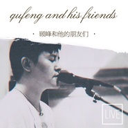

顾峰和他的朋友们巡演live顾峰和他的朋友们
============================

|  |  |
| :--: | :-- |
| [ 顾峰和他的朋友们巡演live顾峰和他的朋友们](https://emumo.xiami.com/album/2105350387) | **艺人**: [顾峰](../index.md) **语种**: 国语 **唱片公司**:  **发行时间**: 2019年10月18日 **专辑类别**: 现场专辑 **专辑风格**: 摇滚 Rock & Roll **播放数**: 614 **收藏数**: 1 **评论数**: 4  |

## 简介

《重生》是顾峰出道十年来的第7张个人大碟。2008年，出道十年的顾峰历时近一年，回归音乐本心，携手英国制作团队共同锻造自己的音乐重生之路。2019年，顾峰携乐队踏上音乐《重生》之旅。  
之于熟悉顾峰或是完全不认识他的听众而言，作为出道十年的第七张专辑——《重生》都足以令人感到新鲜，这更是顾峰在音乐上的一次“重声”。  
  
如果你从没听过顾峰，刚好用这一张《重生》当做“新生”来认识这位出道了十年的音乐人，你也许会发现，出道十年，时光没有给顾峰带来油滑，从《重生》中能听出顾峰在音乐上依然自我的铮铮硬骨，也听得出他在创作及后制时所表达出与时俱进的音乐审美。  
  
《重来》是顾峰《重生》中的主打单曲。在很重的英式摇滚节拍中，充满了勇往直前的冲劲，歌词“这条路走出去了之后就再也回不来”点题了这次顾峰在音乐上“置之死地而后生”的决心，“没有人敢说重来”的描述，恰是顾峰与过往告别，迎接音乐新生的对比口吻；歌曲中加入了电子合成器的节拍，令顾峰的音乐姿态比以往显得年轻化了不少，更时髦也更轻盈。  
  
《带我飞吧》依然把电气化的编曲贯穿其中，垫衬在清亮的吉他和Bass之中，飞翔的辽阔感显得愈发显著，如歌词“你像一束阳光 / 将我重新激活”一句，歌曲也带着明快的音乐色彩，足以激活新听众群体对顾峰音乐的清新认知。  
  
《荒》则在呐喊中唱出了很多音乐人当下的困惑。  
  
  
从流行转型电子摇滚，对于顾峰而言，这是回归。  
顾峰表示：“ 出道10年，我有很长一段时间来都是在走出去，而《重生》这张专辑则是走回来。 新的这张唱片有个关键的时间点。这个阶段我失去了很多过去十几年来努力累积的一些东西，但是这些失去并不令我惋惜。值得庆幸的是对我来说最看重、最有价值的意义是因为这个失去，我懂得怎么去懂得解放，不再有那么多的顾虑和束缚，可以很纯粹的去做这件事。这个变故让我失去了很多很可贵的东西，但是也让把本来就应该抛弃掉的包袱和束缚都丢掉了。 这张专辑里的创作与我出道之前做乐队的时期有很多共通的地方。这也是我说的十年之前我在往外走。在经历了人生变故后，才发现你还是需要走回内心，才会找到继续下去的能量，才会继续往下走。因为那是一种很纯粹的像信仰一样的热情让你去做这件事，而不是别人告诉你、灌输你，为了什么样的利益要去做事。在这张专辑里创作是真正的想去表达的东西。这张专辑写的是“我”。以前的专辑主要是表达别人的情感、感受，这张专辑是纯粹意义的顾峰。“  
  
顾峰这一次巡演唱了什么？  
此次顾峰和他的朋友们巡演顾峰采用全新的音乐编排形式，演绎自己的音乐作品，这次也特意加入了顾峰的成名作品《犯错》、《别再说》、《青春之城》等耳熟能详的歌曲  
。  
如果你从没听过顾峰，那么这次顾峰也许会打开你的耳朵，让你感受不一样的音乐故事。  
顾峰自述：  
做这次巡演是想把《重生》这张专辑，这一张回归创作初心的作品让更多的听众能够听到、去到现场，特别是一些原来对我没有认识的一些听众，通过现场音乐去跟他们去建立连接。  
其实在这十年来我之前也创作了很多的作品，但实际上，这这张专辑的创作是真正的回归到我进入到这个行业之前那个阶段的那种创作状态的——就是很自由、自我吧。然后对一些表达的东西，用一种真诚的方式与大家沟通。这是跟原来的作品有很大的反差。我希望能够通过巡演，这样一种认为非常有诚意的一种形式去把自己的音乐重新展现出来，去跟听众去产生互动。  
  
从票房角度来说，我其实非常担心票房，也做好了可能要赔钱的准备。毕竟这么多年以来，我过去所走的演出市场跟现在要走的市场来说是完全不一样的。对于这个巡演的这个市场，我就是一张白纸、新人。我觉得诚意非常重要，就是不管我们后面是挣了还是赔了，我们依然要让所有来到现场的人能够感受得到我们音乐的诚意。  
  
十年，我觉得对于每一个人来说都是一个重要的节点。我反思从入行开始，写的作品因为跟当时所处的环境和工作团队的有关求，很多时候要适应一些要求，更偏向于市场化，更偏向于怎么能够赶紧变成钱这件事。确实，当时的我是带有一定的投机心理吧，去做的创作严格来说其实并不是很真诚，当然也尝到一些甜头。到了十年的这么一个节点上的时候，我也在反思，我自己当初在没有真正进入这个行业之前（我十五岁就开始写歌），那时候我写歌就是在记录我真实的想法，就像写日记，我想了什么，我就去表述什么。但在这十年当中，慢慢的，被磨去了这种感受了，更多是为了去迎合。现在，我希望自己能够把自己找回来吧。就是已经走的够远了，我是不是还能再像当初那样去写歌？去记录自己的生活？从专辑《重生》这张专辑的制作下来看的话，我觉得非常庆幸的一点，就是我依然还能找回自己这一点。我觉得对我个人来说，商业化是可贵的一件事情，但是我更希望能够把这样一份对自己的真诚能够坚守下去。  
  
这次巡演的乐队里的鼓手何岩是在圈内是挺有影响力的、非常优秀的鼓手。他有跟过很多大牌的演出经验，舞台张力是非常强。我们这一次的巡演其实也是何岩一直跟我做这样的沟通和鼓励。这次在何言的这个建议下，我们才决定了。决定去好好弄一下，准备去一场一场的做，去跟现场的听众交流。所以这次巡演的成型也得感谢何岩。贝斯手东波是一个年轻一点的贝斯手，我觉得他的展现还是非常值得信任的。吉他手肖朋则是跟随了我多年的小兄弟，也是坚持了很多年的一个非常优秀的一个音乐人。肖朋也参与过我原来的很多的歌曲制作。我自己则担任乐队的键盘和节奏吉他。把一帮志同道合的人整合到一起来玩乐队，我觉得首先这件事情就足以让人很兴奋。  
  
这次的巡演曲目主要以专辑《重生》为主。同时我们也放进了《犯错》这样的作品。我们给它做了一个乐队化的编排。这次巡演中的作品我觉得代表了我在几个不同时期的创作状态。我觉得心里比较有底的一点的是，就是这些年沉淀了很多的作品，包括现在依然也在有新的作品，在创作制作当中，我也希望如果我们这个巡演能够很良性的延续下去的话，能够不断的补充进这些新的内容，然后就回到了开始说的就是为什么要走这个巡演。我希望我的新的这些创作能够去培养一些新的这个听众，即便一场只有一个听众听进了这个，知道说：“啊，原来顾峰他喜欢的是这样的音乐，而且他们把这种音乐做的很好！”那我就非常满足，这就是我们要去坚持做这件的初衷。 

## 曲目

## 评论

|  |  |  |
| :-- | :-- | :-- |
|  [虾米用户](https://emumo.xiami.com/u/260167529) 爱音乐的疯子 2019-10-19 15:57 赞(0) 踩(0) | 
很不错 从曾经的网络歌手变身民谣摇滚歌手 这样的人还有庞龙 这个才是你们真正应该做的
 |
| ⇒ |  [虾米用户](https://emumo.xiami.com/u/38621746) 写写歌，唱唱曲 2019-10-20 19:42 赞(0) 踩(0) | 
人总是得进步，对不对？
 |
| ⇒ |  [虾米用户](https://emumo.xiami.com/u/260167529) 爱音乐的疯子 2019-10-21 17:03 赞(0) 踩(0) | 
<q><b>顾峰说：</b></q>
 |
| ⇒ |  [虾米用户](https://emumo.xiami.com/u/36490074) 追求经典 2019-12-14 21:24 赞(0) 踩(0) | 
<q><b>顾峰说：</b></q>
 |
