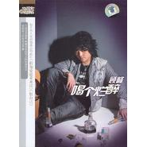

喝个烂醉
============================

|  |  |
| :--: | :-- |
| [ 喝个烂醉](https://emumo.xiami.com/album/32917) | **艺人**: [顾峰](../index.md) **语种**: 国语 **唱片公司**: 顾峰 **发行时间**: 2007年08月15日 **专辑类别**: 录音室专辑 **专辑风格**: 民谣流行 Folk Pop **播放数**: 43290 **收藏数**: 12 **评论数**: 1  |

## 简介

　　顾峰《喝个烂醉》！  
  
9首受伤情歌呐喊出受伤男人的坚强宣言，男人感情疗伤完全手册·  
  
感情受伤请不要《喝个烂醉》！  
  
倾情推荐：假如爱能重来过·恨自己

## 曲目

## 评论

|  |  |  |
| :-- | :-- | :-- |
|  [虾米用户](https://emumo.xiami.com/u/35330507)  2014-08-13 07:26 赞(0) 踩(0) | 
这张的确是个不错的专辑
 |
