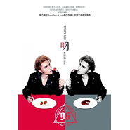

明
============================

|  |  |
| :--: | :-- |
| [ 明](https://emumo.xiami.com/album/205494470) | **艺人**: [山野 (李昊瀚)](../index.md) **语种**: 国语 **唱片公司**: 博轩音乐 **发行时间**: 2014年09月09日 **专辑类别**: 录音室专辑 **专辑风格**: 国语流行 Mandarin Pop **播放数**: 187684 **收藏数**: 52 **评论数**: 20  |

## 简介

「双面」人生  
  
安静&amp;激情  
情歌&amp;摇滚  
山野&amp;李昊瀚  
感受黑白共存，正邪对撞  
双面音乐态度，疯魔后成活  
  
《明》  「诠释」  
疯狂的冷静，平淡的激情  
音乐不能「只手遮天」  
国内首张Dubstep  &amp;pop曲风专辑  
打破千篇一律  
释放暴走个性与情绪温情  
李昊瀚（山野），开启2014「双面」音乐人生！  
  
山野，  
他的情歌没有浮躁的攀比和奢华的叠加  
他更爱细微末节处凸显「真挚的细腻」  
他在专辑中保留自己的“阳光”并不容易  
谁知道谁心里偏爱「新旧交替」  
他「创作也演绎」  
真假唱腔转换更像摘花插瓶，动听、纤柔、完美转身……  
他的情歌有着抚慰心灵的「魔力」  
他的创作无一不「竭尽全力」  
他是「中国好声音」李昊瀚，也是从前唱情歌的「山野」！  
他的情歌没变，只是你如果能听见  
是否还能听得出他就是山野！  
因为「惊喜」就是这样扑面而来！  
  
李昊瀚  
共生在黑暗与阳光里，像一只点燃激情的火把    
蠢蠢欲动的灵魂就要榨干皮囊的精华  
挣脱 改变 不畏惧一切   
不羁 反叛  挣脱只手遮天  
  
李昊瀚双面音乐大碟  
最潮流的曲风，最新鲜的格调，第一次引领用Dubstep撑起的自由跳动的音乐「支架」  
随心所欲搭建「虐心」桥段  
音乐是没有规矩的正方体也没有压力  
双面专辑黑白分「日月」  
双面格调只在这里  
矛盾又和谐的双面「Vampire」  
你更爱他哪一面？

## 曲目

## 评论

|  |  |  |  |
| :-- | :-- | :-- | :-- |
|  [虾米用户](https://emumo.xiami.com/u/48648775) 我还没想好要写什么... 2016-12-31 13:30 赞(0) 踩(0) | 
为什么不把《朋友圈》放进来？就因为不是自己写的？
 |
|  [虾米用户](https://emumo.xiami.com/u/44975174)  2014-12-17 10:41 赞(0) 踩(0) | 
好听，不错，鼓掌
 |
|  [虾米用户](https://emumo.xiami.com/u/44975174)  2014-12-17 10:41 赞(0) 踩(0) | 
山哥，新专辑巴适得板哟
 |
|  [虾米用户](https://emumo.xiami.com/u/9797929)  2014-09-24 21:44 赞(0) 踩(0) | 
借给他一个明天
 |
|  [虾米用户](https://emumo.xiami.com/u/9797929)  2014-09-24 21:43 赞(0) 踩(0) | 
总的来说还是有几首让人满意的歌
 |
|  [虾米用户](https://emumo.xiami.com/u/18650160) 暂无签名~ 2014-09-17 23:53 赞(0) 踩(0) | 
跟以前造型變得不一樣。不過歌曲更成熟了
 |
|  [虾米用户](https://emumo.xiami.com/u/8244559)  2014-09-16 09:28 赞(0) 踩(0) | 
******
 |
|  [虾米用户](https://emumo.xiami.com/u/454506) 我还没想好要写什么... 2014-09-15 12:26 赞(0) 踩(0) | 
哇，剛好前幾天才第一次聽他的歌，一個人的北京，現在就出專輯啦？nice move. 打鐵趁熱(*ﾟ▽ﾟ)ﾉ
 |
| ⇒ |  [虾米用户](https://emumo.xiami.com/u/6630660) 猜赢涂口红… 2014-09-15 21:01 赞(0) 踩(0) | 
……那个是曹轩宾
 |
| ⇒ |  [虾米用户](https://emumo.xiami.com/u/454506) 我还没想好要写什么... 2014-09-16 04:45 赞(0) 踩(0) | 
<q><b>哈哈哈哈哈哈哈哈哈哈哈皮说：</b></q>
 |
|  [虾米用户](https://emumo.xiami.com/u/16674914) 爱音乐爱生活 2014-09-13 22:13 赞(0) 踩(0) | 
注定红不了
 |
|  [虾米用户](https://emumo.xiami.com/u/369150) ♥︎stay hunge... 2014-09-12 10:35 赞(0) 踩(0) | 
封面受不了
 |
|  [虾米用户](https://emumo.xiami.com/u/39388125)  2014-07-26 20:52 赞(0) 踩(0) | 
音乐较山野以前的作品更成熟了，作品更丰富
 |
|  [虾米用户](https://emumo.xiami.com/u/13073595)  2014-07-26 18:17 赞(0) 踩(0) | 
ok
 |
|  [虾米用户](https://emumo.xiami.com/u/2043411)  2014-07-18 08:51 赞(3) 踩(0) | 
和纪敏佳一起团购的吧
 |
| ⇒ |  [虾米用户](https://emumo.xiami.com/u/3913390)  2014-07-25 16:30 赞(0) 踩(0) | 
哈哈哈
 |
| ⇒ |  [虾米用户](https://emumo.xiami.com/u/2332621) SELF. 2014-09-12 11:26 赞(0) 踩(0) | 
哈哈哈
 |
|  [虾米用户](https://emumo.xiami.com/u/2332621) SELF. 2014-07-17 09:10 赞(0) 踩(0) | 
整了？！
 |
|  [虾米用户](https://emumo.xiami.com/u/1221979)  2014-07-16 16:59 赞(0) 踩(0) | 
啥玩意…
 |
|  [虾米用户](https://emumo.xiami.com/u/5086082) 表裡如2 2014-07-16 16:24 赞(0) 踩(0) | 
怎么又变了样子
 |
