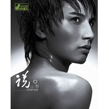

说。
============================

|  |  |
| :--: | :-- |
| [ 说。](https://emumo.xiami.com/album/311606) | **艺人**: [山野 (李昊瀚)](../index.md) **语种**: 国语 **唱片公司**: EQ唱片 **发行时间**: 2008年10月10日 **专辑类别**: 录音室专辑 **专辑风格**:  **播放数**: 848946 **收藏数**: 46 **评论数**: 7  |

## 简介

山野—— 
 

2006年，深情演绎柏拉图式的康定情歌 
 

2007年，来势汹汹地用爱从四面八方攻击你   
2008年全新登场，山野给你最不一样的声音   
  
不再要满山遍野的激情，完全释放最真实的态度 
 

用语言回归音符，纯粹的音乐感动人心 
 

山野《说。》   
  
追逐音乐，从无到有，从一夜成名，到专辑发不了，无尽地等待。他曾经狂野不羁，不可一世。也曾经温柔似水，肆意玩弄音符。一路走来，如今的山野经历沉淀，放下所有的光环，把音乐回归到最本质的聆听述说。这一切都源自“野菜”和周围朋友的鼓励和热情，在最需要认同的时候给了山野最实际的支持。   
  
不论是从音乐还是到他的内心，呈现出来的山野，更加富有质感，愈发趋于成熟。 
 

 感谢所有对待山野如同对待自己一般的人们，正因为你们的不离不弃，才能促生山野的这张专辑…… 
 
  

没有华丽的衣着蔽体，所有人都可以一眼看到的真实 
 
  

新专辑封面是山野自己的企划，他要求说“以前无论是在音乐本身还是外部包装上，自己都太注重细节。例如鼓怎么敲好听，和弦怎么编写，服装如何才能最帅。这一次要忽略任何外在的东西。我只要我自己，最真实的自己。” 
 

而最后定下来的封面正如同山野的想法一样，没有任何服装和发型的修饰，让所有人能够一眼看到的真实。   
  
没有过多的文字解释，只有纯粹的音乐感动人心 
 
  

在这张专辑中收录了一半以上山野自己创作的作品。每一首歌都是山野近一年来的心情记录。你可以看到一个由男孩蜕变为男人的山野，是如何用歌声讲述自己的喜怒哀乐，点点滴滴。整张专辑，以情为根本基调，涵盖亲情、友情、爱情。每一首歌都扣人心弦，抓住如今众口难调、挑剔的听觉细胞。把过多文字语言的修饰删除，留下最纯粹的音乐走进你我心底。   
  
一个足以征服一切、穿透所有聆听者感官细胞的声音——山野。   
  
首波主打《分开不一定分手》 
 

著名音乐人秦天继《该死的温柔》及《外滩十八号》后，为山野量身定做“第三部曲” 
 

分开不一定分手： 
 

这句看上去让人有些许费解的话，却表达了一个成熟男人对待爱情的全部成全。山野褪去火热的外壳，用更温柔、更包容的心讲述每一个人心底对感情最真实的迷惘与坚持。歌中小段的女生独唱，同样的歌词，唱出了不同的情绪，两个人的浅吟低唱，却又有相互倾诉之感，不论你是男生、女生，全部一网打尽！   
  
《全国各地》 
 

山野独立创作，用心感受真实的普通人山野，在全国各地等着你。   
  
《你去了哪里》 
 

献给已故兄弟，无尽的伤感与呐喊。男人之间最难得的情意铺天盖地展现。间奏更有山野亲自上阵，用吉他模彷兄弟弹贝斯。不可不听！   
  
《我们住过那条街》 
 

山野的第一首jazz的歌曲，音乐风格的一次突破。 
 

城市男女间最普遍的感情旋律，没有大起大落的飚高音，没有华丽的歌词。只剩下无可救药的浪漫。

## 曲目

## 评论

|  |  |  |
| :-- | :-- | :-- |
|  [虾米用户](https://emumo.xiami.com/u/435011721)  2020-04-10 09:32 赞(0) 踩(0) | 
这首歌是他最喜欢的 志文  祝你幸福快乐
 |
|  [虾米用户](https://emumo.xiami.com/u/9797929)  2014-06-13 17:22 赞(0) 踩(0) | 
这张专辑是山野最好的了
 |
|  [虾米用户](https://emumo.xiami.com/u/4097946)  2012-12-29 01:50 赞(0) 踩(0) | 
中国好声音
 |
|  [虾米用户](https://emumo.xiami.com/u/3698952)  2011-11-06 19:47 赞(0) 踩(0) | 
全国各地
 |
|  [虾米用户](https://emumo.xiami.com/u/4506157)  2011-06-30 15:12 赞(0) 踩(0) | 
那些年里，以为自己看见了的，爱情的模样。
 |
|  [虾米用户](https://emumo.xiami.com/u/4308320)  2011-06-18 14:09 赞(0) 踩(0) | 
好听
 |
|  [虾米用户](https://emumo.xiami.com/u/3526145)  2011-05-15 22:41 赞(0) 踩(0) | 
Savage Garden
 |
