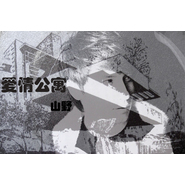

山野 (李昊瀚)
============================

|  |  |
| :--: | :-- |
| [ 山野 (李昊瀚)](https://i.xiami.com/shanye) | **播放数**: 7140392 **粉丝数**: 6339 **评论数**: 96 **地区**: China 中国大陆 **风格**: 国语流行 Mandarin Pop  |

## 档案

姓名:李山山 
艺名:山野 
生日:12月8日 
出生地:重庆 
民族:汉 
血型:O 
籍贯:重庆市 
身高:178cm 
星座:射手座 
兴趣爱好:音乐 
性格特征:执著 
艺术特长:音乐创作、演唱、形象设计、主持 
最大的愿望:开个唱 
座右铭:成功需要走上机会的平台，接受努力的考验！ 
最失望的事:没有买到喜欢的衣服 
最不明白的事情:恋爱 
最头疼的事情:衣服太好看不知道选哪一件 
最得意的事情:得到大家的掌声 
最喜欢听到的话:你的音乐真的很好听 
将来希望从事的行业:开服装公司 
对自己帮助最大的人:妈妈 
最爱唱的歌曲:《冬天的圣诞节》

## 专辑

| 名称 | 语种 | 唱片公司 | 发行时间 | 专辑类别 | 专辑风格 |
| :--: | :-- | :-- | :-- | :-- | :-- |
| [ 我只是假装](./albums/5021900177.md) | 国语 | 看见文娱 | 2020年11月12日 | EP, 单曲 | 国语流行 Mandarin Pop |
| [ 心里那个他](./albums/5021543647.md) | 国语 | 看见文娱 | 2020年09月26日 | EP, 单曲 | 国语流行 Mandarin Pop |
| [ 如果爱能早些说出来2019](./albums/2104968852.md) | 国语 | 鼎跃科技 | 2019年07月03日 | EP, 单曲 |  |
| [ 陌生人你好](./albums/2104369836.md) | 国语 | 晓友名气 | 2018年12月13日 | EP, 单曲 | 国语流行 Mandarin Pop |
| [ 幺妹儿](./albums/2104158540.md) | 国语 | 晓友名气 | 2018年10月31日 | EP, 单曲 | 国语流行 Mandarin Pop |
| [ 一个人的北京](./albums/2104099128.md) | 国语 | 看见文娱 | 2018年10月15日 | EP, 单曲 | 国语流行 Mandarin Pop |
| [ 新中国](./albums/2104057583.md) | 国语 | 晓友名气 | 2018年09月26日 | EP, 单曲 | 国语流行 Mandarin Pop |
| [ 小卖店](./albums/2104035654.md) | 国语 | 晓友名气 | 2018年09月14日 | EP, 单曲 |  |
| [ 再也见不到](./albums/2103773344.md) | 国语 | YuGe音乐 | 2018年06月29日 | EP, 单曲 |  |
| [ 贼拉拉的爱你](./albums/2102760292.md) | 国语 | 北京YuGe音乐 | 2017年06月06日 | EP, 单曲 |  |
| [ 一定赶来](./albums/2102674046.md) | 国语 | 北京YuGe音乐 | 2016年12月30日 | EP, 单曲 |  |
| [ 荒度余生](./albums/2102657107.md) | 国语 | 北京YuGe音乐 | 2016年11月28日 | EP, 单曲 |  |
| [ 男人花](./albums/2100364525.md) | 国语 | 中沃娱乐 | 2016年07月08日 | EP, 单曲 |  |
| [ 明](./albums/205494470.md) | 国语 | 博轩音乐 | 2014年09月09日 | 录音室专辑 | 国语流行 Mandarin Pop |
| [ 朋友圈](./albums/802303777.md) | 国语 | 中沃艺星 | 2014年06月06日 | EP, 单曲 |  |
| [ 相信爱情](./albums/1092275728.md) | 国语 | 中沃艺星 | 2014年02月13日 | EP, 单曲 | 国语流行 Mandarin Pop |
| [ 如果没有你](./albums/1783808785.md) | 国语 | 中沃艺星 | 2013年11月05日 | 录音室专辑 |  |
| [ 欲望降临之前](./albums/576219.md) | 国语 | 烽云传媒 | 2013年01月30日 | EP, 单曲 |  |
| [ 为你唱首歌](./albums/539665.md) | 国语 | 银基一帮行 | 2012年08月31日 | EP, 单曲 |  |
| [ 爱情公寓](./albums/538442.md) | 国语 | 银基一帮行 | 2012年08月28日 | EP, 单曲 |  |
| [ 一个人的北京](./albums/531145.md) | 国语 | 中沃娱乐 | 2012年07月23日 | EP, 单曲 |  |
| [ 戒烟](./albums/516996.md) | 国语 | EQ唱片 | 2012年05月31日 | EP, 单曲 |  |
| [ 换种方式生活](./albums/510681.md) | 国语 | 银基一帮行 | 2012年04月28日 | EP, 单曲 |  |
| [ 请多爱我一些](./albums/503464.md) | 国语 | 银基一帮行 | 2012年03月29日 | EP, 单曲 |  |
| [ 需要你爱我](./albums/503329.md) | 国语 | 中沃艺星 | 2012年03月27日 | EP, 单曲 |  |
| [ 情人节快不快乐](./albums/493554.md) | 国语 | 银基一帮行 | 2012年02月14日 | EP, 单曲 |  |
| [ 年三十的电话](./albums/488315.md) | 国语 | 银基一帮行 | 2012年01月10日 | EP, 单曲 |  |
| [ 从相爱到分开](./albums/484474.md) | 国语 | 银基一帮行 | 2011年12月29日 | 录音室专辑 |  |
| [ 重新去爱](./albums/418167.md) | 国语 | EQ唱片 | 2010年12月28日 | EP, 单曲 |  |
| [ FM33.EQ](./albums/383458.md) | 国语 | EQ唱片 | 2010年06月01日 | 录音室专辑 |  |
| [ 说。](./albums/311606.md) | 国语 | EQ唱片 | 2008年10月10日 | 录音室专辑 |  |
| [ 拜托小姐](./albums/2105007504.md) | 国语 | 龙乐世纪 | 2008年01月01日 | EP, 单曲 |  |
| [ 山山来驰](./albums/32918.md) | 国语 | EQ唱片 | 2007年08月15日 | 录音室专辑 |  |
| [ 柏拉图的康定情歌](./albums/334884.md) | 国语 | 响沙唱片 | 2005年04月12日 | 录音室专辑 |  |

## 评论

|  |  |  |  |
| :-- | :-- | :-- | :-- |
|  [虾米用户](https://emumo.xiami.com/u/227634292) 我还没想好要写什么... 2020-08-31 18:24 赞(1) 踩(0) | 
评论里的人身攻击够可以的哦 真的low
 |
|  [虾米用户](https://emumo.xiami.com/u/310943931) 我还没想好要写什么... 2020-07-22 22:31 赞(0) 踩(0) | 
我都忘了这首歌！无意之中听到，就抓紧来搜索听一下
 |
|  [虾米用户](https://emumo.xiami.com/u/1582817) 若收藏精选集已删除，请用... 2019-11-05 16:42 赞(1) 踩(0) | 
农村老坦儿唱的歌儿真奇葩土
 |
|  [虾米用户](https://emumo.xiami.com/u/38829235) 我还没想好要写什么... 2019-08-26 11:49 赞(1) 踩(0) | 
加油呀
 |
|  [虾米用户](https://emumo.xiami.com/u/412992223) 每天成长一点点 2019-07-31 15:00 赞(1) 踩(0) | 
山野加油！
 |
| ⇒ |  [虾米用户](https://emumo.xiami.com/u/258257310)  2019-08-05 10:53 赞(0) 踩(0) | 
你真的是林更新的老婆吗
 |
| ⇒ |  [虾米用户](https://emumo.xiami.com/u/412992223) 每天成长一点点 2019-08-06 15:50 赞(0) 踩(0) | 
<q><b>四夕sama说：</b></q>
 |
| ⇒ |  [虾米用户](https://emumo.xiami.com/u/327886422)  2019-08-12 13:38 赞(0) 踩(0) | 
<q><b>林更新的独宠老婆说：</b></q>
 |
|  [虾米用户](https://emumo.xiami.com/u/193235171) 饭能养身  歌能养心 2019-07-22 23:22 赞(1) 踩(0) | 
男人心声
 |
|  [虾米用户](https://emumo.xiami.com/u/358104299) 悲观的唯心存在现实解构虚... 2019-05-09 10:06 赞(2) 踩(0) | 
11044
 |
|  [虾米用户](https://emumo.xiami.com/u/404311562)  2018-11-24 20:13 赞(3) 踩(0) | 
好好听
 |
|  [虾米用户](https://emumo.xiami.com/u/298393294)  2018-11-04 09:06 赞(1) 踩(0) | 
封面好帅。。
 |
|  [虾米用户](https://emumo.xiami.com/u/51620546)  2018-10-19 18:49 赞(2) 踩(0) | 
很喜欢你的歌。
 |
|  [虾米用户](https://emumo.xiami.com/u/84788854) Honey Funny ... 2018-09-06 01:48 赞(1) 踩(0) | 
加油
 |
|  [虾米用户](https://emumo.xiami.com/u/304313367) 时光念旧，岁月安好. 2018-07-07 19:02 赞(1) 踩(0) | 
回忆录
 |
|  [虾米用户](https://emumo.xiami.com/u/346370430) 義 2018-06-02 09:14 赞(1) 踩(0) | 
好好听
 |
|  [虾米用户](https://emumo.xiami.com/u/88236404) QQ：262764834... 2018-04-21 21:10 赞(3) 踩(0) | 
封面你好帅啊。 邪魅邪魅&amp;hellip;
 |
|  [虾米用户](https://emumo.xiami.com/u/275392026) 。 2018-03-31 16:43 赞(3) 踩(0) | 
很喜欢你的歌
 |
|  [虾米用户](https://emumo.xiami.com/u/321955856) 清华 2018-03-18 22:12 赞(1) 踩(0) | 
分开也不一定分手
 |
|  [虾米用户](https://emumo.xiami.com/u/323759108) 勿要等到失去方知拥有的美... 2018-02-21 06:08 赞(1) 踩(0) | 
新的一年里，祝福你心想事成!期待你有更好的好音乐!期待你的好声音!      
 |
|  [虾米用户](https://emumo.xiami.com/u/329018010) 可你不在 2018-01-28 22:19 赞(2) 踩(0) | 
你的音乐真好听
 |
|  [虾米用户](https://emumo.xiami.com/u/328537239)  2017-10-17 08:46 赞(3) 踩(0) | 
山野的部分歌怎么听不见了呢
 |
|  [虾米用户](https://emumo.xiami.com/u/256730081)  2017-10-10 20:22 赞(3) 踩(0) | 
喜欢他的声音
 |
|  [虾米用户](https://emumo.xiami.com/u/265550947)  2017-08-14 13:47 赞(3) 踩(0) | 
声音真的太完美了
 |
|  [虾米用户](https://emumo.xiami.com/u/305730973)  2017-07-30 17:33 赞(1) 踩(0) | 
（ ) 
 |
|  [虾米用户](https://emumo.xiami.com/u/309828115)   2017-07-27 14:26 赞(2) 踩(0) | 
好听
 |
|  [虾米用户](https://emumo.xiami.com/u/231791786)  2017-07-01 19:02 赞(2) 踩(0) | 
莫名的感动
 |
|  [虾米用户](https://emumo.xiami.com/u/259184288)  2017-05-01 13:54 赞(1) 踩(0) | 
早期唱R&amp;amp;amp;B风格的歌还真不错
 |
|  [虾米用户](https://emumo.xiami.com/u/288191023)  2017-04-12 18:20 赞(1) 踩(0) | 
6666
 |
|  [虾米用户](https://emumo.xiami.com/u/260167529) 爱音乐的疯子 2017-01-20 18:35 赞(3) 踩(0) | 
创作歌手 各种风格都有 不错
 |
|  [虾米用户](https://emumo.xiami.com/u/187812048) 爱一件事就疯狂爱～ 2016-11-30 13:46 赞(2) 踩(0) | 
四年前两年前几个月前几天前，今天，看着别人留下的痕迹，这么久了啊，并不知道，我们还能爱多久。不过会尽力久一点……
 |
|  [虾米用户](https://emumo.xiami.com/u/237554370)  2016-11-01 23:18 赞(2) 踩(0) | 
想起那些年爱过的人，满满的伤感
 |
|  [虾米用户](https://emumo.xiami.com/u/237554370)  2016-11-01 23:17 赞(1) 踩(0) | 
一直都很喜欢
 |
|  [虾米用户](https://emumo.xiami.com/u/238514183)  2016-10-20 17:27 赞(1) 踩(0) | 
不在？怎么？
 |
|  [虾米用户](https://emumo.xiami.com/u/8424657) 海岸线 2016-07-21 21:51 赞(1) 踩(0) | 

 |
|  [虾米用户](https://emumo.xiami.com/u/122762654) 一花一世界，一叶子菩提 2016-04-26 20:01 赞(1) 踩(0) | 
挚爱歌手
 |
|  [虾米用户](https://emumo.xiami.com/u/74941186)  2016-01-28 23:55 赞(1) 踩(0) | 
下架了都
 |
|  [虾米用户](https://emumo.xiami.com/u/93777562)  2015-12-23 01:45 赞(1) 踩(0) | 
很久没有听你的歌曲了，你也没有更新新歌曲
 |
|  [虾米用户](https://emumo.xiami.com/u/4758578) 当我沉默，音乐说话。 2015-12-22 20:07 赞(1) 踩(0) | 
如果爱能早些说出来，总是不经意哼出来，唱出了我的心情，和外国妞的爱情
 |
|  [虾米用户](https://emumo.xiami.com/u/454506) 我还没想好要写什么... 2015-10-31 14:38 赞(0) 踩(0) | 
完美的聲音
 |
|  [虾米用户](https://emumo.xiami.com/u/6188935) 惊鸿一现瞥红颜 烙印心间... 2015-09-04 07:46 赞(1) 踩(0) | 
回忆起那些年受过的伤呐！光阴如梭。   
 |
|  [虾米用户](https://emumo.xiami.com/u/43766757)  2015-04-02 22:39 赞(1) 踩(0) | 
一直喜欢你的歌   期待你出新歌
 |
|  [虾米用户](https://emumo.xiami.com/u/42827576)  2014-10-21 11:01 赞(3) 踩(0) | 
从初中时代听到现在的（我们的无奈）依然好听。
 |
|  [虾米用户](https://emumo.xiami.com/u/23406921) 你不是我，怎知我的苦亦乐 2014-10-16 23:45 赞(3) 踩(0) | 
记得第一听的是 如果爱能早些说出来，分开也不一定分手，我们的无奈，本来，等。。。我就喜欢上，新出的 明明，也很好听。不过不知道为什么真正知道他的人却不多，喜欢独特的声音，起码能感动我。仅此而已！
 |
|  [虾米用户](https://emumo.xiami.com/u/27219171)  2014-10-14 22:57 赞(29) 踩(0) | 
不得不说05年的专辑都比现在乐坛很多歌好。
 |
|  [虾米用户](https://emumo.xiami.com/u/860474)   2014-09-15 20:01 赞(37) 踩(0) | 
长相和歌曲风格注定一辈子城乡结合部偶像命
 |
|  [虾米用户](https://emumo.xiami.com/u/3722016) 暂无签名~ 2014-08-10 13:59 赞(2) 踩(0) | 
土鳖
 |
|  [虾米用户](https://emumo.xiami.com/u/5905347)  2014-07-17 22:07 赞(1) 踩(0) | 
一直很喜欢~
 |
|  [虾米用户](https://emumo.xiami.com/u/31691393)  2014-01-15 19:46 赞(1) 踩(0) | 
喜欢他的歌
 |
|  [虾米用户](https://emumo.xiami.com/u/30442011)  2014-01-15 12:53 赞(0) 踩(0) | 
路过大街小巷
 |
|  [虾米用户](https://emumo.xiami.com/u/1215838)  2013-12-08 17:25 赞(0) 踩(0) | 
生日快乐。
 |
|  [虾米用户](https://emumo.xiami.com/u/9045218)  2013-12-08 06:20 赞(0) 踩(0) | 
生日快樂~~
 |
|  [虾米用户](https://emumo.xiami.com/u/6377726) 低头思故乡…… 2013-11-15 17:50 赞(0) 踩(0) | 
这声音插电插得有点多哦……
 |
|  [虾米用户](https://emumo.xiami.com/u/11737392) 音乐是一种生活方式 2013-10-26 18:23 赞(1) 踩(0) | 
某些歌词看名字就俗得不行。。。不过我最喜欢如果爱能早些说出来
 |
|  [虾米用户](https://emumo.xiami.com/u/22903149)  2013-09-24 20:41 赞(2) 踩(0) | 
当初参加地方的好声音音乐比赛，就是唱了山野的怎么忍心放开手，进了决赛。。。。
 |
|  [虾米用户](https://emumo.xiami.com/u/17360384)  2013-09-04 21:58 赞(0) 踩(0) | 
刷脸啊 伤不起啊
 |
|  [虾米用户](https://emumo.xiami.com/u/19082471)  2013-08-12 10:20 赞(1) 踩(0) | 
好听
 |
|  [虾米用户](https://emumo.xiami.com/u/19082471)  2013-08-12 10:20 赞(1) 踩(0) | 
好听
 |
|  [虾米用户](https://emumo.xiami.com/u/6960083) 他扒拉我... 2013-06-04 17:09 赞(1) 踩(0) | 
你丫又去参加中国梦之声了！！
 |
|  [虾米用户](https://emumo.xiami.com/u/7597026)  2012-11-20 13:49 赞(0) 踩(0) | 
******
 |
|  [虾米用户](https://emumo.xiami.com/u/11291726)  2012-10-31 22:40 赞(0) 踩(0) | 
看了小夫妻時代，好多好聽的歌阿~~~
 |
|  [虾米用户](https://emumo.xiami.com/u/2864734)  2012-10-12 10:47 赞(0) 踩(0) | 
山野我来了
 |
|  [虾米用户](https://emumo.xiami.com/u/1498153)  2012-09-02 10:43 赞(0) 踩(0) | 
某个暑假听了一暑假山野的歌
 |
|  [虾米用户](https://emumo.xiami.com/u/2220502) so far so go... 2012-08-31 00:03 赞(0) 踩(0) | 
。。。他竟然已经是这么成熟的一个歌手了ORZ
 |
|  [虾米用户](https://emumo.xiami.com/u/1188608)  2012-08-25 21:51 赞(0) 踩(0) | 
为什么要去参加“好声音”！？想不通~~~~~~~~
 |
|  [虾米用户](https://emumo.xiami.com/u/10299234)  2012-08-20 22:34 赞(0) 踩(0) | 
,只为寻找一个音符,一段美妙的旋律.
 |
|  [虾米用户](https://emumo.xiami.com/u/9397573)  2012-06-26 19:46 赞(0) 踩(0) | 
最好D情伤歌
 |
|  [虾米用户](https://emumo.xiami.com/u/3910416)  2012-06-10 13:36 赞(1) 踩(0) | 
声音磁性 带点大山的味道
 |
|  [虾米用户](https://emumo.xiami.com/u/9258765)  2012-05-23 15:10 赞(0) 踩(0) | 
就是这个音乐
 |
|  [虾米用户](https://emumo.xiami.com/u/9242430)  2012-05-22 10:53 赞(0) 踩(0) | 
是我喜欢的旋律
 |
|  [虾米用户](https://emumo.xiami.com/u/374450) GAME MAKER！！ 2012-05-22 09:51 赞(0) 踩(0) | 
分开不一定分手
 |
|  [虾米用户](https://emumo.xiami.com/u/9201676)  2012-05-17 15:41 赞(0) 踩(0) | 
好听
 |
|  [虾米用户](https://emumo.xiami.com/u/427965)  2012-05-12 22:28 赞(0) 踩(0) | 
节奏真的很耐听的，
 |
|  [虾米用户](https://emumo.xiami.com/u/9027040)  2012-04-29 17:04 赞(0) 踩(0) | 
还行
 |
|  [虾米用户](https://emumo.xiami.com/u/7289257)  2011-12-29 04:23 赞(0) 踩(0) | 
有点特别的嗓音 迷人
 |
|  [虾米用户](https://emumo.xiami.com/u/6057663) 。。。 2011-12-02 17:51 赞(0) 踩(0) | 
声音打动人心诶。。。
 |
|  [虾米用户](https://emumo.xiami.com/u/5935246)  2011-10-03 05:00 赞(0) 踩(0) | 
阳光的,好听,安静,山野
 |
|  [虾米用户](https://emumo.xiami.com/u/3423948)  2011-09-05 11:42 赞(0) 踩(0) | 
喜欢
 |
|  [虾米用户](https://emumo.xiami.com/u/5103827)  2011-08-10 17:57 赞(0) 踩(0) | 
我们的无奈
 |
|  [虾米用户](https://emumo.xiami.com/u/4145757)  2011-06-22 17:05 赞(0) 踩(0) | 
酷毙了~~
 |
|  [虾米用户](https://emumo.xiami.com/u/4207623)  2011-06-08 10:32 赞(0) 踩(0) | 
很特别。
 |
|  [虾米用户](https://emumo.xiami.com/u/4194151) 试试新功能，哈哈~ 2011-06-06 17:33 赞(0) 踩(0) | 
声音很有特点，很好听。从梦想中国时就开始喜欢听他唱的歌~（某几首歌，自己的声音可以和他的声音很像很合）
 |
|  [虾米用户](https://emumo.xiami.com/u/1493753)  2011-05-02 18:51 赞(0) 踩(0) | 
歌很好聽！！很有感覺。。。琅琅上口，很容易記憶！！都很讚啦！！
 |
|  [虾米用户](https://emumo.xiami.com/u/3683002)  2011-04-26 21:25 赞(0) 踩(0) | 
喜欢他的声音！没有别的理由！
 |
|  [虾米用户](https://emumo.xiami.com/u/3683002)  2011-04-26 21:25 赞(0) 踩(0) | 
从他被选拔 一直都爱他的歌曲 很好听 很舒服……
 |
|  [虾米用户](https://emumo.xiami.com/u/1493753)  2011-04-22 14:21 赞(0) 踩(0) | 
歌曲超好聽的!!!!讚!!
 |
|  [虾米用户](https://emumo.xiami.com/u/800805)  2011-03-28 13:52 赞(0) 踩(0) | 
声音不错  支持
 |
|  [虾米用户](https://emumo.xiami.com/u/442491) 情到深处-自然痛 2011-03-15 10:25 赞(0) 踩(0) | 
山炮。。。。。。。
 |
|  [虾米用户](https://emumo.xiami.com/u/104229)  2011-03-14 12:35 赞(0) 踩(0) | 
歌曲很自然
 |
|  [虾米用户](https://emumo.xiami.com/u/812280)  2011-01-27 19:09 赞(0) 踩(0) | 
还不错啊 原来是重庆的
 |
|  [虾米用户](https://emumo.xiami.com/u/781749)  2010-12-17 09:16 赞(0) 踩(0) | 
很好听喔，粉丝也太少了
 |
|  [虾米用户](https://emumo.xiami.com/u/1633935) I‘m here 2010-11-01 17:32 赞(0) 踩(0) | 
原来你是重庆人。
 |
|  [虾米用户](https://emumo.xiami.com/u/1083253)   2010-10-24 11:28 赞(0) 踩(0) | 
很不错的声音~！！！！！
 |
|  [虾米用户](https://emumo.xiami.com/u/1223782)  2010-09-17 21:08 赞(0) 踩(0) | 
......whs,怎么转来转去还是来听你喜欢的歌。没救了，没救了。
 |
|  [虾米用户](https://emumo.xiami.com/u/1211952)  2010-07-28 17:37 赞(0) 踩(0) | 
他的歌不错呀，音质不错
 |
|  [虾米用户](https://emumo.xiami.com/u/1174841)  2010-07-16 21:34 赞(0) 踩(0) | 
是金子总会发光的！！山野加油哦！
 |
