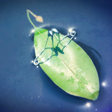
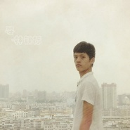
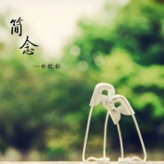

林键标
============================

|  |  |
| :--: | :-- |
| [ 林键标](https://i.xiami.com/linjianbiao) | **地区**: China 中国大陆 **风格**: 轻音乐 Easy Listening **播放数**: 1076189 **粉丝数**: 222 **评论数**: 19  |

## 档案

## 专辑

| 名称 | 语种 | 唱片公司 | 发行时间 | 专辑类别 | 专辑风格 |
| :--: | :-- | :-- | :-- | :-- | :-- |
| [ 没有回响](./albums/2103722604.md) | 纯音乐 | 独立发行 | 2018年05月29日 | EP, 单曲 | 器乐独奏 Solo Instrumental |
| [ Pursuit of Peace](./albums/2103644266.md) | 纯音乐 | 独立发行 | 2018年01月26日 | EP, 单曲 | 轻音乐流行 Light Pop |
| [ 一叶子](./albums/2102710969.md) | 纯音乐 | 独立发行 | 2017年03月10日 | EP, 单曲 | 轻音乐 Easy Listening |
| [ 寻](./albums/2102406275.md) | 国语 |  | 2016年10月13日 | EP, 单曲 |  |
| [ 想你](./albums/2100321114.md) | 国语 | 独立发行 | 2016年04月24日 | EP, 单曲 | 国语流行 Mandarin Pop |
| [ 嫦娥](./albums/2100293866.md) | 其他 | 独立发行 | 2016年03月16日 | EP, 单曲 | 民族融合新世纪 Ethnic Fusion New Age, 轻音乐 Easy Listening |
| [ 简念](./albums/2100202708.md) | 英语 | 独立发行 | 2015年09月18日 | EP, 单曲 | 轻音乐 Easy Listening |
| [ 迷理标](./albums/1027793071.md) | 其他 | 独立发行 | 2015年03月19日 | EP, 单曲 | 轻音乐 Easy Listening |

## 评论

|  |  |  |
| :-- | :-- | :-- |
|  [虾米用户](https://emumo.xiami.com/u/23927813) 音乐就是生命里一朵花 2020-11-26 10:46 赞(1) 踩(0) | 
音乐非常不错
 |
|  [虾米用户](https://emumo.xiami.com/u/374807946) 缘来缘去缘入水。 2019-12-01 20:47 赞(0) 踩(0) | 
喜欢听《暖雨》《一叶子》。希望能带来更多好音乐。
 |
|  [虾米用户](https://emumo.xiami.com/u/426773902) 公平、正直、诚信、友善、... 2019-07-27 22:53 赞(0) 踩(0) | 
祝福每一位在音乐的道路上努力奋斗的人！加油！
 |
|  [虾米用户](https://emumo.xiami.com/u/69712128) 世非济济，谦谦君子 2018-10-31 00:48 赞(1) 踩(0) | 
赞！
 |
|  [虾米用户](https://emumo.xiami.com/u/250667095) 总是因为不舍，时常让自己... 2018-09-11 10:17 赞(3) 踩(0) | 
我不知道已经走到了哪里，但我却记得我一直再走，一直再走&amp;hellip;&amp;hellip;&amp;hellip; 孤独，悲伤，总是环绕着我，像另一个我一样如影随形的，每当我听到这的时候，我总感觉她就在我旁边一样，可是，曲会终，人有散，所以她不能像曲子那般可以重新再来&amp;hellip;&amp;hellip; 给我内心深处的那份孤独一点希冀&amp;mdash;&amp;mdash;暖雨。。。。
 |
| ⇒ |  [虾米用户](https://emumo.xiami.com/u/250667095) 总是因为不舍，时常让自己... 2019-01-05 21:40 赞(0) 踩(0) | 
即便，没有春天的风，没有夏天的雨，没有秋天的霞，也没有冬天的雪，可是，总会有那么一首低沉音乐会让你感受到，人间的四月天，感受到人与人之间的忽远忽近，感受到世事的变化无常 。
 |
|  [虾米用户](https://emumo.xiami.com/u/3454306)  2018-08-13 11:53 赞(0) 踩(0) | 
写的很好啊！ 加油啊，哥们！
 |
|  [虾米用户](https://emumo.xiami.com/u/72497474) 我喜欢古风歌曲哦⊙ω⊙！... 2018-07-14 16:33 赞(1) 踩(0) | 
太好听了
 |
|  [虾米用户](https://emumo.xiami.com/u/254673688) 我还没想好要写什么... 2018-03-30 07:55 赞(1) 踩(0) | 
很好听，继续关注
 |
|  [虾米用户](https://emumo.xiami.com/u/6610459)  2017-12-20 14:43 赞(1) 踩(0) | 
期待更多好作品，加油！
 |
|  [虾米用户](https://emumo.xiami.com/u/128199548) Sweet Pain 2017-11-02 12:44 赞(0) 踩(0) | 
这位同学哪位？？
 |
|  [虾米用户](https://emumo.xiami.com/u/12106289) 所有的情感宣泄与珍藏都在... 2016-03-16 00:27 赞(1) 踩(0) | 
加油，期待更多作品。
 |
|  [虾米用户](https://emumo.xiami.com/u/46996024)   2015-12-12 17:47 赞(3) 踩(0) | 
很好听，怎么没有多一点介绍呢，让我们认识一下啊
 |
| ⇒ |  [虾米用户](https://emumo.xiami.com/u/48453603)  2015-12-18 20:54 赞(0) 踩(0) | 
谢谢你的支持，作品还太少，我会努力丰富自己的
 |
|  [虾米用户](https://emumo.xiami.com/u/48998248)   2015-11-15 21:26 赞(2) 踩(0) | 
曲子很恬淡加油             (ง •̀_•́)ง期待更多好作品！ 
 |
| ⇒ |  [虾米用户](https://emumo.xiami.com/u/48453603)  2015-11-24 23:57 赞(0) 踩(0) | 
谢谢你的支持，我会继续努力的 
 |
|  [虾米用户](https://emumo.xiami.com/u/48453603)  2015-03-30 19:00 赞(13) 踩(0) | 
我刚入驻了虾米音乐人，欢迎大家来我的个人主页，收听我的最新音乐
 |
| ⇒ |  [虾米用户](https://emumo.xiami.com/u/138273984) （ˉ﹃ˉ）陌雪 2016-04-30 20:26 赞(0) 踩(0) | 
哇
 |
| ⇒ |  [虾米用户](https://emumo.xiami.com/u/419070449) 写什么呢，一切都在音乐里 2020-12-22 11:21 赞(0) 踩(0) | 
虾米要没了
 |
