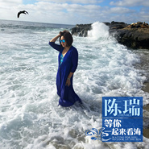

等你一起来看海
============================

|  |  |
| :--: | :-- |
| [ 等你一起来看海](https://emumo.xiami.com/album/2100368759) | **艺人**: [陈瑞](../index.md) **语种**: 国语 **唱片公司**: 光耀五州 **发行时间**: 2016年07月18日 **专辑类别**: EP, 单曲 **专辑风格**:  **播放数**: 238423 **收藏数**: 104 **评论数**: 2  |

## 简介

《等你一起来看海》是著名歌手陈瑞2016年全新演唱的一首略含伤感、以海叙情的歌曲；歌曲由知名作词人清瑢作词，知名音乐人刘亦敏作曲。“天空蓝蓝花儿摇摆，我衣裙为你飘起来，等你一起来看海，追着海风浪花踩，海鸥飞飞云朵雪白，许愿石许下一辈子相爱。”歌词里不难看出新歌充满了浪漫的画意，然而整首歌曲确是一首略含伤感的情歌，述说了对恋人爱的思念，思念是一种幸福的忧伤，是一种甜蜜的惆怅，更是一种温馨的痛苦，思念是对昨日悠长的沉湎和对美好未来的向往。歌曲曲风在极具伤感的基础上添加了更加动人的情感色彩，歌词更是可圈可点以海述情，希望恋人能够一起浪漫的在一起看海，充满了极大的情感魅力，后期制作方面此首歌曲还是邀请了法国金牌混音大师沙瓦-舍甫琴科（Vyacheslav Shevchenko）亲自担纲，这是继《你能为我唱一首歌吗》之后与Vyacheslav Shevchenko第二次的深度合作，如此高规格的制作团队、如此高的制作水平，使得这首歌成为她全新的经典。在陈瑞饱含深情的嗓音、精湛的唱功演绎下，将这首歌曲温馨的痛苦诠释的淋漓尽致，让整首歌呈现出了一种别样的音乐魅力。

## 曲目

## 评论

|  |  |  |  |
| :-- | :-- | :-- | :-- |
|  [虾米用户](https://emumo.xiami.com/u/342118566)  2019-02-03 17:17 赞(0) 踩(0) | 
天籁之声！極好听！❤❤❤❤❤
 |
|  [虾米用户](https://emumo.xiami.com/u/29537993) 高山流水 2016-07-19 09:16 赞(0) 踩(0) | 
好听
 |
