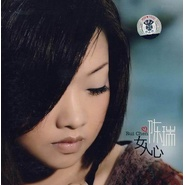

女人心
============================

|  |  |
| :--: | :-- |
| [ 女人心](https://emumo.xiami.com/album/316536) | **艺人**: [陈瑞](../index.md) **语种**: 国语 **唱片公司**: 鸟人唱片 **发行时间**: 2009年01月20日 **专辑类别**: 录音室专辑 **专辑风格**:  **播放数**: 7290598 **收藏数**: 969 **评论数**: 59  |

## 简介

正值2009年始，陈瑞的第二张专辑《女人心》正式出炉，这张专辑由鸟人艺术花费一年时间精心打造，以期给予歌迷更多的感动。时隔一年，在这个初春，陈瑞从心开始，带来温暖。   
  
陈瑞用她那略微沙哑，沧桑中带着淡淡的伤感，富有磁性的嗓音在歌坛上确立了自己独特的音乐风格。在陈瑞推出首张EP之时，《白狐》已经红遍大江南北。随处都可以听到陈瑞的声音。随即，在2007年陈瑞的第一张个人同名专辑发行。蝴蝶效应，“瑞”不可挡。   
  
在夜阑人静时听心灵演绎《女人心》，在《秋天的玫瑰》后体味爱情……   
  
《女人心》这张专辑是陈瑞回归女人本真，坚持情感音乐的又一力作。陈瑞用心演绎自己，演绎音乐，用心回报自己的歌迷。   
  
特别推荐   
《秋天的玫瑰》《曾经是我最爱的人》《幸福女人》   
看不透的红尘伤感 唱不尽的无限相思   
 

## 曲目

## 评论

|  |  |  |  |
| :-- | :-- | :-- | :-- |
|  [虾米用户](https://emumo.xiami.com/u/428330584)  2019-08-23 10:49 赞(0) 踩(0) | 
好喜欢
 |
|  [虾米用户](https://emumo.xiami.com/u/329919206)  2018-04-28 09:10 赞(0) 踩(0) | 
大家好 ，你们有谁知道这首歌的电视剧叫什么名字吗、知道的说一下谢谢、
 |
|  [虾米用户](https://emumo.xiami.com/u/228981514)  2018-02-26 11:19 赞(1) 踩(0) | 
陈瑞，一个来自湖北宜昌的女歌手，一直同来自湖北的朋友有来往，陈瑞的歌代表了湖北人的细腻感情！
 |
|  [虾米用户](https://emumo.xiami.com/u/57823230) 音乐创造梦想和激情 2017-09-23 16:31 赞(0) 踩(0) | 
女人心最好听，其他的也不错，鱼水情歌又是一首比较好的情歌对唱类型的！
 |
|  [虾米用户](https://emumo.xiami.com/u/275918612)  2017-02-25 06:40 赞(0) 踩(0) | 
一直喜欢
 |
|  [虾米用户](https://emumo.xiami.com/u/154258232)  2016-04-28 12:09 赞(0) 踩(0) | 
下载不了
 |
|  [虾米用户](https://emumo.xiami.com/u/90392560)  2016-01-08 22:00 赞(0) 踩(0) | 
甜美歌曲我最喜欢而且爱唱
 |
|  [虾米用户](https://emumo.xiami.com/u/90392560)  2016-01-08 21:58 赞(0) 踩(0) | 
甜美歌曲我喜欢，而且爱唱 \
 |
|  [虾米用户](https://emumo.xiami.com/u/36124036) 小雨，我心飞扬 2015-12-09 16:36 赞(1) 踩(0) | 
一直是你的粉丝，最近看你的影像，吓了一跳，腿像象腿，太胖了，不过，这好像和唱歌没有多大关系。
 |
|  [虾米用户](https://emumo.xiami.com/u/33250449)  2015-07-10 13:07 赞(0) 踩(0) | 
干嘛不发布呢
 |
|  [虾米用户](https://emumo.xiami.com/u/33250449)  2015-07-10 13:07 赞(1) 踩(0) | 
陈瑞我对你无语了……
 |
|  [虾米用户](https://emumo.xiami.com/u/23507670) 快乐跑者 2015-02-28 21:18 赞(0) 踩(0) | 
赞赞赞一个
 |
|  [虾米用户](https://emumo.xiami.com/u/47341603)  2015-02-23 06:30 赞(0) 踩(0) | 
不错！但她的歌好像都比较伤感类的吧！但这些后面肯定一些感动人心的故事吧！
 |
|  [虾米用户](https://emumo.xiami.com/u/47267012)  2015-02-13 23:02 赞(0) 踩(0) | 
喜欢她带一点伤感的歌。
 |
|  [虾米用户](https://emumo.xiami.com/u/35342960)  2014-04-15 09:18 赞(0) 踩(0) | 
喜欢她的歌。。。。。
 |
|  [虾米用户](https://emumo.xiami.com/u/7111249)  2013-07-11 11:58 赞(0) 踩(0) | 
喜欢
 |
|  [虾米用户](https://emumo.xiami.com/u/11102339)  2013-04-10 14:24 赞(0) 踩(0) | 
《鱼水情歌》最好听
 |
|  [虾米用户](https://emumo.xiami.com/u/13711563)  2013-03-31 11:22 赞(0) 踩(0) | 
情
 |
|  [虾米用户](https://emumo.xiami.com/u/12235111)  2013-01-03 09:17 赞(0) 踩(0) | 
就是喜欢
 |
|  [虾米用户](https://emumo.xiami.com/u/4455845)  2012-12-23 01:07 赞(0) 踩(0) | 
甜美的声音好似天籁之音
 |
|  [虾米用户](https://emumo.xiami.com/u/539223)  2012-11-23 22:12 赞(0) 踩(0) | 
這種音色我喜歡。
 |
|  [虾米用户](https://emumo.xiami.com/u/539223)  2012-11-23 22:11 赞(0) 踩(0) | 
沙啞的音色帶著淡淡的憂傷，我喜歡這種感覺。
 |
|  [虾米用户](https://emumo.xiami.com/u/6819624)  2012-11-06 06:48 赞(0) 踩(0) | 
音质不太好
 |
|  [虾米用户](https://emumo.xiami.com/u/6819624)  2012-11-06 06:48 赞(0) 踩(0) | 
音质不太好
 |
|  [虾米用户](https://emumo.xiami.com/u/1848672)  2012-10-07 09:43 赞(0) 踩(0) | 
声音很好听！
 |
|  [虾米用户](https://emumo.xiami.com/u/10645913) 无憾解得情词恁动人 2012-09-17 09:57 赞(0) 踩(0) | 
切合
 |
|  [虾米用户](https://emumo.xiami.com/u/9618828) jz 2012-07-01 14:21 赞(0) 踩(0) | 
静夜清泉的韵味，高雅脱俗的女人。
 |
|  [虾米用户](https://emumo.xiami.com/u/9367717)  2012-06-26 09:47 赞(0) 踩(0) | 
喜欢
 |
|  [虾米用户](https://emumo.xiami.com/u/9099536)  2012-05-06 22:55 赞(1) 踩(0) | 
唱出了女人的心声
 |
|  [虾米用户](https://emumo.xiami.com/u/8908211)  2012-04-18 18:54 赞(0) 踩(0) | 
陈瑞的歌我都喜欢
 |
|  [虾米用户](https://emumo.xiami.com/u/6084990)  2012-02-04 20:36 赞(0) 踩(0) | 
特有女人味……
 |
|  [虾米用户](https://emumo.xiami.com/u/7646855)  2012-01-15 08:19 赞(0) 踩(0) | 
无理由
 |
|  [虾米用户](https://emumo.xiami.com/u/7062411)  2011-12-30 14:21 赞(0) 踩(0) | 
喜欢陈瑞娓娓道来的女人故事
 |
|  [虾米用户](https://emumo.xiami.com/u/7347386)  2011-12-21 20:46 赞(0) 踩(0) | 
很有磁性的女声
 |
|  [虾米用户](https://emumo.xiami.com/u/5139116)  2011-11-08 21:20 赞(0) 踩(0) | 
美聲
 |
|  [虾米用户](https://emumo.xiami.com/u/6423795)  2011-11-03 12:38 赞(0) 踩(0) | 
傷感、動聽
 |
|  [虾米用户](https://emumo.xiami.com/u/6388654)  2011-10-23 09:15 赞(0) 踩(0) | 
喜欢陈瑞的深沉和大气，给人一种久远的回味悠长的感觉！
 |
|  [虾米用户](https://emumo.xiami.com/u/5596572) 无损依就 2011-10-13 01:02 赞(0) 踩(0) | 
不错哈收集到了
 |
|  [虾米用户](https://emumo.xiami.com/u/3541513)  2011-10-05 13:31 赞(0) 踩(0) | 
每首歌都很用心在诠释，感动的声音，感动的歌曲。
 |
|  [虾米用户](https://emumo.xiami.com/u/6063448)  2011-10-02 08:56 赞(0) 踩(0) | 
声音非常有磁性
 |
|  [虾米用户](https://emumo.xiami.com/u/4960476)  2011-08-15 16:08 赞(0) 踩(0) | 
好听！！！
 |
|  [虾米用户](https://emumo.xiami.com/u/383548)  2011-08-14 10:33 赞(0) 踩(0) | 
声音
 |
|  [虾米用户](https://emumo.xiami.com/u/5407358)  2011-08-13 16:11 赞(0) 踩(0) | 
磁性，伤感，
 |
|  [虾米用户](https://emumo.xiami.com/u/4090021)  2011-08-10 18:01 赞(0) 踩(0) | 
声音不错
 |
|  [虾米用户](https://emumo.xiami.com/u/3774903)  2011-07-25 18:33 赞(0) 踩(0) | 
a
 |
|  [虾米用户](https://emumo.xiami.com/u/4401954)  2011-06-24 15:22 赞(0) 踩(0) | 
动听
 |
|  [虾米用户](https://emumo.xiami.com/u/4339632)  2011-06-21 16:15 赞(0) 踩(0) | 
听  听  听
 |
|  [虾米用户](https://emumo.xiami.com/u/4162033)  2011-06-03 20:46 赞(0) 踩(0) | 
聆听来自心灵的感动
 |
|  [虾米用户](https://emumo.xiami.com/u/3904740)  2011-06-02 11:31 赞(0) 踩(0) | 
喜欢
 |
|  [虾米用户](https://emumo.xiami.com/u/3927883)  2011-05-15 20:44 赞(0) 踩(0) | 
喜欢陈瑞，她的婉转，细腻，沧桑
 |
|  [虾米用户](https://emumo.xiami.com/u/3911967)  2011-05-12 00:22 赞(0) 踩(0) | 
我选择我喜欢
 |
|  [虾米用户](https://emumo.xiami.com/u/3713579)  2011-04-25 21:39 赞(0) 踩(0) | 
喜欢她磁性的声音。
 |
|  [虾米用户](https://emumo.xiami.com/u/3470168)  2011-04-03 23:44 赞(0) 踩(0) | 
有哀伤、有感悟、有感动！
 |
|  [虾米用户](https://emumo.xiami.com/u/3470168)  2011-04-03 23:42 赞(0) 踩(0) | 
有哀伤、有感悟
 |
|  [虾米用户](https://emumo.xiami.com/u/1068982)  2011-03-02 17:35 赞(0) 踩(0) | 
陈瑞
 |
|  [虾米用户](https://emumo.xiami.com/u/2392254)  2011-02-18 12:54 赞(0) 踩(0) | 
好听
 |
|  [虾米用户](https://emumo.xiami.com/u/2630446)  2011-01-26 19:38 赞(0) 踩(0) | 
嗓音极有特色，略微沙哑，沧桑中带着淡淡的伤感，而又有磁性。听她的歌，如同在寒夜里看见烟火，让人回味的不是绽放时的华丽和绚烂。更多的是幻灭后的寂静和落寞。恰如她的声音，低回婉转，哀愁如雨丝分飞，悲凉并不凄凉，从容更叫人动容。一路上的坎坎坷坷，悲欢离合都化成一首首经典的情歌
 |
|  [虾米用户](https://emumo.xiami.com/u/1034779)  2010-06-17 15:28 赞(0) 踩(0) | 
好听
 |
|  [虾米用户](https://emumo.xiami.com/u/70645) 心平气和，体验生活；感悟... 2010-04-12 22:12 赞(0) 踩(0) | 
富有磁性，柔美真情，深度演绎缱绻女儿心。
 |
