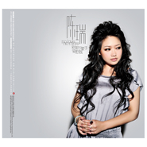

别用下辈子安慰我
============================

|  |  |
| :--: | :-- |
| [ 别用下辈子安慰我](https://emumo.xiami.com/album/429588) | **艺人**: [陈瑞](../index.md) **语种**: 国语 **唱片公司**: 鸟人唱片 **发行时间**: 2011年03月07日 **专辑类别**: 录音室专辑 **专辑风格**:  **播放数**: 262701 **收藏数**: 356 **评论数**: 20  |

## 简介

陈瑞，一个用那略微沙哑、磁性、伤感的歌喉吟唱感情的低调的歌者，在今天浮躁的内地歌坛，陈瑞显得那么孤傲，寂寞。她的歌声像寒风里的梅花，冷艳美丽、历久弥香。 

在夜阑人静时倾听陈瑞用心灵演绎《别用下辈子安慰我》的人生悲歌，在《不要对爱说抱歉》后体味爱情的悲欢离合,会让每一个人心里充满了感动。
 

  
陈瑞温暖的歌声，从这个寒冷的初春开始…
 

如果说蔡琴的声音可以跨越年龄的限制，历久弥新。而陈瑞的声音却可以让流逝的时间追溯到任何起点。陈瑞附有磁性的声音。就像一壶上等的龙井，越品就越浑厚，味道就越浓郁。她的声音成熟、温暖，一种女人内心深处对爱的理解和感受。陈瑞的声音是怀旧的，是孤独的，是留声机后真实的放怀，没有一丝掩饰。陈瑞的声音并不撕心裂肺，但丝豪不掩饰内心的伤痛。一切似在听一个女子在悠悠讲述遥远的感情，讲述让人触恸的心事。
 

一种旋律，一支歌，一份歌词，只一经陈瑞的喉咙，仿佛立刻镀上一层淡淡的沧桑与伤感。像中提琴的一缕忧鸣，像钢琴的一份深厚。她的声带就像是一根绷在荏苒光阴上的弦，只一振动，每颗心都随之震颤，整个世间为之共鸣。共鸣中，足以搅起岁月的沉淀、锈蚀的心弦。紧闭的心扉也为之松动，使得心湖也泛起涟漪。
 
  

《别用下辈子安慰我》——专辑主打曲
 

陈瑞，就是这样一个为情而生的歌者。这个世上千百年的心事就是她的心事，千万人的爱恨就是她的爱恨。那些爱恨情缘总在不经意时从陈瑞的生命中流逸出来，留下深情的独白和对月起舞的身影。
 

她的歌唱与其说是对旋律的绝佳把握，不如说是真情经由旋律的直接呈现。所以她才在瞬间拥有了无数的歌迷，在瞬间变得炫烂夺目，炫烂得让人嫉妒。从《白狐》到《别用下辈子安慰我》，陈瑞的心充满了对世俗的感激，但在她的情感深处，一直是一个孤独的歌者。一个伤心的歌者，一个不谙世事的歌者。
 
  

 听陈瑞的歌，如同在寒夜里看见烟火，让人回味的不是绽放时的华丽和绚烂，更多的是幻灭后的寂静和落寞；听陈瑞的歌，如同在睡梦里遇见曾经的他，让人感慨的不是梦境中的欣喜和激动，更多的是梦去后的怀念和难过。
 

听陈瑞的歌，若是在夜里，她便是一盏床头灯，漫漫长夜里才倍感她的温暖；听陈瑞的歌，若是在午后，她便是一杯苦咖啡，走过坎坷后才懂得她的滋味；听陈瑞的歌，若是在傍晚，她便是一阵桂花香，几番爱恨后才领略她的销魂。
 

也许已经不是在听陈瑞的歌，而是翻看自己的情感日记。因为她的歌声已经和我们的某些故事、场景、心情深烙在一起，化作一支支书签，一些回忆的页码因她而历久弥新，一些生命的刻痕因她而格外清晰
 

陈瑞的音乐，值得你永久收藏…..

## 曲目

## 评论

|  |  |  |
| :-- | :-- | :-- |
|  [虾米用户](https://emumo.xiami.com/u/2669998) New Porsche ... 2013-12-25 07:33 赞(0) 踩(0) | 
陈瑞的专辑
 |
|  [虾米用户](https://emumo.xiami.com/u/9165527) ~就在今天听歌到天亮 2013-10-08 10:57 赞(0) 踩(0) | 
陈瑞
 |
|  [虾米用户](https://emumo.xiami.com/u/13758324)  2013-03-31 21:14 赞(0) 踩(0) | 
太喜歡
 |
|  [虾米用户](https://emumo.xiami.com/u/3389673) 音乐爱好的人 2013-01-28 13:50 赞(0) 踩(0) | 
ok
 |
|  [虾米用户](https://emumo.xiami.com/u/11228540) 幸福 2012-11-08 23:22 赞(1) 踩(0) | 
喜欢
 |
|  [虾米用户](https://emumo.xiami.com/u/6819624)  2012-11-06 07:14 赞(0) 踩(0) | 
音质不太好
 |
|  [虾米用户](https://emumo.xiami.com/u/6819624)  2012-11-06 07:13 赞(0) 踩(0) | 
音质不太好
 |
|  [虾米用户](https://emumo.xiami.com/u/6819624)  2012-11-06 07:13 赞(0) 踩(0) | 
音质不太好
 |
|  [虾米用户](https://emumo.xiami.com/u/6819624)  2012-11-06 07:13 赞(0) 踩(0) | 
音质不太好
 |
|  [虾米用户](https://emumo.xiami.com/u/6819624)  2012-11-06 07:13 赞(0) 踩(0) | 
音质不太好
 |
|  [虾米用户](https://emumo.xiami.com/u/6819624)  2012-11-06 07:13 赞(0) 踩(0) | 
音质不太好
 |
|  [虾米用户](https://emumo.xiami.com/u/6819624)  2012-11-06 06:49 赞(0) 踩(0) | 
音质不太好
 |
|  [虾米用户](https://emumo.xiami.com/u/1848672)  2012-10-07 09:46 赞(0) 踩(0) | 
收藏！
 |
|  [虾米用户](https://emumo.xiami.com/u/10075631)  2012-08-06 11:13 赞(0) 踩(0) | 
喜欢她的声音！
 |
|  [虾米用户](https://emumo.xiami.com/u/6345294)  2012-01-14 17:56 赞(0) 踩(0) | 
支持
 |
|  [虾米用户](https://emumo.xiami.com/u/6903625)  2011-12-07 21:41 赞(0) 踩(0) | 
ib\'
 |
|  [虾米用户](https://emumo.xiami.com/u/3927883)  2011-05-16 09:38 赞(1) 踩(0) | 
别用下辈子安慰我
 |
|  [虾米用户](https://emumo.xiami.com/u/27356)  2011-04-10 17:18 赞(0) 踩(0) | 
听歌越来越不连贯，希望改进
 |
|  [虾米用户](https://emumo.xiami.com/u/3507357)  2011-04-06 23:35 赞(0) 踩(0) | 
陈瑞的歌，无条件支持
 |
|  [虾米用户](https://emumo.xiami.com/u/2431990)  2011-03-31 22:14 赞(0) 踩(0) | 
成熟女人的声音
 |
