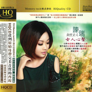

女人心声
============================

|  |  |
| :--: | :-- |
| [ 女人心声](https://emumo.xiami.com/album/437996) | **艺人**: [陈瑞](../index.md) **语种**: 国语 **唱片公司**: 东昇魔音 **发行时间**: 2011年04月08日 **专辑类别**: 录音室专辑 **专辑风格**:  **播放数**: 2343577 **收藏数**: 500 **评论数**: 65  |

## 简介

发烧音乐金牌制作人与各大发烧影音专业网站联合专业一致推荐  
抚平心灵创伤的音乐---史上最令人期待的治愈系女声  
心聆情感驿站 畅听女人心声  
看不透的红尘伤感 唱不尽的无限相思  
在夜间人静时听心灵演绎体味爱情……  
陈瑞语录：用心演绎音乐的一瞬 用音乐感悟心的永恒

## 曲目

## 评论

|  |  |  |  |
| :-- | :-- | :-- | :-- |
|  [虾米用户](https://emumo.xiami.com/u/3331060)  2017-10-28 00:16 赞(0) 踩(0) | 
她应该是最近最用心唱歌的一个歌手，每首都倾注了一个歌手应该有的感情与对歌曲的理解。。。。。。。。。她的每首歌曲都值得你去慢慢品！！！！赞
 |
|  [虾米用户](https://emumo.xiami.com/u/66408110)  2015-09-16 21:55 赞(0) 踩(0) | 
唱出了女人心声
 |
|  [虾米用户](https://emumo.xiami.com/u/50473815)  2015-06-03 22:17 赞(0) 踩(0) | 
还不错
 |
|  [虾米用户](https://emumo.xiami.com/u/11162396) 快乐生活，少不了音乐相伴 2015-02-10 00:01 赞(1) 踩(0) | 
看不透的红尘伤感 唱不尽的无限相思
 |
|  [虾米用户](https://emumo.xiami.com/u/37637794)  2014-06-16 11:03 赞(0) 踩(0) | 
很温柔听着舒服放松！
 |
|  [虾米用户](https://emumo.xiami.com/u/37637794)  2014-06-16 11:02 赞(0) 踩(0) | 
很温柔的好歌！听着很舒服放松
 |
|  [虾米用户](https://emumo.xiami.com/u/9268220) 暂无签名~ 2014-04-18 06:35 赞(0) 踩(0) | 
喜欢她的嗓音具有沧桑感.....
 |
|  [虾米用户](https://emumo.xiami.com/u/2669998) New Porsche ... 2013-12-25 07:33 赞(0) 踩(0) | 
陈瑞的专辑
 |
|  [虾米用户](https://emumo.xiami.com/u/15844665) 我还没想好要写什么... 2013-12-09 20:55 赞(0) 踩(0) | 
扣人心弦
 |
|  [虾米用户](https://emumo.xiami.com/u/13741755)  2013-11-07 17:50 赞(0) 踩(0) | 
好听喔
 |
|  [虾米用户](https://emumo.xiami.com/u/5782827)  2013-09-19 12:33 赞(0) 踩(0) | 
听来听去，似乎这张专辑是她出过的目前最好听的
 |
|  [虾米用户](https://emumo.xiami.com/u/20589829) 汪哥 2013-09-17 15:00 赞(0) 踩(0) | 
歌唱技巧一流,聲音非常有特色,及帶有磁性的音色,我個人非常喜歡
 |
|  [虾米用户](https://emumo.xiami.com/u/16830577)  2013-07-13 22:11 赞(0) 踩(0) | 
HAO
 |
|  [虾米用户](https://emumo.xiami.com/u/13622259)  2013-04-18 16:51 赞(0) 踩(0) | 
喝出了女人的心声
 |
|  [虾米用户](https://emumo.xiami.com/u/13325462)  2013-03-02 13:10 赞(0) 踩(0) | 
好听好听
 |
|  [虾米用户](https://emumo.xiami.com/u/3389673) 音乐爱好的人 2013-01-28 13:23 赞(0) 踩(0) | 
ok
 |
|  [虾米用户](https://emumo.xiami.com/u/12114427) 纯白色 2013-01-15 22:03 赞(0) 踩(0) | 
陪你一起老 相当耐听！
 |
|  [虾米用户](https://emumo.xiami.com/u/12339824)  2013-01-10 10:44 赞(0) 踩(0) | 
超级喜欢她的嗓音
 |
|  [虾米用户](https://emumo.xiami.com/u/11512607) 做梦 2012-12-11 21:09 赞(0) 踩(0) | 
发烧音
 |
|  [虾米用户](https://emumo.xiami.com/u/10760886) 好人好梦。。。 2012-11-25 21:41 赞(0) 踩(0) | 
好喜欢
 |
|  [虾米用户](https://emumo.xiami.com/u/11228540) 幸福 2012-11-08 23:22 赞(0) 踩(0) | 
喜欢
 |
|  [虾米用户](https://emumo.xiami.com/u/5904802)  2012-09-21 10:02 赞(0) 踩(0) | 
伤感的情歌，让人在歌声中感受那份伤感的情愫。
 |
|  [虾米用户](https://emumo.xiami.com/u/10285772) 丝不如竹，竹不如肉。 2012-09-17 19:24 赞(0) 踩(0) | 
先听听。
 |
|  [虾米用户](https://emumo.xiami.com/u/10442894) 我有我的滋味 2012-08-31 16:10 赞(0) 踩(0) | 
好听，好烧的声音，燃烧着....
 |
|  [虾米用户](https://emumo.xiami.com/u/9038867)  2012-08-15 02:54 赞(0) 踩(0) | 
好听
 |
|  [虾米用户](https://emumo.xiami.com/u/9307450) 并非视觉的享受 2012-05-29 09:15 赞(0) 踩(0) | 
特别的音给你特别的爱
 |
|  [虾米用户](https://emumo.xiami.com/u/8908211)  2012-04-18 18:57 赞(0) 踩(0) | 
喜欢
 |
|  [虾米用户](https://emumo.xiami.com/u/1705090)  2012-03-24 20:41 赞(0) 踩(0) | 
很好听的女中音
 |
|  [虾米用户](https://emumo.xiami.com/u/1705090)  2012-03-24 20:40 赞(0) 踩(0) | 
很好听的伤感女中音
 |
|  [虾米用户](https://emumo.xiami.com/u/7535194) 莲花芬芳 2012-03-20 21:41 赞(0) 踩(0) | 
太好听了
 |
|  [虾米用户](https://emumo.xiami.com/u/5825189)  2012-03-16 21:39 赞(1) 踩(0) | 
实力派、比那些XX.....强多了去了。。。。
 |
|  [虾米用户](https://emumo.xiami.com/u/8115021)  2012-02-20 21:30 赞(0) 踩(0) | 
女中音好听，销魂!喜欢喜欢……
 |
|  [虾米用户](https://emumo.xiami.com/u/7890253)  2012-02-19 21:18 赞(0) 踩(0) | 
喜欢
 |
|  [虾米用户](https://emumo.xiami.com/u/1886539)  2012-02-12 18:53 赞(0) 踩(0) | 
这张专辑值得收藏
 |
|  [虾米用户](https://emumo.xiami.com/u/8014914)  2012-02-12 15:35 赞(0) 踩(0) | 
就是好听
 |
|  [虾米用户](https://emumo.xiami.com/u/7485092)  2012-01-16 03:22 赞(0) 踩(0) | 
在新的一年里再次推荐歌手陈瑞录制的发烧的碟，希望各位朋友以及歌迷喜欢！
 |
|  [虾米用户](https://emumo.xiami.com/u/4390819) 我还没想好要写什么... 2011-12-24 20:50 赞(0) 踩(0) | 
声音很特别，让人非常喜欢的声音 ……
 |
|  [虾米用户](https://emumo.xiami.com/u/2438112)  2011-12-11 17:57 赞(0) 踩(0) | 
真的好听  很有感觉
 |
|  [虾米用户](https://emumo.xiami.com/u/5848482)  2011-12-09 10:47 赞(0) 踩(0) | 
好听
 |
|  [虾米用户](https://emumo.xiami.com/u/6901439)  2011-11-22 00:52 赞(0) 踩(0) | 
好听
 |
|  [虾米用户](https://emumo.xiami.com/u/6789370) 不忧昨日，不期明日 2011-11-15 14:21 赞(0) 踩(0) | 
让人上瘾的声音
 |
| ⇒ |  [虾米用户](https://emumo.xiami.com/u/6901439)  2011-11-22 00:52 赞(0) 踩(0) | 
对
 |
|  [虾米用户](https://emumo.xiami.com/u/6235597)  2011-10-13 17:05 赞(0) 踩(0) | 
忧伤，磁性
 |
|  [虾米用户](https://emumo.xiami.com/u/4960476)  2011-08-15 16:07 赞(0) 踩(0) | 
好听！！！
 |
|  [虾米用户](https://emumo.xiami.com/u/5418554)  2011-08-14 13:57 赞(0) 踩(0) | 
声音很特别
 |
|  [虾米用户](https://emumo.xiami.com/u/5127148)  2011-08-04 01:27 赞(0) 踩(0) | 
经典。。收了
 |
|  [虾米用户](https://emumo.xiami.com/u/5127148)  2011-08-04 01:13 赞(0) 踩(0) | 
非常非常好。。谢谢斑竹
 |
|  [虾米用户](https://emumo.xiami.com/u/4903862)  2011-07-25 05:23 赞(0) 踩(0) | 
收藏
 |
|  [虾米用户](https://emumo.xiami.com/u/1287989)  2011-07-17 16:32 赞(0) 踩(0) | 
陈瑞的歌。精品中精品
 |
|  [虾米用户](https://emumo.xiami.com/u/4459605)  2011-06-30 19:03 赞(0) 踩(0) | 
给老娘down的~
 |
|  [虾米用户](https://emumo.xiami.com/u/3999443)  2011-06-27 16:48 赞(0) 踩(0) | 
吻到心伤透
 |
|  [虾米用户](https://emumo.xiami.com/u/4351850)  2011-06-24 03:28 赞(0) 踩(0) | 
吻到心伤透 戴着耳机一直听着这音乐，不舍关电脑，寂静的夜里，反复的聆听着…辗转难以入睡。看不透的红尘伤感 、唱不尽的无限相思  ，被陈瑞演绎活了！到哪能下载到陈瑞唱的这歌的伴奏啊？？？急切求助!!!
 |
|  [虾米用户](https://emumo.xiami.com/u/4382126)  2011-06-22 22:02 赞(0) 踩(0) | 
没有为什么只是喜欢
 |
|  [虾米用户](https://emumo.xiami.com/u/2153088)  2011-06-19 22:42 赞(0) 踩(0) | 
陈瑞的歌声就是让人回味久久
 |
|  [虾米用户](https://emumo.xiami.com/u/4280368)  2011-06-16 17:09 赞(0) 踩(0) | 
声音独特
 |
|  [虾米用户](https://emumo.xiami.com/u/4203891)  2011-06-07 18:36 赞(0) 踩(0) | 
就是喜欢没有理由
 |
|  [虾米用户](https://emumo.xiami.com/u/4135755)  2011-05-31 22:56 赞(0) 踩(0) | 
动听就喜欢！
 |
|  [虾米用户](https://emumo.xiami.com/u/4030054) 虾米好吃还是虾仁好吃? 2011-05-26 16:17 赞(0) 踩(0) | 
滋润心灵
 |
|  [虾米用户](https://emumo.xiami.com/u/4030054) 虾米好吃还是虾仁好吃? 2011-05-26 16:16 赞(0) 踩(0) | 
干旱春天，潮湿心情。
 |
|  [虾米用户](https://emumo.xiami.com/u/3927883)  2011-05-15 20:48 赞(0) 踩(0) | 
女人心声
 |
|  [虾米用户](https://emumo.xiami.com/u/3904740)  2011-05-11 12:22 赞(0) 踩(0) | 
感觉很有味道
 |
|  [虾米用户](https://emumo.xiami.com/u/3311934) 简简单单故事不多的男人 2011-05-02 18:07 赞(0) 踩(0) | 
这个女人的歌怎么这么伤感
 |
|  [虾米用户](https://emumo.xiami.com/u/1697404)  2011-04-27 09:19 赞(0) 踩(0) | 
她的歌声真的百听不厌～
 |
|  [虾米用户](https://emumo.xiami.com/u/1068982)  2011-04-27 01:08 赞(0) 踩(0) | 
好听的声音
 |
|  [虾米用户](https://emumo.xiami.com/u/1342581)  2011-04-26 19:34 赞(0) 踩(0) | 
o^_^...亲爱的陈瑞!
 |
|  [虾米用户](https://emumo.xiami.com/u/405684) 生活中不能没有音乐！ 2011-04-26 17:35 赞(0) 踩(0) | 
抚平心灵创伤的音乐！
 |
