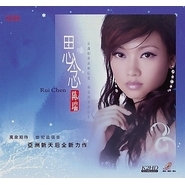

陈瑞
============================

|  |  |
| :--: | :-- |
| [ 陈瑞](https://i.xiami.com/chenrui) | **播放数**: 90358120 **粉丝数**: 25327 **评论数**: 713 **地区**: China 中国大陆 **风格**: 国语流行 Mandarin Pop  |

## 档案

小档案 
姓名：陈瑞 
性别：女 
籍贯：湖北省宜昌市 
血型：B 
星座：巨蟹座 
生日：6.25 
喜欢的颜色：蓝 紫 
工作感言：我的爱好就是我的方向 
唱歌心语：用心演绎音乐的一瞬，用音乐感悟心的永恒 
大事记 
曾是宜昌市城建幼儿园高级教师，湖北省省级骨干教师，曾获宜昌市幼儿教师全能比赛一等奖，湖北省幼儿教师教育知识电视大奖赛最佳选手。 
2003年10月“动感地带宜昌通俗歌王擂台赛”优胜奖。 
2003年12月“全国流行乐坛新人选拔赛湖北赛区”银奖。 
2004年04月首届“全国流行乐坛新人选拔赛”总决赛新人演唱奖。 
2005年08月宜昌市“金色池塘”演唱金奖。 
2005年10月首届全国网络音乐节演唱歌手银奖 原创第一 
2006年05月新浪我为歌狂比赛女声组第一名 
2006年11月录制EP《白狐》《梦醉西楼》《下辈子不做女人》 
2007年正式加盟鸟人艺术

## 专辑

| 名称 | 语种 | 唱片公司 | 发行时间 | 专辑类别 | 专辑风格 |
| :--: | :-- | :-- | :-- | :-- | :-- |
| [ 情深一寸 痛多一分](./albums/5021041941.md) | 国语 | 讯飞音乐 | 2020年06月07日 | EP, 单曲 |  |
| [ 多情莫笑我](./albums/5020662511.md) | 国语 | 通力唱片 | 2020年05月18日 | 录音室专辑 | 流行 Pop |
| [ 对方](./albums/5020665517.md) | 国语 | 讯飞音乐 | 2020年04月01日 | 录音室专辑 |  |
| [ 莞尔一笑](./albums/2106094598.md) | 国语 | 光耀五州 | 2020年02月21日 | EP, 单曲 |  |
| [ 遇到你在错误的时间](./albums/2108230368.md) | 国语 | 禾信科技 | 2019年11月01日 | EP, 单曲 | 国语流行 Mandarin Pop |
| [ 爱你到天荒地老](./albums/2103013849.md) | 国语 | 东升文化, Chemikal Underground | 2019年10月01日 | 录音室专辑 | 国语流行 Mandarin Pop |
| [ 谁说梅花没有泪](./albums/2104529150.md) | 国语 | 亦扬文化 | 2019年01月24日 | EP, 单曲 | 国语流行 Mandarin Pop |
| [ 那年的情书](./albums/569101.md) | 国语 | 乐升唱片 | 2019年01月01日 | 录音室专辑 | 国语流行 Mandarin Pop |
| [ 寂寞深宫](./albums/5021255901.md) | 国语 | 禾信科技 | 2018年11月10日 | EP, 单曲 | 国语流行 Mandarin Pop |
| [ 遇见爱情](./albums/2104065964.md) | 国语 | 东家文化 | 2018年09月30日 | EP, 单曲 |  |
| [ 杯中酒 情人旧](./albums/2103809645.md) | 国语 | 禾信科技 | 2018年07月01日 | EP, 单曲 |  |
| [ 遇见爱情](./albums/2103729468.md) | 国语 | 源丰泰坤 | 2018年06月05日 | EP, 单曲 | 国语流行 Mandarin Pop |
| [ 你是我永远的痛](./albums/5021435352.md) | 国语 | 禾信科技 | 2018年05月30日 | EP, 单曲 | 国语流行 Mandarin Pop |
| [ 其实女人的心最容易懂](./albums/2103660158.md) | 国语 | 光耀五州 | 2018年04月02日 | EP, 单曲 |  |
| [ 天上的星星是爱情的灯](./albums/2103555060.md) | 国语 | 冒派音乐 | 2018年02月14日 | EP, 单曲 |  |
| [ 为爱流泪的女人](./albums/2103510563.md) | 国语 | 禾信科技 | 2018年01月31日 | EP, 单曲 |  |
| [ 如梦初醒](./albums/2103467606.md) | 国语 | 禾信科技 | 2018年01月04日 | EP, 单曲 |  |
| [ 一程山盟一程海誓](./albums/2102976863.md) | 国语 | 禾信科技 | 2017年12月19日 | EP, 单曲 |  |
| [ 相爱未晚](./albums/2102974795.md) | 国语 | 禾信科技 | 2017年12月15日 | EP, 单曲 |  |
| [ 相恋不如失恋](./albums/2102974786.md) | 国语 | 禾信科技 | 2017年12月15日 | EP, 单曲 |  |
| [ 相思愁](./albums/2102970338.md) | 国语 | 禾信科技 | 2017年12月08日 | EP, 单曲 |  |
| [ 若你是他该有多好](./albums/2102964771.md) | 国语 | 禾信科技 | 2017年12月01日 | EP, 单曲 |  |
| [ 爱还有多久](./albums/2102957984.md) | 国语 | 禾信科技 | 2017年11月23日 | EP, 单曲 |  |
| [ 爱是你给的愁](./albums/2102929743.md) | 国语 | 禾信科技 | 2017年11月15日 | EP, 单曲 |  |
| [ 一山一水一首歌](./albums/2102914856.md) | 国语 | 禾信科技 | 2017年11月08日 | EP, 单曲 |  |
| [ 有多少爱可以辜负](./albums/2102873803.md) | 国语 | 禾信科技 | 2017年10月17日 | EP, 单曲 |  |
| [ 见字如面](./albums/2102871113.md) | 国语 | 冒派音乐 | 2017年10月12日 | EP, 单曲 |  |
| [ 瞬间的风](./albums/2102867171.md) | 国语 | 禾信科技 | 2017年10月02日 | EP, 单曲 |  |
| [ 花语](./albums/2102864964.md) | 国语 | 冒派音乐 | 2017年09月28日 | EP, 单曲 |  |
| [ 隐居](./albums/2102860234.md) | 国语 | 冒派音乐 | 2017年09月20日 | EP, 单曲 |  |
| [ 不再爱你](./albums/2102852564.md) | 国语 | 禾信科技 | 2017年09月07日 | EP, 单曲 |  |
| [ 时间久了就忘了](./albums/2102815196.md) | 国语 | 禾信科技 | 2017年08月17日 | EP, 单曲 |  |
| [ 你情我怨](./albums/2102812388.md) | 国语 | 禾信科技 | 2017年08月11日 | EP, 单曲 |  |
| [ 一吻成诗](./albums/2102808504.md) | 国语 | 禾信科技 | 2017年08月03日 | EP, 单曲 |  |
| [ 不是我不温柔](./albums/2102803706.md) | 国语 | 禾信科技 | 2017年07月27日 | EP, 单曲 |  |
| [ 沉香岁月](./albums/2102799570.md) | 国语 | 魔音文化 | 2017年07月19日 | EP, 单曲 |  |
| [ 怀爱不遇](./albums/2102798282.md) | 国语 | 禾信科技 | 2017年07月18日 | EP, 单曲 |  |
| [ 沉香岁月](./albums/2102798276.md) | 国语 | 酝星文化 | 2017年07月17日 | EP, 单曲 |  |
| [ 恨你爱我又放手](./albums/2102781687.md) | 国语 | 禾信科技 | 2017年07月12日 | EP, 单曲 |  |
| [ 空等日月长](./albums/2102777029.md) | 国语 | 冒派音乐 | 2017年07月04日 | EP, 单曲 |  |
| [ 还好有你](./albums/2102773028.md) | 国语 | 视星国际 | 2017年06月27日 | EP, 单曲 |  |
| [ 来到宜兴遇见你](./albums/2102777033.md) | 国语 | 冒派音乐 | 2017年06月21日 | EP, 单曲 |  |
| [ 天亮说离别](./albums/2102762368.md) | 国语 | 冒派音乐 | 2017年06月09日 | EP, 单曲 |  |
| [ 猜心](./albums/5022526764.md) | 国语 | 冒派音乐 | 2017年06月09日 | EP, 单曲 | 流行 Pop |
| [ 不是情人不必情深](./albums/2102777036.md) | 国语 | 禾信科技 | 2017年06月02日 | EP, 单曲 |  |
| [ 不是萍水不相逢](./albums/2102755017.md) | 国语 | 冒派音乐 | 2017年05月27日 | EP, 单曲 | 流行 Pop |
| [ 爱的日记](./albums/2102755329.md) | 国语 | 光耀五州 | 2017年05月27日 | EP, 单曲 |  |
| [ 秋日私语](./albums/2102753638.md) | 国语 | 禾信科技 | 2017年05月25日 | EP, 单曲 |  |
| [ 紫藤花开Wisteria Blossom](./albums/2102746462.md) | 国语 | 光耀五州 | 2017年05月11日 | EP, 单曲 |  |
| [ 终于放了手](./albums/2102742400.md) | 国语 | 禾信科技 | 2017年05月04日 | EP, 单曲 |  |
| [ 遗憾也是种温暖](./albums/2102738588.md) | 国语 | 冒派音乐 | 2017年04月26日 | EP, 单曲 |  |
| [ 情无所依](./albums/2102728327.md) | 国语 | 禾信科技 | 2017年04月07日 | EP, 单曲 |  |
| [ 青花开在红尘里](./albums/2102708336.md) | 国语 | 冒派音乐 | 2017年03月10日 | EP, 单曲 |  |
| [ 错是你痛是我](./albums/2102695074.md) | 国语 | 看见音乐 (上海) | 2017年02月16日 | EP, 单曲 |  |
| [ 正好](./albums/2102682056.md) | 国语 | 冒派音乐 | 2017年01月18日 | EP, 单曲 |  |
| [ 凄美的回忆](./albums/2102673709.md) | 国语 |  | 2016年12月28日 | EP, 单曲 |  |
| [ 太懂事的女人没人心疼](./albums/2102673716.md) | 国语 | 冒牌音乐 | 2016年12月17日 | EP, 单曲 |  |
| [ 无刺的玫瑰](./albums/2102673718.md) | 国语 | 冒牌音乐 | 2016年12月08日 | EP, 单曲 |  |
| [ 恋人泪](./albums/2102641749.md) | 国语 | 禾信科技 | 2016年10月30日 | EP, 单曲 |  |
| [ 品味](./albums/2102641747.md) | 国语 | 禾信科技 | 2016年10月18日 | EP, 单曲 |  |
| [ 没人心疼的玫瑰](./albums/2102405330.md) | 国语 | 冒派音乐 | 2016年10月01日 | EP, 单曲 |  |
| [ 如果没有她](./albums/2102405085.md) | 国语 | 光耀五州 | 2016年09月28日 | EP, 单曲 |  |
| [ 等你一起来看海](./albums/2100368759.md) | 国语 | 光耀五州 | 2016年07月18日 | EP, 单曲 |  |
| [ 一首歌的时间](./albums/2100229350.md) | 国语 | 光耀五州 | 2015年10月23日 | EP, 单曲 | 标准歌曲 Standards, 国语流行 Mandarin Pop |
| [ 爱到终点](./albums/2100181197.md) | 国语 | 冒牌音乐 | 2015年08月20日 | EP, 单曲 | 国语流行 Mandarin Pop |
| [ 重温旧爱](./albums/1336332926.md) | 国语 | 威扬文化 | 2015年07月01日 | 录音室专辑 |  |
| [ 只是女人](./albums/835718617.md) | 国语 | 光耀五州 | 2015年06月30日 | EP, 单曲 |  |
| [ 没什么不好](./albums/1636170873.md) | 国语 | 禾信科技 | 2015年06月24日 | EP, 单曲 |  |
| [ 梨花白](./albums/1020515993.md) | 国语 | 光耀五州 | 2015年01月05日 | EP, 单曲 |  |
| [ 母亲的期待](./albums/1820516088.md) | 国语 | 光耀五州 | 2015年01月05日 | EP, 单曲 |  |
| [ 一世情歌](./albums/20516201.md) | 国语 | 光耀五州 | 2014年12月30日 | EP, 单曲 |  |
| [ 鸳鸯泪](./albums/1318968801.md) | 国语 | 酝星文化 | 2014年12月16日 | EP, 单曲 |  |
| [ 2015经典发烧碟](./albums/18871066.md) | 国语 | 禾信科技 | 2014年11月25日 | 录音室专辑 | 国语流行 Mandarin Pop |
| [ 分手了别来打扰我](./albums/114043266.md) | 国语 | 禾信科技, 冒牌音乐 | 2014年10月17日 | EP, 单曲 |  |
| [ 半句承诺](./albums/397459804.md) | 国语 | 冒牌音乐 | 2014年07月17日 | 录音室专辑 |  |
| [ 爱你那么多](./albums/2106100544.md) | 国语 | 启韵传媒 | 2014年02月17日 |  | 流行 Pop |
| [ 相伴有你](./albums/907169512.md) | 国语 | 光耀五州 | 2014年01月02日 | EP, 单曲 |  |
| [ 梦萦魂牵的爱](./albums/787853184.md) | 国语 | 光耀五州 | 2013年12月22日 | EP, 单曲 | 国语流行 Mandarin Pop |
| [ 我的掌心有你的泪水](./albums/1387256305.md) | 国语 | 靠谱文化 | 2013年11月24日 | 录音室专辑 |  |
| [ 完美女人](./albums/675325577.md) | 国语 | 光耀五州 | 2013年07月23日 | 录音室专辑 |  |
| [ 别思](./albums/1868421823.md) | 国语 | 光耀五州 | 2013年05月10日 | 录音室专辑 |  |
| [ 女人心声](./albums/2105970184.md) | 英语 | 东昇影视 | 2013年04月17日 | EP, 单曲 | 欧美流行 Western Pop |
| [ 双瓣花](./albums/519011.md) | 国语 | 鸟人唱片 | 2012年07月15日 | 录音室专辑 |  |
| [ 别样邓丽君](./albums/520129.md) | 国语 | 广东音像 | 2012年06月02日 | 录音室专辑 |  |
| [ 思念](./albums/531158.md) | 国语 | 扬威音乐 | 2012年04月20日 | 录音室专辑 | 国语流行 Mandarin Pop |
| [ 等待雨季的来临](./albums/528147.md) | 国语 | 扬威音乐 | 2011年12月11日 | 录音室专辑 | 国语流行 Mandarin Pop |
| [ 女人心声](./albums/437996.md) | 国语 | 东昇魔音 | 2011年04月08日 | 录音室专辑 |  |
| [ 别用下辈子安慰我](./albums/429588.md) | 国语 | 鸟人唱片 | 2011年03月07日 | 录音室专辑 |  |
| [ 爱上烟雨楼](./albums/397174.md) | 国语 | 鸟人唱片 | 2010年07月06日 | 录音室专辑 |  |
| [ 谁伴婵娟](./albums/405671.md) | 国语 | 鸟人唱片 | 2010年04月20日 | 录音室专辑 |  |
| [ 女人心](./albums/316536.md) | 国语 | 鸟人唱片 | 2009年01月20日 | 录音室专辑 |  |
| [ 陈瑞 同名专辑](./albums/169656.md) | 国语 | 鸟人唱片 | 2008年03月14日 | 录音室专辑 |  |
| [ 白狐](./albums/32977.md) | 国语 | 鸟人唱片 | 2007年10月18日 | EP, 单曲 |  |
| [ 夜·难寐](./albums/569917.md) | 国语 | 东昇影视 | 2003年01月08日 | 录音室专辑 |  |

## 评论

|  |  |  |  |
| :-- | :-- | :-- | :-- |
|  [虾米用户](https://emumo.xiami.com/u/349971331)  2021-01-06 00:33 赞(0) 踩(0) | 
你可是我的超級偶像！
 |
|  [虾米用户](https://emumo.xiami.com/u/444826263)  2020-12-03 09:43 赞(0) 踩(0) | 
陈瑞是个低调好歌手，唱的超好听感动人心
 |
|  [虾米用户](https://emumo.xiami.com/u/442781530) 心情不好听歌心情好也听歌 2020-10-05 19:52 赞(0) 踩(0) | 
我喜欢听陈瑞的歌
 |
|  [虾米用户](https://emumo.xiami.com/u/308243837)  2020-09-15 18:40 赞(0) 踩(0) | 
好可惜白狐这首歌被营运商卡死了
 |
|  [虾米用户](https://emumo.xiami.com/u/430104197)  2020-08-17 19:38 赞(0) 踩(0) | 
那歌很好听。希望听到你的新歌。
 |
|  [虾米用户](https://emumo.xiami.com/u/356891990)  2020-08-03 13:36 赞(0) 踩(0) | 
        
 |
|  [虾米用户](https://emumo.xiami.com/u/440734437)  2020-05-11 09:46 赞(0) 踩(0) | 
是陈瑞本人回的我吗？很荣幸，记得曾经是陈老师吧，很喜欢你的 新女人花！！！
 |
|  [虾米用户](https://emumo.xiami.com/u/426787474)  2020-04-08 00:26 赞(0) 踩(0) | 
加油 
 |
|  [虾米用户](https://emumo.xiami.com/u/357000694) 回忆 2019-11-24 07:34 赞(1) 踩(0) | 
我很喜欢你的歌~多出新版给我们听听
 |
|  [虾米用户](https://emumo.xiami.com/u/293416687) 齐天大盛 2019-10-11 03:10 赞(1) 踩(0) | 
小瑞，千万记得我，来世一定去找你，不再让你觉得孤单了，以弥补这千年来你对我的相思之苦。
 |
|  [虾米用户](https://emumo.xiami.com/u/362330481) 云想衣裳花想容 2019-07-14 13:24 赞(3) 踩(0) | 
我下载好多你的歌，你漂亮，感觉你很温柔，你的歌我喜欢，很好听
 |
|  [虾米用户](https://emumo.xiami.com/u/22542790)  2019-06-18 00:29 赞(0) 踩(0) | 
虾米好多听不了哦，几年前高中开始听的那些歌觉得最好。
 |
|  [虾米用户](https://emumo.xiami.com/u/425385111)  2019-06-10 15:02 赞(0) 踩(0) | 
喜欢听白狐
 |
|  [虾米用户](https://emumo.xiami.com/u/423916454)  2019-05-26 13:02 赞(1) 踩(0) | 
很喜欢你的歌很喜欢你的嗓音
 |
|  [虾米用户](https://emumo.xiami.com/u/375518315)  2019-05-19 17:00 赞(1) 踩(0) | 
我喜欢的艺人
 |
|  [虾米用户](https://emumo.xiami.com/u/420099927)  2019-05-08 10:46 赞(0) 踩(0) | 
听到不想上班
 |
|  [虾米用户](https://emumo.xiami.com/u/138783) 山姆一家人 2019-04-29 08:51 赞(1) 踩(0) | 
唱的真好
 |
|  [虾米用户](https://emumo.xiami.com/u/422771383)  2019-04-08 14:56 赞(0) 踩(0) | 
最忆是故人，
 |
|  [虾米用户](https://emumo.xiami.com/u/403784986)  2019-03-27 08:26 赞(1) 踩(0) | 
是谁制造的钞票，你在世上称霸道，有人为你愁眉苦脸啦，有人为你哈哈笑。歌曲好听门难开，想要下载拿钱来！
 |
|  [虾米用户](https://emumo.xiami.com/u/377248386) 爱吃大虾 2019-03-20 21:02 赞(0) 踩(0) | 
俺以前的同事叫徐瑞   
 |
|  [虾米用户](https://emumo.xiami.com/u/420989238)  2019-03-12 23:00 赞(2) 踩(0) | 
陈瑞唱的歌开创了抒情叙事风格，好听极了。
 |
|  [虾米用户](https://emumo.xiami.com/u/403784986)  2019-03-06 13:55 赞(0) 踩(0) | 
再好听的歌曲不让下载无法听到原唱，那还有个什么意思呢？
 |
|  [虾米用户](https://emumo.xiami.com/u/408211844)  2019-01-31 16:37 赞(1) 踩(0) | 
白狐那种淡淡的哀伤，心中就会产生怜悯。
 |
|  [虾米用户](https://emumo.xiami.com/u/413747838)  2019-01-28 12:05 赞(0) 踩(0) | 
我有个同学也叫陈瑞
 |
|  [虾米用户](https://emumo.xiami.com/u/8326332) 后来，即便是音乐，也无法... 2019-01-24 18:07 赞(0) 踩(0) | 
只是，莫名其妙就关注了你……
 |
|  [虾米用户](https://emumo.xiami.com/u/50786025) 且听风吟 2019-01-17 09:25 赞(0) 踩(0) | 
喜欢原创！翻唱也就听个新鲜。
 |
|  [虾米用户](https://emumo.xiami.com/u/355772772) 真诚相待，是做人根本。 2019-01-14 16:24 赞(1) 踩(0) | 
听了这首歌，勾起我的回忆，唱的真好，百听不厌。 
 |
|  [虾米用户](https://emumo.xiami.com/u/293692544) 你敢给我说话吗？我咬你 2019-01-11 05:13 赞(1) 踩(0) | 
好听
 |
|  [虾米用户](https://emumo.xiami.com/u/273712673) 或沉默不语，或心如死灰。 2019-01-08 22:24 赞(1) 踩(0) | 
为啥白狐系列的歌听不了！！
 |
|  [虾米用户](https://emumo.xiami.com/u/411767891)  初听不知曲中意 再听已... 2019-01-08 02:46 赞(3) 踩(0) | 
非常喜欢你的歌声 时常想起拿出你的歌来练习 
 |
|  [虾米用户](https://emumo.xiami.com/u/411493837)  2018-12-31 00:09 赞(3) 踩(0) | 
第一次听到你的歌是《藕断丝连》，深深的迷住了。之后就听《白狐》……
 |
|  [虾米用户](https://emumo.xiami.com/u/409954512) 身在他乡是故乡，心在彼岸... 2018-12-12 14:49 赞(1) 踩(0) | 
2008年世界金融危机。从那时每天都去聆听陈瑞的歌。陈伟 音乐制作人那首（鱼水情歌）（女人心）等等。谢谢歌声给我带来的愉悦！
 |
|  [虾米用户](https://emumo.xiami.com/u/225665618) 爱听瞎哼哼 2018-12-12 13:55 赞(2) 踩(0) | 
喜欢你的歌声，下载了不少你唱的歌，最早是从你的《白狐》开始喜欢上你的。   
 |
|  [虾米用户](https://emumo.xiami.com/u/361318180) 音乐是生活中不可缺少的元... 2018-12-10 14:57 赞(1) 踩(0) | 
你的歌声很独特，完美，我爱你的每一首歌
 |
|  [虾米用户](https://emumo.xiami.com/u/366029310)  2018-12-06 23:46 赞(1) 踩(0) | 
真心投入演绎每首歌曲，唱出动心撩人的情感精髓，很好的唱功，百听不厌！
 |
|  [虾米用户](https://emumo.xiami.com/u/351805575)  2018-11-27 17:08 赞(2) 踩(0) | 
大巴车上，一路听着陈瑞的歌，过往的往事伴随歌声再次浮现
 |
|  [虾米用户](https://emumo.xiami.com/u/404427836)  2018-11-24 19:27 赞(1) 踩(0) | 
不错 喜欢听你的歌 精彩继续
 |
|  [虾米用户](https://emumo.xiami.com/u/408215650) 每天听音乐能陶冶情操 2018-11-23 09:08 赞(1) 踩(0) | 
唱的歌悦耳动听
 |
|  [虾米用户](https://emumo.xiami.com/u/376358094)  2018-11-22 12:24 赞(2) 踩(0) | 
喜欢，喜欢，喜欢陈瑞的每一首
 |
|  [虾米用户](https://emumo.xiami.com/u/406711682) 相见不如怀念... 2018-11-20 19:46 赞(1) 踩(0) | 
唱出深沉、柔情，让我感知"销魂蚀骨"内涵所在。
 |
|  [虾米用户](https://emumo.xiami.com/u/372818416)  2018-11-20 12:26 赞(1) 踩(0) | 
一曲&lt;白狐&gt;牵出多少惘然若失，掀开多少情结
 |
|  [虾米用户](https://emumo.xiami.com/u/356357904) 凤凰 2018-11-11 18:46 赞(2) 踩(0) | 
发
 |
|  [虾米用户](https://emumo.xiami.com/u/366847563)  2018-11-06 11:16 赞(3) 踩(0) | 
好喜欢陈瑞的声音和人
 |
|  [虾米用户](https://emumo.xiami.com/u/380072872)  2018-11-01 16:51 赞(4) 踩(0) | 
唱的很好 
 |
|  [虾米用户](https://emumo.xiami.com/u/277989397)  2018-10-27 22:23 赞(2) 踩(0) | 

 |
|  [虾米用户](https://emumo.xiami.com/u/403055590)  2018-10-24 11:27 赞(2) 踩(0) | 
你的声色很特别，唱出来的歌曲别有一番滋味，我超喜欢你的歌曲，为你点赞！
 |
|  [虾米用户](https://emumo.xiami.com/u/354490212)  2018-10-13 22:18 赞(2) 踩(0) | 
怎么不能下载陈瑞的白狐了啊
 |
|  [虾米用户](https://emumo.xiami.com/u/239721859)  2018-10-03 21:28 赞(2) 踩(0) | 
一路走来，往事不能忘，回忆落在心海成殇。也许总有一种力量，让我们坚强，爱若在心中流动，总要学会笑对人生。经典最爱《陈瑞：忘不掉》
 |
|  [虾米用户](https://emumo.xiami.com/u/280578692)  2018-10-02 15:39 赞(0) 踩(0) | 
特喜欢
 |
|  [虾米用户](https://emumo.xiami.com/u/379245970)  2018-09-30 12:39 赞(2) 踩(0) | 
喜欢
 |
|  [虾米用户](https://emumo.xiami.com/u/360432902)  2018-09-24 16:04 赞(2) 踩(0) | 
老地方的雨、伤心城市，秋日私语、尤以水墨雪音准和节奏、吐字和意境见长，远超那英、田震和王菲。
 |
|  [虾米用户](https://emumo.xiami.com/u/368781336)  2018-09-22 06:23 赞(1) 踩(0) | 
天天都在听陈瑞的歌，真是百听不厌啊！
 |
|  [虾米用户](https://emumo.xiami.com/u/326382332)  2018-09-20 16:31 赞(0) 踩(0) | 
我喜欢的歌手，喜欢你的歌。
 |
|  [虾米用户](https://emumo.xiami.com/u/404466750)  2018-09-20 01:40 赞(1) 踩(0) | 
陈瑞姐姐，我们在虾米音乐平台相会了，作为你的真爱粉想要告诉你：该减肥啦哈哈
 |
|  [虾米用户](https://emumo.xiami.com/u/142811108)  2018-09-15 15:30 赞(1) 踩(0) | 
唱这首歌好听啊！棒棒哒！   
 |
|  [虾米用户](https://emumo.xiami.com/u/338971552)  2018-09-14 17:09 赞(2) 踩(0) | 
陈瑞的歌很好听，尤其晃《白狐》，听起来别有一翻滋味在家心头。
 |
|  [虾米用户](https://emumo.xiami.com/u/344017996) 17661691686 2018-08-30 20:28 赞(2) 踩(0) | 
湖北的老乡路过，来留个脚印，你唱的歌很好听
 |
|  [虾米用户](https://emumo.xiami.com/u/402400746)  2018-08-28 16:13 赞(0) 踩(0) | 
白狐
 |
|  [虾米用户](https://emumo.xiami.com/u/378695119)  2018-08-19 14:07 赞(0) 踩(0) | 
陈瑞以前我就喜喜欢的，歌手，现又推出，错过了缘分，错过了你，好听
 |
|  [虾米用户](https://emumo.xiami.com/u/373080117) abc 2018-08-19 13:27 赞(0) 踩(0) | 
好听！  
 |
|  [虾米用户](https://emumo.xiami.com/u/289127534)  2018-08-10 09:36 赞(1) 踩(0) | 
陈瑞，我最喜欢你了！
 |
|  [虾米用户](https://emumo.xiami.com/u/376694265)  2018-08-09 11:34 赞(0) 踩(0) | 
喜欢你的歌，
 |
|  [虾米用户](https://emumo.xiami.com/u/339631883) 音乐让人陶醉 2018-08-06 23:41 赞(1) 踩(0) | 
喜欢听你唱的歌
 |
|  [虾米用户](https://emumo.xiami.com/u/379042252) 步步惊心步步碎，暮暮笙歌... 2018-07-28 00:48 赞(1) 踩(0) | 
喜欢沙哑的声音，聆听伤感的故事&amp;hellip;&amp;hellip;
 |
|  [虾米用户](https://emumo.xiami.com/u/349796112)  2018-07-21 19:25 赞(0) 踩(0) | 
好听...
 |
|  [虾米用户](https://emumo.xiami.com/u/336819379)  2018-07-12 08:49 赞(0) 踩(0) | 
这首歌听了七八年了。希望还能有如此好的作品。
 |
|  [虾米用户](https://emumo.xiami.com/u/355279743)  2018-06-25 19:51 赞(0) 踩(0) | 
你的歌就象本人一样。
 |
|  [虾米用户](https://emumo.xiami.com/u/364643710)  2018-06-25 17:35 赞(0) 踩(0) | 
棒棒的
 |
|  [虾米用户](https://emumo.xiami.com/u/374278686)  2018-06-19 11:23 赞(0) 踩(0) | 
喜欢
 |
|  [虾米用户](https://emumo.xiami.com/u/318673263)  2018-06-16 15:19 赞(0) 踩(0) | 
陈瑞的歌好听，超级爱听她的歌
 |
|  [虾米用户](https://emumo.xiami.com/u/372088784) 我还没想好要写什么... 2018-06-15 11:42 赞(0) 踩(0) | 
太好听了！声音清澈透明，天籁之音     
 |
|  [虾米用户](https://emumo.xiami.com/u/349150067) 天在下雨我在想你 2018-06-14 02:10 赞(0) 踩(0) | 
千年白狐千年情  千年思恋 千年的爱  古典的歌词 动人的歌声 半夜听白狐思情人
 |
|  [虾米用户](https://emumo.xiami.com/u/375101430)  2018-06-09 12:16 赞(1) 踩(0) | 
嗓音好听，宜昌人的骄傲
 |
|  [虾米用户](https://emumo.xiami.com/u/103006508) 我还没想好要写什么... 2018-06-05 22:47 赞(0) 踩(0) | 
补一句，我是第19999收藏的，
 |
|  [虾米用户](https://emumo.xiami.com/u/103006508) 我还没想好要写什么... 2018-06-05 22:47 赞(0) 踩(0) | 
哇，是真的么
 |
|  [虾米用户](https://emumo.xiami.com/u/374378758)  2018-06-03 01:36 赞(0) 踩(0) | 
你的歌我听了几年了，唱出了我的心情
 |
|  [虾米用户](https://emumo.xiami.com/u/279337479)  2018-05-31 22:41 赞(1) 踩(0) | 
追求完美，永无止境，平平淡淡人最真，百听百爱上你的歌和你。
 |
|  [虾米用户](https://emumo.xiami.com/u/356929766)  2018-05-29 15:15 赞(0) 踩(0) | 
这声音适合我，这情与我同感。
 |
|  [虾米用户](https://emumo.xiami.com/u/368621260)  2018-05-24 17:40 赞(1) 踩(0) | 
当代歌星？而且这是你本人的专辑？我还以为是上代老歌星呢！佩服佩服！请收下我的鞠躬！
 |
|  [虾米用户](https://emumo.xiami.com/u/338548602)  2018-05-20 20:02 赞(0) 踩(0) | 
寺喜欢歌和你的一切
 |
|  [虾米用户](https://emumo.xiami.com/u/359404127)  2018-05-17 12:45 赞(0) 踩(0) | 
演绎完美,让我喜欢。
 |
|  [虾米用户](https://emumo.xiami.com/u/365946690)  2018-05-11 19:27 赞(0) 踩(0) | 
《白狐》太感人了！
 |
|  [虾米用户](https://emumo.xiami.com/u/252423457) 逍遥乐 2018-05-11 17:51 赞(0) 踩(0) | 
我在听《见字如面》
 |
|  [虾米用户](https://emumo.xiami.com/u/309741857)  2018-05-10 12:46 赞(0) 踩(0) | 
回味无穷
 |
|  [虾米用户](https://emumo.xiami.com/u/336743050)  2018-05-09 22:23 赞(1) 踩(0) | 
喜欢听你的歌 
 |
|  [虾米用户](https://emumo.xiami.com/u/328407783) 吉星高照 2018-05-08 19:43 赞(0) 踩(0) | 
姐，你的声音是很好听，努力。
 |
|  [虾米用户](https://emumo.xiami.com/u/351970024)  2018-05-08 19:40 赞(0) 踩(0) | 
太好听了，天籁之声
 |
|  [虾米用户](https://emumo.xiami.com/u/284570537) 饼干 2018-05-07 06:53 赞(0) 踩(0) | 
支持一个，赞
 |
|  [虾米用户](https://emumo.xiami.com/u/88169482)  2018-04-30 19:16 赞(0) 踩(0) | 
三年前有发给我陈瑞歌曲第一次听，那丝丝入心感觉，就记住了有一会好听歌星在心中烙印了！因那以人不在祖国，！
 |
|  [虾米用户](https://emumo.xiami.com/u/26014093) 不许看脸！ 2018-04-28 17:54 赞(0) 踩(0) | 
好喜欢你的桑音。
 |
|  [虾米用户](https://emumo.xiami.com/u/281004618) 本人喜欢听网络伤感情歌，... 2018-04-28 08:11 赞(0) 踩(0) | 
我听第一首伤感歌曲就是听陈瑞，梦醉西楼就一直开始听伤感歌曲
 |
|  [虾米用户](https://emumo.xiami.com/u/281004618) 本人喜欢听网络伤感情歌，... 2018-04-28 08:08 赞(1) 踩(0) | 
喜欢陈瑞的歌曲是没有理由，好听，太好听了
 |
|  [虾米用户](https://emumo.xiami.com/u/346800049)  2018-04-10 06:28 赞(2) 踩(0) | 
想把你娶了
 |
|  [虾米用户](https://emumo.xiami.com/u/262263729)  2018-04-08 23:40 赞(0) 踩(0) | 
就是喜欢     没有理由
 |
|  [虾米用户](https://emumo.xiami.com/u/356939275)  2018-04-06 23:22 赞(0) 踩(0) | 
清纯悠雅
 |
|  [虾米用户](https://emumo.xiami.com/u/352347021) 时间可以证明一切，️️清... 2018-04-05 07:32 赞(0) 踩(0) | 
感觉你的口气挺好听的。很和我胃口。
 |
|  [虾米用户](https://emumo.xiami.com/u/31160540)  2018-03-28 21:31 赞(0) 踩(0) | 
好想听那首，注定的分手，怎么没有呢
 |
|  [虾米用户](https://emumo.xiami.com/u/355947713)  2018-03-28 10:04 赞(0) 踩(0) | 
我是瑞迷、多有的歌都喜欢
 |
| ⇒ |  [虾米用户](https://emumo.xiami.com/u/355947713)  2018-03-28 10:05 赞(0) 踩(0) | 
所有
 |
|  [虾米用户](https://emumo.xiami.com/u/345203028)  2018-03-15 18:19 赞(1) 踩(0) | 
陈瑞的演唱透着大气，沉稳，柔和，可以给欣赏者带来心灵的享受。。。希望陈瑞再接再厉，吐词更加清晰，用情更加深厚。。。
 |
| ⇒ |  [虾米用户](https://emumo.xiami.com/u/35040655)  2018-04-08 23:21 赞(0) 踩(0) | 
这些发烧女声唱歌一般是不带感情的
 |
|  [虾米用户](https://emumo.xiami.com/u/293692544) 你敢给我说话吗？我咬你 2018-03-14 16:39 赞(1) 踩(0) | 
好听
 |
|  [虾米用户](https://emumo.xiami.com/u/253560726)  2018-03-11 10:02 赞(1) 踩(0) | 
很棒
 |
|  [虾米用户](https://emumo.xiami.com/u/299289091)  2018-03-08 17:55 赞(2) 踩(0) | 
苍桑中带着苦苦的味道
 |
|  [虾米用户](https://emumo.xiami.com/u/352801763)  2018-03-07 15:33 赞(1) 踩(0) | 
仙乐飘飘好听
 |
|  [虾米用户](https://emumo.xiami.com/u/352804120)  2018-03-05 22:38 赞(2) 踩(0) | 
不错
 |
|  [虾米用户](https://emumo.xiami.com/u/207246720)  2018-03-05 21:39 赞(2) 踩(0) | 
   喜欢
 |
|  [虾米用户](https://emumo.xiami.com/u/30025922)  2018-02-28 21:31 赞(2) 踩(0) | 
真的很好听。特别喜欢的是:千年孤影
 |
|  [虾米用户](https://emumo.xiami.com/u/252863179)  2018-02-24 12:22 赞(1) 踩(0) | 
喜欢听陈瑞的歌到痴狂
 |
|  [虾米用户](https://emumo.xiami.com/u/351657083)  2018-02-22 10:20 赞(2) 踩(0) | 
梦醉西楼好听
 |
| ⇒ |  [虾米用户](https://emumo.xiami.com/u/351657083)  2018-02-22 10:21 赞(0) 踩(0) | 
  
 |
|  [虾米用户](https://emumo.xiami.com/u/351314465)  2018-02-21 22:51 赞(2) 踩(0) | 
最喜欢陈瑞老师的歌，一直很爱听她的歌 歌声醇厚优雅 流畅洒脱 好听不解释
 |
|  [虾米用户](https://emumo.xiami.com/u/280813912)  2018-02-21 06:58 赞(2) 踩(0) | 
陈瑞好漂亮 
 |
|  [虾米用户](https://emumo.xiami.com/u/351497793)  2018-02-20 16:44 赞(1) 踩(0) | 
 
 |
|  [虾米用户](https://emumo.xiami.com/u/50644103)  2018-02-15 16:06 赞(1) 踩(0) | 
才不管是什么曲风、唱腔，喜欢就好 
 |
|  [虾米用户](https://emumo.xiami.com/u/299289091)  2018-02-10 14:06 赞(1) 踩(0) | 
有自己的特点继续 
 |
|  [虾米用户](https://emumo.xiami.com/u/343902782) 盛大虾 2018-02-10 01:59 赞(1) 踩(0) | 
唱出心声
 |
|  [虾米用户](https://emumo.xiami.com/u/347426006)  2018-02-09 06:09 赞(2) 踩(0) | 
陈瑞的歌我第一次听她的歌我就喜欢上了，我有时闲着时就会学唱她的歌，我是特别喜欢歌的人，闲的时候就学唱歌
 |
|  [虾米用户](https://emumo.xiami.com/u/32634755)   2018-01-27 18:53 赞(1) 踩(0) | 
不用谢！ 
 |
|  [虾米用户](https://emumo.xiami.com/u/333116178)  2018-01-23 17:44 赞(2) 踩(0) | 
多年了依旧喜欢听陈瑞的歌
 |
|  [虾米用户](https://emumo.xiami.com/u/338776274)  2018-01-21 23:53 赞(1) 踩(0) | 
好
 |
|  [虾米用户](https://emumo.xiami.com/u/284028113) 这家伙很聪明什么也没留下... 2018-01-21 07:24 赞(3) 踩(0) | 
非常喜欢陈瑞的歌，百听不厌   
 |
|  [虾米用户](https://emumo.xiami.com/u/345100183)  2018-01-19 20:59 赞(1) 踩(0) | 
喜欢听你的声音
 |
|  [虾米用户](https://emumo.xiami.com/u/275677095)  人生若梦，梦醒皆空。 2018-01-17 17:36 赞(1) 踩(0) | 
一直是她静静的听众，感觉好久没有听到她的新歌了，期待她的新作品不断更新！加油吧，女神！
 |
|  [虾米用户](https://emumo.xiami.com/u/342670683)  悲伤才念情，寂寞才说爱... 2018-01-16 19:42 赞(1) 踩(0) | 
再一次，再一次我感觉到了被针一下下刺痛的感觉，其实心已碎了一地... ...
 |
|  [虾米用户](https://emumo.xiami.com/u/115462504) 听好听的歌是一种享受 2018-01-16 05:47 赞(1) 踩(0) | 
喜欢陈瑞的歌，声音独特
 |
|  [虾米用户](https://emumo.xiami.com/u/343902782) 盛大虾 2018-01-09 00:58 赞(1) 踩(0) | 
别思
 |
|  [虾米用户](https://emumo.xiami.com/u/341278200)  2018-01-05 20:51 赞(1) 踩(0) | 
湖北的老乡，永远支持你!
 |
|  [虾米用户](https://emumo.xiami.com/u/336977962)  2018-01-05 20:30 赞(1) 踩(0) | 
       
 |
|  [虾米用户](https://emumo.xiami.com/u/342096797)  2018-01-03 19:31 赞(1) 踩(0) | 
太好听了         
 |
|  [虾米用户](https://emumo.xiami.com/u/340008791)  2018-01-03 09:21 赞(1) 踩(0) | 
没别的理由,就是喜欢陈瑞的歌,听着入心
 |
|  [虾米用户](https://emumo.xiami.com/u/328360734)  2018-01-01 19:39 赞(1) 踩(0) | 
貂蝉&amp;mdash;&amp;mdash;好听到一直循环有没有？
 |
|  [虾米用户](https://emumo.xiami.com/u/118849136)  2017-12-27 18:52 赞(2) 踩(0) | 
我很喜欢陈瑞的歌曲，尤其歌曲的风格和她嗓音特别的音色，都深深吸引着我，希望能出更多的专辑，陈瑞支持你  
 |
|  [虾米用户](https://emumo.xiami.com/u/2669998) New Porsche ... 2017-12-18 09:31 赞(2) 踩(0) | 
China 中国大陆档案： 小档案姓名：陈瑞性别：女籍贯：湖北省宜昌市血型：B星座：巨蟹座生日：6.25喜欢的颜色：蓝 紫工作感言：我的爱好就是我的方向
 |
|  [虾米用户](https://emumo.xiami.com/u/339993652) 平平淡淡才是真 2017-12-15 09:19 赞(2) 踩(0) | 
超级喜欢陈瑞的歌儿
 |
|  [虾米用户](https://emumo.xiami.com/u/300037619)  2017-12-04 22:19 赞(14) 踩(0) | 
白狐很多版本，最喜欢的还是陈瑞的。
 |
|  [虾米用户](https://emumo.xiami.com/u/335629068)  2017-12-02 00:31 赞(2) 踩(0) | 
感悟人生，人如其歌。
 |
|  [虾米用户](https://emumo.xiami.com/u/293056375)  2017-12-01 23:56 赞(1) 踩(0) | 
好听，常听。
 |
|  [虾米用户](https://emumo.xiami.com/u/333780928)  2017-11-28 20:48 赞(1) 踩(0) | 
爱你那么多为什么没有？没付版权费吗？
 |
|  [虾米用户](https://emumo.xiami.com/u/335728244)  2017-11-28 12:48 赞(4) 踩(0) | 
发现陈瑞更加有女人味了。
 |
|  [虾米用户](https://emumo.xiami.com/u/336141172)  2017-11-24 09:59 赞(1) 踩(0) | 
陈瑞的歌太好听百听不厌
 |
|  [虾米用户](https://emumo.xiami.com/u/327299635) 铁杆虾米 2017-11-17 14:12 赞(1) 踩(0) | 
必须的。 
 |
|  [虾米用户](https://emumo.xiami.com/u/322462658)   2017-11-17 10:11 赞(3) 踩(0) | 
陈瑞的声音很特别，特别适合抒情歌曲，听起来就像是有魔力一般，深深被吸引住，百听不厌
 |
|  [虾米用户](https://emumo.xiami.com/u/297896111)  2017-11-17 04:52 赞(2) 踩(0) | 
百听不厌的好声音 令人感动不已
 |
|  [虾米用户](https://emumo.xiami.com/u/335122934) 嗨… 2017-11-14 04:59 赞(1) 踩(0) | 
加油啊   
 |
|  [虾米用户](https://emumo.xiami.com/u/305037806) 听一曲看一书燃一香捻一珠... 2017-11-14 00:21 赞(3) 踩(0) | 
美丽别致的声音   
 |
|  [虾米用户](https://emumo.xiami.com/u/318348499)  2017-11-06 21:28 赞(1) 踩(0) | 
好听！用心声唱的！
 |
|  [虾米用户](https://emumo.xiami.com/u/332701322)  2017-11-02 17:46 赞(1) 踩(0) | 
喜欢
 |
|  [虾米用户](https://emumo.xiami.com/u/284122555) 在歌声中充分释放自己情怀 2017-11-02 14:18 赞(2) 踩(0) | 
伤感　好听,
 |
|  [虾米用户](https://emumo.xiami.com/u/277753376)  2017-11-01 13:48 赞(1) 踩(0) | 
嗓音不错   
 |
|  [虾米用户](https://emumo.xiami.com/u/332515652) 等风的爱 2017-10-31 17:37 赞(3) 踩(0) | 
从白狐开始喜欢上陈瑞的歌，然后就一直听
 |
|  [虾米用户](https://emumo.xiami.com/u/332468341)  2017-10-31 04:24 赞(1) 踩(0) | 
独特的声音，动听的歌曲 
 |
|  [虾米用户](https://emumo.xiami.com/u/328360734)  2017-10-26 09:14 赞(1) 踩(0) | 
《貂蝉》反复听！
 |
|  [虾米用户](https://emumo.xiami.com/u/327016048)  2017-10-19 23:15 赞(1) 踩(0) | 
好听
 |
|  [虾米用户](https://emumo.xiami.com/u/298948030) 中國詩音樂電影创始人作曲... 2017-10-17 22:28 赞(1) 踩(0) | 
你好
 |
|  [虾米用户](https://emumo.xiami.com/u/157068152) 希望遇见我一生挚爱，温婉... 2017-10-17 20:47 赞(1) 踩(0) | 
WOSHI95后
 |
|  [虾米用户](https://emumo.xiami.com/u/276209226) 翻唱版挺好！不用看版权。... 2017-10-14 12:20 赞(2) 踩(0) | 
同为巨蟹的我，表示 懂你。
 |
|  [虾米用户](https://emumo.xiami.com/u/303796178)  2017-10-12 13:23 赞(1) 踩(0) | 
陈孃孃我有听你歌啦
 |
|  [虾米用户](https://emumo.xiami.com/u/209304474) 厛着傷杺哋戨-想起嶒經哋... 2017-10-10 21:52 赞(1) 踩(0) | 
美丽动听地旋律动心感言，也许歌声里藏着我的忧伤    
 |
|  [虾米用户](https://emumo.xiami.com/u/33956400) 闲看清流石上过，心随浮云... 2017-10-10 12:54 赞(1) 踩(0) | 
喜欢需要理由吗？
 |
|  [虾米用户](https://emumo.xiami.com/u/329203511)  2017-10-09 07:17 赞(1) 踩(0) | 
一直听下去
 |
|  [虾米用户](https://emumo.xiami.com/u/274288338)  2017-10-06 09:10 赞(1) 踩(0) | 
多麽伤感詩词，我诚迷你歌聲中。
 |
|  [虾米用户](https://emumo.xiami.com/u/328498903)  2017-10-06 00:22 赞(1) 踩(0) | 

 |
|  [虾米用户](https://emumo.xiami.com/u/324170380) 音乐能够抚平伤过人的心☪... 2017-10-01 00:22 赞(1) 踩(0) | 
人美歌甜,让人放松心情。
 |
|  [虾米用户](https://emumo.xiami.com/u/61297552)  2017-09-24 22:13 赞(1) 踩(0) | 
现在有版权了，可以尽情下载了。首先你要有会员。在此也要感谢下广电啊！
 |
|  [虾米用户](https://emumo.xiami.com/u/321871994) 妳的离去！我余下的时光不... 2017-09-21 18:01 赞(2) 踩(0) | 
你的歌很好听！却更让人心疼！心疼你！也心疼自己！唯愿你健康！快乐！足矣！
 |
|  [虾米用户](https://emumo.xiami.com/u/304585608)  2017-09-17 06:44 赞(1) 踩(0) | 
陈瑞的歌百听不厌，最喜欢的是女人心和红尘叹，每当我听红尘叹时，不知不觉已泪流满面。
 |
|  [虾米用户](https://emumo.xiami.com/u/324761191) 其实你不知道我有多爱你，... 2017-09-15 06:01 赞(1) 踩(0) | 
好好听
 |
|  [虾米用户](https://emumo.xiami.com/u/2653030) 好音乐共享群 2017-09-13 16:34 赞(1) 踩(0) | 
好音乐聆听经典【华语百强歌手之陈瑞】
 |
|  [虾米用户](https://emumo.xiami.com/u/8215764)  2017-09-08 07:03 赞(1) 踩(0) | 
想听秋草黄 没有啊 不让听啊
 |
|  [虾米用户](https://emumo.xiami.com/u/273024417)  2017-08-30 22:03 赞(1) 踩(0) | 
喜欢你的歌
 |
|  [虾米用户](https://emumo.xiami.com/u/322217002)  2017-08-29 12:54 赞(2) 踩(0) | 
第二个邓丽君
 |
|  [虾米用户](https://emumo.xiami.com/u/298260266)  2017-08-27 09:29 赞(1) 踩(0) | 
我喜欢听你的歌声 
 |
|  [虾米用户](https://emumo.xiami.com/u/28704400) ssgx 2017-08-18 21:31 赞(1) 踩(0) | 
我喜欢这首歌清新，而且充满情感表达。
 |
|  [虾米用户](https://emumo.xiami.com/u/317560746)  2017-08-17 21:24 赞(1) 踩(0) | 
我喜欢你和汪峰的歌。谢谢你带给我无数个美好的夜晚。
 |
|  [虾米用户](https://emumo.xiami.com/u/71189838)  2017-08-14 16:08 赞(2) 踩(0) | 
好听呀！越听越好听  百听不厌最喜欢陈瑞的歌，能打动我的心。继续加油！努力        
 |
|  [虾米用户](https://emumo.xiami.com/u/317223870)  2017-08-13 12:21 赞(1) 踩(0) | 
怎么不能听白狐 
 |
|  [虾米用户](https://emumo.xiami.com/u/316193028) 天行健 君子以自强不息 2017-08-12 23:54 赞(2) 踩(0) | 
陈静！想你
 |
|  [虾米用户](https://emumo.xiami.com/u/314170128) 醉梦红尘 2017-08-12 16:28 赞(1) 踩(0) | 
听的陶醉，喜欢
 |
|  [虾米用户](https://emumo.xiami.com/u/316899770) 爱国就是护家。 2017-08-08 19:31 赞(3) 踩(0) | 
一曲白狐故事为爱而泣，鱼水故事让人而憾。听陈瑞的歌让人心情无以表达，永远支持陈瑞。
 |
|  [虾米用户](https://emumo.xiami.com/u/317526598)  2017-08-06 16:48 赞(1) 踩(0) | 
喜欢陈瑞的歌
 |
|  [虾米用户](https://emumo.xiami.com/u/7015938)  2017-08-02 18:37 赞(1) 踩(0) | 
不错
 |
|  [虾米用户](https://emumo.xiami.com/u/304169750) 天之道，利而不害。人之道... 2017-08-01 00:51 赞(3) 踩(0) | 
年轻的时候也追过流行，认为是时髦，哗众取宠。生活中一路走来，发现经典的永远都是经典，那些流行的没有几支传唱至今的，听陈瑞的歌，我这个已过花甲的老人竟也如此的认同，词曲及演绎的淋漓尽致！我喜欢❤️
 |
|  [虾米用户](https://emumo.xiami.com/u/227909637)  2017-07-31 20:58 赞(1) 踩(0) | 
喜欢陈瑞
 |
|  [虾米用户](https://emumo.xiami.com/u/308040201) I can do eve... 2017-07-27 09:22 赞(3) 踩(0) | 
特别的喜欢陈瑞的歌 很有韵味 声音优美 曲调委婉  
 |
|  [虾米用户](https://emumo.xiami.com/u/312596901) 感觉自己是上个世纪转世的... 2017-07-19 22:36 赞(1) 踩(0) | 
喜欢
 |
|  [虾米用户](https://emumo.xiami.com/u/280950030)  2017-07-19 15:48 赞(1) 踩(0) | 
就是爱你！
 |
|  [虾米用户](https://emumo.xiami.com/u/313323637)  2017-07-19 11:13 赞(1) 踩(0) | 
我喜欢你，喜欢听你的歌
 |
|  [虾米用户](https://emumo.xiami.com/u/31214923) 葛明太 2017-07-18 09:15 赞(1) 踩(0) | 
就是喜欢嘛，喜欢没有理由。
 |
|  [虾米用户](https://emumo.xiami.com/u/31214923) 葛明太 2017-07-18 09:15 赞(1) 踩(0) | 
就是喜欢嘛，喜欢没有理由。
 |
|  [虾米用户](https://emumo.xiami.com/u/311928562)  2017-07-13 21:41 赞(1) 踩(0) | 
声美，人更美，喜欢你的每一首歌
 |
|  [虾米用户](https://emumo.xiami.com/u/311324373)  2017-07-11 16:52 赞(1) 踩(0) | 
陈瑞一直是我最喜欢的歌手，很多歌曲我都是单曲循环播放几小时，也陪我度过很多治愈岁月，超喜欢她的嗓音，心动 
 |
|  [虾米用户](https://emumo.xiami.com/u/272955601)  2017-07-10 15:35 赞(1) 踩(0) | 
我喜欢听她唱的歌！
 |
|  [虾米用户](https://emumo.xiami.com/u/304159884)  2017-07-09 22:20 赞(2) 踩(0) | 
歌声有一种令人难忘的感觉。从听第一首白狐开始，我已离不开陈瑞的声音了。母天都会选几首听。
 |
|  [虾米用户](https://emumo.xiami.com/u/275796948) 曲终人散， 2017-07-08 18:22 赞(1) 踩(0) | 
时光流逝，不老的情歌，永远不老:
 |
|  [虾米用户](https://emumo.xiami.com/u/277939863)  2017-07-03 11:55 赞(1) 踩(0) | 
我特别喜欢听陈瑞的歌曲，感情很丰富，特别是有一种磁性的声音，我也喜欢唱陈瑞的每一首歌
 |
| ⇒ |  [虾米用户](https://emumo.xiami.com/u/309755233) 为人民币服务 2017-07-10 03:41 赞(0) 踩(0) | 
         
 |
|  [虾米用户](https://emumo.xiami.com/u/308234816)  2017-07-02 21:27 赞(0) 踩(0) | 
我想这也证明了我自己，他人，天地为证，注定不能见面，这里是有原因的，我
 |
|  [虾米用户](https://emumo.xiami.com/u/308234816)  2017-07-02 21:23 赞(0) 踩(0) | 
曾经有人说，你来这里时，陈瑞考上民大，，你不回家。帮住共产
 |
|  [虾米用户](https://emumo.xiami.com/u/305704352)  2017-06-28 09:02 赞(0) 踩(0) | 
我很喜欢她的歌，也很喜欢她，如果她少年时期在甘肃，我肯定她就是和我同桌的那位清纯的女孩。因为在我的记忆中那时和我一起上小学的一个女孩是湖北籍的，并和我同桌，名字也叫陈瑞，记忆中她那时学习挺好，歌也唱的好，因为我是班长，我对每个同学应象很深，，，，，，，，。那时在甘肃省临夏市北衔小学上的小学。如果那时的陈瑞就是这个大歌星，我真不知她还记得我吗？18693008161是我的Tel。
 |
| ⇒ |  [虾米用户](https://emumo.xiami.com/u/316899770) 爱国就是护家。 2017-08-08 19:34 赞(0) 踩(0) | 
这梦我也做过。
 |
|  [虾米用户](https://emumo.xiami.com/u/306931014)  2017-06-24 00:25 赞(0) 踩(0) | 
喜欢你的声音
 |
| ⇒ |  [虾米用户](https://emumo.xiami.com/u/243363482)  2017-07-31 15:15 赞(0) 踩(0) | 
好听的歌曲
 |
|  [虾米用户](https://emumo.xiami.com/u/259893603)  2017-06-22 03:36 赞(0) 踩(0) | 
声音很特别还不错的歌手
 |
|  [虾米用户](https://emumo.xiami.com/u/276414860)  2017-06-21 13:30 赞(0) 踩(0) | 
相思的债，全民K歌里只有歌词，没原唱。我想学这首歌。
 |
|  [虾米用户](https://emumo.xiami.com/u/17423986)   2017-06-21 09:51 赞(0) 踩(0) | 
一直听程瑞，五六年了
 |
|  [虾米用户](https://emumo.xiami.com/u/256428286)  2017-06-19 20:18 赞(0) 踩(0) | 
我喜欢陈瑞的歌，好听。  
 |
|  [虾米用户](https://emumo.xiami.com/u/305382801) 秦向东 2017-06-18 00:56 赞(0) 踩(0) | 
15962644372秦向东
 |
|  [虾米用户](https://emumo.xiami.com/u/305382801) 秦向东 2017-06-18 00:54 赞(0) 踩(0) | 
永久等待
 |
|  [虾米用户](https://emumo.xiami.com/u/305382801) 秦向东 2017-06-18 00:46 赞(0) 踩(0) | 
我一生爱过的人
 |
|  [虾米用户](https://emumo.xiami.com/u/305382801) 秦向东 2017-06-18 00:45 赞(0) 踩(0) | 
15962644372
 |
|  [虾米用户](https://emumo.xiami.com/u/291168472)  2017-06-17 08:16 赞(0) 踩(0) | 
、、   
 |
|  [虾米用户](https://emumo.xiami.com/u/14244902) 有一种人生叫做无敌 2017-06-17 02:05 赞(0) 踩(0) | 
我妈
 |
|  [虾米用户](https://emumo.xiami.com/u/14244902) 有一种人生叫做无敌 2017-06-17 01:28 赞(0) 踩(0) | 
我妈
 |
|  [虾米用户](https://emumo.xiami.com/u/260868834)  2017-06-11 22:13 赞(0) 踩(0) | 
喜欢❤️
 |
|  [虾米用户](https://emumo.xiami.com/u/243363482)  2017-06-11 21:44 赞(0) 踩(0) | 
好听
 |
|  [虾米用户](https://emumo.xiami.com/u/300999753) "一个人的孤单。如影随形... 2017-06-11 14:03 赞(0) 踩(0) | 
很喜欢陈瑞的歌  
 |
|  [虾米用户](https://emumo.xiami.com/u/257211975)  2017-06-11 13:46 赞(0) 踩(0) | 
白狐呢？ 
 |
|  [虾米用户](https://emumo.xiami.com/u/303066862)  2017-06-10 13:28 赞(0) 踩(0) | 
我的，白狐，呢
 |
|  [虾米用户](https://emumo.xiami.com/u/282022014) 音樂………………：人類自... 2017-06-09 01:35 赞(0) 踩(0) | 
你的曲子百听不厌！别有另类！ 
 |
|  [虾米用户](https://emumo.xiami.com/u/254322649)  2017-06-06 14:51 赞(0) 踩(0) | 
她的声音让人沉醉，是唱歌特别用情的歌手  。
 |
|  [虾米用户](https://emumo.xiami.com/u/301350430)  2017-06-04 22:06 赞(0) 踩(0) | 
多少年了，我一直在默默爱着陈瑞
 |
|  [虾米用户](https://emumo.xiami.com/u/280799956)  2017-06-04 17:31 赞(0) 踩(0) | 
声甜动听
 |
|  [虾米用户](https://emumo.xiami.com/u/301459515)  2017-06-04 00:53 赞(0) 踩(0) | 
陈瑞的嗓音真的很有特色，我很喜欢听她的歌。
 |
|  [虾米用户](https://emumo.xiami.com/u/299418857)  2017-06-03 13:19 赞(0) 踩(0) | 
我就是喜欢听陈瑞唱的伤感歌 
 |
|  [虾米用户](https://emumo.xiami.com/u/103659178) 永远宠爱哥哥 2017-05-31 19:48 赞(0) 踩(0) | 
超美的女声，一曲白狐红遍全国
 |
|  [虾米用户](https://emumo.xiami.com/u/277914084) 青松碎云蹁跹，饮风共醉月... 2017-05-30 13:22 赞(0) 踩(0) | 
百听不厌！
 |
|  [虾米用户](https://emumo.xiami.com/u/277914084) 青松碎云蹁跹，饮风共醉月... 2017-05-30 13:22 赞(0) 踩(0) | 
每首歌都唱的很美！
 |
|  [虾米用户](https://emumo.xiami.com/u/298839237)  2017-05-24 16:42 赞(0) 踩(0) | 
太有吸引力了
 |
|  [虾米用户](https://emumo.xiami.com/u/50656188)  2017-05-23 07:56 赞(0) 踩(0) | 
第一次听陈瑞的歌是&amp;ldquo;相思的债&amp;rdquo;。大爱陈瑞！
 |
|  [虾米用户](https://emumo.xiami.com/u/282022014) 音樂………………：人類自... 2017-05-22 14:30 赞(0) 踩(0) | 
你的曲子的磁性感太强大了！不可抗拒！被你的水平与内涵溶化！欣赏你的经典典子是绝对的享受！ 
 |
|  [虾米用户](https://emumo.xiami.com/u/282022014) 音樂………………：人類自... 2017-05-22 14:27 赞(0) 踩(0) | 
陈瑞，我是你忠实的粉丝，本人感觉，你的经典的曲子目前无人追越或超越！你是目前中国歌坛的常青树！当下翻唱与跟风的是炒作效应！不足为挂！
 |
|  [虾米用户](https://emumo.xiami.com/u/296329964)   2017-05-20 23:07 赞(0) 踩(0) | 
也是宜昌人 大赞好样的 歌不赖&amp;hellip;&amp;hellip; 
 |
|  [虾米用户](https://emumo.xiami.com/u/279197458)  2017-05-18 22:59 赞(0) 踩(0) | 
美妙的炫律令人陶醉
 |
|  [虾米用户](https://emumo.xiami.com/u/279197458)  2017-05-18 22:57 赞(0) 踩(0) | 
这么美妙的音色，怎么没韩虹出名，可惜，天籁之音，让人陶醉&amp;hellip;&amp;hellip;
 |
|  [虾米用户](https://emumo.xiami.com/u/296005585)  2017-05-13 18:34 赞(0) 踩(0) | 
瑞姐技你！                           
 |
|  [虾米用户](https://emumo.xiami.com/u/242083045) 我还没想好要写什么... 2017-05-08 22:01 赞(0) 踩(0) | 
我很喜歡妳的歌和歌聲。
 |
|  [虾米用户](https://emumo.xiami.com/u/293915008)  2017-05-05 01:14 赞(0) 踩(0) | 
好多歌很好听
 |
|  [虾米用户](https://emumo.xiami.com/u/288504617)  2017-05-04 11:26 赞(0) 踩(0) | 
喜欢听陈瑞唱的伤感歌
 |
|  [虾米用户](https://emumo.xiami.com/u/292823326) 开心每一天  永远有春天 2017-05-03 01:14 赞(1) 踩(0) | 
很幸运的知道陈瑞。好喜欢你的歌  我在海外永远支持你  爱你       
 |
|  [虾米用户](https://emumo.xiami.com/u/52362607) 我哼你听 2017-05-01 16:17 赞(0) 踩(0) | 
已经形成了自有的唱歌风格，
 |
|  [虾米用户](https://emumo.xiami.com/u/276646799) 活着！是一种修行…… 2017-04-30 18:52 赞(0) 踩(0) | 
听了陈瑞的歌，我突然觉得，我和他是不是应该长痛不如短痛呢！？
 |
|  [虾米用户](https://emumo.xiami.com/u/289182893) 草莓公主 2017-04-30 09:38 赞(0) 踩(0) | 
喜欢你
 |
|  [虾米用户](https://emumo.xiami.com/u/291352441)   2017-04-26 08:43 赞(0) 踩(0) | 
喜欢很长时间了
 |
|  [虾米用户](https://emumo.xiami.com/u/290371995)  2017-04-22 20:21 赞(0) 踩(0) | 
爱听陈瑞的歌，太好听了
 |
|  [虾米用户](https://emumo.xiami.com/u/283050306)  2017-04-21 14:10 赞(0) 踩(0) | 
我非常喜欢这唱的歌！！有点忧伤的感觉。
 |
|  [虾米用户](https://emumo.xiami.com/u/290218776)  2017-04-21 04:40 赞(0) 踩(0) | 
她和张学友都是我的最爱
 |
|  [虾米用户](https://emumo.xiami.com/u/290217897)   2017-04-21 02:00 赞(0) 踩(0) | 
我很喜欢听你唱歌。  
 |
|  [虾米用户](https://emumo.xiami.com/u/288549184)  2017-04-18 23:37 赞(0) 踩(0) | 
苍桑，恢宏的嗓音！超有感觉
 |
|  [虾米用户](https://emumo.xiami.com/u/289079388)  2017-04-16 09:27 赞(0) 踩(0) | 
大爱陈瑞
 |
|  [虾米用户](https://emumo.xiami.com/u/280562714) 兄弟以自强不息...同声... 2017-04-14 21:05 赞(0) 踩(0) | 
感性.洒脱...喜欢陈瑞的声音
 |
|  [虾米用户](https://emumo.xiami.com/u/280463011)  2017-04-13 21:08 赞(0) 踩(0) | 
陈瑞的歌大好听了
 |
|  [虾米用户](https://emumo.xiami.com/u/284816335)   2017-04-12 22:40 赞(0) 踩(0) | 
喜欢陈瑞的歌&amp;hellip;&amp;hellip;  
 |
|  [虾米用户](https://emumo.xiami.com/u/266275749)  2017-04-12 20:02 赞(0) 踩(0) | 
上学的时候经常听   
 |
|  [虾米用户](https://emumo.xiami.com/u/288128632) 生命在于运动 2017-04-12 12:59 赞(0) 踩(0) | 
内容已删除
 |
| ⇒ |  [虾米用户](https://emumo.xiami.com/u/284202243) 忘记你是我一生的痛 2017-04-17 19:16 赞(0) 踩(0) | 
瑞姐的真 的很好听
 |
|  [虾米用户](https://emumo.xiami.com/u/287539195)  2017-04-11 13:06 赞(0) 踩(0) | 
你好，朋友
 |
|  [虾米用户](https://emumo.xiami.com/u/287626391)  2017-04-10 09:17 赞(0) 踩(0) | 
正好`相思的债&amp;hellip;&amp;hellip;太美。挺你
 |
|  [虾米用户](https://emumo.xiami.com/u/47265548)  2017-04-09 09:48 赞(1) 踩(0) | 
因白狐知晓其名字，时光荏苒，再次听到其声音，依旧喜欢，特别的音色，独特的曲风，依旧回味。
 |
|  [虾米用户](https://emumo.xiami.com/u/286906097)  2017-04-07 19:59 赞(0) 踩(0) | 
伤感女孩！
 |
|  [虾米用户](https://emumo.xiami.com/u/286746684)  2017-04-06 23:14 赞(0) 踩(0) | 
棒棒的
 |
| ⇒ |  [虾米用户](https://emumo.xiami.com/u/291168472)  2017-06-17 08:17 赞(0) 踩(0) | 
对
 |
|  [虾米用户](https://emumo.xiami.com/u/4334438) 贫穷而倔强 2017-04-05 07:58 赞(0) 踩(0) | 
好多歌啊
 |
|  [虾米用户](https://emumo.xiami.com/u/254302265)  2017-04-04 20:04 赞(1) 踩(0) | 
好听
 |
|  [虾米用户](https://emumo.xiami.com/u/74293470)  2017-04-01 23:57 赞(1) 踩(0) | 
偶然一首歌，入心里，喜欢你的声音！
 |
|  [虾米用户](https://emumo.xiami.com/u/275440846)  2017-03-31 00:38 赞(1) 踩(0) | 
第一次听你的白狐，就被你的嗓音深深打动了！希望你有更长的路走下去
 |
|  [虾米用户](https://emumo.xiami.com/u/272200794)  2017-03-30 01:42 赞(1) 踩(0) | 
从白狐开始就喜欢上了她的歌！透彻人心！
 |
|  [虾米用户](https://emumo.xiami.com/u/283646810)  2017-03-26 21:24 赞(0) 踩(0) | 
陈瑞歌很好听，
 |
|  [虾米用户](https://emumo.xiami.com/u/254081126) 人生是杯酒，不喝也得醉 2017-03-26 06:52 赞(0) 踩(0) | 
瑞姐歌声性感，深深敲击我的神经，大爱&amp;hellip;&amp;hellip;情歌好听却难唱
 |
|  [虾米用户](https://emumo.xiami.com/u/85812812) 向来缘浅，奈何情深。 2017-03-25 22:04 赞(0) 踩(0) | 
我最爱的歌！相思的债，循环往复的听，不够。
 |
|  [虾米用户](https://emumo.xiami.com/u/251797405)  2017-03-24 21:17 赞(0) 踩(0) | 
一直喜欢你的歌曲！经典
 |
|  [虾米用户](https://emumo.xiami.com/u/282966453)  2017-03-24 17:24 赞(0) 踩(0) | 
大愛陈瑞的音调，美美的音喉发出的音乐让人陶醉。
 |
|  [虾米用户](https://emumo.xiami.com/u/282966453)  2017-03-24 17:23 赞(0) 踩(0) | 
很喜欢陈瑞的音喉音调。陶醉。
 |
|  [虾米用户](https://emumo.xiami.com/u/238481248) 的Robert 2017-03-24 16:29 赞(0) 踩(0) | 
10年前第一次贴到&amp;laquo;车站&amp;raquo;就一发不可收拾，虽说是翻唱的，确比原版还原版，太入味，超喜欢。
 |
|  [虾米用户](https://emumo.xiami.com/u/280646990)  2017-03-23 23:06 赞(0) 踩(0) | 
你唱的歌我喜欢
 |
|  [虾米用户](https://emumo.xiami.com/u/246753671) 音乐/通往人类共享的殊途... 2017-03-23 15:02 赞(0) 踩(0) | 
久听不厌，欣赏无限！ 
 |
|  [虾米用户](https://emumo.xiami.com/u/270799753)  2017-03-23 07:52 赞(0) 踩(0) | 
陈瑞永远支持你！
 |
|  [虾米用户](https://emumo.xiami.com/u/43629727)  2017-03-22 08:39 赞(0) 踩(0) | 
走好自己路，你好棒 
 |
|  [虾米用户](https://emumo.xiami.com/u/254081126) 人生是杯酒，不喝也得醉 2017-03-22 08:10 赞(0) 踩(0) | 
陈瑞的歌声如同她的红唇都极其性感
 |
|  [虾米用户](https://emumo.xiami.com/u/282252018)  2017-03-21 20:24 赞(0) 踩(0) | 
同感 
 |
|  [虾米用户](https://emumo.xiami.com/u/276701452)  2017-03-20 20:01 赞(0) 踩(0) | 
看好你&amp;hellip;&amp;hellip;。
 |
|  [虾米用户](https://emumo.xiami.com/u/276701452)  2017-03-20 19:58 赞(0) 踩(0) | 
很好！努力吧宝贝！
 |
|  [虾米用户](https://emumo.xiami.com/u/265600607)  2017-03-18 21:44 赞(0) 踩(0) | 
好
 |
|  [虾米用户](https://emumo.xiami.com/u/276592330)  2017-03-18 16:35 赞(0) 踩(0) | 
天天开心
 |
|  [虾米用户](https://emumo.xiami.com/u/49691877)  2017-03-18 00:40 赞(0) 踩(0) | 
喜欢听陈瑞的歌，
 |
|  [虾米用户](https://emumo.xiami.com/u/279354545)  2017-03-14 22:32 赞(0) 踩(0) | 
为何瑞瑞的歌大都是伤心的歌，难道被爱伤过?
 |
| ⇒ |  [虾米用户](https://emumo.xiami.com/u/304169750) 天之道，利而不害。人之道... 2017-08-01 00:53 赞(0) 踩(0) | 
悲剧是永恒的主题，而喜剧不是。
 |
|  [虾米用户](https://emumo.xiami.com/u/39732775)  2017-03-14 20:39 赞(0) 踩(0) | 
最喜欢听陈瑞的错过缘份错过你了，百听不厌呐！
 |
|  [虾米用户](https://emumo.xiami.com/u/266517827)  2017-03-14 17:36 赞(0) 踩(0) | 

 |
|  [虾米用户](https://emumo.xiami.com/u/278240885)  2017-03-13 09:04 赞(0) 踩(0) | 
 你唱的好听
 |
|  [虾米用户](https://emumo.xiami.com/u/277681093) 我的人生我做主 2017-03-04 23:44 赞(0) 踩(0) | 
我最喜欢听陈瑞唱的（不想回家的女人）
 |
|  [虾米用户](https://emumo.xiami.com/u/46768290) 此生一梦，此梦一生！ 2017-03-01 01:13 赞(0) 踩(0) | 
声音听起来让人害怕，音色给我带来一种毛骨悚然的感觉！好害怕啊！ 
 |
|  [虾米用户](https://emumo.xiami.com/u/275305776)  2017-02-22 18:34 赞(0) 踩(0) | 
百听不厌                     
 |
|  [虾米用户](https://emumo.xiami.com/u/188942121) 听自己的歌，让别人羡慕去... 2017-02-22 17:51 赞(0) 踩(0) | 
陈瑞的歌一听就❤碎，百听不厌！
 |
|  [虾米用户](https://emumo.xiami.com/u/22738276)  2017-02-21 19:12 赞(0) 踩(0) | 
歌声韵味十足
 |
|  [虾米用户](https://emumo.xiami.com/u/273751592)  2017-02-16 00:10 赞(0) 踩(0) | 
一壶浊酒有太多的韵味以及人生的的所有承受不了的东西！所以酒如人生，要细细品味！
 |
|  [虾米用户](https://emumo.xiami.com/u/270433074)  2017-02-07 20:02 赞(0) 踩(0) | 
陪你一起老，百听不厌       
 |
|  [虾米用户](https://emumo.xiami.com/u/50617695)  2017-02-07 16:18 赞(0) 踩(0) | 
你的声线   令人陶醉 
 |
|  [虾米用户](https://emumo.xiami.com/u/246753671) 音乐/通往人类共享的殊途... 2017-01-31 11:05 赞(0) 踩(0) | 
陈瑞你的歌从一出蝶我就非常喜欢！女人味足！有特质！   
 |
|  [虾米用户](https://emumo.xiami.com/u/251381774)  2017-01-31 07:51 赞(0) 踩(0) | 
发沙的嗓音把伤感演绎得令人心疼
 |
|  [虾米用户](https://emumo.xiami.com/u/268525988) 加油，2017 2017-01-28 01:38 赞(0) 踩(0) | 
加油 陈瑞
 |
|  [虾米用户](https://emumo.xiami.com/u/21590446) jchihk 2017-01-24 18:31 赞(0) 踩(0) | 
喜歡你的歌，加油！
 |
|  [虾米用户](https://emumo.xiami.com/u/1428510)  2017-01-24 17:58 赞(0) 踩(0) | 
陈瑞
 |
|  [虾米用户](https://emumo.xiami.com/u/265932667)  2017-01-21 22:38 赞(0) 踩(0) | 
手机里只保留了陈瑞的歌
 |
|  [虾米用户](https://emumo.xiami.com/u/232023114)  2017-01-19 22:04 赞(0) 踩(0) | 
陈瑞的歌百听不厌
 |
|  [虾米用户](https://emumo.xiami.com/u/121504490) 吾儿奉先 2017-01-19 01:46 赞(0) 踩(0) | 
你的歌那么好听，又是我家乡人，怎能不爱你！  
 |
|  [虾米用户](https://emumo.xiami.com/u/37606153) 倾听心灵的声音，感受大自... 2017-01-18 18:44 赞(0) 踩(0) | 
很感动，也很喜欢。谢谢你， 《没人心疼的玫瑰》我爱你。 
 |
|  [虾米用户](https://emumo.xiami.com/u/220607094)  2017-01-14 06:48 赞(0) 踩(0) | 
好听动听
 |
|  [虾米用户](https://emumo.xiami.com/u/220607094)  2017-01-14 06:48 赞(0) 踩(0) | 
好听动听经典
 |
|  [虾米用户](https://emumo.xiami.com/u/250892458)  2017-01-11 13:46 赞(0) 踩(0) | 
唱歌带的真情
 |
|  [虾米用户](https://emumo.xiami.com/u/244281821)  2017-01-07 10:16 赞(0) 踩(0) | 
尘埃里的花，爱极了
 |
|  [虾米用户](https://emumo.xiami.com/u/259535557)  2017-01-04 23:48 赞(0) 踩(0) | 
期待陈瑞能与刀郎的合作，两位专心于音乐的艺术家。 
 |
|  [虾米用户](https://emumo.xiami.com/u/67916418) 大家都好才是真的好 2016-12-20 21:20 赞(0) 踩(0) | 
非常好
 |
|  [虾米用户](https://emumo.xiami.com/u/55709444) 自力更生.一切只为成就美... 2016-12-19 08:14 赞(0) 踩(0) | 
我最喜欢，陈瑞的缘份了。
 |
|  [虾米用户](https://emumo.xiami.com/u/238338860) 适来，时也；适去，顺也！ 2016-12-12 13:05 赞(0) 踩(0) | 
有一种歌叫陈瑞的歌
 |
|  [虾米用户](https://emumo.xiami.com/u/238338860) 适来，时也；适去，顺也！ 2016-12-12 13:03 赞(0) 踩(0) | 
有一种歌叫陈瑞的歌
 |
|  [虾米用户](https://emumo.xiami.com/u/251616799)  2016-12-07 20:57 赞(0) 踩(0) | 
喜欢，声音清晰，好
 |
|  [虾米用户](https://emumo.xiami.com/u/82875312)  2016-12-07 18:46 赞(0) 踩(0) | 
经典是永恒
 |
|  [虾米用户](https://emumo.xiami.com/u/82875312)  2016-12-07 18:41 赞(0) 踩(0) | 
邓丽君、陈瑞、尚品轻音乐、脍炙人口民歌小曲是我的最爱。
 |
|  [虾米用户](https://emumo.xiami.com/u/41691443)  2016-12-05 12:49 赞(0) 踩(0) | 
为什么虾米音乐把陈瑞的歌下架了谁知道？
 |
|  [虾米用户](https://emumo.xiami.com/u/251355421)  2016-12-04 11:50 赞(0) 踩(0) | 
ㄕ
 |
|  [虾米用户](https://emumo.xiami.com/u/46810803) 暂无签名~ 2016-12-02 20:16 赞(0) 踩(0) | 
喜欢你的声音
 |
|  [虾米用户](https://emumo.xiami.com/u/199807814)  2016-11-09 01:32 赞(0) 踩(0) | 
百听不陈，瑞不可挡！喜欢陈瑞，没有理由！听陈瑞的歌，是一种享受！触动心灵的震撼
 |
|  [虾米用户](https://emumo.xiami.com/u/175161086)   2016-11-06 11:49 赞(1) 踩(0) | 
白狐白狐白狐    
 |
|  [虾米用户](https://emumo.xiami.com/u/241383331)  2016-10-29 20:34 赞(0) 踩(0) | 
好听
 |
|  [虾米用户](https://emumo.xiami.com/u/102939466)  2016-10-25 22:14 赞(0) 踩(0) | 
她的歌是用心去唱的给人无尽想像。
 |
|  [虾米用户](https://emumo.xiami.com/u/102939466)  2016-10-25 22:12 赞(0) 踩(0) | 

 |
|  [虾米用户](https://emumo.xiami.com/u/43027886)  2016-10-20 21:53 赞(0) 踩(0) | 
好听
 |
|  [虾米用户](https://emumo.xiami.com/u/54641313)  2016-10-20 11:04 赞(0) 踩(0) | 
超喜欢
 |
|  [虾米用户](https://emumo.xiami.com/u/229409847)  2016-10-16 21:47 赞(0) 踩(0) | 
你的歌朗朗上口
 |
|  [虾米用户](https://emumo.xiami.com/u/231385220)  2016-09-30 11:06 赞(0) 踩(0) | 
爱情
 |
|  [虾米用户](https://emumo.xiami.com/u/2357266) 就这样吧。 2016-09-22 12:54 赞(0) 踩(0) | 
感觉就是一个独守空房的老女人唱着半死不活的矫情歌。
 |
|  [虾米用户](https://emumo.xiami.com/u/225642669)  2016-09-12 21:49 赞(0) 踩(0) | 
太喜欢了 
 |
|  [虾米用户](https://emumo.xiami.com/u/225308211)  2016-09-11 21:32 赞(0) 踩(0) | 
我喜欢
 |
|  [虾米用户](https://emumo.xiami.com/u/218086373)  2016-09-04 13:07 赞(0) 踩(0) | 

 |
|  [虾米用户](https://emumo.xiami.com/u/97747450) 我还没想好要写什么... 2016-08-27 15:34 赞(0) 踩(0) | 
3212
 |
|  [虾米用户](https://emumo.xiami.com/u/3236516)  2016-08-23 16:12 赞(0) 踩(0) | 
好
 |
|  [虾米用户](https://emumo.xiami.com/u/43980967)  2016-08-16 13:35 赞(0) 踩(0) | 
鱼水情歌
 |
|  [虾米用户](https://emumo.xiami.com/u/208243917)  2016-08-02 21:55 赞(0) 踩(0) | 
藕断丝连
 |
|  [虾米用户](https://emumo.xiami.com/u/3205207)  2016-07-25 19:45 赞(0) 踩(0) | 
曾经是我最爱的人
 |
|  [虾米用户](https://emumo.xiami.com/u/115203196)  2016-07-24 21:02 赞(0) 踩(0) | 
很合我的心情喜欢。
 |
|  [虾米用户](https://emumo.xiami.com/u/51485476)  2016-07-17 17:59 赞(0) 踩(0) | 
好听
 |
|  [虾米用户](https://emumo.xiami.com/u/199199908)  2016-07-12 18:01 赞(0) 踩(0) | 
喜欢她不加雕饰的声音和包含真情的演绎
 |
|  [虾米用户](https://emumo.xiami.com/u/38918617) 你相信我，我相信你 2016-07-11 20:00 赞(0) 踩(0) | 
<a href="http://emumo.xiami.com/u/2871" target="_blank" rel="nofollow" name_card="2871">@虾小编</a>  新歌 误入城市的蝴蝶
 |
|  [虾米用户](https://emumo.xiami.com/u/198246518)  2016-07-07 09:44 赞(0) 踩(0) | 
喜欢你陈瑞！爱你一生
 |
|  [虾米用户](https://emumo.xiami.com/u/73524896)  2016-06-29 19:22 赞(0) 踩(0) | 
喜欢听陈瑞的歌，感动，让我能找到内心最真的自己，谢谢陈瑞，我爱你支持你
 |
|  [虾米用户](https://emumo.xiami.com/u/195097111)  2016-06-28 18:58 赞(0) 踩(0) | 
陈瑞的《梨花白》 太有韵味了，深深的感动了我
 |
|  [虾米用户](https://emumo.xiami.com/u/50826287)  2016-06-23 14:55 赞(1) 踩(0) | 
陈瑞的歌百听不厌，首首打动人心！
 |
|  [虾米用户](https://emumo.xiami.com/u/192961832)  2016-06-22 21:10 赞(0) 踩(0) | 
我喜欢陈瑞姐的歌，她的歌会歌到你心里。 
 |
|  [虾米用户](https://emumo.xiami.com/u/50826287)  2016-06-22 17:14 赞(1) 踩(0) | 
动听
 |
|  [虾米用户](https://emumo.xiami.com/u/38918617) 你相信我，我相信你 2016-06-01 14:04 赞(0) 踩(0) | 
<a href="http://emumo.xiami.com/u/2871" target="_blank" rel="nofollow" name_card="2871">@虾小编</a> 请收录 新歌 不被打扰的玫瑰
 |
|  [虾米用户](https://emumo.xiami.com/u/181109158)  2016-05-28 01:15 赞(0) 踩(0) | 
喜欢他的声音
 |
|  [虾米用户](https://emumo.xiami.com/u/174878320)  2016-05-20 21:07 赞(1) 踩(0) | 
我的最爱！！！
 |
|  [虾米用户](https://emumo.xiami.com/u/169612850)  2016-05-14 20:33 赞(0) 踩(0) | 
喜欢听陈瑞的歌，百听不厌。好楮。
 |
|  [虾米用户](https://emumo.xiami.com/u/52750573)  2016-04-19 14:00 赞(1) 踩(0) | 

 |
|  [虾米用户](https://emumo.xiami.com/u/145135548)  2016-04-19 12:16 赞(1) 踩(0) | 
不错
 |
|  [虾米用户](https://emumo.xiami.com/u/141410966)   2016-04-14 22:03 赞(1) 踩(0) | 
怎么下载不了亲们谁能告诉我？
 |
|  [虾米用户](https://emumo.xiami.com/u/71871554) 听听音乐，放松心情！ 2016-04-03 05:55 赞(2) 踩(0) | 
陈瑞的歌好听，有几首歌被我无意中删除了！现在下载又下不了了！   
 |
|  [虾米用户](https://emumo.xiami.com/u/36124036) 小雨，我心飞扬 2016-03-29 08:02 赞(1) 踩(0) | 
好久没有出新歌了。
 |
|  [虾米用户](https://emumo.xiami.com/u/45027380)  2016-03-06 09:27 赞(0) 踩(0) | 
好听
 |
|  [虾米用户](https://emumo.xiami.com/u/52614007)  2016-02-19 10:20 赞(1) 踩(0) | 
陈瑞唱的这首相《相思的债》惰到深处，有着深刻的情感。歌唱得好听又深惰，望她越唱越好。
 |
|  [虾米用户](https://emumo.xiami.com/u/52304713)  2016-02-02 00:48 赞(0) 踩(0) | 
白云听了她的歌好像回到了那年轻时代她好像在为我们诉说我们曾经不敢表白的话语 我喜欢她那美丽成熟的歌声
 |
|  [虾米用户](https://emumo.xiami.com/u/84967942)   2016-01-15 01:05 赞(0) 踩(0) | 
情歌女子 
 |
|  [虾米用户](https://emumo.xiami.com/u/37775944)  2016-01-02 17:20 赞(0) 踩(0) | 
也许是快奔五的人拉，那些咬字不清，乱舞乱叫的歌，我己无法接受了，陈瑞的歌让我陶醉，好。
 |
| ⇒ |  [虾米用户](https://emumo.xiami.com/u/124241538)  2016-03-25 14:51 赞(0) 踩(0) | 
，{好听
 |
| ⇒ |  [虾米用户](https://emumo.xiami.com/u/345362111)  2018-07-21 15:34 赞(0) 踩(0) | 
<q><b>用户5879263745说：</b></q>
 |
|  [虾米用户](https://emumo.xiami.com/u/355113)  2015-12-17 16:48 赞(0) 踩(0) | 
今天感冒，有点无可奈何，快好起来
 |
|  [虾米用户](https://emumo.xiami.com/u/35062303) 一个喜欢唱歌的小女孩 2015-12-04 14:11 赞(1) 踩(0) | 
真好听！喜欢！赞！
 |
|  [虾米用户](https://emumo.xiami.com/u/78452742)  2015-11-01 20:58 赞(0) 踩(0) | 
喜欢，自从听了白狐，就喜欢上了陈瑞的歌
 |
|  [虾米用户](https://emumo.xiami.com/u/1042732)  2015-11-01 18:27 赞(1) 踩(0) | 
白狐
 |
|  [虾米用户](https://emumo.xiami.com/u/78312118)  2015-11-01 10:24 赞(0) 踩(0) | 
就是喜欢
 |
|  [虾米用户](https://emumo.xiami.com/u/74970924)  2015-10-22 11:29 赞(2) 踩(0) | 
陌上红尘走，云端梦缱锩！
 |
|  [虾米用户](https://emumo.xiami.com/u/10522173)  2015-10-19 18:01 赞(0) 踩(0) | 
喜爱陈瑞的歌！
 |
|  [虾米用户](https://emumo.xiami.com/u/60139254)  2015-10-13 11:39 赞(0) 踩(0) | 

 |
|  [虾米用户](https://emumo.xiami.com/u/38851537) 为冷陈漠，无与瑞比 2015-10-06 16:48 赞(1) 踩(0) | 
超级喜欢 
 |
|  [虾米用户](https://emumo.xiami.com/u/71618418) QQ：209157 2015-10-04 17:23 赞(0) 踩(0) | 
好听
 |
|  [虾米用户](https://emumo.xiami.com/u/58011304)  2015-09-05 13:15 赞(0) 踩(0) | 
陈瑞的歌曲真唱出我的心声
 |
|  [虾米用户](https://emumo.xiami.com/u/58393062)  2015-08-27 18:59 赞(0) 踩(0) | 
好听
 |
|  [虾米用户](https://emumo.xiami.com/u/56875780)  2015-08-23 11:17 赞(1) 踩(0) | 
我喜欢陈瑞的歌声
 |
|  [虾米用户](https://emumo.xiami.com/u/16429168) 男人心在哪 钱就在哪 2015-08-17 06:01 赞(0) 踩(0) | 

 |
|  [虾米用户](https://emumo.xiami.com/u/55073674)  2015-08-12 12:21 赞(0) 踩(0) | 
泛光灯
 |
|  [虾米用户](https://emumo.xiami.com/u/52014998) 一个大写的团饭 不高冷 ... 2015-07-27 21:46 赞(1) 踩(0) | 
爸爸喜欢听 我学一下 KTV给我老爸露一手    
 |
|  [虾米用户](https://emumo.xiami.com/u/52014998) 一个大写的团饭 不高冷 ... 2015-07-27 21:46 赞(0) 踩(0) | 
爸爸喜欢听 我学一下 KTV给我老爸露一手    
 |
|  [虾米用户](https://emumo.xiami.com/u/52686122)  2015-07-17 23:49 赞(0) 踩(0) | 
百听不厌
 |
|  [虾米用户](https://emumo.xiami.com/u/52368291)  2015-07-16 15:48 赞(0) 踩(0) | 
白狐
 |
|  [虾米用户](https://emumo.xiami.com/u/45642988)  2015-07-12 02:46 赞(0) 踩(0) | 

 |
|  [虾米用户](https://emumo.xiami.com/u/4874803)  2015-06-08 17:51 赞(0) 踩(0) | 
fs
 |
|  [虾米用户](https://emumo.xiami.com/u/50153291)  2015-05-18 18:54 赞(0) 踩(0) | 
伤感，忧郁，悲伤是她的标签！细听她所演唱的每一首歌曲，都有一个故事！不做作，不粗制！很细腻！
 |
|  [虾米用户](https://emumo.xiami.com/u/50113191)  2015-05-17 00:23 赞(0) 踩(0) | 
听着她的歌，能让人平静下来，挺好
 |
|  [虾米用户](https://emumo.xiami.com/u/49505160) 神的归宿 2015-05-06 00:50 赞(0) 踩(0) | 
磁性嗓音
 |
|  [虾米用户](https://emumo.xiami.com/u/2669998) New Porsche ... 2015-05-05 15:44 赞(0) 踩(0) | 
陈瑞
 |
|  [虾米用户](https://emumo.xiami.com/u/42210400)  2015-04-14 23:17 赞(0) 踩(0) | 
好喜欢你的白狐，好喜欢听你的藕断丝连。好喜欢听你相思的债。
 |
|  [虾米用户](https://emumo.xiami.com/u/36124036) 小雨，我心飞扬 2015-04-04 18:27 赞(0) 踩(0) | 
如果一天不听陈瑞的歌，好像若有所失~
 |
|  [虾米用户](https://emumo.xiami.com/u/1954436) 一生所爱 2015-04-01 17:36 赞(0) 踩(0) | 
实力唱将
 |
|  [虾米用户](https://emumo.xiami.com/u/43222085)  2015-03-18 22:51 赞(0) 踩(0) | 
好听
 |
|  [虾米用户](https://emumo.xiami.com/u/16535777) 失信于女人，何以得天下。 2015-02-26 20:44 赞(0) 踩(0) | 
声音好有磁性 我竟然第一次无意中听到 惭愧
 |
|  [虾米用户](https://emumo.xiami.com/u/47539630) 愿我不在孤单 2015-02-23 21:27 赞(0) 踩(0) | 
请问你哪一年过生日
 |
|  [虾米用户](https://emumo.xiami.com/u/47539226) 暂无签名~ 2015-02-23 20:48 赞(0) 踩(0) | 
好！！！
 |
|  [虾米用户](https://emumo.xiami.com/u/46921328)  2015-02-15 22:37 赞(0) 踩(0) | 
听着这首，白狐，有点伤感
 |
|  [虾米用户](https://emumo.xiami.com/u/29537993) 高山流水 2015-02-13 13:12 赞(0) 踩(0) | 
好听
 |
|  [虾米用户](https://emumo.xiami.com/u/46438365) 爱好唱歌 2015-01-24 22:00 赞(0) 踩(0) | 
你的歌手我的快乐，加油
 |
|  [虾米用户](https://emumo.xiami.com/u/8833102) 伟❤️375882267 2014-12-25 01:16 赞(1) 踩(0) | 
这里的歌真好听圣诞快乐  ！！！
 |
|  [虾米用户](https://emumo.xiami.com/u/11191017) 永远等待她 2014-12-21 00:26 赞(0) 踩(0) | 
鱼与水只有伴奏呢，没有唱歌，，是不是搞错了？急急急。。
 |
|  [虾米用户](https://emumo.xiami.com/u/44158926) 一首歌曲，一段人生。 2014-12-06 20:08 赞(0) 踩(0) | 
喜欢你唱的歌。
 |
|  [虾米用户](https://emumo.xiami.com/u/43632134)  2014-11-21 19:44 赞(1) 踩(0) | 
天籁之音
 |
|  [虾米用户](https://emumo.xiami.com/u/42820853) 才下眉头 却上心头 2014-11-21 05:59 赞(0) 踩(0) | 
听够了故意卖弄技巧的咆哮  陈瑞的歌让人安静  或许在某个下午 暖暖的阳光照在身上 一杯香茗 一本泛黄的书 耳边飘来(白狐)  思绪飘得好远好远 想到那个深深眷恋的人  。。。
 |
|  [虾米用户](https://emumo.xiami.com/u/42329830) 音乐让生活更美好 2014-11-18 09:11 赞(1) 踩(0) | 
好听
 |
|  [虾米用户](https://emumo.xiami.com/u/42988735)  2014-11-07 23:20 赞(1) 踩(0) | 
我喜欢你的歌啊
 |
|  [虾米用户](https://emumo.xiami.com/u/4824043) 暂无签名~ 2014-10-29 17:51 赞(1) 踩(0) | 
唱歌好听！！！
 |
|  [虾米用户](https://emumo.xiami.com/u/41628907)  2014-10-19 21:38 赞(1) 踩(0) | 
好听
 |
|  [虾米用户](https://emumo.xiami.com/u/33375777)  2014-10-09 15:28 赞(1) 踩(0) | 
陈瑞的歌咱百听不厌 赞美你陈瑞，我最喜欢听你的歌曲了，希望你不断的有好歌曲让我陶醉！谢谢你啊！
 |
|  [虾米用户](https://emumo.xiami.com/u/41464819) 。。。 2014-09-20 23:05 赞(1) 踩(0) | 
爱陈瑞的歌
 |
| ⇒ |  [虾米用户](https://emumo.xiami.com/u/42098237) 失败是成功的小弟 2014-10-06 07:44 赞(0) 踩(0) | 
是很不错喜欢，
 |
|  [虾米用户](https://emumo.xiami.com/u/37189443)  2014-09-15 22:23 赞(0) 踩(0) | 
喜欢
 |
|  [虾米用户](https://emumo.xiami.com/u/33739084) oh my ess 2014-09-09 19:47 赞(28) 踩(0) | 
第一次听到白狐是在高中时代的某次返校开学从老家的县城到省城的中巴上听到的。。。时隔多年，现又听到，似乎嗅到了那些年华泛黄的味道。有人说，听一首歌可以让你深记那时发生的事情。。。
 |
|  [虾米用户](https://emumo.xiami.com/u/14475240) 曾想你在我身边，笑说额间... 2014-09-08 21:47 赞(1) 踩(0) | 
爱陈瑞，就像爱自己
 |
|  [虾米用户](https://emumo.xiami.com/u/4285074) 仍然是努力只不想去力拼 2014-08-16 21:35 赞(1) 踩(0) | 
不错的女声
 |
|  [虾米用户](https://emumo.xiami.com/u/11938655)  2014-07-17 11:14 赞(2) 踩(0) | 
伤感但不伤心，白狐，藕断丝连，梦醉西楼……永远经典
 |
|  [虾米用户](https://emumo.xiami.com/u/23581913)  2014-07-02 19:51 赞(1) 踩(0) | 
喜欢听陈瑞的歌。
 |
|  [虾米用户](https://emumo.xiami.com/u/37674164) 音乐融入了生命，它便成为 2014-06-17 10:53 赞(2) 踩(0) | 
感性的声音
 |
|  [虾米用户](https://emumo.xiami.com/u/35696230)  2014-05-31 10:23 赞(2) 踩(0) | 
陈瑞的白狐真的很好听，千万不要错过
 |
|  [虾米用户](https://emumo.xiami.com/u/12046921)  2014-05-29 16:14 赞(2) 踩(0) | 
每天必听~~
 |
|  [虾米用户](https://emumo.xiami.com/u/2614411) 一无所有的人不配谈拥有。 2014-05-23 14:36 赞(60) 踩(0) | 
像我们这个年纪的人一般都不会听这种类型的歌。但是偶然有一次听到《梦醉西楼》这首歌，马上就被打动了…………非常喜欢陈瑞姐的《别思》和《双瓣花》的这两张专辑~经典中的经典！有人觉得俗、觉得土，我觉得只要能打动人的音乐就是好音乐！
 |
| ⇒ |  [虾米用户](https://emumo.xiami.com/u/207969168)  2016-08-02 08:58 赞(0) 踩(0) | 
好叫
 |
| ⇒ |  [虾米用户](https://emumo.xiami.com/u/243330266)   2017-08-25 00:20 赞(0) 踩(0) | 
你们哪个年纪啊，40后50后嘛
 |
| ⇒ |  [虾米用户](https://emumo.xiami.com/u/244751935) 喜欢听歌！但不懂唱歌 2017-10-16 21:48 赞(0) 踩(0) | 
<q><b>丶说：</b></q>
 |
| ⇒ |  [虾米用户](https://emumo.xiami.com/u/343902782) 盛大虾 2018-01-09 00:59 赞(0) 踩(0) | 
白狐也不错
 |
| ⇒ |  [虾米用户](https://emumo.xiami.com/u/243330266)   2018-04-21 01:32 赞(0) 踩(0) | 
<q><b>丶说：</b></q>
 |
| ⇒ |  [虾米用户](https://emumo.xiami.com/u/337793839) 高山流水 2018-07-02 21:20 赞(0) 踩(0) | 
我喜欢她的一世情歌
 |
|  [虾米用户](https://emumo.xiami.com/u/32263763)  2014-04-18 22:26 赞(2) 踩(0) | 
喜欢
 |
|  [虾米用户](https://emumo.xiami.com/u/1610240) 听歌是一件很开心的事 2014-04-10 13:26 赞(0) 踩(0) | 
ho？ 虾米音乐ren?
 |
|  [虾米用户](https://emumo.xiami.com/u/35045449)  2014-04-08 19:22 赞(0) 踩(0) | 
喜欢听
 |
|  [虾米用户](https://emumo.xiami.com/u/13903896)  2014-04-03 11:23 赞(0) 踩(0) | 
動聽 喜歡
 |
|  [虾米用户](https://emumo.xiami.com/u/6413845)  2014-03-29 21:39 赞(1) 踩(0) | 
沙哑，磁性
 |
|  [虾米用户](https://emumo.xiami.com/u/13673265)  2014-03-14 08:45 赞(1) 踩(0) | 
伤感　好听,
 |
|  [虾米用户](https://emumo.xiami.com/u/8518137)  2014-02-23 22:29 赞(0) 踩(0) | 
經典
 |
|  [虾米用户](https://emumo.xiami.com/u/32955502)  2014-02-23 14:08 赞(0) 踩(0) | 
不错
 |
|  [虾米用户](https://emumo.xiami.com/u/9926785)  2014-02-05 17:12 赞(1) 踩(0) | 
喜欢
 |
|  [虾米用户](https://emumo.xiami.com/u/29613650)  2014-01-31 03:20 赞(0) 踩(0) | 
good
 |
|  [虾米用户](https://emumo.xiami.com/u/2064962)   2014-01-29 10:07 赞(2) 踩(0) | 
歌越来越好了。
 |
|  [虾米用户](https://emumo.xiami.com/u/5802799) 张大可 2014-01-19 13:11 赞(2) 踩(0) | 
伤感，好听有特色!
 |
|  [虾米用户](https://emumo.xiami.com/u/16662149)  2014-01-15 09:29 赞(0) 踩(0) | 
个人喜欢
 |
|  [虾米用户](https://emumo.xiami.com/u/31408684)  2014-01-10 15:11 赞(0) 踩(0) | 
伤感
 |
|  [虾米用户](https://emumo.xiami.com/u/3108884)  2014-01-04 00:15 赞(1) 踩(0) | 
经典
 |
|  [虾米用户](https://emumo.xiami.com/u/28954946)  2013-12-19 09:04 赞(1) 踩(0) | 
喜欢
 |
|  [虾米用户](https://emumo.xiami.com/u/29903615)  2013-12-16 19:53 赞(0) 踩(0) | 
喜欢吧
 |
|  [虾米用户](https://emumo.xiami.com/u/29155839)  2013-12-06 20:15 赞(1) 踩(0) | 
就是喜欢
 |
|  [虾米用户](https://emumo.xiami.com/u/17277252)  2013-12-04 11:22 赞(0) 踩(0) | 
喜欢
 |
|  [虾米用户](https://emumo.xiami.com/u/28194144)  2013-11-22 17:02 赞(1) 踩(0) | 
舒服的声音,
 |
|  [虾米用户](https://emumo.xiami.com/u/27845134) 樊荣 2013-11-20 17:40 赞(1) 踩(0) | 
好听
 |
|  [虾米用户](https://emumo.xiami.com/u/27643448) 我一点都不懒，我只是处于 2013-11-15 10:57 赞(0) 踩(0) | 
我喜欢
 |
|  [虾米用户](https://emumo.xiami.com/u/26043687)  2013-11-13 21:45 赞(0) 踩(0) | 
听了哭死
 |
|  [虾米用户](https://emumo.xiami.com/u/15171536)  2013-11-13 11:12 赞(0) 踩(0) | 
喜欢
 |
|  [虾米用户](https://emumo.xiami.com/u/15171536)  2013-11-13 11:10 赞(0) 踩(0) | 
好听
 |
|  [虾米用户](https://emumo.xiami.com/u/27064953) 九龍 2013-11-13 08:44 赞(1) 踩(0) | 
歌好聽
 |
|  [虾米用户](https://emumo.xiami.com/u/25823429) 爱生活爱音乐我是骏仔 2013-11-04 01:41 赞(0) 踩(0) | 
耶  也关注下我吧
 |
|  [虾米用户](https://emumo.xiami.com/u/2044643) 氤氲对你的痴情。 2013-11-02 19:34 赞(0) 踩(0) | 
白狐听了哭死。
 |
|  [虾米用户](https://emumo.xiami.com/u/25810480)  2013-10-31 21:22 赞(0) 踩(0) | 
我喜欢的歌手
 |
|  [虾米用户](https://emumo.xiami.com/u/25718691)  2013-10-30 16:54 赞(47) 踩(0) | 
陈瑞的歌咱百听不厌  赞美你陈瑞，希望你不断的有好歌让额陶醉！谢谢你啊！
 |
| ⇒ |  [虾米用户](https://emumo.xiami.com/u/196074152)  2016-07-01 14:41 赞(0) 踩(0) | 
百听不怨
 |
| ⇒ |  [虾米用户](https://emumo.xiami.com/u/273751592)  2017-02-16 00:07 赞(0) 踩(0) | 
从2010年就开始关注了你……陈瑞。陪我渡过这么多个春夏秋冬。谢谢！
 |
| ⇒ |  [虾米用户](https://emumo.xiami.com/u/269855944)  2017-03-30 06:48 赞(0) 踩(0) | 
喜欢她的歌她的声音
 |
| ⇒ |  [虾米用户](https://emumo.xiami.com/u/305496958)  2017-09-09 21:39 赞(0) 踩(0) | 
说得对    
 |
| ⇒ |  [虾米用户](https://emumo.xiami.com/u/420989238)  2019-03-12 22:49 赞(0) 踩(0) | 
听陈瑞的歌是享受，白听不厌。
 |
|  [虾米用户](https://emumo.xiami.com/u/24684049) 我爱我女儿 2013-10-18 17:57 赞(1) 踩(0) | 
喜欢
 |
|  [虾米用户](https://emumo.xiami.com/u/24147887)  2013-10-13 07:27 赞(0) 踩(0) | 
喜欢不需要理由
 |
|  [虾米用户](https://emumo.xiami.com/u/17808612) 不伪装的文艺人 2013-10-12 01:43 赞(2) 踩(0) | 
用心演绎音乐的一瞬，用音乐感悟心的永恒
 |
|  [虾米用户](https://emumo.xiami.com/u/13967779)  2013-09-25 18:50 赞(0) 踩(0) | 
魅惑难抵的动情
 |
|  [虾米用户](https://emumo.xiami.com/u/21747790)  2013-09-24 01:35 赞(0) 踩(0) | 
Like her songs
 |
|  [虾米用户](https://emumo.xiami.com/u/20915338)  2013-09-17 14:05 赞(0) 踩(0) | 
hao ting  zui xihuan rui
 |
|  [虾米用户](https://emumo.xiami.com/u/9283057)  2013-09-14 22:43 赞(0) 踩(0) | 
歌声细腻，忧伤的美。
 |
|  [虾米用户](https://emumo.xiami.com/u/11798635) 鱼肉 2013-09-12 23:03 赞(0) 踩(0) | 
白狐
 |
|  [虾米用户](https://emumo.xiami.com/u/18156535)  2013-09-09 11:23 赞(0) 踩(0) | 
听陈瑞有好多年了.....线质很耐听
 |
|  [虾米用户](https://emumo.xiami.com/u/4914529) 我还没想好要写什么... 2013-09-07 16:04 赞(0) 踩(0) | 
中老年人最爱
 |
|  [虾米用户](https://emumo.xiami.com/u/353) 强迫症确诊 2013-09-06 10:44 赞(1) 踩(0) | 
惊艳
 |
|  [虾米用户](https://emumo.xiami.com/u/21151487)  2013-09-04 21:41 赞(0) 踩(0) | 
美
 |
|  [虾米用户](https://emumo.xiami.com/u/188293)  2013-09-03 00:42 赞(1) 踩(0) | 
非常喜欢她的歌
 |
|  [虾米用户](https://emumo.xiami.com/u/1532452)  2013-08-31 22:09 赞(0) 踩(0) | 
喜欢她淡淡的忧伤，但是听多了容易迷茫。。。
 |
|  [虾米用户](https://emumo.xiami.com/u/4866364)   2013-08-28 19:56 赞(1) 踩(0) | 
攀个老乡，加油！
 |
|  [虾米用户](https://emumo.xiami.com/u/4390819) 我还没想好要写什么... 2013-08-28 15:51 赞(0) 踩(0) | 
喜欢一个总是让人难以忘怀的声音……！
 |
|  [虾米用户](https://emumo.xiami.com/u/20190791)  2013-08-25 07:35 赞(0) 踩(0) | 
i love her voice
 |
|  [虾米用户](https://emumo.xiami.com/u/18249297)  2013-07-30 20:46 赞(0) 踩(0) | 
好听..
 |
|  [虾米用户](https://emumo.xiami.com/u/14024963) 333333333333 2013-07-26 13:07 赞(0) 踩(0) | 
SSS
 |
|  [虾米用户](https://emumo.xiami.com/u/1248947)  2013-07-19 22:04 赞(0) 踩(0) | 
宜昌人，加油！
 |
|  [虾米用户](https://emumo.xiami.com/u/15317797)  2013-06-20 15:06 赞(0) 踩(0) | 
喜欢她声音
 |
|  [虾米用户](https://emumo.xiami.com/u/16044074) 曲颂 2013-06-15 21:01 赞(0) 踩(0) | 
陈瑞的歌略带伤感和忧愁，音色磁性中隐含性感，超喜欢。
 |
|  [虾米用户](https://emumo.xiami.com/u/15402680) 我还没想好要写什么... 2013-05-25 17:11 赞(0) 踩(0) | 
民族
 |
|  [虾米用户](https://emumo.xiami.com/u/14033960) fresh_1987 2013-05-22 22:44 赞(0) 踩(0) | 
喜欢的菜
 |
|  [虾米用户](https://emumo.xiami.com/u/14138237)  2013-05-12 16:36 赞(0) 踩(0) | 
一听就知道是你 陈瑞 让人难以忘记的声音
 |
|  [虾米用户](https://emumo.xiami.com/u/6520023)  2013-05-08 18:29 赞(0) 踩(0) | 
陈瑞
 |
|  [虾米用户](https://emumo.xiami.com/u/3008681)  2013-05-06 19:27 赞(1) 踩(0) | 
好听
 |
|  [虾米用户](https://emumo.xiami.com/u/14406409)  2013-05-02 18:30 赞(0) 踩(0) | 
喜欢
 |
|  [虾米用户](https://emumo.xiami.com/u/7111249)  2013-04-25 22:38 赞(1) 踩(0) | 
喜欢
 |
|  [虾米用户](https://emumo.xiami.com/u/1260635)  2013-04-25 21:15 赞(0) 踩(0) | 
好听！
 |
|  [虾米用户](https://emumo.xiami.com/u/13995977)  2013-04-25 13:53 赞(0) 踩(0) | 
声音特别
 |
|  [虾米用户](https://emumo.xiami.com/u/13903896)  2013-04-10 11:49 赞(0) 踩(0) | 
好聽
 |
|  [虾米用户](https://emumo.xiami.com/u/13904787)  2013-04-10 10:50 赞(0) 踩(0) | 
太有女人味了，我车上都是你的碟
 |
|  [虾米用户](https://emumo.xiami.com/u/13413382)  2013-03-17 07:04 赞(1) 踩(0) | 
用心唱歌的歌手
 |
|  [虾米用户](https://emumo.xiami.com/u/13046108) 诙谐一点 2013-03-15 13:55 赞(0) 踩(0) | 
白狐
 |
|  [虾米用户](https://emumo.xiami.com/u/11390798) 喜欢音乐民谣摇滚 2013-03-05 16:32 赞(0) 踩(0) | 
无意中的发现，好听
 |
|  [虾米用户](https://emumo.xiami.com/u/11390798) 喜欢音乐民谣摇滚 2013-03-05 16:31 赞(0) 踩(0) | 
被触动了一下
 |
|  [虾米用户](https://emumo.xiami.com/u/1260635)  2013-02-19 20:28 赞(0) 踩(0) | 
好听的歌曲，非常喜欢！
 |
|  [虾米用户](https://emumo.xiami.com/u/13128474)  2013-02-19 20:26 赞(0) 踩(0) | 
好听
 |
|  [虾米用户](https://emumo.xiami.com/u/6897991)  2013-02-15 21:36 赞(0) 踩(0) | 
灵性,安静
 |
|  [虾米用户](https://emumo.xiami.com/u/12912504)  2013-02-06 17:24 赞(0) 踩(0) | 
一次途中无意听到你的歌，感到振惊！从此爱上了各个音乐网。
 |
|  [虾米用户](https://emumo.xiami.com/u/12912504)  2013-02-06 17:15 赞(0) 踩(0) | 
非常喜欢！！！！！！
 |
|  [虾米用户](https://emumo.xiami.com/u/59653)  2013-02-01 12:40 赞(0) 踩(0) | 
xihuan
 |
|  [虾米用户](https://emumo.xiami.com/u/1724235)  2013-01-30 15:54 赞(0) 踩(0) | 
好声音
 |
|  [虾米用户](https://emumo.xiami.com/u/2697190)  2013-01-15 19:42 赞(0) 踩(0) | 
告别三年之久 仍记得白狐 相思的债 纸飞机 这段时间经历的太多
 |
|  [虾米用户](https://emumo.xiami.com/u/7867049)  2013-01-14 15:56 赞(0) 踩(0) | 
好听
 |
|  [虾米用户](https://emumo.xiami.com/u/12280065)  2013-01-13 00:48 赞(0) 踩(0) | 
太美了
 |
|  [虾米用户](https://emumo.xiami.com/u/12260738)  2013-01-05 11:35 赞(0) 踩(0) | 
好
 |
|  [虾米用户](https://emumo.xiami.com/u/12259586) 落霞与孤鹜齐飞 2013-01-04 21:36 赞(0) 踩(0) | 
优美
 |
|  [虾米用户](https://emumo.xiami.com/u/9210137)  2013-01-04 17:02 赞(0) 踩(0) | 
........
 |
|  [虾米用户](https://emumo.xiami.com/u/4455845)  2012-12-23 01:18 赞(0) 踩(0) | 
天籁之音
 |
|  [虾米用户](https://emumo.xiami.com/u/8111106)  2012-12-22 16:00 赞(0) 踩(0) | 
嗯，有点感觉
 |
|  [虾米用户](https://emumo.xiami.com/u/7995338)  2012-11-23 04:42 赞(0) 踩(0) | 
她的声音里有一种痛
 |
|  [虾米用户](https://emumo.xiami.com/u/11211109)  2012-10-26 17:14 赞(0) 踩(0) | 
很好听
 |
|  [虾米用户](https://emumo.xiami.com/u/11112542)  2012-10-24 20:01 赞(0) 踩(0) | 
喜歡他的歌
 |
|  [虾米用户](https://emumo.xiami.com/u/10263631)  2012-10-04 15:14 赞(0) 踩(0) | 
触动心灵的歌
 |
|  [虾米用户](https://emumo.xiami.com/u/10850048)  2012-09-29 16:36 赞(0) 踩(0) | 
陈瑞歌声百听不厌
 |
|  [虾米用户](https://emumo.xiami.com/u/5087295)  2012-09-25 18:04 赞(0) 踩(0) | 
惊艳
 |
|  [虾米用户](https://emumo.xiami.com/u/1609946) 一即一切 2012-09-25 15:18 赞(0) 踩(0) | 
于2012年9月25日造访——明达陶瓷致：艺人：陈瑞花性：菊花月份：九月试听：《陈瑞同名专辑》红色法拉利从你面前呼啸而过，带起了滚滚尘埃，当你还来不及反应时，一块浅黄色丝巾在风中飘零，像是风中舞者。不；看到明明要撞上山壁的法拉利轻松转了个一八零度，嗞——划出了一道车痕。好。是花样溜冰的加分动作，漂亮的弧度。咻——与其说是车子又开到你面前，不如说是从天上落在你面前，以迅雷不及掩耳之势探出车窗的手收起尚未着地的方巾。嗡——车门合。听到像是山那头传来的声音，带有风声：有感情无技巧的；有技巧无感情的；有感情有技巧的；无感情又造作的。你知道的。再见——
 |
|  [虾米用户](https://emumo.xiami.com/u/10767868) 川川 2012-09-24 13:25 赞(0) 踩(0) | 
随便听听
 |
|  [虾米用户](https://emumo.xiami.com/u/10406021)  2012-09-24 11:28 赞(0) 踩(0) | 
很喜欢听她的歌
 |
|  [虾米用户](https://emumo.xiami.com/u/10569741)  2012-09-17 11:57 赞(0) 踩(0) | 
藕断丝连
 |
|  [虾米用户](https://emumo.xiami.com/u/10569741)  2012-09-17 11:56 赞(0) 踩(0) | 
白狐听不厌
 |
|  [虾米用户](https://emumo.xiami.com/u/1516284)  2012-09-04 22:32 赞(0) 踩(0) | 
我喜欢她的声音
 |
|  [虾米用户](https://emumo.xiami.com/u/10488593)  2012-09-03 23:03 赞(0) 踩(0) | 
声音有磁性
 |
|  [虾米用户](https://emumo.xiami.com/u/4424986) 有约不来过夜半，闲敲棋子... 2012-09-03 10:58 赞(0) 踩(0) | 
25
 |
|  [虾米用户](https://emumo.xiami.com/u/5609103)  2012-08-31 14:48 赞(0) 踩(0) | 
发烧级的~~好听
 |
|  [虾米用户](https://emumo.xiami.com/u/10378736) 体会孤独，品味天籁之音… 2012-08-26 20:25 赞(0) 踩(0) | 
发烧女声！
 |
|  [虾米用户](https://emumo.xiami.com/u/10103167)  2012-08-22 21:52 赞(0) 踩(0) | 
成熟女人的憂傷
 |
|  [虾米用户](https://emumo.xiami.com/u/10283812) taihusj 2012-08-19 20:57 赞(0) 踩(0) | 
抒情
 |
|  [虾米用户](https://emumo.xiami.com/u/10259014) 音乐是心灵的倾诉 2012-08-17 23:45 赞(0) 踩(0) | 
真正用心唱歌的女人
 |
|  [虾米用户](https://emumo.xiami.com/u/10191909)  2012-08-13 01:28 赞(0) 踩(0) | 
网络歌手之一，歌声很好听
 |
|  [虾米用户](https://emumo.xiami.com/u/8925228)  2012-08-07 21:03 赞(0) 踩(0) | 
歌曲优美
 |
|  [虾米用户](https://emumo.xiami.com/u/7315758)  2012-07-28 10:02 赞(0) 踩(0) | 
喜欢
 |
|  [虾米用户](https://emumo.xiami.com/u/3206113)  2012-07-18 21:31 赞(0) 踩(0) | 
声音好
 |
|  [虾米用户](https://emumo.xiami.com/u/9855977)  2012-07-18 17:06 赞(0) 踩(0) | 
她的声音低沉有苍桑感聽來很舒服
 |
|  [虾米用户](https://emumo.xiami.com/u/9813647)  2012-07-15 01:59 赞(0) 踩(0) | 
洞穿心肺的女人心声！
 |
|  [虾米用户](https://emumo.xiami.com/u/4131997)  2012-07-14 11:13 赞(0) 踩(0) | 
好听
 |
|  [虾米用户](https://emumo.xiami.com/u/9780751)  2012-07-12 14:04 赞(0) 踩(0) | 
好听
 |
|  [虾米用户](https://emumo.xiami.com/u/9771648)  2012-07-11 18:08 赞(0) 踩(0) | 
一直很喜欢，尤其是白狐，更喜欢
 |
|  [虾米用户](https://emumo.xiami.com/u/9729918)  2012-07-08 02:06 赞(0) 踩(0) | 
陈瑞,好听,发烧女声,　伤感,
 |
|  [虾米用户](https://emumo.xiami.com/u/9726907)  2012-07-07 23:50 赞(0) 踩(0) | 
喜欢她的忧郁的歌声．．．．
 |
|  [虾米用户](https://emumo.xiami.com/u/7124323) 坚韧的一株草 2012-06-29 03:40 赞(0) 踩(0) | 
喜欢你的沙哑声
 |
| ⇒ |  [虾米用户](https://emumo.xiami.com/u/9618828) jz 2012-07-16 13:33 赞(0) 踩(0) | 
不只你说她声音沙哑。我怎么没听出来呢。挺清纯的。是耳朵出毛病了？
 |
|  [虾米用户](https://emumo.xiami.com/u/9584937)  2012-06-25 16:07 赞(0) 踩(0) | 
1
 |
|  [虾米用户](https://emumo.xiami.com/u/9459701) amei 2012-06-13 15:01 赞(0) 踩(0) | 
令人感伤
 |
|  [虾米用户](https://emumo.xiami.com/u/9272311)  2012-06-03 09:32 赞(1) 踩(0) | 
好聽
 |
|  [虾米用户](https://emumo.xiami.com/u/9265907)  2012-05-24 11:22 赞(0) 踩(0) | 
好听
 |
|  [虾米用户](https://emumo.xiami.com/u/9265907)  2012-05-24 11:22 赞(0) 踩(0) | 
听陈瑞的歌能缓解烦恼
 |
|  [虾米用户](https://emumo.xiami.com/u/6231170) 相爱吧，终有一散的人们 2012-05-21 00:16 赞(0) 踩(0) | 
好听
 |
|  [虾米用户](https://emumo.xiami.com/u/9155455)  2012-05-13 13:59 赞(0) 踩(0) | 
伤感好听
 |
|  [虾米用户](https://emumo.xiami.com/u/6771559)  2012-05-12 06:36 赞(0) 踩(0) | 
曾经的幼儿教师
 |
|  [虾米用户](https://emumo.xiami.com/u/8307411) 回家的票号难买 2012-05-10 05:00 赞(0) 踩(0) | 
没道理就是喜欢
 |
|  [虾米用户](https://emumo.xiami.com/u/1724235)  2012-05-07 17:18 赞(0) 踩(0) | 
大气 干净  深情！！
 |
|  [虾米用户](https://emumo.xiami.com/u/8849787)  2012-05-04 18:49 赞(0) 踩(0) | 
心情不好听了流泪
 |
|  [虾米用户](https://emumo.xiami.com/u/8849787)  2012-05-04 18:48 赞(0) 踩(0) | 
感悟、一生感悟
 |
|  [虾米用户](https://emumo.xiami.com/u/8018643)  2012-05-04 18:01 赞(0) 踩(0) | 
べ_べ
 |
|  [虾米用户](https://emumo.xiami.com/u/8572510)  2012-04-29 11:13 赞(0) 踩(0) | 
喜欢是没有理由的
 |
|  [虾米用户](https://emumo.xiami.com/u/8844244)  2012-04-27 17:08 赞(0) 踩(0) | 
心情不好时，一听解千愁。
 |
|  [虾米用户](https://emumo.xiami.com/u/9002761)  2012-04-27 08:15 赞(0) 踩(0) | 
声音处理细腻
 |
|  [虾米用户](https://emumo.xiami.com/u/8981059)  2012-04-25 21:48 赞(0) 踩(0) | 
嗯虾米播放瑞的音质更好好听哟
 |
|  [虾米用户](https://emumo.xiami.com/u/4131997)  2012-04-23 22:32 赞(0) 踩(0) | 
瑞心
 |
|  [虾米用户](https://emumo.xiami.com/u/6498829)  2012-04-11 14:37 赞(0) 踩(0) | 
魅狐
 |
|  [虾米用户](https://emumo.xiami.com/u/1570297)  2012-04-05 15:37 赞(0) 踩(0) | 
伤感　好听,
 |
|  [虾米用户](https://emumo.xiami.com/u/5538024)  2012-04-03 12:39 赞(0) 踩(0) | 
带有磁性的嗓子,好伤感
 |
|  [虾米用户](https://emumo.xiami.com/u/8685206)  2012-04-01 13:33 赞(0) 踩(0) | 
喜欢
 |
|  [虾米用户](https://emumo.xiami.com/u/8001058) xiaoxiao 2012-03-31 20:50 赞(0) 踩(0) | 
喜欢
 |
|  [虾米用户](https://emumo.xiami.com/u/8486814)  2012-03-22 15:06 赞(0) 踩(0) | 
swdfw f
 |
|  [虾米用户](https://emumo.xiami.com/u/8496741)  2012-03-19 13:01 赞(0) 踩(0) | 
呵呵 喜欢没理由哦
 |
|  [虾米用户](https://emumo.xiami.com/u/8473867)  2012-03-17 22:10 赞(0) 踩(0) | 
`
 |
|  [虾米用户](https://emumo.xiami.com/u/5825189)  2012-03-16 21:04 赞(0) 踩(0) | 
喜欢。没理由、
 |
|  [虾米用户](https://emumo.xiami.com/u/7807817) FU FU 2012-03-10 15:20 赞(0) 踩(0) | 
独特另类的嗓音，能把每首歌演绎的俱佳。
 |
|  [虾米用户](https://emumo.xiami.com/u/7484515)  2012-03-04 00:00 赞(0) 踩(0) | 
触动心灵，心绪飞远
 |
|  [虾米用户](https://emumo.xiami.com/u/7515027)  2012-03-01 09:35 赞(0) 踩(0) | 
嗯好歌
 |
|  [虾米用户](https://emumo.xiami.com/u/3849876)  2012-02-26 22:55 赞(1) 踩(0) | 
萦绕心灵深处的声音 让心脏都流泪
 |
|  [虾米用户](https://emumo.xiami.com/u/8152985)  2012-02-23 19:00 赞(1) 踩(0) | 
喜欢的声色，略带伤感……。
 |
|  [虾米用户](https://emumo.xiami.com/u/8083593)  2012-02-17 18:55 赞(1) 踩(0) | 
忧伤
 |
|  [虾米用户](https://emumo.xiami.com/u/7790239)  2012-02-17 16:08 赞(0) 踩(0) | 
hhhhhhhhhhhhhhhhh
 |
|  [虾米用户](https://emumo.xiami.com/u/2145855) 舍生取义，民贵君轻，任重... 2012-02-16 21:51 赞(0) 踩(0) | 
聊斋志异2 片尾曲，白狐
 |
|  [虾米用户](https://emumo.xiami.com/u/7790026)  2012-02-16 14:54 赞(0) 踩(0) | 
喜欢好多年了！
 |
|  [虾米用户](https://emumo.xiami.com/u/6301707)  2012-02-14 01:21 赞(0) 踩(0) | 
她的歌让人感动……
 |
|  [虾米用户](https://emumo.xiami.com/u/8030253)  2012-02-13 16:55 赞(0) 踩(0) | 
喜欢就是喜欢
 |
|  [虾米用户](https://emumo.xiami.com/u/8014914)  2012-02-12 15:27 赞(0) 踩(0) | 
喜欢
 |
|  [虾米用户](https://emumo.xiami.com/u/7966515)  2012-02-08 20:58 赞(0) 踩(0) | 
伤感 好听
 |
|  [虾米用户](https://emumo.xiami.com/u/7933366)  2012-02-06 07:55 赞(0) 踩(0) | 
陈瑞,伤感　好听　,寂寞,
 |
|  [虾米用户](https://emumo.xiami.com/u/7904658)  2012-02-04 22:40 赞(0) 踩(0) | 
能让心情变好
 |
|  [虾米用户](https://emumo.xiami.com/u/7913782)  2012-02-04 18:32 赞(0) 踩(0) | 
好
 |
|  [虾米用户](https://emumo.xiami.com/u/7909746)  2012-02-04 13:16 赞(0) 踩(0) | 
因为伤感可以喚醒回忆！
 |
|  [虾米用户](https://emumo.xiami.com/u/7258689)  2012-02-03 12:02 赞(0) 踩(0) | 
不错
 |
|  [虾米用户](https://emumo.xiami.com/u/7780566) 回忆是美丽的，珍藏走过的... 2012-01-28 14:11 赞(0) 踩(0) | 
有磁性  好听!
 |
|  [虾米用户](https://emumo.xiami.com/u/6802295)  2012-01-27 15:09 赞(0) 踩(0) | 
唐唐(上海)2011-11-17 22:04 回复 举报 好听
 |
|  [虾米用户](https://emumo.xiami.com/u/6802295)  2012-01-27 15:09 赞(0) 踩(0) | 
爱听她的歌曲
 |
|  [虾米用户](https://emumo.xiami.com/u/7746488)  2012-01-20 20:34 赞(0) 踩(0) | 
喜欢她的声音
 |
|  [虾米用户](https://emumo.xiami.com/u/4916048)  2012-01-19 00:18 赞(0) 踩(0) | 
深情 白狐情
 |
|  [虾米用户](https://emumo.xiami.com/u/7677054) ო(•.•๑.梦幻江南რ 2012-01-15 20:12 赞(0) 踩(0) | 
收藏了~~呵呵
 |
|  [虾米用户](https://emumo.xiami.com/u/1938619)  2012-01-13 17:16 赞(0) 踩(0) | 
用心在唱，用真情在唱，才能经得起时间的检验，跨越时空。
 |
|  [虾米用户](https://emumo.xiami.com/u/6643430)  2012-01-03 14:05 赞(0) 踩(0) | 
落寞 凄清
 |
|  [虾米用户](https://emumo.xiami.com/u/6464426) 攘攘红尘槛内人 2011-12-23 13:12 赞(0) 踩(0) | 
略带沙哑的女中音，慢慢讲述爱的故事。
 |
|  [虾米用户](https://emumo.xiami.com/u/1116858)  2011-12-20 05:13 赞(0) 踩(0) | 
陈瑞 的歌很迷人。。
 |
|  [虾米用户](https://emumo.xiami.com/u/6804133)  2011-12-15 10:52 赞(0) 踩(0) | 
ok
 |
|  [虾米用户](https://emumo.xiami.com/u/7198752)  2011-12-11 16:33 赞(0) 踩(0) | 
喜欢
 |
|  [虾米用户](https://emumo.xiami.com/u/7190338)  2011-12-11 00:49 赞(0) 踩(0) | 
我喜欢,
 |
|  [虾米用户](https://emumo.xiami.com/u/7149014)  2011-12-09 18:11 赞(0) 踩(0) | 
爱听她的歌曲
 |
|  [虾米用户](https://emumo.xiami.com/u/6106414)  2011-11-27 11:33 赞(0) 踩(0) | 
我喜欢
 |
|  [虾米用户](https://emumo.xiami.com/u/3446392)  2011-11-24 14:20 赞(0) 踩(0) | 
我喜欢的女中音
 |
| ⇒ |  [虾米用户](https://emumo.xiami.com/u/9618828) jz 2012-07-16 13:39 赞(0) 踩(0) | 
明明是高音
 |
|  [虾米用户](https://emumo.xiami.com/u/6332909)  2011-11-17 22:04 赞(0) 踩(0) | 
好听
 |
|  [虾米用户](https://emumo.xiami.com/u/6593922)  2011-11-16 21:21 赞(0) 踩(0) | 
gsdgfsd
 |
|  [虾米用户](https://emumo.xiami.com/u/6789370) 不忧昨日，不期明日 2011-11-15 14:22 赞(0) 踩(0) | 
喜欢她的声音
 |
|  [虾米用户](https://emumo.xiami.com/u/3590423)  2011-11-14 00:47 赞(0) 踩(0) | 
喜欢她的声音
 |
|  [虾米用户](https://emumo.xiami.com/u/6730034)  2011-11-11 19:45 赞(0) 踩(0) | 
喜欢她的声音
 |
|  [虾米用户](https://emumo.xiami.com/u/4735410)  2011-11-10 13:43 赞(0) 踩(0) | 
忧郁
 |
|  [虾米用户](https://emumo.xiami.com/u/6671330)  2011-11-08 20:28 赞(0) 踩(0) | 
just like
 |
|  [虾米用户](https://emumo.xiami.com/u/6581169)  2011-11-03 08:39 赞(0) 踩(0) | 
喜欢
 |
|  [虾米用户](https://emumo.xiami.com/u/6566598)  2011-11-03 08:37 赞(0) 踩(0) | 
演绎心声
 |
|  [虾米用户](https://emumo.xiami.com/u/6333755)  2011-11-02 23:32 赞(0) 踩(0) | 
好听
 |
|  [虾米用户](https://emumo.xiami.com/u/6465267)  2011-10-29 13:50 赞(0) 踩(0) | 
音色好
 |
|  [虾米用户](https://emumo.xiami.com/u/6407147)  2011-10-24 10:53 赞(0) 踩(0) | 
可以
 |
|  [虾米用户](https://emumo.xiami.com/u/5665460)  2011-10-17 20:53 赞(0) 踩(0) | 
声線雖帶苦澀但其實很有味兒.
 |
|  [虾米用户](https://emumo.xiami.com/u/6200891)  2011-10-15 06:00 赞(0) 踩(0) | 
靠
 |
|  [虾米用户](https://emumo.xiami.com/u/6211829)  2011-10-12 17:39 赞(0) 踩(0) | 
听了会有熟悉的感觉
 |
|  [虾米用户](https://emumo.xiami.com/u/6211829)  2011-10-12 17:39 赞(0) 踩(0) | 
是你们的熟悉
 |
|  [虾米用户](https://emumo.xiami.com/u/6125038)  2011-10-05 22:49 赞(0) 踩(0) | 
我好喜欢
 |
|  [虾米用户](https://emumo.xiami.com/u/684227)  2011-09-30 10:35 赞(0) 踩(0) | 
伤
 |
|  [虾米用户](https://emumo.xiami.com/u/5941219)  2011-09-23 15:43 赞(0) 踩(0) | 
？？？
 |
|  [虾米用户](https://emumo.xiami.com/u/5919180)  2011-09-21 22:36 赞(0) 踩(0) | 
白狐，伤感。
 |
|  [虾米用户](https://emumo.xiami.com/u/5910813)  2011-09-21 11:27 赞(0) 踩(0) | 
真的喜欢她的歌，伤感，歌由心生！！！！
 |
|  [虾米用户](https://emumo.xiami.com/u/5899970)  2011-09-20 15:35 赞(0) 踩(0) | 
喜欢
 |
|  [虾米用户](https://emumo.xiami.com/u/3065048) 渐行渐远..... 2011-09-18 07:50 赞(0) 踩(0) | 
内容已删除
 |
| ⇒ |  [虾米用户](https://emumo.xiami.com/u/9618828) jz 2012-07-16 13:41 赞(0) 踩(0) | 
你太老了！
 |
| ⇒ |  [虾米用户](https://emumo.xiami.com/u/3065048) 渐行渐远..... 2012-07-16 19:20 赞(0) 踩(0) | 
<q><b>舍鱼说：</b></q>
 |
| ⇒ |  [虾米用户](https://emumo.xiami.com/u/9618828) jz 2012-07-17 04:48 赞(0) 踩(0) | 
<q><b>世事如棋说：</b></q>
 |
|  [虾米用户](https://emumo.xiami.com/u/5730409)  2011-09-10 21:59 赞(0) 踩(0) | 
很好听
 |
|  [虾米用户](https://emumo.xiami.com/u/5090516)  2011-09-04 11:21 赞(0) 踩(0) | 
美
 |
|  [虾米用户](https://emumo.xiami.com/u/4343477)  2011-08-29 19:03 赞(0) 踩(0) | 
最抒情曲深意境，真動聽敢恆劉遠。
 |
|  [虾米用户](https://emumo.xiami.com/u/787033) 每一首歌 独特的韵味 每... 2011-08-29 17:10 赞(0) 踩(0) | 
喜欢
 |
|  [虾米用户](https://emumo.xiami.com/u/5425509)  2011-08-15 19:56 赞(0) 踩(0) | 
美貌.
 |
|  [虾米用户](https://emumo.xiami.com/u/5406851)  2011-08-13 14:32 赞(0) 踩(0) | 
好好听喔
 |
|  [虾米用户](https://emumo.xiami.com/u/5406708)  2011-08-13 14:25 赞(0) 踩(0) | 
聽她的歌很有女人味好聽。
 |
|  [虾米用户](https://emumo.xiami.com/u/2753635)  2011-08-03 11:02 赞(0) 踩(0) | 
喜欢她的声音。。
 |
|  [虾米用户](https://emumo.xiami.com/u/2645654)  2011-08-01 15:18 赞(0) 踩(0) | 
喜欢
 |
|  [虾米用户](https://emumo.xiami.com/u/5077013)  2011-08-01 14:33 赞(0) 踩(0) | 
最爱
 |
|  [虾米用户](https://emumo.xiami.com/u/1178813)  2011-08-01 10:31 赞(0) 踩(0) | 
练车的教练每天都放这些老情歌，自己也渐渐喜欢上了，和现在各种风格的歌曲相比，别有一番风味
 |
| ⇒ |  [虾米用户](https://emumo.xiami.com/u/9618828) jz 2012-07-16 13:44 赞(0) 踩(0) | 
你的意思是听她的歌开车安全？我得试试。
 |
|  [虾米用户](https://emumo.xiami.com/u/4987481)  2011-07-28 17:47 赞(0) 踩(0) | 
她的歌聲,太有吸引力了吧!
 |
|  [虾米用户](https://emumo.xiami.com/u/4454998)  2011-07-17 14:02 赞(0) 踩(0) | 
我感觉很好我很爱听她的歌
 |
|  [虾米用户](https://emumo.xiami.com/u/3976222)  2011-07-13 10:43 赞(0) 踩(0) | 
很有磁性
 |
|  [虾米用户](https://emumo.xiami.com/u/4783730)  2011-07-09 23:27 赞(0) 踩(0) | 
姜育恒 童安格 齐秦 王杰一个时代你陈瑞（很多网络歌手） 只是1年
 |
|  [虾米用户](https://emumo.xiami.com/u/4783730)  2011-07-09 23:16 赞(0) 踩(0) | 
挺垃圾的音乐还不如两只蝴蝶垃圾呢中国人的品味 真的越来越低下了弱智的网络歌曲
 |
|  [虾米用户](https://emumo.xiami.com/u/4756007)  2011-07-07 23:50 赞(0) 踩(0) | 
很动听
 |
| ⇒ |  [虾米用户](https://emumo.xiami.com/u/4783730)  2011-07-09 23:22 赞(0) 踩(0) | 
挺垃圾的音乐还不如两只蝴蝶垃圾呢中国人的品味 真的越来越低下了弱智的网络歌曲
 |
|  [虾米用户](https://emumo.xiami.com/u/1583295)  2011-07-06 16:13 赞(0) 踩(0) | 
歌词好现实，听着有点伤感
 |
| ⇒ |  [虾米用户](https://emumo.xiami.com/u/4783730)  2011-07-09 23:22 赞(0) 踩(0) | 
挺垃圾的音乐还不如两只蝴蝶垃圾呢中国人的品味 真的越来越低下了弱智的网络歌曲
 |
|  [虾米用户](https://emumo.xiami.com/u/4752852)  2011-07-06 11:32 赞(0) 踩(0) | 
稀饭
 |
| ⇒ |  [虾米用户](https://emumo.xiami.com/u/4783730)  2011-07-09 23:22 赞(0) 踩(0) | 
挺垃圾的音乐还不如两只蝴蝶垃圾呢中国人的品味 真的越来越低下了弱智的网络歌曲
 |
|  [虾米用户](https://emumo.xiami.com/u/4745391)  2011-07-05 18:22 赞(0) 踩(0) | 
好听
 |
| ⇒ |  [虾米用户](https://emumo.xiami.com/u/4783730)  2011-07-09 23:22 赞(0) 踩(0) | 
挺垃圾的音乐还不如两只蝴蝶垃圾呢中国人的品味 真的越来越低下了弱智的网络歌曲
 |
|  [虾米用户](https://emumo.xiami.com/u/4745391)  2011-07-05 18:06 赞(0) 踩(0) | 
好听
 |
| ⇒ |  [虾米用户](https://emumo.xiami.com/u/4783730)  2011-07-09 23:22 赞(0) 踩(0) | 
挺垃圾的音乐还不如两只蝴蝶垃圾呢中国人的品味 真的越来越低下了弱智的网络歌曲
 |
|  [虾米用户](https://emumo.xiami.com/u/4727597)  2011-07-04 11:32 赞(0) 踩(0) | 
真好听，百听不厌！
 |
| ⇒ |  [虾米用户](https://emumo.xiami.com/u/4783730)  2011-07-09 23:22 赞(0) 踩(0) | 
挺垃圾的音乐还不如两只蝴蝶垃圾呢中国人的品味 真的越来越低下了弱智的网络歌曲
 |
|  [虾米用户](https://emumo.xiami.com/u/4384432) 暂无签名~ 2011-06-30 14:36 赞(0) 踩(0) | 
千年白狐又复活啦
 |
| ⇒ |  [虾米用户](https://emumo.xiami.com/u/4783730)  2011-07-09 23:22 赞(0) 踩(0) | 
挺垃圾的音乐还不如两只蝴蝶垃圾呢中国人的品味 真的越来越低下了弱智的网络歌曲
 |
|  [虾米用户](https://emumo.xiami.com/u/4384432) 暂无签名~ 2011-06-30 14:36 赞(0) 踩(0) | 
不是太喜欢，但也着迷过一段时间，还是支持下
 |
| ⇒ |  [虾米用户](https://emumo.xiami.com/u/4783730)  2011-07-09 23:22 赞(0) 踩(0) | 
挺垃圾的音乐还不如两只蝴蝶垃圾呢中国人的品味 真的越来越低下了弱智的网络歌曲
 |
|  [虾米用户](https://emumo.xiami.com/u/4480954)   2011-06-29 14:00 赞(0) 踩(0) | 
恩  好
 |
|  [虾米用户](https://emumo.xiami.com/u/4148900)  2011-06-14 11:58 赞(0) 踩(0) | 
动听
 |
| ⇒ |  [虾米用户](https://emumo.xiami.com/u/4783730)  2011-07-09 23:22 赞(0) 踩(0) | 
挺垃圾的音乐还不如两只蝴蝶垃圾呢中国人的品味 真的越来越低下了弱智的网络歌曲
 |
|  [虾米用户](https://emumo.xiami.com/u/2041899)  2011-06-13 22:32 赞(0) 踩(0) | 
ht
 |
| ⇒ |  [虾米用户](https://emumo.xiami.com/u/4783730)  2011-07-09 23:23 赞(0) 踩(0) | 
挺垃圾的音乐还不如两只蝴蝶垃圾呢中国人的品味 真的越来越低下了弱智的网络歌曲
 |
|  [虾米用户](https://emumo.xiami.com/u/4259378)  2011-06-12 00:38 赞(0) 踩(0) | 
伤感
 |
|  [虾米用户](https://emumo.xiami.com/u/4205854)  2011-06-08 16:17 赞(0) 踩(0) | 
000
 |
|  [虾米用户](https://emumo.xiami.com/u/4184507)  2011-06-05 14:53 赞(0) 踩(0) | 
声音蛮特别的
 |
|  [虾米用户](https://emumo.xiami.com/u/4017564)  2011-05-28 19:16 赞(0) 踩(0) | 
她用声音让你爱上她
 |
| ⇒ |  [虾米用户](https://emumo.xiami.com/u/4783730)  2011-07-09 23:23 赞(0) 踩(0) | 
挺垃圾的音乐还不如两只蝴蝶垃圾呢中国人的品味 真的越来越低下了弱智的网络歌曲
 |
|  [虾米用户](https://emumo.xiami.com/u/4017564)  2011-05-28 19:15 赞(0) 踩(0) | 
用声音让你爱上她的女人
 |
|  [虾米用户](https://emumo.xiami.com/u/4093526)  2011-05-28 14:45 赞(0) 踩(0) | 
能做到歌声和歌词合二为一的歌手把歌词的意境表达的淋漓尽致的歌手灵魂的歌者，能让你产生共鸣的歌手
 |
|  [虾米用户](https://emumo.xiami.com/u/3975735)  2011-05-25 10:21 赞(0) 踩(0) | 
好听
 |
|  [虾米用户](https://emumo.xiami.com/u/4025739)  2011-05-22 19:03 赞(0) 踩(0) | 
伤感　好听
 |
|  [虾米用户](https://emumo.xiami.com/u/3591043) 我回来啦 2011-05-22 16:42 赞(0) 踩(0) | 
看不透的红尘伤感 唱不尽的无限相思在夜间人静时听心灵演绎体味爱情……
 |
|  [虾米用户](https://emumo.xiami.com/u/2940790)  2011-05-16 19:26 赞(0) 踩(0) | 
喜欢她的声音
 |
|  [虾米用户](https://emumo.xiami.com/u/3895777)  2011-05-14 10:16 赞(0) 踩(0) | 
如此凄美，为什么这么凄美呢！？一定要因凄而美吗？
 |
|  [虾米用户](https://emumo.xiami.com/u/3813916)  2011-05-12 06:56 赞(0) 踩(0) | 
有听过
 |
|  [虾米用户](https://emumo.xiami.com/u/2873406)  2011-05-09 21:53 赞(0) 踩(0) | 
陈瑞用磁性的声音讲述着滚滚红尘中一只为了爱的成全而无悔选择放弃和离开的白狐，以其凄美、幽怨的曲风传遍大江南北，让此歌在网络中被称为“2006年令无数人感动的歌曲”。千年的修行、千年的孤独，爱情凄美的无奈，陈瑞独特的韵味恰倒好处地表现出歌曲的意境。
 |
|  [虾米用户](https://emumo.xiami.com/u/3765792)  2011-05-09 18:37 赞(0) 踩(0) | 
凄婉的声音
 |
|  [虾米用户](https://emumo.xiami.com/u/3784948)  2011-05-08 17:33 赞(0) 踩(0) | 
伤感
 |
|  [虾米用户](https://emumo.xiami.com/u/3811601)  2011-05-03 22:24 赞(0) 踩(0) | 
喜欢她的伤感
 |
|  [虾米用户](https://emumo.xiami.com/u/3714511)  2011-04-26 20:00 赞(0) 踩(0) | 
没有为什么；就是喜欢
 |
|  [虾米用户](https://emumo.xiami.com/u/3395113)   2011-04-25 13:23 赞(0) 踩(0) | 
好听
 |
|  [虾米用户](https://emumo.xiami.com/u/3653581)  2011-04-19 04:48 赞(0) 踩(0) | 
陈瑞
 |
|  [虾米用户](https://emumo.xiami.com/u/3161771) 暂无签名~ 2011-04-16 12:58 赞(0) 踩(0) | 
略带沙哑的嗓音
 |
|  [虾米用户](https://emumo.xiami.com/u/2539466)  2011-04-12 21:05 赞(0) 踩(0) | 
清风的歌者，心灵有些好疲惫。
 |
|  [虾米用户](https://emumo.xiami.com/u/3539529)  2011-04-09 15:13 赞(0) 踩(0) | 
喜欢伤感的味道
 |
|  [虾米用户](https://emumo.xiami.com/u/3423563)  2011-03-31 13:14 赞(0) 踩(0) | 
喜欢
 |
|  [虾米用户](https://emumo.xiami.com/u/1661723)  2011-03-26 11:49 赞(0) 踩(0) | 
犹豫伤感中的 聪明女人
 |
|  [虾米用户](https://emumo.xiami.com/u/3308225)  2011-03-23 10:31 赞(0) 踩(0) | 
喜欢这个调调
 |
|  [虾米用户](https://emumo.xiami.com/u/3048127)   2011-03-22 00:15 赞(0) 踩(0) | 
伤感　好听
 |
|  [虾米用户](https://emumo.xiami.com/u/3217581)  2011-03-18 19:19 赞(0) 踩(0) | 
听她的音乐会被带入其中！
 |
|  [虾米用户](https://emumo.xiami.com/u/3212812)  2011-03-15 10:37 赞(0) 踩(0) | 
喜欢陈瑞的歌，她那委婉而成熟的歌喉唱出了女人的心曲，她用她的歌诠释了一个个悲情与感伤的故事。词作者的笔触被她的歌声演绎的如此悲沧。
 |
|  [虾米用户](https://emumo.xiami.com/u/2982999) ennma68 2011-03-01 18:06 赞(0) 踩(0) | 
演歌のような歌がほとんど
 |
|  [虾米用户](https://emumo.xiami.com/u/2968520)  2011-02-25 06:22 赞(0) 踩(0) | 
靓声
 |
|  [虾米用户](https://emumo.xiami.com/u/2900843)  2011-02-19 16:41 赞(0) 踩(0) | 
非常好听
 |
|  [虾米用户](https://emumo.xiami.com/u/2848866)  2011-02-15 13:43 赞(0) 踩(0) | 
情
 |
|  [虾米用户](https://emumo.xiami.com/u/2718695)  2011-02-03 00:50 赞(0) 踩(0) | 
声音能穿进人的心里，很有感情！感动
 |
|  [虾米用户](https://emumo.xiami.com/u/2526247)  2011-01-25 15:53 赞(0) 踩(0) | 
低沉的声音让人陶醉
 |
|  [虾米用户](https://emumo.xiami.com/u/739713)  2011-01-20 15:07 赞(0) 踩(0) | 
思念
 |
|  [虾米用户](https://emumo.xiami.com/u/2295513)  2011-01-20 12:22 赞(0) 踩(0) | 
深情，温柔
 |
|  [虾米用户](https://emumo.xiami.com/u/1342581)  2011-01-15 04:52 赞(0) 踩(0) | 
不知道是因为她的声音还是深情...
 |
|  [虾米用户](https://emumo.xiami.com/u/1714905)  2010-12-27 00:56 赞(0) 踩(0) | 
支持一下宜昌滴老乡！~希望发展越来越好，挑战一下更深层次的东西！
 |
|  [虾米用户](https://emumo.xiami.com/u/1953003)  2010-11-19 16:43 赞(0) 踩(0) | 
声音很好听，
 |
|  [虾米用户](https://emumo.xiami.com/u/960821)  2010-06-28 15:53 赞(1) 踩(0) | 
好喜欢，白狐这首歌哇。。。。赞
 |
