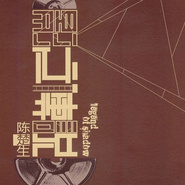

影之传说Legend Of Shadow
============================

|  |  |
| :--: | :-- |
| [ 影之传说Legend Of Shadow](https://emumo.xiami.com/album/412414) | **艺人**: [陈楚生](../index.md) **语种**: 国语 **唱片公司**: 华谊兄弟 **发行时间**: 2010年12月06日 **专辑类别**: 原声带, 影视音乐 **专辑风格**: 华语唱作人 Chinese Singer-Songwriter, 国语流行 Mandarin Pop **播放数**: 4662758 **收藏数**: 520 **评论数**: 58  |

## 简介

楚生创作的新影视专辑，用最真诚的声音唱出最纯粹的音乐感染力.楚生创作的新影视专辑，用最真诚的声音唱出最纯粹的音乐感染力楚生创作的新影视专辑  
  
陈楚生 2010 电影音乐专辑。一部好的电影作品，很多人会因为一首歌而爱上它，其电影歌曲往往会比电影本身流传得更久…… 一张专辑记忆电影的温存与感动，聆听影之传说的独特灵性与精神。 2010陈楚生俨然成为了影视界最为推崇的歌手。频频亮相于各大影视剧的发布会。从《山楂树》《狄仁杰之通天帝国》到岁末的《守望者》一年的时间里他担纲了四部电影一部电视剧主题曲的演唱，其中不乏很多由他本人创作的作品。创作演唱俱佳似乎让这个人们心中的才子更具魅力。这张专辑不仅流于声且流于影。

## 曲目

## 评论

|  |  |  |
| :-- | :-- | :-- |
|  [虾米用户](https://emumo.xiami.com/u/424610696)  2020-04-30 06:49 赞(0) 踩(0) | 
伤感又不失温柔的歌曲
 |
|  [虾米用户](https://emumo.xiami.com/u/326744958)  2017-11-21 20:39 赞(0) 踩(0) | 
突然想起了他，找来听听。不错
 |
|  [虾米用户](https://emumo.xiami.com/u/36351605)  2017-07-29 09:18 赞(1) 踩(0) | 
喜欢陈楚生的歌声，可他出歌少，很可惜。
 |
|  [虾米用户](https://emumo.xiami.com/u/42410186) ―― 2015-04-27 23:05 赞(1) 踩(0) | 
好听
 |
|  [虾米用户](https://emumo.xiami.com/u/44469978)  2014-12-24 22:07 赞(0) 踩(0) | 
至诚的爱情，酸酸的感觉。山楂树
 |
|  [虾米用户](https://emumo.xiami.com/u/24621559)  2014-03-07 13:17 赞(0) 踩(0) | 
我发现彩铃设成这个挺不错的
 |
|  [虾米用户](https://emumo.xiami.com/u/1609946) 一即一切 2014-03-01 16:06 赞(0) 踩(0) | 
心 境不二
 |
|  [虾米用户](https://emumo.xiami.com/u/21228183) 喜欢的音乐就要听一整天 2013-10-09 14:42 赞(0) 踩(0) | 
狄仁杰之通天帝国
 |
|  [虾米用户](https://emumo.xiami.com/u/1577426)  2013-09-13 18:04 赞(0) 踩(0) | 
good
 |
|  [虾米用户](https://emumo.xiami.com/u/9720211) 十一月的阶梯 2013-06-07 22:02 赞(1) 踩(0) | 
陈楚生的声音真的很棒！这张专辑也还不错。和中国大多数歌手一样，缺的是真正专业的制作团队和真正能显示其实力的原创专辑。
 |
|  [虾米用户](https://emumo.xiami.com/u/4876323) 文章 2013-04-18 05:57 赞(0) 踩(0) | 
ok
 |
|  [虾米用户](https://emumo.xiami.com/u/9401140)  2012-09-10 10:57 赞(0) 踩(0) | 
功底深，主题明确
 |
|  [虾米用户](https://emumo.xiami.com/u/317398) 我还没想好要写什么... 2012-06-27 21:58 赞(1) 踩(0) | 
不错。喜欢这种不张扬、但有实力的性格。。。
 |
|  [虾米用户](https://emumo.xiami.com/u/1980716)  2012-05-23 18:14 赞(0) 踩(0) | 
很好听呀，为什么大家评价不高呢？
 |
|  [虾米用户](https://emumo.xiami.com/u/1980716)  2012-05-23 18:14 赞(0) 踩(0) | 
好听
 |
|  [虾米用户](https://emumo.xiami.com/u/9248549) 先学不生气，再学气死人 2012-05-22 14:18 赞(0) 踩(0) | 
就是喜欢
 |
|  [虾米用户](https://emumo.xiami.com/u/3129972)  2011-12-22 17:13 赞(0) 踩(0) | 
主题曲一哥！大爱《浮光》！
 |
|  [虾米用户](https://emumo.xiami.com/u/5840839)  2011-10-31 23:21 赞(2) 踩(0) | 
觉得《快男》唯一作对的事情就是发掘了陈楚生，这就是人才啊！！！
 |
| ⇒ |  [虾米用户](https://emumo.xiami.com/u/20798871) 还给彼此的生活 就让我们 2015-02-28 18:00 赞(0) 踩(0) | 
是的
 |
|  [虾米用户](https://emumo.xiami.com/u/6485154)  2011-10-28 23:18 赞(0) 踩(0) | 
好听!
 |
|  [虾米用户](https://emumo.xiami.com/u/6473133)  2011-10-28 09:09 赞(1) 踩(0) | 
首首都是精品
 |
|  [虾米用户](https://emumo.xiami.com/u/640461)  2011-10-18 01:00 赞(0) 踩(0) | 
由于电影风格的多样化，这张影视歌曲专辑也就比上张专辑风格显得更多元化了，某种意义上说，不像一张“个人专辑”，倒有些像“合集”。《风起时想你》的流行韩风，《丹书铁契》、《泾渭》的古风大气，《**》的怀旧民谣，甚至还有一首音乐剧风格的《男孩的梦》。可以看出陈楚生把各种风格的歌曲都演绎得很到位，唱功相当细腻，很能把人带入歌的意境中。个人认为其中《浮光》、《**》是精品。
 |
|  [虾米用户](https://emumo.xiami.com/u/3158420)  2011-06-12 05:17 赞(0) 踩(0) | 
movie
 |
|  [虾米用户](https://emumo.xiami.com/u/3867370)  2011-05-23 13:21 赞(0) 踩(0) | 
喜欢他的声音，干净清澈，最遗憾的是出专辑的速度太慢了，为什么大部分是ep呢
 |
|  [虾米用户](https://emumo.xiami.com/u/1854152) 温向阳 2011-05-06 23:17 赞(0) 踩(0) | 
咋没有倾国倾城
 |
|  [虾米用户](https://emumo.xiami.com/u/3035582)  2011-03-23 10:56 赞(0) 踩(0) | 
喜歡就是喜歡
 |
|  [虾米用户](https://emumo.xiami.com/u/2576427)  2011-02-06 16:39 赞(0) 踩(0) | 
我爱看电影
 |
|  [虾米用户](https://emumo.xiami.com/u/66929)  2011-02-01 18:08 赞(0) 踩(0) | 
清澈的声音，动听的旋律
 |
|  [虾米用户](https://emumo.xiami.com/u/1342581)  2011-01-28 20:21 赞(0) 踩(0) | 
以为收藏了呢
 |
|  [虾米用户](https://emumo.xiami.com/u/2217527)   2010-12-18 01:45 赞(0) 踩(0) | 
我们看的不是外表，只要好听
 |
|  [虾米用户](https://emumo.xiami.com/u/2050979)  2010-12-05 13:55 赞(0) 踩(0) | 
山楂花好听
 |
|  [虾米用户](https://emumo.xiami.com/u/996444)  2010-12-02 21:54 赞(0) 踩(0) | 
浮光很好听啊，每次听都很感动。
 |
|  [虾米用户](https://emumo.xiami.com/u/649177)  2010-12-02 00:55 赞(0) 踩(0) | 
浮光很惊艳，山楂花也不错
 |
|  [虾米用户](https://emumo.xiami.com/u/1932904)  2010-12-01 20:20 赞(0) 踩(0) | 
她们用的还是老版本啊，改改吧。
 |
|  [虾米用户](https://emumo.xiami.com/u/27)  “你知道吗？你总是说假... 2010-12-01 16:42 赞(0) 踩(0) | 
好恶心的封面
 |
|  [虾米用户](https://emumo.xiami.com/u/1966792)  2010-11-29 23:26 赞(0) 踩(0) | 
风起时，想你··这歌- -有韩国的味道。。
 |
| ⇒ |  [虾米用户](https://emumo.xiami.com/u/1242218) （*￣︶￣*）觉知自己 2010-12-02 20:08 赞(0) 踩(0) | 
握手，同感。
 |
| ⇒ |  [虾米用户](https://emumo.xiami.com/u/1673948)  2010-12-06 17:01 赞(0) 踩(0) | 
<q><b>kaniar说：</b></q>
 |
| ⇒ |  [虾米用户](https://emumo.xiami.com/u/871648)  2011-03-16 22:43 赞(0) 踩(0) | 
<q><b>欣然说：</b></q>
 |
|  [虾米用户](https://emumo.xiami.com/u/1986317)  2010-11-29 20:21 赞(0) 踩(0) | 
啊，各位大神能不能想个办法，教我怎么改一下封面，改不了啊。。。。。
 |
| ⇒ |  [虾米用户](https://emumo.xiami.com/u/1673948)  2010-12-06 17:09 赞(0) 踩(0) | 
这个不是正式的封面吗？当当这几天就发货了，就是用的这个封面啊！！
 |
| ⇒ |  [虾米用户](https://emumo.xiami.com/u/1986317)  2010-12-06 21:11 赞(0) 踩(0) | 
<q><b>欣然说：</b></q>
 |
|  [虾米用户](https://emumo.xiami.com/u/1756879)  2010-11-29 13:43 赞(1) 踩(0) | 
听着那首“想念”，我很想哭
 |
| ⇒ |  [虾米用户](https://emumo.xiami.com/u/1986317)  2010-11-29 20:16 赞(0) 踩(0) | 
同感
 |
|  [虾米用户](https://emumo.xiami.com/u/874568) 音乐虫子 2010-11-29 11:30 赞(1) 踩(0) | 
风起时想你，丹书铁契，山楂树之恋。这三首质量很高。其实陈楚生完全可以唱别人的歌，不要让创作歌手的头衔限制住了。陈自己创作的歌虽然质量还可以，但是谈不上特别出色。
 |
| ⇒ |  [虾米用户](https://emumo.xiami.com/u/1986317)  2010-11-29 20:21 赞(0) 踩(0) | 
这个提议很有意思，想想也是啊
 |
| ⇒ |  [虾米用户](https://emumo.xiami.com/u/874568) 音乐虫子 2010-11-30 09:44 赞(0) 踩(0) | 
<q><b>迷茫的大头说：</b></q>
 |
| ⇒ |  [虾米用户](https://emumo.xiami.com/u/2079383)  2010-12-01 21:54 赞(0) 踩(0) | 
所见略同~
 |
|  [虾米用户](https://emumo.xiami.com/u/1986317)  2010-11-29 11:01 赞(0) 踩(0) | 
这个还不是正式的封面，大家下载歌曲了以后可以看看歌曲的嵌入封面，那个才是。 这个是我网友曾经发求祝时的封面，我忘记改了。。。。。
 |
| ⇒ |  [虾米用户](https://emumo.xiami.com/u/355865) Let it go, l... 2010-11-29 11:22 赞(0) 踩(0) | 
那赶快改一下吧，都推荐首页了，封面太山寨了不好
 |
| ⇒ |  [虾米用户](https://emumo.xiami.com/u/27)  “你知道吗？你总是说假... 2010-11-29 17:13 赞(0) 踩(0) | 
提交纠错给小编
 |
|  [虾米用户](https://emumo.xiami.com/u/355865) Let it go, l... 2010-11-29 10:46 赞(0) 踩(0) | 
非正式专辑吧？要不然封面怎么这么山寨？
 |
| ⇒ |  [虾米用户](https://emumo.xiami.com/u/27)  “你知道吗？你总是说假... 2010-11-29 17:13 赞(0) 踩(0) | 
正式封面还未面市咯，有了会立即换上的  放心啊
 |
|  [虾米用户](https://emumo.xiami.com/u/579616)  2010-11-29 07:30 赞(0) 踩(0) | 
个人认为泾渭比丹书铁契更适合做狄仁杰的宣传曲
 |
|  [虾米用户](https://emumo.xiami.com/u/579616)  2010-11-29 07:28 赞(1) 踩(0) | 
这次的影视歌曲专辑 天长地久没收进去比较遗憾
 |
|  [虾米用户](https://emumo.xiami.com/u/212187)  2010-11-27 11:00 赞(0) 踩(0) | 
影视专辑.......额......
 |
| ⇒ |  [虾米用户](https://emumo.xiami.com/u/1986317)  2010-11-27 12:37 赞(0) 踩(0) | 
之前是有网友想要的，归类成了这个专辑 而且实际上，是有很多视频的 呵呵，海涵啊
 |
| ⇒ |  [虾米用户](https://emumo.xiami.com/u/212187)  2010-11-27 14:37 赞(0) 踩(0) | 
<q><b>迷茫的大头说：</b></q>
 |
