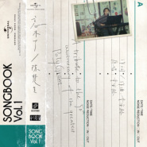

忘不了
============================

|  |  |
| :--: | :-- |
| [ 忘不了](https://emumo.xiami.com/album/5021059842) | **艺人**: [陈楚生](../index.md) **语种**: 国语 **唱片公司**: Go East Music Entertainment Consulting Limited **发行时间**: 2020年07月10日 **专辑类别**: EP, 单曲 **专辑风格**: 国语流行 Mandarin Pop **播放数**: 35491 **收藏数**: 7 **评论数**: 11  |

## 简介

「忘不了」究竟是怀念还是留恋？执意逗留，还是自我松绑？念念不忘，经典声音镌刻成永久的最初美好 此次陈楚生带着诚意开启致敬宝丽金50周年的序篇，用自己深情嗓音演绎宝丽金经典情歌《忘不了》。打开尘封的记忆，用一段旋律唤起我们对于过往的美好回忆。 选择这首歌，是陈楚生对往事的明心见性。从小镇走到亿万观众面前，他曾经迷茫，也洒脱过。如今一番沉淀后坚定归来，用最贴切的情感讲述如何与「忘不了」相处：可以怀念，但不要留恋，去勇敢地拥抱明天。

## 曲目

## 评论

|  |  |  |
| :-- | :-- | :-- |
|  [虾米用户](https://emumo.xiami.com/u/48502798)  2020-07-29 22:24 赞(0) 踩(0) | 
竟然没有版权了 
 |
|  [虾米用户](https://emumo.xiami.com/u/326840862) 平沙落雁 2020-07-16 22:43 赞(0) 踩(0) | 
心潮澎湃
 |
|  [虾米用户](https://emumo.xiami.com/u/288443191)  2020-07-14 23:15 赞(0) 踩(0) | 
翻唱编排都好
 |
|  [虾米用户](https://emumo.xiami.com/u/260167529) 爱音乐的疯子 2020-07-11 14:49 赞(0) 踩(0) | 
童安格金曲再现 也有自己味道 成功的翻唱作品
 |
|  [虾米用户](https://emumo.xiami.com/u/408317403)  2020-07-11 01:11 赞(0) 踩(0) | 
夜半听此歌，感觉心中暖暖。
 |
|  [虾米用户](https://emumo.xiami.com/u/32395255) 她乡 2020-07-10 19:53 赞(0) 踩(0) | 
缱绻情深
 |
|  [虾米用户](https://emumo.xiami.com/u/26155676) 继续 2020-07-10 14:05 赞(0) 踩(0) | 
还是那个干净的声音
 |
|  [虾米用户](https://emumo.xiami.com/u/318311274) 人山人海里你不必记得我 2020-07-10 12:25 赞(0) 踩(0) | 
为何一转眼 时光飞逝如电 看不清的岁月 抹不去的从前 就像一阵风 吹落恩恩和怨怨 也许你和我 没有谁对谁错 忘不了你的泪 忘不了你的好 忘不了醉人的缠绵 也忘不了你的誓言 何不让这场梦 没有醒来的时候 只有你和我直到永远 为何一转眼 时光飞逝如电 看不清的岁月 抹不去的从前 就像一阵风 吹落恩恩和怨怨 也许你和我 没有谁对谁错 忘不了你的泪 忘不了你的好 忘不了醉人的缠绵 也忘不了你的誓言 何不让这场梦 没有醒来的时候 只有你和我直到永远 只有你和我直到永远
 |
|  [虾米用户](https://emumo.xiami.com/u/327135925)  2020-07-10 11:38 赞(0) 踩(0) | 
生哥还是生哥
 |
|  [虾米用户](https://emumo.xiami.com/u/418530768) $ 能自己扛的绝不声张 ... 2020-07-10 08:36 赞(0) 踩(0) | 
还是一如既往的令人陶醉～
 |
|  [虾米用户](https://emumo.xiami.com/u/265156586)  2020-07-10 06:36 赞(0) 踩(0) | 
好听，喜欢
 |
