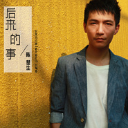
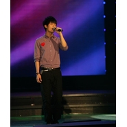
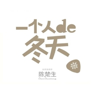

陈楚生
============================

|  |  |
| :--: | :-- |
| [<br>陈楚生](https://i.xiami.com/chenchusheng) | **地区**: China 中国大陆<br>**风格**: 国语流行 Mandarin Pop, 华语唱作人 Chinese Singer-Songwriter<br>**播放数**: 22215740<br>**粉丝数**: 18338<br>**评论数**: 435<br> |

## 档案

<div>
歌手，原创音乐人，1981年7月25日出生于海南省三亚市，当今华语乐坛最具影响力男歌手之一，音乐作品多次斩获“金曲奖”，在各大权威音乐奖项中数次获封“最受欢迎男歌手”“最佳唱作人”“最佳男歌手”等荣誉称号，更三度禅联中歌榜“最佳创作歌手”大奖。<br>
2007“快乐男声”全国总冠军出道，娴熟的吉他和天籁般的音色使他成为舞台上为数不多的灵魂歌者。一首原创作品《有没有人告诉你》风靡大江南北，成为家喻户晓的佳作。因其“零负面”的绿色艺人形象，已有38首音乐作品被奥运、亚运 、青年奥运会等国际性体育赛事、大牌电影 、各电视台节目、公益活动、书籍作为主题曲/宣传曲。<br>
代表作品：《有没有人告诉你》《经过》《 醉》《山楂花》《瘾》《风起时，想你》等。<br>
小档案<br>
昵称: 小弟<br>
性别：男<br>
民族：汉<br>
出生年月：1981年农历6月24（实则阳历1981年7月25日）<br>
籍贯：广东普宁（出生于海南三亚立才农场）<br>
现住地： 北京<br>
星座：狮子<br>
血型：O<br>
身高：176cm<br>
体重：60kg<br>
职业：歌手<br>
性格：双向<br>
爱好：表演、吉他、足球<br>
喜欢的歌手：许巍<br>
爱模仿的歌手：齐秦 郑中基<br>
个人格言：有努力才会有收获<br>
最喜欢做的事：听歌、睡觉<br>
最讨厌做的事：去想今天吃什么<br>
最喜欢的颜色：黑、红<br>
粉丝群名：花生<br>
大事记<br>
1995年,开始爱上吉它<br>
1999年，曾去自家附近的一间小酒吧弹唱<br>
2000年7月，开始去深圳一家酒吧弹唱；<br>
2000年8月，参加了深圳傲旗音乐制作公司同酒吧联合举办的深圳本土原创音乐节。<br>
2000年8、9月，在深圳广播电台夏冰主持的《我唱我歌》栏目做现场采访及现场弹唱，并且连续一周播放自己创作的歌曲。<br>
2001年8月，同李湘、金海心参加北京光线电视在广州理工大学举办的现场演出。<br>
2001年9月，参加上海举办的亚洲音乐节新人大奖赛，并获得最具潜质歌手奖<br>
2002年1月，参加深圳电视台拍摄的一部贵州扶贫爱心活动的短片，演唱这部片子的主题曲《大山的孩子》<br>
2003年获得在长沙举行的全国ＰＵＢ歌手大赛冠军<br>
2006年到07年4月 在深圳宝安新面孔 BIG BOY乐队做主唱<br>
参加湖南卫视"2007快乐中国仁和闪亮快乐男声"比赛,获冠军<br>
2007年11月17日 获 2007中国广播影视大奖中国原创歌曲奖 最佳华语歌手<br>
小简介<br>
陈楚生今年参加了07《快乐男声》，在西安赛区海选时演唱了《姑娘》和原创歌曲《一夜》，展示了自己娴熟的吉他和天籁般的音色。<br>
在西安赛区50进10的比赛中，陈楚生弹唱了《姑娘》，吉他技巧娴熟，歌曲演唱很精彩，最终获得评委的肯定，晋级西安赛区10强。<br>
在西安赛区10进1的比赛中，陈楚生先后演唱了原创歌曲《有没有人告诉你》，热烈奔放的《里约热内卢》以及齐秦的作品《想念》，最后在短信投票中惜败给苏醒，获得西安赛区亚军，并进入48小时突围赛，在坚持了2场突围赛后，第11个进入全国13强。<br>
在随后的9场全国总决赛中，他越战越勇，最后以领先对手70多万票的超高人气获得冠军。<br>
陈楚生的演唱经历很丰富，他对于自己精益求精，刻苦勤奋，这么多年来对于音乐的追求从未松懈，在各种大赛中获得很多荣誉，演唱实力得到一致肯定。他的原创歌曲《有没有人告诉你》在深圳广播台持续上榜，取得了很好的成绩。他的演唱让每一个音符都饱含了感情，并传到听众的心里……<br>
2000年4月，陈楚生背着把吉他从海南三亚来到深圳闯荡，那年才19岁。2000年，陈楚生踏进酒吧歌手之门，经过一段时间“亮嗓”，陈楚生的唱歌能力日渐长进，其忧郁的歌声、俊朗的形象渐渐受到很多听众的欢迎。<br>
2001年，上海东方电视台等18家电视台联合举办“亚洲新人大奖赛”，陈楚生一举获得“亚洲最具潜质新人奖”。<br>
2003年818日，全国PUB歌手大赛在湖南长沙举行，面对华纳、滚石、星文、正大、新索等12家华语唱片巨头的老总们演唱， 陈楚生奇迹般地从礼仪小姐手上接过冠军奖杯和30000元奖金。随后，EMI百代唱片公司的人找他签约，虽然少年得志，但三年签约生涯，并没有给陈楚生带来一张个人专辑。<br>
2007年，陈楚生参加快乐男声比赛，一举夺魁，他的沉稳、淡定以及嗓音和创作上的特色，让他成为2007年全国瞩目的新偶像
</div>

## 专辑

| 名称 | 语种 | 唱片公司 | 发行时间 | 专辑类别 | 专辑风格 |
| :--: | :-- | :-- | :-- | :-- | :-- |
| [<br>孤独的狮子](./albums/5022466184.md) | 国语 |  | 2021年01月13日 | EP, 单曲 |  |
| [<br>忘不了 (致敬宝丽金50周年)](./albums/5021233990.md) | 国语 | 环球唱片 | 2020年08月07日 | EP, 单曲 | 国语流行 Mandarin Pop |
| [<br>忘不了](./albums/5021059842.md) | 国语 | Go East Music Entertainment Consulting Limited | 2020年07月10日 | EP, 单曲 | 国语流行 Mandarin Pop |
| [<br>趋光](./albums/2104971300.md) | 国语 | 环球唱片 | 2019年06月28日 | 录音室专辑 | 国语流行 Mandarin Pop |
| [<br>好久不见电影《四个春天》宣传主题曲](./albums/2104420785.md) | 国语 | 环球唱片 | 2018年12月28日 | EP, 单曲 | 国语流行 Mandarin Pop |
| [<br>七分之一的理想 (1/7 Concert Live)](./albums/2103835996.md) | 国语 | Go East Music Entertainment Consulting Limited | 2018年07月25日 | 现场专辑 | 国语流行 Mandarin Pop |
| [<br>侦探CSPY.C](./albums/2102659559.md) | 国语 | Go East Music Entertainment Consulting Limited | 2017年03月29日 | 录音室专辑 | 独立流行 Indie Pop |
| [<br>后来的事](./albums/2100220576.md) | 国语 | 海蝶音乐 | 2015年10月16日 | EP, 单曲 | 国语流行 Mandarin Pop |
| [<br>楚生正在听 第二集](./albums/1736168576.md) | 国语 | 陈楚生工作室 | 2015年07月06日 | 播客 |  |
| [<br>楚生正在听 第一集](./albums/832610604.md) | 国语 | 陈楚生工作室 | 2015年05月25日 | 播客 |  |
| [<br>Demo](./albums/814914191.md) | 国语 | 华谊兄弟 | 2014年11月02日 | EP, 单曲 |  |
| [<br>Beautiful Light](./albums/781890293.md) | 国语 | 恒大音乐 | 2013年10月16日 | EP, 单曲 |  |
| [<br>我知道你离我不远](./albums/1169904904.md) | 国语 | 华谊兄弟 | 2013年06月10日 | 录音室专辑 | 国语流行 Mandarin Pop |
| [<br>经过](./albums/525407.md) | 国语 | 华谊兄弟 | 2012年06月28日 | EP, 单曲 | 国语流行 Mandarin Pop |
| [<br>瘾·Live 陈楚生2011围炉音乐会](./albums/490011.md) | 国语 | 华谊兄弟 | 2012年01月16日 | 现场专辑 | 国语流行 Mandarin Pop |
| [<br>瘾](./albums/473643.md) | 国语 | 华谊兄弟 | 2011年11月06日 | 录音室专辑 |  |
| [<br>修仙缘](./albums/428798.md) | 国语 | 华谊兄弟 | 2011年03月03日 | EP, 单曲 |  |
| [<br>影之传说Legend Of Shadow](./albums/412414.md) | 国语 | 华谊兄弟 | 2010年12月06日 | 原声带, 影视音乐 | 华语唱作人 Chinese Singer-Songwriter, 国语流行 Mandarin Pop |
| [<br>山高水长](./albums/421450.md) | 国语 | 华谊兄弟 | 2010年11月10日 | EP, 单曲 |  |
| [<br>天长地久电影《80’后》主题曲](./albums/387488.md) | 国语 | 华谊兄弟 | 2010年06月23日 | EP, 单曲 |  |
| [<br>绿动](./albums/385405.md) | 国语 | 华谊兄弟 | 2010年06月01日 | EP, 单曲 | 华语唱作人 Chinese Singer-Songwriter, 国语流行 Mandarin Pop |
| [<br>冬去春来](./albums/358736.md) | 国语 | 华谊兄弟 | 2009年12月28日 | 录音室专辑 | 华语唱作人 Chinese Singer-Songwriter, 国语流行 Mandarin Pop |
| [<br>红星照我去战斗](./albums/440028.md) | 国语 | 华谊兄弟 | 2009年12月20日 | EP, 单曲 |  |
| [<br>一个人的冬天](./albums/314895.md) | 国语 | 天娱传媒 | 2008年12月15日 | EP, 单曲 |  |
| [<br>这一刻](./albums/414347.md) | 国语 | 步酷音乐 | 2008年08月14日 | EP, 单曲 |  |
| [<br>与你同在](./albums/400057.md) | 国语 | 天娱传媒 | 2008年05月30日 | EP, 单曲 |  |
| [<br>原来我一直都不孤单](./albums/33049.md) | 国语 | 天娱传媒 | 2007年11月05日 | EP, 单曲 | 国语流行 Mandarin Pop, 华语唱作人 Chinese Singer-Songwriter |

## 评论

|  |  |  |
| :-- | :-- | :-- |
| <br>[虾米用户](https://emumo.xiami.com/u/345373850)<br><br>2020-07-25 10:59<br>赞(0) 踩(0) | <div>&lt;祝你生日快乐唱喋大[url=/u/402445942]@楚楚 [/url]   祝你生日快乐唱片大賣贾人杰  [url=/u/402445942]@楚楚 [/url]&gt;&lt;402445942,402445942&gt;</div> |
| <br>[虾米用户](https://emumo.xiami.com/u/230803304)<br>三观正又爱国的成都宝藏男...<br>2020-07-25 10:02<br>赞(0) 踩(0) | <div>还是很帅的 就是免费收听下载的歌太少了</div> |
| <br>[虾米用户](https://emumo.xiami.com/u/3341146)<br>爱我请留言。<br>2020-07-04 20:53<br>赞(0) 踩(0) | <div>一曲《无问西东》是那么温柔从容</div> |
| <br>[虾米用户](https://emumo.xiami.com/u/353422184)<br><br>2020-01-13 04:41<br>赞(0) 踩(0) | <div>喜欢的男歌手之一，一直拿到冠军那时候都在看和关注</div> |
| <br>[虾米用户](https://emumo.xiami.com/u/319688150)<br>愿经典不被遗忘<br>2019-12-14 22:17<br>赞(0) 踩(0) | <div></div> |
| <br>[虾米用户](https://emumo.xiami.com/u/361310825)<br><br>2019-11-02 19:23<br>赞(5) 踩(0) | <div>一个被经纪公司毁了的原创歌手……</div> |
| <br>[虾米用户](https://emumo.xiami.com/u/3887612)<br><br>2019-07-25 14:21<br>赞(2) 踩(0) | <div>楚楚动人，生生不息——包小柏</div> |
| <br>[虾米用户](https://emumo.xiami.com/u/352325154)<br>桂棹兮兰桨，击空明兮溯流...<br>2019-07-25 12:17<br>赞(3) 踩(0) | <div>生日快乐</div> |
| ⇒ | <br>[虾米用户](https://emumo.xiami.com/u/267503515)<br><br>2019-10-26 12:20<br>赞(0) 踩(0) | <div>生日快乐   </div> |
| <br>[虾米用户](https://emumo.xiami.com/u/246191334)<br><br>2019-07-25 10:37<br>赞(2) 踩(0) | <div>生哥，生日快乐<br>我们啊，要一直一起走下去啊</div> |
| <br>[虾米用户](https://emumo.xiami.com/u/230803304)<br>三观正又爱国的成都宝藏男...<br>2019-07-25 10:14<br>赞(1) 踩(0) | <div>祝陈楚生哥哥生日快乐</div> |
| <br>[虾米用户](https://emumo.xiami.com/u/230803304)<br>三观正又爱国的成都宝藏男...<br>2019-07-02 10:28<br>赞(0) 踩(0) | <div>支持新单曲</div> |
| <br>[虾米用户](https://emumo.xiami.com/u/314483310)<br>唯音乐对我始终忠诚。<br>2019-06-16 16:25<br>赞(2) 踩(0) | <div>陌上人如玉，公子世无双 </div> |
| <br>[虾米用户](https://emumo.xiami.com/u/329290848)<br>行到水穷处，坐看云起时。<br>2019-06-01 01:50<br>赞(0) 踩(0) | <div>好听(ง •̀_•́)ง</div> |
| <br>[虾米用户](https://emumo.xiami.com/u/379715423)<br><br>2019-05-27 10:10<br>赞(0) 踩(0) | <div></div> |
| <br>[虾米用户](https://emumo.xiami.com/u/198694752)<br>Leejehoon<br>2019-05-19 02:51<br>赞(0) 踩(0) | <div>作为冠军，他还是有他的过人之处的，润物细无声般地把歌唱进了人的心里面，当今时代这样的歌手已经不多了，刘若英算一个，陈楚生也算一个！</div> |
| <br>[虾米用户](https://emumo.xiami.com/u/421705051)<br><br>2019-04-14 02:42<br>赞(1) 踩(0) | <div>从有没有人告诉你开始到现在</div> |
| <br>[虾米用户](https://emumo.xiami.com/u/127098762)<br>stay as SWEE...<br>2019-03-26 23:44<br>赞(0) 踩(0) | <div>他的眼睛里有星星。</div> |
| <br>[虾米用户](https://emumo.xiami.com/u/230803304)<br>三观正又爱国的成都宝藏男...<br>2019-03-23 06:09<br>赞(0) 踩(0) | <div>支持一下</div> |
| <br>[虾米用户](https://emumo.xiami.com/u/210068359)<br>电影人，摄影师，艺术家，...<br>2019-03-19 20:44<br>赞(1) 踩(0) | <div>《歌手3》快追不下去了，就在这个时候突然知道陈楚生要来踢馆！感觉就像打了一针兴奋剂，还得追！！！</div> |
| <br>[虾米用户](https://emumo.xiami.com/u/54894495)<br><br>2019-03-13 22:41<br>赞(1) 踩(0) | <div>要上歌手了<br>提前听<br>以前mp3上有好多歌<br>后来不用了<br>就在没听<br><br>好听</div> |
| <br>[虾米用户](https://emumo.xiami.com/u/403155236)<br>so what if<br>2019-01-22 11:35<br>赞(2) 踩(0) | <div>加油</div> |
| <br>[虾米用户](https://emumo.xiami.com/u/1749)<br>有希望就有力量！<br>2019-01-05 21:47<br>赞(0) 踩(0) | <div>浮光那首歌没找到，是没有发行专辑吗？太好听了，真可惜。</div> |
| <br>[虾米用户](https://emumo.xiami.com/u/308585095)<br> 渐渐温柔 克制 朴素 ...<br>2018-12-25 21:04<br>赞(2) 踩(0) | <div>静水深流是你，清风霁月也是你，<br>当时人人传唱的那首《有没有人告诉你》已经十一年了，<br>我最爱的那首《天长地久》也八九年了，<br>我的人生也发生了天翻地覆的变化，<br>你却还是一如既往的温润如玉。 <br>加油！   </div> |
| <br>[虾米用户](https://emumo.xiami.com/u/315100951)<br><br>2018-12-16 03:54<br>赞(2) 踩(0) | <div>可惜这嗓音了，出的新歌太少。</div> |
| <br>[虾米用户](https://emumo.xiami.com/u/380198762)<br><br>2018-11-26 03:48<br>赞(0) 踩(0) | <div>客气客气</div> |
| <br>[虾米用户](https://emumo.xiami.com/u/355138636)<br><br>2018-10-25 09:50<br>赞(0) 踩(0) | <div></div> |
| <br>[虾米用户](https://emumo.xiami.com/u/11590705)<br><br>2018-10-22 14:05<br>赞(2) 踩(0) | <div>純淨的好聲音，很喜歡!</div> |
| <br>[虾米用户](https://emumo.xiami.com/u/26617505)<br><br>2018-10-09 07:55<br>赞(2) 踩(0) | <div>他的声音真的很好听</div> |
| <br>[虾米用户](https://emumo.xiami.com/u/260167529)<br>爱音乐的疯子<br>2018-09-21 15:32<br>赞(4) 踩(0) | <div>歌手2019期待陈楚生来</div> |
| <br>[虾米用户](https://emumo.xiami.com/u/351562424)<br>❤❤❤<br>2018-09-08 15:24<br>赞(0) 踩(0) | <div>好好听 </div> |
| <br>[虾米用户](https://emumo.xiami.com/u/400124013)<br>永垂不变的青春岁月<br>2018-08-11 11:57<br>赞(0) 踩(0) | <div>66⃣️</div> |
| <br>[虾米用户](https://emumo.xiami.com/u/400124013)<br>永垂不变的青春岁月<br>2018-08-10 10:32<br>赞(1) 踩(0) | <div>〇</div> |
| <br>[虾米用户](https://emumo.xiami.com/u/400124013)<br>永垂不变的青春岁月<br>2018-08-09 20:43<br>赞(1) 踩(0) | <div></div> |
| <br>[虾米用户](https://emumo.xiami.com/u/400124013)<br>永垂不变的青春岁月<br>2018-08-05 15:25<br>赞(1) 踩(0) | <div>❤️❤️❤️❤️❤️❤️❤️❤️❤️❤️❤️❤️❤️❤️❤️❤️❤️❤️❤️❤️❤️❤️❤️❤️❤️❤️❤️❤️</div> |
| <br>[虾米用户](https://emumo.xiami.com/u/400124013)<br>永垂不变的青春岁月<br>2018-08-05 08:30<br>赞(1) 踩(0) | <div>是</div> |
| <br>[虾米用户](https://emumo.xiami.com/u/400124013)<br>永垂不变的青春岁月<br>2018-08-04 17:10<br>赞(1) 踩(0) | <div>不</div> |
| <br>[虾米用户](https://emumo.xiami.com/u/400124013)<br>永垂不变的青春岁月<br>2018-08-03 22:02<br>赞(1) 踩(0) | <div></div> |
| <br>[虾米用户](https://emumo.xiami.com/u/520819)<br>who am i?who...<br>2018-07-30 00:18<br>赞(1) 踩(0) | <div>有童安格的影子，声音清澈，要是创作跟上来就牛了。</div> |
| <br>[虾米用户](https://emumo.xiami.com/u/191042366)<br>请您的朋友一起来 台城来...<br>2018-07-26 12:07<br>赞(1) 踩(0) | <div>有没有人告诉你这首歌是我的童年回忆，当时红遍大街小巷，但不知道陈楚生后来为什么不红了</div> |
| ⇒ | <br>[虾米用户](https://emumo.xiami.com/u/23695430)<br>www.32gw.com<br>2018-07-26 16:01<br>赞(0) 踩(0) | <div>快男出来后红了，然后自己想自己干.当年他违约唱片公司！所以到现在红不起！</div> |
| ⇒ | <br>[虾米用户](https://emumo.xiami.com/u/23695430)<br>www.32gw.com<br>2018-07-26 16:04<br>赞(0) 踩(0) | <div>因为解约天娱，陈楚生一度与天娱和湖南卫视撕破脸皮</div> |
| ⇒ | <br>[虾米用户](https://emumo.xiami.com/u/191042366)<br>请您的朋友一起来 台城来...<br>2018-07-26 16:58<br>赞(0) 踩(0) | <div><q><b>兴冲冲的白果说：</b></q></div> |
| <br>[虾米用户](https://emumo.xiami.com/u/354737603)<br>努力！<br>2018-07-25 22:32<br>赞(3) 踩(0) | <div>生日快乐啊～</div> |
| <br>[虾米用户](https://emumo.xiami.com/u/354737603)<br>努力！<br>2018-07-25 22:31<br>赞(2) 踩(0) | <div>喜欢你很久了&amp;hellip;&amp;hellip;一直不懂当年第一名的你为什么就没有火呢&amp;hellip;&amp;hellip;好久不听你的歌了&amp;hellip;&amp;hellip;心慢慢静下来&amp;hellip;&amp;hellip;回忆着过去</div> |
| <br>[虾米用户](https://emumo.xiami.com/u/375054119)<br>新哥<br>2018-07-25 10:19<br>赞(1) 踩(0) | <div>有没有人告诉我，确实经典。真正男神，祝你快乐无限！</div> |
| <br>[虾米用户](https://emumo.xiami.com/u/263415809)<br><br>2018-07-25 10:08<br>赞(1) 踩(0) | <div>生日快乐♪٩(&amp;acute;&amp;omega;`)و♪生日快乐</div> |
| <br>[虾米用户](https://emumo.xiami.com/u/379488437)<br><br>2018-07-23 18:23<br>赞(1) 踩(0) | <div>棒棒哒</div> |
| <br>[虾米用户](https://emumo.xiami.com/u/336516835)<br>来是偶然，走是必然。你我...<br>2018-07-11 15:10<br>赞(2) 踩(0) | <div>......Look back on your life, making us the pain, not failure, but no experience everything I want to experience.~回首人生，最使得我们痛的，不是失败，而是没有经历我所想要经历的一切。来是偶然，走是必然～出生✪死亡。你我都在路上&amp;hellip;&amp;hellip;欢乐只是记忆，痛苦也只是记忆，一切都只是记忆，让我们慢慢地回忆&amp;hellip;&amp;hellip;愿那些灵魂的深处依然&amp;hellip;&amp;hellip;</div> |
| <br>[虾米用户](https://emumo.xiami.com/u/375424729)<br>云无心以砌玉山有意而抱雪...<br>2018-06-28 18:24<br>赞(2) 踩(0) | <div>他和郑源同属于低调的，走了永远都是音乐至上，而不是博出众</div> |
| <br>[虾米用户](https://emumo.xiami.com/u/375424729)<br>云无心以砌玉山有意而抱雪...<br>2018-06-28 18:22<br>赞(1) 踩(0) | <div>听这首歌仿佛回到了2007，一首歌一个故事，最好的声音</div> |
| <br>[虾米用户](https://emumo.xiami.com/u/352195616)<br><br>2018-06-24 21:42<br>赞(1) 踩(0) | <div></div> |
| <br>[虾米用户](https://emumo.xiami.com/u/274435404)<br><br>2018-06-13 23:23<br>赞(2) 踩(0) | <div>赞！</div> |
| <br>[虾米用户](https://emumo.xiami.com/u/274435404)<br><br>2018-06-13 23:22<br>赞(4) 踩(0) | <div>陈楚生，你的快男冠军有我全家几十票 </div> |
| <br>[虾米用户](https://emumo.xiami.com/u/364836565)<br><br>2018-05-16 19:38<br>赞(3) 踩(0) | <div>不花钱不让下载</div> |
| ⇒ | <br>[虾米用户](https://emumo.xiami.com/u/379488437)<br><br>2018-07-23 18:24<br>赞(0) 踩(0) | <div>不用花钱也可以啊</div> |
| <br>[虾米用户](https://emumo.xiami.com/u/347278135)<br><br>2018-05-09 23:36<br>赞(1) 踩(0) | <div>最近重新想起了他的歌声，一如既往地细腻动人，喜欢睡前听他的歌，希望他能多出作品</div> |
| ⇒ | <br>[虾米用户](https://emumo.xiami.com/u/379488437)<br><br>2018-07-23 18:25<br>赞(0) 踩(0) | <div>对呀 好就都没有听到他的作品了</div> |
| <br>[虾米用户](https://emumo.xiami.com/u/175012750)<br><br>2018-04-30 15:15<br>赞(1) 踩(0) | <div>我是你的粉丝，楚哥 </div> |
| <br>[虾米用户](https://emumo.xiami.com/u/177275726)<br> <br>2018-04-20 22:39<br>赞(2) 踩(0) | <div>特别好的声音，从快乐的第一场就觉，现在依然这样，清澈明晰</div> |
| ⇒ | <br>[虾米用户](https://emumo.xiami.com/u/379488437)<br><br>2018-07-23 18:25<br>赞(0) 踩(0) | <div>哈哈 那你的年龄没有三十也有而是七八九了吧  嘿嘿</div> |
| ⇒ | <br>[虾米用户](https://emumo.xiami.com/u/187620260)<br><br>2018-07-27 21:08<br>赞(0) 踩(0) | <div><q><b>真心想到你 一心爱上你说：</b></q></div> |
| <br>[虾米用户](https://emumo.xiami.com/u/13173319)<br>mmmm hasjmj<br>2018-04-20 11:35<br>赞(1) 踩(0) | <div>哈哈哈</div> |
| ⇒ | <br>[虾米用户](https://emumo.xiami.com/u/13173319)<br>mmmm hasjmj<br>2018-04-20 11:35<br>赞(0) 踩(0) | <div>&lt;[url=/u/259190508]@一期一会哈哈哈红红火火恍恍惚[/url] 听一下&gt;&lt;259190508&gt;</div> |
| <br>[虾米用户](https://emumo.xiami.com/u/13173319)<br>mmmm hasjmj<br>2018-04-20 11:34<br>赞(2) 踩(0) | <div>很多歌现在听还是当年那个感觉 </div> |
| <br>[虾米用户](https://emumo.xiami.com/u/325247420)<br><br>2018-03-30 05:23<br>赞(1) 踩(0) | <div>最喜欢《相忘于江湖》和《修仙缘》这两首</div> |
| <br>[虾米用户](https://emumo.xiami.com/u/246261693)<br><br>2018-02-28 10:17<br>赞(1) 踩(0) | <div>有没有人曾告诉你</div> |
| <br>[虾米用户](https://emumo.xiami.com/u/261699783)<br><br>2018-02-12 09:15<br>赞(2) 踩(0) | <div>快乐男生那年，我居然支持苏醒，果然是年轻不懂事啊</div> |
| ⇒ | <br>[虾米用户](https://emumo.xiami.com/u/85709822)<br><br>2018-03-03 20:33<br>赞(0) 踩(0) | <div>好巧哦</div> |
| ⇒ | <br>[虾米用户](https://emumo.xiami.com/u/400124013)<br>永垂不变的青春岁月<br>2018-08-08 18:58<br>赞(0) 踩(0) | <div><q><b>王三工说：</b></q></div> |
| <br>[虾米用户](https://emumo.xiami.com/u/338850278)<br>1314520<br>2018-01-14 21:58<br>赞(2) 踩(0) | <div>长的一般一般，世界第三，可惜过气了，连我着00后小宝也第一次知道呢，歌不错          </div> |
| <br>[虾米用户](https://emumo.xiami.com/u/338850278)<br>1314520<br>2018-01-14 21:53<br>赞(1) 踩(0) | <div></div> |
| <br>[虾米用户](https://emumo.xiami.com/u/303506160)<br>因为我对你爱的深沉<br>2017-12-28 00:09<br>赞(1) 踩(0) | <div>嘿呦</div> |
| <br>[虾米用户](https://emumo.xiami.com/u/843297)<br>我还没想好要写什么...<br>2017-12-18 23:03<br>赞(1) 踩(0) | <div>声音很好，但是歌词...<br>在淘宝店里听到瘾，还以为是新的网络歌曲...</div> |
| <br>[虾米用户](https://emumo.xiami.com/u/339457544)<br><br>2017-12-16 07:40<br>赞(1) 踩(0) | <div>你好够力</div> |
| <br>[虾米用户](https://emumo.xiami.com/u/313028885)<br><br>2017-12-13 19:54<br>赞(1) 踩(0) | <div>很喜欢他的声音也很有个性</div> |
| <br>[虾米用户](https://emumo.xiami.com/u/280863345)<br><br>2017-11-22 18:03<br>赞(2) 踩(0) | <div>从07快男听他唱歌听哭了，到现在还是听一次哭一次</div> |
| <br>[虾米用户](https://emumo.xiami.com/u/1629521)<br><br>2017-10-30 10:16<br>赞(20) 踩(0) | <div>最近才迷上楚生的，因为他美丽又独一无二的声音，忧郁但是坚毅的外表，多才多艺，请相信我，你一定会成为经典。</div> |
| <br>[虾米用户](https://emumo.xiami.com/u/16089598)<br><br>2017-10-30 10:09<br>赞(6) 踩(0) | <div>非常喜欢，很耐听的一张专辑。开始觉得平淡，却越听越有滋味</div> |
| <br>[虾米用户](https://emumo.xiami.com/u/53021947)<br>之所以上天不给你，是因为...<br>2017-10-27 23:47<br>赞(4) 踩(0) | <div>最初从喜欢生哥的音乐到喜欢这个人，音乐魅力无限大，人的魅力更大，认真做音乐，坚持做自己所爱，爱生哥，爱生哥的音乐！</div> |
| <br>[虾米用户](https://emumo.xiami.com/u/12343118)<br>哈哈哈<br>2017-10-27 23:32<br>赞(4) 踩(0) | <div>平时不听流行，听了首西涌客栈哭成狗</div> |
| <br>[虾米用户](https://emumo.xiami.com/u/1929747)<br><br>2017-10-27 23:15<br>赞(2) 踩(0) | <div>老陈，今天，嫩新浪微博上的一句，我最近的最爱——Broken Bells《The Ghost Inside》，俺就寻到了这儿</div> |
| <br>[虾米用户](https://emumo.xiami.com/u/280149105)<br><br>2017-10-24 23:42<br>赞(3) 踩(0) | <div>最喜欢他唱的Beautiful light 和我知道你离我不远。</div> |
| <br>[虾米用户](https://emumo.xiami.com/u/230287061)<br>垃圾虾米！受够了！<br>2017-10-11 13:41<br>赞(1) 踩(0) | <div>咋没了</div> |
| <br>[虾米用户](https://emumo.xiami.com/u/297639407)<br>踏破芒鞋烟雨任平生<br>2017-09-18 10:19<br>赞(3) 踩(0) | <div>蒙面上的《问情》真好听 </div> |
| <br>[虾米用户](https://emumo.xiami.com/u/30905900)<br><br>2017-09-17 22:49<br>赞(1) 踩(0) | <div>记得他吧，好歹是个才子</div> |
| <br>[虾米用户](https://emumo.xiami.com/u/284494032)<br>我还没想好要写什么...<br>2017-09-06 22:09<br>赞(3) 踩(0) | <div>听着很舒服，身心都很放松！</div> |
| <br>[虾米用户](https://emumo.xiami.com/u/8875216)<br><br>2017-08-26 12:46<br>赞(4) 踩(0) | <div>有目空一切的傲气，也随时保持警觉和谦卑。</div> |
| <br>[虾米用户](https://emumo.xiami.com/u/266856464)<br><br>2017-08-20 19:11<br>赞(3) 踩(0) | <div>终于不被雪藏了</div> |
| <br>[虾米用户](https://emumo.xiami.com/u/140192612)<br> <br>2017-08-04 16:51<br>赞(19) 踩(0) | <div>小虾啊，你把有没有人告诉你原版给弄来吧 </div> |
| ⇒ | <br>[虾米用户](https://emumo.xiami.com/u/111314466)<br> <br>2017-11-22 20:36<br>赞(0) 踩(0) | <div>可以去听钟明秋的翻唱 也比这个DJ版好听</div> |
| <br>[虾米用户](https://emumo.xiami.com/u/314338151)<br><br>2017-07-23 12:38<br>赞(1) 踩(0) | <div>没有新歌</div> |
| ⇒ | <br>[虾米用户](https://emumo.xiami.com/u/327135925)<br><br>2017-11-18 04:26<br>赞(0) 踩(0) | <div>有新歌，搜索陈楚生&amp;amp;spy.c  最近组乐队了</div> |
| <br>[虾米用户](https://emumo.xiami.com/u/314338151)<br><br>2017-07-23 12:38<br>赞(1) 踩(0) | <div>还没有新歌</div> |
| <br>[虾米用户](https://emumo.xiami.com/u/308263065)<br>花朵下的秘密。<br>2017-06-29 07:38<br>赞(1) 踩(0) | <div> </div> |
| <br>[虾米用户](https://emumo.xiami.com/u/308263065)<br>花朵下的秘密。<br>2017-06-29 07:38<br>赞(1) 踩(0) | <div>很棒。</div> |
| <br>[虾米用户](https://emumo.xiami.com/u/262502183)<br><br>2017-06-10 09:16<br>赞(1) 踩(0) | <div>楚生潮汕人</div> |
| <br>[虾米用户](https://emumo.xiami.com/u/275172933)<br><br>2017-05-22 15:28<br>赞(1) 踩(0) | <div>好</div> |
| <br>[虾米用户](https://emumo.xiami.com/u/245389774)<br>诗酒趁年华<br>2017-05-20 13:03<br>赞(3) 踩(0) | <div>看了你在说出我世界上面的演讲，义无反顾的来听你</div> |
| <br>[虾米用户](https://emumo.xiami.com/u/277586464)<br> <br>2017-05-16 22:07<br>赞(1) 踩(0) | <div>陈楚生 马海生 都是我王秋生的老乡 关注 必须的</div> |
| <br>[虾米用户](https://emumo.xiami.com/u/285231653)<br><br>2017-05-10 18:19<br>赞(1) 踩(0) | <div>喜欢你的作品</div> |
| <br>[虾米用户](https://emumo.xiami.com/u/260585234)<br><br>2017-04-18 17:06<br>赞(2) 踩(0) | <div>纯净的声音最容易打动人心</div> |
| <br>[虾米用户](https://emumo.xiami.com/u/43941072)<br><br>2017-04-17 14:22<br>赞(0) 踩(0) | <div>  </div> |
| <br>[虾米用户](https://emumo.xiami.com/u/83080466)<br><br>2017-03-31 18:55<br>赞(0) 踩(0) | <div>照片里的我霉和马赛克是神马意思？  </div> |
| <br>[虾米用户](https://emumo.xiami.com/u/234680366)<br>怪人喜欢做坏事<br>2017-03-13 15:00<br>赞(1) 踩(0) | <div>陈楚生、姓陈 姓楚 生来大爱，好有爱喔 </div> |
| <br>[虾米用户](https://emumo.xiami.com/u/276167384)<br><br>2017-02-26 00:10<br>赞(1) 踩(0) | <div>可惜醉那些超好听的歌听不了   </div> |
| <br>[虾米用户](https://emumo.xiami.com/u/134987286)<br>无所事事<br>2017-02-25 15:58<br>赞(1) 踩(0) | <div>为什么没有呢？有没有人曾告诉你这首啊！</div> |
| <br>[虾米用户](https://emumo.xiami.com/u/269959414)<br><br>2017-02-16 14:19<br>赞(1) 踩(0) | <div>这人很赞</div> |
| <br>[虾米用户](https://emumo.xiami.com/u/262549619)<br><br>2017-02-03 16:32<br>赞(3) 踩(0) | <div>声音清澈迷人，一听就会爱上</div> |
| <br>[虾米用户](https://emumo.xiami.com/u/258618575)<br><br>2017-01-20 15:04<br>赞(1) 踩(0) | <div>楚生一直是海南人?</div> |
| <br>[虾米用户](https://emumo.xiami.com/u/263754547)<br>爱陈楚生<br>2017-01-19 00:37<br>赞(0) 踩(0) | <div>楚公子  </div> |
| <br>[虾米用户](https://emumo.xiami.com/u/31161643)<br>一切皆游戏。<br>2016-12-29 21:53<br>赞(0) 踩(0) | <div>这首歌听了很多年还是很喜欢。</div> |
| <br>[虾米用户](https://emumo.xiami.com/u/248499523)<br><br>2016-11-23 00:17<br>赞(0) 踩(0) | <div>还记得以后摘槟榔吃不！</div> |
| <br>[虾米用户](https://emumo.xiami.com/u/15955869)<br>回到過去尋找未來<br>2016-11-21 22:33<br>赞(1) 踩(0) | <div>没有大红多可惜</div> |
| <br>[虾米用户](https://emumo.xiami.com/u/242645769)<br><br>2016-11-14 18:55<br>赞(0) 踩(0) | <div>很爱你</div> |
| <br>[虾米用户](https://emumo.xiami.com/u/209445075)<br><br>2016-11-07 08:06<br>赞(2) 踩(0) | <div>楚生一直都是我喜欢的楚生</div> |
| <br>[虾米用户](https://emumo.xiami.com/u/47517719)<br> <br>2016-11-02 13:22<br>赞(2) 踩(0) | <div>安安静静中流露</div> |
| <br>[虾米用户](https://emumo.xiami.com/u/84502022)<br>Love me like...<br>2016-11-02 13:09<br>赞(1) 踩(0) | <div>35</div> |
| <br>[虾米用户](https://emumo.xiami.com/u/240836481)<br><br>2016-10-28 23:53<br>赞(1) 踩(0) | <div>走心</div> |
| <br>[虾米用户](https://emumo.xiami.com/u/200810873)<br><br>2016-10-13 07:17<br>赞(0) 踩(0) | <div>不错</div> |
| <br>[虾米用户](https://emumo.xiami.com/u/2669895)<br>财色兼收哈哈哈哈❤…<br>2016-10-01 20:05<br>赞(2) 踩(0) | <div>我想调侃一下楼下的留言 又怕被打 还是不用回复这个功能了<br>男的也可以呀 洗好了往床上一趴 弓起来放松就好 捂脸哈哈哈</div> |
| <br>[虾米用户](https://emumo.xiami.com/u/223456542)<br>长天一笑空遗恨，天地不仁...<br>2016-09-13 04:31<br>赞(0) 踩(0) | <div>我要是女的，就叉开腿在床上等你。 </div> |
| <br>[虾米用户](https://emumo.xiami.com/u/55285431)<br>☑ 不废话☑ 不闲聊<br>2016-08-14 01:27<br>赞(0) 踩(0) | <div>我的最爱</div> |
| <br>[虾米用户](https://emumo.xiami.com/u/211900030)<br><br>2016-08-12 09:10<br>赞(0) 踩(0) | <div>陪楚一生 我会一直支持生哥的！</div> |
| <br>[虾米用户](https://emumo.xiami.com/u/211185877)<br>回忆是后来的故事。<br>2016-08-10 12:11<br>赞(0) 踩(0) | <div>生哥么么哒</div> |
| <br>[虾米用户](https://emumo.xiami.com/u/2405068)<br><br>2016-07-27 22:01<br>赞(0) 踩(0) | <div>陈楚生</div> |
| <br>[虾米用户](https://emumo.xiami.com/u/122688364)<br>生在愤坑，长在赤圈；挣脱<br>2016-07-17 00:43<br>赞(0) 踩(0) | <div>1873</div> |
| <br>[虾米用户](https://emumo.xiami.com/u/195337462)<br><br>2016-06-29 13:20<br>赞(0) 踩(0) | <div>求新歌</div> |
| <br>[虾米用户](https://emumo.xiami.com/u/192233563)<br>幸福常伴<br>2016-06-20 20:58<br>赞(0) 踩(0) | <div>哥，我来啦！ </div> |
| <br>[虾米用户](https://emumo.xiami.com/u/15321320)<br><br>2016-04-29 11:01<br>赞(2) 踩(0) | <div>陈楚生要注重一下普通话的咬字问题…听着好难过QuQ</div> |
| <br>[虾米用户](https://emumo.xiami.com/u/35658691)<br>身行万里半天下<br>2016-04-24 10:39<br>赞(0) 踩(0) | <div>怀念</div> |
| <br>[虾米用户](https://emumo.xiami.com/u/79871254)<br><br>2016-03-26 22:13<br>赞(47) 踩(0) | <div>他唱的比张杰好，但是可惜没有张杰火。</div> |
| ⇒ | <br>[虾米用户](https://emumo.xiami.com/u/256903543)<br><br>2018-02-10 10:35<br>赞(0) 踩(0) | <div>你不知道张杰有芒果台捧着吗？</div> |
| ⇒ | <br>[虾米用户](https://emumo.xiami.com/u/346778643)<br>遥不可及<br>2018-03-08 09:02<br>赞(0) 踩(0) | <div>可以</div> |
| ⇒ | <br>[虾米用户](https://emumo.xiami.com/u/346778643)<br>遥不可及<br>2018-03-08 09:02<br>赞(0) 踩(0) | <div>恩恩</div> |
| ⇒ | <br>[虾米用户](https://emumo.xiami.com/u/377742070)<br><br>2018-07-06 15:15<br>赞(0) 踩(0) | <div>陈楚生从来不炒作 一直坚持音乐 不忘初心，</div> |
| ⇒ | <br>[虾米用户](https://emumo.xiami.com/u/158763424)<br><br>2018-08-09 12:31<br>赞(0) 踩(0) | <div>因为他没有娶谢娜做老婆 </div> |
| ⇒ | <br>[虾米用户](https://emumo.xiami.com/u/285532814)<br><br>2018-10-13 04:06<br>赞(0) 踩(0) | <div>张杰唱的那是歌，只要是嗓子好点人都能唱，几乎一个调的歌。</div> |
| ⇒ | <br>[虾米用户](https://emumo.xiami.com/u/5915988)<br><br>2018-10-15 10:43<br>赞(0) 踩(0) | <div>曾经</div> |
| ⇒ | <br>[虾米用户](https://emumo.xiami.com/u/69439554)<br>小沙丘之约～侯斯顿之恋<br>2020-02-18 12:12<br>赞(0) 踩(0) | <div>张杰。。算了吧</div> |
| <br>[虾米用户](https://emumo.xiami.com/u/119399524)<br><br>2016-03-02 16:45<br>赞(3) 踩(0) | <div>听的不是歌  是心情</div> |
| <br>[虾米用户](https://emumo.xiami.com/u/43831828)<br>暂无签名~<br>2016-02-01 00:02<br>赞(1) 踩(0) | <div>刚才见到陈楚生了，蛮帅的惹，→_→本省的春晚节目</div> |
| <br>[虾米用户](https://emumo.xiami.com/u/39526206)<br><br>2016-01-22 20:23<br>赞(1) 踩(0) | <div>其实我也觉得，热评内个你说东北人说港台呛 你听过咋的</div> |
| ⇒ | <br>[虾米用户](https://emumo.xiami.com/u/4196642)<br>有时负能量<br>2016-01-23 23:22<br>赞(0) 踩(0) | <div>莫气，莫要对号入座，只是举个例子，并未开地图炮</div> |
| ⇒ | <br>[虾米用户](https://emumo.xiami.com/u/39526206)<br><br>2016-01-28 11:27<br>赞(0) 踩(0) | <div><q><b>Jary说：</b></q></div> |
| <br>[虾米用户](https://emumo.xiami.com/u/16046157)<br>打破常规就会被崇拜。<br>2016-01-22 09:07<br>赞(1) 踩(0) | <div>不如怀念 好听</div> |
| <br>[虾米用户](https://emumo.xiami.com/u/98287552)<br><br>2016-01-07 22:10<br>赞(0) 踩(0) | <div>我喜欢你</div> |
| <br>[虾米用户](https://emumo.xiami.com/u/30179008)<br>暂无签名~<br>2016-01-07 15:18<br>赞(0) 踩(0) | <div>  </div> |
| <br>[虾米用户](https://emumo.xiami.com/u/21532614)<br>若情歌是女人，我将情人无...<br>2015-12-07 21:41<br>赞(59) 踩(0) | <div>有没有人能告诉我，他究竟到底要多低调？</div> |
| <br>[虾米用户](https://emumo.xiami.com/u/88467626)<br><br>2015-12-03 20:26<br>赞(0) 踩(0) | <div>爱你</div> |
| <br>[虾米用户](https://emumo.xiami.com/u/47956137)<br>回忆……<br>2015-11-22 10:21<br>赞(0) 踩(0) | <div></div> |
| <br>[虾米用户](https://emumo.xiami.com/u/31153756)<br><br>2015-11-18 23:34<br>赞(1) 踩(0) | <div>想起当年初恋假装不在意的对我唱《有没有人曾告诉你》。听着听着眼睛红了，这么多年了。</div> |
| <br>[虾米用户](https://emumo.xiami.com/u/42673583)<br>顺风不浪 逆风不怂<br>2015-11-15 09:46<br>赞(0) 踩(0) | <div></div> |
| <br>[虾米用户](https://emumo.xiami.com/u/16046157)<br>打破常规就会被崇拜。<br>2015-11-07 10:04<br>赞(0) 踩(0) | <div>~心情都不好了</div> |
| <br>[虾米用户](https://emumo.xiami.com/u/43477710)<br>没有色彩<br>2015-10-31 13:33<br>赞(0) 踩(0) | <div>什么情况 上午还听呢下午就下架了……我去啊</div> |
| <br>[虾米用户](https://emumo.xiami.com/u/534911)<br><br>2015-10-28 20:21<br>赞(0) 踩(0) | <div>好听,舒服,</div> |
| <br>[虾米用户](https://emumo.xiami.com/u/75515424)<br>VIP#BIGBANG#...<br>2015-10-22 01:18<br>赞(0) 踩(0) | <div>楚公子棒</div> |
| <br>[虾米用户](https://emumo.xiami.com/u/50544351)<br> <br>2015-10-09 00:25<br>赞(3) 踩(0) | <div>这才是中国好声音</div> |
| <br>[虾米用户](https://emumo.xiami.com/u/55260341)<br><br>2015-10-05 23:43<br>赞(1) 踩(0) | <div>大赞</div> |
| <br>[虾米用户](https://emumo.xiami.com/u/57537390)<br>微博：有一个摄影师叫小亿<br>2015-10-03 05:08<br>赞(3) 踩(0) | <div>虽然一开始关注陈楚生是因为他是海南的（海南出生），但是陈楚生的确是一个非常不错的歌手，坚持自己的音乐不忘初心，不追求所谓的大红，一直在做自己的音乐。</div> |
| <br>[虾米用户](https://emumo.xiami.com/u/61245280)<br><br>2015-10-02 10:38<br>赞(3) 踩(0) | <div>唱歌比以前投入了，他唱歌没有太多的技巧，他心里最想唱出来的声音，就是最打动人心的声音，很喜欢他唱歌时的真挚和投入</div> |
| <br>[虾米用户](https://emumo.xiami.com/u/36057872)<br>网易/BC: Breat...<br>2015-10-01 05:58<br>赞(0) 踩(0) | <div>~</div> |
| <br>[虾米用户](https://emumo.xiami.com/u/65853196)<br><br>2015-09-16 12:58<br>赞(0) 踩(0) | <div>等新歌等到花儿都谢啦</div> |
| <br>[虾米用户](https://emumo.xiami.com/u/63018848)<br><br>2015-09-10 22:27<br>赞(3) 踩(0) | <div>人在年轻时总会有些莫名的坚持，并以此感动着自己，却时常会在不经意间让真正重要的东西从指间流走</div> |
| <br>[虾米用户](https://emumo.xiami.com/u/61245280)<br><br>2015-09-05 21:11<br>赞(25) 踩(0) | <div>以前的我居然会喜欢张杰，瞎狗眼了！</div> |
| ⇒ | <br>[虾米用户](https://emumo.xiami.com/u/185185152)<br><br>2016-06-03 10:18<br>赞(0) 踩(0) | <div>张杰能和陈楚生比？？？？</div> |
| ⇒ | <br>[虾米用户](https://emumo.xiami.com/u/185185152)<br><br>2016-06-03 10:19<br>赞(0) 踩(0) | <div>张杰能和陈楚生比？？？？！</div> |
| ⇒ | <br>[虾米用户](https://emumo.xiami.com/u/377742070)<br><br>2018-07-06 15:16<br>赞(0) 踩(0) | <div><q><b>南色说：</b></q></div> |
| <br>[虾米用户](https://emumo.xiami.com/u/61245280)<br><br>2015-09-05 21:10<br>赞(1) 踩(0) | <div>以前的我居然喜欢张杰，瞎狗眼了</div> |
| <br>[虾米用户](https://emumo.xiami.com/u/10531277)<br>珍惜拥有，活着当下<br>2015-09-05 09:50<br>赞(18) 踩(0) | <div>喜欢他的坚强，不畏强权，努力站立，在这荒凉混沌蛊惑的时代创出一片清新天地</div> |
| <br>[虾米用户](https://emumo.xiami.com/u/43831828)<br>暂无签名~<br>2015-08-27 00:12<br>赞(0) 踩(0) | <div>刚刚不小心看到了旋风少女这个片，陈翔这时候在拍戏？哈哈哈哈哈我还听说杨洋要出单曲？笑哭</div> |
| <br>[虾米用户](https://emumo.xiami.com/u/35014705)<br>暂无签名~<br>2015-08-22 10:06<br>赞(1) 踩(0) | <div>喜欢</div> |
| <br>[虾米用户](https://emumo.xiami.com/u/46279082)<br><br>2015-08-21 23:27<br>赞(1) 踩(0) | <div>等新歌 </div> |
| <br>[虾米用户](https://emumo.xiami.com/u/55325394)<br><br>2015-08-15 22:45<br>赞(8) 踩(0) | <div>我喜欢的唯一一个明星</div> |
| <br>[虾米用户](https://emumo.xiami.com/u/55260341)<br><br>2015-08-15 01:55<br>赞(4) 踩(0) | <div>我们只看见他站在舞台那么耀眼夺目，却不知道他背后的辛酸与坚持。楚生，加油！你要知道你不是一个人，还有我们！希望以后下不管什么时候，请带着你的一份坚持走下去</div> |
| <br>[虾米用户](https://emumo.xiami.com/u/55086734)<br><br>2015-08-12 15:50<br>赞(1) 踩(0) | <div>不默默</div> |
| <br>[虾米用户](https://emumo.xiami.com/u/41408811)<br>暂无签名~<br>2015-07-25 20:41<br>赞(1) 踩(0) | <div>怎样没有正式版的!~有没有人告诉你  酷狗有</div> |
| <br>[虾米用户](https://emumo.xiami.com/u/37160517)<br>我不是女神啦<br>2015-07-25 20:17<br>赞(2) 踩(0) | <div>喜欢这种类型的男生  心疼他</div> |
| <br>[虾米用户](https://emumo.xiami.com/u/37160517)<br>我不是女神啦<br>2015-07-25 20:17<br>赞(2) 踩(0) | <div>喜欢这种类型的男生  心疼他</div> |
| <br>[虾米用户](https://emumo.xiami.com/u/49768244)<br><br>2015-07-25 20:05<br>赞(0) 踩(0) | <div></div> |
| <br>[虾米用户](https://emumo.xiami.com/u/51893547)<br>眼角眉梢不是一场误会<br>2015-07-18 11:00<br>赞(1) 踩(0) | <div>有一首和齐秦合唱的怎么没有</div> |
| <br>[虾米用户](https://emumo.xiami.com/u/52078193)<br>Sure•爱楚生，爱吉他...<br>2015-07-04 19:53<br>赞(1) 踩(0) | <div>期待楚生的新歌～</div> |
| <br>[虾米用户](https://emumo.xiami.com/u/48899389)<br>Q b<br>2015-07-04 00:50<br>赞(107) 踩(0) | <div>快乐男生里一直坚持做音乐的，不求知名度，只求自己喜欢。</div> |
| <br>[虾米用户](https://emumo.xiami.com/u/39905055)<br><br>2015-06-27 20:33<br>赞(3) 踩(0) | <div>那个远方 叫做流浪</div> |
| <br>[虾米用户](https://emumo.xiami.com/u/16046157)<br>打破常规就会被崇拜。<br>2015-06-19 22:40<br>赞(3) 踩(0) | <div>那个远方 什么模样</div> |
| <br>[虾米用户](https://emumo.xiami.com/u/26038802)<br><br>2015-05-30 21:44<br>赞(1) 踩(0) | <div>有没有人曾告诉你 ~~~~~~~~原来的我~~~~~~相忘于江湖</div> |
| <br>[虾米用户](https://emumo.xiami.com/u/4172307)<br>虾米forever<br>2015-05-26 22:13<br>赞(1) 踩(0) | <div>为什么没有青春咧？？</div> |
| <br>[虾米用户](https://emumo.xiami.com/u/2307526)<br>连接比特与像素的造梦师！<br>2015-05-20 17:33<br>赞(0) 踩(0) | <div>原来我一直都不孤单！</div> |
| <br>[虾米用户](https://emumo.xiami.com/u/2307526)<br>连接比特与像素的造梦师！<br>2015-05-20 17:33<br>赞(1) 踩(0) | <div>原来我一直都不孤单！</div> |
| <br>[虾米用户](https://emumo.xiami.com/u/43333155)<br>我还没想好要写什么...<br>2015-05-15 08:35<br>赞(1) 踩(0) | <div>他不错</div> |
| <br>[虾米用户](https://emumo.xiami.com/u/49768244)<br><br>2015-05-02 19:30<br>赞(1) 踩(0) | <div>喜欢~</div> |
| <br>[虾米用户](https://emumo.xiami.com/u/39211024)<br>暂无签名~<br>2015-03-22 12:33<br>赞(2) 踩(0) | <div>很温暖啊  高中听的最多的就说陈楚生  现在听来还是很感动</div> |
| <br>[虾米用户](https://emumo.xiami.com/u/43963013)<br>‭<br>2015-02-17 16:29<br>赞(0) 踩(0) | <div>装台湾人真恶心</div> |
| ⇒ | <br>[虾米用户](https://emumo.xiami.com/u/61245280)<br><br>2015-10-02 10:29<br>赞(0) 踩(0) | <div>人家说话也要你管！</div> |
| <br>[虾米用户](https://emumo.xiami.com/u/2044986)<br><br>2015-01-27 21:38<br>赞(1) 踩(0) | <div>是一种明亮干净的感觉！</div> |
| <br>[虾米用户](https://emumo.xiami.com/u/44745734)<br>莲心着泥<br>2015-01-22 22:22<br>赞(2) 踩(0) | <div>在一个人入客陌生城市的时候，最动心的一首歌</div> |
| ⇒ | <br>[虾米用户](https://emumo.xiami.com/u/44745734)<br>莲心着泥<br>2015-10-02 14:33<br>赞(0) 踩(0) | <div>在火车上那种孤独的心情下思念一个人。</div> |
| <br>[虾米用户](https://emumo.xiami.com/u/2280317)<br>地中有山，永远<br>2015-01-18 21:30<br>赞(3) 踩(0) | <div>好喜欢他呀，有次坐火车一直在听他的《有没有人告诉你》，是对坐的一位女孩用她的手机放的，只循环到两块手机电池没电。。。</div> |
| <br>[虾米用户](https://emumo.xiami.com/u/39154055)<br>明天过后，又是一个，短站...<br>2015-01-18 17:41<br>赞(1) 踩(0) | <div>不错，不错</div> |
| <br>[虾米用户](https://emumo.xiami.com/u/11999269)<br><br>2015-01-09 23:58<br>赞(4) 踩(0) | <div>突然发现他是我喜欢的第一个内地男歌手- - 声音永远那么舒服。</div> |
| <br>[虾米用户](https://emumo.xiami.com/u/42987098)<br>爱这音乐 爱这世界<br>2014-11-22 23:30<br>赞(2) 踩(0) | <div>声音就是那么特别的吸引我</div> |
| <br>[虾米用户](https://emumo.xiami.com/u/43087863)<br>往事若能下酒 回忆便是一...<br>2014-11-07 17:31<br>赞(4) 踩(0) | <div>往事若能下酒，回忆便是一场宿醉。</div> |
| <br>[虾米用户](https://emumo.xiami.com/u/16046157)<br>打破常规就会被崇拜。<br>2014-11-02 08:50<br>赞(25) 踩(0) | <div>新歌快来。</div> |
| ⇒ | <br>[虾米用户](https://emumo.xiami.com/u/377742070)<br><br>2018-07-06 15:15<br>赞(0) 踩(0) | <div>新歌已经来了欢迎收听</div> |
| <br>[虾米用户](https://emumo.xiami.com/u/891582)<br>行动是最好的诠释<br>2014-10-26 06:21<br>赞(1) 踩(0) | <div>就是喜欢他的歌</div> |
| <br>[虾米用户](https://emumo.xiami.com/u/42815152)<br>忠于自己，努力勇敢。<br>2014-10-20 22:53<br>赞(1) 踩(0) | <div>没办法这个声音就是喜欢⊙_⊙</div> |
| <br>[虾米用户](https://emumo.xiami.com/u/7552534)<br> <br>2014-09-27 10:58<br>赞(139) 踩(0) | <div>喜欢他清澈不做作的声音～软软的南方口音却很认真地把每个字咬准咬清楚，不沙哑不哭腔不嗲～这在东北人都操着港台腔的时代特别难得～</div> |
| ⇒ | <br>[虾米用户](https://emumo.xiami.com/u/4869243)<br>唯美食与港乐不可辜负。<br>2016-01-14 08:44<br>赞(0) 踩(0) | <div>东北人哪里都操着港台腔了？别信口雌黄</div> |
| ⇒ | <br>[虾米用户](https://emumo.xiami.com/u/174652108)<br><br>2017-02-12 11:57<br>赞(0) 踩(0) | <div>你说的是那几个人啊</div> |
| ⇒ | <br>[虾米用户](https://emumo.xiami.com/u/27054166)<br><br>2017-04-16 21:09<br>赞(0) 踩(0) | <div></div> |
| ⇒ | <br>[虾米用户](https://emumo.xiami.com/u/314338151)<br><br>2017-07-23 12:39<br>赞(0) 踩(0) | <div>图腾</div> |
| ⇒ | <br>[虾米用户](https://emumo.xiami.com/u/314338151)<br><br>2017-07-23 21:17<br>赞(0) 踩(0) | <div>嗯</div> |
| ⇒ | <br>[虾米用户](https://emumo.xiami.com/u/379488437)<br><br>2018-07-23 18:23<br>赞(0) 踩(0) | <div>同感</div> |
| ⇒ | <br>[虾米用户](https://emumo.xiami.com/u/313779841)<br><br>2018-08-05 21:57<br>赞(0) 踩(0) | <div>不</div> |
| <br>[虾米用户](https://emumo.xiami.com/u/3181391)<br>一期一会<br>2014-09-18 21:43<br>赞(2) 踩(0) | <div>清澈磁性 和温婉的性格相反啊~</div> |
| <br>[虾米用户](https://emumo.xiami.com/u/13552)<br><br>2014-09-12 10:42<br>赞(1) 踩(0) | <div>有没有人告诉你</div> |
| <br>[虾米用户](https://emumo.xiami.com/u/40937149)<br>我死之日 嘻哈亦逝<br>2014-09-07 13:41<br>赞(2) 踩(0) | <div>清澈却能穿透人心</div> |
| <br>[虾米用户](https://emumo.xiami.com/u/34241307)<br>北鼻，go<br>2014-07-21 18:33<br>赞(2) 踩(0) | <div>喜欢，干净怀旧</div> |
| ⇒ | <br>[虾米用户](https://emumo.xiami.com/u/52988338)<br><br>2015-07-25 08:22<br>赞(0) 踩(0) | <div>;</div> |
| <br>[虾米用户](https://emumo.xiami.com/u/10410204)<br>?<br>2014-07-05 23:42<br>赞(0) 踩(0) | <div>海南luī giǎ</div> |
| <br>[虾米用户](https://emumo.xiami.com/u/8128176)<br>好好活着<br>2014-06-29 14:36<br>赞(3) 踩(0) | <div>现在再听味道不一样了</div> |
| <br>[虾米用户](https://emumo.xiami.com/u/37557035)<br><br>2014-06-24 23:20<br>赞(2) 踩(0) | <div>喜欢他的声音 安静干净</div> |
| <br>[虾米用户](https://emumo.xiami.com/u/1956598)<br><br>2014-05-24 17:13<br>赞(4) 踩(0) | <div>很喜欢陈楚生的声音，干净又透明</div> |
| <br>[虾米用户](https://emumo.xiami.com/u/18477828)<br>把爱剪碎了,随风吹向大海<br>2014-04-19 02:30<br>赞(2) 踩(0) | <div>喜欢你没道理</div> |
| <br>[虾米用户](https://emumo.xiami.com/u/35296762)<br><br>2014-04-13 12:00<br>赞(1) 踩(0) | <div>安静，干净</div> |
| <br>[虾米用户](https://emumo.xiami.com/u/34443336)<br><br>2014-03-25 21:12<br>赞(4) 踩(0) | <div>他的歌第一遍听没有太大感觉，然后仔细再听，会发现每首歌都那么有韵味，然后一遍一遍重复，然后失忆，沉浸在那个独有的忘我的世界</div> |
| <br>[虾米用户](https://emumo.xiami.com/u/8337431)<br>以乐会友<br>2014-03-24 01:11<br>赞(0) 踩(0) | <div>楚声<br>2010586,11841,216</div> |
| <br>[虾米用户](https://emumo.xiami.com/u/21405382)<br><br>2014-03-18 14:43<br>赞(4) 踩(0) | <div>一份流浪，一份共鸣，淡淡忧伤，只为音乐而生，不为事俗而折腰</div> |
| <br>[虾米用户](https://emumo.xiami.com/u/15201444)<br><br>2014-03-15 10:56<br>赞(1) 踩(0) | <div>xh</div> |
| <br>[虾米用户](https://emumo.xiami.com/u/25878368)<br><br>2014-03-09 13:15<br>赞(1) 踩(0) | <div>干净的声音，细腻的处理</div> |
| <br>[虾米用户](https://emumo.xiami.com/u/7766692)<br>念起即觉 觉起不随<br>2014-03-03 00:04<br>赞(3) 踩(0) | <div>有些人天生就是为了唱歌的 听他的声音可以静下来</div> |
| <br>[虾米用户](https://emumo.xiami.com/u/29815237)<br><br>2014-02-16 12:41<br>赞(2) 踩(0) | <div>I don&amp;#039;t know why, when I listened to his song first time. I couldn&amp;#039;t stop. I love his songs.</div> |
| <br>[虾米用户](https://emumo.xiami.com/u/27225385)<br>依依宝贝加油<br>2013-11-13 14:21<br>赞(1) 踩(0) | <div>第一次来虾米网，先来听听优美的歌声</div> |
| <br>[虾米用户](https://emumo.xiami.com/u/8957799)<br>哥特，工业<br>2013-11-09 20:29<br>赞(0) 踩(0) | <div>为什么虾米很多中国歌没有。而很多很难找的金属很全。</div> |
| ⇒ | <br>[虾米用户](https://emumo.xiami.com/u/20821008)<br><br>2013-12-03 07:48<br>赞(0) 踩(0) | <div>国外的很多小众在国内都是没有版权保护的。国内的因为有版权，所以有些上不了架。</div> |
| <br>[虾米用户](https://emumo.xiami.com/u/2653030)<br>好音乐共享群<br>2013-11-04 06:38<br>赞(0) 踩(0) | <div>不带这样的</div> |
| <br>[虾米用户](https://emumo.xiami.com/u/23350287)<br>半夜睡不着<br>2013-10-30 01:49<br>赞(1) 踩(0) | <div>以前前两张专辑怎么没了？</div> |
| <br>[虾米用户](https://emumo.xiami.com/u/4817647)<br>U2<br>2013-08-31 01:13<br>赞(3) 踩(0) | <div>他的歌有一种淡淡的忧伤，很耐听。</div> |
| <br>[虾米用户](https://emumo.xiami.com/u/516016)<br><br>2013-08-17 09:47<br>赞(2) 踩(0) | <div>喜欢他干净的感觉</div> |
| <br>[虾米用户](https://emumo.xiami.com/u/18578811)<br><br>2013-08-05 22:44<br>赞(2) 踩(0) | <div>陈楚生,清新,疗伤系,民谣</div> |
| <br>[虾米用户](https://emumo.xiami.com/u/2639405)<br><br>2013-08-04 21:13<br>赞(3) 踩(0) | <div>就是喜欢5年不变的声音和人格</div> |
| <br>[虾米用户](https://emumo.xiami.com/u/518731)<br><br>2013-07-31 11:37<br>赞(0) 踩(0) | <div>！！！！！！！！！！！！！！！！！！！</div> |
| <br>[虾米用户](https://emumo.xiami.com/u/18168624)<br><br>2013-07-30 08:02<br>赞(0) 踩(0) | <div>&amp;lt;3</div> |
| <br>[虾米用户](https://emumo.xiami.com/u/12501124)<br>爱音乐，爱生活<br>2013-07-25 15:48<br>赞(0) 踩(0) | <div>独有的深情</div> |
| <br>[虾米用户](https://emumo.xiami.com/u/13384331)<br><br>2013-07-25 11:17<br>赞(1) 踩(0) | <div>生日快乐</div> |
| <br>[虾米用户](https://emumo.xiami.com/u/4903427)<br>不忘初心！Give a ...<br>2013-07-25 00:59<br>赞(1) 踩(0) | <div>楚生生日快乐，天天开心，一切顺心！</div> |
| <br>[虾米用户](https://emumo.xiami.com/u/2050088)<br><br>2013-07-08 20:33<br>赞(2) 踩(0) | <div>我曾多少次梦见你啊姑娘</div> |
| <br>[虾米用户](https://emumo.xiami.com/u/8538108)<br><br>2013-06-26 15:59<br>赞(1) 踩(0) | <div>好听</div> |
| <br>[虾米用户](https://emumo.xiami.com/u/4482750)<br><br>2013-06-19 08:23<br>赞(0) 踩(0) | <div>有时间可以听一下.</div> |
| <br>[虾米用户](https://emumo.xiami.com/u/2460296)<br>行到水窮處 坐看云起時<br>2013-06-18 08:19<br>赞(1) 踩(0) | <div>喜欢的男声</div> |
| <br>[虾米用户](https://emumo.xiami.com/u/3442087)<br>Dust To Dust<br>2013-06-17 16:36<br>赞(1) 踩(0) | <div>不知道他用吉他弹唱了哪几首歌？这几天都在试听他的专辑，还没听完，还是觉得《我知道你离我不远》这张最棒吧，几乎首首都耐听</div> |
| <br>[虾米用户](https://emumo.xiami.com/u/1462762)<br>常常 …失眠<br>2013-06-16 13:20<br>赞(1) 踩(0) | <div>我知道你离我不远，装睡的人，</div> |
| <br>[虾米用户](https://emumo.xiami.com/u/3442087)<br>Dust To Dust<br>2013-06-15 04:12<br>赞(0) 踩(0) | <div>以前有朋友告诉过我，说他的歌还行，可我没在意，此刻看首页上有他的专辑，点进来看看，试听了一首，还马虎吧</div> |
| <br>[虾米用户](https://emumo.xiami.com/u/783974)<br>来闹的什么东西。<br>2013-06-07 17:17<br>赞(2) 踩(0) | <div>陈楚生是一位好歌手，但他不是一位好艺人。</div> |
| <br>[虾米用户](https://emumo.xiami.com/u/744610)<br> <br>2013-06-06 23:56<br>赞(2) 踩(0) | <div>他的吉他最暖心了</div> |
| <br>[虾米用户](https://emumo.xiami.com/u/4926807)<br>你会变成这样都是我害的<br>2013-06-06 18:32<br>赞(3) 踩(0) | <div>冠军就是冠军，实力是封杀不了的</div> |
| <br>[虾米用户](https://emumo.xiami.com/u/8514739)<br><br>2013-05-23 12:44<br>赞(0) 踩(0) | <div>123</div> |
| <br>[虾米用户](https://emumo.xiami.com/u/6514736)<br><br>2013-05-12 15:49<br>赞(0) 踩(0) | <div>公子如玉</div> |
| <br>[虾米用户](https://emumo.xiami.com/u/6514736)<br><br>2013-05-12 15:49<br>赞(0) 踩(0) | <div>表示声音和感情都很好，很喜欢，遗憾不久前才听到如此动人的歌声……</div> |
| <br>[虾米用户](https://emumo.xiami.com/u/2608580)<br><br>2013-04-30 11:01<br>赞(1) 踩(0) | <div>有点彭坦！有点朴树！</div> |
| <br>[虾米用户](https://emumo.xiami.com/u/14005203)<br>生命如歌<br>2013-04-25 18:15<br>赞(1) 踩(0) | <div>磁性的嗓音，动情的歌曲，</div> |
| <br>[虾米用户](https://emumo.xiami.com/u/10500512)<br>暂无签名~<br>2013-03-31 11:25<br>赞(1) 踩(0) | <div>用内心唱歌，谦逊从容</div> |
| <br>[虾米用户](https://emumo.xiami.com/u/12493177)<br><br>2013-01-19 17:59<br>赞(0) 踩(0) | <div>有生活有经历的歌手，饱含质感的声音</div> |
| <br>[虾米用户](https://emumo.xiami.com/u/12387242)<br><br>2013-01-12 20:24<br>赞(0) 踩(0) | <div>❤❤❤❤</div> |
| <br>[虾米用户](https://emumo.xiami.com/u/967817)<br>柳眼若絮，笑媚春风<br>2012-12-21 11:34<br>赞(0) 踩(0) | <div>喜欢他的经过，很耐听</div> |
| <br>[虾米用户](https://emumo.xiami.com/u/679024)<br><br>2012-12-11 14:34<br>赞(1) 踩(0) | <div>特别90年代初的感觉，那种像电台里的歌声</div> |
| <br>[虾米用户](https://emumo.xiami.com/u/3080279)<br><br>2012-12-08 09:34<br>赞(1) 踩(0) | <div>好吧,我承认以前忽略你了</div> |
| <br>[虾米用户](https://emumo.xiami.com/u/4281833)<br><br>2012-10-31 11:16<br>赞(0) 踩(0) | <div>不是很差的流行音乐</div> |
| <br>[虾米用户](https://emumo.xiami.com/u/965822)<br><br>2012-10-26 17:20<br>赞(0) 踩(0) | <div>哈哈，我的小宝宝两个多月，一听剪刀石头布，就跟着呜呜啊啊，都能说话了。笑死了。<br>哄孩子的歌啊，大爱大爱。</div> |
| <br>[虾米用户](https://emumo.xiami.com/u/11051121)<br>道不同互相为谋<br>2012-10-14 10:09<br>赞(0) 踩(0) | <div>喜欢这首歌</div> |
| <br>[虾米用户](https://emumo.xiami.com/u/5008176)<br><br>2012-09-24 11:41<br>赞(1) 踩(0) | <div>喜欢就喜欢</div> |
| <br>[虾米用户](https://emumo.xiami.com/u/10445908)<br>额。<br>2012-08-31 19:02<br>赞(0) 踩(0) | <div>歌词好</div> |
| <br>[虾米用户](https://emumo.xiami.com/u/8066915)<br><br>2012-08-15 14:35<br>赞(0) 踩(0) | <div>淡淡的忧伤</div> |
| <br>[虾米用户](https://emumo.xiami.com/u/9919801)<br>cx5115<br>2012-08-12 12:36<br>赞(0) 踩(0) | <div>有没有人告诉你</div> |
| <br>[虾米用户](https://emumo.xiami.com/u/9816852)<br><br>2012-07-15 11:10<br>赞(0) 踩(0) | <div>。。。</div> |
| <br>[虾米用户](https://emumo.xiami.com/u/9729918)<br><br>2012-07-09 22:09<br>赞(2) 踩(0) | <div>陈楚生,淳朴 干净 简单,文艺气质,</div> |
| <br>[虾米用户](https://emumo.xiami.com/u/7072546)<br><br>2012-07-05 22:58<br>赞(1) 踩(0) | <div>需要理由吗？</div> |
| ⇒ | <br>[虾米用户](https://emumo.xiami.com/u/1938054)<br>明月在苏州<br>2012-09-06 14:03<br>赞(0) 踩(0) | <div>需要！</div> |
| <br>[虾米用户](https://emumo.xiami.com/u/1939857)<br><br>2012-06-24 18:53<br>赞(0) 踩(0) | <div>生日快乐!</div> |
| <br>[虾米用户](https://emumo.xiami.com/u/2775284)<br>MyGraceland<br>2012-06-24 13:39<br>赞(0) 踩(0) | <div>Happy Birthday!</div> |
| <br>[虾米用户](https://emumo.xiami.com/u/2068096)<br>消失的光年<br>2012-06-24 13:08<br>赞(0) 踩(0) | <div>生日快乐</div> |
| <br>[虾米用户](https://emumo.xiami.com/u/3765954)<br>装下那片湖<br>2012-06-24 11:49<br>赞(1) 踩(0) | <div>生日快乐，小弟，喜欢你的歌，一直</div> |
| <br>[虾米用户](https://emumo.xiami.com/u/2966717)<br>shinhwa怎能不珍惜<br>2012-06-24 07:27<br>赞(0) 踩(0) | <div>生日快乐，事业长红</div> |
| <br>[虾米用户](https://emumo.xiami.com/u/9507555)<br> <br>2012-06-18 17:14<br>赞(2) 踩(0) | <div>低调，文艺，声音干净</div> |
| <br>[虾米用户](https://emumo.xiami.com/u/9357178)<br>过客<br>2012-06-04 10:26<br>赞(1) 踩(0) | <div>当他的歌声响起有1种说不出的感觉在心中蔓延1种忧伤的美丽1种美丽的忧伤</div> |
| <br>[虾米用户](https://emumo.xiami.com/u/6379630)<br><br>2012-05-28 14:14<br>赞(0) 踩(0) | <div>念旧的人，都是感恩的。</div> |
| <br>[虾米用户](https://emumo.xiami.com/u/6469459)<br><br>2012-05-27 19:01<br>赞(1) 踩(0) | <div>拨人心弦的好声音！看好！</div> |
| <br>[虾米用户](https://emumo.xiami.com/u/5667441)<br>在虾米认识的朋友们呢。<br>2012-05-11 21:58<br>赞(0) 踩(0) | <div>好吧 我两生日在一天</div> |
| <br>[虾米用户](https://emumo.xiami.com/u/8887472)<br><br>2012-05-11 17:21<br>赞(1) 踩(0) | <div>太有才华了！可惜缺乏好的包装，淹没在浮夸华丽做作的港台流行乐中。我今天才发现他！</div> |
| <br>[虾米用户](https://emumo.xiami.com/u/8943551)<br><br>2012-04-21 16:34<br>赞(1) 踩(0) | <div>小弟</div> |
| <br>[虾米用户](https://emumo.xiami.com/u/8636279)<br><br>2012-04-20 12:55<br>赞(1) 踩(0) | <div>又一个校园歌声，他的声音里总是透着淡淡的忧伤</div> |
| <br>[虾米用户](https://emumo.xiami.com/u/8559690)<br>一具臭皮囊  徜徉于纷繁...<br>2012-04-13 19:28<br>赞(0) 踩(0) | <div>感觉</div> |
| <br>[虾米用户](https://emumo.xiami.com/u/8676154)<br><br>2012-04-06 11:38<br>赞(0) 踩(0) | <div>声音干净清澈</div> |
| <br>[虾米用户](https://emumo.xiami.com/u/3129972)<br><br>2012-04-04 13:19<br>赞(0) 踩(0) | <div>用心创作的低调歌者。</div> |
| <br>[虾米用户](https://emumo.xiami.com/u/2229260)<br><br>2012-04-03 02:05<br>赞(0) 踩(0) | <div>hehe</div> |
| <br>[虾米用户](https://emumo.xiami.com/u/6773031)<br><br>2012-03-30 10:53<br>赞(0) 踩(0) | <div>还可以</div> |
| <br>[虾米用户](https://emumo.xiami.com/u/7558968)<br><br>2012-03-28 10:20<br>赞(0) 踩(0) | <div>等待：爱情是否依然</div> |
| <br>[虾米用户](https://emumo.xiami.com/u/1770457)<br><br>2012-03-19 14:03<br>赞(0) 踩(0) | <div>瘾这张专辑怎么没人上传。。。。</div> |
| <br>[虾米用户](https://emumo.xiami.com/u/6810612)<br>Howe<br>2012-03-10 18:08<br>赞(0) 踩(0) | <div>爱不爱不需要什么道理</div> |
| <br>[虾米用户](https://emumo.xiami.com/u/1234348)<br><br>2012-03-08 23:30<br>赞(0) 踩(0) | <div>喜欢他独特的嗓音、</div> |
| <br>[虾米用户](https://emumo.xiami.com/u/7400161)<br><br>2012-02-24 20:00<br>赞(0) 踩(0) | <div>很干净的声音，他的歌很适合我K。。</div> |
| <br>[虾米用户](https://emumo.xiami.com/u/4068193)<br><br>2012-02-22 16:09<br>赞(0) 踩(0) | <div>感觉对</div> |
| <br>[虾米用户](https://emumo.xiami.com/u/6641836)<br>喜欢的音乐很杂 =)<br>2012-02-08 11:11<br>赞(1) 踩(0) | <div>音质太好。。live比唱片都好。。。</div> |
| <br>[虾米用户](https://emumo.xiami.com/u/7867547)<br><br>2012-02-05 23:57<br>赞(0) 踩(0) | <div>喜欢</div> |
| <br>[虾米用户](https://emumo.xiami.com/u/2026637)<br><br>2012-02-05 20:14<br>赞(0) 踩(0) | <div>一些歌不错的</div> |
| <br>[虾米用户](https://emumo.xiami.com/u/7908509)<br><br>2012-02-04 11:13<br>赞(0) 踩(0) | <div>喜欢他的声音,很有感觉</div> |
| <br>[虾米用户](https://emumo.xiami.com/u/1285569)<br><br>2012-01-23 20:49<br>赞(0) 踩(0) | <div>平静</div> |
| <br>[虾米用户](https://emumo.xiami.com/u/31057)<br><br>2012-01-22 17:34<br>赞(0) 踩(0) | <div>瘾<br>真的会听到上瘾</div> |
| <br>[虾米用户](https://emumo.xiami.com/u/7112262)<br><br>2012-01-08 19:17<br>赞(0) 踩(0) | <div>有质感的声音</div> |
| <br>[虾米用户](https://emumo.xiami.com/u/840565)<br><br>2011-12-30 23:34<br>赞(0) 踩(0) | <div>突然就喜欢了啊，不为什么</div> |
| <br>[虾米用户](https://emumo.xiami.com/u/6615277)<br><br>2011-12-28 20:47<br>赞(0) 踩(0) | <div>不错</div> |
| <br>[虾米用户](https://emumo.xiami.com/u/269152)<br><br>2011-12-28 14:21<br>赞(0) 踩(0) | <div>才子</div> |
| <br>[虾米用户](https://emumo.xiami.com/u/7412137)<br><br>2011-12-26 19:11<br>赞(0) 踩(0) | <div>很有韵味</div> |
| <br>[虾米用户](https://emumo.xiami.com/u/7358770)<br><br>2011-12-22 18:54<br>赞(0) 踩(0) | <div>瘾</div> |
| <br>[虾米用户](https://emumo.xiami.com/u/5395900)<br><br>2011-12-21 16:57<br>赞(0) 踩(0) | <div>陈楚生 瘾</div> |
| <br>[虾米用户](https://emumo.xiami.com/u/7142894)<br><br>2011-12-11 22:14<br>赞(0) 踩(0) | <div>《瘾》很不错哦</div> |
| <br>[虾米用户](https://emumo.xiami.com/u/305651)<br>攒钱买碟的路遥遥无期<br>2011-12-10 18:39<br>赞(0) 踩(0) | <div>我竟然忘了关注他！！！！</div> |
| <br>[虾米用户](https://emumo.xiami.com/u/7122306)<br><br>2011-12-06 12:50<br>赞(0) 踩(0) | <div>xihuanmeiyoudaoli</div> |
| <br>[虾米用户](https://emumo.xiami.com/u/6646534)<br><br>2011-12-03 00:38<br>赞(0) 踩(0) | <div>20070720</div> |
| <br>[虾米用户](https://emumo.xiami.com/u/6918039)<br><br>2011-11-23 03:57<br>赞(0) 踩(0) | <div>喜欢</div> |
| <br>[虾米用户](https://emumo.xiami.com/u/6918039)<br><br>2011-11-23 03:56<br>赞(0) 踩(0) | <div>陈楚生</div> |
| <br>[虾米用户](https://emumo.xiami.com/u/6469459)<br><br>2011-11-22 20:06<br>赞(0) 踩(0) | <div>戒不了对他的瘾……</div> |
| <br>[虾米用户](https://emumo.xiami.com/u/5843445)<br><br>2011-11-22 19:33<br>赞(0) 踩(0) | <div>突然喜欢上了他苍凉的感觉</div> |
| <br>[虾米用户](https://emumo.xiami.com/u/6280959)<br>透明的心灵<br>2011-11-17 14:56<br>赞(0) 踩(0) | <div>声音</div> |
| <br>[虾米用户](https://emumo.xiami.com/u/6813792)<br><br>2011-11-16 23:00<br>赞(0) 踩(0) | <div>frbhtyrtj</div> |
| <br>[虾米用户](https://emumo.xiami.com/u/6810047)<br><br>2011-11-16 19:26<br>赞(0) 踩(0) | <div>温暖</div> |
| <br>[虾米用户](https://emumo.xiami.com/u/3637203)<br><br>2011-11-12 11:15<br>赞(0) 踩(0) | <div>他们说抽烟对身体不是太好，可是不抽的时候，我的身体更难受，我越来越不确定戒烟的目的，难道生老病死就多了这一口</div> |
| <br>[虾米用户](https://emumo.xiami.com/u/6714050)<br><br>2011-11-10 14:47<br>赞(0) 踩(0) | <div>我是花生</div> |
| <br>[虾米用户](https://emumo.xiami.com/u/6677548)<br><br>2011-11-09 10:51<br>赞(0) 踩(0) | <div>陈楚生的歌很轻柔，听起来很舒服。</div> |
| <br>[虾米用户](https://emumo.xiami.com/u/1268308)<br><br>2011-11-08 20:54<br>赞(0) 踩(0) | <div>喜欢喜欢</div> |
| <br>[虾米用户](https://emumo.xiami.com/u/6195785)<br><br>2011-11-08 09:31<br>赞(0) 踩(0) | <div>no words</div> |
| <br>[虾米用户](https://emumo.xiami.com/u/6643430)<br><br>2011-11-07 15:00<br>赞(0) 踩(0) | <div>曾经的心动</div> |
| <br>[虾米用户](https://emumo.xiami.com/u/272697)<br>我还没想好要写什么...<br>2011-11-07 12:50<br>赞(0) 踩(0) | <div>一直很喜欢</div> |
| <br>[虾米用户](https://emumo.xiami.com/u/6547033)<br><br>2011-11-06 09:12<br>赞(0) 踩(0) | <div>喜欢他的音乐</div> |
| <br>[虾米用户](https://emumo.xiami.com/u/4287201)<br><br>2011-11-05 09:04<br>赞(0) 踩(0) | <div>真诚用心的歌手</div> |
| <br>[虾米用户](https://emumo.xiami.com/u/5826932)<br><br>2011-11-05 08:46<br>赞(0) 踩(0) | <div>纯粹的声音</div> |
| <br>[虾米用户](https://emumo.xiami.com/u/4164834)<br><br>2011-11-04 19:21<br>赞(0) 踩(0) | <div>好声音，还是家乡人</div> |
| <br>[虾米用户](https://emumo.xiami.com/u/6165339)<br><br>2011-11-04 11:14<br>赞(0) 踩(0) | <div>喜欢</div> |
| <br>[虾米用户](https://emumo.xiami.com/u/6589904)<br><br>2011-11-03 16:47<br>赞(0) 踩(0) | <div>喜欢干净的音乐！</div> |
| <br>[虾米用户](https://emumo.xiami.com/u/747992)<br>暂无签名~<br>2011-11-02 22:56<br>赞(1) 踩(0) | <div>我想他不会只是昙花一现的星，他会一直走下去，好音乐一直行走。</div> |
| <br>[虾米用户](https://emumo.xiami.com/u/6519498)<br><br>2011-10-31 13:02<br>赞(1) 踩(0) | <div>唱到心里的声音</div> |
| <br>[虾米用户](https://emumo.xiami.com/u/5436342)<br><br>2011-10-29 21:34<br>赞(1) 踩(0) | <div>歌词总是戳到心坎</div> |
| <br>[虾米用户](https://emumo.xiami.com/u/1287077)<br><br>2011-10-28 14:00<br>赞(1) 踩(0) | <div>对音乐的执着永远不变。！</div> |
| <br>[虾米用户](https://emumo.xiami.com/u/6476033)<br><br>2011-10-28 13:32<br>赞(1) 踩(0) | <div>货真价实的原创歌手</div> |
| <br>[虾米用户](https://emumo.xiami.com/u/6476080)<br><br>2011-10-28 13:10<br>赞(1) 踩(0) | <div>有味道的声音，认真写歌，认真做音乐，认真生活的人。。。喜欢这样清新干净的男歌手</div> |
| <br>[虾米用户](https://emumo.xiami.com/u/6275833)<br><br>2011-10-16 08:09<br>赞(1) 踩(0) | <div>只因为喜欢他的声音，不为别的</div> |
| <br>[虾米用户](https://emumo.xiami.com/u/6041349)<br><br>2011-10-15 04:33<br>赞(1) 踩(0) | <div>好听</div> |
| <br>[虾米用户](https://emumo.xiami.com/u/3097267)<br><br>2011-10-09 19:01<br>赞(0) 踩(0) | <div>草原狼</div> |
| <br>[虾米用户](https://emumo.xiami.com/u/1816154)<br><br>2011-10-05 00:15<br>赞(1) 踩(0) | <div>声线好</div> |
| <br>[虾米用户](https://emumo.xiami.com/u/5935246)<br><br>2011-10-04 21:20<br>赞(1) 踩(0) | <div>伤感、忧伤,伤感的歌,好听,</div> |
| <br>[虾米用户](https://emumo.xiami.com/u/5815742)<br><br>2011-09-27 10:40<br>赞(1) 踩(0) | <div>声音好听</div> |
| <br>[虾米用户](https://emumo.xiami.com/u/3812895)<br><br>2011-09-23 21:31<br>赞(0) 踩(0) | <div>有没有人我很爱你</div> |
| <br>[虾米用户](https://emumo.xiami.com/u/5915988)<br><br>2011-09-23 14:22<br>赞(0) 踩(0) | <div>继续创作</div> |
| <br>[虾米用户](https://emumo.xiami.com/u/5834839)<br><br>2011-09-15 18:15<br>赞(0) 踩(0) | <div>西西 哈哈 ````</div> |
| <br>[虾米用户](https://emumo.xiami.com/u/5834839)<br><br>2011-09-15 18:02<br>赞(0) 踩(0) | <div>OK啦</div> |
| <br>[虾米用户](https://emumo.xiami.com/u/1342249)<br>是多久没见<br>2011-09-15 09:27<br>赞(0) 踩(0) | <div>期待新砖~~</div> |
| <br>[虾米用户](https://emumo.xiami.com/u/5730044)<br><br>2011-09-07 20:37<br>赞(0) 踩(0) | <div>shengyin好听</div> |
| <br>[虾米用户](https://emumo.xiami.com/u/1067311)<br><br>2011-08-26 19:34<br>赞(0) 踩(0) | <div>感觉很好</div> |
| <br>[虾米用户](https://emumo.xiami.com/u/4749121)<br><br>2011-08-21 10:09<br>赞(0) 踩(0) | <div>实力派</div> |
| <br>[虾米用户](https://emumo.xiami.com/u/5476418)<br><br>2011-08-18 20:48<br>赞(0) 踩(0) | <div>曲不错 词就别纠结了再改也就那样 你最该加以利用的是天籁般的声线啊</div> |
| <br>[虾米用户](https://emumo.xiami.com/u/3734628)<br><br>2011-07-27 11:09<br>赞(1) 踩(0) | <div>喜欢，喜欢，还是喜欢，就是喜欢。<br>喜欢是源自他的歌喉，他的眼神</div> |
| <br>[虾米用户](https://emumo.xiami.com/u/4902170)<br><br>2011-07-18 23:27<br>赞(1) 踩(0) | <div>因为2007年被他的声音打动</div> |
| <br>[虾米用户](https://emumo.xiami.com/u/4051095)<br><br>2011-07-07 21:07<br>赞(0) 踩(0) | <div>iii</div> |
| <br>[虾米用户](https://emumo.xiami.com/u/4473857)<br><br>2011-06-29 09:43<br>赞(0) 踩(0) | <div>声音</div> |
| <br>[虾米用户](https://emumo.xiami.com/u/3005826)<br>lovex<br>2011-06-24 18:40<br>赞(0) 踩(0) | <div>2009 夏.</div> |
| <br>[虾米用户](https://emumo.xiami.com/u/635849)<br><br>2011-06-24 11:39<br>赞(0) 踩(0) | <div>干净、纯净、安静、平静</div> |
| <br>[虾米用户](https://emumo.xiami.com/u/4257204)<br><br>2011-06-23 02:10<br>赞(1) 踩(0) | <div>无奈 沧桑 一点点绝望</div> |
| <br>[虾米用户](https://emumo.xiami.com/u/2987526)<br>no Romeo<br>2011-06-22 02:35<br>赞(0) 踩(0) | <div>对的<br><br>2007年  听见声音就开始喜欢<br><br>希望以后越来越好<br><br>@v@</div> |
| <br>[虾米用户](https://emumo.xiami.com/u/4349409)<br><br>2011-06-20 01:42<br>赞(0) 踩(0) | <div>为数不多的好嗓子新人</div> |
| <br>[虾米用户](https://emumo.xiami.com/u/4290478)<br><br>2011-06-19 19:43<br>赞(0) 踩(0) | <div>声音好听 ，民谣很有FEEL</div> |
| <br>[虾米用户](https://emumo.xiami.com/u/4247482)<br><br>2011-06-11 00:05<br>赞(1) 踩(0) | <div>从快男比赛开始关注他,就是稀饭~</div> |
| <br>[虾米用户](https://emumo.xiami.com/u/495875)<br><br>2011-06-08 12:02<br>赞(0) 踩(0) | <div>许巍印象。。。</div> |
| <br>[虾米用户](https://emumo.xiami.com/u/3502535)<br>暂无签名~<br>2011-06-07 23:02<br>赞(0) 踩(0) | <div>天赖之音</div> |
| <br>[虾米用户](https://emumo.xiami.com/u/4161771)<br><br>2011-06-03 13:40<br>赞(0) 踩(0) | <div>喜欢他大男生一样的感觉。</div> |
| <br>[虾米用户](https://emumo.xiami.com/u/4091869)<br><br>2011-05-28 12:29<br>赞(0) 踩(0) | <div>喜欢</div> |
| <br>[虾米用户](https://emumo.xiami.com/u/3724803)<br><br>2011-05-20 20:14<br>赞(0) 踩(0) | <div>用心唱歌!</div> |
| <br>[虾米用户](https://emumo.xiami.com/u/3724803)<br><br>2011-05-20 20:14<br>赞(0) 踩(0) | <div>喜欢就就是喜欢！</div> |
| <br>[虾米用户](https://emumo.xiami.com/u/3295873)<br><br>2011-05-16 16:40<br>赞(0) 踩(0) | <div>清爽</div> |
| <br>[虾米用户](https://emumo.xiami.com/u/946989)<br><br>2011-05-14 01:11<br>赞(0) 踩(0) | <div>很喜欢的声音~~~</div> |
| <br>[虾米用户](https://emumo.xiami.com/u/3696341)<br><br>2011-05-12 16:22<br>赞(1) 踩(0) | <div>很单纯的一个男孩</div> |
| <br>[虾米用户](https://emumo.xiami.com/u/3915664)<br><br>2011-05-12 14:43<br>赞(1) 踩(0) | <div>入住虾米选的第一个艺人就是老陈。。。老陈的音乐不用多说，听过就知道。。。尤其是现场！</div> |
| <br>[虾米用户](https://emumo.xiami.com/u/3910553)<br><br>2011-05-12 14:01<br>赞(1) 踩(0) | <div>当年眼中的快男声音，让我回到了那年的高三。</div> |
| <br>[虾米用户](https://emumo.xiami.com/u/3591043)<br>我回来啦<br>2011-05-01 09:16<br>赞(1) 踩(0) | <div>此刻鲜花满天幸福在身边<br>身边两侧万水千山<br>此刻倾国倾城相守着永远<br>永远静夜如歌般委婉<br>此刻倾国倾城相守着永远</div> |
| <br>[虾米用户](https://emumo.xiami.com/u/3792643)<br><br>2011-05-01 00:59<br>赞(0) 踩(0) | <div>老陈，大爱</div> |
| <br>[虾米用户](https://emumo.xiami.com/u/450853)<br>虾米你真棒这么多年不登录...<br>2011-04-29 22:17<br>赞(0) 踩(0) | <div>最近稀饭他的歌，声音很纯净</div> |
| <br>[虾米用户](https://emumo.xiami.com/u/3721694)<br><br>2011-04-24 14:56<br>赞(0) 踩(0) | <div>忧伤</div> |
| <br>[虾米用户](https://emumo.xiami.com/u/3685597)<br><br>2011-04-23 11:42<br>赞(0) 踩(0) | <div>陈楚生</div> |
| <br>[虾米用户](https://emumo.xiami.com/u/3671547)<br><br>2011-04-21 21:14<br>赞(0) 踩(0) | <div>安静，不浮躁</div> |
| <br>[虾米用户](https://emumo.xiami.com/u/3531854)<br><br>2011-04-09 22:50<br>赞(0) 踩(0) | <div>他的聲線很美！！</div> |
| ⇒ | <br>[虾米用户](https://emumo.xiami.com/u/2280317)<br>地中有山，永远<br>2011-04-12 17:30<br>赞(0) 踩(0) | <div>嗯！</div> |
| <br>[虾米用户](https://emumo.xiami.com/u/1251638)<br><br>2011-04-04 22:41<br>赞(0) 踩(0) | <div>就是，陈楚生</div> |
| <br>[虾米用户](https://emumo.xiami.com/u/3029221)<br><br>2011-04-04 12:17<br>赞(0) 踩(0) | <div>不断的惊喜</div> |
| <br>[虾米用户](https://emumo.xiami.com/u/2952702)<br><br>2011-03-24 20:39<br>赞(0) 踩(0) | <div>人在江湖的寂寞、沧桑、落莫、无奈还有宽广的豪情，被他的声线及曲风打动</div> |
| <br>[虾米用户](https://emumo.xiami.com/u/3292546)<br><br>2011-03-21 07:25<br>赞(0) 踩(0) | <div>喜欢他的曲风，词也写的很好</div> |
| ⇒ | <br>[虾米用户](https://emumo.xiami.com/u/543651)<br>工作睡觉吃饭，这就是人类<br>2011-04-09 10:41<br>赞(0) 踩(0) | <div>。。。。这个头像很流行么？</div> |
| ⇒ | <br>[虾米用户](https://emumo.xiami.com/u/3292546)<br><br>2011-04-20 10:09<br>赞(0) 踩(0) | <div><q><b>不是假髮是桂说：</b></q></div> |
| ⇒ | <br>[虾米用户](https://emumo.xiami.com/u/543651)<br>工作睡觉吃饭，这就是人类<br>2011-04-20 13:18<br>赞(0) 踩(0) | <div><q><b>celia说：</b></q></div> |
| <br>[虾米用户](https://emumo.xiami.com/u/2573050)<br><br>2011-03-20 10:48<br>赞(0) 踩(0) | <div>几首歌都停能让人静下来的</div> |
| <br>[虾米用户](https://emumo.xiami.com/u/2336932)<br><br>2011-03-12 23:47<br>赞(0) 踩(0) | <div>粉丝好少哎O__O\&amp;quot;…</div> |
| <br>[虾米用户](https://emumo.xiami.com/u/2708503)<br>我自己第一个被感动<br>2011-03-08 21:12<br>赞(0) 踩(0) | <div>独立吧。我们也掏钱养你。</div> |
| <br>[虾米用户](https://emumo.xiami.com/u/3103429)<br><br>2011-03-06 20:47<br>赞(0) 踩(0) | <div>淡定</div> |
| <br>[虾米用户](https://emumo.xiami.com/u/3008059)<br><br>2011-02-27 20:23<br>赞(0) 踩(0) | <div>他带我走进我向往的世界</div> |
| <br>[虾米用户](https://emumo.xiami.com/u/2987526)<br>no Romeo<br>2011-02-27 14:59<br>赞(0) 踩(0) | <div>2007~~我们一起经历</div> |
| <br>[虾米用户](https://emumo.xiami.com/u/2987526)<br>no Romeo<br>2011-02-27 14:57<br>赞(0) 踩(0) | <div>我爱的声音</div> |
| <br>[虾米用户](https://emumo.xiami.com/u/2032853)<br><br>2011-02-17 12:33<br>赞(0) 踩(0) | <div>声音清澈</div> |
| <br>[虾米用户](https://emumo.xiami.com/u/2798900)<br><br>2011-02-11 07:35<br>赞(0) 踩(0) | <div>声音干净</div> |
| <br>[虾米用户](https://emumo.xiami.com/u/1893626)<br><br>2011-02-10 15:55<br>赞(0) 踩(0) | <div>很有feel</div> |
| <br>[虾米用户](https://emumo.xiami.com/u/1355733)<br><br>2011-02-04 18:58<br>赞(0) 踩(0) | <div>很特别的声音</div> |
| <br>[虾米用户](https://emumo.xiami.com/u/2316383)<br>暂无签名~<br>2011-01-29 23:51<br>赞(0) 踩(0) | <div>淡淡叙事风格</div> |
| <br>[虾米用户](https://emumo.xiami.com/u/2668838)<br><br>2011-01-29 17:50<br>赞(0) 踩(0) | <div>就是喜欢！</div> |
| <br>[虾米用户](https://emumo.xiami.com/u/1924316)<br><br>2011-01-28 17:58<br>赞(0) 踩(0) | <div>歌很好听</div> |
| <br>[虾米用户](https://emumo.xiami.com/u/1975418)<br><br>2011-01-28 10:48<br>赞(0) 踩(0) | <div>率真,代表着外面打工人的心声。</div> |
| <br>[虾米用户](https://emumo.xiami.com/u/2617890)<br><br>2011-01-26 20:40<br>赞(0) 踩(0) | <div>有一种魅力</div> |
| <br>[虾米用户](https://emumo.xiami.com/u/1868544)<br><br>2011-01-25 22:48<br>赞(0) 踩(0) | <div>很喜欢</div> |
| <br>[虾米用户](https://emumo.xiami.com/u/2202226)<br><br>2011-01-24 17:45<br>赞(0) 踩(0) | <div>- -</div> |
| <br>[虾米用户](https://emumo.xiami.com/u/2554728)<br><br>2011-01-20 18:19<br>赞(0) 踩(0) | <div>……</div> |
| <br>[虾米用户](https://emumo.xiami.com/u/2510491)<br><br>2011-01-19 14:05<br>赞(0) 踩(0) | <div>风起时.想你.</div> |
| <br>[虾米用户](https://emumo.xiami.com/u/1481578)<br><br>2011-01-17 15:52<br>赞(0) 踩(0) | <div>还行吧</div> |
| <br>[虾米用户](https://emumo.xiami.com/u/2068427)<br><br>2011-01-16 09:23<br>赞(0) 踩(0) | <div>《相忘于江湖》感觉很好！</div> |
| <br>[虾米用户](https://emumo.xiami.com/u/2498336)<br><br>2011-01-15 21:17<br>赞(0) 踩(0) | <div>感性清新的男声</div> |
| <br>[虾米用户](https://emumo.xiami.com/u/1342581)<br><br>2011-01-15 04:38<br>赞(0) 踩(0) | <div>有没有人告诉你...</div> |
| <br>[虾米用户](https://emumo.xiami.com/u/1023844)<br><br>2011-01-14 22:58<br>赞(0) 踩(0) | <div>好喜欢他的声音。。</div> |
| <br>[虾米用户](https://emumo.xiami.com/u/1664170)<br><br>2011-01-07 01:59<br>赞(0) 踩(0) | <div>好听的音乐，流畅自然。</div> |
| <br>[虾米用户](https://emumo.xiami.com/u/2311010)<br><br>2011-01-02 19:57<br>赞(0) 踩(0) | <div>有的人声音听过就过去了，有的人声音总留在记忆里，偶然有人问起喜欢听什么，总是能随口就说出来了，O(∩_∩)O~</div> |
| <br>[虾米用户](https://emumo.xiami.com/u/1001573)<br>泡吧中<br>2010-12-15 11:12<br>赞(0) 踩(0) | <div>觉得   有没有人告诉你   蛮经典的。</div> |
| <br>[虾米用户](https://emumo.xiami.com/u/68898)<br><br>2010-12-06 08:56<br>赞(0) 踩(0) | <div>记得以前嘲笑过您的发音……</div> |
| <br>[虾米用户](https://emumo.xiami.com/u/1956598)<br><br>2010-11-18 22:24<br>赞(1) 踩(0) | <div>因为楚生，才找到这个地方，因为楚生，学到的更多<br>陈楚生，独具魅力的人格与声音，不可错过的好声音。</div> |
| <br>[虾米用户](https://emumo.xiami.com/u/1245744)<br><br>2010-09-26 13:24<br>赞(1) 踩(0) | <div>内容已删除</div> |
| ⇒ | <br>[虾米用户](https://emumo.xiami.com/u/6723530)<br><br>2012-06-18 23:06<br>赞(0) 踩(0) | <div>很多可能都没来得及弄上去或是其他原因。嘿嘿，支持他就好了~</div> |
| <br>[虾米用户](https://emumo.xiami.com/u/1418359)<br><br>2010-08-31 20:31<br>赞(0) 踩(0) | <div>小弟不错，加油</div> |
| <br>[虾米用户](https://emumo.xiami.com/u/73825)<br><br>2010-08-24 19:44<br>赞(0) 踩(0) | <div>有没有人告诉你，当年很火的吉他入门歌曲</div> |
| <br>[虾米用户](https://emumo.xiami.com/u/1088385)<br><br>2010-06-26 17:22<br>赞(1) 踩(0) | <div>喜欢小弟 ，喜欢了三年。他是 用灵魂在唱歌。</div> |
| <br>[虾米用户](https://emumo.xiami.com/u/460795)<br><br>2010-06-11 21:25<br>赞(1) 踩(0) | <div>看了他在深圳的演唱會,真的很棒!!他很有才華,每首歌都很好聽,唱得也好,最重要的是他是個好人!^^</div> |
| ⇒ | <br>[虾米用户](https://emumo.xiami.com/u/490740)<br><br>2010-09-17 11:34<br>赞(0) 踩(0) | <div>最后一句亮了~</div> |
| <br>[虾米用户](https://emumo.xiami.com/u/874568)<br>音乐虫子<br>2010-05-13 22:34<br>赞(1) 踩(0) | <div>喜欢楚生的原因是因为：他是综合的，成长的。他的声音，外貌还有气质都很统一，温和有礼儒雅。他还有很大的发展空间，期待他成为经典。</div> |
| <br>[虾米用户](https://emumo.xiami.com/u/532661)<br>不要停止我的音乐<br>2009-12-16 21:24<br>赞(1) 踩(0) | <div>自由的楚生快给大家好音乐！</div> |
