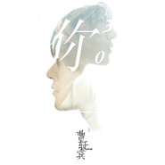

你的三次方
============================

|  |  |
| :--: | :-- |
| [ 你的三次方](https://emumo.xiami.com/album/500651) | **艺人**: [曹轩宾](../index.md) **语种**: 国语 **唱片公司**: 海蝶音乐 **发行时间**: 2012年05月09日 **专辑类别**: EP, 单曲 **专辑风格**: 国语流行 Mandarin Pop, 华语唱作人 Chinese Singer-Songwriter **播放数**: 2526091 **收藏数**: 879 **评论数**: 288  |

## 简介

金牌制作人曹轩宾转战台前　首部作品新编EP
 

30岁男人的情感内质 三首为“你”写的歌 独自走过却与你有关的三段历程 
 

唯有曹轩宾    掏心唱歌给你听  
  
沉潜流行乐坛十年，从一枚年轻歌手成为资深音乐制作人，30过后以歌手身份重新启程，这不但来自于他执着到骨血的理想，更来自于他生为歌者的舞台感染力。用一首又一首细腻深情、打动人心的代表作让更多人爱上他的声音，爱上他让人身心共鸣的音乐魅力。从非同凡响冠军，到歌声传奇红人，再成为海蝶正式签约歌手，曹轩宾用实力和努力证明了如何在艰难的音乐之路上，一步步走出自己始终如一的音乐理想。
 
  

<strong>《当我不在你身边》  一个30岁男人对于旧爱未能说过的话</strong>  

 

如果再给你一次 与多年前相爱过的人面对面的机会
 

你会对他（她）说些什么
 

即使你知道，什么也无法挽回你们的过去
 
  

作为曹轩宾转战台前，再次以歌手身份启程后的首张EP，是一部曹轩宾用心挑选的作品新编，这不但是他用自己的方式对从前的一种回顾告别，也是对于未来的全新开始。曹轩宾亲赴新加坡为EP三首作品重新编配，并邀请来曾与孙燕姿、莫文蔚、张学友、张惠妹等华语巨星合作过的流行编曲大师Terence Teo为EP编曲。颠覆原有听觉印象，将温柔、安静自然的情歌质地淋漓展现。全面解析一个30岁男人的情感内质。
 

EP收录《当我不在你身边》、《可惜不是你》、《如果你爱我》，作为写给“你”的三首歌，同时将配合三支分别独立又贯穿统一的MV故事，讲述告别一段感情所经历的三段历程。虽然在编曲和唱腔方面有极大改变，但不变的依然是那个掏心唱歌给你听的曹轩宾，唯有他，将带你重回内心深处那些应该割舍，却无法割舍的秘密之地。
 
  

30而立，他音乐的编曲安宁又动人，这不仅是因为他身为音乐制作人，对自己的音乐有清醒的判断；他更清楚知道这个音乐故事是讲给谁听，他（她）们需要怎样的音乐。为此他2012年的整个春节都远赴新加坡为这首歌重新录制、编曲制作。在除夕合家团圆的整整一个夜晚，一个人坐在漆黑的海岸边清晰勾勒出他全新作品的样子。他说虽然那一刻无比孤独，可是也因为能够清醒着，感觉到前所未有的快乐。
 
  

不只在于这样的一把好声音，亲近在你的耳膜之内，又尽显他独有的温柔沧桑。让人听过之后浑身汗毛竖立，却自然为他敞开心门。《当我不在你身边》 是他用音乐讲述的第一个故事，也是我们完成对自己、对旧爱宽恕的第一课。 这是注定不再逃避，决心做一次对往事翻箱倒柜般的彻底搜寻。把过去悉心整理，分类。找出那些让我们日渐疏离的原因，不再被怨恨蒙蔽，不再被遗憾纠缠。至少，丢过一次真爱让我们学会更多，正确面对下一个不想再失去的人。让爱不再战败，这至少算是对于从前的一种弥补。
 
  

他是这样把音乐当作像恋人一样的音乐人，毫无保留地讲述自己的故事，也替别人讲述内心中需要被释放的情绪。在经过了时间对自己的改变之后，在越过了30而立的成熟台阶之后，他在音乐中说出了，对旧爱未能说出的话：
 
  

“在30岁过后与你分别的日子里，我大多数时间都深陷回想与有关的时光里。爱，是一次从幻想前往现实，却最终回到记忆的旅程。 答应我，快乐一点。”
 
  

<strong>全新编配《可惜不是你》  临睡前最值得深度聆听的歌</strong>  
  
对你最后的爱 是盼望未来有一个人 
 

他能给你我所不能给的一切
 

时间，最终会让再多的怨念和遗憾都消失
 

痛苦，并不是爱存在的目的  
 
  

在此张标志着曹轩宾歌手生涯再次开启的全新作品新编EP中，他邀请来为张惠妹、孙燕姿、莫文蔚、张学友等华语巨星打造过作品的流行编曲大师Terence Teo为EP编曲。让他之前的音乐作品无论从唱腔、编曲都被赋予了与以往不同，更加有完整性的温柔安宁聆听感。一贯深受玉置浩二音乐影响的曹轩宾表示，希望能做出像玉置浩二式的毫无瑕疵，也令自己再无遗憾的作品质地，向从前做出完美的告别。
 
  

整张EP并不仅仅是写给“你”的三首歌，它是30岁过后男人对于爱情经历撕心裂肺后的一次全新领悟，告诉你真正放下一段感情似乎需要经历的三段历程。
 
  

无论你听过多少个版本的《可惜不是你》，都无法让你拒绝来自曹轩宾全新编配的《可惜不是你》。经历幕后10年沉潜，曹轩宾再次转战台前，首张作品新编，其中《可惜不是你》必定是他个人作品中无法被忽略的首推之选。全新版本《可惜不是你》在唱法上回归低吟浅唱的叙事说话风格；编曲方面也极尽清透干净质感，是一首更适合在夜晚临睡前深度聆听的歌。
 
  

作为自己音乐制作人的曹轩宾表示，把从前的歌做成区别于以往太过悲情的风格，是因为自己有段时间的严重失眠，每当在夜深人静之时却思绪更重，音乐成为了自己唯一的解药，无论凌晨几点，只要打开琴键唱完几首歌，便会发觉这样的方式可以获得心理上的安慰安静。既然带着情绪便无法入睡，不如在失眠的夜晚找这样几首歌把情绪释放出来。在30过后，终于等到时间让自己想通了很多事，才能用这样温润的方式来对待现在的自己。
 
  

《可惜不是你》是他用音乐讲述的第二个故事，为什么爱情在最初遇见时的快乐和幸福会悄悄消失在日复一日的日子里，是我们太过习惯才忽略它，还是我们都把爱想象的过于坚强，又或者，在不对的时间里相爱，那个人无论多完美都还是错的人。曹轩宾的音乐是一种探究，探究每个人深藏在心中的秘密，他用音乐告诉听歌的人，当你只有把那些秘密解开，我们才会获得自由。一种不仅仅是通往未来，更是可以从容回到过去的自由。 
 
  

<strong>曹轩宾作品新编    完结篇《如果你爱我》</strong>  
  
赴美制作间隙偶然之作 深入云南无人区拍摄《如果你爱我》绝美MV  
 

遗憾的是，我再也无法拥有你
 

但幸福是，想起你，就能让我想起所有关于爱情的事
 
  

沉潜幕后十年，曹轩宾再次以歌手身份启程后的首张EP，这张作品新编是他用自己的方式对从前的一种回顾告别和开始。曹轩宾亲赴新加坡为EP三首作品重新编配，并邀请来曾与孙燕姿、莫文蔚、张学友、张惠妹等华语巨星合作过的流行编曲大师Terence Teo为EP编曲。颠覆原有听觉印象，将温柔、安静自然的情歌质地淋漓展现。全面解析一个30岁男人的情感内质。
 
  

EP收录《当我不在你身边》、《可惜不是你》、《如果你爱我》，每首歌中都存在的“你”是贯穿整张EP的人物线索，EP顾名思义是写给“你”的三首歌，也将有三支分别独立又贯穿统一的MV故事，讲述告别一段感情所经历的三段历程。虽然在编曲和唱腔方面有极大改变，但不变的依然是那个掏心唱歌给你听的曹轩宾。
 
  

完结篇《如果你爱我》从感伤的色调缓缓渐进为温暖安慰，让这张EP终止在一种充满期待又美好甜蜜的氛围中。这首歌是曹轩宾在美国制作音乐时的偶然之得。在飞机上跨越浩瀚太平洋，这首歌的第一句就连词带曲自然而然出现在脑海中。整首歌在美国完成demo，只用了不到两天的时间。这首歌其实是写给那些始终对于爱情抱有期待的人，大多时候，我们之所以能够一个人坚持走过很多孤单的日子，的确是凭借一种虽然看似渺茫但却能像光芒一样让人前进下去的希望。它在幻想中是很美的，像万米高空时看到的白云和大海，让人充满喜悦。
 
  

为了完成这首歌的MV拍摄，曹轩宾及工作人员共同深入云南无人区取景拍摄《如果你爱我》，途径喜洲、洱海等依旧保持云南当地淳朴风貌的地方，在洱海拍日出的一场戏中，零下十多摄氏度的气温着实让所有人都快被冻到僵硬，但是面对洱海一片纯洁安宁的景致，曹轩宾在现场最终情绪失控，不能自已。他说当人在城市里住太久，心每天在日服一如的压力中变得无比强悍起来，可是终究有一天你能逃开这一切被那种更加有人情味和原生态的自然感动时，心里最坚硬的东西就会瞬间被击溃，让人看清自己的脆弱。去云南对自己来说，的确就像是一次治愈。也希望这支记录了洱海日出、小城日落的MV让大家感受到那种自然放松的感觉。
 
  

《如果你爱我》是音乐录影带里的第三个故事。痛苦绝对不是爱存在的目的，无论是正在相爱的两个人，或已经分离，亦或只是一段静悄悄的暗恋，爱无论如何都是应给我们希望，哪怕是在那一段旅程的终点，透过那些看似残酷的结尾，我们已看清了另一个不一样的自己，内心得以宽阔。

## 曲目

## 评论

|  |  |  |  |
| :-- | :-- | :-- | :-- |
|  [虾米用户](https://emumo.xiami.com/u/445142161) 世事如行云流水，生活切简... 2020-12-16 07:30 赞(1) 踩(0) | 
好听的歌曲
 |
|  [虾米用户](https://emumo.xiami.com/u/2120603)   2015-08-24 17:03 赞(0) 踩(0) | 
制作的很差的一张EP  三首歌是剪成三个音轨的  这三首的头尾可以连起来
 |
|  [虾米用户](https://emumo.xiami.com/u/2934955)  2015-06-10 12:48 赞(0) 踩(0) | 
KTV深情咏唱
 |
|  [虾米用户](https://emumo.xiami.com/u/2934955)  2015-06-10 12:41 赞(0) 踩(0) | 
KTV深情咏唱
 |
|  [虾米用户](https://emumo.xiami.com/u/49269584)  2015-05-13 13:10 赞(0) 踩(0) | 
想哭
 |
|  [虾米用户](https://emumo.xiami.com/u/11053001) love. music. 2015-04-22 20:55 赞(0) 踩(0) | 
很少听得到这样走心的音乐
 |
|  [虾米用户](https://emumo.xiami.com/u/21384054)  2015-04-05 07:10 赞(0) 踩(0) | 
请你要拒绝
 |
|  [虾米用户](https://emumo.xiami.com/u/763459) (๑•̀ㅁ•́ฅ)嗷呜 2015-02-21 20:26 赞(0) 踩(0) | 
封面不错
 |
|  [虾米用户](https://emumo.xiami.com/u/2502580)  2014-12-06 06:48 赞(0) 踩(0) | 
好听！
 |
|  [虾米用户](https://emumo.xiami.com/u/32077997)  2014-10-27 10:10 赞(0) 踩(0) | 
心碎的人听心碎的歌！
 |
|  [虾米用户](https://emumo.xiami.com/u/3536526) Hey...音乐，一直在 2014-09-22 20:43 赞(0) 踩(0) | 
..
 |
|  [虾米用户](https://emumo.xiami.com/u/5840413)  2014-07-11 10:55 赞(0) 踩(0) | 
goodd
 |
|  [虾米用户](https://emumo.xiami.com/u/22227190) 暂无签名~ 2014-06-10 20:30 赞(0) 踩(0) | 
感人
 |
|  [虾米用户](https://emumo.xiami.com/u/156924) 酷炫到自己不能忍 2013-11-11 23:33 赞(0) 踩(0) | 
唱到心碎
 |
|  [虾米用户](https://emumo.xiami.com/u/11202397)  2013-05-28 00:09 赞(0) 踩(0) | 
只为那首“可惜不是你”……
 |
|  [虾米用户](https://emumo.xiami.com/u/6890016) 在海里... 2013-05-13 11:19 赞(0) 踩(0) | 
1～2～3
 |
|  [虾米用户](https://emumo.xiami.com/u/9477820)  2013-01-24 11:52 赞(0) 踩(0) | 
a
 |
|  [虾米用户](https://emumo.xiami.com/u/8152213)  2013-01-13 23:58 赞(0) 踩(0) | 
静静心
 |
|  [虾米用户](https://emumo.xiami.com/u/4155991) Lieeeeeeeees 2012-12-31 14:48 赞(0) 踩(0) | 
2012年 101首金曲跨年倒数 54名
 |
|  [虾米用户](https://emumo.xiami.com/u/10490960)  2012-12-12 11:28 赞(0) 踩(0) | 
老曹的深情。。。
 |
|  [虾米用户](https://emumo.xiami.com/u/5399503) 有的人来到你身边，是告诉... 2012-11-19 13:04 赞(0) 踩(0) | 
治愈系，适合一个人的时候听，听他的歌就是想静下心来好好享受这温柔深情的声音。
 |
|  [虾米用户](https://emumo.xiami.com/u/5399503) 有的人来到你身边，是告诉... 2012-11-18 07:50 赞(0) 踩(0) | 
声音好治愈，非常实力，果然厉害，虽然30了才自己出专辑，但积累了这么多经验和实力很值得啊，才能有这么惊艳的出场，一直支持，加油啊~咱们华语乐坛正蒸蒸日上
 |
|  [虾米用户](https://emumo.xiami.com/u/10182573)  2012-08-23 12:49 赞(0) 踩(0) | 
百听不厌的三首好作品
 |
|  [虾米用户](https://emumo.xiami.com/u/8451892)  2012-08-20 22:25 赞(0) 踩(0) | 
还蛮有感觉的说
 |
|  [虾米用户](https://emumo.xiami.com/u/1093077) 暂无签名~ 2012-08-08 18:11 赞(1) 踩(0) | 
已经很少听国内的歌手了，偶然一次机会看到歌声传奇里他唱的歌，完全听傻了，把感情和技巧融合的如此完美，无懈可击，加油！相信你一定可以创造出很多很多的经典！
 |
| ⇒ |  [虾米用户](https://emumo.xiami.com/u/380617)  2013-05-21 15:14 赞(0) 踩(0) | 
还是live更带感
 |
|  [虾米用户](https://emumo.xiami.com/u/9813486)  2012-08-02 22:56 赞(0) 踩(0) | 
可惜不是你
 |
|  [虾米用户](https://emumo.xiami.com/u/2840495)  2012-08-02 18:45 赞(0) 踩(0) | 
感动
 |
|  [虾米用户](https://emumo.xiami.com/u/9638727)  2012-07-24 23:19 赞(0) 踩(0) | 
适合静静的跟着唱。
 |
|  [虾米用户](https://emumo.xiami.com/u/1205868)  2012-07-18 23:46 赞(0) 踩(0) | 
如果可以,能赶紧结束嘛.如果可以,能就这样彼此自由嘛.如果可以,我们说好都不要不高兴嘛.就这样,习惯没有你的夜,习惯没有你的时间.
 |
|  [虾米用户](https://emumo.xiami.com/u/1732256)  2012-06-27 11:18 赞(0) 踩(0) | 
内地创作歌手 30岁出道 用自己的感受重新诠释了曾经创作的歌曲
 |
|  [虾米用户](https://emumo.xiami.com/u/9556330)  2012-06-23 09:57 赞(0) 踩(0) | 
棒
 |
|  [虾米用户](https://emumo.xiami.com/u/1675406)  2012-06-22 09:01 赞(0) 踩(0) | 
肿么了。。。。我又开始听伤感系了。。。
 |
|  [虾米用户](https://emumo.xiami.com/u/870718)  2012-06-12 06:50 赞(0) 踩(0) | 
另一版本，不同感觉
 |
|  [虾米用户](https://emumo.xiami.com/u/9447592)  2012-06-12 00:07 赞(0) 踩(0) | 
虾米
 |
|  [虾米用户](https://emumo.xiami.com/u/2370280)  2012-06-02 19:31 赞(0) 踩(0) | 
难抽离..
 |
|  [虾米用户](https://emumo.xiami.com/u/1230721)   2012-05-27 14:48 赞(0) 踩(0) | 
忧伤系！听着他的歌声，想逃离世界，想与世隔绝，然后暂时存活在曾经我们的记忆里！
 |
|  [虾米用户](https://emumo.xiami.com/u/4029522)  2012-05-26 11:38 赞(0) 踩(0) | 
好喜欢他唱歌的忘我状态！！！
 |
|  [虾米用户](https://emumo.xiami.com/u/4029522)  2012-05-26 11:37 赞(0) 踩(0) | 
情真意切的感人演绎，令人感动......，好喜欢他唱歌的忘我状态！！！
 |
|  [虾米用户](https://emumo.xiami.com/u/9153794)  2012-05-18 19:00 赞(0) 踩(0) | 
如果那个他能在我面前唱我也要死掉了激动死的
 |
|  [虾米用户](https://emumo.xiami.com/u/3683375)  2012-05-18 18:30 赞(0) 踩(0) | 
大清早在床上听的突然飙泪，朋友进来问，只好假装掩饰说是在赖床听歌
 |
|  [虾米用户](https://emumo.xiami.com/u/8172334)  2012-05-18 17:13 赞(0) 踩(0) | 
拳
 |
|  [虾米用户](https://emumo.xiami.com/u/9023673)  2012-05-18 16:10 赞(0) 踩(0) | 
喜欢没道理
 |
|  [虾米用户](https://emumo.xiami.com/u/8323852)  2012-05-18 14:55 赞(0) 踩(0) | 
超级棒！支持才子曹轩宾！！！
 |
|  [虾米用户](https://emumo.xiami.com/u/9210349)  2012-05-18 14:54 赞(0) 踩(0) | 
喜欢他的声音可惜不是你很不1样的感觉
 |
|  [虾米用户](https://emumo.xiami.com/u/5014997) 吃货特征已经越来越明显了 2012-05-18 09:39 赞(0) 踩(0) | 
声音很美
 |
|  [虾米用户](https://emumo.xiami.com/u/4046128)   2012-05-18 09:12 赞(0) 踩(0) | 
可惜不是你
 |
|  [虾米用户](https://emumo.xiami.com/u/5874626)  2012-05-17 22:50 赞(0) 踩(0) | 
我觉得不是煽情。是有的时候，就是这么样想的，也想这么说的，不管男人还是女人。说出来了，听着免不掉俗，没有听到的，会期待某天能有机会听到。
 |
|  [虾米用户](https://emumo.xiami.com/u/8639799)  2012-05-17 15:19 赞(0) 踩(0) | 
@三次元格式化。。。。。。。。。我以为系你唱噶体到个名
 |
|  [虾米用户](https://emumo.xiami.com/u/1323428)  2012-05-16 20:18 赞(0) 踩(0) | 
我的妈啊····如果有个男人在我面前唱成这样，不是我死就是他死了！太煽情了····················
 |
|  [虾米用户](https://emumo.xiami.com/u/7865894)  2012-05-16 15:30 赞(0) 踩(0) | 
<a href="http://www.xiami.com/song/showcollect/id/11280003" target="_blank" rel="nofollow noreferrer noopener">http://www.xiami.com/song/showcollect/id/11280003</a>MV
 |
|  [虾米用户](https://emumo.xiami.com/u/2144283)  2012-05-16 13:27 赞(0) 踩(0) | 
希望能去掉那些做作感和模仿韩国人的痕迹。
 |
|  [虾米用户](https://emumo.xiami.com/u/6875500)   2012-05-16 10:48 赞(0) 踩(0) | 
男版可惜不是你太赞了～上午这样的歌声飘荡在房间里和我的心产生一阵阵共鸣～～
 |
|  [虾米用户](https://emumo.xiami.com/u/9173419)  2012-05-16 10:22 赞(0) 踩(0) | 
很不错很不错很不错很伤感很伤感很伤感
 |
|  [虾米用户](https://emumo.xiami.com/u/2457939) 我还没想好要写什么... 2012-05-16 09:51 赞(0) 踩(0) | 
SB2bder人
 |
|  [虾米用户](https://emumo.xiami.com/u/9188721)  2012-05-16 08:44 赞(0) 踩(0) | 
音感
 |
|  [虾米用户](https://emumo.xiami.com/u/4744376) 我还没想好要写什么... 2012-05-15 22:50 赞(0) 踩(0) | 
挺清新 但并听了之后没有特别深刻的印象（可能我没有相关个人情感融入吧??
 |
|  [虾米用户](https://emumo.xiami.com/u/1844492)  2012-05-15 22:00 赞(0) 踩(0) | 
慢慢的唱。。慢慢的诉说。。慢慢的流进心里。。。
 |
|  [虾米用户](https://emumo.xiami.com/u/1393938)  2012-05-15 12:18 赞(0) 踩(0) | 
掏心唱歌···
 |
|  [虾米用户](https://emumo.xiami.com/u/1378529)  2012-05-15 08:56 赞(0) 踩(0) | 
装
 |
|  [虾米用户](https://emumo.xiami.com/u/5613660)  2012-05-14 22:28 赞(1) 踩(0) | 
声音不错啦。可是怎么听都像是一个年过三十的男人在悔过。。。而且《可惜不是你》没有人能超越梁静茹！
 |
|  [虾米用户](https://emumo.xiami.com/u/1805547)  2012-05-14 20:32 赞(1) 踩(0) | 
從《非同凡響》接觸到曹軒賓，為之傾倒。我一直覺得國內流行樂壇沒幾個好的音樂人，關鍵原因就在於我們的土壤出不了優秀的作品，相反，口水歌卻到處氾濫，連綿不絕。所以我希望曹軒賓能堅持高端創作，寧缺毋濫，次次都出精品，假以時日，成就天皇巨星。
 |
|  [虾米用户](https://emumo.xiami.com/u/8190783) 我还没想好要写什么... 2012-05-14 13:47 赞(0) 踩(0) | 
赞
 |
|  [虾米用户](https://emumo.xiami.com/u/9168895)  2012-05-14 04:49 赞(0) 踩(0) | 
静静的1个人听的歌
 |
|  [虾米用户](https://emumo.xiami.com/u/2790263) 听歌杂.人混乱 2012-05-13 18:31 赞(0) 踩(0) | 
都是翻唱么？但是有改动啊..听起来都不错啊~
 |
| ⇒ |  [虾米用户](https://emumo.xiami.com/u/1536501) 陪我去看海 2012-05-14 11:19 赞(0) 踩(0) | 
亲 这不应该叫翻唱吧 这几首应该都是他的原作
 |
| ⇒ |  [虾米用户](https://emumo.xiami.com/u/2790263) 听歌杂.人混乱 2012-05-14 20:22 赞(0) 踩(0) | 
<q><b>俘虏恶魔的精灵说：</b></q>
 |
| ⇒ |  [虾米用户](https://emumo.xiami.com/u/1805547)  2012-05-14 22:01 赞(0) 踩(0) | 
<q><b>雜⑦紮八说：</b></q>
 |
| ⇒ |  [虾米用户](https://emumo.xiami.com/u/1536501) 陪我去看海 2012-05-14 22:38 赞(0) 踩(0) | 
<q><b>雜⑦紮八说：</b></q>
 |
| ⇒ |  [虾米用户](https://emumo.xiami.com/u/2790263) 听歌杂.人混乱 2012-05-15 11:58 赞(0) 踩(0) | 
<q><b>俘虏恶魔的精灵说：</b></q>
 |
|  [虾米用户](https://emumo.xiami.com/u/9163382)  2012-05-13 17:24 赞(0) 踩(0) | 
深情的打动了我
 |
|  [虾米用户](https://emumo.xiami.com/u/8327054) 暂无签名~ 2012-05-13 17:04 赞(0) 踩(0) | 
曹軒賓的歌聲滿溫暖的.....喜歡!!
 |
|  [虾米用户](https://emumo.xiami.com/u/3009832)  2012-05-13 13:46 赞(0) 踩(0) | 
我听到你了
 |
|  [虾米用户](https://emumo.xiami.com/u/3009832)  2012-05-13 13:45 赞(0) 踩(0) | 
我听到你了
 |
|  [虾米用户](https://emumo.xiami.com/u/4125781) 爱疯爱哭爱笑爱自己、 2012-05-13 13:05 赞(0) 踩(0) | 
喜欢没有理由、
 |
|  [虾米用户](https://emumo.xiami.com/u/6818930)  2012-05-13 10:39 赞(0) 踩(0) | 
曹轩宾唱可惜不是你的时候···很有感情··那情绪是在抒发自己的怀才不遇吗·？
 |
|  [虾米用户](https://emumo.xiami.com/u/9158264) 真假难辨，如何拧得清~ 2012-05-13 08:27 赞(0) 踩(0) | 
关于我和你的故事流淌
 |
|  [虾米用户](https://emumo.xiami.com/u/1203352)  2012-05-12 23:03 赞(0) 踩(0) | 
略带点嘶哑的声线，似乎在慢慢诉说着一段故事
 |
|  [虾米用户](https://emumo.xiami.com/u/9155369)  2012-05-12 22:25 赞(0) 踩(0) | 
好听
 |
|  [虾米用户](https://emumo.xiami.com/u/2732818) 这是啥- - 2012-05-12 19:32 赞(0) 踩(0) | 
声音不错 有感情
 |
|  [虾米用户](https://emumo.xiami.com/u/5552961) 我爱小清新民谣 2012-05-12 19:19 赞(0) 踩(0) | 
不错的
 |
|  [虾米用户](https://emumo.xiami.com/u/9143603)  2012-05-11 22:17 赞(0) 踩(0) | 
就像静静看着他们的故事
 |
|  [虾米用户](https://emumo.xiami.com/u/2626270)  2012-05-11 21:34 赞(0) 踩(0) | 
cd里曹的声音好了很多，好听。坚持梦想的人，支持。
 |
|  [虾米用户](https://emumo.xiami.com/u/9136243)  2012-05-11 20:58 赞(0) 踩(0) | 
还不错
 |
|  [虾米用户](https://emumo.xiami.com/u/6085188)  2012-05-11 19:54 赞(0) 踩(0) | 
喜欢他的声音！
 |
|  [虾米用户](https://emumo.xiami.com/u/2199250)  2012-05-11 19:45 赞(0) 踩(0) | 
很好……很有感觉……
 |
|  [虾米用户](https://emumo.xiami.com/u/8608767)  2012-05-11 17:07 赞(0) 踩(0) | 
你的三次方。。。
 |
|  [虾米用户](https://emumo.xiami.com/u/962146)  2012-05-11 13:56 赞(0) 踩(0) | 
终于出来了
 |
|  [虾米用户](https://emumo.xiami.com/u/1304012) 暂无签名~ 2012-05-11 00:57 赞(0) 踩(0) | 
某次听到他演唱的《可惜不是你》时，就被吸引住。也可能是本身对年纪较大的男人 声线的无抵抗。当知道他是《可惜不是你》的作曲人时，更是觉得欣喜。这样有才的人，怎能不叫人喜欢！
 |
|  [虾米用户](https://emumo.xiami.com/u/6361756)  2012-05-11 00:51 赞(0) 踩(0) | 
这张用心制作的EP必须推荐！特别适合深夜听！！！@罗雨媚Yummy
 |
|  [虾米用户](https://emumo.xiami.com/u/1266091)  2012-05-10 22:48 赞(0) 踩(0) | 
深夜 只剩用心唱歌的人。
 |
|  [虾米用户](https://emumo.xiami.com/u/355865) Let it go, l... 2012-05-10 22:38 赞(1) 踩(0) | 
整张专辑很连贯（虽然只有三首歌），风格统一，连在一起听就像一整首组曲一样，非常好！但是——老曹这种风格很容易腻的，建议拓宽些思路创作一些其他风格的歌曲尝试一下～
 |
|  [虾米用户](https://emumo.xiami.com/u/355865) Let it go, l... 2012-05-10 22:38 赞(0) 踩(0) | 
整张专辑很连贯（虽然只有三首歌），风格统一，连在一起听就像一整首组曲一样，非常好！但是——老曹这种风格很容易腻的，建议拓宽些思路创作一些其他风格的歌曲尝试一下～
 |
|  [虾米用户](https://emumo.xiami.com/u/1695635)  2012-05-10 21:50 赞(0) 踩(0) | 
倒是挺适合夜晚听听
 |
|  [虾米用户](https://emumo.xiami.com/u/7303066) 只要你平安归来就够浪漫 2012-05-10 20:04 赞(0) 踩(0) | 
当我不在你身边，我很难过，因为身边的人不是你。好想和你有个圆满结局。可惜都已是物是人非。不停的疼，不停的和你说，可你再也听不见了
 |
|  [虾米用户](https://emumo.xiami.com/u/7227775)  2012-05-10 19:36 赞(0) 踩(0) | 
如果。。。没有如果。
 |
|  [虾米用户](https://emumo.xiami.com/u/9132832)  2012-05-10 18:29 赞(0) 踩(0) | 
哇
 |
|  [虾米用户](https://emumo.xiami.com/u/6361756)  2012-05-10 14:33 赞(0) 踩(0) | 
老曹做的歌不用多说什么！赞
 |
|  [虾米用户](https://emumo.xiami.com/u/1166395)  2012-05-10 12:51 赞(0) 踩(0) | 
看成你的三次元
 |
|  [虾米用户](https://emumo.xiami.com/u/4471464)  2012-05-10 12:42 赞(0) 踩(0) | 
喜欢这个声音
 |
|  [虾米用户](https://emumo.xiami.com/u/9012539)  2012-05-10 12:20 赞(0) 踩(0) | 
静静的听
 |
|  [虾米用户](https://emumo.xiami.com/u/4788608) 世界太小，無處可滾。 2012-05-10 11:00 赞(0) 踩(0) | 
我考慮過會兒聽下林宥嘉，自己心酸下。
 |
|  [虾米用户](https://emumo.xiami.com/u/9105039)  2012-05-10 10:30 赞(0) 踩(0) | 
很好听很贴近灵魂希望你能幸福
 |
|  [虾米用户](https://emumo.xiami.com/u/5429831) ♦ 2012-05-10 08:22 赞(0) 踩(0) | 
触...
 |
|  [虾米用户](https://emumo.xiami.com/u/301218) 一瓢江湖~我沉浮 2012-05-10 07:12 赞(0) 踩(0) | 
都不错听，可惜没有特别动心的感觉哟
 |
|  [虾米用户](https://emumo.xiami.com/u/8697077)  2012-05-10 00:16 赞(0) 踩(0) | 
加油！！！！！！！！！
 |
|  [虾米用户](https://emumo.xiami.com/u/2644812)  2012-05-09 21:26 赞(0) 踩(0) | 
可惜不是你听得有点儿要喘不上来气儿了……
 |
|  [虾米用户](https://emumo.xiami.com/u/3423987) 我还没想好要写什么... 2012-05-09 21:18 赞(0) 踩(0) | 
封面好熟悉 好像在哪见过的感觉
 |
|  [虾米用户](https://emumo.xiami.com/u/5026326) 爱唱歌的孩子都是好孩子～ 2012-05-09 19:27 赞(0) 踩(0) | 
曹轩宾加油~
 |
|  [虾米用户](https://emumo.xiami.com/u/1157496)  2012-05-09 17:48 赞(0) 踩(0) | 
老曹,加油~~
 |
|  [虾米用户](https://emumo.xiami.com/u/3486036) 当青春不再拥有！ 2012-05-09 16:36 赞(0) 踩(0) | 
比较喜欢他
 |
|  [虾米用户](https://emumo.xiami.com/u/6833032)  2012-05-09 16:08 赞(0) 踩(0) | 
不大喜欢《可惜不是你》这个版本的编曲，还是比较喜欢之前他在浙江卫视上钢琴弹唱的那个版本
 |
|  [虾米用户](https://emumo.xiami.com/u/2776203)  2012-05-09 15:29 赞(0) 踩(0) | 
心软的人是可以听听这一张的。
 |
|  [虾米用户](https://emumo.xiami.com/u/7209243) 她的生命如此灿烂…… 2012-05-09 14:54 赞(1) 踩(0) | 
尽管有翻唱，但还是可以扣人心弦的，深入心底
 |
|  [虾米用户](https://emumo.xiami.com/u/5891791)  2012-05-09 13:11 赞(0) 踩(0) | 
还是最喜欢第二首
 |
|  [虾米用户](https://emumo.xiami.com/u/9121661)  2012-05-09 12:58 赞(0) 踩(0) | 
清新
 |
|  [虾米用户](https://emumo.xiami.com/u/6251388)  2012-05-09 12:37 赞(0) 踩(0) | 
尼玛~ 打1分的 拖 出去喂狗
 |
|  [虾米用户](https://emumo.xiami.com/u/2527832) 超越生命 解放自由 2012-05-09 11:31 赞(0) 踩(0) | 
好聲音,軒賓和陳奕迅一樣,是一個能讀懂歌詞的人,感動了多少人的心靈啊!
 |
|  [虾米用户](https://emumo.xiami.com/u/494539)   2012-05-09 11:21 赞(0) 踩(0) | 
弥 /  3  / 。
 |
|  [虾米用户](https://emumo.xiami.com/u/4275776) 虾米音质检测督查账号 2012-05-09 10:59 赞(0) 踩(0) | 
曹轩宾的正式EP今天发行了！合格320K！希望大家多支持~
 |
|  [虾米用户](https://emumo.xiami.com/u/2756640) 免得你带着明眸皓齿装饰我 2012-04-30 19:43 赞(0) 踩(0) | 
要睡好。这是最基本的关乎人生前进的要求之一。
 |
|  [虾米用户](https://emumo.xiami.com/u/8946)  2012-04-28 23:17 赞(0) 踩(0) | 
如果再给你一次 与多年前相爱过的人面对面的机会，你会对他（她）说些什么？
 |
|  [虾米用户](https://emumo.xiami.com/u/6707624)  2012-04-09 09:10 赞(0) 踩(0) | 
清澈的男音
 |
|  [虾米用户](https://emumo.xiami.com/u/8760162)  2012-04-06 13:10 赞(0) 踩(0) | 
一个30岁男人对于旧爱未能说过的话如果再给你一次与多年前相爱过的人面对面的机会你会对他她说些什么
 |
|  [虾米用户](https://emumo.xiami.com/u/8758690)  2012-04-06 11:11 赞(0) 踩(0) | 
好听
 |
|  [虾米用户](https://emumo.xiami.com/u/4806257) 讌儿 2012-04-06 11:00 赞(0) 踩(0) | 
用心 用情
 |
|  [虾米用户](https://emumo.xiami.com/u/6995480)  2012-04-03 19:56 赞(0) 踩(0) | 
一个用心歌唱的好声音，这歌非常感人，特别适合一个人时来听
 |
|  [虾米用户](https://emumo.xiami.com/u/8616596)  2012-03-27 15:20 赞(0) 踩(0) | 
一个用心歌唱的好声音，这歌非常感人，特别适合一个人时来听
 |
|  [虾米用户](https://emumo.xiami.com/u/8616525)  2012-03-27 15:20 赞(0) 踩(0) | 
如果再给你一次 与多年前相爱过的人面对面的机会你会对他（她）说些什么
 |
|  [虾米用户](https://emumo.xiami.com/u/3013091)  2012-03-26 05:53 赞(0) 踩(0) | 
I like the voice !!!!
 |
|  [虾米用户](https://emumo.xiami.com/u/8571023)  2012-03-24 13:53 赞(0) 踩(0) | 
我喜欢他的声音。
 |
|  [虾米用户](https://emumo.xiami.com/u/7759221) 文艺徐娘 2012-03-23 23:45 赞(0) 踩(0) | 
如果当初知道，终有一天我们会成为陌路，那我会选择在有限的时光赠与你全部的温柔……
 |
|  [虾米用户](https://emumo.xiami.com/u/8563621)  2012-03-23 23:07 赞(0) 踩(0) | 
听过他在歌声传奇里的表演.不错.可总觉得有点过.单曲有些平淡.好听可无味.经典总是难寻的.加油吧！！！！！
 |
|  [虾米用户](https://emumo.xiami.com/u/3879991) 我还没想好要写什么... 2012-03-23 22:01 赞(0) 踩(0) | 
这长相。。。不是谢霆锋么。。。
 |
|  [虾米用户](https://emumo.xiami.com/u/5450880)  2012-03-23 21:49 赞(0) 踩(0) | 
平平淡淡
 |
|  [虾米用户](https://emumo.xiami.com/u/8561384)  2012-03-23 20:58 赞(0) 踩(0) | 
。。。
 |
|  [虾米用户](https://emumo.xiami.com/u/7055151)  2012-03-23 20:25 赞(0) 踩(0) | 
短短一天的好天气又被今天的雨冲的心情潮湿，红色鞋头还是照旧湿了，那就让它湿的彻底，躲进麦当劳后太阳又开玩笑的出来了，像猫一样懒散的爬桌上闲会，昨晚熬夜建模，嘴角起了泡，现在咖啡就这这首歌
 |
|  [虾米用户](https://emumo.xiami.com/u/8181622)  2012-03-23 16:01 赞(0) 踩(0) | 
安静的诉说  男人温柔声音
 |
|  [虾米用户](https://emumo.xiami.com/u/8556533)  2012-03-23 15:28 赞(0) 踩(0) | 
感觉良
 |
|  [虾米用户](https://emumo.xiami.com/u/8555497)  2012-03-23 14:02 赞(0) 踩(0) | 
喜欢就是喜欢啊
 |
|  [虾米用户](https://emumo.xiami.com/u/4788608) 世界太小，無處可滾。 2012-03-23 12:19 赞(0) 踩(0) | 
下午搬家。中午醒酒。
 |
|  [虾米用户](https://emumo.xiami.com/u/8553381)  2012-03-23 11:34 赞(0) 踩(0) | 
好听啊
 |
|  [虾米用户](https://emumo.xiami.com/u/6843379)  2012-03-23 11:34 赞(0) 踩(0) | 
还不错哦。
 |
|  [虾米用户](https://emumo.xiami.com/u/7252584) 新的梦想 2012-03-23 09:47 赞(0) 踩(0) | 
太口水
 |
|  [虾米用户](https://emumo.xiami.com/u/7252584) 新的梦想 2012-03-23 09:47 赞(0) 踩(0) | 
看到这个封面以为是谢霆锋呢，结果。。。音乐一般般吧
 |
| ⇒ |  [虾米用户](https://emumo.xiami.com/u/319923) 也爱做小日日啊 2012-03-23 17:21 赞(0) 踩(0) | 
呵呵，我也以为是谢
 |
|  [虾米用户](https://emumo.xiami.com/u/6291602) 敬天爱人 2012-03-23 00:24 赞(0) 踩(0) | 
听这首歌，一个强烈的感觉：整个歌都想表达一种感动，唱的也是努力地想感动听众，但当我静静的沉下来想投入进去的时候，发现无法 被感动。  少了灵魂深处的一种厚重与安心，只是表面的感动。 与歌者的自身思想或思考状态有关吧
 |
|  [虾米用户](https://emumo.xiami.com/u/307718) 我还没想好要写什么... 2012-03-22 22:34 赞(0) 踩(0) | 
最近没心没肺
 |
|  [虾米用户](https://emumo.xiami.com/u/307718) 我还没想好要写什么... 2012-03-22 22:34 赞(0) 踩(0) | 
最近没心没肺
 |
|  [虾米用户](https://emumo.xiami.com/u/8546746)  2012-03-22 21:29 赞(0) 踩(0) | 
有些人 一旦错过就不在...没有未完的故事 只有未死的心
 |
|  [虾米用户](https://emumo.xiami.com/u/8540095)   2012-03-22 17:28 赞(0) 踩(0) | 
..
 |
|  [虾米用户](https://emumo.xiami.com/u/8542976)  2012-03-22 16:51 赞(0) 踩(0) | 
亲~~~
 |
|  [虾米用户](https://emumo.xiami.com/u/95514)   2012-03-22 13:33 赞(0) 踩(0) | 
很久很听这样的抒情歌，有点小感触
 |
|  [虾米用户](https://emumo.xiami.com/u/6686078)  2012-03-22 11:20 赞(0) 踩(0) | 
+1
 |
|  [虾米用户](https://emumo.xiami.com/u/6686078)  2012-03-22 11:20 赞(0) 踩(0) | 
+1
 |
|  [虾米用户](https://emumo.xiami.com/u/6686078)  2012-03-22 11:19 赞(0) 踩(0) | 
+1
 |
|  [虾米用户](https://emumo.xiami.com/u/6686078)  2012-03-22 11:19 赞(0) 踩(0) | 
+1
 |
|  [虾米用户](https://emumo.xiami.com/u/6686078)  2012-03-22 11:19 赞(0) 踩(0) | 
+1
 |
|  [虾米用户](https://emumo.xiami.com/u/6686078)  2012-03-22 11:19 赞(0) 踩(0) | 
+1
 |
|  [虾米用户](https://emumo.xiami.com/u/6686078)  2012-03-22 11:19 赞(0) 踩(0) | 
+1
 |
|  [虾米用户](https://emumo.xiami.com/u/6686078)  2012-03-22 11:19 赞(0) 踩(0) | 
+1
 |
|  [虾米用户](https://emumo.xiami.com/u/6686078)  2012-03-22 11:19 赞(0) 踩(0) | 
+1
 |
|  [虾米用户](https://emumo.xiami.com/u/6686078)  2012-03-22 11:19 赞(0) 踩(0) | 
+1
 |
|  [虾米用户](https://emumo.xiami.com/u/6686078)  2012-03-22 11:19 赞(0) 踩(0) | 
+1
 |
|  [虾米用户](https://emumo.xiami.com/u/2870426)  2012-03-22 10:29 赞(0) 踩(0) | 
音乐才子
 |
|  [虾米用户](https://emumo.xiami.com/u/167668) 疯疯癫癫，玩玩闹闹 2012-03-22 08:56 赞(0) 踩(0) | 
因为给我们宏迷写的“爱因为在心中”而认识曹轩宾，喜欢他的声音呢！
 |
|  [虾米用户](https://emumo.xiami.com/u/5530253)  2012-03-22 00:14 赞(0) 踩(0) | 
当你不在我身边，我一个人吃饭，一个人看电视，一个人走在异国他乡的路上，但我还是有好好吃饭睡觉，好好照顾疼爱自己，为了你，他和自己。谢谢爸爸妈妈，当我的生命可以有新的体验，给我去尝试的机会。在即将回去的日子里，我感觉的只有庆幸，没有后悔。每一次听着曹轩宾的歌，我总觉得他是在和我说话，我能够感受到他所要说的。谢谢。
 |
|  [虾米用户](https://emumo.xiami.com/u/8535292)  2012-03-22 00:06 赞(0) 踩(0) | 
我不在你身边，距离越来越远
 |
|  [虾米用户](https://emumo.xiami.com/u/8530445)  2012-03-21 23:00 赞(0) 踩(0) | 
唤起了自己曾经的记忆，很好
 |
|  [虾米用户](https://emumo.xiami.com/u/3288490) 更行更远还生 2012-03-21 22:26 赞(0) 踩(0) | 
的确有点像王力宏，但是很有特色
 |
|  [虾米用户](https://emumo.xiami.com/u/1516055)  2012-03-21 22:19 赞(0) 踩(0) | 
这完全就是一个闷骚的男人在独自**枪的时候发出的低吼。
 |
|  [虾米用户](https://emumo.xiami.com/u/23628)  2012-03-21 21:48 赞(0) 踩(0) | 
确实有点王力宏的味道~但是王力宏风格比较多样
 |
|  [虾米用户](https://emumo.xiami.com/u/7703606)  2012-03-21 21:30 赞(0) 踩(0) | 
多么像王力宏的唱腔啊~
 |
| ⇒ |  [虾米用户](https://emumo.xiami.com/u/355865) Let it go, l... 2012-03-22 05:53 赞(0) 踩(0) | 
他是王力宏的歌迷啊~
 |
|  [虾米用户](https://emumo.xiami.com/u/7655432)  2012-03-21 21:28 赞(0) 踩(0) | 
这首歌当初在芒果台的非同凡响中他声嘶力竭的演绎，我至今印象很深
 |
|  [虾米用户](https://emumo.xiami.com/u/8497216)  2012-03-21 20:56 赞(0) 踩(0) | 
答应我用心去飞。曹轩宾加油
 |
|  [虾米用户](https://emumo.xiami.com/u/8531258)  2012-03-21 20:30 赞(0) 踩(0) | 
gs. 答應我 就讓我這樣愛你 等你
 |
|  [虾米用户](https://emumo.xiami.com/u/8097115)  2012-03-21 20:05 赞(0) 踩(0) | 
很有才华的，唱腔不喜欢，太花了
 |
|  [虾米用户](https://emumo.xiami.com/u/3035647)  2012-03-21 19:51 赞(0) 踩(0) | 
可惜不是你
 |
|  [虾米用户](https://emumo.xiami.com/u/8520837)  2012-03-21 18:26 赞(0) 踩(0) | 
这个男人的歌让我扛不住。
 |
|  [虾米用户](https://emumo.xiami.com/u/8527444)  2012-03-21 15:25 赞(0) 踩(0) | 
全能艺人  从非同凡响里认识他的
 |
|  [虾米用户](https://emumo.xiami.com/u/152262)  2012-03-21 15:20 赞(0) 踩(0) | 
怎么这么像谢霆锋
 |
|  [虾米用户](https://emumo.xiami.com/u/6233569)   2012-03-21 15:19 赞(0) 踩(0) | 
30岁的男人，魅力无限！
 |
|  [虾米用户](https://emumo.xiami.com/u/8087333)  2012-03-21 15:11 赞(0) 踩(0) | 
“当我不在你身边 答应我勇敢去飞 生命若有新体验 你别拒绝”
 |
|  [虾米用户](https://emumo.xiami.com/u/6233569)   2012-03-21 14:54 赞(0) 踩(0) | 
真棒，为什么听到他的歌总是那么有共鸣！总能触碰心里最柔软的地方，我想这就是一个30岁男人该有的魅力吧！加油，曹轩宾！期待你的专辑！
 |
|  [虾米用户](https://emumo.xiami.com/u/8190783) 我还没想好要写什么... 2012-03-21 12:02 赞(0) 踩(0) | 
+1
 |
|  [虾米用户](https://emumo.xiami.com/u/4806257) 讌儿 2012-03-21 09:41 赞(0) 踩(0) | 
用心唱的歌要用心听才能体会。。。。。。
 |
|  [虾米用户](https://emumo.xiami.com/u/7966784) 我が生涯に一片の悔い無し... 2012-03-21 07:47 赞(0) 踩(0) | 
静静的，轻轻地，很动人~
 |
|  [虾米用户](https://emumo.xiami.com/u/4804) 签~啊名~啊~签了个名 2012-03-21 05:53 赞(0) 踩(0) | 
第一遍听很安静。嗯。
 |
|  [虾米用户](https://emumo.xiami.com/u/8300788)  2012-03-21 02:38 赞(0) 踩(0) | 
听着玩！
 |
|  [虾米用户](https://emumo.xiami.com/u/3828964)  2012-03-21 00:55 赞(0) 踩(0) | 
我一直在
 |
|  [虾米用户](https://emumo.xiami.com/u/15002)  2012-03-21 00:34 赞(0) 踩(0) | 
没有和曾一鸣对抗时唱的好
 |
|  [虾米用户](https://emumo.xiami.com/u/5460878)  2012-03-21 00:15 赞(0) 踩(0) | 
现在那个替我在你身边的人对你好么
 |
|  [虾米用户](https://emumo.xiami.com/u/5052730)  2012-03-20 23:49 赞(0) 踩(0) | 
CD封面~成宫宽贵??
 |
| ⇒ |  [虾米用户](https://emumo.xiami.com/u/118518) 有缘再见了 小虾米 2012-03-21 13:04 赞(0) 踩(0) | 
+1
 |
|  [虾米用户](https://emumo.xiami.com/u/234840)  2012-03-20 23:16 赞(0) 踩(0) | 
真好听！~
 |
|  [虾米用户](https://emumo.xiami.com/u/8518332)  2012-03-20 22:04 赞(0) 踩(0) | 
饭亲，走好！
 |
|  [虾米用户](https://emumo.xiami.com/u/8519063)  2012-03-20 22:03 赞(0) 踩(0) | 
Hi，你还好吗！与你相识今生无悔........
 |
|  [虾米用户](https://emumo.xiami.com/u/658827)  2012-03-20 21:22 赞(0) 踩(0) | 
好煽情呐。。。
 |
|  [虾米用户](https://emumo.xiami.com/u/8518359)  2012-03-20 21:22 赞(0) 踩(0) | 
对于音乐我可能是个外行吧。只是在对的时间找到了感觉对的歌曲而已，刚刚告别了大学4年的恋情，一首：当我不在你身边！让我止住了夺眶而出的泪水，我终于明白，或许我不在她身边，她会过得更好吧。不断的告诉自己：没事，至少我还活着，应该会好好的活着吧！
 |
|  [虾米用户](https://emumo.xiami.com/u/8517325)  2012-03-20 20:38 赞(0) 踩(0) | 
在歌声传奇里认识他的，觉得唱功很好，很有感染力，听听我这个年龄的声音
 |
|  [虾米用户](https://emumo.xiami.com/u/3026105)  2012-03-20 20:31 赞(0) 踩(0) | 
wosha
 |
|  [虾米用户](https://emumo.xiami.com/u/865231)  2012-03-20 20:14 赞(0) 踩(0) | 
能耐着性子听完。……
 |
|  [虾米用户](https://emumo.xiami.com/u/8516630)  2012-03-20 19:32 赞(0) 踩(0) | 
3.
 |
|  [虾米用户](https://emumo.xiami.com/u/1513467)  2012-03-20 18:30 赞(0) 踩(0) | 
啊，绝对不是小曹的小曹啊
 |
|  [虾米用户](https://emumo.xiami.com/u/7001946)  2012-03-20 17:20 赞(0) 踩(0) | 
30岁的男人
 |
|  [虾米用户](https://emumo.xiami.com/u/8068255) VIP 2012-03-20 16:35 赞(0) 踩(0) | 
平静的歌曲，要有相同的心境去听才能听到它的好。
 |
|  [虾米用户](https://emumo.xiami.com/u/8513595)  2012-03-20 16:03 赞(0) 踩(0) | 
很深情~
 |
|  [虾米用户](https://emumo.xiami.com/u/6122956)  2012-03-20 15:36 赞(0) 踩(0) | 
很有才华也很有耐心的男生 呵呵 不错 支持一下
 |
|  [虾米用户](https://emumo.xiami.com/u/8513413)  2012-03-20 15:10 赞(0) 踩(0) | 
声音 有质感
 |
|  [虾米用户](https://emumo.xiami.com/u/8513041)  2012-03-20 14:58 赞(0) 踩(0) | 
唱的好吧，好听
 |
|  [虾米用户](https://emumo.xiami.com/u/814203) 下午1点开始听~ 2012-03-20 14:43 赞(0) 踩(0) | 
不错的
 |
|  [虾米用户](https://emumo.xiami.com/u/8512936)  2012-03-20 14:30 赞(0) 踩(0) | 
好听
 |
|  [虾米用户](https://emumo.xiami.com/u/8511933)  2012-03-20 14:10 赞(0) 踩(0) | 
感人至深的演绎
 |
|  [虾米用户](https://emumo.xiami.com/u/3338333)  2012-03-20 13:55 赞(0) 踩(0) | 
+1
 |
|  [虾米用户](https://emumo.xiami.com/u/8484945)  2012-03-20 13:39 赞(0) 踩(0) | 
感动我啦!
 |
|  [虾米用户](https://emumo.xiami.com/u/4987778) 爱老婆--！ 2012-03-20 13:38 赞(0) 踩(0) | 
一人对另一人的希望——
 |
|  [虾米用户](https://emumo.xiami.com/u/1419619)  2012-03-20 12:50 赞(0) 踩(0) | 
！！！！！！！！！！！！！
 |
|  [虾米用户](https://emumo.xiami.com/u/6215399)  2012-03-20 11:59 赞(0) 踩(0) | 
老曹永远犀利！
 |
|  [虾米用户](https://emumo.xiami.com/u/5169071)  2012-03-20 11:33 赞(0) 踩(0) | 
喜欢吉他和钢琴的简单搭配，虽然是疗伤的歌，却愿视为安慰的歌
 |
|  [虾米用户](https://emumo.xiami.com/u/5169071)  2012-03-20 11:29 赞(0) 踩(0) | 
很韩剧的感觉
 |
|  [虾米用户](https://emumo.xiami.com/u/364866)  2012-03-20 11:10 赞(0) 踩(0) | 
这封面怎么感觉有点像王力宏
 |
| ⇒ |  [虾米用户](https://emumo.xiami.com/u/679170) 平安喜乐，普普通通 2012-03-20 12:42 赞(0) 踩(0) | 
我看着像苏有朋啊。。
 |
| ⇒ |  [虾米用户](https://emumo.xiami.com/u/1820412) 我还没想好要写什么... 2012-03-20 13:53 赞(0) 踩(0) | 
<q><b>你给我唱一首小毛驴、说：</b></q>
 |
|  [虾米用户](https://emumo.xiami.com/u/2317502)  2012-03-20 11:03 赞(0) 踩(0) | 
强烈推荐~
 |
|  [虾米用户](https://emumo.xiami.com/u/3065475) 情深不知处，何去惹尘埃。 2012-03-20 10:56 赞(0) 踩(0) | 
借评论里的一句话 30岁的老男人带着浓浓的情谊在唱情歌 good！
 |
|  [虾米用户](https://emumo.xiami.com/u/6476562) 就让记忆全部留在这里， 2012-03-20 10:38 赞(0) 踩(0) | 
沙发。
 |
|  [虾米用户](https://emumo.xiami.com/u/2441546) 语言的尽头是音乐 2012-03-20 10:21 赞(0) 踩(0) | 
如果再给你一次 与多年前相爱过的人面对面的机会你会对他（她）说些什么
 |
|  [虾米用户](https://emumo.xiami.com/u/1114243) 爱阳光灿烂的午后 …… 2012-03-20 09:31 赞(0) 踩(0) | 
^^^^^^^6666
 |
|  [虾米用户](https://emumo.xiami.com/u/58299)  2012-03-20 09:14 赞(0) 踩(0) | 
适合静静聆听的歌曲，30岁的男人带着浓浓的情谊在歌唱，good
 |
|  [虾米用户](https://emumo.xiami.com/u/1179797) To be a lazy... 2012-03-20 08:56 赞(0) 踩(0) | 
哎呦~
 |
|  [虾米用户](https://emumo.xiami.com/u/8508468) 如果我們不曾相遇 2012-03-20 05:58 赞(0) 踩(0) | 
好安静,淡淡的撕裂的 疼痛.
 |
|  [虾米用户](https://emumo.xiami.com/u/6179783)  2012-03-20 05:58 赞(0) 踩(0) | 
舒服
 |
|  [虾米用户](https://emumo.xiami.com/u/6085188)  2012-03-20 01:00 赞(0) 踩(0) | 
很喜欢他的声音，有才！！
 |
|  [虾米用户](https://emumo.xiami.com/u/724313)  2012-03-20 00:56 赞(0) 踩(0) | 
好听～@Leong梁伟丰
 |
|  [虾米用户](https://emumo.xiami.com/u/3057249) 控 2012-03-20 00:14 赞(0) 踩(0) | 
这封面咋这像谢霆锋...
 |
|  [虾米用户](https://emumo.xiami.com/u/1954665)  2012-03-19 23:42 赞(0) 踩(0) | 
确实好听。
 |
|  [虾米用户](https://emumo.xiami.com/u/597493)  2012-03-19 22:57 赞(0) 踩(0) | 
终于来完整版的啦~
 |
|  [虾米用户](https://emumo.xiami.com/u/8227125) 天雨粟，鬼夜哭，思念漫太... 2012-03-19 22:57 赞(0) 踩(0) | 
【每晚一首歌】今晚，静静听曹轩宾。一个深情的男人低吟。
 |
|  [虾米用户](https://emumo.xiami.com/u/5612274)  2012-03-19 22:50 赞(0) 踩(0) | 
好听   永远支持轩宾
 |
|  [虾米用户](https://emumo.xiami.com/u/4825030) 淡 2012-03-19 22:36 赞(0) 踩(0) | 
经济
 |
|  [虾米用户](https://emumo.xiami.com/u/1140475)  2012-03-19 22:15 赞(0) 踩(0) | 
曹轩宾最大的特点就是唱歌入情、投入。目前为止曲风都走慢歌悲情路线，不知他驾驭欢快劲爆的歌曲会是什么感觉，呵呵。
 |
|  [虾米用户](https://emumo.xiami.com/u/603178) 暂无签名~ 2012-03-19 21:59 赞(0) 踩(0) | 
他的声音总是那么能感染人
 |
|  [虾米用户](https://emumo.xiami.com/u/2224843)  2012-03-19 21:59 赞(0) 踩(0) | 
...
 |
|  [虾米用户](https://emumo.xiami.com/u/7453705)  2012-03-19 21:28 赞(0) 踩(0) | 
曹轩宾 有点NB，舞台上很投入
 |
|  [虾米用户](https://emumo.xiami.com/u/8295596)  2012-03-19 20:44 赞(0) 踩(0) | 
有味道～～
 |
|  [虾米用户](https://emumo.xiami.com/u/2236940)  2012-03-19 19:54 赞(0) 踩(0) | 
yo~!
 |
|  [虾米用户](https://emumo.xiami.com/u/8215746)  2012-03-19 19:41 赞(0) 踩(0) | 
温暖疗伤情歌
 |
|  [虾米用户](https://emumo.xiami.com/u/5974459)  2012-03-19 19:37 赞(0) 踩(0) | 
实力派啊实力派
 |
|  [虾米用户](https://emumo.xiami.com/u/8501592)  2012-03-19 19:05 赞(0) 踩(0) | 
欣赏
 |
|  [虾米用户](https://emumo.xiami.com/u/7123543) 我还没想好要写什么... 2012-03-19 18:49 赞(0) 踩(0) | 
单薄了些
 |
|  [虾米用户](https://emumo.xiami.com/u/3712514) 走向孤独 2012-03-19 18:22 赞(0) 踩(0) | 
为什么试听是0。。。。
 |
|  [虾米用户](https://emumo.xiami.com/u/3712514) 走向孤独 2012-03-19 18:21 赞(0) 踩(0) | 
喜欢曲
 |
|  [虾米用户](https://emumo.xiami.com/u/8500599)  2012-03-19 17:37 赞(0) 踩(0) | 
有种熟悉的感觉
 |
|  [虾米用户](https://emumo.xiami.com/u/550976) 我不是文艺青年 我来淘歌... 2012-03-19 17:21 赞(0) 踩(0) | 
当我不在你身边！
 |
|  [虾米用户](https://emumo.xiami.com/u/4457575)  2012-03-19 16:59 赞(1) 踩(0) | 
真是不愿意。现在过得好就行了，把回忆放在心里，为什么要伤四个人的心。
 |
| ⇒ |  [虾米用户](https://emumo.xiami.com/u/550976) 我不是文艺青年 我来淘歌... 2012-03-19 17:17 赞(0) 踩(0) | 
你别吓我 四个人？
 |
| ⇒ |  [虾米用户](https://emumo.xiami.com/u/141825) drowned. 2012-03-19 17:46 赞(0) 踩(0) | 
<q><b>oyg206070说：</b></q>
 |
| ⇒ |  [虾米用户](https://emumo.xiami.com/u/550976) 我不是文艺青年 我来淘歌... 2012-03-19 17:51 赞(0) 踩(0) | 
<q><b>ophelia✿说：</b></q>
 |
| ⇒ |  [虾米用户](https://emumo.xiami.com/u/26928)  2012-03-19 18:52 赞(0) 踩(0) | 
<q><b>oyg206070说：</b></q>
 |
|  [虾米用户](https://emumo.xiami.com/u/1773986)   2012-03-19 16:49 赞(0) 踩(0) | 
觉得他唱歌不好听。无病呻吟的感觉。
 |
| ⇒ |  [虾米用户](https://emumo.xiami.com/u/550976) 我不是文艺青年 我来淘歌... 2012-03-19 17:15 赞(0) 踩(0) | 
听听可惜不是你吧！MV版的。那个就不是了！
 |
|  [虾米用户](https://emumo.xiami.com/u/8421449)  2012-03-19 15:59 赞(0) 踩(0) | 
你曾经说不知天涯，其实，幸福就在身边，你可相信？
 |
|  [虾米用户](https://emumo.xiami.com/u/5866336)  2012-03-19 15:33 赞(0) 踩(0) | 
+1
 |
|  [虾米用户](https://emumo.xiami.com/u/4430280)  2012-03-19 14:43 赞(0) 踩(0) | 
真情动人。
 |
|  [虾米用户](https://emumo.xiami.com/u/5709128) #写不了乐评的成叔 2012-03-19 14:21 赞(0) 踩(0) | 
喜欢这一版
 |
|  [虾米用户](https://emumo.xiami.com/u/3884229)  2012-03-19 14:03 赞(0) 踩(0) | 
dd
 |
|  [虾米用户](https://emumo.xiami.com/u/8190783) 我还没想好要写什么... 2012-03-19 13:41 赞(0) 踩(0) | 
+1
 |
|  [虾米用户](https://emumo.xiami.com/u/2434664) 我还没想好要写什么... 2012-03-19 12:50 赞(0) 踩(0) | 
酝酿已久的新歌，依然是曹氏情歌的范儿，聆听
 |
|  [虾米用户](https://emumo.xiami.com/u/8496838)  2012-03-19 12:48 赞(0) 踩(0) | 
好听，动心。
 |
|  [虾米用户](https://emumo.xiami.com/u/8476425)  2012-03-19 12:46 赞(0) 踩(0) | 
一直很欣赏的歌手
 |
|  [虾米用户](https://emumo.xiami.com/u/659887)  2012-03-19 12:44 赞(0) 踩(0) | 
不错
 |
|  [虾米用户](https://emumo.xiami.com/u/8200479) 我懒啊！ 2012-03-19 12:37 赞(0) 踩(0) | 
我喜欢他低沉的声线。
 |
|  [虾米用户](https://emumo.xiami.com/u/5483957)  2012-03-19 12:35 赞(0) 踩(0) | 
曹轩宾的嗓音.是失恋很好的疗伤济..
 |
|  [虾米用户](https://emumo.xiami.com/u/4872105)  2012-03-19 12:31 赞(0) 踩(0) | 
30岁以前，这些话我也忘记说了
 |
|  [虾米用户](https://emumo.xiami.com/u/7564771)  2012-03-19 11:56 赞(0) 踩(0) | 
为他的可惜不是你而感动，加油！
 |
|  [虾米用户](https://emumo.xiami.com/u/5120830)  2012-03-19 11:39 赞(0) 踩(0) | 
才子型
 |
|  [虾米用户](https://emumo.xiami.com/u/2516267)  2012-03-19 11:30 赞(0) 踩(0) | 
1
 |
|  [虾米用户](https://emumo.xiami.com/u/353) 强迫症确诊 2012-03-19 11:18 赞(0) 踩(0) | 
轩宾终于发片了
 |
|  [虾米用户](https://emumo.xiami.com/u/2376315)  2012-03-19 11:14 赞(0) 踩(0) | 
这封面的头像很酷～
 |
|  [虾米用户](https://emumo.xiami.com/u/1183977) 我还没想好要写什么... 2012-03-19 11:09 赞(0) 踩(0) | 
这首歌听了真的太舒服了！！
 |
|  [虾米用户](https://emumo.xiami.com/u/964976)  2012-03-19 11:07 赞(0) 踩(0) | 
曹轩宾，还不错
 |
|  [虾米用户](https://emumo.xiami.com/u/8447094)  2012-03-19 11:05 赞(0) 踩(0) | 
风轻云淡，人淡如菊。
 |
|  [虾米用户](https://emumo.xiami.com/u/1086061) 摆渡人 2012-03-19 11:02 赞(0) 踩(0) | 
+1
 |
|  [虾米用户](https://emumo.xiami.com/u/3713353)  2012-03-19 10:54 赞(0) 踩(0) | 
111
 |
|  [虾米用户](https://emumo.xiami.com/u/5948683)  2012-03-19 10:48 赞(0) 踩(0) | 
+1
 |
|  [虾米用户](https://emumo.xiami.com/u/8190783) 我还没想好要写什么... 2012-03-19 10:38 赞(0) 踩(0) | 
.*★*..*★ *.* 　　 ★★　　　　　  *★           .’‘*.　　　  .`  .  .
 |
|  [虾米用户](https://emumo.xiami.com/u/4275776) 虾米音质检测督查账号 2012-03-19 10:31 赞(0) 踩(0) | 
可惜不是你男主角要发专辑啦！
 |
