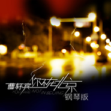
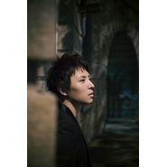

曹轩宾
============================

|  |  |
| :--: | :-- |
| [ 曹轩宾](https://i.xiami.com/shanebin) | **地区**: China 中国大陆 **风格**: 根源唱作人 Singer-Songwriter, 国语流行 Mandarin Pop, 华语唱作人 Chinese Singer-Songwriter **播放数**: 14020340 **粉丝数**: 9656 **评论数**: 347  |

## 档案

曹轩宾（Shane Bin）华语流行歌手、音乐制作人、音乐人 
集演唱、作曲、编曲、制作于一身，毕业于中央音乐学院，出生于音乐世家。 他的曲风细腻柔和，以抒情的慢歌见长，是内地不可多得的新生代优秀音乐人。他之前一直在幕后工作，曾为华语流行乐坛创作了大量脍炙人口的歌曲，如《可惜不是你》《爱因为在心中》等，并为韩庚、张杰等众多知名歌手制作个人专辑或担任演唱会音乐总监。 
2008  年，发行首支个人单曲《好想家》；同年，入围中国歌曲排行榜最佳制作人 
2009  年  3  月发行单曲《皮皮鲁和鲁西西》；  5  月参与创作《非常完美》中国版主题曲；  6  月  6  日参加湖南卫视《节节高声》 
2010  年  1  月联手张如意共同打造《女生的歌》  MV  ；  2  月正式加盟乐华娱乐，担任公司音乐总监；  8  月为叶一茜创作单曲《  Baby  ，我爱你》；  9  月为韩庚创作歌曲《  say no  》。 
2011  年，参加了浙江台音乐类选秀节目《非同凡响》比赛，获得了总冠军。 
2012  年  5  月  9  日发行首张个人  EP  ——《你的三次方》；同月参加由中央人民广播电台  MusicRadio  音乐之声主办、蒙牛酸酸乳联合主办的“  2012 MusicRadio  音乐之声蒙牛酸酸乳巨星梦想学院     明星校园拉票会”成都站活动，  11  月参加了在新加坡举办的第  12  届全球华语歌曲排行榜颁奖典礼，并获得最具潜力新人奖和最受欢迎创作歌手奖；  12  月参加了中国歌曲排行榜在台北小巨蛋举办的群星演唱会典礼，经过重新制作的歌曲《可惜不是你》获得“  2012  年中歌榜年度金曲”奖。 
2011  年至  2013  年，参与山东卫视《歌声传奇》，成为单场夺冠次数最多的歌手。 
2013  年  1  月  17  日     参加湖南卫视《百变大咖秀》并演唱《夜半歌声》，致敬偶像张国荣，获得好评；  3  月凭借《当我不在你身边》在上海举行第二十届东方风云榜上获得了“年度十大金曲奖”；  4  月  25  日     在北京万事达中心他的  EP  《你的三次方》获得  MusicRadio  音乐之声推荐唱片（内地）。 
2014  年  7  月担任“中国梦·导演梦”金蔷薇微电影导演大赛的主题曲《梦·信仰》  MV  制作人；  9  月参加贵州卫视《让世界听见》栏目；同年参加  2014QQ  音乐“无处不乐”校园行活动。 
2015  年  9  月参加“  2015  时尚星秀年度星秀人物盛典暨群星演唱会”。  9  月  27  日登  2015  年央视中秋晚会。当晚，曹轩宾为大家带来了全新改编的《特别的爱给特别的你》 
中文名： 曹轩宾 
籍贯： 陕西西安 
出生日期： 1980年7月19日 
血型： A型 
星座： 巨蟹座 
职业： 歌手 
毕业院校： 中央音乐学院 
代表作品： 皮皮鲁和鲁西西、 得了爱 
精通乐器：钢琴、打击乐器 
喜欢的书籍：刘墉的书 
喜欢的电影：《西雅图未眠夜》 
喜欢的歌手：王力宏 
喜欢的食物：面食、西瓜、芒果 
喜欢做的事情：创作、编曲、旅行 
大事记 
10岁的开始学习percussion instrument和钢琴 
14岁在pub中兼职进行歌手的工作 
18岁从西安音乐学院附中毕业，同年进入中国中央音乐学院学习percussion instrument专业 
22岁毕业中国中央的音乐学院percussion instrument专业 
24岁开始从事幕后Producer 和 Arrangement工作 
曾与华语音乐界著名的producer合作工作至今 
作品创作 
郑棋元《如果你爱我》 
韩 庚《say no》《简单的人》 
叶一茜《Baby 我爱你》 
爱 戴《唱的是寂寞》《中国Pose》 
黄晓明《风声》 
梁静茹《可惜不是你》 
王力宏《爱因为在心中》 
萧亚轩《不远》 
温岚《同手同脚》 
炎亚纶《愿意不爱你》 
黄义达《一秒的安慰》 
王心凌《丢铜板》 
黄丽玲《换季》 
张栋梁《其实幸福很简单》 
张玉华《再见我的宝贝》 
苏永康《有句抱歉》 
古巨基《原来的自己》 
罗志祥《第二顺位》 
李小璐《东方美》 
范冰冰《胭脂雪》 
何 炅 《自己》 
张 杰《我们都一样》 
王一冰《大明星》《如果说》 
顾海滨《配角》《总决赛》 
胡 兵《彻夜未眠》 
赵 凯《单身礼物》《只要此刻你喜欢》 
黄馨可《四格照片》 
江凯文《让我照顾你2004》 
希 亚《Hey Man》 
巨一清《一朝芳草碧连天》 
梦想奥运真男孩《梦在前方》

## 专辑

| 名称 | 语种 | 唱片公司 | 发行时间 | 专辑类别 | 专辑风格 |
| :--: | :-- | :-- | :-- | :-- | :-- |
| [ 随爱所去](./albums/2103706568.md) | 国语 | 长长星瀚 | 2018年05月14日 | EP, 单曲 | 国语流行 Mandarin Pop |
| [ 可惜不是你If It Were U](./albums/2102959679.md) | 国语 | 长长星瀚 | 2017年11月24日 | EP, 单曲 | 国语流行 Mandarin Pop, 华语唱作人 Chinese Singer-Songwriter |
| [ Losing You](./albums/2100317246.md) | 国语 | 长长娱乐 | 2016年05月17日 | EP, 单曲 | 国语流行 Mandarin Pop, 华语唱作人 Chinese Singer-Songwriter |
| [ 你不在北京](./albums/1292692723.md) | 国语 | 海蝶音乐 | 2014年02月18日 | EP, 单曲 | 国语流行 Mandarin Pop, 华语唱作人 Chinese Singer-Songwriter |
| [ 参宿七](./albums/83729715.md) | 国语 | 海蝶音乐 | 2013年11月21日 | 录音室专辑 | 国语流行 Mandarin Pop, 华语唱作人 Chinese Singer-Songwriter |
| [ 你的三次方](./albums/500651.md) | 国语 | 海蝶音乐 | 2012年05月09日 | EP, 单曲 | 国语流行 Mandarin Pop, 华语唱作人 Chinese Singer-Songwriter |
| [ 一朝芳草碧连天](./albums/435779.md) | 国语 | 平衡音乐 | 2011年04月06日 | EP, 单曲 | 国语流行 Mandarin Pop, 华语唱作人 Chinese Singer-Songwriter |
| [ 我们都一样](./albums/440211.md) | 国语 | 乐华娱乐 | 2011年04月06日 | EP, 单曲 | 国语流行 Mandarin Pop, 华语唱作人 Chinese Singer-Songwriter |
| [ 皮皮鲁和鲁西西](./albums/323144.md) | 国语 | 平衡音乐 | 2009年03月26日 | EP, 单曲 | 国语流行 Mandarin Pop, 华语唱作人 Chinese Singer-Songwriter |
| [ 梦在前方](./albums/477424.md) | 国语 | 平衡音乐 | 2008年04月23日 | EP, 单曲 | 国语流行 Mandarin Pop, 华语唱作人 Chinese Singer-Songwriter |
| [ 好想家](./albums/33106.md) | 国语 | 华艺世纪文化 | 2007年12月17日 | EP, 单曲 | 国语流行 Mandarin Pop, 华语唱作人 Chinese Singer-Songwriter |
| [ 体会](./albums/218.md) | 国语 | 丰华唱片 | 2003年02月01日 | 录音室专辑 | 国语流行 Mandarin Pop, 华语唱作人 Chinese Singer-Songwriter |

## 评论

|  |  |  |
| :-- | :-- | :-- |
|  [虾米用户](https://emumo.xiami.com/u/43875708)  遣词造句 穿山过水 他... 2019-11-09 20:13 赞(1) 踩(0) | 
知道他是他和大家一起送给王力宏的《爱因为在心中》 再听的时候就是《可惜不是你》 很走心
 |
|  [虾米用户](https://emumo.xiami.com/u/49652035)  2019-07-21 12:22 赞(0) 踩(0) | 
你的歌就是听一首喜欢一首啊！
 |
|  [虾米用户](https://emumo.xiami.com/u/413708090)  2019-01-28 10:29 赞(0) 踩(0) | 
我男神好厉害 ～来虾米看看你
 |
|  [虾米用户](https://emumo.xiami.com/u/1585310) 音乐是药，不能停 2018-12-29 08:16 赞(1) 踩(0) | 
说实话，除了《可惜不是你》，其他的我没听过，我只想说，爱音乐和能不能做好音乐是两回事，华语音乐圈大部分人都只是老天赏饭吃，有把好嗓子，或者爱音乐而已，但是能不能把音乐做好，做流行，做经典，真的是凤毛麟角，所以，既然选择这条路，就做好最坏的打算把
 |
|  [虾米用户](https://emumo.xiami.com/u/182932658) 微博！微小博大！ 2018-05-18 12:35 赞(0) 踩(0) | 
真的是有才华，不管是创作，还是演唱！加油！！！
 |
|  [虾米用户](https://emumo.xiami.com/u/302660035)  2018-05-05 18:01 赞(0) 踩(0) | 
您的别君叹太感人了，本人不是陕西人也听得泪流满面。什么时候能有付费下载版本？很期待啊，希望快快出来
 |
|  [虾米用户](https://emumo.xiami.com/u/118303220)  2018-04-07 10:11 赞(2) 踩(0) | 
别君叹，很好听
 |
|  [虾米用户](https://emumo.xiami.com/u/260411960)  2018-03-07 18:30 赞(17) 踩(0) | 
超级喜欢您的作品《别君叹》，太美妙的嗓音和音乐，彻底征服了我的耳朵！ 
 |
|  [虾米用户](https://emumo.xiami.com/u/291773915)  2018-03-03 21:23 赞(13) 踩(0) | 
为你唱经典赶紧上线。大爱老家话的送君叹
 |
|  [虾米用户](https://emumo.xiami.com/u/153013324) 粤语经典，古风禅乐new... 2018-02-03 21:40 赞(2) 踩(0) | 
一段无疾而终的情感，你在西安，我在海外，你是歌手，我是军官，你偏执着，我偏任命，绝情，绝恋，绝别!
 |
|  [虾米用户](https://emumo.xiami.com/u/23820493) 我还没想好要写什么... 2018-01-22 00:54 赞(0) 踩(0) | 
特别喜欢曹轩宾先生个人独唱版的《可惜不是你》，萨克斯那一段奏乐，简直是整首歌曲的泪点、情感升华，听到那一段就泪流满面，控制不住自己肆意流淌的泪。没听过您的演唱，觉得梁静茹已经把每一首她专辑里的歌都唱的很好了，情感饱满。多少翻唱都不能超越原唱。胜过原唱的可能只有创作者了，写这首歌是什么心路历程，他最懂！
 |
|  [虾米用户](https://emumo.xiami.com/u/100699216) 我还没想好要写什么... 2018-01-12 22:11 赞(2) 踩(0) | 
会用歌声讲故事的人，喜欢，继续加油~
 |
|  [虾米用户](https://emumo.xiami.com/u/342067515)  2017-12-30 12:59 赞(1) 踩(0) | 
你唱的歌很好听，期待你能创出更好的歌。
 |
|  [虾米用户](https://emumo.xiami.com/u/342067515)  2017-12-30 12:58 赞(0) 踩(0) | 
不用客气
 |
|  [虾米用户](https://emumo.xiami.com/u/98195990)  2017-12-06 08:46 赞(0) 踩(0) | 
从你不在北京听到现在的。
 |
|  [虾米用户](https://emumo.xiami.com/u/66823378)  2017-11-29 17:52 赞(2) 踩(0) | 
可惜不是你，原来是你唱的啊
 |
| ⇒ |  [虾米用户](https://emumo.xiami.com/u/773755)  2017-12-02 20:59 赞(0) 踩(0) | 
他做的曲，幕后走向台前。
 |
|  [虾米用户](https://emumo.xiami.com/u/2527832) 超越生命 解放自由 2017-10-24 16:20 赞(0) 踩(0) | 
这个人就没了？
 |
|  [虾米用户](https://emumo.xiami.com/u/297923774)  2017-09-25 03:30 赞(0) 踩(0) | 
第一次就被歌詞吸引。介紹給老公聽。後來姐妹都下載了。幾年了到現在一直聽。希望你有新作品
 |
|  [虾米用户](https://emumo.xiami.com/u/7008104)   2017-09-16 20:25 赞(1) 踩(0) | 
可惜不是你 一朝芳草碧连天 爱因为在心中 风声  That&amp;#39;s all
 |
|  [虾米用户](https://emumo.xiami.com/u/40473356) 早点睡觉比啥都强 2017-08-26 07:42 赞(0) 踩(0) | 
很喜欢你，gay里gay气。；）
 |
|  [虾米用户](https://emumo.xiami.com/u/52853129) 最爱BIGBANG 2017-07-29 22:30 赞(1) 踩(0) | 
小猪罗志祥也有一首歌是曹轩宾写的。
 |
|  [虾米用户](https://emumo.xiami.com/u/52853129) 最爱BIGBANG 2017-07-29 22:28 赞(2) 踩(0) | 
《可惜不是你》的原作。
 |
|  [虾米用户](https://emumo.xiami.com/u/253372707) siebzehn für... 2017-07-08 16:58 赞(3) 踩(0) | 
觉得他的翻唱永远比他自己的歌好听 心疼 喜欢你不在北京 
 |
|  [虾米用户](https://emumo.xiami.com/u/290544591) 穷则独善其身，达则兼济天... 2017-04-23 17:31 赞(1) 踩(0) | 
喜欢你的歌，能否自己独唱《尘缘》？好期待
 |
|  [虾米用户](https://emumo.xiami.com/u/276044350)  2017-02-25 16:39 赞(4) 踩(0) | 
大爱曹轩宾，加油
 |
|  [虾米用户](https://emumo.xiami.com/u/198245168) Fakeuphrosyn... 2017-01-14 14:58 赞(1) 踩(0) | 
帅
 |
|  [虾米用户](https://emumo.xiami.com/u/43783336) 绿水 荡白帆  看星斗阑... 2016-10-17 09:41 赞(0) 踩(0) | 
第二顺位  发出来啊
 |
|  [虾米用户](https://emumo.xiami.com/u/2145855) 舍生取义，民贵君轻，任重... 2016-08-23 09:51 赞(0) 踩(0) | 
这么多都下架！！！
 |
|  [虾米用户](https://emumo.xiami.com/u/216414562)   2016-08-22 16:32 赞(67) 踩(0) | 
我刚入驻了虾米音乐人，欢迎大家来我的个人主页，收听我的最新音乐
 |
| ⇒ |  [虾米用户](https://emumo.xiami.com/u/2527832) 超越生命 解放自由 2016-08-22 22:05 赞(0) 踩(0) | 
第一
 |
| ⇒ |  [虾米用户](https://emumo.xiami.com/u/44791105)  2017-10-13 02:13 赞(0) 踩(0) | 
好的 从第一张就开始听
 |
| ⇒ |  [虾米用户](https://emumo.xiami.com/u/324158568)  2017-11-28 11:38 赞(0) 踩(0) | 
总于在玩明白了虾米，找到老大啦
 |
| ⇒ |  [虾米用户](https://emumo.xiami.com/u/244902357)  2018-01-08 15:41 赞(0) 踩(0) | 
以前听过你的歌，上次见到你感觉你也是一个很和气的人
 |
| ⇒ |  [虾米用户](https://emumo.xiami.com/u/38702874)   2018-03-03 21:15 赞(0) 踩(0) | 
你的音色太好听了
 |
| ⇒ |  [虾米用户](https://emumo.xiami.com/u/327387630) 再见 再见 2018-06-15 01:55 赞(0) 踩(0) | 
最喜欢你的（You Are So Beautiful)但听不了！
 |
| ⇒ |  [虾米用户](https://emumo.xiami.com/u/375356911)  2018-07-10 20:36 赞(0) 踩(0) | 
不忘初心，坚持对音乐的追求，继续前行，创作更经典的歌曲。
 |
|  [虾米用户](https://emumo.xiami.com/u/15986466) 你长大了，学会不说话了。 2016-08-18 18:44 赞(0) 踩(0) | 
曹轩宾， 大声告诉我， 你的眉毛怎么了………
 |
|  [虾米用户](https://emumo.xiami.com/u/74639208) Music is per... 2016-08-01 21:04 赞(1) 踩(0) | 
你好，甄子丹
 |
|  [虾米用户](https://emumo.xiami.com/u/122688364) 生在愤坑，长在赤圈；挣脱 2016-07-16 23:47 赞(0) 踩(0) | 
1832
 |
|  [虾米用户](https://emumo.xiami.com/u/73857918) 在黎明之前 2016-06-29 19:43 赞(0) 踩(0) | 
竟然没有配角 
 |
|  [虾米用户](https://emumo.xiami.com/u/147615436)  2016-04-23 00:39 赞(2) 踩(0) | 
losing you
 |
|  [虾米用户](https://emumo.xiami.com/u/52407411) background w... 2015-12-20 20:49 赞(0) 踩(0) | 
一直喜欢你
 |
|  [虾米用户](https://emumo.xiami.com/u/77227896)  2015-10-30 21:42 赞(1) 踩(0) | 
在悲傷的時候,聽歌是最適合的現在的心情
 |
|  [虾米用户](https://emumo.xiami.com/u/77227896)  2015-10-30 21:42 赞(1) 踩(0) | 
在悲傷的時候,聽歌是最適合的現在的心情
 |
|  [虾米用户](https://emumo.xiami.com/u/75085834)  2015-10-20 21:23 赞(0) 踩(0) | 
顶 
 |
|  [虾米用户](https://emumo.xiami.com/u/75085834)  2015-10-20 21:23 赞(0) 踩(0) | 
顶 
 |
|  [虾米用户](https://emumo.xiami.com/u/75085834)  2015-10-20 21:22 赞(0) 踩(0) | 
顶
 |
|  [虾米用户](https://emumo.xiami.com/u/53730278)  2015-10-07 22:05 赞(1) 踩(0) | 
高考完了继续听，现在要努力了呢。高考完了我会去寻找你的足迹 
 |
|  [虾米用户](https://emumo.xiami.com/u/61184024) 走着走着就散了 2015-09-06 01:44 赞(1) 踩(0) | 
喜欢
 |
|  [虾米用户](https://emumo.xiami.com/u/51859686) 猜不透 2015-09-04 20:31 赞(1) 踩(0) | 
你不在北京。还不错
 |
|  [虾米用户](https://emumo.xiami.com/u/454506) 我还没想好要写什么... 2015-08-27 14:40 赞(1) 踩(0) | 
心思很細膩的一個男創作歌手
 |
|  [虾米用户](https://emumo.xiami.com/u/53730278)  2015-08-05 04:07 赞(0) 踩(0) | 
I love you forever 
 |
|  [虾米用户](https://emumo.xiami.com/u/53730278)  2015-08-05 04:04 赞(1) 踩(0) | 
每首歌里的每一句歌词的每一个字都像你在用这世界上最好听的声音讲述你的故事，发着属于你自己的光 
 |
|  [虾米用户](https://emumo.xiami.com/u/53730278)  2015-08-05 04:01 赞(0) 踩(0) | 
所有歌都是听了不下一百遍，未来的路只想一直跟随你的脚步，一直喜欢你，一直支持你 
 |
|  [虾米用户](https://emumo.xiami.com/u/53730278)  2015-08-05 04:00 赞(0) 踩(0) | 
真的真的很喜欢你 
 |
|  [虾米用户](https://emumo.xiami.com/u/53730278)  2015-08-05 04:00 赞(0) 踩(0) | 
     
 |
|  [虾米用户](https://emumo.xiami.com/u/53730278)  2015-08-03 12:27 赞(0) 踩(0) | 
喜欢你
 |
|  [虾米用户](https://emumo.xiami.com/u/53730278)  2015-08-03 12:26 赞(0) 踩(0) | 
么么哒  
 |
|  [虾米用户](https://emumo.xiami.com/u/53730278)  2015-07-29 03:53 赞(0) 踩(0) | 
会一直一直喜欢你的。 
 |
|  [虾米用户](https://emumo.xiami.com/u/53730278)  2015-07-29 03:52 赞(1) 踩(0) | 
喜欢你很久了。初恋未满 
 |
|  [虾米用户](https://emumo.xiami.com/u/22282343) 休对故人思古国，且将新火... 2015-07-08 17:46 赞(0) 踩(0) | 
喜欢这种情歌调调 一起加油
 |
|  [虾米用户](https://emumo.xiami.com/u/4006470) 谜 2015-05-13 15:18 赞(2) 踩(0) | 
总算找到你 我爱的男人的嗓音
 |
|  [虾米用户](https://emumo.xiami.com/u/32760080) 这版果断转网易T^T 2015-03-01 00:02 赞(0) 踩(0) | 
nice
 |
|  [虾米用户](https://emumo.xiami.com/u/20564513) 君问归期未有期 2015-01-22 12:46 赞(35) 踩(0) | 
创作型歌手，1980年生人，一度被认为是台湾歌手，但实际上是陕西人，我说的就是………………约瑟翰·庞麦郎
 |
|  [虾米用户](https://emumo.xiami.com/u/8346626) 悲伤地哼着愉快的小调~ 2015-01-16 23:45 赞(1) 踩(0) | 
挚爱内地唱作人
 |
|  [虾米用户](https://emumo.xiami.com/u/9370001) 不畏将来 不念过去 2014-11-13 21:20 赞(1) 踩(0) | 
很喜欢你的歌 加油
 |
|  [虾米用户](https://emumo.xiami.com/u/7871523) 歪星扔 2014-11-13 12:02 赞(0) 踩(0) | 
騷受
 |
|  [虾米用户](https://emumo.xiami.com/u/40473356) 早点睡觉比啥都强 2014-11-08 18:58 赞(0) 踩(0) | 
为啥要整容。歌好就行啊。身高不高还像当偶像派？！
 |
|  [虾米用户](https://emumo.xiami.com/u/1270619)  2014-10-17 14:05 赞(1) 踩(0) | 
总是被他虐死，写出这些是伤的有多深？
 |
|  [虾米用户](https://emumo.xiami.com/u/39610088)  2014-09-14 11:05 赞(0) 踩(0) | 
唱的 写的 很好
 |
|  [虾米用户](https://emumo.xiami.com/u/39958274)  2014-08-13 08:33 赞(0) 踩(0) | 
怎么没有《爱情回来了》
 |
|  [虾米用户](https://emumo.xiami.com/u/32081212) 我还没想好要写什么... 2014-07-26 05:31 赞(2) 踩(0) | 
听多了都是一个调，就红了一首歌。
 |
|  [虾米用户](https://emumo.xiami.com/u/25569913) 乍见之欢不如久处不厌 2014-06-12 12:30 赞(1) 踩(0) | 
他不是台湾人！！！！
 |
|  [虾米用户](https://emumo.xiami.com/u/8628417)  2014-05-29 16:18 赞(1) 踩(0) | 
南京高铁站见过这哥们一次，只能说PS好强大，哥们也确实有才
 |
| ⇒ |  [虾米用户](https://emumo.xiami.com/u/8628417)  2014-06-16 19:17 赞(0) 踩(0) | 
<q><b>其实没有解药说：</b></q>
 |
| ⇒ |  [虾米用户](https://emumo.xiami.com/u/34131579) 是旧日子 2014-06-24 15:37 赞(0) 踩(0) | 
<q><b>Mcfly说：</b></q>
 |
| ⇒ |  [虾米用户](https://emumo.xiami.com/u/34131579) 是旧日子 2017-10-28 00:21 赞(0) 踩(0) | 
可丑是不哈哈
 |
|  [虾米用户](https://emumo.xiami.com/u/1689631) 喜欢听歌的纯屌丝一枚 2014-05-05 22:09 赞(4) 踩(0) | 
这得被人甩了多少次才有这么凄婉的歌声啊
 |
|  [虾米用户](https://emumo.xiami.com/u/22219308) 笑一个吧！~ 2014-05-05 14:54 赞(1) 踩(0) | 
听歌就好，别手贱翻相册。满是喜感啊~哈哈哈
 |
|  [虾米用户](https://emumo.xiami.com/u/329837) 一加一等于几 2014-04-30 20:56 赞(1) 踩(0) | 
长得像是整容失败似的
 |
| ⇒ |  [虾米用户](https://emumo.xiami.com/u/34131579) 是旧日子 2014-06-11 10:15 赞(0) 踩(0) | 
这有可能也是他成名晚的原因
 |
|  [虾米用户](https://emumo.xiami.com/u/1851561)  2014-02-23 21:39 赞(0) 踩(0) | 
玻璃夕阳。。。咩哈哈 哥那时还是个碎娃呢 哈哈哈啊哈
 |
|  [虾米用户](https://emumo.xiami.com/u/1851561)  2014-02-23 21:33 赞(0) 踩(0) | 
哥爱西安男娃。。。。。哈哈哈哈哈哈哈
 |
|  [虾米用户](https://emumo.xiami.com/u/2135166) 上善若水. 无为而无不为 2014-02-23 12:10 赞(1) 踩(0) | 
好喜欢他！旋律优美，实力创作歌喉太动人。他的“你不在北京”的后面就该跟着张靓颖的“终于等到你” :)
 |
|  [虾米用户](https://emumo.xiami.com/u/7733960)  2014-02-22 21:50 赞(0) 踩(0) | 
我觉得只要歌好听，不干坏事，就行了。其他的花边新闻都不用在乎。难得有个我喜欢的男歌手
 |
|  [虾米用户](https://emumo.xiami.com/u/581269)  2014-02-22 00:52 赞(0) 踩(0) | 
曹轩宾 Shane;曹宇
 |
|  [虾米用户](https://emumo.xiami.com/u/6524678) 入骨子里的调调，也会忘了... 2013-12-18 12:39 赞(0) 踩(0) | 
陕西人哦~~~才知道。。。
 |
|  [虾米用户](https://emumo.xiami.com/u/2817889) 我还没想好要写什么... 2013-12-11 21:01 赞(0) 踩(0) | 
内容已删除
 |
| ⇒ |  [虾米用户](https://emumo.xiami.com/u/248381611)  2017-01-08 17:41 赞(0) 踩(0) | 
你TM算老几
 |
| ⇒ |  [虾米用户](https://emumo.xiami.com/u/98066030) 念念不忘，必有回响。虾米... 2017-09-27 19:35 赞(0) 踩(0) | 
这才是原版作者你竟然叫人家不要唱？梁静茹都不敢这样说，你要笑死我 
 |
| ⇒ |  [虾米用户](https://emumo.xiami.com/u/324158568)  2017-11-28 11:37 赞(0) 踩(0) | 
这是他的歌
 |
|  [虾米用户](https://emumo.xiami.com/u/11702617)  2013-12-06 09:37 赞(0) 踩(0) | 
看了他上的康熙，觉得曹宇这个人真是想红，人家谁也没站起来，就他往主持人那边凑。凑凑凑就完了，还说自己是穿着奇装异服坐出租车来录影，真是丢死大陆人的脸了！！！！
 |
|  [虾米用户](https://emumo.xiami.com/u/369189)  2013-12-05 17:28 赞(0) 踩(0) | 
这货的照片P成什么样了
 |
|  [虾米用户](https://emumo.xiami.com/u/3050364)  2013-12-05 04:02 赞(0) 踩(0) | 
大陆
 |
|  [虾米用户](https://emumo.xiami.com/u/5633817) 聽聽歌，談談情 2013-12-03 21:50 赞(0) 踩(0) | 
你不在北京……唱的我好心酸
 |
|  [虾米用户](https://emumo.xiami.com/u/10645909) 笑着流泪 2013-11-28 09:20 赞(1) 踩(0) | 
从《歌声传奇》开始关注老曹并喜欢上他的歌。很有才华的一位歌者，难得用心灵吟唱的歌者！
 |
|  [虾米用户](https://emumo.xiami.com/u/5850636) 暂无签名~ 2013-11-22 08:40 赞(1) 踩(0) | 
原来长得蛮帅的，换个白脸再加个红点的唇，可以韩国当明星了
 |
|  [虾米用户](https://emumo.xiami.com/u/2523233) 太热 2013-11-17 19:14 赞(0) 踩(0) | 
他，很想红。
 |
| ⇒ |  [虾米用户](https://emumo.xiami.com/u/6630660) 猜赢涂口红… 2013-11-21 15:35 赞(0) 踩(0) | 
从参加了各种比赛以后就变了，沉不下气来做音乐。
 |
|  [虾米用户](https://emumo.xiami.com/u/3149143)  2013-11-11 12:35 赞(0) 踩(0) | 
声音很不错！
 |
|  [虾米用户](https://emumo.xiami.com/u/11809843)  2013-11-08 14:12 赞(0) 踩(0) | 
喜欢他的声线
 |
|  [虾米用户](https://emumo.xiami.com/u/983117)  2013-11-08 10:39 赞(0) 踩(0) | 
曹轩宾
 |
|  [虾米用户](https://emumo.xiami.com/u/16016217) 身无分文的发烧友 2013-11-08 00:07 赞(0) 踩(0) | 
配角 这首歌很好听却没人上传
 |
|  [虾米用户](https://emumo.xiami.com/u/6311664)  2013-11-02 12:26 赞(0) 踩(0) | 
个人觉得他没有缘，但唱得唱得非常有感情，混到这样，他也应该知足。
 |
|  [虾米用户](https://emumo.xiami.com/u/1490317)  2013-09-04 22:14 赞(0) 踩(0) | 
感动
 |
|  [虾米用户](https://emumo.xiami.com/u/16737294)  2013-07-31 10:18 赞(0) 踩(0) | 
是从心底发出的美妙音乐，支持你！
 |
|  [虾米用户](https://emumo.xiami.com/u/1830692)  2013-06-10 00:19 赞(0) 踩(0) | 
歌声传奇也是曹轩宾的传奇
 |
|  [虾米用户](https://emumo.xiami.com/u/2919679)  2013-05-05 01:27 赞(0) 踩(0) | 
有魅力啊~~~~聽他的歌很享受， 很喜歡他在歌声传奇里對歌曲的詮釋！！！ 不得不說內地人才濟濟！！！！
 |
|  [虾米用户](https://emumo.xiami.com/u/13465263) 简单的 2013-03-10 22:21 赞(0) 踩(0) | 
不解释
 |
|  [虾米用户](https://emumo.xiami.com/u/13142105) 若水之春 2013-02-20 15:09 赞(0) 踩(0) | 
绝对的实力歌手，从《歌声传奇》中认识的，可是13年就不上这个节目了，这个节目也没意思了。
 |
|  [虾米用户](https://emumo.xiami.com/u/9536417)  2012-12-27 14:02 赞(0) 踩(0) | 
有点沧桑
 |
|  [虾米用户](https://emumo.xiami.com/u/1851561)  2012-12-26 22:39 赞(1) 踩(0) | 
西安娃 哥喜欢
 |
|  [虾米用户](https://emumo.xiami.com/u/3456672) 你為何沒有等 一早已被困 2012-12-22 23:42 赞(0) 踩(0) | 
live比cd還好聽
 |
|  [虾米用户](https://emumo.xiami.com/u/5399503) 有的人来到你身边，是告诉... 2012-11-18 07:46 赞(0) 踩(0) | 
声音帮
 |
|  [虾米用户](https://emumo.xiami.com/u/5399503) 有的人来到你身边，是告诉... 2012-11-18 07:45 赞(0) 踩(0) | 
声音棒
 |
|  [虾米用户](https://emumo.xiami.com/u/11353)  2012-11-06 12:40 赞(19) 踩(0) | 
没想到是内地的。一直以为是台湾的。
 |
| ⇒ |  [虾米用户](https://emumo.xiami.com/u/6513449) 不会被熟悉感蒙蔽而失去珍... 2014-01-08 19:36 赞(0) 踩(0) | 
直到看见你这句话，我才知道是内地的。。。。。
 |
|  [虾米用户](https://emumo.xiami.com/u/205219)  2012-11-04 21:59 赞(0) 踩(0) | 
酥麻，
 |
|  [虾米用户](https://emumo.xiami.com/u/8139928)  2012-11-04 18:50 赞(0) 踩(0) | 
声音真好
 |
|  [虾米用户](https://emumo.xiami.com/u/522205) 一切很美，音為有你﹏ 2012-10-04 10:30 赞(0) 踩(0) | 
比关喆更有名气和实力的唱作音乐人 偏爱之
 |
| ⇒ |  [虾米用户](https://emumo.xiami.com/u/10231881) 天天UP~~!~~ 2012-11-17 12:19 赞(0) 踩(0) | 
出名后也比关喆比赛参加的多·~~！
 |
| ⇒ |  [虾米用户](https://emumo.xiami.com/u/522205) 一切很美，音為有你﹏ 2012-11-19 21:41 赞(0) 踩(0) | 
<q><b>°R、ay梵s说：</b></q>
 |
| ⇒ |  [虾米用户](https://emumo.xiami.com/u/10231881) 天天UP~~!~~ 2012-11-20 18:53 赞(0) 踩(0) | 
<q><b>然说：</b></q>
 |
|  [虾米用户](https://emumo.xiami.com/u/10769746)  2012-09-24 21:59 赞(0) 踩(0) | 
就是喜欢了。
 |
|  [虾米用户](https://emumo.xiami.com/u/1851561)  2012-09-23 12:51 赞(0) 踩(0) | 
矮油 西安娃 哥喜欢
 |
|  [虾米用户](https://emumo.xiami.com/u/12877)  2012-09-05 23:16 赞(0) 踩(0) | 
有味道
 |
|  [虾米用户](https://emumo.xiami.com/u/10490960)  2012-09-04 09:09 赞(0) 踩(0) | 
真性情~
 |
|  [虾米用户](https://emumo.xiami.com/u/2170707)  2012-08-31 14:37 赞(0) 踩(0) | 
好听
 |
|  [虾米用户](https://emumo.xiami.com/u/1695352) 我还没想好要写什么... 2012-08-20 14:50 赞(0) 踩(0) | 
多好的音乐人啊~~~首首精品~~~~
 |
|  [虾米用户](https://emumo.xiami.com/u/7364244)  2012-08-20 11:16 赞(0) 踩(0) | 
喜欢
 |
|  [虾米用户](https://emumo.xiami.com/u/7396631) 听一段音乐 怀念一段时光 2012-08-04 14:01 赞(0) 踩(0) | 
纯纯的音乐人，喜欢、、、
 |
|  [虾米用户](https://emumo.xiami.com/u/9940254)  2012-07-24 14:45 赞(1) 踩(0) | 
歌太少，但都是精品，歌声传奇里最值得期待的歌手，因为他最认真
 |
|  [虾米用户](https://emumo.xiami.com/u/9927528) / 2012-07-23 16:20 赞(0) 踩(0) | 
无需说明 静静听他唱歌就好
 |
|  [虾米用户](https://emumo.xiami.com/u/1571757) 「我曾經聽人講過，當你不... 2012-07-17 16:16 赞(0) 踩(0) | 
唱的很好听 歌总差一点高潮点
 |
|  [虾米用户](https://emumo.xiami.com/u/3810870)  2012-07-10 14:23 赞(0) 踩(0) | 
好听
 |
|  [虾米用户](https://emumo.xiami.com/u/1851561)  2012-07-06 22:02 赞(0) 踩(0) | 
西安娃 西安娃 西安娃 西安娃。。。
 |
|  [虾米用户](https://emumo.xiami.com/u/466986)  2012-07-05 22:35 赞(0) 踩(0) | 
收藏美妙的声音
 |
|  [虾米用户](https://emumo.xiami.com/u/7945824)   2012-06-24 23:19 赞(0) 踩(0) | 
可惜不是你，为懵懂天真的自己，为那些年，为成长，为失落，毕业季，曹轩宾
 |
|  [虾米用户](https://emumo.xiami.com/u/9556330)  2012-06-23 09:54 赞(0) 踩(0) | 
喜欢你的声音
 |
|  [虾米用户](https://emumo.xiami.com/u/8473144)  2012-06-20 08:43 赞(0) 踩(0) | 
很喜欢声音~
 |
|  [虾米用户](https://emumo.xiami.com/u/9504877) 爱音乐，爱唱歌 2012-06-19 17:23 赞(0) 踩(0) | 
这声音怎么从单纯，清新变得沧桑，深情，经过了多少风霜，挫折，也许这就是成长吧。这个男人值得你喜欢，珍藏。
 |
|  [虾米用户](https://emumo.xiami.com/u/3571796)  2012-06-17 15:26 赞(0) 踩(0) | 
不知为什么看他很顺眼==b跟楼下有个人反着 觉得看起来就是巨蟹座男生那个样^^
 |
|  [虾米用户](https://emumo.xiami.com/u/1851561)  2012-06-16 21:13 赞(0) 踩(0) | 
西安娃呀   邢星那期看见你好激动呀呀 那发型怎么看怎么像韩庚嘛。。。。。。。。。
 |
|  [虾米用户](https://emumo.xiami.com/u/7716994)  2012-06-15 16:06 赞(0) 踩(0) | 
旋律美
 |
|  [虾米用户](https://emumo.xiami.com/u/631398)  2012-06-13 20:13 赞(0) 踩(0) | 
不错啊，怎么现在才到台前
 |
|  [虾米用户](https://emumo.xiami.com/u/3017490)  2012-06-11 00:48 赞(0) 踩(0) | 
深情款款的演唱风格，我喜欢。
 |
|  [虾米用户](https://emumo.xiami.com/u/1277432)  2012-06-08 10:02 赞(0) 踩(0) | 
我们西安人呢~要支持！
 |
|  [虾米用户](https://emumo.xiami.com/u/9017489)  2012-06-05 22:46 赞(0) 踩(0) | 
声音很好听
 |
|  [虾米用户](https://emumo.xiami.com/u/2734815)  2012-06-05 19:30 赞(0) 踩(0) | 
可惜不是你
 |
|  [虾米用户](https://emumo.xiami.com/u/6470808)  2012-05-27 21:39 赞(0) 踩(0) | 
喜欢原创
 |
|  [虾米用户](https://emumo.xiami.com/u/3455440)   2012-05-26 00:23 赞(1) 踩(0) | 
还好 人很真  路很难  歌很用心
 |
|  [虾米用户](https://emumo.xiami.com/u/2023946)  2012-05-24 08:57 赞(0) 踩(0) | 
优柔
 |
|  [虾米用户](https://emumo.xiami.com/u/8868582)  2012-05-22 22:39 赞(0) 踩(0) | 
更真的味
 |
|  [虾米用户](https://emumo.xiami.com/u/54218)  2012-05-22 14:01 赞(0) 踩(0) | 
创作型歌手
 |
|  [虾米用户](https://emumo.xiami.com/u/3149143)  2012-05-20 04:42 赞(0) 踩(0) | 
好声音！
 |
|  [虾米用户](https://emumo.xiami.com/u/1775931)  2012-05-18 08:29 赞(0) 踩(0) | 
老婆喜欢
 |
|  [虾米用户](https://emumo.xiami.com/u/374450) GAME MAKER！！ 2012-05-17 17:21 赞(0) 踩(0) | 
当我不在你身边
 |
|  [虾米用户](https://emumo.xiami.com/u/3814834) 别说你还好 2012-05-17 02:06 赞(0) 踩(0) | 
男生 安静
 |
|  [虾米用户](https://emumo.xiami.com/u/7865894)  2012-05-16 15:31 赞(0) 踩(0) | 
<a href="http://www.xiami.com/song/showcollect/id/11280003" target="_blank" rel="nofollow noreferrer noopener">http://www.xiami.com/song/showcollect/id/11280003</a>  MV
 |
|  [虾米用户](https://emumo.xiami.com/u/6048337) はいはい。何もない。 2012-05-16 00:35 赞(0) 踩(0) | 
有那么一点意思在啊。小子。
 |
|  [虾米用户](https://emumo.xiami.com/u/7248937)  2012-05-14 22:49 赞(0) 踩(0) | 
令人感动的音乐
 |
|  [虾米用户](https://emumo.xiami.com/u/2948533)  2012-05-14 15:27 赞(0) 踩(0) | 
深情，苦情歌
 |
|  [虾米用户](https://emumo.xiami.com/u/6360929) 音乐是生活的色彩和味道 2012-05-14 13:24 赞(0) 踩(0) | 
歌虽不多，却很安静
 |
|  [虾米用户](https://emumo.xiami.com/u/9145933) 听歌 唱歌 享受人生。 2012-05-13 20:35 赞(0) 踩(0) | 
好声音
 |
|  [虾米用户](https://emumo.xiami.com/u/7553168)  2012-05-11 19:16 赞(0) 踩(0) | 
喜欢钢琴、吉他伴奏的歌
 |
|  [虾米用户](https://emumo.xiami.com/u/1729030) 你的青春结束了、那我的也... 2012-05-10 17:47 赞(0) 踩(0) | 
可惜不是你。。。
 |
|  [虾米用户](https://emumo.xiami.com/u/1382694)  2012-05-09 20:41 赞(0) 踩(0) | 
继续努力练唱功啊
 |
|  [虾米用户](https://emumo.xiami.com/u/3386525)  2012-05-09 13:43 赞(0) 踩(0) | 
細節處理上，突顯一個真正功底深厚專業歌手的素質。真正難處理的是慢板的演唱方式，更多的要聽過現場做判斷！
 |
|  [虾米用户](https://emumo.xiami.com/u/9094370)  2012-05-06 17:24 赞(0) 踩(0) | 
很牵动人心
 |
|  [虾米用户](https://emumo.xiami.com/u/9073893)   2012-05-04 14:26 赞(0) 踩(0) | 
从可惜不是你绒花1朝芳草碧连天开始听起喜欢他的歌每首入心灵动感人超赞
 |
|  [虾米用户](https://emumo.xiami.com/u/1979441) 我还没想好要写什么... 2012-05-01 00:24 赞(0) 踩(0) | 
不P得那么过会死么...我说封面
 |
|  [虾米用户](https://emumo.xiami.com/u/555560) 坐在路边鼓掌的人 2012-04-29 21:06 赞(0) 踩(0) | 
歌唱得一般
 |
|  [虾米用户](https://emumo.xiami.com/u/8920269)  2012-04-26 22:35 赞(0) 踩(0) | 
e
 |
|  [虾米用户](https://emumo.xiami.com/u/8659850) 用孩童的眼睛/看世界.遇... 2012-04-26 18:32 赞(0) 踩(0) | 
你喜欢王力宏，我也是。
 |
|  [虾米用户](https://emumo.xiami.com/u/8659850) 用孩童的眼睛/看世界.遇... 2012-04-26 18:28 赞(0) 踩(0) | 
难得 。。。
 |
|  [虾米用户](https://emumo.xiami.com/u/6689411)  2012-04-26 17:49 赞(0) 踩(0) | 
歌声不足以做显眼的歌手，作的曲子都很棒，感觉宁静细腻。
 |
|  [虾米用户](https://emumo.xiami.com/u/8454339) 生之爱 2012-04-13 20:15 赞(0) 踩(0) | 
曹轩宾,我喜欢他唱歌的感觉,特别是弹着钢琴仰着脸,感觉世界宁静极了,只剩他的声音
 |
|  [虾米用户](https://emumo.xiami.com/u/616364) 有双花心的耳朵 2012-04-08 17:46 赞(0) 踩(0) | 
无意中发现的
 |
|  [虾米用户](https://emumo.xiami.com/u/3149268)  2012-04-07 21:31 赞(0) 踩(0) | 
静静的，喜欢
 |
|  [虾米用户](https://emumo.xiami.com/u/4721436)  2012-04-06 22:12 赞(0) 踩(0) | 
可惜不是你 一首就够了 真的一首 曲子写的很赞！
 |
|  [虾米用户](https://emumo.xiami.com/u/7325954)  2012-04-06 00:22 赞(0) 踩(0) | 
宁静的感觉
 |
|  [虾米用户](https://emumo.xiami.com/u/1935674)  2012-04-05 21:12 赞(0) 踩(0) | 
喜欢
 |
|  [虾米用户](https://emumo.xiami.com/u/8650655)  2012-04-05 08:18 赞(0) 踩(0) | 
喜欢这感觉
 |
|  [虾米用户](https://emumo.xiami.com/u/8739959)  2012-04-04 23:11 赞(0) 踩(0) | 
foryou
 |
|  [虾米用户](https://emumo.xiami.com/u/3184484)  2012-04-01 13:53 赞(0) 踩(0) | 
用心唱歌，用情表达
 |
|  [虾米用户](https://emumo.xiami.com/u/8618936)  2012-03-27 18:12 赞(0) 踩(0) | 
我爱他
 |
|  [虾米用户](https://emumo.xiami.com/u/7542592)  2012-03-26 20:04 赞(0) 踩(0) | 
好歌
 |
|  [虾米用户](https://emumo.xiami.com/u/8217230)   2012-03-26 18:40 赞(0) 踩(0) | 
好听啊，一朝芳草碧连天
 |
|  [虾米用户](https://emumo.xiami.com/u/8562537)  2012-03-23 22:26 赞(0) 踩(0) | 
好听钩魂
 |
|  [虾米用户](https://emumo.xiami.com/u/6542040)  2012-03-23 16:37 赞(0) 踩(0) | 
1
 |
|  [虾米用户](https://emumo.xiami.com/u/8500478)  2012-03-23 13:03 赞(0) 踩(0) | 
喜欢他的抒情歌，很有感染力！
 |
|  [虾米用户](https://emumo.xiami.com/u/5450880)  2012-03-23 11:04 赞(0) 踩(0) | 
歌写的很棒！
 |
|  [虾米用户](https://emumo.xiami.com/u/1591801)  2012-03-23 04:19 赞(0) 踩(0) | 
每一句都勾魂
 |
|  [虾米用户](https://emumo.xiami.com/u/6994734)  2012-03-22 22:51 赞(0) 踩(0) | 
歌，好听。
 |
|  [虾米用户](https://emumo.xiami.com/u/5433025)  2012-03-22 21:35 赞(0) 踩(0) | 
能抓住我的心的声音
 |
|  [虾米用户](https://emumo.xiami.com/u/2324904) 我是一只机器喵儿.... 2012-03-21 21:59 赞(0) 踩(0) | 
深情喔
 |
|  [虾米用户](https://emumo.xiami.com/u/8493961) 海=umi=五米=w= 2012-03-21 00:06 赞(0) 踩(0) | 
芳草碧连天啊。。
 |
|  [虾米用户](https://emumo.xiami.com/u/5735648)  2012-03-20 21:27 赞(0) 踩(0) | 
……不喜欢他
 |
|  [虾米用户](https://emumo.xiami.com/u/2104087)  2012-03-20 16:05 赞(0) 踩(0) | 
唱歌太有感情了，很容易被他带入故事中
 |
|  [虾米用户](https://emumo.xiami.com/u/3135985)  2012-03-20 08:06 赞(0) 踩(0) | 
好声音 有才
 |
|  [虾米用户](https://emumo.xiami.com/u/355865) Let it go, l... 2012-03-20 07:13 赞(0) 踩(0) | 
普及一下，他是王力宏的歌迷，那首脍炙人口的《爱因为在心中》也是他的作品。
 |
|  [虾米用户](https://emumo.xiami.com/u/8475448)  2012-03-19 23:16 赞(0) 踩(0) | 
大爱啊
 |
|  [虾米用户](https://emumo.xiami.com/u/1665397)  2012-03-19 19:34 赞(27) 踩(0) | 
不知道为什么看着他不爽
 |
| ⇒ |  [虾米用户](https://emumo.xiami.com/u/1315688) 怀念这个地方显示着的家乡 2012-06-11 15:13 赞(0) 踩(0) | 
对对～唱的好但是感觉……
 |
| ⇒ |  [虾米用户](https://emumo.xiami.com/u/6311664)  2013-11-02 12:29 赞(0) 踩(0) | 
其实他没有观众缘，歌那就不用说了，好，不过，我是非常喜欢的。
 |
|  [虾米用户](https://emumo.xiami.com/u/141825) drowned. 2012-03-19 17:47 赞(13) 踩(0) | 
不知他爸妈怎么想的……这名起得，一看就想到“喧宾夺主”，不是什么好话呀。
 |
|  [虾米用户](https://emumo.xiami.com/u/403628)  2012-03-19 17:37 赞(0) 踩(0) | 
动听的男人味！
 |
|  [虾米用户](https://emumo.xiami.com/u/650450)  2012-03-19 14:01 赞(0) 踩(0) | 
欣赏加喜欢。
 |
|  [虾米用户](https://emumo.xiami.com/u/61945)  2012-03-19 11:58 赞(0) 踩(0) | 
好好的一个内地歌手，学你妹的韩国人音腔啊。恶心。
 |
|  [虾米用户](https://emumo.xiami.com/u/5621371)  2012-03-19 11:44 赞(0) 踩(0) | 
a
 |
|  [虾米用户](https://emumo.xiami.com/u/8440346) 一个人先生 2012-03-19 08:44 赞(0) 踩(0) | 
从\&amp;quot;一朝芳草碧连天\&amp;quot;开始喜欢他的声音
 |
|  [虾米用户](https://emumo.xiami.com/u/3866891) 我还没想好要写什么... 2012-03-09 23:31 赞(0) 踩(0) | 
很有才华很认真地在做音乐，喜欢这份认真！
 |
|  [虾米用户](https://emumo.xiami.com/u/2477284) 结束和开始都来的那么突然... 2012-03-07 01:20 赞(0) 踩(0) | 
厚积薄发，该腾飞了！
 |
|  [虾米用户](https://emumo.xiami.com/u/8292301)  2012-03-04 17:00 赞(0) 踩(0) | 
曹轩宾 是用生命唱歌的人 曹轩宾是音乐的王者！
 |
|  [虾米用户](https://emumo.xiami.com/u/758613)  2012-02-21 17:55 赞(0) 踩(0) | 
好听的歌，突然的窒息~你还是在我心底，只在某个频率出现，聪
 |
|  [虾米用户](https://emumo.xiami.com/u/8106742)  2012-02-19 11:15 赞(0) 踩(0) | 
lala
 |
|  [虾米用户](https://emumo.xiami.com/u/8059363)  2012-02-15 21:42 赞(0) 踩(0) | 
nice
 |
|  [虾米用户](https://emumo.xiami.com/u/7958767)  2012-02-08 04:28 赞(0) 踩(0) | 
唱出了男人的味道
 |
|  [虾米用户](https://emumo.xiami.com/u/7889932)  2012-02-03 22:46 赞(0) 踩(0) | 
灵魂的歌者
 |
|  [虾米用户](https://emumo.xiami.com/u/7901107)  2012-02-03 18:03 赞(0) 踩(0) | 
也是因为你。、
 |
|  [虾米用户](https://emumo.xiami.com/u/7859180)  2012-01-31 14:00 赞(0) 踩(0) | 
他难过的样子让人心疼...
 |
|  [虾米用户](https://emumo.xiami.com/u/170307)  2012-01-11 15:37 赞(0) 踩(0) | 
2012.01.11  被他的歌声打动
 |
|  [虾米用户](https://emumo.xiami.com/u/6144531) 我还没想好要写什么... 2012-01-09 22:42 赞(0) 踩(0) | 
安静的听  好的音乐人
 |
|  [虾米用户](https://emumo.xiami.com/u/7268276)  2012-01-06 22:23 赞(0) 踩(0) | 
可惜不是你。。。
 |
|  [虾米用户](https://emumo.xiami.com/u/7542359)  2012-01-04 20:19 赞(0) 踩(0) | 
有灵魂的音乐人，谢谢你带给我那么多感动
 |
|  [虾米用户](https://emumo.xiami.com/u/2381604) 健康最重要 2011-12-25 16:22 赞(0) 踩(0) | 
喜欢轩宾忧郁的feel~~~
 |
|  [虾米用户](https://emumo.xiami.com/u/6786218)  2011-12-25 08:23 赞(0) 踩(0) | 
动人
 |
|  [虾米用户](https://emumo.xiami.com/u/7350425)  2011-12-21 23:55 赞(0) 踩(0) | 
因为这是我和他共同喜欢的人，
 |
|  [虾米用户](https://emumo.xiami.com/u/5748805)  2011-12-16 08:54 赞(0) 踩(0) | 
好声音
 |
|  [虾米用户](https://emumo.xiami.com/u/3881657)  2011-12-16 01:14 赞(0) 踩(0) | 
灯光与后台，或只有一线。
 |
|  [虾米用户](https://emumo.xiami.com/u/1536501) 陪我去看海 2011-12-15 16:41 赞(0) 踩(0) | 
喜欢深情演绎的他
 |
|  [虾米用户](https://emumo.xiami.com/u/1113723) 喵喵喵~~~ 2011-12-15 12:51 赞(0) 踩(0) | 
一把好嗓子
 |
|  [虾米用户](https://emumo.xiami.com/u/2191762)  2011-12-14 11:59 赞(0) 踩(0) | 
真挚，感人
 |
|  [虾米用户](https://emumo.xiami.com/u/3931773)  2011-12-10 01:36 赞(0) 踩(0) | 
干净
 |
|  [虾米用户](https://emumo.xiami.com/u/7148106)  2011-12-08 02:26 赞(0) 踩(0) | 
喜欢
 |
|  [虾米用户](https://emumo.xiami.com/u/7148106)  2011-12-08 01:59 赞(0) 踩(0) | 
ok
 |
|  [虾米用户](https://emumo.xiami.com/u/7142317)  2011-12-07 18:55 赞(0) 踩(0) | 
超喜欢，静静地听，太有味道了吗，他会唱的令你落泪，太感人了
 |
|  [虾米用户](https://emumo.xiami.com/u/7106100)  2011-12-07 16:44 赞(0) 踩(0) | 
太迷人了
 |
| ⇒ |  [虾米用户](https://emumo.xiami.com/u/7142317)  2011-12-07 18:56 赞(0) 踩(0) | 
太对了
 |
|  [虾米用户](https://emumo.xiami.com/u/7131856)  2011-12-06 22:50 赞(0) 踩(0) | 
安静 好听
 |
|  [虾米用户](https://emumo.xiami.com/u/7122434)  2011-12-06 11:46 赞(0) 踩(0) | 
还好有你
 |
|  [虾米用户](https://emumo.xiami.com/u/3921098)  2011-12-05 22:31 赞(0) 踩(0) | 
有故事才能有真情
 |
|  [虾米用户](https://emumo.xiami.com/u/6563881)  2011-12-05 10:59 赞(0) 踩(0) | 
有梦 有才 有够执着 动听,
 |
|  [虾米用户](https://emumo.xiami.com/u/3460700)  2011-12-04 23:10 赞(0) 踩(0) | 
唱的都是感情啊。。
 |
|  [虾米用户](https://emumo.xiami.com/u/6770738) Moments beco... 2011-12-04 15:56 赞(0) 踩(0) | 
好声音
 |
|  [虾米用户](https://emumo.xiami.com/u/6378577)  2011-12-04 12:04 赞(0) 踩(0) | 
自唱的入情也能令听着动情
 |
|  [虾米用户](https://emumo.xiami.com/u/723791)  2011-12-03 22:34 赞(0) 踩(0) | 
太深情了，可惜不是你
 |
|  [虾米用户](https://emumo.xiami.com/u/723791)  2011-12-03 22:32 赞(0) 踩(0) | 
也是看了天天。。。声音好，唱的更好
 |
|  [虾米用户](https://emumo.xiami.com/u/194780)  2011-12-03 21:41 赞(0) 踩(0) | 
看完天天向上，感觉此人的确有才。
 |
|  [虾米用户](https://emumo.xiami.com/u/7074960)  2011-12-03 10:59 赞(0) 踩(0) | 
tt
 |
|  [虾米用户](https://emumo.xiami.com/u/3416780)  2011-12-02 21:39 赞(0) 踩(0) | 
在天天向上听到可惜不是你，完全不同的感觉，一朝芳草碧连天，忍不住动情
 |
|  [虾米用户](https://emumo.xiami.com/u/6463133)  2011-11-24 21:35 赞(0) 踩(0) | 
******
 |
|  [虾米用户](https://emumo.xiami.com/u/812392) 【封面控】毛驴牌❤小众好... 2011-11-23 13:58 赞(0) 踩(0) | 
刚刚看到曹轩宾的微博说录制天天向上了，然后看到里边拍到有一个恶搞葛优大爷的照片，笑喷了，于是让友女去看看笑笑，他问我曹轩宾是谁？=  =我说可惜不是你是他写的，你搜下他唱的版本就知道了，亲还有谁不知道曹轩宾的么？
 |
|  [虾米用户](https://emumo.xiami.com/u/4756546)  2011-11-20 12:28 赞(0) 踩(0) | 
纯净的声音
 |
|  [虾米用户](https://emumo.xiami.com/u/6849744)  2011-11-18 23:15 赞(0) 踩(0) | 
123
 |
|  [虾米用户](https://emumo.xiami.com/u/2901456)  2011-11-15 16:56 赞(0) 踩(0) | 
很奇怪，这样的歌手为什么一直不火
 |
|  [虾米用户](https://emumo.xiami.com/u/5419014)  2011-11-14 13:50 赞(0) 踩(0) | 
歌好
 |
|  [虾米用户](https://emumo.xiami.com/u/2830748) 虽苦还望莫作 2011-11-12 17:40 赞(0) 踩(0) | 
顶起
 |
|  [虾米用户](https://emumo.xiami.com/u/6715033)  2011-11-11 10:03 赞(0) 踩(0) | 
。。
 |
|  [虾米用户](https://emumo.xiami.com/u/6390524)  2011-11-07 15:37 赞(0) 踩(0) | 
个人觉得比梁静茹的版本好~
 |
|  [虾米用户](https://emumo.xiami.com/u/1636029)  2011-11-06 01:16 赞(0) 踩(0) | 
伤情嘶声
 |
|  [虾米用户](https://emumo.xiami.com/u/5129920)  2011-10-30 23:30 赞(0) 踩(0) | 
音悦台有好多他的歌！！！
 |
|  [虾米用户](https://emumo.xiami.com/u/6521642)  2011-10-30 21:17 赞(0) 踩(0) | 
干净的声音
 |
|  [虾米用户](https://emumo.xiami.com/u/6495384)  2011-10-30 10:09 赞(0) 踩(0) | 
很喜欢他的风格...
 |
|  [虾米用户](https://emumo.xiami.com/u/5625308)  2011-10-25 10:32 赞(0) 踩(0) | 
正太推荐，确实也好听
 |
|  [虾米用户](https://emumo.xiami.com/u/3288490) 更行更远还生 2011-10-24 19:08 赞(0) 踩(0) | 
非常用心地在唱
 |
|  [虾米用户](https://emumo.xiami.com/u/3288490) 更行更远还生 2011-10-24 19:05 赞(0) 踩(0) | 
非常用心在唱
 |
|  [虾米用户](https://emumo.xiami.com/u/6327318)  2011-10-20 11:24 赞(0) 踩(0) | 
伤情王子！！
 |
|  [虾米用户](https://emumo.xiami.com/u/3667913)  2011-10-17 19:10 赞(0) 踩(0) | 
听了他的《可惜不是你》，那种感动真是直插心灵，感觉国内男歌手很少能有对我那么大触动了。
 |
|  [虾米用户](https://emumo.xiami.com/u/9638)  2011-10-16 01:18 赞(0) 踩(0) | 
非常非常深情。
 |
|  [虾米用户](https://emumo.xiami.com/u/1228897) 活在当下 2011-10-13 11:51 赞(0) 踩(0) | 
阴天，听他的歌感觉很好
 |
|  [虾米用户](https://emumo.xiami.com/u/5416076)  2011-10-10 15:34 赞(0) 踩(0) | 
通过“非同凡响”开始喜欢这个男人，恩，是滴
 |
|  [虾米用户](https://emumo.xiami.com/u/5709128) #写不了乐评的成叔 2011-10-10 10:57 赞(0) 踩(0) | 
支持内地创作人
 |
|  [虾米用户](https://emumo.xiami.com/u/6046210)  2011-10-07 13:13 赞(0) 踩(0) | 
喜欢曹的歌
 |
|  [虾米用户](https://emumo.xiami.com/u/3318902)  2011-10-06 01:39 赞(0) 踩(0) | 
have dream, work hard
 |
|  [虾米用户](https://emumo.xiami.com/u/5729484)  2011-09-30 19:59 赞(0) 踩(0) | 
苦逼唱腔~
 |
|  [虾米用户](https://emumo.xiami.com/u/2294988)  2011-09-27 22:58 赞(0) 踩(0) | 
需要这样的人
 |
|  [虾米用户](https://emumo.xiami.com/u/201114)  2011-09-27 16:18 赞(0) 踩(0) | 
《配角》什么时候出来啊，基本上每天都过来看。顾海滨版本的太一般了。
 |
|  [虾米用户](https://emumo.xiami.com/u/962146)  2011-09-26 17:45 赞(0) 踩(0) | 
喜欢他的声音，很感人
 |
|  [虾米用户](https://emumo.xiami.com/u/5987664)  2011-09-26 15:57 赞(0) 踩(0) | 
有才
 |
|  [虾米用户](https://emumo.xiami.com/u/94745)  2011-09-25 19:55 赞(0) 踩(0) | 
偶然看到非同凡响，听到他在钢琴前动情的唱歌，让人很温暖，喜欢这样的感觉。乐坛这样的歌手真的很需要，越多越好。否则那么多的心该去什么歌词里去找共鸣。
 |
|  [虾米用户](https://emumo.xiami.com/u/4833370)  2011-09-25 16:55 赞(0) 踩(0) | 
用心。
 |
|  [虾米用户](https://emumo.xiami.com/u/5931859)  2011-09-22 22:07 赞(0) 踩(0) | 
喜欢没有为什么
 |
|  [虾米用户](https://emumo.xiami.com/u/5416076)  2011-09-13 10:41 赞(0) 踩(0) | 
他的歌总能让人觉得感动
 |
|  [虾米用户](https://emumo.xiami.com/u/121320)  2011-09-11 13:47 赞(0) 踩(0) | 
hold
 |
|  [虾米用户](https://emumo.xiami.com/u/3734457)  2011-09-10 22:31 赞(0) 踩(0) | 
配角
 |
|  [虾米用户](https://emumo.xiami.com/u/4329292)  2011-09-10 20:52 赞(0) 踩(0) | 
<a href="http://www.youku.com/playlist_show/id_7182701.html" target="_blank" rel="nofollow noreferrer noopener">http://www.youku.com/playlist_show/id_7182701.html</a>   曹轩宾【钢琴创作集】
 |
|  [虾米用户](https://emumo.xiami.com/u/2632450)   2011-09-09 22:42 赞(0) 踩(0) | 
我发现他的所有封面都是侧脸。还是向右的。。。。
 |
|  [虾米用户](https://emumo.xiami.com/u/714546)   2011-09-07 00:02 赞(0) 踩(0) | 
怎么也想不到《可惜不是你》是他写的。说得矫情点，我喜欢他溪流轻喘的摩擦音。。。
 |
|  [虾米用户](https://emumo.xiami.com/u/5709215)  2011-09-05 09:48 赞(0) 踩(0) | 
用灵魂歌唱的歌者，让人不能不感动
 |
|  [虾米用户](https://emumo.xiami.com/u/5008533)  2011-09-04 21:36 赞(0) 踩(0) | 
喜欢他的嗓音，喜欢他的音乐风格
 |
|  [虾米用户](https://emumo.xiami.com/u/4998277)  2011-09-04 15:31 赞(0) 踩(0) | 
强势出击
 |
|  [虾米用户](https://emumo.xiami.com/u/5147087)  2011-09-03 19:42 赞(0) 踩(0) | 
情深满泄
 |
|  [虾米用户](https://emumo.xiami.com/u/5642688)  2011-08-31 00:08 赞(0) 踩(0) | 
清爽
 |
|  [虾米用户](https://emumo.xiami.com/u/453216)   2011-08-30 13:26 赞(0) 踩(0) | 
一朝芳草碧连天~
 |
|  [虾米用户](https://emumo.xiami.com/u/2725880)  2011-08-29 19:53 赞(0) 踩(0) | 
可惜不是你
 |
|  [虾米用户](https://emumo.xiami.com/u/812392) 【封面控】毛驴牌❤小众好... 2011-08-28 00:22 赞(0) 踩(0) | 
喜欢曹轩宾，特别是唱那首《可惜不是你》，心灵被撼动了，强烈要求发布，资源共享呀，今晚他在《非同凡响》唱的《开门见山》也是很有视觉听觉冲击哟，鬼魅的烟熏妆！勇于挑战自己的男人是最有魅力的了！
 |
|  [虾米用户](https://emumo.xiami.com/u/3439264) 苦乐自当，无有代者 2011-08-27 15:56 赞(0) 踩(0) | 
被感动过
 |
|  [虾米用户](https://emumo.xiami.com/u/5553573) 哦 耶 2011-08-24 12:38 赞(0) 踩(0) | 
作词人唱出最可惜的可惜不是你
 |
|  [虾米用户](https://emumo.xiami.com/u/3045102) 听听音乐，思考人生 2011-08-23 12:00 赞(0) 踩(0) | 
优秀的作曲家，现在发现唱的也十分好！
 |
|  [虾米用户](https://emumo.xiami.com/u/3863385)  2011-08-22 19:20 赞(0) 踩(0) | 
这嗓子好
 |
|  [虾米用户](https://emumo.xiami.com/u/721701)  2011-08-19 08:28 赞(0) 踩(0) | 
才子一只~
 |
|  [虾米用户](https://emumo.xiami.com/u/2098894)  2011-08-19 01:20 赞(0) 踩(0) | 
喜欢他的声音，特别的《可惜不是你》
 |
|  [虾米用户](https://emumo.xiami.com/u/155947) 一期一会 2011-08-18 20:55 赞(0) 踩(0) | 
创作者的真情
 |
|  [虾米用户](https://emumo.xiami.com/u/4010037)  2011-08-17 15:19 赞(0) 踩(0) | 
好听
 |
|  [虾米用户](https://emumo.xiami.com/u/2632450)   2011-08-16 23:20 赞(0) 踩(0) | 
听他唱了一首歌。。果断收了。
 |
|  [虾米用户](https://emumo.xiami.com/u/5414307)  2011-08-14 01:15 赞(0) 踩(0) | 
性情
 |
|  [虾米用户](https://emumo.xiami.com/u/1805547)  2011-08-13 21:26 赞(0) 踩(0) | 
我愿意   这首也不错。
 |
|  [虾米用户](https://emumo.xiami.com/u/1805547)  2011-08-13 21:07 赞(0) 踩(0) | 
从非同凡响知道了老曹，真的很不错，建议大家关注
 |
|  [虾米用户](https://emumo.xiami.com/u/5392512)  2011-08-13 15:30 赞(0) 踩(0) | 
一个强悍的歌者。
 |
|  [虾米用户](https://emumo.xiami.com/u/3916590)  2011-08-12 16:16 赞(0) 踩(0) | 
让人心疼的声音
 |
|  [虾米用户](https://emumo.xiami.com/u/2592520) @ijiloart 2011-08-03 20:39 赞(0) 踩(0) | 
无法形容那首歌曲，时间这么长，每次都能击穿我的心。
 |
|  [虾米用户](https://emumo.xiami.com/u/1225138)  2011-08-03 18:21 赞(0) 踩(0) | 
《可惜不是你》，在哪？！！
 |
|  [虾米用户](https://emumo.xiami.com/u/1411881) 我还没想好要写什么... 2011-07-31 11:55 赞(0) 踩(0) | 
老曹 昨晚你的《可惜不是你》赞 哭死我了
 |
| ⇒ |  [虾米用户](https://emumo.xiami.com/u/1225138)  2011-08-03 18:20 赞(0) 踩(0) | 
同意
 |
| ⇒ |  [虾米用户](https://emumo.xiami.com/u/1805547)  2011-08-13 21:16 赞(0) 踩(0) | 
完全同意，实在好。
 |
|  [虾米用户](https://emumo.xiami.com/u/1582183) 面向大海～～～～～晒成傻... 2011-07-31 11:51 赞(0) 踩(0) | 
听到哭下来。。。
 |
|  [虾米用户](https://emumo.xiami.com/u/2119363) 喂！ 2011-07-31 00:07 赞(0) 踩(0) | 
曹老师，希望你能够以歌手的身份一直唱下去。
 |
|  [虾米用户](https://emumo.xiami.com/u/1369073)  2011-07-25 11:26 赞(0) 踩(0) | 
翻唱了不少歌，都很有自己的味道，希望虾米多传一些他的作品。
 |
|  [虾米用户](https://emumo.xiami.com/u/2405768)   2011-06-15 23:55 赞(0) 踩(0) | 
...........
 |
|  [虾米用户](https://emumo.xiami.com/u/2758850) 我还没想好要写什么... 2011-06-05 00:54 赞(0) 踩(0) | 
创作型歌手，唱功还是一流的。
 |
|  [虾米用户](https://emumo.xiami.com/u/3484664)  2011-06-04 13:28 赞(0) 踩(0) | 
好的音乐人 作品传唱！
 |
|  [虾米用户](https://emumo.xiami.com/u/1674939) 开始素食 2011-05-31 23:19 赞(0) 踩(0) | 
CG- -#
 |
|  [虾米用户](https://emumo.xiami.com/u/1050195)  2011-05-28 17:45 赞(0) 踩(0) | 
谁有 可惜不是你 的高品质版本  。找部到下阿
 |
| ⇒ |  [虾米用户](https://emumo.xiami.com/u/98515) 音影我心 我心印音 2011-08-06 17:59 赞(0) 踩(0) | 
我有，告诉你的邮箱
 |
| ⇒ |  [虾米用户](https://emumo.xiami.com/u/1050195)  2011-08-07 09:02 赞(0) 踩(0) | 
<q><b>广说：</b></q>
 |
| ⇒ |  [虾米用户](https://emumo.xiami.com/u/98515) 音影我心 我心印音 2011-08-07 22:57 赞(0) 踩(0) | 
<q><b>小Erba说：</b></q>
 |
| ⇒ |  [虾米用户](https://emumo.xiami.com/u/1050195)  2011-08-08 18:25 赞(0) 踩(0) | 
<q><b>广说：</b></q>
 |
|  [虾米用户](https://emumo.xiami.com/u/1458419)  2011-05-25 17:30 赞(0) 踩(0) | 
曹轩宾
 |
|  [虾米用户](https://emumo.xiami.com/u/4019580)  2011-05-22 00:25 赞(0) 踩(0) | 
用自己的心去感染每个聆听者。
 |
|  [虾米用户](https://emumo.xiami.com/u/4019580)  2011-05-22 00:23 赞(0) 踩(0) | 
实力 纯实力｀｀
 |
|  [虾米用户](https://emumo.xiami.com/u/63744)  2011-05-20 22:17 赞(0) 踩(0) | 
我们都一样
 |
|  [虾米用户](https://emumo.xiami.com/u/1865161) 往后余生 2011-05-14 11:33 赞(0) 踩(0) | 
最喜欢听这种清唱的啊....！
 |
|  [虾米用户](https://emumo.xiami.com/u/522205) 一切很美，音為有你﹏ 2011-05-13 05:10 赞(0) 踩(0) | 
非常欣赏的一位国内音乐制作人，可谓是首首经典 当然，为别人写的就不怎么清楚了~  -__-0
 |
|  [虾米用户](https://emumo.xiami.com/u/747992) 暂无签名~ 2011-05-12 18:01 赞(0) 踩(0) | 
很有才华的歌手啊，只可惜没有那么多机会在幕前来唱歌，写的歌都很有情感，真实不华丽，支持~！！！
 |
|  [虾米用户](https://emumo.xiami.com/u/1425256) 随便说说，不要当真。 2011-05-06 22:41 赞(0) 踩(0) | 
还是听韩庚的歌知道他，现在搜进来，才发现真的很厉害，这么多好歌都是他写的，很厉害的创作人……
 |
|  [虾米用户](https://emumo.xiami.com/u/3774498)  2011-05-06 15:39 赞(0) 踩(0) | 
\'❤\' \'曹轩宾\' \'。\'
 |
|  [虾米用户](https://emumo.xiami.com/u/2015572) 暂无签名~ 2011-05-02 10:07 赞(0) 踩(0) | 
可惜不是你真的唱得想哭了！很多歌曲其实听创作者的表达还是最真切的
 |
|  [虾米用户](https://emumo.xiami.com/u/114054)  2011-04-30 20:34 赞(0) 踩(0) | 
曹轩宾做表演嘉宾的那个现场表演很赞,歌,感情投入地表演更能感动人
 |
|  [虾米用户](https://emumo.xiami.com/u/2414398) あさまっく❤同在 2011-04-30 02:50 赞(0) 踩(0) | 
可惜不是你... 他唱的才最有感觉...听着想哭的说...&amp;gt;x&amp;lt;
 |
|  [虾米用户](https://emumo.xiami.com/u/463099)  2011-04-18 14:49 赞(0) 踩(0) | 
好好听好深情好打动人心的声音啊！听他自弹自唱《可惜不是你》听到我心都酥了人都醉了……
 |
|  [虾米用户](https://emumo.xiami.com/u/876297)  2011-04-14 10:38 赞(0) 踩(0) | 
喜欢他的声音
 |
|  [虾米用户](https://emumo.xiami.com/u/959483) 我还没想好要写什么... 2010-09-20 17:42 赞(0) 踩(0) | 
他跟张杰唱的~可惜不是你~太有感觉了~~~听的都不行了~~~
 |
|  [虾米用户](https://emumo.xiami.com/u/986088)  2010-06-20 21:52 赞(0) 踩(0) | 
才子！
 |
|  [虾米用户](https://emumo.xiami.com/u/338562)  2010-05-06 15:19 赞(0) 踩(0) | 
爱因为在心中
 |
|  [虾米用户](https://emumo.xiami.com/u/580783)  2010-03-31 12:57 赞(0) 踩(0) | 
灰常喜欢他， 但是。。。曹轩宾怎么净一首一首的蹦啊  这几年听来听去还是这几首
 |
|  [虾米用户](https://emumo.xiami.com/u/355865) Let it go, l... 2009-11-28 22:48 赞(0) 踩(0) | 
内地从来不缺人才，只是缺少发现人才的眼睛.... 可惜不是你自不必说，王力宏的爱因为在心中也不必说，对于曹轩宾，我只有拭目以待~
 |
