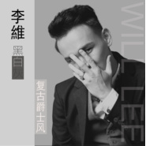

黑白灰改编翻唱专辑
============================

|  |  |
| :--: | :-- |
| [ 黑白灰改编翻唱专辑](https://emumo.xiami.com/album/2100234284) | **艺人**: [李维](../index.md) **语种**: 国语 **唱片公司**: 独立发行 **发行时间**: 2015年11月07日 **专辑类别**: 精选集 **专辑风格**: 爵士流行 Jazz Pop **播放数**: 580055 **收藏数**: 45 **评论数**: 32  |

## 简介

此专辑收录李维的改编翻唱作品，音乐风格主要以爵士音乐风格为主。

## 曲目

## 评论

|  |  |  |
| :-- | :-- | :-- |
|  [虾米用户](https://emumo.xiami.com/u/277957297) 有你就好…… 2018-04-27 11:18 赞(0) 踩(0) | 
黑 白 灰
 |
|  [虾米用户](https://emumo.xiami.com/u/5395337)   2017-10-27 23:52 赞(0) 踩(0) | 
和原唱相性好高 简直是男版 双方都透露出中性的味道
 |
|  [虾米用户](https://emumo.xiami.com/u/189079093)  2016-06-12 10:14 赞(0) 踩(0) | 
为什么跟中国好声音里的声音不一样？？
 |
|  [虾米用户](https://emumo.xiami.com/u/150577774)  2016-04-24 23:41 赞(0) 踩(0) | 
在你身边 我们在爱一遍
 |
|  [虾米用户](https://emumo.xiami.com/u/150577774)  2016-04-24 23:38 赞(0) 踩(0) | 
我承认我想你
 |
|  [虾米用户](https://emumo.xiami.com/u/150577774)  2016-04-24 23:35 赞(0) 踩(0) | 
好吧我承认我想你每个画面都是你
 |
|  [虾米用户](https://emumo.xiami.com/u/150577774)  2016-04-24 23:33 赞(0) 踩(0) | 
❤
 |
|  [虾米用户](https://emumo.xiami.com/u/122549156)   2016-03-14 18:20 赞(0) 踩(0) | 
每一份  每一秒
 |
|  [虾米用户](https://emumo.xiami.com/u/1990321) 愿你心中有爱，心中有善 2016-01-22 23:45 赞(0) 踩(0) | 
翻唱，
 |
|  [虾米用户](https://emumo.xiami.com/u/6547286)  2015-12-07 03:27 赞(0) 踩(0) | 
希望李维多出歌啊，声线很迷人
 |
|  [虾米用户](https://emumo.xiami.com/u/77855166)  2015-11-17 08:52 赞(0) 踩(0) | 
超级好听
 |
|  [虾米用户](https://emumo.xiami.com/u/81800214)  2015-11-12 15:50 赞(0) 踩(0) | 
太好听了
 |
|  [虾米用户](https://emumo.xiami.com/u/81800214)  2015-11-12 15:50 赞(0) 踩(0) | 
好听好听
 |
|  [虾米用户](https://emumo.xiami.com/u/81800214)  2015-11-10 23:51 赞(0) 踩(0) | 
我正在 #亚洲新歌榜# 为 @歌手李维  的新歌 <a href="http://weibo.com/p/10151501_59692965" target="_blank" rel="nofollow noreferrer noopener">http://weibo.com/p/10151501_59692965</a> 打榜！好音乐需要用行动来支持，你也来为喜欢的歌曲加油吧！
 |
|  [虾米用户](https://emumo.xiami.com/u/81800214)  2015-11-10 17:11 赞(0) 踩(0) | 
哇，这首歌真的好听啊。声音温柔磁性
 |
|  [虾米用户](https://emumo.xiami.com/u/81799532)  2015-11-10 17:09 赞(0) 踩(0) | 
特别有fell，大维维唱的很好听
 |
| ⇒ |  [虾米用户](https://emumo.xiami.com/u/31322989) Born to be f... 2016-01-18 23:40 赞(0) 踩(0) | 
feel…
 |
|  [虾米用户](https://emumo.xiami.com/u/40901688)  2015-11-10 15:25 赞(0) 踩(0) | 
非常好听啊，爵士风格也很适合李维呢！
 |
|  [虾米用户](https://emumo.xiami.com/u/12625762) 这个人很持久，什么都没有... 2015-11-09 18:12 赞(0) 踩(0) | 
哈哈，I miss you下架了就出来这首翻唱
 |
|  [虾米用户](https://emumo.xiami.com/u/4409103) 用户忙 2015-11-09 01:22 赞(0) 踩(0) | 
翻唱 akiko-i miss you ，挺好听的
 |
|  [虾米用户](https://emumo.xiami.com/u/81242550)  2015-11-08 20:46 赞(0) 踩(0) | 
很有画面感，适合深秋季节听！  
 |
|  [虾米用户](https://emumo.xiami.com/u/81242550)  2015-11-08 20:21 赞(0) 踩(0) | 
耳朵已怀孕  
 |
|  [虾米用户](https://emumo.xiami.com/u/77894610)  2015-11-08 20:19 赞(0) 踩(0) | 
好听
 |
|  [虾米用户](https://emumo.xiami.com/u/40901688)  2015-11-08 20:18 赞(0) 踩(0) | 
歌词很好，就是不太好学  
 |
|  [虾米用户](https://emumo.xiami.com/u/81222152) 天冷我想回家，童年已经不... 2015-11-08 19:23 赞(0) 踩(0) | 
听了第一遍，感觉比较喜欢前面部分，还有歌词 
 |
|  [虾米用户](https://emumo.xiami.com/u/81222152) 天冷我想回家，童年已经不... 2015-11-08 19:22 赞(0) 踩(0) | 
［想送花花，但没有］
 |
|  [虾米用户](https://emumo.xiami.com/u/8421750) 碧海蓝天爱青岛 2015-11-08 19:16 赞(0) 踩(0) | 
红白蓝～
 |
|  [虾米用户](https://emumo.xiami.com/u/40901688)  2015-11-08 19:03 赞(0) 踩(0) | 
好听
 |
|  [虾米用户](https://emumo.xiami.com/u/77855166)  2015-11-08 18:35 赞(0) 踩(0) | 

 |
|  [虾米用户](https://emumo.xiami.com/u/77855166)  2015-11-08 18:34 赞(0) 踩(0) | 
太好听了
 |
|  [虾米用户](https://emumo.xiami.com/u/32461398) 曾在云上浮想联翩如今也终... 2015-11-08 18:33 赞(0) 踩(0) | 
~
 |
|  [虾米用户](https://emumo.xiami.com/u/75325002)   2015-11-08 18:31 赞(1) 踩(0) | 
好听   
 |
|  [虾米用户](https://emumo.xiami.com/u/73961628) All progress... 2015-11-08 18:24 赞(1) 踩(0) | 
好聽
 |
