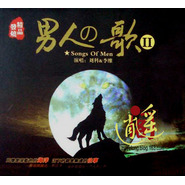

男人の歌Ⅱ
============================

|  |  |
| :--: | :-- |
| [ 男人の歌Ⅱ](https://emumo.xiami.com/album/406042) | **艺人**: [李维](../index.md) **语种**: 国语 **唱片公司**: 深圳音像 **发行时间**: 2010年01月24日 **专辑类别**: 录音室专辑 **专辑风格**:  **播放数**: 699458 **收藏数**: 78 **评论数**: 3  |

## 简介

寂静的苍穹，深沉又空阔，宛如那一面湖蓝色的锦缎，散发着神秘的光芒，黑暗的另一头又有着怎样的一片花田，犹如男人的心境看似平静如水岂知湖下风景，又如男人的肩膀背负着岂是那份超重的担当，坚毅的转身之后是无尽的彷徨，汗水与泪滴夹杂出苦涩的滋味。   
回忆是深蓝色的海洋，沉下的都是无边的往事，一个烟圈圈出一个故事，一首好歌唱出一个人的心声，听...那个磁性的声音是谁在哼唱，品...这耐人寻味的音乐是和谁在共鸣，本张专辑继续由心出发，终点站灵魂深处.......

## 曲目

## 评论

|  |  |  |  |
| :-- | :-- | :-- | :-- |
|  [虾米用户](https://emumo.xiami.com/u/2946741) WUwu~呜呜~唔 2014-05-19 13:48 赞(0) 踩(0) | 
温柔的男生好听↖(￣▽￣&amp;quot;)
 |
|  [虾米用户](https://emumo.xiami.com/u/5990431)  2013-05-13 23:35 赞(0) 踩(0) | 
专辑真的都很好听
 |
|  [虾米用户](https://emumo.xiami.com/u/1264146)  2012-10-10 21:31 赞(0) 踩(0) | 
感动
 |
