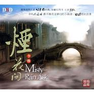

烟花问
============================

|  |  |
| :--: | :-- |
| [ 烟花问](https://emumo.xiami.com/album/410478) | **艺人**: [李维](../index.md) **语种**: 国语 **唱片公司**: 轩乐文化 **发行时间**: 2010年11月01日 **专辑类别**: 录音室专辑 **专辑风格**:  **播放数**: 1114878 **收藏数**: 212 **评论数**: 15  |

## 简介

露珠推开水波，幻梦般的景，如画似的美，  
无意冒犯，却有心逗留，  
谁不愿在这梦幻的小镇谱一如诗般的浪漫……  
  
本张专辑全情突显了李维的天生好嗓，他的声音既华而朴实，又艳而不俗，  
温柔中透露着男儿般的刚毅，在似古亦今的流行乐与古曲中游刃有余，  
而重新编曲后的歌曲如插上翅膀的天使，将是完美的化身！

## 曲目

## 评论

|  |  |  |
| :-- | :-- | :-- |
|  [虾米用户](https://emumo.xiami.com/u/35974133)  2015-09-22 20:29 赞(0) 踩(0) | 
烟花易冷里有二胡，，，感人！
 |
|  [虾米用户](https://emumo.xiami.com/u/40337087)  2014-08-29 23:09 赞(1) 踩(0) | 
好可惜啊，但是还是永远喜欢李维唱的歌
 |
|  [虾米用户](https://emumo.xiami.com/u/27422989)  2013-11-14 09:35 赞(0) 踩(0) | 
在阴天里，外面飘着小雨，安静的坐在电脑前，喝着茶，听着好听的声音。
 |
|  [虾米用户](https://emumo.xiami.com/u/10018709)  2012-09-20 05:31 赞(0) 踩(0) | 
他的传奇币王菲唱的深情!
 |
|  [虾米用户](https://emumo.xiami.com/u/10018709)  2012-09-18 19:31 赞(0) 踩(0) | 
喜欢他的传奇，觉得比王菲唱得更深情！
 |
|  [虾米用户](https://emumo.xiami.com/u/3448999)  2011-11-01 22:23 赞(0) 踩(0) | 
经典老歌翻唱
 |
|  [虾米用户](https://emumo.xiami.com/u/5132949)  2011-08-27 20:09 赞(0) 踩(0) | 
声音好有感觉
 |
|  [虾米用户](https://emumo.xiami.com/u/5016049)  2011-07-26 00:32 赞(0) 踩(0) | 
喜欢
 |
|  [虾米用户](https://emumo.xiami.com/u/1436651)  2011-03-13 19:53 赞(0) 踩(0) | 
虽然从来没听过李维这个名字，但一点不影响我对他嗓音的喜爱
 |
|  [虾米用户](https://emumo.xiami.com/u/1495641)  2011-03-01 23:47 赞(0) 踩(0) | 
一个朋友推荐的李维，不了解他，但觉得歌唱得很有磁性
 |
|  [虾米用户](https://emumo.xiami.com/u/1342581)  2011-01-17 03:23 赞(0) 踩(0) | 
巧缘11月1日发行....
 |
|  [虾米用户](https://emumo.xiami.com/u/2448338) 没有个性怎么签名 2011-01-10 16:55 赞(0) 踩(0) | 
专辑介绍： 露珠推开水波，幻梦般的景，如画似的美， 无意冒犯，却有心逗留， 谁不愿在这梦幻的小镇谱一如诗般的浪漫……  本张专辑全情突显了李维的天生好嗓，他的声音既华而朴实，又艳而不俗，
 |
|  [虾米用户](https://emumo.xiami.com/u/2448338) 没有个性怎么签名 2011-01-10 16:55 赞(0) 踩(0) | 
专辑介绍： 露珠推开水波，幻梦般的景，如画似的美， 无意冒犯，却有心逗留， 谁不愿在这梦幻的小镇谱一如诗般的浪漫……  本张专辑全情突显了李维的天生好嗓，他的声音既华而朴实，又艳而不俗，
 |
|  [虾米用户](https://emumo.xiami.com/u/448761)  2010-11-22 10:14 赞(0) 踩(0) | 
经典
 |
|  [虾米用户](https://emumo.xiami.com/u/900780)  2010-11-12 09:30 赞(0) 踩(0) | 
哈哈  喜欢   追随～～～～～～～～～
 |
