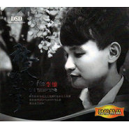
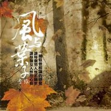

李维
============================

|  |  |
| :--: | :-- |
| [ 李维](https://i.xiami.com/willlee) | **播放数**: 17899002 **粉丝数**: 3815 **评论数**: 257 **地区**: China 中国大陆 **风格**: 华语唱作人 Chinese Singer-Songwriter  |

## 档案

李维，中俄混血，1987年2月3日出生于新疆乌鲁木齐。中国内地男歌手、华语唱作人。原创作品代表作：《过客》、《亲爱的宝贝》、《北方南方》《大雪天》等。2014年的夏，在第三季中国好声音的舞台上，李维凭借演绎歌曲作品《一江水》赢得包括汪峰、那英、齐秦、杨坤在内的四位导师全部转身；并以其细腻、温暖且略带忧伤的声线融化了无数观众的心。  中文名：李维 英文名：Will Lee  出生地：新疆乌鲁木齐 星  座：水瓶座 音乐风格：Pop、R&B  从艺历程： 自2004年起开始从事音乐创作，创作其《我的姑娘》、《亲爱的宝贝》、《寒夜》、《i  wanna》等原创作品  2008年受邀出席王力宏个人演唱会  2009年至2011年先后创作并录制了《大雪天》、《北方南方》、《女孩的故事》等原创作品 2012年担任新疆音乐广播MYFM103.9公益形象大使 2013年4月25日出席“新疆原创音乐  为雅安祁福加油”募捐义演活动  2013年6月出席新疆原创音乐首度签售活动，并献唱原创作品《大雪天》  2013年在新疆电视台《我是新歌手》比赛中获得冠军  2014年5月发行个人原创单曲《过客》 2014年8月参加第三季中国好声音，并获得那英组八强  2014年9月3日做客“新疆原创音乐潮”栏目，畅谈个人的原创音乐故事 2014年10月6日其演唱作品《贝加尔湖畔》获得中国好声音“年度金曲奖”  2014年11月11日出席中国好声音香港红磡演唱会，并献唱《红豆》。 2014年12月6日获得“爱奇艺年度音乐新人”，同年12月21日出席2014新疆原创音乐榜年度颁奖盛典。 2015年1月3日出席中国好声音台北小巨蛋演唱会，并献唱《一江水》。 2015年4月23日以新疆音乐广播MYFM103.9公益形象大使的身份前往乌鲁木齐托里乡小东沟小学，将MYFM音乐教室特别行动——书香满校园活动深入至偏远乡村小学，为孩子们上了一堂生动的音乐课。 2015年5月5日获得新疆第八届风尚之颠颁奖典礼“年度音乐面孔奖” 2015年7月发行首张翻唱专辑《回味》    2015年8月16日随中央电视台“心连心”艺术团赴新疆慰问演出，庆祝新疆维吾尔族自治区成立60周年。   荣誉： 2013年荣获新疆电视台《我是新歌手》栏目总冠军 2014年5月2日发行个人原创单曲《过客》 2014年8月荣获第三季中国好声音那英组八强 2014年10月7日其演唱作品《贝加尔湖畔》  荣获中国好声音“年度金曲奖” 2014年12月6日荣获“2015爱奇艺尖叫之夜”“年度音乐新人奖” 2015年5月5日荣获第八届风尚之巅“年度音乐面孔奖”   社会活动： 自2012年担任新疆音乐广播MYFM103.9公益形象大使以来，李维始终秉承公益之心、用音乐传递爱的正能量——曾多次出席MYFM公益歌友会，并助力新疆MYFM希望工程音乐教室项目计划；2012年-2015年，曾经多次深入新疆偏远乡村小学，走进音乐教室、走近孩子们的音乐世界里，将爱心课外书以及原创唱片送到孩子们手中，以音乐教师的角度让孩子们感知音乐的奇妙乐趣、将知识和音乐的梦想传递给孩子们。与李维而言，此种爱的传递更是一种爱的延续。    评述： 用直白的本真向原创音乐致敬； 用纯粹、执着的热忱告白自己对音乐的挚爱深情—— 他，是16岁毅然背起吉他背井离乡的寻梦少年 他，曾历经十余年酒吧驻唱、饱经风霜 他，拥有最温暖的歌喉且极具音乐创作禀赋 他，兼具专业足球门将的双重角色， 并追求在足球运动中释放自我、在音乐创作中沉淀自我的理念哲学 他，是以最清澄温情的歌声打动亿万观众的心灵歌者  自幼与音乐结缘，音乐似挚友陪伴其一路成长。独自追寻个人音乐的梦想，他始终在路上。他的音乐历程更多的写满了心酸与坎坷，但唯有踏实、诚挚、专注的音乐态度从未改变；温暖且略带忧伤的嗓音是导师汪峰所赋予他的赞誉，然而醇浓的Jazz与自由的R&B同样可以被他演绎的格外精到。帅气的混血脸孔，似乎很难让我们与健硕的门将产生联想，但事实上，他的确追求着在专业足球运动中释放自我、在音乐创作中沉淀自我的个人哲学；有时候，他可以帅到冷峻，但更有亲和的微笑；有时候，水瓶座让他看起来更像是一位有着新奇古怪念头的革新者，诚然，头脑中满满的灵感才诞生出一首首走心的情歌。他是歌手李维，以崭新的姿态向华语乐坛进发的唱作人。

## 专辑

| 名称 | 语种 | 唱片公司 | 发行时间 | 专辑类别 | 专辑风格 |
| :--: | :-- | :-- | :-- | :-- | :-- |
| [ 梦想在望3](./albums/5020559606.md) | 国语 | 红点星文化 | 2020年05月09日 | EP, 单曲 | 国语流行 Mandarin Pop |
| [ 世界为你醒来](./albums/2105830136.md) | 国语 | 红点星文化 | 2020年02月08日 | EP, 单曲 | 国语流行 Mandarin Pop |
| [ 你要去哪里](./albums/2103815314.md) | 国语 | 灿星文化 | 2018年07月17日 | 录音室专辑 | 国语流行 Mandarin Pop |
| [ 告别单身歌](./albums/2103722377.md) | 国语 | 灿星文化 | 2018年05月29日 | EP, 单曲 | 国语流行 Mandarin Pop |
| [ 维•爱](./albums/2102671323.md) | 国语 | 灿星文化 | 2016年12月23日 | 录音室专辑 |  |
| [ 乖乖](./albums/2100317024.md) | 国语 | 灿星文化 | 2016年04月19日 | EP, 单曲 |  |
| [ P.S.我爱你-李维翻唱精选集](./albums/2100262740.md) | 国语 | 独立发行 | 2016年01月19日 | 精选集 | 国语流行 Mandarin Pop |
| [ 也许只见一面](./albums/2100373449.md) | 国语 | 星外星音乐 | 2016年01月01日 | EP, 单曲 |  |
| [ 泽普姑娘](./albums/2100374108.md) | 国语 | 星外星音乐 | 2016年01月01日 | EP, 单曲 |  |
| [ 黑白灰改编翻唱专辑](./albums/2100234284.md) | 国语 | 独立发行 | 2015年11月07日 | 精选集 | 爵士流行 Jazz Pop |
| [ 回味](./albums/2102684226.md) | 国语 | 梦响当然 | 2015年08月20日 | 录音室专辑 | 国语流行 Mandarin Pop |
| [ 尘沙](./albums/628382565.md) | 国语 | 弦音唱片 | 2015年04月02日 | EP, 单曲 |  |
| [ 过客](./albums/1336164948.md) | 国语 | 风云人物 | 2014年08月09日 | EP, 单曲 |  |
| [ 爱是最好的](./albums/127165220.md) | 国语 | 风云人物 | 2014年08月06日 | EP, 单曲 |  |
| [ 烟花问](./albums/410478.md) | 国语 | 轩乐文化 | 2010年11月01日 | 录音室专辑 |  |
| [ 善男信女](./albums/406031.md) | 国语 | 轩乐文化 | 2010年02月03日 | 录音室专辑 |  |
| [ 男人の歌Ⅱ](./albums/406042.md) | 国语 | 深圳音像 | 2010年01月24日 | 录音室专辑 |  |
| [ 秋天的故事](./albums/339915.md) | 国语 | 轩乐文化 | 2009年07月28日 | 录音室专辑 |  |
| [ 情已逝](./albums/317095.md) | 国语 | 轩乐文化 | 2009年01月12日 | 录音室专辑 |  |
| [ 剪爱](./albums/424966.md) | 国语 | 齐鲁音像 | 2008年09月25日 | 录音室专辑 |  |
| [ 天堂的眼泪 殇·悼念](./albums/338625.md) | 国语 | 广东轩乐文化传播有限公司 | 2008年06月20日 | 合集, 杂锦 |  |
| [ 纪念日](./albums/167553.md) | 国语 | 轩乐文化 | 2008年03月19日 | 录音室专辑 |  |
| [ 小小](./albums/33188.md) | 国语 | 轩乐文化 | 2007年10月16日 | 录音室专辑 |  |
| [ 伤逝](./albums/425173.md) | 国语 | 齐鲁音像 | 2007年01月25日 | 录音室专辑 |  |
| [ 风与叶子](./albums/339650.md) | 国语 | 轩乐文化 | 2007年01月09日 | 录音室专辑 |  |
| [ 白狐](./albums/33189.md) | 国语 | 轩乐文化 | 2006年11月01日 | 录音室专辑 |  |

## 评论

|  |  |  |  |
| :-- | :-- | :-- | :-- |
|  [虾米用户](https://emumo.xiami.com/u/48539020)  2021-01-26 01:42 赞(0) 踩(0) | 
听你和周深的贝加尔湖畔，醉倒在你磁性深情的嗓音里   
 |
|  [虾米用户](https://emumo.xiami.com/u/375552116)  2020-05-11 10:24 赞(0) 踩(0) | 
第一次听就惊艳了，这个声音，干净、好听、纯真，属于那种百听不厌的类型!果断收藏，加油李维，支持你!
 |
|  [虾米用户](https://emumo.xiami.com/u/335142898)  2020-01-10 10:48 赞(1) 踩(0) | 
感觉没有比赛那时声音存真，是不是使用技巧太多
 |
|  [虾米用户](https://emumo.xiami.com/u/362453583) 白羊座 2019-10-14 23:06 赞(2) 踩(0) | 
加油
 |
|  [虾米用户](https://emumo.xiami.com/u/412214500)  2019-10-12 23:45 赞(1) 踩(0) | 
天哪！这一江水唱的情深意切，思君不见，多憧憬鸳鸯戏于江水之上。哈哈
 |
|  [虾米用户](https://emumo.xiami.com/u/314483310) 唯音乐对我始终忠诚。 2019-06-23 15:46 赞(4) 踩(0) | 
这个声音恍惚以为是陈楚生
 |
|  [虾米用户](https://emumo.xiami.com/u/11902546)  2019-05-25 09:53 赞(3) 踩(0) | 
这个声音恍惚以为是齐秦
 |
|  [虾米用户](https://emumo.xiami.com/u/274641568)  2019-05-03 23:14 赞(1) 踩(0) | 
去年父亲去世，勾起对往事的回忆，是因为从心里走过，有过那段痛。
 |
|  [虾米用户](https://emumo.xiami.com/u/293692544) 你敢给我说话吗？我咬你 2019-03-28 05:12 赞(3) 踩(0) | 
好听
 |
|  [虾米用户](https://emumo.xiami.com/u/375733226)  2019-02-03 11:58 赞(2) 踩(0) | 
我喜欢这首歌
 |
|  [虾米用户](https://emumo.xiami.com/u/277957297) 有你就好…… 2018-11-25 22:56 赞(2) 踩(0) | 
我！爱的可惜不是你我！对不起我无心伤了你
 |
|  [虾米用户](https://emumo.xiami.com/u/2409614)  2018-09-06 17:17 赞(2) 踩(0) | 
那英有眼光，只是势利眼盖过欣赏才华的眼光。
 |
|  [虾米用户](https://emumo.xiami.com/u/214770701) 边伯贤小迷妹 2018-08-12 23:59 赞(2) 踩(0) | 

 |
|  [虾米用户](https://emumo.xiami.com/u/214770701) 边伯贤小迷妹 2018-08-12 23:59 赞(2) 踩(0) | 
好听哎
 |
|  [虾米用户](https://emumo.xiami.com/u/338337215)  2018-07-03 21:44 赞(3) 踩(0) | 
都很好听
 |
|  [虾米用户](https://emumo.xiami.com/u/353296618) 余音绕梁 2018-06-27 03:35 赞(1) 踩(0) | 
这vyckxuvm
 |
|  [虾米用户](https://emumo.xiami.com/u/37974489) 你见过那么炫酷的未知生物... 2018-05-31 13:09 赞(1) 踩(0) | 
看你和馨予歌唱过？认识她吗？她最近怎么没出歌？想听
 |
|  [虾米用户](https://emumo.xiami.com/u/38374937)  2017-11-23 21:22 赞(2) 踩(0) | 
喜欢你的歌曲，加油
 |
|  [虾米用户](https://emumo.xiami.com/u/40846216)  2017-10-27 23:03 赞(3) 踩(0) | 
新疆的歌手 李维《可惜不是你》，好听！你不只有《一江水》！
 |
|  [虾米用户](https://emumo.xiami.com/u/295142792)  2017-09-30 23:09 赞(2) 踩(0) | 
加油，会一直关注你的
 |
|  [虾米用户](https://emumo.xiami.com/u/277872642) 黑无常 2017-09-18 19:59 赞(1) 踩(0) | 
还行，但有音唱走了。
 |
|  [虾米用户](https://emumo.xiami.com/u/7525920) 因为稀奇神奇，所以才歌颂... 2017-09-17 14:45 赞(1) 踩(0) | 
你的翻唱是一绝
 |
|  [虾米用户](https://emumo.xiami.com/u/7525920) 因为稀奇神奇，所以才歌颂... 2017-09-17 14:42 赞(1) 踩(0) | 
喜欢你的歌！每一首都很好听
 |
|  [虾米用户](https://emumo.xiami.com/u/248758865) 此时此刻的云，十八九岁的... 2017-09-02 07:38 赞(1) 踩(0) | 
从你一首美丽心情开始，唯美意境始终难忘。
 |
|  [虾米用户](https://emumo.xiami.com/u/40258675)   2017-08-22 09:51 赞(0) 踩(0) | 
内容已删除
 |
| ⇒ |  [虾米用户](https://emumo.xiami.com/u/15266895) 瑕不掩 2017-10-18 17:51 赞(0) 踩(0) | 
好像是杨琴
 |
|  [虾米用户](https://emumo.xiami.com/u/299696520)  2017-08-20 21:52 赞(1) 踩(0) | 
翻唱的不错
 |
|  [虾米用户](https://emumo.xiami.com/u/317372688) Salsamba 2017-08-18 02:17 赞(1) 踩(0) | 
你好，你的音乐很棒！我们是来自美国的爵士乐团Salsamba latin jazz group，刚刚上传了我们的一张专辑，希望大家能够互相欣赏互相交流。
 |
|  [虾米用户](https://emumo.xiami.com/u/315785784)  2017-08-10 20:05 赞(1) 踩(0) | 
我很喜欢做我老婆好不好这首歌，你唱的很好，跟原唱唱的一样
 |
|  [虾米用户](https://emumo.xiami.com/u/304821466)  2017-06-16 11:50 赞(1) 踩(0) | 
好听 纯纯的
 |
|  [虾米用户](https://emumo.xiami.com/u/72553312)  2017-05-18 19:01 赞(0) 踩(0) | 
声音旋律都很美，把音把的相当到位！如果都是快感歌就好了！男声歌曲大多数好听的就是李维和郑源了，支持你们
 |
|  [虾米用户](https://emumo.xiami.com/u/72553312)  2017-05-18 18:59 赞(0) 踩(0) | 
我最喜欢的男声音
 |
|  [虾米用户](https://emumo.xiami.com/u/12505542) 世界与我同行，唯有音乐读... 2017-04-25 13:47 赞(1) 踩(0) | 
第一次听到李维的声音还以为是齐秦的歌曲在播放   很舒服、喜欢祝福你越来越好新疆小伙子！ 
 |
|  [虾米用户](https://emumo.xiami.com/u/14252639) . 2017-04-11 08:59 赞(1) 踩(0) | 
in
 |
|  [虾米用户](https://emumo.xiami.com/u/286006470)  2017-04-04 15:53 赞(2) 踩(0) | 
李维：你的声线超磁性、超男人，超好听，我将画心刻成光盘在车上听，听了几年都不知哪位大神唱的那么棒，今天装了个虾米音乐才知道原来是大神李维   
 |
|  [虾米用户](https://emumo.xiami.com/u/269000888)   2017-03-31 21:19 赞(1) 踩(0) | 
希望推出贝加尔湖畔独唱版本
 |
|  [虾米用户](https://emumo.xiami.com/u/283364566)  2017-03-25 22:12 赞(1) 踩(0) | 
特别喜欢你
 |
|  [虾米用户](https://emumo.xiami.com/u/271783925)  2017-02-12 11:13 赞(1) 踩(0) | 
李维，我非常喜欢你的贝加尔湖畔，我也是一个不懂音乐的人，但是我了你的贝加尔湖畔我就听了又想听               我支持你，加油！
 |
|  [虾米用户](https://emumo.xiami.com/u/42783897)  2017-01-28 13:11 赞(5) 踩(0) | 
李维和周深都喜欢
 |
|  [虾米用户](https://emumo.xiami.com/u/22409034)  2017-01-14 02:38 赞(1) 踩(0) | 
控制力很好，发音方式有点单一，音域如果能更广一些，会更好 
 |
|  [虾米用户](https://emumo.xiami.com/u/49640493) 网易云SAINTDONT... 2016-12-28 13:48 赞(1) 踩(0) | 

 |
|  [虾米用户](https://emumo.xiami.com/u/6950773) 聽..  風在哪唱歌 2016-12-12 22:04 赞(2) 踩(0) | 
好聽 歌聲有感情
 |
|  [虾米用户](https://emumo.xiami.com/u/8337431) 以乐会友 2016-11-10 00:53 赞(1) 踩(0) | 
好声音 216
 |
|  [虾米用户](https://emumo.xiami.com/u/35032550)  2016-10-18 14:02 赞(2) 踩(0) | 
加油李维！
 |
|  [虾米用户](https://emumo.xiami.com/u/50550535) 最好的滋味就是耐人寻味 2016-09-26 02:34 赞(1) 踩(0) | 
此声只应天上有
 |
|  [虾米用户](https://emumo.xiami.com/u/164552134) 想你 2016-05-27 22:17 赞(1) 踩(0) | 
歌声好好听，又醉人  
 |
|  [虾米用户](https://emumo.xiami.com/u/74791348) 南风熏昼长 2016-05-16 15:58 赞(1) 踩(0) | 
换张封面啊 虽然这张最符合他身上的气质
 |
|  [虾米用户](https://emumo.xiami.com/u/16135450)  2016-05-05 21:29 赞(2) 踩(0) | 
493
 |
|  [虾米用户](https://emumo.xiami.com/u/8070377) 爱雾瑞性维欧腐漏 2016-04-30 23:08 赞(0) 踩(0) | 
觉得你越长越像gareth gates 噗
 |
|  [虾米用户](https://emumo.xiami.com/u/141528416)  2016-04-14 21:38 赞(2) 踩(0) | 
特别喜欢贝加尔湖畔
 |
|  [虾米用户](https://emumo.xiami.com/u/45269755)  2015-12-25 00:47 赞(6) 踩(0) | 
我最喜欢的声音，没有之一。李维加油加油！
 |
|  [虾米用户](https://emumo.xiami.com/u/81919244)  2015-11-11 06:32 赞(3) 踩(0) | 
歌声醉人 
 |
|  [虾米用户](https://emumo.xiami.com/u/81643938)  2015-11-10 06:58 赞(2) 踩(0) | 
李维 
 |
|  [虾米用户](https://emumo.xiami.com/u/81250964)  2015-11-08 20:50 赞(8) 踩(0) | 
治愈系创作男歌手，爱死你啦  
 |
|  [虾米用户](https://emumo.xiami.com/u/81222152) 天冷我想回家，童年已经不... 2015-11-08 19:13 赞(9) 踩(0) | 
不懂音乐，但李维演绎的很多歌曲都非常喜欢，他的歌声传情，加之他声音的美丽，让人总是惦念。
 |
|  [虾米用户](https://emumo.xiami.com/u/81222152) 天冷我想回家，童年已经不... 2015-11-08 19:10 赞(0) 踩(0) | 
大维 
 |
|  [虾米用户](https://emumo.xiami.com/u/77855166)  2015-11-04 20:37 赞(0) 踩(0) | 
 
 |
|  [虾米用户](https://emumo.xiami.com/u/77855166)  2015-11-04 20:37 赞(0) 踩(0) | 
 
 |
|  [虾米用户](https://emumo.xiami.com/u/37069438) 清静无为乃大道 2015-11-04 00:52 赞(0) 踩(0) | 
李维,全是 翻唱经典,
 |
| ⇒ |  [虾米用户](https://emumo.xiami.com/u/75325002)   2015-11-08 07:00 赞(0) 踩(0) | 
“亲爱的宝贝””寒夜”“过客”“大雪天”“I wanna"是他自己作词作曲哦，很好听 
 |
|  [虾米用户](https://emumo.xiami.com/u/46045015)  2015-10-30 22:19 赞(11) 踩(0) | 
因为李维，我才喜欢上好声音，可是看来看去，从上届到这届，也只有李维的声音让人感动、难忘。   
 |
|  [虾米用户](https://emumo.xiami.com/u/40901688)  2015-10-30 18:37 赞(3) 踩(0) | 
大维维，加油。
 |
|  [虾米用户](https://emumo.xiami.com/u/45955383)  2015-10-30 14:33 赞(4) 踩(0) | 
支持李维
 |
|  [虾米用户](https://emumo.xiami.com/u/77855166)  2015-10-30 10:45 赞(3) 踩(0) | 
李维的声音好听
 |
|  [虾米用户](https://emumo.xiami.com/u/77855166)  2015-10-30 10:45 赞(4) 踩(0) | 
刚知道虾米音乐还有李维～～吼吼吼！赞一个
 |
|  [虾米用户](https://emumo.xiami.com/u/44616608) 上帝会牵着你的手，只要你... 2015-10-29 21:21 赞(36) 踩(0) | 
我刚入驻了虾米音乐人，欢迎大家来我的个人主页，收听我的最新音乐
 |
| ⇒ |  [虾米用户](https://emumo.xiami.com/u/75325002)   2015-10-30 09:34 赞(0) 踩(0) | 
支持你 
 |
|  [虾米用户](https://emumo.xiami.com/u/73961628) All progress... 2015-10-26 17:47 赞(4) 踩(0) | 
动听的情歌，娓娓道来。
 |
|  [虾米用户](https://emumo.xiami.com/u/4845630)  2015-10-22 20:02 赞(4) 踩(0) | 
早就听过李维的歌，看到好声音当时还怀疑是不是同一个人，结果真的是。
 |
|  [虾米用户](https://emumo.xiami.com/u/5520722) 我不想写什么... 2015-10-21 11:15 赞(3) 踩(0) | 
恭喜入驻虾米，希望多出些自己的作品，加油！
 |
|  [虾米用户](https://emumo.xiami.com/u/11478403)  2015-10-19 15:47 赞(1) 踩(0) | 
声音清澈纯净！但不似周深过于娘气！
 |
|  [虾米用户](https://emumo.xiami.com/u/40891302)   2015-10-16 17:59 赞(6) 踩(0) | 
身为一个声控我已经哭了
 |
|  [虾米用户](https://emumo.xiami.com/u/5436807)  2015-09-26 17:31 赞(9) 踩(0) | 
这一届的好声音没有什么喜欢的歌手，翻来覆去看上一届好声音的几段视频，其中一江水和贝加尔湖是重播几率最高的片段了。无关国别地域曲风，打动人心的就是好音乐~！
 |
|  [虾米用户](https://emumo.xiami.com/u/454506) 我还没想好要写什么... 2015-08-24 04:21 赞(2) 踩(0) | 
好舒服的聲音
 |
|  [虾米用户](https://emumo.xiami.com/u/8070377) 爱雾瑞性维欧腐漏 2015-07-24 23:41 赞(2) 踩(0) | 
很会唱
 |
|  [虾米用户](https://emumo.xiami.com/u/47853703) 古典布鲁斯发烧友 2015-06-20 00:36 赞(10) 踩(0) | 
学习音乐也有好多年，第一次被这种声音震撼到，非常喜欢你的声音，希望以后可以听到像一江水，贝加尔湖畔档次的作品，坚持才是最重要的
 |
|  [虾米用户](https://emumo.xiami.com/u/48024789) 听到失眠 2015-06-13 16:46 赞(16) 踩(0) | 
张信哲说：我太喜欢太喜欢李维的声音了。
 |
| ⇒ |  [虾米用户](https://emumo.xiami.com/u/77855166)  2015-11-08 18:46 赞(0) 踩(0) | 
是啊是啊
 |
|  [虾米用户](https://emumo.xiami.com/u/4911883) 如果你也爱Eason 2015-04-17 00:21 赞(3) 踩(0) | 
原来李维出过这么多专辑  真棒
 |
|  [虾米用户](https://emumo.xiami.com/u/5520722) 我不想写什么... 2015-04-05 14:11 赞(3) 踩(0) | 
好听，加油！希望能出自己的作品。
 |
|  [虾米用户](https://emumo.xiami.com/u/6385284) 我还没想好要写什么... 2015-03-15 11:01 赞(4) 踩(0) | 
非常好的声音外形但是缺乏内在的感觉。。。
 |
|  [虾米用户](https://emumo.xiami.com/u/5026326) 爱唱歌的孩子都是好孩子～ 2015-03-13 14:24 赞(0) 踩(0) | 
温温柔柔的。。
 |
|  [虾米用户](https://emumo.xiami.com/u/5026326) 爱唱歌的孩子都是好孩子～ 2015-03-12 13:02 赞(2) 踩(0) | 
声音好舒服  好干净。。。
 |
|  [虾米用户](https://emumo.xiami.com/u/47406920)  2015-02-18 11:55 赞(3) 踩(0) | 
加油， 我第一次听到你的歌一江水就爱上了你的声音。。太美了！
 |
|  [虾米用户](https://emumo.xiami.com/u/1699025)  2014-12-31 11:40 赞(0) 踩(0) | 
听哭
 |
|  [虾米用户](https://emumo.xiami.com/u/45290601)  2014-12-25 23:49 赞(0) 踩(0) | 
加油兄弟！希望你未来的路越走越顺!箭牌头号射手...你懂的⚽
 |
|  [虾米用户](https://emumo.xiami.com/u/43255679)   2014-12-23 13:41 赞(2) 踩(0) | 
深情、细腻的嗓音好迷人！喜欢李维！
 |
|  [虾米用户](https://emumo.xiami.com/u/43043884) 再看！再看这里也不会跳出... 2014-12-20 10:54 赞(0) 踩(0) | 
好棒啊啊啊啊啊好温柔ヽ(；▽；)ノ像午夜梦回低语 心要被揉碎了啊啊啊
 |
|  [虾米用户](https://emumo.xiami.com/u/40511711)  2014-12-13 06:36 赞(0) 踩(0) | 
..
 |
|  [虾米用户](https://emumo.xiami.com/u/33041357) 表里不一 2014-12-10 10:29 赞(1) 踩(0) | 
努力爱了这一场，……到最后却还是将此收藏
 |
|  [虾米用户](https://emumo.xiami.com/u/1581742)  2014-12-10 10:10 赞(1) 踩(0) | 
支持~非常喜欢你的声音
 |
|  [虾米用户](https://emumo.xiami.com/u/43659258)   2014-11-13 23:42 赞(1) 踩(0) | 
维大大，虽然我是男的  但是我要对你说，我爱你。。天天反复听你的歌
 |
|  [虾米用户](https://emumo.xiami.com/u/23604740) 死而后生 2014-11-12 17:50 赞(2) 踩(0) | 
像发现了宝贝一样发现他有这么多专辑，整颗心被他唱碎了，一个女子为他的声音疯狂，流泪
 |
|  [虾米用户](https://emumo.xiami.com/u/43294438) 暂无签名~ 2014-11-03 08:45 赞(0) 踩(0) | 
真心喜欢你的声音。
 |
|  [虾米用户](https://emumo.xiami.com/u/42998804)  2014-11-01 14:53 赞(0) 踩(0) | 
《贝加尔湖畔》让我感动
 |
|  [虾米用户](https://emumo.xiami.com/u/8270213) 清净地 2014-10-30 19:25 赞(0) 踩(0) | 
温柔的声音
 |
|  [虾米用户](https://emumo.xiami.com/u/42191849)  2014-10-19 10:12 赞(0) 踩(0) | 
温暖清澈
 |
|  [虾米用户](https://emumo.xiami.com/u/42346288)   2014-10-19 09:42 赞(0) 踩(0) | 
喜欢的声音
 |
|  [虾米用户](https://emumo.xiami.com/u/8673437) dernier-jour 2014-10-18 21:48 赞(0) 踩(0) | 
很好。
 |
|  [虾米用户](https://emumo.xiami.com/u/42446352)  2014-10-12 20:58 赞(0) 踩(0) | 
很疼的温暖
 |
|  [虾米用户](https://emumo.xiami.com/u/13413786) 加我微信TGSshell... 2014-10-09 19:38 赞(0) 踩(0) | 
虽然大都是翻唱歌曲  不过怎么那么好听啊
 |
|  [虾米用户](https://emumo.xiami.com/u/38441694)   2014-10-08 17:21 赞(0) 踩(0) | 
很喜欢～
 |
|  [虾米用户](https://emumo.xiami.com/u/11630700)  2014-10-06 22:46 赞(0) 踩(0) | 
清澈的声音
 |
|  [虾米用户](https://emumo.xiami.com/u/7750515) Cloud  Nine 2014-10-05 23:28 赞(0) 踩(0) | 
不虚浮不矫饰
 |
|  [虾米用户](https://emumo.xiami.com/u/42010969) 音符飘动，随声漫行！ 2014-10-04 01:26 赞(1) 踩(0) | 
他的声音，真切朴实，静缓舒展！流水般清澈，阳光般温暖！在清凉的早晨，暖洋的午后，静寂的子夜，一首首暖流涌进，浸入心脾！随其声触景生情，直抒胸怀！这就是李维好声音魅力所在！
 |
| ⇒ |  [虾米用户](https://emumo.xiami.com/u/42191849)  2014-10-19 10:15 赞(0) 踩(0) | 
遇到熟人拉,哈哈
 |
| ⇒ |  [虾米用户](https://emumo.xiami.com/u/42010969) 音符飘动，随声漫行！ 2014-10-25 19:02 赞(0) 踩(0) | 
<q><b>littlebaby348说：</b></q>
 |
|  [虾米用户](https://emumo.xiami.com/u/7753074)  2014-10-03 00:38 赞(36) 踩(0) | 
李维要是和周深早点认识，也弄个组合的话。这届冠军肯定是李周组合的！
 |
| ⇒ |  [虾米用户](https://emumo.xiami.com/u/52218267)  2015-07-11 14:22 赞(0) 踩(0) | 

 |
|  [虾米用户](https://emumo.xiami.com/u/39447999)  2014-09-29 13:27 赞(0) 踩(0) | 
原来有这么多歌啊！
 |
|  [虾米用户](https://emumo.xiami.com/u/9360539) 愿无岁月可回头 2014-09-28 10:59 赞(0) 踩(0) | 
原来他已经唱过这么多个
 |
|  [虾米用户](https://emumo.xiami.com/u/40637710) 暂无签名~ 2014-09-28 03:35 赞(1) 踩(0) | 
听李维的歌感觉心都被揉碎了，好喜欢好喜欢你的声音，感谢好声音才能听到这么好听的声音。李维，加油！
 |
|  [虾米用户](https://emumo.xiami.com/u/41734809)  2014-09-27 14:43 赞(0) 踩(0) | 
很像齐秦
 |
|  [虾米用户](https://emumo.xiami.com/u/1270354)  2014-09-26 14:07 赞(0) 踩(0) | 
浓情 细腻
 |
|  [虾米用户](https://emumo.xiami.com/u/41089489)  2014-09-23 22:10 赞(1) 踩(0) | 
好听，也是我看好的人，没想到下来了。那首贝加尓湖畔，还有送别，真的唱到泪下。支持你
 |
|  [虾米用户](https://emumo.xiami.com/u/13174668)  2014-09-21 02:00 赞(0) 踩(0) | 
清澈温暖，听着声音会爱上人。
 |
|  [虾米用户](https://emumo.xiami.com/u/39697017) 暂无签名~ 2014-09-18 19:50 赞(0) 踩(0) | 
支持我大新疆的歌手。太好听！！！
 |
|  [虾米用户](https://emumo.xiami.com/u/41240345)  2014-09-14 22:55 赞(0) 踩(0) | 
加油
 |
|  [虾米用户](https://emumo.xiami.com/u/41150379)  2014-09-12 22:42 赞(0) 踩(0) | 
心像是结成了冰凌，凝固在那灵动的声音里，太美了
 |
|  [虾米用户](https://emumo.xiami.com/u/31596101)  2014-09-12 09:40 赞(0) 踩(0) | 
这么好的声音难道没有人为他量身打造制作一张专辑吗？
 |
|  [虾米用户](https://emumo.xiami.com/u/40011134) 每一首歌都是我的生命 2014-09-11 22:15 赞(0) 踩(0) | 
我的新歌欢迎前来鉴赏，你会喜欢的，也许正是你想的！<a href="http://i.xiami.com/airejake/demo/1773510764?spm=a1z1s.6639473.471965917.2.MHYQOq" target="_blank" rel="nofollow noreferrer noopener">http://i.xiami.com/airejake/demo/1773510764?spm=a1z1s.6639473.471965917.2.MHYQOq</a>《已不再是那个青春年代》！
 |
|  [虾米用户](https://emumo.xiami.com/u/31499218)  2014-09-11 18:52 赞(1) 踩(0) | 
这位来自新疆的俄罗斯血统歌手，真是唱什么歌都好听啊，好声音把他淘汰了，真是瞎了耳朵啦
 |
| ⇒ |  [虾米用户](https://emumo.xiami.com/u/33920072) BeeBoo 2014-09-15 13:14 赞(0) 踩(0) | 
同意
 |
|  [虾米用户](https://emumo.xiami.com/u/41089067)  2014-09-10 22:23 赞(1) 踩(0) | 
感动心灵的天簌之音
 |
|  [虾米用户](https://emumo.xiami.com/u/37000249)  2014-09-07 18:29 赞(0) 踩(0) | 
被你感动到稀里哗啦的。超爱
 |
|  [虾米用户](https://emumo.xiami.com/u/37000249)  2014-09-07 18:22 赞(0) 踩(0) | 
让灵魂感动的声音
 |
|  [虾米用户](https://emumo.xiami.com/u/40442160)  2014-09-07 09:43 赞(0) 踩(0) | 
4
 |
|  [虾米用户](https://emumo.xiami.com/u/39444724)  2014-09-07 01:31 赞(1) 踩(0) | 
喜欢你和周深的那首 贝尔加湖畔
 |
| ⇒ |  [虾米用户](https://emumo.xiami.com/u/33920072) BeeBoo 2014-09-15 13:15 赞(0) 踩(0) | 
对
 |
|  [虾米用户](https://emumo.xiami.com/u/3086749) 我还没想好要写什么... 2014-09-07 01:26 赞(0) 踩(0) | 
就是喜欢
 |
|  [虾米用户](https://emumo.xiami.com/u/40923269)  2014-09-06 18:21 赞(0) 踩(0) | 
哥在这期里最看中的就是李维，，，
 |
|  [虾米用户](https://emumo.xiami.com/u/20893862)  2014-09-05 11:50 赞(0) 踩(0) | 
好听，都是喜欢的歌
 |
|  [虾米用户](https://emumo.xiami.com/u/17004841) 战士 /B站:猴子bbn... 2014-09-05 09:28 赞(0) 踩(0) | 
为什么被淘汰
 |
| ⇒ |  [虾米用户](https://emumo.xiami.com/u/41581177)  2014-09-23 07:01 赞(0) 踩(0) | 
很好
 |
|  [虾米用户](https://emumo.xiami.com/u/38621881)   2014-09-05 04:06 赞(0) 踩(0) | 
很早的时候听风与叶子觉得这人的声音真好听，没想到会是他
 |
|  [虾米用户](https://emumo.xiami.com/u/6979798)  2014-09-04 22:16 赞(0) 踩(0) | 
太动人了，真心喜欢！
 |
|  [虾米用户](https://emumo.xiami.com/u/40780421)  2014-09-04 13:46 赞(0) 踩(0) | 
听李维的歌就是一种享受，声音真的太美太美啦
 |
|  [虾米用户](https://emumo.xiami.com/u/8673779) 环境的压力下，音乐是浮木 2014-09-04 13:10 赞(0) 踩(0) | 
喜欢你的声音，非常好听。。。
 |
|  [虾米用户](https://emumo.xiami.com/u/6398851)  2014-09-03 20:49 赞(0) 踩(0) | 
有味道
 |
|  [虾米用户](https://emumo.xiami.com/u/35841925) 我是小虾米 2014-09-03 18:18 赞(0) 踩(0) | 
真的很不错
 |
|  [虾米用户](https://emumo.xiami.com/u/40552601)  2014-09-03 14:04 赞(1) 踩(0) | 
本人还是喜欢柔的歌曲，像嘶来吼去的歌不喜欢，所以觉得那姐有点错了，周深、李维的声音完全可以去拼冠的。
 |
|  [虾米用户](https://emumo.xiami.com/u/31622811)   2014-09-03 13:54 赞(0) 踩(0) | 
李维加油哦
 |
|  [虾米用户](https://emumo.xiami.com/u/40780421)  2014-09-03 10:22 赞(0) 踩(0) | 
李维唱的红豆，是男版最好听最有感情的
 |
|  [虾米用户](https://emumo.xiami.com/u/9140066)  2014-09-03 09:40 赞(0) 踩(0) | 
李维，加油，以后你出唱片我肯定买
 |
| ⇒ |  [虾米用户](https://emumo.xiami.com/u/33920072) BeeBoo 2014-09-15 13:15 赞(0) 踩(0) | 
一樣
 |
|  [虾米用户](https://emumo.xiami.com/u/40780421)  2014-09-03 01:25 赞(0) 踩(0) | 
因为你才下载的虾米音乐，永远支持你，李维。
 |
|  [虾米用户](https://emumo.xiami.com/u/1034840)  2014-09-02 14:47 赞(0) 踩(0) | 
李维唱歌好深情，歌声里面满满都是岁月。周深的嗓音是世间少有。都是好声音。
 |
|  [虾米用户](https://emumo.xiami.com/u/3276392)  2014-09-02 12:01 赞(0) 踩(0) | 
天籁的嗓音 淡淡的忧伤
 |
|  [虾米用户](https://emumo.xiami.com/u/40652060)  2014-09-02 11:17 赞(1) 踩(0) | 
爱死这种声音了，男音我就觉得齐秦这种类型最好听
 |
|  [虾米用户](https://emumo.xiami.com/u/40744743)  2014-09-02 10:54 赞(0) 踩(0) | 
为什么没有一江水
 |
|  [虾米用户](https://emumo.xiami.com/u/38572445)  2014-09-01 23:16 赞(0) 踩(0) | 
一江水 很赞
 |
| ⇒ |  [虾米用户](https://emumo.xiami.com/u/33920072) BeeBoo 2014-09-15 13:17 赞(0) 踩(0) | 
听到鼻酸，被出局没道理
 |
|  [虾米用户](https://emumo.xiami.com/u/40713370)  2014-09-01 22:43 赞(0) 踩(0) | 
好干净的声音
 |
|  [虾米用户](https://emumo.xiami.com/u/40329458) 不见其人，先闻其声 2014-09-01 21:01 赞(0) 踩(0) | 
你的声音好温暖，听了之后又有种想哭的心情
 |
| ⇒ |  [虾米用户](https://emumo.xiami.com/u/40780421)  2014-09-03 01:25 赞(0) 踩(0) | 
同感
 |
|  [虾米用户](https://emumo.xiami.com/u/13278768) 我想和音乐谈一谈 2014-09-01 16:34 赞(0) 踩(0) | 
好温暖的声音
 |
|  [虾米用户](https://emumo.xiami.com/u/31797779)  2014-09-01 14:13 赞(0) 踩(0) | 
支持一下
 |
|  [虾米用户](https://emumo.xiami.com/u/40707795)  2014-09-01 13:51 赞(0) 踩(0) | 
支持一下
 |
|  [虾米用户](https://emumo.xiami.com/u/3991234) 快乐度过每一天。 2014-09-01 12:25 赞(0) 踩(0) | 
声音像齐秦。。
 |
|  [虾米用户](https://emumo.xiami.com/u/31975552)   2014-09-01 11:57 赞(0) 踩(0) | 
如果他选了齐秦，说不准还能保导师队伍前4名。可惜他选了那英，还是被淘汰。有时候模仿也不是件坏事。。。
 |
|  [虾米用户](https://emumo.xiami.com/u/776020)  2014-09-01 11:37 赞(0) 踩(0) | 
听你的贝加尔湖畔听哭了，太喜欢你的声音了。加油！
 |
|  [虾米用户](https://emumo.xiami.com/u/6821723)  2014-09-01 08:23 赞(0) 踩(0) | 
可惜了啊，那英战队居然没有男歌手出线，觉得李维声线，发音确实有点像齐秦，像“o” “ong”都难以让人不联系到小哥，但是也绝对有不同，比如 “i” 音………… 总的来说没有齐秦飘，更浓郁一些。淡淡的忧伤最高级，齐秦的这句用在他身上最合适了，温柔一刀，果然还是不适合比赛吗o(￣ヘ￣o＃)
 |
|  [虾米用户](https://emumo.xiami.com/u/40687560)  2014-09-01 08:21 赞(0) 踩(0) | 
好听。虽然没选上，不影响好听。
 |
|  [虾米用户](https://emumo.xiami.com/u/17229222)  2014-08-31 23:11 赞(0) 踩(0) | 
好好听，最适合夜晚听，治愈系，加油↖(^ω^)↗
 |
|  [虾米用户](https://emumo.xiami.com/u/821320)  2014-08-31 22:07 赞(0) 踩(0) | 
多难得出一个齐秦，多难得出一个李维。一江水是各版本里最喜欢的，希望出CD版。
 |
|  [虾米用户](https://emumo.xiami.com/u/40679021)  2014-08-31 21:19 赞(0) 踩(0) | 
太爱李维的声音～！！加油加油！
 |
|  [虾米用户](https://emumo.xiami.com/u/2135638) 行心是，图心安。 2014-08-31 18:19 赞(0) 踩(0) | 
这声音能被淘汰了。太扯了吧。
 |
|  [虾米用户](https://emumo.xiami.com/u/34106034) 暂无签名~ 2014-08-31 17:24 赞(0) 踩(0) | 
继续加油吧
 |
|  [虾米用户](https://emumo.xiami.com/u/39874389)  2014-08-31 14:18 赞(0) 踩(0) | 
李维加油。
 |
|  [虾米用户](https://emumo.xiami.com/u/40366773)  2014-08-31 13:27 赞(1) 踩(0) | 
选错老师了，该选齐秦，那就一定火了！
 |
|  [虾米用户](https://emumo.xiami.com/u/2932264)  2014-08-31 02:53 赞(0) 踩(0) | 
难得听哭了。
 |
|  [虾米用户](https://emumo.xiami.com/u/6373063) 为爱而  2014-08-31 02:03 赞(0) 踩(0) | 
我感觉，李维如翻唱李健的歌，能把李健唱哭唱尿唱得再不敢唱……
 |
| ⇒ |  [虾米用户](https://emumo.xiami.com/u/9140066)  2014-09-01 12:29 赞(0) 踩(0) | 
哈哈哈
 |
| ⇒ |  [虾米用户](https://emumo.xiami.com/u/6373063) 为爱而  2014-09-01 12:33 赞(0) 踩(0) | 
<q><b>线条561说：</b></q>
 |
| ⇒ |  [虾米用户](https://emumo.xiami.com/u/10156342)  2014-09-02 08:27 赞(0) 踩(0) | 
说的好绝
 |
| ⇒ |  [虾米用户](https://emumo.xiami.com/u/6373063) 为爱而  2014-09-02 12:22 赞(0) 踩(0) | 
<q><b>晚风吹来说：</b></q>
 |
|  [虾米用户](https://emumo.xiami.com/u/4511518)   2014-08-30 23:53 赞(0) 踩(0) | 
李维，支持你！但是你真的选错导师了(~_~;)
 |
|  [虾米用户](https://emumo.xiami.com/u/3344334)  2014-08-30 23:22 赞(0) 踩(0) | 
好好听啊！细水流来~~~~
 |
|  [虾米用户](https://emumo.xiami.com/u/8793961)  2014-08-30 22:14 赞(0) 踩(0) | 
赞他
 |
|  [虾米用户](https://emumo.xiami.com/u/40545237) 暂无签名~ 2014-08-30 21:20 赞(0) 踩(0) | 
加油 你最棒
 |
|  [虾米用户](https://emumo.xiami.com/u/40626382)  2014-08-30 18:38 赞(0) 踩(0) | 
永远支持你
 |
|  [虾米用户](https://emumo.xiami.com/u/40597910) 暂无签名~ 2014-08-30 18:21 赞(0) 踩(0) | 
用心的歌者，大爱。
 |
|  [虾米用户](https://emumo.xiami.com/u/7757936) 不抽烟、不喝酒、不和女孩... 2014-08-30 16:18 赞(0) 踩(0) | 
以前就听过他的歌，没想到就是好声音的那个李维。
 |
|  [虾米用户](https://emumo.xiami.com/u/1074667) ekawa yats 2014-08-30 15:28 赞(0) 踩(0) | 
第三季最喜欢的男歌手~
 |
|  [虾米用户](https://emumo.xiami.com/u/11416610) 我就笑笑不说话~~ 2014-08-30 12:27 赞(0) 踩(0) | 
赞~
 |
|  [虾米用户](https://emumo.xiami.com/u/40607689) 暂无签名~ 2014-08-30 11:24 赞(1) 踩(0) | 
好喜欢李维大哥唱歌，声音好好听。好声音啊！
 |
|  [虾米用户](https://emumo.xiami.com/u/3487376)  2014-08-30 10:38 赞(0) 踩(0) | 
温暖
 |
|  [虾米用户](https://emumo.xiami.com/u/11629264) 右耳擅听道理，左耳喜听情... 2014-08-30 10:32 赞(38) 踩(0) | 
难得好听中带有疗愈，还是汪峰和张信哲有眼光。
 |
| ⇒ |  [虾米用户](https://emumo.xiami.com/u/6821723)  2014-08-30 18:52 赞(0) 踩(0) | 
可惜了啊，那英战队居然没有男歌手出线，觉得李维声线，发音确实有点像齐秦，像“o” “ong”都难以让人不联系到小哥，但是也绝对有不同，比如 “i” 音………… 总的来说没有齐秦飘，更浓郁一些。淡淡的忧伤最高级，齐秦的这句用在他身上最合适了，温柔一刀，果然还是不适合比赛吗o(￣ヘ￣o＃)
 |
| ⇒ |  [虾米用户](https://emumo.xiami.com/u/11629264) 右耳擅听道理，左耳喜听情... 2014-09-13 14:26 赞(0) 踩(0) | 
<q><b>x.x.说：</b></q>
 |
| ⇒ |  [虾米用户](https://emumo.xiami.com/u/260882387)  2017-03-15 21:25 赞(0) 踩(0) | 
厂一必人小鬼大少有小公公十小十人刀1历一久尺八反小不
 |
|  [虾米用户](https://emumo.xiami.com/u/3487376)  2014-08-30 10:08 赞(1) 踩(0) | 
李维的歌里是一段段的人生。听着听着觉得内心很温暖很宁静。
 |
|  [虾米用户](https://emumo.xiami.com/u/40603100)  2014-08-30 09:26 赞(1) 踩(0) | 
大爱李维的声音，句句经典啊！！！
 |
|  [虾米用户](https://emumo.xiami.com/u/11546454) set me free 2014-08-30 00:41 赞(2) 踩(0) | 
有种把经历和所感都唱出来的感觉
 |
|  [虾米用户](https://emumo.xiami.com/u/9301514) 独立唱作人 2014-08-29 23:07 赞(0) 踩(0) | 
又醉又酥的李维嗓，爱到不能自拔。
 |
|  [虾米用户](https://emumo.xiami.com/u/31952856)  2014-08-25 17:13 赞(0) 踩(0) | 
很好听
 |
|  [虾米用户](https://emumo.xiami.com/u/14029803)  2014-08-25 11:56 赞(2) 踩(0) | 
看剧透，那英组PK李维赢了周深，他的发烧碟很耐听吗？非也，但至少三年前我走过几个省市，那边的电台都有放他的翻唱，包括让我觉得惊为天人的《不想睡》
 |
|  [虾米用户](https://emumo.xiami.com/u/3738920)  2014-08-11 21:54 赞(0) 踩(0) | 
很喜欢这个能够把忧伤唱得如此温暖的好声音！加油！
 |
|  [虾米用户](https://emumo.xiami.com/u/9236456)  2014-08-11 09:22 赞(0) 踩(0) | 
刚刚听到觉得声音跟W.K很像，但总归，他们的声音都很像齐秦。
 |
|  [虾米用户](https://emumo.xiami.com/u/39895872) 暂无签名~ 2014-08-11 07:43 赞(111) 踩(0) | 
太喜欢你的一江水了，我不懂音乐，就是个农村阿姨，但是听了你的一江水就是听了又想听，特意找到支持你的平台来评论，我支持你，李维，加油！
 |
| ⇒ |  [虾米用户](https://emumo.xiami.com/u/48024789) 听到失眠 2015-06-13 16:43 赞(0) 踩(0) | 
第一次听是在07年，一家服装店里，当时就被他温暖的嗓音吸引了，我问老板这是什么歌，老板说，风与叶子——李维。
 |
|  [虾米用户](https://emumo.xiami.com/u/39883261) 挥霍青春赌明天@^O^ 2014-08-11 00:28 赞(0) 踩(0) | 
听到他的可惜不是你的这歌声，很有感觉，
 |
|  [虾米用户](https://emumo.xiami.com/u/39883261) 挥霍青春赌明天@^O^ 2014-08-11 00:13 赞(0) 踩(0) | 
听到他的可惜不是你的这歌声，很有感觉，
 |
|  [虾米用户](https://emumo.xiami.com/u/205735) 芒果的体型能变成黄瓜的么 2014-08-09 12:29 赞(1) 踩(0) | 
早就收藏你了嘛~。
 |
| ⇒ |  [虾米用户](https://emumo.xiami.com/u/6373063) 为爱而  2014-08-31 02:01 赞(0) 踩(0) | 
活捉！
 |
| ⇒ |  [虾米用户](https://emumo.xiami.com/u/205735) 芒果的体型能变成黄瓜的么 2014-08-31 07:58 赞(0) 踩(0) | 
<q><b>mosuke0324说：</b></q>
 |
| ⇒ |  [虾米用户](https://emumo.xiami.com/u/6373063) 为爱而  2014-08-31 11:23 赞(0) 踩(0) | 
<q><b>饭巴斯腾说：</b></q>
 |
| ⇒ |  [虾米用户](https://emumo.xiami.com/u/205735) 芒果的体型能变成黄瓜的么 2014-08-31 11:50 赞(0) 踩(0) | 
<q><b>mosuke0324说：</b></q>
 |
| ⇒ |  [虾米用户](https://emumo.xiami.com/u/6373063) 为爱而  2014-08-31 12:29 赞(0) 踩(0) | 
<q><b>饭巴斯腾说：</b></q>
 |
|  [虾米用户](https://emumo.xiami.com/u/3209323) 在所有不被想起的快乐里，... 2014-08-09 12:15 赞(0) 踩(0) | 
是好声音的李维吗
 |
|  [虾米用户](https://emumo.xiami.com/u/522205) 一切很美，音為有你﹏ 2014-07-03 21:48 赞(0) 踩(0) | 
有点流行美声的感觉，但貌似嗓音还差点紧握人心的魅力...
 |
|  [虾米用户](https://emumo.xiami.com/u/4906195) Open-minded 2014-04-09 10:45 赞(1) 踩(0) | 
总觉得好像齐秦啊，有幻觉一定~~
 |
|  [虾米用户](https://emumo.xiami.com/u/12222124)  2013-12-22 22:52 赞(0) 踩(0) | 
很久没有出新专辑了。。。
 |
|  [虾米用户](https://emumo.xiami.com/u/11798575) 不给糖就捣蛋 2013-08-09 00:54 赞(0) 踩(0) | 
加班到半夜，反复听着温柔的歌，真好听啊！
 |
|  [虾米用户](https://emumo.xiami.com/u/7639752)  2013-07-20 13:23 赞(0) 踩(0) | 
支持用心的声音！
 |
|  [虾米用户](https://emumo.xiami.com/u/3045190)  2013-05-08 14:42 赞(0) 踩(0) | 
听过就会想念的歌声。。
 |
|  [虾米用户](https://emumo.xiami.com/u/5878272) 在爱中行走 2013-03-30 10:18 赞(1) 踩(0) | 
开始听我还以为是 齐秦呢、
 |
|  [虾米用户](https://emumo.xiami.com/u/8244211)  2013-03-25 14:06 赞(0) 踩(0) | 
从无意间听到的《我们的纪念日》到《鸢尾花》到《送别》到《折子戏》和更多。都安抚得耳朵和心妥妥帖帖的。仔细听的话会有感动不知道从哪里生出来。逐渐演变成我看歌名，搜原唱的歌词，编辑过来，然后听他唱的版本。有天晚上在轻声放《美丽心情》，室友隐隐约约能听到一点，问我“这音乐是《甘愿》么？” 我说不是啊，顺手搜了一下《甘愿》，居然也有他唱的版本，忽然觉得很幸运。（太长了贴不下）:D
 |
| ⇒ |  [虾米用户](https://emumo.xiami.com/u/9003931) 千淘万漉虽辛苦 2014-02-02 20:00 赞(0) 踩(0) | 
最爱《星星和我睡不着》。
 |
|  [虾米用户](https://emumo.xiami.com/u/7129001)  2013-03-17 15:20 赞(0) 踩(0) | 
背景音乐挺好
 |
|  [虾米用户](https://emumo.xiami.com/u/6684966)  2013-02-04 12:35 赞(0) 踩(0) | 
安静纯净的情歌，太美 了。
 |
|  [虾米用户](https://emumo.xiami.com/u/2326731)  2013-02-03 08:03 赞(0) 踩(0) | 
很温柔的声线，听着很舒服。
 |
|  [虾米用户](https://emumo.xiami.com/u/1921145) 嘘…… 2013-01-30 14:22 赞(1) 踩(0) | 
好可怜伴奏各种单薄简陋= = 声音好干净~
 |
| ⇒ |  [虾米用户](https://emumo.xiami.com/u/2829623) 野蛮生长，不忘初心 2013-09-10 02:52 赞(0) 踩(0) | 
伴奏真的略差
 |
|  [虾米用户](https://emumo.xiami.com/u/368835)  2013-01-05 19:52 赞(0) 踩(0) | 
声音很好听
 |
|  [虾米用户](https://emumo.xiami.com/u/4973410) 我还没想好要写什么... 2013-01-02 13:13 赞(0) 踩(0) | 
小清新的男声。nice
 |
|  [虾米用户](https://emumo.xiami.com/u/11833067)  2012-12-07 23:27 赞(0) 踩(0) | 
声音富有感情和故事！
 |
|  [虾米用户](https://emumo.xiami.com/u/11742947)  2012-12-01 19:31 赞(0) 踩(0) | 
一直很喜欢
 |
|  [虾米用户](https://emumo.xiami.com/u/11766)  2012-11-23 12:43 赞(0) 踩(0) | 
很干净的声音。
 |
|  [虾米用户](https://emumo.xiami.com/u/7438351)  2012-11-03 20:01 赞(0) 踩(0) | 
还以为是齐秦.....
 |
|  [虾米用户](https://emumo.xiami.com/u/5738886) “你住的城市下雨了，很想... 2012-10-19 21:53 赞(0) 踩(0) | 
好听好听,
 |
|  [虾米用户](https://emumo.xiami.com/u/7391938)  2012-10-13 12:39 赞(0) 踩(0) | 
好纯净的声线！赞！
 |
|  [虾米用户](https://emumo.xiami.com/u/5054508) 我还没想好要写什么... 2012-10-10 15:49 赞(0) 踩(0) | 
醉了....
 |
|  [虾米用户](https://emumo.xiami.com/u/6553997) 小西 2012-10-05 22:43 赞(0) 踩(0) | 
不错呀
 |
|  [虾米用户](https://emumo.xiami.com/u/5798457)  2012-09-12 09:05 赞(0) 踩(0) | 
清澈的嗓音
 |
|  [虾米用户](https://emumo.xiami.com/u/2320612)  2012-08-16 15:25 赞(0) 踩(0) | 
不错
 |
|  [虾米用户](https://emumo.xiami.com/u/5966065)  2012-06-22 06:14 赞(0) 踩(0) | 
好听
 |
|  [虾米用户](https://emumo.xiami.com/u/9086436) 我还没想好要写什么... 2012-06-10 23:50 赞(0) 踩(0) | 
声音清澈 动人 太爱他的声音了 加油↖(^ω^)↗
 |
|  [虾米用户](https://emumo.xiami.com/u/4131360) 上帝强迫症乐队  鼓手 2012-06-08 13:43 赞(0) 踩(0) | 
太像齐秦的声音了！喜欢呀！。。。。。清新，，，
 |
|  [虾米用户](https://emumo.xiami.com/u/8595563)  2012-06-01 12:41 赞(0) 踩(0) | 
太低调的歌手了。竟然现在才被我发现。声音真心治愈，动心。
 |
|  [虾米用户](https://emumo.xiami.com/u/3905595) 我还没想好要写什么... 2012-04-02 11:04 赞(0) 踩(0) | 
听着挺流畅的
 |
|  [虾米用户](https://emumo.xiami.com/u/2401992)  2012-03-22 12:44 赞(0) 踩(0) | 
诗人一样的声音。。。。喜欢。。
 |
|  [虾米用户](https://emumo.xiami.com/u/1481314) 我还没想好要写什么... 2012-03-03 13:59 赞(0) 踩(0) | 
很好听啊 可惜搜不到详细资料
 |
|  [虾米用户](https://emumo.xiami.com/u/5545404)  2012-01-29 15:42 赞(0) 踩(0) | 
声音清澈，翻唱有功底有自己的沉淀。
 |
|  [虾米用户](https://emumo.xiami.com/u/6253293) 听歌时就有种过于喧嚣的孤... 2011-11-12 19:55 赞(0) 踩(0) | 
声音好清澈！让我想起了陈楚生......
 |
|  [虾米用户](https://emumo.xiami.com/u/5673382)  2011-10-10 09:20 赞(0) 踩(0) | 
很有感情的声线
 |
|  [虾米用户](https://emumo.xiami.com/u/6102403)  2011-10-06 17:19 赞(0) 踩(0) | 
大陆最棒的男歌手。能把翻唱唱得比原唱更好的歌手
 |
|  [虾米用户](https://emumo.xiami.com/u/5679921)  2011-09-24 09:17 赞(1) 踩(0) | 
喜欢李维的声音
 |
|  [虾米用户](https://emumo.xiami.com/u/1548545)  2011-06-20 14:48 赞(0) 踩(0) | 
好听
 |
|  [虾米用户](https://emumo.xiami.com/u/523262)  2011-05-17 16:49 赞(0) 踩(0) | 
李唯唱的还不错滴。。。最近就听他唱的。。。
 |
|  [虾米用户](https://emumo.xiami.com/u/523262)  2011-05-17 16:46 赞(1) 踩(0) | 
发现一颗新星，，，，，，，，
 |
|  [虾米用户](https://emumo.xiami.com/u/2668479) 伪音乐爱好者。 2011-03-03 16:34 赞(0) 踩(0) | 
翻唱的不错哈，什么歌在这里都是悠悠扬扬的，挺有中国风的味道，如果配乐也是用琵琶笛子这样的民族乐器会是神马感觉呢，呵呵
 |
|  [虾米用户](https://emumo.xiami.com/u/1179347)  2011-01-29 20:45 赞(0) 踩(0) | 
声音特别
 |
|  [虾米用户](https://emumo.xiami.com/u/274209)  2011-01-19 10:33 赞(1) 踩(0) | 
这就是李维
 |
|  [虾米用户](https://emumo.xiami.com/u/1342581)  2011-01-16 16:36 赞(1) 踩(0) | 
擅于翻唱的李维...我更喜欢他那些原创!
 |
| ⇒ |  [虾米用户](https://emumo.xiami.com/u/9003931) 千淘万漉虽辛苦 2013-09-17 20:57 赞(0) 踩(0) | 
星星和我睡不着？
 |
|  [虾米用户](https://emumo.xiami.com/u/2448338) 没有个性怎么签名 2011-01-10 17:15 赞(0) 踩(0) | 
清澈悠扬
 |
|  [虾米用户](https://emumo.xiami.com/u/1224725) 最近很忙啷里个啷，奖励自... 2010-10-19 00:48 赞(0) 踩(0) | 
翻唱的还不错哈 选的歌经典
 |
