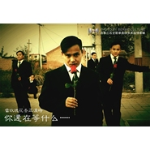

你还在等什么
============================

|  |  |
| :--: | :-- |
| [ 你还在等什么](https://emumo.xiami.com/album/464568) | **艺人**: [百慕三石](../index.md) **语种**: 国语 **唱片公司**: 百慕文化 **发行时间**: 2008年10月01日 **专辑类别**: EP, 单曲 **专辑风格**:  **播放数**: 49831 **收藏数**: 9 **评论数**: 0  |

## 简介

以一首《2008 我们结婚吧》正式走入台前的青年音乐人百慕文化音乐总监百慕三石近日又推出了自己的第2首单曲《你还在等什么》，凭借《2008 我们结婚吧》获得一致好评的他曾被誉为“08奥运年婚礼代言人”，而在唱片行业日渐缩水的今日，他却能够逆流而上，风光无限，相信这不单只是个偶然……  
  
此次的新单曲《你还在等什么》，主题鲜明，歌词朴实，曲风清新，连编配的手法也与之前的单曲《2008 我们结婚吧》如出一辙，应该是一首延续之作，然而其歌曲主题却直指单身人群，并选择在“光棍节”前夕发布，大有问鼎“光棍节”主题曲之势，个性的唱腔，磁性的嗓音，简洁明了的歌词，再加上“克隆”自我的个性宣传照……你，还在等什么呢？  
  
《你还在等什么》歌曲简要介绍：  
  
《你还在等什么》是青年音乐人百慕文化音乐总监--百慕三石的第二首个人单曲，歌曲风格依然延续了其第一首单曲《2008 我们结婚吧》的清新朴实民谣风格，歌词简单直接，旋律流畅上口，独特的磁性嗓音及个性的演唱方式更是让人过耳难忘。而被誉为2008年婚礼代言人的百慕三石此次推出的这首单曲是特意为单身朋友们创作的一首歌曲，据他本人笑言：也是在08年奥运年送给所有单身朋友们的“光棍节”主题曲。 

## 曲目

## 评论

