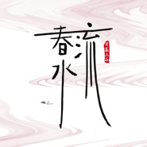
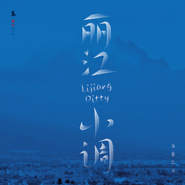
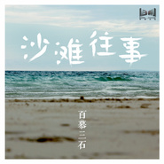

百慕三石
============================

|  |  |
| :--: | :-- |
| [ 百慕三石](https://i.xiami.com/bm3s) | **地区**: China 中国大陆 **风格**: 民谣流行 Folk Pop, 城市民谣 Urban Folk, 华语唱作人 Chinese Singer-Songwriter **播放数**: 2190037 **粉丝数**: 657 **评论数**: 49  |

## 档案

艺名：百慕三石 
籍贯:湖南 
出生日期:07月25日 
身高:170CM 
星座:狮子 
性格:内外兼修 
座右铭:智者见才，仁者见德，智仁兼备，方成大事 
特长:吉它,词曲创作,编曲,混音 
喜欢的音乐风格:FUSION,FOLK 
最大的愿望:成就自己

## 专辑

| 名称 | 语种 | 唱片公司 | 发行时间 | 专辑类别 | 专辑风格 |
| :--: | :-- | :-- | :-- | :-- | :-- |
| [ 江湖悠悠](./albums/5021679047.md) | 国语 | 天赋传媒 | 2020年10月19日 | EP, 单曲 | 国语流行 Mandarin Pop |
| [ 春水流](./albums/2108377143.md) | 国语 | 天赋传媒 | 2020年04月29日 | EP, 单曲 | 国语流行 Mandarin Pop |
| [ 丽江小调](./albums/2105236441.md) | 国语 | 慕音乐 | 2019年09月17日 | EP, 单曲 |  |
| [ 天赋侗听侗族大歌主题专辑](./albums/2100369040.md) | 国语 | 百慕文化 | 2016年07月19日 | 合集, 杂锦 |  |
| [ 沙滩往事](./albums/1711727156.md) | 国语 | 百慕文化 | 2014年09月25日 | EP, 单曲 | 民谣流行 Folk Pop, 城市民谣 Urban Folk, 华语唱作人 Chinese Singer-Songwriter, 中国风 China-Wave |
| [ 东北姑爷](./albums/1892884538.md) | 国语 | 百慕文化 | 2014年02月19日 | EP, 单曲 |  |
| [ 石榴花](./albums/1487267775.md) | 国语 | 百慕文化 | 2013年12月10日 | EP, 单曲 |  |
| [ 白仙鹤](./albums/481376906.md) | 国语 | 百慕文化 | 2013年10月10日 | EP, 单曲 | 民谣流行 Folk Pop |
| [ 我要回家](./albums/1474670523.md) | 国语 | 百慕文化 | 2013年07月24日 | EP, 单曲 |  |
| [ 我们结婚吧](./albums/525984.md) | 国语 | 百慕文化 | 2011年11月01日 | EP, 单曲 |  |
| [ 小花](./albums/470301.md) | 国语 | 百慕文化 | 2011年10月09日 | EP, 单曲 |  |
| [ 我们也去买辆车吧](./albums/464516.md) | 国语 | 百慕文化 | 2010年04月06日 | EP, 单曲 |  |
| [ 过新年](./albums/471315.md) | 国语 | 百慕文化 | 2008年12月31日 | EP, 单曲 |  |
| [ 你还在等什么](./albums/464568.md) | 国语 | 百慕文化 | 2008年10月01日 | EP, 单曲 |  |
| [ 2008我们结婚吧](./albums/33348.md) | 国语 | 百慕文化 | 2007年12月01日 | EP, 单曲 |  |

## 评论

|  |  |  |
| :-- | :-- | :-- |
|  [虾米用户](https://emumo.xiami.com/u/272017031) 清静以为天下正。谦虚，随... 2020-06-05 16:10 赞(0) 踩(0) | 
好！
 |
|  [虾米用户](https://emumo.xiami.com/u/328937055) 网易名 大鹏展翅ya 2020-02-29 22:20 赞(1) 踩(0) | 
艺名很重要！
 |
|  [虾米用户](https://emumo.xiami.com/u/429875445) 我是谁，我在哪，我要干啥... 2019-09-17 09:36 赞(0) 踩(0) | 
目测要火！   
 |
|  [虾米用户](https://emumo.xiami.com/u/346165752)  2019-05-21 10:36 赞(0) 踩(0) | 

 |
|  [虾米用户](https://emumo.xiami.com/u/343744004)  2018-01-31 12:58 赞(0) 踩(0) | 
好听，多出一些。  
 |
|  [虾米用户](https://emumo.xiami.com/u/17892493) 風，追逐着。我，还在期待... 2017-04-07 15:38 赞(0) 踩(0) | 
很久以前就听了，嗓音很独特
 |
|  [虾米用户](https://emumo.xiami.com/u/275388258)  2017-03-16 18:10 赞(1) 踩(0) | 
好听  顶你
 |
|  [虾米用户](https://emumo.xiami.com/u/9327494) http://www.x... 2016-12-28 12:19 赞(0) 踩(0) | 
石榴花
 |
|  [虾米用户](https://emumo.xiami.com/u/16135450)  2016-06-11 21:34 赞(0) 踩(0) | 
1133
 |
|  [虾米用户](https://emumo.xiami.com/u/1308967) 虾米听重型极端音乐这块的... 2015-10-16 06:19 赞(0) 踩(0) | 
流行味儿
 |
|  [虾米用户](https://emumo.xiami.com/u/4855774) 笑嘻嘻 2014-03-12 00:27 赞(0) 踩(0) | 
|/╱◥▓▓▓▓▓▓◣* ﹌﹌﹌﹌.............﹌﹌﹌﹌ .....Ooooo............ .....( 轻)...Ooooo.... ......)./....( 轻).... .....(_/......)./..... .............(_/......
 |
|  [虾米用户](https://emumo.xiami.com/u/3879795) 国风歌者，音乐唱作人 2014-03-10 15:10 赞(3) 踩(0) | 
新歌  真的很不错啊
 |
|  [虾米用户](https://emumo.xiami.com/u/29028660)  2013-12-04 18:22 赞(0) 踩(0) | 
好有感觉的声音啊
 |
|  [虾米用户](https://emumo.xiami.com/u/28930533)  2013-12-03 12:16 赞(0) 踩(0) | 
走进你的世界
 |
|  [虾米用户](https://emumo.xiami.com/u/10522709) 褵褷鹤 2013-12-01 22:15 赞(1) 踩(0) | 
这里能听到的白仙鹤和我要回家的歌词和音乐和声线都好有共鸣啊啊啊大爱！！！！！&amp;gt;.&amp;lt;`` 期待更多新歌～～～～！
 |
|  [虾米用户](https://emumo.xiami.com/u/28639578)  2013-11-29 11:02 赞(0) 踩(0) | 
很喜欢你 OVO
 |
|  [虾米用户](https://emumo.xiami.com/u/28591712)  2013-11-28 17:07 赞(0) 踩(0) | 
有故事的人
 |
|  [虾米用户](https://emumo.xiami.com/u/28392400)  2013-11-25 16:15 赞(0) 踩(0) | 
想听你的现场
 |
|  [虾米用户](https://emumo.xiami.com/u/28107754)  2013-11-21 11:57 赞(0) 踩(0) | 
交钱才能下载
 |
|  [虾米用户](https://emumo.xiami.com/u/27985401)  2013-11-19 17:59 赞(0) 踩(0) | 
脑海了出现了很多的画面 似乎安静了。
 |
|  [虾米用户](https://emumo.xiami.com/u/27676384)  2013-11-15 18:10 赞(0) 踩(0) | 
全身放轻松
 |
|  [虾米用户](https://emumo.xiami.com/u/27285700)  2013-11-13 17:41 赞(0) 踩(0) | 
加油吧
 |
|  [虾米用户](https://emumo.xiami.com/u/26591691)  2013-11-11 18:36 赞(0) 踩(0) | 
喜欢你声音的温度，暖心
 |
|  [虾米用户](https://emumo.xiami.com/u/26176775)  2013-11-06 10:26 赞(0) 踩(0) | 
“..... ”
 |
|  [虾米用户](https://emumo.xiami.com/u/26141758)  2013-11-05 18:39 赞(0) 踩(0) | 
你的世界 你的歌
 |
|  [虾米用户](https://emumo.xiami.com/u/26124496)  2013-11-05 14:11 赞(0) 踩(0) | 
喜欢曲子，声音很好听。 支持。
 |
|  [虾米用户](https://emumo.xiami.com/u/26075343)  2013-11-04 18:44 赞(0) 踩(0) | 
其实只是。。
 |
|  [虾米用户](https://emumo.xiami.com/u/26049415)  2013-11-04 12:03 赞(0) 踩(0) | 
很棒。。。歌词得很好。。。
 |
|  [虾米用户](https://emumo.xiami.com/u/25865352)  2013-11-01 18:03 赞(0) 踩(0) | 
很不错！听听吧！
 |
|  [虾米用户](https://emumo.xiami.com/u/25846918)  2013-11-01 13:34 赞(0) 踩(0) | 
最近听的歌里面，让我最有感觉的一首。
 |
|  [虾米用户](https://emumo.xiami.com/u/25796729)  2013-10-31 18:14 赞(0) 踩(0) | 
感动
 |
|  [虾米用户](https://emumo.xiami.com/u/25787341)  2013-10-31 16:00 赞(0) 踩(0) | 
听着歌总是想起某个人
 |
|  [虾米用户](https://emumo.xiami.com/u/25769466)  2013-10-31 11:37 赞(0) 踩(0) | 
听听歌，再配杯香茶
 |
|  [虾米用户](https://emumo.xiami.com/u/25725365)  2013-10-30 18:08 赞(0) 踩(0) | 
单曲循环的歌曲，越听越入迷
 |
|  [虾米用户](https://emumo.xiami.com/u/25695203)  2013-10-30 10:58 赞(0) 踩(0) | 
可以播放了，声音很好啊
 |
|  [虾米用户](https://emumo.xiami.com/u/25656345)  2013-10-29 19:03 赞(0) 踩(0) | 
让人清醒。。。。
 |
|  [虾米用户](https://emumo.xiami.com/u/12283654)  2013-10-29 14:52 赞(0) 踩(0) | 
赞！
 |
|  [虾米用户](https://emumo.xiami.com/u/25576613)  2013-10-28 17:48 赞(0) 踩(0) | 
喜欢百慕三石！
 |
|  [虾米用户](https://emumo.xiami.com/u/3879795) 国风歌者，音乐唱作人 2013-10-28 14:17 赞(2) 踩(0) | 
不怎么出名，但歌不错。。。
 |
| ⇒ |  [虾米用户](https://emumo.xiami.com/u/79360608) 我才不聪明呢！！ 2019-12-30 16:44 赞(0) 踩(0) | 
恍恍惚惚
 |
| ⇒ |  [虾米用户](https://emumo.xiami.com/u/442087233) 家中有个王酷盖 2020-04-12 18:32 赞(0) 踩(0) | 
你好听的歌都是人家写的，你怎么好意思这么说人家
 |
| ⇒ |  [虾米用户](https://emumo.xiami.com/u/441461015)  2020-05-06 23:04 赞(0) 踩(0) | 
不可否认，喜欢你的声音和音乐风格，但如果不是风筝误，～不会知道你是谁，如果不是百慕三石，风筝误便不是风筝误，包括你们的良人遮，半壶纱，花又开，渡风，暖山，浮年盏，月满弦&amp;hellip;  至纯至真必然不会过于追求名利！
 |
| ⇒ |  [虾米用户](https://emumo.xiami.com/u/258192176)  2020-08-01 15:58 赞(0) 踩(0) | 
楼上这几位怎么回事？回复之前不先看下留言时间的？
 |
|  [虾米用户](https://emumo.xiami.com/u/18163438) 歌手,唱作人,音乐制作人 2013-10-23 17:25 赞(17) 踩(0) | 
我刚入驻了虾米音乐人，欢迎大家来我的个人主页，收听我的最新音乐
 |
| ⇒ |  [虾米用户](https://emumo.xiami.com/u/224056505) 希望有个学霸男友在身边时... 2016-09-17 14:41 赞(0) 踩(0) | 
我会的 
 |
|  [虾米用户](https://emumo.xiami.com/u/2450578) 歌手杨森Anson 2013-10-18 09:24 赞(0) 踩(0) | 
有才华的歌手！
 |
|  [虾米用户](https://emumo.xiami.com/u/3923948) 无音乐，不生活…… 2013-10-18 09:23 赞(0) 踩(0) | 
歌不错啊！
 |
|  [虾米用户](https://emumo.xiami.com/u/10160077)  2013-10-11 17:01 赞(0) 踩(0) | 
好好听啊！
 |
|  [虾米用户](https://emumo.xiami.com/u/11798635) 鱼肉 2013-04-14 13:09 赞(0) 踩(0) | 
1
 |
