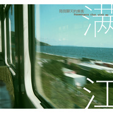

陪我聊天的乘客
============================

|  |  |
| :--: | :-- |
| [ 陪我聊天的乘客](https://emumo.xiami.com/album/1602466407) | **艺人**: [满江](../index.md) **语种**: 国语 **唱片公司**: 易柏文化 **发行时间**: 2014年06月13日 **专辑类别**: EP, 单曲 **专辑风格**: 国语流行 Mandarin Pop **播放数**: 131964 **收藏数**: 139 **评论数**: 47  |

## 简介

感谢缘分赠送的每一段旅行，给你我特定的时空定格存在；也感谢下车前我们彼此的欢笑陪伴，为心灵预约起未来的春暖花开。  
人生是一列开往未来的列车，我是乘客你也是，而我们的相遇绝非是场偶然。——满江  
  
——他是满脸胡渣、气质成熟的艺术范儿大叔；他是隐匿城市重新归来的音乐诗人  
——多年的淬炼、蜕变和感悟让一切化为音符，注满温度  
——或许他的低调内敛已让你在娱乐圈将他渐渐淡忘，但真的没关系，他反而希望如此，他希望记住的只有音乐就好！  
——希望通过这张全新的唱片，你可以重新认识他、迎接他沉淀灵感后献给音乐的这一份礼物。   
  
十年变身文艺满先生  
  
从只有一架钢琴做铺陈的《心碎北京》到充盈电子迷幻色彩的《飞鸟》，越来越“艺术家范儿”的满江用两首完全风格迥异的单曲开启了他新专辑的见面节奏，也让人惊讶之余更清晰的看到他的脱胎换骨：几乎所有词、曲、制作人工作的包办、甚至编曲上的突破尝试，使他的音乐越来越呈现一种前所未有的自由、自我和大胆。  
  
而创作上完全不拘泥于形式的满先生此次用来为新唱片再做铺叙的，则是一首色彩鲜明的乡谣作品——《陪我聊天的乘客》。  
  
正像《飞鸟》的歌词一样，如果你只解读到一种天地间苍茫而孤独的飞翔的话，那么你就错了。满江的歌词中越来越有着一股诗人的气质，他似乎更喜欢用隐喻、暗喻的方式讲述歌词以外的一份经历和感悟。《陪我聊天的乘客》表面看虽然只是一种轻松、愉悦的旅途经历，但实则却是讲每个人这一趟义无反顾向前的人生之旅。而在《陪我聊天的乘客》里，陪他聊天的乘客，其实就是陪你聊天的满先生，无论萍水相逢还是一路同行，我们都要在各自的站台下车、挥手告别。  
  
“我们是一直聊天的乘客，看过日出看日落，尽管风雨雷电多蜿蜒曲折，该有的不会错过”——友人也好爱人也罢，面对这些时光派遣而来与我们偶遇的乘客，也许脚步轻快匆忙离开，也许刻骨铭心无从释怀，但始终真心感谢缘分赠送的每一段旅行，给你我特定的时空定格存在；也感谢下车前我们彼此的欢笑陪伴，为心灵预约起未来的春暖花开。  
  
写给所有陪我聊天的乘客-----  
  
人生是一列开往未来的列车，我是乘客你也是，而我们的相遇绝非是场偶然。  
我们的相识，就算是从未谋面或只是听见记住过一个名字，我相信这就是缘，就是我们可以有无数可能的开始。  
一生身边来往那么多人，亲人、爱人、朋友、恩人、冤家对头，萍水相逢叫得上名字忘了名字的熟悉的陌生的面孔，我们都在这趟奔腾呼啸的列车上混杂着。分享生命的智慧生活的所得，打发那些无聊的长夜共赏窗外的美景，彼此交谈互换有无，生命的意义莫过于此——分享。  
  
从少年到老年从生到死，我们用聊天交谈的方式传承着信念、原则，能在这段旅程陪我聊天的人，他们无私的赠予了我他们人生最宝贵的一部分，而我又会将这份所得继续交给那个坐在我对面的乘客。学习怎样豁达宽容待人接物、接受怎样面对恐惧黑暗，本是从惊恐中来的我们，不应该最终还是在惊恐中完结。学习、分享、分享、学习，我们虽有着各自不同的人生，但是使得人生获得极大满足的方式却都是相同的。  
所以我会记得你，永远不会忘记你，那个曾经陪我聊天的“乘客”……在这条蜿蜒曲折的路上，那些日日夜夜……  
  
————满江2014年6月 

## 曲目

- [陪我聊天的乘客](./1602466407/xL6zYgdea33.md)

## 评论

|  |  |  |
| :-- | :-- | :-- |
|  [虾米用户](https://emumo.xiami.com/u/8070377) 爱雾瑞性维欧腐漏 2016-12-13 19:30 赞(0) 踩(0) | 
噗
 |
|  [虾米用户](https://emumo.xiami.com/u/42257225)  2015-09-21 22:39 赞(0) 踩(0) | 
声调低了，向陈奕迅靠拢
 |
|  [虾米用户](https://emumo.xiami.com/u/11921464) 音乐让我们亲近 2015-07-08 17:17 赞(0) 踩(0) | 
满满的心意收到了
 |
|  [虾米用户](https://emumo.xiami.com/u/31725465) 凡事不凡是 2014-10-05 13:30 赞(0) 踩(0) | 
歌词写了一个人生，值得琢磨。
 |
|  [虾米用户](https://emumo.xiami.com/u/98449)  2014-07-04 15:28 赞(0) 踩(0) | 
人生是一列开往未来的列车，我是乘客你也是，而我们的相遇绝非是场偶然。——满江 《陪我聊天的乘客》
 |
|  [虾米用户](https://emumo.xiami.com/u/752597)  2014-06-30 10:40 赞(0) 踩(0) | 
滑棒吉他 编曲的小心思
 |
|  [虾米用户](https://emumo.xiami.com/u/1193270)  2014-06-22 08:30 赞(0) 踩(0) | 
表里如一的一只歌，唱片封面有久违的亲切
 |
|  [虾米用户](https://emumo.xiami.com/u/2043411)  2014-06-21 10:32 赞(0) 踩(0) | 
这么多年了。都变大叔了
 |
|  [虾米用户](https://emumo.xiami.com/u/1373102)  2014-06-20 15:53 赞(0) 踩(0) | 
听着 裙角飞扬 的少年 转眼间已奔三了。
 |
| ⇒ |  [虾米用户](https://emumo.xiami.com/u/461819)  2014-06-24 18:11 赞(0) 踩(0) | 
三十多了
 |
|  [虾米用户](https://emumo.xiami.com/u/2341795) 见的人多了，就越来越喜欢... 2014-06-20 14:37 赞(0) 踩(0) | 
总觉得很久没听到这个名字了，其实声音很好听啊。新歌不错
 |
|  [虾米用户](https://emumo.xiami.com/u/15958033)  2014-06-20 12:21 赞(0) 踩(0) | 
一直都很喜欢他的 四舍五入  好多年了
 |
| ⇒ |  [虾米用户](https://emumo.xiami.com/u/17954969)   2014-09-20 22:20 赞(0) 踩(0) | 
我也是
 |
|  [虾米用户](https://emumo.xiami.com/u/633897) 克卜勒… 2014-06-19 08:45 赞(0) 踩(0) | 
好听
 |
|  [虾米用户](https://emumo.xiami.com/u/2251133) 我本无心向明月 2014-06-19 00:22 赞(4) 踩(0) | 
你是一个陪我聊天的卧铺抠脚女乘客
 |
|  [虾米用户](https://emumo.xiami.com/u/36646226) 粉丝多也许是我有魅力吧 2014-06-18 19:40 赞(0) 踩(0) | 
满江火了一首歌。。。奇迹。。是不是唯一一首。不清楚
 |
| ⇒ |  [虾米用户](https://emumo.xiami.com/u/17954969)   2014-09-20 22:20 赞(0) 踩(0) | 
最火的应该是《恋爱中的城市》吧
 |
| ⇒ |  [虾米用户](https://emumo.xiami.com/u/36646226) 粉丝多也许是我有魅力吧 2014-09-21 21:57 赞(0) 踩(0) | 
<q><b>非非想要新开始说：</b></q>
 |
| ⇒ |  [虾米用户](https://emumo.xiami.com/u/17954969)   2014-09-22 00:11 赞(0) 踩(0) | 
<q><b>Hey Stephen说：</b></q>
 |
| ⇒ |  [虾米用户](https://emumo.xiami.com/u/36646226) 粉丝多也许是我有魅力吧 2014-09-22 12:22 赞(0) 踩(0) | 
<q><b>非非想要新开始说：</b></q>
 |
| ⇒ |  [虾米用户](https://emumo.xiami.com/u/17954969)   2014-09-22 12:27 赞(0) 踩(0) | 
<q><b>Hey Stephen说：</b></q>
 |
|  [虾米用户](https://emumo.xiami.com/u/17954969)   2014-06-18 18:55 赞(0) 踩(0) | 
最好听的男声
 |
|  [虾米用户](https://emumo.xiami.com/u/12206118)   2014-06-18 17:02 赞(0) 踩(0) | 
一直很好听
 |
|  [虾米用户](https://emumo.xiami.com/u/8492911) 我还没想好要写什么... 2014-06-18 16:43 赞(0) 踩(0) | 
意外的好听
 |
|  [虾米用户](https://emumo.xiami.com/u/2481015)  2014-06-18 14:42 赞(3) 踩(0) | 
特别是吉他的精心编排    还有哪个像火车声音的节奏伴奏     棒！
 |
|  [虾米用户](https://emumo.xiami.com/u/2481015)  2014-06-18 14:41 赞(0) 踩(0) | 
卧槽   不得不说  这盘这首歌   太好听了   好久不发言的我也要来说说  支持一下了
 |
|  [虾米用户](https://emumo.xiami.com/u/29321053)  2014-06-18 11:29 赞(1) 踩(0) | 
找一个陪自己聊天的人，太多时候很难。
 |
|  [虾米用户](https://emumo.xiami.com/u/11227100) 布鲁布鲁布鲁。。。 2014-06-18 11:16 赞(0) 踩(0) | 
支持男神~
 |
|  [虾米用户](https://emumo.xiami.com/u/6545705) ooooo……在于不不不 2014-06-18 10:44 赞(0) 踩(0) | 
喜欢
 |
|  [虾米用户](https://emumo.xiami.com/u/11401261) 暂无签名~ 2014-06-18 08:53 赞(0) 踩(0) | 
我也可喜欢他。。。。
 |
|  [虾米用户](https://emumo.xiami.com/u/740763) 我还没想好要写什么... 2014-06-18 08:01 赞(0) 踩(0) | 
我是一只陪你聊天的乘客
 |
|  [虾米用户](https://emumo.xiami.com/u/4403009)  2014-06-17 23:44 赞(0) 踩(0) | 
时光钟摆...
 |
|  [虾米用户](https://emumo.xiami.com/u/5394135)  2014-06-17 22:44 赞(0) 踩(0) | 
那些年我们一起听过的满江
 |
|  [虾米用户](https://emumo.xiami.com/u/19462503) 内部装修中…… 2014-06-17 19:25 赞(1) 踩(0) | 
我惊讶了，这什么年代的人物啊！居然没转行
 |
|  [虾米用户](https://emumo.xiami.com/u/12200077) 阳光健康生活 2014-06-17 19:09 赞(0) 踩(0) | 
好久没听到的声音，很温暖
 |
|  [虾米用户](https://emumo.xiami.com/u/2741250)  2014-06-17 18:49 赞(0) 踩(0) | 
声音变老了⋯⋯
 |
|  [虾米用户](https://emumo.xiami.com/u/7402157) 你先让我躺一会 2014-06-17 18:27 赞(0) 踩(0) | 
满江  好一个熟悉又陌生的名字
 |
|  [虾米用户](https://emumo.xiami.com/u/5667996) 我还没想好要写什么... 2014-06-17 15:15 赞(0) 踩(0) | 
里里外外都没啥挑的艺人
 |
|  [虾米用户](https://emumo.xiami.com/u/4909754)  2014-06-17 15:13 赞(0) 踩(0) | 
内地比较喜欢的歌手
 |
|  [虾米用户](https://emumo.xiami.com/u/21607895) 忠于自己，保持独立。 2014-06-17 15:04 赞(0) 踩(0) | 
很温暖的声音
 |
|  [虾米用户](https://emumo.xiami.com/u/10274708) 暂无签名~ 2014-06-17 14:58 赞(0) 踩(0) | 
你是春风我是雨
 |
|  [虾米用户](https://emumo.xiami.com/u/8244559)  2014-06-17 14:49 赞(0) 踩(0) | 
******
 |
|  [虾米用户](https://emumo.xiami.com/u/3253298) 我要瘦我要瘦~ 2014-06-17 14:47 赞(0) 踩(0) | 
好久不见的身影
 |
|  [虾米用户](https://emumo.xiami.com/u/6522601) 聆听世界中每一种味道 2014-06-17 14:26 赞(0) 踩(0) | 
支持满江
 |
|  [虾米用户](https://emumo.xiami.com/u/355865) Let it go, l... 2014-06-11 15:36 赞(0) 踩(0) | 
易柏文化是我见过的最低调的内地唱片公司了。。。。。。。
 |
|  [虾米用户](https://emumo.xiami.com/u/2003179) 我不难过，我没有说谎。 2014-06-11 14:21 赞(0) 踩(0) | 
新砖的节奏？
 |
| ⇒ |  [虾米用户](https://emumo.xiami.com/u/15481689) 希望像树一样活着(⌒∀⌒ 2014-06-11 14:31 赞(0) 踩(0) | 
是吧，新专辑应该快了。
 |
