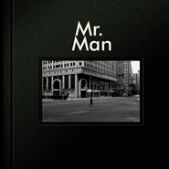

Mr.Man
============================

|  |  |
| :--: | :-- |
| [ Mr.Man](https://emumo.xiami.com/album/2100279090) | **艺人**: [满江](../index.md) **语种**: 国语 **唱片公司**: 易柏文化 **发行时间**: 2016年06月06日 **专辑类别**: 录音室专辑 **专辑风格**: 民谣流行 Folk Pop **播放数**: 10906298 **收藏数**: 2122 **评论数**: 137  |

## 简介

满江,曾经的偶像歌手,如今的独立音乐人,全新专辑《Mr.Man》经过6年精心筹备,6月精彩归来。  
全新专辑中,满江几乎包办了全部词曲创作,同时担任制作人,并全程参与编曲及封面设计等创意工作,在淡定又不失仙气的民谣风格中,融入了大量英式摇滚元素。  
《Mr.Man》经历了岁月的溪流,试图冲刷掉公众对于满江熟悉的印迹,试图唱出生命在不同阶段绽放的平凡与快乐,描绘那些不尽相同也都无法复制的独立个体。  
《Mr.Man》沉稳从容,强大而内敛,拒绝表面的浮夸与光鲜,只关注澎湃在内心的充盈与精彩。  
“我从未离开,却在你思念时 归来”——满江  
  
《归来》——  
好歌曲舞台上的归来之作,短短四分钟,完成六年的华丽转身,惊艳的不止是音乐本身,更是一种状态,一种人生态度。  
歌曲运用大量的吉他delay效果,时而空灵飘渺,时而山呼海啸,木吉他的音色尤其抢耳,且充满实验色彩,每一个和弦的分解都是转位从五音起始,而非常规的从主音开始,使指尖流动出的音符更具有一种强大的感染力。  
时间之箭  
燃烧着划破苍穹  
将希望点燃  
却无法追赶  
  
《等》——  
我们越是急切地追求结果,越是忽略过程的必要性。只有漫长的过程才可以令所有极乐狂欢纠葛灰暗都催生,相比之下,一切结果只是偶然。我们从来没有偶然要去的地方,等得越久,越是幸运。  
歌曲前奏的散拍吟唱配合木吉他的星星点点,使人被顺利带入一种温暖的情绪,A段叙述式、诗歌般的歌词,加上不紧不慢的八分音符木吉他,安静而放松,B段的电吉他、贝斯、鼓的陡然相遇,把歌曲轻松推向高潮,但总体仍然安静、温暖。一首歌的时间,让人在这个越来越快节奏的城市可以放慢速度,放慢心境,放空自己。  
我就像一颗冰凉的石头  
风吹不起雨打不醒的沉默  
倔强而绝望的站在泥土里  
长不出根哪怕枯萎的枝桠  
  
《天使》——  
歌曲前奏和贯穿整个A段的吉他riff,节奏鲜明的鼓的节奏型;B段和C段逐渐加强的饱满情绪以及具张力的音乐动态......这个天使有点酷。  
当我感到悲伤  
抬头望向太阳的光芒  
痛苦晒得滚烫   
在脸颊流淌  
  
《Mr.Man》——  
Mr.Man是一个称呼,同时也是一首歌名,是满江的专属,也是所有怀揣梦想辛苦打拼男人们的内心歌。  
歌曲录音室版本的制作历时长达5年,先后录制多个版本,此次收录专辑的版本由满江邀请旅行团共同完成。全曲6分多钟的演绎精致而极富层次,有一种千帆过尽的人生宽度和厚度感。  
Mr. Man 你能否记得住  
Mr. Man在时间的中途  
你输掉的某些可能 那并不是全部  
你拥有的哪怕瞬间 也是上天的礼物  
  
《阳光下》——  
整张冷色调专辑中最为明亮的一首歌。歌曲进入正题后,延续整张专辑的英式摇滚风格,奔放有力的节奏型融入大量delay音色的电吉他,也再次体现出满先生对于吉他这件乐器的格外偏爱。  
尤为独特的是,歌曲前奏和尾奏相呼应的高山流水的中式调式 ,用吉他模仿出古琴的音色,悠远、从容、开阔,而就为了坚持寻找这个音色,满先生足足折磨了吉他手一个多月的时间,好在吉他手杨颖彪有着多年扎实的古典吉他功底,加之长期合作也让他更明白满先生对音乐的理解,最终得以顺利完成。  
为什么活着 用什么选择  
站在阳光下就该是温暖的  
恐惧是什么 用脆弱烧的火  
得到越多害怕失去越多  
  
《我的梦》——  
歌曲前奏充满迷幻色彩,虽然只有几个音符,却让人迅速有一种如在梦境的感觉,混沌中的凄美。整首歌曲始终酷冷,副歌处的爆发像是一种要冲出梦境和困顿的情绪,充满了渴望、自由和坚定。  
My dream  
是另一双眼睛  
渴望飞翔的翅膀  
挣扎着撕裂了肩膀  
  
《大开眼界》——  
歌曲A段悠然自如的主旋律,节奏型的吉他分解,冷酷的鼓,使人有一种超出现实的不真实感。而副歌的直接转调,迅速把情绪推向高潮,滑棒吉他的加入成为副歌的助燃剂,而随后的间奏,鼓、滑棒,哇音加贝斯的solo音型默契,让整首歌充满了一种迷幻又迷失的神秘感。  
消失在宇宙的奇点  
遇见最光明的黑暗  
一切灰飞烟灭的一瞬间  
重生在另一个夏天  
  
《X》——  
满先生向最钟爱的《X档案》致敬之作,迷失、寻找、答案、无解......《X档案》就这样陪伴了很多年,已经成为了某种割舍不掉的朋友。  
歌曲A段使用中低音域编写旋律,阴暗的吉他和弦,加上紧张的合成器音色,一股扑朔迷离迎面而来,迅速将人的情绪进行裹挟,无法挣脱。进入到B段,节奏型开始鲜明起来,吉他中声部颤音的旋律线条更是紧贴主旋律,令人有一种窒息后自由呼吸的酣畅淋漓,但却始终冷冽。  
这阴霾不断在积蓄 未来已经不重要  
无知贪婪的勇气像燎原的火一直在烧  
这世界已经被欲望笼罩沉沦在土地中  
长出奇异的花朵散发着 寂寞  
  
《Buddy》——  
典型的民谣作品,但却又不同于时下流行的民谣形式,全曲6分多钟,却在将近5分钟的时间里就只有一把箱琴和一把大提琴与人声孤独地纠缠,只是快到结尾处,以电音吉他领衔进入才宣告彻底的爆发,但最终,一切还是归于平静。  
继《归来》之后,满江又一首创作上抛弃传统歌曲结构的作品,完全随心随性的自由表达,大开大合,酣畅淋漓。编曲上貌似简单但实则煞费苦心,整首歌曲只有四个七和弦和sus和弦,每一个和弦都有超过4个音的罗列,淡化了和声的指向性,但更能够体现歌者主旋律和歌词以及情绪的表达。而颓废至极的木吉他不急不缓、娓娓道来,加上声部底层那忧伤而缠绵的大提琴,恰与人声达成契合度极高的融合。歌曲高潮部分短暂且有力,失真的电吉他,狂躁的鼓,结实的贝斯,使歌曲情绪得到彻底的点燃和宣泄。但,一切终将成为过去,繁华也好,不尽人意也罢,于是,箱琴和大提琴再次接管,平静收尾。。。  
如果没有了明天 你不会遗憾  
我知道你的心 已经被召唤  
这霉暗的森林 是长不出希望的  
人们只会像枯树 伫立在原地眺望  
。。。。。。  
那不是你的归宿 buddy  
那是你经过的路  
总有天命运会带你回家 buddy  
救赎我们糊涂的少年  
  
《黑暗中舞蹈》——  
满江创作上最为暗黑系的歌曲,第一次拿他编好的demo给乐队成员听,大家无一例外的惊喜又困惑,因为歌曲三个段落他居然用了三个调来完成,但听起来却没有任何连接上的缝隙,毫无违和感,旋律及和声运用浑然一体。  
除了歌曲结构上的与众不同,编曲上黑舞也充满了实验性,在一个充满了阴暗诡异的八分音符吉他低音缠绕着各种电吉他delay之后,歌曲没有如约而至,而是用非常低沉的语气诉说着一种内心的挣扎,进行到B段,一系列分裂和离调的吉他和声,使得这种挣扎变得更加阴暗而唯美,至C段,歌曲直接小调转大调,和声和旋律的线条,吉他riff加上强有力的失真音色,构成对前面阴暗、分裂的AB段更好的“解决”。而紧随其后的间奏部分更凸显了歌曲的实验色彩,总共八小节的间奏里吉他居然就只用了一个音,并把这个音在贝斯和鼓结实的铺底中推来推去,使所有挣扎的情绪在此得到彻底的爆发。最后,歌曲再次以八分音符的低音吉他收尾,但不同的是,这一次吉他停在了小调升1级上,不再做任何处理,艺术摇滚风格格外鲜明。  
在月光里呼吸  
依靠着山河大地  
在月光里叹息  
触摸烧焦的土地  
在星光下喘息  
颤抖的身体  
黑暗的身体  
有黑色的眼睛  
。。。。。。  
拿去吧  
这不值一提的过去  
燃烧吧  
最后寒冷的冬夜  
一捧灰土  
落入晨风霞光里  
你看到的  
是生命最绚丽的美丽  
  
十首歌曲,让我们看到了一个似乎完全不认识的满江,坚硬而不失温度,内敛却又自由奔放,音乐里的倾诉和宣泄都是如此的透明而直接,不觉沧桑,却更显智慧。  
如今的他,是一名歌者,也是一名诗人,不在乎别人的目光,只寻内心深入,也不再追逐流行、不再讨好市场,只想做自己,只想用自己喜欢的方式表达自己。

## 曲目

- [归来MV](./2100279090/mQVzyGe35d1.md)
- [归来](./2100279090/mQXAwU8be14.md)
- [Mr.ManMV](./2100279090/mQXAwV6f740.md)
- [等](./2100279090/bqv4zug3b3fd.md)
- [天使](./2100279090/xLI9l7b8485.md)
- [阳光下](./2100279090/xLI9l8b1d4a.md)
- [Buddy](./2100279090/mQXAwZ4b925.md)
- [我的梦](./2100279090/xLI9lAbc923.md)
- [大开眼界](./2100279090/8G38alea4fd.md)
- [黑暗中舞蹈](./2100279090/mQWiz090bc4.md)
- [X](./2100279090/bf0K41X31ed9.md)

## 评论

|  |  |  |  |
| :-- | :-- | :-- | :-- |
|  [虾米用户](https://emumo.xiami.com/u/366621305)  2020-05-01 06:33 赞(0) 踩(0) | 
满血复活的满江！加油
 |
|  [虾米用户](https://emumo.xiami.com/u/442121672)  2020-04-25 13:09 赞(0) 踩(0) | 
VG
 |
|  [虾米用户](https://emumo.xiami.com/u/122043920) 我还没想好要写什么... 2020-04-15 09:19 赞(0) 踩(0) | 
超爱
 |
|  [虾米用户](https://emumo.xiami.com/u/867988)  2019-10-16 19:22 赞(0) 踩(0) | 
一直被低估，一直在那里，满江，中国好嗓子
 |
|  [虾米用户](https://emumo.xiami.com/u/55276548)  2019-08-24 17:10 赞(0) 踩(0) | 
惊艳！
 |
|  [虾米用户](https://emumo.xiami.com/u/327681215)  2019-04-02 18:16 赞(0) 踩(0) | 
很棒的作曲和作词
 |
|  [虾米用户](https://emumo.xiami.com/u/410436561)  2018-12-19 20:50 赞(1) 踩(0) | 
2000我点的 
 |
|  [虾米用户](https://emumo.xiami.com/u/152444024)  2018-11-09 20:45 赞(1) 踩(0) | 
贝斯是郭阳，是郭阳!
 |
|  [虾米用户](https://emumo.xiami.com/u/19804968)  2018-10-31 08:05 赞(0) 踩(0) | 
满江加油
 |
|  [虾米用户](https://emumo.xiami.com/u/46928860)  人生似草木 一世如一秋 2018-08-21 10:48 赞(0) 踩(0) | 
&amp;hellip;&amp;hellip;为什么版权又消失了&amp;hellip;&amp;hellip;
 |
| ⇒ |  [虾米用户](https://emumo.xiami.com/u/96296322)  2019-03-01 09:23 赞(0) 踩(0) | 
归来！
 |
| ⇒ |  [虾米用户](https://emumo.xiami.com/u/46928860)  人生似草木 一世如一秋 2019-03-01 10:04 赞(0) 踩(0) | 
<q><b>Solarie说：</b></q>
 |
|  [虾米用户](https://emumo.xiami.com/u/282134535)  2018-07-11 21:54 赞(0) 踩(0) | 
版权？？？去哪了？？？
 |
| ⇒ |  [虾米用户](https://emumo.xiami.com/u/96296322)  2019-03-01 09:24 赞(0) 踩(0) | 
回来啦！
 |
|  [虾米用户](https://emumo.xiami.com/u/1143360) 到头来 还是感谢虾米一切... 2018-05-15 22:12 赞(0) 踩(0) | 
突然疲惫
 |
|  [虾米用户](https://emumo.xiami.com/u/1395744) 嘘，我在听音乐。。。 2018-05-06 13:22 赞(0) 踩(0) | 
诚意满满，触点也颇多，我给满分！
 |
|  [虾米用户](https://emumo.xiami.com/u/331976261)  2018-05-05 10:53 赞(0) 踩(0) | 
好听
 |
|  [虾米用户](https://emumo.xiami.com/u/124560962)  2018-04-25 18:21 赞(1) 踩(0) | 
对满江完全误解了，以为他是长口水歌的。推送回来，惊艳无比！整张专辑满满全是惊喜！
 |
|  [虾米用户](https://emumo.xiami.com/u/10457844) 哪里有压迫★哪里就有反抗 2018-04-20 21:30 赞(1) 踩(0) | 
贝斯和鼓手是不是花儿乐队的那两个人啊？？？
 |
| ⇒ |  [虾米用户](https://emumo.xiami.com/u/202173585)   2018-05-06 05:30 赞(0) 踩(0) | 
是的，哈哈哈，郭阳，王文博
 |
| ⇒ |  [虾米用户](https://emumo.xiami.com/u/321377271)  2018-05-26 00:26 赞(0) 踩(0) | 
是的，就是他
 |
|  [虾米用户](https://emumo.xiami.com/u/280811636)  2018-04-14 14:02 赞(0) 踩(0) | 
好听
 |
|  [虾米用户](https://emumo.xiami.com/u/8090303)  2018-03-19 16:30 赞(0) 踩(0) | 
今日推荐来的，虾米懂我心～
 |
|  [虾米用户](https://emumo.xiami.com/u/322394855) 無奈知音不成雙 2018-02-21 21:12 赞(0) 踩(0) | 
收藏的第一個民謠專
 |
|  [虾米用户](https://emumo.xiami.com/u/305710018) 这是与虾米最后的「蜜月」... 2018-02-20 15:24 赞(0) 踩(0) | 
重新认识了一个唱作人
 |
|  [虾米用户](https://emumo.xiami.com/u/20004733) soojong 2018-02-10 19:09 赞(1) 踩(0) | 
是张好砖
 |
|  [虾米用户](https://emumo.xiami.com/u/337754831)  2017-12-31 04:02 赞(1) 踩(0) | 
王者归来
 |
|  [虾米用户](https://emumo.xiami.com/u/3667437) 喜歡就會放肆 但愛就要克... 2017-08-25 23:46 赞(1) 踩(0) | 
这是属于他的情怀
 |
|  [虾米用户](https://emumo.xiami.com/u/11726177)   2017-04-26 19:03 赞(2) 踩(0) | 
专辑封面 所有曲子都很有诚意 只是唱法太汪峰 这曲子这封面配上开口脆的唱法 就是一张经典至极的作品
 |
|  [虾米用户](https://emumo.xiami.com/u/1844) 农夫 山泉 有点田 2017-04-24 21:09 赞(0) 踩(0) | 
许久不见的Mr.Man力量满满。英摇boy好听飞。
 |
|  [虾米用户](https://emumo.xiami.com/u/15811196) 辛苦时躲进音乐的世界，防... 2017-04-21 21:21 赞(0) 踩(0) | 
初恋一样的存在 从四舍五入开始
 |
|  [虾米用户](https://emumo.xiami.com/u/23140916) 树上的朋友你们好吗 2017-04-20 17:15 赞(0) 踩(0) | 
很颠覆，很惊艳
 |
|  [虾米用户](https://emumo.xiami.com/u/236514566)   2017-03-13 13:59 赞(3) 踩(0) | 
满江的声音辨识度不算高，岁月沉淀后的他，多了些成熟，内敛，加上流行风格的编曲，配合满江的声音，整个作品除了有格调，还很洋气！值得收藏！
 |
|  [虾米用户](https://emumo.xiami.com/u/6958843)  2017-02-25 23:43 赞(1) 踩(0) | 
满江用这张专辑向人们诉说着他对于人生的思考，听着整张专辑能让我沉思，思考人生。
 |
|  [虾米用户](https://emumo.xiami.com/u/70772964) Road to Rede... 2017-02-11 13:54 赞(0) 踩(0) | 
Mr.Man
 |
|  [虾米用户](https://emumo.xiami.com/u/8328063) 在我的心里，可有个角落，... 2017-01-21 21:50 赞(3) 踩(0) | 
归来的满江不再唱情歌了，更多的是 生命 呼唤 田野 城市 现实 存在 世界 之类的字眼，更多了大开大合的唱腔，甚至无词的吟咏，大量和声营造的气氛，更富有节奏，更硬朗。一个宇宙无嫌疑的大直男。
 |
|  [虾米用户](https://emumo.xiami.com/u/11353)  2017-01-13 19:18 赞(0) 踩(0) | 
听CD的感觉，整张的编曲和演唱都超棒。
 |
|  [虾米用户](https://emumo.xiami.com/u/257995363)  2016-12-30 12:18 赞(0) 踩(0) | 
唯一购买的实体专辑，带给人力量与启迪，满哥，加油！
 |
|  [虾米用户](https://emumo.xiami.com/u/253391126)  2016-12-30 12:13 赞(0) 踩(0) | 
唯一购买的实体专辑❤️
 |
|  [虾米用户](https://emumo.xiami.com/u/89462262) 音乐迷，迷音乐 2016-12-29 16:16 赞(0) 踩(0) | 
在电台听到《归来》的一小段，然后迫不及待用手机识别出歌曲，一看，呀……是满江的新歌！很高兴能在虾米找到整张新专辑，真是难得的好专辑，而且由开篇的同名作品到我试听到的第三首歌曲，都是喜欢的声音！
 |
|  [虾米用户](https://emumo.xiami.com/u/8070377) 爱雾瑞性维欧腐漏 2016-12-13 19:26 赞(1) 踩(0) | 
蛮好
 |
|  [虾米用户](https://emumo.xiami.com/u/1804639) 搞得了艺术 当得了流氓 2016-11-18 17:53 赞(10) 踩(0) | 
就没人和我一样觉得《黑暗中舞蹈》最好听么！
 |
| ⇒ |  [虾米用户](https://emumo.xiami.com/u/288927641)  2017-04-16 02:25 赞(0) 踩(0) | 
才开始没觉得黑暗中舞蹈好听，但是越听越好听。满哥的歌越听越好听，看看歌词后再听，又是另一番感觉。
 |
| ⇒ |  [虾米用户](https://emumo.xiami.com/u/327872243) Shoot for th... 2018-03-28 22:22 赞(0) 踩(0) | 
我也觉得
 |
|  [虾米用户](https://emumo.xiami.com/u/3496718) idle space 2016-10-06 20:38 赞(0) 踩(0) | 
很喜欢的一专辑~~~
 |
|  [虾米用户](https://emumo.xiami.com/u/3496718) idle space 2016-10-06 20:38 赞(0) 踩(0) | 
很喜欢的一专辑~~~
 |
|  [虾米用户](https://emumo.xiami.com/u/4264517) 人生短短几十载，做有趣的... 2016-10-02 16:40 赞(0) 踩(0) | 
厚积薄发，十年磨一剑
 |
|  [虾米用户](https://emumo.xiami.com/u/47560403)  2016-09-23 14:45 赞(1) 踩(0) | 
归来这首歌很像许巍的风格
 |
|  [虾米用户](https://emumo.xiami.com/u/37525248)  2016-09-20 19:45 赞(0) 踩(0) | 
说实话 他人比歌赞
 |
|  [虾米用户](https://emumo.xiami.com/u/198660479) 467280 2016-09-15 15:11 赞(1) 踩(0) | 
难得的人生感悟，超喜欢。
 |
|  [虾米用户](https://emumo.xiami.com/u/198660479) 467280 2016-09-15 15:07 赞(0) 踩(0) | 
真实，深刻的人生。
 |
|  [虾米用户](https://emumo.xiami.com/u/6331728)  2016-09-13 16:44 赞(2) 踩(0) | 
这个专辑名，突然让我感觉，要经历千般磨难、狂躁、寂寞，最后归于平静的，才叫做男人Mr. Man
 |
|  [虾米用户](https://emumo.xiami.com/u/25528442)  2016-08-30 16:53 赞(1) 踩(0) | 
沉淀为空相
 |
|  [虾米用户](https://emumo.xiami.com/u/3693759) 暂无签名~ 2016-08-29 11:27 赞(1) 踩(0) | 
一般，不过比之前的好的太多
 |
|  [虾米用户](https://emumo.xiami.com/u/4398187)  2016-08-23 11:27 赞(2) 踩(0) | 
没有几个所谓偶像歌手能实现如此漂亮的转身。这需要一颗能静的下来的心。
 |
|  [虾米用户](https://emumo.xiami.com/u/164610068)  2016-07-30 15:42 赞(0) 踩(0) | 
好久没有听到这么好的一张专辑了，只有赞，没有多余的废话！！！！
 |
|  [虾米用户](https://emumo.xiami.com/u/199036113)  2016-07-27 21:44 赞(0) 踩(0) | 
还是喜欢裙角飞扬，和恋爱的城市，歌声和那段时光
 |
|  [虾米用户](https://emumo.xiami.com/u/1076802) 杂听患者 2016-07-09 07:34 赞(0) 踩(0) | 
#
 |
|  [虾米用户](https://emumo.xiami.com/u/1151163)  2016-06-27 22:41 赞(2) 踩(0) | 
喜欢这种从容和自在，喜欢阳光下
 |
|  [虾米用户](https://emumo.xiami.com/u/10704585) 像蒲公英在飞。 2016-06-21 04:19 赞(0) 踩(0) | 
棒棒哒！
 |
|  [虾米用户](https://emumo.xiami.com/u/54273726)  2016-06-18 18:28 赞(0) 踩(0) | 
终于来了！哈哈
 |
|  [虾米用户](https://emumo.xiami.com/u/54208477)   2016-06-18 09:15 赞(0) 踩(0) | 
不理解吸毒归来还能被原谅
 |
| ⇒ |  [虾米用户](https://emumo.xiami.com/u/553528) 我还没想好要写什么... 2016-06-18 18:22 赞(0) 踩(0) | 
那是满文军……
 |
| ⇒ |  [虾米用户](https://emumo.xiami.com/u/902421)   2016-06-23 09:33 赞(0) 踩(0) | 
那是满文军   
 |
| ⇒ |  [虾米用户](https://emumo.xiami.com/u/7478006) 良辰美景奈何天 2016-06-23 15:40 赞(0) 踩(0) | 
替你害羞。
 |
| ⇒ |  [虾米用户](https://emumo.xiami.com/u/3990650)  2016-06-24 18:00 赞(0) 踩(0) | 
虽然不关我事，但觉得你·············
 |
| ⇒ |  [虾米用户](https://emumo.xiami.com/u/10183109) 我一直假装自己是个学霸… 2016-06-30 14:33 赞(0) 踩(0) | 
一脸懵逼
 |
| ⇒ |  [虾米用户](https://emumo.xiami.com/u/2066122) 穷逼VIP 2016-07-05 21:47 赞(0) 踩(0) | 
我也想保持下队形~因为这个确实很搞笑嘎嘎嘎嘎嘎嘎嘎嘎
 |
| ⇒ |  [虾米用户](https://emumo.xiami.com/u/2593300)  2016-07-07 13:27 赞(0) 踩(0) | 
没确定之前请不要乱开口
 |
|  [虾米用户](https://emumo.xiami.com/u/2279444) 爱在左，同情在右。 2016-06-18 02:55 赞(0) 踩(0) | 
说心里的感觉，我觉得有点过于受捧了，每个人心里一杆秤，好不好不用多言语，觉得情怀覆盖了部分理应，好歌曲的两首歌我就觉得一般，没有说得那么神乎
 |
|  [虾米用户](https://emumo.xiami.com/u/36029) ½ 2016-06-17 18:23 赞(0) 踩(0) | 
我喜欢「Buddy」
 |
|  [虾米用户](https://emumo.xiami.com/u/89853452)  2016-06-14 09:21 赞(1) 踩(0) | 
不得不说，满江在用心做音乐。
 |
|  [虾米用户](https://emumo.xiami.com/u/103639920) 生活有点酷 2016-06-13 23:58 赞(0) 踩(0) | 
跟以前不一样了，不讨好，但真实！祝福你！
 |
|  [虾米用户](https://emumo.xiami.com/u/9996655) 无聊时候就听歌 2016-06-13 19:02 赞(0) 踩(0) | 
被岁月打磨过，有内涵有积淀，还不忘初心
 |
|  [虾米用户](https://emumo.xiami.com/u/3522831) so rock....s... 2016-06-13 18:46 赞(2) 踩(0) | 
想不到啊！满江蜕变成一个真正的音乐人 
 |
|  [虾米用户](https://emumo.xiami.com/u/33385349) 臭板儿是个傻逼。 2016-06-13 17:48 赞(1) 踩(0) | 
花钱的专都是垃圾
 |
| ⇒ |  [虾米用户](https://emumo.xiami.com/u/2593300)  2016-07-07 13:28 赞(0) 踩(0) | 
为你感到可悲
 |
| ⇒ |  [虾米用户](https://emumo.xiami.com/u/33385349) 臭板儿是个傻逼。 2016-07-07 15:12 赞(0) 踩(0) | 
<q><b>音乐虫子说：</b></q>
 |
| ⇒ |  [虾米用户](https://emumo.xiami.com/u/33385349) 臭板儿是个傻逼。 2016-07-07 15:14 赞(0) 踩(0) | 
<q><b>音乐虫子说：</b></q>
 |
| ⇒ |  [虾米用户](https://emumo.xiami.com/u/6331728)  2016-09-13 16:48 赞(0) 踩(0) | 
<q><b>音乐虫子说：</b></q>
 |
|  [虾米用户](https://emumo.xiami.com/u/478527) 好想跟衣服在洗衣机里滚 2016-06-13 12:53 赞(0) 踩(0) | 
第一首“归来”无论旋律还是加入的小电子，流行，不失味道，我给4分。但后面的就溃不成军了。
 |
|  [虾米用户](https://emumo.xiami.com/u/12281)  2016-06-12 23:40 赞(1) 踩(0) | 
听完这个再回头看看之前那谁的「苟且」还能听么
 |
|  [虾米用户](https://emumo.xiami.com/u/43152696) memento mori 2016-06-12 22:05 赞(0) 踩(0) | 
情怀
 |
|  [虾米用户](https://emumo.xiami.com/u/337365) 从今天起，做一个有趣的人... 2016-06-12 21:24 赞(0) 踩(0) | 
整张专辑真的都很好，第一首自不必说，推荐去听听最后两首～
 |
|  [虾米用户](https://emumo.xiami.com/u/1882463) 我还没想好要写什么... 2016-06-12 17:01 赞(0) 踩(0) | 
这张很好听啊，评论那么少。。。。
 |
|  [虾米用户](https://emumo.xiami.com/u/1882463) 我还没想好要写什么... 2016-06-12 16:56 赞(0) 踩(0) | 
成熟的Mr.Man荣耀归来
 |
|  [虾米用户](https://emumo.xiami.com/u/8244559)  2016-06-12 15:51 赞(0) 踩(0) | 
******
 |
|  [虾米用户](https://emumo.xiami.com/u/1362440)  2016-04-24 12:30 赞(0) 踩(0) | 
新的一天，重新开始，像兄弟说的一样，你很好，但要明白为什么
 |
|  [虾米用户](https://emumo.xiami.com/u/3758430) 。 2016-04-24 08:43 赞(0) 踩(0) | 
赞
 |
|  [虾米用户](https://emumo.xiami.com/u/3069378) 你从海上来 2016-04-23 12:15 赞(0) 踩(0) | 
啥时候声音这么像汪峰了。。。但是不可否认，这歌真的好听。
 |
| ⇒ |  [虾米用户](https://emumo.xiami.com/u/31737208) 我想和你虚度世界。 2016-05-09 20:47 赞(0) 踩(0) | 
像汪峰你什么耳朵
 |
|  [虾米用户](https://emumo.xiami.com/u/95146682)  2016-03-25 17:04 赞(0) 踩(0) | 
好听 推荐
 |
|  [虾米用户](https://emumo.xiami.com/u/125617160)  2016-03-21 22:13 赞(0) 踩(0) | 
晚安
 |
|  [虾米用户](https://emumo.xiami.com/u/27386427)  2016-03-21 13:19 赞(0) 踩(0) | 
好好听
 |
|  [虾米用户](https://emumo.xiami.com/u/3852503) Revive! 2016-03-20 21:55 赞(1) 踩(0) | 
太好听了，默默积敛的爆发。大叔最帅啦！！！
 |
|  [虾米用户](https://emumo.xiami.com/u/24633906)  2016-03-19 22:59 赞(0) 踩(0) | 
好听
 |
|  [虾米用户](https://emumo.xiami.com/u/124401058) 在希望的麦田上 2016-03-18 23:27 赞(1) 踩(0) | 
支持
 |
|  [虾米用户](https://emumo.xiami.com/u/1655141)  2016-03-16 11:10 赞(4) 踩(0) | 
机场大巴上无聊就来聊聊这首歌吧。初听真没当回事，就一汪峰式歌曲嘛。多听几遍，竟舍不得关掉。词、曲、编搭配教科书级，三段主歌层层渲染，副歌有力但很克制，大赞渐渐消隐的尾声。总结：一首温暖内敛有力的流行金曲，强烈推荐。
 |
|  [虾米用户](https://emumo.xiami.com/u/46915619)  2016-03-14 23:57 赞(1) 踩(0) | 
一听中意，赞
 |
|  [虾米用户](https://emumo.xiami.com/u/800871)  2016-03-13 13:40 赞(1) 踩(0) | 
满江，谢谢你归来，这首歌，很不错！
 |
|  [虾米用户](https://emumo.xiami.com/u/2847876) 我还没想好要写什么... 2016-03-11 14:34 赞(2) 踩(0) | 
在三亚旅游的时候，开着车从海边走的时候，从电台听到，一下就被吸引了，很耐听，很吸引人。
 |
|  [虾米用户](https://emumo.xiami.com/u/8518506)  2016-03-09 22:47 赞(1) 踩(0) | 
满江重装上阵···
 |
|  [虾米用户](https://emumo.xiami.com/u/14863250)  2016-03-08 03:45 赞(1) 踩(0) | 
帅
 |
|  [虾米用户](https://emumo.xiami.com/u/14949313)  2016-03-02 16:50 赞(1) 踩(0) | 
打动人心的作品
 |
|  [虾米用户](https://emumo.xiami.com/u/82093952) 输入签名... 2016-03-01 00:41 赞(3) 踩(0) | 
我不想有人给低于10分的评分 感觉真的完美
 |
|  [虾米用户](https://emumo.xiami.com/u/118659472)  2016-02-29 10:27 赞(27) 踩(0) | 
开车上班路上听到这首歌，耳朵一亮，赶紧在红绿灯下听歌识曲，经搜索，才知是中国好歌曲第三季第四期。因为这首歌，我注册了虾米。这首歌打动我的有三点：一是优美的旋律，二是磁性的声线，三是历经人世沧桑后的纯净、沉稳与淡泊。这是一首直入我心底的好歌。
 |
|  [虾米用户](https://emumo.xiami.com/u/857047)  2016-02-28 09:09 赞(40) 踩(0) | 
从中国好歌曲听到他的《归来》，一时没有认出来，从前的清澈，明亮的大男孩满江，变得成稳，带着一丝沧桑的味道，这首《归来》让我重新认识了他，从曾经是内地流行音乐的小鲜肉，九0年代底到二0一0年之前曾活跃在各大流行音乐舞台和排行榜，有很长一段时间没有看到听到他的消息。主要是他原来的形象和曲风不是我欣赏的类型，这一次完全走出了我原来的想像，原来时间可以改变一个人形象如此之大，也许是心沉淀下来，变得纯了，他唱《归来》时的眼神完全是另一个人，如此纯净，声线也变得成稳，加上递进的节奏让我原来低沉的心情变得明朗起来，原来归来可以如此心旷神怡，云淡风轻，满江，这是你最美的时光，期待你的回归
 |
|  [虾米用户](https://emumo.xiami.com/u/37830124)   2016-02-27 11:59 赞(3) 踩(0) | 
我真的太喜欢了
 |
|  [虾米用户](https://emumo.xiami.com/u/9690768)  2016-02-27 01:29 赞(1) 踩(0) | 
棒！
 |
|  [虾米用户](https://emumo.xiami.com/u/461819)  2016-02-25 01:22 赞(1) 踩(0) | 
我哥回来了！
 |
|  [虾米用户](https://emumo.xiami.com/u/1308967) 虾米听重型极端音乐这块的... 2016-02-24 21:21 赞(54) 踩(0) | 
一个大龄文艺男青年的不惑之年，朴树，满江，许巍，窦唯。
 |
| ⇒ |  [虾米用户](https://emumo.xiami.com/u/478527) 好想跟衣服在洗衣机里滚 2016-06-13 12:42 赞(0) 踩(0) | 
手动给简介点赞
 |
| ⇒ |  [虾米用户](https://emumo.xiami.com/u/1308967) 虾米听重型极端音乐这块的... 2016-06-13 16:56 赞(0) 踩(0) | 
<q><b>WIKI魏说：</b></q>
 |
| ⇒ |  [虾米用户](https://emumo.xiami.com/u/38881044)  2016-06-17 17:01 赞(0) 踩(0) | 
满江 似乎还到不了其他三位的高度
 |
| ⇒ |  [虾米用户](https://emumo.xiami.com/u/306476) 我还没想好要写什么... 2018-03-01 00:36 赞(0) 踩(0) | 
<q><b>时沙说：</b></q>
 |
| ⇒ |  [虾米用户](https://emumo.xiami.com/u/1308967) 虾米听重型极端音乐这块的... 2018-12-13 20:56 赞(0) 踩(0) | 
<q><b>左达丞明说：</b></q>
 |
|  [虾米用户](https://emumo.xiami.com/u/922554)  2016-02-24 16:29 赞(2) 踩(0) | 
有种听你的歌长大的感觉，从没胡子的少年到胡茬大叔，越来越帅！
 |
|  [虾米用户](https://emumo.xiami.com/u/996277) ‏‏ 2016-02-24 11:05 赞(1) 踩(0) | 
哇哦
 |
|  [虾米用户](https://emumo.xiami.com/u/7112631)  2016-02-23 21:46 赞(2) 踩(0) | 
你在与不在 我都在这里 等你归来
 |
|  [虾米用户](https://emumo.xiami.com/u/455724) 我还没想好要写什么... 2016-02-23 21:04 赞(1) 踩(0) | 
支持你，自始至终。
 |
|  [虾米用户](https://emumo.xiami.com/u/1113723) 喵喵喵~~~ 2016-02-23 19:46 赞(0) 踩(0) | 
谢谢！
 |
|  [虾米用户](https://emumo.xiami.com/u/51855219)  2016-02-23 18:46 赞(11) 踩(0) | 
太棒了，从好歌曲上听到马上就来虾米down，之前一直没有上，今天终于有了，开心
 |
|  [虾米用户](https://emumo.xiami.com/u/9530407) 白露暖空，素月流天 2016-02-23 11:59 赞(0) 踩(0) | 
爱生活爱满哥哥
 |
|  [虾米用户](https://emumo.xiami.com/u/1308967) 虾米听重型极端音乐这块的... 2016-02-23 08:42 赞(3) 踩(0) | 
你赤足，奔跑过田野。你归来，希望开满江。诗一样的歌。
 |
|  [虾米用户](https://emumo.xiami.com/u/7322777) ∮ 2016-02-23 06:36 赞(0) 踩(0) | 
...a...
 |
|  [虾米用户](https://emumo.xiami.com/u/30815183) 黑白风 2016-02-23 01:27 赞(0) 踩(0) | 
找了一段时间「归来」了，这么快就发布了，相当难得 mark
 |
|  [虾米用户](https://emumo.xiami.com/u/1844) 农夫 山泉 有点田 2016-02-22 22:26 赞(1) 踩(0) | 
终于归来T.T
 |
|  [虾米用户](https://emumo.xiami.com/u/91357534)  2016-02-22 21:36 赞(1) 踩(0) | 
真好听
 |
|  [虾米用户](https://emumo.xiami.com/u/91717610)  2016-02-22 16:16 赞(1) 踩(0) | 
19号上中国好歌曲，20号发行，这着棋下的真好。
 |
|  [虾米用户](https://emumo.xiami.com/u/50554536)  2016-02-22 13:23 赞(2) 踩(0) | 
完美男人的模样，温和通透，看不够。
 |
|  [虾米用户](https://emumo.xiami.com/u/40846366) 三次元以下专用 2016-02-22 10:48 赞(1) 踩(0) | 
终于来了！！！
 |
|  [虾米用户](https://emumo.xiami.com/u/17954969)   2016-02-22 08:30 赞(1) 踩(0) | 
来了！正好是《飞鸟》的续写：待我归来正是大好春光！
 |
|  [虾米用户](https://emumo.xiami.com/u/178946)  2016-02-22 00:08 赞(1) 踩(0) | 
好听好听，看了中国好歌曲，立刻来下载，超级好听了～
 |
|  [虾米用户](https://emumo.xiami.com/u/111925096)  2016-02-21 23:33 赞(1) 踩(0) | 
写了太好了，满江归来吧
 |
|  [虾米用户](https://emumo.xiami.com/u/40053551)  2016-02-21 22:04 赞(1) 踩(0) | 
good
 |
|  [虾米用户](https://emumo.xiami.com/u/21745643)   2016-02-21 22:03 赞(1) 踩(0) | 

 |
|  [虾米用户](https://emumo.xiami.com/u/802967)  2016-02-21 21:42 赞(1) 踩(0) | 
《平凡之路》——《归来》，朴树与满江，在生活中沉淀下来的人总会有对生活新的的感悟。
 |
