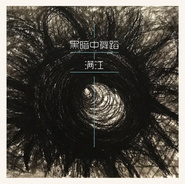

黑暗中舞蹈
============================

|  |  |
| :--: | :-- |
| [ 黑暗中舞蹈](https://emumo.xiami.com/album/2100299430) | **艺人**: [满江](../index.md) **语种**: 国语 **唱片公司**: 易柏文化 **发行时间**: 2016年03月24日 **专辑类别**: EP, 单曲 **专辑风格**: 摇滚 Rock & Roll **播放数**: 2138 **收藏数**: 0 **评论数**: 15  |

## 简介

满江亮相《好歌曲》令人惊艳，本周杀入导师考核赛的他，再度引发关注。针对影视命题《与青春有关的日子》，满江重新演绎了一把与告别过往的“黑色青春”，激情演唱燃爆全场。
 
  

在昨晚进行的导师考核赛上，满江获得的影视主题是《与青春有关的日子》，这部片子是陈羽凡与白百合的定情之作，当年羽凡获邀出演该剧一个角色，白百合就在剧中扮演他的女朋友，二人因此相识相爱，两年后就走入婚姻殿堂。面临命题创作的考验，满江充分发挥实力，他重新创作了一首《黑暗中的舞蹈》，获得众导师肯定，刘欢从中听出了“与过去决绝的感觉”，认为他大叔级唱作人，创作依然遒劲有力。范晓萱则认为这种黑色的方式很性感，“用黑暗的手法把青春不要的东西唱掉。”

## 曲目

- [黑暗中舞蹈](./2100299430/mQXAxc6f1bf.md)

## 评论

|  |  |  |  |
| :-- | :-- | :-- | :-- |
|  [虾米用户](https://emumo.xiami.com/u/4544) 我继续，你要随意 2016-05-31 16:57 赞(0) 踩(0) | 
多年后再次回归能够词曲编全包并且手绘封面，足以见得满江在消失的这些日子里并没有停滞，而是汲取了很多生活的养分，就如同在他再微博PO了波德莱尔的《恶之花》。有时候一个歌手的内在素养是很重要的。包装只是外在的壳，剥开了才能看到真材实料。
 |
|  [虾米用户](https://emumo.xiami.com/u/2043411)  2016-03-29 00:28 赞(1) 踩(0) | 
这种坚持太可贵了
 |
|  [虾米用户](https://emumo.xiami.com/u/276890)   2016-03-27 16:46 赞(0) 踩(0) | 
赞
 |
|  [虾米用户](https://emumo.xiami.com/u/1533125)  2016-03-27 10:20 赞(2) 踩(0) | 
还是阅历比较重要
 |
|  [虾米用户](https://emumo.xiami.com/u/1210750) 暂无签名~ 2016-03-26 21:23 赞(0) 踩(0) | 
满江  好听！
 |
|  [虾米用户](https://emumo.xiami.com/u/65790750)  2016-03-26 12:00 赞(0) 踩(0) | 
好帅好帅的 
 |
|  [虾米用户](https://emumo.xiami.com/u/8672615) nocupBaba 2016-03-25 13:19 赞(0) 踩(0) | 
+
 |
|  [虾米用户](https://emumo.xiami.com/u/9380249) 不要来摸我 2016-03-25 12:51 赞(0) 踩(0) | 
满江私信我的
 |
|  [虾米用户](https://emumo.xiami.com/u/27216)  2016-03-25 10:14 赞(0) 踩(0) | 
左小～～～哈哈哈
 |
|  [虾米用户](https://emumo.xiami.com/u/9575413) 我还没想好要写什么... 2016-03-25 02:56 赞(0) 踩(0) | 
[文字cool]
 |
|  [虾米用户](https://emumo.xiami.com/u/17468132) 都行 2016-03-25 00:38 赞(1) 踩(0) | 
支持！
 |
|  [虾米用户](https://emumo.xiami.com/u/2247480) 温暖而奔放~~~ 2016-03-24 17:45 赞(3) 踩(0) | 
支持满江！！！一直踏实不浮躁的音乐人！！支持新作品！！
 |
|  [虾米用户](https://emumo.xiami.com/u/26033632) 一个纯粹的理想主义者～ 2016-03-24 17:35 赞(7) 踩(0) | 
来虾米继续支持一下！这是我在网易的点评：作品不错很有劲道，有点先锋音乐的意思了！感觉开始有点摇滚的范了！挺不错的作品！希望出更多好作品！！！这种风格虽然和《归来》不太一样，感觉挺适合这个年纪的满江去驾驭的！！！这种歌不口水化，是真正的在做音乐！满江，这样的你！真心支持你～～～～        
 |
|  [虾米用户](https://emumo.xiami.com/u/8287565)  2016-03-24 17:20 赞(0) 踩(0) | 
连个专辑介绍也没写，，，
 |
|  [虾米用户](https://emumo.xiami.com/u/8244559)  2016-03-24 16:16 赞(0) 踩(0) | 
******
 |
