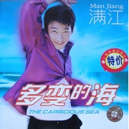

多变的海The Capricious Sea
============================

|  |  |
| :--: | :-- |
| [ 多变的海The Capricious Sea](https://emumo.xiami.com/album/3558) | **艺人**: [满江](../index.md) **语种**: 国语 **唱片公司**: 索尼声像 **发行时间**: 1998年06月01日 **专辑类别**: 录音室专辑 **专辑风格**: 国语流行 Mandarin Pop, 华语唱作人 Chinese Singer-Songwriter **播放数**: 121881 **收藏数**: 49 **评论数**: 21  |

## 简介

小的时候满江曾经学画画、弹琴，上了中学又去打蓝球踢足球，结果没一样长久。今年夏天，他对父母说第一张专辑就要发行了，他们大吃了一惊——当初学画学琴搞运动、没有哪样最后成了正果，在父母心里，满江是个让人担心的孩子。唱歌这件事竟然坚持了下来、一直兴致勃勃，着实让他们意外。满江喜欢一些来自自然的声音，比如去村子里，拾录下清晨时的声音：门打开的吱纽声、人在井边汲水木桶垂下深井时的咚声、水洒落在井里的回声，泼洒在井台上的哗啦声；有人出发去田里，铁鍬划过地面的摩擦声，衣服扫过草丛的沙沙声。把这些声音放进音乐里，让音乐中充满清新和真实的气氛，他希望在他的音乐里，能越来越多的包含这些。进录音棚，和不同的制作人、词曲作者合作，把音乐的内在用声音作以演绎，这个过程对他而言美好奇妙、充满吸引力。他想要一种音乐，象梦一样的音乐。旋律响起，你听到鼓在近处，吉它在远处，一个梦境正慢慢浮起，把你包围、感染。在梦的感觉里，满江开始唱歌，用自己的声音融入这个梦境，用他的声音，使这个梦有灵魂。在这样一个梦里的时候，他感觉到音乐是一种幸福。但愿他的歌给人幻想，因为满江声音的传达，听歌的人们也能同时感受到梦和幸福的感觉。在这张专辑里，有很多他喜欢的歌，别人写的、他自己试着创作的。希望自己能用这张专辑对听众说：这就是我——我的声音、我的歌、我的心情、我的感受。希望有一天，自己能在一个大体育场上开自己的个人演唱会，舞台很大，观众离自己很近，可以绕着跑；要那种没有顶的露天体育场，演唱会在晚上开，唱歌的时候，一抬头可以看见天上的星星。他很高兴：有歌被大伙听到。在未来的路上，一定还有许多变化等着自己去继续积累、学习、好好地努力；他想他会的，因为只有这样做，他才能和所有喜欢音乐的人一起，过兴高彩烈的生活。   
 

## 曲目

- [多变的海The Capricious Sea](./3558/dh4B365af.md)
- [你是春风我是雨MVYou're The Wind And I'm The Rain](./3558/Bzm885ae.md)
- [我喜欢你的笑MVI Do Like Your Smile](./3558/bb0hd1009.md)
- [美丽不是错误Beauty Is Not A Fau Fault](./3558/bb0i9bced.md)
- [心线The Line Of Heart](./3558/bb0jb3f85.md)
- [舍不得你走MVCan't Let You Go](./3558/bR1Y213a6.md)
- [一辈子的宠爱MVMy Favourite Forever](./3558/b11ff191f.md)
- [我们是朋友MVWe're Friends](./3558/bb0ma398d.md)
- [不要从记忆中离开MVDon't Forget](./3558/b11hf638c.md)
- [各自寂寞MVAlone Each Other](./3558/bb0ob55ae.md)

## 评论

|  |  |  |  |
| :-- | :-- | :-- | :-- |
|  [虾米用户](https://emumo.xiami.com/u/404793232)  2020-01-07 22:49 赞(0) 踩(0) | 
满江多变的海很好听值得推荐
 |
|  [虾米用户](https://emumo.xiami.com/u/32020686) 暖宝宝 夏天来了 2019-05-11 17:20 赞(1) 踩(0) | 
听满江的人已到中年
 |
|  [虾米用户](https://emumo.xiami.com/u/187180411)  2019-04-02 12:58 赞(2) 踩(0) | 
那个时候特别喜欢满江，所有专辑都买过，声音好听，有才华，最近突然想听他的歌了，怀念以前的时光
 |
|  [虾米用户](https://emumo.xiami.com/u/200349556)  2018-12-16 11:31 赞(0) 踩(0) | 
满江太可惜
 |
|  [虾米用户](https://emumo.xiami.com/u/45213256)  2018-11-14 19:22 赞(1) 踩(0) | 
南李绍继，北满江。当年，在内地歌坛的新人中，就像南慕容北乔峰一样存在。专辑里好几首歌都是中国流行歌曲榜中的热门曲目。唉，暴露年龄……
 |
|  [虾米用户](https://emumo.xiami.com/u/271356632)  2018-01-27 00:20 赞(0) 踩(0) | 
多变的海 购买的第一张正版卡带  现在卡带找不到了  幸好虾米有这张。
 |
| ⇒ |  [虾米用户](https://emumo.xiami.com/u/2130824) 有想法有做法 2019-10-11 17:37 赞(0) 踩(0) | 
我还有磁带，随身听却没了
 |
|  [虾米用户](https://emumo.xiami.com/u/41952169) 啦啦啦啦 2017-10-28 00:27 赞(0) 踩(0) | 
我为什么总是在考试复习的时候，喜欢上一个人的歌 
 |
| ⇒ |  [虾米用户](https://emumo.xiami.com/u/45213256)  2018-11-14 19:23 赞(0) 踩(0) | 
好好复习，好好考试
 |
|  [虾米用户](https://emumo.xiami.com/u/8070377) 爱雾瑞性维欧腐漏 2016-12-13 19:51 赞(2) 踩(0) | 
伍思凯当年挺闲啊哈哈
 |
|  [虾米用户](https://emumo.xiami.com/u/8070377) 爱雾瑞性维欧腐漏 2016-12-13 19:45 赞(0) 踩(0) | 
砖封是用CD拍的 一定
 |
| ⇒ |  [虾米用户](https://emumo.xiami.com/u/18282119) 我就是我，独一无二 2017-03-10 08:15 赞(0) 踩(0) | 
老专都是如此了，不管是哪个地区的。
 |
| ⇒ |  [虾米用户](https://emumo.xiami.com/u/8070377) 爱雾瑞性维欧腐漏 2017-03-10 09:07 赞(0) 踩(0) | 
<q><b>______说：</b></q>
 |
| ⇒ |  [虾米用户](https://emumo.xiami.com/u/18282119) 我就是我，独一无二 2017-03-10 09:08 赞(0) 踩(0) | 
<q><b>　　　夜宵与战争 ☾　说：</b></q>
 |
|  [虾米用户](https://emumo.xiami.com/u/2321658) 我还没想好要写什么... 2016-09-02 02:46 赞(0) 踩(0) | 
封面的的特价亮了
 |
|  [虾米用户](https://emumo.xiami.com/u/42257225)  2015-09-20 14:03 赞(0) 踩(0) | 
喜欢这时候的满江，这时候的伍思凯
 |
| ⇒ |  [虾米用户](https://emumo.xiami.com/u/42775673) 为自己的故事插上翅膀 2016-06-29 14:14 赞(0) 踩(0) | 
满江怎么和伍思凯扯到一起去了？
 |
| ⇒ |  [虾米用户](https://emumo.xiami.com/u/233338) 暂无签名~ 2017-02-20 15:21 赞(0) 踩(0) | 
<q><b>故事的翅膀说：</b></q>
 |
|  [虾米用户](https://emumo.xiami.com/u/548654) 我还没想好要写什么... 2014-12-29 20:19 赞(0) 踩(0) | 
《你是春风我是雨》间奏编的美极了。
 |
|  [虾米用户](https://emumo.xiami.com/u/5132921)  2012-12-04 00:18 赞(0) 踩(0) | 
他想要一种音乐，象梦一样的音乐。
 |
|  [虾米用户](https://emumo.xiami.com/u/355865) Let it go, l... 2012-11-25 21:25 赞(0) 踩(0) | 
索尼声像
 |
