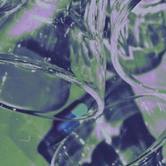
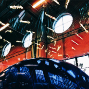
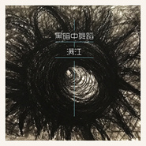
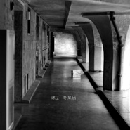
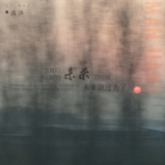
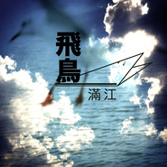
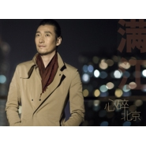
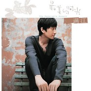
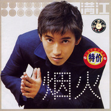

满江
============================

|  |  |
| :--: | :-- |
| [ 满江](https://i.xiami.com/manjiang) | **地区**: China 中国大陆 **风格**: 民谣 Folk, 国语流行 Mandarin Pop, 华语唱作人 Chinese Singer-Songwriter **播放数**: 14227927 **粉丝数**: 5005 **评论数**: 256  |

## 档案

满江，中国内地创作歌手，作为SONY唱片公司在中国内地签约力捧的第一位男新人，满江以偶像歌手身份出道，之后逐步改走独立音乐人路线。歌曲风格从流行渐变为民谣，近年来的作品也偶尔加入一些电子元素。 
出道至今，满江在各大权威排行榜和颁奖礼上获奖无数，金曲、最佳专辑，最佳男歌手等多项大奖揽入怀中。2010年凭借专辑《最美的时光》收获中歌榜“年度传媒推荐大奖”，MUSIC RADIO TOP排行榜“年度内地最佳制作人大奖”。 
音乐人满江，褪去青春的光鲜后，音乐态度更加明朗，坚持萃取生命如歌的感动和感悟，与世分享。 
姓名：满江 
风格：流行、民谣 
身高：1.84m 
生日：1月9日 
血型：O型 
民族：回族 
籍贯：北京 
星座：摩羯座 
所属公司：易柏文化 
代表作：《裙角飞扬》《恋爱中的城市》《奇迹》《我们之间》《水牛儿》《百万富翁》《最美的时光》《心碎北京》《飞鸟》等。 
唱片： 
《多变的海》（1998） 《秘密花园》（1999） 《烟火》（1999） 《奇迹》（2002） 
《四舍五入》（2004） 《百万富翁》（2007） 《最美的时光》（2010） 
重要奖项 
◆ 《奇迹》获中国歌曲排行榜2002年度十大金曲奖、年度最佳专辑、 年度最受欢迎男歌手提名 
◆ 《奇迹》获CHANNEL[V]华语榜中榜2002年度内地最受欢迎歌曲、 年度最受欢迎男歌手提名 
◆ 《奇迹》获上海东方风云榜2002年度十大金曲、 年度最受欢迎男歌手提名 
◆  MTV-CCTV 年度中国内地最受欢迎男歌手提名 
◆ 《奇迹》获第三届音乐风云榜2002年度十大金曲、年度最佳作曲奖、 年度最佳男歌手提名、最佳专辑提名、最佳制作人提名 
◆ 《肩膀》《 四舍五入》《我们之间》三首单曲先后获中国歌曲排行榜冠军 
◆ 《肩膀》获中国歌曲排行榜2004年度十大金曲、最受欢迎男歌手提名 
◆ 《四舍五入》获MUSICRADIO音乐之声2004年度十大金曲、年度内地最佳男歌手 
◆ 《肩膀》获第五届全球华语排行年度金曲 
◆  获第五届全球华语排行榜2004年度颁奖礼年度地区（北京）最受欢迎男歌手奖 
◆《百万富翁》获中国歌曲排行榜冠军（连续上榜13周） 、中歌榜2007年度十大金曲 
◆《水牛儿》获MUSIC RADIO排行榜、雪碧榜、音乐风云榜冠军 
◆《最美的时光》获中国歌曲排行榜、MUSIC RADIO TOP排行榜冠军； 
◆《我们唱着那首歌》蝉联MUSIC RADIO排行榜四周亚军、三周冠军、上海东方风云榜冠军 
◆《深爱的你》获中国歌曲排行榜、MUSIC RADIO排行榜冠军 
◆《一路落花》获中国歌曲排行榜、MUSIC RADIO排行榜、上海东方风云榜冠军 
◆中国歌曲排行榜2010年度“传媒推荐大奖” 
◆MUSIC RADIO TOP排行榜“内地年度最佳制作人”

## 专辑

| 名称 | 语种 | 唱片公司 | 发行时间 | 专辑类别 | 专辑风格 |
| :--: | :-- | :-- | :-- | :-- | :-- |
| [ 三个空杯子](./albums/5022320525.md) | 国语 | Mr.Man音乐工作室 | 2020年12月31日 | 录音室专辑 | 国语流行 Mandarin Pop |
| [ 进化论](./albums/5021351727.md) | 国语 | 易柏文化 | 2020年08月24日 | 录音室专辑 |  |
| [ 将离.将至](./albums/2104427600.md) | 纯音乐 | 易柏文化 | 2018年12月31日 | EP, 单曲 | 国语流行 Mandarin Pop |
| [ 黑暗中舞蹈](./albums/2104104423.md) | 英语 | 易柏文化 | 2018年06月26日 | EP, 单曲 |  |
| [ 冬某日](./albums/2103463074.md) | 国语 | 易柏文化 | 2017年12月26日 | 录音室专辑 | 独立摇滚 Indie Rock, 华语唱作人 Chinese Singer-Songwriter |
| [ 际](./albums/2102973154.md) | 国语 | 易柏文化 | 2017年12月12日 | EP, 单曲 |  |
| [ 当我们聊到未来的时候，未来就过去了](./albums/2102851415.md) | 国语 | 易柏文化 | 2017年09月05日 | EP, 单曲 |  |
| [ Mr.Man](./albums/2100279090.md) | 国语 | 易柏文化 | 2016年06月06日 | 录音室专辑 | 民谣流行 Folk Pop |
| [ 黑暗中舞蹈](./albums/2100299430.md) | 国语 | 易柏文化 | 2016年03月24日 | EP, 单曲 | 摇滚 Rock & Roll |
| [ 陪我聊天的乘客](./albums/1602466407.md) | 国语 | 易柏文化 | 2014年06月13日 | EP, 单曲 | 国语流行 Mandarin Pop |
| [ 飞鸟](./albums/2096490931.md) | 国语 | 易柏文化 | 2014年04月03日 | EP, 单曲 |  |
| [ 心碎北京](./albums/87507875.md) | 国语 | 易柏文化 | 2013年12月20日 | EP, 单曲 |  |
| [ 最后的温柔Love Tender](./albums/1962985873.md) | 国语 | 易柏文化 | 2013年01月22日 | EP, 单曲 | 国语流行 Mandarin Pop |
| [ 最美的时光The Memorable Moment](./albums/197156.md) | 国语 | 易柏文化 | 2010年10月05日 | 录音室专辑 | 国语流行 Mandarin Pop |
| [ 天使的孩子](./albums/411799.md) | 国语 | 易柏文化 | 2009年04月01日 | EP, 单曲 |  |
| [ 百万富翁](./albums/33051.md) | 国语 | 易柏文化 | 2007年11月13日 | 录音室专辑 |  |
| [ 四舍五入](./albums/3552.md) | 国语 | 易柏文化 | 2004年11月19日 | 录音室专辑 | 国语流行 Mandarin Pop, 华语唱作人 Chinese Singer-Songwriter |
| [ 风的穿行](./albums/1817579764.md) | 国语 | 易柏文化 | 2004年04月16日 | EP, 单曲 |  |
| [ 红的精选Man Jiang Album](./albums/3553.md) | 国语 | 索尼声像 | 2002年12月01日 | 精选集 | 华语唱作人 Chinese Singer-Songwriter, 国语流行 Mandarin Pop |
| [ 奇迹Miracle](./albums/3554.md) | 国语 | 易柏文化 | 2002年09月06日 | 录音室专辑 | 国语流行 Mandarin Pop, 华语唱作人 Chinese Singer-Songwriter |
| [ 烟火](./albums/3556.md) | 国语 | 索尼声像 | 1999年10月01日 | 录音室专辑 | 国语流行 Mandarin Pop, 华语唱作人 Chinese Singer-Songwriter |
| [ 秘密花园The Secret Garden](./albums/3557.md) | 国语 | 索尼声像 | 1999年03月01日 | EP, 单曲 | 国语流行 Mandarin Pop, 华语唱作人 Chinese Singer-Songwriter |
| [ 多变的海The Capricious Sea](./albums/3558.md) | 国语 | 索尼声像 | 1998年06月01日 | 录音室专辑 | 国语流行 Mandarin Pop, 华语唱作人 Chinese Singer-Songwriter |

## 评论

|  |  |  |
| :-- | :-- | :-- |
|  [虾米用户](https://emumo.xiami.com/u/1168284)  2021-01-12 14:42 赞(0) 踩(0) | 
红不起来的原因是：歌迷不想让你红。
 |
|  [虾米用户](https://emumo.xiami.com/u/354225018)  2020-12-28 08:48 赞(1) 踩(0) | 
耐听王
 |
|  [虾米用户](https://emumo.xiami.com/u/43151921)  2020-10-20 21:25 赞(0) 踩(0) | 
如果还有坚持下去的理由就坚持下！
 |
|  [虾米用户](https://emumo.xiami.com/u/443312693)  2020-06-06 23:48 赞(0) 踩(0) | 
这么好的歌曲你居然播放权都没有？
 |
|  [虾米用户](https://emumo.xiami.com/u/1942196)   2020-01-09 10:43 赞(0) 踩(0) | 
生日快乐
 |
|  [虾米用户](https://emumo.xiami.com/u/38875385) 期盼明月期盼朝阳期盼春风... 2020-01-09 10:21 赞(0) 踩(0) | 
生日快乐
 |
|  [虾米用户](https://emumo.xiami.com/u/776088) 不愿一个人 2020-01-09 10:02 赞(1) 踩(0) | 
音乐节上听了满江的现场，翩翩少年郎变成了眼神深邃的蓄须大叔，个性十足。 
 |
|  [虾米用户](https://emumo.xiami.com/u/42446628) she's damn r... 2019-11-23 12:25 赞(0) 踩(0) | 
生不逢时
 |
|  [虾米用户](https://emumo.xiami.com/u/7151428) 暖暖的～～ 2019-11-14 21:43 赞(0) 踩(0) | 
！！
 |
|  [虾米用户](https://emumo.xiami.com/u/406064879)  2019-04-22 08:15 赞(0) 踩(0) | 
嘻嘻，高中听到现在
 |
|  [虾米用户](https://emumo.xiami.com/u/293096168)  2019-04-11 08:52 赞(0) 踩(0) | 
郁郁不得志时就想听你的歌，感觉像飞鸟一样自由寻找那未灭的理想
 |
|  [虾米用户](https://emumo.xiami.com/u/121237252) 写在身体上。 2019-04-11 00:30 赞(0) 踩(0) | 
唱了很多歌呢
 |
|  [虾米用户](https://emumo.xiami.com/u/348858326) 之前河水只是河水 2019-03-13 22:17 赞(0) 踩(0) | 
干了这坛满江红
 |
|  [虾米用户](https://emumo.xiami.com/u/352193674)  2019-01-21 10:41 赞(0) 踩(0) | 
一首归来让我重新认识了你
 |
|  [虾米用户](https://emumo.xiami.com/u/92905764)  2019-01-09 16:32 赞(0) 踩(0) | 
生日快乐
 |
|  [虾米用户](https://emumo.xiami.com/u/275692521) 喜欢全是腿的夏天 2019-01-09 10:35 赞(0) 踩(0) | 
1*9号，生日快乐，期待新专辑
 |
|  [虾米用户](https://emumo.xiami.com/u/319004978) 我很聪明什么也没留下..... 2019-01-09 10:13 赞(0) 踩(0) | 

 |
|  [虾米用户](https://emumo.xiami.com/u/91880472) 往事如烟，人生如梦…… 2019-01-07 17:00 赞(0) 踩(0) | 
第一次认识你是你的那张四舍五入专辑，当时高中听磁带的年代，很喜欢你的声线。这么多年过去了，你已经饱经沧桑，经过岁月的沉淀，更有味道了，就是不知道为什么好多假唱的小鲜肉都能火你却被人们渐渐淡忘 
 |
|  [虾米用户](https://emumo.xiami.com/u/6787216) 音乐影画老周 2019-01-02 11:36 赞(0) 踩(0) | 
喜欢前半段，意境好
 |
|  [虾米用户](https://emumo.xiami.com/u/123246788) Music is my ... 2019-01-01 11:41 赞(2) 踩(0) | 
他和我的初恋长得很像！ 
 |
|  [虾米用户](https://emumo.xiami.com/u/348625996) 嘿嘿 2018-12-02 10:50 赞(0) 踩(0) | 
很久之前在电视上看了一个MV，隐约记得歌手是满江，名字里有生日快乐几个字，节奏还满快的一首歌，是我记忆出现BUG了么，怎么都找不到，有人知道这个歌吗，感谢...
 |
|  [虾米用户](https://emumo.xiami.com/u/8283785) 谜子 2018-11-25 23:16 赞(1) 踩(0) | 
满江摆脱了最初出道时候演唱口水歌偶像歌手的青涩，改走民谣路线之后反而更能让人映像深刻，成熟男人的魅力，越发让人欲罢不能!请继续加油！
 |
|  [虾米用户](https://emumo.xiami.com/u/10441212) ！ 2018-11-08 20:44 赞(2) 踩(0) | 
他要不走独立音乐的话，可能现在算是娱乐圈的一个大咖了。但就论这才干，在圈内也应该是属于那种公认的人才吧
 |
|  [虾米用户](https://emumo.xiami.com/u/10825940)  2018-11-07 01:27 赞(1) 踩(0) | 
[cp]我希望叔永远做自己喜欢的音乐，逗猫写字画画惬意又随心，有人在喜欢，而不是有一天忽然被推上热搜，被俗世的喧闹围绕，就像喜欢朴树一样，我们这代人，不懂现在孩子的饭圈，十年前我们喜欢的，十年后还在喜欢，白发苍苍的那一天，依然在喜欢，我们叫这种为情节。
 |
| ⇒ |  [虾米用户](https://emumo.xiami.com/u/401835497)  2019-04-10 21:35 赞(0) 踩(0) | 
作为00后的我其实也不懂好歌手没火，市场太浮躁了
 |
|  [虾米用户](https://emumo.xiami.com/u/2594230) 听歌 2018-10-30 22:17 赞(0) 踩(0) | 
风格明显更时尚了
 |
|  [虾米用户](https://emumo.xiami.com/u/276713536)   2018-10-10 09:08 赞(0) 踩(0) | 
明明可以靠颜值，却偏偏要靠才华～ 还好喜欢你       
 |
|  [虾米用户](https://emumo.xiami.com/u/14383749) 我还没想好要写什么... 2018-10-06 13:12 赞(0) 踩(0) | 
优秀
 |
|  [虾米用户](https://emumo.xiami.com/u/328307513) 云在水中水行船 花在心中... 2018-09-19 07:32 赞(2) 踩(0) | 
很有才华的音乐人 还能让我们免费下载 
 |
|  [虾米用户](https://emumo.xiami.com/u/262197195) 我对你仍有爱意，我对自己... 2018-09-06 07:39 赞(3) 踩(0) | 
我上学时候超级喜欢他，一看见海报或者听他的歌心里就觉得暖暖的
 |
|  [虾米用户](https://emumo.xiami.com/u/355148578) 我还没想好要写什么... 2018-08-17 03:13 赞(2) 踩(0) | 
喜欢新的你
 |
|  [虾米用户](https://emumo.xiami.com/u/335724017)  2018-08-09 11:01 赞(0) 踩(0) | 
满江你青少年时就已经成名了，对我一个普通人还这么低调！好感动阿！我要是作词、作曲和编曲、创意都很棒的话，一定按你的气质和声线为你打造一首歌曲，让你重新辉煌如日月之光！
 |
|  [虾米用户](https://emumo.xiami.com/u/4727415) swallowyours... 2018-07-23 01:21 赞(0) 踩(0) | 
Zen Chien 7月21日下午7:13 &amp;middot; 去年來北京製作的專輯終於拿到了 #滿江 #冬某日 #華語音樂傳媒大獎最佳男歌手
 |
|  [虾米用户](https://emumo.xiami.com/u/303506160) 因为我对你爱的深沉 2018-06-14 06:35 赞(1) 踩(0) | 
嘿呦
 |
|  [虾米用户](https://emumo.xiami.com/u/244935183)  2018-05-21 20:30 赞(2) 踩(0) | 
让人从一而终的歌手真的不多，恰好我们是如此善变又挑剔的听者。有些人就像一杯酒，越久越醇香&amp;hellip;曾经的清新曲目依旧可以入耳，还有让人心碎的 《天使的孩子》 直至最新的摇滚转型都是人生轨迹的写照&amp;hellip;活成这样，对音乐纯粹，且从一而终，精心呵护，不改初心&amp;hellip;能跃入脑海的李健，满江&amp;hellip;说实话自私的希望你们一如既往的小众私有&amp;hellip;但你们的才华不应该被埋没。不争不抢顺其自然&amp;hellip;好的人知道你的好，应该且值得被更多人熟知和认可&amp;hellip;
 |
|  [虾米用户](https://emumo.xiami.com/u/53274361) 去了天堂请记住我的声音 2018-05-14 01:58 赞(0) 踩(0) | 
满江老师，期待您回访我的主页 
 |
|  [虾米用户](https://emumo.xiami.com/u/35509231) 提灯天后  策马小僧 2018-05-13 19:32 赞(1) 踩(0) | 
长的好看，唱的是真的好，啊！而且是这种路子，一点都不忧愁，也不歌唱远方啊姑娘啊~嘿伙计，你是我的菜，快到碗里来
 |
|  [虾米用户](https://emumo.xiami.com/u/249036173)  2018-05-13 09:50 赞(4) 踩(0) | 
满江非常有才华的创作歌手！为人低调，没有负面新闻，非常积极向上，又很阳光的一位好歌手！
 |
|  [虾米用户](https://emumo.xiami.com/u/881774)  2018-05-08 19:20 赞(0) 踩(0) | 
小时候就认识，厦门见！
 |
|  [虾米用户](https://emumo.xiami.com/u/7797443) / / 2018-04-21 09:56 赞(1) 踩(0) | 
求求更新艺人相册，沉淀后的Mr.man帅得不成样子 
 |
|  [虾米用户](https://emumo.xiami.com/u/50555903) 我永失你爱，却有人高歌。 2018-04-18 22:38 赞(1) 踩(0) | 
好帅
 |
|  [虾米用户](https://emumo.xiami.com/u/334935388)  2018-04-17 07:37 赞(0) 踩(0) | 
好听
 |
|  [虾米用户](https://emumo.xiami.com/u/22258460)  2018-04-01 13:19 赞(0) 踩(0) | 
实力毋庸置疑
 |
|  [虾米用户](https://emumo.xiami.com/u/210874472) 哦！原来你也在这里 ! 2018-03-28 20:25 赞(1) 踩(0) | 
真的对满江情有所钟!
 |
|  [虾米用户](https://emumo.xiami.com/u/51699680)   2018-03-20 19:30 赞(1) 踩(0) | 
一直很西瓜他温柔的声音，暖暖的
 |
|  [虾米用户](https://emumo.xiami.com/u/253050358) 孤独即罪恶 2018-03-10 00:47 赞(1) 踩(0) | 
真音乐人，希望更多人听到
 |
|  [虾米用户](https://emumo.xiami.com/u/166685678) 朋友也挺好 2018-03-08 17:57 赞(0) 踩(0) | 
加油 
 |
|  [虾米用户](https://emumo.xiami.com/u/166685678) 朋友也挺好 2018-03-08 17:57 赞(1) 踩(0) | 
现在在听《归来》还是蛮喜欢的
 |
|  [虾米用户](https://emumo.xiami.com/u/347396227)  2018-03-07 13:24 赞(1) 踩(0) | 
真正用心唱歌的歌手！
 |
|  [虾米用户](https://emumo.xiami.com/u/31236607) 暂无签名~ 2018-03-05 08:20 赞(1) 踩(0) | 
加油 满江大哥！
 |
|  [虾米用户](https://emumo.xiami.com/u/252008927)  2018-02-24 17:30 赞(1) 踩(0) | 
不见图，光听他的声音还以为是一位老大哥，声音真的很沉稳，很沉醉~
 |
|  [虾米用户](https://emumo.xiami.com/u/11944449) 暂无签名~ 2018-01-19 00:08 赞(2) 踩(0) | 
支持上歌手 
 |
|  [虾米用户](https://emumo.xiami.com/u/337754831)  2018-01-04 02:12 赞(2) 踩(0) | 
最性感的声音超赞挺你必须的
 |
|  [虾米用户](https://emumo.xiami.com/u/305989437) 友善 2017-12-25 19:42 赞(2) 踩(0) | 
听满江的唱歌就是一种享受！仿佛身临其境。令人遐想，使人感悟！
 |
|  [虾米用户](https://emumo.xiami.com/u/282448587) 如果人生是一首歌，我愿像... 2017-11-20 16:46 赞(2) 踩(0) | 
最好的歌手
 |
|  [虾米用户](https://emumo.xiami.com/u/100923936) 心有猛虎，细嗅蔷薇 2017-11-18 17:06 赞(1) 踩(0) | 
等你归来
 |
|  [虾米用户](https://emumo.xiami.com/u/116840970) 浣熊的媳妇^.^ 2017-10-30 09:55 赞(4) 踩(0) | 
应该去我是歌手，公司应该力捧他，这么帅歌声这么美
 |
|  [虾米用户](https://emumo.xiami.com/u/232942238)  2017-10-29 12:55 赞(0) 踩(0) | 
我在广东
 |
|  [虾米用户](https://emumo.xiami.com/u/298948030) 中國詩音樂電影创始人作曲... 2017-10-17 22:02 赞(0) 踩(0) | 
你好
 |
|  [虾米用户](https://emumo.xiami.com/u/7800081) 我还没想好要写什么... 2017-10-08 22:25 赞(3) 踩(0) | 
当年暗恋的老师喜欢的歌手，转眼间感觉自己都老了。
 |
| ⇒ |  [虾米用户](https://emumo.xiami.com/u/252795927)  2018-02-11 17:16 赞(0) 踩(0) | 

 |
|  [虾米用户](https://emumo.xiami.com/u/190743936) 我哪里也不去，我一直都在... 2017-09-15 20:47 赞(2) 踩(0) | 
我在演唱会现场写下我喜欢你。
 |
|  [虾米用户](https://emumo.xiami.com/u/313421425) 筚路蓝缕，以启山林 2017-08-18 23:50 赞(0) 踩(0) | 
没有他的中华诵
 |
|  [虾米用户](https://emumo.xiami.com/u/42581568)   2017-06-19 21:41 赞(1) 踩(0) | 
唱的很有感觉
 |
|  [虾米用户](https://emumo.xiami.com/u/120683548)  2017-06-08 14:14 赞(0) 踩(0) | 
  怎么下架了，尴尬！！
 |
|  [虾米用户](https://emumo.xiami.com/u/258468261)  2017-06-05 22:48 赞(1) 踩(0) | 
飞鸟 归来 mr、man三首最爱
 |
|  [虾米用户](https://emumo.xiami.com/u/13187797) 被你吃了 2017-06-04 23:21 赞(0) 踩(0) | 
谁能告诉我为什么下架了
 |
|  [虾米用户](https://emumo.xiami.com/u/52112754)   2017-05-23 19:53 赞(0) 踩(0) | 
乔任梁和满江长的好像
 |
|  [虾米用户](https://emumo.xiami.com/u/256717801)  2017-05-18 21:42 赞(1) 踩(0) | 
声音里有故事
 |
|  [虾米用户](https://emumo.xiami.com/u/38081676)  2017-05-10 12:08 赞(0) 踩(0) | 
你是春风我是雨
 |
|  [虾米用户](https://emumo.xiami.com/u/288425322) 我还没想好要写什么... 2017-05-04 12:56 赞(2) 踩(0) | 
归来真是好听，每天循环播放
 |
|  [虾米用户](https://emumo.xiami.com/u/282700317) 你不懂我的沉默，又怎懂我... 2017-04-25 21:15 赞(3) 踩(0) | 
满江唱的一首《归来》确实好听，百听不厌，我都连听好几个月了，还经常发到群里与大家分享 
 |
|  [虾米用户](https://emumo.xiami.com/u/288927641)  2017-04-16 02:19 赞(12) 踩(0) | 
只有满江这样的才配的上是歌手、音乐人。他真的是用生活在唱歌，谢谢他愿意分享。永远支持满哥。
 |
|  [虾米用户](https://emumo.xiami.com/u/283109022) 我还没想好要写什么... 2017-04-15 00:16 赞(2) 踩(0) | 
满哥我永远支持你
 |
|  [虾米用户](https://emumo.xiami.com/u/43905355)  2017-04-04 14:01 赞(3) 踩(0) | 
以前的裙角飞扬很喜欢
 |
| ⇒ |  [虾米用户](https://emumo.xiami.com/u/641829) 暂无签名~ 2017-04-09 21:54 赞(0) 踩(0) | 
是的，很喜欢
 |
|  [虾米用户](https://emumo.xiami.com/u/43905355)  2017-04-04 14:00 赞(1) 踩(0) | 
他特别喜欢你
 |
|  [虾米用户](https://emumo.xiami.com/u/101199022) 秋雁两行江上雨 2017-04-03 19:27 赞(1) 踩(0) | 
力挺满江  歌好有深度 喜欢
 |
|  [虾米用户](https://emumo.xiami.com/u/259589883)  2017-04-02 23:38 赞(1) 踩(0) | 
喜欢《归来》 心有所向的地方 魂牵梦萦的故乡 埋藏梦想的地方 有没有花开成海洋
 |
|  [虾米用户](https://emumo.xiami.com/u/274852371)  2017-03-29 03:13 赞(2) 踩(0) | 
记得没错的话98年出道的，那年我在北京15岁
 |
|  [虾米用户](https://emumo.xiami.com/u/33995595)  2017-03-26 14:34 赞(2) 踩(0) | 
小时候觉得帅哥就是这个样子。
 |
|  [虾米用户](https://emumo.xiami.com/u/40229239)  2017-03-26 00:30 赞(3) 踩(0) | 
演艺界的一朵莲花，出於泥而不染，超凡脱俗！
 |
|  [虾米用户](https://emumo.xiami.com/u/280596394)  2017-03-15 19:28 赞(3) 踩(0) | 
越来越有男人味了，希望写的歌越来越好听
 |
|  [虾米用户](https://emumo.xiami.com/u/280596394)  2017-03-15 19:26 赞(1) 踩(0) | 
越来越有男人伟了
 |
|  [虾米用户](https://emumo.xiami.com/u/49684129)  2017-03-05 20:06 赞(0) 踩(0) | 
可以
 |
|  [虾米用户](https://emumo.xiami.com/u/49684129)  2017-03-05 20:06 赞(0) 踩(0) | 
可以
 |
|  [虾米用户](https://emumo.xiami.com/u/42446628) she's damn r... 2017-03-05 11:00 赞(1) 踩(0) | 
又是一个生不逢时的歌手
 |
|  [虾米用户](https://emumo.xiami.com/u/253264635)  2017-03-04 00:04 赞(7) 踩(0) | 
这么好的歌，这么好的歌手，遇到了，是我的幸运。
 |
|  [虾米用户](https://emumo.xiami.com/u/253719020)  2017-03-02 19:46 赞(0) 踩(0) | 
可以
 |
|  [虾米用户](https://emumo.xiami.com/u/267646168)  2017-02-09 03:00 赞(1) 踩(0) | 
我只想点个赞，别的不多说
 |
|  [虾米用户](https://emumo.xiami.com/u/10603191) E心E意 2017-02-08 13:55 赞(1) 踩(0) | 
归来
 |
|  [虾米用户](https://emumo.xiami.com/u/109111)  2017-02-05 17:32 赞(3) 踩(0) | 
我发现我有新的偶像了 
 |
|  [虾米用户](https://emumo.xiami.com/u/8364649)  2017-01-19 21:33 赞(2) 踩(0) | 
多变的海 你是春风我是雨 到现在的归来，蜕变，从未忘记你。
 |
|  [虾米用户](https://emumo.xiami.com/u/260167529) 爱音乐的疯子 2017-01-19 21:14 赞(2) 踩(0) | 
超水准回归 小满哥
 |
|  [虾米用户](https://emumo.xiami.com/u/9833147) . 2017-01-14 23:51 赞(1) 踩(0) | 
等你归来
 |
|  [虾米用户](https://emumo.xiami.com/u/11353)  2017-01-13 19:12 赞(2) 踩(0) | 
买到新专，很棒。跟以前比，又上了一个层次，很棒，加油！
 |
|  [虾米用户](https://emumo.xiami.com/u/257697421)  2017-01-11 23:29 赞(0) 踩(0) | 
999
 |
|  [虾米用户](https://emumo.xiami.com/u/811354)  2017-01-11 12:16 赞(2) 踩(0) | 
满江  请加油！距离你的好时光已经不远了！
 |
|  [虾米用户](https://emumo.xiami.com/u/70772964) Road to Rede... 2017-01-08 16:07 赞(0) 踩(0) | 
❤️
 |
|  [虾米用户](https://emumo.xiami.com/u/97747450) 我还没想好要写什么... 2016-12-14 23:13 赞(0) 踩(0) | 
6447
 |
|  [虾米用户](https://emumo.xiami.com/u/8070377) 爱雾瑞性维欧腐漏 2016-12-13 20:24 赞(3) 踩(0) | 
其实一直都没忘记过他 虽说平时不怎么听了但是偶尔还是能看见他的消息(大概一年半载看见一次吧哈哈) 昨天晚上看完天下足球 换台 好像是内地独立音乐频道还是啥 播了一场他的小型演唱会 然后刚才吃完饭听歌就想着搜他一下 记忆中他有个砖叫四舍五入 那时候上初中即将毕业吧 他打榜啊啥的 还得了挺多奖好像 再之前索尼当时签下他 好像内地第一位吧 四舍五入 我们之间是记忆中他的曲风 刚才听了好多首 蛮喜欢多变的海的 他的第一首歌 对了推荐一下 很早期的奇迹那张砖里的 屋顶上的秋天(后现代之倒转乾坤版) 哈哈哈 这首特魔性噢  不造为啥听满江时候我不由自主的会想起萧贺硕 然后刚把满江的歌听完 ...
 |
|  [虾米用户](https://emumo.xiami.com/u/8070377) 爱雾瑞性维欧腐漏 2016-12-13 19:21 赞(1) 踩(0) | 
我觉得他挺酷的 同时还挺容易亲近的 矛盾么哈哈
 |
|  [虾米用户](https://emumo.xiami.com/u/49640493) 网易云SAINTDONT... 2016-11-28 13:32 赞(1) 踩(0) | 
请你等我 等我 我在努力的朝着有你的地方狂奔 等我 我在努力 我要给你最好的我 等我
 |
|  [虾米用户](https://emumo.xiami.com/u/225014964)  2016-11-21 23:35 赞(1) 踩(0) | 
有水准，确实值得收藏的好歌曲
 |
|  [虾米用户](https://emumo.xiami.com/u/37304928) 我还没想好要写什么... 2016-11-09 19:05 赞(0) 踩(0) | 
真的很好听
 |
|  [虾米用户](https://emumo.xiami.com/u/71446596)  2016-10-28 10:20 赞(1) 踩(0) | 
太喜欢这张新专辑了！
 |
|  [虾米用户](https://emumo.xiami.com/u/3338260) 网易云ID 荼靡姐 欢迎... 2016-10-23 09:57 赞(2) 踩(0) | 
真的很好听。
 |
|  [虾米用户](https://emumo.xiami.com/u/40872947) 不善言谈 却爱跟对味er... 2016-10-16 23:53 赞(2) 踩(0) | 
沉淀后
 |
|  [虾米用户](https://emumo.xiami.com/u/2152213)  2016-10-14 22:28 赞(1) 踩(0) | 
据我所知，长头发的男歌手在内地红起来的屈指可数，典型的例如高胖子，刘欢，再就想不起来了~~~~~大众的审美还是挺正常的，哈哈哈哈
 |
|  [虾米用户](https://emumo.xiami.com/u/2789433) 我还没想好要写什么... 2016-10-13 08:34 赞(1) 踩(0) | 
这么好的声音和音乐竟然不火，简直
 |
|  [虾米用户](https://emumo.xiami.com/u/194570454)  2016-10-08 21:11 赞(0) 踩(0) | 
声音沧桑撕哑了好多。
 |
|  [虾米用户](https://emumo.xiami.com/u/3496718) idle space 2016-10-06 20:37 赞(1) 踩(0) | 
这哥们其实很帅~~~
 |
|  [虾米用户](https://emumo.xiami.com/u/47984571) 琴弦流淌着岁月喑哑 2016-09-24 14:11 赞(0) 踩(0) | 
老了老了
 |
|  [虾米用户](https://emumo.xiami.com/u/22105302)   2016-09-18 16:42 赞(1) 踩(0) | 
变的特别有味道 
 |
|  [虾米用户](https://emumo.xiami.com/u/198660479) 467280 2016-09-16 08:58 赞(2) 踩(0) | 
真实深沉的满江，别具一格的歌，内容值得回味。
 |
|  [虾米用户](https://emumo.xiami.com/u/9662121)  2016-09-03 15:13 赞(1) 踩(0) | 
真的很好听。
 |
|  [虾米用户](https://emumo.xiami.com/u/99259498)  2016-08-27 20:05 赞(1) 踩(0) | 
好听，想哭很震撼
 |
|  [虾米用户](https://emumo.xiami.com/u/10183109) 我一直假装自己是个学霸… 2016-06-30 14:34 赞(1) 踩(0) | 
反正被他的现场折服了，实力与帅气兼具。
 |
|  [虾米用户](https://emumo.xiami.com/u/103639920) 生活有点酷 2016-06-14 00:04 赞(4) 踩(0) | 
很欣赏蜕变后的Mr. Man，在浮躁的华语乐坛，竟然能沉心静气地做成这么一张自我的专辑，太棒了！英伦，迷幻，民谣，摇滚得到了一个非常美妙的融合！希望每首都是满先生的最爱！期盼更多的作品！
 |
|  [虾米用户](https://emumo.xiami.com/u/16887171) 不认真我就赢了 2016-06-12 11:23 赞(0) 踩(0) | 
曹 承佑
 |
|  [虾米用户](https://emumo.xiami.com/u/5682122) 五十四个小时两天两夜的航... 2016-05-31 06:31 赞(1) 踩(0) | 
居然这么帅
 |
|  [虾米用户](https://emumo.xiami.com/u/89938360)  2016-05-28 23:25 赞(0) 踩(0) | 
Mr.man!
 |
|  [虾米用户](https://emumo.xiami.com/u/159591522) 让音乐温柔自己 2016-05-26 00:52 赞(1) 踩(0) | 
喜欢！听着听着我们都老了。
 |
|  [虾米用户](https://emumo.xiami.com/u/164610068)  2016-05-15 15:25 赞(1) 踩(0) | 
时间是写歌最大的源泉，这句话在满江身上印证了！！！
 |
|  [虾米用户](https://emumo.xiami.com/u/11766)  2016-04-28 23:56 赞(1) 踩(0) | 
只能够说好。
 |
|  [虾米用户](https://emumo.xiami.com/u/6820570) 这是语言的变调，承接醒来... 2016-04-28 23:05 赞(0) 踩(0) | 
水牛儿~
 |
|  [虾米用户](https://emumo.xiami.com/u/139564954)  2016-04-18 22:10 赞(1) 踩(0) | 
舒畅
 |
|  [虾米用户](https://emumo.xiami.com/u/1137473) 我还没想好要写什么... 2016-04-16 12:59 赞(26) 踩(0) | 
长成这样才配被叫大叔~ 其他的基本都是 老汉~。
 |
|  [虾米用户](https://emumo.xiami.com/u/5693451) Seethenature 2016-04-13 11:17 赞(0) 踩(0) | 
来来一发 不错的有底蕴的唱作人
 |
|  [虾米用户](https://emumo.xiami.com/u/10710256) run to me 2016-04-11 11:52 赞(0) 踩(0) | 
可以可以
 |
|  [虾米用户](https://emumo.xiami.com/u/3425353)  2016-04-05 14:57 赞(0) 踩(0) | 
Mr.Man 虾米没有吗？
 |
|  [虾米用户](https://emumo.xiami.com/u/97259712)  2016-03-28 17:00 赞(1) 踩(0) | 
回归了！！气场好强！！大叔
 |
|  [虾米用户](https://emumo.xiami.com/u/2220502) so far so go... 2016-03-26 09:34 赞(1) 踩(0) | 
帅到窒息_(:3」∠)_………………
 |
|  [虾米用户](https://emumo.xiami.com/u/9236443)   2016-03-26 08:32 赞(2) 踩(0) | 
爱他爱他爱他。天崩地裂山呼海啸，却稳如磐石。
 |
| ⇒ |  [虾米用户](https://emumo.xiami.com/u/54671046)  2016-04-08 23:30 赞(0) 踩(0) | 
同感
 |
|  [虾米用户](https://emumo.xiami.com/u/91730240) 自由的飞鸟，行走的花。 2016-03-25 23:13 赞(2) 踩(0) | 
好歌曲的时候看到他，太走心了
 |
|  [虾米用户](https://emumo.xiami.com/u/126732540)  2016-03-24 23:46 赞(1) 踩(0) | 
归来超好听
 |
|  [虾米用户](https://emumo.xiami.com/u/126732540)  2016-03-24 23:41 赞(1) 踩(0) | 
听过他的歌，但是第一次看电视见到他  好成熟哦  太喜欢了 
 |
|  [虾米用户](https://emumo.xiami.com/u/124944750) 灵魂有所皈依 2016-03-19 21:01 赞(3) 踩(0) | 
满江 岁月啊。 沉淀之后。越发有魅力。
 |
|  [虾米用户](https://emumo.xiami.com/u/86678736)  2016-03-19 13:18 赞(3) 踩(0) | 
练完太极的满江真是满了
 |
|  [虾米用户](https://emumo.xiami.com/u/124401058) 在希望的麦田上 2016-03-18 23:17 赞(3) 踩(0) | 
归来，，是王者归来从来不晚。支持满江
 |
|  [虾米用户](https://emumo.xiami.com/u/123877388)  2016-03-16 13:46 赞(2) 踩(0) | 
超喜欢满江的歌，现在比以前成熟了 
 |
|  [虾米用户](https://emumo.xiami.com/u/29197411) 我还没想好要写什么... 2016-03-15 21:02 赞(2) 踩(0) | 
这是一个有故事的人
 |
|  [虾米用户](https://emumo.xiami.com/u/5823660)   2016-03-11 22:28 赞(2) 踩(0) | 
我还记得心网里他的样子
 |
|  [虾米用户](https://emumo.xiami.com/u/11358922) 就像你不知道这竟是结局 2016-03-11 13:41 赞(3) 踩(0) | 
实力歌手
 |
|  [虾米用户](https://emumo.xiami.com/u/14863250)  2016-03-08 03:48 赞(0) 踩(0) | 

 |
|  [虾米用户](https://emumo.xiami.com/u/21832728) 代表作：《暖色系》 2016-03-06 17:02 赞(0) 踩(0) | 
去听听《七月底的歌》<a href="http://i.xiami.com/chayel/demo?spm=a1z1s.7775822.350708669.3.00ocgp" target="_blank" rel="nofollow noreferrer noopener">http://i.xiami.com/chayel/demo?spm=a1z1s.7775822.350708669.3.00ocgp</a>
 |
|  [虾米用户](https://emumo.xiami.com/u/2227725)  2016-03-06 12:30 赞(2) 踩(0) | 
在好歌曲里看到归来时，感动的要哭，一转眼，十几年过去了。。。
 |
|  [虾米用户](https://emumo.xiami.com/u/42446628) she's damn r... 2016-03-05 09:59 赞(1) 踩(0) | 
卧槽怎么变帅了
 |
| ⇒ |  [虾米用户](https://emumo.xiami.com/u/21832728) 代表作：《暖色系》 2016-03-06 17:02 赞(0) 踩(0) | 
去听听《七月底的歌》
 |
| ⇒ |  [虾米用户](https://emumo.xiami.com/u/461819)  2016-03-08 22:35 赞(0) 踩(0) | 
<q><b>黃順说：</b></q>
 |
|  [虾米用户](https://emumo.xiami.com/u/39058799)  2016-03-03 19:25 赞(0) 踩(0) | 
从《裙角飞扬》到《归来》，从当年的青春偶像变成现在的实力音乐人，满江给我们带来了一个质的改变，感谢满江，让我们在这参差不齐的音乐世界里每次都能听到高质量的歌曲！
 |
|  [虾米用户](https://emumo.xiami.com/u/33562556) 半随流水，半入尘埃。 2016-03-02 04:18 赞(0) 踩(0) | 
我对满江的印象一直停留在最美的时光或者百万富翁那张的封面，知道宝宝看到中国好歌曲的帅大叔。。。。
 |
|  [虾米用户](https://emumo.xiami.com/u/21390698)   2016-02-28 03:28 赞(2) 踩(0) | 
归来，带着真心，带着谦逊，支持你满江！
 |
|  [虾米用户](https://emumo.xiami.com/u/93380622)  2016-02-27 00:23 赞(3) 踩(0) | 
变成了超帅的大叔
 |
|  [虾米用户](https://emumo.xiami.com/u/51546564) 心情操蛋时来点音乐吧 2016-02-25 21:22 赞(2) 踩(0) | 
满江经过生活的感悟与时间的沉淀后变得更像一位真正的音乐人。大爱满江！
 |
|  [虾米用户](https://emumo.xiami.com/u/9337798) 音乐，不只是一种娱乐，更... 2016-02-24 14:11 赞(1) 踩(0) | 
再次归来，满江,干净的声音,华语,男声,
 |
|  [虾米用户](https://emumo.xiami.com/u/9337798) 音乐，不只是一种娱乐，更... 2016-02-24 14:11 赞(2) 踩(0) | 
再次归来，满江,干净的声音,华语,男声,
 |
|  [虾米用户](https://emumo.xiami.com/u/1113723) 喵喵喵~~~ 2016-02-23 19:37 赞(4) 踩(0) | 
怎么会错过你那么久！
 |
|  [虾米用户](https://emumo.xiami.com/u/13617745)  2016-02-23 18:10 赞(14) 踩(0) | 
我是歌手应该请他去而不是什么小鲜肉
 |
| ⇒ |  [虾米用户](https://emumo.xiami.com/u/12730895) 不要离开！ 2016-02-24 22:43 赞(0) 踩(0) | 
我也是这样想的！说起来都要爆粗了，请一些选秀出来的只有一首比较出名的歌的那些算什么？还有请些外国人，简直够了。
 |
|  [虾米用户](https://emumo.xiami.com/u/106313364) 奔跑不停 2016-02-23 02:12 赞(3) 踩(0) | 
我要把满江的歌 都听过来。晚了17年。
 |
|  [虾米用户](https://emumo.xiami.com/u/452561)   2016-02-21 03:48 赞(2) 踩(0) | 
从鲜肉就听 你成了欧巴俺也成了蜀黍 喜欢你
 |
|  [虾米用户](https://emumo.xiami.com/u/8862875) 不忘初心 2016-02-20 23:26 赞(1) 踩(0) | 
啊啊啊啊好帅好听~
 |
|  [虾米用户](https://emumo.xiami.com/u/7347497) hi there ;) 2016-02-20 14:27 赞(2) 踩(0) | 
大哥的歌唱到人心里，赶快把&amp;lt;归来&amp;gt;出来吧！！！
 |
|  [虾米用户](https://emumo.xiami.com/u/115774384) 做一个幸福的人，在声音中... 2016-02-20 12:14 赞(2) 踩(0) | 
满江加油
 |
|  [虾米用户](https://emumo.xiami.com/u/8404021) 什么都会点儿 2016-02-19 22:48 赞(1) 踩(0) | 
我擦有点帅
 |
|  [虾米用户](https://emumo.xiami.com/u/2876237) 闹呢 2016-02-19 21:39 赞(0) 踩(0) | 
★
 |
|  [虾米用户](https://emumo.xiami.com/u/43883448)  2016-02-19 21:16 赞(2) 踩(0) | 
记住满江这个名字是在十年前中央八台的电视剧《妈妈的酱汤馆》，他的歌倒没怎么听过，那时候还在上小学的我只觉得这个男人蛮帅。男人就该是这样，越老越有味道。
 |
|  [虾米用户](https://emumo.xiami.com/u/22289178) Mskyline 2016-02-19 20:39 赞(4) 踩(0) | 
以前有听过这个声音，终于知道是谁了。。看微博明白他在走自己喜欢的事业，不被众人知或许也才得以洒脱自己人生。
 |
|  [虾米用户](https://emumo.xiami.com/u/56636812) 待就业文艺青年 2016-02-19 20:14 赞(1) 踩(0) | 
为什么没有归来
 |
|  [虾米用户](https://emumo.xiami.com/u/7244457) 我还没想好要写什么... 2016-02-19 20:12 赞(3) 踩(0) | 
好歌曲打卡 大叔棒棒哒！
 |
|  [虾米用户](https://emumo.xiami.com/u/70418640)   2016-02-19 20:11 赞(1) 踩(0) | 
守着CCTV3…  终于看到了…
 |
|  [虾米用户](https://emumo.xiami.com/u/45707705) 只要你敢想，没有什么是你... 2016-02-19 20:11 赞(1) 踩(0) | 
上好歌曲了
 |
|  [虾米用户](https://emumo.xiami.com/u/2279444) 爱在左，同情在右。 2016-02-17 22:08 赞(1) 踩(0) | 
又到了剧透时间，后天晚上锁定CCTV3
 |
|  [虾米用户](https://emumo.xiami.com/u/9473631)  2016-02-02 20:16 赞(1) 踩(0) | 
干净，纯净，沉静
 |
|  [虾米用户](https://emumo.xiami.com/u/9631976)  2016-02-01 08:06 赞(0) 踩(0) | 
记得当年是个很阳光的男孩～裙角飞扬印象深刻。突然就不出现了…
 |
|  [虾米用户](https://emumo.xiami.com/u/83373848)  2016-01-20 21:59 赞(1) 踩(0) | 
喜欢很久了，很好听
 |
|  [虾米用户](https://emumo.xiami.com/u/11714088) 我还没想好要写什么... 2016-01-16 22:53 赞(0) 踩(0) | 
今天无意虾米推了这首《我们之间》，这大概是我在05年前后一度单曲循环过的歌，当时很喜欢满江的声音和这首歌本身的含义，如今无意听到，只能感叹时光了。
 |
|  [虾米用户](https://emumo.xiami.com/u/48510999)   2015-12-22 17:47 赞(0) 踩(0) | 
长得好像韩国欧巴
 |
|  [虾米用户](https://emumo.xiami.com/u/10042359)  2015-12-18 16:03 赞(1) 踩(0) | 
依旧好听
 |
|  [虾米用户](https://emumo.xiami.com/u/549784) 音乐...带你飞 2015-12-16 13:05 赞(1) 踩(0) | 
好久不见了。。。。。。。。。好听 依然！
 |
|  [虾米用户](https://emumo.xiami.com/u/45791544)   2015-10-30 01:28 赞(2) 踩(0) | 
初中开始喜欢的好声音
 |
|  [虾米用户](https://emumo.xiami.com/u/53546412)  2015-09-20 19:37 赞(2) 踩(0) | 
我最喜欢的歌手就是满江大叔和周杰伦。
 |
|  [虾米用户](https://emumo.xiami.com/u/355865) Let it go, l... 2015-08-28 21:53 赞(4) 踩(0) | 
Hi，上我是歌手第4季好不好～～
 |
|  [虾米用户](https://emumo.xiami.com/u/444583)   2015-07-31 16:10 赞(0) 踩(0) | 
完全不知道这个人啊。。。 以前听过水牛儿 特别喜欢 但直到刚才都以为是满文军。。。。 给自己蠢哭
 |
| ⇒ |  [虾米用户](https://emumo.xiami.com/u/1416786) 我还没想好要写什么... 2016-01-24 20:41 赞(0) 踩(0) | 
我也一直搞混……
 |
|  [虾米用户](https://emumo.xiami.com/u/9003931) 千淘万漉虽辛苦 2015-06-13 13:10 赞(1) 踩(0) | 
奇迹，我相信。
 |
|  [虾米用户](https://emumo.xiami.com/u/2987526) no Romeo 2015-04-03 11:55 赞(3) 踩(0) | 
一直以为  努力总会被尊重
 |
|  [虾米用户](https://emumo.xiami.com/u/3580898) 喜好不一定相同,但我们都... 2015-03-16 20:26 赞(0) 踩(0) | 
大哥，好久发砖啊！！！
 |
|  [虾米用户](https://emumo.xiami.com/u/44275414)  2015-02-07 07:30 赞(1) 踩(0) | 
他的声音不错啊，为什么不红
 |
|  [虾米用户](https://emumo.xiami.com/u/42940351) 暂无签名~ 2015-01-23 18:27 赞(4) 踩(0) | 
雖然滿江相比其他歌手不溫不火，但所演繹的歌幾乎每首都是經典！支持滿江！支持你的低調，支持你對音樂的認真！
 |
| ⇒ |  [虾米用户](https://emumo.xiami.com/u/34604040)  2015-06-10 10:53 赞(0) 踩(0) | 
几乎每首都是经典是你自己的感觉吧。。。
 |
|  [虾米用户](https://emumo.xiami.com/u/2174863) 无想 2015-01-21 22:13 赞(53) 踩(0) | 
岁月啊 当初的小伙子变成大叔了
 |
|  [虾米用户](https://emumo.xiami.com/u/5728349) 芭比哪吒 2014-11-12 23:44 赞(1) 踩(0) | 
感谢你曾在北游留下的印记 在初中带来的温暖 如今二十年过去了 北游没了 你隐匿了 北京—碎了……记忆却是永恒的，谢谢你 ，老满。
 |
|  [虾米用户](https://emumo.xiami.com/u/7800081) 我还没想好要写什么... 2014-11-08 21:18 赞(0) 踩(0) | 
一直很喜欢
 |
|  [虾米用户](https://emumo.xiami.com/u/769830)  2014-10-17 21:22 赞(0) 踩(0) | 
看过满江上一些综艺节目非常幽默搞笑。
 |
| ⇒ |  [虾米用户](https://emumo.xiami.com/u/355865) Let it go, l... 2015-08-28 21:54 赞(0) 踩(0) | 
如果真是这样，真的可以上我是歌手。
 |
|  [虾米用户](https://emumo.xiami.com/u/102094) 我也假装自己是一个机器 2014-09-11 14:31 赞(0) 踩(0) | 
签到
 |
|  [虾米用户](https://emumo.xiami.com/u/2342129) 。 2014-07-31 21:40 赞(1) 踩(0) | 
多年脑残粉默默签个到。。
 |
|  [虾米用户](https://emumo.xiami.com/u/2003179) 我不难过，我没有说谎。 2014-07-31 19:16 赞(0) 踩(0) | 
欢迎欢迎，快点新专啊，嘿嘿。
 |
|  [虾米用户](https://emumo.xiami.com/u/13194141) 看到的给我来个联络方式。... 2014-07-31 16:54 赞(0) 踩(0) | 
入驻了啊
 |
|  [虾米用户](https://emumo.xiami.com/u/355865) Let it go, l... 2014-07-31 16:52 赞(0) 踩(0) | 
哇哇哇！赞！
 |
|  [虾米用户](https://emumo.xiami.com/u/5664929)  2014-06-21 09:13 赞(1) 踩(0) | 
也不知道这个人最近怎么样了。很多很多年小红了一阵子之后便销声匿迹了。
 |
| ⇒ |  [虾米用户](https://emumo.xiami.com/u/35821290) 暂无签名~ 2014-06-27 15:14 赞(0) 踩(0) | 
爸爸去哪儿大电影的主题曲宝贝去哪儿就是他写的
 |
|  [虾米用户](https://emumo.xiami.com/u/4778467) 我还没想好要写什么... 2014-06-18 12:26 赞(0) 踩(0) | 
嗯充满80后回忆的声音。宁静致远。
 |
|  [虾米用户](https://emumo.xiami.com/u/8659850) 用孩童的眼睛/看世界.遇... 2014-06-17 21:58 赞(0) 踩(0) | 
不知道满江不代表他不火。。。
 |
|  [虾米用户](https://emumo.xiami.com/u/1609284)  2014-06-17 20:18 赞(0) 踩(0) | 
喜欢他的真诚 真实
 |
|  [虾米用户](https://emumo.xiami.com/u/13194141) 看到的给我来个联络方式。... 2014-04-20 13:06 赞(0) 踩(0) | 
飞鸟
 |
|  [虾米用户](https://emumo.xiami.com/u/928125)  2014-01-27 16:44 赞(0) 踩(0) | 
高中的时候就洗翻，都快忘了这个诚挚、阳光的男生了。
 |
|  [虾米用户](https://emumo.xiami.com/u/15811196) 辛苦时躲进音乐的世界，防... 2014-01-10 22:22 赞(0) 踩(0) | 
干净的声音，纯净的音乐，喜欢，永远的喜欢，无论红不红
 |
|  [虾米用户](https://emumo.xiami.com/u/101096)  2013-11-02 22:13 赞(0) 踩(0) | 
带着温暖的声音。适合深秋听。
 |
|  [虾米用户](https://emumo.xiami.com/u/1105139) 你听过千百首歌，真实的日... 2013-10-10 22:53 赞(95) 踩(0) | 
我常常觉得满江真是很少有的非常有诚意的歌手。
 |
| ⇒ |  [虾米用户](https://emumo.xiami.com/u/52081547)   2016-02-27 08:30 赞(0) 踩(0) | 
好歌
 |
|  [虾米用户](https://emumo.xiami.com/u/2797953) 音乐是单调生活的调味剂，... 2013-08-06 22:45 赞(0) 踩(0) | 
我是他的粉丝哦，一听他的歌就想起很多很多哦 好听真的好听
 |
|  [虾米用户](https://emumo.xiami.com/u/909047)  2013-07-08 14:43 赞(0) 踩(0) | 
曾经有一个我喜欢的歌手叫做满江，重听，听着听着那首歌，流下眼泪，后知后觉的时光，一直都为了那理想。。。。
 |
|  [虾米用户](https://emumo.xiami.com/u/7601068) 音乐就是我每天要吸的新鲜 2013-06-25 16:08 赞(154) 踩(0) | 
这么好的歌手居然没红起来！真够讽刺的。。。。。。
 |
| ⇒ |  [虾米用户](https://emumo.xiami.com/u/1411564) 耳朵想旅行 2015-01-16 11:48 赞(0) 踩(0) | 
十年前有一阵子还是蛮红的，上学时候还K过他的歌~ 后来就消失了……
 |
| ⇒ |  [虾米用户](https://emumo.xiami.com/u/21832728) 代表作：《暖色系》 2016-03-06 17:02 赞(0) 踩(0) | 
去听听《七月底的歌》
 |
| ⇒ |  [虾米用户](https://emumo.xiami.com/u/844220) 我还没想好要写什么... 2017-08-28 17:02 赞(0) 踩(0) | 
2000年的时候还是很红的
 |
| ⇒ |  [虾米用户](https://emumo.xiami.com/u/48643817)  2018-08-02 09:54 赞(0) 踩(0) | 
是啊，不知道是为什么
 |
|  [虾米用户](https://emumo.xiami.com/u/6028345)  2013-05-06 13:35 赞(0) 踩(0) | 
感觉舒服
 |
|  [虾米用户](https://emumo.xiami.com/u/1493697)  2013-01-11 04:07 赞(0) 踩(0) | 
生快
 |
|  [虾米用户](https://emumo.xiami.com/u/534537)  2012-10-14 05:15 赞(0) 踩(0) | 
喜欢很久了～以前专辑都有买，最喜欢奇迹那张
 |
|  [虾米用户](https://emumo.xiami.com/u/7849758)  2012-09-09 06:29 赞(0) 踩(0) | 
喜欢他的风格
 |
|  [虾米用户](https://emumo.xiami.com/u/6958843)  2012-08-09 23:26 赞(0) 踩(0) | 
阳光
 |
|  [虾米用户](https://emumo.xiami.com/u/1493697)  2012-06-17 10:23 赞(0) 踩(0) | 
粉丝这么少？
 |
|  [虾米用户](https://emumo.xiami.com/u/1709004)  2012-05-30 18:51 赞(0) 踩(0) | 
男声
 |
|  [虾米用户](https://emumo.xiami.com/u/283461) 我还没想好要写什么... 2012-03-30 14:06 赞(0) 踩(0) | 
还记的他养的大狗狗好帅的。满江的嗓音好干净的。满十八还有谁记得？呵呵呵。。。拍剧不停的CUT。
 |
|  [虾米用户](https://emumo.xiami.com/u/283461) 我还没想好要写什么... 2012-03-30 14:01 赞(0) 踩(0) | 
听过一次他的歌就感觉不错，看过一次他参与拍摄电影，也感觉是和音乐一样，干干净净的声音。记得曾经在虾米没找到他的歌曲呀，好奇怪今天碰到了。太棒了！
 |
|  [虾米用户](https://emumo.xiami.com/u/7940367)  2012-02-09 09:47 赞(0) 踩(0) | 
从下到大，没变过。
 |
|  [虾米用户](https://emumo.xiami.com/u/2669895) 财色兼收哈哈哈哈❤… 2012-01-19 21:12 赞(0) 踩(0) | 
2012年1月19日21:12:40
 |
|  [虾米用户](https://emumo.xiami.com/u/1316158)  2011-11-20 01:28 赞(0) 踩(0) | 
一直喜欢满江…从初中开始…如今回想都已经10年了 长的不错唱的也不错为何发展不怎么样的……
 |
| ⇒ |  [虾米用户](https://emumo.xiami.com/u/9003931) 千淘万漉虽辛苦 2012-09-04 14:38 赞(0) 踩(0) | 
民族、圈内人脉、太直、各种压制。
 |
|  [虾米用户](https://emumo.xiami.com/u/2096997)  2011-10-15 00:31 赞(0) 踩(0) | 
听听《夜》就能感受到那种有点安静有点伤感的感觉。
 |
| ⇒ |  [虾米用户](https://emumo.xiami.com/u/17954969)   2014-08-14 01:10 赞(0) 踩(0) | 
赞同！
 |
|  [虾米用户](https://emumo.xiami.com/u/1664435)  2011-06-22 22:43 赞(0) 踩(0) | 
好声音....
 |
|  [虾米用户](https://emumo.xiami.com/u/1653130)  2011-06-20 05:34 赞(0) 踩(0) | 
很有成熟魅力的男人。喜欢他这个人，也喜欢他的声音。是让人格外亲切的人。
 |
|  [虾米用户](https://emumo.xiami.com/u/2130824) 有想法有做法 2011-05-16 17:28 赞(0) 踩(0) | 
98年，多变的海，不知道是不是第一张专辑啊，多少年了，一直最爱啊
 |
|  [虾米用户](https://emumo.xiami.com/u/38135)   2011-04-30 23:04 赞(0) 踩(0) | 
满江居然没红起来？群众的耳朵有问题啊~
 |
|  [虾米用户](https://emumo.xiami.com/u/3395113)   2011-04-24 16:54 赞(0) 踩(0) | 
有实力
 |
|  [虾米用户](https://emumo.xiami.com/u/3660594)  2011-04-19 11:38 赞(0) 踩(0) | 
唱功一流 创作一流
 |
|  [虾米用户](https://emumo.xiami.com/u/1052461) @blinK4sy- 2011-03-06 18:17 赞(0) 踩(0) | 
满江..
 |
|  [虾米用户](https://emumo.xiami.com/u/2291475) 爱拼才会赢 2011-02-18 21:31 赞(0) 踩(0) | 
喜欢吧
 |
|  [虾米用户](https://emumo.xiami.com/u/502343) 好好生活 2011-01-21 21:35 赞(0) 踩(0) | 
好长时间没听他的声音了
 |
|  [虾米用户](https://emumo.xiami.com/u/1678156)  2010-10-24 15:09 赞(0) 踩(0) | 
关于奇迹，动听的旋律，干净的声音，歌词唱的都是我的回忆，满江，希望你能越走越好~
 |
|  [虾米用户](https://emumo.xiami.com/u/1678156)  2010-10-24 15:04 赞(0) 踩(0) | 
如果他的形象能包装好些，不土了，怎么会一直这样半红不红呢？
 |
|  [虾米用户](https://emumo.xiami.com/u/650450)  2010-10-16 02:20 赞(1) 踩(0) | 
喜欢的内地男歌手之一。
 |
| ⇒ |  [虾米用户](https://emumo.xiami.com/u/17954969)   2015-05-26 23:36 赞(0) 踩(0) | 
没有之一，对我来说
 |
|  [虾米用户](https://emumo.xiami.com/u/1187330)  2010-09-16 21:04 赞(0) 踩(0) | 
，而那个皮夹也遗失了，我曾经找过几次，却一直都没有找到，今天站在阳台上吹风，突然就唱起了歌，他的《恋爱中的城市》，没想到这么多年过去了，断断续续唱了几遍，后来竟然还能想起完整的歌词和调调，唱完歌，心中有种说不出的滋味，为了曾经的时光，曾经的心情。今天上虾米，看到他这么些年又出了几张专辑，迫不及待的打开听，还是那个人，还是那个声音，还是那种感动....
 |
|  [虾米用户](https://emumo.xiami.com/u/1187330)  2010-09-16 21:04 赞(0) 踩(0) | 
满江基本上是我初中的回忆，第一次接触到他，是因为姐姐有一盒《奇迹》的磁带，他是我第一个称之为偶像的歌手，还记得那些日子，晚上躲在被窝里，偷偷的听着他的磁带或者ＣＤ，一边担心着被爸妈发现，每次如果梦到他，总是会在第二天第一时间记录下来，然后秘密珍藏，我有一个１６开左右的皮夹，里面装着那个年纪对满江青涩的秘密，里面有我收集到的关于他的一切，他的采访，关于他的小纸条．．．只是遗憾，那个时候，关于他的信息太少，我的收集渠道也太少，皮夹里仅有的一份“非手写品”——一次采访记录，是有一次无意在家里的一本杂志里看到的，激动地把它剪了下来，视如珍宝．．．如今都已经那么多年过去了，慢慢的，他淡出了我的记忆
 |
| ⇒ |  [虾米用户](https://emumo.xiami.com/u/1678156)  2010-10-24 15:04 赞(0) 踩(0) | 
我喜欢他的奇迹~
 |
|  [虾米用户](https://emumo.xiami.com/u/126452)  2010-08-22 23:00 赞(0) 踩(0) | 
可惜啊，我的《烟火》是磁带，不是CD。
 |
| ⇒ |  [虾米用户](https://emumo.xiami.com/u/1365465)  2010-08-27 11:00 赞(0) 踩(0) | 
我也只有磁带啊，真是可惜！
 |
| ⇒ |  [虾米用户](https://emumo.xiami.com/u/126452)  2010-08-27 17:31 赞(0) 踩(0) | 
<q><b>ffc说：</b></q>
 |
|  [虾米用户](https://emumo.xiami.com/u/126452)  2010-02-28 23:35 赞(0) 踩(0) | 
真诚的眼神，干净的声音。
 |
