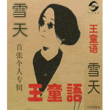

雪天
============================

|  |  |
| :--: | :-- |
| [ 雪天](https://emumo.xiami.com/album/451215) | **艺人**: [王童语](../index.md) **语种**: 国语 **唱片公司**: 中华文艺 **发行时间**: 1996年11月01日 **专辑类别**: 录音室专辑 **专辑风格**: 民谣 Folk, 华语唱作人 Chinese Singer-Songwriter, 国语流行 Mandarin Pop **播放数**: 124594 **收藏数**: 60 **评论数**: 16  |

## 简介

写于专辑诞生之际  
感谢爸爸、妈妈。只有你们将爱与信任无私的给予我，并带给我良知与聪慧，爱与你们同在。  
特别感谢张卫宁对我在音乐上的帮助及不断的鼓励。是你们让我萌生了一种力量，并且看到了一种希望。我开始珍惜所有，并用尽一切方法坚持。我祈望这种力量不死不灭。护佑我在更远的将来。  
还要感谢所有的在此专辑制作过程中帮助过我的朋友。是你们每个人在音乐上的智慧，延伸了我的感受。于是它开始变的完美，假如这些音乐都有哪怕是短暂的生命，将会竭力记住你们的名字。  
————王童语  
1996年11月  
东东艺音乐工作室  
  
关于他，关于你  
一个走出母体，用音符叙述心灵的游子  
一个俯视人群，附合着生命的人  
一个生长在都市，感受着生命的人  
————王童语  
  
在歌中我听到了一种心的流浪，一种深刻概述自己成长过程的凝聚和表白，我相信没有这些，就不会有这些作品，更不会有那种凄美  
，孤独与暄哮的和谐，它使我们从心底感到震颤，使我们畏惧现实中的自己，更使我们对未来带来期盼。  
让我们共同进入这样的世界，带着对雪天的记忆慢慢临近  
————谢东  
九六年深秋于北海桥

## 曲目

## 评论

|  |  |  |
| :-- | :-- | :-- |
|  [虾米用户](https://emumo.xiami.com/u/3458740)  2019-06-30 15:24 赞(0) 踩(0) | 
突然找到这首雪天了，一晃23年了 
 |
|  [虾米用户](https://emumo.xiami.com/u/10155335) 暂无签名~ 2018-11-30 16:17 赞(0) 踩(0) | 
我买过这个卡带，喜欢雪天这首歌
 |
|  [虾米用户](https://emumo.xiami.com/u/4180906) 你好，虾小米 2018-02-06 14:23 赞(0) 踩(0) | 
民谣
 |
|  [虾米用户](https://emumo.xiami.com/u/45706928)  2017-11-14 22:52 赞(0) 踩(0) | 
卡带设计的很有个性，和嗓音一样！
 |
|  [虾米用户](https://emumo.xiami.com/u/35881573) 暂无签名~ 2015-11-22 10:47 赞(0) 踩(0) | 
今天北京下大雪了，又想起了这首快20年的老歌……
 |
| ⇒ |  [虾米用户](https://emumo.xiami.com/u/6745842)  2015-12-16 01:32 赞(0) 踩(0) | 
好感慨，居然真有人像我一样记得这首当年并不算出名的歌，当年听歌之时，还未曾看过下雪，却也会被深深感动。
 |
|  [虾米用户](https://emumo.xiami.com/u/47058155)   2015-08-03 17:28 赞(0) 踩(0) | 
有一盘卡带，可惜已没了walkman
 |
|  [虾米用户](https://emumo.xiami.com/u/9914833) partial 2015-01-25 22:54 赞(0) 踩(0) | 
又来了，
 |
| ⇒ |  [虾米用户](https://emumo.xiami.com/u/9914833) partial 2015-02-06 19:19 赞(0) 踩(0) | 
还有几首新歌呢
 |
|  [虾米用户](https://emumo.xiami.com/u/37766590) 把耳朵抛向远方 2014-11-26 15:16 赞(0) 踩(0) | 
3.5
 |
|  [虾米用户](https://emumo.xiami.com/u/11394816)  2012-11-07 21:54 赞(0) 踩(0) | 
不一样滴音域
 |
|  [虾米用户](https://emumo.xiami.com/u/9914833) partial 2012-07-22 17:17 赞(0) 踩(0) | 
喜欢
 |
|  [虾米用户](https://emumo.xiami.com/u/9914833) partial 2012-07-22 17:12 赞(0) 踩(0) | 
我也有一张磁带，牛皮纸的
 |
|  [虾米用户](https://emumo.xiami.com/u/7165946) 作词，作曲，编曲 2012-04-28 09:52 赞(0) 踩(0) | 
大学里很喜欢的一张专辑，当时还是磁带时代，很怀旧，很怀念相关的岁月
 |
|  [虾米用户](https://emumo.xiami.com/u/786428) 真正的快乐是一件严肃的事... 2011-12-23 12:06 赞(0) 踩(0) | 
手头正有这盘卡带
 |
|  [虾米用户](https://emumo.xiami.com/u/139273)  2011-12-01 23:02 赞(0) 踩(0) | 
等待分享
 |
