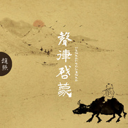

声律启蒙
============================

|  |  |
| :--: | :-- |
| [ 声律启蒙](https://emumo.xiami.com/album/1229966089) | **艺人**: [赵照](../index.md) **语种**: 国语 **唱片公司**: 赵照音乐工作室 **发行时间**: 2015年04月27日 **专辑类别**: EP, 单曲 **专辑风格**: 传统民谣 Traditional Folk, 独立民谣 Indie Folk **播放数**: 3772453 **收藏数**: 1460 **评论数**: 96  |

## 简介

IIIIIIIIIIIIIIIIIIIIIIIIIIIIIIIIIIIIIIIIIIIIIIIIIIIIIIIIII 虾米音乐人·独家首发 IIIIIIIIIIIIIIIIIIIIIIIIIIIIIIIIIIIIIIIIIIIIIIIIIIIIIIIIII  
“新绿衬酒红，佛陀对苍生”。是作者提供的一个画面。这首歌创作于2013年秋，是赵照在古书《声律启蒙》的启发下创作完成的，是赵照《秋雨夜》、《骑驴》、《在山上》等歌的禅意风格的延续，也是他对中原古文化的一次深诚致敬，这首歌是结合古代音律和中原民谣的一次全新尝试。该歌采用五声调式的旋律，配以古人吟诗作对的语气腔调。通篇乐器除了吉他打底，其余都是古琴、琵琶、箫等中国传统乐器，更有用意最深的五个木鱼和木蛙。在作者心里，古琴是老者，琵琶是女子，箫代表男人，略显俏皮的木鱼是天真烂漫的孩童。

## 曲目

## 评论

|  |  |  |  |
| :-- | :-- | :-- | :-- |
|  [虾米用户](https://emumo.xiami.com/u/378557026)  2019-10-25 07:29 赞(1) 踩(0) | 
嗯
 |
|  [虾米用户](https://emumo.xiami.com/u/32501233)  2019-10-21 10:51 赞(1) 踩(0) | 
好听
 |
|  [虾米用户](https://emumo.xiami.com/u/3753790)  2018-02-27 10:02 赞(2) 踩(0) | 
非常好听...... 经典这样读出来才是应有感觉
 |
|  [虾米用户](https://emumo.xiami.com/u/348911848)  2018-02-10 00:32 赞(2) 踩(0) | 
我对你 嘴对心
 |
|  [虾米用户](https://emumo.xiami.com/u/27226902)  2017-11-12 08:35 赞(1) 踩(0) | 
请问里面有几首呢？
 |
|  [虾米用户](https://emumo.xiami.com/u/103863984) 谁谓河广，一苇杭之。 2016-12-21 23:50 赞(2) 踩(0) | 
好赞~
 |
|  [虾米用户](https://emumo.xiami.com/u/5732142) 。 2016-11-13 06:42 赞(1) 踩(0) | 
M
 |
|  [虾米用户](https://emumo.xiami.com/u/100078614)  2016-05-14 23:28 赞(3) 踩(0) | 
九夏对三冬，好感动这一句。
 |
|  [虾米用户](https://emumo.xiami.com/u/129886808)  2016-04-05 20:46 赞(1) 踩(0) | 
有着民谣的独特风格，唱出哪个年代的心情。
 |
|  [虾米用户](https://emumo.xiami.com/u/5168717)  2016-03-20 18:08 赞(4) 踩(0) | 
中国风的歌最容易为了拽文而失去对歌词逻辑的专注，往往听着像回事，但是歌词意思根本乱七八糟，但是这首不是！这首太棒了。
 |
| ⇒ |  [虾米用户](https://emumo.xiami.com/u/53020218) 不如归去。 2016-05-17 23:55 赞(0) 踩(0) | 
这是《声律启蒙》啊 ~ 对对子传统启蒙读物啊~
 |
|  [虾米用户](https://emumo.xiami.com/u/119597300)  2016-03-09 21:32 赞(2) 踩(0) | 
买了无损  可是怎么无法下载呢？                    重新登录了一遍  下载成功 没错 是真 Lossless  16/44略尽绵薄  支持赵照  喜欢的朋友一起来 付费下载吧！ 音乐人需要我们的支持！
 |
|  [虾米用户](https://emumo.xiami.com/u/38791149)  2015-12-22 15:00 赞(1) 踩(0) | 
特别带感，质感。
 |
|  [虾米用户](https://emumo.xiami.com/u/6506939)  2015-12-21 11:30 赞(3) 踩(0) | 
给这专辑的理念点赞
 |
|  [虾米用户](https://emumo.xiami.com/u/6151899)  2015-11-07 19:12 赞(0) 踩(0) | 
@今小未
 |
|  [虾米用户](https://emumo.xiami.com/u/50497700)  2015-11-06 23:33 赞(0) 踩(0) | 
这民谣和我爱的那个他一样，踏踏实实的
 |
|  [虾米用户](https://emumo.xiami.com/u/13010143) 向前跑，迎着冷眼和嘲笑 2015-10-26 00:57 赞(3) 踩(0) | 
三十多岁的人了，很久没有在凌晨听到过能叫自己流泪的民谣了   
 |
|  [虾米用户](https://emumo.xiami.com/u/547627) 一台漫游银河系的机器人 2015-10-15 10:12 赞(2) 踩(0) | 
《笠翁对韵》，虽是国学启蒙但也是博大精深呐。
 |
|  [虾米用户](https://emumo.xiami.com/u/35630839) 我爱你 2015-10-13 21:42 赞(1) 踩(0) | 
全国巡演在即，无意听到这首，好喜欢
 |
| ⇒ |  [虾米用户](https://emumo.xiami.com/u/79726368) 向前游去吧 2015-11-29 11:20 赞(0) 踩(0) | 

 |
|  [虾米用户](https://emumo.xiami.com/u/160902)  2015-09-23 22:51 赞(0) 踩(0) | 
民谣已死
 |
|  [虾米用户](https://emumo.xiami.com/u/10435106) 听靓歌 2015-08-02 18:10 赞(1) 踩(0) | 
不错。
 |
|  [虾米用户](https://emumo.xiami.com/u/53442938)  2015-07-28 21:21 赞(1) 踩(0) | 
佛陀对苍生。
 |
|  [虾米用户](https://emumo.xiami.com/u/9041204)   2015-07-19 14:34 赞(14) 踩(0) | 
好听炸了！！！比哈辉版本的更有味儿~~想起来小时候在姥姥家的葡萄架下背着手背《弟子规》《千字文》还有这个《声律启蒙》的光景，有阳光透过葡萄树叶，斑驳洒了一地。
 |
|  [虾米用户](https://emumo.xiami.com/u/835404)   2015-07-18 22:09 赞(0) 踩(0) | 
佛陀对苍生
 |
|  [虾米用户](https://emumo.xiami.com/u/539835) 摸摸小鱼 听听音乐 2015-07-17 12:28 赞(3) 踩(0) | 
没学过声律启蒙感觉错过了很美好的东西啊！<a href="http://www.douban.com/group/topic/77626904/" target="_blank" rel="nofollow noreferrer noopener">http://www.douban.com/group/topic/77626904/</a>
 |
|  [虾米用户](https://emumo.xiami.com/u/9487632) 一场伟大的失眠 2015-07-17 10:33 赞(1) 踩(0) | 
声律启蒙原文太美 得背得背
 |
|  [虾米用户](https://emumo.xiami.com/u/1179560) 一切看心情 2015-07-17 09:23 赞(1) 踩(0) | 
云对雨 雪对风晚照对晴空
 |
|  [虾米用户](https://emumo.xiami.com/u/7582811)  2015-07-06 12:53 赞(1) 踩(0) | 
歌词在哪啊 新版没找到
 |
|  [虾米用户](https://emumo.xiami.com/u/49824247)  2015-06-18 10:52 赞(1) 踩(0) | 
  好听！
 |
|  [虾米用户](https://emumo.xiami.com/u/3735814)  2015-06-07 21:40 赞(36) 踩(0) | 
好清新的民谣，没有南方，没有姑娘，没有野马没有伤。
 |
| ⇒ |  [虾米用户](https://emumo.xiami.com/u/114122228)  2016-02-19 14:17 赞(0) 踩(0) | 
一开始是手滑，高出预期太多。很好听。
 |
| ⇒ |  [虾米用户](https://emumo.xiami.com/u/152444024)  2018-08-05 08:16 赞(0) 踩(0) | 
因为这才是民谣，那些都是弹唱。
 |
|  [虾米用户](https://emumo.xiami.com/u/13704947) 豆瓣见：无悲渊。 2015-05-13 23:32 赞(1) 踩(0) | 
究竟出于什么心态才能给那个室友热评上榜，连续多次看见他辱骂虾友了。
 |
| ⇒ |  [虾米用户](https://emumo.xiami.com/u/32207148) 暂无签名~ 2015-05-17 10:24 赞(0) 踩(0) | 
我就不信还能有如此肤浅的舍友 简直骗赞狂魔
 |
| ⇒ |  [虾米用户](https://emumo.xiami.com/u/13704947) 豆瓣见：无悲渊。 2015-05-17 14:59 赞(0) 踩(0) | 
<q><b>Twist说：</b></q>
 |
|  [虾米用户](https://emumo.xiami.com/u/677094) 再见虾米 2015-05-10 22:01 赞(0) 踩(0) | 
如此美好的一首歌，不知该说些什么
 |
|  [虾米用户](https://emumo.xiami.com/u/8391097) 明月轻舟一壶酒 2015-05-08 15:09 赞(1) 踩(0) | 
我朋友说，如果和爱的人，不想用套。没有空调也要猛做。
 |
|  [虾米用户](https://emumo.xiami.com/u/5398540) 民歌警察出警中 2015-05-07 23:12 赞(2) 踩(0) | 
这又不是那种城市民谣，至于抱着个烂大街的段子不放吗
 |
|  [虾米用户](https://emumo.xiami.com/u/5766534) 没有你我就不能入睡 2015-05-07 10:02 赞(1) 踩(0) | 
内容已删除
 |
| ⇒ |  [虾米用户](https://emumo.xiami.com/u/8960090)  2015-06-15 12:10 赞(0) 踩(0) | 
呵呵呵 这段话就很民谣啊
 |
|  [虾米用户](https://emumo.xiami.com/u/11065667) 开心+开心 2015-05-07 07:54 赞(0) 踩(0) | 
有种悠闲自在的感觉
 |
|  [虾米用户](https://emumo.xiami.com/u/49869656)  2015-05-06 21:28 赞(1) 踩(0) | 
想起小时候读的笠翁对韵
 |
|  [虾米用户](https://emumo.xiami.com/u/34247743) 大王不巡山。 2015-05-06 10:48 赞(0) 踩(0) | 
何时才能对上你
 |
|  [虾米用户](https://emumo.xiami.com/u/48279151)  2015-05-06 09:28 赞(1) 踩(0) | 
好听啊
 |
|  [虾米用户](https://emumo.xiami.com/u/48891295) 向下扎根 向上生长 2015-05-04 23:56 赞(0) 踩(0) | 
棒
 |
|  [虾米用户](https://emumo.xiami.com/u/44841785) 想見的人不太多 2015-05-04 03:25 赞(0) 踩(0) | 
真好听
 |
|  [虾米用户](https://emumo.xiami.com/u/3642024)   2015-05-03 09:11 赞(0) 踩(0) | 
安静了
 |
|  [虾米用户](https://emumo.xiami.com/u/41020743) 有没有一首歌会让我想起你 2015-05-02 10:45 赞(0) 踩(0) | 
我只有两个字 略屌
 |
|  [虾米用户](https://emumo.xiami.com/u/3401396)   2015-05-01 18:58 赞(0) 踩(0) | 
一年前来石家庄演出唱过这首，录音还在手机里。当时还不是这名儿吧。现场比这EP好听。
 |
|  [虾米用户](https://emumo.xiami.com/u/44878443)  2015-05-01 14:30 赞(1) 踩(0) | 
#新绿衬酒红 佛陀对苍生
 |
|  [虾米用户](https://emumo.xiami.com/u/49717317)  2015-04-30 22:34 赞(0) 踩(0) | 
中间的琵琶有大碗茶的感觉  
 |
|  [虾米用户](https://emumo.xiami.com/u/49717317)  2015-04-30 22:32 赞(0) 踩(0) | 
中间的琵琶有大碗茶的感觉 
 |
|  [虾米用户](https://emumo.xiami.com/u/14364706) 暂无签名~ 2015-04-29 12:08 赞(0) 踩(0) | 
放空了的感觉，不错。
 |
|  [虾米用户](https://emumo.xiami.com/u/1742487)  2015-04-29 11:03 赞(0) 踩(0) | 
观月对雏乃  仓井对空
 |
|  [虾米用户](https://emumo.xiami.com/u/1670399)   2015-04-29 09:15 赞(2) 踩(0) | 
七颗星，一袍风。佛陀对苍生。御风而行，僧袍被风吹的鼓胀起来，感受到那种自在洒脱笑对苍生的境界。一袍风极妙
 |
|  [虾米用户](https://emumo.xiami.com/u/505740) 爱音乐爱生活。 2015-04-29 08:30 赞(66) 踩(0) | 
内容已删除
 |
| ⇒ |  [虾米用户](https://emumo.xiami.com/u/1742487)  2015-04-29 11:24 赞(0) 踩(0) | 
爱上一匹野马 可我的家里没有草原直译 爱上一个骚货 可我不是王思聪
 |
| ⇒ |  [虾米用户](https://emumo.xiami.com/u/5899083)  2015-05-02 16:33 赞(0) 踩(0) | 
精确
 |
| ⇒ |  [虾米用户](https://emumo.xiami.com/u/32763641) 我还没想好要写什么... 2015-05-05 15:12 赞(0) 踩(0) | 
<q><b>火神飞鸦说：</b></q>
 |
| ⇒ |  [虾米用户](https://emumo.xiami.com/u/44833658)  2015-12-03 14:51 赞(0) 踩(0) | 
哈哈哈哈哈哈哈哈哈哈哈哈笑死了
 |
|  [虾米用户](https://emumo.xiami.com/u/46755930)  2015-04-29 07:17 赞(3) 踩(0) | 
裁剪了原诗，有些地方不搭
 |
|  [虾米用户](https://emumo.xiami.com/u/18580366)  2015-04-29 00:11 赞(0) 踩(0) | 
古意的田野
 |
|  [虾米用户](https://emumo.xiami.com/u/9132816)   2015-04-28 19:25 赞(1) 踩(0) | 
曲调清浅，情境幽深。好听。
 |
|  [虾米用户](https://emumo.xiami.com/u/6332360) 温暖向阳 2015-04-28 18:22 赞(1) 踩(0) | 
不知为什么，木鱼响起的时候，我想到了四大名著，红楼梦的宝玉对林妹妹，西游记的国王对方丈，水浒的黑旋风对宋江，三国的吕布对貂蝉
 |
| ⇒ |  [虾米用户](https://emumo.xiami.com/u/1137473) 我还没想好要写什么... 2015-04-28 23:48 赞(0) 踩(0) | 
黑旋风对宋江~ 什么gui~.    说好的武松独臂撸智深呢？
 |
| ⇒ |  [虾米用户](https://emumo.xiami.com/u/6332360) 温暖向阳 2015-04-29 15:01 赞(0) 踩(0) | 
<q><b>天雨流芳说：</b></q>
 |
|  [虾米用户](https://emumo.xiami.com/u/752597)  2015-04-28 16:45 赞(0) 踩(0) | 
电动李双江 哈哈哈哈哈
 |
|  [虾米用户](https://emumo.xiami.com/u/898076)  2015-04-28 14:56 赞(0) 踩(0) | 
我对你 嘴对心 九夏对三冬
 |
|  [虾米用户](https://emumo.xiami.com/u/5765082) 来自第九区 2015-04-28 14:54 赞(0) 踩(0) | 
“睡不到民谣女，我弄不好就要睡你了”.这让一众民谣乐家们菊花骤紧啊。
 |
|  [虾米用户](https://emumo.xiami.com/u/2624418) 草木人生，安静过活。 2015-04-28 14:38 赞(0) 踩(0) | 
好吃的棒棒糖一样！
 |
|  [虾米用户](https://emumo.xiami.com/u/44679662) 番茄很多 2015-04-28 13:02 赞(0) 踩(0) | 
屌爆了
 |
|  [虾米用户](https://emumo.xiami.com/u/4896139) 独木成林 2015-04-28 12:53 赞(0) 踩(0) | 
坐等幼学琼林蛤蛤蛤
 |
|  [虾米用户](https://emumo.xiami.com/u/49035750) 头发可中分，观点不可中立 2015-04-28 11:59 赞(3) 踩(0) | 
中式元素，却没有中式精髓~
 |
| ⇒ |  [虾米用户](https://emumo.xiami.com/u/43457177) wxy19941009 2015-04-28 20:51 赞(0) 踩(0) | 
同意！光听音乐可能还行，可真心不觉得歌词有什么加分之处。
 |
| ⇒ |  [虾米用户](https://emumo.xiami.com/u/11166069) 我想带给你的  一路上已... 2015-04-29 00:29 赞(0) 踩(0) | 
中式精髓是哪种感觉？求推荐～
 |
| ⇒ |  [虾米用户](https://emumo.xiami.com/u/5956589) 小楼夜听雨，明朝卖花去 2015-10-05 21:43 赞(0) 踩(0) | 
<q><b>Han多哆说：</b></q>
 |
|  [虾米用户](https://emumo.xiami.com/u/2451585)  2015-04-28 10:27 赞(0) 踩(0) | 
.
 |
|  [虾米用户](https://emumo.xiami.com/u/9294572)  2015-04-28 07:33 赞(0) 踩(0) | 
  
 |
|  [虾米用户](https://emumo.xiami.com/u/41160928)  2015-04-27 23:11 赞(0) 踩(0) | 
之前在他演唱会就听过了呢
 |
|  [虾米用户](https://emumo.xiami.com/u/29119620) 夜幕海岸線/藍色大門後/... 2015-04-27 21:14 赞(0) 踩(0) | 
悠然。静心。
 |
|  [虾米用户](https://emumo.xiami.com/u/369150) ♥︎stay hunge... 2015-04-27 21:02 赞(0) 踩(0) | 
好歌
 |
|  [虾米用户](https://emumo.xiami.com/u/42426017) 爱音乐，更爱生活！ 2015-04-27 20:38 赞(0) 踩(0) | 
牛逼
 |
|  [虾米用户](https://emumo.xiami.com/u/5892395)   2015-04-27 18:43 赞(1) 踩(0) | 

 |
|  [虾米用户](https://emumo.xiami.com/u/32623827) 独立音乐人刘昰 2015-04-27 18:17 赞(0) 踩(0) | 
这才是中国的音乐
 |
|  [虾米用户](https://emumo.xiami.com/u/32623827) 独立音乐人刘昰 2015-04-27 18:15 赞(0) 踩(0) | 
就是喜欢
 |
|  [虾米用户](https://emumo.xiami.com/u/3680122)  2015-04-27 15:55 赞(0) 踩(0) | 
终于出了
 |
|  [虾米用户](https://emumo.xiami.com/u/1867582) 自由自在享受音乐 2015-04-27 14:53 赞(0) 踩(0) | 
新绿衬酒红，佛陀对苍生
 |
|  [虾米用户](https://emumo.xiami.com/u/30866460) @neko 2015-04-27 14:22 赞(3) 踩(0) | 
有种悠闲自在的感觉
 |
|  [虾米用户](https://emumo.xiami.com/u/32655631)   2015-04-27 14:22 赞(0) 踩(0) | 
木木大
 |
|  [虾米用户](https://emumo.xiami.com/u/32655631)   2015-04-27 14:21 赞(0) 踩(0) | 
嘿嘿嘿嘿嘿，今天一早起来就有新歌
 |
|  [虾米用户](https://emumo.xiami.com/u/43157065)  2015-04-27 10:24 赞(1) 踩(0) | 
好听
 |
|  [虾米用户](https://emumo.xiami.com/u/3133819) 竹青 2015-04-27 09:22 赞(1) 踩(0) | 
听赵老师总会让人心境大开，平静又悠远
 |
|  [虾米用户](https://emumo.xiami.com/u/290381)  2015-04-27 09:21 赞(1) 踩(0) | 
我对你
 |
|  [虾米用户](https://emumo.xiami.com/u/11157355) 榕树长青 2015-04-27 08:52 赞(0) 踩(0) | 
不错
 |
|  [虾米用户](https://emumo.xiami.com/u/33113721) 你是世上的奇女子呀 我就... 2015-04-27 08:44 赞(0) 踩(0) | 
报道～
 |
|  [虾米用户](https://emumo.xiami.com/u/2375136) 暂无签名~ 2015-04-27 08:32 赞(0) 踩(0) | 
报道~
 |
