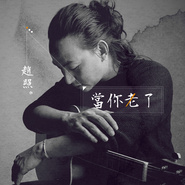

当你老了
============================

|  |  |
| :--: | :-- |
| [ 当你老了](https://emumo.xiami.com/album/1824587220) | **艺人**: [赵照](../index.md) **语种**: 国语 **唱片公司**: 独立发行 **发行时间**: 2015年02月22日 **专辑类别**: EP, 单曲 **专辑风格**: 独立民谣 Indie Folk **播放数**: 18978858 **收藏数**: 1981 **评论数**: 109  |

## 简介

当我老了 我真希望 这首歌是唱给你的 

## 曲目

## 评论

|  |  |  |  |
| :-- | :-- | :-- | :-- |
|  [虾米用户](https://emumo.xiami.com/u/307087563)  2019-03-20 20:28 赞(0) 踩(0) | 
很深情
 |
|  [虾米用户](https://emumo.xiami.com/u/278214111)  2019-02-17 14:25 赞(1) 踩(0) | 
为什么虾米这么少歌呀？？？老是没有版权争取中！唉！
 |
|  [虾米用户](https://emumo.xiami.com/u/90761984) 我还没想好要写什么... 2017-11-20 23:20 赞(1) 踩(0) | 
谁下载了啊，求分享啊 
 |
| ⇒ |  [虾米用户](https://emumo.xiami.com/u/55174809)   2018-01-12 23:50 赞(0) 踩(0) | 
你也可以下载呀
 |
|  [虾米用户](https://emumo.xiami.com/u/328838282)  2017-10-06 23:08 赞(0) 踩(0) | 
老，真的，是的吧，承认了。
 |
|  [虾米用户](https://emumo.xiami.com/u/50521343) 乘着尘世的马，驾着超世的... 2017-10-01 14:27 赞(0) 踩(0) | 
有才华的，被低估的！
 |
|  [虾米用户](https://emumo.xiami.com/u/311348450)  2017-08-07 11:48 赞(0) 踩(0) | 
多陪陪家人 
 |
|  [虾米用户](https://emumo.xiami.com/u/55139735)  2017-07-17 00:03 赞(0) 踩(0) | 
亲你个人双双几首就几个人双足手就代表其个人非常想学里的歌            这么多人据守，那就说明和你喜欢嘞         你唱的这么好听，简直就像我心中的明星，我给你打几个100分，怎么样？
 |
|  [虾米用户](https://emumo.xiami.com/u/922915) 午休时分，遗忘忙碌的一切... 2017-02-10 14:47 赞(3) 踩(0) | 
听他的歌感触很真切，记得我第一次听他唱《当你老了》，眼眶里全是泪水，语音也哽咽了。年轻时感觉不到，当你老了，就能体会歌里那些深深而又无奈的感觉。
 |
|  [虾米用户](https://emumo.xiami.com/u/195720676)  2017-01-01 16:42 赞(1) 踩(0) | 
这首歌好听歌，我好喜欢这首歌l
 |
|  [虾米用户](https://emumo.xiami.com/u/33075711)   2016-09-25 10:04 赞(3) 踩(0) | 
叶芝把这首诗献给他心中最爱但一生未得到的女人毛特冈 他为她直到40多岁才结婚 不过后来结婚了他也挺幸福了，有一个很爱他的老婆
 |
|  [虾米用户](https://emumo.xiami.com/u/228908986)  2016-09-22 17:18 赞(0) 踩(0) | 
平淡，味道，老去，年华
 |
|  [虾米用户](https://emumo.xiami.com/u/215232785) 人可以低头，但绝不能被打... 2016-09-05 21:52 赞(1) 踩(0) | 
这个版本，是最感人的。。
 |
|  [虾米用户](https://emumo.xiami.com/u/49821633)  2016-08-13 15:58 赞(0) 踩(0) | 
谢谢你写出这么动人的歌
 |
|  [虾米用户](https://emumo.xiami.com/u/202408826)  2016-07-27 23:08 赞(0) 踩(0) | 
心灵深处的感动～
 |
|  [虾米用户](https://emumo.xiami.com/u/203425418)  2016-07-22 14:21 赞(0) 踩(0) | 
单纯喜欢
 |
|  [虾米用户](https://emumo.xiami.com/u/185494661) 当你老了 2016-06-04 11:13 赞(0) 踩(0) | 
好听
 |
|  [虾米用户](https://emumo.xiami.com/u/4162264) ch3.red/mp3 2016-06-02 12:34 赞(2) 踩(0) | 
其实这歌女人唱更合适
 |
|  [虾米用户](https://emumo.xiami.com/u/128644358)  2016-04-28 08:17 赞(0) 踩(0) | 
喜欢
 |
|  [虾米用户](https://emumo.xiami.com/u/48360734)  2016-03-21 11:43 赞(0) 踩(0) | 
好听
 |
|  [虾米用户](https://emumo.xiami.com/u/86978350) 如果世界太危险 只有音乐... 2016-03-14 00:10 赞(0) 踩(0) | 
虽然健哥也唱过，但是还是觉得赵照的最好听，最有味道。
 |
|  [虾米用户](https://emumo.xiami.com/u/72034968)  2016-01-31 00:51 赞(1) 踩(0) | 
打动人心的声音，轻轻把你带入时光的长河里。
 |
|  [虾米用户](https://emumo.xiami.com/u/4859326) 想要看的清楚，其实只要换... 2016-01-06 15:25 赞(0) 踩(0) | 
不错
 |
|  [虾米用户](https://emumo.xiami.com/u/7375546) 敌视现实 虚构远方 2015-12-26 10:22 赞(1) 踩(0) | 
比那个什么大冰的（如果我老了）强多了
 |
|  [虾米用户](https://emumo.xiami.com/u/54393720)  2015-10-30 23:39 赞(0) 踩(0) | 
还有很喜欢
 |
|  [虾米用户](https://emumo.xiami.com/u/7096738)  2015-10-09 13:04 赞(0) 踩(0) | 
爱尔兰诗人叶芝不曾想到，他的诗歌用中文唱是如此动听。
 |
|  [虾米用户](https://emumo.xiami.com/u/45596714)  2015-09-24 21:06 赞(0) 踩(0) | 
这首诗让人想安安定定的恋爱一回。
 |
|  [虾米用户](https://emumo.xiami.com/u/36157773)   2015-09-22 21:51 赞(0) 踩(0) | 
很真挚的感情。
 |
|  [虾米用户](https://emumo.xiami.com/u/58555006)  2015-09-13 20:31 赞(0) 踩(0) | 
还是你的版本好听
 |
|  [虾米用户](https://emumo.xiami.com/u/54940769)  2015-08-10 14:48 赞(0) 踩(0) | 
好
 |
|  [虾米用户](https://emumo.xiami.com/u/53773377)  2015-08-05 10:00 赞(0) 踩(0) | 
很温馨！有家的感觉！
 |
|  [虾米用户](https://emumo.xiami.com/u/18640914) 白茶清欢无别事，碧海金阳... 2015-07-21 22:12 赞(0) 踩(0) | 
好听。 <a href="http://emumo.xiami.com/u/39741580" target="_blank" rel="nofollow" name_card="39741580">@董莎莎_</a>
 |
|  [虾米用户](https://emumo.xiami.com/u/8337431) 以乐会友 2015-07-20 04:50 赞(0) 踩(0) | 
最抒情也是最喜欢的版本79
 |
|  [虾米用户](https://emumo.xiami.com/u/45136745)   2015-07-15 20:14 赞(0) 踩(0) | 
只能说唱到心里去了！
 |
|  [虾米用户](https://emumo.xiami.com/u/48269548)   2015-06-12 10:28 赞(2) 踩(0) | 
好听 这歌像是写给自己、 妈妈 还有心中那个永远的她！
 |
|  [虾米用户](https://emumo.xiami.com/u/23998559) 一個 2015-06-09 19:20 赞(0) 踩(0) | 
看到這個名字想到葉芝的:詩，一看歌詞，還真是
 |
|  [虾米用户](https://emumo.xiami.com/u/44526507)  2015-05-27 21:04 赞(0) 踩(0) | 
赵照，好牛的人！  
 |
|  [虾米用户](https://emumo.xiami.com/u/47682830)  2015-05-02 05:15 赞(0) 踩(0) | 
原唱
 |
|  [虾米用户](https://emumo.xiami.com/u/12852212)   2015-04-28 21:39 赞(0) 踩(0) | 
比春晚的舒服多了！
 |
|  [虾米用户](https://emumo.xiami.com/u/9295999) 身上没有钱 心里没有诗 2015-04-25 00:14 赞(1) 踩(0) | 
嘿老头
 |
|  [虾米用户](https://emumo.xiami.com/u/48722924)  2015-04-14 20:19 赞(0) 踩(0) | 
爸妈老了，多陪陪他们
 |
|  [虾米用户](https://emumo.xiami.com/u/49110750)  2015-04-11 17:50 赞(0) 踩(0) | 
hao
 |
|  [虾米用户](https://emumo.xiami.com/u/38553843) 我还没想好要写什么... 2015-04-06 23:47 赞(0) 踩(0) | 
单曲循环了一晚上！我明明还没老！我明明还没到开始回忆的年纪！
 |
|  [虾米用户](https://emumo.xiami.com/u/29545695)  2015-04-03 14:52 赞(0) 踩(0) | 
很喜欢这首歌
 |
|  [虾米用户](https://emumo.xiami.com/u/48765226)  2015-04-01 19:34 赞(0) 踩(0) | 
感人至深
 |
|  [虾米用户](https://emumo.xiami.com/u/8274256) 乐在其中 2015-03-31 22:07 赞(0) 踩(0) | 
在这个浑浊的世界里，只有音乐能让我感受到温暖与放松！让这些真正的音乐人展露头角吧，我还能多听听华语歌！
 |
|  [虾米用户](https://emumo.xiami.com/u/7300295) 灬飞上天空灬 2015-03-15 09:58 赞(0) 踩(0) | 
《当你老了》诺贝尔文学奖获得者，苇间风，叶芝，李立玮译……值得每个人读的书……
 |
|  [虾米用户](https://emumo.xiami.com/u/2642287) FREAK! 2015-03-06 19:56 赞(4) 踩(0) | 
我只记得有一次在旅行途中的车上直接眼泪就掉了 后来每次听都很慎重噗 赵照的版本永远无人超越
 |
|  [虾米用户](https://emumo.xiami.com/u/478527) 好想跟衣服在洗衣机里滚 2015-03-04 18:42 赞(0) 踩(0) | 
可
 |
|  [虾米用户](https://emumo.xiami.com/u/10343035) 你若喜欢我，其实你很怪 2015-03-02 13:38 赞(0) 踩(0) | 
喜欢赵照喜欢他歌里的感情，你们喜欢丫头那首吗，太喜欢太喜欢了，不开心拿出来听一听，立马就幸福起来了！支持！
 |
|  [虾米用户](https://emumo.xiami.com/u/24018350)  2015-03-01 09:12 赞(0) 踩(0) | 
这节奏...赵不照得柱呵
 |
|  [虾米用户](https://emumo.xiami.com/u/32623827) 独立音乐人刘昰 2015-02-27 23:57 赞(0) 踩(0) | 
我有翻唱
 |
|  [虾米用户](https://emumo.xiami.com/u/16040490) 只要活着就会遇到好事。 2015-02-27 22:08 赞(0) 踩(0) | 
之前去录“好歌曲” 有幸听到你唱现场 其实当时除了Tanya 很多人在听你唱这首歌的时候都潸然泪下 这世界上最动人的 都是最真实最简单的情感 加油。
 |
|  [虾米用户](https://emumo.xiami.com/u/9440289)  2015-02-27 12:56 赞(1) 踩(0) | 
蛮喜欢赵照的版本的当你老了，他娓娓道来的声线讲述着青春的记忆，让人深思且感触良多。
 |
|  [虾米用户](https://emumo.xiami.com/u/31627975) 真想一觉醒来，我还在小学 2015-02-26 22:53 赞(0) 踩(0) | 
请听过他以前的歌，再评价这个歌者。
 |
|  [虾米用户](https://emumo.xiami.com/u/2799185) Imaginist 2015-02-25 15:50 赞(0) 踩(0) | 
我只是想说 在去年 第一次听这首歌 真的被打动了。
 |
|  [虾米用户](https://emumo.xiami.com/u/43005115)  2015-02-24 20:21 赞(0) 踩(0) | 
还是这个版本听着有感觉
 |
|  [虾米用户](https://emumo.xiami.com/u/6385284) 我还没想好要写什么... 2015-02-24 17:12 赞(0) 踩(0) | 
知道要上春晚还是我是歌手，新编新唱赶在大年初四发出来。。。怎么说也端着点嘛。。。
 |
| ⇒ |  [虾米用户](https://emumo.xiami.com/u/35479791)  2015-02-25 01:07 赞(0) 踩(0) | 
这是早就有的版本好吗，查查清楚在评论吧！
 |
| ⇒ |  [虾米用户](https://emumo.xiami.com/u/6385284) 我还没想好要写什么... 2015-02-25 01:08 赞(0) 踩(0) | 
<q><b>Nancy说：</b></q>
 |
| ⇒ |  [虾米用户](https://emumo.xiami.com/u/35479791)  2015-02-25 01:22 赞(0) 踩(0) | 
<q><b>baibai说：</b></q>
 |
| ⇒ |  [虾米用户](https://emumo.xiami.com/u/6385284) 我还没想好要写什么... 2015-02-25 01:25 赞(0) 踩(0) | 
<q><b>Nancy说：</b></q>
 |
| ⇒ |  [虾米用户](https://emumo.xiami.com/u/35479791)  2015-02-25 15:08 赞(0) 踩(0) | 
<q><b>baibai说：</b></q>
 |
| ⇒ |  [虾米用户](https://emumo.xiami.com/u/6385284) 我还没想好要写什么... 2015-02-25 16:06 赞(0) 踩(0) | 
<q><b>Nancy说：</b></q>
 |
|  [虾米用户](https://emumo.xiami.com/u/37306463) 我还没想好要写什么... 2015-02-24 12:19 赞(1) 踩(0) | 
。。。
 |
|  [虾米用户](https://emumo.xiami.com/u/13452911) 文生蚊聲處處聞 2015-02-24 01:44 赞(0) 踩(0) | 
比莫文蔚唱的更有味道
 |
|  [虾米用户](https://emumo.xiami.com/u/31811417) 我还没想好要写什么... 2015-02-24 01:29 赞(0) 踩(0) | 
一直搞不懂這首歌火的道理 從這首歌上完全感受不到葉芝原本想表達的含義
 |
|  [虾米用户](https://emumo.xiami.com/u/28631520)  2015-02-23 22:32 赞(0) 踩(0) | 
还记得很多年前读过的那个版本，当你年老，白了头。。
 |
|  [虾米用户](https://emumo.xiami.com/u/207264) 其实，生活就要像疯子一样... 2015-02-23 22:19 赞(1) 踩(0) | 
歌者或听者 请对号入座，做好自己份内的就可以了，我是听者，没有这首歌，估计像我这种书读的少的人这辈子也不会知道这首词或诗。尊重各种原创作者，写得好词，唱的好歌  ，词和旋律这一刻打动了我，我与之有共鸣就够了，与别人无关，我也不想和谁吹虚我知道一首歌怎样怎样，自己懂就行了，至于什么歌词啊，调子啊，反正我是不会写也不会唱，更不会编，哪个会的要不也来一首，小弟一样在心里欣赏！
 |
|  [虾米用户](https://emumo.xiami.com/u/11221879) time comes a... 2015-02-23 20:15 赞(0) 踩(0) | 
还不错
 |
|  [虾米用户](https://emumo.xiami.com/u/23568701)  2015-02-23 17:02 赞(2) 踩(0) | 
还是最喜欢赵照版本。沧桑的游子思念故乡，想念母亲，在好歌曲里唱时，就一听倾心~
 |
|  [虾米用户](https://emumo.xiami.com/u/2332621) SELF. 2015-02-23 16:55 赞(0) 踩(0) | 
翻唱的关注度较大啊
 |
|  [虾米用户](https://emumo.xiami.com/u/8697915)  2015-02-23 15:39 赞(0) 踩(0) | 
我若未嫁你若未娶
 |
|  [虾米用户](https://emumo.xiami.com/u/20319524) 暂无签名~ 2015-02-23 14:45 赞(0) 踩(0) | 
和為從前慢譜曲的那一首一樣，曲配不上詞。
 |
|  [虾米用户](https://emumo.xiami.com/u/1279375)  2015-02-23 14:25 赞(8) 踩(0) | 
怎么说呢，不是说这歌不好，但没有那么好，副歌像水木年华的《一生有你》，主歌吧就不用说了最普通的86的套子，可以找出一大堆类似的动机，唯一就是歌词好，但歌词还是借别人的，今年这是我听到的第二首了，第一首是刘欢刘大老爷的《从前慢》。我真心不希望这些歌火，火了，今年或以后就涌现一大批把前人的传世作品改成SB流行歌的东西，这不是传承，这是糟蹋，这是抢夺，你拿到叶芝的授权了吗？同样的，从前慢的拿到木心的授权了吗？？这个无耻的版权制度本来已经培养出一大批无耻的盗版商，现在写歌的人都不会好好写歌了，尼玛原作是好，好的话我直接看原作就行了，要你套个烂大街的旋律再加个小鸡似的声音唱出来干什么，毁我原作，滚！
 |
| ⇒ |  [虾米用户](https://emumo.xiami.com/u/24074325) 暂无签名~ 2015-02-23 15:57 赞(0) 踩(0) | 
前五行，深以为然
 |
| ⇒ |  [虾米用户](https://emumo.xiami.com/u/8094301) Bye bye wx n... 2015-02-23 18:33 赞(0) 踩(0) | 
说的好！点赞
 |
| ⇒ |  [虾米用户](https://emumo.xiami.com/u/2356803) 小清新是病，得治… 2015-02-23 21:06 赞(0) 踩(0) | 
那你怎么知道没拿到？词作者跟你说了吗？
 |
| ⇒ |  [虾米用户](https://emumo.xiami.com/u/2674906)  2015-02-23 23:22 赞(0) 踩(0) | 
<q><b>Shaun说：</b></q>
 |
| ⇒ |  [虾米用户](https://emumo.xiami.com/u/2356803) 小清新是病，得治… 2015-02-24 06:49 赞(0) 踩(0) | 
<q><b>philyablong说：</b></q>
 |
| ⇒ |  [虾米用户](https://emumo.xiami.com/u/38652513) 暂无签名~ 2015-02-24 09:23 赞(0) 踩(0) | 
虽然我不是研究音乐的，但是我确实也听出了一些《一生有你》的旋律。赞同你说的，是因为不想看到越来越多的歌曲都长的一个样子。
 |
| ⇒ |  [虾米用户](https://emumo.xiami.com/u/335741469)  2017-11-30 22:00 赞(0) 踩(0) | 
你不要以为懂就自以为是的留言
 |
|  [虾米用户](https://emumo.xiami.com/u/35686418) 暂无签名~ 2015-02-23 12:01 赞(0) 踩(0) | 
莫文蔚也长了
 |
|  [虾米用户](https://emumo.xiami.com/u/46946668)  2015-02-23 09:55 赞(0) 踩(0) | 
好好好好聽，安靜的聽
 |
|  [虾米用户](https://emumo.xiami.com/u/28631520)  2015-02-23 08:31 赞(0) 踩(0) | 
喜欢原版
 |
|  [虾米用户](https://emumo.xiami.com/u/281028)  2015-02-23 02:04 赞(11) 踩(0) | 
还是你的版本好听！
 |
| ⇒ |  [虾米用户](https://emumo.xiami.com/u/195720676)  2017-01-01 16:44 赞(0) 踩(0) | 
                       祝你新年快乐，健健康康平平安安
 |
|  [虾米用户](https://emumo.xiami.com/u/10811234) Love Mucic 2015-02-22 21:19 赞(0) 踩(0) | 
挺有感情滴，就是旋律性差了把火候，质朴才是真呀！
 |
|  [虾米用户](https://emumo.xiami.com/u/2815034)  2015-02-22 20:42 赞(0) 踩(0) | 
不错的
 |
|  [虾米用户](https://emumo.xiami.com/u/1453136) hi, there 2015-02-22 19:44 赞(0) 踩(0) | 
盼来了录音室版本
 |
|  [虾米用户](https://emumo.xiami.com/u/23161745) 无情无义，没心没肺 2015-02-22 18:49 赞(0) 踩(0) | 
太录音室feel了，少了一份真。
 |
| ⇒ |  [虾米用户](https://emumo.xiami.com/u/37678017) 无摇滚，不青春！ 2015-02-23 09:58 赞(0) 踩(0) | 
甩了莫文蔚翻唱的N条街。。。
 |
| ⇒ |  [虾米用户](https://emumo.xiami.com/u/23161745) 无情无义，没心没肺 2015-03-18 13:02 赞(0) 踩(0) | 
<q><b>ROCK HUI说：</b></q>
 |
|  [虾米用户](https://emumo.xiami.com/u/3295899)   2015-02-22 17:38 赞(0) 踩(0) | 
怀念起一段大学时光 介绍给我这首诗的老师
 |
|  [虾米用户](https://emumo.xiami.com/u/23144668) 我需要安靜。我自已和自己... 2015-02-22 16:35 赞(0) 踩(0) | 
当我老了，我还想为你唱首歌 sandy2015,2,22
 |
|  [虾米用户](https://emumo.xiami.com/u/34272626) 我还没想好要写什么... 2015-02-22 15:56 赞(0) 踩(0) | 
还是最喜欢你唱的
 |
|  [虾米用户](https://emumo.xiami.com/u/34512401) 孤情诗人 2015-02-22 15:56 赞(0) 踩(0) | 
最爱你的版本。去年的好歌曲，最爱你
 |
|  [虾米用户](https://emumo.xiami.com/u/3566813) 菩萨，祝您身体健康！34... 2015-02-22 15:39 赞(0) 踩(0) | 
好听啊。
 |
|  [虾米用户](https://emumo.xiami.com/u/3566813) 菩萨，祝您身体健康！34... 2015-02-22 15:30 赞(0) 踩(0) | 
倒是今年  好歌曲 的好歌是真多。个人觉得比歌手好看，也好听，抓住一首新歌第一时间感动你的大好机会吧！赵牧阳的还有裸儿的还有悟空啊他去做神仙，尤其是说唱较之去年水准不是一档次啊，是真好。
 |
| ⇒ |  [虾米用户](https://emumo.xiami.com/u/41793965)  2015-02-22 19:05 赞(0) 踩(0) | 
是的，这次的我是歌手完全提不起兴趣，好歌曲里边这些水平不容小觑
 |
| ⇒ |  [虾米用户](https://emumo.xiami.com/u/3566813) 菩萨，祝您身体健康！34... 2015-02-22 19:46 赞(0) 踩(0) | 
<q><b>星晴1224说：</b></q>
 |
| ⇒ |  [虾米用户](https://emumo.xiami.com/u/43320749) 我还没想好要写什么... 2015-02-23 10:51 赞(0) 踩(0) | 
<q><b>苍茫中传灯说：</b></q>
 |
| ⇒ |  [虾米用户](https://emumo.xiami.com/u/3566813) 菩萨，祝您身体健康！34... 2015-02-23 11:09 赞(0) 踩(0) | 
<q><b>HXNN说：</b></q>
 |
| ⇒ |  [虾米用户](https://emumo.xiami.com/u/43320749) 我还没想好要写什么... 2015-02-23 23:23 赞(0) 踩(0) | 
<q><b>苍茫中传灯说：</b></q>
 |
|  [虾米用户](https://emumo.xiami.com/u/7427726) 暂无签名~ 2015-02-22 15:14 赞(0) 踩(0) | 
赵照的版本，还是比较喜欢他在《中国好歌曲》里第一次的演绎，当年第一次听真的能想起自己的母亲，热泪盈眶，现在这种，觉得渲染地太过用力了。按于叶芝的原作，最喜欢的是李健的演绎。
 |
|  [虾米用户](https://emumo.xiami.com/u/8187609) 我绝非得意之时你们说的那... 2015-02-22 14:53 赞(0) 踩(0) | 
反反复复地唱这首有意思吗
 |
| ⇒ |  [虾米用户](https://emumo.xiami.com/u/126635) 今天天气不错要不要出来玩 2015-02-22 15:02 赞(0) 踩(0) | 
发这首当你老了，是因为虾米没有完整的正式版，都是好歌曲的Live。赵照新专辑《东西》即将发布，这次是双专辑，一共有两张专辑。敬请期待！
 |
|  [虾米用户](https://emumo.xiami.com/u/3289704) 一蓑烟雨任平生 2015-02-22 14:50 赞(0) 踩(0) | 
加油！
 |
|  [虾米用户](https://emumo.xiami.com/u/24006168)   2015-02-22 14:50 赞(0) 踩(0) | 
爱你
 |
