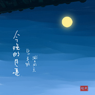

今晚的月亮
============================

|  |  |
| :--: | :-- |
| [ 今晚的月亮](https://emumo.xiami.com/album/2100205198) | **艺人**: [赵照](../index.md) **语种**: 国语 **唱片公司**: 独立发行 **发行时间**: 2015年09月23日 **专辑类别**: EP, 单曲 **专辑风格**: 独立民谣 Indie Folk **播放数**: 467755 **收藏数**: 157 **评论数**: 33  |

## 简介

 
 

（今晚的月亮）写于2005年秋，那时候刚刚在自学录音编曲。当时这首歌对于我更像是一个练习题，十年后的今天偶尔翻出当年的工程文件，重新做了这首歌的缩混。尽管声音稚嫩编曲粗糙，但尽量全部保留了当初乐器和唱的声音，甚至那天的噪音……
 

无疑，这还是一首关于岁月的补丁式的歌曲。歌里有当时的夜雨和夜雨初晴时的月亮，有巷子里的风和风里的外乡人。
 

山川异路，风月同天。只是有的人，还在那里，有的人已不知道在哪里…   
 

 
 

                                                                ——赵照于2015年9月21日夜
 

 

## 曲目

## 评论

|  |  |  |  |
| :-- | :-- | :-- | :-- |
|  [虾米用户](https://emumo.xiami.com/u/23373418)  2016-01-28 10:58 赞(2) 踩(0) | 
最爱这种静静地，贴近生活的民谣，边做自己的事情边放着这样的音乐，心都静了
 |
|  [虾米用户](https://emumo.xiami.com/u/23373418)  2016-01-28 10:58 赞(0) 踩(0) | 
最爱这种静静地，贴近生活的民谣，边做自己的事情边放着这样的音乐，心都静了
 |
|  [虾米用户](https://emumo.xiami.com/u/20537708) 凉 2016-01-17 00:03 赞(1) 踩(0) | 
不错啊，分这么低？
 |
|  [虾米用户](https://emumo.xiami.com/u/2063022)  2015-11-20 22:57 赞(0) 踩(0) | 
为什么我觉得这首歌很好听
 |
|  [虾米用户](https://emumo.xiami.com/u/70847250) 吉他教学，编曲，录音，制... 2015-11-18 22:32 赞(1) 踩(0) | 
赵雷很多歌曲都是赵照编曲的，孩子。赵照的却没赵雷什么事。
 |
|  [虾米用户](https://emumo.xiami.com/u/44795779)  2015-10-06 05:45 赞(3) 踩(0) | 
赵照的歌有时候像酒，有时候像茶
 |
|  [虾米用户](https://emumo.xiami.com/u/37753942)   2015-09-29 19:51 赞(0) 踩(0) | 
忧伤的唱到骨子里了
 |
|  [虾米用户](https://emumo.xiami.com/u/1568042) 不信抬头看，苍天绕过谁 2015-09-28 12:34 赞(0) 踩(0) | 
我蛮喜欢赵雷的
 |
| ⇒ |  [虾米用户](https://emumo.xiami.com/u/1316533) 不折腾不舒服斯基 2015-09-28 12:42 赞(0) 踩(0) | 
故意来的吧
 |
| ⇒ |  [虾米用户](https://emumo.xiami.com/u/40256175) 她。 2015-10-12 11:19 赞(0) 踩(0) | 
哈哈哈哈哈哈
 |
|  [虾米用户](https://emumo.xiami.com/u/13137804) 骨灰級影迷、獨立音樂聽衆... 2015-09-27 18:10 赞(0) 踩(0) | 
b较早
 |
|  [虾米用户](https://emumo.xiami.com/u/33221346) 安逸地生活 2015-09-27 17:32 赞(1) 踩(0) | 
喜欢
 |
|  [虾米用户](https://emumo.xiami.com/u/13137804) 骨灰級影迷、獨立音樂聽衆... 2015-09-23 21:57 赞(0) 踩(0) | 
旋律有几处有点像赵雷的《吉姆餐厅》
 |
| ⇒ |  [虾米用户](https://emumo.xiami.com/u/33221346) 安逸地生活 2015-09-27 17:32 赞(0) 踩(0) | 
吉姆餐厅比较晚吧
 |
| ⇒ |  [虾米用户](https://emumo.xiami.com/u/70847250) 吉他教学，编曲，录音，制... 2015-11-18 22:31 赞(0) 踩(0) | 
赵雷确实不错，但比起赵照还是有很长距离的！
 |
|  [虾米用户](https://emumo.xiami.com/u/23898334) 愿有一颗发现美的眼睛！ 2015-09-23 21:07 赞(0) 踩(0) | 
还是最喜欢《当你老了》
 |
|  [虾米用户](https://emumo.xiami.com/u/35410419) 我不知会遇见你，却偏偏遇... 2015-09-23 17:49 赞(0) 踩(0) | 
快到中秋节了
 |
|  [虾米用户](https://emumo.xiami.com/u/33385349) 臭板儿是个傻逼。 2015-09-23 16:31 赞(0) 踩(0) | 
臭板儿看月亮变大世。
 |
| ⇒ |  [虾米用户](https://emumo.xiami.com/u/33113721) 你是世上的奇女子呀 我就... 2015-09-23 21:00 赞(0) 踩(0) | 
哈哈 笑死我了 看来变身了
 |
|  [虾米用户](https://emumo.xiami.com/u/33385349) 臭板儿是个傻逼。 2015-09-23 16:19 赞(0) 踩(0) | 
臭板儿滚出虾米!!!
 |
|  [虾米用户](https://emumo.xiami.com/u/2494589)  2015-09-23 16:02 赞(0) 踩(0) | 
10年前
 |
|  [虾米用户](https://emumo.xiami.com/u/8244559)  2015-09-23 14:25 赞(0) 踩(0) | 
******
 |
|  [虾米用户](https://emumo.xiami.com/u/42325985)  2015-09-23 13:32 赞(0) 踩(0) | 
今晚的月亮赵照照照照照。。。
 |
|  [虾米用户](https://emumo.xiami.com/u/7513) 我永远都是一头猪！ 2015-09-23 11:30 赞(0) 踩(0) | 
不错
 |
|  [虾米用户](https://emumo.xiami.com/u/43139024) 北方姑娘你是否习惯了南方... 2015-09-23 11:01 赞(0) 踩(0) | 
美。
 |
|  [虾米用户](https://emumo.xiami.com/u/15835000)  2015-09-23 10:36 赞(0) 踩(0) | 
好听
 |
|  [虾米用户](https://emumo.xiami.com/u/15835000)  2015-09-23 10:27 赞(0) 踩(0) | 
  
 |
|  [虾米用户](https://emumo.xiami.com/u/9806134)  2015-09-23 10:24 赞(0) 踩(0) | 
｡･ω･
 |
|  [虾米用户](https://emumo.xiami.com/u/6733300) 誩 2015-09-23 09:41 赞(0) 踩(0) | 
必须下载
 |
|  [虾米用户](https://emumo.xiami.com/u/48020543) 天空是飞鸟随遇而安的家 2015-09-23 09:24 赞(0) 踩(0) | 
已经下载，听过不后悔 
 |
|  [虾米用户](https://emumo.xiami.com/u/46081074)  2015-09-23 09:11 赞(0) 踩(0) | 
每一首都听
 |
|  [虾米用户](https://emumo.xiami.com/u/43639552)   2015-09-23 09:08 赞(0) 踩(0) | 
下班听
 |
|  [虾米用户](https://emumo.xiami.com/u/43639552)   2015-09-23 09:08 赞(0) 踩(0) | 
哈哈哈
 |
