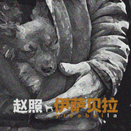

伊萨贝拉
============================

|  |  |
| :--: | :-- |
| [ 伊萨贝拉](https://emumo.xiami.com/album/2100220272) | **艺人**: [赵照](../index.md) **语种**: 国语 **唱片公司**: 独立发行 **发行时间**: 2015年10月04日 **专辑类别**: EP, 单曲 **专辑风格**: 独立民谣 Indie Folk **播放数**: 266562 **收藏数**: 158 **评论数**: 24  |

## 简介

歌曲《伊萨贝拉》是一首写给犬的歌曲，由知名音乐人杨海潮词曲，民谣歌手赵照友情演唱。主人公“伊萨贝拉”是一只银狐犬，由于寄宿宠物店看管不利最终这只银狐死于交通事故。歌曲向人们讲述了人和狗之间的真挚感情。两位音乐人希望这首歌能带给社会更大的震撼，呼吁人们以负责任的态度对待动物，减少悲剧的发生。 

## 曲目

## 评论

|  |  |  |
| :-- | :-- | :-- |
|  [虾米用户](https://emumo.xiami.com/u/5439395) 暂无签名~ 2017-10-27 22:58 赞(0) 踩(0) | 
居然前五评论+前350收听 还有，这居然是唱给狗够的歌，哈哈 不过赵照最近几首单曲都和之前的风格不太一样哇？个人感觉，勿拍
 |
|  [虾米用户](https://emumo.xiami.com/u/23625043) 精神洁癖的疯子 2016-04-26 20:16 赞(0) 踩(0) | 
犀浦
 |
|  [虾米用户](https://emumo.xiami.com/u/19987110) 我还没想好要写什么... 2015-11-23 05:30 赞(0) 踩(0) | 
这首歌的风格商业性强了些，更喜欢以前的那些民谣风格，更有个人风格，也更打动人。
 |
|  [虾米用户](https://emumo.xiami.com/u/1066695) 我还没想好要写什么... 2015-10-20 07:37 赞(0) 踩(0) | 
现场没有唱哎
 |
|  [虾米用户](https://emumo.xiami.com/u/11935616)  2015-10-18 11:12 赞(2) 踩(0) | 
赵跟雷子我都分不清。
 |
| ⇒ |  [虾米用户](https://emumo.xiami.com/u/8979885) 暂无签名~ 2015-10-20 12:51 赞(0) 踩(0) | 
哈哈，同感
 |
| ⇒ |  [虾米用户](https://emumo.xiami.com/u/9774396)  2015-11-26 13:17 赞(0) 踩(0) | 
<q><b>暮夕说：</b></q>
 |
|  [虾米用户](https://emumo.xiami.com/u/1210750) 暂无签名~ 2015-10-17 09:46 赞(0) 踩(0) | 
还没听，冲着专辑介绍先给5星
 |
|  [虾米用户](https://emumo.xiami.com/u/57727682) hi 2015-10-17 00:59 赞(0) 踩(0) | 
想我家狗了。。
 |
|  [虾米用户](https://emumo.xiami.com/u/36157773)   2015-10-16 21:26 赞(0) 踩(0) | 
赵照太棒啦！！！
 |
|  [虾米用户](https://emumo.xiami.com/u/9569992) X 2015-10-16 14:30 赞(0) 踩(0) | 
噢，买尴得啊。 算了我就当你是唱给我听的【dog脸】
 |
|  [虾米用户](https://emumo.xiami.com/u/13048549) 回应大地的召唤 2015-10-16 12:56 赞(0) 踩(0) | 
就像一个小孩一样
 |
|  [虾米用户](https://emumo.xiami.com/u/1867582) 自由自在享受音乐 2015-10-16 11:11 赞(0) 踩(0) | 
感人至极，让我想起了我们家的莱西，正上班呢，眼眶都湿润了
 |
|  [虾米用户](https://emumo.xiami.com/u/1867582) 自由自在享受音乐 2015-10-16 11:10 赞(0) 踩(0) | 
感人至极
 |
|  [虾米用户](https://emumo.xiami.com/u/1867582) 自由自在享受音乐 2015-10-16 11:05 赞(0) 踩(0) | 
让我想起了我们家的莱西了  上班呢 眼眶都湿润了
 |
|  [虾米用户](https://emumo.xiami.com/u/25298023)  2015-10-15 22:58 赞(1) 踩(0) | 
听出了点郑钧的味儿
 |
|  [虾米用户](https://emumo.xiami.com/u/1950669)  2015-10-15 22:51 赞(0) 踩(0) | 
晚安
 |
|  [虾米用户](https://emumo.xiami.com/u/67984246) 爱民谣的女生 2015-10-15 20:53 赞(0) 踩(0) | 
我是前排诶
 |
|  [虾米用户](https://emumo.xiami.com/u/32659213) hell 2015-10-15 18:58 赞(0) 踩(0) | 
❤️
 |
|  [虾米用户](https://emumo.xiami.com/u/2095699) 你总是喜欢这样吗？ 2015-10-15 17:00 赞(0) 踩(0) | 
Isabella
 |
|  [虾米用户](https://emumo.xiami.com/u/33113721) 你是世上的奇女子呀 我就... 2015-10-15 14:45 赞(0) 踩(0) | 
…
 |
|  [虾米用户](https://emumo.xiami.com/u/2375136) 暂无签名~ 2015-10-15 13:57 赞(0) 踩(0) | 
……
 |
|  [虾米用户](https://emumo.xiami.com/u/199605)   2015-10-15 13:19 赞(1) 踩(0) | 
赵照将推出新单曲《伊萨贝拉》。这首歌由著名音乐人杨海潮词曲创作，赵照友情参与演唱。这是他继《1980年代的爱情》之后发出的又一首单曲。与以往所有歌曲不同的是，这是中国第一首唱给狗狗的歌。  这是一首充满情怀的歌。歌名“伊萨贝拉”指代的不是某个时尚女郎，而是一只可爱的银狐犬。歌曲的创作背后，是一个人的故事。在某宠物店寄养的“伊萨贝拉”被工作人员弄丢，不幸因交通事故身亡。他的主人靳晓辉受此打击并深受启发，自己创建了一个宠物寄养店。同为爱狗人士的音乐前辈杨海潮得知此事后，毅然决定用这“伊萨贝拉”为歌名创作这首单曲。同样也养犬类的赵照，友情参与了歌曲的演唱部分。
 |
| ⇒ |  [虾米用户](https://emumo.xiami.com/u/4396202)  2015-10-15 15:30 赞(0) 踩(0) | 
钟立风的皮皮也是唱狗狗的
 |
| ⇒ |  [虾米用户](https://emumo.xiami.com/u/1031) asca.lu 2015-10-15 15:30 赞(0) 踩(0) | 
这是中国第一首唱给狗狗的歌？？？ 丁薇 - 狗
 |
