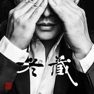

冬藏
============================

|  |  |
| :--: | :-- |
| [ 冬藏](https://emumo.xiami.com/album/2100241062) | **艺人**: [赵照](../index.md) **语种**: 国语 **唱片公司**: 独立发行 **发行时间**: 2015年11月24日 **专辑类别**: EP, 单曲 **专辑风格**: 世界融合 World Fusion **播放数**: 252828 **收藏数**: 273 **评论数**: 27  |

## 简介

 冬藏是赵照从去年冬天一直做到今年冬天的一首音乐作品。他把他能想到的气象光影、灰尘沙粒、湖海山川、统统放进里面，可最终却是空空荡荡极简单调近乎奇怪的表达。他眼睛里的冬天是花团锦簇溶成一滴冰水轻划过你肌肤。

## 曲目

## 评论

|  |  |  |
| :-- | :-- | :-- |
|  [虾米用户](https://emumo.xiami.com/u/295670380) 别急躁 2019-03-27 16:24 赞(0) 踩(0) | 
赵照收藏了自己的歌
 |
|  [虾米用户](https://emumo.xiami.com/u/44324917) 虾米硬起来 2015-12-14 13:56 赞(0) 踩(0) | 

 |
|  [虾米用户](https://emumo.xiami.com/u/47314883)  2015-12-13 22:56 赞(1) 踩(0) | 
1211听了赵照的冬藏巡演，现场听他唱歌真是美妙，一把吉他一把口琴，聊聊天，哼哼曲，美妙的夜晚
 |
|  [虾米用户](https://emumo.xiami.com/u/6388480)  2015-11-30 08:02 赞(0) 踩(0) | 
音乐不错，很优美
 |
|  [虾米用户](https://emumo.xiami.com/u/86375556) 如果，来生，还能，遇见你 2015-11-30 01:13 赞(0) 踩(0) | 
空
 |
|  [虾米用户](https://emumo.xiami.com/u/10484379) 一花一世界 2015-11-27 17:59 赞(0) 踩(0) | 
就喜欢没词儿哒。遛弯听。
 |
|  [虾米用户](https://emumo.xiami.com/u/40078854)  2015-11-27 12:15 赞(0) 踩(0) | 
旋律舒服
 |
|  [虾米用户](https://emumo.xiami.com/u/39424583) “无米煮，煮泥沙； 无床... 2015-11-26 16:16 赞(0) 踩(0) | 
上海见！
 |
|  [虾米用户](https://emumo.xiami.com/u/9569992) X 2015-11-26 15:46 赞(1) 踩(0) | 
咚咚，空空，沥沥，滴滴，简单却不空洞让人一再回味
 |
|  [虾米用户](https://emumo.xiami.com/u/8244559)  2015-11-26 12:28 赞(0) 踩(0) | 
******
 |
|  [虾米用户](https://emumo.xiami.com/u/49675013)  2015-11-26 09:53 赞(0) 踩(0) | 
一如即往的支持赵照
 |
|  [虾米用户](https://emumo.xiami.com/u/2523233) 太热 2015-11-26 01:33 赞(1) 踩(0) | 
天噜，是我眼花看成赵薇了么。。
 |
|  [虾米用户](https://emumo.xiami.com/u/355865) Let it go, l... 2015-11-26 00:35 赞(28) 踩(0) | 
也不知道是什么行为艺术，虾米评论里有人各种刷「我听着这么吊的音乐为毛还没女朋友」……大哥，难道不应该是「我听着这么吊的音乐还需要什么女朋友」么？
 |
| ⇒ |  [虾米用户](https://emumo.xiami.com/u/44891249)   2015-11-29 00:51 赞(0) 踩(0) | 
哈哈……人穷尽一生追寻另一个人类，共度一生的事，我一直无法理解。也许我自己太有意思，无需他人陪伴。
 |
| ⇒ |  [虾米用户](https://emumo.xiami.com/u/355865) Let it go, l... 2015-11-29 02:16 赞(0) 踩(0) | 
<q><b>/tp小鹿☆说：</b></q>
 |
|  [虾米用户](https://emumo.xiami.com/u/4707631) 好歌伴我行，音乐无国界。 2015-11-25 22:01 赞(0) 踩(0) | 
精品！
 |
|  [虾米用户](https://emumo.xiami.com/u/1644083)  2015-11-25 16:52 赞(0) 踩(0) | 
清新之作
 |
|  [虾米用户](https://emumo.xiami.com/u/9679917) 未来总是好的 2015-11-25 14:15 赞(0) 踩(0) | 
就是喜欢！
 |
|  [虾米用户](https://emumo.xiami.com/u/19707092)   2015-11-25 09:24 赞(0) 踩(0) | 
毫无提防的又被赵照感动(ಥ_ಥ)治愈
 |
|  [虾米用户](https://emumo.xiami.com/u/44324917) 虾米硬起来 2015-11-25 02:15 赞(0) 踩(0) | 

 |
|  [虾米用户](https://emumo.xiami.com/u/13691875) 谁的感叹 偶然合拍 2015-11-24 22:03 赞(0) 踩(0) | 
照理都是巡演前出同名单曲的哟 
 |
|  [虾米用户](https://emumo.xiami.com/u/1066695) 我还没想好要写什么... 2015-11-24 21:51 赞(0) 踩(0) | 
哎呦 和巡演一个名字的新砖
 |
|  [虾米用户](https://emumo.xiami.com/u/49293869)  2015-11-24 21:33 赞(0) 踩(0) | 
  
 |
|  [虾米用户](https://emumo.xiami.com/u/8402900)  2015-11-24 21:25 赞(0) 踩(0) | 
单曲循环了一个晚上。一边写稿，一边想着我的为爱行走。每个人都不是一座孤岛。和自然的共鸣让我们感觉一切都是一体，淡然的生活，随手做一些让这个世界变得更美好的事情吧。做这些事情的时候我的心情最平和。就像听这首歌的感觉。谢谢赵照写出这样和灵魂有共鸣的音乐。
 |
|  [虾米用户](https://emumo.xiami.com/u/7647959) 西北部野生民谣个体户 2015-11-24 21:08 赞(0) 踩(0) | 
春露
 |
|  [虾米用户](https://emumo.xiami.com/u/22081732) Just listen. 2015-11-24 20:41 赞(0) 踩(0) | 
怎么办啊？
 |
|  [虾米用户](https://emumo.xiami.com/u/2375136) 暂无签名~ 2015-11-24 20:37 赞(0) 踩(0) | 
(●&amp;#039;◡&amp;#039;●)
 |
