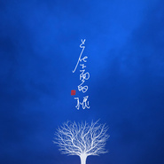

花下面的根
============================

|  |  |
| :--: | :-- |
| [ 花下面的根](https://emumo.xiami.com/album/2103726532) | **艺人**: [赵照](../index.md) **语种**: 国语 **唱片公司**: 风华秋实 **发行时间**: 2018年06月04日 **专辑类别**: EP, 单曲 **专辑风格**: 独立民谣 Indie Folk **播放数**: 213460 **收藏数**: 91 **评论数**: 10  |

## 简介

自己为自己盛开 

## 曲目

## 评论

|  |  |  |  |
| :-- | :-- | :-- | :-- |
|  [虾米用户](https://emumo.xiami.com/u/322555206) 我还没想好要写什么... 2020-01-29 11:29 赞(1) 踩(0) | 
赵照的歌都喜欢
 |
|  [虾米用户](https://emumo.xiami.com/u/264733511)  2019-12-21 22:14 赞(1) 踩(0) | 
喜欢赵照的不浮躁，能让人静下来
 |
|  [虾米用户](https://emumo.xiami.com/u/424999405)  2019-11-20 18:51 赞(0) 踩(0) | 
连续的高压学习，身心疲惫，莫名有些难过。听到这个声音，嘴会不自觉的上扬，好治愈
 |
|  [虾米用户](https://emumo.xiami.com/u/429495929)  2019-09-14 17:07 赞(0) 踩(0) | 

 |
|  [虾米用户](https://emumo.xiami.com/u/420612793)  2019-07-11 18:34 赞(0) 踩(0) | 
文字有点儿多余了……
 |
|  [虾米用户](https://emumo.xiami.com/u/249922204) 真挚也美好 2018-12-26 20:35 赞(0) 踩(0) | 
听到了“真”
 |
|  [虾米用户](https://emumo.xiami.com/u/1033591) loving stran... 2018-06-18 15:11 赞(1) 踩(0) | 
清新低沉。内敛外放。
 |
|  [虾米用户](https://emumo.xiami.com/u/147175912) 在世间，难逃避命运 2018-06-04 13:06 赞(0) 踩(0) | 
烈日炎炎，生意清淡，戴上耳机，听着刚刚分别的赵老师歌唱
 |
|  [虾米用户](https://emumo.xiami.com/u/17236518) 若我的光曝在你身上，重逢... 2018-06-04 13:05 赞(0) 踩(0) | 
呀吼呀吼呀吼呀吼耶
 |
|  [虾米用户](https://emumo.xiami.com/u/7647959) 西北部野生民谣个体户 2018-06-04 13:02 赞(0) 踩(0) | 
自己为自己盛开吧
 |
