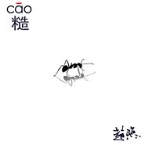

糙
============================

|  |  |
| :--: | :-- |
| [ 糙](https://emumo.xiami.com/album/968735842) | **艺人**: [赵照](../index.md) **语种**: 国语 **唱片公司**: 独立发行 **发行时间**: 2012年12月12日 **专辑类别**: 录音室专辑 **专辑风格**: 民谣摇滚 Folk Rock, 独立民谣 Indie Folk **播放数**: 3669109 **收藏数**: 1194 **评论数**: 49  |

## 简介

【糙】其实是一张没有具体风格的专辑，囊括了多种风格。从2010开始制作，其中大部分作品是赵照在鼓楼的工作室里录制完成。700多天的录制过程 ，赵照几乎一直都是处在一种闭门造车不闻世事的状态，但在追求精致完美的音乐品质过程中，他发现作品原有的力量和真实感，所谓精致粗糙都是相对的：理论上的完美，在行为上往往是面目全非，就像我们的生活，也许正是因为有了“粗糙” 才更显示出力量和生命力。 

## 曲目

## 评论

|  |  |  |  |
| :-- | :-- | :-- | :-- |
|  [虾米用户](https://emumo.xiami.com/u/49334418) ～ 2020-10-11 16:15 赞(0) 踩(0) | 
～
 |
|  [虾米用户](https://emumo.xiami.com/u/1316533) 不折腾不舒服斯基 2020-10-08 13:44 赞(0) 踩(0) | 
竟然漏了这首歌，竟然没听出是他的声音。。。。。
 |
|  [虾米用户](https://emumo.xiami.com/u/317523187)  2020-04-30 09:00 赞(0) 踩(0) | 
犀利酣畅，直指人心
 |
|  [虾米用户](https://emumo.xiami.com/u/3420859) 听万首歌，行万里路。 2020-03-01 05:36 赞(0) 踩(0) | 
实力派歌手！
 |
|  [虾米用户](https://emumo.xiami.com/u/11353)  2020-02-27 15:35 赞(0) 踩(0) | 
实体唱片跟这个曲目有出入，顺序也不一样
 |
|  [虾米用户](https://emumo.xiami.com/u/342339021) o 2019-04-15 01:09 赞(0) 踩(0) | 
mk
 |
|  [虾米用户](https://emumo.xiami.com/u/52395373) 我还没想好要写什么... 2019-01-05 20:26 赞(0) 踩(0) | 
。
 |
|  [虾米用户](https://emumo.xiami.com/u/13313040) 再好的相机也只能记录最美... 2018-06-11 23:07 赞(0) 踩(0) | 

 |
|  [虾米用户](https://emumo.xiami.com/u/265290531) @南疆大V鸡 2017-11-02 17:44 赞(3) 踩(0) | 
这张12年刚发行的时候 根本就没人认啊!根本就没人认!哼!:)~~
 |
| ⇒ |  [虾米用户](https://emumo.xiami.com/u/262486137)  2018-04-01 01:04 赞(0) 踩(0) | 
现在有人认了，挺好的~
 |
| ⇒ |  [虾米用户](https://emumo.xiami.com/u/265290531) @南疆大V鸡 2018-04-01 01:08 赞(0) 踩(0) | 
<q><b>MIX说：</b></q>
 |
|  [虾米用户](https://emumo.xiami.com/u/85209980)  2016-11-03 10:13 赞(0) 踩(0) | 
草原上的江南
 |
|  [虾米用户](https://emumo.xiami.com/u/18364364)  2016-04-09 13:21 赞(0) 踩(0) | 
喝醉的笛子  太有特色了  嘎嘎嘎嘎嘎
 |
|  [虾米用户](https://emumo.xiami.com/u/73749122)  2016-03-17 10:43 赞(0) 踩(0) | 
喜欢！喜欢！没有为什么！
 |
|  [虾米用户](https://emumo.xiami.com/u/1577505)  2015-12-04 10:47 赞(0) 踩(0) | 
国语
 |
|  [虾米用户](https://emumo.xiami.com/u/1014240) 岁月不知人间多少的忧伤，... 2015-11-02 13:04 赞(1) 踩(0) | 
理论上的完美，在行为上往往是面目全非，就像我们的生活，也许正是因为有了“粗糙” 才更显示出力量和生命力......我喜欢这句话！
 |
|  [虾米用户](https://emumo.xiami.com/u/10435106) 听靓歌 2015-08-02 18:15 赞(0) 踩(0) | 
不错。
 |
|  [虾米用户](https://emumo.xiami.com/u/4911883) 如果你也爱Eason 2015-07-01 23:15 赞(1) 踩(0) | 
优秀民谣摇滚专辑 
 |
|  [虾米用户](https://emumo.xiami.com/u/9312500)  2015-06-26 22:31 赞(1) 踩(0) | 
nice
 |
|  [虾米用户](https://emumo.xiami.com/u/1259073) 线段 2015-05-30 09:50 赞(1) 踩(0) | 
禁欲先生曾经听到停不下来，第一句禁欲先生和痛仰的再见杰克一样迷人啊。
 |
|  [虾米用户](https://emumo.xiami.com/u/194864)  2015-05-12 14:19 赞(1) 踩(0) | 
听着听着就想起野夫写的《1980年代的爱情》这本书，绝配的样子
 |
|  [虾米用户](https://emumo.xiami.com/u/3407089)  2015-05-12 13:32 赞(0) 踩(0) | 
多好听的歌儿呀！边听就边想打拍子边摇摆，那谁竟然说难听
 |
|  [虾米用户](https://emumo.xiami.com/u/27088542)  2015-04-20 20:19 赞(1) 踩(0) | 
民谣  歌词／节奏都很棒  让人情不自禁跟着打拍子哼唱
 |
|  [虾米用户](https://emumo.xiami.com/u/17615855) like rock 2015-04-08 01:38 赞(0) 踩(0) | 
不错不错
 |
|  [虾米用户](https://emumo.xiami.com/u/30260517)  2015-04-05 10:09 赞(2) 踩(0) | 
嘿 老头 19集 里面听到这歌
 |
|  [虾米用户](https://emumo.xiami.com/u/1126943)  2015-02-28 13:09 赞(0) 踩(0) | 
已收实体唱片一:)。。
 |
|  [虾米用户](https://emumo.xiami.com/u/39235894) 响者，为乐。 2015-02-24 12:40 赞(0) 踩(0) | 
喜欢另一个赵照。
 |
|  [虾米用户](https://emumo.xiami.com/u/36166)  2015-02-14 20:29 赞(1) 踩(0) | 
的确是一张制作精良的专辑，我个人不属于此类风格的欣赏者，却被深深震动了，谢谢，赵照!
 |
|  [虾米用户](https://emumo.xiami.com/u/36166)  2015-02-14 20:28 赞(0) 踩(0) | 
05.07曲目不大喜欢，其他很棒！
 |
|  [虾米用户](https://emumo.xiami.com/u/1816602)  2015-02-10 13:55 赞(0) 踩(0) | 
喜欢
 |
|  [虾米用户](https://emumo.xiami.com/u/11763865)  2015-01-11 19:00 赞(0) 踩(0) | 
！
 |
|  [虾米用户](https://emumo.xiami.com/u/2268725)  2014-12-30 15:58 赞(0) 踩(0) | 
停不下来的音乐
 |
|  [虾米用户](https://emumo.xiami.com/u/463136) tree 2014-11-15 11:27 赞(1) 踩(0) | 
从12年开始一直听到现在，越听越好听。陪伴着我每天画画的时光，真心舒坦。谢谢你，赵照。
 |
|  [虾米用户](https://emumo.xiami.com/u/43170902)  2014-11-05 19:12 赞(0) 踩(0) | 
浅吟低唱的嗓音和琴弦撩拨的是你无所是从的茫然，随意随心随性，人生不过尔尔。
 |
|  [虾米用户](https://emumo.xiami.com/u/10953696)  2014-10-26 22:50 赞(0) 踩(0) | 
是谣
 |
|  [虾米用户](https://emumo.xiami.com/u/1542470) KNOT 2014-09-29 09:41 赞(0) 踩(0) | 
看了小雨访谈才知道他
 |
|  [虾米用户](https://emumo.xiami.com/u/9991351)  2014-07-12 06:21 赞(1) 踩(0) | 
俗味民謡！
 |
|  [虾米用户](https://emumo.xiami.com/u/8259026) 我爱摇滚乐！ 2014-06-04 23:01 赞(0) 踩(0) | 
梦回故乡，非常好，支持赵照。。。
 |
|  [虾米用户](https://emumo.xiami.com/u/1609946) 一即一切 2014-03-10 00:47 赞(0) 踩(0) | 
心 境不二
 |
| ⇒ |  [虾米用户](https://emumo.xiami.com/u/1952239) 虚空无尽愿无尽 2014-03-16 15:14 赞(0) 踩(0) | 
你怎么在哪都是这几个字啊
 |
| ⇒ |  [虾米用户](https://emumo.xiami.com/u/2066122) 穷逼VIP 2014-07-10 01:39 赞(0) 踩(0) | 
就是 我就好奇 这是一种什么心境 让您处处留言的时候就专挑这四个字 您是修禅呢还是修道 还是只是修身养性
 |
|  [虾米用户](https://emumo.xiami.com/u/235416) 顺时慈悲 逆时静 2014-01-25 04:22 赞(0) 踩(0) | 
喜欢。
 |
|  [虾米用户](https://emumo.xiami.com/u/888128)  2014-01-07 16:23 赞(0) 踩(0) | 
好听!牛逼!
 |
|  [虾米用户](https://emumo.xiami.com/u/235416) 顺时慈悲 逆时静 2014-01-06 05:05 赞(0) 踩(0) | 
真好，这个专辑的很多歌我在别处都听不了，终于可以在这里听到了：）谢了！：）
 |
|  [虾米用户](https://emumo.xiami.com/u/255155) 风子 2013-12-05 20:03 赞(0) 踩(0) | 
真心的音乐！
 |
|  [虾米用户](https://emumo.xiami.com/u/21335648)  2013-09-07 20:40 赞(0) 踩(0) | 
太美了。泡茶一杯！
 |
|  [虾米用户](https://emumo.xiami.com/u/18164364)  2013-07-29 11:01 赞(0) 踩(0) | 
haoting .有深度，最个性也是最纯粹的独立音乐 找不到任何人的影子，力荐力荐！！
 |
|  [虾米用户](https://emumo.xiami.com/u/3057827)  2013-07-18 19:09 赞(0) 踩(0) | 
buquan
 |
|  [虾米用户](https://emumo.xiami.com/u/3289488)  2013-05-19 18:50 赞(0) 踩(0) | 
yo pal
 |
