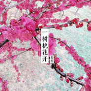
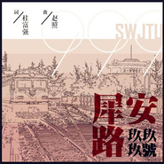

赵照
============================

|  |  |
| :--: | :-- |
| [ 赵照](https://i.xiami.com/zhaozhao) | **播放数**: 56980422 **粉丝数**: 55756 **评论数**: 521 **地区**: China 中国大陆 **风格**: 民谣流行 Folk Pop, 独立民谣 Indie Folk  |

## 档案

赵照，独立音乐人、民谣摇滚歌者、音乐制作人、无花果乐队创始人。他以诗人的态度，不拘于风格的状态制作和演绎自己的作品，并提倡“用音乐记录生命”的音乐理念。先后发行专辑《大经厂》、《糙》。其中《当你老了》（源自爱尔兰诗人叶芝）以亲情视角改编的单曲，深受广大歌迷喜爱。

## 专辑

| 名称 | 语种 | 唱片公司 | 发行时间 | 专辑类别 | 专辑风格 |
| :--: | :-- | :-- | :-- | :-- | :-- |
| [ 平遥行](./albums/2103929050.md) | 国语 | 坤歌文化 | 2018年08月17日 | EP, 单曲 | 民谣流行 Folk Pop |
| [ 花下面的根](./albums/2103726532.md) | 国语 | 风华秋实 | 2018年06月04日 | EP, 单曲 | 独立民谣 Indie Folk |
| [ 无论](./albums/2103695687.md) | 国语 | 风华秋实 | 2018年04月27日 | EP, 单曲 |  |
| [ 一字歌](./albums/2103514993.md) | 国语 | 赵照音乐工作室 | 2018年02月07日 | EP, 单曲 | 独立民谣 Indie Folk |
| [ 福建如你](./albums/2103508278.md) | 国语 | 星文嘉艺 | 2018年01月30日 | EP, 单曲 | 独立民谣 Indie Folk |
| [ 一树桃花开](./albums/2102798363.md) | 国语 | 风华秋实 | 2017年07月18日 | EP, 单曲 |  |
| [ 赵照Keep Going On](./albums/2102761732.md) | 国语 | 风华秋实 | 2017年06月08日 | 录音室专辑 | 独立摇滚 Indie Rock, 独立民谣 Indie Folk, 民谣摇滚 Folk Rock |
| [ 粽香](./albums/2102747676.md) | 国语 | 风华秋实 | 2017年05月13日 | EP, 单曲 |  |
| [ 一匹白马](./albums/2102745052.md) | 国语 | 风华秋实 | 2017年05月09日 | EP, 单曲 |  |
| [ 启程](./albums/2102696776.md) | 国语 | 风华秋实 | 2017年02月21日 | EP, 单曲 |  |
| [ 过期荷尔蒙](./albums/2102659646.md) | 国语 | 风华秋实 | 2016年12月05日 | EP, 单曲 |  |
| [ 那时花开](./albums/2102859773.md) | 国语 | 风华秋实 | 2016年06月03日 | EP, 单曲 | 国语流行 Mandarin Pop |
| [ 花的心跳](./albums/2100343390.md) | 国语 | 风华秋实 | 2016年05月20日 | EP, 单曲 | 民谣流行 Folk Pop |
| [ 犀安路999号](./albums/2100322490.md) | 国语 | 华羽先生 | 2016年04月26日 | EP, 单曲 | 民谣流行 Folk Pop |
| [ 冬藏](./albums/2100241062.md) | 国语 | 独立发行 | 2015年11月24日 | EP, 单曲 | 世界融合 World Fusion |
| [ 伊萨贝拉](./albums/2100220272.md) | 国语 | 独立发行 | 2015年10月04日 | EP, 单曲 | 独立民谣 Indie Folk |
| [ 今晚的月亮](./albums/2100205198.md) | 国语 | 独立发行 | 2015年09月23日 | EP, 单曲 | 独立民谣 Indie Folk |
| [ 1980年代的爱情](./albums/2100210114.md) | 国语 | 星外星音乐 | 2015年09月11日 | EP, 单曲 | 当代民谣 Contemporary Folk |
| [ 一把破吉他1999](./albums/834509373.md) | 国语 | 独立发行 | 2015年06月17日 | EP, 单曲 | 当代民谣 Contemporary Folk |
| [ 声律启蒙](./albums/1229966089.md) | 国语 | 赵照音乐工作室 | 2015年04月27日 | EP, 单曲 | 传统民谣 Traditional Folk, 独立民谣 Indie Folk |
| [ 当你老了 (电视新版)](./albums/2027649111.md) | 国语 | 独立发行 | 2015年03月27日 | EP, 单曲 | 当代民谣 Contemporary Folk |
| [ 舍不得过](./albums/125632616.md) | 国语 | 独立发行 | 2015年03月05日 | EP, 单曲 | 独立民谣 Indie Folk |
| [ 当你老了](./albums/1824587220.md) | 国语 | 独立发行 | 2015年02月22日 | EP, 单曲 | 独立民谣 Indie Folk |
| [ 回家吃饭](./albums/323471131.md) | 国语 | 独立发行 | 2015年02月10日 | EP, 单曲 | 独立民谣 Indie Folk |
| [ 这一切绝不是真的](./albums/487165304.md) | 国语 | 赵照音乐工作室 | 2013年12月03日 | EP, 单曲 | 民谣 Folk |
| [ 糙](./albums/968735842.md) | 国语 | 独立发行 | 2012年12月12日 | 录音室专辑 | 民谣摇滚 Folk Rock, 独立民谣 Indie Folk |
| [ 大经厂](./albums/382951.md) | 国语 | 独立发行 | 2010年04月24日 | 录音室专辑 | 民谣 Folk |
| [ 你就是我最想要的丫头](./albums/391565.md) | 国语 | 云门文化 | 2008年03月19日 | EP, 单曲 | 民谣 Folk |

## 评论

|  |  |  |  |
| :-- | :-- | :-- | :-- |
|  [虾米用户](https://emumo.xiami.com/u/49334418) ～ 2020-10-11 16:16 赞(0) 踩(0) | 
～
 |
|  [虾米用户](https://emumo.xiami.com/u/4806942)  2020-08-30 21:44 赞(0) 踩(0) | 
喜欢那首雨巷 没有找到
 |
|  [虾米用户](https://emumo.xiami.com/u/444203154)  2020-07-25 16:37 赞(1) 踩(0) | 
我是被名字吸引过来的
 |
|  [虾米用户](https://emumo.xiami.com/u/348139142)  2020-06-04 16:13 赞(1) 踩(0) | 
喜欢你没道理
 |
|  [虾米用户](https://emumo.xiami.com/u/440060032) 听听唱唱尿尿 2020-05-30 11:40 赞(0) 踩(0) | 
旋律华丽丽的悠扬~但北方这种复古音乐曲式能说明啥？有何物质层次有何文化层次？
 |
|  [虾米用户](https://emumo.xiami.com/u/84122518) 狠人话不多 2020-03-23 13:02 赞(2) 踩(0) | 
双赵都是我最爱的民谣歌手，加油！
 |
|  [虾米用户](https://emumo.xiami.com/u/431245132) 人生不如意十之八九，可与... 2020-03-17 16:14 赞(0) 踩(0) | 
生日快乐啊
 |
|  [虾米用户](https://emumo.xiami.com/u/1087405)   2020-03-17 10:10 赞(1) 踩(0) | 
认识你是从听到&amp;ldquo;当你老了&amp;rdquo; 谢谢你给了我们那么棒那么有意义的歌曲。 今天你长多一岁了， ㊗️你生日快乐 身体健康
 |
|  [虾米用户](https://emumo.xiami.com/u/281572031)   2020-03-17 10:07 赞(0) 踩(0) | 
好巧，我也今天生日
 |
|  [虾米用户](https://emumo.xiami.com/u/424704580) sbtt 2020-03-17 10:06 赞(1) 踩(0) | 
虾米提醒了一下  生日快乐！！ [文字up]
 |
|  [虾米用户](https://emumo.xiami.com/u/314671074)   2020-03-17 10:04 赞(2) 踩(0) | 
生日快乐，记得第一次听您的当你老了，流泪了，听了很久很久&amp;hellip;
 |
|  [虾米用户](https://emumo.xiami.com/u/47085347) 浮生若梦 2020-01-04 11:36 赞(1) 踩(0) | 
每一首都那么与众不同，独出心裁，迷上了❤
 |
|  [虾米用户](https://emumo.xiami.com/u/355436280)  2019-12-03 22:35 赞(2) 踩(0) | 
成都站，照老师乖得很～
 |
|  [虾米用户](https://emumo.xiami.com/u/424277514)  2019-11-08 18:16 赞(2) 踩(0) | 
我买了你在济南演唱会的门票哈哈
 |
|  [虾米用户](https://emumo.xiami.com/u/247981060) Everything  ... 2019-03-17 10:58 赞(1) 踩(0) | 
生日快乐
 |
|  [虾米用户](https://emumo.xiami.com/u/309565960)  2019-03-17 10:37 赞(3) 踩(0) | 
泪水中有你，欢笑中有你，回忆中有你谢谢你<a href="http://emumo.xiami.com/u/14772189" target="_blank" rel="nofollow" name_card="14772189">@赵照 </a>
 |
|  [虾米用户](https://emumo.xiami.com/u/230803304) 三观正又爱国的成都宝藏男... 2019-03-17 10:33 赞(1) 踩(0) | 
生日快乐
 |
|  [虾米用户](https://emumo.xiami.com/u/64405936)  2019-03-17 10:27 赞(0) 踩(0) | 
一直快乐下去
 |
|  [虾米用户](https://emumo.xiami.com/u/346087991) 医路漫漫 音乐为伴 2019-03-17 10:03 赞(0) 踩(0) | 

 |
|  [虾米用户](https://emumo.xiami.com/u/574312) 我还没想好要写什么... 2019-03-17 10:00 赞(1) 踩(0) | 
生日快乐鸭 赵老师！
 |
|  [虾米用户](https://emumo.xiami.com/u/164125292) 即使世界消失，我对你的爱... 2019-03-04 23:46 赞(0) 踩(0) | 
又睡不着了...
 |
|  [虾米用户](https://emumo.xiami.com/u/201391232) 最快的方法是先抱抱 2019-02-12 01:44 赞(0) 踩(0) | 
彡
 |
|  [虾米用户](https://emumo.xiami.com/u/402962008) 音乐是我快乐的源泉 2019-02-06 19:23 赞(0) 踩(0) | 
对于一个57岁的女人来说，你的歌听出了
 |
|  [虾米用户](https://emumo.xiami.com/u/322235515) 在音乐里澎湃，在玩笑里开... 2019-01-31 00:24 赞(2) 踩(0) | 
他的吉他比人声更有柔情。
 |
|  [虾米用户](https://emumo.xiami.com/u/262486137)  2018-11-29 01:54 赞(0) 踩(0) | 
风华秋实的版权，再见。
 |
|  [虾米用户](https://emumo.xiami.com/u/408091170)  2018-11-18 20:25 赞(0) 踩(0) | 
赵老师谢谢您！你来日照我在！我是山东聊城莘县人！感觉好亲切！白鹭湾民谣音乐节你我同在！
 |
|  [虾米用户](https://emumo.xiami.com/u/408496897)  2018-11-14 04:56 赞(1) 踩(0) | 
百听不厌啊
 |
|  [虾米用户](https://emumo.xiami.com/u/408496897)  2018-11-14 04:55 赞(1) 踩(0) | 
太好听，真爱
 |
|  [虾米用户](https://emumo.xiami.com/u/293692544) 你敢给我说话吗？我咬你 2018-11-07 16:30 赞(1) 踩(0) | 
好听
 |
|  [虾米用户](https://emumo.xiami.com/u/343733187)  2018-11-06 00:42 赞(1) 踩(0) | 
连云港花果山的民宿一直在等你……来
 |
|  [虾米用户](https://emumo.xiami.com/u/45146429) 暂无签名~ 2018-10-13 09:00 赞(4) 踩(0) | 
毫无违和感地把诗唱成歌，曲调犹如春风拂面，犹如秋风萧瑟，温柔中略带一丝惆怅，或许这就是哀而不伤 
 |
|  [虾米用户](https://emumo.xiami.com/u/13416098) 。 2018-10-11 09:13 赞(3) 踩(0) | 
赵照的声音有一种莫名的社会感 
 |
|  [虾米用户](https://emumo.xiami.com/u/300217618)  2018-10-03 21:58 赞(4) 踩(0) | 
讲真的很有才!
 |
|  [虾米用户](https://emumo.xiami.com/u/7878790) 音乐无国界！ 2018-09-15 00:20 赞(3) 踩(0) | 
听你的歌，会上瘾的！    
 |
|  [虾米用户](https://emumo.xiami.com/u/353502781) 我思故我在 2018-09-05 21:05 赞(3) 踩(0) | 
一个95后不知为何独独偏爱你的歌曲。
 |
| ⇒ |  [虾米用户](https://emumo.xiami.com/u/375869419) 你只是不够幸运遇见最好时... 2019-02-10 12:53 赞(0) 踩(0) | 
＋1
 |
|  [虾米用户](https://emumo.xiami.com/u/293692544) 你敢给我说话吗？我咬你 2018-09-01 05:06 赞(1) 踩(0) | 
好听
 |
|  [虾米用户](https://emumo.xiami.com/u/185153668) 永远相信美好的事情即将发... 2018-08-29 10:05 赞(2) 踩(0) | 
最好的赵照
 |
|  [虾米用户](https://emumo.xiami.com/u/64405936)  2018-08-15 01:39 赞(1) 踩(0) | 
非常喜欢赵照的歌曲！
 |
|  [虾米用户](https://emumo.xiami.com/u/379989424)  2018-08-14 07:22 赞(1) 踩(0) | 
Ao xXcEr  but fddodcc
 |
|  [虾米用户](https://emumo.xiami.com/u/375869419) 你只是不够幸运遇见最好时... 2018-08-01 22:49 赞(1) 踩(0) | 
远方的梦汇成河，灯是霓虹色的漩涡这句歌词好像是出自《千人一面》想问一下这是不是赵照的作词？在虾米里找不到这首歌，谢谢了 
 |
|  [虾米用户](https://emumo.xiami.com/u/325492119)  2018-07-30 00:52 赞(2) 踩(0) | 
要花钱，才能下载
 |
|  [虾米用户](https://emumo.xiami.com/u/43481446) 音乐就是通用语 2018-07-24 20:00 赞(3) 踩(0) | 
赵照老师的歌是独一无二的那种，越听越有味道。
 |
|  [虾米用户](https://emumo.xiami.com/u/37087855) 740576010@QQ... 2018-06-28 09:07 赞(1) 踩(0) | 
好听
 |
|  [虾米用户](https://emumo.xiami.com/u/290202519)  2018-06-24 23:47 赞(1) 踩(0) | 
赵照老师永远支持您，第一次见到您本人是在涌泰音乐节，跟着节奏，看着酷酷的你，几首歌下来，立马圈粉，现场很嗨，一起喊赵照赵照&amp;hellip;&amp;hellip;感谢您带给我们的感动
 |
|  [虾米用户](https://emumo.xiami.com/u/6321298) 上善若洪水 2018-06-20 12:18 赞(2) 踩(0) | 
什么时候来深圳
 |
|  [虾米用户](https://emumo.xiami.com/u/351841420) 爱满天下，心有爱，百善孝... 2018-06-15 07:57 赞(3) 踩(0) | 
我很喜欢这首《你就是我最想要的丫头》
 |
| ⇒ |  [虾米用户](https://emumo.xiami.com/u/353502781) 我思故我在 2018-09-05 21:06 赞(0) 踩(0) | 
找到同道中人了
 |
|  [虾米用户](https://emumo.xiami.com/u/89203992) 伞外朦胧可是你？ 2018-06-13 23:23 赞(3) 踩(0) | 
今天陪女友去看了他的演唱会，压轴曲目就是当你老了
 |
|  [虾米用户](https://emumo.xiami.com/u/33536082)  2018-06-01 13:33 赞(2) 踩(0) | 
歌曲好听
 |
|  [虾米用户](https://emumo.xiami.com/u/196814078)  2018-05-27 20:43 赞(12) 踩(0) | 
天哪！！！我现在才看见他一个月前发给我的消息，迟来的急冻。可惜发不了截图   
 |
|  [虾米用户](https://emumo.xiami.com/u/5398540) 民歌警察出警中 2018-05-26 11:19 赞(2) 踩(0) | 
抄就完事了 
 |
|  [虾米用户](https://emumo.xiami.com/u/260377460) 到过圣地也还是烦恼凡夫，... 2018-05-25 16:51 赞(2) 踩(0) | 
赵老师什么时候来重庆啊
 |
|  [虾米用户](https://emumo.xiami.com/u/237093590) 不打扰，是我的温柔。 2018-05-13 13:48 赞(1) 踩(0) | 
李连杰？
 |
|  [虾米用户](https://emumo.xiami.com/u/351903463)  2018-04-02 20:24 赞(2) 踩(0) | 
谢谢赵照大哥！
 |
|  [虾米用户](https://emumo.xiami.com/u/344995219)  2018-03-30 15:21 赞(2) 踩(0) | 
你的歌怎么都要钱
 |
|  [虾米用户](https://emumo.xiami.com/u/21937226) 活得像棵树。 2018-03-27 23:16 赞(0) 踩(0) | 
照照，爱你呀
 |
|  [虾米用户](https://emumo.xiami.com/u/18591116)  2018-03-08 14:36 赞(2) 踩(0) | 
支持原创，再好的翻唱也唱不出原创的寓意！
 |
|  [虾米用户](https://emumo.xiami.com/u/338401157)  2018-02-22 16:15 赞(1) 踩(0) | 
为我和赵照共同的家乡争光了
 |
|  [虾米用户](https://emumo.xiami.com/u/268935002)  2018-02-20 09:24 赞(1) 踩(0) | 
用音乐记录生命的你，朴素的民谣《1980年代的爱情》抚慰了红尘中久已流失的感动；愿我的每一份等待告诉你《你是我想要的丫头》只为遇见你；《当你老了》我们依然牵手同行！
 |
|  [虾米用户](https://emumo.xiami.com/u/4172307) 虾米forever 2018-02-17 20:56 赞(0) 踩(0) | 
刚刚看节目，声律启蒙太好听了~.
 |
|  [虾米用户](https://emumo.xiami.com/u/85568296) 只有阳光而无阴影 只有欢... 2018-02-13 23:46 赞(0) 踩(0) | 
慵懒
 |
|  [虾米用户](https://emumo.xiami.com/u/345250570)  2018-02-09 15:03 赞(0) 踩(0) | 
加油
 |
|  [虾米用户](https://emumo.xiami.com/u/343927809)  2018-02-08 16:27 赞(0) 踩(0) | 
挺好听的。
 |
|  [虾米用户](https://emumo.xiami.com/u/233068846)  2018-02-05 21:11 赞(0) 踩(0) | 
这张封面跟大壮王伟真像啊
 |
|  [虾米用户](https://emumo.xiami.com/u/125089920) 找到北方啦 2018-01-30 21:03 赞(0) 踩(0) | 

 |
|  [虾米用户](https://emumo.xiami.com/u/248131327) 吖呢哈 2018-01-29 10:47 赞(0) 踩(0) | 
@赵照，老师，我想问一下，一把破吉他1999是什么样的故事？ 
 |
|  [虾米用户](https://emumo.xiami.com/u/21476856)  2018-01-25 15:54 赞(0) 踩(0) | 
所有歌都喜欢，慢慢，棕香，当你老了，声律启蒙，家的味道
 |
|  [虾米用户](https://emumo.xiami.com/u/112274868) 啊～再见 2017-12-24 10:24 赞(1) 踩(0) | 
很多唱歌的唱着唱着后来都变味儿了，可爱的你还是唱着自己的歌，在你身上看到的只有美好，看见你笑心都化了。希望10年 20年 30年40年后一个精神的老头儿还唱着爱情火枪，老太们听得都美滋滋   
 |
|  [虾米用户](https://emumo.xiami.com/u/13741772) 就算微不足道，也要英勇跳... 2017-12-17 23:39 赞(1) 踩(0) | 
有没有看过&amp;ldquo;观照&amp;rdquo;的小伙伴，可以说一下现场唱了哪些歌吗？
 |
| ⇒ |  [虾米用户](https://emumo.xiami.com/u/257790850)  2017-12-21 08:05 赞(0) 踩(0) | 
啊啊啊，每场都不一样，总之现场是最棒的，有个歌迷群如果你愿意可以加你进来呦
 |
| ⇒ |  [虾米用户](https://emumo.xiami.com/u/147175912) 在世间，难逃避命运 2018-05-02 21:08 赞(0) 踩(0) | 
<q><b>Naomi说：</b></q>
 |
|  [虾米用户](https://emumo.xiami.com/u/333820162)   2017-12-03 22:13 赞(1) 踩(0) | 
我太喜欢这首歌了
 |
|  [虾米用户](https://emumo.xiami.com/u/252383328)  2017-11-29 22:20 赞(1) 踩(0) | 
很舒服自然的声音，有画面感
 |
|  [虾米用户](https://emumo.xiami.com/u/225560553)  2017-11-29 00:30 赞(1) 踩(0) | 
哪儿能听他的为你盛开阿，网易和这儿都没有。
 |
| ⇒ |  [虾米用户](https://emumo.xiami.com/u/337729313)  2017-12-02 13:41 赞(0) 踩(0) | 
听听&amp;lt;一树桃花开&amp;gt; 
 |
| ⇒ |  [虾米用户](https://emumo.xiami.com/u/277736796)  2018-02-07 09:14 赞(0) 踩(0) | 
搜《一树桃花开》就是哦
 |
|  [虾米用户](https://emumo.xiami.com/u/317221489) 好听。 2017-11-25 09:44 赞(0) 踩(0) | 
好听。 
 |
|  [虾米用户](https://emumo.xiami.com/u/284239248) 加油！ 2017-11-23 08:52 赞(3) 踩(0) | 
喜欢赵照也喜欢赵雷
 |
|  [虾米用户](https://emumo.xiami.com/u/317221489) 好听。 2017-11-12 09:40 赞(0) 踩(0) | 
好听。
 |
|  [虾米用户](https://emumo.xiami.com/u/303646464)  2017-10-31 19:09 赞(1) 踩(0) | 
耐听
 |
|  [虾米用户](https://emumo.xiami.com/u/11318774)  2017-10-29 09:27 赞(0) 踩(0) | 
昨晚赵照大哥和乐队 温暖了沈阳寒冷的夜…
 |
|  [虾米用户](https://emumo.xiami.com/u/249937070) 人生若无悔放下过去归零 2017-10-27 23:55 赞(1) 踩(0) | 
珍惜总是明白在遗憾以后，好好珍惜那些真正对你好的人，无论爱情还是友情，不去经营，都会形同陌路。不期待突如其来的好运，只希望所有的能慢慢变得好 ​，愿你能用自己喜欢的方式过一生
 |
|  [虾米用户](https://emumo.xiami.com/u/313714376) 不要不知廉耻的做人 2017-10-21 00:30 赞(0) 踩(0) | 
喜欢
 |
|  [虾米用户](https://emumo.xiami.com/u/315788114)  2017-10-20 10:20 赞(1) 踩(0) | 
该火的人，该火的音乐
 |
|  [虾米用户](https://emumo.xiami.com/u/13313040) 再好的相机也只能记录最美... 2017-10-19 07:00 赞(0) 踩(0) | 
寄生虫那首真棒
 |
|  [虾米用户](https://emumo.xiami.com/u/329796375)  2017-10-16 00:06 赞(0) 踩(0) | 
独立，音乐人，赞
 |
|  [虾米用户](https://emumo.xiami.com/u/329796375)  2017-10-15 22:19 赞(0) 踩(0) | 
祝福巡演成功
 |
|  [虾米用户](https://emumo.xiami.com/u/312471060)  2017-10-14 03:50 赞(0) 踩(0) | 
很棒
 |
|  [虾米用户](https://emumo.xiami.com/u/307199582) 安静的听歌 2017-10-01 14:05 赞(0) 踩(0) | 
每首听起来都是那么岁月蹉跎 每首都好感动 沈阳站马上去为你打call
 |
|  [虾米用户](https://emumo.xiami.com/u/13691875) 谁的感叹 偶然合拍 2017-09-12 22:47 赞(2) 踩(0) | 
10／21 石家庄 @守望者展演中心10／22 天 津 @派Live10／27 长 春 @老张光阴咖啡馆10／28 沈 阳 光阴故事音乐酒吧@美帝奇音乐现场10／29 哈尔滨 @SUB-LIVE11／03 广 州 @TU凸空间11／05 深 圳 @红糖罐11／10 上 海 @ModernSkyLAB上海11／11 南 京 @欧拉艺术空间11／12 杭 州 @MAOLivehouse杭州11／24 重 庆 @MAOLivehouse重庆官微11／25 成 都 @成都小酒馆12／01 合 肥 @ONTHEWAY酒吧12／02 武 汉 @VOXLIVEHOUSE
 |
|  [虾米用户](https://emumo.xiami.com/u/13691875) 谁的感叹 偶然合拍 2017-09-12 22:45 赞(0) 踩(0) | 
真好，赵照也回归了
 |
|  [虾米用户](https://emumo.xiami.com/u/48146372)  2017-09-08 20:20 赞(0) 踩(0) | 
就是喜欢
 |
|  [虾米用户](https://emumo.xiami.com/u/288629746)  2017-08-29 13:20 赞(1) 踩(0) | 
1
 |
|  [虾米用户](https://emumo.xiami.com/u/24711605) 于是转身向大海走去！ 2017-08-22 09:21 赞(1) 踩(0) | 
12 8济南走起 
 |
|  [虾米用户](https://emumo.xiami.com/u/320574102)  2017-08-22 00:34 赞(0) 踩(0) | 
我爱赵照
 |
|  [虾米用户](https://emumo.xiami.com/u/303506160) 因为我对你爱的深沉 2017-07-26 09:03 赞(0) 踩(0) | 
嘿呦
 |
|  [虾米用户](https://emumo.xiami.com/u/266012932) 就让这时光流淌，而我们就... 2017-07-25 04:07 赞(0) 踩(0) | 
这段时间听赵照的歌听到上瘾
 |
|  [虾米用户](https://emumo.xiami.com/u/55139735)  2017-07-16 23:56 赞(0) 踩(0) | 
当你老了这首歌太好听了，你是谁唱的特么好听努力继续为你加油，你会唱的更好听李便成了我心中的明星呢                                           [叹号问好]嗯，我非常想知道你能告诉我手机怎么唱得这么好听呢我问你加油你一定我唱的最好听
 |
|  [虾米用户](https://emumo.xiami.com/u/298925485)  2017-07-12 06:28 赞(1) 踩(0) | 
好听。  
 |
|  [虾米用户](https://emumo.xiami.com/u/299704956)  2017-06-16 13:24 赞(2) 踩(0) | 
这是一首写得非常好的歌,旋律一响起,就能触动心灵的歌,听好多遍还能听得掉眼泪的歌,百听不厌,一个人的时候就循环的一遍一遍的听,只是只可以在线听,离线只能听莫文藯的,但总觉少点啥,可还是喜欢
 |
|  [虾米用户](https://emumo.xiami.com/u/60351990) 愿你我没有白白受苦。 2017-06-13 20:19 赞(0) 踩(0) | 
歌曲不全，还望尽快更新
 |
|  [虾米用户](https://emumo.xiami.com/u/38918617) 你相信我，我相信你 2017-06-09 08:06 赞(0) 踩(0) | 
其实赵照老师人还蛮好的 公告也是疏忽 我在这道歉
 |
|  [虾米用户](https://emumo.xiami.com/u/42036240) 用自己的曲谱出自己的词 2017-06-09 02:32 赞(1) 踩(0) | 
当我走了、有人会哭吗？我想不会吧、当我来了、有人会开心吗？我想也不会吧
 |
|  [虾米用户](https://emumo.xiami.com/u/34634596) 本质逼裂波(1108，啪... 2017-06-09 02:18 赞(2) 踩(0) | 
估计阿里对虾米的拨款太少的缘故  虾米又囊中羞涩了呗  那么人家做音乐的也算是个行当那也得赚钱吧   别人买独家给的更多你虾米这么不够意思那当然得撤版权咯
 |
|  [虾米用户](https://emumo.xiami.com/u/251780414) 蓝调,爵士,电子,咽嗓,... 2017-06-08 21:36 赞(0) 踩(0) | 
为何下架了？！
 |
|  [虾米用户](https://emumo.xiami.com/u/24711605) 于是转身向大海走去！ 2017-06-06 23:01 赞(1) 踩(0) | 
为啥没法在虾米上新专辑 
 |
|  [虾米用户](https://emumo.xiami.com/u/14265718) wx:osakarock... 2017-06-06 23:00 赞(1) 踩(0) | 
十分真诚的作品
 |
|  [虾米用户](https://emumo.xiami.com/u/1812913)  2017-06-06 22:47 赞(0) 踩(0) | 
终于要有新歌了
 |
|  [虾米用户](https://emumo.xiami.com/u/207596972)   2017-05-26 16:04 赞(1) 踩(0) | 
羡慕能做音乐的人
 |
|  [虾米用户](https://emumo.xiami.com/u/207596972)   2017-05-26 16:04 赞(2) 踩(0) | 
羡慕能做音乐的人
 |
|  [虾米用户](https://emumo.xiami.com/u/14434784)  2017-05-20 23:01 赞(0) 踩(0) | 
暖心的歌，当你老了，听哭了。
 |
|  [虾米用户](https://emumo.xiami.com/u/12102909) 没有 2017-05-19 16:55 赞(0) 踩(0) | 
喜欢就是喜欢
 |
|  [虾米用户](https://emumo.xiami.com/u/276829124)  2017-05-17 10:29 赞(0) 踩(0) | 
歌词都大爱，声音又喜欢，能怎么办呢
 |
|  [虾米用户](https://emumo.xiami.com/u/243359427)  2017-05-13 12:14 赞(1) 踩(0) | 
比较真挚,不像其他民谣歌手那样装逼耍帅没内涵
 |
|  [虾米用户](https://emumo.xiami.com/u/87579498)   2017-05-09 04:55 赞(1) 踩(0) | 
听 赵照的歌陶醉 写的真实 还有点小欢乐
 |
|  [虾米用户](https://emumo.xiami.com/u/287198203)  2017-05-05 19:20 赞(0) 踩(0) | 
赵兄，加油哦！
 |
|  [虾米用户](https://emumo.xiami.com/u/36345910)  2017-05-02 20:32 赞(2) 踩(0) | 
不比赵雷差
 |
|  [虾米用户](https://emumo.xiami.com/u/262594263) vincent 2017-05-01 18:59 赞(1) 踩(0) | 
之前从未听过这首歌。很庆幸在有生之年听见了！这首简单的歌提醒了我还有些事应该要做了！谢谢您!
 |
|  [虾米用户](https://emumo.xiami.com/u/259438950)  2017-04-17 21:25 赞(0) 踩(0) | 
好听
 |
|  [虾米用户](https://emumo.xiami.com/u/280501600)  2017-04-13 17:54 赞(1) 踩(0) | 
发自内心的歌
 |
|  [虾米用户](https://emumo.xiami.com/u/288245654)  2017-04-12 22:05 赞(0) 踩(0) | 
娓娓道来，细细品味
 |
|  [虾米用户](https://emumo.xiami.com/u/4840135)   2017-04-08 18:30 赞(2) 踩(0) | 
听不厌烦的歌曲
 |
|  [虾米用户](https://emumo.xiami.com/u/285551908) 这个世界因我无心而精彩 2017-04-03 06:22 赞(1) 踩(0) | 
当我们也老了&amp;hellip;&amp;hellip;
 |
|  [虾米用户](https://emumo.xiami.com/u/37560125) beloved  2017-04-03 00:13 赞(0) 踩(0) | 
很不错^_^
 |
|  [虾米用户](https://emumo.xiami.com/u/280443545)  2017-04-01 00:28 赞(0) 踩(0) | 
好听
 |
|  [虾米用户](https://emumo.xiami.com/u/284635906)  2017-03-30 21:05 赞(0) 踩(0) | 
不错
 |
|  [虾米用户](https://emumo.xiami.com/u/284586574) 我有一万亿点爱，每天分你... 2017-03-30 20:25 赞(0) 踩(0) | 
好。。。。。。。好。。。。。。。。。的
 |
|  [虾米用户](https://emumo.xiami.com/u/275750036) 长的漂亮不如活的漂亮 2017-03-29 10:27 赞(0) 踩(0) | 
好好听
 |
|  [虾米用户](https://emumo.xiami.com/u/101562896)  2017-03-23 07:53 赞(1) 踩(0) | 
非常喜欢赵照的歌，曲好听词也有意思
 |
|  [虾米用户](https://emumo.xiami.com/u/221775861)  2017-03-23 06:23 赞(1) 踩(0) | 
封面很逗，很熊样~歌吗，很喜欢~
 |
|  [虾米用户](https://emumo.xiami.com/u/30475986) 万物与我为一 2017-03-20 07:23 赞(1) 踩(0) | 
集市，奶奶，晒太阳，好有生活气息
 |
|  [虾米用户](https://emumo.xiami.com/u/86513568)  2017-03-18 17:36 赞(0) 踩(0) | 
超级喜欢
 |
|  [虾米用户](https://emumo.xiami.com/u/279283966)  2017-03-11 15:11 赞(0) 踩(0) | 
你的歌很实在
 |
|  [虾米用户](https://emumo.xiami.com/u/246506971) 林俊杰的小天使O(∩_∩... 2017-03-10 22:24 赞(0) 踩(0) | 
济南的演唱会马上开了 
 |
|  [虾米用户](https://emumo.xiami.com/u/278948101) 往来都擦肩 归途蜿蜒 2017-03-09 14:41 赞(0) 踩(0) | 
师傅
 |
|  [虾米用户](https://emumo.xiami.com/u/278682177)  2017-03-09 01:23 赞(0) 踩(0) | 
赵哥，你好 
 |
|  [虾米用户](https://emumo.xiami.com/u/276686025)  2017-02-28 03:03 赞(0) 踩(0) | 
好听
 |
|  [虾米用户](https://emumo.xiami.com/u/188128960)  2017-02-24 05:46 赞(0) 踩(0) | 
民谣民谣
 |
|  [虾米用户](https://emumo.xiami.com/u/267689997)   2017-02-17 22:25 赞(0) 踩(0) | 
好听到流泪
 |
|  [虾米用户](https://emumo.xiami.com/u/11888343) 面对现实 ，忠于理想 2017-02-16 11:17 赞(0) 踩(0) | 
温馨
 |
|  [虾米用户](https://emumo.xiami.com/u/273736566)  2017-02-16 00:23 赞(0) 踩(0) | 
       
 |
|  [虾米用户](https://emumo.xiami.com/u/273736566)  2017-02-16 00:23 赞(0) 踩(0) | 
  
 |
|  [虾米用户](https://emumo.xiami.com/u/271875185)  2017-02-15 09:35 赞(0) 踩(0) | 
丫头好听！
 |
|  [虾米用户](https://emumo.xiami.com/u/238203824) 无处不在 2017-02-01 14:58 赞(0) 踩(0) | 
一把破吉他-好听
 |
|  [虾米用户](https://emumo.xiami.com/u/269088523)   2017-01-29 20:18 赞(0) 踩(0) | 
怎么买你的专辑，哪里有卖，求买！
 |
|  [虾米用户](https://emumo.xiami.com/u/249937070) 人生若无悔放下过去归零 2017-01-20 10:10 赞(1) 踩(0) | 
真心喜欢一个人的感觉，如同那种冬天在被窝里起床前，就是不想离开一分一秒的感觉
 |
|  [虾米用户](https://emumo.xiami.com/u/554785)  2016-12-17 23:27 赞(0) 踩(0) | 
声音太喜欢太好听了~还有，民乐古词民谣，真心美好~赵照，只服你~
 |
|  [虾米用户](https://emumo.xiami.com/u/19928334) 正视不完美，是对过去的一... 2016-12-14 15:06 赞(0) 踩(0) | 
支持！敬请关注！
 |
|  [虾米用户](https://emumo.xiami.com/u/5732142) 。 2016-11-13 06:41 赞(0) 踩(0) | 
M
 |
|  [虾米用户](https://emumo.xiami.com/u/976361)  2016-11-10 15:09 赞(0) 踩(0) | 
回忆？
 |
| ⇒ |  [虾米用户](https://emumo.xiami.com/u/136291084) 这家伙很聪明什么也没留下... 2016-11-19 06:18 赞(0) 踩(0) | 
？
 |
|  [虾米用户](https://emumo.xiami.com/u/35270468) wang10101zhh 2016-10-27 20:22 赞(1) 踩(0) | 
这就是我心里的歌!
 |
|  [虾米用户](https://emumo.xiami.com/u/8566739) 今晚打边炉啊 2016-09-24 15:27 赞(1) 踩(0) | 
呀~又可以听了
 |
|  [虾米用户](https://emumo.xiami.com/u/10982442)  2016-08-02 16:00 赞(1) 踩(0) | 
赵照
 |
|  [虾米用户](https://emumo.xiami.com/u/199600913)  2016-07-10 22:18 赞(2) 踩(0) | 
单读视频上的那个新歌什么时候出啊
 |
|  [虾米用户](https://emumo.xiami.com/u/181842658) 我是可爱的狐狸精 2016-07-06 21:52 赞(1) 踩(0) | 
好听好听好好听
 |
|  [虾米用户](https://emumo.xiami.com/u/115246540)  2016-06-23 15:52 赞(1) 踩(0) | 

 |
|  [虾米用户](https://emumo.xiami.com/u/375612)  2016-05-20 17:32 赞(0) 踩(0) | 
悠悠荡荡~
 |
|  [虾米用户](https://emumo.xiami.com/u/53552186)  2016-05-16 22:48 赞(0) 踩(0) | 
时间和结局都不能影响我们爱你
 |
|  [虾米用户](https://emumo.xiami.com/u/53552186)  2016-05-15 20:54 赞(39) 踩(0) | 
听赵照歌其实很难受，怎么难受呢，听的时候心很快乐，简直是舞蹈的，了我听了满腔激动热火转头没有人可以说，可能我的学校太小太小了，也不奇怪当我说出赵照这个名字时，人们问赵照是谁了。我说的多了，他们也就认识了，也只是知道了。不听摇滚乐，是挺好的，这种话听多了也有点伤心，听他的歌这么难受，但我要一直听，一直听，因为只有他的歌有家乡，有姑娘，月亮，火车，风，山花，果实，有火，有树，有生活，有北方的一切，还有雪。
 |
|  [虾米用户](https://emumo.xiami.com/u/3496718) idle space 2016-04-28 12:48 赞(3) 踩(0) | 
这是个有故事的声音~~~
 |
|  [虾米用户](https://emumo.xiami.com/u/6400363)  2016-04-27 15:32 赞(0) 踩(0) | 
就是喜欢
 |
|  [虾米用户](https://emumo.xiami.com/u/10859736) 心之所向，素履以往；生如... 2016-04-27 00:13 赞(18) 踩(0) | 
你唱了犀安路999号，还是聊城人 
 |
|  [虾米用户](https://emumo.xiami.com/u/38976097)  2016-04-26 23:00 赞(3) 踩(0) | 
文艺青年必备，诗和远方
 |
|  [虾米用户](https://emumo.xiami.com/u/7741500) 。 2016-04-24 08:35 赞(0) 踩(0) | 
=w=
 |
|  [虾米用户](https://emumo.xiami.com/u/132504704)  2016-04-03 05:45 赞(0) 踩(0) | 
唱歌好
 |
|  [虾米用户](https://emumo.xiami.com/u/11763865)  2016-03-18 08:34 赞(0) 踩(0) | 

 |
|  [虾米用户](https://emumo.xiami.com/u/14265718) wx:osakarock... 2016-03-16 21:22 赞(0) 踩(0) | 
帅！ 
 |
|  [虾米用户](https://emumo.xiami.com/u/6211700)  2016-03-15 10:21 赞(0) 踩(0) | 
好
 |
|  [虾米用户](https://emumo.xiami.com/u/43640601)   2016-03-10 11:43 赞(0) 踩(0) | 
听的很舒服，有趣，适合自己的就是好歌啊，这就是好歌啊
 |
|  [虾米用户](https://emumo.xiami.com/u/49184956)  2016-02-18 23:14 赞(1) 踩(0) | 
老了。
 |
|  [虾米用户](https://emumo.xiami.com/u/44019928) 小虾米 2016-02-18 22:58 赞(0) 踩(0) | 
留下气味
 |
|  [虾米用户](https://emumo.xiami.com/u/92970090)  2016-02-18 12:19 赞(0) 踩(0) | 
赵照的歌是为数不多的能让你嗨起来的民谣!
 |
|  [虾米用户](https://emumo.xiami.com/u/53552186)  2016-02-14 18:36 赞(0) 踩(0) | 
我是一棵树……
 |
|  [虾米用户](https://emumo.xiami.com/u/110107294)  2016-02-05 06:37 赞(0) 踩(0) | 
赵照被归类为先锋乐？
 |
|  [虾米用户](https://emumo.xiami.com/u/868146)  2016-01-30 15:25 赞(0) 踩(0) | 
有没有看了《小V大V》过来的？
 |
|  [虾米用户](https://emumo.xiami.com/u/34337481)   2016-01-16 06:19 赞(1) 踩(0) | 
因为是独立音乐
 |
|  [虾米用户](https://emumo.xiami.com/u/95449962)   2016-01-15 01:32 赞(0) 踩(0) | 
来重庆唱[带墨镜笑]
 |
|  [虾米用户](https://emumo.xiami.com/u/95449962)   2016-01-15 01:32 赞(0) 踩(0) | 
留言你能看到吗？ 
 |
|  [虾米用户](https://emumo.xiami.com/u/95449962)   2016-01-15 01:23 赞(0) 踩(0) | 
简直超级精神粮食  爱你 么么哒
 |
|  [虾米用户](https://emumo.xiami.com/u/47046227) 80后 2016-01-13 23:05 赞(0) 踩(0) | 
为啥都买不到CD
 |
|  [虾米用户](https://emumo.xiami.com/u/81027294)  2016-01-12 15:12 赞(0) 踩(0) | 
这首歌听得我眼泪流不停<a href="http://www.xiami.com/play?ids=/song/playlist/id/1775408290/object_name/default/object_id/0#loaded" target="_blank" rel="nofollow noreferrer noopener">http://www.xiami.com/play?ids=/song/playlist/id/1775408290/object_name/default/object_id/0#loaded</a>
 |
|  [虾米用户](https://emumo.xiami.com/u/40674801)  2016-01-10 20:18 赞(1) 踩(0) | 
棒，不是一般的棒，除了最喜欢的老许外，新人里就数他和他学生了，赵雷也真棒！
 |
| ⇒ |  [虾米用户](https://emumo.xiami.com/u/4491445)  2016-03-24 00:26 赞(0) 踩(0) | 
同感
 |
|  [虾米用户](https://emumo.xiami.com/u/83990896) ♪我想成为一名配乐师，给... 2016-01-06 16:13 赞(1) 踩(0) | 
赵照好帅   
 |
|  [虾米用户](https://emumo.xiami.com/u/95496270) 何处是我家 2015-12-29 13:02 赞(1) 踩(0) | 
真希望你二月能在武汉
 |
|  [虾米用户](https://emumo.xiami.com/u/49360634)  2015-12-26 21:35 赞(0) 踩(0) | 
好听，民谣，听了浑身都是劲啊！
 |
|  [虾米用户](https://emumo.xiami.com/u/3878009) 暂无签名~ 2015-12-26 10:22 赞(0) 踩(0) | 
歌词韵律很棒，值得唱。
 |
|  [虾米用户](https://emumo.xiami.com/u/15166129) 吟罢低眉无写处，月光如水... 2015-12-22 13:39 赞(0) 踩(0) | 
回到十八岁快出歌吧
 |
|  [虾米用户](https://emumo.xiami.com/u/47738619) 暂无签名~ 2015-12-12 23:38 赞(0) 踩(0) | 
12.25号圣诞节见    
 |
|  [虾米用户](https://emumo.xiami.com/u/58045120) 《我爱她》她不懂~我爱她... 2015-12-11 20:11 赞(2) 踩(0) | 
喜欢民谣，一定要听赵照，没有为什么~
 |
|  [虾米用户](https://emumo.xiami.com/u/20869195)  2015-12-09 21:57 赞(0) 踩(0) | 
你什么时候来北京开演唱会？？？…
 |
|  [虾米用户](https://emumo.xiami.com/u/4595285) 温澜潮生。 2015-12-07 16:36 赞(0) 踩(0) | 
谁有赵照的只爱一点点live！！那天现场没录，后悔莫及！天天以泪洗面    
 |
| ⇒ |  [虾米用户](https://emumo.xiami.com/u/24860451) 我还没想好要写什么... 2016-01-31 22:28 赞(0) 踩(0) | 
苯酚～
 |
| ⇒ |  [虾米用户](https://emumo.xiami.com/u/4595285) 温澜潮生。 2016-01-31 22:42 赞(0) 踩(0) | 
<q><b>Q说：</b></q>
 |
|  [虾米用户](https://emumo.xiami.com/u/36512749) 白羊座 2015-12-06 10:10 赞(1) 踩(0) | 
那年夏天你背着一把破吉他走向车站 离开了家倾盆的雨淋湿了你的长头发你抱着行李 咬着牙车厢里的旅人啊都心事重重的你不敢抬头看那窗外的景色爱上漂泊的少年郎你只有一把破吉他你怎么舍得站台上送别你的姑娘前途孤单又漫长你只有一把破吉他你说你的脸庞是雨水淋湿的爱上漂泊的少年郎你为什么还那么倔强你怎么舍得站台上送别你的姑娘谁的青春能不荒唐谁初次上路不慌张你说你的脸庞是雨水淋湿的爱上漂泊的少年郎你只有一把破吉他你只有握紧拳头用力把歌唱你只有握紧拳头
 |
|  [虾米用户](https://emumo.xiami.com/u/4590738) 逃禅者又重新操琴，手势流... 2015-12-01 18:08 赞(2) 踩(0) | 
（补一个）豆瓣FM听的《在冬天和奶奶一起晒太阳》，然后推荐评价：我喜欢这歌诶。以前山头上我奶家院子里有簇两米多高的月季，下边放着老式竹躺椅，我老爹就花阴挡头，银烟筒吃水烟，醉生梦死晒太阳；每次回去我都想霸占他位置，但是尊卑有别，长幼有序啊。
 |
| ⇒ |  [虾米用户](https://emumo.xiami.com/u/7840019) 哎呦诶 2015-12-05 21:40 赞(0) 踩(0) | 
好一个醉生梦死！吐口烟圈，眯眼看它袅袅消散在一片斑斓之中
 |
| ⇒ |  [虾米用户](https://emumo.xiami.com/u/4590738) 逃禅者又重新操琴，手势流... 2015-12-07 10:46 赞(0) 踩(0) | 
<q><b>cckai13说：</b></q>
 |
| ⇒ |  [虾米用户](https://emumo.xiami.com/u/7840019) 哎呦诶 2015-12-07 23:10 赞(0) 踩(0) | 
<q><b>Jupiter说：</b></q>
 |
| ⇒ |  [虾米用户](https://emumo.xiami.com/u/4590738) 逃禅者又重新操琴，手势流... 2015-12-08 11:27 赞(0) 踩(0) | 
<q><b>cckai13说：</b></q>
 |
| ⇒ |  [虾米用户](https://emumo.xiami.com/u/7840019) 哎呦诶 2015-12-09 21:41 赞(0) 踩(0) | 
<q><b>Jupiter说：</b></q>
 |
| ⇒ |  [虾米用户](https://emumo.xiami.com/u/4590738) 逃禅者又重新操琴，手势流... 2017-02-15 00:04 赞(0) 踩(0) | 
<q><b>cckai13说：</b></q>
 |
| ⇒ |  [虾米用户](https://emumo.xiami.com/u/7840019) 哎呦诶 2017-02-20 21:55 赞(0) 踩(0) | 
<q><b>Jupiter说：</b></q>
 |
|  [虾米用户](https://emumo.xiami.com/u/36538861) 空蕩蕩的舞臺上，孤單單的... 2015-11-27 20:31 赞(27) 踩(0) | 
昨天去看了你的现场，觉得你实在是让人讨厌，有才华就算了，性格还那么好！性格那么好就算了，长得还好看！！！台风还那么帅酷！！！真是完美地太让人嫉妒了！！！
 |
|  [虾米用户](https://emumo.xiami.com/u/9392275)  2015-11-27 11:01 赞(0) 踩(0) | 
找点民谣
 |
|  [虾米用户](https://emumo.xiami.com/u/53534148)  2015-11-27 09:01 赞(0) 踩(0) | 
我为什么买不了票呢？？？   
 |
|  [虾米用户](https://emumo.xiami.com/u/12674116) 我还没想好要写什么... 2015-11-25 01:39 赞(0) 踩(0) | 
有机会看现场了 
 |
|  [虾米用户](https://emumo.xiami.com/u/10947607) 音乐是灵魂伴侣 2015-11-23 23:46 赞(0) 踩(0) | 
音乐充斥着时光的温暖。。。
 |
|  [虾米用户](https://emumo.xiami.com/u/9844479) 岁月让梦消失也算长大 2015-11-23 20:07 赞(0) 踩(0) | 
12.13见
 |
|  [虾米用户](https://emumo.xiami.com/u/2964921)  2015-11-21 08:52 赞(0) 踩(0) | 
喜欢和奶奶一起晒太阳
 |
|  [虾米用户](https://emumo.xiami.com/u/774850)  2015-11-18 14:14 赞(0) 踩(0) | 
温暖平淡
 |
|  [虾米用户](https://emumo.xiami.com/u/20306846) 想刻一个 “如此而已” ... 2015-10-26 08:45 赞(1) 踩(0) | 
11月1号见！冰秀剧场
 |
|  [虾米用户](https://emumo.xiami.com/u/37880578)   2015-10-19 22:38 赞(2) 踩(0) | 
赵照笑起来真好看  
 |
|  [虾米用户](https://emumo.xiami.com/u/8136361) 时空怪盗Brook 2015-10-19 01:16 赞(0) 踩(0) | 
他的音乐都好有feel
 |
|  [虾米用户](https://emumo.xiami.com/u/54615581) 闭嘴 2015-10-19 01:06 赞(0) 踩(0) | 
你一笑天都亮了
 |
|  [虾米用户](https://emumo.xiami.com/u/48955076)  2015-10-18 12:58 赞(0) 踩(0) | 
又有新歌了，太棒了
 |
|  [虾米用户](https://emumo.xiami.com/u/48955076)  2015-10-18 12:57 赞(0) 踩(0) | 
来一次，赞一次!
 |
|  [虾米用户](https://emumo.xiami.com/u/21768808)  2015-10-14 21:56 赞(1) 踩(0) | 
赵照太棒了啊
 |
|  [虾米用户](https://emumo.xiami.com/u/4195692)  2015-10-13 19:37 赞(0) 踩(0) | 
很久没有那个歌手能抓住我的感觉啦~
 |
|  [虾米用户](https://emumo.xiami.com/u/6553997) 小西 2015-10-12 19:27 赞(0) 踩(0) | 
喜欢
 |
|  [虾米用户](https://emumo.xiami.com/u/565665)   2015-10-12 09:16 赞(17) 踩(0) | 
你不要去参加好声音好歌曲我是歌手中国最强音之类之类的烂节目好么 
 |
|  [虾米用户](https://emumo.xiami.com/u/10374996) weixin: pola... 2015-10-12 08:16 赞(0) 踩(0) | 
很多歌很好听 喜欢听～ 把人带入深深的思考 或者说让人慢慢的淡忘一些东西 使人成长。
 |
|  [虾米用户](https://emumo.xiami.com/u/9190448)   2015-10-11 17:29 赞(0) 踩(0) | 
(´･_･`)要不要去呢？好纠结。去年的冬天也没怎么去过演唱会。
 |
|  [虾米用户](https://emumo.xiami.com/u/6619720)  2015-10-09 21:29 赞(0) 踩(0) | 
赵日天
 |
|  [虾米用户](https://emumo.xiami.com/u/8865162) Freedom 2015-10-08 15:26 赞(0) 踩(0) | 
10月31 长春见！
 |
|  [虾米用户](https://emumo.xiami.com/u/13113134) L.4.T.M Onli... 2015-10-08 02:20 赞(0) 踩(0) | 
11月1号 冰城见
 |
|  [虾米用户](https://emumo.xiami.com/u/49189313)  2015-10-06 23:09 赞(1) 踩(0) | 
10月16日武汉见～ 
 |
|  [虾米用户](https://emumo.xiami.com/u/68615972)   2015-10-06 18:31 赞(0) 踩(0) | 
最喜欢的是《一棵树》
 |
|  [虾米用户](https://emumo.xiami.com/u/32659213) hell 2015-10-06 07:39 赞(0) 踩(0) | 
❤️
 |
|  [虾米用户](https://emumo.xiami.com/u/6770643) 谨言慎行，戒急用忍 2015-10-05 12:08 赞(0) 踩(0) | 
低音更沉一些，声音再沙哑一点，就更老男人了
 |
|  [虾米用户](https://emumo.xiami.com/u/13656926) 无限混乱，理也理不清 2015-10-04 13:15 赞(0) 踩(0) | 
武汉站求改到武昌的livehouse！!！汉口里店太偏太偏，恕臣妾做不到啊  
 |
|  [虾米用户](https://emumo.xiami.com/u/11243932) everything 2015-10-01 20:14 赞(0) 踩(0) | 
为什么巡演没有北京站
 |
|  [虾米用户](https://emumo.xiami.com/u/11243932) everything 2015-10-01 20:14 赞(0) 踩(0) | 
为什么巡演没有北京站
 |
|  [虾米用户](https://emumo.xiami.com/u/11267833)  2015-09-23 19:29 赞(0) 踩(0) | 
耳朵怀孕了
 |
|  [虾米用户](https://emumo.xiami.com/u/9806134)  2015-09-23 10:24 赞(0) 踩(0) | 
｡･ω･
 |
|  [虾米用户](https://emumo.xiami.com/u/68335110) 哪里有自由，哪里就是我的... 2015-09-20 23:47 赞(0) 踩(0) | 
寄生虫慢慢的，一棵树
 |
|  [虾米用户](https://emumo.xiami.com/u/5530016)  2015-09-18 10:51 赞(0) 踩(0) | 
慢慢的
 |
|  [虾米用户](https://emumo.xiami.com/u/11917054) 『常年卧底医院并乔装成医... 2015-09-18 08:26 赞(2) 踩(0) | 
在现实中我没见到你，在音乐里我们相濡以沫
 |
|  [虾米用户](https://emumo.xiami.com/u/652331) 我还没想好要写什么... 2015-09-15 10:33 赞(1) 踩(0) | 
B站老番茄口袋妖怪系列男主角
 |
| ⇒ |  [虾米用户](https://emumo.xiami.com/u/5520537)  2015-10-02 01:27 赞(0) 踩(0) | 
什么鬼hhhhhh
 |
|  [虾米用户](https://emumo.xiami.com/u/61599214)  2015-09-06 23:36 赞(0) 踩(0) | 
好音乐，感谢心灵旅程中的伴侣，我们的岁月，我们的年龄，我们的音乐
 |
|  [虾米用户](https://emumo.xiami.com/u/3811479)  2015-08-30 11:06 赞(0) 踩(0) | 
风格房顶上
 |
|  [虾米用户](https://emumo.xiami.com/u/56392504) 好好的生活吧 2015-08-28 21:02 赞(0) 踩(0) | 
hao
 |
|  [虾米用户](https://emumo.xiami.com/u/49766728) 。。。 2015-08-23 10:19 赞(0) 踩(0) | 
这个好啊！
 |
|  [虾米用户](https://emumo.xiami.com/u/12409435)   2015-08-19 18:46 赞(0) 踩(0) | 
声律启蒙~
 |
|  [虾米用户](https://emumo.xiami.com/u/16255463) @Revolution9... 2015-08-19 01:25 赞(1) 踩(0) | 
。
 |
|  [虾米用户](https://emumo.xiami.com/u/55157333)  2015-08-13 19:12 赞(0) 踩(0) | 
雷子师傅
 |
|  [虾米用户](https://emumo.xiami.com/u/53525917)  2015-08-11 12:36 赞(1) 踩(0) | 
赵照的声音，沧桑中流露出的是温暖
 |
|  [虾米用户](https://emumo.xiami.com/u/7878790) 音乐无国界！ 2015-08-08 18:18 赞(0) 踩(0) | 
老男孩，很给力！
 |
|  [虾米用户](https://emumo.xiami.com/u/7878790) 音乐无国界！ 2015-08-08 18:12 赞(0) 踩(0) | 
赵照的歌，非常好听，超级喜欢！！！
 |
|  [虾米用户](https://emumo.xiami.com/u/44433292)   2015-08-07 02:16 赞(0) 踩(0) | 
没有理由
 |
|  [虾米用户](https://emumo.xiami.com/u/9882024) 直到你发现  我 （再也... 2015-08-03 23:10 赞(1) 踩(0) | 
九夏  三冬  我 你
 |
|  [虾米用户](https://emumo.xiami.com/u/54269831)  2015-08-02 12:56 赞(0) 踩(0) | 
每当听到这首歌会想起自己的父母，随后会想到自己老了的样子。。。。
 |
|  [虾米用户](https://emumo.xiami.com/u/54218236)  2015-08-01 21:53 赞(0) 踩(0) | 
简单似清风穿透心灵，
 |
|  [虾米用户](https://emumo.xiami.com/u/54218236)  2015-08-01 21:53 赞(0) 踩(0) | 
简单似清风穿透心灵，
 |
|  [虾米用户](https://emumo.xiami.com/u/9202429) 午后  音乐 咖啡 好书 2015-07-31 20:07 赞(0) 踩(0) | 
老男人的生活
 |
|  [虾米用户](https://emumo.xiami.com/u/9202429) 午后  音乐 咖啡 好书 2015-07-31 20:07 赞(0) 踩(0) | 
老男人的生活
 |
|  [虾米用户](https://emumo.xiami.com/u/29878987)  2015-07-22 15:25 赞(0) 踩(0) | 
喜欢他的声音
 |
|  [虾米用户](https://emumo.xiami.com/u/43695240) 暂无签名~ 2015-07-20 19:54 赞(0) 踩(0) | 
我是250
 |
|  [虾米用户](https://emumo.xiami.com/u/43695240) 暂无签名~ 2015-07-20 19:54 赞(0) 踩(0) | 
我是250
 |
|  [虾米用户](https://emumo.xiami.com/u/43695240) 暂无签名~ 2015-07-20 19:54 赞(1) 踩(0) | 
我是250
 |
|  [虾米用户](https://emumo.xiami.com/u/52390649) 音乐，永无止境！ 2015-07-19 02:52 赞(0) 踩(0) | 
民谣风
 |
|  [虾米用户](https://emumo.xiami.com/u/1812913)  2015-07-17 15:18 赞(0) 踩(0) | 
长大了开始喜欢有内涵的人
 |
|  [虾米用户](https://emumo.xiami.com/u/49231182)  2015-07-16 17:25 赞(0) 踩(0) | 
声音宏厚
 |
|  [虾米用户](https://emumo.xiami.com/u/40891954)  2015-07-12 22:08 赞(1) 踩(0) | 
很有味道的音乐，淳朴干净，很有feeling
 |
|  [虾米用户](https://emumo.xiami.com/u/51706503) 黑金暗潮哥特，金属党。 2015-07-12 15:38 赞(0) 踩(0) | 
留爪
 |
|  [虾米用户](https://emumo.xiami.com/u/51706503) 黑金暗潮哥特，金属党。 2015-07-12 15:38 赞(0) 踩(0) | 
留爪
 |
|  [虾米用户](https://emumo.xiami.com/u/52491334)  2015-07-12 12:40 赞(1) 踩(0) | 
赵照的音乐功底很深厚啊
 |
|  [虾米用户](https://emumo.xiami.com/u/14794289)  2015-07-10 14:41 赞(0) 踩(0) | 
轻声吟唱，就很动人
 |
|  [虾米用户](https://emumo.xiami.com/u/37772304)  2015-07-06 14:03 赞(0) 踩(0) | 
吉他单唱的民谣最是打动人心 我也想这样简单地唱给我爱的人听
 |
|  [虾米用户](https://emumo.xiami.com/u/36536789) 深锁广寒宫殿 2015-07-02 00:29 赞(1) 踩(0) | 
红红火火
 |
|  [虾米用户](https://emumo.xiami.com/u/8455818) 我还没想好要写什么... 2015-06-30 20:07 赞(0) 踩(0) | 
你就是最想要的鸭头吗
 |
|  [虾米用户](https://emumo.xiami.com/u/51626331)  2015-06-22 07:04 赞(0) 踩(0) | 
听到你的歌心静了，真美。
 |
|  [虾米用户](https://emumo.xiami.com/u/39426392) 虾米，我爱你 2015-06-21 00:48 赞(1) 踩(0) | 
当你老了。民谣必须出头，出大头。在冬天和奶奶一起晒太阳，安闲不想回家
 |
|  [虾米用户](https://emumo.xiami.com/u/39426392) 虾米，我爱你 2015-06-21 00:48 赞(0) 踩(0) | 
当你老了。民谣必须出头，出大头。在冬天和奶奶一起晒太阳，安闲不想回家
 |
|  [虾米用户](https://emumo.xiami.com/u/43252432) 加油～ 2015-06-19 10:58 赞(0) 踩(0) | 
力挺
 |
|  [虾米用户](https://emumo.xiami.com/u/41459074) 新专辑已发布 2015-06-17 22:17 赞(0) 踩(0) | 
很好嘿给力
 |
|  [虾米用户](https://emumo.xiami.com/u/2880357)  2015-06-17 15:35 赞(64) 踩(0) | 
12年在北漂的时候，曾去找过赵照，我要了他的电话，我给他打了过去，我不知道为什么要打过去，也不知道要说什么，但我记得特别清楚，他拿起电话第一句话是：你好，请问有什么我可以帮助你。之后，他在北京开了做了一个现场，我去了，他说，曾经他跟奶奶说，长大要当一个大官，却阴差阳错的成了民谣音乐人，赵照不愤青，他老是看上去有些那么心有不甘，我又不能断定那仅仅是因为当年没混出来而不甘。然后出来的时候，我看见他带着他标志一样的帽子，一身黑衣在和过来的朋友在场外打招呼，我没走过去，静静看了他一会，然后开车去了天安门广场，一晃三年，我已经离开了北京，而莫文蔚在春晚唱红了《当你老了》，我们都默默奋斗在自己的路上。
 |
| ⇒ |  [虾米用户](https://emumo.xiami.com/u/214452284)  2017-08-17 08:36 赞(0) 踩(0) | 
在好歌曲节目上就火了，春晚算是升级吧
 |
|  [虾米用户](https://emumo.xiami.com/u/50718930)  2015-06-17 14:30 赞(0) 踩(0) | 
喜欢
 |
|  [虾米用户](https://emumo.xiami.com/u/3149830)  2015-06-05 23:26 赞(0) 踩(0) | 
寄生虫绝对够味！
 |
|  [虾米用户](https://emumo.xiami.com/u/147499)  2015-05-18 16:10 赞(2) 踩(0) | 
喜欢声律启蒙这种传统的词和调，感情淡淡的，清风明月就挺好
 |
|  [虾米用户](https://emumo.xiami.com/u/25297760) 没有什么能够阻挡，你对自... 2015-05-17 12:47 赞(0) 踩(0) | 
爱你
 |
|  [虾米用户](https://emumo.xiami.com/u/48667695) 弹吉他的小清新 2015-05-15 13:21 赞(4) 踩(0) | 
搞不明白像赵照这么出色的音乐人，不火是怎么回事
 |
| ⇒ |  [虾米用户](https://emumo.xiami.com/u/8657273)  2015-05-16 01:47 赞(0) 踩(0) | 
实话实说赵照已经算很不错了，毕竟独立民谣本身就是小众音乐，他通过《好歌曲》让大众认识到了他，《当你老了》还上了春晚，很多风格和他相似，甚至比他更优秀的民谣乐手的知名度还局限于独立民谣这个小圈子。
 |
| ⇒ |  [虾米用户](https://emumo.xiami.com/u/48667695) 弹吉他的小清新 2015-05-16 08:20 赞(0) 踩(0) | 
<q><b>大雨中的6说：</b></q>
 |
|  [虾米用户](https://emumo.xiami.com/u/49973762)  2015-05-11 09:54 赞(1) 踩(0) | 
梦回故乡的家
 |
|  [虾米用户](https://emumo.xiami.com/u/20412040)  2015-05-08 15:50 赞(1) 踩(0) | 
听了会心痛
 |
|  [虾米用户](https://emumo.xiami.com/u/32319448) 音乐能让人忘记一切烦脑 2015-05-04 20:47 赞(0) 踩(0) | 
好听
 |
|  [虾米用户](https://emumo.xiami.com/u/1667369) 香港的一些老歌总唤起自己... 2015-05-04 03:02 赞(0) 踩(0) | 
文人！不是
 |
|  [虾米用户](https://emumo.xiami.com/u/3191)  2015-04-30 11:17 赞(1) 踩(0) | 
最近新喜欢上的歌手。以前总是热爱韩国的indie folk，不经意间发现国内也有很多独立民谣了。
 |
|  [虾米用户](https://emumo.xiami.com/u/6539801) 不小心洒上了拉面汤扔掉了 2015-04-28 19:20 赞(0) 踩(0) | 
难得见到如此有深度的独立音乐人
 |
|  [虾米用户](https://emumo.xiami.com/u/374450) GAME MAKER！！ 2015-04-28 14:00 赞(0) 踩(0) | 
声律启蒙
 |
|  [虾米用户](https://emumo.xiami.com/u/44551587)  2015-04-27 13:54 赞(0) 踩(0) | 
棒棒哒～
 |
|  [虾米用户](https://emumo.xiami.com/u/45954586) 夜未央 2015-04-27 07:07 赞(1) 踩(0) | 
当你老了，身体有了曲线，我也长大了，你走不动了，我也有力气了，我可以背你去晒太阳，当你老了，手脚不灵活了，我也长大了，会做饭了，你说你不喜欢吃肉，每次都夹给我，这次我去买肉，一定把你这个坏习惯改过来。
 |
|  [虾米用户](https://emumo.xiami.com/u/48932593)  2015-04-20 23:51 赞(0) 踩(0) | 
挺好，刚入驻虾米音乐 望多关注
 |
|  [虾米用户](https://emumo.xiami.com/u/48400549)   2015-04-18 22:07 赞(0) 踩(0) | 
声音很有特色，喜欢，大赞 
 |
|  [虾米用户](https://emumo.xiami.com/u/41160928)  2015-04-18 19:32 赞(0) 踩(0) | 
听他演唱会了，觉得是个有赤子之心的人
 |
|  [虾米用户](https://emumo.xiami.com/u/7910542)  2015-04-15 21:55 赞(0) 踩(0) | 
爱。╮(╯▽╰)╭
 |
|  [虾米用户](https://emumo.xiami.com/u/270386)  2015-04-13 17:12 赞(0) 踩(0) | 
很棒的民谣。
 |
|  [虾米用户](https://emumo.xiami.com/u/48657949) 杨千嬅歌迷 2015-04-11 16:00 赞(0) 踩(0) | 
很好听,很舒服
 |
|  [虾米用户](https://emumo.xiami.com/u/27490798) 我还没想好要写什么... 2015-04-10 10:43 赞(0) 踩(0) | 
晒晒太阳
 |
|  [虾米用户](https://emumo.xiami.com/u/48981878) 好音乐不可以辜负 2015-04-08 00:45 赞(3) 踩(0) | 
我说怎么喜欢赵雷也喜欢你的歌儿，原来是师徒啊！老师好！
 |
|  [虾米用户](https://emumo.xiami.com/u/18155277)  2015-04-06 16:39 赞(0) 踩(0) | 
好美的歌儿～～慢慢的，冬天和奶奶晒太阳，你就是我想要的姑娘，回家吃饭～～单曲循环的节奏
 |
|  [虾米用户](https://emumo.xiami.com/u/43122566)  2015-04-02 17:48 赞(0) 踩(0) | 
喜欢
 |
|  [虾米用户](https://emumo.xiami.com/u/10735232)  2015-04-01 21:11 赞(0) 踩(0) | 
简单，清新
 |
|  [虾米用户](https://emumo.xiami.com/u/10735232)  2015-04-01 21:11 赞(0) 踩(0) | 
简单，清新
 |
|  [虾米用户](https://emumo.xiami.com/u/8274256) 乐在其中 2015-03-31 22:09 赞(0) 踩(0) | 
在这个浑浊的世界里，只有音乐能让我感受到温暖与放松！让这些真正的音乐人展露头角吧，我还能多听听华语歌！
 |
|  [虾米用户](https://emumo.xiami.com/u/22123695) 设计，绘画，歌唱 2015-03-31 10:37 赞(0) 踩(0) | 
当你老了，这首歌唱给你听
 |
|  [虾米用户](https://emumo.xiami.com/u/785416)  2015-03-24 16:16 赞(1) 踩(0) | 
好想跟他白头到老的声音
 |
|  [虾米用户](https://emumo.xiami.com/u/3865896)   2015-03-18 17:35 赞(0) 踩(0) | 
=w=
 |
|  [虾米用户](https://emumo.xiami.com/u/32907350)   2015-03-17 09:19 赞(0) 踩(0) | 
暖暖的下午时光 来一调赵照
 |
|  [虾米用户](https://emumo.xiami.com/u/45732760)  2015-03-08 13:56 赞(0) 踩(0) | 
喜欢这个味道. 舒心 I like...
 |
|  [虾米用户](https://emumo.xiami.com/u/949688)  2015-03-08 10:04 赞(0) 踩(0) | 
诗人情怀
 |
|  [虾米用户](https://emumo.xiami.com/u/47745487)  2015-03-05 03:30 赞(0) 踩(0) | 
当你老了只有你唱的才最好听。好歌曲盲选的时候最好听了
 |
|  [虾米用户](https://emumo.xiami.com/u/18364364)  2015-03-04 21:23 赞(1) 踩(0) | 
暖暖的 赖赖的 拽拽地陪着奶奶晒太阳 悠然自得 还有点小调皮~~谁作曲的啊 好厉害呦
 |
|  [虾米用户](https://emumo.xiami.com/u/33570603)  2015-02-28 19:06 赞(0) 踩(0) | 
太牛了 专辑非常耐听 被洗脑了
 |
|  [虾米用户](https://emumo.xiami.com/u/32623827) 独立音乐人刘昰 2015-02-28 00:00 赞(0) 踩(0) | 
我有翻唱
 |
|  [虾米用户](https://emumo.xiami.com/u/47641403) 乐悦楽 2015-02-26 23:44 赞(2) 踩(0) | 
晚上失眠随便点着听，震惊了，睡意全无，丢下蓝牙耳机下床直插701试听，乐器定位很清晰，有感觉，找回儿时的记忆，内心久久不能平静。
 |
|  [虾米用户](https://emumo.xiami.com/u/46323233)  2015-02-24 23:55 赞(4) 踩(0) | 
和朋友聊天。谈到赵雷谈到赵照。说到《在冬天和奶奶一起晒太阳》(听的第一首歌)后来聊着聊着他突然来了一句你就是我最想要的丫头。还以为是表白呢。哈哈哈。我想多了。
 |
| ⇒ |  [虾米用户](https://emumo.xiami.com/u/14216824)   2015-02-25 23:09 赞(0) 踩(0) | 
哈哈
 |
|  [虾米用户](https://emumo.xiami.com/u/47386595) 暂无签名~ 2015-02-23 14:59 赞(0) 踩(0) | 
雅蠛蝶→_→
 |
|  [虾米用户](https://emumo.xiami.com/u/3401396)   2015-02-22 15:58 赞(0) 踩(0) | 
喜欢赵照是因为偶然听到《在冬天和奶奶一起晒太阳》。后来从《当你老了》慢慢有人提起他。再后来去我的城市专场演出，吉他和口琴，不善言谈。就算除去叶芝和春晚，《大经厂》也是张值得大众认识的好作品。
 |
|  [虾米用户](https://emumo.xiami.com/u/18282119) 我就是我，独一无二 2015-02-21 17:44 赞(0) 踩(0) | 
莫文蔚的《当你老了》的作者。
 |
| ⇒ |  [虾米用户](https://emumo.xiami.com/u/32098323)  2015-02-23 16:16 赞(0) 踩(0) | 
也是原唱
 |
| ⇒ |  [虾米用户](https://emumo.xiami.com/u/18282119) 我就是我，独一无二 2015-02-23 16:19 赞(0) 踩(0) | 
<q><b>花谢花开像是梦说：</b></q>
 |
|  [虾米用户](https://emumo.xiami.com/u/12330729) 静悄悄地做人，像早晨一样... 2015-02-21 00:48 赞(0) 踩(0) | 
You see
 |
|  [虾米用户](https://emumo.xiami.com/u/29119620) 夜幕海岸線/藍色大門後/... 2015-02-20 23:43 赞(0) 踩(0) | 
赵哥。还记得某晚鼓楼疆进酒碰啤酒的我吗？ 加油。
 |
|  [虾米用户](https://emumo.xiami.com/u/9076193) Music life 2015-02-20 11:30 赞(0) 踩(0) | 
风格和元素都很多样化。把握和结合得很好。好听！
 |
|  [虾米用户](https://emumo.xiami.com/u/3368648)  2015-02-19 21:14 赞(0) 踩(0) | 
歌名都好玩~
 |
|  [虾米用户](https://emumo.xiami.com/u/34035466)  2015-02-16 12:28 赞(0) 踩(0) | 
你的歌真的很好听！
 |
|  [虾米用户](https://emumo.xiami.com/u/7840019) 哎呦诶 2015-02-10 20:01 赞(190) 踩(0) | 
儿时某个午后，我坐在院子里小马扎上歪着脑袋倚在奶奶腿上，她眯着眼用火柴棒给我掏耳朵，阳光从老榆树斜下来，洒了一地，我睡着在沙沙响世界里。。。奶奶牙齿掉了，奶奶眼睛花了，奶奶走不动了，可奶奶还在念叨我
 |
| ⇒ |  [虾米用户](https://emumo.xiami.com/u/46297165)  2015-10-22 09:45 赞(0) 踩(0) | 
好感人
 |
| ⇒ |  [虾米用户](https://emumo.xiami.com/u/47923022) 我还没想好要写什么... 2016-01-18 16:09 赞(0) 踩(0) | 
看着看着就哭了 
 |
| ⇒ |  [虾米用户](https://emumo.xiami.com/u/7840019) 哎呦诶 2016-01-18 22:06 赞(0) 踩(0) | 
<q><b>张馨允-说：</b></q>
 |
| ⇒ |  [虾米用户](https://emumo.xiami.com/u/45933628) better late ... 2016-03-19 11:14 赞(0) 踩(0) | 

 |
| ⇒ |  [虾米用户](https://emumo.xiami.com/u/2624814) 简简单单从从容容！ 2016-12-07 23:43 赞(0) 踩(0) | 

 |
| ⇒ |  [虾米用户](https://emumo.xiami.com/u/306416445)  2017-07-27 12:19 赞(0) 踩(0) | 
泪目 
 |
| ⇒ |  [虾米用户](https://emumo.xiami.com/u/61587810)  2017-08-05 23:26 赞(0) 踩(0) | 
同感
 |
| ⇒ |  [虾米用户](https://emumo.xiami.com/u/90731628) 零零碎碎，点点滴滴 2017-09-19 23:27 赞(0) 踩(0) | 
可奶奶还在念叨我，心里好心疼，也好温暖。
 |
| ⇒ |  [虾米用户](https://emumo.xiami.com/u/7840019) 哎呦诶 2017-09-20 18:04 赞(0) 踩(0) | 
<q><b>北❀说：</b></q>
 |
|  [虾米用户](https://emumo.xiami.com/u/2525832)  2015-02-08 19:42 赞(0) 踩(0) | 
春晚，赵照加油哦！
 |
|  [虾米用户](https://emumo.xiami.com/u/6868679) …… 2015-02-08 11:10 赞(0) 踩(0) | 
很喜欢你的声音，很对我的味道
 |
|  [虾米用户](https://emumo.xiami.com/u/15311694)  2015-01-31 10:03 赞(0) 踩(0) | 
好玩，好玩。。。
 |
|  [虾米用户](https://emumo.xiami.com/u/46215056)  2015-01-30 00:00 赞(0) 踩(0) | 
在冬天和奶奶一起晒太阳
 |
|  [虾米用户](https://emumo.xiami.com/u/9969241) 这个家伙很懒惰 2015-01-29 18:54 赞(0) 踩(0) | 
在冬天和奶奶一起晒太阳
 |
|  [虾米用户](https://emumo.xiami.com/u/3474778)  2015-01-18 19:38 赞(0) 踩(0) | 
平静的音乐，一入耳就很喜欢。
 |
|  [虾米用户](https://emumo.xiami.com/u/33570603)  2015-01-15 20:57 赞(0) 踩(0) | 
喜欢
 |
|  [虾米用户](https://emumo.xiami.com/u/4175441)  2015-01-14 18:18 赞(0) 踩(0) | 
好听
 |
|  [虾米用户](https://emumo.xiami.com/u/11968494) . 2015-01-07 09:47 赞(0) 踩(0) | 
·
 |
|  [虾米用户](https://emumo.xiami.com/u/43795795)  2015-01-06 23:39 赞(0) 踩(0) | 
因为小飞
 |
|  [虾米用户](https://emumo.xiami.com/u/10706889)  2015-01-04 12:52 赞(0) 踩(0) | 
好听～喜欢
 |
|  [虾米用户](https://emumo.xiami.com/u/33725538) …… 2015-01-04 01:39 赞(0) 踩(0) | 
想想外婆还有冬日午后暖暖的阳光，听着这首歌，心里面暖暖的，，，谢谢！
 |
|  [虾米用户](https://emumo.xiami.com/u/43932046) 爱雷鬼，爱民谣，爱电音。 2015-01-02 23:10 赞(0) 踩(0) | 
嗮太阳不错
 |
|  [虾米用户](https://emumo.xiami.com/u/30921704) 什么都比不上家里漫山遍野 2014-12-30 15:36 赞(0) 踩(0) | 
在冬天和奶奶一起晒太阳
 |
|  [虾米用户](https://emumo.xiami.com/u/8833102) 伟❤️375882267 2014-12-25 01:19 赞(0) 踩(0) | 
这里的歌真好听圣诞快乐  ！！！
 |
|  [虾米用户](https://emumo.xiami.com/u/44843630)  2014-12-24 21:31 赞(0) 踩(0) | 
亲民滴音乐
 |
|  [虾米用户](https://emumo.xiami.com/u/34336213) 呼吸与思念的牵扯 2014-12-08 21:58 赞(0) 踩(0) | 
当你老了
 |
|  [虾米用户](https://emumo.xiami.com/u/38663591)  2014-12-08 01:48 赞(0) 踩(0) | 
民谣音乐人
 |
|  [虾米用户](https://emumo.xiami.com/u/43773606)  2014-12-07 22:28 赞(0) 踩(0) | 
很喜欢
 |
|  [虾米用户](https://emumo.xiami.com/u/1895921)  2014-12-05 15:37 赞(0) 踩(0) | 
节奏
 |
|  [虾米用户](https://emumo.xiami.com/u/35309693)  2014-12-02 16:35 赞(0) 踩(0) | 
怎么没有那首 当你老了 …
 |
|  [虾米用户](https://emumo.xiami.com/u/44082684) 救赎之路~ 2014-11-25 13:19 赞(0) 踩(0) | 
单纯的感动~
 |
|  [虾米用户](https://emumo.xiami.com/u/43933512)   2014-11-22 02:45 赞(0) 踩(0) | 
大爱
 |
|  [虾米用户](https://emumo.xiami.com/u/43933512)   2014-11-22 02:44 赞(0) 踩(0) | 
被理解！
 |
|  [虾米用户](https://emumo.xiami.com/u/43933512)   2014-11-22 02:44 赞(0) 踩(0) | 
高兴，有力量。
 |
|  [虾米用户](https://emumo.xiami.com/u/9774396)  2014-11-07 08:14 赞(0) 踩(0) | 
用音乐记录生命！
 |
|  [虾米用户](https://emumo.xiami.com/u/4858945)  2014-11-06 05:59 赞(0) 踩(0) | 
为了 在冬天和奶奶一起晒太阳这首歌
 |
|  [虾米用户](https://emumo.xiami.com/u/463136) tree 2014-11-05 09:51 赞(0) 踩(0) | 
好男人一枚。
 |
|  [虾米用户](https://emumo.xiami.com/u/3290409)  2014-11-04 03:26 赞(1) 踩(0) | 
草莓你什么时候回WE？
 |
|  [虾米用户](https://emumo.xiami.com/u/12466073) 梦里梦外我始终有个梦 2014-11-03 11:28 赞(0) 踩(0) | 
就喜欢这调调
 |
|  [虾米用户](https://emumo.xiami.com/u/40542462)  2014-10-28 19:15 赞(0) 踩(0) | 
舒服
 |
|  [虾米用户](https://emumo.xiami.com/u/42818652) 暂无签名~ 2014-10-26 23:06 赞(0) 踩(0) | 
你就是个诗人
 |
|  [虾米用户](https://emumo.xiami.com/u/20764232) 嗨 2014-10-21 15:03 赞(0) 踩(0) | 
就喜欢这种调
 |
|  [虾米用户](https://emumo.xiami.com/u/3765728) 任歲月擺弄，我是時間的新... 2014-10-14 14:49 赞(0) 踩(0) | 
和奶奶一起晒太阳 迷了去
 |
|  [虾米用户](https://emumo.xiami.com/u/9425673) 我从黑夜来，但是却喜欢光... 2014-10-11 08:53 赞(0) 踩(0) | 
用音乐书写人生，感受生命。大爱
 |
|  [虾米用户](https://emumo.xiami.com/u/6850381)  2014-09-26 15:33 赞(0) 踩(0) | 
很好听，也很耐人寻味的......也许这就是人生幸福的青涩  无奈的青春  激情的追求  寂寞的沉思回望着生命的辉煌 却充满酸涩的回忆........
 |
|  [虾米用户](https://emumo.xiami.com/u/13009817) 我还没想好要写什么... 2014-09-17 18:05 赞(0) 踩(0) | 
没有一朵这首歌？
 |
|  [虾米用户](https://emumo.xiami.com/u/13487886) 飞已间时 2014-09-14 20:39 赞(0) 踩(0) | 
在冬天  伴奏真心很绝 认真做音乐的人 明显不一样 希望能红起来
 |
|  [虾米用户](https://emumo.xiami.com/u/35950839) 我是尹弋，不是尹戈。 2014-09-04 10:00 赞(1) 踩(0) | 
雷子师父。
 |
|  [虾米用户](https://emumo.xiami.com/u/40673756) 原谅我几番猛撞冲动过，原... 2014-09-02 18:30 赞(0) 踩(0) | 
喜欢
 |
|  [虾米用户](https://emumo.xiami.com/u/1667369) 香港的一些老歌总唤起自己... 2014-09-02 16:30 赞(0) 踩(0) | 
何勇回来了！？
 |
|  [虾米用户](https://emumo.xiami.com/u/8229163)   2014-09-01 11:39 赞(0) 踩(0) | 
爱你脸上惨老的皱纹
 |
|  [虾米用户](https://emumo.xiami.com/u/3566813) 菩萨，祝您身体健康！34... 2014-08-30 18:11 赞(0) 踩(0) | 
当你老了这曲子实在是无可挑剔，再说民谣更加的让人心生亲近，期待好作品吧。
 |
|  [虾米用户](https://emumo.xiami.com/u/13963923) 岁月 知足 随安 2014-08-29 10:07 赞(0) 踩(0) | 
有趣
 |
|  [虾米用户](https://emumo.xiami.com/u/29119620) 夜幕海岸線/藍色大門後/... 2014-08-29 00:43 赞(0) 踩(0) | 
在山上，黑丫山。最爱。
 |
|  [虾米用户](https://emumo.xiami.com/u/4860718)  2014-08-28 20:08 赞(0) 踩(0) | 
慢慢畅想
 |
|  [虾米用户](https://emumo.xiami.com/u/5131805)   2014-08-28 18:30 赞(0) 踩(0) | 
很温暖
 |
|  [虾米用户](https://emumo.xiami.com/u/9291354) 签名要钱的。 2014-08-14 21:24 赞(0) 踩(0) | 
因为当你老了。
 |
|  [虾米用户](https://emumo.xiami.com/u/38921414) 音乐人生 2014-08-13 13:42 赞(0) 踩(0) | 
一种随性的聆听
 |
|  [虾米用户](https://emumo.xiami.com/u/11304538)   2014-08-04 19:01 赞(0) 踩(0) | 
，，，
 |
|  [虾米用户](https://emumo.xiami.com/u/13110432)  2014-08-04 19:00 赞(0) 踩(0) | 
。。。
 |
|  [虾米用户](https://emumo.xiami.com/u/10355777) CAO 2014-07-24 11:54 赞(0) 踩(0) | 
故鄉的麥子熟了花兒正綻放那是最初和最後的地方
 |
|  [虾米用户](https://emumo.xiami.com/u/1781280)  2014-07-22 11:44 赞(0) 踩(0) | 
..........
 |
|  [虾米用户](https://emumo.xiami.com/u/39090324) 哎。 2014-07-17 21:03 赞(0) 踩(0) | 
当你老了
 |
|  [虾米用户](https://emumo.xiami.com/u/36761080)  2014-07-16 18:49 赞(0) 踩(0) | 
--
 |
|  [虾米用户](https://emumo.xiami.com/u/723621)  2014-07-15 17:19 赞(0) 踩(0) | 
喜欢这种放荡不羁的风格！
 |
|  [虾米用户](https://emumo.xiami.com/u/9178374) 给我一个十年，奋力追逐。 2014-07-10 23:10 赞(0) 踩(0) | 
看来大家还是喜欢 当你老了。。   Me too
 |
|  [虾米用户](https://emumo.xiami.com/u/34511160)  2014-07-10 09:43 赞(2) 踩(0) | 
为什么没有  当你老了。。。。。
 |
|  [虾米用户](https://emumo.xiami.com/u/28977868)  2014-07-08 09:09 赞(0) 踩(0) | 
赵照
 |
|  [虾米用户](https://emumo.xiami.com/u/3368058)  2014-06-06 10:54 赞(0) 踩(0) | 
火车开往落日！！！
 |
|  [虾米用户](https://emumo.xiami.com/u/37193001)  2014-06-06 01:39 赞(0) 踩(0) | 
不错的一张专辑
 |
|  [虾米用户](https://emumo.xiami.com/u/37082567)   2014-05-28 15:11 赞(0) 踩(0) | 
寄生虫。。。
 |
|  [虾米用户](https://emumo.xiami.com/u/12070931) 暂无签名~ 2014-05-26 19:24 赞(0) 踩(0) | 
。。。
 |
|  [虾米用户](https://emumo.xiami.com/u/2451585)  2014-05-21 17:42 赞(68) 踩(0) | 
好舒服啊。。一定是春天的懒羊羊派来的
 |
| ⇒ |  [虾米用户](https://emumo.xiami.com/u/12827316)  2015-08-01 13:03 赞(0) 踩(0) | 
23333形容的好像
 |
|  [虾米用户](https://emumo.xiami.com/u/13080214) fly me to …… 2014-05-15 09:43 赞(0) 踩(0) | 
第一次听赵照是那首&amp;lt;慢慢的&amp;gt;，也过了三年了， 周日马丘比丘现场见
 |
|  [虾米用户](https://emumo.xiami.com/u/1051525)  2014-05-12 23:03 赞(0) 踩(0) | 
当你老了
 |
|  [虾米用户](https://emumo.xiami.com/u/36037773)  2014-04-30 14:14 赞(0) 踩(0) | 
赞一个
 |
|  [虾米用户](https://emumo.xiami.com/u/29101740)  2014-04-24 00:14 赞(0) 踩(0) | 
卧槽，好听！！
 |
|  [虾米用户](https://emumo.xiami.com/u/21409791)   2014-04-21 16:52 赞(0) 踩(0) | 
就是这！
 |
|  [虾米用户](https://emumo.xiami.com/u/7475647) 舌头少舌苔。BABY 2014-04-16 17:01 赞(0) 踩(0) | 
...
 |
|  [虾米用户](https://emumo.xiami.com/u/35299405)  2014-04-13 12:53 赞(0) 踩(0) | 
走心，温暖
 |
|  [虾米用户](https://emumo.xiami.com/u/19472790) J’écoute  2014-04-12 22:46 赞(0) 踩(0) | 
好听！！！
 |
|  [虾米用户](https://emumo.xiami.com/u/34467195)   2014-04-07 22:24 赞(0) 踩(0) | 
在冬天和奶奶一起晒太阳
 |
|  [虾米用户](https://emumo.xiami.com/u/34865875) 哟吼，是吗 2014-04-03 21:35 赞(0) 踩(0) | 
只为初识他的那首歌……
 |
|  [虾米用户](https://emumo.xiami.com/u/6171336) 谢谢9年陪伴，你依然是我... 2014-04-02 00:30 赞(0) 踩(0) | 
和赵雷是什么关系快说！我一直想问。
 |
| ⇒ |  [虾米用户](https://emumo.xiami.com/u/6475202)  2014-04-02 09:24 赞(0) 踩(0) | 
他是赵雷师父
 |
| ⇒ |  [虾米用户](https://emumo.xiami.com/u/3425353)  2014-05-03 15:52 赞(0) 踩(0) | 
最多是  同父异母 离散多年的  兄弟罢了 ~~~~
 |
| ⇒ |  [虾米用户](https://emumo.xiami.com/u/1744849) 我听这首歌的时候最爱你 2014-07-02 10:56 赞(0) 踩(0) | 
我也想问！声音都很像！
 |
| ⇒ |  [虾米用户](https://emumo.xiami.com/u/19190537)  2014-07-30 17:49 赞(0) 踩(0) | 
赵雷师傅
 |
|  [虾米用户](https://emumo.xiami.com/u/748637)  2014-04-01 20:13 赞(0) 踩(0) | 
喜欢不用多说。
 |
|  [虾米用户](https://emumo.xiami.com/u/4240907)  2014-03-31 13:59 赞(0) 踩(0) | 
不是多么喜欢赵照。但是喜欢他的 《在冬天和奶奶一起晒太阳》的曲子，欢乐无比的蹦擦擦。
 |
|  [虾米用户](https://emumo.xiami.com/u/6998828)  2014-03-29 14:50 赞(1) 踩(0) | 
当你老了，好听，是今年我听到的最好的歌之一。还有赵雷的“妈妈”，感同身受。。。
 |
|  [虾米用户](https://emumo.xiami.com/u/11090928)  2014-03-27 17:55 赞(0) 踩(0) | 
好
 |
|  [虾米用户](https://emumo.xiami.com/u/34237250)  2014-03-26 19:32 赞(0) 踩(0) | 
即兴
 |
|  [虾米用户](https://emumo.xiami.com/u/1526776)  2014-03-26 00:03 赞(0) 踩(0) | 
天哪，因为好歌曲喜欢这个声音，但一听这个在冬天和奶奶一起晒太阳，我以前听过啊，以前听过啊——大爱，好干净的声音
 |
|  [虾米用户](https://emumo.xiami.com/u/645218) 任性逍遥于有欲无欲之间 2014-03-23 13:21 赞(0) 踩(0) | 
喜欢这个调调
 |
|  [虾米用户](https://emumo.xiami.com/u/34283136)  2014-03-22 10:26 赞(0) 踩(0) | 
最爱啊
 |
|  [虾米用户](https://emumo.xiami.com/u/1054638)  2014-03-20 21:55 赞(0) 踩(0) | 
老赵哥 虽然来迟了天把天，还是说声生日快乐！ 你这style港港的啊。
 |
|  [虾米用户](https://emumo.xiami.com/u/1877433)  2014-03-19 16:24 赞(0) 踩(0) | 
******
 |
|  [虾米用户](https://emumo.xiami.com/u/8220499) 生命如梭 2014-03-19 10:16 赞(0) 踩(0) | 
老赵生日快乐！
 |
|  [虾米用户](https://emumo.xiami.com/u/3333385) 民谣摇滚 2014-03-18 15:28 赞(0) 踩(0) | 
生日快乐！
 |
|  [虾米用户](https://emumo.xiami.com/u/2134496) 我还没想好要写什么... 2014-03-18 08:09 赞(0) 踩(0) | 
赵照
 |
|  [虾米用户](https://emumo.xiami.com/u/15303273) 遥情之羽箭 2014-03-17 20:30 赞(0) 踩(0) | 
生日快乐！
 |
|  [虾米用户](https://emumo.xiami.com/u/3487489) 多想想 2014-03-17 17:35 赞(0) 踩(0) | 
生快！
 |
|  [虾米用户](https://emumo.xiami.com/u/241390) 你走吧，哥们唱着歌送你 2014-03-17 13:31 赞(0) 踩(0) | 
有你的生日音乐相伴，生活更有期待！祝生日快乐！
 |
|  [虾米用户](https://emumo.xiami.com/u/2066122) 穷逼VIP 2014-03-17 13:03 赞(0) 踩(0) | 
生日快乐
 |
|  [虾米用户](https://emumo.xiami.com/u/1316533) 不折腾不舒服斯基 2014-03-17 10:09 赞(0) 踩(0) | 
今天生日哎！！！！！大饼脸，生日~快乐哦~
 |
|  [虾米用户](https://emumo.xiami.com/u/2113183) 我还是我~ 2014-03-17 09:43 赞(0) 踩(0) | 
照子，生日快乐~
 |
|  [虾米用户](https://emumo.xiami.com/u/6040836) 撸烂烂撸烂烂撸烂撸烂咧~ 2014-03-17 04:44 赞(0) 踩(0) | 
刚刚听完当你老了  虾米就提醒今天是你生日 o(*￣▽￣*)o
 |
|  [虾米用户](https://emumo.xiami.com/u/12690979)  2014-03-16 13:00 赞(1) 踩(0) | 
这上面没有当你老了 为什么
 |
|  [虾米用户](https://emumo.xiami.com/u/15275321) 也没什么好听的。 2014-03-15 18:16 赞(0) 踩(0) | 
赵照的高分离开，你当初真应该唱你自己的另牛逼单曲《这一切绝不是真的》。应景。
 |
|  [虾米用户](https://emumo.xiami.com/u/1660711)  2014-03-15 12:33 赞(0) 踩(0) | 
蹦嚓嚓，蹦嚓嚓， 耳朵有点晕，晕啦，晕啦。
 |
|  [虾米用户](https://emumo.xiami.com/u/4154583) 我还没想好要写什么... 2014-03-10 18:26 赞(1) 踩(0) | 
这风格是谁写的。。。。。。。。。。。。。。。。。。。
 |
|  [虾米用户](https://emumo.xiami.com/u/4940665)  2014-02-27 00:27 赞(0) 踩(0) | 
喜欢
 |
|  [虾米用户](https://emumo.xiami.com/u/2521723)  2014-02-23 00:15 赞(0) 踩(0) | 
喜爱的感觉
 |
|  [虾米用户](https://emumo.xiami.com/u/6875223) 天气不错 2014-02-22 20:37 赞(1) 踩(0) | 
喜欢“在冬天和奶奶一起晒太阳”，支持！
 |
|  [虾米用户](https://emumo.xiami.com/u/2424439)   2014-02-18 09:54 赞(0) 踩(0) | 
0.0
 |
|  [虾米用户](https://emumo.xiami.com/u/482746)  2014-02-12 19:44 赞(1) 踩(0) | 
看风格标签真是酷霸拽，结果差点让晚饭逆向而行
 |
| ⇒ |  [虾米用户](https://emumo.xiami.com/u/4154583) 我还没想好要写什么... 2014-03-10 18:25 赞(0) 踩(0) | 
+1...
 |
| ⇒ |  [虾米用户](https://emumo.xiami.com/u/1598261) 没错是我 2014-03-14 22:41 赞(0) 踩(0) | 
哈哈哈...
 |
|  [虾米用户](https://emumo.xiami.com/u/32510541)  2014-02-08 16:37 赞(0) 踩(0) | 
好聽~
 |
|  [虾米用户](https://emumo.xiami.com/u/148093)  2014-02-06 20:59 赞(0) 踩(0) | 
在中国好歌曲上，这位34岁的歌手以一首当你老了引起我的喜欢。他的民谣，尤其适合上海细雨的春夜听。
 |
|  [虾米用户](https://emumo.xiami.com/u/43287)  2014-02-05 14:57 赞(1) 踩(0) | 
干嘛去好歌曲
 |
|  [虾米用户](https://emumo.xiami.com/u/8337431) 以乐会友 2014-02-01 16:58 赞(0) 踩(0) | 
国产原创独立民谣诗人164348，1762，64
 |
|  [虾米用户](https://emumo.xiami.com/u/14067377)  2014-01-31 20:00 赞(1) 踩(0) | 
当你老了，去中国好歌曲了
 |
|  [虾米用户](https://emumo.xiami.com/u/4188551) 暂无签名~ 2014-01-22 09:25 赞(82) 踩(0) | 
当你老了，我们仍旧爱你的声音
 |
|  [虾米用户](https://emumo.xiami.com/u/5848254) 网易云音乐（之后可能会开... 2014-01-10 10:13 赞(0) 踩(0) | 
名字好难读
 |
|  [虾米用户](https://emumo.xiami.com/u/30253946)  2014-01-05 02:06 赞(0) 踩(0) | 
reggae，folk
 |
|  [虾米用户](https://emumo.xiami.com/u/13607246)  2013-12-21 11:20 赞(0) 踩(0) | 
有点意思
 |
|  [虾米用户](https://emumo.xiami.com/u/24415332) 爱音乐 2013-12-18 20:41 赞(0) 踩(0) | 
laizitaiwan
 |
|  [虾米用户](https://emumo.xiami.com/u/7348600)  2013-12-16 21:41 赞(0) 踩(0) | 
简单轻快
 |
|  [虾米用户](https://emumo.xiami.com/u/2853763)  2013-12-16 21:35 赞(0) 踩(0) | 
这一切绝不是真的~就是简单的重复 也可以打动人~
 |
|  [虾米用户](https://emumo.xiami.com/u/3860837) \m/ 2013-12-16 19:16 赞(0) 踩(0) | 
静静地听...
 |
|  [虾米用户](https://emumo.xiami.com/u/13084616)  2013-12-16 17:37 赞(0) 踩(0) | 
不错~
 |
|  [虾米用户](https://emumo.xiami.com/u/11327053)  2013-12-11 20:51 赞(0) 踩(0) | 
民谣
 |
|  [虾米用户](https://emumo.xiami.com/u/29067104) 我还没想好要写什么... 2013-12-05 12:24 赞(0) 踩(0) | 
喜欢在冬天和奶奶一起晒太阳。
 |
|  [虾米用户](https://emumo.xiami.com/u/11259253) 听靓歌 2013-11-22 11:38 赞(0) 踩(0) | 
不错。
 |
|  [虾米用户](https://emumo.xiami.com/u/9777922) 金属米 2013-11-09 21:17 赞(0) 踩(0) | 
不错 好听
 |
|  [虾米用户](https://emumo.xiami.com/u/241390) 你走吧，哥们唱着歌送你 2013-11-06 18:35 赞(0) 踩(0) | 
为什么不是新歌！已经关注赵照很久了！
 |
|  [虾米用户](https://emumo.xiami.com/u/1492839) 我还没想好要写什么... 2013-11-05 22:49 赞(0) 踩(0) | 
夜里需要的声音之一。
 |
| ⇒ |  [虾米用户](https://emumo.xiami.com/u/3057827)  2013-11-10 20:25 赞(0) 踩(0) | 
这头像是谁呀？
 |
|  [虾米用户](https://emumo.xiami.com/u/14772189) 民谣音乐人赵照 2013-10-20 14:22 赞(1) 踩(0) | 
zz
 |
| ⇒ |  [虾米用户](https://emumo.xiami.com/u/235416) 顺时慈悲 逆时静 2013-10-31 03:12 赞(0) 踩(0) | 
俺就是在虾米发现你的好歌儿的^^
 |
|  [虾米用户](https://emumo.xiami.com/u/11910526)  2013-10-18 11:51 赞(0) 踩(0) | 
好听，你说收不收？
 |
|  [虾米用户](https://emumo.xiami.com/u/24114180)  2013-10-11 10:17 赞(0) 踩(0) | 
喜欢
 |
|  [虾米用户](https://emumo.xiami.com/u/3178223)  2013-08-30 09:38 赞(0) 踩(0) | 
喜欢淳朴的民谣风
 |
|  [虾米用户](https://emumo.xiami.com/u/11773480) 破茧 2013-08-14 22:16 赞(0) 踩(0) | 
各种乐器集结于一首歌 那是一种奇迹
 |
|  [虾米用户](https://emumo.xiami.com/u/10435106) 听靓歌 2013-07-07 04:22 赞(0) 踩(0) | 
不错.
 |
|  [虾米用户](https://emumo.xiami.com/u/8258301)  2013-06-29 20:35 赞(0) 踩(0) | 
安静的听歌吧！
 |
|  [虾米用户](https://emumo.xiami.com/u/235416) 顺时慈悲 逆时静 2013-06-28 22:16 赞(0) 踩(0) | 
只是很喜欢！：）
 |
|  [虾米用户](https://emumo.xiami.com/u/4241974) 人人都有精神病，谁都无法... 2013-05-29 08:23 赞(0) 踩(0) | 
糙比大经厂本略差一点点
 |
|  [虾米用户](https://emumo.xiami.com/u/8494106) 4SOUL 2013-05-18 18:39 赞(0) 踩(0) | 
燥
 |
|  [虾米用户](https://emumo.xiami.com/u/11353)  2013-05-14 14:23 赞(0) 踩(0) | 
支持。唱片都有买了。“糙”，其实很好的。
 |
|  [虾米用户](https://emumo.xiami.com/u/241390) 你走吧，哥们唱着歌送你 2013-05-13 21:19 赞(0) 踩(0) | 
关注你的音乐是从那首在山上开始的，真好听！
 |
|  [虾米用户](https://emumo.xiami.com/u/14312101) 陌生的人请给我一支兰州 2013-04-30 17:09 赞(0) 踩(0) | 
呵呵
 |
|  [虾米用户](https://emumo.xiami.com/u/3368058)  2013-03-22 13:31 赞(0) 踩(0) | 
这声音太销魂了！
 |
|  [虾米用户](https://emumo.xiami.com/u/12418939)  2013-01-14 07:59 赞(0) 踩(0) | 
喜欢
 |
|  [虾米用户](https://emumo.xiami.com/u/632046) 畅聊音乐吧，joe861... 2012-11-15 20:54 赞(0) 踩(0) | 
很有感觉哦 在哪里还可以听得到呀
 |
|  [虾米用户](https://emumo.xiami.com/u/972135)   2012-11-13 20:49 赞(0) 踩(0) | 
原来的歌曲怎么都没有了，整张《大经厂》全被删了？？？
 |
|  [虾米用户](https://emumo.xiami.com/u/9532466) 跟着音乐  收起你的肮脏 2012-11-02 12:00 赞(0) 踩(0) | 
这儿关于他的歌太少了　冬天来了　我想要和奶奶一块晒太阳　暖洋洋啊。。
 |
|  [虾米用户](https://emumo.xiami.com/u/1070578)  2012-10-13 22:38 赞(0) 踩(0) | 
顶老乡
 |
|  [虾米用户](https://emumo.xiami.com/u/10032712)  2012-08-25 22:38 赞(0) 踩(0) | 
好听
 |
|  [虾米用户](https://emumo.xiami.com/u/9691225)  2012-07-04 22:28 赞(0) 踩(0) | 
赵小雷的好基友
 |
|  [虾米用户](https://emumo.xiami.com/u/8103083) 我还没想好要写什么... 2012-07-03 21:13 赞(0) 踩(0) | 
想起我奶奶
 |
|  [虾米用户](https://emumo.xiami.com/u/9624613)  2012-06-28 23:28 赞(0) 踩(0) | 
丫头
 |
|  [虾米用户](https://emumo.xiami.com/u/3876579)  2012-06-22 22:02 赞(0) 踩(0) | 
:）
 |
|  [虾米用户](https://emumo.xiami.com/u/9456640)  2012-06-13 01:37 赞(0) 踩(0) | 
咕噜木
 |
|  [虾米用户](https://emumo.xiami.com/u/199757)  2012-04-20 19:04 赞(0) 踩(0) | 
《在冬天和奶奶一起晒太阳》有一个小女孩和女声版本的是谁唱的，那个更有意境啊，虾米木有。。。
 |
|  [虾米用户](https://emumo.xiami.com/u/7357836)  2012-04-06 21:58 赞(0) 踩(0) | 
略带摇滚范的民谣
 |
|  [虾米用户](https://emumo.xiami.com/u/2969368)  2012-01-25 22:14 赞(0) 踩(0) | 
在冬天和奶奶一起晒太阳一只麻雀偷偷上了我家的房
 |
|  [虾米用户](https://emumo.xiami.com/u/1337333) 我还没想好要写什么... 2012-01-19 00:19 赞(0) 踩(0) | 
舒服
 |
|  [虾米用户](https://emumo.xiami.com/u/231323)  2012-01-19 00:10 赞(0) 踩(0) | 
可爱
 |
|  [虾米用户](https://emumo.xiami.com/u/4227306)  2012-01-05 18:27 赞(0) 踩(0) | 
哈。。像伍漠的声音。。
 |
|  [虾米用户](https://emumo.xiami.com/u/6442282)  2011-12-07 14:38 赞(0) 踩(0) | 
暖洋洋的歌
 |
|  [虾米用户](https://emumo.xiami.com/u/1093708)  2011-11-17 16:10 赞(0) 踩(0) | 
雷子的师父。。。
 |
|  [虾米用户](https://emumo.xiami.com/u/6076871)  2011-10-04 22:59 赞(0) 踩(0) | 
似乡村清风拂面
 |
|  [虾米用户](https://emumo.xiami.com/u/5924556)  2011-09-26 23:12 赞(0) 踩(0) | 
不得不再说一句 真好听
 |
|  [虾米用户](https://emumo.xiami.com/u/5924556)  2011-09-26 22:36 赞(0) 踩(0) | 
一听钟情
 |
|  [虾米用户](https://emumo.xiami.com/u/211273)  2011-09-16 19:33 赞(0) 踩(0) | 
不错啊赵赵
 |
|  [虾米用户](https://emumo.xiami.com/u/3535591)  2011-08-07 22:59 赞(0) 踩(0) | 
曲调喜欢
 |
|  [虾米用户](https://emumo.xiami.com/u/4474157)  2011-08-04 14:21 赞(0) 踩(0) | 
初听，没怎么听歌词，只知道，感觉很对~
 |
|  [虾米用户](https://emumo.xiami.com/u/606670) 哈！某人！ 2011-06-16 14:12 赞(0) 踩(0) | 
我懒洋洋，我懒洋洋~
 |
|  [虾米用户](https://emumo.xiami.com/u/821024)   2011-03-28 18:11 赞(0) 踩(0) | 
有意思
 |
|  [虾米用户](https://emumo.xiami.com/u/1327477)  2010-08-23 05:08 赞(0) 踩(0) | 
有意思
 |
|  [虾米用户](https://emumo.xiami.com/u/583786)  2010-07-31 15:42 赞(0) 踩(0) | 
有范儿，区别与国内大部分的民谣。
 |
|  [虾米用户](https://emumo.xiami.com/u/911535)  2010-07-09 18:45 赞(0) 踩(0) | 
不错。
 |
|  [虾米用户](https://emumo.xiami.com/u/845144)  2010-06-19 11:34 赞(0) 踩(0) | 
非常值得听的一个民谣专辑，清新
 |
